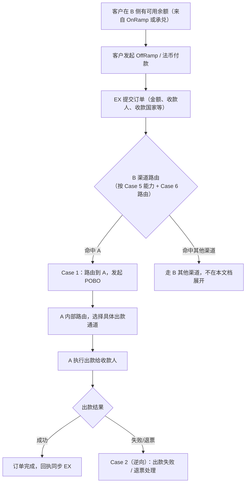
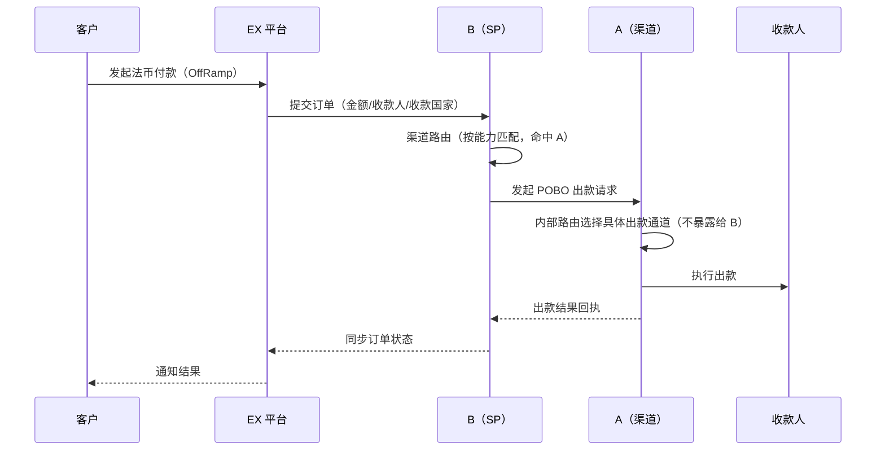
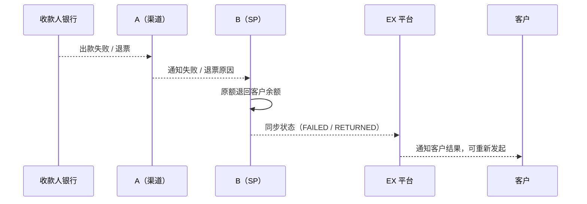

# AB 互通方案 · OffRamp（法币付款 · POBO）

> **文档类型**：产品方案（OffRamp）
> **关联文档**：`AB互通-总览与待办.md`、`AB互通-入网方案.md`（前置：客户须已在 A 完成入网）、`AB互通-OnRamp方案.md`（余额来源）
> **范围**：定义客户使用 A 作为付款渠道时的 **法币付款（POBO）** 正向流程，以及出款失败 / 退票的逆向流程。

---

## 一、背景

- A 开给 B 的付款能力对 B **没有能力范围限制**：B 只需给到 **具体收款国家清单**，A 内部自行路由到具体出款通道（见 `AB互通-入网方案.md` Case 2）。
- B 侧需将「A」纳入现有 **渠道能力（Case 5）+ 渠道路由（Case 6）** 框架，与 B 现有其他渠道（如 Cregis、B 其他渠道）并列，由路由规则决定何时命中 A。

---

## 二、整体流程图

---

## 三、Case 1：标准 POBO 出款

**前置条件：**

- 客户已完成 A 入网，且 B 侧「A · 付款」渠道能力已配置（支持国家清单等）；
- 客户在 B 侧有可用余额（来自 OnRamp 或数币承兑）；
- 客户已添加收款人（经 EX 审核）。

**业务规则：**

1. 客户发起一笔法币付款，EX 提交订单（金额、收款人信息、收款国家等）到 B；
2. B 按 **渠道路由**（Case 6：按订单要素匹配 Case 5 渠道能力）判断是否命中「A」；
   - 命中依据主要是 **收款国家是否在 A 支持清单内**（其余维度如限额、账户要求按 Case 5 通用维度校验）；
3. 命中后，B 向 A 发起 **POBO 出款请求**；
4. **A 内部路由不暴露给 B**：A 自行选择内部具体出款通道执行付款；
5. A 出款完成后回传结果（成功 / 失败），B 同步更新订单状态并回传 EX。

**时序图：**

**验收标准：**

- 渠道路由命中「A」的判定 **仅依赖 B 侧维护的支持国家清单**（及通用限额/账户要求维度），不依赖 A 内部通道信息；
- POBO 请求与出款结果状态机正确流转（待出款 → 出款中 → 成功/失败）；
- A 内部路由变化（如新增/切换内部通道）**不影响 B 侧接口与路由逻辑**（黑盒原则）。

---

## 四、Case 2（逆向）：出款失败 / 退票处理

**前置条件：**

- POBO 出款已发起，但收到失败或退票回执。

**业务规则：**

1. **出款失败（未成功出款）**：A 回执失败原因，B 置订单失败，**资金原路退回客户在 B 的余额**（不做反向承兑，若涉及数币承兑环节，遵循现有「不做反向承兑」原则）；
2. **退票（已出款后被银行退回）**：A 通知 B 退票，B **原额退回客户余额**，并同步 EX 更新状态为 `RETURNED`；
3. 失败 / 退票后，客户可 **重新发起出款**（换收款人 / 等待渠道恢复），系统需保证 **幂等**，不重复出款；
4. 出款超时无终态时，进入 **待核查**，由查询接口兜底拉取终态，超过 SLA 转人工核查。

**时序图：**

**验收标准：**

- 失败与退票两种场景的资金退回、状态同步均正确；
- 重新发起出款具备幂等保护，不重复扣款/出款；
- 超时无终态场景有兜底查询机制，避免状态悬空。

---

## 五、待办 / 待确认

| 编号 | 事项 | 类型 |
| --- | --- | --- |
| 1 | B 侧「A · 付款」渠道能力具体维护哪些维度（是否只需支持国家清单，还是也需限额/账户要求等） | 待确认 |
| 2 | 与 B 现有其他渠道命中同一能力组合时的优先级排序（本期是否仍是「一能力对一渠道」） | 待确认（参考 Case 6 现有口径） |
| 3 | 出款失败 / 退票的费用归属（是否收取出款费、失败是否退费） | 待定义 |
| 4 | A 出款 SLA（到账时效）与超时判定阈值 | 待确认 |
| 5 | 是否支持指定商户名义出款（POBO 具名要求） | 待确认 |
