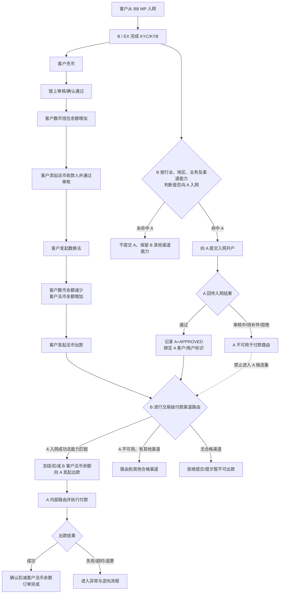
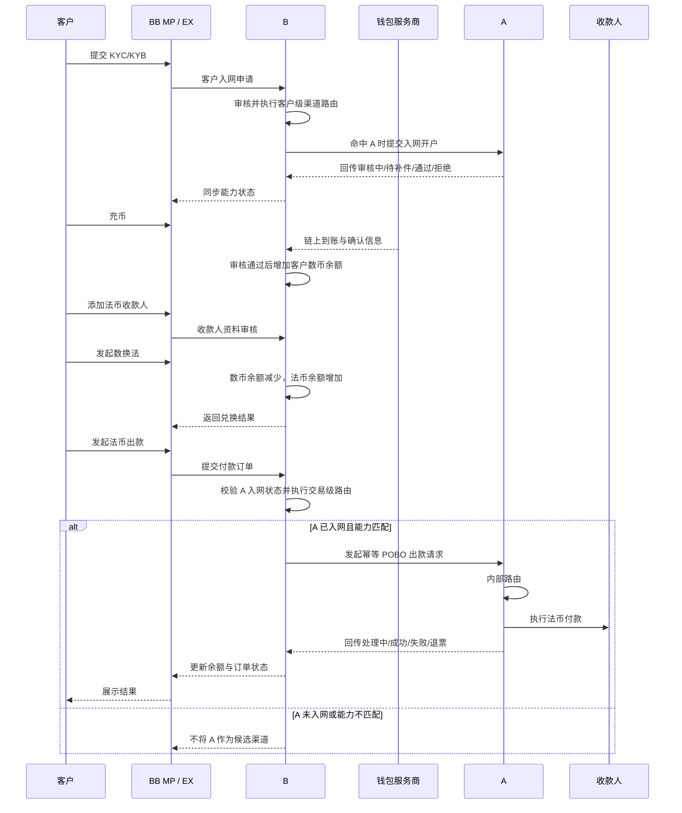

# AB 互通方案 · OffRamp（数币承兑与法币付款）

> **文档状态**：待业务、产品、财务、风控合规、法务评审
> **需求主体**：B（BB）
> **适用范围**：从 BB MP 入网、由 B 提供数币钱包与承兑服务、路由至 A 完成法币出款的 B2B 客户
> **系统边界**：本文覆盖客户资格、A 入网状态、收款人、数换法、付款渠道路由、B/A 账务、备付资金调拨、出款及逆向；不定义 B 定期兑换的成交机制、SGB 与 A 的具体调拨银行路径，也不替代双方牌照、主体和资金安排的法律意见
> **核心原则**：**A 是 B 的付款渠道；只有已在 A 入网成功且 A 付款能力可用的客户，才允许路由到 A。A 入网未成功时，不得以任何默认、兜底或人工方式绕过该限制。**

---

## 一、背景与目标

### 1.1 背景

客户从 BB MP 完成 KYC/KYB，审核通过后，B 根据客户行业、国家/地区及渠道能力进行入网路由；命中 A 的客户由 B 推送至 A 入网开户，并接收 A 的开户结果。

客户入网 B 后可充值数币、维护法币收款人，并在 B 完成数币兑换法币。法币出款阶段，B 再进行一次交易级渠道路由；若客户已在 A 入网成功、A 能力匹配且交易校验通过，则可选 A 执行付款，否则不得路由到 A。

### 1.2 产品目标

1. 在 BB MP 内为客户提供“充币—数换法—法币出款”的完整 OffRamp 服务。
2. 将 **A 客户入网状态**设为 A 付款渠道的强制准入条件。
3. 将客户余额账、B/A 渠道资金账及实际资金调拨分层，确保订单、账务和资金可核对。
4. 支持 A 异步出款、失败、超时、退票等状态，并避免重复扣款、重复出款。
5. 明确 BB SRO、BB MSB、A MSO，以及未来 A MPI 的合作主体问题，评审确认前不固化为合规结论。

### 1.3 非目标

- 本期不覆盖 B2C、C2B、C2C。
- 本期不向 B 暴露 A 内部的具体银行或付款通道路由。
- 本期不支持 A 入网失败后通过人工强制选择 A。
- 本期不承诺客户余额对应资金逐笔实时调拨至 A；备付采用定期兑换、定期调拨，具体频率和阈值待财务确认。

---

## 二、参与方、账户与责任

| 参与方 / 对象 | 定位 | 本方案主要责任 |
| --- | --- | --- |
| 客户 | BB MP 的 B2B 客户 | 完成 KYC/KYB、充币、添加收款人、发起数换法与法币出款 |
| BB MP / EX | 客户入口及平台编排层 | 展示余额与订单；承接客户操作；编排 B、A 的入网和交易流程 |
| B | 数币钱包、承兑及付款渠道路由方 | 客户审核、数币记账、数换法、法币余额记账、收款人管理、选择付款渠道、订单及客户通知 |
| B 的钱包服务商 | 链上钱包基础设施 | 分配地址、监控链上到账、提供确认数和交易标识 |
| SGB | B 的法币兑换/资金承接方（具体法律角色待确认） | 按约定承接 B 的定期兑换，并按调拨指令向 A 补充出款资金 |
| A | B 的付款渠道 | 客户二次入网/开户、维护客户可用状态、内部付款路由、向收款人出款、回传结果 |
| 收款人 | 客户维护的法币付款对象 | 接收 A 支付的法币 |

### 2.1 关键账户/余额

| 账户 / 余额 | 账务归属 | 变化场景 | 说明 |
| --- | --- | --- | --- |
| 客户数币钱包余额 | B 客户账 | 充币增加；数换法扣减 | 以链上确认及 B 钱包账为依据 |
| 客户法币余额 | B 客户账 | 数换法增加；法币出款扣减/冻结；失败或退票恢复 | 是 B 对客展示和交易控制余额，不等同于客户在 A 的银行存款 |
| B 的法币备付/渠道余额 | B 内部账 | 数换法形成负债、SGB 兑换、向 A 调拨 | 需与客户法币余额和在途资金对账 |
| A 侧 B 的渠道资金余额 | A 渠道账（归属结构待法务确认） | SGB 调拨增加；A 出款及费用扣减 | 用于 A 执行付款，不应直接视作客户在 A 的可提现余额 |

> 账务口径说明：用户原始描述中的“客户在 B 的法币余额减少，A 的法币余额增加”在产品账务上拆为两层：客户发起出款时，B 冻结/扣减客户法币余额；A 侧可出款资金由 SGB 定期调拨形成。两者原则上通过清算与对账关联，不要求每笔客户出款都同步生成一笔等额跨主体资金划转。

---

## 三、端到端前置条件

### 3.1 能力前置

1. A 已向 B 开放付款能力，B 已将 A 配置为付款渠道。
2. B 已配置 A 的支持国家/地区、币种、付款方式、限额、收款人账户要求、服务状态等渠道能力。
3. A 内部实际出款通道由 A 自行维护，B 只将订单路由到 A，不感知 A 内部通道。

### 3.2 客户前置

1. 客户从 BB MP 提交 KYC/KYB，并已通过 B/EX 审核。
2. B 根据客户行业、注册地、业务国家、交易场景及渠道能力判断是否向 A 发起入网。
3. A 回传明确的客户入网结果，并在 B 侧形成可查询、可审计的 A 入网状态。
4. 客户已有足额数币或法币可用余额，并已添加且审核通过法币收款人。

### 3.3 路由硬约束

同时满足以下条件时，A 才能进入候选渠道集：

- `A_ONBOARDING_STATUS = APPROVED`；
- A 返回的客户/账户标识已与 B 客户唯一绑定；
- `A_PAYMENT_CAPABILITY_STATUS = ENABLED`；
- 客户、收款人、国家/地区、币种、付款方式、金额及行业均命中 A 能力；
- A 侧渠道服务状态正常，B 侧未熔断；
- 交易级风控与余额校验通过。

出现以下任一情况，A 必须从候选渠道中剔除：

- 未向 A 提交、审核中、待补件、拒绝、已关闭、已冻结或状态未知；
- A 客户标识缺失、绑定失败或不一致；
- A 能力已暂停/下线，或交易超出支持范围；
- 客户/收款人/交易命中禁止或人工审核规则。

若剔除 A 后还有其他合格渠道，可按 B 的通用路由规则选择其他渠道；若无合格渠道，则阻止提交并给出可理解的失败原因。**不得先路由 A、待 A 拒绝后再把入网校验当作补充校验。**

---

## 四、端到端业务流程

---

## 五、分阶段业务规则

### 5.1 客户入网与 A 开户

1. 客户从 BB MP 申请入网并提交 KYC/KYB。
2. B/EX 审核通过后，根据客户行业、国家/地区、业务模式及渠道能力执行客户级路由。
3. 命中 A 时，B 向 A 提交客户入网；A 可返回审核中、待补件、通过、拒绝等结果。
4. A 入网通过后，B 保存 A 客户号/账户号、主体、能力范围、生效时间及结果版本。
5. A 入网结果变化时，A 应主动回调；B 同时提供定时查询兜底，避免状态长期未知。
6. A 入网未成功不影响客户在 B 使用其余已开放能力，但影响 A 是否能成为其付款渠道。

### 5.2 客户充币

1. B 的钱包服务商提供充值地址并监控链上交易。
2. 充值交易达到 B 配置的确认数，并通过地址、币种、链、制裁/风险地址等审核后，B 增加客户数币钱包余额。
3. 币种/链不支持、少于最小入账金额、交易风险待审或链上重组时，不得直接增加可用余额。
4. 充值订单必须保存链上 `tx_hash`、链、币种、金额、地址、确认数、风险结论及入账流水号。

### 5.3 添加法币收款人

1. 客户提交收款人类型、名称、国家/地区、银行账户、银行代码、地址、与客户关系及付款用途等信息。
2. B 完成字段校验、重复性校验、名单筛查及必要的证明材料审核。
3. 收款人状态为 `APPROVED` 才可用于创建出款；审核中、拒绝、冻结或已删除均不可用。
4. 收款人关键字段修改后必须重新审核；出款订单保存收款人不可变快照，避免历史订单随主数据变化。

### 5.4 数币兑换法币

1. 客户选择数币、法币、兑换金额并获取报价。
2. B 校验数币可用余额、报价有效期、限额及交易风控。
3. 客户确认后，B 原子化完成：
   - 扣减客户数币可用余额；
   - 增加客户法币余额；
   - 记录汇率、费用、数币金额、法币金额和报价编号。
4. 若任一步失败，整笔兑换不得出现单边入账；状态未知时先冻结相关金额并进入核查。
5. B 定期将汇总后的数币敞口与 SGB 兑换；该机构级兑换不改变已完成的客户兑换结果，但必须纳入敞口、限额和对账管理。

### 5.5 法币出款与渠道路由

1. 客户选择已审核收款人，输入金额、币种、用途并提交。
2. B 先校验法币可用余额、收款人状态、单笔/日/月限额及交易风控。
3. B 生成候选渠道时先进行客户资格过滤，再按国家/地区、币种、方式、金额、成本、成功率、可用性和优先级排序。
4. A 入网状态不是评分项，而是准入项：只有 `APPROVED` 才可进入 A 候选集。
5. 命中 A 后，B 冻结客户法币余额，创建出款订单并向 A 发起一次具有幂等键的付款请求。
6. A 验证 B、客户标识、收款人和订单信息后，在 A 内部选择具体付款通道。
7. A 接单后，B 将客户余额由“可用”转为“出款冻结”；A 最终成功后转为“已扣减”。
8. 若 A 在受理前同步拒绝且确认未产生出款，B 解冻余额；是否自动改路由到其他渠道须按第十六节决策，未确认前默认不自动改路由。

---

## 六、信息流

---

## 七、资金流与流动性管理

### 7.1 目标资金流

### 7.2 资金规则

1. 客户充币实际进入 B 的钱包服务商控制或托管的钱包；B 根据链上确认结果给客户记数币余额。
2. 客户数换法是 B 对客账务动作；B 定期与 SGB 做机构级兑换，二者可以非逐笔对应，但必须可按结算批次核对。
3. SGB 定期向 A 调拨法币，为 A 出款账户补充流动性。
4. A 收到 B 的付款指令后，从约定的出款资金账户扣减法币并支付给收款人。
5. A 可用余额不足时，A 不应先行透支出款；B 应停止/降级 A 路由并触发补资预警。
6. B 应维护最低备付线、预警线、停止路由线及预计出款需求。具体金额、频率和责任人由财务/资金团队确认。
7. 客户账、机构兑换、SGB→A 调拨及 A 实际出款分别记账，通过订单号、批次号和资金流水号关联，不得用单一余额替代全链路账务。

### 7.3 账务分录（产品口径）

| 业务事件 | 客户数币余额 | 客户法币余额 | A 侧渠道资金 | 订单/备注 |
| --- | ---: | ---: | ---: | --- |
| 充币审核通过 | 增加 | 不变 | 不变 | 记录链上交易 |
| 数换法成功 | 减少 | 增加 | 不变 | 记录报价、汇率和费用 |
| SGB 调拨至 A | 不变 | 不变 | 增加 | 机构资金调拨，不改变客户余额 |
| 客户提交出款且 A 接单 | 不变 | 可用减少、冻结增加 | 暂不确认扣减 | 防重复消费 |
| A 出款成功 | 不变 | 冻结减少并确认扣减 | 减少 | 订单成功 |
| A 明确失败且未出款 | 不变 | 冻结释放、可用恢复 | 不变或按 A 实际回退 | 订单失败 |
| A 出款后退票 | 不变 | 待 A 退回资金确认后恢复 | 退回后增加 | 订单退票；费用规则待定 |

> “失败/退票原额恢复”需以资金是否实际退回、费用是否退还为前提。未确认费用规则前，产品不得承诺无条件原额到账。

---

## 八、渠道路由设计

### 8.1 两次路由

| 路由阶段 | 目的 | 核心输入 | 输出 |
| --- | --- | --- | --- |
| 客户级入网路由 | 判断是否需要把客户推送至 A 入网 | 客户主体、行业、注册地、业务国家、产品需求、A 准入规则 | 是否提交 A 入网 |
| 交易级付款路由 | 为具体付款选择可执行渠道 | A 入网状态、能力状态、收款国家、币种、方式、金额、收款人、成本、成功率、流动性 | A / 其他渠道 / 无可用渠道 |

### 8.2 路由顺序

1. 客户与收款人资格过滤。
2. 渠道客户入网状态过滤。
3. 渠道能力与交易要素过滤。
4. 渠道实时可用性、流动性及熔断过滤。
5. 对剩余候选渠道按 B 规则排序并选定。
6. 创建订单后固化渠道选择和路由快照；未经明确的失败改路由规则，不得静默切换。

### 8.3 路由审计

每次路由至少保存：客户号、订单号、候选渠道、每个渠道的淘汰原因、最终渠道、A 入网状态及版本、能力版本、规则版本、人工干预记录和时间戳。

---

## 九、状态设计

### 9.1 A 入网状态

| 状态 | 进入条件 | 是否可路由 A | 退出条件 |
| --- | --- | --- | --- |
| `NOT_SUBMITTED` | 尚未向 A 提交 | 否 | 提交后进入审核中 |
| `UNDER_REVIEW` | A 已受理 | 否 | A 返回补件/通过/拒绝 |
| `RFI_REQUIRED` | A 要求补件 | 否 | 补件重提或超时关闭 |
| `APPROVED` | A 审核通过且标识绑定成功 | 是，仍需交易级校验 | A 冻结、关闭或资料到期 |
| `REJECTED` | A 审核拒绝 | 否 | 重新申请并被 A 受理 |
| `SUSPENDED` | A 暂停客户能力 | 否 | A 恢复或关闭 |
| `CLOSED` | A 账户/关系关闭 | 否 | 原则上终态；重新开户形成新记录 |
| `UNKNOWN` | 回调/查询不一致或无法确认 | 否 | 对账或人工核查确认 |

### 9.2 收款人状态

`DRAFT → UNDER_REVIEW → APPROVED / REJECTED`；已通过收款人可因资料修改、风险事件进入 `SUSPENDED`，暂停期间不可创建新订单。

### 9.3 出款订单状态

| 状态 | 含义 | 客户余额处理 | 可执行动作 |
| --- | --- | --- | --- |
| `CREATED` | 订单已创建，尚未提交渠道 | 未冻结或短时预占 | 校验、取消 |
| `ROUTING` | 正在筛选渠道 | 预占 | 选定渠道或失败 |
| `SUBMITTED` | 已向 A 提交，接单结果待确认 | 冻结 | 查询，不可重复提交 |
| `PROCESSING` | A 已受理并出款中 | 冻结 | 查询、等待回调 |
| `SUCCEEDED` | A 确认出款成功 | 确认扣减 | 只读、对账 |
| `FAILED` | A 确认未出款且失败 | 解冻/恢复（扣除规则待定） | 可新建订单 |
| `PENDING_REVIEW` | 超时或结果不一致 | 继续冻结 | 查询、人工核查 |
| `RETURNED` | 成功后发生退票且 A 已确认退回 | 按到账与费用规则恢复 | 通知、可新建订单 |
| `CANCELLED` | 提交 A 前取消 | 释放预占 | 只读 |

终态回调不得倒退；`SUCCEEDED` 后只能通过独立退票事件进入 `RETURNED`，不得直接改成 `FAILED`。

---

## 十、核心字段及校验规则

| 字段 | 必填 | 来源/类型 | 校验规则 | 可见范围 | 备注 |
| --- | --- | --- | --- | --- | --- |
| `customer_id` | 是 | B | 全局唯一 | B/A（映射后） | 不直接使用可变业务名称 |
| `a_customer_id` | 路由 A 时是 | A | 必须与客户及 A 主体绑定 | B/A | 缺失不得路由 A |
| `a_onboarding_status` | 是 | A 回调/查询 | 仅 `APPROVED` 可路由 | B 内部 | 保存状态版本和更新时间 |
| `beneficiary_id` | 是 | B | 状态必须为 `APPROVED` | 客户/B | 订单另存快照 |
| `beneficiary_snapshot` | 是 | B | 创建订单后不可变 | B/A/审计 | 敏感字段脱敏展示 |
| `source_currency` | 是 | B | 本期支持清单内数币 | 客户/B | 用于数换法 |
| `payout_currency` | 是 | B | A 能力支持 | 客户/B/A | 与收款国家组合校验 |
| `payout_amount` | 是 | 客户 | 大于 0，满足余额和限额 | 客户/B/A | 明确是否含费 |
| `purpose_code` | 是 | 客户/B | 枚举且与证明材料一致 | B/A | A 要求决定是否附材料 |
| `channel_id` | 是 | B 路由 | A 或其他合格渠道 | B 内部/A | 订单创建后固化 |
| `route_snapshot` | 是 | B | 包含规则、能力及入网状态版本 | B/审计 | 不对客展示内部策略 |
| `idempotency_key` | 是 | B | 同一业务订单全局唯一 | B/A | 重试必须复用 |
| `a_payout_id` | A 受理后是 | A | A 侧唯一 | B/A | 查询及对账依据 |
| `ledger_entry_ids` | 是 | B | 可关联数币/法币/冻结流水 | B/审计 | 禁止只改余额不记流水 |
| `funding_batch_id` | 关联时是 | B/SGB/A | 唯一且可对账 | B/SGB/A | 机构调拨批次 |

---

## 十一、接口与数据要求

| 接口 | 方向 | 核心要求 |
| --- | --- | --- |
| A 客户入网提交 | B → A | 幂等；带 B 客户号、主体、资料版本；返回 A 申请号 |
| A 入网结果回调/查询 | A → B / B → A | 支持审核中、补件、通过、拒绝、冻结、关闭；回调验签和去重 |
| A 能力同步 | A → B 或运营配置 | 支持国家、币种、方式、限额、账户要求、服务状态及生效时间 |
| A 出款创建 | B → A | 幂等键、A 客户标识、收款人快照、金额、币种、用途、业务订单号 |
| A 出款结果回调 | A → B | 事件唯一号、A 出款号、状态、原因码、发生时间；重复回调不得重复记账 |
| A 出款查询 | B → A | 超时兜底；按 B 订单号或 A 出款号查询唯一结果 |
| SGB→A 调拨通知/对账 | SGB/A → B | 批次、金额、币种、到账时间、银行流水号及差异状态 |

通用要求：

- 双方采用约定的鉴权、签名、防重放和 IP/证书策略。
- 所有金额字段使用明确精度和币种，不使用浮点计算。
- 请求超时不等于失败；未确认 A 未受理前不得换幂等键重发。
- 回调按事件 ID 去重，乱序回调按状态机和事件时间处理。
- 客户、收款人、路由、汇率、费用和渠道能力均保存交易时快照。
- 日志不得明文记录完整银行账号、证件号、密钥等敏感信息。

---

## 十二、风险、合规与权限

### 12.1 客户与交易分层审核

- 客户级：B 完成 KYC/KYB；命中 A 时由 A 按其政策再次入网。A 通过不替代 B 的持续尽调，B 通过也不代表 A 必须准入。
- 交易级：每笔数换法与出款均需进行制裁/名单、国家、行业、金额、频率、收款人关系、用途及异常行为检查。
- 资料或资质到期、客户信息重大变更、A 能力冻结、风险等级升级时，应触发重新审核并即时影响后续路由。

### 12.2 权限

- 客户只能操作本主体钱包、余额、收款人和订单。
- B 运营可查询订单和非敏感路由结论，不得修改 A 入网结果。
- B 风控/合规可审核客户、收款人和交易，并执行暂停；敏感拒绝原因按权限展示。
- 财务/资金可管理 SGB 兑换及 A 调拨，不得修改客户 KYC/KYB 结论。
- 人工补单、解冻、余额调整必须双人复核并保留调整前后值、原因和凭证。

### 12.3 需要法务/合规确认的事项

本文不预设以下结论：谁向终端客户提供法币付款服务；A 侧渠道资金的法律所有权；BB SRO 是否可以给 BB MSB 提供服务；跨主体、跨牌照区域的客户数据、订单和资金如何传递。相关安排必须经双方合规、法务、财务确认并与合同、隐私告知、账务和系统权限一致。

---

## 十三、异常与逆向流程

| 场景 | 系统处理 | 余额处理 | 后续动作 |
| --- | --- | --- | --- |
| A 入网审核中/待补件/拒绝 | A 不进入候选渠道 | 不扣款 | 可继续补件或选择其他合格渠道 |
| A 入网状态未知 | 按不可用处理 | 不扣款 | 查询 A；超时人工核查 |
| 余额不足/收款人不可用 | 拒绝创建出款 | 不扣款 | 客户补足余额或更新收款人 |
| A 能力下线/流动性不足 | 路由阶段剔除 A并熔断 | 不扣款 | 补资或选择其他渠道 |
| A 同步拒绝且确认未受理 | 订单失败 | 解冻 | 客户重试；是否自动改路由待决 |
| 请求超时、A 是否受理未知 | 进入 `PENDING_REVIEW` | 继续冻结 | 使用原幂等键查询，不得直接重发新单 |
| A 异步出款失败 | 记录失败原因 | 确认未出款后解冻/恢复 | 通知客户，可新建订单 |
| A 出款成功后退票 | 建立独立退票事件 | A 资金实际退回后按费用规则恢复 | 更新 `RETURNED`，通知客户 |
| 重复请求/重复回调 | 返回原结果/丢弃重复事件 | 不重复记账 | 记录幂等命中 |
| B 与 A 状态不一致 | 停止自动记账并告警 | 保持冻结或差错账 | 对账及人工裁决 |
| SGB 调拨未到账 | 降低/停止 A 路由 | 不影响既有客户账；限制新出款 | 资金团队追踪 |

### 13.1 失败与退票原则

1. “出款失败”必须确认 A 未成功支付，才可恢复客户法币可用余额。
2. “退票”是成功后的独立资金事件，必须以 A 确认收到退回资金为恢复余额的依据。
3. 失败费、渠道费、汇兑损益及退票费是否退还均待定；对客金额以最终费率规则为准。
4. 任何人工改状态不得直接替代账务流水或 A 的资金证明。

---

## 十四、对账、审计与非功能要求

### 14.1 对账

- 每日核对 B 客户法币总账与明细账。
- 每日核对 B 出款订单与 A 出款订单、状态、金额、费用。
- 按批次核对 B/SGB 兑换及 SGB→A 调拨。
- 核对 A 期初余额 + 入金 - 出款 - 费用 + 退回 = A 期末余额。
- 差异订单进入差错队列，在关闭前不得通过直接改余额抹平。

### 14.2 审计

必须记录客户入网状态变更、A 回调原文摘要、能力配置变更、路由决策、余额流水、人工操作、SGB/A 调拨及对账差异。审计记录不可被业务用户删除。

### 14.3 非功能

- 出款创建、回调和查询需支持幂等与水平扩展。
- A 接口不可用时触发告警和熔断，不持续放大重试。
- 关键状态和资金指标需监控：A 可用余额、入网成功率、路由命中率、出款成功率、超时率、退票率和对账差异。
- SLA、重试频率、数据留存期限、灾备目标由双方技术及合规评审确定。

---

## 十五、验收标准

1. 客户在 BB MP 的 KYC/KYB 通过后，系统可按行业、国家/地区及渠道能力决定是否向 A 提交入网。
2. A 入网结果可回传并形成完整状态；只有 `APPROVED` 且标识绑定成功的客户能进入 A 付款候选集。
3. A 为审核中、待补件、拒绝、冻结、关闭或未知时，系统均无法通过自动或人工路由把订单提交给 A。
4. 充币审核通过后增加客户数币余额；未通过或确认数不足时不增加可用余额。
5. 数换法成功时数币余额减少、法币余额增加，且双边流水原子一致；失败时不出现单边记账。
6. 只有审核通过的收款人可用于出款，订单保存不可变收款人快照。
7. 法币出款时先冻结客户法币余额，A 成功后确认扣减，确认未出款失败后释放；同一订单不重复扣款、不重复出款。
8. 请求超时进入待核查并使用原幂等键查询，在结果未知期间不改路由、不解冻。
9. A 成功后的退票通过独立事件处理，收到退回资金后按已确认的费用规则恢复余额。
10. SGB→A 调拨可按批次对账；A 流动性低于停止线时，A 自动退出新订单路由。
11. 每笔订单可追溯 A 入网状态版本、能力版本、候选渠道淘汰原因、最终渠道、账务流水及 A 回执。
12. B、A、SGB 之间的订单和资金差异可进入差错队列，并具有处理人、凭证和关闭记录。

---

## 十六、主体合作架构与待决策

### 16.1 当前建议基线（待法务/合规批准）

一期先按以下结构做产品和技术评估：

- 对终端客户：由实际承接数币钱包与承兑服务的 **BB 持牌主体（暂称 BB SRO）**服务客户；
- 对付款渠道：由 **A MSO** 向与其签约且完成准入的 B 主体开放付款能力；
- 对渠道合作：一期优先保持 **BB SRO ↔ A MSO** 的合作链路，避免同一条交易在未定义的情况下跨至 BB MSB；
- 若 BB MSB 需要使用 A 能力，不默认复用 BB SRO 的合同、客户入网或资金账户，应作为新的“服务主体—渠道主体”组合单独准入和配置；
- **A MPI** 作为后续新渠道主体评估，不纳入一期承诺。

以上仅为减少一期复杂度的产品建议，不构成牌照、监管或合同结论。

### 16.2 多主体扩展模型

系统不应把“A 渠道”只配置成一个全局对象，而应至少以以下组合管理：

`服务主体（B entity） × 渠道法律主体（A entity） × 客户 × 能力 × 国家/地区 × 币种`

例如：

- BB SRO × A MSO；
- BB MSB × A MSO（若未来合规及合同允许）；
- BB SRO × A MPI（后期评估）；
- BB MSB × A MPI（后期评估）。

不同组合应独立维护合同状态、客户入网状态、能力范围、资金账户、限额、费率、结算币种及路由优先级，禁止因“都属于 BB/A 集团”而自动共享。

### 16.3 必须决策的问题

| 编号 | 待决策事项 | 建议 Owner | 对产品/系统的影响 |
| --- | --- | --- | --- |
| D1 | A 付款能力具体开放给 BB SRO、BB MSB，还是两者分别开放 | A/B 合规、法务、商务 | 决定合同、入网、渠道配置和订单主体 |
| D2 | BB SRO 能否及以何种法律关系向 BB MSB 提供服务 | B 合规、法务 | 决定是否允许跨 B 主体路由、数据与资金流 |
| D3 | 终端客户分别与谁签约，谁承担数换法及法币付款的对客义务 | A/B 合规、法务 | 决定协议、对客披露、账务负债和投诉责任 |
| D4 | SGB 的法律角色、兑换相对方及调拨至 A 的付款主体 | B 财务、法务、合规 | 决定资金流证明、对账、三流一致性 |
| D5 | A 侧出款资金账户的户名、所有权、是否可混用及备付要求 | A/B 财务、合规 | 决定余额口径、流动性及资金隔离 |
| D6 | A MSO 支持的国家、币种、付款方式和客户行业边界 | A 产品、合规 | 决定渠道能力矩阵 |
| D7 | 是否以及何时接入 A MPI | A/B 战略、合规、产品 | 需新增渠道法律主体、合同、入网与资金配置 |
| D8 | A 不可用时是否允许自动切换其他渠道 | B 产品、风控、合规 | 决定客户授权、路由状态机和防重复出款 |
| D9 | 失败、退票、汇兑损益和各类费用的承担及退还规则 | A/B 商务、财务 | 决定对客金额、逆向账务和协议 |
| D10 | 定期兑换/调拨频率、预警线、停止线及节假日安排 | B/SGB/A 财务 | 决定 A 流动性与路由可用性 |

---

## 十七、分期建议

### 一期：BB SRO × A MSO

- B2B 客户；
- 客户级 A 入网与状态回传；
- 充币、收款人、数换法、法币余额；
- A 作为付款渠道的强准入路由；
- SGB 定期调拨 A；
- 标准出款、失败、超时、退票和对账；
- 不自动跨渠道重路由。

### 二期：多渠道与自动化资金管理

- 在客户授权、风控和幂等方案确认后支持失败前/受理前的自动改路由；
- 动态流动性阈值、预测补资和渠道成本/成功率路由；
- 扩展其他 B 主体或 A 法律主体。

### 后续评估

- BB MSB 与 A MSO 的独立合作；
- A MPI 付款能力；
- B2C、C2B、C2C 及更多国家/币种。

---

## 十八、关联文档

- [AB互通-总览与待办.md](./AB互通-总览与待办.md)
- [AB互通-入网方案.md](./AB互通-入网方案.md)
- [AB互通-OnRamp方案.md](./AB互通-OnRamp方案.md)
