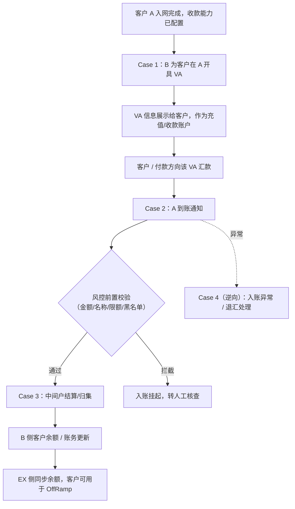
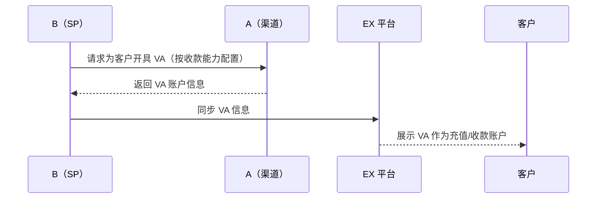
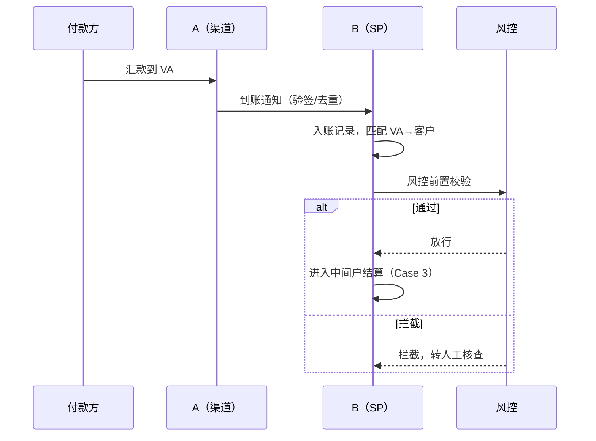
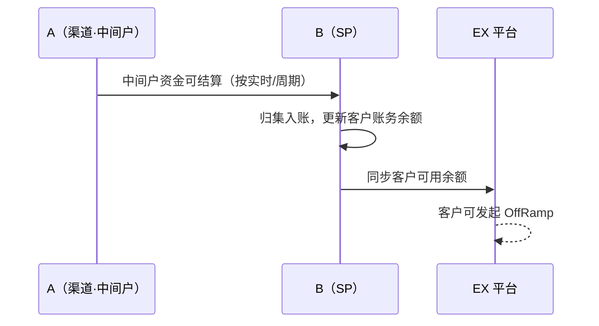
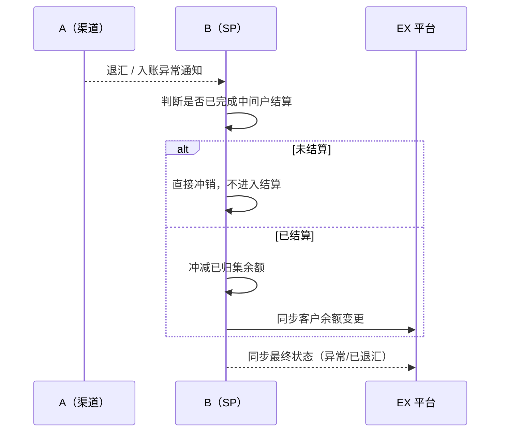

# AB 互通方案 · OnRamp（法币充值 / 收款）

> **文档类型**：产品方案（OnRamp）
> **关联文档**：`AB互通-总览与待办.md`、`AB互通-入网方案.md`（前置：客户须已在 A 完成入网）、`AB互通-OffRamp方案.md`
> **范围**：定义客户完成 A 入网后，**开 VA → 入账 → 中间户结算** 的正向流程，以及入账异常 / 退汇的逆向流程。

---

## 一、背景

- 本方案覆盖 A 开给 B 的 **法币充值 / 法币收款** 能力；资金落地模式为 **中间户模式**：客户的法币先入 A 侧的 VA，A 内部先落 **中间户**，再结算/归集给 B（或直接体现为客户在 EX 侧的余额）。
- **前置条件**：客户已按 `AB互通-入网方案.md` 完成 A 侧入网，且 B 已为该客户/该能力完成收款渠道能力配置。

---

## 二、整体流程图

---

## 三、Case 1：开 VA

**前置条件：**

- 客户已完成 A 侧入网审核通过；
- B 已在渠道能力模块中为「A」维护好收款能力（收款国家、方式等，见入网方案 Case 3）。

**业务规则：**

1. B 按客户的收款需求（币种/国家/收款方式）向 A 发起 **开 VA 请求**；
2. A 返回 VA 账户信息（账号、开户行信息、收款人名称等）；
3. B 将 VA 信息同步给 EX，展示给客户作为「充值 / 收款账户」；
4. VA 与客户的绑定关系需 **唯一且可追溯**（一个客户对应的 VA 需能反查到客户主体，用于后续入账匹配）。

**时序图：**

**验收标准：**

- VA 开具成功后，客户/EX 侧能正确展示账户信息；
- VA-客户绑定关系可追溯，用于入账自动匹配；
- 开 VA 失败（如渠道限额/资料不全）有明确失败原因回传。

---

## 四、Case 2：入账与到账通知

**前置条件：**

- 客户 VA 已开具成功。

**业务规则：**

1. 客户或付款方向 VA 汇款，A 侧收到入账后 **主动通知 B**（到账通知）；
2. B 需 **验签、去重、幂等入账**，不得重复记账；
3. 入账信息需匹配 VA → 客户，若匹配失败（如金额与预期不符、汇款人信息异常）进入 **人工核查**；
4. 入账后触发 **风控前置校验**（金额限额、汇款人名称、黑名单等），通过后进入 Case 3 结算，未通过则挂起。

**时序图：**

**验收标准：**

- 到账通知验签、去重、幂等，不重复记账；
- 匹配失败 / 风控拦截均进入人工核查队列，不自动放行；
- 入账状态（待核查 / 已入账 / 已结算）流转清晰，可查询。

---

## 五、Case 3：中间户结算 / 归集

**前置条件：**

- 入账已通过风控前置校验。

**业务规则：**

1. 客户入账资金先落在 **A 侧的中间户**（而非直接落客户在 A 的独立账户）；
2. B 按结算规则（**实时 或 按周期，待确认**）将中间户资金结算/归集，体现为 **B 侧该客户的账务余额**；
3. 结算完成后，B 同步 EX，**客户在 EX 侧的可用余额更新**，可用于后续 OffRamp；
4. 结算/归集的对账维度（订单号、VA、金额、时间）需可与 A 对账勾兑。

**时序图：**

**验收标准：**

- 中间户资金结算规则明确（实时/周期，见待确认）；
- 结算后客户余额准确、可对账；
- 结算与入账、风控环节状态一致，无资金重复计入或漏计。

---

## 六、Case 4（逆向）：入账异常 / 退汇处理

**前置条件：**

- 入账已发生但触发异常（风控拦截 / 汇款人信息异常 / 金额与预期不符 / A 侧退汇）。

**业务规则：**

1. **风控拦截**：入账挂起，转人工核查，核查通过后补记入账，核查不通过按退汇处理；
2. **A 侧退汇**（如收款信息错误被银行退回）：A 通知 B 退汇，B 同步状态，**不做反向结算**（未进入中间户结算的部分直接冲销）；
3. 已完成中间户结算后发生的退汇（少见场景），需 **冲减已归集余额**，并同步 EX 客户余额；
4. 异常处理与状态需保留完整轨迹，便于对账和合规调单。

**时序图：**

**验收标准：**

- 未结算与已结算两种场景的冲销逻辑均正确，不影响客户其他余额；
- 异常状态、退汇状态可追溯，与 A 侧对账一致。

---

## 七、待办 / 待确认

| 编号 | 事项 | 类型 |
| --- | --- | --- |
| 1 | 中间户结算规则：实时结算 or 按周期（T+n） | 待确认 |
| 2 | VA 开具失败 / 限额不足时的降级或重试规则 | 待定义 |
| 3 | 入账匹配失败的人工核查 SLA 与处理流程 | 待定义 |
| 4 | 已结算后发生退汇的冲销与客户告知口径 | 待定义 |
| 5 | 与 A 的对账周期、对账文件格式与差异处理 | 待确认 |
