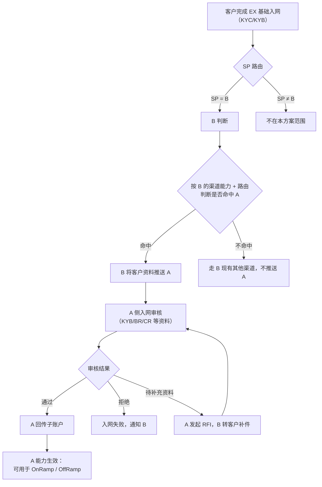
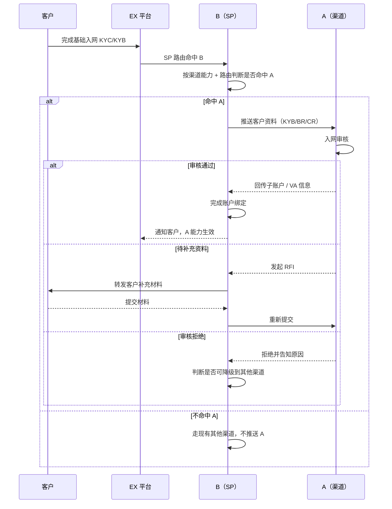

# AB 互通方案 · 入网

> **文档类型**：产品方案（入网）
> **关联文档**：`AB互通-总览与待办.md`（整体流程与待办）、`AB互通-OnRamp方案.md`、`AB互通-OffRamp方案.md`
> **参考范式**：`Gate渠道对接方案与改造点.md`（商户 KYB / 银行账户报备分离的范式）、`EX OffRamp解决方案.md` Case 5/6（渠道能力与渠道路由）
> **范围**：定义客户在 EX 完成基础入网后，**SP = B** 场景下，B 如何按渠道能力 + 路由，把客户推送到 A 完成入网，以及 A、B 双方为此需要建设的能力与前置条件。

---

## 一、背景

- 客户入网 EX 后，按 **SP 路由** 分配到具体服务提供方；本方案只覆盖 **SP = B** 的客户。
- B 侧新增渠道 A（法币充值 / 收款 / 付款）；**并非所有 SP=B 的客户都需要 A 的能力**——需要按 **B 的渠道能力 + 路由规则** 判断该客户是否命中 A，命中才推送客户到 A 完成入网。
- 入网是后续 OnRamp / OffRamp 使用 A 能力的前置条件：**A 入网未完成或未通过，客户不可使用 A 的任何能力**。

---

## 二、整体流程图

---

## 三、Case 1：SP=B 客户触发 A 入网推送

**前置条件：**

- 客户已在 EX 完成基础 KYC/KYB，SP 路由结果 = B；
- B、A 已完成商务签约，**双方合规政策已拉齐**（见第六节 / 待办 1）；
- B 已完成 A 的 **渠道基本信息与渠道能力配置**（参考 `EX OffRamp解决方案.md` Case 5）。

**业务规则：**

1. 客户完成 EX 基础入网后，触发 SP 路由；
2. **判断是否推送 A**：由 B 按 **渠道能力 + 路由规则** 判断——例如客户所在国家、需要的收款/付款方式是否命中 A 的能力矩阵；命中才推送，**不做全量推送**；
3. 推送内容：客户主体信息、KYB 资料（BR/CR 等，参考 Gate 报备范式：**商户身份与收款人银行账户报备分离**）；
4. A 侧审核结果分三类：**通过 / 拒绝 / 待补充资料（RFI）**；RFI 由 B 转发客户补件后重新提交，不落对客驳回态；
5. 审核通过后，A 回传子账户 / VA 相关标识，B 完成账户绑定，该客户的 A 能力生效；
6. **入网失败的降级规则待定**：是否允许客户直接走 B 现有其他渠道（见第五节待确认）。

**时序图：**

**验收标准：**

- 是否推送 A 的判定 **严格依据渠道能力 + 路由规则**，非命中客户不推送；
- 审核三态（通过 / 拒绝 / RFI）状态流转正确，RFI 不落对客驳回态；
- 审核通过后账户绑定成功，A 能力对该客户生效并可被 OnRamp / OffRamp 引用；
- 审核拒绝时，按降级规则决定是否转 B 其他渠道，状态与告知口径一致。

---

## 四、Case 2：A 开放能力给 B（先看 B2B）

**前置条件：**

- A、B 商务签约已完成，明确 **本次先落地 B2B 场景**；
- A 已梳理银行侧可支持的业务范围（收款国家 / 收款方式 / 限额 / 材料要求等）。

**业务规则：**

1. **收款能力开放**：
   - A 需要明确 **开放哪些收款能力给 B**；若选择「全开」，需要把 **银行能支持的业务范围与要求（收款国家、收款方式、限额、材料）与 B 拉齐**，避免 B 侧配置超出 A 实际能力；
   - 收款能力最终以 **渠道能力维护模型**（参考 Case 5：收款国家、收款方式、账户要求、限额等维度）落到 B 的渠道能力配置中。
2. **付款能力开放**：
   - 付款侧由 B 维护 A 对外开放的 **国家/地区、币种、付款方式、限额及账户要求**；客户只有在 A 入网成功后才可使用 A 的付款能力。**A 自己内部路由**（选择 A 内部的具体出款通道），B 不需要关心 A 内部渠道细节；
   - 即：付款方向对 B 而言是「黑盒」，B 只做「渠道选择 = A」这一层路由，A 内部如何路由不暴露给 B。

**验收标准：**

- B 侧渠道能力配置中的「A · 收款」维度 与 A 实际银行支持范围 **一致，无超范围配置**；
- B 侧渠道能力配置中的「A · 付款」维度维护 A 对外能力及客户入网准入状态，无需维护 A 内部通道细节；
- 后续 A 侧银行能力变化（如新增/下线某国家收款）时，有对应的同步机制更新 B 侧配置（见第六节待确认）。

---

## 五、Case 3：B 的渠道能力建设

**前置条件：**

- A 已按 Case 2 完成能力开放清单的输出。

**业务规则：**

1. **收款能力建设**：
   - B 依赖 A 放出的银行能力清单，在 B 的渠道能力模块中 **新增「A」这一渠道的收款能力**；
   - 收款能力最终服务于 OnRamp「开 VA」环节——B 据此决定为客户在 A 处 **开具 VA**（详见 `AB互通-OnRamp方案.md` Case 1）。
2. **付款能力建设**：
   - B 在渠道能力模块中新增「A」的付款能力，维护 **支持国家清单**、限额、账户要求等（复用现有 Case 5 渠道能力维护框架）；
   - 该能力用于 OffRamp 阶段的渠道路由（详见 `AB互通-OffRamp方案.md`）。

**验收标准：**

- 渠道能力模块中「A」渠道的收款 / 付款能力均可独立维护、独立生效；
- 渠道路由（Case 6）可正确按能力命中「A」，用于 OnRamp / OffRamp 场景。

---

## 六、前置与合规

- **双方合规政策拉齐**（待办 1，Owner：A/B 合规负责人）：在 Case 1 触发入网推送前必须完成，输出「合规差异清单」与「共同准入标准」，作为入网资料清单和审核标准的依据；
- **入网改造**（待办 2，Owner：佳琛）：EX / B 侧入网链路需要支持「按 SP + 渠道能力判断是否推送 A」的分支逻辑，且要支持 RFI 转发与重提。

---

## 七、待办 / 待确认

| 编号 | 事项                                                              | 类型       |
| ---- | ----------------------------------------------------------------- | ---------- |
| 1    | 双方合规政策拉齐的具体差异清单与共同准入标准                      | 待合规输出 |
| 2    | 入网推送 A 的判定规则字段（国家 / 收款方式 / 客户类型等）具体映射 | 待定义     |
| 3    | A 审核拒绝后是否允许降级到 B 其他渠道，降级规则与话术             | 待定义     |
| 4    | A 银行能力变更（新增/下线）后，B 侧渠道能力配置的同步机制         | 待定义     |
| 5    | B2C / C2B / C2C 场景的入网规则是否复用本方案                      | 待评估     |
