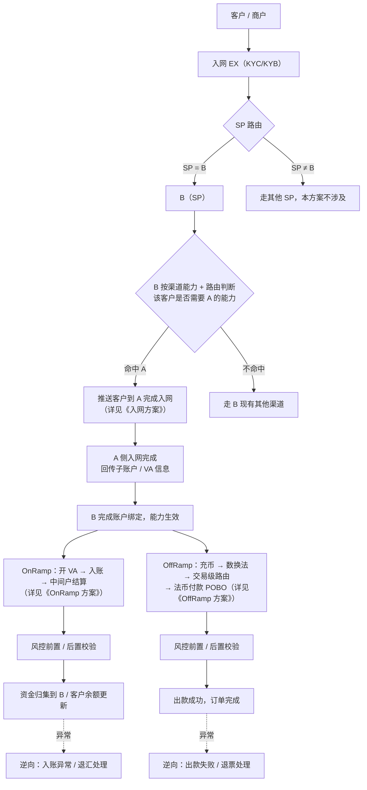

# AB 互通方案 · 总览与待办

> **文档类型**：产品方案（总览）
> **关联文档**：`AB互通-入网方案.md`、`AB互通-OnRamp方案.md`、`AB互通-OffRamp方案.md`
> **背景文档**：`EX OffRamp解决方案.md`（SP / 渠道分层模型、Case 5 渠道能力、Case 6 渠道路由）、`Gate渠道对接方案与改造点.md`（商户/收款人报备范式参考）
> **目的**：定义 **A 作为 B 的渠道** 这一互通方案的整体业务流程、拆分的三个子方案（入网 / OnRamp / OffRamp）范围，以及落地待办。

---

## 一、背景与目标

- 当前 A、B 均已是 EX 体系内可用的能力方；本方案要解决的是 **A 作为 B 的渠道** 接入 B 侧渠道体系，让 **SP = B** 的客户可以使用 A 的能力。
- **A 开给 B 的渠道能力**（本次范围）：
  1. **法币充值**（客户充值，OnRamp 侧的入账能力）
  2. **法币收款**（VA 收款能力）
  3. **法币付款**（POBO 出款能力）
- **资金模式**：
  - **OnRamp**：开 VA → 客户入账 → 入账后走 **中间户结算**（先落 A 的中间户，再结算/归集给 B）
  - **OffRamp**：客户充币并在 B 完成数换法后发起法币付款；B 仅可将 **已在 A 入网成功**且交易能力匹配的客户路由到 A 执行出款。机构资金侧由 B 定期通过 SGB 兑换，并由 SGB 定期向 A 调拨出款资金
- **先行范围**：**B2B** 场景优先落地，B2C / C2B / C2C 后续再评估。

---

## 二、角色与术语

| 角色 | 定义 |
| --- | --- |
| **EX** | 平台层，负责客户入网路由、订单编排、风控前置 |
| **B（SP）** | 本方案中的服务提供方（BB），本次新增渠道 A，向其 SP=B 的客户开放 A 的能力 |
| **A（渠道）** | 作为 B 的渠道方（银行/支付机构），提供 VA、入账、中间户结算、POBO 出款能力 |
| **客户 / 商户** | EX 上的终端商户，本方案限定 **SP = B** 的客户 |
| **中间户** | A 侧提供的资金归集/结算账户；客户入账后先落中间户，再结算/划转 |
| **SGB** | B 的法币兑换/资金承接方（具体法律角色待确认）；承接 B 的定期兑换，并定期向 A 调拨出款资金 |
| **渠道能力** | 参照 `EX OffRamp解决方案.md` Case 5 的渠道能力维护模型（收款国家、收款方式、限额、账户要求等） |
| **渠道路由** | 参照 Case 6，按能力维度筛选命中渠道 |

---

## 三、整体业务流程图

> **交易路径说明**：充值（OnRamp）与付款（OffRamp）路径分别设计，**均经 EX 中转编排**，且 **均需过风控**（前置资格校验 + 后置异常拦截）；不做「一步到位跳过 EX」的直连。

---

## 四、文档拆分与范围

| 文档 | 范围 | 核心 Case |
| --- | --- | --- |
| `AB互通-入网方案.md` | 客户入网 EX 后，SP=B 场景下 B 如何按渠道能力 + 路由把客户推送到 A 完成入网 | Case 1：SP=B 客户触发 A 入网推送；Case 2：A 开放能力给 B（B2B 先行）；Case 3：B 的渠道能力建设 |
| `AB互通-OnRamp方案.md` | 开 VA → 入账 → 中间户结算 的正向 / 逆向流程 | Case 1：开 VA；Case 2：入账与到账通知；Case 3：中间户结算/归集；Case 4（逆向）：入账异常 / 退汇 |
| `AB互通-OffRamp方案.md` | 充币、数换法、A 入网准入、付款路由、账务、机构资金调拨及 POBO 正向 / 逆向流程 | A 入网成功才可路由；客户数币/法币双余额；B→SGB→A 资金流；失败、超时及退票 |

---

## 五、待办汇总

| 编号 | 事项 | Owner | 说明 |
| --- | --- | --- | --- |
| 1 | **双方合规政策拉齐** | A 合规负责人 / B 合规负责人 | 输出合规差异清单与共同准入标准，作为入网方案的前置条件 |
| 2 | **入网改造** | 佳琛 | 客户入网链路需支持「按 SP 路由 + 渠道能力判断，推送客户到 A 完成入网」的分支逻辑 |
| 3 | **A 开放能力给 B（先看 B2B）** | A 侧 | **收款**：先明确开哪些能力——若选择「全开」，需把 **银行能支持的业务范围与要求** 与 B 拉齐；**付款**：B 维护 A 对外开放的国家/币种/方式/限额等能力，且客户必须已在 A 入网成功；A 自己负责内部通道路由，B 不需要关心 A 内部渠道细节 |
| 4 | **B 的渠道能力建设** | B 侧 | **收款**：依赖 A 放出银行支持的能力清单，B 据此在渠道能力模块配置「开 VA」相关能力；**付款**：B 新增 A 作为付款渠道，纳入现有 Case 5（渠道能力）/ Case 6（渠道路由）框架 |
| 5 | **整体交易路径设计** | B / EX | 充值、付款路径分别设计，**均通过 EX 中转**，**均需过风控**；风控规则待细化（见各子方案的验收标准） |
| 6 | **逆向流程设计** | B / A | 入账异常/退汇（OnRamp 侧）、出款失败/退票（OffRamp 侧）的处理规则与责任归属，详见各子方案「逆向流程」章节 |
| 7 | **OffRamp 主体架构确认** | A/B 合规、法务、商务 | 一期是否采用 BB SRO × A MSO；BB MSB 是否可复用或需独立合作；A MPI 是否只作为后期方案 |
| 8 | **OffRamp 资金与流动性方案** | B/SGB/A 财务 | 明确 B 定期兑换、SGB 向 A 调拨的法律主体、账户户名、频率、预警线、停止路由线及对账方式 |

> **待确认（总览）**：B2C / C2B / C2C 场景是否与 B2B 复用同一套能力矩阵与路由规则，或需单独评估；A 与 B 的结算周期与对账方式；客户在 A 入网失败时不得路由 A，是否允许改走 B 其他合格渠道仍需定义；BB SRO、BB MSB 与 A MSO/A MPI 的合作主体、合同、数据及资金关系需由合规和法务确认。
