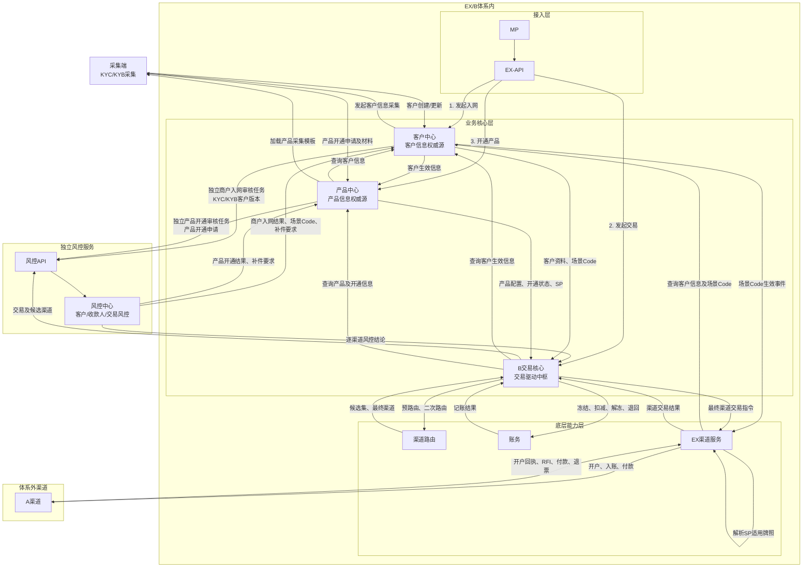
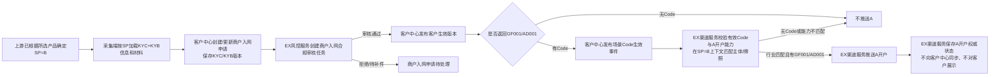
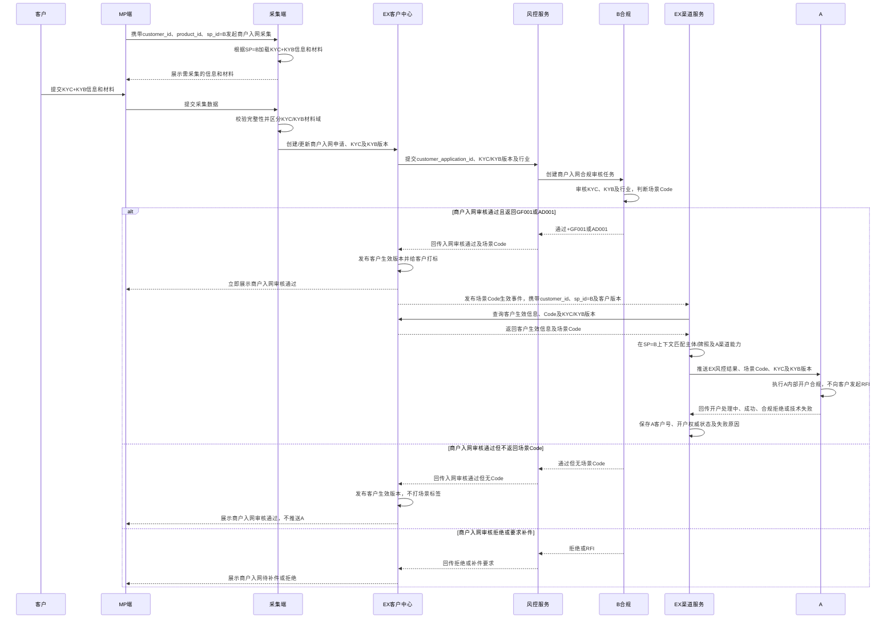
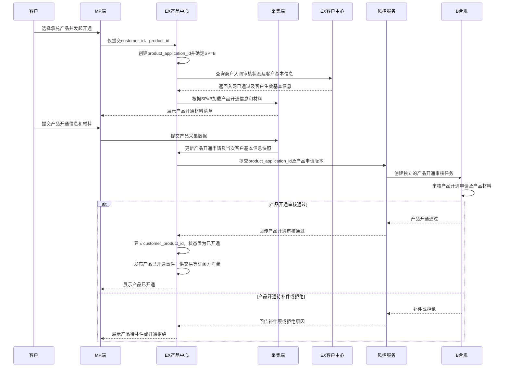
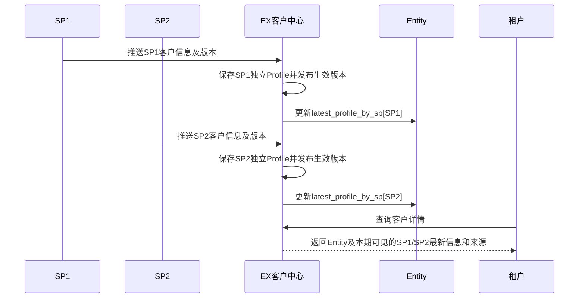
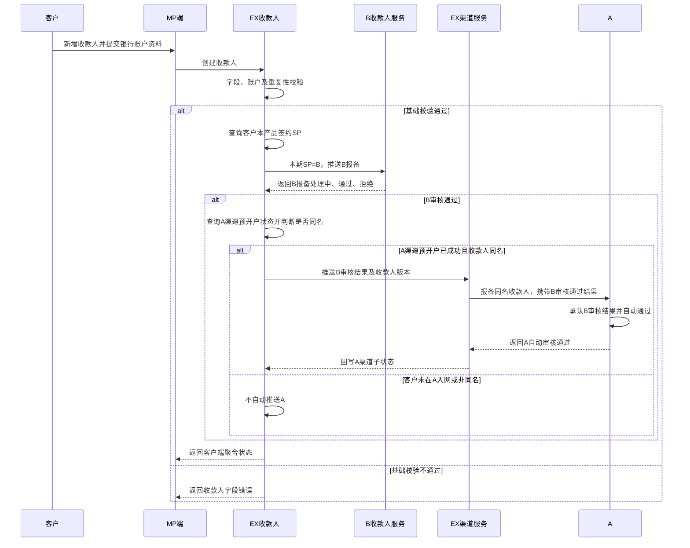
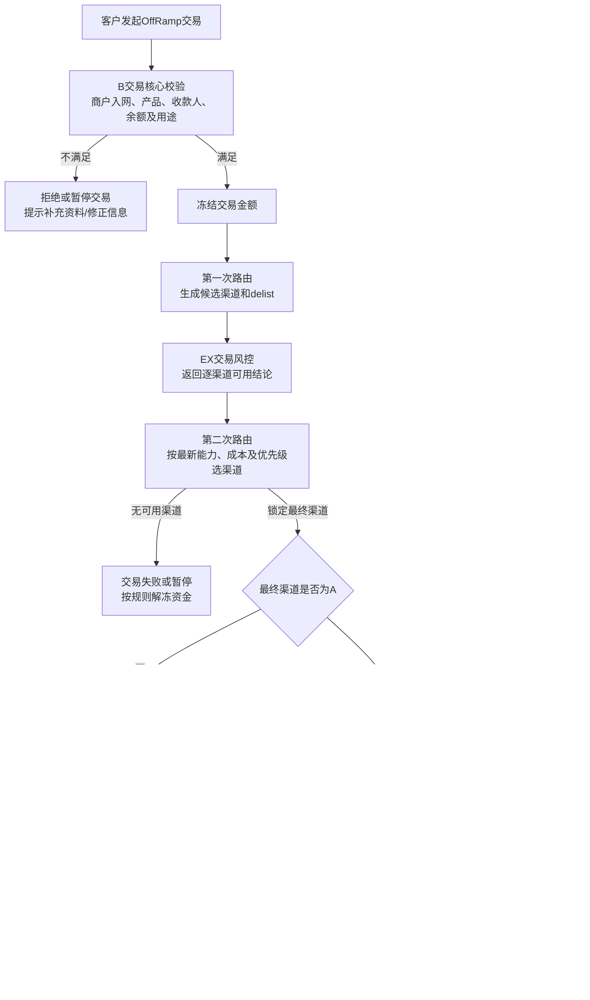
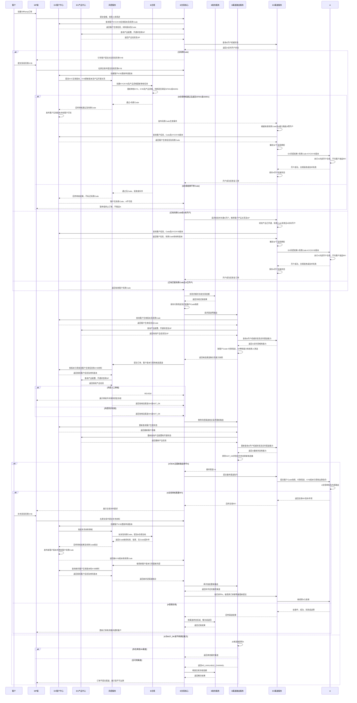
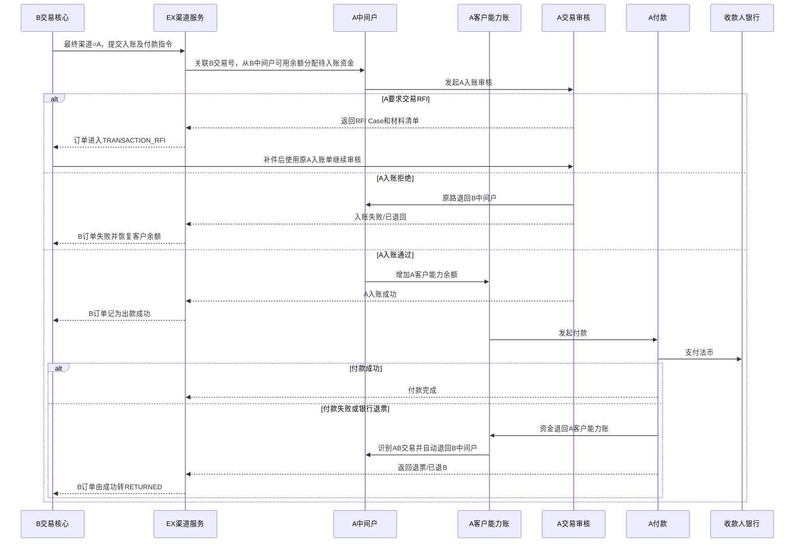
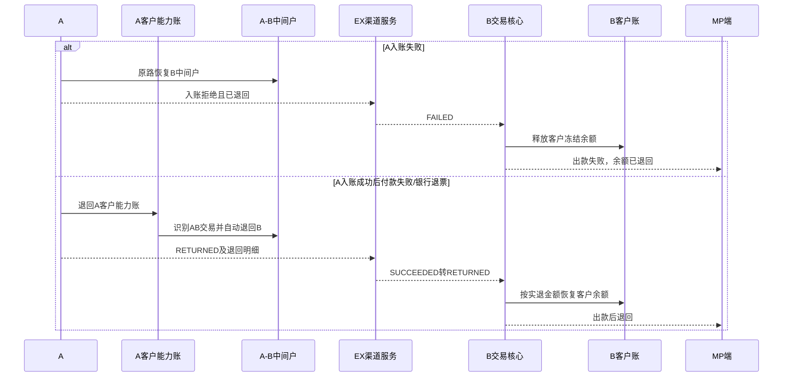

# AB 打通 · B OffRamp 接入 A 渠道 BRD

> **文档状态**：待业务、产品、风控合规及技术评审
> **需求主体**：B / EX
> **业务模式**：A 作为 B 的 OffRamp 付款渠道，整体能力基于 EX 建设
> **本期范围**：B2B 货代、广告两个场景；场景编码分别为 `GF001`、`AD001`
> **系统边界**：覆盖MP、EX-API、产品中心、KYC采集、客户中心、EX收款人、B交易核心、渠道能力、两次路由、独立风控服务、EX渠道服务、A入账/付款、B/A记账及反向；不展开链上钱包、数换法报价成交、B中间户资金来源和A内部银行路由策略
> **核心原则**：EX风控是独立公共服务，为A、B提供客户、收款人和交易风控，不建设独立B风控服务。客户补充KYB后，由B合规通过EX风控服务完成审核并判断是否标记场景Code；只有审核通过且带`GF001/AD001`才向A推送入网。订单进入A后仍执行A内部风控合规。

---

## 一、需求背景

B需要基于EX为客户提供完整OffRamp服务，并将A接入为B的付款渠道。客户统一从MP进入；EX负责采集KYC/KYB、客户与收款人管理及公共风控；B负责交易编排、渠道能力和路由；A负责内部风控合规、入账及付款。

本期双方先拉齐两个可以由 A 承接的业务场景：

| 场景 | 场景编码 | 业务含义 |
| --- | --- | --- |
| 货代 | `GF001` | 货运代理、国际物流等经双方确认可承接的业务 |
| 广告 | `AD001` | 广告投放、广告代理等经双方确认可承接的业务 |

现阶段需要解决以下问题：

1. EX、B、A 对行业、场景编码、采集字段和材料口径不一致；
2. A 需要客户实名认证（KYC）及贸易背景（KYB）；本期新客户须在入网时提交并完成审核，历史已开通客户、材料失效或新增场景时可在OffRamp交易入口补充，材料统一由客户中心承载并按KYC/KYB分域；
3. 客户满足场景准入，不代表每笔交易都可以走 A，需要交易级风控再次判断；
4. 风控审核存在异步结果，审核完成后渠道能力可能已变化，不能沿用审核前的路由结果；
5. EX收款人只维护收款人本身及银行账户信息，不承担贸易背景（KYB）补充；
6. A 侧需要建设快速入账/快速入网能力，并与 B 的入网和交易接口同步改造。

---

## 二、业务目标与非目标

### 2.1 业务目标

1. 在EX完成“MP采集—客户中心—EX风控—客户中心生效”的`SP=B`商户入网链路；A渠道预开户是B内部异步渠道准备，不属于对客入网结果。
2. 对货代、广告场景建立统一编码 `GF001`、`AD001`，并同时支持客户级和交易级标记。
3. 支持贸易背景（KYB）在客户入网阶段提交，或在OffRamp交易阶段补齐；两种入口均写入客户中心KYB域并形成版本，是否挂到产品开通待确认。
4. A接收EX风控结果和场景Code后执行A内部开户合规处理并回传结果；A开户阶段不向客户发起RFI。
5. 打通EX收款人新增、基础审核和交易引用链路，但不在收款人流程补充贸易背景（KYB）。
6. OffRamp 订单先形成候选渠道，再经过交易风控；风控完成后重新路由，仅向最终可用渠道提交。
7. 入网、收款人、交易、风控、路由及 A 回执均可审计、可追踪、可幂等重试。

### 2.2 非目标

- 本期不开放除货代、广告以外的业务场景进入 A。
- `GF001`、`AD001` 不用于绕过 B 的客户审核、交易风控或 A 的交易审核。
- 本期不向 B 暴露 A 内部银行及付款通道路由。
- 本期不设计页面原型；页面字段和交互由后续 PRD/交互文档承接。
- 本 BRD 不对 A 的牌照、默认通过机制或贸易背景接受标准作法律结论，须由双方合规正式确认。

---

## 三、术语与核心口径

| 术语 | 定义 |
| --- | --- |
| SP 路由 | EX 根据客户及业务配置，将客户服务关系路由至 B 等 SP |
| 场景 Code | 客户维度的已审核场景编码；只有提交对应贸易背景（KYB）并经B合规审核确认后才能由客户中心标记 |
| 付款用途 | 订单维度记录的实际付款目的；与客户场景Code共同参与渠道能力匹配和风控判断 |
| EX风控结果 | EX独立风控服务输出的客户/交易结论，供B路由及A内部风控使用；不等同于替代A合规 |
| 实名认证（KYC） | 企业注册、股东/UBO、经营范围、地址、人数规模等主体身份和基础信息；即实名认证 |
| 贸易背景（KYB） | 能证明本笔或一类业务真实性的合同、订单、发票、物流/广告相关证明；本文提到“贸易背景”均指 KYB |
| 渠道预路由 | 风控前根据静态能力初筛可能承接订单的渠道集合，不产生最终渠道锁定 |
| 风控渠道结论 | 风控针对本笔订单返回某渠道 `OK`、`NOT_OK` 或 `REVIEW` |
| 重新路由 | 风控终态后，基于最新能力、入网状态和风控结论再次计算并选定最终渠道 |

### 3.1 场景Code与交易用途

| 信息 | 字段建议 | 产生时机 | 作用 | 是否直接允许走A |
| --- | --- | --- | --- | --- |
| 客户场景Code | `customer_scene_codes` | 行业分类匹配、贸易背景已提交且B合规审核确认时，由客户中心给客户打标 | 判断是否向A发起开户，并与本笔付款用途共同形成A候选资格 | 否 |
| 交易付款用途 | `payment_purpose` | 客户创建交易时 | 表达本笔实际付款目的；不重复生成一套交易场景Code | 否 |
| 风控渠道级 | `channel_risk_decision[A]` | 交易风控完成时 | 判断本笔交易是否允许进入 A 的最终路由 | 是，但仍需满足其他路由条件 |

### 3.2 标签规则

1. 客户入网时先判断行业分类是否为货代或广告，再判断是否具备对应场景 Code。
2. 标记`GF001/AD001`代表客户已提交对应贸易背景（KYB），并由B合规通过EX风控服务完成审核确认；未提交KYB或审核结果不带Code时，不标记场景Code，也不推送A开户。
3. 同一客户可以具备一个或两个客户级场景 Code，具体是否允许双 Code 由合规确认。
4. 每笔OffRamp记录一个明确的付款用途，不再额外维护交易级GF001/AD001。
5. 客户具有`GF001`不代表所有订单均为货代；只有“客户场景Code+本笔付款用途”符合A渠道能力时，A才进入预路由候选集。
6. 风控服务结合客户场景Code、本笔付款用途、收款人及其他交易信息返回逐渠道结论；具体策略配置不在本BRD展开。
7. 客户场景Code变更不修改历史交易；订单保存当时匹配的客户Code快照、付款用途及规则版本，供审计追溯。

---

## 四、参与系统与职责

| 系统/角色 | 主要职责 | 本期改造 |
| --- | --- | --- |
| MP 端 | 客户注册、实名认证（KYC）、贸易背景（KYB）、收款人维护、OffRamp 下单及结果展示 | KYC和KYB分开采集；展示产品开通审核、交易RFI和交易结果，不展示底层A开户状态 |
| 采集服务 | 统一字段、文件和行业品类采集 | 采集实名认证（KYC）、贸易背景（KYB）及产品开通材料；不直接生成未经B合规审核的场景Code |
| EX客户中心 | Entity、SP Profile、KYC/KYB材料域及客户审核状态 | 作为客户信息唯一权威源，统一承载ID引用、SP独立客户信息、材料版本和EX风控结果；不保存或展示客户与底层渠道A的关系 |
| EX产品中心 | 产品目录、产品配置、采集模板、客户产品开通申请及客户产品关系 | 作为产品信息唯一权威源；客户提交产品开通信息时创建独立申请，保存从客户中心读取的生效基本信息快照及产品申请自己的`product_submission_id`；不向客户中心回传`product_application_id` |
| EX 收款人 | 收款人主档、基础审核、状态 | 仅维护收款人及银行账户；不采集、不补充、不存储贸易背景（KYB） |
| EX风控服务 | 独立公共风控，为A、B服务 | 承载客户KYC/KYB审核和B合规场景Code结论流转；执行收款人风控、交易逐渠道结论及RFI编排 |
| B合规 | 商户入网审核和产品开通审核责任方 | 通过EX风控服务分别处理两类独立任务：商户入网任务审核KYC/KYB、行业并决定场景Code；产品开通任务审核产品申请及产品材料。两类任务不得合并，共用同一合规角色不代表共用审核单 |
| B交易核心 | 交易域中枢，负责OffRamp订单、状态机和全链路交易编排 | 统一查询客户中心并触发预路由、EX风控、账务、二次路由、渠道提交、异步状态及逆向处理 |
| B渠道路由 | 渠道候选集及最终渠道计算 | 响应B交易核心的预路由、风控后重新路由；不直接向渠道提交交易 |
| B账务 | 客户账、渠道往来账及交易记账 | 响应B交易核心的冻结、扣减、解冻和退回指令，返回幂等记账结果 |
| EX渠道服务 | 按SP隔离的主体/牌照能力、A渠道能力、开户执行状态及接口适配 | 本期以`sp_id=B`运行；SP确定后匹配服务主体/牌照及A能力，调用A开户和交易接口并回传结果 |
| A | B的OffRamp渠道 | 接收EX风控结果后执行A内部风控合规；开户不向客户RFI，交易可RFI；完成入账、付款和回调 |

### 4.1 权威数据归属

| 数据 | 权威来源 |
| --- | --- |
| 客户实名认证（KYC）与贸易背景（KYB）材料 | EX 客户中心/材料中心，按域存储 |
| 产品目录、产品配置及采集模板 | EX产品中心 |
| 客户产品开通关系及状态 | EX产品中心 |
| EX客户风控结果 | 风控服务，回写EX客户中心 |
| A渠道预开户执行状态及失败原因 | EX渠道服务，来源为A回执；按`sp_id=B`保存内部渠道运行权威状态，不影响`SP=B`商户入网状态 |
| 客户实名认证（KYC） | EX客户中心的对应SP Profile |
| 贸易背景（KYB） | 客户中心KYB材料域；是否正式归属产品开通待确认 |
| 收款人主档和基础审核状态 | EX 收款人 |
| 客户场景Code | EX客户中心，结论来源为风控服务 |
| 交易付款用途 | B交易核心保存订单事实及不可变快照 |
| KYC/KYB材料版本 | EX客户中心按KYC/KYB分域；B交易核心只保存引用和订单快照 |
| 各候选渠道风险结论 | EX风控服务 |
| A渠道能力和可用状态 | EX渠道服务，归属`sp_id=B`，来源为A确认/运营配置 |
| A 出款结果 | A，B交易核心承接 |

### 4.2 EX 模块边界与调用关系

| 阶段 | EX/B 模块 | 输入 | 核心处理 | 输出/下游 |
| --- | --- | --- | --- | --- |
| 发起入网 | MP、EX-API、客户中心 | 主体基础信息、租户 | EX-API将入网请求路由至客户中心；客户中心创建申请并编排采集、风控及客户生效 | 客户中心生效版本 |
| 开通产品 | MP、EX-API、产品中心 | 首次发起仅传`customer_id`、`product_id`；采集完成后回填申请数据 | EX-API将开通请求路由至产品中心；产品中心确定SP并生成产品开通申请。客户提交后，产品中心保存从客户中心读取的生效基本信息快照和`product_submission_id`，不保存客户中心申请/版本ID | 客户产品开通申请及客户信息提交快照 |
| 信息采集 | 采集端 | 国家、实名认证（KYC）、行业、贸易背景（KYB）及产品开通材料 | 客户先选择国家；采集端按产品、SP及国家加载/调整字段，完成材料上传、校验和草稿保存 | 客户中心申请版本、产品开通材料 |
| 客户落库 | 客户中心 | 商户入网申请及客户采集快照 | 保存客户主档、SP Profile及KYC/KYB材料版本，不保存`product_application_id`、`product_submission_id`或产品配置 | EX风控服务 |
| 客户审核 | 风控服务 | 客户申请版本 | 审核KYC、行业及KYB | 客户中心生效版本 |
| 客户场景审核 | 客户中心、EX风控服务、B合规 | 客户申请版本、行业及KYB版本 | EX风控服务承载审核流程，B合规判断是否满足GF001/AD001，客户中心根据结果给客户打标 | 客户中心生效版本及场景Code |
| 商户入网及A预开户 | 客户中心、EX风控服务、EX渠道服务 | 商户入网申请、KYC/KYB、行业及Code | 客户中心发起独立商户入网审核；B审核通过并发布客户生效版本后立即形成对客入网成功；有有效Code时EX渠道服务另行异步发起A预开户 | 客户入网状态及Code保存在客户中心；A渠道状态仅保存在EX渠道服务，二者互不影响 |
| 产品开通 | 产品中心、EX风控服务 | 产品开通申请及产品材料；客户中心仅提供商户入网是否通过 | 产品中心创建独立产品开通审核任务；商户入网通过且产品审核通过后建立客户产品关系。产品中心不查询Code、不发起A入网 | 产品开通状态保存在产品中心；与商户入网审核任务相互独立 |
| 收款人 | EX收款人、B收款人服务、EX渠道服务 | 收款人及银行账户 | 所有收款人先推B；A渠道预开户成功且B审核通过的同名收款人同步A并自动通过，非同名规则待确认 | B/A收款人状态 |
| 交易 | B交易核心、客户中心、EX风控、账务、路由、渠道服务 | 订单、客户、收款人、余额 | B交易核心统一查询客户、触发预路由、交易风控、记账、二次路由及渠道提交 | A入账/付款及B订单状态 |

### 4.3 客户中心与产品中心边界

一句话定义：**客户中心回答“客户是谁、客户资料是否生效、客户具备什么场景资格”；产品中心回答“客户申请了什么产品、由哪个SP提供服务、产品是否已开通”。**

| 边界维度 | EX客户中心 | EX产品中心 |
| --- | --- | --- |
| 领域职责 | 客户身份、主体关系、SP Profile、KYC/KYB、客户资料审核状态、场景Code | 产品目录、产品版本、采集要求、产品与SP关系、产品开通申请、客户产品关系及开通状态 |
| 权威数据 | 客户基本信息最新生效版本、KYC/KYB版本、`GF001/AD001`及有效期 | 产品配置、`product_application_id`、`customer_product_id`、`sp_id`及产品开通状态 |
| 申请数据 | 创建`customer_application_id/customer_version_id`，保存客户提交内容和修改记录 | 创建`product_application_id`，保存产品申请内容及当次客户基本信息快照 |
| 申请追踪键 | 使用`customer_application_id`及客户申请自己的提交批次号 | 使用`product_application_id`及独立`product_submission_id`；不与客户申请共用提交批次号 |
| 风控输入 | 向风控服务提交客户申请、KYC/KYB版本和行业，创建商户入网任务 | 向风控服务提交产品开通申请及产品材料，创建产品开通任务 |
| 风控结果消费 | 发布客户生效版本；根据B合规结论保存、更新或失效场景Code | 更新产品申请状态；审核通过后建立客户产品关系 |
| 对外事件 | 发布客户资料生效/失效、场景Code生效/失效事件 | 发布产品已开通、暂停或关闭事件；事件不包含场景Code |
| 查询服务 | 向交易、风控、路由及渠道服务提供客户最新生效信息和授权材料 | 向交易、风控、路由及渠道服务提供产品配置、SP和客户产品开通状态 |
| 明确不负责 | 不保存产品申请ID、产品配置、客户产品开通状态、牌照或A开户关系 | 不保存客户中心申请/版本ID，不维护客户最新信息，不保存或判断场景Code、牌照及A开户状态 |

边界规则：

1. 两个中心不互相保存对方的申请ID，也不通过彼此回传申请关系；商户入网和产品开通分别使用本领域申请ID、提交批次号和审核任务ID，不设置跨领域统一`submission_id`。
2. 产品中心保存的客户基本信息是产品申请提交快照，只用于还原当次申请和审计；任何“客户最新信息”查询必须访问客户中心。
3. 客户中心不根据产品状态生成场景Code；场景Code只能来自B合规通过EX风控服务返回的结论。
4. 产品中心只查询客户中心的商户入网状态和必要客户生效基本信息，不查询场景Code，也不发起A入网。
5. 客户中心发布场景Code生效事件后，EX渠道服务即可按商户入网规则决定是否发起A预开户；产品开通状态不作为A预开户的触发条件。
6. 客户资料修改不会自动覆盖历史产品申请快照；产品重新审核时生成新的产品申请版本或新申请。

### 4.4 一期与多 SP 扩展边界

- **一期固定 `SP=B`**：客户开通本产品后只建立一条 B 产品服务关系；客户和收款人只主动推送 B。
- A是B的渠道，不是EX直接签约SP。所有A调用均通过EX渠道服务在`sp_id=B`上下文完成，不绕过B的业务关系。
- **二期多SP**：产品中心以“客户×产品×SP”维护产品服务关系，不保存牌照。客户中心维护各SP客户Profile；SP确定后，由EX渠道服务进入对应SP上下文匹配服务主体/牌照。收款人不广播给所有SP，只推送给已签约且本产品启用的SP，或在该SP首次参与交易前按需推送。
- 不同 SP/牌照的客户审核、收款人报备和渠道开户状态相互隔离，禁止因集团关系自动复用。

---

## 五、整体业务架构

### 5.1 总体处理原则

- **三核心架构**：EX客户中心是客户信息权威源，EX产品中心是产品信息权威源，B交易核心是交易驱动中枢。风控、账务、路由和渠道服务均为被调用能力，不自行编排整笔交易。
- **接入层只负责请求路由**：MP通过EX-API发起业务操作；发起入网进入客户中心，发起交易进入B交易核心，开通产品进入产品中心。EX-API不跨域拼装客户、产品或交易数据，也不直接调用风控、账务、路由和渠道服务。
- **客户信息统一取数**：凡涉及客户身份、实名认证、贸易背景、SP Profile或客户审核状态的模块，均从客户中心读取生效版本，不得从产品、交易、渠道或风控本地副本获取“最新客户信息”。订单可保存不可变快照，但快照不反向充当客户主档。
- **产品信息统一取数**：凡涉及产品目录、产品配置、采集模板、适用国家/币种、产品与SP关系或客户产品开通状态的模块，均从产品中心读取。产品中心不知道具体牌照；SP确定后，由EX渠道服务进入对应SP上下文匹配服务主体/牌照。
- **开通产品由产品中心编排**：产品中心收到的开通请求只包含`customer_id`和`product_id`，不包含国家或币种。产品中心以客户ID向客户中心查询已有客户信息并确定SP；国家由采集端采集，币种仅在后续交易场景使用。
- **风控服务独立包装**：风控中心通过独立风控API为本方案中的客户、收款人和交易流程提供统一能力。
- **渠道状态独立归属**：EX渠道服务是A渠道预开户状态、失败原因和渠道实时能力的唯一权威源，并按SP隔离；客户中心不保存客户与A的关系。A渠道状态只供交易核心和路由服务内部使用，不影响`SP=B`商户入网状态，也不向客户展示。
- **客户变更闭环**：客户创建/更新先写客户中心申请版本，由客户中心通知EX风控；EX风控完成审核后将通过、拒绝或补件结果回传客户中心。仅审核通过时，客户中心发布新的生效版本。
- **交易统一编排**：所有交易动作均由B交易核心发起。B交易核心分别从客户中心取得客户信息、从产品中心取得产品信息，并触发渠道预路由、交易风控、账务冻结/扣减/解冻/退回、风控后二次路由及最终渠道提交。
- BRD 主体按 **入网、交易、收款人**三大业务块定义；记账与反向作为交易的公共支撑能力单列。
- **客户入网分开处理**：先判断行业分类，再判断是否已具备 `GF001/AD001`；有 Code 才推送 A。
- **收款人分开处理**：只维护收款人及银行账户，不提供贸易背景（KYB）补充入口。
- **交易分开处理**：客户可在交易时补充贸易背景（KYB），材料先更新客户中心；风控审核通过后，客户中心给客户标记场景Code并发布生效事件，由EX渠道服务结合既有产品开通状态决定是否发起A入网并继续交易。
- **风控后重新路由**：审核前路由只能作为候选集合；风控完成后必须重新读取渠道能力和客户状态，生成最终路由。

---

## 六、业务流程一：客户入网

### 6.0 入网模块链路

本节只描述商户入网，不包含产品开通审核。上游已根据客户所选产品确定`SP=B`，采集端据此加载KYC和KYB要求；客户中心创建独立的商户入网申请，EX风控服务创建独立的商户入网合规审核任务。审核通过后客户中心发布客户生效版本，并根据B合规结论保存场景Code；有`GF001/AD001`时由EX渠道服务发起A预开户，无Code时不推送A。

客户中心与EX风控服务双向通报：客户中心负责商户入网申请、材料、客户生效版本和场景Code；EX风控服务承载商户入网合规审核任务并回传状态、原因、补件项及Code结论。B合规是场景Code判断责任方，客户中心不得绕过审核自行打标。产品开通申请和产品开通审核任务在独立流程中处理。

### 6.1 前置条件

1. A 已作为 B 的渠道接入，并确认开放货代、广告场景。
2. EX 与 B、A 已完成行业品类、场景编码和采集字段映射。
3. 客户选择产品时只提交`customer_id`和`product_id`，不提交国家和币种。产品中心先确定SP并生成基础材料模板；国家由客户进入采集端后选择，采集端再按产品、SP及国家加载或调整KYC、KYB和产品开通材料清单。模板采用EX统一标准，还是根据SP要求动态获取并合并，待确认。

### 6.2 商户入网主流程

### 6.3 产品开通独立流程

产品开通审核与商户入网合规审核是两个独立任务，分别拥有独立的申请ID、审核任务ID、状态和结果。产品开通审核的前置条件是客户中心返回商户入网审核已通过；产品中心不读取场景Code，也不因A开户结果改变产品开通状态。

商户入网审核未通过时，产品中心不得创建产品开通审核任务，`product_application_id`保持`WAITING_FOR_CUSTOMER_ONBOARDING`。客户后续入网通过后，产品中心可继续原产品开通申请，不需要复用或合并商户入网审核任务。

### 6.4 EX风控与A内部风控合规

1. 风控服务独立包装，是A、B共用的前置风控能力；客户入网阶段由其承载B合规对KYC/KYB的审核任务及场景Code结论流转，B合规是Code判断责任方。
2. 产品开通审核由产品中心另行发起，使用独立审核任务ID和状态机；不得在商户入网审核任务中附带产品开通结论。
3. B不建设或调用独立B风控服务；客户审核闭环由客户中心与EX风控完成，B交易核心只在交易编排中消费客户生效信息和EX交易风控结果。
4. A收到客户后仍执行A内部风控合规；EX风控结果是A审核输入，不替代A的法定/内部责任。
5. 沿用本期口径，A开户阶段不向客户发起RFI；A可回传开户处理中、成功或拒绝/失败。
6. A交易入账阶段可以RFI，补件由EX风控和客户中心统一编排。
7. A状态未知、回调超时或B/A状态不一致时，按A不可用处理并触发查询/人工核查。

### 6.5 贸易背景材料的两种提交路径

| 路径 | 使用条件 | 入网处理 | 首笔交易处理 |
| --- | --- | --- | --- |
| 入网时提交 | 客户在商户入网采集阶段已有对应贸易背景（KYB） | 材料写入客户中心KYB域；商户入网审核通过后，客户中心发布场景Code生效事件，EX渠道服务据此发起A预开户；产品开通另走独立流程 | 产品开通后，交易引用客户中心有效KYB版本和场景Code |
| OffRamp交易时补充 | 仅适用于历史已开通客户、KYB失效或新增业务场景；本期新客户未完成商户入网时不得进入产品开通审核 | A未开户或现有Code不适用时不路由A | 交易入口补充贸易背景（KYB）→ 更新客户中心 → 重新发起商户/KYB合规审核 → 客户中心更新Code并发布事件 → EX渠道服务发起A预开户 → A内部合规通过后继续交易；如需重审产品资格，另建产品开通审核任务 |

材料规则：

- 客户中心统一承载材料：实名认证进入对应SP Profile的KYC域，贸易背景进入KYB域；
- B交易核心不维护第二份客户或产品资料，只保存客户中心、产品中心的版本引用及交易快照；
- 收款人模块不得提供客户材料补充入口，也不得复制实名认证或贸易背景；
- 材料缺失时不标记场景 Code、不推送 A；交易入口可引导客户补充并触发客户审核；
- 贸易材料有效期、复用范围和必填清单由双方合规确认。

### 6.6 状态边界

#### 6.6.1 商户入网状态（对客，SP=B）

| 状态 | 含义 | 对客展示 |
| --- | --- | --- |
| `DRAFT` | 商户入网资料尚未提交 | 待提交 |
| `SUBMITTED` | 已提交，等待进入B合规审核 | 审核中 |
| `REVIEWING` | B合规正在审核KYC/KYB及行业 | 审核中 |
| `RFI_REQUIRED` | B合规要求补充商户入网资料 | 待补充资料 |
| `APPROVED` | `SP=B`商户入网审核通过，客户中心已发布生效版本 | 入网成功 |
| `REJECTED` | `SP=B`商户入网审核拒绝 | 入网失败 |
| `SUSPENDED/CLOSED` | B暂停或关闭该商户服务关系 | 已暂停/已关闭 |

商户入网状态只取决于`SP=B`的审核结果。B审核通过并由客户中心发布生效版本后，系统立即通知客户“入网成功”，不得等待或检查A及其他底层渠道状态。

#### 6.6.2 A渠道预开户状态（内部，不对客）

| 状态 | 含义 | 是否可进入A交易候选集 |
| --- | --- | --- |
| `NOT_SUBMITTED` | 尚未向A提交渠道预开户 | 否 |
| `PROCESSING` | A正在处理渠道预开户请求 | 否 |
| `APPROVED` | A内部合规通过并创建渠道侧客户映射 | 是，仍需交易风控和实时能力校验 |
| `FAILED` | A合规拒绝、技术失败或数据异常 | 否 |
| `SUSPENDED/CLOSED` | A渠道能力暂停或映射关闭 | 否 |
| `UNKNOWN` | 状态不一致或无法确认 | 否 |

A渠道状态仅由EX渠道服务保存并供内部路由使用。A处理成功、失败、处理中或状态变化均不得回写`SP=B`商户入网状态，不得向客户展示为“入网结果”。A不可用时只从候选渠道中排除A，B仍可使用其他合格渠道。

### 6.7 客户中心改造

#### 6.7.1 数据模型

客户中心与产品中心分域建模：客户中心采用`Entity → SP客户信息 → 客户材料版本 → 客户场景Code`；产品中心采用`产品 → 产品版本/采集模板 → 客户产品开通申请 → 客户产品关系 → SP`。产品中心只知道SP，不保存具体牌照；SP确定后由EX渠道服务进入对应SP上下文匹配服务主体/牌照。A是B的底层渠道，A开户状态只保存在EX渠道服务，不进入客户中心。

| 对象 | 主键建议 | 作用 |
| --- | --- | --- |
| Entity | `entity_id` | 只保存稳定ID、主体类型、租户归属及各SP最新信息版本引用；不重复存储整套企业详情 |
| SP客户信息 | `sp_customer_profile_id` | 保存某SP采集或推送的客户实名认证信息；SP1、SP2分别存储 |
| 客户申请 | `customer_application_id` | 客户中心保存注册或客户资料变更的审核流程，不包含产品开通申请 |
| SP客户信息版本 | `sp_profile_version_id` | 保存某SP每次提交、审核和生效的字段/材料快照 |
| KYB材料版本 | `kyb_material_version_id` | 保存货代/广告贸易背景（KYB）；是否归属产品开通待办确认 |
| 客户场景Code | `customer_scene_code_id` | 客户中心根据风控结论保存`GF001/AD001`、审核依据、有效期及状态 |
| 产品开通申请 | `product_application_id` | 产品中心保存客户申请开通承兑产品的独立申请记录，包括产品/SP上下文、申请状态、客户生效基本信息快照及`product_submission_id`；不保存客户中心申请ID，也不作为客户最新信息权威源 |
| 产品开通关系 | `customer_product_id` | 产品中心保存客户承兑产品、指定SP及开通状态；不保存本次申请币种，国家来源于采集端并进入客户信息 |
| 产品SP关系 | `customer_product_sp_id` | 产品中心保存产品对应的SP；本期SP固定为B，二期支持多SP，不包含牌照 |
| SP主体/牌照能力 | `sp_license_capability_id` | EX渠道服务按SP保存服务主体/牌照及国家、币种、付款方式等支持范围 |

推荐关系：

客户中心关系：`Entity → SP客户信息最新版本 → 客户材料版本 → 客户场景Code`。

产品中心关系：`产品 → 产品版本/采集模板 → 客户产品开通申请 → 客户产品关系 → SP`。

#### 6.7.2 产品开通申请与客户中心数据一致性

1. 客户首次选择产品时，产品中心立即创建一条`product_application_id`，初始状态为`DRAFT/COLLECTING`；此时请求只包含`customer_id`和`product_id`。
2. 商户入网流程由客户中心生成`customer_application_id/customer_version_id`；产品开通流程由产品中心生成`product_application_id/product_submission_id`，两套申请与批次号相互独立。
3. 产品中心在产品申请时从客户中心查询商户入网状态和客户生效基本信息，并将返回内容保存为本次产品申请快照；客户中心不保存`product_application_id`，产品中心也不保存`customer_application_id/customer_version_id`。
4. 客户中心仍是客户信息权威源；产品中心的客户基本信息是产品申请快照，只用于还原当次申请，不得覆盖客户中心，也不得被其他业务作为客户最新信息读取。
5. 客户修改资料时，客户中心生成新申请版本；只有客户重新提交或重新发起产品审核时，产品中心才生成/更新对应产品申请快照，历史产品申请快照不得被覆盖。

产品开通申请至少包含：`product_application_id`、`product_submission_id`、`customer_id`、`product_id`、`sp_id`、客户生效基本信息快照、产品开通材料引用、模板版本、申请状态、审核状态及创建/更新时间。KYC/KYB客户版本由客户中心维护，不复制到产品中心。

风控服务分别接收两类请求并创建两条独立任务：客户中心提交`customer_application_id/customer_version_id`创建商户入网审核任务；产品中心在确认商户入网已通过后，提交`product_application_id/product_submission_id`创建产品开通审核任务。两类任务拥有不同`risk_review_id`和状态机，不通过任何统一提交ID合并。

Entity 不直接复制 SP 客户详情，而是维护引用，例如：

| Entity引用字段 | 示例含义 |
| --- | --- |
| `latest_profile_by_sp[SP1]` | 指向 SP1 当前生效的 `sp_profile_version_id` |
| `latest_profile_by_sp[SP2]` | 指向 SP2 当前生效的 `sp_profile_version_id` |

客户中心查询 Entity 时按请求上下文解析对应 SP 的最新生效信息。不得把 SP1 的字段覆盖到 SP2，也不得在两个 SP 信息冲突时自动拼成一份“最新客户资料”。

交易处理时必须分别查询：以`customer_id/entity_id`向客户中心查询客户生效信息及场景Code；以`product_id/customer_product_id`向产品中心查询产品配置、SP和开通状态；再由EX渠道服务进入对应SP上下文查询适用服务主体/牌照及实时渠道能力。不得要求产品中心返回牌照信息。

#### 6.7.3 SP1 / SP2 客户信息处理

规则：

1. SP1、SP2 使用独立的 `sp_customer_profile_id` 和版本序列；
2. 每条字段带 `source_sp_id`、`license_entity_id`、版本、审核状态和生效时间；
3. Entity 只更新对应 SP 的最新版本指针，不复制具体字段；
4. 本期租户可以查看该 Entity 下已接入客户中心的所有 SP 最新信息，并明确展示信息来源；
5. 本期租户也可以查看客户最初申请、后续修改申请和修改记录；敏感证件/银行字段仍按平台基础脱敏规则展示；
6. 渠道和交易不能因“租户可见”获得跨 SP 使用权限，调用接口仍必须按产品、SP、牌照和授权范围过滤；
7. 二期如需缩小租户可见范围，再增加租户角色/字段级权限，不改变底层版本模型。

#### 6.7.4 增、删、改

| 操作 | 业务规则 |
| --- | --- |
| 新增 | 客户注册生成Entity；选择产品后生成产品申请；采集提交后生成对应SP的首个Profile版本 |
| 修改 | 不直接覆盖SP当前生效信息；针对指定SP生成修改申请和新Profile版本，进入EX风控并携带SP上下文 |
| 删除 | 已提交审核、已开户或有交易的客户信息不得物理删除；仅草稿可删除，其余采用关闭/失效 |
| 材料补充 | 入网、交易入口、A 交易 RFI 均调用同一客户信息变更接口，生成新材料版本 |
| 场景 Code 变更 | 必须基于已审核材料生成；撤销/失效后立即影响 A 候选资格，不修改历史订单快照 |

#### 6.7.5 是否需要修改记录

**需要。**“修改后送风控，审核通过再写客户中心”仍不足以替代修改记录，因为客户、运营、风控和审计需要分别看到：当前生效信息、正在审核的修改内容、修改前后差异及历史版本。

客户中心需同时提供：

- **当前生效信息**：租户可按SP查看；交易和渠道只读取自身SP上下文的生效版本；
- **待审核修改**：客户在 MP 可查看提交内容、状态和补件要求，但不可作为交易生效数据；
- **修改记录**：字段前值/后值、材料版本、提交人、审核人、原因、时间和影响对象；
- **租户可见申请详情**：本期租户可查看客户最初申请、后续修改申请、修改前后差异及状态；
- **渠道读取接口**：只返回指定产品/SP/渠道允许读取的生效字段和获授权材料，不返回其他牌照关系的数据。

#### 6.7.6 修改状态

`DRAFT → SUBMITTED → RISK_REVIEWING → APPROVED / RFI_REQUIRED / REJECTED → EFFECTIVE`

- `APPROVED` 后由客户中心原子发布新生效版本；
- EX风控的客户资料RFI允许回到采集端/交易入口补充；A开户不向客户RFI；
- 发布失败时保持旧版本生效，新版本进入 `PUBLISH_FAILED`，不得出现半更新；
- 修改涉及行业、场景Code、主体状态或材料失效时，需重新计算SP/渠道资格，并通知EX渠道服务。

#### 6.7.7 实名认证（KYC）与贸易背景（KYB）边界

实名认证（KYC）只保存“客户是谁、企业基本情况和控制关系”，不保存具体产品贸易背景（KYB）。

| 信息域 | 建议字段 | 建议归属 |
| --- | --- | --- |
| 企业身份 | 企业名称、注册号、注册国家/地区、成立日期、注册地址、经营地址、企业类型 | SP客户实名认证（KYC） |
| 企业基本规模 | 员工人数/人数规模、经营规模区间 | SP客户实名认证（KYC） |
| 治理与控制 | 董事、股东、UBO、授权代表及证件 | SP客户实名认证（KYC） |
| 行业基础分类 | 企业行业及经营范围 | SP客户实名认证（KYC）；供产品判断使用 |
| 货代贸易背景 | 货代合同、物流订单、提单、发票及业务说明 | 贸易背景（KYB）；**待办：评估放入产品开通** |
| 广告贸易背景 | 广告合同、投放订单、账单、发票及业务说明 | 贸易背景（KYB）；**待办：评估放入产品开通** |
| 客户场景Code | `GF001/AD001`、审核依据、有效期 | 客户中心 |

待办结论未确认前：客户中心仍负责统一文件存储和版本管理，但必须通过 `material_domain=KYC/KYB` 区分实名认证（KYC）与贸易背景（KYB），不得把两类材料混放。

将贸易背景（KYB）放到产品开通层的预期收益是：同一Entity/SP的实名认证（KYC）可被多个产品复用，而货代、广告KYB只影响承兑产品和对应场景Code；产品关闭或KYB失效不会误伤KYC状态。最终字段清单、迁移方式和历史数据归属列入待办。

---

## 七、业务流程二：收款人

### 7.0 一期推送方案

一期只有一个 SP=B，采用以下方案：

1. 客户在 EX 新增收款人并完成格式、账户字段和基础名单校验；
2. EX 根据客户的 `customer_product_id + customer_sp_id` 找到已签约的 B，自动将收款人推送 B 报备；
3. B 返回收款人报备状态，EX 保存 B 子状态并计算客户端聚合状态；
4. **所有新增收款人默认只推送B，不直接推送A**；必须先取得B收款人审核结果。
5. 同名收款人属于例外：若A渠道预开户已成功，且B已审核通过该收款人，EX收款人服务可通过EX渠道服务将同名收款人同步A；A承认B审核结果并自动审核通过。
6. “同名”指收款银行账户名与客户法定名称匹配；名称标准化、别名及多语言匹配规则由AB对齐。
7. 非同名收款人是否允许推送A、是否需要A独立审核或B合规复核，待合规风控确认。规则确认前不自动推送A。
8. A的收款人补充仅允许补充收款人自身/银行账户字段，不承接贸易背景（KYB）；KYB统一更新客户中心。

二期多 SP 时，不将收款人无差别推送所有 SP。默认仅推送客户在该产品下已签约且启用的 SP；如某 SP 尚未参与该客户交易，可配置为首次使用时按需推送。

### 7.1 业务要求

1. 客户在 MP 创建法币收款人，由 EX 收款人服务统一维护。
2. 收款人审核与商户入网独立；A渠道预开户成功后，仅满足同名规则且B审核通过的收款人可以自动同步A。
3. 收款人只采集付款所需的主体类型、名称、国家/地区、银行账户、银行代码和地址等收款信息。
4. 收款人页面不采集合同、订单、发票等贸易背景（KYB），也不提供此类补件入口。
5. 收款人通过EX基础校验并经B审核通过后进入可选状态；同名收款人按本期规则同步A，非同名收款人的A处理规则待确认。
6. 收款人关键字段变更后重新校验；历史订单保留不可变收款人快照。

### 7.2 收款人时序

### 7.3 收款人状态

收款人必须区分客户端聚合状态、B 报备状态和 A 渠道状态，不能用一个字段相互覆盖。

| 状态层 | 状态 | 含义 | 客户端是否直接展示 |
| --- | --- | --- | --- |
| EX 主状态 | `DRAFT` | 草稿 | 是：草稿 |
| EX 主状态 | `VALIDATING` | EX 基础校验 | 是：处理中 |
| B 子状态 | `B_SUBMITTED` | 已推送 B | 否，聚合为处理中 |
| B 子状态 | `B_APPROVED` | B 报备通过 | 否，聚合为可用 |
| B 子状态 | `B_RFI_REQUIRED` | B 要求补收款人字段 | 否，聚合为待补充 |
| B 子状态 | `B_REJECTED` | B 报备拒绝 | 否，聚合为不可用 |
| A 子状态 | `NOT_SUBMITTED` | 客户未在A入网、非同名或不满足自动报备条件 | 否 |
| A 子状态 | `A_SUBMITTED` | 同名收款人已同步A，等待接口结果 | 否 |
| A 子状态 | `A_AUTO_APPROVED` | A已承认B审核结果并自动通过 | 否 |
| A 子状态 | `A_SUBMIT_FAILED` | A报备接口技术失败，可幂等重试 | 否，运营可见 |
| A 子状态 | `A_POLICY_PENDING` | 非同名收款人，等待合规风控规则确认 | 否 |
| 客户端聚合状态 | `PROCESSING` | EX/B 处理中 | 是：处理中 |
| 客户端聚合状态 | `AVAILABLE` | EX 校验通过且 B 报备通过 | 是：可用 |
| 客户端聚合状态 | `ACTION_REQUIRED` | B要求补充收款人字段 | 是：待补充 |
| 客户端聚合状态 | `UNAVAILABLE` | EX/B 拒绝、账户失效或停用 | 是：不可用 |

客户端日常列表只展示聚合状态；运营、风控及交易详情可按权限查看EX、B、A子状态和原因。客户端可用状态仍以EX/B结果为准，A报备状态不得将收款人全局置为不可用。

### 7.4 收款人增删改

- 新增：EX校验后只推B；B通过后客户端显示可用。若A渠道预开户已成功且收款人同名，再同步A并由A自动通过。
- 修改：银行账号、名称、国家等关键字段修改生成新版本，旧版本在审核期间是否继续可用由风控确认；新版本重新推B，B通过后重新判断A渠道状态及同名条件。
- 删除：草稿可物理删除；已报备或被订单引用的收款人只允许停用，不物理删除。
- A渠道状态按收款人版本保存；关键字段修改后原A状态失效，满足“A渠道预开户成功+B审核通过+同名”时重新同步A。
- 收款人历史订单始终引用创建交易时的不可变版本。

---

## 八、业务流程三：OffRamp 交易

### 8.1 交易准入条件

交易可以从以下两种客户状态进入：

- 客户已具备 `GF001/AD001` 且 A 已开户：直接进入交易预路由；
- 客户尚无场景Code/A未开户：允许在交易入口提交贸易背景（KYB），完成客户中心更新、风控审核、客户中心标记场景Code和A开户后，再回到交易流程。

提交最终渠道前必须满足：

- 客户已在 B 入网并可交易；
- 客户具有与本笔交易一致的 `GF001` 或 `AD001`；
- A渠道预开户状态为`APPROVED`，否则只排除A，不影响客户在B的入网和产品状态；
- 收款人状态为 `AVAILABLE`；
- 客户余额、限额及基础交易字段满足要求；
- 本笔交易已确定唯一场景 Code；
- 客户中心的贸易背景材料已齐备且审核通过。

### 8.2 路由、风控与重新路由

#### 8.2.1 简化业务流程

下图仅表达OffRamp交易主干。客户资料补充、A交易RFI、记账分录、回调去重及退票明细在后续详细时序中展开。

简化流程的核心是：第一次路由只生成候选集，交易风控给出逐渠道允许结论，第二次路由才锁定唯一最终渠道。A只是候选渠道之一；A不可用时应被排除，不影响客户在B的入网状态。

| 阶段 | 处理模块 | 输入 | 输出 |
| --- | --- | --- | --- |
| 第一次路由 | B交易核心调用渠道路由服务 | 产品、客户/SP、客户渠道开户、收款人、国家、币种、金额、方式 | `candidate_channel_list`、`channel_delist` |
| 交易风控 | EX风控服务 | 订单、客户中心生效版本、收款人快照、候选渠道 | `risk_allowed_channel_list`、逐渠道原因 |
| 第二次路由 | B交易核心调用渠道路由服务 | 风控允许列表、最新渠道能力、成本、优先级、可用性 | 唯一 `final_channel_id` |

`channel_delist` 至少记录渠道 ID、排除阶段、原因码和规则版本。第一次路由排除的是静态/资格不匹配渠道；风控排除的是本笔风险不可用渠道。两类原因必须分开审计。

#### 8.2.2 详细系统时序

### 8.3 核心交易规则

1. **先预路由、再风控、后重新路由**。预路由结果不允许直接发起出款。
2. 风控返回逐渠道结论，至少包括：
   - `OK`：本笔交易允许使用该渠道；
   - `NOT_OK`：本笔交易禁止使用该渠道；
   - `REVIEW`：等待人工审核，暂不可提交任何渠道。
3. 风控未返回终态前，交易保持冻结/待审核，不得提交 A。
4. 风控返回 A=`NOT_OK` 时，B渠道路由服务必须将A从本笔候选集中排除。
5. 风控返回 A=`OK` 也不保证最终命中 A；重新路由仍需检查A渠道预开户状态、渠道实时能力、限额、收款人、币种、国家和服务状态。
6. 人工审核完成后必须重新路由，不得使用审核前缓存的最终渠道。
7. 重新路由需保存候选渠道、排除原因、风控结论和最终渠道快照。
8. 无可用渠道时，不向任何渠道提交；释放或继续冻结余额按订单终态规则处理。
9. A 受理后不得因成本或优先级变化静默切换渠道；结果未知时必须查询 A，避免重复出款。
10. 交易入口或A交易RFI补充的贸易背景（KYB）必须先更新客户中心；B交易核心仅引用客户中心返回的新KYB版本。
11. 因交易补充贸易背景（KYB）新生成场景Code时，必须先完成A开户，再重新进入预路由/风控，不能边开户边出款。

### 8.4 交易级场景判定

| 判定维度 | `GF001` 货代 | `AD001` 广告 |
| --- | --- | --- |
| 行业分类 | 货代 | 广告 |
| 客户场景Code | 客户已提交货代贸易背景并获 `GF001` | 客户已提交广告贸易背景并获 `AD001` |
| 付款用途 | 与货代/物流服务相关 | 与广告投放/广告服务相关 |
| 客户中心贸易背景 | 货代合同、物流订单、发票等，具体清单待确认 | 广告合同、投放订单、账单/发票等，具体清单待确认 |
| 不一致处理 | 不标记 `GF001`，A 从本笔候选集中排除 | 不标记 `AD001`，A 从本笔候选集中排除 |

### 8.5 A 交易处理

1. B向A提交B订单号、A客户号、客户场景Code快照、付款用途、收款人快照、金额币种及客户中心贸易材料版本引用。
2. A 入网时不 RFI；A 在交易审核中可以发起 RFI，并明确所需贸易背景字段或材料。
3. A 返回的交易受理和出款结果为该渠道事实，B 不自行覆盖。
4. A返回交易RFI时，客户从交易入口补充材料；实名认证写对应SP Profile的KYC域，贸易背景写KYB域，再将新版本用于交易风控和重新路由。
5. A 返回交易拒绝时，B 更新订单；是否改走其他渠道须满足不重复出款和客户授权规则。

### 8.6 A 入账与付款子流程

本期 A 不是收到指令后直接付款，而是先把 B 的订单资金入账至 A 的客户能力账，再从该能力账发起付款。

#### 8.6.1 A 入账 RFI 改造

- A 的 RFI 绑定 **A 入账单/AB 交易号**以便审计和幂等，但不要求客户在 A 先创建或关联一张独立贸易订单；
- A 返回结构化 RFI Case、补件字段、材料类型和截止时间；客户在 EX 交易详情直接补件；
- 补件先按KYC/KYB域更新客户中心材料版本，再由B使用原A入账单继续提交；
- A入账RFI不改变最终渠道、不重新生成资金划拨；如补件后EX风控结论变化，先暂停A入账并重新执行风控/路由；
- A 入账通过或拒绝必须返回明确资金结果，不能只返回审核状态。

#### 8.6.2 B 与 A 状态口径

| A 事件 | B 订单状态 | 客户端口径 |
| --- | --- | --- |
| A 入账处理中/RFI | `PROCESSING` / `TRANSACTION_RFI` | 处理中/待补充材料 |
| A 入账拒绝且原路退回 | `FAILED` | 出款失败，余额已退回 |
| A 入账成功 | `SUCCEEDED` | 出款成功 |
| A 入账成功后付款失败 | `RETURNED` | 出款后退回 |
| A 付款成功后银行退票 | `RETURNED` | 收款行退回 |

> 该口径意味着 B 的“成功”以 A 入账成功为准，而不是以最终收款人到账为准。客户端需明确区分“出款成功”和“收款人最终到账”，并允许成功订单后续因 A 付款失败/银行退票转为 `RETURNED`。

---

## 九、记账与反向流程

### 9.1 本期账户模式

本期按 **B 在 A 开立中间户**设计，不为每个客户建立可独立持有银行资金的实体结算账户。A 为通过 A 开户的客户维护“客户能力账/子账”，用于交易归属、余额和付款控制；法律账户仍为 B 中间户。该模式需财务、合规、法务确认后生效。

| 账层 | 账务主体 | 作用 |
| --- | --- | --- |
| B 客户账 | B | 客户在 B 的法币可用、冻结、已扣减和退回余额 |
| B 渠道往来账 | B | 记录 B 与 A 的应收应付、在途及退回，不等同客户余额 |
| A B中间户 | A | 承接 B 向 A 预存/调拨的法币及订单入账、退回 |
| A 客户能力账 | A | 记录某客户可归属的入账金额、付款和退回；是 A 内部子账 |
| A 付款在途账 | A | A 入账成功后到银行付款终态之间的在途资金 |

### 9.2 正向记账

| 事件 | B 客户账 | B 渠道往来账 | A B中间户 | A 客户能力账 | B订单 |
| --- | --- | --- | --- | --- | --- |
| 客户提交 OffRamp | 可用减少、冻结增加 | 不变 | 不变 | 不变 | `CREATED` |
| 最终路由命中 A | 继续冻结 | 记 A 待处理/在途 | 关联订单预占 | 不变 | `SUBMITTED` |
| A 入账成功 | 冻结减少、确认扣减 | 确认 A 已承接 | 中间户金额归属客户子账 | 增加后进入付款在途 | `SUCCEEDED` |
| A 付款成功 | 不变 | 结清该笔在途 | 扣减/结清 | 扣减 | 保持 `SUCCEEDED` |

产品口径中“客户余额减少”应落在 B 客户账；“记录到 A 中间户”应落在 B/A 渠道往来及 A 中间户；不得直接把 A 中间户余额展示为客户在 A 的银行存款。

### 9.3 反向一：A 入账失败

触发：A 交易审核拒绝、RFI 超时关闭，或入账处理失败且确认资金未进入客户能力账。

1. A 将该笔预占/在途资金原路恢复至 B 中间户可用余额；
2. A 返回 `CREDIT_REJECTED_AND_REFUNDED`，包含 A 入账单号、退回金额、费用和资金流水；
3. B 核对资金已退或具有 A 的确定性退回结果后，释放客户冻结余额；
4. B 订单进入 `FAILED`，客户端显示“出款失败，余额已退回”；
5. 结果未知时不得提前解冻，进入差错处理。

### 9.4 反向二：A 入账成功、付款失败

触发：A 已给客户能力账入账，B 已记 `SUCCEEDED`，但 A 内部付款同步/异步失败。

1. 付款资金退回 A 客户能力账；
2. A 识别原订单来源为 AB 打通交易，自动从客户能力账退回 B 中间户；
3. A 向 B 回传 `PAYOUT_FAILED_RETURNED_TO_B`；
4. B 建立退票/退回流水，客户 B 法币余额恢复；
5. B 订单由 `SUCCEEDED` 转 `RETURNED`，不得改写为最初的 `FAILED`。

### 9.5 反向三：银行退票

触发：A 付款已成功提交银行，随后收款行退票。

1. 银行退回 A；A 将资金记回对应客户能力账；
2. A 根据原始 `source_system=AB`、B 交易号和 A 入账单号识别该交易；
3. A 自动将可退金额从客户能力账退回 B 中间户；
4. A 回传退票原因、原金额、实退金额、未退费用和银行流水；
5. B 按实际到账恢复客户余额，订单进入 `RETURNED`；费用是否全退按商务规则执行。

### 9.6 反向时序

### 9.7 对账要求

- B 客户账与 B 渠道往来账分账核对；
- B 渠道往来与 A B中间户按日核对期初、入金、入账、付款、退回、费用和期末；
- 每笔必须关联 `B交易号 + A入账单号 + A付款单号 + 退回流水号`；
- A 入账成功但付款未终态的订单单列监控，不因 B 已成功而停止追踪；
- A 自动退回 B 后，B 只有在资金事实或双方确认的确定性账务事件成立后恢复客户余额；
- 差异进入差错队列，不允许人工直接修改余额抹平。

---

## 十、关键数据与字段

### 10.1 客户及入网字段

| 字段 | 必填 | 来源/类型 | 校验规则 | 可见范围 | 备注 |
| --- | --- | --- | --- | --- | --- |
| `entity_id` | 是 | EX客户中心 | 全局唯一 | 租户/EX | Entity只保存稳定标识和引用 |
| `customer_id` | 是 | EX | 全局唯一 | EX/B/A映射 | 兼容业务客户号，关联entity_id |
| `sp_customer_profile_id` | 是 | EX客户中心 | 按entity+SP+牌照唯一 | 租户/对应SP | SP1、SP2分别存储 |
| `sp_profile_version_id` | 是 | EX客户中心 | 每次提交生成不可变版本 | 租户/对应SP/授权渠道 | Entity保存各SP最新版本指针 |
| `customer_application_id` | 是 | EX客户中心 | 客户注册/资料修改申请唯一 | EX/B | 不承载产品开通申请 |
| `customer_version_id` | 是 | EX客户中心 | 审核与生效版本不可混用 | EX/B/A | 兼容字段；目标映射SP Profile版本 |
| `product_application_id` | 是 | EX产品中心 | 产品开通申请唯一 | EX/B | 关联产品、SP、采集模板及提交快照；不写入客户中心 |
| `product_submission_id` | 是 | EX产品中心/采集端 | 产品开通申请内唯一 | EX/B | 仅用于产品申请提交追踪，不与商户入网申请共用，不参与合并审核任务 |
| `product_customer_snapshot` | 是 | EX产品中心 | 来源于产品申请时查询到的客户中心生效基本信息，提交后不可覆盖 | EX/B | 仅用于还原产品申请，不保存客户中心申请/版本ID，也不作为客户最新信息权威源 |
| `customer_product_id` | 是 | EX产品中心 | 承兑产品开通关系 | EX/B | 决定采集模板和SP关系 |
| `license_entity_id` | 渠道开户/交易时是 | EX渠道服务 | SP确定后在对应SP上下文匹配服务主体/牌照 | EX/B/A | 产品中心不保存；多牌照隔离键 |
| `sp_id` | 是 | EX产品中心 | 本方案须为B | EX/B | 客户产品关系的一部分 |
| `industry_category` | 是 | 客户/EX风控 | 本期判断货代、广告 | EX/B/A | 先判断行业，再判断Code |
| `customer_scene_codes` | 条件必填 | EX客户中心，结论来源风控服务 | 仅在对应贸易背景（KYB）已提交且审核通过后标记`GF001/AD001` | EX/B/A | 无KYB则无Code、不推A |
| `scene_tag_source` | 是 | B合规，通过EX风控服务记录 | 申报、规则建议、人工确认 | EX/B/A | B合规为判断责任方，EX风控保存审核留痕 |
| `ex_risk_result` | 是 | EX风控 | 通过才可进入开户路由 | EX/B/A | 含规则版本和时间 |
| `ex_risk_review_id` | 是 | EX风控 | 唯一、可追溯 | EX/B/A | A开户输入之一 |
| `kyc_material_version_id` | 是 | EX材料中心 | `material_domain=KYC` | 租户/对应SP | 企业、UBO、人数规模等实名认证材料 |
| `kyb_material_version_id` | 条件必填 | EX产品开通/材料中心 | `material_domain=KYB` | 租户/对应SP/A | 贸易背景是否归属产品层待确认 |
| `kyb_material_status` | 是 | 客户中心KYB域 | 未提交、审核中、齐备、失效 | EX/B/A | 是否挂产品开通待确认；不影响KYC状态 |
| `a_customer_id` | A受理后是 | A | 与客户唯一绑定 | B/A | A侧客户号 |
| `a_onboarding_status` | 是 | A | 仅APPROVED可候选 | EX/B | A为权威来源 |

### 10.2 收款人及交易字段

| 字段 | 必填 | 来源/类型 | 校验规则 | 可见范围 | 备注 |
| --- | --- | --- | --- | --- | --- |
| `beneficiary_id` | 是 | EX收款人 | 状态须为AVAILABLE | EX/B | 订单另存快照；不关联贸易背景KYB补件 |
| `beneficiary_version_id` | 是 | EX收款人 | 关键字段修改生成新版本 | EX/B/A | 报备及交易按版本处理 |
| `beneficiary_b_status` | 是 | B收款人服务 | SUBMITTED/APPROVED/RFI/REJECTED | EX/B | 一期B通过后客户端可用 |
| `beneficiary_name_relation` | 是 | EX收款人 | SAME_NAME/NON_SAME_NAME/UNKNOWN | EX/B/A | 与客户法定名称匹配；具体标准化规则待AB对齐 |
| `beneficiary_a_status` | 条件必填 | A/EX渠道服务 | A渠道预开户成功、B审核通过且同名时产生 | B/A | A自动通过；非同名规则待确认，不覆盖B状态 |
| `beneficiary_snapshot` | 是 | EX收款人 | 创建订单后不可变 | B/A | 敏感信息脱敏展示 |
| `transaction_id` | 是 | B交易核心 | 全局唯一 | EX/B/A映射 | 幂等主键 |
| `matched_customer_scene_code` | 命中场景时是 | B交易核心快照 | 必须来自客户中心当时有效的GF001/AD001 | EX/B/A | 仅用于路由及审计，不形成第二套交易场景Code |
| `payment_purpose` | 是 | 客户提交/B交易核心 | 使用统一付款用途枚举 | EX/B/A | 与客户Code共同参与路由和风控 |
| `kyb_material_version_ref` | 是 | B交易核心 | 提交A前必须齐备 | B/A | 引用客户中心KYB版本 |
| `pre_route_candidates` | 是 | B渠道路由服务 | 记录候选及排除原因 | B内部 | 预路由快照 |
| `channel_risk_decisions` | 是 | EX风控 | 按渠道返回OK/NOT_OK/REVIEW | EX/B | A只接收最终可提交订单 |
| `final_channel_id` | 有渠道时是 | B渠道路由服务 | 必须来自重新路由 | B/A | 不得直接沿用预路由 |
| `route_rule_version` | 是 | B渠道路由服务 | 保存预路由和重路由版本 | B审计 | 支持问题回溯 |
| `idempotency_key` | 是 | B交易核心 | 同一订单重试复用 | B/A | 防重复出款 |
| `a_credit_id` | 命中A时是 | A | A入账单唯一 | B/A | RFI、入账及退款依据 |
| `a_payout_id` | A付款后是 | A | A付款单唯一 | B/A | 付款及退票依据 |
| `source_system` | 命中A时是 | B | 固定AB互通来源值 | B/A | A自动退回B的识别条件 |
| `ledger_entry_ids` | 是 | B/A | 关联客户账、往来账、中间户、能力账 | 财务/审计 | 禁止只改余额不记流水 |

---

## 十一、状态与状态流转

### 11.1 风控状态

| 状态 | 含义 | 是否可重新路由 |
| --- | --- | --- |
| `NOT_STARTED` | 尚未提交风控 | 否 |
| `REVIEWING` | 自动或人工审核中 | 否 |
| `COMPLETED` | 已产生逐渠道终态结论 | 是 |
| `REJECTED_ALL` | 所有候选渠道均为NOT_OK | 否，订单按无可用渠道处理 |
| `UNKNOWN` | 超时或结果不一致 | 否，查询/人工核查 |

### 11.2 OffRamp 订单状态

`CREATED → PRE_ROUTED → RISK_REVIEWING → RISK_COMPLETED → RE_ROUTING → SUBMITTED_TO_A → A_CREDIT_REVIEWING → SUCCEEDED / FAILED`

补充状态：

- `PENDING_MATERIAL`：等待贸易背景材料；
- `PENDING_A_ONBOARDING`：交易补充贸易背景（KYB）后，等待客户中心完成材料审核及场景Code打标并完成A开户；
- `TRANSACTION_RFI`：A 在交易审核阶段要求补充材料；
- `A_CREDITED`：A 入账成功的内部事件；产生后 B 对客状态进入 `SUCCEEDED`；
- `A_PAYOUT_PROCESSING`：A 已入账、付款仍在途；B 订单保持 `SUCCEEDED`，后台持续跟踪；
- `NO_AVAILABLE_CHANNEL`：风控/重路由后无可用渠道；
- `PENDING_REVIEW`：渠道结果未知，等待查询或人工核查；
- `RETURNED`：成功后发生退票并确认资金退回；
- `CANCELLED`：提交最终渠道前取消。

---

## 十二、接口与数据交互

| 接口/事件 | 方向 | 核心内容 | 关键要求 |
| --- | --- | --- | --- |
| 发起入网 | MP → EX-API → EX客户中心 | 租户、主体类型及入网申请基本信息 | EX-API只路由请求；客户中心生成申请ID并驱动后续采集和客户审核 |
| 发起交易 | MP → EX-API → B交易核心 | 客户ID、产品ID、金额、币种、收款人及用途 | EX-API只路由请求；交易核心分别从客户中心、产品中心获取权威信息并驱动全流程 |
| 开通产品 | MP → EX-API → EX产品中心 | 仅`customer_id`、`product_id` | EX-API只路由请求；产品中心确定SP并创建开通申请，不接收国家或币种 |
| KYC/SP Profile及KYB材料更新 | 采集端/B交易核心 → EX客户中心 | 国家、实名认证（KYC）、行业、贸易背景（KYB）及版本 | 国家在采集端选择；初始材料由采集端提交，交易补件由B交易核心驱动，分别写入KYC/KYB域 |
| 产品开通申请 | MP/EX-API/采集端 → EX产品中心 | 首次为客户ID、产品ID；提交时包含`product_submission_id`、客户生效基本信息快照及产品材料引用 | 产品中心创建独立申请并保存本次提交快照；不保存客户中心申请/版本ID，不接收或保存具体牌照 |
| 商户入网审核申请 | EX客户中心 → 风控API | `customer_application_id`、KYC/KYB版本及行业 | 创建独立商户入网合规审核任务；结果只回传客户中心，不等待或合并产品开通申请 |
| 产品开通审核申请 | EX产品中心 → 风控API | `product_application_id`及产品申请版本 | 仅在商户入网已通过后创建独立产品开通审核任务；不复用商户入网审核任务ID |
| 产品信息查询 | B交易核心/风控/渠道路由/渠道服务 → EX产品中心 | 产品ID、客户产品关系及SP上下文 | 只返回最新有效产品配置、SP和客户产品开通状态，不返回牌照 |
| 客户生效版本发布 | EX客户中心内部 | 已通过的审核结果、申请版本、差异 | 客户中心原子发布；失败保留旧版本 |
| 客户审核结果事件 | 风控服务 → EX客户中心 | 通过/拒绝/补件、审核ID及原因 | 幂等、版本化；通过后由客户中心发布客户生效版本 |
| 产品审核结果事件 | 风控服务 → EX产品中心 | 通过/拒绝/补件、审核ID及原因 | 幂等、版本化；产品中心只更新对应`product_application_id`，不写客户中心 |
| 产品已开通事件 | EX产品中心 → B交易核心/订阅方 | `customer_id`、`product_id`、`customer_product_id`、`sp_id`及开通版本 | 不包含场景Code，不用于触发A预开户 |
| 场景Code生效事件 | EX客户中心 → EX渠道服务 | `customer_id`、`sp_id=B`、`GF001/AD001`、客户及KYC/KYB版本、有效期 | EX渠道服务据此校验A能力并发起A预开户，不依赖产品开通审核结果 |
| 客户场景审核申请 | EX客户中心 → 风控API | 客户、行业及KYB版本引用 | 风控审核是否满足GF001/AD001 |
| 客户场景审核结果 | 风控服务 → EX客户中心 | GF001/AD001、审核依据、有效期或拒绝/补件 | 无有效KYB不生成Code；客户中心根据结果给客户打标 |
| A渠道预开户 | EX渠道服务（`sp_id=B`）→ A | EX风控结果、场景Code、SP Profile的KYC及KYB版本 | B内部渠道准备；幂等；A不向客户RFI，不影响对客商户入网结果 |
| A渠道预开户结果 | A → EX渠道服务 | A客户号、处理中/成功/合规拒绝/技术失败及原因 | EX渠道服务按SP保存内部权威状态；验签、去重、乱序保护；不回写客户中心入网状态 |
| 收款人校验 | MP → EX收款人 | 收款人和银行账户字段 | 不传贸易背景KYB |
| B收款人报备 | EX收款人 ↔ B收款人服务 | 客户SP关系、收款人版本、账户信息 | 一期添加后自动推B |
| A同名收款人报备 | EX收款人 → EX渠道服务（`sp_id=B`）→ A | A渠道预开户状态、B审核通过结果、同名结论及收款人版本 | 仅在“A渠道预开户成功+B通过+同名”时触发；A承认B结果并自动通过 |
| 客户信息查询 | B交易核心/风控服务/渠道路由/渠道服务 → EX客户中心 | Entity、客户ID、SP Profile及授权上下文 | 只返回授权范围内的最新客户生效版本；所有客户信息统一从此取数 |
| 渠道预路由 | B交易核心 → B渠道路由服务 | 客户Code、付款用途、产品/SP、收款人、金额及渠道能力 | 由交易核心触发，只返回候选集 |
| 交易风控 | B交易核心 ↔ EX风控服务 | 订单、客户Code、付款用途、收款人、材料版本引用及候选渠道 | 由交易核心触发并返回逐渠道结论；具体风控策略配置不在本BRD展开 |
| 交易记账 | B交易核心 ↔ B账务服务 | 订单、金额、币种、账务动作及幂等键 | 由交易核心触发冻结、扣减、解冻和退回 |
| 渠道重新路由 | B交易核心 → B渠道路由服务 | 风控终态、客户中心最新生效版本、最新订单信息 | 由交易核心触发，排除NOT_OK并刷新能力 |
| 最终渠道提交 | B交易核心 → EX渠道服务 | SP、唯一最终渠道、订单和幂等键 | EX渠道服务按SP上下文调用渠道；仅交易核心可发起最终渠道指令 |
| A入账创建 | EX渠道服务（`sp_id=B`）→ A | 场景Code、客户中心材料版本、收款人、金额用途 | 使用交易幂等键，生成A入账单 |
| A交易RFI/入账结果 | A → EX渠道服务 → B交易核心 | RFI Case、入账通过/拒绝、资金退回结果 | 不依赖A贸易订单；由交易核心编排RFI及客户中心更新 |
| A付款/退票结果 | A → EX渠道服务 → B交易核心 | 付款状态、退票、自动退B流水 | A入账成功后仍持续回调，由交易核心触发后续记账 |

通用要求：

- 接口使用明确的 B 客户号、EX 客户号、A 客户号和映射关系；
- 材料通过安全文件ID/授权地址传递，不在普通日志记录原文；
- 请求超时不等于失败，尤其是客户入网和出款创建；
- 回调需验签、去重、防重放，并按状态机处理乱序；
- 交易时保存客户、标签、材料、收款人、渠道能力和风控结果快照。

---

## 十三、风控与合规要求

### 13.0 统一风控架构

- EX风控服务是独立于A、B业务域的公共风控服务，统一为A、B提供客户、收款人和交易风控能力；本期不建设独立B风控服务。
- A/B合规团队负责各自政策、规则和责任边界，EX风控服务负责统一受理、审核编排、RFI编排、结果输出及审计留痕。
- B交易核心、B渠道路由服务和EX渠道服务只消费EX风控输出，不在B内部重复形成另一套风控审核结论。
- 订单进入A后，A继续执行自身内部风控合规。EX风控结果与A内部风控结果分别留痕，不互相覆盖：EX风控决定候选渠道是否可用，A内部风控决定A是否最终受理、入账和付款。
- A开户阶段不向客户发起RFI，可返回处理中、成功、合规拒绝或技术失败；A交易阶段可返回RFI、通过或拒绝，RFI材料统一回到EX风控和客户中心处理。

### 13.1 客户级风控

- 核验主体身份、实控人、行业、经营范围及名单风险；
- 由B合规通过EX风控服务审核行业分类及贸易背景；材料齐备、审核通过且结论带Code后，客户中心才标记客户场景Code；
- 客户资料、经营范围或风险等级重大变化时，重新审核标签并同步 A；
- A 冻结/关闭客户后，B 立即停止将新订单路由 A。

### 13.2 收款人基础校验

- 校验收款人名称、银行账户、国家及必要的名单信息；
- 对关键字段变更重新校验；
- 同名收款人由EX判断名称关系，B审核通过后A承认B结果并自动通过；
- 非同名收款人的A报备、审核及路由准入规则待合规风控确认；
- 不在收款人流程采集或补充贸易背景（KYB），交易用途和KYB统一从客户中心及交易流程取得。

### 13.3 交易级风控

- 校验客户场景Code与本笔付款用途是否满足渠道能力；不维护独立交易场景Code；
- 校验金额、频率、国家、币种、用途、收款人关系及贸易材料；
- 按候选渠道分别给出结论，不能只返回全局通过后让路由自行推断；
- 风控 `NOT_OK` 的渠道在本笔订单生命周期内不可被重新加入，除非形成新的风控审核版本；
- 人工审核结果需记录审核人、时间、原因码、材料版本及适用渠道。
- A交易RFI的补充材料必须回写客户中心，经风控服务重新审核后形成新材料版本；若影响场景Code，由客户中心根据风控结果更新客户标签后再继续交易。

### 13.4 敏感原因展示

客户侧仅展示可行动的话术，如“需要补充贸易材料”“当前暂无可用付款渠道”；具体名单或风控规则命中原因仅向有权限的风控/合规角色展示。

---

## 十四、异常场景

| 场景 | 处理规则 |
| --- | --- |
| 入网时行业非货代/广告 | 不标记GF001/AD001，不向A入网 |
| 行业匹配但未提交贸易背景 | 不标记场景Code；可在OffRamp交易入口补充 |
| 交易时客户无GF001/AD001 | 暂停交易，引导补贸易背景（KYB）并更新客户中心；风控通过后由客户中心标记Code并发布事件，EX渠道服务结合既有产品开通状态决定是否发起A入网 |
| 客户场景Code与付款用途不符合A能力 | A从本笔候选集排除；必要时进入人工审核或发起客户场景变更审核 |
| A渠道预开户结果未知 | 仅将A排除出交易候选集；查询A或人工核查；不影响`SP=B`商户入网状态，A预开户不向客户发起RFI |
| 收款人字段无效/失效 | 不允许继续提交付款；仅修正收款信息，不在此补贸易背景（KYB） |
| B收款人报备RFI/拒绝 | 客户端显示待补充/不可用；不进入交易最终渠道 |
| A渠道预开户成功且新增同名收款人 | 先推B；B审核通过后同步A，A承认B结果并自动审核通过 |
| 新增非同名收款人 | 默认只推B，不自动推A；是否允许报备A及审核方式待合规风控确认 |
| 风控返回REVIEW | 订单保持审核中，资金保持冻结，不提交渠道 |
| 风控返回A=NOT_OK | 重新路由时永久排除本审核版本下的A |
| 风控完成后A能力下线 | 重新路由排除A，不沿用预路由结果 |
| 所有渠道被排除 | 状态置NO_AVAILABLE_CHANNEL，不提交出款 |
| A创建出款超时 | 使用原幂等键查询，不生成新订单或切换渠道 |
| A交易RFI | 订单进入TRANSACTION_RFI；材料先更新客户中心，再重新风控和路由 |
| A入账拒绝 | A原路恢复B中间户；B确认资金结果后订单FAILED并恢复客户余额 |
| A入账成功后付款失败 | A自动退B中间户；B订单从SUCCEEDED转RETURNED并恢复余额 |
| 银行退票 | A退回客户能力账后识别AB来源并自动退B；B按实退金额处理RETURNED |
| 重复回调 | 按事件ID去重，不重复扣款或变更终态 |

---

## 十五、系统改造与交付拆分

| 编号 | 工作包 | Owner | 交付内容 | 前置依赖 |
| --- | --- | --- | --- | --- |
| W1 | AB政策及EX风控标准拉齐 | A/B合规、EX风控 | KYC、货代/广告KYB、EX公共风控规则、A内部合规边界及开户不RFI规则 | 无 |
| W2 | EX行业品类拉齐 | EX产品/合规 | 行业字典与GF001/AD001映射 | W1 |
| W3 | 双方采集端数据对齐 | EX/B/A产品技术 | 字段、枚举、材料类型、必填条件和版本规则 | W1/W2 |
| W4 | EX采集端开发交付 | EX | 入网和交易材料采集；实名认证写KYC域、贸易背景写KYB域 | W3 |
| W5 | AB整体产品方案对齐 | A/B/EX产品 | 入网、收款人、交易、状态及异常统一方案 | W1-W3 |
| W6 | EX客户中心改造 | EX客户中心 | Entity ID、SP1/SP2独立Profile、客户材料版本、客户场景Code、客户申请与生效版本及租户可见修改记录；不保存产品配置、产品开通状态或底层A开户关系 | W3/W5 |
| W6P | EX产品中心改造 | EX产品中心 | 产品目录/版本、采集模板、客户产品开通申请、产品与SP关系及产品开通状态；不保存牌照和场景Code | W2/W3/W5 |
| W7 | EX客户中心交付 | EX客户中心 | 联调接口、数据迁移和验收 | W6 |
| W8 | EX收款人改造 | EX收款人/EX渠道服务 | 添加后先推B；识别A渠道预开户状态及同名关系，B通过后将同名收款人同步A并接收自动通过结果；维护EX/B/A分层状态、版本和停用 | W3/W5 |
| W9 | EX收款人交付 | EX收款人 | MP及B联调、生产验收 | W8 |
| W10 | A确认开放能力 | A产品/合规 | 国家、币种、方式、限额、场景及材料要求 | W1 |
| W11 | A渠道能力相关改造 | A | Code识别、接收EX风控结果、执行A内部合规、收款人按需报备、交易RFI及出款能力 | W10 |
| W12 | A开户/中间户入账改造 | A | 无RFI开户；B中间户→客户能力账；入账RFI不依赖A贸易订单 | W1/W10 |
| W13 | A付款与自动退B | A | 入账成功后付款；失败/退票识别AB来源并从客户能力账自动退B中间户 | W11/W12 |
| W14 | B接口适配 | B | 客户中心、产品中心、独立风控API、路由、A开户/交易回调和查询适配；不建设B风控 | W3/W6P/W13 |
| W15 | 渠道路由与EX渠道服务能力建设 | B渠道路由服务/EX渠道服务 | 按客户Code+付款用途进行能力匹配；EX渠道服务按SP上下文匹配服务主体/牌照并调用渠道；接收逐渠道风控结论并重新路由 | W5/W10 |
| W16 | 生产交付验证 | A/B/EX | 全链路、异常、幂等、对账和生产冒烟 | W4/W7/W9/W13-W15/W18 |
| W17 | B/A账务与对账 | B/A财务技术 | B客户账、渠道往来、A中间户、客户能力账、付款在途及退回对账 | W12/W13 |
| W18 | KYC/KYB归属评估 | EX客户中心/产品/合规 | KYC仅保留企业/UBO/人数等实名认证；KYB迁移产品开通层的模型、接口和历史迁移方案 | W2/W3/W6/W6P |

> 业务确认口径：商户入网合规审核与产品开通审核为两条独立任务。未提交贸易背景（KYB）时不标记场景Code，也不推送A；风控服务完成商户入网审核后由客户中心标记Code并发布生效事件，EX渠道服务在`sp_id=B`上下文决定是否推送A预开户，不等待产品开通审核。产品中心仅在商户入网通过后创建独立产品开通审核任务，只管理产品、SP及开通状态，不查询、不保存场景Code或牌照。A执行内部风控合规，开户不向客户RFI，交易阶段可以RFI。

---

## 十六、验收标准

1. 商户入网状态仅以`SP=B`的审核结果为准：B审核通过且客户中心发布生效版本后立即向客户展示“入网成功”，不得等待A或其他底层渠道。场景Code只决定是否异步推送A预开户；A处理中、失败或不可用均不得改变对客入网状态。
2. 商户入网合规审核和产品开通审核必须生成两条独立任务，拥有不同申请ID、审核任务ID、状态和结果。商户入网任务只审核KYC/KYB、行业并判断场景Code；产品开通任务只审核产品申请及产品材料。
   - 商户入网审核通过是创建产品开通审核任务的前置条件；产品中心只查询入网是否通过，不查询场景Code。商户入网通过且有`GF001/AD001`时，EX渠道服务可发起A预开户，不等待产品开通审核结果。
3. B向A发起的内部渠道预开户请求包含EX风控结果、场景Code、KYC及KYB版本；A执行内部风控合规，预开户阶段不向客户RFI，结果仅供B内部渠道路由使用。
4. 本期新客户入网时未提交KYB或KYB未通过的，承兑产品保持待补件或拒绝，不能发起该产品交易；交易入口补充KYB仅适用于历史已开通客户、材料失效或新增业务场景，并须重新审核KYC/KYB及产品资格后再决定是否恢复交易和路由A。
5. EX收款人只支持收款人及银行账户维护和基础校验，不出现贸易背景（KYB）补充入口；订单保存收款人快照。
6. 一期所有新增收款人通过EX校验后只先推送唯一SP=B；B状态和客户端聚合状态可追溯。
7. A渠道预开户成功、B收款人审核通过且收款人与客户法定名称同名时，系统自动同步A；A承认B审核结果并返回自动通过，EX分别保存B和A子状态。
   - 非同名收款人不自动推A，其A报备及审核规则在合规风控确认前保持待定。
8. 每笔订单保存付款用途及本次匹配的客户场景Code快照，不再维护独立交易场景Code。
   - 产品中心只保存产品及SP关系，不保存具体牌照；EX渠道服务能够在SP确定后进入对应SP上下文匹配并记录本笔服务主体/牌照。
9. 第一次路由返回候选渠道和delist；B交易核心不能直接使用预路由结果发起出款。
10. EX风控服务返回允许渠道list及逐渠道结论；交易域只在该list中按成本/优先级执行二次路由并锁定一条渠道。
11. 风控完成后系统必定重新路由；A不在允许list时排除A，在list中仍需通过最新能力校验。
12. A入账RFI可在EX交易详情直接补件，不要求创建A贸易订单；材料更新客户中心后继续原A入账单。
13. A入账成功时B订单进入SUCCEEDED；A入账拒绝并原路退回时B进入FAILED并恢复余额。
14. A入账成功后付款失败或银行退票时，A自动退B中间户，B订单从SUCCEEDED转RETURNED。
15. B客户账、B渠道往来、A中间户、A客户能力账和付款在途可按订单及日终对账。
16. 客户中心支持申请版本、生效版本和修改记录；租户可查看原申请与修改申请，渠道只读取授权生效版本。
17. Entity层只保存稳定ID、租户归属和各SP最新版本引用；查询具体信息时解析对应SP的最新生效Profile。
18. SP1和SP2推送的客户信息分别存储、独立版本化且互不覆盖；租户本期可查看两者最新信息及来源。
19. 租户本期可查看客户创建申请、修改申请、前后差异和审核状态；待审核修改不影响交易读取的生效版本。
20. 实名认证（KYC）和贸易背景（KYB）通过材料域区分；是否把KYB正式迁移到产品开通层有独立待办和迁移方案。
21. 客户中心不保存`product_application_id`、产品配置或产品开通状态；产品中心不保存`customer_application_id/customer_version_id`、客户最新信息或场景Code。商户入网和产品开通分别使用独立申请ID、提交批次号及审核任务ID，不得合并审核任务。
22. A 请求具备幂等控制；超时、重复请求和重复回调不会造成重复记账或出款。
23. 任一订单可追溯客户/收款人版本、场景Code、delist、风险允许list、最终渠道、A入账/付款及退回流水。
24. W1-W18完成负责人确认、联调证据和生产交付验证后，方可开放真实交易。

---

## 十七、分期方案

### 17.1 一期

- 货代 `GF001`、广告 `AD001`；
- 客户入网、收款人、交易三条独立链路；
- 本期新客户须在入网阶段提交贸易背景（KYB）；交易入口补充仅适用于历史已开通客户、材料失效或新增业务场景，统一更新客户中心KYB域；
- EX公共风控服务A/B；A保留内部合规，开户不向客户RFI、交易可RFI；
- 渠道预路由、交易风控、风控后重新路由；
- A 标准出款、失败、超时和退票。
- B在A中间户、A客户能力子账、付款在途、自动退B及日终对账。

### 17.2 后续

- 扩展更多业务场景和场景 Code；
- 客户多 Code 及 Code 自动复审；
- 更多 B 付款渠道和跨渠道自动改路由；
- 贸易材料智能识别、自动匹配和复用；
- 动态成本、成功率和流动性路由。

---

## 十八、待确认事项

| 编号 | 待确认事项 | Owner | 上线影响 |
| --- | --- | --- | --- |
| D1 | `GF001/AD001` 是否为双方最终编码，A 侧对应值是什么 | A/B/EX产品 | 字段及接口 |
| D2 | 客户是否允许同时拥有两个场景Code，以及各Code支持的付款用途范围 | B合规/产品 | Code及用途路由模型 |
| D3 | B合规按什么证据判断货代/广告场景，以及谁有权新增、变更或失效Code | B合规/EX风控/A合规 | 客户审核与权限 |
| D4 | 实名认证（KYC）是否最终只保留企业、UBO、人数规模等主体信息；具体字段边界 | EX/B合规产品 | 采集模板和客户Profile |
| D5 | 贸易背景（KYB）是否正式放入产品开通层；历史KYB材料如何迁移 | EX产品/客户中心/合规 | 产品材料模型和迁移 |
| D6 | 多牌照下客户产品关系、SP关系和材料是否允许跨主体复用 | EX/B合规架构 | 客户中心数据隔离 |
| D7 | 非同名收款人是否允许报备A、由谁审核、是否需要补件，以及同名名称标准化/别名/多语言匹配规则 | A/B合规风控、EX产品 | 收款人报备、风控及交易路由 |
| D8 | EX风控允许渠道list的数据结构、有效期和重新审核触发条件 | EX风控/B渠道 | 二次路由实现 |
| D9 | A被风控排除后，是否允许自动选择其他渠道，是否需要客户授权 | B产品/合规 | 改路由及对客展示 |
| D10 | 本期是否正式批准B在A的中间户+客户能力子账模式 | A/B财务合规法务 | 账户和账务架构 |
| D11 | A入账成功即B成功的对客口径，以及最终到账信息如何展示 | A/B产品运营 | 状态、通知和客服 |
| D12 | A付款失败/退票自动退B的费用、汇损和实际退回金额规则 | A/B商务财务 | 反向账务 |
| D13 | A入账RFI不依赖A贸易订单的接口、材料归档和审计方案 | A产品技术合规 | A入账改造 |
| D14 | W1-W18的实际负责人、排期、联调环境和生产灰度范围 | 项目经理 | 项目计划 |
| D15 | KYC、KYB和产品开通材料采用EX统一标准模板，还是在确定SP后从SP动态获取并与EX基础字段合并；客户在采集端选择国家后如何刷新国家差异字段 | EX产品/客户中心/采集端/SP产品合规 | 模板归属、字段来源、国家条件、版本管理及采集端实现 |

---

## 十九、参考资料

- [AB互通-总览与待办.md](./AB互通-总览与待办.md)
- [AB互通-入网方案.md](./AB互通-入网方案.md)
- [AB互通-OffRamp方案.md](./AB互通-OffRamp方案.md)
- 用户提供的 AB 打通事项截图（2026-08-16）
