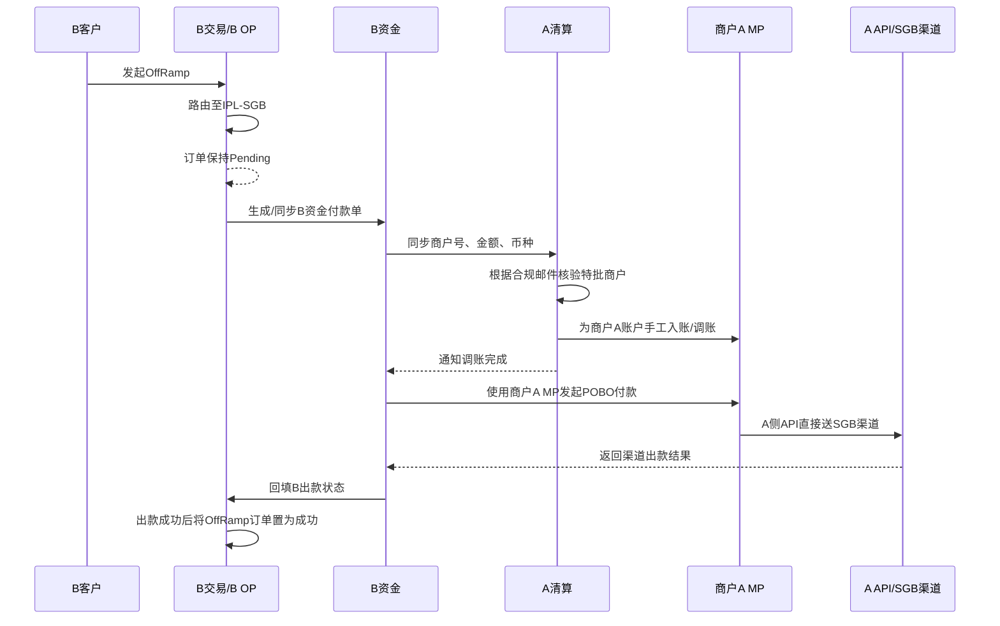
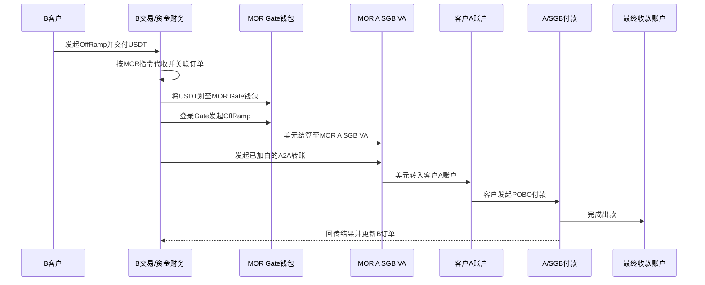
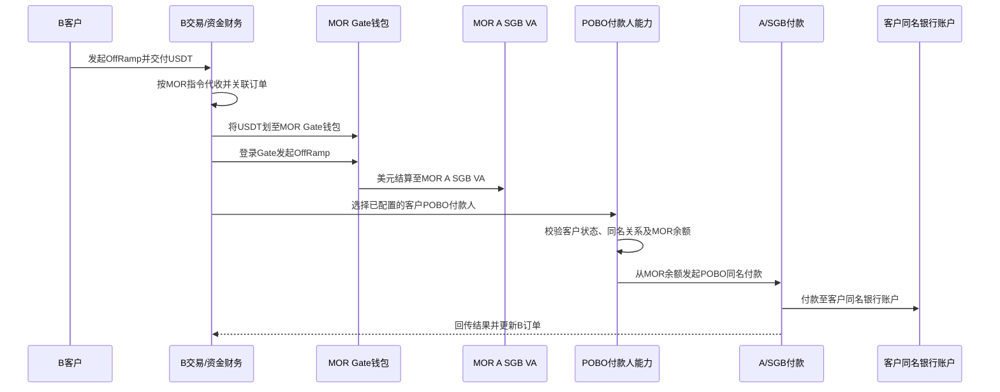

# B客户通过A SGB出款及MOR OTC临时方案说明

> 文档定位：简要说明B客户通过A SGB完成OffRamp的操作方案，以及B的SGB暂不能接收客资期间，由MOR承担类似OTC角色的临时流程。
>
> 核心原则：MOR在方案3和方案4中承担类似OTC的角色，负责承接客户USDT、通过Gate换成美元，并使用MOR在A开立的SGB VA完成后续交付。方案3通过A2A把美元转到客户A账户后由客户付款；方案4不做A2A，由MOR通过POBO付款人能力直接完成同名出款。两种方案均不进入B的SGB头寸。

## 一、背景

B需要确保客户OffRamp业务可以持续通过A的SGB渠道出款。目前B的SGB暂不能接收客资，因此需要同时准备：

1. 客户通过A SGB出款的人工操作链路；
2. MOR承接客户USDT、通过Gate换汇并交付美元的临时方案；
3. MOR资金与客户交易资金之间清晰、独立的账务记录。

本方案预计作为约两周的临时安排。如果后续B的SGB恢复接收该类客户资金并完成直连流程，则不再需要MOR从中周转。

## 二、四个方案概览

| 方案 | 用途 | 主要流程 | 当前定位 |
| --- | --- | --- | --- |
| 方案1：A SGB人工出款 | B客户正常OffRamp | 客户在A入网 → B订单路由`IPL-SGB` → A清算调账 → B资金操作POBO → B OP完结订单 | 客户交易主流程 |
| 方案2：Gate OffRamp | 通过Gate将数币换成美元 | B OffRamp后走Gate，但需要Gate提前具备足够美元头寸 | 当前测试中，预计下周下半周开放客户使用 |
| 方案3：MOR OTC+A2A | MOR承接客户USDT并换成美元，再转给客户A账户 | B代收客户U → MOR Gate换汇 → MOR A SGB VA → A2A转入客户A账户 → 客户POBO | 需要客户在A入网，并由A合规为A2A关系加白 |
| 方案4：MOR OTC+直接POBO | MOR承接客户USDT并换成美元，直接为客户同名出款 | B代收客户U → MOR Gate换汇 → MOR A SGB VA → MOR选择POBO付款人 → 同名账户收款 | 不需要A2A；需要POBO付款人产品改造；仅限同名 |

## 三、方案1：客户通过A SGB出款

### 3.1 提前准备

1. B合规将历史14个客户的入网材料提交A。
2. A完成客户审核并生成A客户账户号；双方需提前确认这批客户符合A的审核要求。
3. A合规通过邮件把已通过客户清单、14个特批商户号、A账户号及后续SGB出款安排同步给A清算。
4. 邮件中需明确：A清算根据B侧付款订单，对特批商户手工支持入账/调账（文案待定）。
5. 客户入网完成后，将A客户账户及必要操作信息移交B财务/资金管理。
6. A清算根据合规邮件，将14个特批商户号加入指定付款路由分组，并配置为`SGB`路由。
7. B新增OffRamp渠道`IPL-SGB`，并配置SGB付款渠道能力。
8. B、A提前验证A客户账户的SGB POBO出款链路可以正常执行。

合规邮件至少应包含：商户名称、B商户号、A客户账户号、入网通过状态、支持国家/币种、生效时间、指定路由`SGB`，以及“A清算根据B侧付款订单为该商户手工入账/调账”的操作说明。14个特批商户发生增删时，应通过新的确认邮件更新清单。

### 3.2 SGB付款渠道能力与路由

| 项目 | 方案1口径 |
| --- | --- |
| 付款模式 | SGB渠道仅支持POBO付款，不支持其他付款模式 |
| 渠道余额 | 发起下发前校验SGB可用余额；余额不足时拦截，不允许继续送渠道 |
| 支持国家 | 待确认；一期主要覆盖香港及已有明确业务需求的国家 |
| 路由分组 | 单独建立SGB付款路由分组，仅纳入邮件确认的14个特批商户号 |
| B侧渠道 | 新增`IPL-SGB`渠道，只有特批商户的合格订单可以路由进入 |
| A清算支持 | 根据B资金同步的付款单信息，手工为对应商户A账户入账/调账 |

非特批商户、非支持国家、非POBO付款或SGB余额不足时，不得路由至`IPL-SGB`。

### 3.3 客户交易及下发流程

操作步骤如下：

1. 客户在B发起OffRamp。
2. B将订单路由至新增渠道`IPL-SGB`。
3. 订单进入`Pending`，在A实际出款成功前不得提前置为成功。
4. B生成资金付款单，并向A清算同步商户号、付款金额和币种。
5. A清算根据合规邮件核验该商户是否属于14个特批商户，并为对应商户A账户手工入账/调账。
6. A清算将调账完成结果同步给B资金。
7. B资金使用该商户在A的MP账户发起POBO付款。
8. A侧API将付款直接送至SGB渠道。
9. A返回渠道出款结果，B资金在B侧回填出款状态。
10. 只有A出款成功后，B资金才能在B OP将客户OffRamp订单置为成功。

### 3.4 下发时间与频率

- 下发工作日：周一至周四。
- 计划下发时间：下午14:00和/或18:00。
- 下发频率：每天1—2个批次，以当日订单量和A清算处理安排为准。
- B资金应在批次前整理付款单，并一次性同步商户号、金额和币种给A清算。
- 非下发时间产生的订单继续保持`Pending`，进入下一可处理批次；紧急例外是否支持需由B资金与A清算另行确认。

### 3.5 客户交易账务

客户账务仍按B原OffRamp流程处理：

- B客户数币余额按订单规则冻结或扣减；
- 订单路由至`IPL-SGB`后，记入B对A/SGB的渠道在途；
- A完成POBO出款后，渠道在途转为渠道已结算，B OP才完结客户订单；
- A出款未成功时，订单保持`Pending`或按原流程失败/退回，不得因为A已调账就认定客户出款成功。

## 四、方案2：通过Gate完成OffRamp

方案2由B通过Gate完成数币兑美元及后续出款。目前Gate链路仍在测试，预计下周下半周完成准备并开放给客户使用，具体时间以测试通过和正式开放通知为准。

正式开放需要同时满足：Gate测试通过、客户交易能力已开放、美元头寸已经准备完成。如果Gate美元不足，需要B提前寻找其他渠道向Gate准备美元头寸。在正式开放或头寸未到位前，不能把真实客户订单路由到该方案，也不能把“已完成数币兑换”等同于“客户美元已经可出款”。

## 五、方案3：MOR作为OTC并通过A2A转给客户

### 5.1 方案定位

MOR承担类似OTC的角色，为B客户提供USDT承接、数币兑美元及美元交付服务。B根据MOR指令代收客户USDT，并由B资金/财务把USDT划至MOR的Gate钱包；Gate完成OffRamp后，美元进入MOR在A的SGB VA。

方案3通过A2A完成美元交付：MOR从自己的A账户转账至客户A账户，再由客户从自己的A账户发起POBO付款。

前置条件：

- MOR已在A入网并开立SGB VA；
- 客户已在A入网，具备可收款账户和POBO能力；
- A合规提前为“MOR → 客户”A2A转账关系加白；
- B资金/财务具备经授权的Gate、MOR A账户及客户A账户操作权限。

### 5.2 操作流程

方案3的核心是先把美元交付到客户自己的A账户，因此需要A2A转账及客户A入网。客户后续POBO是否允许异名，按客户自身产品能力和A合规规则处理。

## 六、方案4：MOR作为OTC并直接POBO同名出款

### 6.1 方案定位

方案4的前半段与方案3完全一致：B代收客户USDT，划至MOR Gate钱包，通过Gate OffRamp后，美元进入MOR在A的SGB VA。

区别在于方案4不做“MOR → 客户A账户”的A2A转账，而是对POBO产品进行小幅改造：MOR把已在B入网并审核通过的客户添加为POBO付款人，直接从MOR美元余额为该客户完成同名出款。

方案4只允许同名，不支持异名或第三方账户。

### 6.2 POBO付款人改造

| 功能 | 说明 |
| --- | --- |
| 添加POBO付款人 | MOR只能选择已在B入网且审核通过的客户，不允许自由录入主体 |
| 查看付款人 | 展示B客户ID、客户名称、状态、添加时间及可用状态 |
| 停用付款人 | 客户状态失效、合作终止或合规要求时停止使用 |
| 同名校验 | POBO付款人名称、B客户名称与最终银行账户名称须满足同名规则 |
| 出款控制 | 付款人有效、同名校验通过且MOR美元余额充足时才允许下发 |
| 订单关联 | 关联B订单、客户USDT、Gate换汇批次、MOR美元入账及POBO流水 |

### 6.3 操作流程

### 6.4 方案3与方案4的区别

| 对比项 | 方案3 | 方案4 |
| --- | --- | --- |
| MOR角色 | OTC：承接U、换美元 | OTC：承接U、换美元 |
| 美元落点 | MOR A SGB VA | MOR A SGB VA |
| A2A转账 | 需要，MOR转至客户A账户 | 不需要 |
| 客户A账户 | 必须具备 | 不依赖客户先接收A2A资金，具体开户要求待A确认 |
| 最终POBO | 客户从自身A账户发起 | MOR选择客户POBO付款人直接发起 |
| 同名限制 | 按客户产品及A合规规则 | 仅允许同名 |
| 异名处理 | 按A对客户账户的规则 | 不支持，改走方案1或方案3 |

## 七、方案3和方案4的共同账务

两种方案应按客户OffRamp和MOR受托结算往来记录：

- 客户在B发起OffRamp后，B冻结或扣减客户USDT，形成客户OffRamp应付款；
- B将USDT划至MOR Gate钱包后，记录MOR受托结算及渠道在途；
- MOR通过Gate把USDT换成美元，美元进入MOR A SGB VA；
- 方案3在A2A转入客户A账户后冲减该客户待交付美元；
- 方案4在POBO同名付款成功后冲减该客户待交付美元；
- 失败、退回或退票时，恢复对应的客户待交付金额，不得与其他客户余额混用；
- 每笔订单须串联B订单号、客户ID、USDT划转流水、Gate换汇流水、MOR A入账流水，以及A2A或POBO流水；
- 手续费、换汇价差和汇兑损益单独记录，不得混入客户本金。

## 八、需要提前确认

1. MOR作为类似OTC的服务角色，B按MOR指令代收客户USDT并划至MOR Gate钱包所需的客户授权、业务协议、合规及会计定性。
5. B资金/财务能否操作MOR的Gate和A账户，以及授权文件、操作权限和操作留痕。
6. 方案3的A2A客户加白范围、额度、频率、材料要求及失效机制。
9. 方案1历史14个客户的A入网结果、账户号、SGB路由配置及POBO验证是否全部完成。
10. SGB除香港外具体支持哪些需求国家，以及国家能力由谁维护和更新。
15. A/SGB能否支持方案4从MOR余额按底层客户身份发起POBO，以及银行流水最终展示名称。
16. 同一客户能否被多个MOR添加为POBO付款人，以及关系解除、停用和额度规则。

## 九、结论

- 方案1仍用于A已按原流程承接的客户及异名付款场景：`B客户 → IPL-SGB Pending → A清算调账 → 客户A账户POBO → B回填订单状态`。
- 方案3和方案4中，MOR均承担类似OTC的角色：承接客户USDT、通过Gate换成美元，并以MOR A SGB VA作为美元落点。
- 两种方案均不向B的SGB入金，也不形成B的SGB头寸。
- 方案3需要A2A：MOR先转账至客户A账户，再由客户发起POBO。
- 方案4不需要A2A：MOR通过新增的POBO付款人能力直接为客户完成同名出款。
- 方案4仅允许同名；异名或第三方付款改走方案1或符合合规要求的方案3。
- 两种方案均按客户OffRamp及MOR受托结算往来记录，不得记成B向MOR的USDT借款。
- 在方案4产品改造完成前，可先按已获合规批准的方案3人工流程执行。
