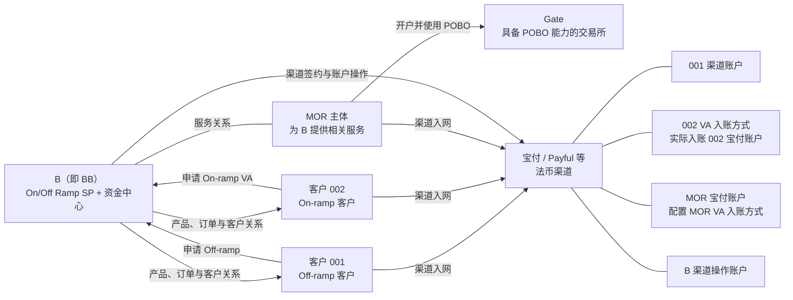
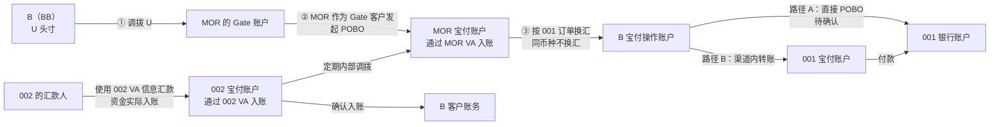
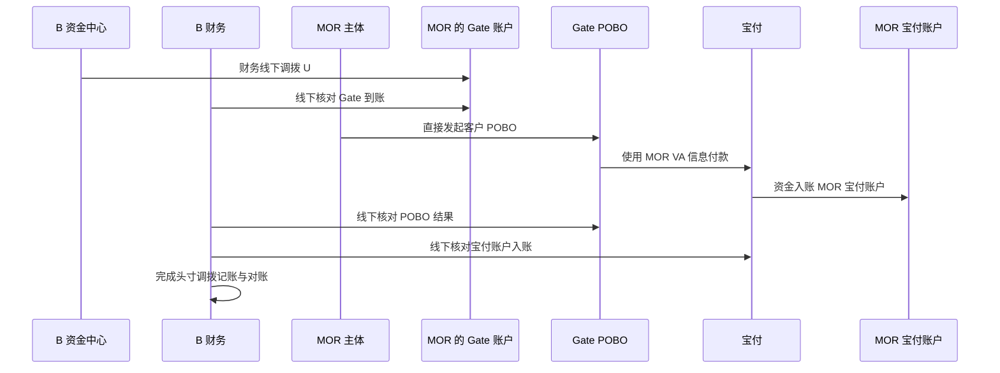
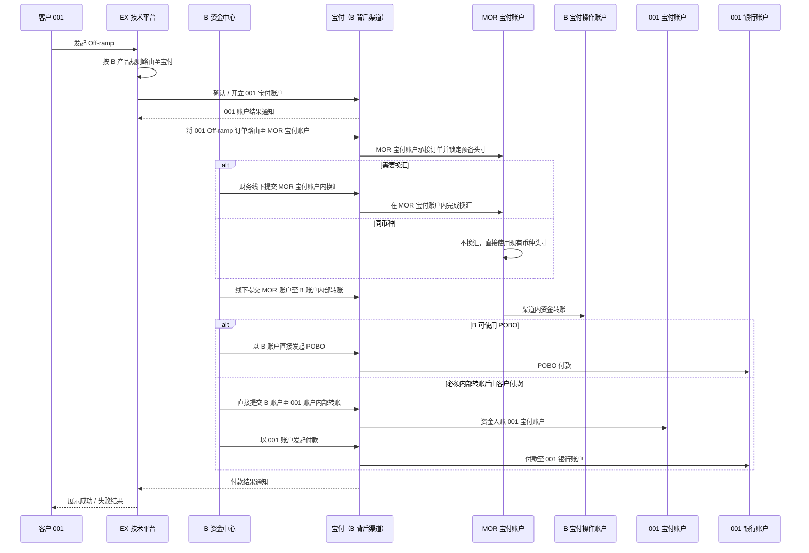
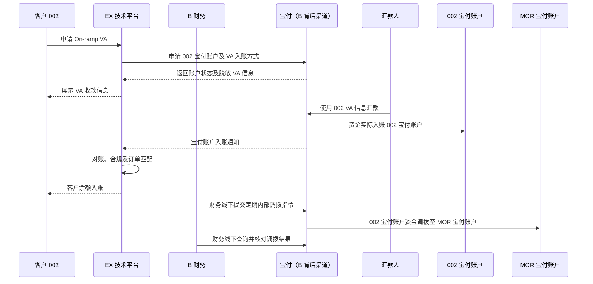
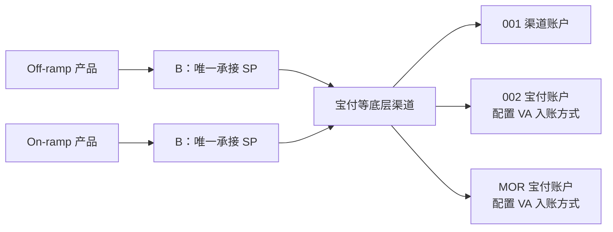

# B 通过 MOR 主体展业方案与 EX 一期产品准则

> 文档状态：方案草案，待业务、产品、资金、法务、风控及合规评审  
> 需求主体：B On/Off Ramp 业务  
> 适用范围：EX 一期 On-ramp、Off-ramp 产品，以及 B、MOR、渠道之间的内部头寸调拨  
> 系统边界：EX 仅为技术平台，负责产品、接口、账户映射、客户订单、客户账务和业务交易通知；B（即 BB）作为一期 On/Off Ramp SP 与资金中心；宝付是 B 背后的渠道；MOR 承接渠道可接受的主体及内部资金调拨；Gate、Payful 等为示例渠道  
> 核心原则：客户资金与内部头寸必须分别记账、可追溯、可对账；未完成主体、资金流及 POBO 合规评审前，不得按本文直接投入生产

# 第一部分：B 通过 MOR 主体展业方案

## 1. 背景与目标

由于 BB 资质及银行/PSP 准入要求的限制，部分法币 PSP 或银行无法接受 B 的直接来款。为支持 B 在 EX 当前阶段快速开展 On/Off Ramp 业务，拟引入 MOR 主体承接渠道侧可接受的入网及内部资金调拨。

本方案需要解决：

1. B、MOR、客户与背后渠道之间的入网和账户关系。
2. Off-ramp、On-ramp 及准备头寸时的资金流和账务归属。
3. 同名充值调单、B 使用 POBO 代客户付款等关键待确认问题。

EX 的产品、SP、余额和底层渠道展示规则在本文第二部分单独定义，不与 MOR 主体及资金方案混写。结汇能力不纳入 MOR 一期方案，放入后续阶段单独设计和评审。

## 2. 术语与主体

| 名称 | 本文定义 |
| --- | --- |
| B | 即 BB。本文中单独出现的 b、B、BB 均指同一个主体；正文统一写作 B |
| EX | 纯技术平台，承载产品、接口、客户订单、客户账务和业务交易通知；不处理内部资金调拨，也不作为 SP、渠道、资金主体或签约主体 |
| MOR | 用于渠道入网及 B 内部资金调拨的主体；其法律定位、资质和授权边界须经法务与合规确认 |
| 客户 001 | Off-ramp 客户 |
| 客户 002 | On-ramp 客户 |
| Gate | 具备 POBO 能力的交易所示例；MOR 需预先在 Gate 开户，B 将 U 调拨至 MOR 的 Gate 账户 |
| Payful | 用于说明 001、002、MOR 均需在同一渠道入网的渠道示例，不代表已确认生产能力 |
| VA | 一种入账方式和入账识别信息，不是独立资金账户；汇款使用 VA 信息，资金实际入账对应的宝付账户 |
| POBO | Pay On Behalf Of，代客户向指定银行账户付款 |
| 内部转账 | 同一渠道体系内不同已入网账户之间的账面资金转移 |

> 命名例外：“客户 B”“渠道 B”等带限定词的名称表示对应客户或渠道，不等同于本文的主体 B（BB）。
>
> 资金操作边界：头寸准备、内部归集及账户间资金调拨由 B 财务线下操作，不经过 EX，也不向 EX 发送调拨结果通知。财务通过 Gate、宝付后台或线下对账材料确认结果并完成内部记账。

## 3. 方案定位

### 3.1 一期定位

- EX 仅提供技术平台；B 作为一期 On/Off Ramp SP，宝付作为 B 背后的渠道。
- B 再将宝付等 PSP/银行作为自己的底层渠道接入。
- 对客户和 TP 隐藏宝付、Gate 等底层渠道，不展示底层渠道名称、账户结构和路由规则。
- 客户 001、客户 002、MOR 均需在实际承接业务的渠道完成入网。例如路由至 Payful 时，三者均应具备 Payful 认可的入网状态。
- MOR 主要解决渠道无法接受 B 直接来款时的内部头寸调拨问题，不替代客户本人的 KYC/KYB、交易审核或交易真实性要求。

## 4. 总体架构

### 4.1 业务关系

业务关系的核心是：

- B 是面向客户 001、002 的 On/Off Ramp SP 和资金中心。
- B 与 MOR 是服务关系，MOR 按双方约定为 B 提供渠道入网、头寸准备及资金调拨相关服务；具体服务及责任边界以合同、法务和合规确认结果为准。
- MOR 同时在 Gate 和宝付等法币渠道入网。
- 客户 001、客户 002、MOR 分别在实际承接业务的法币渠道入网。
- Gate 为 MOR 提供接收 U、承兑及客户 POBO 能力。
- 宝付等法币渠道提供 001、002、MOR 及 B 的宝付账户；VA 只是其中部分账户使用的入账方式。

### 4.2 资金流

资金流的核心是：

1. **准备头寸**：B 将 U 直接调拨至 MOR 的 Gate 账户；MOR 作为 Gate 客户发起 POBO，使用 MOR VA 信息付款，资金实际入账 MOR 宝付账户。
2. **Off-ramp**：MOR 宝付账户已提前备好头寸；001 发起 Off-ramp 后，订单直接由 MOR 宝付账户承接。如需换汇，在 MOR 宝付账户内完成，同币种无需换汇；之后转至 B 宝付操作账户，再根据最终确认路径由 B 直接 POBO，或先内部转账至 001 宝付账户后付款。
3. **On-ramp**：002 的汇款人使用 002 VA 信息汇款，资金实际入账 002 宝付账户；确认入账后记入 B 的客户账务；渠道资金再按周期从 002 宝付账户调拨至 MOR 宝付账户。

### 4.3 入网关系

| 参与方 | 渠道入网要求 | 主要用途 | 当前结论 |
| --- | --- | --- | --- |
| 客户 001 | 在实际承接 Off-ramp 的渠道入网 | 开立渠道账户、接收换汇/出款服务 | 一期需要 |
| 客户 002 | 在实际承接 On-ramp 的渠道入网 | 开立宝付账户并配置 VA 入账方式，接收外部汇款 | 一期需要 |
| MOR | 在法币渠道及具备 POBO 能力的交易所（如 Gate）入网 | 接收 B 调拨的 U，并以 Gate 客户身份发起 POBO 准备法币头寸 | 一期需要 |
| B 渠道操作账户 | 是否需要独立入网及以何账户类型开立待确认 | 接收 MOR/客户渠道账户内部转账并发起 POBO | 生产前必须确认 |

> “客户已在 B 完成入网”不自动等于“客户已在底层渠道入网”。B 审核状态和渠道入网状态需要分别记录。

## 5. 资金流一：准备头寸

### 5.1 目标

在法币渠道无法直接接受 B 来款时，前提是 MOR 已在具备 POBO 能力的交易所（如 Gate）开户。B 直接将 U 调拨至 MOR 的 Gate 账户，再由 MOR 作为 Gate 客户发起 POBO，使用 MOR VA 信息付款，资金实际入账 MOR 宝付账户。该流程不经过“MOR 在 B 的钱包”。

### 5.2 正向流程

### 5.3 账务要求

- B 划至 MOR Gate 账户的 U 应记录为内部头寸调拨，不得记为客户 001 或客户 002 的交易入金。
- MOR 的 Gate 账户入账、Gate POBO 订单、VA 入账识别信息和 MOR 宝付账户流水必须由财务在线下头寸调拨台账中关联。
- 财务台账应记录数字资产数量、币种、链上交易号、换汇汇率、法币金额、渠道费用、Gate 订单号、宝付流水号和价值日期。
- 头寸调拨完成前，未确认的法币不得计入可用头寸。
- 若客户 POBO 的实际汇款人与 VA 对应的 MOR 宝付账户户名不一致，应进入异常/调单流程，不得自动入账为可用余额。

### 5.4 待办：同名充值调单

需要与 Gate、宝付及合规共同确认：

1. MOR 作为 Gate 客户发起 POBO 后，实际汇款人名称是否能够与 VA 对应的 MOR 宝付账户户名一致。
2. 汇款人不一致时，宝付是否允许补充授权、POBO 关系或资金来源材料后入账。
3. 调单由谁接收、谁提供 SOF/SOW、POBO 指令、链上交易证明和主体关系材料。
4. 无法解释或超时未解决时的退款路径、费用和账务冲正方式。

## 6. 资金流二：Off-ramp

### 6.1 前置条件

- 客户 001 已在 B/EX 完成入网和产品开通。
- 客户 001 已在宝付等实际承接渠道完成入网并取得可用宝付账户；如需收款，可另行配置 VA 入账方式。
- MOR 宝付账户已提前完成头寸准备，并具备承接该笔 Off-ramp 的可用余额。
- B 宝付操作账户已开立并可接收 MOR 宝付账户的内部转账。
- 客户 001 的收款银行账户已完成必要校验。

### 6.2 正向流程

### 6.3 核心规则

1. EX 是技术平台，负责产品请求、账户接口、接收通知、处理订单和账务；换汇、内部转账和 POBO 等资金操作由 B 直接向宝付发起。B 是 Off-ramp SP，宝付是 B 背后的渠道。
2. 订单路由至宝付后，必须确认客户 001 的宝付入网和账户状态可用。
3. 客户发起 Off-ramp 前，MOR 宝付账户必须已经备好可用法币头寸；客户订单直接路由并由 MOR 宝付账户承接，不在交易发生后重新准备头寸。
4. 如订单需要换汇，换汇在 MOR 宝付账户内部完成；源币种与目标币种相同时不换汇。
5. MOR 宝付账户的资金转入 B 宝付操作账户后，必须关联原 Off-ramp 订单和内部头寸流水。
6. 在 POBO 能力及授权边界确认前，系统必须同时保留两种流程设计：
   - BB 宝付操作账户直接使用 POBO 向 001 银行账户付款；
   - BB 先内部转账至 001 宝付账户，再由 001 账户向其银行账户付款。
7. 未确认最终付款模式前，不得将“B 直接 POBO”作为生产默认路径。

### 6.4 待办：B 能否代客户付款

需由宝付、法务和合规共同确认：

- BB 宝付操作账户是否具备 POBO 产品权限。
- BB 是否可以基于客户 001 的指令和授权向 001 的银行账户付款。
- 该付款在宝付、银行流水和监管报送中的付款人、最终付款人、收款人及用途如何展示。
- 是否要求先将资金内部转入客户 001 的宝付账户，再由客户账户付款。
- 两种路径对应的合同、客户授权、材料、限额、费用、调单和退款责任。

## 7. 资金流三：On-ramp

### 7.1 前置条件

- 客户 002 已在 B/EX 完成入网和 On-ramp 产品开通。
- 客户 002 已在宝付等实际承接渠道完成入网、取得宝付账户并配置 VA 入账方式。
- EX 已建立“客户 002—B—宝付账户—VA 入账信息”的唯一映射。
- 汇款人规则、第三方汇款规则和同名要求已由渠道与合规确认。

### 7.2 正向流程

### 7.3 核心规则

1. EX 只是技术平台，处理开户/VA等技术接口并接收宝付通知；内部资金调拨由 B 直接向宝付发起。产品、签约和资金归属层的 SP 是 B，宝付是 B 的背后渠道，不形成面向客户的独立 SP。
2. EX 向客户展示必要的 VA 收款信息，但不展示 SP 路由、内部资金中心或 MOR 结构。
3. 渠道入账通知不等于客户可用余额。必须完成金额、币种、VA、汇款人、订单和合规状态匹配后，EX 才能给客户入账。
4. 002 宝付账户的资金定期调拨至 MOR 宝付账户属于内部资金归集，不得改变客户 002 在 EX 的余额和权利。
5. 资金从 002 宝付账户调拨至 MOR 宝付账户后，系统仍需保留客户级不可变账务快照，确保客户余额、渠道余额和 MOR 头寸可分别对账。
6. 调拨周期、最低金额、在途资金处理和渠道余额预警待资金团队确认。
7. 定期归集由 B 财务线下向宝付提交并核对，不通过 EX，也不向 EX 发送内部调拨通知；调拨结果记录在财务头寸台账和对账材料中。

## 8. MOR 方案上线前待确认事项

以下事项在确认前不得按默认可用能力配置生产流程。

### 8.1 B 在宝付开户

需要确认：

- B 是否可以作为宝付的机构客户完成开户。
- 开户主体、签约主体、实际操作主体和资金所有权主体是否均为 B。
- 开通 On-ramp、Off-ramp、内部转账、换汇及 POBO 分别需要哪些申请材料和审批。
- B、MOR、客户 001、客户 002 的入网关系是否可以在同一合作模式下成立。
- 开户、产品开通、测试交易和生产放量分别由谁审批。

### 8.2 B 在宝付的账户性质

需要由宝付、法务、合规和财务书面确认：

1. B 开立的是机构经营账户、客户资金账户，还是仅能处理 B 自有资金的账户。
2. 该账户是否允许接收、持有、换汇和支付与客户交易相关的资金。
3. 如果允许处理客户资金，客户授权、资金隔离、账务记录、监管报送和对账需要满足什么条件。
4. 如果只能处理 B 自有资金，MOR→B→客户的现有资金路径是否需要改为：
   - MOR 宝付账户直接向客户付款；
   - 先 A2A 转至客户 001 宝付账户，再由客户账户付款；
   - 或改由其他具备客户资金处理能力的渠道承接。
5. B 账户中公司自有资金、MOR 头寸和客户交易资金是否需要分别建立子账、专户或其他隔离机制。

### 8.3 Off-ramp 付款能力

需要确认 B 是否可以使用宝付 POBO 直接向客户 001 的银行账户付款。

如可以使用 POBO，需要宝付明确补充合作和交易材料，包括但不限于：

- B 与宝付的 POBO 产品协议或补充协议；
- 客户 001 对 B 的付款授权或委托关系；
- B、MOR、客户 001 之间的服务及资金关系证明；
- 客户 KYC/KYB、受益所有人及收款账户材料；
- 底层订单、合同、发票、付款用途及其他交易真实性材料；
- SOF/SOW、换汇记录和完整资金链路证明；
- POBO 付款人、最终付款人、收款人和附言的展示及报送口径。

如 B 不能直接使用 POBO，则一期默认路径应为 A2A：MOR 宝付账户 → B 宝付操作账户（以账户性质允许为前提）→ 客户 001 宝付账户 → 客户银行账户。若 B 账户不能处理客户资金，则需跳过 B 账户或更换承接渠道。

### 8.4 异常情况处理

#### 8.4.1 A2A 白名单失败

需要明确以下处置机制：

- 白名单添加失败、审核拒绝或超时期间，不得继续发起资金转账。
- 是否允许补充主体关系、客户授权或交易材料后重新申请。
- 无法加入白名单时，是退回原路径、由 MOR 直接付款、切换备用渠道，还是终止订单并退款。
- 在途资金停留位置、客户状态展示、处理时限、费用承担及人工升级责任。

#### 8.4.2 B 不被允许处理客户资金

需要提前确定替代方案和切换条件：

- 立即停止新增资金进入 B 宝付操作账户。
- 未入账交易在路由前拦截，不得继续承诺付款时效。
- 已在途资金由法务、合规和宝付确认原路退回、转入客户 001 账户或由 MOR/其他合格渠道继续处理。
- Off-ramp 路径调整为 MOR 直接付款、MOR→客户 001 A2A，或切换具备客户资金处理能力的渠道。
- 对已完成、处理中和待付款订单分别制定账务、通知及追踪方案。

#### 8.4.3 渠道政策收紧或要求冻结

冻结策略应支持按影响范围分层执行，不能默认同时冻结全部主体：

| 冻结层级 | 适用情形 | 影响范围 | 待确认事项 |
| --- | --- | --- | --- |
| 交易级 | 单笔材料、汇款人、收款人或用途异常 | 仅冻结相关订单及金额 | 补件、解除、退款和超时规则 |
| 客户级 | 客户 001/002 风险或材料失效 | 冻结该客户新增及在途交易 | 是否影响其渠道账户和历史余额 |
| MOR 主体级 | MOR 资质、资金来源或整体模式被质疑 | 暂停 MOR 头寸和相关客户路由 | 在途客户资金如何隔离、退回或迁移 |
| B 主体级 | B 账户资质、客户资金处理权限或整体合作被暂停 | 暂停宝付渠道下全部 B 业务 | 是否立即切换备用渠道，存量账户和资金如何处置 |

还需确认冻结指令来源、审批人、系统/线下执行人、冻结金额范围、客户通知口径、解冻条件、在途交易处理和监管/审计留痕。

### 8.5 是否启动备用渠道

需要在一期上线前决定是否同步启动备用渠道评估。建议至少完成可行性和应急预案，不应等主渠道实际中断后再开始寻找。

评估内容包括：

- 能否接受 B、MOR 及目标客户的入网和资金关系。
- 是否支持账户、VA 入账方式、A2A、换汇和 POBO。
- 是否允许 B 处理客户资金，以及对应账户性质。
- 客户材料、白名单、调单、冻结和退款要求。
- 接入周期、测试周期、成本、时效及可承接币种/地区。
- 主渠道不可用时，存量客户、在途订单和头寸能否迁移。

备用渠道的启动条件、资源投入和目标上线时间需由渠道、产品、技术、法务、合规和资金共同确认。

# 第二部分：EX 一期产品准则

## 1. 一期产品核心规则

### 1.1 一个产品由一个 SP 承接

同一个产品实例只绑定一个主 SP，不在一次产品服务中由多个 SP 拆分承接。

- 结汇产品的 SP 为鲲鹏，B 负责承兑，因此该结汇场景不定义为跨 SP 服务。
- 单 SP 承接可能产生跨账户体系审核问题。参考此前 A-B 数法融合：法币账户属于 A、数币账户属于 B；B 完成承兑后，资金进入法币账户仍需 A 审核，可能出现 A 无法入账，或入账后无法继续使用结汇等产品的情况。
- 产品设计必须在开户、承兑和入账前明确主 SP 及其账户体系的完整可用能力，不能只验证承兑环节。

### 1.2 一个产品只有一个主 SP 持有余额

一个产品只能指定一个主 SP 的账户承载客户余额，不能因底层路由或渠道切换，让同一产品的客户余额分散停留在多个 SP。

- A-B 均属于账户体系，余额归属和展示对客户认知影响较大。
- 如果多个 SP 都持有余额，但部分余额又不能向客户展示，将产生较高的限制说明、账务解释、对账和客诉成本。
- 对于不展示余额的其他 SP，其能力原则上设计为交易型产品：资金进入后直接完成出款，不在该 SP 形成面向客户的长期余额。

### 1.3 B 作为一期数字资产资金中心

一期 On-ramp、Off-ramp 均由 B 作为主 SP，宝付等 PSP/银行作为 B 背后的渠道。

- 优势：B 与 EX 均可复用同一套产品和渠道能力，相关交易量在EX 和B 都有数据，数币统一沉淀在，b 用统一交易量跟渠道降价（现有的钱包渠道，承兑渠道等）
- 约束：所有客户、产品和交易必须满足 B 的合规要求。

### 1.4 底层渠道不对客暴露

EX 对外展示产品、币种、金额、状态和客户可使用的账户信息，不展示宝付、Gate 等底层渠道名称、内部账户结构和资金调拨路径。

### 1.5 特殊场景处理

- 除已明确的产品结构外，跨 SP 或多 SP 场景不作为一期优先事项，特殊情况单独评审。
- 若越南业务形成稳定客户画像、交易规模和收益，再单独评估系统、渠道、合规及运营投入，不提前纳入一期通用能力。

## 2. EX 产品与渠道抽象

### 2.1 产品、SP 与渠道关系

| 层级 | 一期规则 | 对客可见性 |
| --- | --- | --- |
| 产品 | On-ramp、Off-ramp 分别配置产品能力 | 可见 |
| SP | 每个产品只绑定一个 SP，一期均为 B | TP 可按授权查看，终端客户不展示内部路由 |
| 底层渠道 | B 内部选择宝付、Payful 等渠道 | 不可见 |
| MOR | B 内部头寸和渠道主体安排 | 不可见 |
| 宝付账户及 VA 入账映射 | 宝付账户与客户、产品、SP、币种唯一映射；VA 仅作为入账识别信息 | 仅展示客户收款所需的 VA 信息 |

### 2.2 资金停留规则

- 每个产品必须配置唯一“资金停留 SP”。
- 一期 On-ramp、Off-ramp 的资金停留 SP 均为 B。
- MOR 和宝付账户余额属于渠道侧头寸或在途资金视图，不在 EX 对客侧形成第二套可用余额。
- 不允许底层路由在多个 SP 之间静默移动或沉淀客户余额。结汇产品单独指定鲲鹏为主 SP，B 提供承兑能力，不因此形成两个主 SP 或两套客户余额。

## 3. 订单、账户与账务数据

| 数据对象 | 核心字段 | 要求 |
| --- | --- | --- |
| 产品配置 | 产品、唯一 SP、资金停留 SP、生效时间 | 版本化，不允许订单处理中静默切换 |
| 渠道入网 | 客户、渠道、主体、状态、渠道客户号 | B 审核与渠道审核分别记录 |
| 宝付账户/VA 映射 | 客户、产品、SP、渠道、币种、宝付账户、VA 入账信息、状态 | 明确资金账户与入账方式的区别；映射全局唯一，敏感信息按权限脱敏 |
| 客户订单 | 客户、产品、金额、币种、报价、状态 | 不保存对客不可见的渠道敏感信息到客户展示字段 |
| 头寸调拨单 | 调出主体、调入主体、资产、金额、原因、关联订单 | 与客户订单分账，不得混记客户入金 |
| 渠道流水 | Gate/宝付订单号、银行流水号、价值日期、原始状态 | 原始报文留档，回调幂等去重 |
| 成本快照 | 汇率、点差、渠道费、银行费、实际与预计成本 | 下单时和完成时分别保存 |
| 审计日志 | 操作人、审批人、前后值、原因、时间 | POBO、调拨、换汇、冲正必须留痕 |

## 4. 状态与异常处理

### 4.1 建议状态

| 状态 | 进入条件 | 允许动作 | 退出条件 |
| --- | --- | --- | --- |
| 待渠道入网 | B 已受理但客户尚未通过底层渠道审核 | 补件、取消 | 渠道通过或拒绝 |
| 待头寸 | 订单已通过但指定账户头寸不足 | 准备头寸、取消 | 头寸就绪或失败 |
| 处理中 | 已向 Gate/宝付提交有效指令 | 查询、人工升级 | 成功、失败或待调单 |
| 待调单 | 户名、汇款人、用途或材料异常 | 补充材料、退款 | 通过、拒绝或超时 |
| 已完成 | 客户入账或银行付款达到确认终态 | 对账、下载回单 | 终态 |
| 失败 | 渠道明确拒绝或业务无法继续 | 冲正、退款、重新发起 | 终态或新订单 |
| 结果未知 | 渠道超时或回调状态不明确 | 主动查询、人工升级 | 明确成功或失败 |

### 4.2 关键异常

| 异常 | 处理原则 |
| --- | --- |
| Gate 客户 POBO 汇款人与 MOR VA 户名不一致 | 转待调单，资金不可用，补充 POBO/资金来源及主体关系材料 |
| 宝付入账成功但 EX 未匹配客户 | 进入待认领资金，不得自动记入任意客户 |
| EX 已入账但渠道后续退汇 | 冻结对应可用余额并按授权流程冲正，不得静默扣减 |
| MOR 换汇成功但 BB POBO 失败 | 保留实际法币头寸和成本，禁止重复换汇；付款重试或退款需重新审批 |
| 渠道回调重复 | 按渠道流水号、事件 ID 和业务幂等键去重 |
| 渠道结果未知 | 主动查单，确认终态前禁止重复付款或重复入账 |
| MOR 头寸不足 | 路由前拦截或进入待头寸，不形成无法履约的对客承诺 |

## 5. 风控、合规与法务要求

1. 分别确认 B、MOR、客户 001、客户 002 在合同、入网、资金所有权和交易指令中的法律角色；B 与 BB 为同一主体，不再拆分判断。
2. MOR 不得被产品文档直接视为天然具备代收、代付、换汇或资金归集资质；实际边界以法务、合规和渠道书面确认结果为准。
3. 客户 001/002 必须完成自身 KYC/KYB。MOR 入网不能替代真实客户审核。
4. 明确 B→MOR Gate 账户、Gate 客户 POBO→MOR 宝付账户、MOR→B 操作账户、002 宝付账户→MOR 宝付账户的资金性质、授权依据、报送口径和材料责任；VA 仅记录对应入账方式。
5. 明确客户资金、公司自有资金、MOR 头寸的隔离方式，不得以头寸调拨掩盖客户资金归属。
6. BB 使用 POBO 前，应取得产品权限、客户授权，并明确最终付款人、付款用途和调单责任。
7. 底层渠道信息可以对客户隐藏，但不得对法务、合规、审计、财务和监管报送隐藏。
8. 所有换汇、POBO、内部转账、人工入账、冲正和退款均需按权限审批并保留审计证据。

## 6. 分期方案

### Phase 1：单 SP 快速展业

- EX 作为技术平台代表 B 调用开户、VA 和客户交易接口，并接收客户业务交易通知；内部头寸调拨和归集不进入 EX。B 统一承接 On-ramp 和 Off-ramp。
- 宝付等作为 B 的背后渠道，不向客户暴露。
- 支持客户 001 Off-ramp、客户 002 On-ramp VA 及 MOR 头寸准备。
- 每个产品只绑定一个 SP，资金只停留在指定 SP 账户。
- 先解决同名充值调单和 BB POBO 路径选择。

### Phase 2：结汇产品建设

- 单独设计结汇产品、结汇账户、报价、路由及资金流。
- 结汇产品的主 SP 为鲲鹏，B 提供承兑能力；需要明确双方审核、入账、失败回退和对账边界。
- 结汇产品仍只允许一个主 SP 持有和展示客户余额，不将 B 的承兑角色定义为第二个余额 SP。

### 独立评估：越南场景

越南业务只有在形成稳定客户画像、规模和收益后，才单独立项评估渠道、系统、合规、运营和成本投入，不纳入一期通用建设范围。

## 7. 验收标准

1. EX 中 On-ramp、Off-ramp 产品均只能配置一个承接 SP 和一个资金停留 SP。
2. 客户 001、客户 002、MOR 的渠道入网状态可分别查询，未通过渠道入网的账户不能进入生产交易。
3. MOR 头寸调拨与客户订单分账，任一笔 U、换汇及法币入账均能追溯到唯一调拨单。
4. 客户 001 的 Off-ramp 可完整追踪至换汇、内部转账、POBO/客户账户付款及银行结果。
5. 汇款人使用客户 002 的 VA 信息付款、资金实际入账 002 宝付账户后，只有完成汇款人、金额、币种、订单及合规匹配，才记入 EX 客户余额。
6. 002 宝付账户资金定期调拨至 MOR 宝付账户后，客户余额不发生错误变化，渠道余额、MOR 头寸和客户账务可完成三方对账。
7. 同名充值异常能够进入待调单状态，未解决前资金不可用。
8. 渠道回调重复或结果未知不会造成重复入账、重复换汇或重复付款。
9. 客户和普通 TP 用户无法看到 MOR、宝付、Gate 等内部路由信息；授权的合规、资金和审计人员可以完整追溯。
10. 未确认 BB POBO 权限前，生产配置不能启用 BB 直接 POBO 路径。

## 8. EX 产品待确认事项

| 编号 | 待确认事项 | 建议责任方 | 阻塞范围 |
| --- | --- | --- | --- |
| EX-OQ-01 | EX 对客可展示的 VA 户名、银行信息和渠道标识范围 | 产品/法务/渠道 | On-ramp |
| EX-OQ-02 | 一个产品唯一 SP、唯一资金停留 SP 的配置主体、变更流程和存量订单处理 | 产品/技术 | EX |
| EX-OQ-03 | 结汇产品中鲲鹏主 SP 与 B 承兑角色的审核、账户、入账、失败回退和对账边界 | 产品/资金/合规 | Phase 2 |

## 9. 当前结论

为支持 EX 当前阶段快速展业，一期建议由 B 统一承接 On-ramp 和 Off-ramp 产品，并将宝付等 PSP/银行作为 B 的背后渠道管理；MOR 用于解决渠道无法接受 B 直接来款时的内部头寸准备与调拨。产品层实行“一个产品一个 SP、一个产品一个资金停留 SP”，对客户隐藏底层 SP/渠道结构，但内部必须完整保留主体、资金、订单和审计链路。

结汇作为下一期单独建设的产品，由鲲鹏作为主 SP、B 提供承兑能力，不定义为多主 SP 或多余额场景。其他特殊情况及越南专项在形成明确业务价值后再单独评审，不作为一期建设重点。
