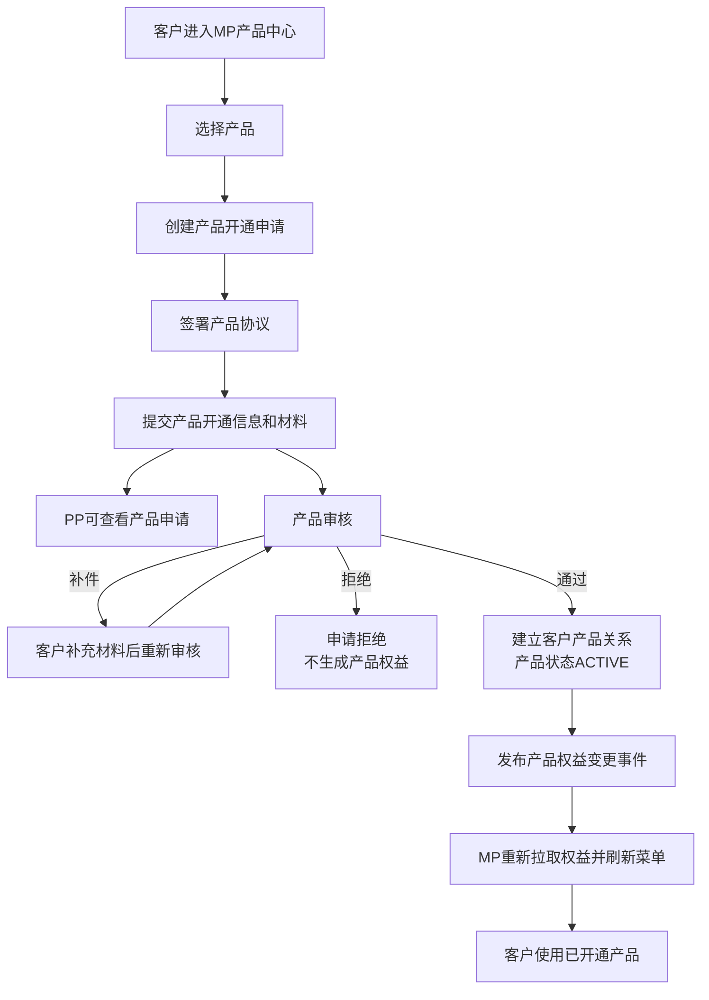
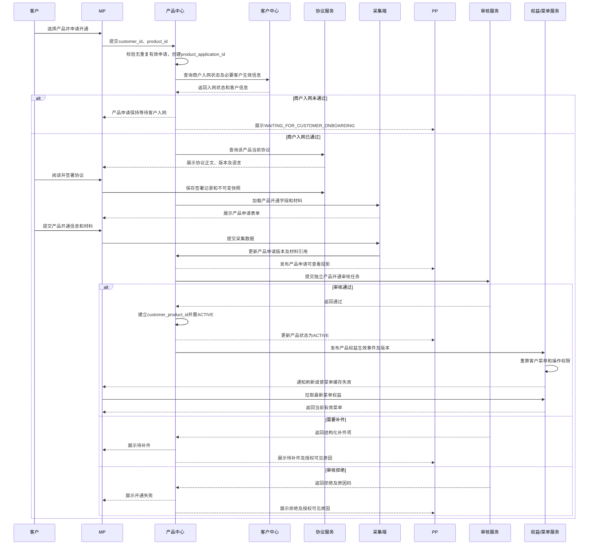

# 产品开通 BRD

> 文档状态：待评审  
> 需求主体：MP产品申请、PP产品申请查询、产品审核及MP菜单权益  
> 适用范围：MP、PP、产品中心、客户中心、协议服务、采集端、审核服务、权益/菜单服务  
> 系统边界：本方案覆盖新增产品申请、协议签署、资料提交、审核、开通、撤销、关闭及MP菜单同步；不包含客户注册、商户基础入网审核、视频认证和具体交易处理  
> 核心原则：一个产品一条独立申请；产品申请状态与客户入网状态分离；MP菜单以有效产品权益为准，不以前端缓存或申请提交状态为准

## 一、术语与前置关系

| 术语 | 定义 |
| --- | --- |
| 产品开通申请 | 客户针对一个具体产品提交的开通申请，使用唯一`product_application_id`维护完整生命周期 |
| 客户产品关系 | 产品审核通过后形成的`customer_product_id`，表示客户已获得该产品服务关系 |
| 产品权益 | 由有效客户产品关系生成的功能、菜单、操作和接口权限集合 |
| 申请撤销 | 产品尚未开通前终止本次申请，不产生有效客户产品关系 |
| 产品关闭 | 已开通产品停止新增业务能力；保留历史申请、协议、订单和审计记录 |

前置文档：

- 客户注册见：[客户注册-BRD.md](./客户注册-BRD.md)
- 商户基础入网与Level 1见：[客户入网-BRD.md](./客户入网-BRD.md)

产品开通审核是独立流程。客户中心只提供商户入网是否通过及必要客户生效信息；产品中心不修改客户入网状态，也不读取客户注册账号安全信息。

## 二、需求背景与目标

客户在MP申请开通产品后，PP需要查看客户提交的产品信息、协议、材料及审核状态。产品开通完成后，MP应准确展示该客户可使用的产品菜单，不应因缓存、重复事件或申请状态错误而提前展示、漏展示或继续展示已关闭产品的操作入口。

同时需要处理两类常见情况：

1. 客户申请了错误产品，需要根据申请所处阶段撤销、关闭或重新申请正确产品。
2. 客户已有产品后希望增加新产品，需要新建独立申请，且不影响既有产品和菜单。

产品目标：

1. 支持客户通过MP选择并申请一个或多个产品。
2. 支持PP查看授权客户的产品申请、协议、材料、审核状态和历史记录。
3. 产品开通后自动生成产品权益并准确更新MP菜单。
4. 产品关闭或暂停后及时收回新增操作权限，同时保留必要历史查询入口。
5. 支持错误产品申请的安全撤销/关闭及正确产品重新申请。
6. 支持客户增加产品，每个产品独立申请、独立审核、独立开通。

## 三、角色与职责

| 角色/系统 | 主要职责 | 不可执行 |
| --- | --- | --- |
| MP客户 | 浏览产品、发起申请、签署协议、提交/补充材料、申请撤销或关闭、查看状态 | 直接修改审核结果或产品权益 |
| PP用户 | 查看授权客户的产品申请、材料、协议、状态及历史；按权限执行运营动作 | 代客户签署协议；物理删除申请；直接修改客户菜单 |
| 产品中心 | 产品目录、产品配置、产品申请、客户产品关系及状态的权威源 | 保存客户最新业务主档；修改客户入网状态 |
| 客户中心 | 提供商户入网状态及必要客户生效信息 | 保存产品申请、产品配置或菜单权益 |
| 协议服务 | 提供产品协议并保存客户签署快照 | 覆盖历史协议记录 |
| 采集端 | 根据产品/SP加载产品字段和材料 | 生成审核结论或产品权益 |
| 审核服务 | 审核产品申请并返回通过、补件或拒绝 | 覆盖客户原始申请资料 |
| 权益/菜单服务 | 根据有效客户产品关系计算权益和菜单 | 以申请中、拒绝或撤销状态授予产品操作权限 |

## 四、主流程

### 4.1 简化流程

### 4.2 系统时序

## 五、MP功能需求

### 5.1 产品列表与申请

| 功能 | 业务要求 |
| --- | --- |
| 可申请产品 | 展示客户当前可申请产品、已申请状态及已开通状态；不得重复展示为可申请 |
| 产品详情 | 展示产品说明、准入条件、必要协议、材料提示及适用范围 |
| 创建申请 | 一个客户针对同一产品同时只允许一条未终止申请；重复点击使用幂等键返回原申请 |
| 协议签署 | 客户主动确认产品协议；保存版本、语言、时间和不可变快照 |
| 资料提交 | 采集产品专属字段和材料；支持草稿、完整性校验和补件版本 |
| 状态查看 | 展示等待客户入网、采集中、审核中、待补件、通过、拒绝、撤销、关闭等状态 |
| 新增产品 | 客户可从未开通产品中继续申请；每个新增产品生成独立申请 |

### 5.2 MP菜单与权益

1. MP菜单必须由权益/菜单服务根据有效`customer_product_id`计算，不得仅凭客户端本地配置、申请提交记录或PP展示状态决定。
2. 产品状态为`ACTIVE`后才开放对应业务菜单和操作权限。
3. `DRAFT`、`SUBMITTED`、`REVIEWING`、`RFI_REQUIRED`、`REJECTED`、`CANCELLED`不开放产品业务菜单，但应在“产品申请/状态”页面可见。
4. 产品状态为`SUSPENDED/CLOSING/CLOSED`时停止新增业务操作；历史订单、账单、对账或资料是否保留查询入口，由各产品配置决定。
5. 多个产品共享同一菜单时，菜单只展示一次；只有所有提供该菜单权益的产品均失效后才移除。
6. 产品开通、暂停、恢复、关闭后，产品中心发布带版本号的权益事件；权益服务幂等处理并使MP菜单缓存失效。
7. 客户重新登录、刷新页面或收到权益变更通知后，MP必须从服务端重新拉取最新权益。
8. 前端隐藏菜单不能替代后端鉴权；无产品权益时直接调用产品接口必须被拒绝。

## 六、PP功能需求

PP可按授权客户范围查看：

- 客户业务ID及必要业务基本信息；
- 产品名称、产品ID、SP、申请ID和申请版本；
- 产品开通信息及材料清单；
- 产品协议名称、版本、语言、签署时间和签署快照；
- 当前申请状态、产品状态、补件项及授权可见拒绝原因；
- 产品申请、审核、权益生效、暂停、关闭和撤销的时间线；
- 当前客户已开通产品列表。

PP不可：

- 查看客户密码、验证码、登录手机号/邮箱和2FA；
- 代客户签署产品协议；
- 直接修改客户产品权益或MP菜单；
- 物理删除已提交或已开通产品记录；
- 把一个产品申请直接修改为另一个`product_id`。

## 七、异常流程一：客户开错产品

### 7.1 处理原则

产品ID是申请的不可变业务字段。客户选错产品时，不允许把原申请直接修改成另一个产品，必须终止原申请并为正确产品创建新申请，以保证协议、字段、材料和审核记录一致。

| 原申请状态 | 处理方式 | 菜单/权益处理 |
| --- | --- | --- |
| `DRAFT/COLLECTING` | 客户可删除草稿或撤销申请，然后选择正确产品 | 未生成权益，无菜单变化 |
| `SUBMITTED/REVIEWING` | 客户发起撤销；审核服务未终态时进入`CANCEL_REQUESTED`，确认后转`CANCELLED` | 未生成权益，不展示产品业务菜单 |
| `RFI_REQUIRED` | 客户可放弃补件并撤销，转`CANCELLED` | 未生成权益 |
| `REJECTED/CANCELLED` | 保留历史记录；客户可另行申请正确产品 | 不生成权益 |
| `APPROVED/ACTIVE` | 不允许删除或改产品ID；客户发起产品关闭，并独立申请正确产品 | 原产品关闭完成后收回原权益；正确产品审核通过后新增权益 |
| `CLOSING` | 等待关闭完成；不得重复提交关闭 | 依据产品风险规则停止新增或保持受限能力 |
| `CLOSED` | 保留历史申请、协议、订单和审计记录 | 移除新增操作权益，历史查询按配置保留 |

### 7.2 已开通产品关闭校验

关闭前至少校验：

- 是否存在处理中交易、在途资金、未结算余额或未完成退款/退票；
- 是否存在未完成对账、费用或账单；
- 是否有依赖该产品的子账户、收款人、渠道关系或自动任务；
- 是否需要客户确认关闭影响及重新签署关闭声明；
- 是否需要PP、运营、合规或财务审批。

具体关闭条件按产品配置，待相关产品Owner确认。在条件未满足时状态保持`CLOSING/BLOCKED`，不得直接删除数据或立即收回会导致在途业务无法完成的查询能力。

## 八、异常流程二：客户增加产品

1. 客户进入MP产品中心，选择一个尚未开通且无进行中申请的产品。
2. 产品中心为新增产品创建新的`product_application_id`。
3. 产品中心查询客户中心的最新商户入网状态及必要客户信息。
4. 可复用的客户基础信息以客户中心最新生效版本为准；产品专属字段、材料和协议必须重新采集/签署。
5. 新产品独立进入审核，不改变原有产品的状态、菜单和交易能力。
6. 新产品审核通过后新增`customer_product_id`，权益服务将新产品权益并入现有菜单集合。
7. 新产品审核拒绝、补件或撤销时，现有产品和菜单保持不变。
8. 同一产品已有`ACTIVE`关系或未终止申请时，禁止重复申请并返回原关系/申请状态。

## 九、状态模型

| 状态 | 含义 | 客户操作 | 是否生成产品权益 |
| --- | --- | --- | --- |
| `DRAFT` | 申请已创建但未提交 | 编辑、删除草稿 | 否 |
| `COLLECTING` | 正在签署协议或采集资料 | 继续填写、撤销 | 否 |
| `WAITING_FOR_CUSTOMER_ONBOARDING` | 等待商户基础入网通过 | 查看、撤销 | 否 |
| `SUBMITTED` | 已提交产品审核 | 查看、申请撤销 | 否 |
| `REVIEWING` | 产品审核中 | 查看、申请撤销 | 否 |
| `RFI_REQUIRED` | 待补产品资料 | 补件、撤销 | 否 |
| `CANCEL_REQUESTED` | 撤销请求处理中 | 查看 | 否 |
| `CANCELLED` | 产品申请已撤销 | 查看历史、重新申请 | 否 |
| `REJECTED` | 产品申请被拒绝 | 查看、按规则重新申请 | 否 |
| `ACTIVE` | 产品已开通 | 使用产品、申请关闭 | 是 |
| `SUSPENDED` | 产品暂时不可新增业务 | 查看、按规则恢复 | 否或受限，按产品配置 |
| `CLOSING` | 产品关闭处理中 | 查看 | 停止新增业务，保留必要处理能力 |
| `CLOSED` | 产品已关闭 | 查看历史、重新申请 | 否 |

状态转换必须校验当前状态，重复请求需幂等；不得从`REJECTED/CANCELLED`直接改为`ACTIVE`，必须重新申请或按已确认的重新审核规则处理。

## 十、关键字段

| 字段 | 必填 | 来源 | 可见范围 | 说明 |
| --- | --- | --- | --- | --- |
| `customer_id` | 是 | 客户中心 | MP/PP/审核 | 客户业务标识 |
| `product_id` | 是 | 产品中心 | MP/PP/审核 | 创建申请后不可修改 |
| `product_application_id` | 是 | 产品中心 | MP/PP/审核 | 产品申请唯一标识 |
| `product_application_version` | 是 | 产品中心 | MP/PP/审核 | 提交、补件生成不可变版本 |
| `customer_product_id` | 开通后是 | 产品中心 | MP/PP/权益服务 | 客户产品关系唯一标识 |
| `sp_id` | 是 | 产品配置 | MP/PP/内部 | 产品确定SP；不包含具体牌照 |
| `agreement_record_id` | 是 | 协议服务 | MP/PP/审核 | 对应实际签署版本 |
| `product_status` | 是 | 产品中心 | MP/PP/权益服务 | 产品申请/关系状态 |
| `review_id` | 提交审核后是 | 审核服务 | PP/内部 | 产品审核任务ID，不复用商户入网审核ID |
| `entitlement_version` | 开通/变更后是 | 权益服务 | MP/PP/内部 | 菜单和权限版本 |
| `menu_codes` | 开通后是 | 产品/权益配置 | MP/内部 | 产品提供的菜单集合 |
| `action_permissions` | 开通后是 | 产品/权益配置 | MP/内部 | 后端接口权限集合 |
| `cancellation_reason` | 撤销时是 | 客户 | MP/PP | 结构化原因+备注 |
| `closure_reason` | 关闭时是 | 客户/运营 | MP/PP | 结构化原因+备注 |

## 十一、异常场景

| 异常场景 | 处理规则 |
| --- | --- |
| 同一产品重复申请 | 返回现有ACTIVE关系或未终止申请，不重复创建 |
| 客户入网未通过 | 产品申请保持等待，不创建最终产品关系 |
| 协议未签或保存失败 | 不允许提交产品审核 |
| 审核补件 | 生成新申请版本，原版本保留审计 |
| 审核通过但权益事件失败 | 产品保持ACTIVE，权益进入待同步/重试；MP未取得权益前不得开放操作 |
| 权益事件重复或乱序 | 按`customer_product_id + entitlement_version`幂等及版本校验 |
| MP菜单缓存未更新 | 强制失效缓存并重新拉取；后端权限仍以实时权益为准 |
| 关闭事件失败 | 产品保持CLOSING并重试，不得直接显示CLOSED |
| 错误产品已产生交易 | 不允许直接关闭；先处理在途交易、余额、账单和对账 |
| 增加产品审核失败 | 原有产品权益保持不变 |

## 十二、通知、审计与非功能要求

1. MP接收申请提交、审核中、补件、通过、拒绝、撤销、暂停及关闭通知。
2. PP可查看状态更新时间、来源系统及完整时间线。
3. 协议签署、申请提交/补件、审核、撤销、关闭、权益生成和菜单变更均记录审计日志。
4. 产品状态和权益事件需支持幂等、重试、去重、乱序保护及失败告警。
5. MP首次登录、重新登录及菜单刷新时，应校验最新权益版本。
6. 菜单接口和业务接口必须使用相同权益源，避免“菜单可见但接口无权”或“菜单隐藏但接口可调用”。
7. PP只能查看授权范围内的产品申请和材料，敏感字段按权限脱敏。

## 十三、验收标准

1. 已完成基础入网的客户可在MP选择产品并创建独立产品申请。
2. 客户可签署产品协议、提交产品开通信息和材料，并查看申请状态。
3. PP可查看授权客户提交的产品信息、材料、协议版本、审核状态和历史记录。
4. 产品审核通过前，MP不展示该产品的业务操作菜单。
5. 产品审核通过并建立`customer_product_id`后，权益服务生成权益，MP刷新后准确展示对应菜单。
6. 产品审核拒绝、撤销或补件时，不生成产品业务权益。
7. 多产品菜单按有效权益取并集，共享菜单不重复展示。
8. 产品关闭后停止新增业务操作并移除相应权益；历史查询入口按产品配置保留。
9. 客户选错产品且申请仍为草稿时可删除；已提交时可申请撤销；已开通时必须关闭原产品，不能直接改`product_id`。
10. 客户申请正确产品时生成新的申请、协议和审核记录，原错误申请历史完整保留。
11. 客户增加产品时，新产品独立审核；通过后新增菜单，补件/拒绝/撤销不影响已有产品。
12. 同一客户、同一产品存在ACTIVE关系或未终止申请时，不会重复创建产品申请。
13. 权益事件重复、延迟或乱序不会导致菜单重复、错误恢复或越权。
14. 即使前端错误展示菜单，后端也会拒绝无有效产品权益的操作。

## 十四、待确认事项

| 编号 | 待确认事项 | 责任方 | 影响范围 |
| --- | --- | --- | --- |
| D1 | 各产品开通审核责任角色、审核字段、材料及SLA | 产品/审核/运营 | 产品审核 |
| D2 | 已提交审核后允许自动撤销还是需要审核人确认 | 产品/审核 | 错误产品处理 |
| D3 | 已开通产品关闭所需运营、合规、财务审批及检查项 | 产品/合规/财务 | 产品关闭 |
| D4 | 各产品菜单、按钮、接口权限及共享菜单合并规则 | 产品/技术 | 权益与菜单 |
| D5 | 产品关闭后历史订单、账单、对账和资料入口的保留范围 | 产品/运营/合规 | 历史查询 |
| D6 | 已关闭产品重新申请时是否复用历史材料、是否重新签署协议 | 产品/合规/法务 | 重新开通 |
| D7 | 客户基础信息变化后，已开通产品是否触发重新审核或暂停 | 产品/风控/合规 | 持续合规 |
| D8 | PP是否可代客户发起关闭、催办、退回补件，及其权限审批 | 产品/运营/安全 | PP功能 |
| D9 | 权益同步的目标时延、失败补偿和人工修复工具 | 技术/产品 | 菜单准确性 |

