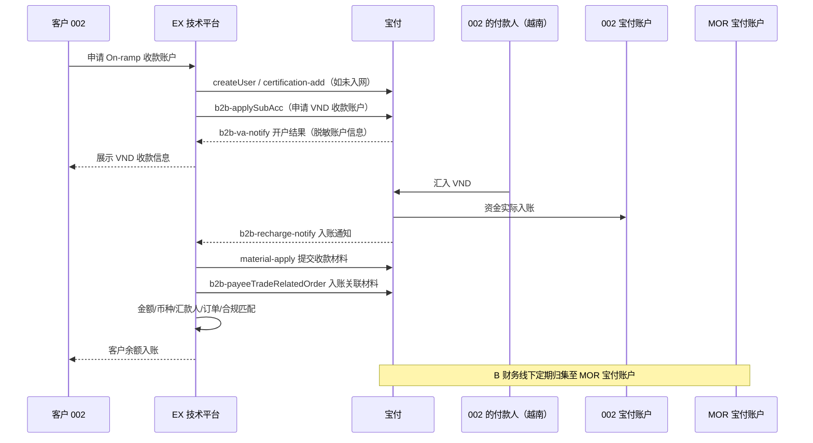
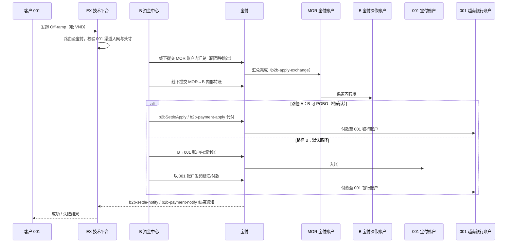

# 宝付 VND On/Off-ramp 对接 PRD

> 日期：2026-08-02 ｜ 文档类型：渠道对接 / 产品需求（B2B）
> 参考资料：
>
> 1. `ABSolutions/mor解决方案/B通过MOR主体展业方案.md`（MOR 展业架构、B 作为一期 SP 与资金中心、渠道不对客暴露等一期准则，本文直接继承其主体关系与资金流定义）
> 2. Payful（宝付国际）跨境 B2B 开放平台文档：https://doc.payful.com/docs/agent/b2b
>
> 核心原则：EX 仅为技术平台；B 作为一期 On/Off-ramp SP 与资金中心；宝付为 B 背后的渠道，**对客户隐藏**；MOR 主体承接渠道入网与内部头寸调拨。客户资金与内部头寸分别记账、可追溯、可对账。

---

## 一、背景与目标

越南市场存在 VND（越南盾）的 On/Off-ramp 双向需求：

- **On-ramp（VND 收款）**：越南客户/付款人向指定账户支付 VND，完成收款入账、（可选结汇/汇兑）后归集，为客户产生可用余额或兑付数币。
- **Off-ramp（VND 付款）**：客户发起兑付申请，我方将头寸经汇兑/结汇后以 VND 付款至客户指定的越南本地银行账户。

一期选择**宝付（Payful 跨境 B2B）**作为 VND 承接渠道，接入其「注册入网 → 申请收款账户 → 收款入账 → 结汇/付款/汇兑」的 B2B 能力闭环。本文档定义：

1. B、MOR、客户与宝付之间的入网与账户关系；
2. VND On-ramp 收款入账、Off-ramp 结汇付款的资金流、接口映射与账务归属；
3. 头寸准备（B → MOR → 宝付）与内部归集路径；
4. 状态机、异常处理、对账、合规要求与分期计划。

## 二、术语与主体

| 名称               | 定义                                                                                                     |
| ------------------ | -------------------------------------------------------------------------------------------------------- |
| B（BB）            | 一期 On/Off-ramp SP 与资金中心，宝付是其背后的渠道                                                       |
| EX                 | 纯技术平台：产品、接口、客户订单、客户账务、业务交易通知；不处理内部资金调拨                             |
| MOR                | 渠道入网及 B 内部头寸调拨主体；Gate 承兑 + 宝付入网                                                      |
| 客户 001           | Off-ramp 客户（收 VND 付款方）                                                                           |
| 客户 002           | On-ramp 客户（其付款人向 VND 收款账户汇款）                                                              |
| 宝付 / Payful      | B 背后的法币渠道，提供 B2B 收款账户、收款入账、结汇/付款/汇兑能力                                        |
| 收款账户（子账户） | 宝付侧为客户开立的收款账户（含本地账户 / 香港多币种账户），VA 仅是入账识别信息，资金实际入账对应宝付账户 |
| POBO               | Pay On Behalf Of，代客户向指定银行账户付款                                                               |

> 命名规则沿用《B通过MOR主体展业方案》：客户资金、公司自有资金、MOR 头寸三层隔离；头寸准备与归集由 B 财务线下操作，不经过 EX。

## 三、对接范围（宝付 B2B 能力映射）

| 业务环节       | 宝付接口                                                                                                                                  | 用途                                                            | 本文章节 |
| -------------- | ----------------------------------------------------------------------------------------------------------------------------------------- | --------------------------------------------------------------- | -------- |
| 注册入网       | 创建用户（createUser）→ 新增实名（certification-add）                                                                                    | 客户/MOR 线上开户认证，支持中国内地、中国香港、境外公司         | 4.1      |
| 申请收款账户   | 账号申请（b2b-applySubAcc）                                                                                                               | 为客户秒级开立本地收款账户 / 香港多币种账户（VND 待确认）       | 4.2      |
| 收款入账       | 收款材料提交（material-apply）→ 入账通知（b2b-recharge-notify）→ 入账关联收款材料（b2b-payeeTradeRelatedOrder）                         | 材料自动审核、关联入账、支持同名充值                            | 4.3      |
| 结汇/付款/汇兑 | 结汇付款（b2bSettleApply）→ 付款申请（b2b-payment-apply）→ 汇兑交易（b2b-apply-exchange）                                               | 入账资金灵活使用：结汇出款、SWIFT/LOCAL/BILLPAY/BPAY 付款、汇兑 | 4.4–4.6 |
| 收款管理       | 收款人查询/添加（b2b-addPayee / add-user-payees）                                                                                         | 结汇付款、付款申请前置的收款人维护                              | 4.5      |
| 异步通知       | 子账户开户结果（b2b-va-notify）、入账通知、结汇出款结果（b2b-settle-notify）、汇款结果（b2b-payment-notify）、汇兑通知（exchange-notify） | 结果回执，回调幂等                                              | 4.7、六  |

接口通用约束：请求体业务数据置于加密字段 `dataContent`；`userNo` 为宝付客户号；`userReqNo` 为业务幂等键（格式示例 `20240923095537-3108625708`），全链路幂等去重。

## 四、对接方案

### 4.1 入网与账户关系

| 参与方               | 宝付入网动作               | 接口                            | 说明                                                                    |
| -------------------- | -------------------------- | ------------------------------- | ----------------------------------------------------------------------- |
| 客户 001（Off-ramp） | 创建用户 + 实名            | createUser → certification-add | B 审核与渠道入网状态**分别记录**；客户已在 B 入网 ≠ 已在宝付入网 |
| 客户 002（On-ramp）  | 创建用户 + 实名 + 收款账户 | + b2b-applySubAcc               | 开立收款账户并获取入账识别信息（VA）                                    |
| MOR                  | 创建用户 + 实名 + 收款账户 | 同上                            | 接收 Gate POBO 法币头寸（MOR VA 入账）及客户归集资金                    |
| B                    | 渠道签约与操作账户         | 线下                            | 账户性质（能否处理客户资金）沿用 MOR 方案 §8.2 待确认结论              |

**账号申请关键字段**（b2b-applySubAcc，示例）：`accountPayeeType`（收款人类型）、`bankCode`（开户行）、`country`（账户区域，如 HKG）、`goodsType`（贸易商品大类）、`goodsTradeType`（贸易类型）、`goodsArea`（贸易国家/地区）、`platformType`（经营平台类型，如 Independent station）、`webUrl`（经营网址）、`exceptYearSalesAmount`（预计年销售额）、`goodsFileNo`（贸易材料文件号，经 ex-upload-file 上传）、`callBackUrl`（开户结果回调）。

> **VND 账户能力待确认**：宝付 B2B 公开文档未列示 VND 本地账户与 VND 结汇/付款的具体支持范围、开户行（bankCode）枚举和材料要求，需在接入前向宝付书面确认（见九、待确认-01）。

### 4.2 On-ramp（VND 收款入账）

**资金流**：002 的付款人 → 使用 002 收款账户信息汇入 VND → 资金实际入账 002 宝付账户 → 入账通知至 EX → 材料关联与合规匹配 → EX 客户余额入账 → B 财务定期归集至 MOR 宝付账户（线下）。

**入账通知关键字段**（b2b-recharge-notify，示例）：`tradeNo`（宝付交易号）、`userNo`、`bankAccountNo`（入账账户）、`remitAccName`/`remitAccNo`（汇款人名称/账号）、`tradeTotalAmount`（汇款总额）、`amount`（实际入账金额）、`fee`（手续费）、`ccy`（币种）、`currentBalance`（当前余额）、`tradeTime`、`status`。

**核心规则**：

1. 渠道入账通知 ≠ 客户可用余额；必须完成汇款人、金额、币种、账户、订单及合规匹配后才能入账。
2. **同名充值**：宝付支持同名充值与收款材料自动审核；汇款人与账户户名不一致时进入待调单/补充材料流程（收款材料 + 关联关系），资金在确认前不可用。
3. 越南为外汇管制国家，On-ramp 收款如需后续结汇，收款材料（贸易背景：合同/PI/订单明细/物流报关等）应在入账环节即完成提交与关联，口径与「渠道中心」人民币结汇申报结构对齐。
4. EX 建立「客户 002 — B — 宝付账户 — 入账识别信息」唯一映射；敏感账户信息按权限脱敏，对客仅展示收款所需信息，不暴露宝付渠道名称。

### 4.3 Off-ramp（VND 结汇付款）

**资金流**：MOR 宝付账户（已备头寸）→ 按 001 订单汇兑/结汇 → 转至 B 宝付操作账户 → 路径 A（B 直接 POBO，待确认）或路径 B（内部转账至 001 宝付账户后由客户账户付款）→ 001 越南银行账户。

**核心规则**（沿用 MOR 方案 §6.3）：

1. 客户发起 Off-ramp 前，MOR 宝付账户必须已备好可用头寸；订单直接由 MOR 账户承接，不在交易发生后临时准备。
2. 换汇/结汇在 MOR 账户内完成，同币种不换汇；MOR→B 转账必须关联原 Off-ramp 订单与内部头寸流水。
3. **未确认 B 的 POBO 权限前，生产默认路径为路径 B（内部转账至 001 账户后付款）**，不得将 B 直接 POBO 设为默认。

### 4.4 结汇付款（b2bSettleApply）

**关键字段**（示例）：`paymentCcy`（付款币种，如 USD）、`payeeCcy`（收款币种，如 CNY；VND 待确认）、`tradeAmount`（交易金额）、`payeeAccountId`（收款人账户，前置经 b2b-addPayee 维护）、`fixedModel`（锁汇模式）、`autoPayment`（结汇后自动付款）、`userReqNo`（幂等键）、`userNo`。

**规则**：

- 收款人须先完成添加与审核（收款人查询/添加接口），收款人信息变更走渠道能力变动审批流。
- 结汇出款结果经 b2b-settle-notify 异步通知；EX 以 `userReqNo` + 渠道流水号双重幂等。
- 结汇金额与收款材料/入账记录须可追溯关联（对接渠道中心「结汇明细配置」的明细与下发推送关系：金额校验、推送时机）。

### 4.5 付款申请（b2b-payment-apply）

**关键字段**（示例）：`paymentMode`（**SWIFT / LOCAL / BILLPAY / BPAY**；越南本地付款预期走 LOCAL，待确认）、`paymentCcy`/`payeeCcy`、`paymentAmount`/`payeeAmount`、`fixedModel`、`costBorne`（费用承担：OUR 等）、`paymentPurpose`（付款用途）、`paymentReference`（附言）、`paymentMaterial`（付款材料文件号）、`certificateId`、`businessNo`、`userReqNo`。

**规则**：

- 越南本地 VND 付款的清算方式、到账时效、限额、收款行枚举待宝付确认后回填渠道中心「外币付款」能力维度。
- 付款用途与附言按宝付报送口径填写，与客户贸易背景一致；付款材料经 ex-upload-file 上传后引用文件号。

### 4.6 汇兑交易（b2b-apply-exchange）

**关键字段**（示例）：`sellCcy`（卖出币种，如 CNH）、`buyCcy`（买入币种，如 USD）、`buyAmount`、`direction`（方向）、`closingType`（交割类型，如 TOD）、`closingDate`（交割日）、`tradeModel`、`userReqNo`；结果经 exchange-notify 通知。

**规则**：

- VND 相关汇兑对（如 USD→VND、VND→USD/CNH）的可交易性、报价方式（询价/挂单）、交割时效待宝付确认。
- 汇兑在 MOR 宝付账户内完成；汇兑成功但后续付款失败时，保留实际法币头寸与成本，禁止重复换汇。

### 4.7 头寸准备与归集（B → MOR → 宝付）

沿用《B通过MOR主体展业方案》§5、§7.3：

1. **准备头寸**：B 财务将 U 调拨至 MOR 的 Gate 账户 → MOR 作为 Gate 客户发起 POBO → 使用 MOR VA 信息付款 → 资金实际入账 MOR 宝付账户。全程线下，不经过 EX。
2. **On-ramp 归集**：002 宝付账户资金按周期调拨至 MOR 宝付账户（B 财务线下提交），不得改变客户 002 在 EX 的余额与权利；调拨后保留客户级不可变账务快照。
3. **同名充值调单**：MOR POBO 汇款人与 MOR VA 户名不一致时，进入异常/调单流程，不得自动计入可用头寸。

## 五、状态机与异常处理

### 5.1 订单状态

| 状态       | 进入条件                               | 退出条件                       |
| ---------- | -------------------------------------- | ------------------------------ |
| 待渠道入网 | B 已受理，宝付实名/开户未完成          | 渠道通过或拒绝                 |
| 待头寸     | 订单已通过但 MOR 账户头寸不足          | 头寸就绪或取消                 |
| 处理中     | 已向宝付提交有效指令（结汇/付款/汇兑） | 成功、失败、待调单或结果未知   |
| 待调单     | 汇款人/户名/材料/用途异常              | 补件通过、拒绝或超时           |
| 已完成     | 入账或付款达到渠道确认终态             | 终态                           |
| 失败       | 渠道明确拒绝                           | 冲正、退款、重新发起           |
| 结果未知   | 渠道超时或回调不明确                   | 主动查单确认终态前禁止重复提交 |

### 5.2 关键异常

| 异常                                                   | 处理原则                                               |
| ------------------------------------------------------ | ------------------------------------------------------ |
| 汇款人与收款账户户名不一致                             | 待调单，补充收款材料与关联关系；未解决前资金不可用     |
| 宝付入账成功但 EX 未匹配客户                           | 进入待认领资金，不得自动记入任意客户                   |
| EX 已入账但渠道后续退汇                                | 冻结对应余额并按授权流程冲正，不得静默扣减             |
| 汇兑成功但付款失败                                     | 保留头寸与成本快照，禁止重复换汇；重试或退款需重新审批 |
| 渠道回调重复                                           | 按 tradeNo + userReqNo + 事件 ID 幂等去重              |
| 渠道结果未知                                           | 主动查单；确认终态前禁止重复付款/入账                  |
| MOR 头寸不足                                           | 路由前拦截或进入待头寸，不形成无法履约的对客承诺       |
| A2A 白名单失败 / B 不被允许处理客户资金 / 渠道政策收紧 | 按 MOR 方案 §8.4 分层冻结与替代路径执行               |

## 六、账务与对账

| 数据对象         | 要求                                                                                                                                      |
| ---------------- | ----------------------------------------------------------------------------------------------------------------------------------------- |
| 渠道入网记录     | 客户、渠道、主体、状态、渠道客户号（userNo）；B 审核与渠道审核分别记录                                                                    |
| 收款账户/VA 映射 | 客户—产品—SP—渠道—币种—宝付账户—入账识别信息全局唯一；资金账户与入账方式分别建模                                                    |
| 客户订单         | 关联宝付 userReqNo、tradeNo；对客不展示渠道敏感信息                                                                                       |
| 头寸调拨单       | B→MOR（U）、Gate POBO、MOR↔B 宝付转账逐笔关联，与客户订单分账                                                                           |
| 成本快照         | 汇率、点差、渠道费（入账 fee 字段）、银行费，下单时与完成时分别保存                                                                       |
| 对账             | 每日核对：EX 客户账务 ↔ 宝付账户流水（currentBalance 快照）↔ MOR 头寸台账三方对账；调拨周期、最低金额、在途处理、余额预警待资金团队确认 |
| 审计             | 结汇、付款、汇兑、调拨、冲正、人工入账全部留痕（操作人、审批人、前后值）                                                                  |

## 七、合规与风控要求

1. 客户 001/002 须完成自身 KYC/KYB 与宝付实名入网；MOR 入网不替代真实客户审核。
2. VND 为外汇管制币种：On-ramp 收款材料（贸易背景）与 Off-ramp 结汇申报（申报编码、贸易背景材料、申报人要求）按渠道中心人民币结汇申报结构对齐管理。
3. 客户资金、公司自有资金、MOR 头寸三层隔离；不得以头寸调拨掩盖客户资金归属。
4. B 使用 POBO 前须取得宝付产品权限与客户授权，明确最终付款人、付款用途、调单与退款责任。
5. 底层渠道信息对客户隐藏，但不得对法务、合规、审计、财务和监管报送隐藏。
6. 收款人添加/变更、白名单、结汇材料均需权限审批并保留审计证据。

## 八、分期计划

| 阶段     | 范围                                                                                                                                                                                             |
| -------- | ------------------------------------------------------------------------------------------------------------------------------------------------------------------------------------------------ |
| Phase 1  | 客户/MOR 宝付入网（createUser + certification-add）；002 收款账户申请与 VND 收款入账（含材料提交/关联）；同名充值调单流程；Off-ramp 默认路径 B（内部转账后客户账户付款）；汇兑与结汇付款接口联调 |
| Phase 2  | B POBO 路径（权限确认后启用）；自动归集周期与预警；备用渠道评估（沿用 MOR 方案 §8.5）                                                                                                           |
| 独立评估 | VND 业务形成稳定客户画像、规模与收益后，单独评估系统、渠道、合规与运营投入                                                                                                                       |

## 九、待确认事项

| 编号  | 待确认事项                                                                                                                                      | 建议责任方     | 阻塞范围        |
| ----- | ----------------------------------------------------------------------------------------------------------------------------------------------- | -------------- | --------------- |
| BF-01 | 宝付 B2B 是否支持 VND 本地收款账户、VND 结汇/付款/汇兑，及对应 bankCode、清算方式、限额、时效、材料清单                                         | 渠道/产品      | 全流程          |
| BF-02 | VND 收款的付款人规则（同名/第三方）、外汇管制申报材料口径                                                                                       | 渠道/合规      | On-ramp         |
| BF-03 | B 宝付账户性质（能否处理客户资金）与 POBO 权限（沿用 MOR 方案 §8.2/§8.3）                                                                     | 渠道/法务/合规 | Off-ramp 路径 A |
| BF-04 | MOR POBO 汇款人与 MOR VA 户名一致性及调单流程（同名充值调单）                                                                                   | 渠道/Gate/合规 | 头寸准备        |
| BF-05 | 结汇/付款/汇兑的报价模式、锁汇（fixedModel）与自动付款（autoPayment）参数口径                                                                   | 渠道/资金      | Phase 1         |
| BF-06 | 各接口回调的验签、重推机制与 dataContent 加解密规范                                                                                             | 技术/渠道      | 联调            |
| BF-07 | 归集周期、最低金额、在途资金处理与渠道余额预警阈值                                                                                              | 资金           | Phase 2         |
| BF-08 | 账户间转账（A2A）当前仅见渠道后台操作（开通功能 → 添加转账关系白名单 → 申请转账），是否有 API 版本可自动化；MOR↔B、002→MOR 归集均依赖此能力 | 渠道/技术      | 头寸调拨        |
| BF-09 | 付款申请是否支持跨币种付款（paymentCcy ≠ payeeCcy 时渠道在付款环节换汇），还是必须先 b2b-apply-exchange 换汇后再付款                           | 渠道/资金      | Off-ramp        |

## 十、验收标准

1. 客户 001/002、MOR 的宝付入网状态可分别查询，未通过渠道入网的账户不能进入生产交易。
2. 002 收款账户申请、入账通知、材料提交与关联全链路可追踪；同名充值异常进入待调单，未解决前资金不可用。
3. Off-ramp 订单可完整追踪至汇兑、内部转账、结汇/付款及银行结果；默认路径为路径 B，POBO 路径未确认前不启用。
4. 渠道回调重复或结果未知不会造成重复入账、重复换汇或重复付款（userReqNo + tradeNo 幂等）。
5. 头寸调拨与客户订单分账；归集后客户余额不发生错误变化，三方对账（EX 账务 ↔ 宝付流水 ↔ MOR 台账）可通过。
6. 客户与普通 TP 用户无法看到宝付、MOR、Gate 等内部路由信息；授权人员可完整追溯。
7. 结汇申报信息（申报编码、贸易背景、申报人要求）与渠道中心人民币结汇结构一致并可导出。
