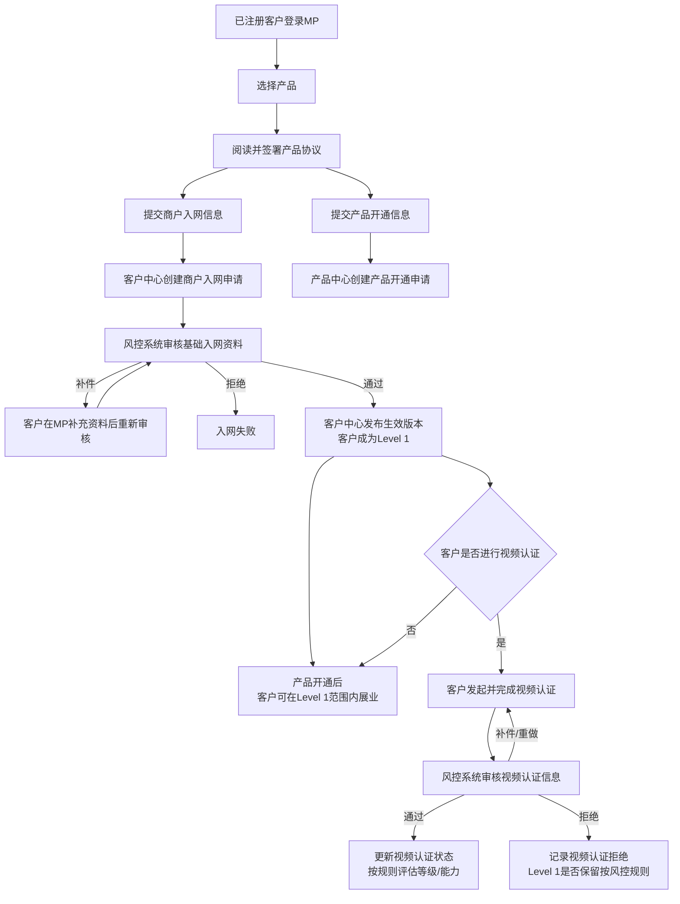
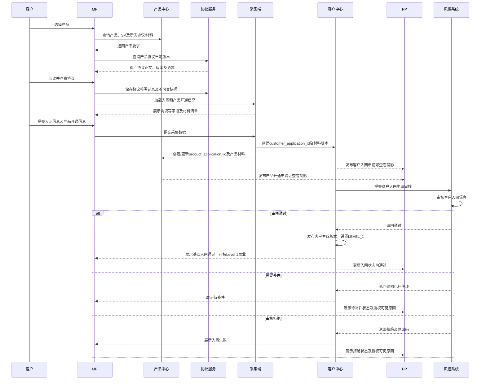
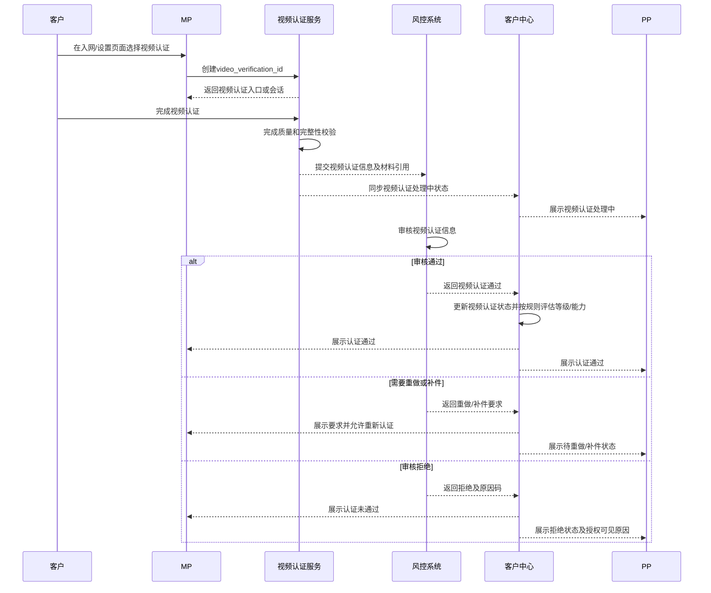

# 客户入网 BRD

> 文档状态：待评审  
> 需求主体：MP客户入网、产品申请、PP业务查询、风控审核及视频认证  
> 适用范围：MP、PP、客户中心、产品中心、协议服务、采集端、风控系统、视频认证服务  
> 系统边界：本方案从已注册客户选择产品开始，覆盖产品协议签署、入网信息及产品开通信息提交、基础入网审核、视频认证和Level 1展业；不包含注册账号、密码、2FA及具体交易流程  
> 核心原则：商户入网申请、产品开通申请和视频认证记录相互独立；基础入网审核通过后可成为Level 1客户，视频认证不是Level 1展业的强制前置条件

## 一、术语与流程边界

| 术语 | 定义 |
| --- | --- |
| MP | 客户使用的门户，用于选择产品、签署协议、提交入网/产品资料、发起视频认证及查看状态 |
| PP | 业务运营门户，可在授权范围内查看客户业务信息、产品开通申请、协议记录及视频认证情况；不可查看客户注册账号及安全信息 |
| 商户入网申请 | 客户提交主体身份、企业、UBO/控制人及其他基础入网信息形成的独立申请，由风控系统审核 |
| 产品开通申请 | 客户针对所选产品提交的产品资料及协议形成的独立申请，由产品中心维护；不与商户入网申请合并 |
| 视频认证 | 客户完成视频核身形成的独立认证记录，由风控系统审核 |
| Level 1 | 基础入网审核通过但未完成或不要求视频认证的客户等级；可在Level 1配置范围内展业 |

客户注册及登录安全要求见：[客户注册-BRD.md](./客户注册-BRD.md)。PP可以查看本方案中的业务入网信息，但仍不能查看注册手机号、邮箱、密码、验证码、登录方式或2FA信息。

## 二、需求背景与目标

客户注册后需要选择产品、签署产品协议并提交入网信息。PP需要查看客户业务信息、客户提交的产品开通信息及视频认证情况；风控系统需要审核客户入网资料和视频认证资料。

部分客户暂不进行视频认证，仍希望先以Level 1开展业务。因此需要把“基础入网审核”“产品开通审核”“视频认证”拆成独立状态，并确保视频认证未完成不会错误地把已通过基础审核的Level 1客户标记为入网失败。

目标：

1. 客户可在MP选择产品、签署对应协议并提交入网及产品开通信息。
2. PP可查看授权客户的业务入网信息、产品开通信息、协议及视频认证状态。
3. 风控系统可独立审核商户入网申请和视频认证记录。
4. 基础入网审核通过后客户可成为Level 1并展业，不强制完成视频认证。
5. 客户可后续发起视频认证；审核结果独立留痕，不覆盖基础入网申请。

## 三、角色与权限

| 角色/系统 | 可执行 | 不可执行 |
| --- | --- | --- |
| MP客户 | 选择产品、签署协议、提交/补充入网信息、提交产品信息、发起视频认证、查看本人状态 | 查看其他客户资料；直接修改审核结论 |
| PP用户 | 查看授权客户业务信息、入网申请、产品开通申请、协议记录、视频认证状态及可见审核结果 | 查看密码、验证码、注册手机号/邮箱、登录方式和2FA；代客户修改原始申请；直接篡改风控结论 |
| 客户中心 | 保存客户业务信息、入网申请、审核状态、生效版本和客户等级 | 保存产品配置、产品开通状态或视频原始文件的权威状态 |
| 产品中心 | 保存产品配置、产品协议要求、产品开通申请和客户产品关系 | 保存客户最新业务主档；决定视频认证审核结果 |
| 协议服务 | 保存客户实际签署的协议版本、语言、时间和快照 | 用当前协议覆盖历史签署记录 |
| 采集端 | 根据产品/SP加载入网及产品字段，接收材料和补件 | 生成风控审核结论 |
| 风控系统 | 审核商户入网申请；审核视频认证信息；返回通过、补件或拒绝 | 直接覆盖客户/产品原始申请数据 |
| 视频认证服务 | 提供视频采集、会话、质量校验及结果数据 | 决定客户最终入网状态或Level 1业务权限 |

## 四、数据与申请边界

| 对象 | 权威系统 | 核心内容 | 与其他对象关系 |
| --- | --- | --- | --- |
| `customer_application_id` | 客户中心 | 商户入网资料、材料版本、基础审核状态 | 独立提交风控审核 |
| `product_application_id` | 产品中心 | 所选产品、产品资料、产品协议及开通状态 | 关联`customer_id`，不与商户入网审核单合并 |
| `agreement_record_id` | 协议服务 | 协议类型、版本、语言、签署时间、签署快照 | 由产品申请引用 |
| `video_verification_id` | 视频认证服务/风控系统 | 视频会话、视频材料、质量状态及审核结果 | 关联`customer_id`，独立于商户入网申请 |
| `customer_level` | 客户中心 | `LEVEL_1`或后续经确认的其他等级 | 基于已批准规则更新；不由PP手工修改 |

边界规则：

1. 商户入网审核任务只审核客户基础入网信息，不附带产品开通结论。
2. 产品开通申请单独维护；产品中心可查询客户入网状态，但不得修改客户入网审核结果。
3. 视频认证任务独立创建；视频未认证不等于基础入网失败。
4. PP展示业务信息和状态投影，不成为任何申请或审核结果的权威源。

## 五、总体业务流程

产品开通申请与基础入网并行创建，但只有基础入网审核通过后，产品中心才可继续完成产品开通审核或生效客户产品关系。产品开通审核的具体字段、审核责任人和状态规则需单独确认。

## 六、商户入网流程

### 6.1 入网时序

### 6.2 MP功能点

| 功能 | 业务要求 |
| --- | --- |
| 产品选择 | 展示可申请产品及必要说明；客户选择后生成产品开通申请草稿 |
| 协议签署 | 展示与所选产品对应的协议；客户主动勾选/确认后保存版本、语言、时间及快照 |
| 入网信息采集 | 根据产品/SP加载客户基础信息、企业、UBO/控制人及所需材料 |
| 产品信息采集 | 展示产品开通专属字段及材料，与商户入网资料分域保存 |
| 草稿 | 支持暂存和继续填写；提交后按版本管理，不直接覆盖已提交版本 |
| 提交审核 | 完整性校验通过后分别创建/更新商户入网申请和产品开通申请 |
| 状态查看 | 分开展示“商户入网状态”“产品开通状态”“视频认证状态” |
| 补件 | 按风控返回的结构化补件项补充并重新提交，不要求重复填写无变化字段 |
| Level 1提示 | 基础入网审核通过后明确展示当前为Level 1及可用能力；具体权限/限额按配置展示 |
| 视频认证入口 | Level 1客户可选择稍后认证或立即发起视频认证，不得强制阻断Level 1展业 |

### 6.3 PP功能点

PP在授权客户范围内可查看：

- 客户业务基本信息及当前生效版本；
- 商户入网申请、提交时间、审核状态和可见审核结果；
- 客户选择的产品及产品开通申请信息；
- 客户签署的产品协议版本、语言、时间和协议快照；
- 客户等级及Level 1状态；
- 视频认证是否发起、进行中、待审核、通过、补件/重做或拒绝；
- 申请和状态变化的审计记录。

PP限制：

- 不可查看客户注册手机号/邮箱、密码、验证码、登录方式、登录IP及2FA；
- 不可修改客户原始提交资料或协议签署记录；
- 不可直接将审核状态改为通过、拒绝或Level 1；
- 不可代客户完成视频认证；
- 审核拒绝原因和敏感风控命中仅按权限展示。

## 七、视频认证流程

### 7.1 视频认证时序

### 7.2 Level 1不做视频认证

确认规则：

1. 客户基础入网审核通过后可设置为`LEVEL_1`。
2. Level 1客户可以选择不进行视频认证；对应产品开通后，可在Level 1配置范围内展业。
3. 视频认证状态为`NOT_STARTED`不应把商户入网状态改为失败、待补件或暂停。
4. PP应分别展示“商户入网已通过/Level 1”和“视频认证未开始”，不得合并为一个状态。
5. Level 1可使用的产品、交易类型、国家/地区、币种、单笔/累计限额及是否存在有效期，由产品、合规和风控确认并配置化。
6. 客户后续可主动完成视频认证；升级后的客户等级及能力名称待确认。
7. 视频认证拒绝后是否继续保留Level 1展业能力，必须由合规风控确认；在结论确认前不得默认升级，也不得自动关闭已批准的Level 1能力。

## 八、状态模型

### 8.1 商户入网状态

| 状态 | 含义 | MP可执行 | PP展示 |
| --- | --- | --- | --- |
| `DRAFT` | 未提交 | 编辑、删除草稿 | 草稿是否可见待确认 |
| `SUBMITTED` | 已提交 | 查看 | 已提交 |
| `REVIEWING` | 风控审核中 | 查看 | 审核中 |
| `RFI_REQUIRED` | 需要补件 | 补充并重新提交 | 待补件及可见原因 |
| `APPROVED` | 基础入网审核通过 | 按Level 1展业、选择视频认证 | 入网通过 |
| `REJECTED` | 入网拒绝 | 查看结果、按规则重新申请 | 拒绝及可见原因 |
| `SUSPENDED/CLOSED` | 后续暂停或关闭 | 查看 | 暂停/关闭 |

### 8.2 产品开通状态

| 状态 | 含义 |
| --- | --- |
| `DRAFT/COLLECTING` | 已选择产品，资料未提交完整 |
| `WAITING_FOR_CUSTOMER_ONBOARDING` | 产品申请已创建，等待基础入网通过 |
| `SUBMITTED/REVIEWING` | 产品申请已提交/审核中 |
| `RFI_REQUIRED` | 产品开通资料待补充 |
| `APPROVED/ACTIVE` | 产品开通审核通过并建立客户产品关系 |
| `REJECTED` | 产品开通拒绝 |
| `SUSPENDED/CLOSED` | 产品暂停或关闭 |

### 8.3 视频认证状态

| 状态 | 含义 | 是否影响Level 1展业 |
| --- | --- | --- |
| `NOT_STARTED` | 未发起视频认证 | 否 |
| `IN_PROGRESS` | 视频会话进行中 | 否 |
| `SUBMITTED/REVIEWING` | 已提交并等待风控审核 | 否 |
| `RETRY_REQUIRED` | 质量不合格或需重新认证 | 默认不影响，最终规则待确认 |
| `APPROVED` | 视频认证通过 | 按规则评估升级能力 |
| `REJECTED` | 视频认证拒绝 | 是否保留Level 1待合规确认 |
| `EXPIRED` | 视频认证或结果过期 | 是否重做及能力影响待确认 |

## 九、关键字段

| 字段 | 必填 | 来源 | 可见范围 | 说明 |
| --- | --- | --- | --- | --- |
| `customer_id` | 是 | 客户中心 | MP/PP/风控 | 客户业务标识，不是注册账号凭证 |
| `customer_application_id` | 是 | 客户中心 | MP/PP/风控 | 商户入网申请唯一标识 |
| `customer_application_version` | 是 | 客户中心 | MP/PP/风控 | 每次提交/补件生成不可变版本 |
| `product_id` | 是 | 产品中心 | MP/PP/风控 | 客户选择的产品 |
| `product_application_id` | 是 | 产品中心 | MP/PP/风控 | 产品开通申请唯一标识 |
| `agreement_record_id` | 是 | 协议服务 | MP/PP | 指向实际签署协议快照 |
| `onboarding_status` | 是 | 客户中心 | MP/PP/风控 | 商户入网状态 |
| `product_status` | 是 | 产品中心 | MP/PP | 产品开通状态 |
| `customer_level` | 通过后是 | 客户中心 | MP/PP/风控/交易 | 本期至少支持`LEVEL_1` |
| `video_verification_id` | 发起视频时是 | 视频认证服务 | MP/PP/风控 | 视频认证记录唯一标识 |
| `video_status` | 是 | 视频认证服务/风控 | MP/PP/风控 | 未发起时为`NOT_STARTED` |
| `risk_review_id` | 进入审核后是 | 风控系统 | PP/内部 | 商户入网和视频认证分别生成，不复用 |
| `rejection_or_rfi_code` | 条件必填 | 风控系统 | MP/PP按权限 | 使用结构化原因码，敏感原因受控 |

## 十、异常流程

| 异常场景 | 处理规则 |
| --- | --- |
| 协议未签署或保存失败 | 不允许提交申请；幂等重试，不得生成无协议依据的产品申请 |
| 入网资料不完整 | 采集端阻止提交并定位缺失字段 |
| 商户入网审核补件 | 客户按指定字段/材料补充，生成新版本后重新审核 |
| 商户入网审核拒绝 | 客户不可成为Level 1；产品申请不得进入最终开通 |
| 产品资料已提交但入网未通过 | 产品申请保持`WAITING_FOR_CUSTOMER_ONBOARDING` |
| 客户不做视频认证 | 入网通过后保持`LEVEL_1 + NOT_STARTED`并按Level 1范围展业 |
| 视频中断或质量不合格 | 保留Level 1状态，允许重试；次数限制待确认 |
| 视频审核拒绝 | 记录拒绝；是否保留Level 1由合规风控确认，不自动修改基础入网结果 |
| PP数据延迟 | 展示最后更新时间；从权威系统重试同步，不允许PP人工覆盖状态 |
| 重复提交 | 按申请ID和幂等键去重，不重复创建审核任务 |

## 十一、通知与审计

1. MP需要接收入网提交、审核中、补件、通过、拒绝及视频认证状态通知。
2. PP需要看到各状态最后更新时间和来源系统。
3. 产品协议需保存版本、语言、签署时间及不可变正文/快照。
4. 商户入网、产品开通和视频认证分别记录申请ID、审核任务ID、版本、操作者、时间及结果。
5. PP查看客户资料、协议和视频认证情况需记录访问审计日志。
6. 视频文件及生物识别信息按敏感数据要求控制访问、留存和删除；具体期限由法务、安全和合规确认。

## 十二、验收标准

1. 已注册客户可在MP选择产品并查看对应协议、入网字段和产品开通字段。
2. 客户未签署当前产品协议时不能提交申请；签署后可查看实际版本、语言、时间和快照。
3. 客户提交后，客户中心生成商户入网申请，产品中心生成独立产品开通申请，两者状态分开维护。
4. PP可查看授权客户的业务信息、商户入网申请、产品开通申请、产品协议及状态。
5. PP无法查看注册手机号/邮箱、密码、验证码、登录方式、登录IP和2FA信息。
6. 风控系统可以审核客户提交的入网信息并返回通过、补件或拒绝。
7. 入网审核通过后客户中心发布生效版本并将客户设置为Level 1；对应产品开通后，客户无需完成视频认证即可在Level 1范围内展业。
8. PP分别展示“入网状态”“客户等级”“产品开通状态”和“视频认证状态”，不得将视频未认证展示为入网失败。
9. 客户可在MP发起视频认证，PP可查看是否发起、当前状态及授权可见结果。
10. 风控系统可独立审核视频认证信息，视频审核任务不复用商户入网审核任务ID。
11. 视频认证未开始、进行中或待审核时，已批准的Level 1状态不被自动取消。
12. 视频认证审核拒绝时，系统不自动升级客户；是否保留Level 1按已确认的合规策略执行。
13. 商户入网未通过时，产品申请保持等待或拒绝状态，不得建立有效客户产品关系。
14. 重复提交、重复回调不会重复创建客户、产品申请、协议记录或风控审核任务。

## 十三、待确认事项

| 编号 | 待确认事项 | 责任方 | 影响范围 |
| --- | --- | --- | --- |
| D1 | Level 1允许的产品、交易类型、国家/地区、币种、单笔/累计限额及有效期 | 产品/合规/风控 | Level 1展业 |
| D2 | 视频认证通过后的等级名称、升级条件和新增能力 | 产品/合规/风控 | 等级体系 |
| D3 | 视频认证拒绝、过期或多次失败后是否保留Level 1 | 合规/风控 | 异常处理 |
| D4 | 视频认证服务商、采集内容、质量规则、重试次数及会话有效期 | 产品/技术/风控 | 视频流程 |
| D5 | 视频及生物识别数据的授权、存储位置、访问权限、留存和删除期限 | 法务/安全/合规 | 隐私与安全 |
| D6 | 产品开通审核的责任角色、材料清单、状态机及与入网通过事件的衔接 | 产品/风控/运营 | 产品开通 |
| D7 | PP可见的客户字段、审核原因、视频材料范围及敏感字段脱敏规则 | 产品/安全/合规 | PP权限 |
| D8 | 入网草稿是否在PP可见，以及PP是否可催办但不可修改 | 产品/运营 | PP功能 |
| D9 | 产品协议升级后是否要求客户重新签署及对已开通产品的影响 | 法务/产品 | 协议管理 |
