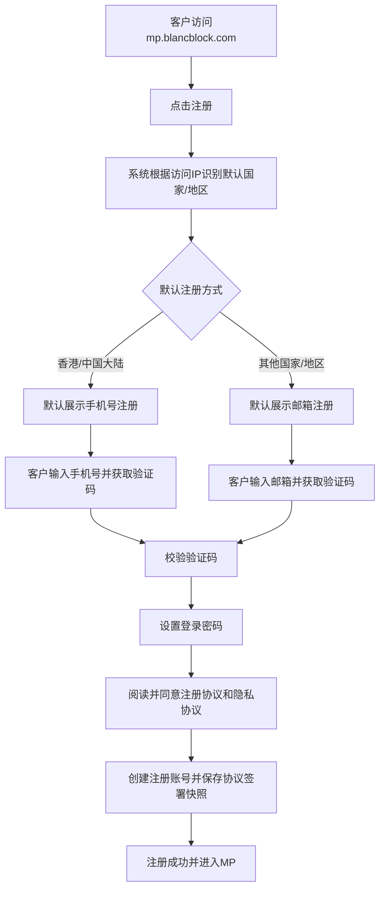
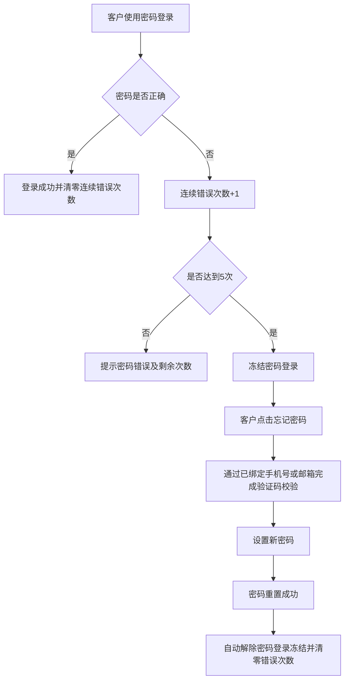

# 客户注册 BRD

> 文档状态：待评审  
> 需求主体：MP客户注册与账号安全  
> 适用范围：`mp.blancblock.com`、MP设置中心、PP协议查询  
> 系统边界：本方案覆盖账号注册、登录方式绑定、密码、登录2FA、语言及协议留痕；不包含KYC/KYB、产品开通和客户业务资料审核  
> 核心原则：注册账号与客户业务资料分域；PP不可查看客户注册账号及安全信息，仅可查看客户签署的注册协议和隐私协议

## 一、需求背景

客户需要通过`mp.blancblock.com`完成自助注册，并在MP内维护登录方式、安全设置、界面语言及协议记录。系统需根据访问IP对应国家/地区提供合适的默认注册方式，同时处理密码连续错误导致的账号冻结、忘记密码解冻以及登录2FA的开通和解除。

注册及账号安全信息只服务于客户本人登录，不在PP展示。客户发生无法登录、验证码异常、账号冻结无法解除等问题时，由客服记录问题并转交技术支持处理，PP不提供查看或修改客户注册凭证的能力。

## 二、产品目标与非目标

### 2.1 产品目标

1. 支持客户使用手机号或邮箱完成账号注册。
2. 支持验证码注册及密码设置，注册成功后可使用已绑定方式登录。
3. 根据访问IP默认展示国家/地区及注册方式：香港、中国大陆默认手机号，其他国家/地区默认邮箱。
4. 支持客户在MP设置中心查看本人注册信息、绑定其他登录方式、修改/重置密码、开通/解除登录2FA及设置语言。
5. 连续5次密码错误后冻结密码登录；客户通过忘记密码完成重置后自动解除冻结。
6. 保存客户签署的注册协议和隐私协议版本；客户可在MP查看，PP仅可查看协议记录。

### 2.2 非目标

- 不在注册流程完成企业实名认证、KYC/KYB或产品开通。
- 不允许PP查看手机号、邮箱、密码状态、登录方式、登录记录、2FA配置或验证码记录。
- 不允许PP或客服代客户修改密码、绑定登录方式、开通或解除2FA。
- 本期不建设PP账号安全问题处理工具；账号问题由技术支持处理。

## 三、角色与权限

| 角色/系统 | 能力 | 不可执行 |
| --- | --- | --- |
| 未注册访客 | 访问注册页、选择国家/地区、选择手机号/邮箱注册、获取验证码、阅读协议 | 访问MP设置中心或PP |
| MP客户 | 查看本人注册信息；绑定手机号/邮箱；修改或重置密码；开通/解除2FA；设置语言；查看本人协议记录 | 查看其他客户信息；绕过安全校验修改登录设置 |
| PP用户 | 按授权客户范围查看已签署的注册协议、隐私协议及版本信息 | 查看手机号、邮箱、登录方式、密码、验证码、2FA、冻结原因明细或代客户修改安全设置 |
| 客服 | 接收客户咨询、记录问题、引导客户使用自助功能、转交技术支持 | 查询或索取密码、验证码、2FA密钥；直接解除冻结或更改登录配置 |
| 技术支持 | 根据内部授权排查验证码、登录、冻结、2FA及协议留痕异常 | 通过PP向业务人员暴露客户凭证或敏感安全数据 |

## 四、核心业务流程

### 4.1 注册主流程

### 4.2 IP与默认注册方式

| IP识别结果 | 默认国家/地区 | 默认注册方式 | 说明 |
| --- | --- | --- | --- |
| 中国大陆 | 中国大陆 | 手机号 | 默认国家区号`+86` |
| 香港 | 香港 | 手机号 | 默认国家区号`+852` |
| 其他国家/地区 | IP识别国家/地区 | 邮箱 | 默认展示邮箱输入框 |
| IP无法识别 | 待选择 | 邮箱 | 客户需主动选择国家/地区 |

规则：

1. IP识别结果仅用于页面默认展示，不作为客户国籍、注册地、税务居民地或KYC结论。
2. 客户可切换注册方式或更正国家/地区；是否限制特定国家/地区注册由业务与合规另行确认。
3. 系统记录IP识别结果、客户最终选择及注册方式，供安全审计使用，不在PP展示。

### 4.3 密码错误、忘记密码与解除冻结

冻结仅针对密码登录。验证码登录、忘记密码及其他已启用的安全校验是否继续可用，应按安全策略执行；不得因冻结导致客户无法进入自助找回密码流程。

### 4.4 登录2FA流程

#### 开通2FA

1. 客户登录MP并进入“设置中心—安全设置”。
2. 客户点击“开通登录2FA”。
3. 系统要求完成当前登录凭证或已绑定手机号/邮箱验证码校验。
4. 系统展示2FA绑定信息，客户完成绑定并输入一次动态验证码。
5. 校验成功后2FA状态变为`ENABLED`；后续登录在主登录校验通过后增加2FA校验。

#### 解除2FA

1. 客户在安全设置点击“解除登录2FA”。
2. 系统要求完成当前登录凭证、已启用2FA验证码或其他安全校验。
3. 校验成功后状态变为`DISABLED`并记录操作日志。
4. 客户无法完成自助解除时，由客服转交技术支持；PP不可代为解除。

具体2FA类型、恢复码和丢失设备恢复规则为待确认项。

## 五、MP功能需求

### 5.1 注册页

| 功能 | 业务要求 |
| --- | --- |
| IP识别 | 页面打开时识别访问IP并默认国家/地区及注册方式；识别失败不得阻断注册 |
| 国家/地区 | 展示默认值并允许客户更正 |
| 注册方式 | 支持手机号、邮箱；香港/大陆默认手机号，其他地区默认邮箱 |
| 验证码 | 支持发送、倒计时、重发、错误提示和过期提示；时效、频控及错误上限待安全团队确认 |
| 密码 | 客户设置并确认密码；复杂度及历史密码限制待安全团队确认 |
| 协议确认 | 注册提交前必须主动勾选注册协议和隐私协议；提供协议正文入口 |
| 注册结果 | 成功后创建账号并进入MP；失败时展示可理解的错误信息且不得重复创建账号 |

### 5.2 设置中心—注册信息

客户仅可查看和管理自己的注册账号信息：

- 当前已绑定手机号，脱敏展示；
- 当前已绑定邮箱，脱敏展示；
- 初始注册方式；
- 当前可用登录方式；
- 密码最后修改时间；
- 登录2FA状态；
- 当前语言；
- 注册时间。

密码、验证码、密码哈希、2FA密钥和恢复凭证不得展示。

### 5.3 绑定其他登录方式

1. 手机号注册客户可绑定邮箱；邮箱注册客户可绑定手机号。
2. 新手机号/邮箱必须通过验证码校验后才能绑定。
3. 已被其他账号占用的手机号/邮箱不得重复绑定。
4. 绑定成功后，客户可使用新增方式登录同一个账号，不得创建第二个客户账号。
5. 解绑登录方式时必须至少保留一种可用登录方式；解绑规则及是否支持更换主登录方式待确认。

### 5.4 修改密码

- 已登录客户进入安全设置修改密码。
- 需校验原密码及新密码；如启用了登录2FA，是否同时校验2FA待安全团队确认。
- 修改成功后清零密码错误次数并记录安全日志。
- 是否使其他已登录会话失效待确认。

### 5.5 语言设置

1. 客户可在MP设置中心选择界面语言。
2. 保存后立即应用，并在后续登录继续使用该语言。
3. 客户未主动设置时，默认语言为英文。
4. 登录页、注册页和登录后的MP均应遵循已保存语言；未登录时使用默认英文或浏览器语言的优先级待确认。

### 5.6 设置中心—协议记录

注册成功后，客户可在MP设置中心查看：

- 注册协议名称、版本号、协议语言、签署时间及协议正文/快照；
- 隐私协议名称、版本号、协议语言、签署时间及协议正文/快照；
- 后续重新签署记录（如有）。

历史协议签署记录不得因协议版本升级被覆盖或删除。

## 六、PP功能需求

### 6.1 PP可见范围

PP仅提供“客户协议记录”查询：

| 信息 | PP是否可见 | 说明 |
| --- | --- | --- |
| 注册协议、隐私协议名称 | 是 | 仅授权客户范围 |
| 协议版本、语言、签署时间 | 是 | 用于审计和客户咨询 |
| 协议正文或不可变快照 | 是 | 必须对应客户实际签署版本 |
| 客户业务ID | 是 | 用于定位协议记录，不展示登录账号 |
| 注册手机号、注册邮箱 | 否 | PP不可见 |
| 登录方式、密码状态、错误次数、冻结状态 | 否 | PP不可见 |
| 2FA状态、密钥、恢复信息 | 否 | PP不可见 |
| 注册IP、登录IP、验证码记录 | 否 | PP不可见 |

### 6.2 PP操作限制

- PP不得修改、补签、删除或覆盖客户协议记录。
- PP不得发起密码重置、解除冻结、绑定/解绑手机号或邮箱、开通/解除2FA。
- 客户咨询账号问题时，PP/客服只记录客户业务ID、问题类型、发生时间和客户描述，不索取密码、验证码或2FA动态码，并转交技术支持。

## 七、字段及数据模型

| 字段 | 必填 | 来源/类型 | 校验规则 | 可见范围 | 备注 |
| --- | --- | --- | --- | --- | --- |
| `account_id` | 是 | 账号系统 | 全局唯一 | MP/内部技术 | 不等同于业务客户ID |
| `customer_id` | 注册完成后是 | 客户系统 | 与账号建立唯一关系 | MP/PP协议页 | PP仅用于定位协议 |
| `registration_method` | 是 | PHONE/EMAIL | 注册完成后不可为空 | MP/内部技术 | PP不可见 |
| `phone_country_code` | 手机注册时是 | 客户输入/默认 | 合法国家区号 | MP/内部技术 | MP脱敏展示 |
| `phone_number` | 手机注册时是 | 客户输入 | 标准化、唯一性校验 | MP/内部技术 | 加密存储、脱敏展示 |
| `email` | 邮箱注册时是 | 客户输入 | 格式、标准化、唯一性校验 | MP/内部技术 | 加密存储、脱敏展示 |
| `password_hash` | 是 | 账号系统 | 不可逆安全哈希 | 仅认证系统 | 任何页面及日志不得展示 |
| `failed_password_attempts` | 是 | 账号系统 | 连续错误累加，成功/重置后清零 | 内部技术 | 达到5次冻结密码登录 |
| `password_login_status` | 是 | ACTIVE/FROZEN | 状态机控制 | MP提示/内部技术 | PP不可见 |
| `two_factor_status` | 是 | DISABLED/ENABLED | 通过安全校验后变更 | MP/内部技术 | PP不可见 |
| `preferred_language` | 是 | 语言代码 | 默认`en` | MP | 登录后应用 |
| `ip_country` | 否 | IP识别服务 | 识别失败允许为空 | 内部技术 | 仅用于默认展示和安全审计 |
| `selected_country` | 是 | 客户选择 | 必须为支持的国家/地区 | MP/内部技术 | 不作为KYC结论 |
| `agreement_record_id` | 是 | 协议服务 | 全局唯一、不可变 | MP/PP |
| `agreement_type` | 是 | REGISTRATION/PRIVACY | 枚举校验 | MP/PP | 两类均须保存 |
| `agreement_version` | 是 | 协议服务 | 对应实际签署版本 | MP/PP | 历史不可覆盖 |
| `agreement_language` | 是 | 协议服务 | 对应签署正文语言 | MP/PP | 不能只保存当前语言版本 |
| `agreed_at` | 是 | 服务端时间 | 带时区、不可由客户端篡改 | MP/PP | 审计字段 |

## 八、状态与状态流转

### 8.1 密码登录状态

| 状态 | 进入条件 | 可执行操作 | 退出条件 |
| --- | --- | --- | --- |
| `ACTIVE` | 注册成功、正常登录或密码重置成功 | 密码登录、修改密码 | 连续5次密码错误 |
| `FROZEN` | 连续5次密码错误 | 忘记密码、自助身份校验 | 成功重置密码后自动转`ACTIVE` |

### 8.2 2FA状态

| 状态 | 进入条件 | 可执行操作 | 退出条件 |
| --- | --- | --- | --- |
| `DISABLED` | 注册完成或客户已解除2FA | 开通2FA | 完成绑定及动态码校验 |
| `ENABLED` | 2FA绑定成功 | 登录二次校验、解除2FA | 完成解除安全校验 |

## 九、异常场景

| 异常场景 | 处理规则 |
| --- | --- |
| IP国家/地区识别失败 | 默认邮箱注册并要求客户选择国家/地区，不阻断页面 |
| 手机号/邮箱已注册 | 不重复创建账号；引导客户登录或忘记密码 |
| 验证码错误或过期 | 提示重新输入或获取；执行安全频控 |
| 验证码发送失败 | 提示稍后重试；记录技术错误码，不向客户暴露内部信息 |
| 连续5次密码错误 | 冻结密码登录，保留忘记密码入口 |
| 冻结后完成密码重置 | 自动解除冻结、清零错误次数，允许使用新密码登录 |
| 2FA验证码错误 | 拒绝登录或设置变更；错误次数和冻结策略待安全团队确认 |
| 2FA设备丢失 | 客户走恢复流程；若自助失败则由客服转技术支持，PP不得解除 |
| 协议保存失败 | 注册不得显示成功；幂等重试，避免账号创建成功但无协议记录 |
| 注册结果超时 | 使用注册请求幂等键查询结果，不重复创建账号 |
| 客户咨询账号问题 | 客服记录并转技术支持；不得在PP查看或修改注册安全信息 |

## 十、安全、审计与非功能要求

1. 密码必须使用安全的不可逆算法保存，不得明文存储、传输或写入日志。
2. 手机号、邮箱、验证码、2FA密钥及恢复信息应按敏感数据要求加密、脱敏和最小权限访问。
3. 验证码发送、验证码校验、密码登录、忘记密码、绑定登录方式及2FA操作需具备频控、防重放和审计日志。
4. 注册、协议签署、密码修改/重置、冻结/解冻、登录方式绑定/解绑及2FA开通/解除均记录操作时间、账号、结果和必要安全上下文。
5. 注册请求、验证码校验和协议落库需要幂等控制，避免重复账号或重复签署记录。
6. PP权限必须在接口层控制，不能只依赖前端隐藏敏感字段。
7. 协议记录应保存不可变版本或可验证快照，确保后续能还原客户签署内容。

## 十一、验收标准

1. 客户访问`mp.blancblock.com`并点击注册，可使用手机号或邮箱完成注册。
2. 中国大陆IP默认展示中国大陆和手机号注册，香港IP默认展示香港和手机号注册，其他国家/地区IP默认展示邮箱注册。
3. IP识别失败时注册页可用，默认邮箱方式并允许客户选择国家/地区。
4. 手机号/邮箱验证码校验成功且客户设置密码、同意注册协议和隐私协议后，系统只创建一个账号并进入MP。
5. 注册成功后，客户可在MP查看本人脱敏注册信息，并绑定另一种登录方式。
6. 客户可修改密码；连续5次密码错误后密码登录被冻结。
7. 冻结客户通过忘记密码完成验证码校验和新密码设置后，系统自动解除冻结并清零错误次数。
8. 客户可开通及解除登录2FA；未完成安全校验时不得变更2FA状态。
9. 客户将默认语言或偏好语言设置为英文后，退出并重新登录，登录页及MP默认显示英文。
10. 注册完成后，客户可在MP设置中心查看实际签署的注册协议和隐私协议版本、语言、时间及正文/快照。
11. PP可按授权客户范围查看注册协议和隐私协议，但无法查看手机号、邮箱、登录方式、密码/冻结状态、验证码、2FA或IP信息。
12. PP无法通过页面或接口修改账号安全设置、解除冻结、重置密码或开通/解除2FA。
13. 协议保存失败时系统不得返回完整注册成功；重试不会重复创建账号或覆盖历史协议记录。
14. 客户发生注册或登录问题时，客服可按流程转交技术支持，全程无需且不得获取客户密码、验证码或2FA动态码。

## 十二、待确认事项

| 编号 | 待确认事项 | 责任方 | 影响范围 |
| --- | --- | --- | --- |
| D2 | 验证码有效期、重发间隔、每日发送次数及连续错误上限 | 安全/技术 | 注册及找回密码 |
| D3 | 密码长度、复杂度、历史密码、有效期及其他会话失效规则 | 安全/技术 | 密码策略 |
| D4 | IP识别后是否允许切换所有国家/地区和注册方式，以及限制注册国家清单 | 产品/合规 | 注册入口 |
| D5 | 2FA具体类型、恢复码、错误冻结及设备丢失恢复规则 | 安全/技术 | 账号安全 |
| D6 | 解除2FA、绑定/解绑登录方式所需的组合安全校验 | 安全/产品 | 账号安全 |
| D7 | 未登录页面的语言优先级：客户历史设置、Cookie、浏览器语言和默认英文 | 产品/技术 | 国际化 |
| D8 | PP协议页的客户检索字段、协议下载权限及水印要求 | 产品/法务/安全 | PP协议查询 |
| D9 | 注册协议和隐私协议升级后是否要求客户重新确认 | 法务/产品 | 协议管理 |
