# 迁移相关门户与承兑业务说明

> 文档状态：业务说明稿
>
> 说明主题：VCC迁移配套门户、承兑业务操作端及审核端说明
>
> 适用范围：EX MP、EX PP（SP运营后台）、EX SA（平台管理后台）、BB OP、原BB OP风控、EX新风控
>
> 系统边界：本期迁移主要面向VCC客户，覆盖入网至交易；VCC由独立团队通过单独方案跟进。普通EX MP客户如已具备承兑基础能力，也可在EX MP使用承兑，但本期运营迁移和客户引导不以该类客户为对象。承兑的主要客户入口仍为BB MP，固定汇率产品继续仅在BB MP使用，因此BB MP本期不下线。交易运营仍在BB老OP
>
> 核心原则：EX MP承载VCC客户从入网到交易的新门户，并可向具备条件的普通EX MP客户提供承兑入口；BB MP仍是承兑的主要入口，继续保留全部原承兑交易能力及固定汇率产品。两个客户门户均复用原BB交易处理和BB老OP；承兑交易不经过风控，由BB账户系统记账，所有BB客户交易使用BB计费。客户信息、地址簿和法币收款人通过EX新风控审核后才同步BB老OP；未通过或BB老OP查不到时先去EX PP查看

## 一、术语和系统定位

| 名称 | 定义与职责 |
| --- | --- |
| EX MP | 新商户端。本期主要承载VCC客户从入网到交易的门户；普通EX MP客户如具备承兑基础能力也可使用承兑，但不作为本期运营引导对象 |
| BB MP | 原商户端，仍是承兑主要入口。本期继续保留全部承兑交易能力；固定汇率产品继续仅在BB MP提供，因此本期不得下线 |
| EX PP | SP运营后台。每个SP使用PP运营其客户和产品；本期SP=B，因此EX PP是BB后续的统一运营后台 |
| EX SA | EX平台管理后台。本期仅规划轻量平台运营支撑，具体功能范围待确认；不是SP的日常客户运营后台 |
| BB VCC | 本期整体迁移重点，由VCC独立团队和独立方案负责；本文只描述VCC客户生命周期带出的门户范围及其与承兑流程的衔接 |
| BB OP | 承兑业务运营后台。继续查看和处理VA、数币充提、承兑及法币提现等业务单据 |
| BB账户系统 | 负责BB客户承兑交易的账户余额和账务处理；承兑记账不迁移至EX账务系统 |
| BB计费 | 负责BB客户全部交易的费用计算；客户从EX MP或BB MP发起均不改变计费归属 |
| EX计费 | 负责BB以外其他EX租户的交易计费，不对BB客户交易计费 |
| 原BB老风控 | 沿用BB现有风控能力，负责法币充值、法币提现、付款、数币充币和数币提币审核；不审核承兑交易 |
| EX新风控 | EX新建风控流程，负责EX MP客户入网、交易地址簿和法币收款人审核；三类对象审核通过后才将生效信息同步BB老OP |
| 承兑 | 客户发起数转法或法转数交易 |
| 交易地址簿 | 客户在EX MP维护，运营在EX PP查看；由EX新风控审核，通过后同步生效信息至BB老OP，作为充币和提币的前置子流程 |
| 法币收款人 | 客户在EX MP维护，运营在EX PP查看；由EX新风控审核，通过后同步生效信息至BB老OP，用于提现或付款 |

## 二、迁移背景与文档用途

### 2.1 迁移背景

本期整体项目以VCC迁移为主。VCC迁移会带出部分客户生命周期门户能力，其中包含部分承兑入口，但不等于将承兑产品和BB MP整体迁走：

- VCC自身功能、流程和迁移数据由VCC独立团队负责；本文聚焦运营、销售和风控需要了解的配套门户操作。
- EX MP承载VCC客户入网、产品开通及本期接入的部分承兑页面；注册和登录能力由统一中台另行定义。
- 普通EX MP客户如果已经具备承兑基础能力，也可以在EX MP使用承兑；但运营和客户迁移引导仅针对VCC客户。
- BB MP仍是承兑主要入口，继续保留全部原承兑交易功能，客户仍可在BB MP完成承兑相关交易。
- 固定汇率产品仍在BB MP，暂不迁入EX MP；因此本期迁移完成后BB MP仍继续运行，不设置下线计划。
- 承兑交易流程、承兑运营处理、存量BB能力及业务单据仍留在BB体系，运营继续使用BB OP。
- EX PP是SP运营后台，本期由SP=B的BB运营人员使用，承接客户、入网、产品开通及逐步迁入的新运营能力。
- 本期承兑存量交易流程尚未迁入EX PP，因此BB运营需要同时使用EX PP和BB老OP；后续再逐步将BB运营能力迁至EX PP。
- 风控按对象拆分：地址簿和法币收款人进入EX新风控；法币充值、法币提现、付款、数币充币和数币提币进入原BB老风控；数转法、法转数承兑不经过风控。法币充值交易核心及处理继续由BB交易系统承载。
- 承兑账务和交易计费不随门户迁移：BB客户承兑交易继续由BB账户系统记账，BB客户所有交易使用BB计费；BB以外其他EX租户使用EX计费。
- 监管截止要求：最晚自2026年9月9日起，相关交易必须使用新的地址簿和收款人流程。如果届时BB MP仍提供相关交易入口，BB MP必须同步完成交互改造并接入新流程。

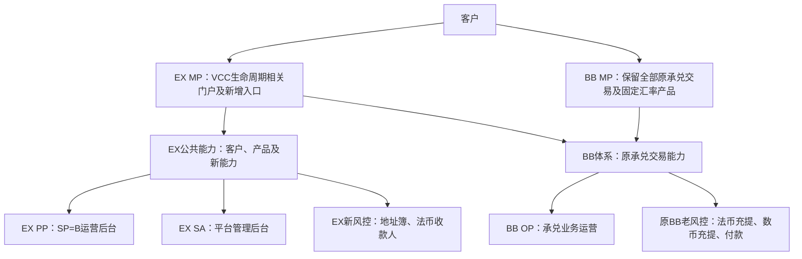

### 2.2 文档用途

本文面向运营、销售、风控、及实施团队，用于回答以下问题：

1. 客户在EX MP能够看到什么、从哪里发起操作。
2. 运营收到客户咨询后，应在EX PP还是BB OP查询和处理。
3. 每类对象由EX新风控还是原BB老风控审核。
4. 状态异常、同步失败、审核卡住或产品能力不匹配时，由谁在哪个端处理。
5. 哪些规则已经确认，哪些仍需产品、运营、合规或风控决策。

### 2.3 一句话迁移原则

> 本期以VCC迁移为主，并将VCC客户生命周期相关门户接入EX MP；承兑交易同时保留在BB MP，固定汇率产品继续使用BB MP。SP=B运营看EX PP，交易运营仍看BB老OP。

### 2.4 文档表达口径：以操作端为主

本文面向运营和风控，流程图及流程说明优先回答“在哪里看、在哪里审、在哪里处理”，不以底层技术模块划分业务责任：

- “客户中心”指EX PP中的客户中心页面，不是另一个运营端；本文统一写作“EX PP—客户中心”。
- 客户入网先按进件入口分流：EX MP进件由运营在“EX PP—客户中心”查看、EX新风控审核；BB MP进件由运营和风控在BB老OP按原流程查看及审核。
- 产品申请及产品开通审核由运营在“EX PP—产品申请”查看和处理；客户入网审核与产品开通审核是两条独立流程。
- 地址簿和收款人账户由运营在“EX PP—交易对手方”查看，由EX新风控审核；只有审核通过的生效信息才同步BB老OP，未通过或BB老OP查不到时先查EX PP。
- VA、法币充值、数币充提、承兑、提现和付款订单由运营在BB老OP对应模块查看；除承兑外的交易按原流程进入原BB老风控，承兑不经过风控。
- 客户、产品、交易等底层服务名称仅在数据、接口或异常排查说明中保留，不作为运营寻找入口的依据。

| 业务场景 | 客户操作端 | 运营查看/处理端 | 风控/审核端 |
| --- | --- | --- | --- |
| 客户入网 | EX MP/采集端或BB MP | EX进件看EX PP；BB进件看BB老OP | EX进件由EX新风控审核；BB进件由BB老OP原入网风控审核 |
| 产品开通 | EX MP | EX PP—产品申请及开通审核 | 不进入EX新风控；与客户入网审核分开 |
| 地址簿 | EX MP | EX PP—交易对手方—地址簿；审核通过后同步BB老OP | EX新风控—地址簿审核 |
| 收款人账户 | EX MP | EX PP—交易对手方—收款人账户；审核通过后同步BB老OP | EX新风控—收款人审核 |
| VA、法币充值、数币充提、提现、付款 | EX MP承载本期接入入口；BB MP保留原入口 | BB老OP对应业务模块；法币充值由BB交易系统处理 | 原BB老风控 |
| 数转法/法转数承兑 | EX MP增加入口；BB MP保留全部原承兑交易 | BB老OP按原承兑流程处理 | 不经过风控 |
| BB客户承兑账务与交易计费 | EX MP或BB MP发起交易 | 承兑由BB账户系统记账；所有交易由BB计费计算费用 | 不因客户入口变化而切换承兑账务或计费归属 |

客户信息、地址簿和收款人账户统一按以下方式理解：EX MP是客户提交和维护端，EX PP是申请及审核过程的运营查看端，EX新风控是审核端；只有审核通过的生效信息才同步BB老OP供原交易流程使用。审核中、补件、拒绝或BB老OP查不到时，运营先到EX PP查看；BB老OP及原BB老风控不重复审核EX进件。

## 三、迁移范围与保持不变项

| 能力 | 当前情况 | 本期变化说明 | 对业务操作的影响 |
| --- | --- | --- | --- |
|  |
| 客户登录与操作入口 | BB MP | VCC生命周期相关门户进入EX MP；BB MP继续保留 | 新旧入口阶段性并存 |
| 客户、入网、产品信息 | 原体系分散承载 | 运营统一在EX PP的客户中心、产品申请中查看 | 迁移/整合 |
| 固定汇率产品 | BB MP | 继续在BB MP使用 | 本期不迁移，是BB MP继续保留的明确原因 |
| VA申请 | BB MP发起、BB OP运营 | EX MP增加入口，BB MP原入口是否调整按VCC迁移范围执行；BB OP继续运营 | 后台不变 |
| 法币充值 | BB交易系统及BB老OP | EX MP申请VA并查看交易；BB交易系统负责来账识别、建单及处理 | 仅迁移客户入口和展示，交易核心不迁移 |
| 数币充提 | BB流程 | EX MP增加本期接入入口，BB MP保留原交易能力，BB OP运营 | 双门户进入原交易流程 |
| 交易地址簿 | 原流程无EX MP入口 | EX MP新增地址簿；如2026年9月9日后BB MP仍承载相关交易，BB MP同步改造交互并使用新地址簿流程 | EX新风控审核；通过后同步生效信息至BB老OP |
| 数转法/法转数 | BB MP发起、BB OP运营 | EX MP增加入口，BB MP保留全部原承兑交易，BB老OP运营 | 双门户进入原BB交易流程 |
| 法币收款人 | 客户端原能力 | EX MP使用新收款人流程；如2026年9月9日后BB MP仍承载相关交易，BB MP同步改造交互并使用新收款人流程 | EX新风控审核；通过后同步生效信息至BB老OP |
| 法币提现 | BB流程 | EX MP增加本期接入入口，BB MP保留原能力，BB OP运营 | 双门户进入原交易流程 |
| BB OP | 原运营后台 | 继续使用 | 不迁移 |
| EX PP | 无完整承兑交易运营 | 作为SP=B后续运营后台，先承接客户、入网、产品及明确的新运营能力 | 本期不迁移BB老OP承兑交易模块 |
| EX SA | EX平台管理后台 | 本期仅提供必要的轻量平台运营支撑 | 功能范围待确认；不承接SP=B日常客户及交易运营 |

## 四、面向岗位的使用方式

| 岗位 | 首要查看端 | 主要使用场景 | 不应执行的操作 |
| --- | --- | --- | --- |
| BB运营（新后台） | EX PP | 在客户中心查看客户及入网，在产品申请查看开通信息，在交易对手方查看地址簿和收款人 | 本期在PP处理尚未迁移的VA、承兑或提现交易单 |
| EX平台运营（本期轻量，范围待确认） | EX SA | 仅处理本期确认的平台级轻量支撑事项 | 使用未确认的SA能力；在SA处理SP=B日常客户和交易单 |
| 承兑运营 | BB OP | VA、法币充值、数币充提、承兑、法币提现及收款人同步信息 | 在BB OP调整EX客户或产品主数据 |
| EX风控 | EX新风控工作台 | EX MP客户入网、地址簿、法币收款人审核 | 审核BB MP原入网进件、法币充提、数币充提或承兑交易 |
| BB风控 | BB老OP原入网风控及原BB老风控 | BB MP客户入网，以及法币充值、法币提现、付款、数币充币及数币提币审核 | 审核EX MP入网进件、地址簿、法币收款人或承兑交易 |
| 技术支持 | 日志、监控及主责系统 | 同步失败、状态不一致、回调超时等技术问题 | 代替运营或风控作业务审批 |

销售、客户经理或客服受理客户问题后，应先收集`customer_id`、业务单号、问题时间及MP截图，再转交运营。运营统一按以下顺序定位：

1. 在EX PP确认`customer_id`、客户状态和承兑产品状态。
2. 如为产品能力问题，查询客户产品开通状态。
3. 如为VA、充值、充提、承兑或法币提现问题，使用业务单号到BB OP查询。
4. 如为地址簿或法币收款人审核问题，到EX新风控查询；如为法币充提、数币充提或付款审核问题，到原BB老风控查询；承兑不查询风控，直接到BB老OP查询处理情况。
5. 跨系统状态不一致时，不人工猜测终态；运营确认业务状态后，页面或数据问题直接转技术处理。

## 五、本文说明范围

### 5.1 本文说明的内容

1. 本文说明客户入网、VCC产品开通及承兑相关业务如何操作和审核。
2. VCC客户是本期EX MP迁移和运营引导对象，可使用本期接入的VA、地址簿、数币充提、数转法、法转数、收款人及法币出款能力；具备承兑基础能力的普通EX MP客户也可使用承兑，但不进行主动迁移引导。
3. BB MP仍是承兑主要入口，继续保留全部原承兑交易能力，固定汇率产品仍只在BB MP使用；从EX MP或BB MP发起的承兑均沿用原BB交易处理和BB老OP运营，不经过风控。
4. 客户信息、交易地址簿和法币收款人进入EX新风控后，只有审核通过的生效信息才同步BB老OP；未通过或BB老OP查不到时先到EX PP查看。

### 5.2 本文不展开的内容

- 不迁移或重建BB OP完整后台。
- 不变更底层钱包、承兑、账务、计费、清结算和资金流；BB客户承兑继续使用BB账户系统，所有交易继续使用BB计费。
- 不将交易订单迁入EX新风控；EX新风控本期审核客户入网、地址簿和法币收款人，不审核充值、充提、承兑、提现或付款交易订单。
- 不在本期定义具体风控规则、交易限额、费用或支持币种。
- 不默认将所有交易信息开放给PP；PP可见范围以本文明确要求为准。

## 六、参与方与职责

| 参与方 | 本期职责 | 不承担 |
| --- | --- | --- |
| 客户 | 申请VCC并使用自动获得的承兑基础能力，申请VA，维护地址簿和收款人，发起数币充提、承兑及法币提现 | 审核或修改系统终态 |
| EX MP | 展示客户可用业务、资产和业务单据；采集并提交客户操作 | 决定审核结果或资金终态 |
| EX PP | 作为SP=B运营后台处理客户、入网、产品开通及已迁入的运营事项；查看范围按归属矩阵执行 | 本期不替代BB老OP处理尚未迁移的承兑业务单据 |
| EX SA | 提供本期确认的轻量平台运营支撑 | 未确认的平台管理功能；SP=B的日常客户、产品和交易运营 |
| 产品中心 | 管理承兑产品关系、状态及可用能力 | 保存交易单据或执行风控 |
| BB老OP原入网风控/原BB老风控 | 审核BB MP客户入网，以及法币充值、法币提现、付款、数币充币及数币提币，回传审核结果 | 审核EX MP客户入网、地址簿、法币收款人或承兑交易 |
| EX新风控 | 审核EX MP客户入网、地址簿和法币收款人并返回结果 | 审核BB MP原入网进件或交易订单 |
| BB OP | 查看并审核BB MP原入网进件；查看EX同步的入网信息；处理VA、数币充提、承兑和法币提现等原业务 | 决定EX客户产品状态或重复审核EX MP入网进件 |
| BB交易系统 | 负责法币充值等原BB业务的来账识别、建单、交易处理和状态推进；接收原BB老风控及BB老OP结果 | 维护客户产品关系或承担EX新对象审核 |
| BB账户系统 | 负责BB客户承兑交易记账 | 本文未说明的其他交易账务及EX其他租户账务 |
| BB计费 | 负责BB客户所有交易计费 | EX其他租户的交易计费 |
| EX计费 | 负责BB以外其他EX租户计费 | BB客户的交易计费 |

## 七、客户入网与产品开通流程

客户注册、登录、密码、2FA、语言和注册协议等均由统一中台定义及承载，不属于本文的运营业务流程。本文不规定注册步骤，也不划分注册信息在EX PP或BB老OP的查看和操作能力；相关端上交互及异常处理由中台另行提供操作说明并组织专项培训。

### 7.1 客户入网流程

#### 双入口、双风控口径

客户入网按进件入口分为两条审核链路，不能合并为同一风控端：

| 进件入口 | 入网审核端 | 运营主要查看端 | 处理原则 |
| --- | --- | --- | --- |
| EX MP | EX新风控 | EX PP—客户中心 | EX进件、补件、审核结果和版本以EX PP及EX新风控记录为准 |
| BB MP | BB老OP中的原入网风控 | BB老OP | 原BB MP进件继续按BB原入网审核流程处理，不迁入EX新风控 |

两条链路中的客户信息、材料版本、补件内容和审核结果可能不一致。运营、风控或渠道报备人员处理客户问题及补件时，必须先确认客户的进件入口，并分别查询EX PP/EX新风控和BB老OP原风控；涉及历史客户或无法确认来源时，需要同时查看两边，不得只凭其中一端认定客户最新资料或审核结论。

#### EX MP入网主流程

1. 客户在EX MP选择业务产品VCC并开始客户入网；前端只向后传递`customer_id`和`product_id`。
2. VCC产品确定SP=B，采集端根据SP加载需要提交的KYC、贸易背景材料及产品相关材料。
3. 客户在采集端选择国家，填写信息、签署协议并提交材料。
4. 采集端校验完整性后，在“EX PP—客户中心”创建或更新客户申请版本，运营可看到客户已提交申请。
5. 申请进入“EX新风控—客户入网审核”，审核KYC、贸易背景材料及视频认证信息，可返回通过、拒绝或补件。
6. 审核结果更新至“EX PP—客户中心”；运营可在同一页面查看客户申请、材料、版本、修改记录、审核状态和视频认证结果。审核通过后形成客户生效信息。
7. 只有EX新风控审核通过后，生效客户信息及通过结果才同步至BB老OP，供仍在BB老OP处理业务的运营查询；审核中、补件或拒绝的信息不要求同步BB老OP，运营统一到EX PP查看。同步到BB老OP不代表改由BB老风控重新审核。
8. 客户入网状态以SP=B的审核结果为准，与B背后渠道A是否开户成功无关；渠道开户对客户无感知。
9. 客户选择Level 1且不做视频认证时，可以在满足对应产品及风控规则的前提下展业；具体限制待确认。

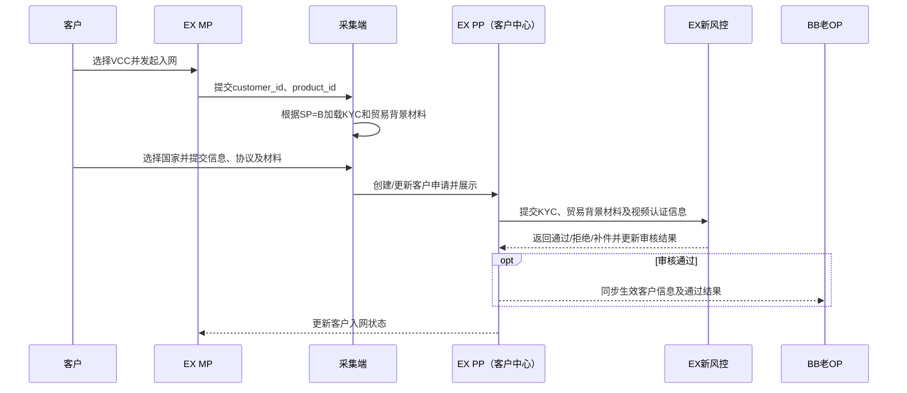

#### 入网异常

| 异常 | 处理方式 | 处理端/责任方 |
| --- | --- | --- |
| 风控要求补件 | MP展示客户可见要求，客户补充后生成新申请版本并重新审核 | EX MP、EX新风控 |
| 风控拒绝 | EX PP—客户中心展示拒绝结果，MP展示客户可见原因 | EX新风控、EX PP |
| 视频认证未完成 | 保持对应待处理状态；Level 1是否可继续按产品规则判断 | EX MP、EX PP |
| 客户修改已提交信息 | EX PP—客户中心展示新版本及修改记录，不覆盖历史；重新进入必要审核 | EX PP、EX新风控 |
| 客户未审核通过，BB老OP查不到 | 属于正常情况；运营先到EX PP—客户中心查看审核中、补件或拒绝状态，不要求BB老OP提前展示 | EX PP、EX新风控 |
| 客户已审核通过，但BB老OP仍查不到 | 运营先在EX PP确认已通过，再转技术处理；不要求客户重复提交或重新审核 | EX PP、技术 |
| EX PP与BB老OP客户资料或审核结果不一致 | 先确认进件入口；EX MP进件以EX PP/EX新风控有效版本为准，BB MP进件以BB老OP原风控有效版本为准；涉及跨端复用或渠道补件时两边同时核查并补齐同步 | EX PP、BB老OP、对应风控、技术 |
| 无法确认客户从EX MP还是BB MP进件 | 同时查询EX PP与BB老OP的申请时间、客户ID、材料版本和审核记录，确认来源后再处理，不得直接发起重复审核 | 运营、风控、技术 |
| A渠道开户失败或处理中 | 不影响客户在B的入网结果；仅影响后续是否可路由A | 渠道服务/客户无感知 |

#### 本节已确认与待确认

- 已确认：EX MP进件进入EX新风控，BB MP进件进入BB老OP原入网风控；两边分别保留资料和审核记录。
- 已确认：EX MP客户只有审核通过后的生效信息才同步BB老OP；审核中、补件、拒绝或BB老OP查不到时，运营先到EX PP—客户中心查看。
- 待确认：Level 1不进行视频认证时可使用的产品和业务范围，以及后续升级认证的触发条件。
- 待确认：客户修改哪些生效信息需要重新进入EX新风控，以及BB老OP展示的字段范围和同步时效。

### 7.2 产品开通流程

#### 产品模型

- 本期迁移涉及的业务产品只有VCC。
- 承兑作为基础产品/基础能力，不作为客户单独选择和申请的业务产品。
- VCC开通成功后，系统默认开通承兑基础产品；客户需要使用承兑时，可直接从EX MP进入承兑功能。
- 普通EX MP客户如已具备承兑基础能力，也可直接在EX MP使用承兑。
- 仅使用承兑、没有VCC迁移需求的客户，本期不主动引流至EX MP，承兑仍主要在BB MP使用。

#### 主流程

1. 客户选择VCC并形成独立产品申请；运营在“EX PP—产品申请”查看申请、协议、材料和状态。
2. 产品开通以客户入网审核通过为前置条件，客户入网审核与VCC产品开通审核仍为两条独立流程。
3. VCC审核通过后，建立有效VCC客户产品关系。
4. 系统根据VCC产品关系自动建立新的承兑基础产品关系，无需客户再次申请、签约或审核。
5. 客户如需承兑，可直接在EX MP发起数转法或法转数；承兑交易仍由BB原交易体系处理。

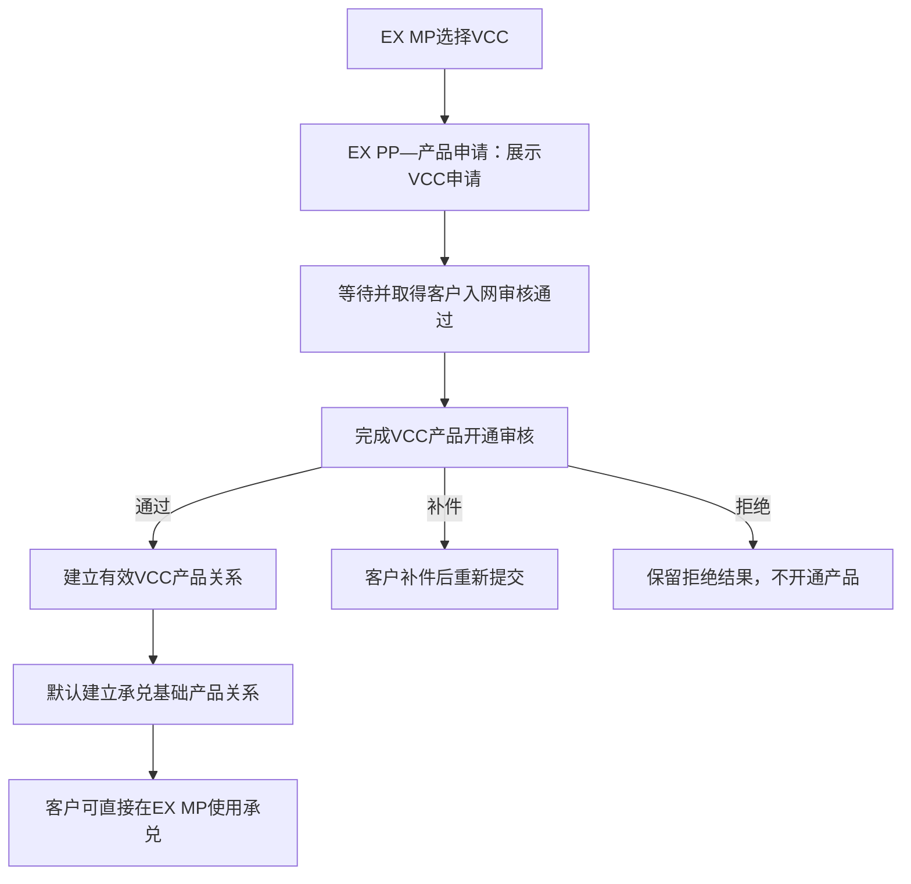

#### 产品开通异常

| 异常 | 处理方式 | 处理端/责任方 |
| --- | --- | --- |
| 客户入网未通过 | EX PP—产品申请显示等待客户入网，不开通VCC，也不建立承兑基础产品关系 | EX PP |
| VCC已开通但承兑基础产品未自动开通 | 运营在EX PP核对VCC及承兑基础产品关系；确认异常后直接转技术处理，不要求客户重新申请 | EX PP、技术 |
| EX PP与BB老OP产品关系不一致 | 运营分别查看两边记录，核对客户ID、VCC状态、新承兑产品代码及更新时间；确认有效结果后修复同步 | EX PP、BB老OP、技术 |
| 风控或渠道报备要求补充材料，但两边材料不一致 | 运营/风控同时查询EX PP和BB老OP，以最新有效申请版本完成补件，并由技术补齐另一侧数据 | EX PP、BB老OP、EX新风控/渠道 |

不存在“客户选错承兑产品”或“客户增开承兑产品”的业务场景：客户只申请VCC，承兑由VCC开通后自动获得。

#### 本节数据迁移与待确认

- 产品定义已明确：本期迁移涉及的业务产品只有VCC；承兑是基础产品，不提供独立承兑申请、选错产品或增开承兑产品流程。VCC客户默认激活承兑，普通EX MP客户具备承兑能力时也可使用。
- 已确认：历史“买入数币、卖出数币”相关承兑产品关系统一迁移到新的承兑基础产品代码（负责人：雅丽）。
- 待确认：API租户传入的旧产品代码如何映射至新产品代码，例如`P1`、`P2`是否统一转换为`P3`（负责人：Lee）。
- 已确认：只做承兑、没有VCC迁移需求的客户不主动引流至EX MP，继续以BB MP为主要入口（负责人：潇潇）。
- 待确认：VCC产品关系与承兑基础产品关系在EX PP、BB老OP的展示字段、同步时效及差异修复操作。
- 待确认：第三方/异名付款作为VCC下的能力如何授权及控制；本期不再定义独立“付款产品”开通流程。

### 7.3 历史BB客户在EX MP与BB MP之间切换

历史BB客户使用EX MP后再切回BB MP，不应因门户切换而重新注册、重新入网或重复开通产品。两个门户应识别为同一客户，并复用同一份生效客户信息、产品关系、地址簿和收款人账户。

运营处理原则如下：

1. 客户在EX MP新提交或修改的客户资料先在EX PP—客户中心查看；EX新风控审核通过后，生效信息才同步至BB老OP。
2. 客户在EX MP新增并审核通过的地址簿或收款人，切回BB MP后应继续可用；BB MP不得另建一套对象或要求重复审核。
3. 客户切回BB MP后看不到新内容时，运营先到EX PP确认。EX PP已有有效记录但BB MP不展示时直接转技术处理，不要求客户重复提交；EX PP也没有记录的，再确认客户是否实际提交成功。
4. 承兑交易仍由BB交易系统处理，因此门户切换不改变原交易处理、BB账户记账和BB计费归属。

#### 本节待确认

- EX MP与BB MP的历史客户账号及客户ID映射规则。
- 草稿、补件中申请和处理中对象能否跨门户继续，以及发生新旧信息冲突时以哪一版本为准。
- 历史地址簿和收款人的迁移范围、切换批次、同步时效及失败清单处理方式。
- 2026年9月9日后BB MP保留哪些入口，以及使用新地址簿和收款人流程的具体上线安排。

## 八、交易场景总览

客户完成入网并开通相应产品后，可在EX MP发起以下六类交易。交易对象维护是交易的前置子流程，不与交易订单合并为同一个状态对象。

| 交易场景 | 资金方向 | 前置/子流程 | EX MP操作 |
| --- | --- | --- | --- |
| 充币 | 外部数币地址 → 客户数币钱包 | 交易对手方—地址簿 | 选择网络/资产及所需地址信息，发起或查看充币商户单 |
| 充值 | 外部法币 → 客户法币钱包 | 收款工具（包括VA） | 申请/查看收款工具，完成法币充值并查看入账 |
| 提币 | 客户数币钱包 → 外部数币地址 | 交易对手方—地址簿 | 选择EX新风控审核通过的地址并发起提币 |
| 提现 | 客户钱包 → 客户同名法币账户 | 交易对手方—同名收款人账户 | 选择同名账户后按统一法币出款流程提交 |
| 付款 | 客户钱包 → 第三方/异名法币账户 | 交易对手方—第三方/异名收款人账户；需具备VCC下的付款能力 | 选择异名账户后按统一法币出款流程提交 |
| 数法承兑 | 客户数币钱包 ↔ 客户法币钱包 | 无独立交易对手方 | 发起数转法或法转数 |

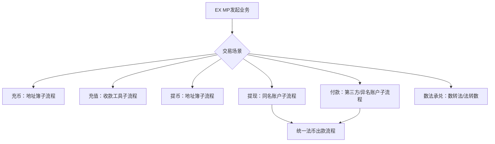

> 本方案暂不定义提现、付款及数法承兑的汇率获取、报价展示和成交汇率规则，后续由交易方案单独补充。

### 8.1 承兑账务与交易计费说明

承兑账务和交易计费不因客户从EX MP还是BB MP发起而改变：

| 客户归属 | 交易入口 | 承兑记账 | 所有交易计费 | 运营说明 |
| --- | --- | --- | --- | --- |
| BB客户 | EX MP或BB MP | BB账户系统 | BB计费-运营 | EX仅提供本期接入的客户操作入口，不改变BB承兑账务和计费归属 |
| BB以外其他EX租户客户 | 对应EX客户入口 | 本文不说明 | EX-租户自己TP计费 | 按EX租户现有计费流程处理，不进入BB计费 |

因此，同一BB客户即使改从EX MP发起承兑，承兑记账仍不得切换到EX账务系统；无论发起何种交易，计费均不得切换到EX计费。运营查询BB客户承兑账务或交易费用问题时，仍按BB原有运营流程处理。

## 九、法币充值（OnRamp）与收款工具流程

### 9.1 VA申请

法币充值的子流程为“收款工具”，本期以VA为主要承载方式。EX MP只承载VA申请、VA信息和法币充值交易展示；VA能力、法币来账识别、充值订单创建、交易核心、账务处理及异常处理均继续由BB体系承载。

1. 已开通承兑产品的客户在EX MP发起VA申请。
2. EX MP提交客户及VA申请信息至原BB VA能力。
3. BB OP可查看VA申请和VA信息，并按现有流程处理。
4. VA申请、分配、启用、拒绝或关闭结果回传EX MP。
5. 客户在EX MP查看VA信息，并按现有规则向VA入金；客户无需在EX MP另外创建法币充值订单。
6. BB交易系统识别VA来账并创建法币充值订单，负责交易核心、状态推进、账务及异常处理。
7. 法币充值交易进入原BB老风控，运营在BB老OP查看充值单并按原有流程处理。
8. BB交易系统将充值订单及资产结果提供给EX MP展示；EX MP不参与充值交易处理，也不维护交易终态。

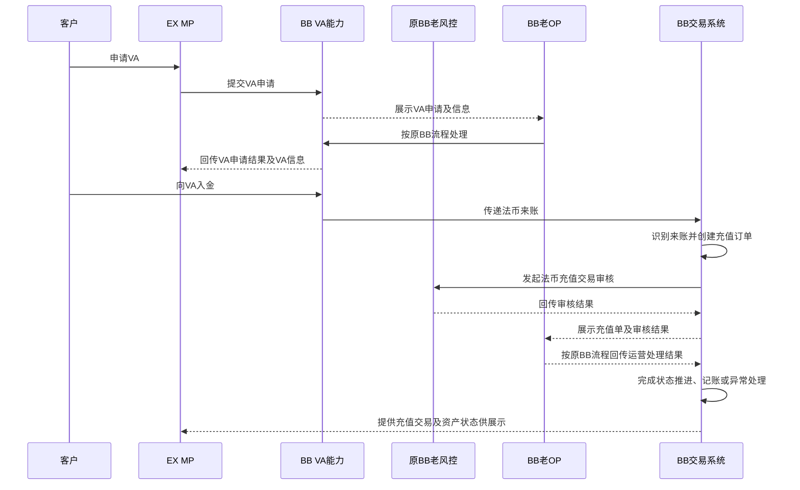

### 9.2 迁移约束

- EX MP新增VA申请和法币充值交易展示入口，不承接法币充值交易核心、来账识别、建单、处理或账务；BB MP相关原能力是否调整按VCC迁移切换方案执行。
- BB OP保留VA申请查询、VA信息查询、运营处理和异常处理能力。
- BB交易系统继续作为法币充值订单及交易状态的主责系统。
- EX PP本期不新增VA运营模块。
- EX MP和BB OP必须通过同一VA申请标识关联，不得因客户端迁移重复申请或重复分配VA。

## 十、客户数币充提流程

### 10.1 交易地址簿

#### 主流程

1. 客户进入EX MP交易地址簿，新增地址并提交所需信息。
2. 地址簿记录同步展示在“EX PP—交易对手方—地址簿”，运营可查看客户提交的信息和当前审核状态。
3. 客户提交后进入EX新风控审核，风控在“地址簿审核”任务中执行通过、拒绝或补件；无需运营在EX PP再次发起审核。
4. 审核结果返回EX MP和EX PP；只有审核通过后，生效地址簿数据及通过结果才同步至BB老OP。
5. 客户在EX MP查看客户可见状态；运营在EX PP查看完整申请和审核过程，BB老OP只承接审核通过后供交易使用的生效信息。审核中、补件、拒绝或BB老OP查不到时，运营先查EX PP。
6. 审核通过的地址按业务规则用于充币或提币；未通过的地址不得用于要求已审核地址的交易。

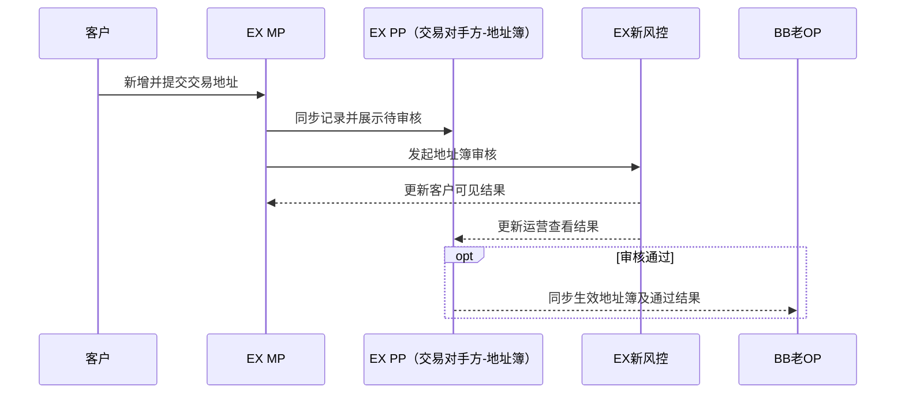

#### 本节已确认与待确认

- 已确认：地址簿由客户在EX MP提交，运营在EX PP查看，EX新风控审核；只有审核通过后的生效地址簿才同步BB老OP。
- 已确认：地址簿未通过或BB老OP未显示时，运营先在EX PP查看。EX PP显示审核中、补件或拒绝时属于正常未同步；EX PP已通过但BB老OP仍无记录时，直接转技术处理，不要求客户重复创建。
- 已确认：历史客户从EX MP切回BB MP时，应复用同一地址簿及审核结果，不因门户切换重复审核。
- 待确认：地址簿状态集合、客户可见文案、补件、重新提交、修改和停用规则，以及哪些修改触发重新审核。
- 待确认：EX PP和BB老OP展示/同步的具体字段、状态对应关系和同步时效。
- 待确认：2026年9月9日前BB MP的新地址簿交互、历史地址迁移及双门户切换方案。
- 老的不需要改造，只在新的上面用新的；

### 10.2 数币充币订单

#### 主流程

1. 客户在EX MP进入充币流程，并按业务要求选择或关联交易对手方—地址簿记录；地址簿具体状态仍待确认。
2. 客户发起充币，或系统根据链上入账形成客户充币商户单；具体建单触发方式沿用原承兑能力。
3. 交易系统生成唯一充币商户单，MP可查看订单号、资产、网络、数量、时间及状态。
4. 充币单同步至BB OP，BB OP可查询和处理。
5. 充币交易按BB现有流程进入原BB老风控。
6. BB OP审核及后续处理结果同步回交易系统，交易系统更新订单，MP展示最终状态。

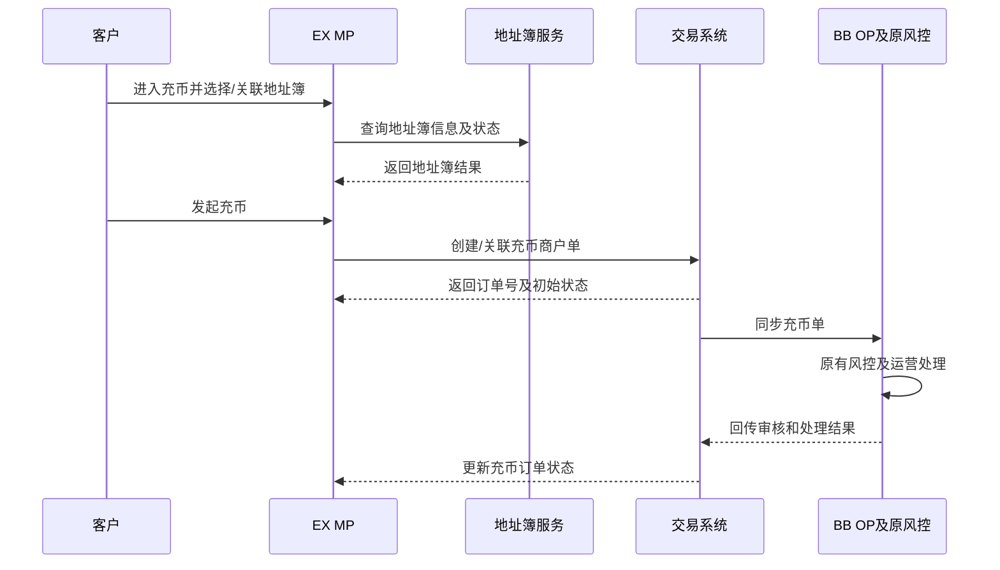

#### 本节待确认

- 充币商户单由客户主动提交创建，还是由链上入账事件生成并关联。

### 10.3 数币提币流程

1. 客户在EX MP选择已经EX新风控审核通过的交易地址。
2. MP提交提币申请，交易系统实时复核产品开通状态、客户状态、余额、限额和地址状态。
3. 交易系统创建提币订单并同步BB OP。
4. BB老OP可查看提币订单；提币交易审核继续沿用原BB老风控和现有处理流程。
5. 审核及链上处理结果同步交易系统，MP展示订单及最终状态。

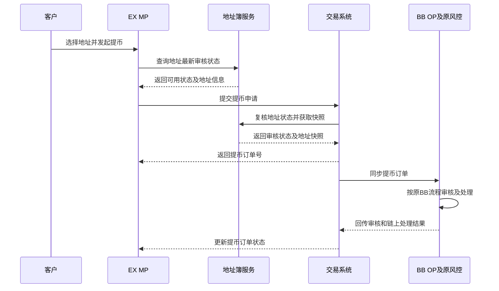

## 十一、客户承兑流程

### 11.1 支持范围

客户可在EX MP“数法承兑”中发起：

- 数转法；
- 法转数。

### 11.2 主流程

1. 客户选择承兑方向，填写资产、金额及业务要求的信息。
2. MP提交交易请求，交易系统校验产品开通状态、客户状态、余额及基础参数。
3. 交易系统创建承兑订单并返回MP，MP可查看订单和状态。
4. 订单同步至BB OP，BB OP可查看订单。
5. 承兑订单不进入任何风控审核，直接在BB老OP按现有承兑运营流程处理。
6. BB计费计算承兑交易费用；即使客户从EX MP发起，也不使用EX计费。
7. BB老OP将处理结果同步至交易系统，交易系统调用BB账户系统完成BB客户的资产及账务处理。
8. MP以交易系统状态展示处理结果。

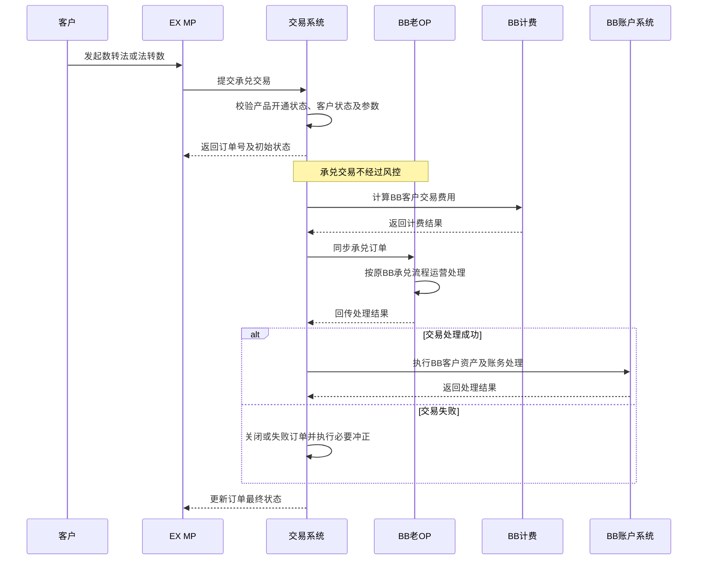

## 十二、客户提现与付款流程

### 12.1 法币收款人子流程

#### 主流程

1. 客户在EX MP“交易对手方”中添加法币收款人及其银行账户信息。
2. 收款人记录同步展示在“EX PP—交易对手方—收款人账户”，运营可查看客户提交的信息和当前审核状态。
3. 客户提交后进入EX新风控审核，风控在“收款人审核”任务中执行通过、拒绝或补件；无需运营在EX PP再次发起审核。
4. 审核结果返回EX MP和EX PP；只有审核通过后，交易所需的生效收款人数据及通过结果才同步至BB老OP。
5. 只有状态满足交易要求的收款人，才可用于发起提现或付款。

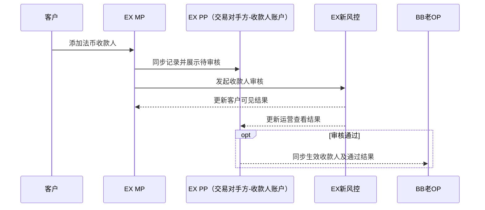

#### 本节已确认与待确认

- 已确认：收款人由客户在EX MP提交，运营在EX PP查看，EX新风控审核；只有审核通过后的生效收款人才同步BB老OP。
- 已确认：收款人未通过或BB老OP未显示时，运营先在EX PP查看。EX PP显示审核中、补件或拒绝时属于正常未同步；EX PP已通过但BB老OP仍无记录时，直接转技术处理，不要求客户重复创建。
- 已确认：历史客户从EX MP切回BB MP时，应复用同一收款人及审核结果，不因门户切换重复审核。
- 待确认：补件、重新提交以及收款人通过后哪些字段修改会触发重新审核。
- 待确认：EX PP和BB老OP展示的材料、拒绝原因、敏感字段范围、状态对应关系及同步时效。
- 待确认：2026年9月9日前BB MP的新收款人交互、历史收款人迁移及双门户切换方案。

### 12.2 提现/付款统一出款流程

提现和付款共用同一条法币出款流程，不分别建设两套交易处理链路。二者仅在能力条件、收款人类型和业务用途上存在差异：提现使用客户同名收款人账户；付款使用第三方/异名收款人账户，并要求客户具备VCC下的付款能力。

1. 客户在EX MP选择EX新风控审核通过的收款人账户，填写金额及业务所需信息后提交。
2. EX MP根据收款人类型及客户产品开通情况识别业务类型：同名账户进入提现，第三方/异名账户进入付款。
3. 交易系统统一校验客户状态、VCC及相关基础能力状态、余额、限额、收款人状态及基础参数；付款场景额外校验付款能力和付款用途。
4. 交易系统按业务类型创建提现订单或付款订单，并保存收款人及提交信息快照。
5. 订单同步至BB老OP，运营在对应出款订单中查看和处理。
6. 提现和付款交易均进入原BB老风控审核，审核结果回传交易系统。
7. 风控通过后执行统一出款处理；拒绝或交易失败时，按原账务逻辑解冻、冲正或退回。
8. 交易系统将处理结果同步至EX MP，客户查看订单状态。

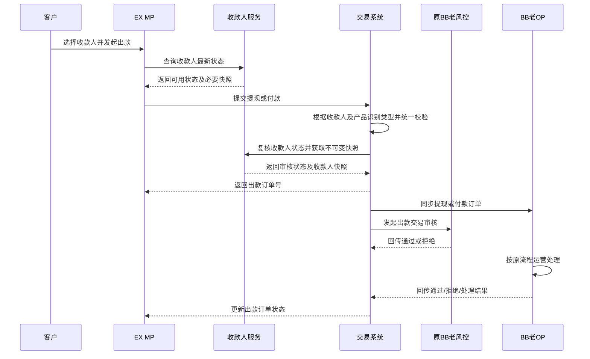

### 12.3 同名与异名收款人的使用条件

本期不再通过“承兑产品+付款产品”的组合判断收款人用途。本期迁移涉及的业务产品只有VCC，承兑为基础能力；同名账户用于提现，第三方/异名账户能否用于付款，由VCC下的付款能力配置、收款人审核结果及合规规则共同决定。

- 同名收款人通过EX新风控审核后，可按规则用于提现。
- 第三方/异名收款人即使审核通过，也只有在客户具备付款能力时才可用于付款。
- 付款能力未确认或不可用时，不得仅因客户已添加异名收款人而放行付款。
- 同名标准、关联主体认定和异名付款条件仍由合规风控确认。

### 12.4 付款场景补充规则

付款不另设交易主流程，直接复用12.2节统一出款流程。其前置条件为客户具备VCC下的付款能力，第三方/异名收款人账户已通过EX新风控审核；交易提交时还需携带付款用途等付款场景所需信息。任何前置条件不满足时均不得创建可执行的付款订单。

## 十三、风控审核归属

风控归属同时按“进件入口”和“审核对象”确定。客户入网存在双风控：EX MP进件进入EX新风控，BB MP进件进入BB老OP中的原入网风控；交易对象和交易订单再按下表分流。

| 审核对象/交易 | 是否审核 | 审核系统 | 运营查看端 | 结果回传 |
| --- | --- | --- | --- | --- |
| 客户入网—EX MP进件 | 是 | EX新风控—客户入网审核 | 全过程在EX PP—客户中心查看；通过后BB老OP查看生效信息 | 更新EX PP客户状态；审核通过后同步BB老OP，并作为产品开通前置条件 |
| 客户入网—BB MP进件 | 是 | BB老OP中的原入网风控 | BB老OP | 按原BB入网流程更新；不进入EX新风控 |
| 产品开通 | 是 | EX PP—产品开通审核 | EX PP—产品申请 | 更新产品申请及客户产品状态 |
| VA申请 | 沿用BB现状 | 原BB流程 | BB老OP | 回传VA能力及EX MP |
| 法币充值 | 是 | 原BB老风控 | BB老OP | 回传BB交易系统，由BB交易系统更新交易及EX MP展示状态 |
| 交易地址簿 | 是 | EX新风控—地址簿审核 | 全过程在EX PP查看；通过后BB老OP查看生效信息 | 更新EX MP、EX PP；审核通过后同步BB老OP |
| 数币充币 | 是 | 原BB老风控 | BB老OP | 回传交易系统及EX MP |
| 数币提币 | 是 | 原BB老风控 | BB老OP | 回传交易系统及EX MP |
| 数转法/法转数承兑 | 否 | 不经过风控 | BB老OP | BB原承兑流程直接处理并更新EX MP或BB MP |
| 法币收款人 | 是 | EX新风控—收款人审核 | 全过程在EX PP查看；通过后BB老OP查看生效信息 | 更新EX MP、EX PP；审核通过后同步BB老OP |
| 法币提现 | 是 | 原BB老风控 | BB老OP | 回传交易系统及EX MP |
| 付款 | 是 | 原BB老风控 | BB老OP | 回传交易系统及EX MP |

关键规则：

1. VA申请、法币提现、付款、数币充币、数币提币和承兑交易可从EX MP发起；法币充值由客户向VA入金后由BB交易系统识别并建单，EX MP只展示充值交易。除承兑外，相关交易按原流程进入原BB老风控；承兑不经过风控，直接在BB老OP按原流程处理。
2. 客户信息、地址簿和法币收款人进入EX新风控；只有审核通过后的生效信息才同步BB老OP。未通过或BB老OP查不到时先查EX PP。
3. 客户入网需先识别进件入口；EX MP和BB MP两边资料不一致时，运营和风控需同时查看EX PP/EX新风控与BB老OP原风控，按来源确定有效版本。
4. BB老OP只接收审核通过后的生效地址簿和收款人信息，原BB老风控不重复审核这两类对象。
5. 风控系统负责审核；运营以对应进件来源的EX PP或BB老OP业务状态为准。底层服务负责保存和同步最终状态。
6. 审核结果同步失败时，不得由另一套风控补审或人工直接改为通过。
7. BB客户的承兑交易由BB账户系统记账，所有交易由BB计费计算费用；交易从EX MP发起不改变这一归属。
8. BB以外其他EX租户使用EX计费，BB客户不得同时进入EX计费。

## 十四、按场景划分的全端功能矩阵

本期以“VCC客户生命周期相关门户进入EX MP、BB MP继续保留全部承兑交易和固定汇率产品、交易运营保留在BB老OP”为总原则。表内“无”表示本期不新增该场景；BB MP的存量门户能力按现状继续运行。

> 术语说明：本表中的EX PP即SP=B的新运营后台，也可理解为BB后续的EX OP；不是EX平台管理后台，EX平台后台为SA。

| 场景 | EX MP | BB MP | BB老OP | EX PP（SP=B新运营后台） | EX新风控 | 原BB老风控 |
| --- | --- | --- | --- | --- | --- | --- |
| 客户入网 | 提交KYC/贸易背景材料、补件、视频认证；进入EX新风控 | 原入口继续进件；进入BB老OP原入网风控 | 查看BB MP原进件及原风控结果；查看EX同步信息，两边不一致时双边核对 | 查看EX MP进件、材料版本及EX新风控结果 | 仅审核EX MP进件 | 审核BB MP进件 |
| 产品开通 | 提交VCC产品申请、签约、补件、查看状态 | 无；BB没有产品开通逻辑 | 无 | 查看VCC申请、协议、材料、审核状态和客户产品关系 | 无；以客户入网审核通过为前置条件 | 无 |
| 仪表盘与资产 | 查看本期接入的仪表盘和资产信息 | 保留原承兑仪表盘和资产能力 | 查看原客户账户余额 | 客户余额展示范围待确认 | 无 | 无 |
| 收款工具-VA申请 | 申请VA、查看VA信息和状态 | 保留原有能力，是否向EX MP切换按迁移范围执行 | 查看、处理VA申请及异常 | 无 | 无 | 按BB现状处理（如适用） |
| 法币充值 | 查看VA、充值交易及资产状态；不在MP创建充值订单 | 保留原承兑相关能力 | 查看充值单，处理匹配、入账及异常 | 无 | 无 | 审核法币充值交易 |
| 交易地址簿 | 在“交易对手方-地址簿”新增、查看；补件/修改/停用等操作待状态方案确认 | 如2026年9月9日后仍承载相关交易，必须改造为新地址簿交互并接入新流程 | 仅查看审核通过后同步的生效地址簿；查不到时先查EX PP | 查看地址簿全部申请及EX新风控结果 | 审核地址簿，回传结果 | 无 |
| 数币充币 | 发起/关联数币充币、查看商户单和状态 | 保留原充币交易能力 | 查看充币单并按原流程运营处理 | 无 | 无 | 审核数币充币交易 |
| 数币提币 | 选择已通过地址、发起提币、查看订单和状态 | 保留原提币交易能力 | 查看提币单并按原流程运营处理 | 无 | 无 | 审核数币提币交易 |
| 数转法/法转数承兑 | 发起数转法或法转数、查看订单和状态 | 保留全部原承兑交易；固定汇率产品仍仅在BB MP | 查看承兑订单并按原流程运营处理 | 无 | 无 | 无，不经过风控 |
| 法币收款人账户 | 在“交易对手方-收款人账户”新增、补件、查看、按规则停用 | 如2026年9月9日后仍承载相关交易，必须改造为新收款人交互并接入新流程 | 仅查看审核通过后同步的生效收款人；查不到时先查EX PP | 查看收款人全部申请及EX新风控结果 | 审核法币收款人账户，回传结果 | 无 |
| 法币提现 | 选择同名账户，按统一出款流程发起提现并查看状态 | 保留原提现能力 | 查看提现单并按原流程运营处理 | 无 | 无 | 审核法币提现交易 |
| VCC与承兑基础产品 | 客户申请VCC；VCC通过后自动获得承兑基础能力 | 原门户仅承兑客户不引流至EX MP | 查看同步产品关系 | 查看VCC申请及承兑基础产品关系；处理数据差异 | 无 | 无 |
| 付款 | 选择第三方/异名账户，按统一出款流程发起付款并查看状态 | 保留原付款能力 | 查看付款单并按原流程运营处理 | 无 | 无 | 审核付款交易 |
| 承兑账务与交易计费 | 展示BB账户系统处理的承兑资产结果及BB计费结果 | 展示原承兑资产及费用结果 | 按BB原流程查询承兑账务和交易费用 | 不承接承兑记账及交易计费 | 无 | 无 |
| 交易异常与补偿 | 查看客户可见状态 | 无 | 按授权处理重试、冲正、退回及异常单 | 无；仅协助定位客户和产品 | 地址簿/收款人审核异常处理 | 交易审核异常处理 |

关键边界：

1. BB MP本期不下线，继续保留全部原承兑交易能力；固定汇率产品仍只在BB MP提供。
2. EX MP承接VCC客户生命周期相关门户及本期接入的承兑入口，不代表承兑交易从BB MP整体迁出。
3. EX PP与BB老OP均为运营后台，但本期模块不重复：客户/入网/产品和新风控结果看EX PP，交易单据及交易异常看BB老OP。
4. 客户信息、地址簿、法币收款人账户由EX新风控审核，通过后才同步生效信息至BB老OP；未通过或BB老OP查不到时先查EX PP，原BB老风控不重复审核。
5. 无论交易从EX MP还是BB MP发起，法币充值、提现、付款和数币充提均按原流程进入原BB老风控；承兑不经过风控，直接在BB老OP运营。
6. BB客户承兑交易由BB账户系统记账，所有交易使用BB计费；其他EX租户使用EX计费。

## 十五、异常流程与处理手册

### 15.1 处理原则

1. 本章只说明运营和风控“去哪里看、如何判断、如何对客”，不展开技术排查、同步补偿、重试或账务修复方案。
2. 客户信息、地址簿或收款人在BB老OP查不到时，运营先去EX PP查看申请和审核状态；只有审核通过后才应同步BB老OP。
3. 入网问题先确认进件入口：EX MP进件看EX PP和EX新风控；BB MP进件看BB老OP原入网风控。来源不清或两边信息不一致时，两边同时查看。
4. 交易订单及交易风控问题在BB老OP和原BB老风控查看；承兑不经过风控，直接在BB老OP查看。
5. 运营和风控不得绕过审核、人工改为通过或仅根据客户描述判断结果；页面或数据技术异常直接转技术处理。

### 15.2 异常处理表

| 异常现象 | 运营/风控首查端 | 处理口径 |
| --- | --- | --- |
| BB老OP查不到客户信息 | EX PP—客户中心 | 先看审核状态；审核中、补件或拒绝时属于正常未同步。已通过仍查不到时转技术处理，不要求客户重复提交 |
| BB老OP查不到地址簿 | EX PP—交易对手方—地址簿 | 先看EX新风控状态；未通过不允许用于交易。已通过仍查不到时转技术处理 |
| BB老OP查不到收款人 | EX PP—交易对手方—收款人账户 | 先看EX新风控状态；未通过不允许用于提现或付款。已通过仍查不到时转技术处理 |
| EX MP与BB MP入网资料不一致 | EX PP、BB老OP | 先确认进件入口；EX进件以EX PP/EX新风控为准，BB进件以BB老OP原入网风控为准；无法确认时两边同时核对 |
| 入网、地址簿或收款人要求补件 | EX新风控和PP端   | EX进件在EX新风控查看补件要求，BB入网进件在BB老OP原风控查看；运营通知客户按当前有效要求补件，不重复收集相同材料 |
|  |
| 入网、地址簿或收款人审核拒绝 | EX新风控和PP端 | 以风控正式结果和可对客原因通知客户；不得人工放行。客户重新提交按对应审核规则处理 |
| 地址簿或收款人已通过，但客户bb-mp交易不可选择 | 先查EX PP，再查BB老OP | 先确认对象已通过；BB老OP仍无生效信息时转技术处理，不重复审核对象 |
| 客户添加异名收款人但无付款能力 | 先查EX PP是否开通付款产品 |  如果已经开通，联系产品/技术处理，如果没开通联系技术/产品排查原因
|
|  |
| 

## 十六、按端汇总

### 16.1 EX MP：客户操作端

EX MP本期主要承载VCC客户从入网到交易的门户，并允许具备承兑基础能力的普通EX MP客户使用承兑；下表不表示BB MP对应承兑能力被移除。

| 模块 | 客户可执行操作 | 结果展示 |
| --- | --- | --- |
| 客户入网 | 选择产品、签署协议、提交KYC/贸易背景材料、补件、视频认证 | 入网申请及审核状态 |
| 产品开通 | 申请VCC、补充VCC材料、查看开通状态 | VCC状态；通过后展示自动获得的承兑基础能力 |
| 仪表盘 | 查看承兑产品业务概览 | 资产及交易概览 |
| 资产 | 查看法币及数币资产 | 可用、冻结及总资产状态 |
| VA/法币充值 | 申请VA、查看VA信息、查看法币充值记录 | VA和充值状态 |
| 数币充币 | 查看充值信息并发起/关联BB原流程支持的充币操作 | 数币充币商户单及状态 |
| 交易对手方-地址簿 | 新增、查看提币地址；补件、修改、停用等操作待状态方案确认 | 展示EX新风控结果；具体状态文案待确认 |
| 数币提币 | 选择已通过地址并发起提币 | 提币订单及状态 |
| 数法承兑 | 发起数转法、法转数 | 承兑不经过风控，展示BB原承兑处理状态；汇率规则不在本文定义 |
| 交易对手方-收款人账户 | 新增、补件、查看、按规则停用法币收款人账户 | EX新风控审核状态 |
| 法币提现 | 选择同名账户，按统一出款流程发起提现 | 提现订单及处理状态 |
| 付款 | 选择第三方/异名账户，按统一出款流程发起付款 | 付款订单及处理状态 |

### 16.2 BB MP：原客户操作端（本期保留）

| 模块 | 本期功能 | 处理规则 |
| --- | --- | --- |
| 客户入网 | 原门户按BB原入网流程处理 | BB MP进件进入BB老OP原入网风控 |
| 产品开通 | 无 | BB没有产品开通逻辑；VCC产品开通仅在EX MP/EX PP处理 |
| VA、法币充值 | 保留原有能力 | EX MP增加本期接入入口，后台仍沿用BB体系 |
| 数币充币、数币提币 | 保留原有交易能力 | 与EX MP入口共同进入原BB交易流程 |
| 数转法、法转数 | 保留全部原承兑交易能力 | 固定汇率产品继续仅在BB MP使用 |
| 法币提现、付款 | 保留原有交易能力 | 与EX MP入口共同进入原BB出款流程 |
| 地址簿、法币收款人账户 | 如2026年9月9日后仍承载相关交易，必须改造交互并使用新的地址簿/收款人流程 | EX新风控审核，EX PP查看全过程；仅通过后同步BB老OP；不得继续使用旧交互绕过新风控 |

BB MP本期继续运行，不设置下线计划，并继续作为承兑主要入口。承兑交易能力不会因EX MP上线而一次性迁走。

### 16.3 EX PP：SP=B后续运营后台

| 模块 | 可查看/操作 | 明确不承载 |
| --- | --- | --- |
| 客户中心—客户信息 | 客户基本信息、客户申请、生效版本、修改记录、入网材料、审核状态和视频认证结果——这个中台产品同步所有操作 | BB承兑交易运营处理  |
| 客户开通产品 | 产品-客户产品关系；——这个中台产品同步所有操作 | VA、充值、承兑、提现单据处理 |
| 交易对手方—收款人账户 | 查看客户提交信息、EX新风控审核结果 | 替代EX风控审批、替代BB OP处理提现或付款 |
| 交易对手方—地址簿 | 查看客户提交信息及EX新风控审核结果； | 替代EX新风控审批、替代BB老OP处理交易 |

EX PP的长期定位是BB统一运营后台；上表“明确不承载”仅表示本期尚未迁移，不代表未来永久不支持。

### 16.4 BB老OP：本期承兑交易运营端

| 模块 | 可查看/操作 | 风控关系 |
| --- | --- | --- |
| 客户入网 | 审核BB MP原进件；仅查看EX审核通过后同步的生效客户信息。EX客户未通过或OP查不到时先查EX PP | BB MP进件由BB老OP原风控审核；EX MP进件由EX新风控审核，BB老OP不重复审核EX进件 |
| 产品开通 | 无 | BB没有产品开通逻辑；VCC产品开通仅在EX MP/EX PP处理 |
| VA申请及VA信息 | 查询、处理VA申请及异常 | 沿用BB现状 |
| 法币充值 | 查看充值单据，处理匹配、入账及异常 | 原BB老风控 |
| 数币充币 | 查看充币商户单并按原流程处理 | 原BB老风控 |
| 交易地址簿 | 查看EX审核通过后同步的生效地址簿；未通过或查不到时先查EX PP | EX新风控审核，老风控不重复审核 |
| 数币提币 | 查看提币订单并按原流程处理 | 原BB老风控 |
| 数转法/法转数 | 查看并处理承兑订单 | 不经过风控，直接按BB原承兑流程处理 |
| 法币收款人 | 查看EX审核通过后同步的生效收款人；未通过或查不到时先查EX PP | BB OP不重复审核法币收款人 |
| 法币提现 | 查看提现订单并按原流程处理 | 原BB老风控 |
| 付款 | 查看付款订单并按原流程处理 | 原BB老风控 |

### 16.5 原BB老风控：交易审核端

| 审核对象 | 可执行功能 | 明确不审核 |
| --- | --- | --- |
| 客户入网—BB MP进件 | 在BB老OP原入网风控中按原流程审核 | 不审核EX MP进件；EX MP进件由EX新风控审核 |
|  |
| 法币充值 | 按原BB流程审核交易 | 地址簿、法币收款人账户 |
| 法币提现 | 按原BB流程审核交易 | 地址簿、法币收款人账户 |
| 卖出数币 | 按原BB流程审核交易 | 地址簿、法币收款人账户 |
| 数币充币 | 按原BB流程审核交易 | 地址簿、法币收款人账户 |
| 数币提币 | 按原BB流程审核交易 | 地址簿、法币收款人账户 |
| 数转法/法转数承兑 | 无 | 承兑交易不经过风控 |
