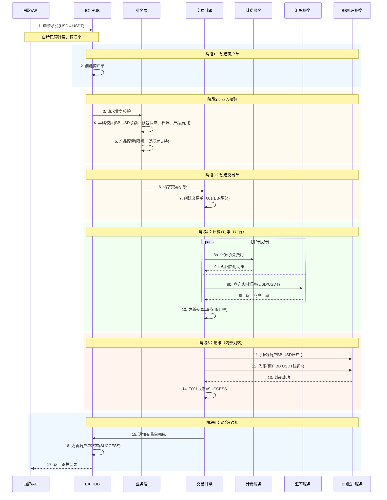
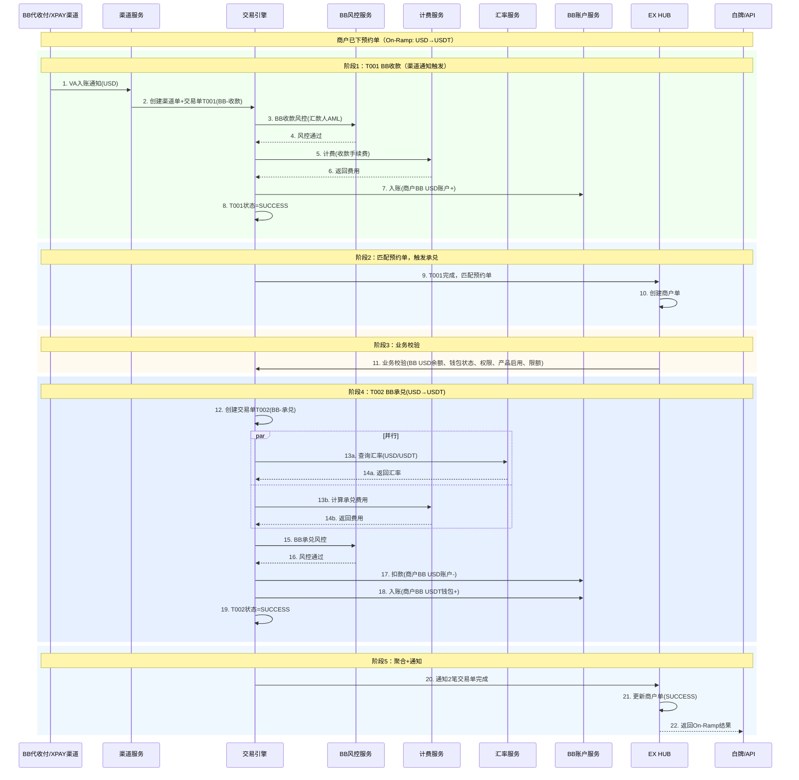
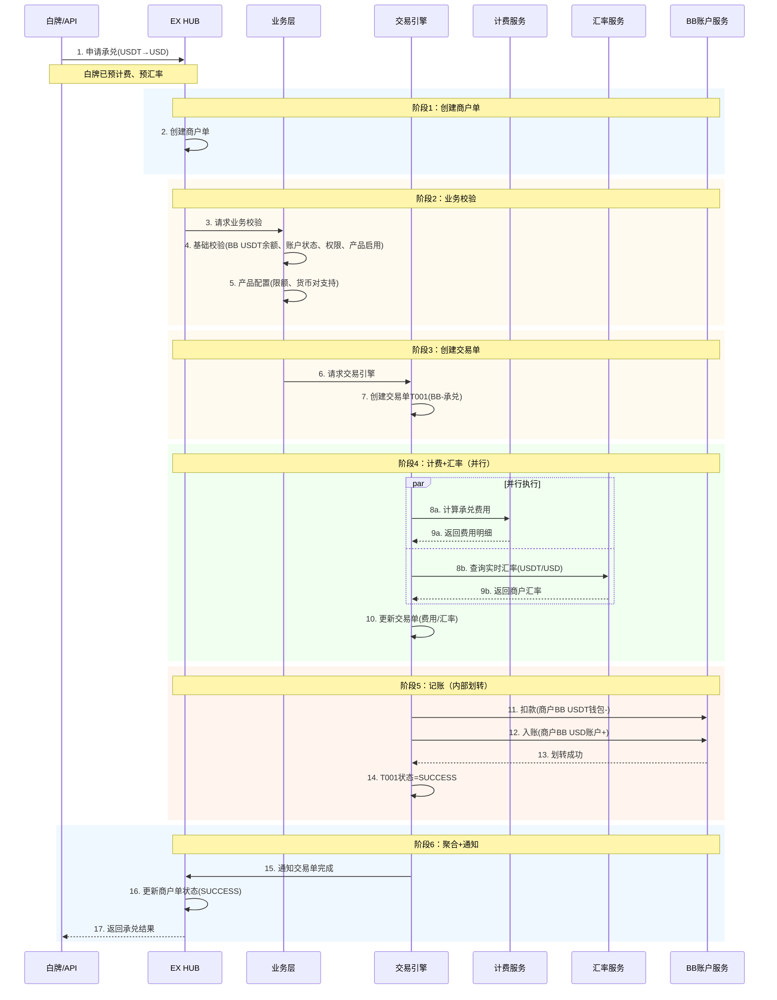
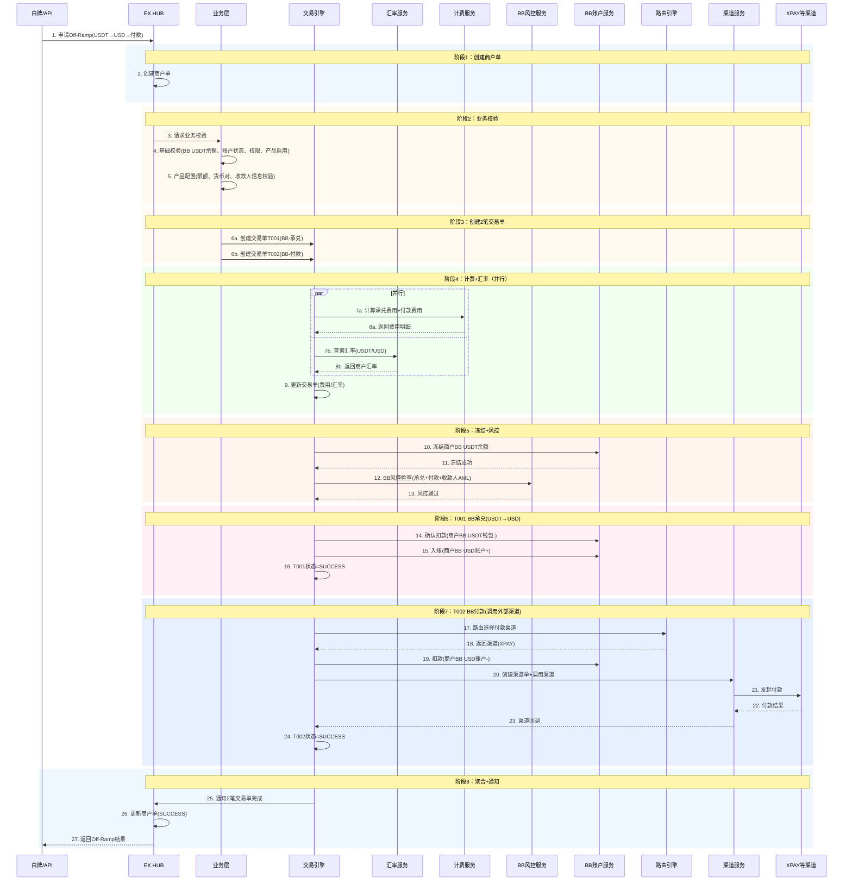
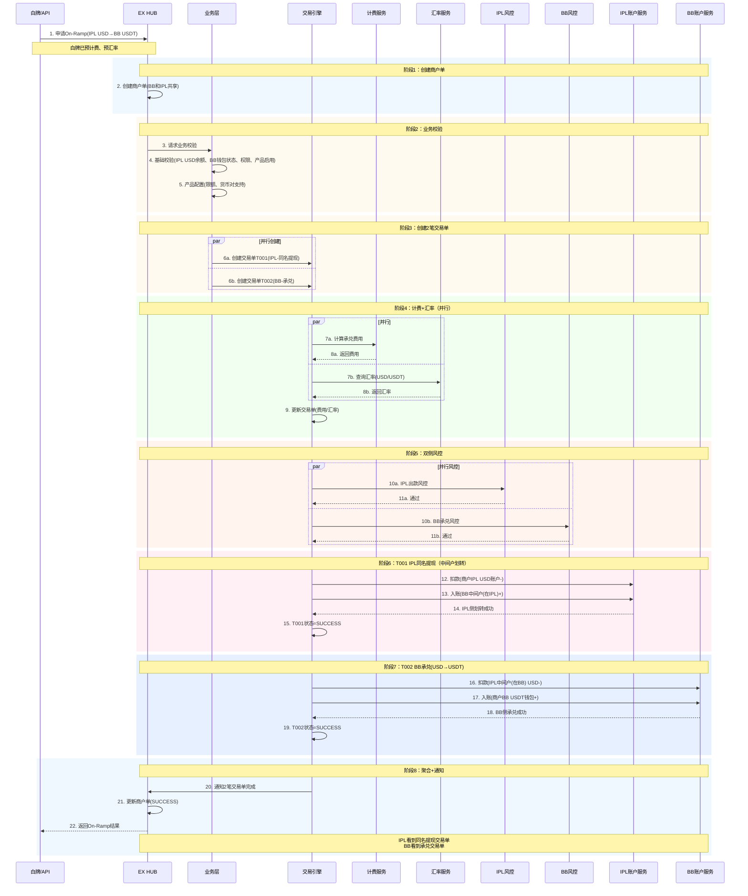
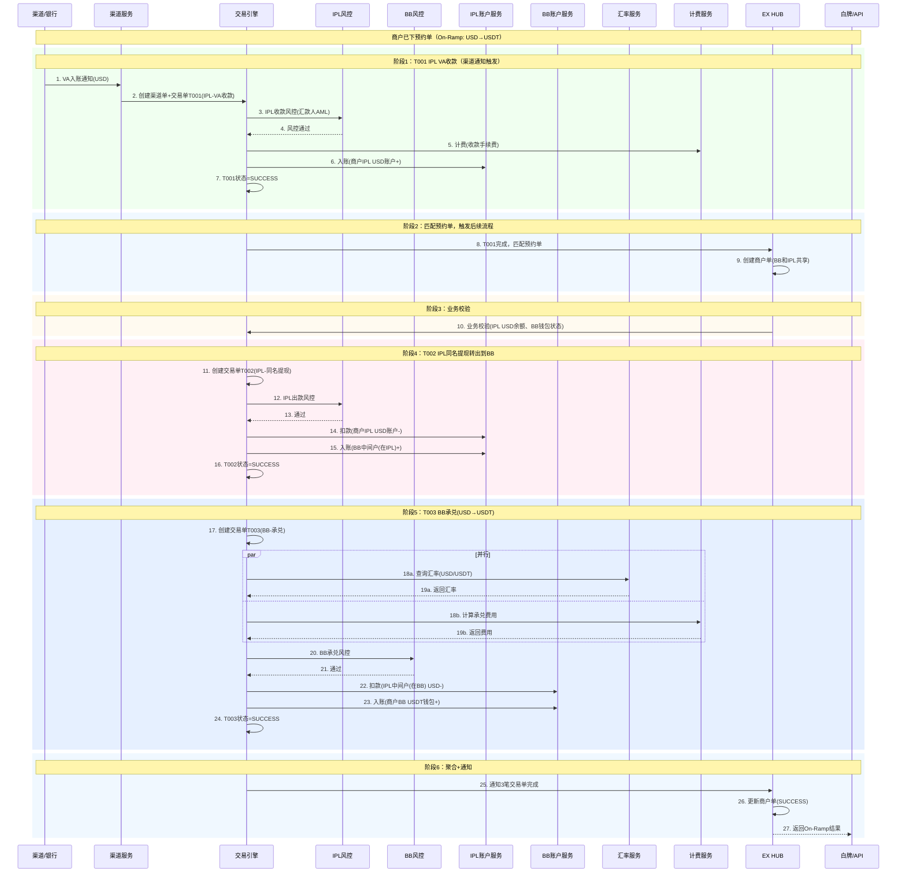
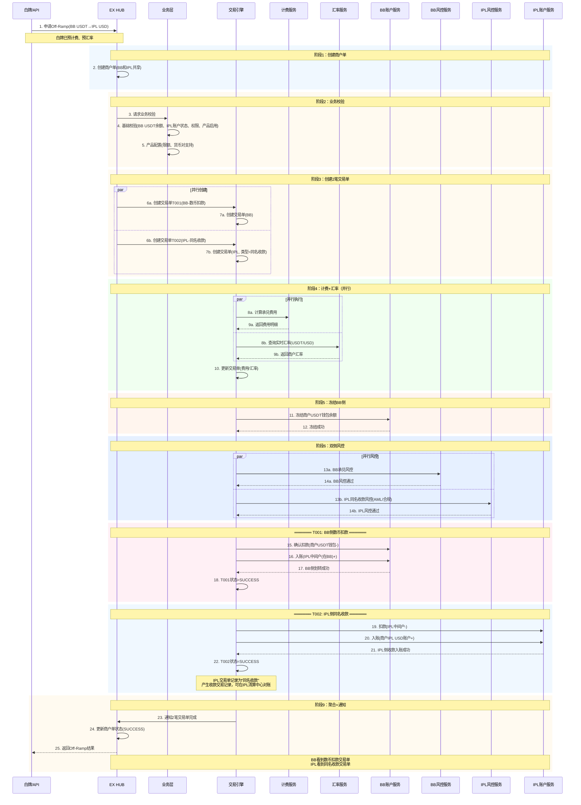
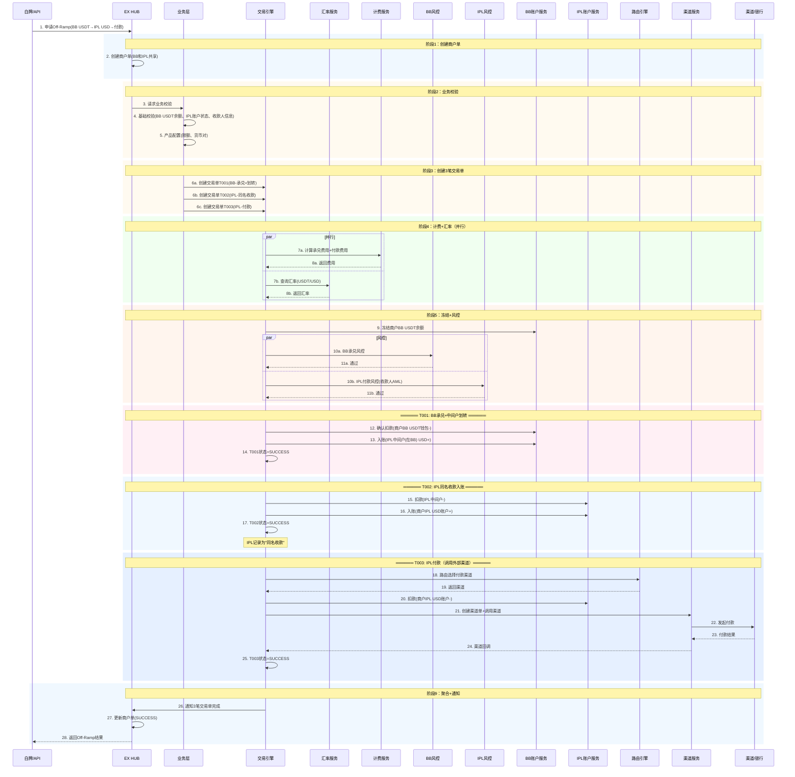

# On-Ramp / Off-Ramp 交易流程

## 文档概述

本文档描述EX平台On-Ramp（法币→数币）和Off-Ramp（数币→法币）的完整交易流程。

**两种模式：**

- **模式A：BB自己完成**（单SP）— BB自有代收付账户/XPAY渠道，全程在BB内部
- **模式B：IPL-BB打通**（双SP）— 通过中间户跨SP协作，IPL侧为同名收款交易

**核心概念：**

- **On-Ramp**：法币 → 数币（收到法币，承兑为USDT等数币）
- **Off-Ramp**：数币 → 法币（持有数币，承兑为USD等法币）
- **纯承兑**：账户内已有余额，直接币种转换（不涉及外部收付款）
- **带收款的On-Ramp**：外部法币入金 + 承兑为数币
- **带付款的Off-Ramp**：承兑为法币 + 付款给外部收款人

---

## 目录

1. [模式A：BB自己完成（单SP）](#模式abb自己完成单sp)
   - 1.1 [On-Ramp：BB法币账户直接承兑到数币钱包](#11-on-rampbb法币账户直接承兑到数币钱包)
   - 1.2 [On-Ramp：BB代收付/XPAY VA收款 → 承兑到数币钱包](#12-on-rampbb代收付xpay-va收款--承兑到数币钱包)
   - 1.3 [Off-Ramp：BB数币钱包承兑到BB法币账户](#13-off-rampbb数币钱包承兑到bb法币账户)
   - 1.4 [Off-Ramp：BB数币钱包 → 承兑 → BB/XPAY付款给收款人](#14-off-rampbb数币钱包--承兑--bbxpay付款给收款人)
2. [模式B：IPL-BB打通（双SP）](#模式bipl-bb打通双sp)
   - 2.1 [On-Ramp：IPL法币账户 → 承兑到BB数币钱包](#21-on-rampipl法币账户--承兑到bb数币钱包)
   - 2.2 [On-Ramp：IPL VA收款 → 承兑到BB数币钱包](#22-on-rampipl-va收款--承兑到bb数币钱包)
   - 2.3 [Off-Ramp：BB数币钱包 → 承兑到IPL法币账户](#23-off-rampbb数币钱包--承兑到ipl法币账户)
   - 2.4 [Off-Ramp：BB数币钱包 → 承兑 → 通过IPL付款给收款人](#24-off-rampbb数币钱包--承兑--通过ipl付款给收款人)
3. [场景汇总对比](#场景汇总对比)

---

## 模式A：BB自己完成（单SP）

> 全程在BB内部完成，使用BB自有的代收付账户或XPAY渠道，不经过IPL。

### 1.1 On-Ramp：BB法币账户直接承兑到数币钱包

**场景：** 商户BB法币账户已有USD余额，直接承兑为USDT到BB数币钱包。

**特点：** 纯承兑，无外部收付款，无渠道单。

**单据结构（1笔交易单）：**

```
商户单 M001 (On-Ramp: USD→USDT)  ← 仅BB
    └── 交易单 T001 (BB): 承兑 — BB USD→USDT（内部账户划转）
```

**资金流向：**

```
商户BB USD账户 -  →  商户BB USDT钱包 +
```



**说明：**

- **纯BB内部承兑**：BB法币账户 → BB数币钱包，内部账户划转
- **无需渠道单**：不调用外部渠道
- **无需风控**：内部账户划转，不涉及外部交易
- **1个商户单，1笔交易单**

---

### 1.2 On-Ramp：BB代收付/XPAY VA收款 → 承兑到数币钱包

**场景：** 外部汇款人通过BB的代收付账户或XPAY VA汇入USD，收款到BB法币账户后，自动承兑为USDT到BB数币钱包。

**特点：** 收款（渠道触发）+ 承兑，2笔交易单串行。

**单据结构（2笔交易单）：**

```
商户单 M001 (On-Ramp: VA收款USD→USDT)  ← 仅BB
    ├── 交易单 T001 (BB): 收款 — 外部USD入到BB法币账户（渠道通知触发）
    └── 交易单 T002 (BB): 承兑 — BB USD→USDT
```

**资金流向：**

```
外部汇款人  →  商户BB USD账户  →  商户BB USDT钱包
             (T001: 收款)       (T002: 承兑)
```



**说明：**

- **1个商户单，2笔交易单**：BB收款1笔 + BB承兑1笔
- **T001(BB收款)**：渠道通知触发，外部USD入到商户BB法币账户，走BB收款风控（汇款人AML），有渠道单
- **T002(BB承兑)**：BB USD→USDT，内部账户划转，走BB承兑风控
- **预约单模式**：商户先下预约单，收款到账后自动触发T002承兑
- **T001→T002串行**：收款完成后才能承兑
- **计费**：收款手续费 + 承兑费用分别计算

---

### 1.3 Off-Ramp：BB数币钱包承兑到BB法币账户

**场景：** 商户BB数币钱包持有USDT，承兑为USD到BB法币账户。

**特点：** 纯承兑，无外部收付款，无渠道单。与1.1方向相反。

**单据结构（1笔交易单）：**

```
商户单 M001 (Off-Ramp: USDT→USD)  ← 仅BB
    └── 交易单 T001 (BB): 承兑 — BB USDT→USD（内部账户划转）
```

**资金流向：**

```
商户BB USDT钱包 -  →  商户BB USD账户 +
```



**说明：**

- **纯BB内部承兑**：BB数币钱包 → BB法币账户，内部账户划转
- **无需渠道单**：不调用外部渠道
- **无需风控**：内部账户划转，不涉及外部交易
- **1个商户单，1笔交易单**
- **与1.1完全对称**，方向相反（1.1是法币→数币，1.3是数币→法币）

---

### 1.4 Off-Ramp：BB数币钱包 → 承兑 → BB/XPAY付款给收款人

**场景：** 商户持有BB USDT，Off-Ramp承兑为USD后，直接通过BB的法币通道（XPAY等）付款给外部收款人。全程在BB内部完成。

**特点：** 承兑 + 付款（调用外部渠道），2笔交易单串行。

**单据结构（2笔交易单）：**

```
商户单 M001 (Off-Ramp: USDT→USD→付款)  ← 仅BB
    ├── 交易单 T001 (BB): 承兑 — BB USDT→USD
    └── 交易单 T002 (BB): 付款 — BB USD付款给收款人（调用XPAY等外部渠道）
```

**资金流向：**

```
商户BB USDT钱包  →  商户BB USD账户  →  外部收款人
                (T001: 承兑)       (T002: 付款，调用XPAY渠道)
```



**说明：**

- **1个商户单，2笔交易单**：BB承兑1笔 + BB付款1笔，全程BB内部
- **T001(BB承兑)**：BB USDT→USD，内部账户划转（钱包→法币账户）
- **T002(BB付款)**：BB USD→外部收款人，调用XPAY等外部渠道，有渠道单
- **风控**：BB统一风控（承兑风控+付款风控+收款人AML）
- **计费**：承兑费用 + 付款费用分别计算
- **T001→T002串行**：承兑完成后才能付款

---

## 模式B：IPL-BB打通（双SP）

> 通过中间户实现跨SP协作。IPL侧每笔跨SP入账视为"同名收款"交易，产生完整收款记录。

**中间户机制：**

- BB和IPL各自维护对方的中间户
- 资金通过中间户完成跨SP划转
- BB和IPL之间有清算协议定期轧差
- 中间户是记账手段，不改变交易性质

**IPL侧同名收款：**

- IPL作为持牌机构，将每笔跨SP入账视为同名收款（Collection）
- 同名收款 = 付款人和收款人是同一商户（商户自己的钱从BB侧转到IPL侧）
- 产生完整的收款交易记录，可在IPL清算/对账体系中追踪
- 走IPL收款合规流程（AML检查）

---

### 2.1 On-Ramp：IPL法币账户 → 承兑到BB数币钱包

**场景：** 商户IPL法币账户已有USD余额，通过IPL-BB打通承兑为USDT到BB数币钱包。

**特点：** 纯承兑（账户已有余额），跨SP中间户划转，2笔交易单。

**单据结构（2笔交易单）：**

```
商户单 M001 (On-Ramp: IPL USD→BB USDT)  ← BB和IPL共享
    ├── 交易单 T001 (IPL): 同名提现 — IPL USD转到BB（通过中间户）
    └── 交易单 T002 (BB): 承兑 — BB USD→USDT
```

**资金流向：**

```
商户IPL USD账户  →  中间户  →  BB USD  →  商户BB USDT钱包
              (T001: IPL同名提现)    (T002: BB承兑)
```



**说明：**

- **1个商户单，2笔交易单**：IPL同名提现1笔 + BB承兑1笔
- **T001(IPL同名提现)**：商户IPL USD → BB中间户，走IPL出款风控
- **T002(BB承兑)**：BB中间户USD → 商户BB USDT钱包，走BB承兑风控
- **无需渠道单**：不调用外部渠道，通过中间户划转
- **T001→T002串行**：IPL提现完成后才能BB承兑

---

### 2.2 On-Ramp：IPL VA收款 → 承兑到BB数币钱包

**场景：** 外部汇款人通过IPL VA汇入USD，收款到IPL法币账户后，通过中间户转到BB，承兑为USDT到BB数币钱包。

**特点：** 收款（渠道触发）+ 跨SP划转 + 承兑，3笔交易单串行。

**单据结构（3笔交易单）：**

```
商户单 M001 (On-Ramp: IPL VA收款→USD→USDT)  ← BB和IPL共享
    ├── 交易单 T001 (IPL): VA收款 — 外部USD入到IPL法币账户（渠道通知触发）
    ├── 交易单 T002 (IPL): 同名提现转出 — IPL USD转到BB（通过中间户）
    └── 交易单 T003 (BB): 承兑 — BB USD→USDT
```

**资金流向：**

```
外部汇款人  →  商户IPL USD账户  →  中间户  →  BB USD  →  商户BB USDT钱包
            (T001: IPL VA收款)  (T002: IPL同名提现)    (T003: BB承兑)
```



**说明：**

- **1个商户单，3笔交易单**：IPL VA收款1笔 + IPL同名提现1笔 + BB承兑1笔
- **T001(IPL VA收款)**：渠道通知触发，外部USD入到商户IPL法币账户，走IPL收款风控，有渠道单
- **T002(IPL同名提现)**：商户IPL USD → BB中间户，走IPL出款风控
- **T003(BB承兑)**：BB中间户USD → 商户BB USDT钱包，走BB承兑风控
- **预约单模式**：商户先下预约单，VA收款到账后自动触发T002+T003
- **T001→T002→T003串行**：收款完成才能提现，提现完成才能承兑
- **每笔交易单各自独立风控**

---

### 2.3 Off-Ramp：BB数币钱包 → 承兑到IPL法币账户

**场景：** 商户BB数币钱包持有USDT，通过IPL-BB打通承兑为USD，入到IPL法币账户。

**特点：** 纯承兑（账户已有余额），跨SP中间户划转，IPL侧为同名收款。2笔交易单。

**单据结构（2笔交易单）：**

```
商户单 M001 (Off-Ramp: BB USDT→IPL USD)  ← BB和IPL共享
    ├── 交易单 T001 (BB): 数币扣款 — 商户USDT钱包扣款，入到IPL中间户(在BB)
    └── 交易单 T002 (IPL): 同名收款 — IPL中间户扣款，入到商户USD账户
```

**资金流向：**

```
商户BB USDT钱包  →  IPL中间户(在BB)  →  IPL中间户扣款  →  商户IPL USD账户
              (T001: BB数币扣款)                    (T002: IPL同名收款)
```



**说明：**

- **1个商户单，2笔交易单**：BB数币扣款1笔 + IPL同名收款1笔
- **T001(BB数币扣款)**：商户USDT钱包 → IPL中间户(在BB)，走BB承兑风控
- **T002(IPL同名收款)**：IPL中间户 → 商户IPL USD账户，走IPL收款合规流程（AML）
- **IPL侧是同名收款交易**：付款人=收款人=同一商户，产生完整收款交易记录
- **无需渠道单**：通过中间户划转
- **双侧风控**：BB承兑风控 + IPL收款合规
- **IPL清算可追踪**：IPL侧产生收款交易记录，可在清算中心对账

---

### 2.4 Off-Ramp：BB数币钱包 → 承兑 → 通过IPL付款给收款人

**场景：** 商户持有BB USDT，Off-Ramp承兑为USD，通过中间户转到IPL法币账户，再通过IPL法币通道付款给外部收款人。

**特点：** 承兑 + 跨SP划转 + 付款（调用外部渠道），3笔交易单串行。

**单据结构（3笔交易单）：**

```
商户单 M001 (Off-Ramp: BB USDT→IPL USD→付款)  ← BB和IPL共享
    ├── 交易单 T001 (BB): 承兑+划转 — BB USDT→USD，通过中间户到IPL
    ├── 交易单 T002 (IPL): 同名收款入账 — 中间户→商户IPL USD账户
    └── 交易单 T003 (IPL): 付款 — IPL USD付款给收款人（调用外部渠道）
```

**资金流向：**

```
商户BB USDT钱包  →  中间户  →  商户IPL USD账户  →  外部收款人
            (T001: BB承兑+划转)  (T002: IPL同名收款)  (T003: IPL付款)
```



**说明：**

- **1个商户单，3笔交易单**：BB承兑+划转1笔 + IPL同名收款1笔 + IPL付款1笔
- **T001(BB承兑+划转)**：BB USDT→USD，通过中间户划转到IPL侧
- **T002(IPL同名收款)**：中间户 → 商户IPL USD账户，IPL记录为同名收款
- **T003(IPL付款)**：商户IPL USD → 外部收款人，调用外部渠道，有渠道单
- **风控**：BB承兑风控 + IPL付款风控（收款人AML），各自独立
- **T001→T002→T003串行**：承兑完才能入账，入账后才能付款

---

## 场景汇总对比

### 按模式分类

| 场景 | 模式 | 方向 | 交易单数 | SP | 渠道单 | 触发方式 |
| --- | --- | --- | --- | --- | --- | --- |
| 1.1 BB法币→数币 | A(BB自己) | On-Ramp | 1笔 | 单SP(BB) | ❌ | 商户发起 |
| 1.2 BB VA收款→数币 | A(BB自己) | On-Ramp | 2笔 | 单SP(BB) | ✅ | 渠道触发+预约单 |
| 1.3 BB数币→法币 | A(BB自己) | Off-Ramp | 1笔 | 单SP(BB) | ❌ | 商户发起 |
| 1.4 BB数币→付款 | A(BB自己) | Off-Ramp | 2笔 | 单SP(BB) | ✅ | 商户发起 |
| 2.1 IPL法币→BB数币 | B(IPL-BB) | On-Ramp | 2笔 | 双SP | ❌ | 商户发起 |
| 2.2 IPL VA收款→BB数币 | B(IPL-BB) | On-Ramp | 3笔 | 双SP | ✅ | 渠道触发+预约单 |
| 2.3 BB数币→IPL法币 | B(IPL-BB) | Off-Ramp | 2笔 | 双SP | ❌ | 商户发起 |
| 2.4 BB数币→IPL付款 | B(IPL-BB) | Off-Ramp | 3笔 | 双SP | ✅ | 商户发起 |

### 对称关系

```
模式A（BB自己）：
  On-Ramp                          Off-Ramp
  ┌──────────────────┐             ┌──────────────────┐
  │ 1.1 纯承兑        │  ◄──对称──► │ 1.3 纯承兑        │
  │ USD → USDT       │             │ USDT → USD       │
  │ 1笔交易单         │             │ 1笔交易单         │
  └──────────────────┘             └──────────────────┘
  ┌──────────────────┐             ┌──────────────────┐
  │ 1.2 收款+承兑     │  ◄──对称──► │ 1.4 承兑+付款     │
  │ VA收款→承兑       │             │ 承兑→XPAY付款    │
  │ 2笔交易单         │             │ 2笔交易单         │
  └──────────────────┘             └──────────────────┘

模式B（IPL-BB打通）：
  On-Ramp                          Off-Ramp
  ┌──────────────────┐             ┌──────────────────┐
  │ 2.1 纯承兑(跨SP)  │  ◄──对称──► │ 2.3 纯承兑(跨SP)  │
  │ IPL USD→BB USDT  │             │ BB USDT→IPL USD  │
  │ 2笔交易单         │             │ 2笔交易单         │
  └──────────────────┘             └──────────────────┘
  ┌──────────────────┐             ┌──────────────────┐
  │ 2.2 收款+承兑     │  ◄──对称──► │ 2.4 承兑+付款     │
  │ IPL VA收款→承兑   │             │ 承兑→IPL付款     │
  │ 3笔交易单         │             │ 3笔交易单         │
  └──────────────────┘             └──────────────────┘
```

### 核心差异

| 对比项 | 模式A（BB自己） | 模式B（IPL-BB打通） |
| --- | --- | --- |
| **SP数量** | 单SP（BB） | 双SP（BB+IPL） |
| **法币通道** | BB代收付账户/XPAY | IPL法币通道 |
| **中间户** | 不需要 | 需要（BB和IPL各维护对方中间户） |
| **IPL侧交易性质** | 不涉及IPL | 同名收款（Collection） |
| **风控** | BB统一风控 | BB风控 + IPL合规，各自独立 |
| **清算** | BB内部清算 | BB清算 + IPL清算，各自独立 |
| **适用场景** | BB有自己的法币渠道能力 | 需要借助IPL的法币渠道能力 |

---

*最后更新：2026-02-14*
*文档版本：v3.0 — 重构为2种模式×4场景的On/Off-Ramp完整流程*
