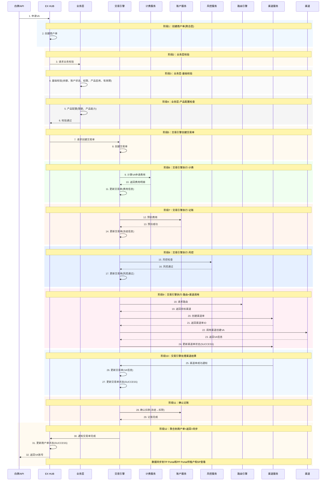
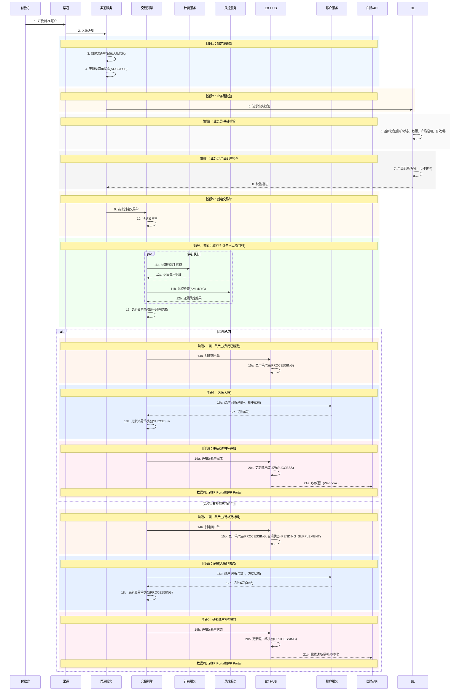
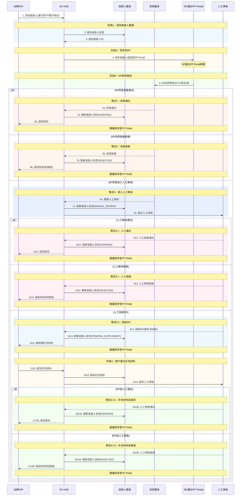
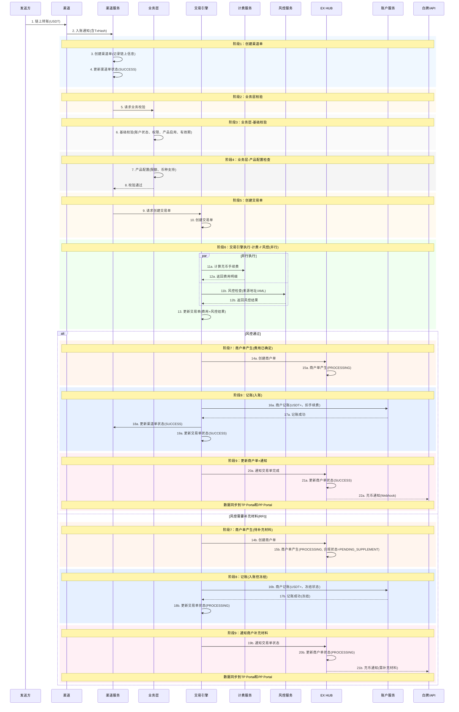
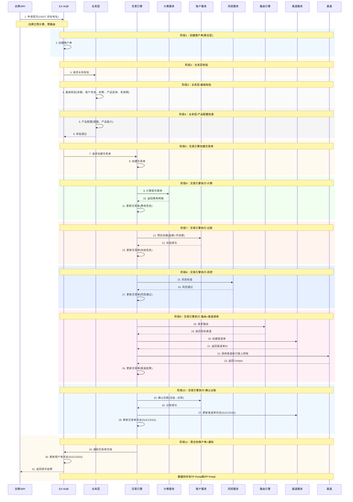
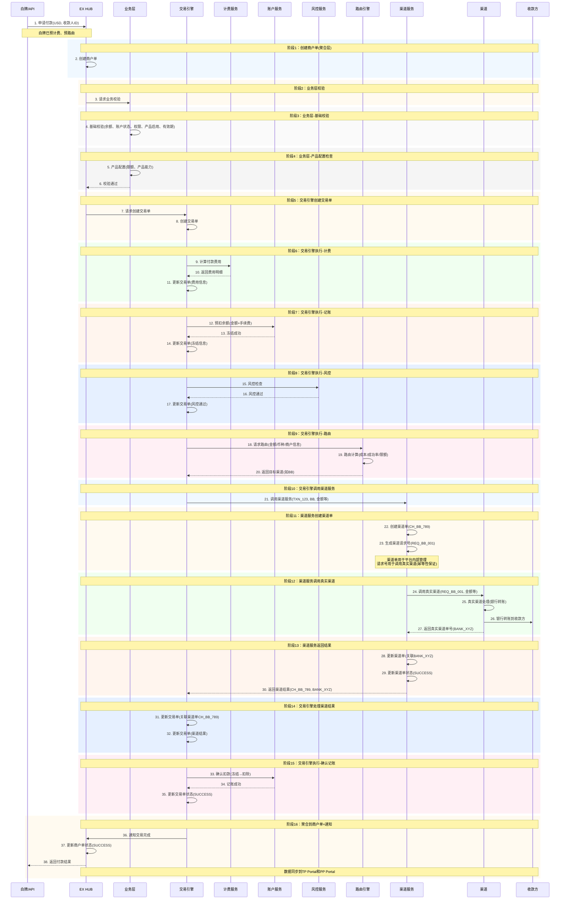
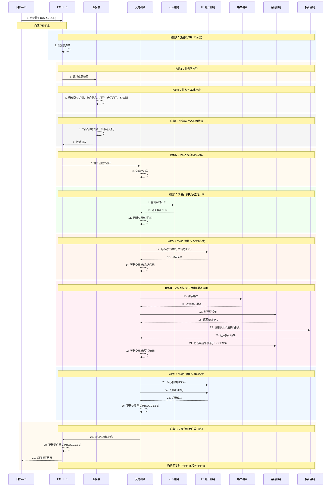

# 交易流程设计 v2

## 文档概述

本文档详细描述了EX平台的完整交易流程，基于**3单模型**（商户单→交易单→渠道单）设计。

**核心设计理念：**

- ✅ **3单模型**：商户单 → 交易单 → 渠道单，清晰的单据层级
- ✅ **业务侧定义**：每种交易类型定义需要调用的步骤，交易引擎按定义编排执行
- ✅ **双向流程**：支持商户主动发起和渠道被动通知两种模式
- ✅ **全链路风控**：收付款,va,收款人均需通过风控检查
- ✅ **白牌预处理**：白牌页面支持预计费、预路由

---

## 目录

1. [3单模型设计](#3单模型设计)
2. [交易类型分类](#交易类型分类)
3. [业务侧定义与交易引擎](#业务侧定义与交易引擎)
4. [各交易类型详细流程](#各交易类型详细流程)
5. On-Ramp / Off-Ramp 承兑流程 → 见独立文档 [on-offramp.md](./on-offramp.md)
   - 模式A：BB自己完成（1.1~1.4）
   - 模式B：IPL-BB打通（2.1~2.4）
6. 退款流程 → 见独立文档 [refund.md](./refund.md)
7. [状态设计](#状态设计)

---

## 3单模型设计

### 1.1 单据层级

```
EX 构建所有单据：
┌─────────────────────────────────────────────────────────────────┐
│  商户单 (Merchant Order)                                        │
│  - 商户可见                                                      │
│  - EX创建，聚合交易单信息                                         │
│  - 1个商户单可能对应多个SP（如IPL-BB打通承兑，2个sp 都可以看到）                      │
│      │                                                          │
│      │ 1:N                                                      │
│      ▼                                                          │
│  交易单 (Transaction Order)                                      │
│  - 一定在同一个SP内                                               │
│  - 计费、预扣余额在交易单上                                        │
│  - 业务侧定义的步骤在交易单上执行                                   │
│      │                                                          │
│      │ 1:N (仅IPL/BB有渠道单)                                    │
│      ▼                                                          │
│  渠道单 (Channel Order)                                          │
│  - 仅IPL和BB有（EX帮他们对接下游渠道）                             │
│  - 其他SP自己对接渠道，无渠道单                                    │
└─────────────────────────────────────────────────────────────────┘
```

### 1.2 SP分类与单据可见性

| SP类型 | 商户单 | 交易单 | 渠道单 | 说明                      |
| ------ | ------ | ------ | ------ | ------------------------- |
| BB     | EX构建 | EX构建 | EX构建 | EX帮BB对接XPAY等下游渠道  |
| IPL    | EX构建 | EX构建 | EX构建 | EX帮IPL对接银行等下游渠道 |
| 其他SP | EX构建 | EX构建 | ❌ 无  | SP自己对接渠道            |

### 1.3 单据关系示意

**单SP场景（如提币）：**

```
商户单 M001
    └── 交易单 T001 (BB)
            └── 渠道单 C001 (BB→链上)
```

**双SP场景（如IPL-BB打通承兑）：**

```
商户单 M001 ← BB和IPL同时看到
    ├── 交易单 T001 (BB): 数币侧
    │       └── 渠道单 C001 (BB)
    └── 交易单 T002 (IPL): 法币侧
            └── 渠道单 C002 (IPL)

✅ 同时创建，并行处理
✅ 都成功 → 商户单成功
✅ BB和IPL之间有清算协议
```

---

## 交易类型分类

### 2.1 按单据流转方向分类

#### **类型A：商户主动发起（商户单 → 交易单 → 渠道单）**

| 交易类型     | 触发方式 | 单据流转                                                   |
| ------------ | -------- | ---------------------------------------------------------- |
| VA申请       | 商户申请 | 商户单 → 交易单 → 计费 → 记账 → 风控 → 路由 → 渠道单 |
| 付款/提现    | 商户发起 | 商户单 → 交易单 → 计费 → 记账 → 风控 → 路由 → 渠道单 |
| 数币钱包付款 | 商户发起 | 商户单 → 交易主单 → 子单1(承兑) + 子单2(出款) → 渠道单  |
| 提币         | 商户发起 | 商户单 → 交易单 → 计费 → 记账 → 风控 → 路由 → 渠道单 |
| 数转法       | 商户发起 | 商户单 → 交易单 → 计费 → 记账 → 风控 → 路由 → 渠道单 |
| 法转数       | 商户发起 | 商户单 → 交易单 → 计费 → 记账 → 风控 → 路由 → 渠道单 |

#### **类型B：渠道被动通知（渠道单 → 交易单 → 商户单）**

| 交易类型 | 触发方式     | 单据流转                                           |
| -------- | ------------ | -------------------------------------------------- |
| 收款     | 渠道入账通知 | 渠道单 → 风控 → 交易单 → 商户单 → 计费 → 记账 |
| 充币     | 链上入账通知 | 渠道单 → 风控 → 交易单 → 商户单 → 计费 → 记账 |

## 业务侧定义与交易引擎

### 3.1 业务侧定义

每种交易类型在业务侧定义需要调用的步骤，交易引擎按定义编排执行。

```json
{
  "transaction_type": "WITHDRAWAL",
  "steps": [
    {"step": "CREATE_MERCHANT_ORDER", "required": true},
    {"step": "CREATE_TRANSACTION_ORDER", "required": true},
    {"step": "PRICING", "required": true},
    {"step": "ACCOUNTING_FREEZE", "required": true},
    {"step": "RISK_CHECK", "required": true},
    {"step": "ROUTING", "required": true},
    {"step": "CREATE_CHANNEL_ORDER", "required": true, "condition": "SP_TYPE in (BB, IPL)"},
    {"step": "CALL_CHANNEL", "required": true},
    {"step": "ACCOUNTING_CONFIRM", "required": true},
    {"step": "NOTIFY", "required": true}
  ]
}
```

### 3.2 交易引擎职责

交易引擎是**编排工具**，不决定走什么步骤，只负责按业务侧定义执行：

```
业务侧定义步骤 → 交易引擎读取 → 按顺序调用各服务 → 返回业务反馈
```

### 3.3 白牌预处理

白牌页面在商户确认前会进行预处理：

- **预计费**：展示预估费用
- **预路由**：展示可用SP和预估到账时间

---

## 各交易类型详细流程

### 4.1 VA申请（商户主动发起）

**单据流转：** 商户单 → 交易单 → 渠道单



**说明：**

- **商户单**：聚合层，汇总交易单结果
- **交易单**：核心执行层，交易引擎驱动执行计费、记账、风控、路由等所有业务逻辑
  - 先记账冻结费用，失败后返回
- **渠道单**：渠道调用层
- 商户通过白牌或API接入EX系统
- 数据通过Portal展示：MP(商户)、TP(租户)、PP(SP)

---

### 4.2 VA收款（渠道被动通知）

**单据流转：** 渠道单 → 交易单 → (计费∥风控) → 商户单 → 记账



**说明：**

- **计费和风控并行执行**：提升性能，两者都只依赖交易单
- **商户单在计费风控完成后产生**：确保费用已确定
- **情况1：风控通过**

  - 风控状态：PASSED
  - 商户单最终状态：SUCCESS
  - 正常入账完成
- **情况2：风控需要补充材料(RFI)**

  - 风控状态：PENDING_SUPPLEMENT
  - 商户单合规状态：PENDING_SUPPLEMENT
  - 资金入账但冻结，待补充材料后解冻
- 数据展示在PP Portal（服务商）、TP Portal（租户）、MP Portal（商户）

---

### 4.3 收款人添加（商户主动发起）

**单据流转：** 收款人数据 → EX风控 → SP风控 → 人工审核（可选）→ RFI流程（可选）



**说明：**

- **阶段1：保存收款人数据** → EX HUB保存
- **阶段2：同步到SP** → 通过PP Portal展示给SP
- **阶段3：SP风控审核** → SP通过PP Portal进行风控审核

**审核结果：**

1. **风控直接通过** → 收款人状态：VERIFIED
2. **风控直接拒绝** → 收款人状态：REJECTED
3. **进入人工审核** → 收款人状态：MANUAL_REVIEW
   - 3.1 **人工通过** → 收款人状态：VERIFIED
   - 3.2 **人工拒绝** → 收款人状态：REJECTED
   - 3.3 **发起RFI** → 收款人状态：PENDING_SUPPLEMENT
     - 商户提交补充材料
     - 人工再次审核
     - 3.3.1 **补充材料后通过** → 收款人状态：VERIFIED
     - 3.3.2 **补充材料后拒绝** → 收款人状态：REJECTED

- 所有状态变更同步到TP Portal供租户查看
- SP通过PP Portal查看和审核收款人信息

---

### 4.4 充币（渠道被动通知）

**单据流转：** 渠道单 → 交易单 → (计费∥风控) → 商户单 → 记账



---

### 4.5 提币（商户主动发起）

**单据流转：** 商户单 → 交易单 → 渠道单



---

### 4.6 法币付款/提现（商户主动发起）

**单据流转：** 商户单 → 交易单 → 渠道单



---

### 4.7 IPL法币换汇

**场景：** 商户在IPL法币账户之间进行换汇（如USD→EUR）

**单据流转：** 商户单 → 交易单 → 渠道单（调用外部换汇渠道）

**特点：**

- 不需要过风控（法币换汇）
- 不需要计费（无手续费）
- 需要查询实时汇率
- 调用外部换汇渠道



**说明：**

- **IPL换汇调用外部渠道**：换汇渠道（如银行、换汇服务商）
- **不需要风控**：法币换汇不涉及风控检查
- **不需要计费**：换汇无手续费
- **需要查询汇率**：实时汇率查询

---
