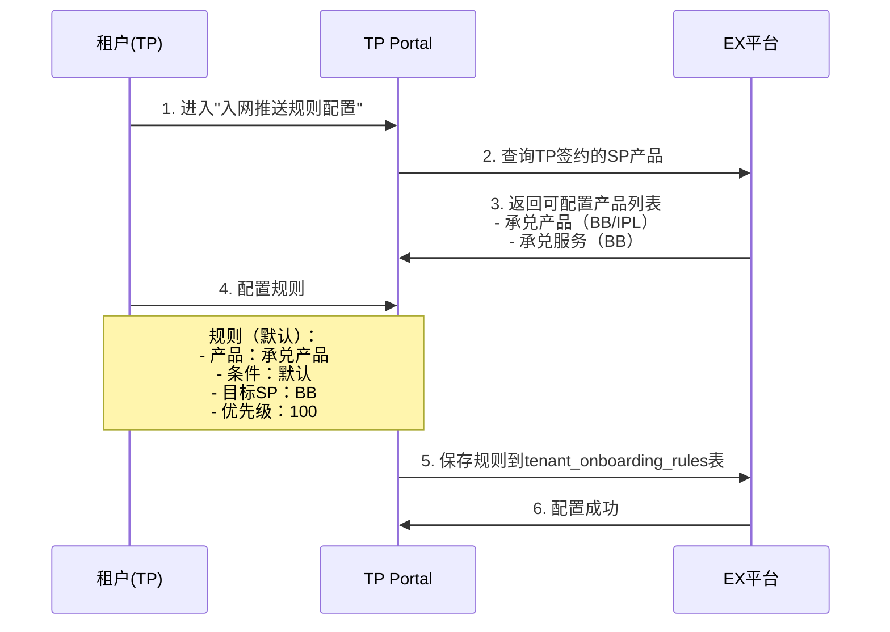
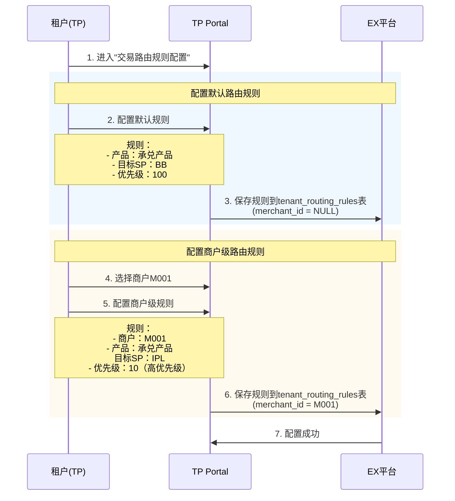
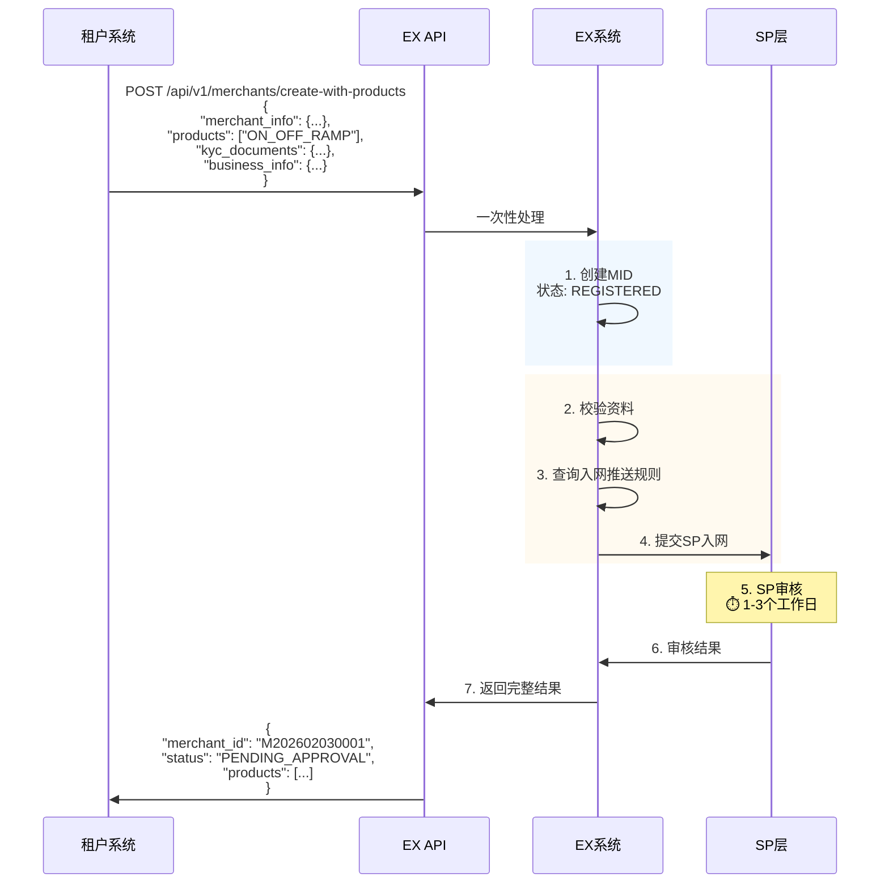
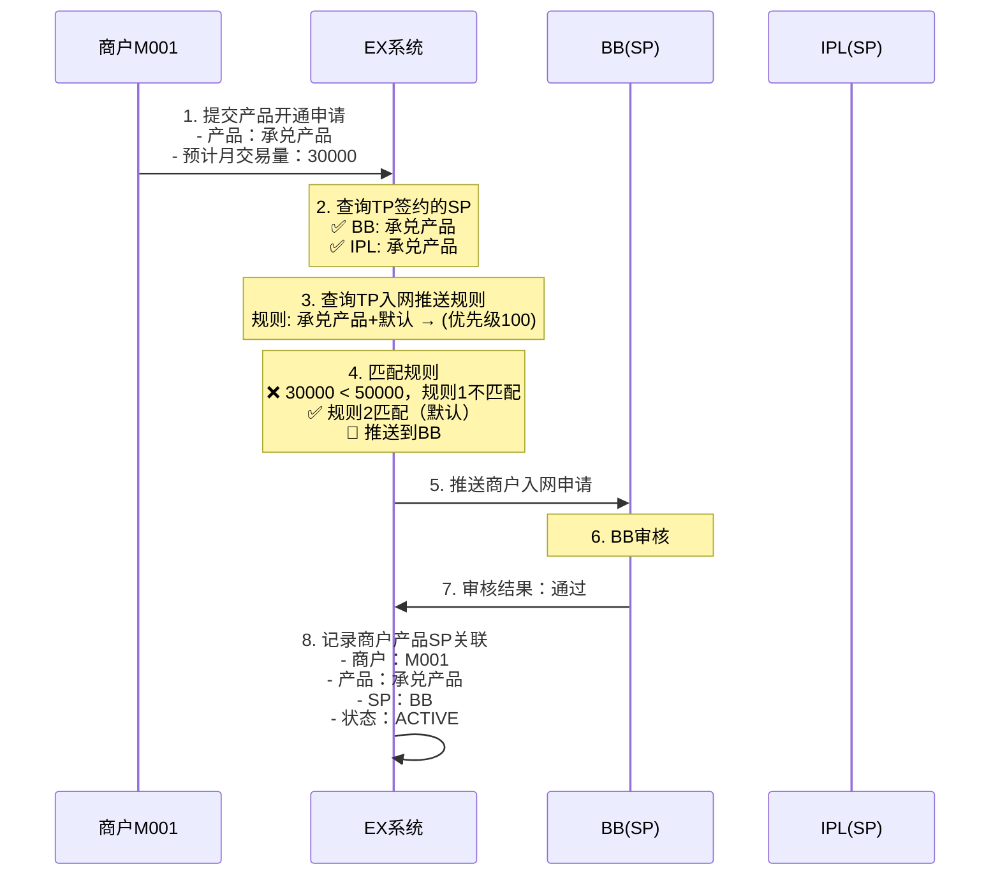
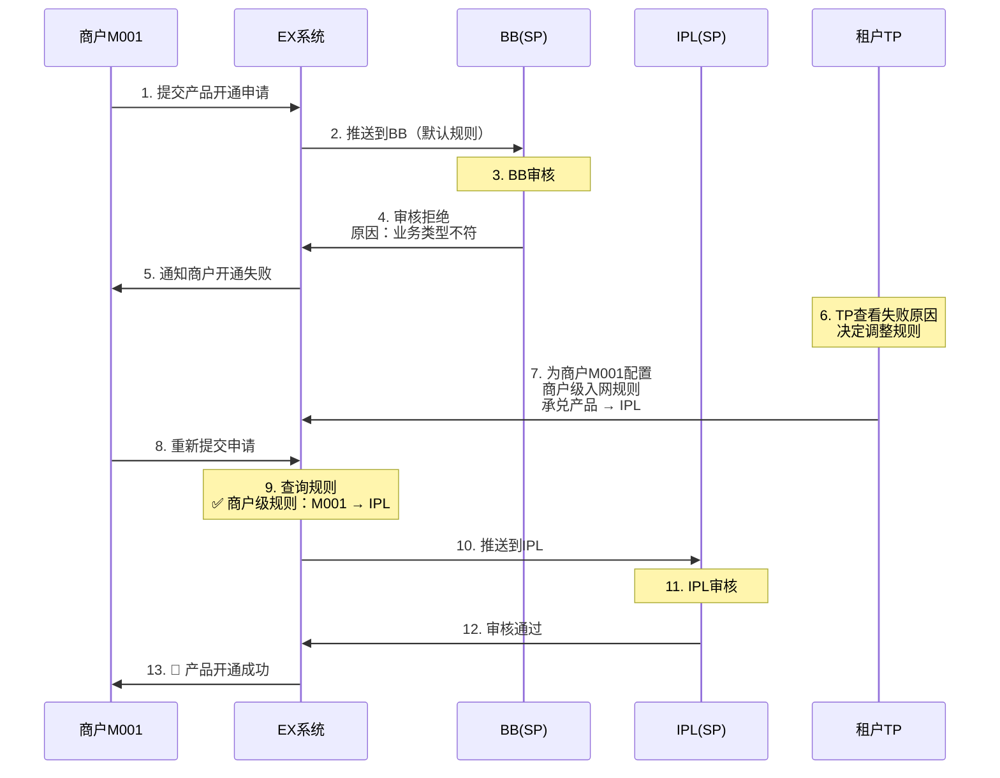
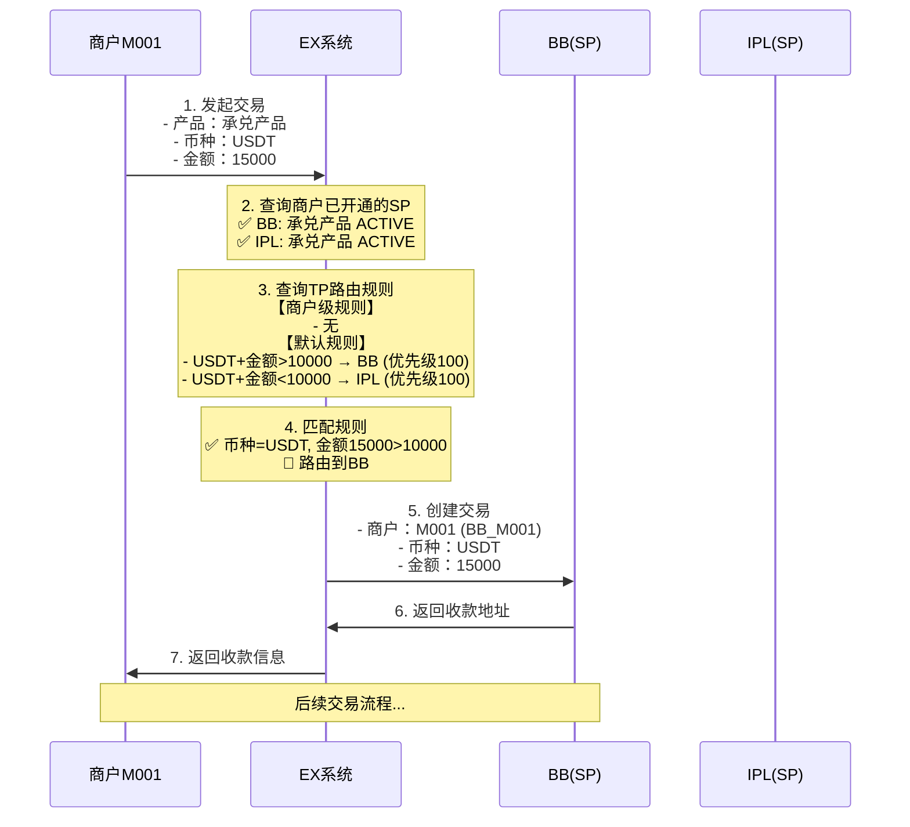
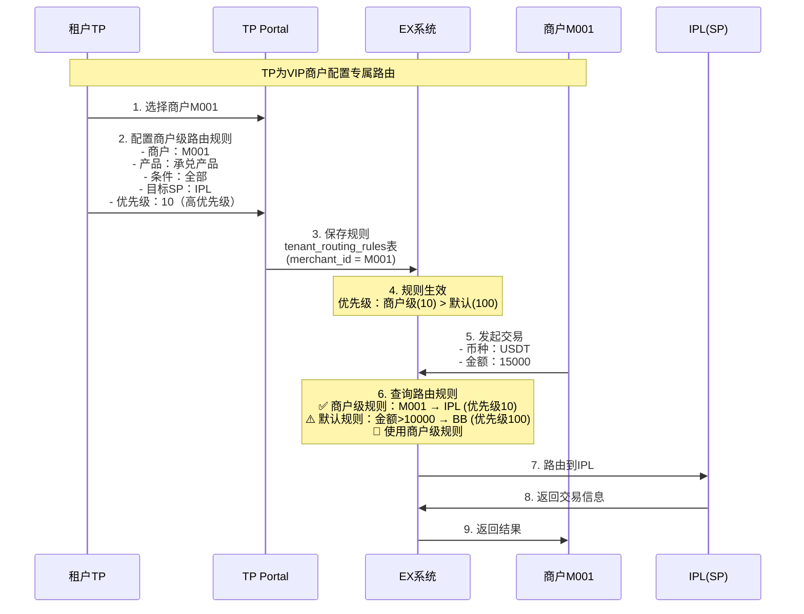
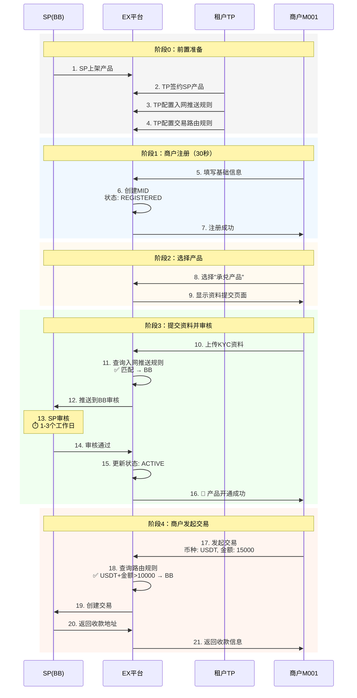

# 商户注册与产品开通流程

本文档聚焦三个核心流程：

1. **商户注册 + 首次开通产品** — 新商户从注册到第一个产品开通
2. **商户再次开通产品** — 已有其他产品的商户，新开"数法承兑"产品
3. **租户为商户开通产品** — TP在后台为商户开通产品

每个流程包含**正常流程**和**异常流程**。

**核心设计原则：**

- 注册即创建MID，无需TP审核
- 产品驱动：围绕“开通产品”组织流程
- EX不做合规审核，审核由SP负责
- 商户不感知SP，只看到产品名称
- 本期产品→SP为1:1映射，无需路由
- **BB默认开通**：开通承兑产品时，BB数币钱包+BB法币账户默认开通，商户可选是否额外使用IPL法币账户
- **审核独立**：BB过了就能用BB，IPL过了就能用IPL，互不依赖

---

## 前置条件

商户注册和产品开通之前，以下条件需已完成：

- **SP已上架产品**：BB上架了承兑产品、数币钱包、BB法币账户；IPL上架了IPL法币账户
- **TP已与SP签约**：租户已与BB/IPL签约，获得产品代理权
- **TP已配置费率**：租户已为商户配置好费率方案

**本期产品→SP映射（1:1，无需路由）：**

- **承兑产品**（On/Off-Ramp）→ BB（USDT/USDC → USD）— 商户选择开通
- 数币钱包（Crypto Wallet）→ BB — **默认开通**（固定）
- BB法币账户（Fiat Account）→ BB — **默认开通**（固定）
- IPL法币账户（Fiat Account）→ IPL — **商户可选**（选了才推送IPL审核）

**开通规则：**

```
商户选择开通“承兑产品”时：

【默认开通（不需选择）】
1. BB数币钱包 — 固定默认开通
2. BB法币账户 — 固定默认开通
→ 推送BB审核，BB审核通过即可使用

【商户可选】
3. 是否额外使用 IPL法币账户？
   - 选择“是” → 额外推送IPL审核，IPL审核通过后可使用IPL法币账户
   - 选择“否” → 不推送IPL，只用BB

【审核独立】
BB审核通过 → BB可用（数币钱包+BB法币账户+承兑）
IPL审核通过 → IPL可用（IPL法币账户）
BB和IPL审核互不依赖，各自独立。
```

---

## 1. 商户注册 + 首次开通产品

> 场景：新商户第一次使用EX平台，从注册到开通第一个产品的完整流程。

### 1.1 正常流程

#### 1.1.2 SP视角：BB内部架构（含底层Channel）

```
┌─────────────────────────────────────────────────────────────────────────────┐
│                      BB 内部架构（SP视角）                                   │
└─────────────────────────────────────────────────────────────────────────────┘

┌─────────────────────────────────────────────────────────────────────────────┐
│                              BB (SP)                                        │
│                           PP Portal                                         │
├─────────────────────────────────────────────────────────────────────────────┤
│                                                                             │
│  ┌─────────────────────────────────────────────────────────────────────┐   │
│  │                         BB 核心能力                                  │   │
│  │  ┌──────────┐  ┌──────────┐  ┌──────────┐  ┌──────────┐            │   │
│  │  │ 数币钱包  │  │ 承兑引擎  │  │ 法币账户  │  │ 代收付账户    │            │   │
│  │  │(USDT/USDC)│  │(数币→法币)│  │          │  │ 代收付    │            │   │
│  │  └──────────┘  └──────────┘  └──────────┘  └──────────┘            │   │
│  └─────────────────────────────────────────────────────────────────────┘   │
│                                    │                                        │
│                                    │ 法币出款能力                            │
│                                    ▼                                        │
│  ┌─────────────────────────────────────────────────────────────────────┐   │
│  │                    BB 底层 Channel（渠道层）                         │   │
│  │                    ⚠️ 仅在BB系统内部可见，EX/TP不可见                  │   │
│  │                                                                     │   │
│  │  ┌─────────────────┐    ┌─────────────────┐    ┌─────────────────┐ │   │
│  │  │  BB代收付账户        │    │  XPAY渠道       │    │  其他渠道       │ │   │
│  │  │  (自有)          │    │  (代理行模式)   │    │  (未来扩展)     │ │   │
│  │  │                 │    │                 │    │                 │ │   │
│  │  │  - 代收代付      │    │  - VA收款       │    │                 │ │   │
│  │  │  - 当前主要方式  │    │  - POBO出款     │    │                 │ │   │
│  │  └─────────────────┘    └─────────────────┘    └─────────────────┘ │   │
│  │                                                                     │   │
│  └─────────────────────────────────────────────────────────────────────┘   │
│                                                                             │
└─────────────────────────────────────────────────────────────────────────────┘

【关键点】
- XPAY是BB的底层Channel，不是独立的SP
- Channel在BB系统内部管理，EX和TP看不到
- BB对外暴露的是统一的承兑能力，底层用哪个Channel是BB内部决策
- 租户只需与BB签约，无需关心BB用什么Channel
```

#### 1.1.3 TP视角：租户看到的能力

```
┌─────────────────────────────────────────────────────────────────────────────┐
│                      租户视角（TP视角）                                      │
└─────────────────────────────────────────────────────────────────────────────┘

                              ┌─────────────┐
                              │   租户(TP)  │
                              │  环球/TC等   │
                              └──────┬──────┘
                                     │
                 ┌───────────────────┼───────────────────┐
                 │                   │                   │
                 ▼                   ▼                   ▼
        ┌────────────────┐  ┌────────────────┐  ┌────────────────┐
        │  BB承兑服务     │  │  IPL法币服务   │  │  BB+IPL联合    │
        │  (单方签约)     │  │  (需双方签约)  │  │  (双方签约)    │
        └───────┬────────┘  └───────┬────────┘  └───────┬────────┘
                │                   │                   │
                ▼                   ▼                   ▼
        ┌────────────────┐  ┌────────────────┐  ┌────────────────┐
        │ 租户看到的能力  │  │ 租户看到的能力  │  │ 租户看到的能力  │
        │                │  │                │  │                │
        │ - 数币钱包      │  │ - 法币账户     │  │ - 数币钱包      │
        │ - 承兑(U→USD)  │  │                │  │ - 承兑(U→USD)  │
        │ - 法币账户(BB)  │  │                │  │ - 法币账户(IPL) │
        └────────────────┘  └────────────────┘  └────────────────┘
                │                   │                   │
                ▼                   ▼                   ▼
        ┌────────────────┐  ┌────────────────┐  ┌────────────────┐
        │ Off-ramp可见   │  │ Off-ramp可见   │  │ Off-ramp可见   │
        │ BB法币账户     │  │ IPL法币账户    │  │ IPL法币账户    │
        └────────────────┘  └────────────────┘  └────────────────┘

【关键点】
- 租户看不到XPAY，只看到BB提供的能力
- BB内部用代收付账户还是XPAY渠道，对租户透明
- 租户关心的是：签约谁、资金在哪里可见
```

#### 1.1.4 平台角色说明

| 角色                 | 英文                  | Portal | 说明                                           |
| -------------------- | --------------------- | ------ | ---------------------------------------------- |
| **平台管理员** | SaaS Admin            | SA     | EX平台总管理后台                               |
| **服务提供商** | Service Provider (SP) | PP     | 提供底层支付能力（承兑、数币钱包、法币账户等） |
| **租户**       | Tenant                | TP     | 使用SP能力，为商户提供支付服务                 |
| **商户**       | Merchant              | MP     | 最终使用支付服务的企业，必须归属于某个租户     |
| **渠道**       | Channel               | -      | SP内部概念，不在EX/TP层面暴露                  |

### 1.2 服务提供商(SP)与合作模式

#### 1.2.1 EX平台中的SP

| SP            | 类型       | 核心能力                                               | 与EX关系         |
| ------------- | ---------- | ------------------------------------------------------ | ---------------- |
| **BB**  | 承兑服务商 | 数币钱包、承兑(数币→法币)、代收付账户代收付、法币账户 | 直接集成         |
| **IPL** | 法币服务商 | VA收款、POBO出款、法币账户                             | 集团内部隐藏合作 |

> **注意**：XPAY不是SP，是BB的底层Channel，不在EX生态中体现。

#### 1.2.2 BB内部的Channel

| Channel                | 类型     | 能力             | 说明                       |
| ---------------------- | -------- | ---------------- | -------------------------- |
| **BB代收付账户** | 自有渠道 | 代收代付         | 当前主要方式               |
| **XPAY**         | 外部渠道 | VA收款、POBO出款 | 代理行模式，BB的渠道合作方 |

#### 1.2.3 IPL模式 vs BB模式（从TP视角）

```
┌─────────────────────────────────────────────────────────────────────────────┐
│                   IPL模式 vs BB模式（TP视角对比）                            │
└─────────────────────────────────────────────────────────────────────────────┘

【IPL模式】                              【BB模式】
  租户需签约2家SP                          租户只需签约1家SP
  
  ┌─────────┐  ┌─────────┐                 ┌─────────────────────┐
  │   BB    │  │   IPL   │                 │         BB          │
  │  (SP)   │  │  (SP)   │                 │        (SP)         │
  └────┬────┘  └────┬────┘                 │  ┌───────────────┐  │
       │            │                      │  │ 底层Channel:   │  │
       │  双方入网   │                      │  │ - BB代收付账户     │  │
       │  (客户无感知)│                      │  │ - XPAY渠道    │  │
       ▼            ▼                      │  └───────────────┘  │
  ┌─────────────────────┐                 └──────────┬──────────┘
  │       租户(TP)       │                           │
  └─────────────────────┘                           │ 单方入网
                                                    ▼
  Off-ramp后资金可见：                        ┌─────────────┐
  ┌─────────────────────┐                    │   租户(TP)  │
  │   IPL 法币账户       │                    └─────────────┘
  └─────────────────────┘  
                                             Off-ramp后资金可见：
                                             ┌─────────────┐
                                             │ BB 法币账户  │
                                             └─────────────┘
```

| 对比项                     | IPL模式                   | BB模式（含XPAY渠道）         |
| -------------------------- | ------------------------- | ---------------------------- |
| **签约SP**           | BB + IPL（2家）           | BB（1家）                    |
| **入网方式**         | 双方入网（客户无感知）    | 单方入网                     |
| **对外关系**         | IPL不作为BB渠道，非代理行 | XPAY是BB内部渠道，对外不可见 |
| **Off-ramp资金可见** | IPL法币账户               | BB法币账户                   |
| **适用客户**         | 有贸易背景的合规客户      | 通用客户                     |
| **XPAY对租户可见性** | 不涉及                    | 不可见（BB内部决策）         |

#### 1.2.4 BB定位（SP视角）

- **承兑服务商**：具备数币钱包和法币账户能力
- **当前能力**：可用自有代收付账户代收/代付客户资金
- **扩展能力**：通过XPAY渠道（BB内部Channel），代理行模式，具备VA和POBO能力
- **对外暴露**：统一的承兑服务能力，底层Channel对租户透明

#### 1.2.5 IPL定位（SP视角）

- **纯法币服务商(SP)**：仅提供法币VA收款和POBO出款能力
- **合作模式**：与BB为集团内部"隐藏"合作，对外不作为BB渠道，非代理行模式
- **客户入网**：客户需双方入网（客户无感知）
- **核心价值**：为BB中有贸易背景的客户提供法币能力

#### 1.2.6 XPAY定位（BB内部Channel）

- **BB的底层渠道**：不是独立SP，是BB的Channel
- **合作模式**：BB与XPAY是渠道合作，代理行模式
- **对外可见性**：EX和TP都看不到XPAY，只在BB系统内部管理
- **核心价值**：为BB提供独立的法币VA和POBO能力，补充BB代收付账户的能力

### 1.3 客户画像

1. **WEB2外贸/服贸客户**

   - 在数币友好国家开展业务
   - 买家需用数币付款
   - 原因：汇率不稳定（稳定币合法）或外汇管制严格
2. **WEB3行业客户**

   - 需要WEB2行业的off-ramp渠道能力
   - 收到数币后需回到现实世界消费/支付
   - 面临银行对WEB3背景资金不友好的问题

### 1.3 客户痛点

1. WEB2客户想收WEB3货币，需要有人提供WEB3收款能力（地址、承兑等）
2. WEB2/WEB3客户收到数币后，给供应商/服务商付款仍需法币能力，付款行需是WEB2银行

## 本期上线能力范围（Phase 1）

> 本章节明确本期（Phase 1）实际上线的能力边界，与后续文档描述的完整设计做区分。

### P1-1. 产品与SP的对应关系

**本期产品-SP映射为1:1，不存在多SP共享同一产品的场景：**

| SP            | 产品                        | 说明                                | 商户选择    |
| ------------- | --------------------------- | ----------------------------------- | ----------- |
| **BB**  | 承兑产品（On/Off-Ramp）     | U→USD，商户选择开通                | ✅ 商户选择 |
| **BB**  | 数币钱包（Crypto Wallet）   | 开通承兑时默认开通，推送BB审核      | 🔄 默认     |
| **BB**  | BB法币账户（Fiat Account）  | 开通承兑时默认开通，推送BB审核      | 🔄 默认     |
| **IPL** | IPL法币账户（Fiat Account） | 商户可选是否使用，选了才推送IPL审核 | ☐ 商户可选 |

**本期简化点：**

- ❌ **不需要入网推送规则配置**：商户选择开通某个产品时，该产品只对应唯一一个SP，系统直接推送到该SP审核，无需TP配置"推送到哪个SP"的规则
- ❌ **不需要交易路由（默认路由）功能**：每个产品只有一个SP提供能力，交易直接走该SP，无需路由选择
- ❌ **不存在"2个SP提供同1个产品"的场景**：BB不做收款，IPL不做承兑，产品能力不重叠

> 💡 后续如果出现多SP提供同一产品的场景，再启用入网推送规则和交易路由功能。本期文档中关于多SP场景处理、入网推送规则、交易路由规则的设计为**预留设计**，本期不实现。

### P1-2. BB的法币通道能力

**BB自身对接了具备VA和POBO能力的外部通道，而非仅依赖IPL赋能法币能力：**

```
BB 的通道架构（本期）：
┌─────────────────────────────────────────┐
│  BB（承兑SP）                             │
│                                          │
│  核心能力：数币⇄法币承兑 + 数币钱包         │
│                                          │
│  法币通道来源：                            │
│  ├── 通道A：VA收款能力（非IPL）            │
│  ├── 通道B：POBO付款能力（非IPL）          │
│  └── 通道C：其他法币通道...               │
│                                          │
│  ⚠️ 不是只有 IPL→BB 这一条法币通道        │
│  BB 独立对接多条法币通道，具备完整的        │
│  法币收付能力来支撑承兑业务                 │
└─────────────────────────────────────────┘
```

**关键澄清：**

- ✅ BB已对接多条外部法币通道（VA收款、POBO付款等），**独立具备法币收付能力**
- ✅ BB的承兑流程中，法币侧的收付由BB自己的通道完成，不依赖IPL
- ❌ 本期不考虑"IPL作为BB的法币通道"这种SP间互为通道的场景
- 📌 IPL和BB在EX平台上是**平行的两个SP**，各自独立提供不同产品能力

### P1-3. 本期能力总结

```
本期上线范围：
✅ SP产品上架（BB承兑 + 数币钱包 / IPL收款 + 法币账户）
✅ TP与SP签约
✅ 商户注册（白牌Portal + API）
✅ 商户选择产品 → 直接推送到唯一SP审核
✅ SP审核 → 产品开通
✅ 商户交易 → 直接走产品对应的唯一SP

本期不实现（预留设计）：
❌ 入网推送规则配置（1个产品只有1个SP，无需选择）
❌ 交易路由规则配置（1个产品只有1个SP，无需路由）
❌ 多SP提供同一产品的场景
❌ 商户级路由调整
❌ SP间互为通道（如IPL为BB提供法币通道）
```

---

## 目录

0. [⚠️ 本期上线能力范围（Phase 1）](#️-本期上线能力范围phase-1)
   - P1-1. [产品与SP的对应关系](#p1-1-产品与sp的对应关系)
   - P1-2. [BB的法币通道能力](#p1-2-bb的法币通道能力)
   - P1-3. [本期能力总结](#p1-3-本期能力总结)
1. [前置条件](#前置条件)（本期仅需 1.1 + 1.2）
   - 1.1 [SP产品上架](#11-sp产品上架)
   - 1.2 [TP与SP签约](#12-tp与sp签约)
   - 1.2.1 [租户签约详细流程](#121-租户签约详细流程)
   - 1.3 [TP配置入网推送规则](#13-tp配置入网推送规则) ⛔ 预留
   - 1.4 [TP配置交易路由规则](#14-tp配置交易路由规则) ⛔ 预留
2. [商户入网流程](#商户入网流程)
   - 2.1 [白牌模式（MP Portal）](#21-白牌模式mp-portal)
   - 2.2 [API模式](#22-api模式)
3. [多SP场景处理](#多sp场景处理) ⛔ 预留
   - 3.1 [入网推送逻辑](#31-入网推送逻辑) ⛔ 预留
   - 3.2 [SP审核结果处理](#32-sp审核结果处理) ⛔ 预留
4. [交易路由逻辑](#交易路由逻辑) ⛔ 预留
   - 4.1 [路由规则匹配](#41-路由规则匹配) ⛔ 预留
   - 4.2 [商户级路由调整](#42-商户级路由调整) ⛔ 预留
5. [完整时序图](#完整时序图)
6. [附录](#附录)

---

## 前置条件

在商户入网之前，需要完成以下前置配置：

### 1.1 SP产品上架

**说明：** SP需要先在EX平台上架产品，定义产品能力和规则。


**数据示例：**

```json
{
  "sp_id": 1001,
  "sp_name": "BB",
  "product_name": "承兑产品",
  "product_code": "ON_OFF_RAMP",
  "supported_currencies": ["USDT", "USDC"],
  "supported_countries": ["US", "UK", "SG"],
  "amount_min": 100,
  "amount_max": 100000,
  "fee_rate": 0.005,
  "status": "ACTIVE"
}
```

---

### 1.2 TP与SP签约

**说明：** 租户（TP）需要与SP签约，获得为商户开通该产品的权限。


**数据示例：**

```json
{
  "tenant_id": 2001,
  "tenant_name": "TP001",
  "sp_id": 1001,
  "sp_name": "BB",
  "sp_product_id": 3001,
  "product_code": "ON_OFF_RAMP",
  "contract_status": "ACTIVE",
  "signed_at": "2026-02-01T10:00:00Z"
}
```

---

### 1.2.1 租户签约详细流程

**说明：** TP与SP签约时，不仅选择产品，还需要配置每个产品下的具体能力来源（哪个SP提供哪部分能力）。

**核心概念：**

- **产品签约**：TP选择要开通的产品（如承兑、数币钱包、收款、法币账户）
- **能力配置**：每个产品下，配置具体能力由哪个SP提供
- **法币账户选择**：承兑产品涉及法币侧入账，TP需选择法币账户由 IPL / BB / 都选择

**签约配置示例：**

```
租户签约配置：
┌─────────────────────────────────────────────────────────────────┐
│  产品1：承兑产品（On/Off-Ramp）                                   │
│  ├── 承兑能力提供方：BB（固定，BB专做承兑）                         │
│  └── 承兑后法币账户：                                             │
│      ☐ IPL法币账户（承兑后USD入到IPL账户）                         │
│      ☐ BB法币账户（承兑后USD入到BB账户）                           │
│      ☐ 都选择（商户可自行选择入到哪个法币账户）                     │
│                                                                  │
│  产品2：数币钱包（Crypto Wallet）                                  │
│  ├── 钱包能力提供方：BB（固定）                                    │
│  └── 无需选择法币账户                                             │
│                                                                  │
│  产品3：IPL法币账户                                                │
│  ├── 充值方式：VA同名充值（贸易背景）                               │
│  └── 提现能力：法币提现到银行账户                                   │
│                                                                  │
│  产品4：BB法币账户                                                  │
│  ├── 充值方式：BB代收付账户同名充值                                     │
│  └── 提现能力：法币提现到银行账户                                   │
│                                                                  │
└─────────────────────────────────────────────────────────────────┘
```

**签约流程：**


**承兑产品 - 法币账户选择的三种模式：**

| 模式               | 法币账户    | 承兑后资金去向           | 商户体验                 | 适用场景                    |
| ------------------ | ----------- | ------------------------ | ------------------------ | --------------------------- |
| **仅IPL**    | IPL法币账户 | 承兑后USD入到IPL账户     | 商户无需选择，自动入IPL  | TP只签约了IPL法币账户       |
| **仅BB**     | BB法币账户  | 承兑后USD入到BB账户      | 商户无需选择，自动入BB   | TP只签约了BB法币账户        |
| **IPL + BB** | 两者都有    | 商户自行选择入到哪个账户 | 商户在承兑时选择目标账户 | TP同时签约了IPL和BB法币账户 |

**法币账户选择对交易流程的影响：**

```
承兑产品签约配置 → 决定交易流程：
┌──────────────────────────────────────────────────────────┐
│  法币账户 = 仅BB                                          │
│  → 走 5.1 纯BB承兑流程（BB内部账户划转）                    │
│                                                          │
│  法币账户 = 仅IPL                                         │
│  → 走 5.2.1 BB数币→IPL法币承兑（IPL侧同名收款）           │
│                                                          │
│  法币账户 = IPL + BB                                      │
│  → 商户选择目标账户：                                      │
│    - 选BB → 走 5.1 纯BB承兑                               │
│    - 选IPL → 走 5.2.1 BB数币→IPL法币承兑                  │
└──────────────────────────────────────────────────────────┘
```

**数据示例：**

```json
{
  "tenant_id": 2001,
  "product_contracts": [
    {
      "product_code": "ON_OFF_RAMP",
      "product_name": "承兑产品",
      "exchange_sp": "BB",
      "fiat_account_options": ["IPL", "BB"],
      "fiat_account_mode": "BOTH",
      "contract_status": "ACTIVE",
      "signed_at": "2026-02-11T10:00:00Z"
    }
  ],
  "sp_contracts": [
    {
      "sp_id": 1001,
      "sp_name": "BB",
      "products": ["ON_OFF_RAMP", "CRYPTO_WALLET"],
      "contract_status": "ACTIVE"
    },
    {
      "sp_id": 1002,
      "sp_name": "IPL",
      "products": ["FIAT_ACCOUNT"],
      "contract_status": "ACTIVE"
    }
  ]
}
```

---

### 1.3 TP配置入网推送规则

**说明：** TP需要配置商户开通产品时，资料推送到哪个SP进行审核。

**配置原则：**

- 必须配置默认规则（兜底）
- 可配置条件规则（金额、国家等）
- 如果未配置，商户开通时会被拒绝



**规则匹配逻辑：**

1. 按优先级从小到大排序（数字越小优先级越高）
2. 依次匹配条件
3. 第一个匹配成功的规则生效
4. 如果都不匹配，使用DEFAULT规则

---

### 1.4 TP配置交易路由规则

**说明：** TP需要配置商户交易时，路由到哪个SP执行。

**配置原则：**

- 支持默认规则（租户级）
- 支持商户级规则（针对特定商户）
- 商户级规则优先级高于默认规则



**路由规则优先级：**

1. 商户级规则（merchant_id不为NULL）
2. 条件匹配规则（币种、金额、国家等）
3. 默认规则
4. 如果都不匹配，使用第一个可用SP

---

## 商户入网流程

### 2.1 白牌模式（MP Portal）

**说明：** 商户通过EX提供的白牌Portal完成入网和产品开通。


---

### 2.2 API模式

**说明：** 租户通过API为商户完成入网和产品开通。

#### 方式1：分步调用（推荐）


#### 方式2：一次性调用（便捷）



---

## 多SP场景处理

### 3.1 入网推送逻辑

**场景：** 租户签约了BB和IPL两个SP，都支持"承兑产品"产品。



**关键点：**

- 只推送到匹配规则的SP，不会同时推送到多个SP
- 如果TP未配置规则，拒绝开通
- 如果规则匹配失败，使用DEFAULT规则

---

### 3.2 SP审核结果处理

#### 场景1：单个SP审核通过

```
商户M001 → 推送到BB → BB审核通过 → 商户在BB开通成功
```

**商户侧显示：**

- 产品状态：✅ 承兑产品已开通
- 可用SP：BB

#### 场景2：SP审核拒绝，TP调整规则



#### 场景3：商户在多个SP都开通

**前提：** 商户先后在BB和IPL都开通了"承兑产品"产品。

```
商户M001:
  - 承兑产品 @ BB: ACTIVE
  - 承兑产品 @ IPL: ACTIVE
```

**交易时的处理：** 根据交易路由规则选择SP（见下一章节）

---

## 交易路由逻辑

### 4.1 路由规则匹配

**场景：** 商户M001在BB和IPL都开通了"承兑产品"，发起一笔交易。



**路由规则优先级：**

1. **商户级规则**（merchant_id不为NULL）- 优先级最高
2. **条件匹配规则**（币种、金额、国家等）- 按priority排序
3. **默认规则**（无条件）- 兜底
4. **第一个可用SP** - 如果都不匹配

---

### 4.2 商户级路由调整

**场景：** VIP商户M001要求所有交易走IPL。



**商户级路由的典型场景：**

- VIP商户专属通道
- 大客户费率优惠
- 高风险商户特殊处理
- 测试商户路由到沙箱环境

---

## 完整时序图

### 端到端流程：从TP签约到商户交易



---

## 附录

### A. 规则匹配算法

**入网推送规则匹配：**

```python
def match_onboarding_rule(tenant_id, product_code, merchant_data):
    # 1. 查询所有规则，按优先级排序
    rules = query_rules(tenant_id, product_code).order_by('priority ASC')
  
    # 2. 依次匹配
    for rule in rules:
        if rule.condition_type == 'DEFAULT':
            return rule.target_sp_id
        elif rule.condition_type == 'AMOUNT':
            if merchant_data.monthly_volume >= rule.condition_value['amount_min']:
                return rule.target_sp_id
        elif rule.condition_type == 'COUNTRY':
            if merchant_data.country in rule.condition_value['countries']:
                return rule.target_sp_id
  
    # 3. 无匹配规则，拒绝开通
    raise Exception("No matching onboarding rule found")
```

**交易路由规则匹配：**

```python
def match_routing_rule(tenant_id, merchant_id, transaction):
    # 1. 查询商户级规则（优先级最高）
    merchant_rules = query_routing_rules(tenant_id, merchant_id).order_by('priority ASC')
    for rule in merchant_rules:
        if match_conditions(rule, transaction):
            return rule.target_sp_id
  
    # 2. 查询默认规则
    default_rules = query_routing_rules(tenant_id, None).order_by('priority ASC')
    for rule in default_rules:
        if match_conditions(rule, transaction):
            return rule.target_sp_id
  
    # 3. 使用第一个可用SP
    available_sps = query_merchant_active_sps(merchant_id, transaction.product_code)
    if available_sps:
        return available_sps[0].sp_id
  
    raise Exception("No available SP found")

def match_conditions(rule, transaction):
    if rule.currency and rule.currency != transaction.currency:
        return False
    if rule.amount_min and transaction.amount < rule.amount_min:
        return False
    if rule.amount_max and transaction.amount > rule.amount_max:
        return False
    if rule.country and rule.country != transaction.country:
        return False
    return True
```

---

### B. 状态机

**商户产品状态机：**

```
REGISTERED → PENDING → ACTIVE
                    ↓
                 REJECTED
```

- **REGISTERED**: 商户已注册，未提交产品申请
- **PENDING**: 已提交产品申请，等待SP审核
- **ACTIVE**: SP审核通过，产品已开通
- **REJECTED**: SP审核拒绝

---

### C. API接口列表

#### 1. 创建商户

```http
POST /api/v1/merchants
Content-Type: application/json

{
  "company_name": "ABC公司",
  "contact_name": "张三",
  "email": "zhang@abc.com",
  "phone": "+86 138xxxx"
}

Response:
{
  "merchant_id": "M202602030001",
  "status": "REGISTERED",
  "created_at": "2026-02-03T10:00:00Z"
}
```

#### 2. 为商户开通产品

```http
POST /api/v1/merchants/{merchant_id}/products
Content-Type: application/json

{
  "products": ["ON_OFF_RAMP"],
  "kyc_documents": {
    "business_license": "https://...",
    "id_card": "https://..."
  },
  "business_info": {
    "business_type": "电商",
    "monthly_volume": 30000,
    "main_countries": ["US", "UK"]
  }
}

Response:
{
  "status": "PENDING_APPROVAL",
  "products": [{
    "product_code": "ON_OFF_RAMP",
    "sp_name": "BB",
    "sp_id": 1001,
    "status": "PENDING",
    "submitted_at": "2026-02-03T10:05:00Z"
  }]
}
```

#### 3. 查询商户产品状态

```http
GET /api/v1/merchants/{merchant_id}/products

Response:
{
  "merchant_id": "M202602030001",
  "products": [{
    "product_code": "ON_OFF_RAMP",
    "product_name": "承兑产品",
    "sp_id": 1001,
    "sp_name": "BB",
    "sp_merchant_id": "BB_M001",
    "status": "ACTIVE",
    "approved_at": "2026-02-03T12:00:00Z"
  }]
}
```

---

## 总结

本文档详细描述了EX平台的商户入网和产品开通流程，核心特点：

✅ **产品驱动**：围绕产品开通组织流程，而非单纯入网
✅ **白牌友好**：注册即创建MID，无需TP审核，体验流畅
✅ **多SP支持**：灵活配置入网推送和交易路由规则
✅ **规则可配**：支持默认规则和商户级规则，满足不同场景
✅ **职责清晰**：EX是科技平台，合规审核由SP负责

**关键流程：**

1. **前置准备**：SP上架产品 → TP签约 → TP配置规则
2. **商户入网**：注册 → 选择产品 → 提交资料 → SP审核 → 开通成功
3. **交易路由**：发起交易 → 匹配路由规则 → 路由到SP → 执行交易

---

*最后更新：2026-02-11*
*文档版本：v1.2 — 新增租户签约详细流程（产品选择+法币账户配置）*
