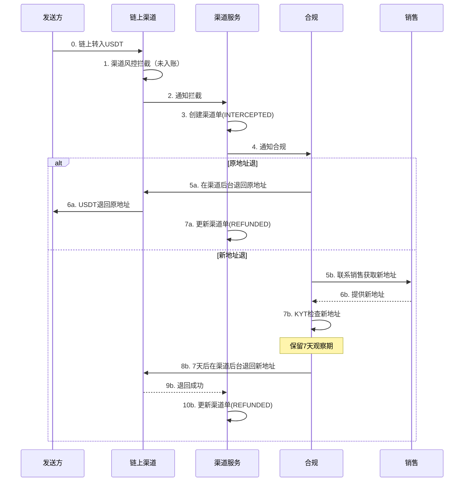
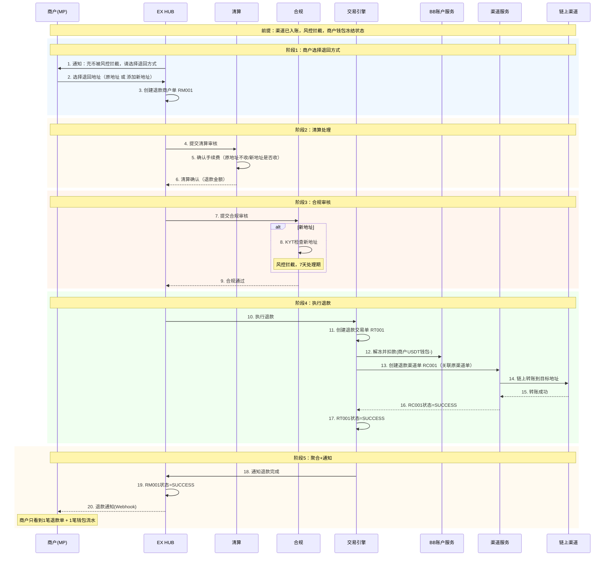
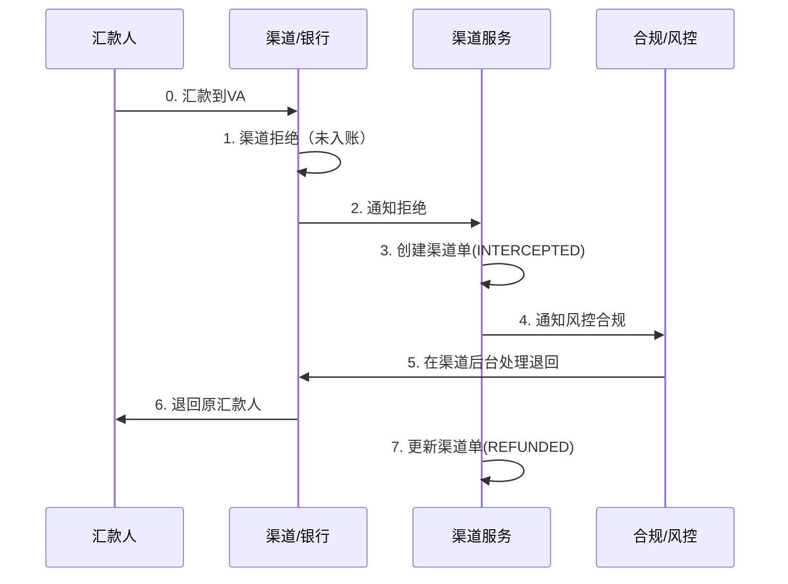
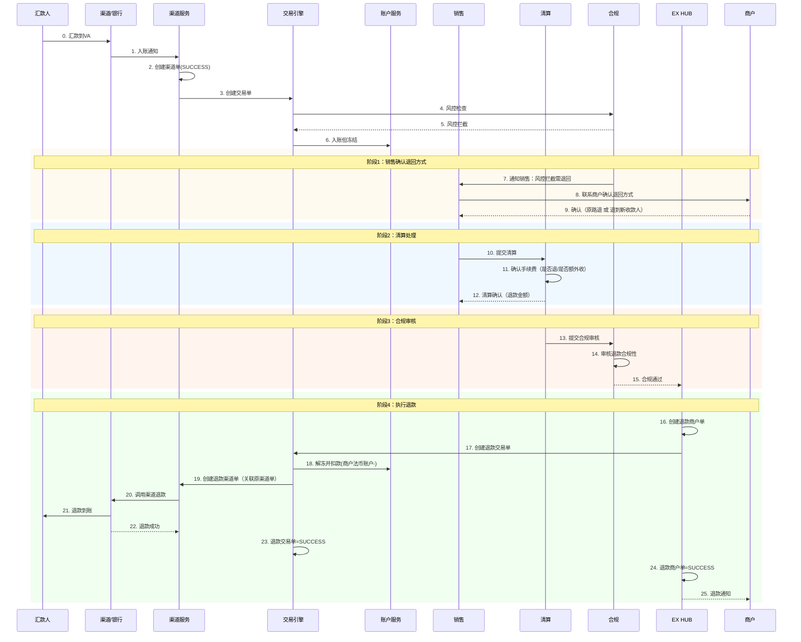
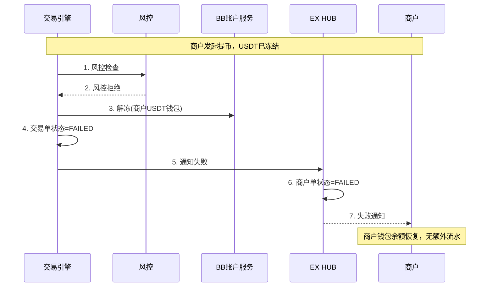
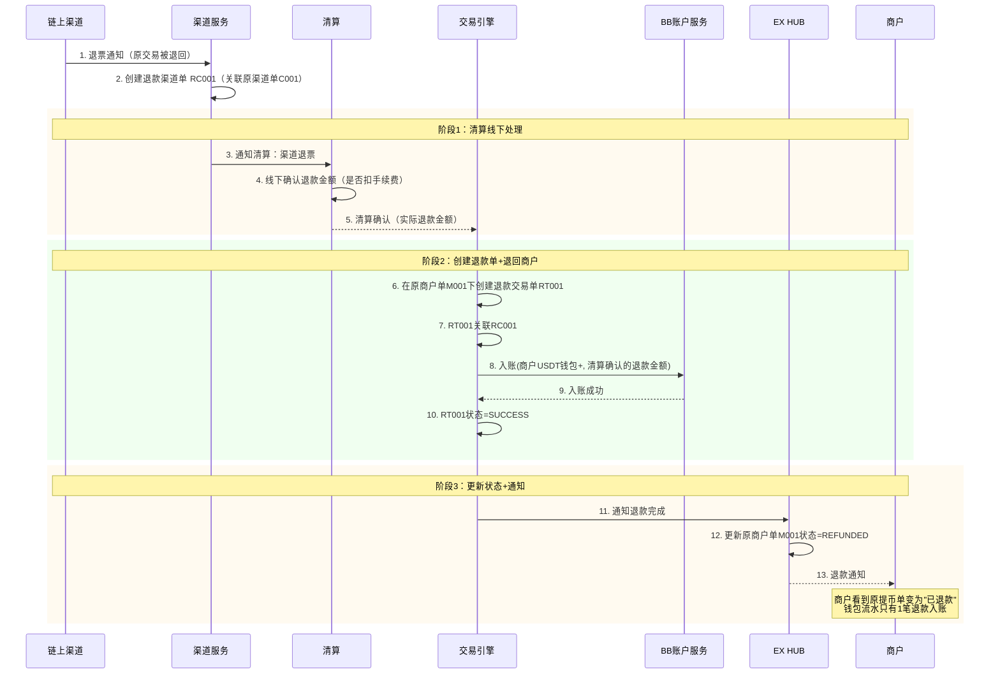
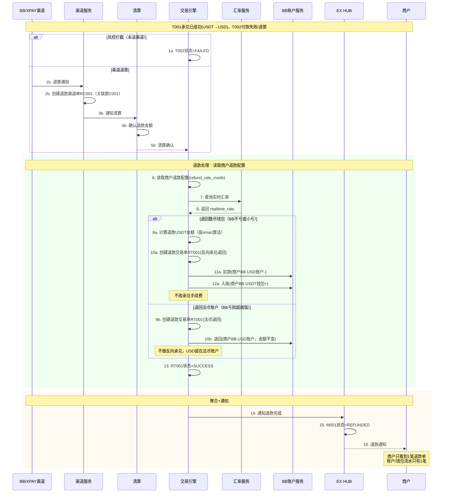
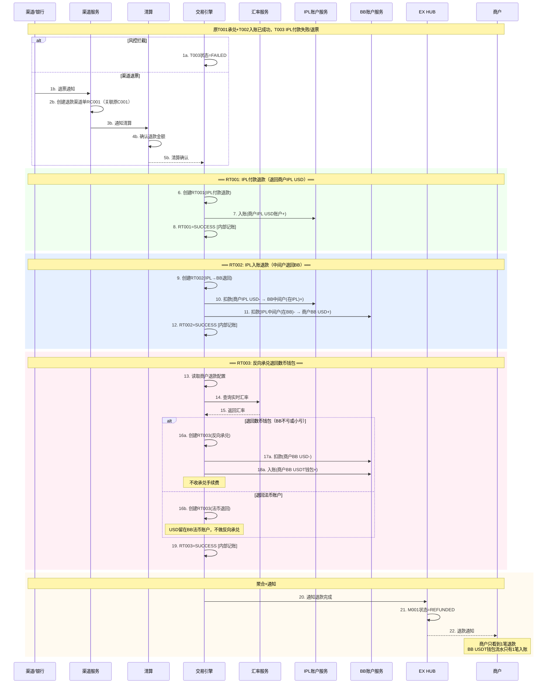

# 退款流程 v3.0

## 文档概述

本文档描述EX平台所有退款场景的详细流程。

**核心设计原则：**

- **商户端一致性**：商户只看到1笔退款商户单 + 1笔账户/钱包流水，内部多笔交易单是内部记账，商户不可见
- **退票 = 新渠道单**：渠道退票时生成一笔新的退款渠道单，关联原渠道单（原渠道单状态已结束）
- **清算先行**：涉及手续费退还的退款，先由清算处理完再执行退款
- **退款不再收承兑手续费**：承兑后付款失败退回数币钱包时，不再收承兑手续费；但默认付款手续费不退

**商户退款配置（承兑相关）：**

商户需配置退款时的汇率规则，决定承兑后付款失败时退回数币还是法币：

```
退款汇率规则算法（Off-Ramp退款：原交易 USDT→USD，付款失败需退回）：

输入：
  original_rate = 原交易时 1 USDT 的 USD 价格
  realtime_rate = 退款时 1 USDT 的 USD 价格
  refund_usd    = 需退回的 USD 金额
  threshold     = 商户配置的容忍阈值（默认1%）

判断逻辑：
  diff = (realtime_rate - original_rate) / original_rate

  情况1: realtime_rate ≤ original_rate（USDT贬值，同样USD能买回更多USDT，BB不亏）
    → 按实时汇率退回数币钱包：退回 refund_usd / realtime_rate 个 USDT
  
  情况2: diff ≤ threshold（USDT小幅升值，BB小亏≤阈值，可接受）
    → 按原汇率退回数币钱包：退回 refund_usd / original_rate 个 USDT
  
  情况3: diff > threshold（USDT大幅升值，BB亏损超阈值）
    → 退回到法币账户（不做反向承兑，避免BB大亏）

总结：只要BB不亏或小亏，就退回数币钱包；BB亏太多就退法币账户。
```

---

## 目录

1. [充币退款](#1-充币退款)
   - 1.1 [渠道拦截未入账](#11-渠道拦截未入账)
   - 1.2 [渠道已入账，风控拦截未给商户入账](#12-渠道已入账风控拦截未给商户入账)
2. [VA收款退款](#2-va收款退款)
   - 2.1 [渠道直接拒绝](#21-渠道直接拒绝)
   - 2.2 [渠道已通知，内部风控拦截](#22-渠道已通知内部风控拦截)
3. [提币失败退款](#3-提币失败退款)
   - 3.1 [内部风控拦截](#31-内部风控拦截)
   - 3.2 [渠道退票](#32-渠道退票)
4. [付款失败退款](#4-付款失败退款)
   - 4.1 [内部风控拦截](#41-内部风控拦截)
   - 4.2 [渠道退票](#42-渠道退票)
5. [承兑后付款失败退款](#5-承兑后付款失败退款)
   - 5.1 [BB数币钱包直接Off-Ramp（模式A）](#51-bb数币钱包直接off-ramp模式a)
   - 5.2 [BB先承兑到法币账户再出款（模式A）](#52-bb先承兑到法币账户再出款模式a)
   - 5.3 [XPAY渠道（同BB模式A）](#53-xpay渠道同bb模式a)
   - 5.4 [IPL-BB打通模式：BB数币钱包直接Off-Ramp（模式B）](#54-ipl-bb打通模式bb数币钱包直接off-ramp模式b)
   - 5.5 [IPL-BB打通模式：商户先承兑到IPL法币再出款（模式B）](#55-ipl-bb打通模式商户先承兑到ipl法币再出款模式b)
6. [退款汇总表](#6-退款汇总表)

---

## 1. 充币退款

### 1.1 渠道拦截未入账

**场景：** 链上充币时，渠道风控拦截，币未入到商户账户。

**处理方式：** 合规收到邮件，直接在渠道后台操作退回。

**两种退回方式：**

| 退回方式 | 流程 | 要求 | 时效 |
| --- | --- | --- | --- |
| **原地址退** | 合规在渠道后台直接退回原地址 | 无额外要求 | 当天 |
| **新地址退** | 销售联系商户提供新地址 | 需KYT检查 + 保留7天观察期 | 7天 |

**单据：** 无商户单/交易单产生（渠道层直接退回，仅有渠道单记录）



---

### 1.2 渠道已入账，风控拦截未给商户入账

**场景：** 渠道已入账（产生渠道单），但内部风控/合规拦截，未给商户钱包入账。

**处理方式：** 生成退款单，商户可选择退回地址。

**两种退回方式：**

| 退回方式 | 流程 | 收费 | 时效 |
| --- | --- | --- | --- |
| **原地址退** | 商户选择原地址，直接退回 | 不收费 | 当天 |
| **新地址退** | 商户添加新地址，走**提币流程**（交易类型=退款） | 清算处理手续费后退款 | 风控拦截7天处理 |

**新地址退的关键设计：**

- 交易类型 = 退款（不是普通提币），但流程复用提币流程
- 清算先处理：确认是否收手续费、扣完费后再退
- 风控审核：新地址需KYT检查，拦截后7天处理
- 商户不自己发起提币（因为涉及收费问题，由清算统一处理）

**单据结构：**

```
退款商户单 RM001 (充币退款)  ← 商户可见，只看到1笔
    └── 退款交易单 RT001 (BB): 退款提币 — 退回到原地址/新地址
            └── 退款渠道单 RC001: 链上转账退回（关联原渠道单）
```



**说明：**

- **商户只看到1笔退款单**：退款商户单RM001，钱包流水只有1笔扣款
- **退款渠道单是新单**：RC001是新创建的退款渠道单，关联原充币渠道单
- **新地址退 = 提币流程**：复用提币的风控/渠道调用，但交易类型标记为"退款"
- **清算先行**：清算确认手续费后才执行退款

---

## 2. VA收款退款

### 2.1 渠道直接拒绝

**场景：** VA收款时渠道直接拒绝，未入账。

**处理方式：** 通知风控合规，风控直接在渠道处理。

**单据：** 仅渠道单(INTERCEPTED)，无商户单/交易单。



---

### 2.2 渠道已通知，内部风控拦截

**场景：** 渠道通知入账（产生渠道单），但内部风控拦截，产生退款单。

**处理方式：** 参考IPL现有流程 — 联系销售确认退回方式（原路退/退到新人），清算确认手续费，合规审核后退款。

**流程：** 清算处理 → 合规审核 → 执行退款

| 确认项 | 由谁确认 | 说明 |
| --- | --- | --- |
| 原路退还 vs 退到新人 | 销售联系商户 | 退到新人需提供收款信息 |
| 手续费是否退 / 是否额外收费 | 清算 | 清算线下确认 |
| 合规审核 | 合规 | 审核退款合规性 |



---

## 3. 提币失败退款

### 3.1 内部风控拦截

**场景：** 提币时内部风控拦截，未送到渠道。

**处理方式：** 直接退回商户数币钱包（解冻）。

**收费：** 不收费。



---

### 3.2 渠道退票

**场景：** 提币已送到渠道，渠道处理后退回（退票）。

**处理方式：**
1. 渠道发退票通知 → 生成**新的退款渠道单**（关联原渠道单）
2. 通知清算 → 清算线下确认退款金额（可能扣手续费）
3. 清算处理完 → 在原商户单下创建退款交易单 → 退回商户数币钱包

**单据层级：**

```
原商户单 M001 (提币)
    ├── 原交易单 T001 (BB): 提币 — 状态=SUCCESS（已完成）
    │       └── 原渠道单 C001: 链上转账 — 状态=SUCCESS（已完成）
    │
    └── 退款交易单 RT001 (BB): 退票退回 — 退回商户钱包
            └── 退款渠道单 RC001: 退票入账（新单，关联C001）
```



**说明：**

- **退款渠道单是新单**：RC001是新创建的，关联原渠道单C001，原C001状态不变（已SUCCESS）
- **退款交易单挂在原商户单下**：商户看到的是原提币商户单状态变为REFUNDED
- **清算先行**：清算线下确认退款金额后才执行退回
- **商户只看到1笔流水**：钱包流水只有1笔退款入账

---

## 4. 付款失败退款

> 参考提币流程，逻辑相同。

### 4.1 内部风控拦截

**场景：** 法币付款时内部风控拦截，未送到渠道。

**处理方式：** 直接退回商户法币账户（解冻）。不收费。

流程与 [3.1 提币风控拦截](#31-内部风控拦截) 相同，区别：退回到法币账户而非数币钱包。

---

### 4.2 渠道退票

**场景：** 付款已送到渠道，渠道退票（银行拒绝/退汇等）。

**处理方式：** 与 [3.2 提币渠道退票](#32-渠道退票) 相同：

1. 渠道退票通知 → 生成**新的退款渠道单**（关联原渠道单）
2. 通知清算 → 清算线下确认退款金额
3. 在原商户单下创建退款交易单 → 退回商户法币账户

**单据层级：**

```
原商户单 M001 (付款)
    ├── 原交易单 T001: 付款 — 状态=SUCCESS
    │       └── 原渠道单 C001 — 状态=SUCCESS
    │
    └── 退款交易单 RT001: 退票退回 — 退回商户法币账户
            └── 退款渠道单 RC001（新单，关联C001）
```

---

## 5. 承兑后付款失败退款

> 这是最复杂的退款场景。商户先做了承兑（数币→法币），然后付款失败，需要退回。
> 核心问题：退回数币还是法币？用什么汇率？

### 商户退款配置

每个商户需要在产品配置中设置退款汇率规则：

| 配置项 | 默认值 | 说明 |
| --- | --- | --- |
| `refund_rate_mode` | `smart` | `smart`=智能判断 / `original`=始终按原汇率 / `realtime`=始终按实时汇率 |
| `refund_rate_threshold` | `1%` | smart模式下的容忍阈值 |
| `refund_fee_policy` | `no_refund` | 付款手续费：`no_refund`=不退 / `refund`=退回 |

**smart模式算法（默认）：**

```
Off-Ramp退款（原交易 USDT→USD，付款失败退回）：
  original_rate = 原交易时 1 USDT = X USD
  realtime_rate = 退款时 1 USDT = Y USD

  如果 Y ≤ X（USDT贬值，BB不亏）：
    → 按实时汇率退回 refund_usd / Y 个USDT 到数币钱包 ✅
  如果 Y > X 且 (Y-X)/X ≤ 1%（BB小亏≤1%）：
    → 按原汇率退回 refund_usd / X 个USDT 到数币钱包 ✅
  如果 Y > X 且 (Y-X)/X > 1%（BB亏损超阈值）：
    → 退回 refund_usd 到法币账户（不做反向承兑）⚠️
```

**通用规则：**
- 退回数币钱包时，**不再收承兑手续费**
- **默认付款手续费不退**（特殊情况需走清算特殊流程）

---

### 5.1 BB数币钱包直接Off-Ramp（模式A）

**场景：** 商户从BB数币钱包直接Off-Ramp（on-offramp.md 1.4场景），承兑USDT→USD后通过BB/XPAY付款，付款失败。

**退回目标：** 退回到BB数币钱包（根据汇率规则，可能退到法币账户）。

**单据结构：**

```
原商户单 M001 (Off-Ramp: USDT→USD→付款)
    ├── 原交易单 T001 (BB): 承兑 USDT→USD — SUCCESS
    ├── 原交易单 T002 (BB): 付款 — FAILED/退票
    │       └── 原渠道单 C001 — SUCCESS→退票
    │
    └── 退款交易单 RT001 (BB): 反向承兑退回 — USD→USDT退回数币钱包
            └── 退款渠道单 RC001（如退票场景，新单关联C001）

商户可见：原商户单M001状态=REFUNDED，钱包流水只有1笔退款入账
内部记账：RT001记录反向承兑汇率、退款USDT金额
```



**说明：**

- **商户只看到1笔退款**：M001状态变为REFUNDED，钱包/账户流水只有1笔
- **不收承兑手续费**：退回数币钱包时的反向承兑不收费
- **默认付款手续费不退**：如需退回，走清算特殊流程
- **内部RT001记录**：反向承兑汇率、原汇率、退款金额等，内部记账用

---

### 5.2 BB先承兑到法币账户再出款（模式A）

**场景：** 商户先做了BB承兑（on-offramp.md 1.3场景，USDT→USD到BB法币账户），然后从法币账户发起付款，付款失败。

**退回目标：** 退回到BB法币账户（不做反向承兑）。

**原因：** 承兑和付款是两个独立的商户单，付款失败只退付款部分，退回法币账户即可。商户如需换回数币，自行发起On-Ramp。

**单据结构：**

```
原付款商户单 M002 (付款: USD→收款人)  ← 与承兑商户单M001无关
    ├── 原交易单 T001: 付款 — FAILED/退票
    │       └── 原渠道单 C001
    │
    └── 退款交易单 RT001: 退回法币账户
            └── 退款渠道单 RC001（如退票，新单关联C001）
```

**处理方式：** 与 [4. 付款失败退款](#4-付款失败退款) 完全相同，退回到BB法币账户。

- **默认付款手续费不退**，特殊情况走清算流程
- 商户如需换回USDT，自行发起承兑（on-offramp.md 1.1场景）

---

### 5.3 XPAY渠道（同BB模式A）

**说明：** XPAY是BB的下发通道之一，与BB自己的通道逻辑完全相同。

- BB有2个下发通道：BB自己 + XPAY
- 退款流程与 [5.1](#51-bb数币钱包直接off-ramp模式a) / [5.2](#52-bb先承兑到法币账户再出款模式a) 完全一致
- 区别仅在渠道单调用的是XPAY渠道

---

### 5.4 IPL-BB打通模式：BB数币钱包直接Off-Ramp（模式B）

**场景：** 商户从BB数币钱包直接Off-Ramp通过IPL付款（on-offramp.md 2.4场景），IPL付款失败，需退回到BB数币钱包。

**这是最复杂的退款场景**，涉及跨SP逆向资金流：

```
原交易资金流（正向）：
BB USDT钱包 → 中间户 → 商户IPL USD → 外部收款人
  (T001)      (T002)      (T003: 失败)

退款资金流（逆向）：
外部收款人退回 → 商户IPL USD → 中间户 → BB USD → BB USDT钱包
               (RT001: IPL退款)  (RT002: IPL→BB)  (RT003: 反向承兑)
```

**单据结构（商户只看到1笔退款）：**

```
原商户单 M001 (Off-Ramp: BB USDT→IPL USD→付款)
    ├── 原T001 (BB): 承兑+划转 — SUCCESS
    ├── 原T002 (IPL): 同名收款 — SUCCESS
    ├── 原T003 (IPL): 付款 — FAILED/退票
    │       └── 原渠道单 C001
    │
    ├── RT001 (IPL): 付款退款 — 退回商户IPL USD账户 [内部记账]
    ├── RT002 (IPL→BB): 入账退款 — 中间户退回到BB [内部记账]
    └── RT003 (BB): 反向承兑 — USD→USDT退回数币钱包 [内部记账]
            └── RC001: 退款渠道单（如退票，新单关联C001）

商户可见：M001状态=REFUNDED，BB USDT钱包流水只有1笔退款入账
内部记账：RT001+RT002+RT003各自独立，但商户不可见
```



**说明：**

- **商户只看到1笔退款**：M001状态=REFUNDED，钱包流水只有1笔
- **内部3笔退款交易单**：RT001(IPL付款退款) + RT002(IPL→BB中间户退回) + RT003(反向承兑)，全部内部记账
- **IPL侧有1笔付款退款交易**：RT001退回商户IPL USD账户
- **IPL侧有1笔入账退款**：RT002产生退款单，通过中间户退回BB
- **BB侧有1笔反向承兑**：RT003根据汇率规则决定退数币还是法币
- **不收承兑手续费**：反向承兑退回不收费
- **默认付款手续费不退**

---

### 5.5 IPL-BB打通模式：商户先承兑到IPL法币再出款（模式B）

**场景：** 商户先做了BB→IPL承兑（on-offramp.md 2.3场景，BB USDT→IPL USD），然后从IPL法币账户发起付款，付款失败。

**退回目标：** 退回到IPL法币账户（不做反向承兑）。

**原因：** 承兑和付款是两个独立的商户单，付款失败只退付款部分。商户如需换回数币，自行发起On-Ramp（on-offramp.md 2.1场景）。

**处理方式：** 与 [4. 付款失败退款](#4-付款失败退款) 相同，退回到IPL法币账户。

```
原付款商户单 M002 (IPL付款: USD→收款人)
    ├── 原交易单 T001 (IPL): 付款 — FAILED/退票
    └── 退款交易单 RT001 (IPL): 退回IPL法币账户
```

- **默认付款手续费不退**
- 商户如需换回USDT，自行发起承兑

---

## 6. 退款汇总表

| # | 退款场景 | 触发 | 退回目标 | 交易单数 | 收费 | 商户可见 |
| --- | --- | --- | --- | --- | --- | --- |
| 1.1 | 充币-渠道拦截-原地址 | 合规操作 | 原地址 | 无(渠道层) | 不收 | 无单据 |
| 1.1 | 充币-渠道拦截-新地址 | 合规操作 | 新地址(KYT+7天) | 无(渠道层) | 不收 | 无单据 |
| 1.2 | 充币-风控拦截-原地址 | 商户选择 | 原地址 | 1笔RT | 不收 | 1笔退款单 |
| 1.2 | 充币-风控拦截-新地址 | 商户选择 | 新地址(提币流程) | 1笔RT | 清算确认 | 1笔退款单 |
| 2.1 | VA收款-渠道拒绝 | 合规操作 | 原汇款人 | 无(渠道层) | 不收 | 无单据 |
| 2.2 | VA收款-风控拦截 | 销售+清算+合规 | 原路/新人 | 1笔RT | 清算确认 | 1笔退款单 |
| 3.1 | 提币-风控拦截 | 系统自动 | 商户USDT钱包 | 无(解冻) | 不收 | 失败单 |
| 3.2 | 提币-渠道退票 | 清算确认 | 商户USDT钱包 | 1笔RT+1笔RC | 清算确认 | 原单退款 |
| 4.1 | 付款-风控拦截 | 系统自动 | 商户法币账户 | 无(解冻) | 不收 | 失败单 |
| 4.2 | 付款-渠道退票 | 清算确认 | 商户法币账户 | 1笔RT+1笔RC | 清算确认 | 原单退款 |
| 5.1 | 承兑后付款-BB直接offramp | 汇率规则 | BB USDT钱包/法币 | 1笔RT | 不收承兑费 | 1笔退款 |
| 5.2 | 承兑后付款-BB先承兑再出款 | 同付款退款 | BB法币账户 | 1笔RT | 清算确认 | 原单退款 |
| 5.3 | 承兑后付款-XPAY | 同5.1/5.2 | 同上 | 同上 | 同上 | 同上 |
| 5.4 | 承兑后付款-IPL-BB直接offramp | 汇率规则 | BB USDT钱包/法币 | 3笔RT(内部) | 不收承兑费 | 1笔退款 |
| 5.5 | 承兑后付款-IPL先承兑再出款 | 同付款退款 | IPL法币账户 | 1笔RT | 清算确认 | 原单退款 |

### 商户端展示一致性规则

| 规则 | 说明 |
| --- | --- |
| **退款商户单** | 商户只看到1笔退款（原商户单状态=REFUNDED 或 独立退款商户单） |
| **账户/钱包流水** | 只生成1笔汇总流水（最终退到商户账户/钱包的金额） |
| **内部交易单** | 多笔退款交易单（如5.4的RT001+RT002+RT003）标记为"内部记账"，不产生商户可见流水 |
| **退款详情** | 商户可在退款单详情中看到：退款金额、退款汇率（如有）、退回目标账户 |

---

*最后更新：2026-02-14*
*文档版本：v3.0 — 重构退款流程，按交易类型分类，新增承兑后付款失败退款的汇率规则算法和商户端展示一致性设计*
