# 交易流程设计 v2

## 文档概述

本文档详细描述了EX平台的完整交易流程，基于**3单模型**（商户单→交易单→渠道单）设计。

**核心设计理念：**

- ✅ **3单模型**：商户单 → 交易单 → 渠道单，清晰的单据层级
- ✅ **业务侧定义**：每种交易类型定义需要调用的步骤，交易引擎按定义编排执行
- ✅ **双向流程**：支持商户主动发起和渠道被动通知两种模式
- ✅ **全链路风控**：收付款,va,收款人均需通过风控检查
- ✅ **白牌预处理**：白牌页面支持预计费、预路由

---

## 目录

1. [3单模型设计](#3单模型设计)
2. [交易类型分类](#交易类型分类)
3. [业务侧定义与交易引擎](#业务侧定义与交易引擎)
4. [各交易类型详细流程](#各交易类型详细流程)
5. [承兑的两种模式](#承兑的两种模式)
   - 5.1 [模式A：纯BB承兑](#51-模式a纯bb承兑单sp内部账户划转)
   - 5.2 [模式B：IPL-BB打通承兑](#52-模式bipl-bb打通承兑双sp中间户划转)
   - 5.2.1 [模式B补充：IPL侧同名收款](#521-模式b补充bb数币ipl法币承兑ipl侧为同名收款)
   - 5.2.2 [IPL/BB间法币账户互转](#522-iplbb间法币账户互转)
   - 5.2.3 [BB Off-Ramp通过IPL出款](#523-bb-off-ramp-通过ipl出款3笔交易单)
   - 5.2.4 [IPL On-Ramp到BB](#524-ipl-on-ramp-到bb3笔交易单)
   - 5.2.5 [BB自己Off-Ramp直接出款](#525-bb自己off-ramp直接出款2笔交易单)
   - 5.2.6 [BB自己On-Ramp直接入金](#526-bb自己on-ramp直接入金2笔交易单)
   - 5.3 [出金（调用外部渠道）](#53-出金调用外部渠道)
6. [退款流程](#退款流程)
7. [状态设计](#状态设计)

---

## 3单模型设计

### 1.1 单据层级

```
EX 构建所有单据：
┌─────────────────────────────────────────────────────────────────┐
│  商户单 (Merchant Order)                                        │
│  - 商户可见                                                      │
│  - EX创建，聚合交易单信息                                         │
│  - 1个商户单可能对应多个SP（如IPL-BB打通承兑，2个sp 都可以看到）                      │
│      │                                                          │
│      │ 1:N                                                      │
│      ▼                                                          │
│  交易单 (Transaction Order)                                      │
│  - 一定在同一个SP内                                               │
│  - 计费、预扣余额在交易单上                                        │
│  - 业务侧定义的步骤在交易单上执行                                   │
│      │                                                          │
│      │ 1:N (仅IPL/BB有渠道单)                                    │
│      ▼                                                          │
│  渠道单 (Channel Order)                                          │
│  - 仅IPL和BB有（EX帮他们对接下游渠道）                             │
│  - 其他SP自己对接渠道，无渠道单                                    │
└─────────────────────────────────────────────────────────────────┘
```

### 1.2 SP分类与单据可见性

| SP类型 | 商户单 | 交易单 | 渠道单 | 说明                      |
| ------ | ------ | ------ | ------ | ------------------------- |
| BB     | EX构建 | EX构建 | EX构建 | EX帮BB对接XPAY等下游渠道  |
| IPL    | EX构建 | EX构建 | EX构建 | EX帮IPL对接银行等下游渠道 |
| 其他SP | EX构建 | EX构建 | ❌ 无  | SP自己对接渠道            |

### 1.3 单据关系示意

**单SP场景（如提币）：**

```
商户单 M001
    └── 交易单 T001 (BB)
            └── 渠道单 C001 (BB→链上)
```

**双SP场景（如IPL-BB打通承兑）：**

```
商户单 M001 ← BB和IPL同时看到
    ├── 交易单 T001 (BB): 数币侧
    │       └── 渠道单 C001 (BB)
    └── 交易单 T002 (IPL): 法币侧
            └── 渠道单 C002 (IPL)

✅ 同时创建，并行处理
✅ 都成功 → 商户单成功
✅ BB和IPL之间有清算协议
```

---

## 交易类型分类

### 2.1 按单据流转方向分类

#### **类型A：商户主动发起（商户单 → 交易单 → 渠道单）**

| 交易类型     | 触发方式 | 单据流转                                                   |
| ------------ | -------- | ---------------------------------------------------------- |
| VA申请       | 商户申请 | 商户单 → 交易单 → 计费 → 记账 → 风控 → 路由 → 渠道单 |
| 付款/提现    | 商户发起 | 商户单 → 交易单 → 计费 → 记账 → 风控 → 路由 → 渠道单 |
| 数币钱包付款 | 商户发起 | 商户单 → 交易主单 → 子单1(承兑) + 子单2(出款) → 渠道单  |
| 提币         | 商户发起 | 商户单 → 交易单 → 计费 → 记账 → 风控 → 路由 → 渠道单 |
| 数转法       | 商户发起 | 商户单 → 交易单 → 计费 → 记账 → 风控 → 路由 → 渠道单 |
| 法转数       | 商户发起 | 商户单 → 交易单 → 计费 → 记账 → 风控 → 路由 → 渠道单 |

#### **类型B：渠道被动通知（渠道单 → 交易单 → 商户单）**

| 交易类型 | 触发方式     | 单据流转                                           |
| -------- | ------------ | -------------------------------------------------- |
| 收款     | 渠道入账通知 | 渠道单 → 风控 → 交易单 → 商户单 → 计费 → 记账 |
| 充币     | 链上入账通知 | 渠道单 → 风控 → 交易单 → 商户单 → 计费 → 记账 |

## 业务侧定义与交易引擎

### 3.1 业务侧定义

每种交易类型在业务侧定义需要调用的步骤，交易引擎按定义编排执行。

```json
{
  "transaction_type": "WITHDRAWAL",
  "steps": [
    {"step": "CREATE_MERCHANT_ORDER", "required": true},
    {"step": "CREATE_TRANSACTION_ORDER", "required": true},
    {"step": "PRICING", "required": true},
    {"step": "ACCOUNTING_FREEZE", "required": true},
    {"step": "RISK_CHECK", "required": true},
    {"step": "ROUTING", "required": true},
    {"step": "CREATE_CHANNEL_ORDER", "required": true, "condition": "SP_TYPE in (BB, IPL)"},
    {"step": "CALL_CHANNEL", "required": true},
    {"step": "ACCOUNTING_CONFIRM", "required": true},
    {"step": "NOTIFY", "required": true}
  ]
}
```

### 3.2 交易引擎职责

交易引擎是**编排工具**，不决定走什么步骤，只负责按业务侧定义执行：

```
业务侧定义步骤 → 交易引擎读取 → 按顺序调用各服务 → 返回业务反馈
```

### 3.3 白牌预处理

白牌页面在商户确认前会进行预处理：

- **预计费**：展示预估费用
- **预路由**：展示可用SP和预估到账时间

---

## 各交易类型详细流程

### 4.1 VA申请（商户主动发起）

**单据流转：** 商户单 → 交易单 → 渠道单

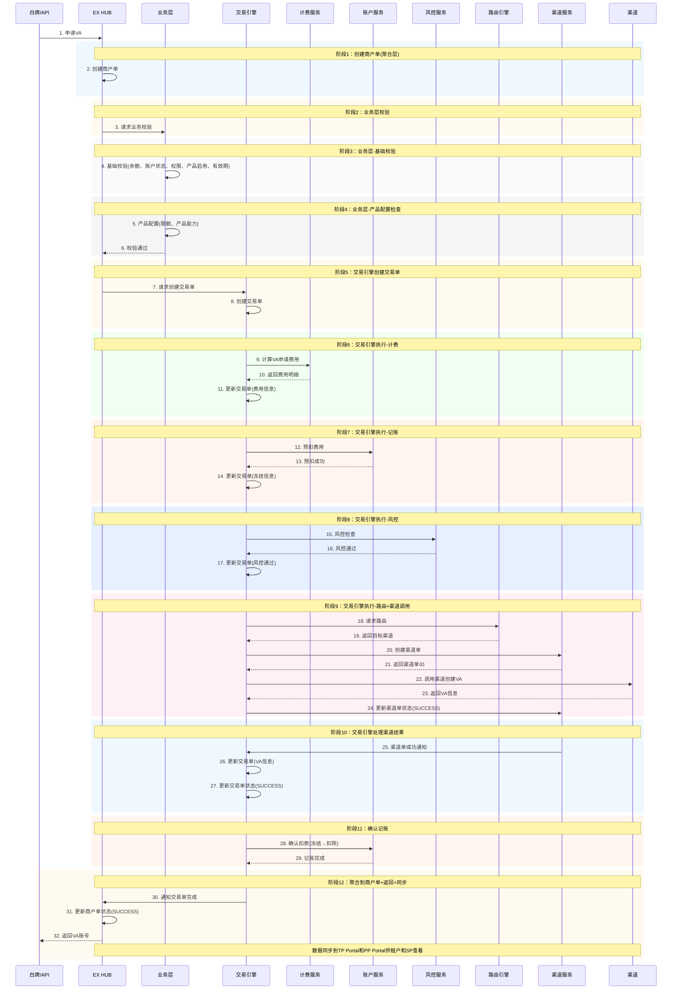
```mermaid
sequenceDiagram
    participant WP as 白牌/API
    participant HUB as EX HUB
    participant BL as 业务层
    participant TE as 交易引擎
    participant Pricing as 计费服务
    participant Account as 账户服务
    participant Risk as 风控服务
    participant Router as 路由引擎
    participant CO as 渠道服务
    participant Channel as 渠道
  
    WP->>HUB: 1. 申请VA
  
    rect rgb(240, 248, 255)
        Note over HUB,Channel: 阶段1：创建商户单(聚合层)
        HUB->>HUB: 2. 创建商户单
    end
  
    rect rgb(255, 250, 240)
        Note over HUB,Channel: 阶段2：业务层校验
        HUB->>BL: 3. 请求业务校验
    end
  
    rect rgb(250, 250, 250)
        Note over HUB,Channel: 阶段3：业务层-基础校验
        BL->>BL: 4. 基础校验(余额、账户状态、权限、产品启用、有效期)
    end
  
    rect rgb(245, 245, 245)
        Note over HUB,Channel: 阶段4：业务层-产品配置检查
        BL->>BL: 5. 产品配置(限额、产品能力)
        BL-->>HUB: 6. 校验通过
    end
  
    rect rgb(255, 250, 240)
        Note over HUB,Channel: 阶段5：交易引擎创建交易单
        HUB->>TE: 7. 请求创建交易单
        TE->>TE: 8. 创建交易单
    end
  
    rect rgb(240, 255, 240)
        Note over HUB,Channel: 阶段6：交易引擎执行-计费
        TE->>Pricing: 9. 计算VA申请费用
        Pricing-->>TE: 10. 返回费用明细
        TE->>TE: 11. 更新交易单(费用信息)
    end
  
    rect rgb(255, 245, 238)
        Note over HUB,Channel: 阶段7：交易引擎执行-记账
        TE->>Account: 12. 预扣费用
        Account-->>TE: 13. 预扣成功
        TE->>TE: 14. 更新交易单(冻结信息)
    end
  
    rect rgb(230, 240, 255)
        Note over HUB,Channel: 阶段8：交易引擎执行-风控
        TE->>Risk: 15. 风控检查
        Risk-->>TE: 16. 风控通过
        TE->>TE: 17. 更新交易单(风控通过)
    end
  
    rect rgb(255, 240, 245)
        Note over HUB,Channel: 阶段9：交易引擎执行-路由+渠道调用
        TE->>Router: 18. 请求路由
        Router-->>TE: 19. 返回目标渠道
        TE->>CO: 20. 创建渠道单
        CO-->>TE: 21. 返回渠道单ID
        TE->>Channel: 22. 调用渠道创建VA
        Channel-->>TE: 23. 返回VA信息
        TE->>CO: 24. 更新渠道单状态(SUCCESS)
    end
  
    rect rgb(240, 248, 255)
        Note over HUB,Channel: 阶段10：交易引擎处理渠道结果
        CO->>TE: 25. 渠道单成功通知
        TE->>TE: 26. 更新交易单(VA信息)
        TE->>TE: 27. 更新交易单状态(SUCCESS)
    end
  
    rect rgb(255, 245, 238)
        Note over HUB,Channel: 阶段11：确认记账
        TE->>Account: 28. 确认扣款(冻结→扣除)
        Account-->>TE: 29. 记账完成
    end
  
    rect rgb(255, 250, 240)
        Note over HUB,Channel: 阶段12：聚合到商户单+返回+同步
        TE->>HUB: 30. 通知交易单完成
        HUB->>HUB: 31. 更新商户单状态(SUCCESS)
        HUB-->>WP: 32. 返回VA账号
        Note over HUB,Channel: 数据同步到TP Portal和PP Portal供租户和SP查看
    end
```

**说明：**

- **商户单**：聚合层，汇总交易单结果
- **交易单**：核心执行层，交易引擎驱动执行计费、记账、风控、路由等所有业务逻辑
  - 先记账，冻结金额
- **渠道单**：渠道调用层
- 商户通过白牌或API接入EX系统
- 数据通过Portal展示：MP(商户)、TP(租户)、PP(SP)

---

### 4.2 VA收款（渠道被动通知）

**单据流转：** 渠道单 → 交易单 → (计费∥风控) → 商户单 → 记账

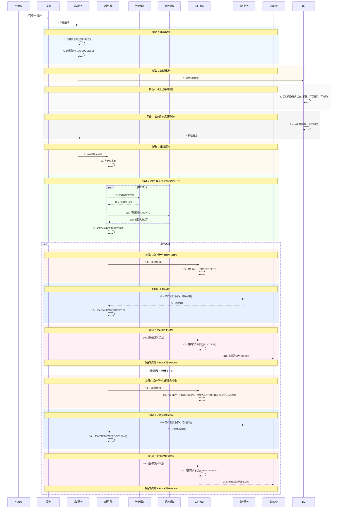
```mermaid
sequenceDiagram
    participant Payer as 付款方
    participant Channel as 渠道
    participant CO as 渠道服务
    participant TE as 交易引擎
    participant Pricing as 计费服务
    participant Risk as 风控服务
    participant HUB as EX HUB
    participant Account as 账户服务
    participant WP as 白牌/API
  
    Payer->>Channel: 1. 汇款到VA账户
    Channel->>CO: 2. 入账通知
  
    rect rgb(240, 248, 255)
        Note over Channel,WP: 阶段1：创建渠道单
        CO->>CO: 3. 创建渠道单(记录入账信息)
        CO->>CO: 4. 更新渠道单状态(SUCCESS)
    end
  
    rect rgb(255, 250, 240)
        Note over Channel,WP: 阶段2：业务层校验
        CO->>BL: 5. 请求业务校验
    end
  
    rect rgb(250, 250, 250)
        Note over Channel,WP: 阶段3：业务层-基础校验
        BL->>BL: 6. 基础校验(账户状态、权限、产品启用、有效期)
    end
  
    rect rgb(245, 245, 245)
        Note over Channel,WP: 阶段4：业务层-产品配置检查
        BL->>BL: 7. 产品配置(限额、币种支持)
        BL-->>CO: 8. 校验通过
    end
  
    rect rgb(255, 250, 240)
        Note over Channel,WP: 阶段5：创建交易单
        CO->>TE: 9. 请求创建交易单
        TE->>TE: 10. 创建交易单
    end
  
    rect rgb(240, 255, 240)
        Note over Channel,WP: 阶段6：交易引擎执行-计费∥风控(并行)
        par 并行执行
            TE->>Pricing: 11a. 计算收款手续费
            Pricing-->>TE: 12a. 返回费用明细
        and
            TE->>Risk: 11b. 风控检查(AML/KYC)
            Risk-->>TE: 12b. 返回风控结果
        end
        TE->>TE: 13. 更新交易单(费用+风控结果)
    end
  
    alt 风控通过
        rect rgb(255, 245, 238)
            Note over Channel,WP: 阶段7：商户单产生(费用已确定)
            TE->>HUB: 14a. 创建商户单
            HUB->>HUB: 15a. 商户单产生(PROCESSING)
        end
  
        rect rgb(230, 240, 255)
            Note over Channel,WP: 阶段8：记账(入账)
            TE->>Account: 16a. 商户记账(余额+，扣手续费)
            Account-->>TE: 17a. 记账成功
            TE->>TE: 18a. 更新交易单状态(SUCCESS)
        end
  
        rect rgb(255, 240, 245)
            Note over Channel,WP: 阶段9：更新商户单+通知
            TE->>HUB: 19a. 通知交易单完成
            HUB->>HUB: 20a. 更新商户单状态(SUCCESS)
            HUB-->>WP: 21a. 收款通知(Webhook)
            Note over Channel,WP: 数据同步到TP Portal和PP Portal
        end
  
    else 风控需要补充材料(RFI)
        rect rgb(255, 245, 238)
            Note over Channel,WP: 阶段7：商户单产生(待补充材料)
            TE->>HUB: 14b. 创建商户单
            HUB->>HUB: 15b. 商户单产生(PROCESSING, 合规状态=PENDING_SUPPLEMENT)
        end
  
        rect rgb(230, 240, 255)
            Note over Channel,WP: 阶段8：记账(入账但冻结)
            TE->>Account: 16b. 商户记账(余额+，冻结状态)
            Account-->>TE: 17b. 记账成功(冻结)
            TE->>TE: 18b. 更新交易单状态(PROCESSING)
        end
  
        rect rgb(255, 240, 245)
            Note over Channel,WP: 阶段9：通知商户补充材料
            TE->>HUB: 19b. 通知交易单状态
            HUB->>HUB: 20b. 更新商户单状态(PROCESSING)
            HUB-->>WP: 21b. 收款通知(需补充材料)
            Note over Channel,WP: 数据同步到TP Portal和PP Portal
        end
    end
```

**说明：**

- **计费和风控并行执行**：提升性能，两者都只依赖交易单
- **商户单在计费风控完成后产生**：确保费用已确定
- **情况1：风控通过**

  - 风控状态：PASSED
  - 商户单最终状态：SUCCESS
  - 正常入账完成
- **情况2：风控需要补充材料(RFI)**

  - 风控状态：PENDING_SUPPLEMENT
  - 商户单合规状态：PENDING_SUPPLEMENT
  - 资金入账但冻结，待补充材料后解冻
- 数据展示在PP Portal（服务商）、TP Portal（租户）、MP Portal（商户）

---

### 4.3 收款人添加（商户主动发起）

**单据流转：** 收款人数据 → EX风控 → SP风控 → 人工审核（可选）→ RFI流程（可选）

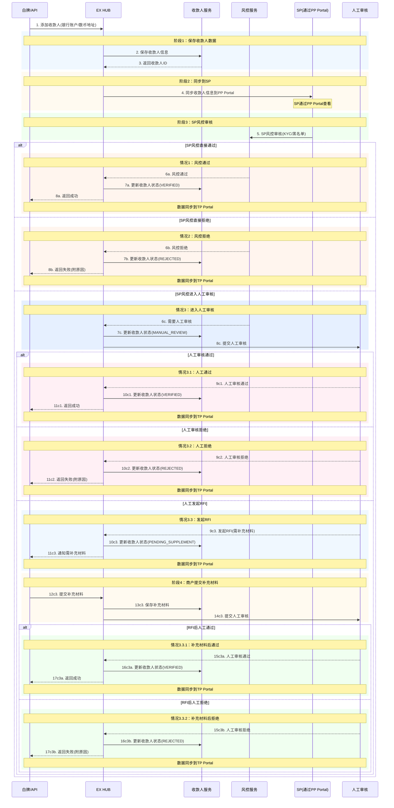
```mermaid
sequenceDiagram
    participant WP as 白牌/API
    participant HUB as EX HUB
    participant Payee as 收款人服务
    participant Risk as 风控服务
    participant SP as SP(通过PP Portal)
    participant Manual as 人工审核
  
    WP->>HUB: 1. 添加收款人(银行账户/数币地址)
  
    rect rgb(240, 248, 255)
        Note over WP,Manual: 阶段1：保存收款人数据
        HUB->>Payee: 2. 保存收款人信息
        Payee-->>HUB: 3. 返回收款人ID
    end
  
    rect rgb(255, 250, 240)
        Note over WP,Manual: 阶段2：同步到SP
        HUB->>SP: 4. 同步收款人信息到PP Portal
        Note over SP: SP通过PP Portal查看
    end
  
    rect rgb(240, 255, 240)
        Note over WP,Manual: 阶段3：SP风控审核
        SP->>Risk: 5. SP风控审核(KYC/黑名单)
    end
  
    alt SP风控直接通过
        rect rgb(255, 245, 238)
            Note over WP,Manual: 情况1：风控通过
            Risk-->>HUB: 6a. 风控通过
            HUB->>Payee: 7a. 更新收款人状态(VERIFIED)
            HUB-->>WP: 8a. 返回成功
            Note over WP,Manual: 数据同步到TP Portal
        end
  
    else SP风控直接拒绝
        rect rgb(255, 245, 238)
            Note over WP,Manual: 情况2：风控拒绝
            Risk-->>HUB: 6b. 风控拒绝
            HUB->>Payee: 7b. 更新收款人状态(REJECTED)
            HUB-->>WP: 8b. 返回失败(附原因)
            Note over WP,Manual: 数据同步到TP Portal
        end
  
    else SP风控进入人工审核
        rect rgb(230, 240, 255)
            Note over WP,Manual: 情况3：进入人工审核
            Risk-->>HUB: 6c. 需要人工审核
            HUB->>Payee: 7c. 更新收款人状态(MANUAL_REVIEW)
            HUB->>Manual: 8c. 提交人工审核
        end
  
        alt 人工审核通过
            rect rgb(255, 240, 245)
                Note over WP,Manual: 情况3.1：人工通过
                Manual-->>HUB: 9c1. 人工审核通过
                HUB->>Payee: 10c1. 更新收款人状态(VERIFIED)
                HUB-->>WP: 11c1. 返回成功
                Note over WP,Manual: 数据同步到TP Portal
            end
  
        else 人工审核拒绝
            rect rgb(255, 240, 245)
                Note over WP,Manual: 情况3.2：人工拒绝
                Manual-->>HUB: 9c2. 人工审核拒绝
                HUB->>Payee: 10c2. 更新收款人状态(REJECTED)
                HUB-->>WP: 11c2. 返回失败(附原因)
                Note over WP,Manual: 数据同步到TP Portal
            end
  
        else 人工发起RFI
            rect rgb(240, 248, 255)
                Note over WP,Manual: 情况3.3：发起RFI
                Manual-->>HUB: 9c3. 发起RFI(需补充材料)
                HUB->>Payee: 10c3. 更新收款人状态(PENDING_SUPPLEMENT)
                HUB-->>WP: 11c3. 通知需补充材料
                Note over WP,Manual: 数据同步到TP Portal
            end
  
            rect rgb(255, 250, 240)
                Note over WP,Manual: 阶段4：商户提交补充材料
                WP->>HUB: 12c3. 提交补充材料
                HUB->>Payee: 13c3. 保存补充材料
                HUB->>Manual: 14c3. 提交人工审核
            end
  
            alt RFI后人工通过
                rect rgb(240, 255, 240)
                    Note over WP,Manual: 情况3.3.1：补充材料后通过
                    Manual-->>HUB: 15c3a. 人工审核通过
                    HUB->>Payee: 16c3a. 更新收款人状态(VERIFIED)
                    HUB-->>WP: 17c3a. 返回成功
                    Note over WP,Manual: 数据同步到TP Portal
                end
  
            else RFI后人工拒绝
                rect rgb(240, 255, 240)
                    Note over WP,Manual: 情况3.3.2：补充材料后拒绝
                    Manual-->>HUB: 15c3b. 人工审核拒绝
                    HUB->>Payee: 16c3b. 更新收款人状态(REJECTED)
                    HUB-->>WP: 17c3b. 返回失败(附原因)
                    Note over WP,Manual: 数据同步到TP Portal
                end
            end
        end
    end
```

**说明：**

- **阶段1：保存收款人数据** → EX HUB保存
- **阶段2：同步到SP** → 通过PP Portal展示给SP
- **阶段3：SP风控审核** → SP通过PP Portal进行风控审核

**审核结果：**

1. **风控直接通过** → 收款人状态：VERIFIED
2. **风控直接拒绝** → 收款人状态：REJECTED
3. **进入人工审核** → 收款人状态：MANUAL_REVIEW
   - 3.1 **人工通过** → 收款人状态：VERIFIED
   - 3.2 **人工拒绝** → 收款人状态：REJECTED
   - 3.3 **发起RFI** → 收款人状态：PENDING_SUPPLEMENT
     - 商户提交补充材料
     - 人工再次审核
     - 3.3.1 **补充材料后通过** → 收款人状态：VERIFIED
     - 3.3.2 **补充材料后拒绝** → 收款人状态：REJECTED

- 所有状态变更同步到TP Portal供租户查看
- SP通过PP Portal查看和审核收款人信息

---

### 4.4 充币（渠道被动通知）

**单据流转：** 渠道单 → 交易单 → (计费∥风控) → 商户单 → 记账

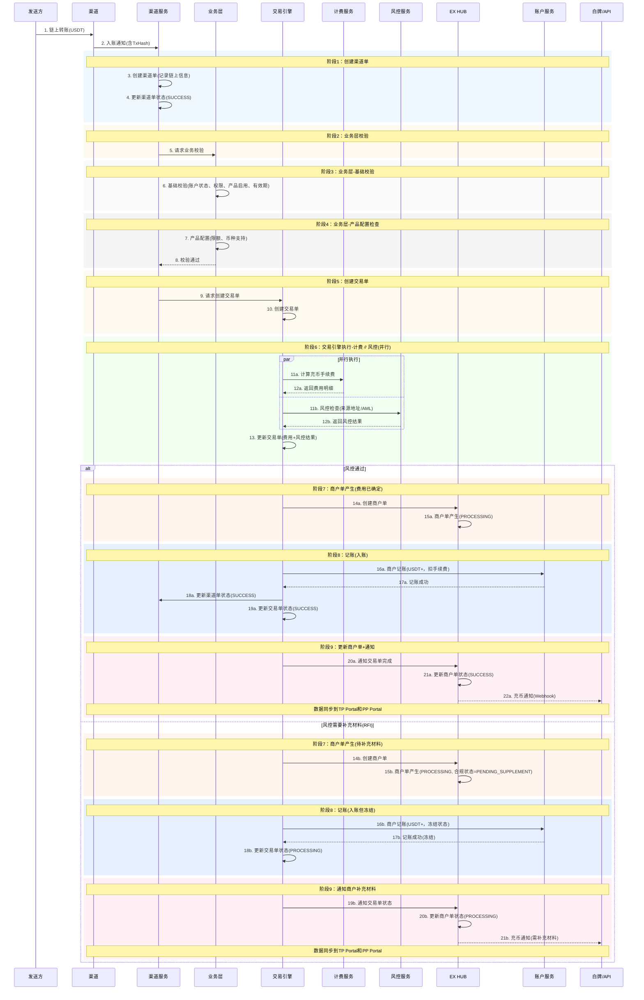
```mermaid
sequenceDiagram
    participant Sender as 发送方
    participant Channel as 渠道
    participant CO as 渠道服务
    participant BL as 业务层
    participant TE as 交易引擎
    participant Pricing as 计费服务
    participant Risk as 风控服务
    participant HUB as EX HUB
    participant Account as 账户服务
    participant WP as 白牌/API
  
    Sender->>Channel: 1. 链上转账(USDT)
    Channel->>CO: 2. 入账通知(含TxHash)
  
    rect rgb(240, 248, 255)
        Note over Channel,WP: 阶段1：创建渠道单
        CO->>CO: 3. 创建渠道单(记录链上信息)
        CO->>CO: 4. 更新渠道单状态(SUCCESS)
    end
  
    rect rgb(255, 250, 240)
        Note over Channel,WP: 阶段2：业务层校验
        CO->>BL: 5. 请求业务校验
    end
  
    rect rgb(250, 250, 250)
        Note over Channel,WP: 阶段3：业务层-基础校验
        BL->>BL: 6. 基础校验(账户状态、权限、产品启用、有效期)
    end
  
    rect rgb(245, 245, 245)
        Note over Channel,WP: 阶段4：业务层-产品配置检查
        BL->>BL: 7. 产品配置(限额、币种支持)
        BL-->>CO: 8. 校验通过
    end
  
    rect rgb(255, 250, 240)
        Note over Channel,WP: 阶段5：创建交易单
        CO->>TE: 9. 请求创建交易单
        TE->>TE: 10. 创建交易单
    end
  
    rect rgb(240, 255, 240)
        Note over Channel,WP: 阶段6：交易引擎执行-计费∥风控(并行)
        par 并行执行
            TE->>Pricing: 11a. 计算充币手续费
            Pricing-->>TE: 12a. 返回费用明细
        and
            TE->>Risk: 11b. 风控检查(来源地址/AML)
            Risk-->>TE: 12b. 返回风控结果
        end
        TE->>TE: 13. 更新交易单(费用+风控结果)
    end
  
    alt 风控通过
        rect rgb(255, 245, 238)
            Note over Channel,WP: 阶段7：商户单产生(费用已确定)
            TE->>HUB: 14a. 创建商户单
            HUB->>HUB: 15a. 商户单产生(PROCESSING)
        end
  
        rect rgb(230, 240, 255)
            Note over Channel,WP: 阶段8：记账(入账)
            TE->>Account: 16a. 商户记账(USDT+，扣手续费)
            Account-->>TE: 17a. 记账成功
            TE->>CO: 18a. 更新渠道单状态(SUCCESS)
            TE->>TE: 19a. 更新交易单状态(SUCCESS)
        end
  
        rect rgb(255, 240, 245)
            Note over Channel,WP: 阶段9：更新商户单+通知
            TE->>HUB: 20a. 通知交易单完成
            HUB->>HUB: 21a. 更新商户单状态(SUCCESS)
            HUB-->>WP: 22a. 充币通知(Webhook)
            Note over Channel,WP: 数据同步到TP Portal和PP Portal
        end
  
    else 风控需要补充材料(RFI)
        rect rgb(255, 245, 238)
            Note over Channel,WP: 阶段7：商户单产生(待补充材料)
            TE->>HUB: 14b. 创建商户单
            HUB->>HUB: 15b. 商户单产生(PROCESSING, 合规状态=PENDING_SUPPLEMENT)
        end
  
        rect rgb(230, 240, 255)
            Note over Channel,WP: 阶段8：记账(入账但冻结)
            TE->>Account: 16b. 商户记账(USDT+，冻结状态)
            Account-->>TE: 17b. 记账成功(冻结)
            TE->>TE: 18b. 更新交易单状态(PROCESSING)
        end
  
        rect rgb(255, 240, 245)
            Note over Channel,WP: 阶段9：通知商户补充材料
            TE->>HUB: 19b. 通知交易单状态
            HUB->>HUB: 20b. 更新商户单状态(PROCESSING)
            HUB-->>WP: 21b. 充币通知(需补充材料)
            Note over Channel,WP: 数据同步到TP Portal和PP Portal
        end
    end
```

---

### 4.5 提币（商户主动发起）

**单据流转：** 商户单 → 交易单 → 渠道单

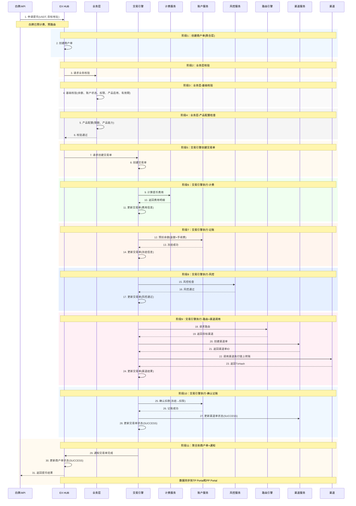
```mermaid
sequenceDiagram
    participant WP as 白牌/API
    participant HUB as EX HUB
    participant BL as 业务层
    participant TE as 交易引擎
    participant Pricing as 计费服务
    participant Account as 账户服务
    participant Risk as 风控服务
    participant Router as 路由引擎
    participant CO as 渠道服务
    participant Channel as 渠道
  
    WP->>HUB: 1. 申请提币(USDT, 目标地址)
  
    Note over WP,HUB: 白牌已预计费、预路由
  
    rect rgb(240, 248, 255)
        Note over HUB,Channel: 阶段1：创建商户单(聚合层)
        HUB->>HUB: 2. 创建商户单
    end
  
    rect rgb(255, 250, 240)
        Note over HUB,Channel: 阶段2：业务层校验
        HUB->>BL: 3. 请求业务校验
    end
  
    rect rgb(250, 250, 250)
        Note over HUB,Channel: 阶段3：业务层-基础校验
        BL->>BL: 4. 基础校验(余额、账户状态、权限、产品启用、有效期)
    end
  
    rect rgb(245, 245, 245)
        Note over HUB,Channel: 阶段4：业务层-产品配置检查
        BL->>BL: 5. 产品配置(限额、产品能力)
        BL-->>HUB: 6. 校验通过
    end
  
    rect rgb(255, 250, 240)
        Note over HUB,Channel: 阶段5：交易引擎创建交易单
        HUB->>TE: 7. 请求创建交易单
        TE->>TE: 8. 创建交易单
    end
  
    rect rgb(240, 255, 240)
        Note over HUB,Channel: 阶段6：交易引擎执行-计费
        TE->>Pricing: 9. 计算提币费用
        Pricing-->>TE: 10. 返回费用明细
        TE->>TE: 11. 更新交易单(费用信息)
    end
  
    rect rgb(255, 245, 238)
        Note over HUB,Channel: 阶段7：交易引擎执行-记账
        TE->>Account: 12. 预扣余额(金额+手续费)
        Account-->>TE: 13. 冻结成功
        TE->>TE: 14. 更新交易单(冻结信息)
    end
  
    rect rgb(230, 240, 255)
        Note over HUB,Channel: 阶段8：交易引擎执行-风控
        TE->>Risk: 15. 风控检查
        Risk-->>TE: 16. 风控通过
        TE->>TE: 17. 更新交易单(风控通过)
    end
  
    rect rgb(255, 240, 245)
        Note over HUB,Channel: 阶段9：交易引擎执行-路由+渠道调用
        TE->>Router: 18. 请求路由
        Router-->>TE: 19. 返回目标渠道
        TE->>CO: 20. 创建渠道单
        CO-->>TE: 21. 返回渠道单ID
        TE->>Channel: 22. 调用渠道执行链上转账
        Channel-->>TE: 23. 返回TxHash
        TE->>TE: 24. 更新交易单(渠道结果)
    end
  
    rect rgb(240, 248, 255)
        Note over HUB,Channel: 阶段10：交易引擎执行-确认记账
        TE->>Account: 25. 确认扣款(冻结→扣除)
        Account-->>TE: 26. 记账成功
        TE->>CO: 27. 更新渠道单状态(SUCCESS)
        TE->>TE: 28. 更新交易单状态(SUCCESS)
    end
  
    rect rgb(255, 250, 240)
        Note over HUB,Channel: 阶段11：聚合到商户单+通知
        TE->>HUB: 29. 通知交易单完成
        HUB->>HUB: 30. 更新商户单状态(SUCCESS)
        HUB-->>WP: 31. 返回提币结果
        Note over HUB,Channel: 数据同步到TP Portal和PP Portal
    end
```

---

### 4.6 法币付款/提现（商户主动发起）

**单据流转：** 商户单 → 交易单 → 渠道单

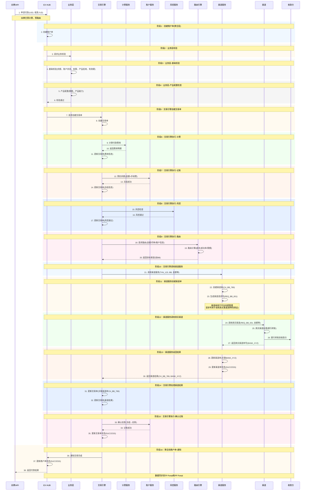
```mermaid
sequenceDiagram
    participant WP as 白牌/API
    participant HUB as EX HUB
    participant BL as 业务层
    participant TE as 交易引擎
    participant Pricing as 计费服务
    participant Account as 账户服务
    participant Risk as 风控服务
    participant Router as 路由引擎
    participant CO as 渠道服务
    participant Channel as 渠道
    participant Payee as 收款方
  
    WP->>HUB: 1. 申请付款(USD, 收款人ID)
  
    Note over WP,HUB: 白牌已预计费、预路由
  
    rect rgb(240, 248, 255)
        Note over HUB,Payee: 阶段1：创建商户单(聚合层)
        HUB->>HUB: 2. 创建商户单
    end
  
    rect rgb(255, 250, 240)
        Note over HUB,Payee: 阶段2：业务层校验
        HUB->>BL: 3. 请求业务校验
    end
  
    rect rgb(250, 250, 250)
        Note over HUB,Payee: 阶段3：业务层-基础校验
        BL->>BL: 4. 基础校验(余额、账户状态、权限、产品启用、有效期)
    end
  
    rect rgb(245, 245, 245)
        Note over HUB,Payee: 阶段4：业务层-产品配置检查
        BL->>BL: 5. 产品配置(限额、产品能力)
        BL-->>HUB: 6. 校验通过
    end
  
    rect rgb(255, 250, 240)
        Note over HUB,Payee: 阶段5：交易引擎创建交易单
        HUB->>TE: 7. 请求创建交易单
        TE->>TE: 8. 创建交易单
    end
  
    rect rgb(240, 255, 240)
        Note over HUB,Payee: 阶段6：交易引擎执行-计费
        TE->>Pricing: 9. 计算付款费用
        Pricing-->>TE: 10. 返回费用明细
        TE->>TE: 11. 更新交易单(费用信息)
    end
  
    rect rgb(255, 245, 238)
        Note over HUB,Payee: 阶段7：交易引擎执行-记账
        TE->>Account: 12. 预扣余额(金额+手续费)
        Account-->>TE: 13. 冻结成功
        TE->>TE: 14. 更新交易单(冻结信息)
    end
  
    rect rgb(230, 240, 255)
        Note over HUB,Payee: 阶段8：交易引擎执行-风控
        TE->>Risk: 15. 风控检查
        Risk-->>TE: 16. 风控通过
        TE->>TE: 17. 更新交易单(风控通过)
    end
  
    rect rgb(255, 240, 245)
        Note over HUB,Payee: 阶段9：交易引擎执行-路由
        TE->>Router: 18. 请求路由(金额/币种/商户信息)
        Router->>Router: 19. 路由计算(成本/成功率/限额)
        Router-->>TE: 20. 返回目标渠道(如BB)
    end
  
    rect rgb(240, 248, 255)
        Note over HUB,Payee: 阶段10：交易引擎调用渠道服务
        TE->>CO: 21. 调用渠道服务(TXN_123, BB, 金额等)
    end
  
    rect rgb(255, 250, 240)
        Note over HUB,Payee: 阶段11：渠道服务创建渠道单
        CO->>CO: 22. 创建渠道单(CH_BB_789)
        CO->>CO: 23. 生成渠道请求号(REQ_BB_001)
        Note over CO: 渠道单用于平台内部管理<br/>请求号用于调用真实渠道(幂等性保证)
    end
  
    rect rgb(240, 255, 240)
        Note over HUB,Payee: 阶段12：渠道服务调用真实渠道
        CO->>Channel: 24. 调用真实渠道(REQ_BB_001, 金额等)
        Channel->>Channel: 25. 真实渠道处理(银行转账)
        Channel->>Payee: 26. 银行转账到收款方
        Channel-->>CO: 27. 返回真实渠道单号(BANK_XYZ)
    end
  
    rect rgb(255, 245, 238)
        Note over HUB,Payee: 阶段13：渠道服务返回结果
        CO->>CO: 28. 更新渠道单(关联BANK_XYZ)
        CO->>CO: 29. 更新渠道单状态(SUCCESS)
        CO-->>TE: 30. 返回渠道结果(CH_BB_789, BANK_XYZ)
    end
  
    rect rgb(230, 240, 255)
        Note over HUB,Payee: 阶段14：交易引擎处理渠道结果
        TE->>TE: 31. 更新交易单(关联渠道单CH_BB_789)
        TE->>TE: 32. 更新交易单(渠道结果)
    end
  
    rect rgb(255, 240, 245)
        Note over HUB,Payee: 阶段15：交易引擎执行-确认记账
        TE->>Account: 33. 确认扣款(冻结→扣除)
        Account-->>TE: 34. 记账成功
        TE->>TE: 35. 更新交易单状态(SUCCESS)
    end
  
    rect rgb(255, 250, 240)
        Note over HUB,Payee: 阶段16：聚合到商户单+通知
        TE->>HUB: 36. 通知交易完成
        HUB->>HUB: 37. 更新商户单状态(SUCCESS)
        HUB-->>WP: 38. 返回付款结果
        Note over HUB,Payee: 数据同步到TP Portal和PP Portal
    end
```

---

### 4.7 IPL法币换汇

**场景：** 商户在IPL法币账户之间进行换汇（如USD→EUR）

**单据流转：** 商户单 → 交易单 → 渠道单（调用外部换汇渠道）

**特点：**

- 不需要过风控（法币换汇）
- 不需要计费（无手续费）
- 需要查询实时汇率
- 调用外部换汇渠道

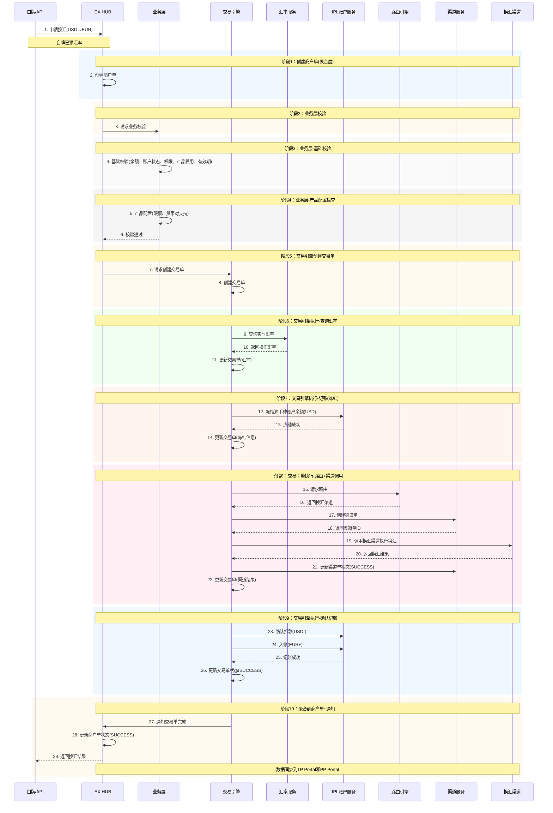
```mermaid
sequenceDiagram
    participant WP as 白牌/API
    participant HUB as EX HUB
    participant BL as 业务层
    participant TE as 交易引擎
    participant FX as 汇率服务
    participant Account as IPL账户服务
    participant Router as 路由引擎
    participant CO as 渠道服务
    participant Channel as 换汇渠道
  
    WP->>HUB: 1. 申请换汇(USD→EUR)
  
    Note over WP,HUB: 白牌已预汇率
  
    rect rgb(240, 248, 255)
        Note over HUB,Channel: 阶段1：创建商户单(聚合层)
        HUB->>HUB: 2. 创建商户单
    end
  
    rect rgb(255, 250, 240)
        Note over HUB,Channel: 阶段2：业务层校验
        HUB->>BL: 3. 请求业务校验
    end
  
    rect rgb(250, 250, 250)
        Note over HUB,Channel: 阶段3：业务层-基础校验
        BL->>BL: 4. 基础校验(余额、账户状态、权限、产品启用、有效期)
    end
  
    rect rgb(245, 245, 245)
        Note over HUB,Channel: 阶段4：业务层-产品配置检查
        BL->>BL: 5. 产品配置(限额、货币对支持)
        BL-->>HUB: 6. 校验通过
    end
  
    rect rgb(255, 250, 240)
        Note over HUB,Channel: 阶段5：交易引擎创建交易单
        HUB->>TE: 7. 请求创建交易单
        TE->>TE: 8. 创建交易单
    end
  
    rect rgb(240, 255, 240)
        Note over HUB,Channel: 阶段6：交易引擎执行-查询汇率
        TE->>FX: 9. 查询实时汇率
        FX-->>TE: 10. 返回换汇汇率
        TE->>TE: 11. 更新交易单(汇率)
    end
  
    rect rgb(255, 245, 238)
        Note over HUB,Channel: 阶段7：交易引擎执行-记账(冻结)
        TE->>Account: 12. 冻结源币种账户余额(USD)
        Account-->>TE: 13. 冻结成功
        TE->>TE: 14. 更新交易单(冻结信息)
    end
  
    rect rgb(255, 240, 245)
        Note over HUB,Channel: 阶段8：交易引擎执行-路由+渠道调用
        TE->>Router: 15. 请求路由
        Router-->>TE: 16. 返回换汇渠道
        TE->>CO: 17. 创建渠道单
        CO-->>TE: 18. 返回渠道单ID
        TE->>Channel: 19. 调用换汇渠道执行换汇
        Channel-->>TE: 20. 返回换汇结果
        TE->>CO: 21. 更新渠道单状态(SUCCESS)
        TE->>TE: 22. 更新交易单(渠道结果)
    end
  
    rect rgb(240, 248, 255)
        Note over HUB,Channel: 阶段9：交易引擎执行-确认记账
        TE->>Account: 23. 确认扣款(USD-)
        TE->>Account: 24. 入账(EUR+)
        Account-->>TE: 25. 记账成功
        TE->>TE: 26. 更新交易单状态(SUCCESS)
    end
  
    rect rgb(255, 250, 240)
        Note over HUB,Channel: 阶段10：聚合到商户单+通知
        TE->>HUB: 27. 通知交易单完成
        HUB->>HUB: 28. 更新商户单状态(SUCCESS)
        HUB-->>WP: 29. 返回换汇结果
        Note over HUB,Channel: 数据同步到TP Portal和PP Portal
    end
```

**说明：**

- **IPL换汇调用外部渠道**：换汇渠道（如银行、换汇服务商）
- **不需要风控**：法币换汇不涉及风控检查
- **不需要计费**：换汇无手续费
- **需要查询汇率**：实时汇率查询

---

### 4.8 BB数币钱包直接付款（商户主动发起）

**场景：** 商户用BB数币钱包中的USDC，直接付款USD给收款人银行账户。系统自动完成承兑+法币出款，商户一笔操作完成。

**单据结构：**

```
商户单 M001 (USDC→USD, 付款给收款人)
    └── 交易主单 T001 (BB, USDC→USD)
            ├── 交易子单 T001-1: 承兑 (USDC→USD, BB内部账户划转)
            └── 交易子单 T001-2: 法币出款 (USD→收款人银行, 通过XPAY渠道)
                    └── 渠道单 C001 (BB→XPAY→银行)
```

**与现有付款流程的区别：**

| 对比项           | 4.6 法币付款/提现 | 4.8 BB数币钱包直接付款     |
| ---------------- | ----------------- | -------------------------- |
| **源资金** | 法币账户余额(USD) | 数币钱包余额(USDC)         |
| **交易单** | 1笔交易单         | 1笔交易主单 + 2笔交易子单  |
| **承兑**   | 不需要            | 子单1：USDC→USD承兑       |
| **出款**   | 直接法币出款      | 子单2：承兑后USD出款(XPAY) |
| **渠道**   | 银行/PSP          | XPAY渠道(BB内部Channel)    |

**单据流转：** 商户单 → 交易主单 → 子单1(承兑) + 子单2(法币出款) → 渠道单

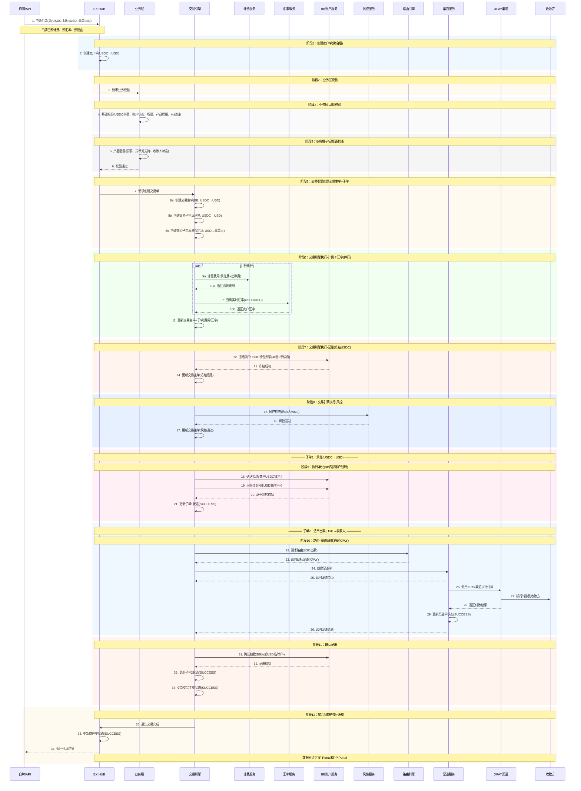
```mermaid
sequenceDiagram
    participant WP as 白牌/API
    participant HUB as EX HUB
    participant BL as 业务层
    participant TE as 交易引擎
    participant Pricing as 计费服务
    participant FX as 汇率服务
    participant Account as BB账户服务
    participant Risk as 风控服务
    participant Router as 路由引擎
    participant CO as 渠道服务
    participant XPAY as XPAY渠道
    participant Payee as 收款方
  
    WP->>HUB: 1. 申请付款(源:USDC, 目标:USD, 收款人ID)
  
    Note over WP,HUB: 白牌已预计费、预汇率、预路由
  
    rect rgb(240, 248, 255)
        Note over HUB,Payee: 阶段1：创建商户单(聚合层)
        HUB->>HUB: 2. 创建商户单(USDC→USD)
    end
  
    rect rgb(255, 250, 240)
        Note over HUB,Payee: 阶段2：业务层校验
        HUB->>BL: 3. 请求业务校验
    end
  
    rect rgb(250, 250, 250)
        Note over HUB,Payee: 阶段3：业务层-基础校验
        BL->>BL: 4. 基础校验(USDC余额、账户状态、权限、产品启用、有效期)
    end
  
    rect rgb(245, 245, 245)
        Note over HUB,Payee: 阶段4：业务层-产品配置检查
        BL->>BL: 5. 产品配置(限额、货币对支持、收款人状态)
        BL-->>HUB: 6. 校验通过
    end
  
    rect rgb(255, 250, 240)
        Note over HUB,Payee: 阶段5：交易引擎创建交易主单+子单
        HUB->>TE: 7. 请求创建交易单
        TE->>TE: 8a. 创建交易主单(BB, USDC→USD)
        TE->>TE: 8b. 创建交易子单1(承兑: USDC→USD)
        TE->>TE: 8c. 创建交易子单2(法币出款: USD→收款人)
    end
  
    rect rgb(240, 255, 240)
        Note over HUB,Payee: 阶段6：交易引擎执行-计费∥汇率(并行)
        par 并行执行
            TE->>Pricing: 9a. 计算费用(承兑费+出款费)
            Pricing-->>TE: 10a. 返回费用明细
        and
            TE->>FX: 9b. 查询实时汇率(USDC/USD)
            FX-->>TE: 10b. 返回商户汇率
        end
        TE->>TE: 11. 更新交易主单+子单(费用/汇率)
    end
  
    rect rgb(255, 245, 238)
        Note over HUB,Payee: 阶段7：交易引擎执行-记账(冻结USDC)
        TE->>Account: 12. 冻结商户USDC钱包余额(本金+手续费)
        Account-->>TE: 13. 冻结成功
        TE->>TE: 14. 更新交易主单(冻结信息)
    end
  
    rect rgb(230, 240, 255)
        Note over HUB,Payee: 阶段8：交易引擎执行-风控
        TE->>Risk: 15. 风控检查(收款人/AML)
        Risk-->>TE: 16. 风控通过
        TE->>TE: 17. 更新交易主单(风控通过)
    end
  
    rect rgb(255, 240, 245)
        Note over HUB,Payee: ══════ 子单1：承兑(USDC→USD) ══════
        Note over HUB,Payee: 阶段9：执行承兑(BB内部账户划转)
        TE->>Account: 18. 确认扣款(商户USDC钱包-)
        TE->>Account: 19. 入账(BB内部USD临时户+)
        Account-->>TE: 20. 承兑划转成功
        TE->>TE: 21. 更新子单1状态(SUCCESS)
    end
  
    rect rgb(240, 248, 255)
        Note over HUB,Payee: ══════ 子单2：法币出款(USD→收款人) ══════
        Note over HUB,Payee: 阶段10：路由+渠道调用(通过XPAY)
        TE->>Router: 22. 请求路由(USD出款)
        Router-->>TE: 23. 返回目标渠道(XPAY)
        TE->>CO: 24. 创建渠道单
        CO-->>TE: 25. 返回渠道单ID
        CO->>XPAY: 26. 调用XPAY渠道执行付款
        XPAY->>Payee: 27. 银行转账到收款方
        XPAY-->>CO: 28. 返回付款结果
        CO->>CO: 29. 更新渠道单状态(SUCCESS)
        CO-->>TE: 30. 返回渠道结果
    end
  
    rect rgb(255, 245, 238)
        Note over HUB,Payee: 阶段11：确认记账
        TE->>Account: 31. 确认扣款(BB内部USD临时户-)
        Account-->>TE: 32. 记账成功
        TE->>TE: 33. 更新子单2状态(SUCCESS)
        TE->>TE: 34. 更新交易主单状态(SUCCESS)
    end
  
    rect rgb(255, 250, 240)
        Note over HUB,Payee: 阶段12：聚合到商户单+通知
        TE->>HUB: 35. 通知交易完成
        HUB->>HUB: 36. 更新商户单状态(SUCCESS)
        HUB-->>WP: 37. 返回付款结果
        Note over HUB,Payee: 数据同步到TP Portal和PP Portal
    end
```

**说明：**

- **交易主单+子单模型**：1笔交易主单(USDC→USD)拆为2笔子单，子单1承兑、子单2出款，串行执行
- **子单1（承兑）**：BB内部账户划转，USDC钱包→BB内部USD临时户，无需渠道单
- **子单2（法币出款）**：通过XPAY渠道出款到收款人银行账户，有渠道单
- **XPAY是BB内部Channel**：对EX/TP/商户透明，商户只看到"付款成功"
- **冻结在主单层面**：冻结商户USDC余额，子单1承兑成功后资金转到BB内部USD临时户，子单2出款成功后从临时户扣除
- **风控在主单层面**：收款人风控检查在承兑前完成，避免承兑后出款被拒

**与4.6法币付款的关系：**

商户在MP端看到的都是Payouts（付款），区别在于源资金：

- 法币账户余额付款 → 走4.6流程（单交易单）
- 数币钱包余额付款 → 走4.8流程（主单+2子单，自动承兑+出款）
- 商户无需感知底层差异，系统根据源账户类型自动选择流程

---

## 承兑的两种模式

### 5.1 模式A：纯BB承兑（单SP内部账户划转）

**场景：** 租户配置商户使用BB进行承兑，BB内部数币钱包→法币账户

**单据流转：** 商户单 → 交易单(BB)（无需渠道单、无需风控，内部账户划转）

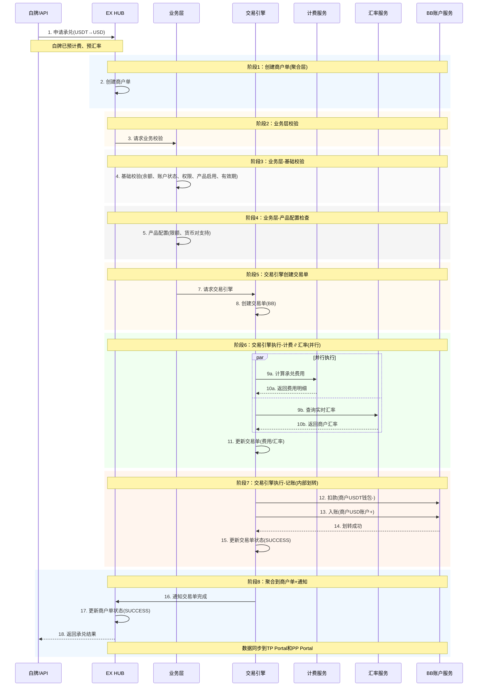
```mermaid
sequenceDiagram
    participant WP as 白牌/API
    participant HUB as EX HUB
    participant BL as 业务层
    participant TE as 交易引擎
    participant Pricing as 计费服务
    participant FX as 汇率服务
    participant Account as BB账户服务
  
    WP->>HUB: 1. 申请承兑(USDT→USD)
  
    Note over WP,HUB: 白牌已预计费、预汇率
  
    rect rgb(240, 248, 255)
        Note over HUB,Account: 阶段1：创建商户单(聚合层)
        HUB->>HUB: 2. 创建商户单
    end
  
    rect rgb(255, 250, 240)
        Note over HUB,Account: 阶段2：业务层校验
        HUB->>BL: 3. 请求业务校验
    end
  
    rect rgb(250, 250, 250)
        Note over HUB,Account: 阶段3：业务层-基础校验
        BL->>BL: 4. 基础校验(余额、账户状态、权限、产品启用、有效期)
    end
  
    rect rgb(245, 245, 245)
        Note over HUB,Account: 阶段4：业务层-产品配置检查
        BL->>BL: 5. 产品配置(限额、货币对支持)
   
    end
  
    rect rgb(255, 250, 240)
        Note over HUB,Account: 阶段5：交易引擎创建交易单
        BL->>TE: 7. 请求交易引擎
        TE->>TE: 8. 创建交易单(BB)
    end
  
    rect rgb(240, 255, 240)
        Note over HUB,Account: 阶段6：交易引擎执行-计费∥汇率(并行)
        par 并行执行
            TE->>Pricing: 9a. 计算承兑费用
            Pricing-->>TE: 10a. 返回费用明细
        and
            TE->>FX: 9b. 查询实时汇率
            FX-->>TE: 10b. 返回商户汇率
        end
        TE->>TE: 11. 更新交易单(费用/汇率)
    end
  
    rect rgb(255, 245, 238)
        Note over HUB,Account: 阶段7：交易引擎执行-记账(内部划转)
        TE->>Account: 12. 扣款(商户USDT钱包-)
        TE->>Account: 13. 入账(商户USD账户+)
        Account-->>TE: 14. 划转成功
        TE->>TE: 15. 更新交易单状态(SUCCESS)
    end
  
    rect rgb(240, 248, 255)
        Note over HUB,Account: 阶段8：聚合到商户单+通知
        TE->>HUB: 16. 通知交易单完成
        HUB->>HUB: 17. 更新商户单状态(SUCCESS)
        HUB-->>WP: 18. 返回承兑结果
        Note over HUB,Account: 数据同步到TP Portal和PP Portal
    end
```

**说明：**

- **纯BB承兑是内部账户划转**：BB数币钱包 → BB法币账户
- **无需渠道单**：不调用外部渠道，只是账户服务内部划转
- **无需风控**：内部账户划转，不涉及外部交易
- **计费和汇率并行**：提升性能，汇率实时性更好

---

### 5.2 模式B：IPL-BB打通承兑（双SP中间户划转）

**场景：** 租户配置商户使用IPL-BB打通进行承兑，通过中间户实现跨SP账户划转

**单据流转：**

- 商户单（BB和IPL共享看到同一个商户单）
- 交易单(BB)：数币侧，BB看到，**过风控（可配置自动通过）**
- 交易单(IPL)：法币侧，IPL看到，**过风控（可配置自动通过）**

**Off Ramp示例（USDT→USD）：**

```
BB侧：商户USDT钱包 - → IPL中间户(在BB) +
IPL侧：IPL中间户 - → 商户USD账户 +
```

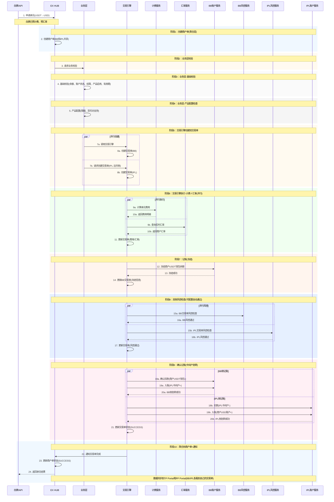
```mermaid
sequenceDiagram
    participant WP as 白牌/API
    participant HUB as EX HUB
    participant BL as 业务层
    participant TE as 交易引擎
    participant Pricing as 计费服务
    participant FX as 汇率服务
    participant BB_Account as BB账户服务
    participant BB_Risk as BB风控服务
    participant IPL_Risk as IPL风控服务
    participant IPL_Account as IPL账户服务
  
    WP->>HUB: 1. 申请承兑(USDT→USD)
  
    Note over WP,HUB: 白牌已预计费、预汇率
  
    rect rgb(240, 248, 255)
        Note over HUB,IPL_Account: 阶段1：创建商户单(聚合层)
        HUB->>HUB: 2. 创建商户单(BB和IPL共享)
    end
  
    rect rgb(255, 250, 240)
        Note over HUB,IPL_Account: 阶段2：业务层校验
        HUB->>BL: 3. 请求业务校验
    end
  
    rect rgb(250, 250, 250)
        Note over HUB,IPL_Account: 阶段3：业务层-基础校验
        BL->>BL: 4. 基础校验(余额、账户状态、权限、产品启用、有效期)
    end
  
    rect rgb(245, 245, 245)
        Note over HUB,IPL_Account: 阶段4：业务层-产品配置检查
        BL->>BL: 5. 产品配置(限额、货币对支持)

    end
  
    rect rgb(255, 250, 240)
        Note over HUB,IPL_Account: 阶段5：交易引擎创建双交易单
        par 并行创建
            BL->>TE: 7a. 调用交易引擎
            TE->>TE: 8a. 创建交易单(BB)
        and
            BL->>TE: 7b. 请求创建交易单(IPL-法币侧)
            TE->>TE: 8b. 创建交易单(IPL)
        end
    end
  
    rect rgb(240, 255, 240)
        Note over HUB,IPL_Account: 阶段6：交易引擎执行-计费∥汇率(并行)
        par 并行执行
            TE->>Pricing: 9a. 计算承兑费用
            Pricing-->>TE: 10a. 返回费用明细
        and
            TE->>FX: 9b. 查询实时汇率
            FX-->>TE: 10b. 返回商户汇率
        end
        TE->>TE: 11. 更新交易单(费用/汇率)
    end
  
    rect rgb(255, 245, 238)
        Note over HUB,IPL_Account: 阶段7：记账(冻结)
        TE->>BB_Account: 12. 冻结商户USDT钱包余额
        BB_Account-->>TE: 13. 冻结成功
        TE->>TE: 14. 更新BB交易单(冻结信息)
    end
  
    rect rgb(230, 240, 255)
        Note over HUB,IPL_Account: 阶段8：双侧风控检查(可配置自动通过)
        par 并行风控
            TE->>BB_Risk: 15a. BB交易单风控检查
            BB_Risk-->>TE: 16a. BB风控通过
        and
            TE->>IPL_Risk: 15b. IPL交易单风控检查
            IPL_Risk-->>TE: 16b. IPL风控通过
        end
        TE->>TE: 17. 更新交易单(风控通过)
    end
  
    rect rgb(255, 240, 245)
        Note over HUB,IPL_Account: 阶段9：确认记账(中间户划转)
        par BB侧记账
            TE->>BB_Account: 18a. 确认扣款(商户USDT钱包-)
            TE->>BB_Account: 19a. 入账(IPL中间户+)
            BB_Account-->>TE: 20a. BB侧划转成功
        and IPL侧记账
            TE->>IPL_Account: 18b. 扣款(IPL中间户-)
            TE->>IPL_Account: 19b. 入账(商户USD账户+)
            IPL_Account-->>TE: 20b. IPL侧划转成功
        end
        TE->>TE: 21. 更新交易单状态(SUCCESS)
    end
  
    rect rgb(240, 248, 255)
        Note over HUB,IPL_Account: 阶段10：聚合到商户单+通知
        TE->>HUB: 22. 通知交易单完成
        HUB->>HUB: 23. 更新商户单状态(SUCCESS)
        HUB-->>WP: 24. 返回承兑结果
        Note over HUB,IPL_Account: 数据同步到TP Portal和PP Portal(BB/IPL各看到自己的交易单)
    end
```

**说明：**

- **IPL-BB打通是跨SP中间户划转**：通过中间户实现BB钱包↔IPL账户
- **无需渠道单**：不调用外部渠道，只是账户服务之间的划转
- **双交易单**：BB看到BB侧交易单，IPL看到IPL侧交易单，共享同一个商户单
- **双侧风控**：BB侧和IPL侧都过风控，可配置自动通过
- **计费和汇率并行**：提升性能，汇率实时性更好

---

### 5.2.1 模式B补充：BB数币→IPL法币承兑（IPL侧为同名收款）

**场景：** 商户在BB数币钱包持有USDT，通过承兑换为USD，USD入到IPL法币账户。与5.2的区别在于：**IPL侧将这笔入账视为一笔"账户同名收款"**，而非纯内部中间户划转。

**为什么IPL侧算同名收款？**

- IPL作为持牌机构，需要对每笔入账有合规记录
- 同名收款 = 商户自己的钱从BB侧转到IPL侧，收款人和付款人是同一商户
- IPL侧产生一笔收款交易记录，可在IPL的清算/对账体系中追踪

**单据结构：**

```
商户单 M001 (USDT→USD, BB数币→IPL法币)  ← BB和IPL共享
    ├── 交易单 T001 (BB): 数币扣款侧
    │       - 商户USDT钱包扣款
    │       - 入账到IPL中间户(在BB)
    └── 交易单 T002 (IPL): 法币收款侧 ⭐ 算作同名收款
            - IPL中间户扣款
            - 商户USD账户入账
            - IPL记录为一笔"同名收款"交易
```

**与5.2的区别：**

| 对比项                  | 5.2 中间户划转 | 5.2.1 IPL侧同名收款  |
| ----------------------- | -------------- | -------------------- |
| **IPL侧交易性质** | 内部划转       | 同名收款(Collection) |
| **IPL侧交易记录** | 仅账户划转记录 | 产生收款交易记录     |
| **IPL合规**       | 可配置自动通过 | 走收款合规流程       |
| **IPL清算**       | 无清算记录     | 有清算记录（可对账） |
| **适用场景**      | 简单内部划转   | IPL需要完整收款记录  |

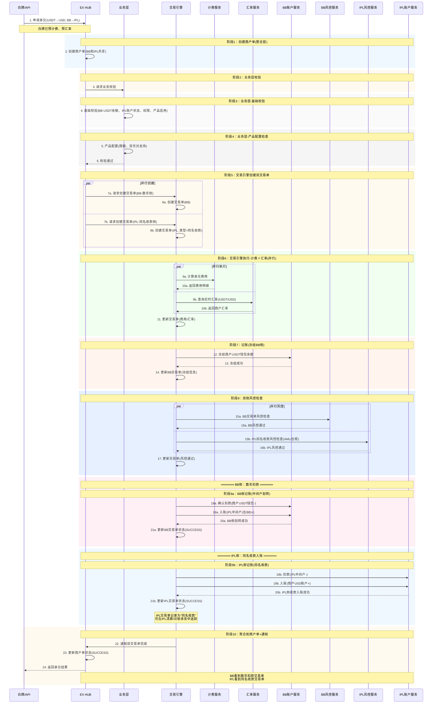
```mermaid
sequenceDiagram
    participant WP as 白牌/API
    participant HUB as EX HUB
    participant BL as 业务层
    participant TE as 交易引擎
    participant Pricing as 计费服务
    participant FX as 汇率服务
    participant BB_Account as BB账户服务
    participant BB_Risk as BB风控服务
    participant IPL_Risk as IPL风控服务
    participant IPL_Account as IPL账户服务
  
    WP->>HUB: 1. 申请承兑(USDT→USD, BB→IPL)
  
    Note over WP,HUB: 白牌已预计费、预汇率
  
    rect rgb(240, 248, 255)
        Note over HUB,IPL_Account: 阶段1：创建商户单(聚合层)
        HUB->>HUB: 2. 创建商户单(BB和IPL共享)
    end
  
    rect rgb(255, 250, 240)
        Note over HUB,IPL_Account: 阶段2：业务层校验
        HUB->>BL: 3. 请求业务校验
    end
  
    rect rgb(250, 250, 250)
        Note over HUB,IPL_Account: 阶段3：业务层-基础校验
        BL->>BL: 4. 基础校验(BB USDT余额、IPL账户状态、权限、产品启用)
    end
  
    rect rgb(245, 245, 245)
        Note over HUB,IPL_Account: 阶段4：业务层-产品配置检查
        BL->>BL: 5. 产品配置(限额、货币对支持)
        BL-->>HUB: 6. 校验通过
    end
  
    rect rgb(255, 250, 240)
        Note over HUB,IPL_Account: 阶段5：交易引擎创建双交易单
        par 并行创建
            HUB->>TE: 7a. 请求创建交易单(BB-数币侧)
            TE->>TE: 8a. 创建交易单(BB)
        and
            HUB->>TE: 7b. 请求创建交易单(IPL-同名收款侧)
            TE->>TE: 8b. 创建交易单(IPL, 类型=同名收款)
        end
    end
  
    rect rgb(240, 255, 240)
        Note over HUB,IPL_Account: 阶段6：交易引擎执行-计费∥汇率(并行)
        par 并行执行
            TE->>Pricing: 9a. 计算承兑费用
            Pricing-->>TE: 10a. 返回费用明细
        and
            TE->>FX: 9b. 查询实时汇率(USDT/USD)
            FX-->>TE: 10b. 返回商户汇率
        end
        TE->>TE: 11. 更新交易单(费用/汇率)
    end
  
    rect rgb(255, 245, 238)
        Note over HUB,IPL_Account: 阶段7：记账(冻结BB侧)
        TE->>BB_Account: 12. 冻结商户USDT钱包余额
        BB_Account-->>TE: 13. 冻结成功
        TE->>TE: 14. 更新BB交易单(冻结信息)
    end
  
    rect rgb(230, 240, 255)
        Note over HUB,IPL_Account: 阶段8：双侧风控检查
        par 并行风控
            TE->>BB_Risk: 15a. BB交易单风控检查
            BB_Risk-->>TE: 16a. BB风控通过
        and
            TE->>IPL_Risk: 15b. IPL同名收款风控检查(AML/合规)
            IPL_Risk-->>TE: 16b. IPL风控通过
        end
        TE->>TE: 17. 更新交易单(风控通过)
    end
  
    rect rgb(255, 240, 245)
        Note over HUB,IPL_Account: ══════ BB侧：数币扣款 ══════
        Note over HUB,IPL_Account: 阶段9a：BB侧记账(中间户划转)
        TE->>BB_Account: 18a. 确认扣款(商户USDT钱包-)
        TE->>BB_Account: 19a. 入账(IPL中间户(在BB)+)
        BB_Account-->>TE: 20a. BB侧划转成功
        TE->>TE: 21a. 更新BB交易单状态(SUCCESS)
    end
  
    rect rgb(240, 248, 255)
        Note over HUB,IPL_Account: ══════ IPL侧：同名收款入账 ══════
        Note over HUB,IPL_Account: 阶段9b：IPL侧记账(同名收款)
        TE->>IPL_Account: 18b. 扣款(IPL中间户-)
        TE->>IPL_Account: 19b. 入账(商户USD账户+)
        IPL_Account-->>TE: 20b. IPL侧收款入账成功
        TE->>TE: 21b. 更新IPL交易单状态(SUCCESS)
        Note over TE: IPL交易单记录为"同名收款"<br/>可在IPL清算/对账体系中追踪
    end
  
    rect rgb(255, 250, 240)
        Note over HUB,IPL_Account: 阶段10：聚合到商户单+通知
        TE->>HUB: 22. 通知双交易单完成
        HUB->>HUB: 23. 更新商户单状态(SUCCESS)
        HUB-->>WP: 24. 返回承兑结果
        Note over HUB,IPL_Account: BB看到数币扣款交易单<br/>IPL看到同名收款交易单
    end
```

**说明：**

- **BB侧**：与5.2完全一致，商户USDT钱包扣款→IPL中间户(在BB)入账
- **IPL侧**：IPL中间户扣款→商户USD账户入账，但**交易类型记录为"同名收款"**
- **IPL同名收款的含义**：
  - 付款人 = 商户自己（从BB数币钱包出）
  - 收款人 = 商户自己（IPL法币账户）
  - IPL视角：这是一笔合规的同名入账，需走IPL收款合规流程
- **IPL清算可追踪**：IPL侧产生完整的收款交易记录，可在清算中心对账
- **风控差异**：IPL侧走收款合规流程（AML检查），不是简单的自动通过

---

### 5.2.2 IPL/BB间法币账户互转

**场景：** 商户在IPL和BB都有法币账户，需要在两个SP之间转移法币余额（如IPL USD → BB USD，或BB USD → IPL USD）。

**单据结构：**

```
商户单 M001 (USD互转, IPL→BB)  ← BB和IPL共享
    ├── 交易单 T001 (IPL): 出款侧 — IPL商户USD账户扣款，入到BB中间户(在IPL)
    └── 交易单 T002 (BB): 入款侧 — IPL中间户(在BB)扣款，入到BB商户USD账户
```

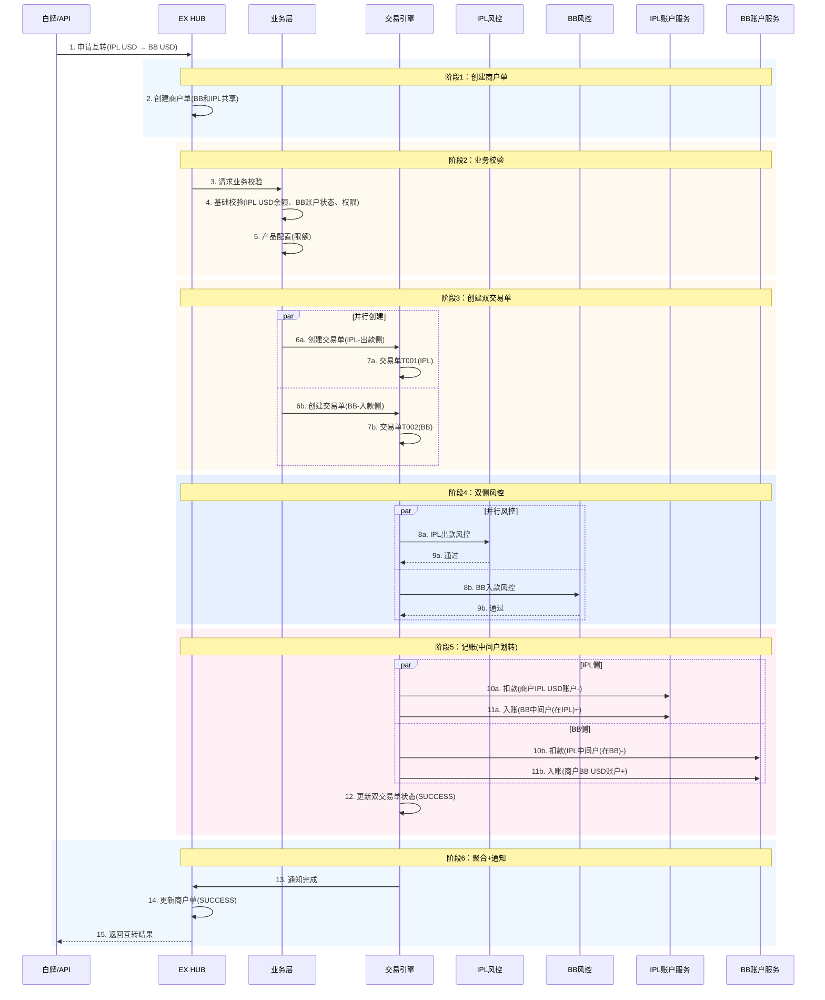
```mermaid
sequenceDiagram
    participant WP as 白牌/API
    participant HUB as EX HUB
    participant BL as 业务层
    participant TE as 交易引擎
    participant IPL_Risk as IPL风控
    participant BB_Risk as BB风控
    participant IPL_Account as IPL账户服务
    participant BB_Account as BB账户服务
  
    WP->>HUB: 1. 申请互转(IPL USD → BB USD)
  
    rect rgb(240, 248, 255)
        Note over HUB,BB_Account: 阶段1：创建商户单
        HUB->>HUB: 2. 创建商户单(BB和IPL共享)
    end
  
    rect rgb(255, 250, 240)
        Note over HUB,BB_Account: 阶段2：业务校验
        HUB->>BL: 3. 请求业务校验
        BL->>BL: 4. 基础校验(IPL USD余额、BB账户状态、权限)
        BL->>BL: 5. 产品配置(限额)
    end
  
    rect rgb(255, 250, 240)
        Note over HUB,BB_Account: 阶段3：创建双交易单
        par 并行创建
            BL->>TE: 6a. 创建交易单(IPL-出款侧)
            TE->>TE: 7a. 交易单T001(IPL)
        and
            BL->>TE: 6b. 创建交易单(BB-入款侧)
            TE->>TE: 7b. 交易单T002(BB)
        end
    end
  
    rect rgb(230, 240, 255)
        Note over HUB,BB_Account: 阶段4：双侧风控
        par 并行风控
            TE->>IPL_Risk: 8a. IPL出款风控
            IPL_Risk-->>TE: 9a. 通过
        and
            TE->>BB_Risk: 8b. BB入款风控
            BB_Risk-->>TE: 9b. 通过
        end
    end
  
    rect rgb(255, 240, 245)
        Note over HUB,BB_Account: 阶段5：记账(中间户划转)
        par IPL侧
            TE->>IPL_Account: 10a. 扣款(商户IPL USD账户-)
            TE->>IPL_Account: 11a. 入账(BB中间户(在IPL)+)
        and BB侧
            TE->>BB_Account: 10b. 扣款(IPL中间户(在BB)-)
            TE->>BB_Account: 11b. 入账(商户BB USD账户+)
        end
        TE->>TE: 12. 更新双交易单状态(SUCCESS)
    end
  
    rect rgb(240, 248, 255)
        Note over HUB,BB_Account: 阶段6：聚合+通知
        TE->>HUB: 13. 通知完成
        HUB->>HUB: 14. 更新商户单(SUCCESS)
        HUB-->>WP: 15. 返回互转结果
    end
```

**说明：**

- **商户发起，1个商户单，2笔交易单**（IPL出款1笔 + BB入款1笔）
- **双侧风控**：IPL出款风控 + BB入款风控，各自独立
- **中间户划转**：通过IPL/BB各自的中间户完成跨SP资金流转
- **反向互转**（BB→IPL）逻辑相同，方向相反

---

### 5.2.3 BB Off-Ramp 通过IPL出款（3笔交易单）

**场景：** 商户持有BB USDT，要Off-Ramp换成USD并通过IPL法币付款出去。

**单据结构（3笔交易单）：**

```
商户单 M001 (Off-Ramp: USDT→USD→付款)  ← BB和IPL共享
    ├── 交易单 T001 (BB): 承兑 — BB USDT→USD承兑
    ├── 交易单 T002 (IPL): 入账 — 承兑后USD入到IPL法币账户
    └── 交易单 T003 (IPL): 付款 — IPL USD付款给收款人
```

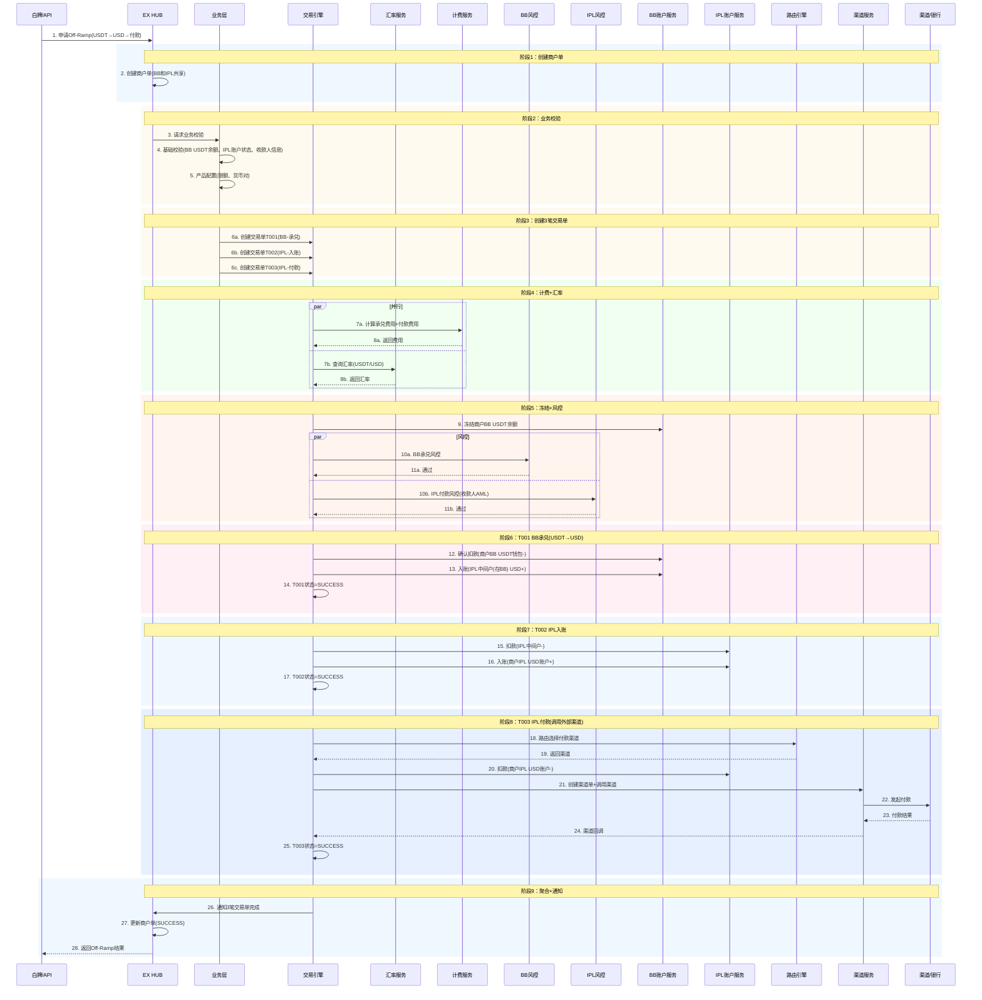
```mermaid
sequenceDiagram
    participant WP as 白牌/API
    participant HUB as EX HUB
    participant BL as 业务层
    participant TE as 交易引擎
    participant FX as 汇率服务
    participant Pricing as 计费服务
    participant BB_Risk as BB风控
    participant IPL_Risk as IPL风控
    participant BB_Account as BB账户服务
    participant IPL_Account as IPL账户服务
    participant Router as 路由引擎
    participant CO as 渠道服务
    participant Channel as 渠道/银行
  
    WP->>HUB: 1. 申请Off-Ramp(USDT→USD→付款)
  
    rect rgb(240, 248, 255)
        Note over HUB,Channel: 阶段1：创建商户单
        HUB->>HUB: 2. 创建商户单(BB和IPL共享)
    end
  
    rect rgb(255, 250, 240)
        Note over HUB,Channel: 阶段2：业务校验
        HUB->>BL: 3. 请求业务校验
        BL->>BL: 4. 基础校验(BB USDT余额、IPL账户状态、收款人信息)
        BL->>BL: 5. 产品配置(限额、货币对)
    end
  
    rect rgb(255, 250, 240)
        Note over HUB,Channel: 阶段3：创建3笔交易单
        BL->>TE: 6a. 创建交易单T001(BB-承兑)
        BL->>TE: 6b. 创建交易单T002(IPL-入账)
        BL->>TE: 6c. 创建交易单T003(IPL-付款)
    end
  
    rect rgb(240, 255, 240)
        Note over HUB,Channel: 阶段4：计费+汇率
        par 并行
            TE->>Pricing: 7a. 计算承兑费用+付款费用
            Pricing-->>TE: 8a. 返回费用
        and
            TE->>FX: 7b. 查询汇率(USDT/USD)
            FX-->>TE: 8b. 返回汇率
        end
    end
  
    rect rgb(255, 245, 238)
        Note over HUB,Channel: 阶段5：冻结+风控
        TE->>BB_Account: 9. 冻结商户BB USDT余额
        par 风控
            TE->>BB_Risk: 10a. BB承兑风控
            BB_Risk-->>TE: 11a. 通过
        and
            TE->>IPL_Risk: 10b. IPL付款风控(收款人AML)
            IPL_Risk-->>TE: 11b. 通过
        end
    end
  
    rect rgb(255, 240, 245)
        Note over HUB,Channel: 阶段6：T001 BB承兑(USDT→USD)
        TE->>BB_Account: 12. 确认扣款(商户BB USDT钱包-)
        TE->>BB_Account: 13. 入账(IPL中间户(在BB) USD+)
        TE->>TE: 14. T001状态=SUCCESS
    end
  
    rect rgb(240, 248, 255)
        Note over HUB,Channel: 阶段7：T002 IPL入账
        TE->>IPL_Account: 15. 扣款(IPL中间户-)
        TE->>IPL_Account: 16. 入账(商户IPL USD账户+)
        TE->>TE: 17. T002状态=SUCCESS
    end
  
    rect rgb(230, 240, 255)
        Note over HUB,Channel: 阶段8：T003 IPL付款(调用外部渠道)
        TE->>Router: 18. 路由选择付款渠道
        Router-->>TE: 19. 返回渠道
        TE->>IPL_Account: 20. 扣款(商户IPL USD账户-)
        TE->>CO: 21. 创建渠道单+调用渠道
        CO->>Channel: 22. 发起付款
        Channel-->>CO: 23. 付款结果
        CO-->>TE: 24. 渠道回调
        TE->>TE: 25. T003状态=SUCCESS
    end
  
    rect rgb(240, 248, 255)
        Note over HUB,Channel: 阶段9：聚合+通知
        TE->>HUB: 26. 通知3笔交易单完成
        HUB->>HUB: 27. 更新商户单(SUCCESS)
        HUB-->>WP: 28. 返回Off-Ramp结果
    end
```

**说明：**

- **商户发起，1个商户单，3笔交易单**：BB承兑1笔 + IPL入账1笔 + IPL付款1笔
- **T001(BB承兑)**：BB USDT→USD，通过中间户划转到IPL
- **T002(IPL入账)**：中间户→商户IPL USD账户
- **T003(IPL付款)**：商户IPL USD账户→外部收款人，调用外部渠道，有渠道单
- **风控**：BB承兑风控 + IPL付款风控（收款人AML），各自独立
- **T001→T002串行**（承兑完才能入账），**T003依赖T002**（入账后才能付款）

---

### 5.2.4 IPL On-Ramp 到BB（3笔交易单）

**场景：** 商户通过IPL VA收款收到USD，然后On-Ramp换成USDT到BB数币钱包。

**单据结构（3笔交易单）：**

```
商户单 M001 (On-Ramp: VA收款→USD→USDT)  ← BB和IPL共享
    ├── 交易单 T001 (IPL): VA同名充值/收款 — 外部USD入到IPL法币账户
    ├── 交易单 T002 (IPL): 同名提现转出 — IPL USD转到BB
    └── 交易单 T003 (BB): 承兑 — BB USD→USDT承兑
```

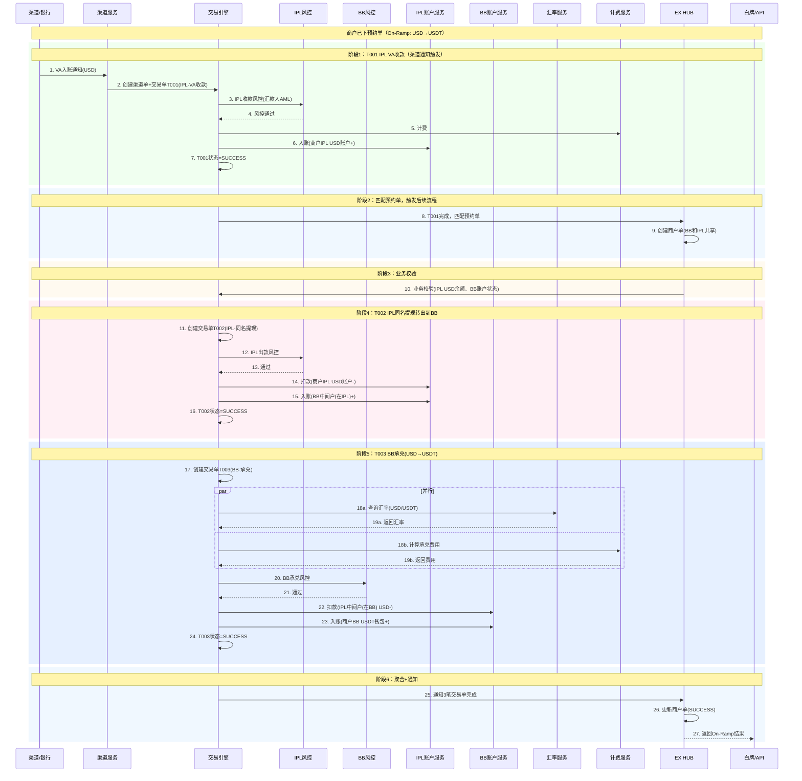
```mermaid
sequenceDiagram
    participant Channel as 渠道/银行
    participant CO as 渠道服务
    participant TE as 交易引擎
    participant IPL_Risk as IPL风控
    participant BB_Risk as BB风控
    participant IPL_Account as IPL账户服务
    participant BB_Account as BB账户服务
    participant FX as 汇率服务
    participant Pricing as 计费服务
    participant HUB as EX HUB
    participant WP as 白牌/API
  
    Note over Channel,WP: 商户已下预约单（On-Ramp: USD→USDT）
  
    rect rgb(240, 255, 240)
        Note over Channel,WP: 阶段1：T001 IPL VA收款（渠道通知触发）
        Channel->>CO: 1. VA入账通知(USD)
        CO->>TE: 2. 创建渠道单+交易单T001(IPL-VA收款)
        TE->>IPL_Risk: 3. IPL收款风控(汇款人AML)
        IPL_Risk-->>TE: 4. 风控通过
        TE->>Pricing: 5. 计费
        TE->>IPL_Account: 6. 入账(商户IPL USD账户+)
        TE->>TE: 7. T001状态=SUCCESS
    end
  
    rect rgb(240, 248, 255)
        Note over Channel,WP: 阶段2：匹配预约单，触发后续流程
        TE->>HUB: 8. T001完成，匹配预约单
        HUB->>HUB: 9. 创建商户单(BB和IPL共享)
    end
  
    rect rgb(255, 250, 240)
        Note over Channel,WP: 阶段3：业务校验
        HUB->>TE: 10. 业务校验(IPL USD余额、BB账户状态)
    end
  
    rect rgb(255, 240, 245)
        Note over Channel,WP: 阶段4：T002 IPL同名提现转出到BB
        TE->>TE: 11. 创建交易单T002(IPL-同名提现)
        TE->>IPL_Risk: 12. IPL出款风控
        IPL_Risk-->>TE: 13. 通过
        TE->>IPL_Account: 14. 扣款(商户IPL USD账户-)
        TE->>IPL_Account: 15. 入账(BB中间户(在IPL)+)
        TE->>TE: 16. T002状态=SUCCESS
    end
  
    rect rgb(230, 240, 255)
        Note over Channel,WP: 阶段5：T003 BB承兑(USD→USDT)
        TE->>TE: 17. 创建交易单T003(BB-承兑)
        par 并行
            TE->>FX: 18a. 查询汇率(USD/USDT)
            FX-->>TE: 19a. 返回汇率
        and
            TE->>Pricing: 18b. 计算承兑费用
            Pricing-->>TE: 19b. 返回费用
        end
        TE->>BB_Risk: 20. BB承兑风控
        BB_Risk-->>TE: 21. 通过
        TE->>BB_Account: 22. 扣款(IPL中间户(在BB) USD-)
        TE->>BB_Account: 23. 入账(商户BB USDT钱包+)
        TE->>TE: 24. T003状态=SUCCESS
    end
  
    rect rgb(240, 248, 255)
        Note over Channel,WP: 阶段6：聚合+通知
        TE->>HUB: 25. 通知3笔交易单完成
        HUB->>HUB: 26. 更新商户单(SUCCESS)
        HUB-->>WP: 27. 返回On-Ramp结果
    end
```

**说明：**

- **1个商户单，3笔交易单**：IPL VA收款1笔 + IPL同名提现转出1笔 + BB承兑1笔
- **T001(IPL VA收款)**：渠道通知触发，外部USD入到商户IPL法币账户，走IPL收款风控
- **T002(IPL同名提现)**：商户IPL USD→BB中间户，走IPL出款风控
- **T003(BB承兑)**：BB中间户USD→商户BB USDT钱包，走BB承兑风控
- **预约单模式**：商户先下预约单，VA收款到账后自动触发T002+T003
- **T001→T002→T003串行**：收款完成才能提现，提现完成才能承兑
- **每笔交易单各自独立风控**

---

### 5.2.5 BB自己Off-Ramp直接出款（2笔交易单）

**场景：** 商户持有BB USDT，Off-Ramp承兑为USD后，直接通过BB的法币通道（XPAY等）付款出去，全程在BB内部完成，不经过IPL。

**单据结构（2笔交易单）：**

```
商户单 M001 (Off-Ramp: USDT→USD→付款)  ← 仅BB
    ├── 交易单 T001 (BB): 承兑 — BB USDT→USD
    └── 交易单 T002 (BB): 付款 — BB USD付款给收款人（调用XPAY等外部渠道）
```

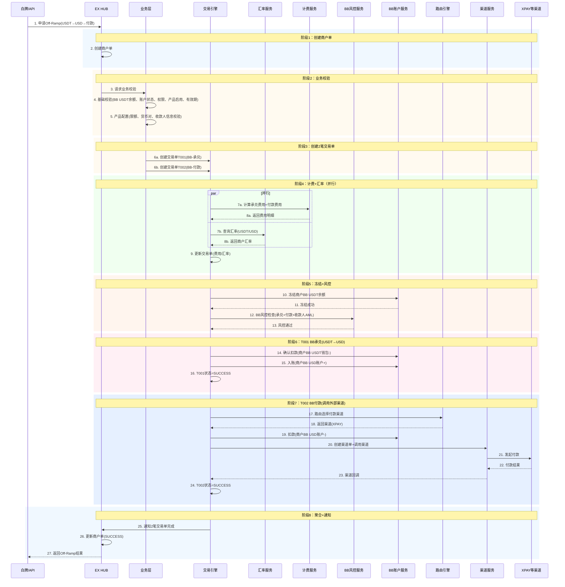
```mermaid
sequenceDiagram
    participant WP as 白牌/API
    participant HUB as EX HUB
    participant BL as 业务层
    participant TE as 交易引擎
    participant FX as 汇率服务
    participant Pricing as 计费服务
    participant Risk as BB风控服务
    participant Account as BB账户服务
    participant Router as 路由引擎
    participant CO as 渠道服务
    participant Channel as XPAY等渠道
  
    WP->>HUB: 1. 申请Off-Ramp(USDT→USD→付款)
  
    rect rgb(240, 248, 255)
        Note over HUB,Channel: 阶段1：创建商户单
        HUB->>HUB: 2. 创建商户单
    end
  
    rect rgb(255, 250, 240)
        Note over HUB,Channel: 阶段2：业务校验
        HUB->>BL: 3. 请求业务校验
        BL->>BL: 4. 基础校验(BB USDT余额、账户状态、权限、产品启用、有效期)
        BL->>BL: 5. 产品配置(限额、货币对、收款人信息校验)
    end
  
    rect rgb(255, 250, 240)
        Note over HUB,Channel: 阶段3：创建2笔交易单
        BL->>TE: 6a. 创建交易单T001(BB-承兑)
        BL->>TE: 6b. 创建交易单T002(BB-付款)
    end
  
    rect rgb(240, 255, 240)
        Note over HUB,Channel: 阶段4：计费+汇率（并行）
        par 并行
            TE->>Pricing: 7a. 计算承兑费用+付款费用
            Pricing-->>TE: 8a. 返回费用明细
        and
            TE->>FX: 7b. 查询汇率(USDT/USD)
            FX-->>TE: 8b. 返回商户汇率
        end
        TE->>TE: 9. 更新交易单(费用/汇率)
    end
  
    rect rgb(255, 245, 238)
        Note over HUB,Channel: 阶段5：冻结+风控
        TE->>Account: 10. 冻结商户BB USDT余额
        Account-->>TE: 11. 冻结成功
        TE->>Risk: 12. BB风控检查(承兑+付款+收款人AML)
        Risk-->>TE: 13. 风控通过
    end
  
    rect rgb(255, 240, 245)
        Note over HUB,Channel: 阶段6：T001 BB承兑(USDT→USD)
        TE->>Account: 14. 确认扣款(商户BB USDT钱包-)
        TE->>Account: 15. 入账(商户BB USD账户+)
        TE->>TE: 16. T001状态=SUCCESS
    end
  
    rect rgb(230, 240, 255)
        Note over HUB,Channel: 阶段7：T002 BB付款(调用外部渠道)
        TE->>Router: 17. 路由选择付款渠道
        Router-->>TE: 18. 返回渠道(XPAY)
        TE->>Account: 19. 扣款(商户BB USD账户-)
        TE->>CO: 20. 创建渠道单+调用渠道
        CO->>Channel: 21. 发起付款
        Channel-->>CO: 22. 付款结果
        CO-->>TE: 23. 渠道回调
        TE->>TE: 24. T002状态=SUCCESS
    end
  
    rect rgb(240, 248, 255)
        Note over HUB,Channel: 阶段8：聚合+通知
        TE->>HUB: 25. 通知2笔交易单完成
        HUB->>HUB: 26. 更新商户单(SUCCESS)
        HUB-->>WP: 27. 返回Off-Ramp结果
    end
```

**说明：**

- **商户发起，1个商户单，2笔交易单**：BB承兑1笔 + BB付款1笔，全程BB内部
- **T001(BB承兑)**：BB USDT→USD，内部账户划转（钱包→法币账户）
- **T002(BB付款)**：BB USD→外部收款人，调用XPAY等外部渠道，有渠道单
- **业务校验**：余额、账户状态、权限、产品启用、限额、收款人信息
- **风控**：BB统一风控（承兑风控+付款风控+收款人AML）
- **计费**：承兑费用+付款费用分别计算
- **T001→T002串行**：承兑完成后才能付款

---

### 5.2.6 BB自己On-Ramp直接入金（2笔交易单）

**场景：** 商户通过BB的法币通道（XPAY等）收到USD，然后On-Ramp承兑为USDT到BB数币钱包，全程在BB内部完成，不经过IPL。

**单据结构（2笔交易单）：**

```
商户单 M001 (On-Ramp: 收款USD→USDT)  ← 仅BB
    ├── 交易单 T001 (BB): 收款 — 外部USD入到BB法币账户（渠道通知触发）
    └── 交易单 T002 (BB): 承兑 — BB USD→USDT
```

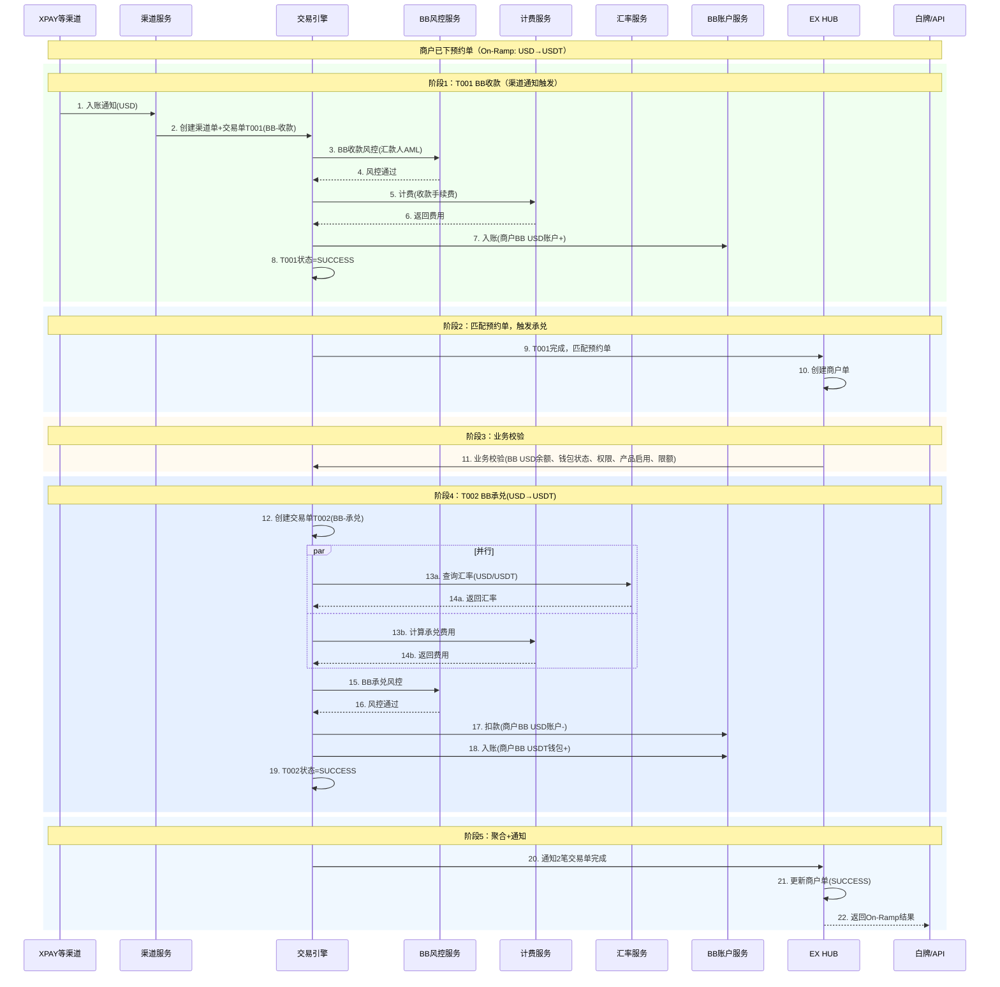
```mermaid
sequenceDiagram
    participant Channel as XPAY等渠道
    participant CO as 渠道服务
    participant TE as 交易引擎
    participant Risk as BB风控服务
    participant Pricing as 计费服务
    participant FX as 汇率服务
    participant Account as BB账户服务
    participant HUB as EX HUB
    participant WP as 白牌/API
  
    Note over Channel,WP: 商户已下预约单（On-Ramp: USD→USDT）
  
    rect rgb(240, 255, 240)
        Note over Channel,WP: 阶段1：T001 BB收款（渠道通知触发）
        Channel->>CO: 1. 入账通知(USD)
        CO->>TE: 2. 创建渠道单+交易单T001(BB-收款)
        TE->>Risk: 3. BB收款风控(汇款人AML)
        Risk-->>TE: 4. 风控通过
        TE->>Pricing: 5. 计费(收款手续费)
        Pricing-->>TE: 6. 返回费用
        TE->>Account: 7. 入账(商户BB USD账户+)
        TE->>TE: 8. T001状态=SUCCESS
    end
  
    rect rgb(240, 248, 255)
        Note over Channel,WP: 阶段2：匹配预约单，触发承兑
        TE->>HUB: 9. T001完成，匹配预约单
        HUB->>HUB: 10. 创建商户单
    end
  
    rect rgb(255, 250, 240)
        Note over Channel,WP: 阶段3：业务校验
        HUB->>TE: 11. 业务校验(BB USD余额、钱包状态、权限、产品启用、限额)
    end
  
    rect rgb(230, 240, 255)
        Note over Channel,WP: 阶段4：T002 BB承兑(USD→USDT)
        TE->>TE: 12. 创建交易单T002(BB-承兑)
        par 并行
            TE->>FX: 13a. 查询汇率(USD/USDT)
            FX-->>TE: 14a. 返回汇率
        and
            TE->>Pricing: 13b. 计算承兑费用
            Pricing-->>TE: 14b. 返回费用
        end
        TE->>Risk: 15. BB承兑风控
        Risk-->>TE: 16. 风控通过
        TE->>Account: 17. 扣款(商户BB USD账户-)
        TE->>Account: 18. 入账(商户BB USDT钱包+)
        TE->>TE: 19. T002状态=SUCCESS
    end
  
    rect rgb(240, 248, 255)
        Note over Channel,WP: 阶段5：聚合+通知
        TE->>HUB: 20. 通知2笔交易单完成
        HUB->>HUB: 21. 更新商户单(SUCCESS)
        HUB-->>WP: 22. 返回On-Ramp结果
    end
```

**说明：**

- **1个商户单，2笔交易单**：BB收款1笔 + BB承兑1笔，全程BB内部
- **T001(BB收款)**：渠道通知触发，外部USD入到商户BB法币账户，走BB收款风控（汇款人AML）
- **T002(BB承兑)**：BB USD→USDT，内部账户划转（法币账户→钱包），走BB承兑风控
- **预约单模式**：商户先下预约单，收款到账后自动触发T002承兑
- **业务校验**：余额、钱包状态、权限、产品启用、限额
- **风控**：T001收款风控 + T002承兑风控，各自独立
- **计费**：收款手续费 + 承兑费用分别计算
- **T001→T002串行**：收款完成后才能承兑

---

### 5.3 出金（调用外部渠道）

**说明：**

- **出金需要调用外部渠道**：银行/PSP
- **有渠道单**：记录外部渠道调用信息
- **流程与法币付款类似**：计费→记账(冻结)→风控→路由→渠道→确认记账

---

## 退款流程

### 7.1 付款退款流程

#### 7.1.1 IPL法币出款退款

**场景：** IPL法币付款失败或需退款（如银行退回、收款人信息错误等）

**退款方式：** 原路退回到商户法币账户

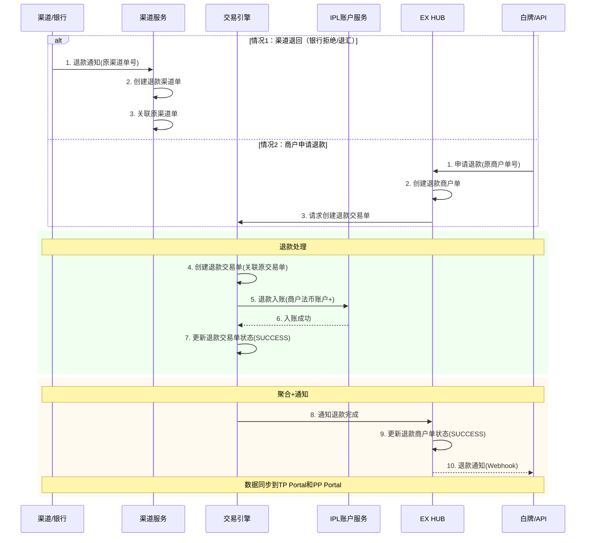
```mermaid
sequenceDiagram
    participant Channel as 渠道/银行
    participant CO as 渠道服务
    participant TE as 交易引擎
    participant Account as IPL账户服务
    participant HUB as EX HUB
    participant WP as 白牌/API
  
    alt 情况1：渠道退回（银行拒绝/退汇）
        Channel->>CO: 1. 退款通知(原渠道单号)
        CO->>CO: 2. 创建退款渠道单
        CO->>CO: 3. 关联原渠道单
    else 情况2：商户申请退款
        WP->>HUB: 1. 申请退款(原商户单号)
        HUB->>HUB: 2. 创建退款商户单
        HUB->>TE: 3. 请求创建退款交易单
    end
  
    rect rgb(240, 255, 240)
        Note over Channel,WP: 退款处理
        TE->>TE: 4. 创建退款交易单(关联原交易单)
        TE->>Account: 5. 退款入账(商户法币账户+)
        Account-->>TE: 6. 入账成功
        TE->>TE: 7. 更新退款交易单状态(SUCCESS)
    end
  
    rect rgb(255, 250, 240)
        Note over Channel,WP: 聚合+通知
        TE->>HUB: 8. 通知退款完成
        HUB->>HUB: 9. 更新退款商户单状态(SUCCESS)
        HUB-->>WP: 10. 退款通知(Webhook)
        Note over Channel,WP: 数据同步到TP Portal和PP Portal
    end
```

---

#### 7.1.2 BB提币退款

**场景：** BB提币失败（如链上转账失败、目标地址无效等）

**退款方式：** 原路退回到商户数币钱包

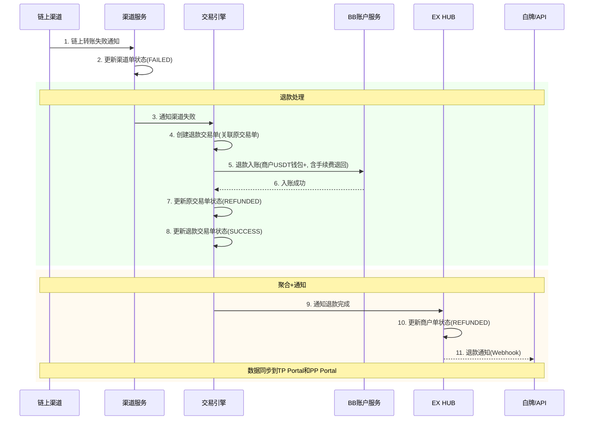
```mermaid
sequenceDiagram
    participant Channel as 链上渠道
    participant CO as 渠道服务
    participant TE as 交易引擎
    participant Account as BB账户服务
    participant HUB as EX HUB
    participant WP as 白牌/API
  
    Channel->>CO: 1. 链上转账失败通知
    CO->>CO: 2. 更新渠道单状态(FAILED)
  
    rect rgb(240, 255, 240)
        Note over Channel,WP: 退款处理
        CO->>TE: 3. 通知渠道失败
        TE->>TE: 4. 创建退款交易单(关联原交易单)
        TE->>Account: 5. 退款入账(商户USDT钱包+, 含手续费退回)
        Account-->>TE: 6. 入账成功
        TE->>TE: 7. 更新原交易单状态(REFUNDED)
        TE->>TE: 8. 更新退款交易单状态(SUCCESS)
    end
  
    rect rgb(255, 250, 240)
        Note over Channel,WP: 聚合+通知
        TE->>HUB: 9. 通知退款完成
        HUB->>HUB: 10. 更新商户单状态(REFUNDED)
        HUB-->>WP: 11. 退款通知(Webhook)
        Note over Channel,WP: 数据同步到TP Portal和PP Portal
    end
```

---

提币失败：风控拒绝，暂不考虑收费；

渠道处理失败，重试，原渠道单失败：不收费；

退票线下处理；


#### 7.1.3 BB数币钱包付款退款（USDC→USD退款）

退回：客户可选退款到法币/ 数币；
**场景：** BB数币钱包直接付款（4.8流程）失败或需退款

**退款方式：** 按实时汇率将USD退回到商户USDT钱包（不退法币，退数币）

**本期规则：**

- 退款**按退款时实时汇率换算回USDT，不按原交易汇率**
- **退款金额 = 原USD金额 ÷ 实时USDT/USD汇率**
- 退回到商户USDT钱包后，商户自行决定：提币 or 换个收款人重新付款

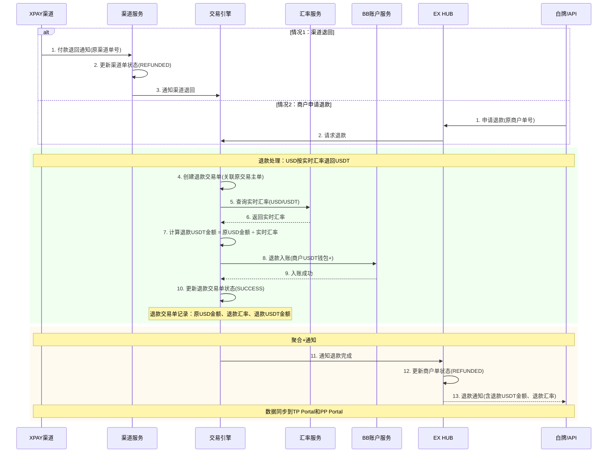
```mermaid
sequenceDiagram
    participant Channel as XPAY渠道
    participant CO as 渠道服务
    participant TE as 交易引擎
    participant FX as 汇率服务
    participant Account as BB账户服务
    participant HUB as EX HUB
    participant WP as 白牌/API
  
    alt 情况1：渠道退回
        Channel->>CO: 1. 付款退回通知(原渠道单号)
        CO->>CO: 2. 更新渠道单状态(REFUNDED)
        CO->>TE: 3. 通知渠道退回
    else 情况2：商户申请退款
        WP->>HUB: 1. 申请退款(原商户单号)
        HUB->>TE: 2. 请求退款
    end
  
    rect rgb(240, 255, 240)
        Note over Channel,WP: 退款处理：USD按实时汇率退回USDT
        TE->>TE: 4. 创建退款交易单(关联原交易主单)
        TE->>FX: 5. 查询实时汇率(USD/USDT)
        FX-->>TE: 6. 返回实时汇率
        TE->>TE: 7. 计算退款USDT金额 = 原USD金额 ÷ 实时汇率
        TE->>Account: 8. 退款入账(商户USDT钱包+)
        Account-->>TE: 9. 入账成功
        TE->>TE: 10. 更新退款交易单状态(SUCCESS)
        Note over TE: 退款交易单记录：原USD金额、退款汇率、退款USDT金额
    end
  
    rect rgb(255, 250, 240)
        Note over Channel,WP: 聚合+通知
        TE->>HUB: 11. 通知退款完成
        HUB->>HUB: 12. 更新商户单状态(REFUNDED)
        HUB-->>WP: 13. 退款通知(含退款USDT金额、退款汇率)
        Note over Channel,WP: 数据同步到TP Portal和PP Portal
    end
```

**退款后商户操作：**

```
退款USDT到达商户钱包后：
┌─────────────────────────────────────────┐
│  商户USDT钱包余额已更新                   │
│                                          │
│  选项1：提币到外部地址                     │
│  → 走4.5提币流程                          │
│                                          │
│  选项2：换个收款人重新付款                  │
│  → 走4.8 BB数币钱包直接付款流程            │
│                                          │
│  选项3：承兑为法币留在法币账户              │
│  → 走5.1纯BB承兑流程                      │
└─────────────────────────────────────────┘
```

**说明：**

- 本期不支持退回法币（因为原交易是从USDT出发，退款也退回USDT）
- 退款汇率差由商户承担（实时汇率可能与原交易汇率不同）
- 退款交易单独立计费（本期退款不收手续费）

---

### 7.2 收款退款流程

#### 7.2.1 IPL法币收款退款

**场景：** IPL法币收款（VA收款）需退款给汇款人

**退款发起：** 销售（EX代发起） → 清算确认 → 执行退款

> 参考现有IPL退款流程：销售发起，清算确认。在EX平台中，由销售在EX系统代发起退款申请。

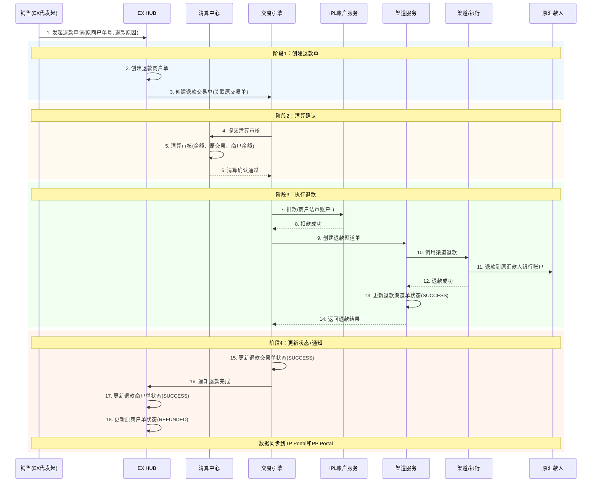
```mermaid
sequenceDiagram
    participant Sales as 销售(EX代发起)
    participant HUB as EX HUB
    participant Settlement as 清算中心
    participant TE as 交易引擎
    participant Account as IPL账户服务
    participant CO as 渠道服务
    participant Channel as 渠道/银行
    participant Remitter as 原汇款人
  
    Sales->>HUB: 1. 发起退款申请(原商户单号, 退款原因)
  
    rect rgb(240, 248, 255)
        Note over Sales,Remitter: 阶段1：创建退款单
        HUB->>HUB: 2. 创建退款商户单
        HUB->>TE: 3. 创建退款交易单(关联原交易单)
    end
  
    rect rgb(255, 250, 240)
        Note over Sales,Remitter: 阶段2：清算确认
        TE->>Settlement: 4. 提交清算审核
        Settlement->>Settlement: 5. 清算审核(金额、原交易、商户余额)
        Settlement-->>TE: 6. 清算确认通过
    end
  
    rect rgb(240, 255, 240)
        Note over Sales,Remitter: 阶段3：执行退款
        TE->>Account: 7. 扣款(商户法币账户-)
        Account-->>TE: 8. 扣款成功
        TE->>CO: 9. 创建退款渠道单
        CO->>Channel: 10. 调用渠道退款
        Channel->>Remitter: 11. 退款到原汇款人银行账户
        Channel-->>CO: 12. 退款成功
        CO->>CO: 13. 更新退款渠道单状态(SUCCESS)
        CO-->>TE: 14. 返回退款结果
    end
  
    rect rgb(255, 245, 238)
        Note over Sales,Remitter: 阶段4：更新状态+通知
        TE->>TE: 15. 更新退款交易单状态(SUCCESS)
        TE->>HUB: 16. 通知退款完成
        HUB->>HUB: 17. 更新退款商户单状态(SUCCESS)
        HUB->>HUB: 18. 更新原商户单状态(REFUNDED)
        Note over Sales,Remitter: 数据同步到TP Portal和PP Portal
    end
```

---

#### 7.2.2 BB收币退款

**场景：** BB链上充币后，因合规/风控原因需退回

**两种情况：**

渠道拦截：通知事项出来
1） 渠道1通知：线下手动退；

2）渠道2不通知：线下登录网银退款；


```
情况1：渠道直接拦截 → 退回原地址（当天处理）
情况2：渠道未拦截，合规拦截 →
    2a) 退回原地址（当天处理）
    2b) 退回非原地址（停留1周处理，需识别非原地址）
```

```mermaid
sequenceDiagram
    participant Sender as 发送方
    participant Channel as 链上渠道
    participant CO as 渠道服务
    participant Compliance as 合规服务
    participant Sales as 销售
    participant TE as 交易引擎
    participant Account as BB账户服务
    participant HUB as EX HUB
  
    Sender->>Channel: 0. 链上转入USDT
  
    alt 情况1：渠道直接拦截退回原地址
        rect rgb(255, 240, 240)
            Note over Sender,HUB: 渠道拦截（当天处理）
            Channel->>Channel: 1. 渠道风控拦截
            Channel->>CO: 2. 通知拦截(原因)
            CO->>CO: 3. 创建渠道单(状态:INTERCEPTED)
            Note over CO: 合规在渠道后台当天直接退回
            Channel->>Sender: 4. 退回原地址
            CO->>CO: 5. 更新渠道单状态(REFUNDED)
            CO->>HUB: 6. 通知拦截退回
            Note over HUB: 无商户单/交易单产生（渠道层直接退回）
        end
  
    else 情况2：渠道未拦截，合规拦截
        rect rgb(240, 248, 255)
            Note over Sender,HUB: 渠道通过，进入EX流程
            Channel->>CO: 1. 入账通知
            CO->>CO: 2. 创建渠道单(SUCCESS)
            CO->>TE: 3. 请求创建交易单
            TE->>TE: 4. 创建交易单
        end
  
        rect rgb(255, 250, 240)
            Note over Sender,HUB: 合规检查
            TE->>Compliance: 5. 合规检查(来源地址/AML)
            Compliance-->>TE: 6. 合规拒绝
            TE->>Account: 7. 入账但冻结(商户USDT钱包+, 冻结状态)
            Account-->>TE: 8. 冻结入账成功
        end
  
        rect rgb(255, 245, 238)
            Note over Sender,HUB: 合规联系销售确认退回
            Compliance->>Sales: 9. 通知销售：需退回，确认退回地址
        end
  
        alt 情况2a：退回原地址（当天处理）
            rect rgb(240, 255, 240)
                Note over Sender,HUB: 退回原地址
                Sales-->>Compliance: 10a. 确认退回原地址
                Compliance->>TE: 11a. 发起退款(原地址)
                TE->>Account: 12a. 解冻并扣款(商户USDT钱包-)
                Account-->>TE: 13a. 扣款成功
                TE->>CO: 14a. 创建退款渠道单
                CO->>Channel: 15a. 链上转账到原地址
                Channel->>Sender: 16a. USDT退回原地址
                Channel-->>CO: 17a. 退款成功
                CO-->>TE: 18a. 退款渠道单(SUCCESS)
                TE->>TE: 19a. 更新交易单状态(REFUNDED)
                TE->>HUB: 20a. 通知退款完成
                HUB->>HUB: 21a. 更新商户单状态(REFUNDED)
            end
  
        else 情况2b：退回非原地址（停留1周处理）
            rect rgb(255, 250, 240)
                Note over Sender,HUB: 退回非原地址（需识别+停留1周）
                Sales-->>Compliance: 10b. 确认退回地址(非原地址)
                Note over Compliance: ⚠️ 识别为非原地址 → 停留1周处理
                Compliance->>Compliance: 11b. 标记为非原地址退款，等待1周
                Note over Compliance: 1周后执行退款
                Compliance->>TE: 12b. 发起退款(新地址)
                TE->>Account: 13b. 解冻并扣款(商户USDT钱包-)
                Account-->>TE: 14b. 扣款成功
                TE->>CO: 15b. 创建退款渠道单
                CO->>Channel: 16b. 链上转账到新地址
                Channel-->>CO: 17b. 退款成功
                CO-->>TE: 18b. 退款渠道单(SUCCESS)
                TE->>TE: 19b. 更新交易单状态(REFUNDED)
                TE->>HUB: 20b. 通知退款完成
                HUB->>HUB: 21b. 更新商户单状态(REFUNDED)
            end
        end
    end
```

**处理时效：**

| 情况                       | 退回地址 | 处理时效 | 说明                          |
| -------------------------- | -------- | -------- | ----------------------------- |
| 情况1：渠道拦截            | 原地址   | 当天     | 合规在渠道后台直接退回        |
| 情况2a：合规拦截→原地址   | 原地址   | 当天     | 销售确认后当天处理            |
| 情况2b：合规拦截→非原地址 | 非原地址 | 1周      | 需识别非原地址，停留1周后处理 |

---

#### 7.2.3 BB收法币退款

**场景：** BB通过VA/代收付账户收到法币后，因合规/风控原因需退回

**两种情况：**

```
情况1：渠道拦截 → 联系渠道退回
情况2：合规拒绝 → 联系销售退回
    2a) 退回原汇款人（当天处理）
    2b) 退回其他人（待定）
```

```mermaid
sequenceDiagram
    participant Remitter as 汇款人
    participant Channel as 渠道(VA/代收付账户)
    participant CO as 渠道服务
    participant Compliance as 合规服务
    participant Sales as 销售
    participant TE as 交易引擎
    participant Account as BB账户服务
    participant HUB as EX HUB
  
    Remitter->>Channel: 0. 汇款到BB VA/代收付账户
  
    alt 情况1：渠道拦截
        rect rgb(255, 240, 240)
            Note over Remitter,HUB: 渠道拦截 → 联系渠道退回
            Channel->>Channel: 1. 渠道风控拦截
            Channel->>CO: 2. 通知拦截(原因)
            CO->>CO: 3. 创建渠道单(状态:INTERCEPTED)
            CO->>Sales: 4. 通知销售：渠道拦截，需联系渠道退回
            Sales->>Channel: 5. 联系渠道退回
            Channel->>Remitter: 6. 退回原汇款人
            CO->>CO: 7. 更新渠道单状态(REFUNDED)
            CO->>HUB: 8. 通知拦截退回
            Note over HUB: 无商户单/交易单产生（渠道层直接退回）
        end
  
    else 情况2：渠道通过，合规拒绝
        rect rgb(240, 248, 255)
            Note over Remitter,HUB: 渠道通过，进入EX流程
            Channel->>CO: 1. 入账通知
            CO->>CO: 2. 创建渠道单(SUCCESS)
            CO->>TE: 3. 请求创建交易单
            TE->>TE: 4. 创建交易单
        end
  
        rect rgb(255, 250, 240)
            Note over Remitter,HUB: 合规检查
            TE->>Compliance: 5. 合规检查(汇款人/AML)
            Compliance-->>TE: 6. 合规拒绝
            TE->>Account: 7. 入账但冻结(商户法币账户+, 冻结状态)
            Account-->>TE: 8. 冻结入账成功
        end
  
        rect rgb(255, 245, 238)
            Note over Remitter,HUB: 合规联系销售确认退回
            Compliance->>Sales: 9. 通知销售：合规拒绝，需退回
        end
  
        alt 情况2a：退回原汇款人（当天处理）
            rect rgb(240, 255, 240)
                Note over Remitter,HUB: 退回原汇款人
                Sales-->>Compliance: 10a. 确认退回原汇款人
                Compliance->>TE: 11a. 发起退款(原汇款人)
                TE->>Account: 12a. 解冻并扣款(商户法币账户-)
                Account-->>TE: 13a. 扣款成功
                TE->>CO: 14a. 创建退款渠道单
                CO->>Channel: 15a. 退款到原汇款人银行账户
                Channel->>Remitter: 16a. 退款到账
                Channel-->>CO: 17a. 退款成功
                CO-->>TE: 18a. 退款渠道单(SUCCESS)
                TE->>TE: 19a. 更新交易单状态(REFUNDED)
                TE->>HUB: 20a. 通知退款完成
                HUB->>HUB: 21a. 更新商户单状态(REFUNDED)
            end
  
        else 情况2b：退回其他人（待定）
            rect rgb(255, 255, 224)
                Note over Remitter,HUB: ⚠️ 退回其他人 — 待定
                Sales-->>Compliance: 10b. 确认退回其他人(提供收款信息)
                Note over Compliance: 待定：需确认审批流程和风控要求
                Note over Compliance: 本期暂不支持，后续补充
            end
        end
    end
```

**处理时效：**

| 情况                       | 退回对象 | 处理时效   | 说明               |
| -------------------------- | -------- | ---------- | ------------------ |
| 情况1：渠道拦截            | 原汇款人 | 视渠道响应 | 联系渠道退回       |
| 情况2a：合规拒绝→原汇款人 | 原汇款人 | 当天       | 销售确认后当天处理 |
| 情况2b：合规拒绝→其他人   | 其他人   | 待定       | 本期暂不支持       |

---

### 7.3 退款流程汇总

| 退款类型                        | 原交易      | 退款方式         | 退回目标     | 发起方            | 审批     |
| ------------------------------- | ----------- | ---------------- | ------------ | ----------------- | -------- |
| IPL法币出款退款                 | 4.6法币付款 | 原路退回法币账户 | 商户法币账户 | 渠道退回/商户申请 | -        |
| BB提币退款                      | 4.5提币     | 原路退回数币钱包 | 商户USDT钱包 | 渠道失败自动退回  | -        |
| BB数币钱包付款退款              | 4.8数币付款 | 实时汇率退回USDT | 商户USDT钱包 | 渠道退回/商户申请 | -        |
| IPL法币收款退款                 | 4.2 VA收款  | 退回原汇款人     | 原汇款人银行 | 销售(EX代发起)    | 清算确认 |
| BB收币退款-渠道拦截             | 4.4充币     | 渠道直接退回     | 原地址       | 合规(渠道后台)    | 当天处理 |
| BB收币退款-合规拦截(原地址)     | 4.4充币     | 链上退回         | 原地址       | 合规+销售确认     | 当天处理 |
| BB收币退款-合规拦截(非原地址)   | 4.4充币     | 链上退回         | 非原地址     | 合规+销售确认     | 停留1周  |
| BB收法币退款-渠道拦截           | BB法币收款  | 联系渠道退回     | 原汇款人     | 销售联系渠道      | 视渠道   |
| BB收法币退款-合规拒绝(原汇款人) | BB法币收款  | 退回原汇款人     | 原汇款人银行 | 合规+销售确认     | 当天处理 |
| BB收法币退款-合规拒绝(其他人)   | BB法币收款  | 待定             | 其他人       | 待定              | 待定     |

---

## 状态设计

> **注意**：
>
> - 收款人不属于交易单，收款人有独立的状态管理
> - 风控/合规是独立的工单系统，不是单据上的字段

### 6.1 商户单状态

```
CREATED ──> PROCESSING ──> SUCCESS ──> REFUNDED
                │
                └──────────> FAILED
                │
                └──────────> CANCELLED
```

| 状态       | 说明                     |
| ---------- | ------------------------ |
| CREATED    | 商户单已创建             |
| PROCESSING | 处理中（交易单执行中）   |
| SUCCESS    | 成功（所有交易单都成功） |
| FAILED     | 失败（任一交易单失败）   |
| CANCELLED  | 已取消（商户主动取消）   |
| REFUNDED   | 已退款（全额退款完成）   |

---

### 6.2 交易单状态

```
CREATED ──> PROCESSING ──> SUCCESS ──> REFUNDED
                │
                └──────────> FAILED
```

| 状态       | 说明         |
| ---------- | ------------ |
| CREATED    | 交易单已创建 |
| PROCESSING | 处理中       |
| SUCCESS    | 成功         |
| FAILED     | 失败         |
| REFUNDED   | 已退款       |

---

### 6.3 渠道单状态

```
CREATED ──> SUBMITTED ──> PROCESSING ──> SUCCESS ──> REFUNDED
                              │
                              └──────────> FAILED

渠道拦截场景：
CREATED ──> INTERCEPTED ──> REFUNDED
```

| 状态        | 说明                             |
| ----------- | -------------------------------- |
| CREATED     | 渠道单已创建                     |
| SUBMITTED   | 已提交给渠道                     |
| PROCESSING  | 渠道处理中                       |
| SUCCESS     | 渠道处理成功                     |
| FAILED      | 渠道处理失败                     |
| REFUNDED    | 已退款                           |
| INTERCEPTED | 渠道拦截（收款场景，未入账退回） |

## 总结

### 核心设计要点

| 设计点               | 说明                                             |
| -------------------- | ------------------------------------------------ |
| **3单模型**    | 商户单 → 交易单 → 渠道单，清晰的单据层级       |
| **业务侧定义** | 每种交易类型定义需要的步骤，交易引擎按定义执行   |
| **双向流程**   | 商户主动发起(商户单先) vs 渠道被动通知(渠道单先) |
| **单SP/双SP**  | 大部分交易单SP，承兑可能双SP(IPL-BB打通)         |
| **渠道单范围** | 仅BB和IPL有渠道单(EX帮对接下游)                  |
| **白牌预处理** | 预计费、预路由，提升用户体验                     |

### 交易类型汇总

| 交易类型              | 流转方向                          | SP数量 | 渠道单 | 子单              |
| --------------------- | --------------------------------- | ------ | ------ | ----------------- |
| VA申请                | 商户单→交易单→渠道单            | 单SP   | ✅     | ❌                |
| VA收款                | 渠道单→交易单→商户单            | 单SP   | ✅     | ❌                |
| 充币                  | 渠道单→交易单→商户单            | 单SP   | ✅     | ❌                |
| 提币                  | 商户单→交易单→渠道单            | 单SP   | ✅     | ❌                |
| 法币付款              | 商户单→交易单→渠道单            | 单SP   | ✅     | ❌                |
| 数币钱包付款          | 商户单→主单→子单×2→渠道单     | 单SP   | ✅     | ✅ 2笔(承兑+出款) |
| 承兑(纯BB)            | 商户单→交易单                    | 单SP   | ❌     | ❌                |
| 承兑(IPL-BB中间户)    | 商户单→交易单×2                 | 双SP   | ❌     | ❌                |
| 承兑(BB数币→IPL法币) | 商户单→交易单×2(IPL侧=同名收款) | 双SP   | ❌     | ❌                |

---

*最后更新：2026-02-11*
*文档版本：v2.2 — 新增BB数币钱包直接付款、退款流程、BB数币→IPL法币承兑(同名收款)*
