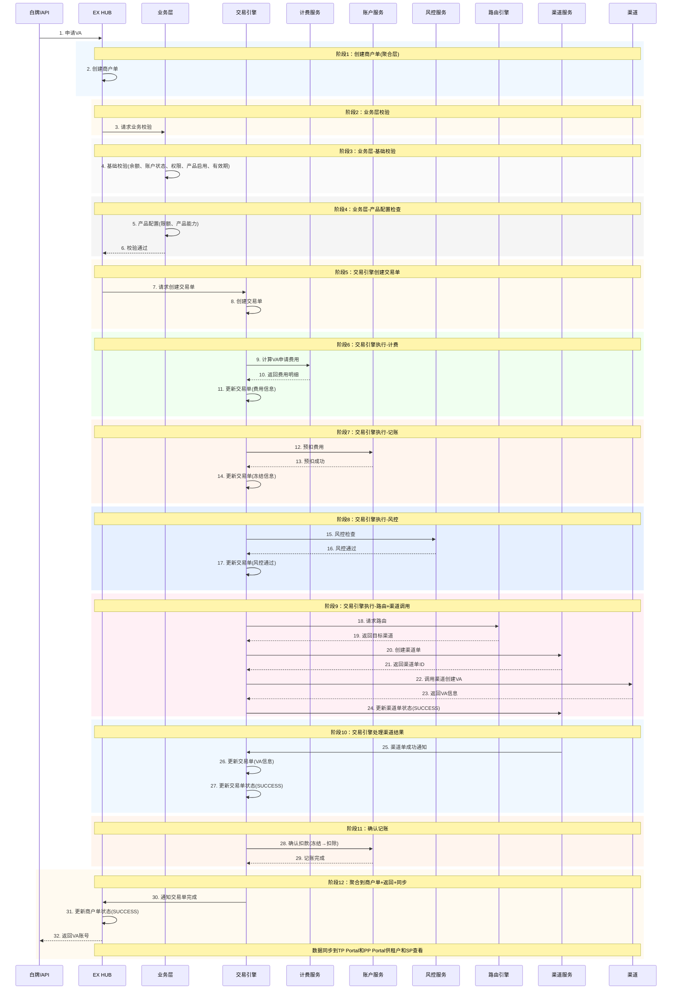
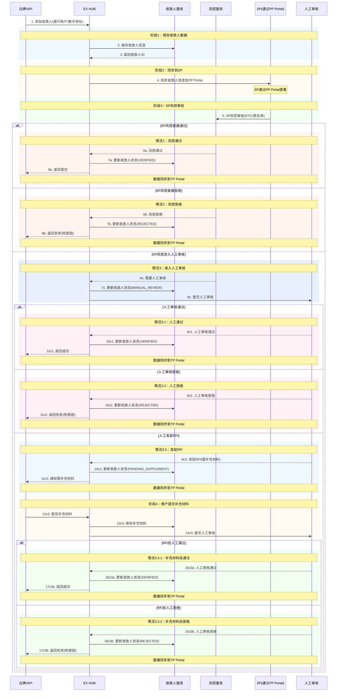

## 各交易类型详细流程

### 4.1 VA申请（商户主动发起）

**单据流转：** 商户单 → 交易单 → 渠道单

**说明：**

- **商户单**：聚合层，汇总交易单结果
- **交易单**：核心执行层，交易引擎驱动执行计费、记账、风控、路由等所有业务逻辑
  - 先记账冻结费用，失败后返回
- **渠道单**：渠道调用层
- 商户通过白牌或API接入EX系统
- 数据通过Portal展示：MP(商户)、TP(租户)、PP(SP)

---

### 4.3 收款人添加（商户主动发起）

**单据流转：** 收款人数据 → EX风控 → SP风控 → 人工审核（可选）→ RFI流程（可选）

**说明：**

- **阶段1：保存收款人数据** → EX HUB保存
- **阶段2：同步到SP** → 通过PP Portal展示给SP
- **阶段3：SP风控审核** → SP通过PP Portal进行风控审核

**审核结果：**

1. **风控直接通过** → 收款人状态：VERIFIED
2. **风控直接拒绝** → 收款人状态：REJECTED
3. **进入人工审核** → 收款人状态：MANUAL_REVIEW
   - 3.1 **人工通过** → 收款人状态：VERIFIED
   - 3.2 **人工拒绝** → 收款人状态：REJECTED
   - 3.3 **发起RFI** → 收款人状态：PENDING_SUPPLEMENT
     - 商户提交补充材料
     - 人工再次审核
     - 3.3.1 **补充材料后通过** → 收款人状态：VERIFIED
     - 3.3.2 **补充材料后拒绝** → 收款人状态：REJECTED

- 所有状态变更同步到TP Portal供租户查看
- SP通过PP Portal查看和审核收款人信息

---
