# EX Platform - User System PRD

## 文档概述

本文档定义EX平台用户系统的产品需求，涵盖用户注册登录、用户中心（Profile & Security）以及用户与商户（MID）的关系模型。

**核心设计理念：**

- ✅ **验证码登录即注册**：无需单独注册流程，首次验证码登录自动创建账户
- ✅ **多凭证支持**：一个User可绑定多个登录凭证（邮箱/手机号）
- ✅ **多商户关联**：一个User可在多个MID下，且角色/权限可不同
- ✅ **安全优先**：支持密码 + 2FA双因素认证，保障账户安全

---

## 目录

1. [系统架构概览](#1-系统架构概览)
2. [模块总览与Scope](#2-模块总览与scope)
3. [Use Case](#3-use-case)
4. [登录注册模块](#4-登录注册模块)
5. [User Center - Profile](#5-user-center---profile)
6. [User Center - Security](#6-user-center---security)
7. [User与MID关系模型](#7-user与mid关系模型)
8. [状态机](#8-状态机)

---

## 1. 系统架构概览

### 1.1 用户系统整体架构

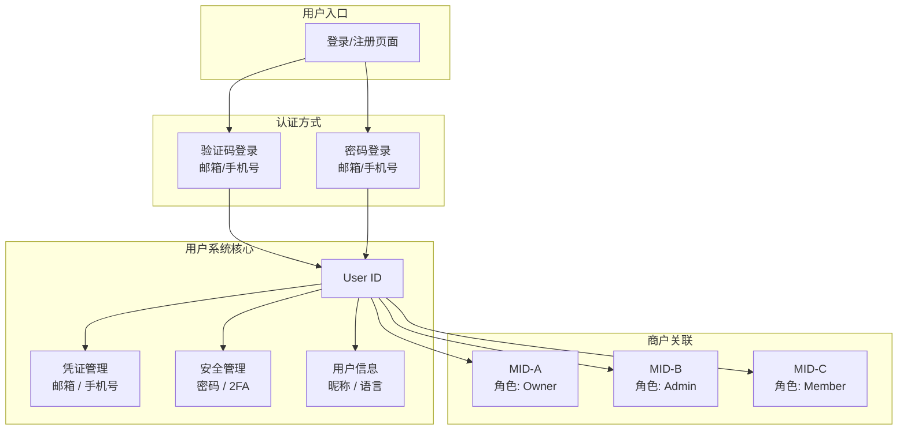

### 1.2 User-MID 关系模型

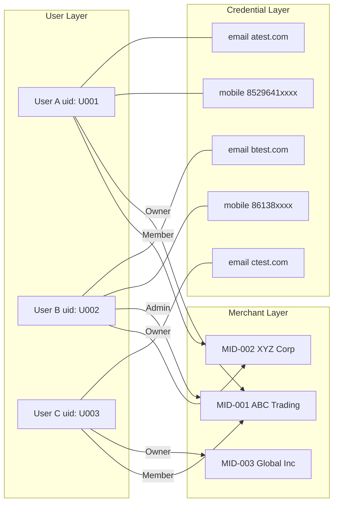

**关键关系说明：**

- **User ↔ Credential**：一对多，一个User可绑定多个邮箱/手机号
- **User ↔ MID**：多对多，一个User可属于多个MID，一个MID可有多个User
- **User-MID角色**：每个User在不同MID下可拥有不同角色（Owner / Admin / Member）

---

## 2. 模块总览与Scope

### 2.1 登录注册模块

| 维度                   | 内容                                                                                                                                                                                                                                               |
| ---------------------- | -------------------------------------------------------------------------------------------------------------------------------------------------------------------------------------------------------------------------------------------------- |
| **In Scope**     | ① 邮箱验证码登录（登录即注册）``② 手机号验证码登录（登录即注册）``③ 密码登录（邮箱/手机号 + 密码）``④ 基于IP自动识别国家区号``⑤ 密码强度校验（≥8位，大小写+数字/符号）``⑥ 验证码发送与校验（5分钟有效期）``⑦ 首次登录创建User ID并设置昵称 |
| **Out of Scope** | ① 第三方登录（Google / Apple / WeChat）``② SSO单点登录``③ 企业域名登录 ``④ 生物识别登录（指纹/面容）``⑤ 登录IP白名单                                                                                                                          |

### 2.2 User Profile 模块

| 维度                   | 内容                                                                                                                                                                                                            |
| ---------------------- | --------------------------------------------------------------------------------------------------------------------------------------------------------------------------------------------------------------- |
| **In Scope**     | ① Contact & Login Method 管理 ``　- Email 查看/修改/验证状态``　- Mobile 查看/修改/验证状态 ``　- Login method 选择（Email / Mobile）``② 昵称设置（含默认昵称规则）``③ 语言偏好设置``④ 修改凭证需验证旧凭证 |
| **Out of Scope** | ① 头像上传 ``② 时区设置``③ 通知偏好设置（Notifications）``④ 关联账户管理（Accounts）``⑤ 助手/代理人管理（Assistants）``⑥ 账号注销                                                                         |

### 2.3 Security 模块

| 维度                   | 内容                                                                                                                                     |
| ---------------------- | ---------------------------------------------------------------------------------------------------------------------------------------- |
| **In Scope**     | ① 密码修改（需验证旧密码）``② 2FA双因素认证``　- Authenticator App（TOTP，可设为Default）``　- SMS验证码``③ Recovery Codes 生成与管理 |
| **Out of Scope** | ① 登录历史/设备管理 ``② 会话管理（强制登出其他设备）``③ API Key管理 ``④ 安全日志审计``⑤ 账号冻结/解冻                               |

---

## 3. Use Case

### 3.1 登录注册 Use Case

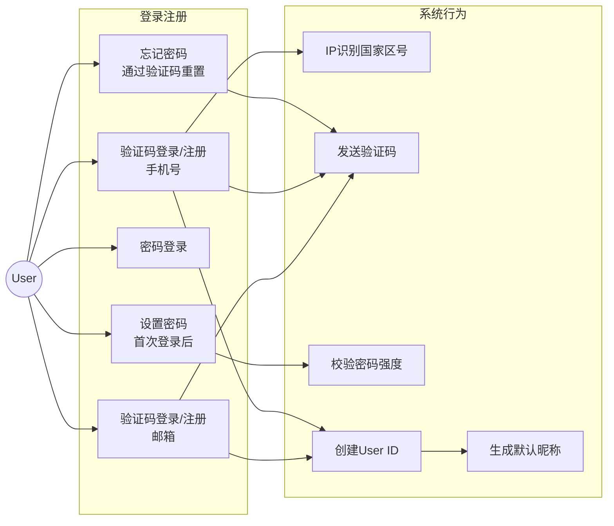

### 3.2 User Center Use Case

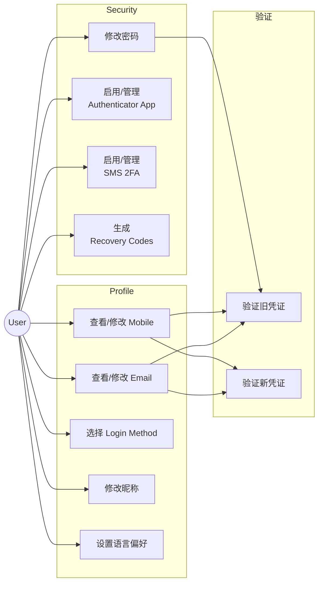

---

## 4. 登录注册模块

### 4.1 验证码登录/注册流程

**核心规则：验证码登录即注册，无需单独注册入口。**

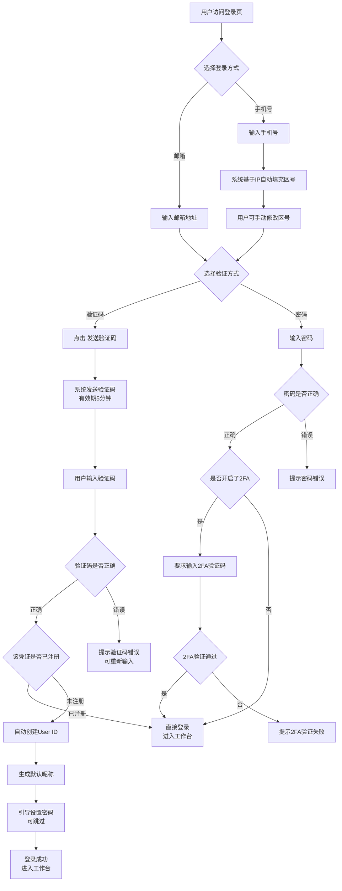

### 4.2 IP自动识别区号规则

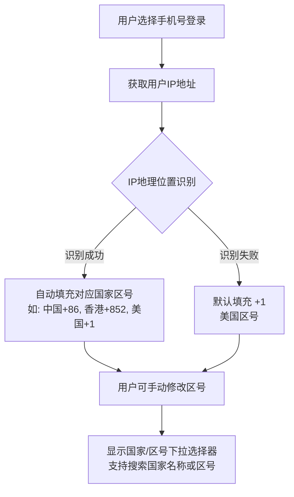

**区号识别规则：**

- 根据用户当前IP地址判断所在国家
- 自动填充该国家的国际区号
- 如果IP无法识别国家，默认使用 **+1**（美国）
- 用户可以通过下拉选择器手动修改区号
- 下拉选择器支持按国家名称或区号搜索

### 4.3 密码强度规则

密码必须满足以下**全部**条件：

| 规则       | 要求                               |
| ---------- | ---------------------------------- |
| 最小长度   | ≥ 8 个字符                        |
| 大写字母   | 至少包含 1 个大写字母（A-Z）       |
| 小写字母   | 至少包含 1 个小写字母（a-z）       |
| 数字或符号 | 至少包含 1 个数字（0-9）或特殊符号 |

**UI交互：**

- 输入密码时实时校验，逐条显示是否满足
- 满足的条件显示 ✅ 绿色勾
- 未满足的条件显示 ○ 灰色
- 提示文案："For improved security, avoid passwords used with other websites."

### 4.4 验证码规则

| 规则         | 说明                                |
| ------------ | ----------------------------------- |
| 验证码格式   | 6位数字                             |
| 有效期       | 5分钟                               |
| 发送频率限制 | 同一凭证60秒内只能发送1次           |
| 每日发送上限 | 同一凭证每天最多10次                |
| 错误次数限制 | 连续5次输入错误，锁定15分钟         |
| 发送渠道     | 邮箱：邮件发送``手机号：SMS短信发送 |

### 4.5 首次登录后行为

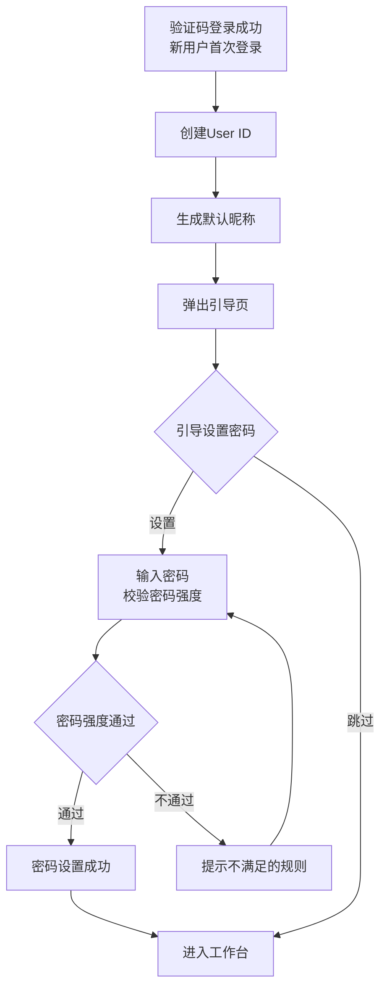

**默认昵称规则：**

- 邮箱注册：取邮箱 `@` 前面的部分作为昵称（如 `john@test.com` → `john`）
- 手机号注册：`User_` + 手机号后4位（如 `+852 96412374` → `User_2374`）
- 昵称可在 User Profile 中修改

---

## 5. User Center - Profile

### 5.1 模块概览

User Profile 页面包含以下信息模块：

```
┌─────────────────────────────────────────────────┐
│  Profile    Security                             │
│  ────────                                        │
│                                                  │
│  ┌─────────────────────────────────────────────┐ │
│  │  Contact & login method                     │ │
│  │                                             │ │
│  │  Email    [Verified]                  Edit  │ │
│  │  liuxiaoxiaoangie@gmail.com                 │ │
│  │                                             │ │
│  │  Mobile   [Verified]                  Edit  │ │
│  │  +852 96412374                              │ │
│  │                                             │ │
│  │  Login method  ⓘ                      Edit  │ │
│  │  Email                                      │ │
│  └─────────────────────────────────────────────┘ │
│                                                  │
│  ┌─────────────────────────────────────────────┐ │
│  │  Basic info                                 │ │
│  │                                             │ │
│  │  Nickname                             Edit  │ │
│  │  john                                       │ │
│  │                                             │ │
│  │  Language                             Edit  │ │
│  │  English                                    │ │
│  └─────────────────────────────────────────────┘ │
└─────────────────────────────────────────────────┘
```

### 5.2 Contact & Login Method

#### 5.2.1 Email 管理

**查看状态：**

- 显示当前绑定的邮箱地址
- 显示验证状态标签：`Verified`（绿色）/ `Unverified`（灰色）

**修改邮箱流程：**

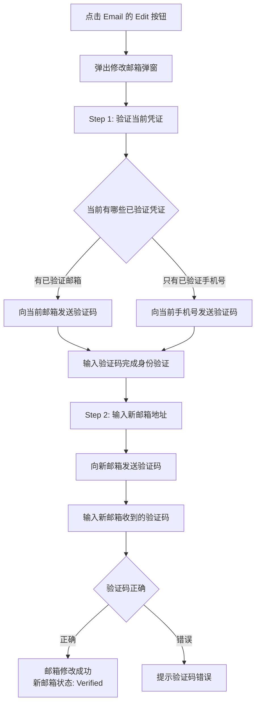

#### 5.2.2 Mobile 管理

**查看状态：**

- 显示当前绑定的手机号（含区号）
- 显示验证状态标签：`Verified`（绿色）/ `Unverified`（灰色）

**修改手机号流程：**

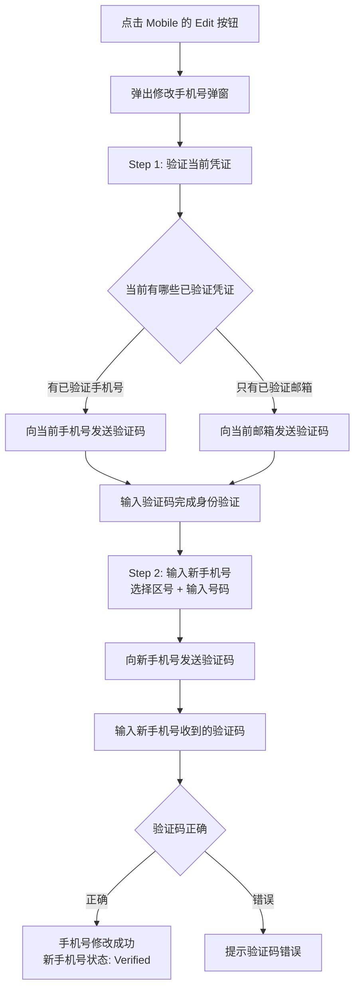

#### 5.2.3 Login Method 设置

**说明：** 用户可以选择默认的登录方式（Email 或 Mobile），决定登录页面默认显示哪种输入方式。

**规则：**

- 只有已验证的凭证才能被设为 Login Method
- 如果只绑定了一个凭证，该凭证自动成为 Login Method
- 修改 Login Method 无需额外验证

#### 5.2.4 添加第二个凭证

**场景：** 用户注册时只绑定了邮箱，后续想添加手机号（或反之）。

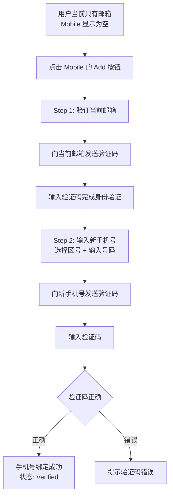

### 5.3 Basic Info

#### 5.3.1 昵称

- 显示当前昵称
- 点击 Edit 可直接修改，无需额外验证
- 昵称长度限制：2-30个字符
- 支持中文、英文、数字、下划线
- 不支持特殊符号和emoji

**默认昵称生成规则：**

| 注册方式 | 默认昵称                | 示例                               |
| -------- | ----------------------- | ---------------------------------- |
| 邮箱     | 邮箱@前的部分           | `john@test.com` → `john`      |
| 手机号   | `User_` + 手机号后4位 | `+852 96412374` → `User_2374` |

#### 5.3.2 语言偏好

- 支持语言列表：English / 简体中文 / 繁體中文（可后续扩展）
- 修改语言后立即生效，页面自动切换
- 默认语言根据IP所在地区自动设置

---

## 6. User Center - Security

### 6.1 模块概览

```
┌─────────────────────────────────────────────────┐
│  Profile    Security                             │
│             ────────                             │
│                                                  │
│  ┌─────────────────────────────────────────────┐ │
│  │  Password                                   │ │
│  │  Choose a strong password to keep      Change│ │
│  │  your account safe.                         │ │
│  └─────────────────────────────────────────────┘ │
│                                                  │
│  ┌─────────────────────────────────────────────┐ │
│  │  Two-factor authentication (2FA)            │ │
│  │  2FA adds a layer of security that          │ │
│  │  requires an additional authentication      │ │
│  │  method to log in.  Learn more              │ │
│  │                                             │ │
│  │  Authenticator app  [Default]          ···  │ │
│  │  Use a 3rd party authenticator app to       │ │
│  │  receive an authentication code.            │ │
│  │                                             │ │
│  │  SMS                                Set up  │ │
│  │  Receive an authentication code via SMS.    │ │
│  │                                             │ │
│  │  Generate recovery codes to log in and      │ │
│  │  edit your 2FA method in case you lose      │ │
│  │  2FA access.                                │ │
│  └─────────────────────────────────────────────┘ │
└─────────────────────────────────────────────────┘
```

### 6.2 密码修改

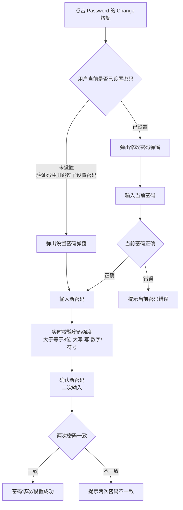

**密码修改规则：**

- 新密码不能与当前密码相同
- 必须满足密码强度要求
- 修改成功后，其他设备的登录状态不受影响（本期）

### 6.3 Two-Factor Authentication (2FA)

#### 6.3.1 Authenticator App

**启用流程：**

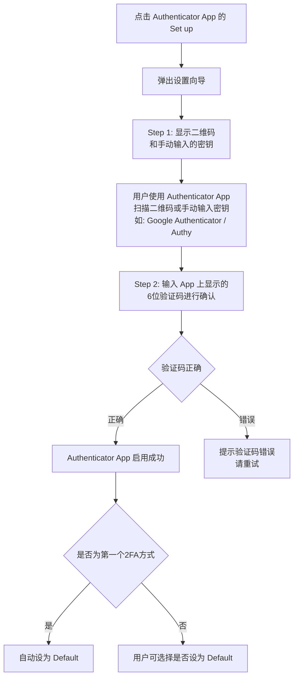

**已启用后的管理（点击 ··· 按钮）：**

- **Set as Default**：设为默认2FA方式
- **Regenerate**：重新生成密钥（需先验证身份）
- **Disable**：关闭 Authenticator App 2FA

#### 6.3.2 SMS 2FA

**启用流程：**

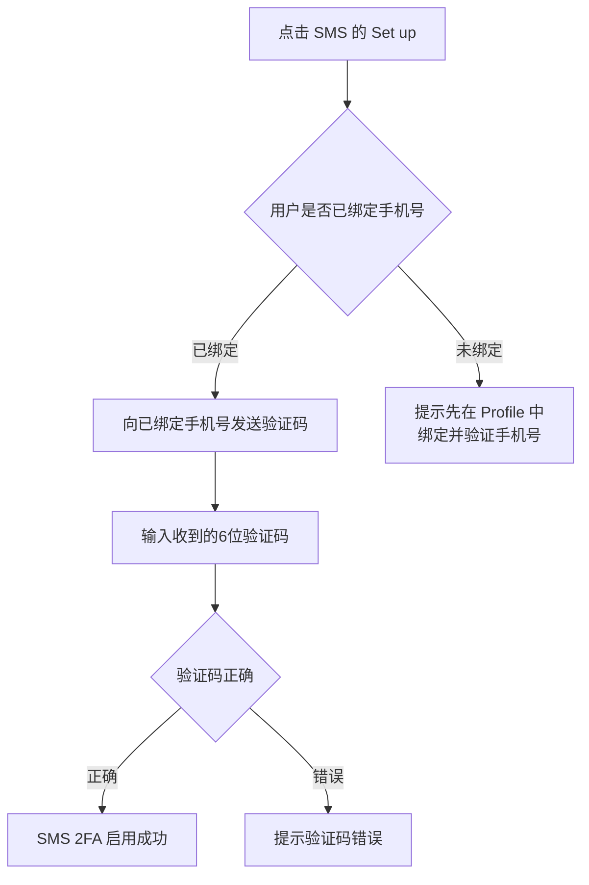

**SMS 2FA 规则：**

- 前提条件：必须已绑定并验证手机号
- 每次登录时向绑定手机号发送验证码
- 如果用户修改了手机号，SMS 2FA 自动绑定到新手机号

#### 6.3.3 2FA 登录流程

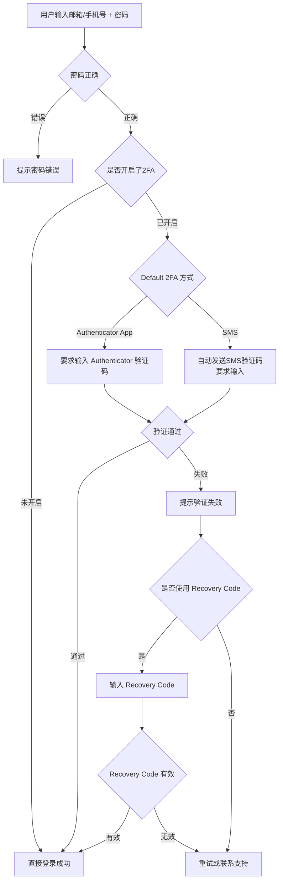

### 6.4 Recovery Codes

**说明：** Recovery Codes 用于在丢失2FA设备时恢复账户访问。

**生成流程：**

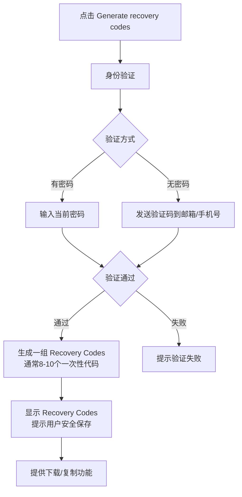

**Recovery Codes 规则：**

| 规则     | 说明                                   |
| -------- | -------------------------------------- |
| 数量     | 每次生成 10 个                         |
| 格式     | 8位字母数字组合，如 `a1b2-c3d4`      |
| 使用规则 | 每个Code只能使用一次                   |
| 重新生成 | 重新生成后，旧的Codes全部失效          |
| 使用场景 | 丢失2FA设备时，用Code代替2FA验证码登录 |

---

## 7. User与MID关系模型

### 7.1 关系概览

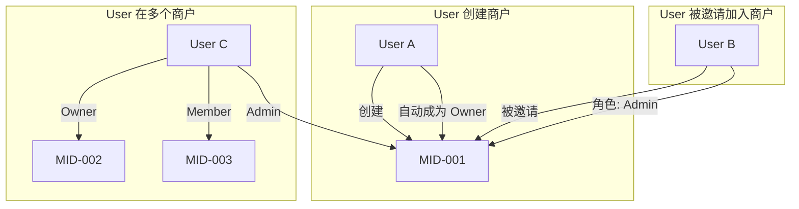

### 7.2 角色定义

| 角色             | 说明              | 权限范围                                    |
| ---------------- | ----------------- | ------------------------------------------- |
| **Owner**  | 商户创建者/所有者 | 全部权限，包括删除商户、管理成员角色        |
| **Admin**  | 管理员            | 大部分管理权限，不能删除商户、不能修改Owner |
| **Member** | 普通成员          | 查看权限为主，有限的操作权限                |

### 7.3 创建商户流程

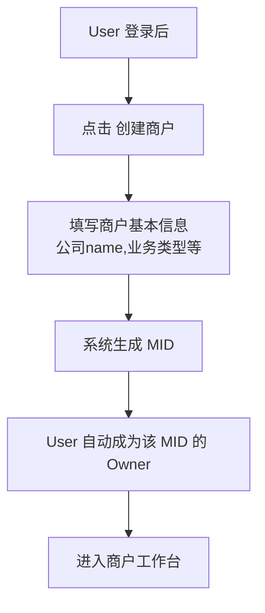

### 7.4 邀请成员加入商户

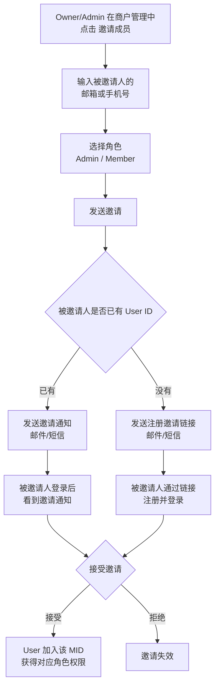

### 7.5 商户切换

**场景：** User 属于多个MID，需要在不同商户间切换。

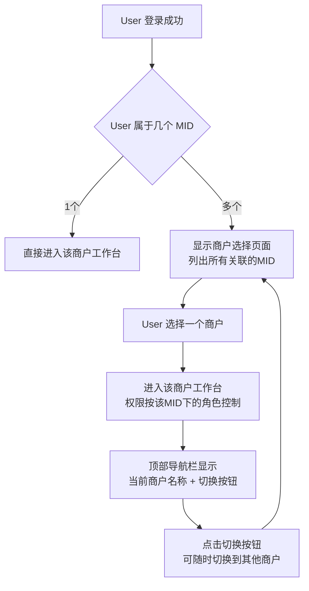

### 7.6 Owner 定义与认证

**Owner 不是随意指定的角色，必须满足以下条件之一：**

| Owner 类型                             | 说明                              | 认证方式                                               |
| -------------------------------------- | --------------------------------- | ------------------------------------------------------ |
| **开户人**                       | 创建MID并提交KYC/产品开通申请的人 | 系统自动认定，注册时已完成邮箱/手机号验证              |
| **法人（Legal Representative）** | 公司法定代表人                    | 需要身份认证：人脸识别 / 手机号验证 / 线下提供身份材料 |
| **董事（Director）**             | 公司董事会成员                    | 需要身份认证：人脸识别 / 手机号验证 / 线下提供身份材料 |

#### Owner 认定流程

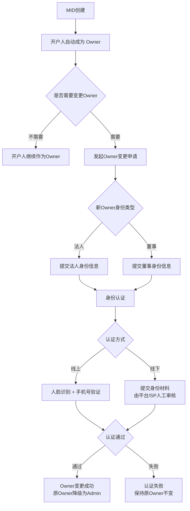

#### Owner 权限特殊性

Owner 拥有以下**不可转让给 Admin/Member** 的专属权限：

- 配置 MID 级操作权限（见 7.7）
- 变更 Owner（转让给法人/董事）
- 删除/注销 MID
- 设置安全联系人
- 管理 Admin 角色（提升/降级）

### 7.7 MID级操作权限授权

**核心规则：** Owner 可以为每个 User 配置 MID 级操作的验证方式——User 自己验证，还是需要 Owner 验证。

#### 操作分类与默认权限

```mermaid
flowchart TD
    subgraph "User级操作（固定，不可更改）"
        A1[登录] -->|验证码发到| A1a[User自己]
        A2[修改个人密码] -->|验证码发到| A2a[User自己]
        A3[修改邮箱/手机号] -->|验证码发到| A3a[User自己]
        A4[2FA设置] -->|验证码发到| A4a[User自己]
    end

    subgraph "MID级操作（Owner可配置）"
        B1[发起交易] -->|Owner授权?| B1a{已授权: User自己<br/>未授权: Owner}
        B2[资金操作] -->|Owner授权?| B2a{已授权: User自己<br/>未授权: Owner}
        B3[修改商户配置] -->|Owner授权?| B3a{已授权: User自己<br/>未授权: Owner}
        B4[新增/删除成员] -->|Owner授权?| B4a{已授权: User自己<br/>未授权: Owner}
    end
```

#### 权限配置矩阵

Owner 在 MID 设置中为每个 User 配置权限：

```
MID-001 操作权限配置
┌──────────────────┬──────────┬──────────┬──────────┐
│ 操作类型          │ User-A   │ User-B   │ User-C   │
│                  │ (Admin)  │ (Admin)  │ (Member) │
├──────────────────┼──────────┼──────────┼──────────┤
│ 发起交易          │ ✅ 自己   │ ✅ 自己   │ ❌ Owner │
│ 资金操作(提现等)   │ ✅ 自己   │ ❌ Owner │ ❌ Owner │
│ 修改商户配置       │ ✅ 自己   │ ❌ Owner │ ❌ Owner │
│ 新增/删除成员      │ ❌ Owner │ ❌ Owner │ ❌ Owner │
└──────────────────┴──────────┴──────────┴──────────┘

✅ 自己 = Owner已授权，验证码发到User自己
❌ Owner = 未授权，验证码发到Owner
```

**默认规则：** 新加入的 User 默认所有 MID 级操作都需要 Owner 验证，Owner 逐项授权。

#### 操作验证流程

```mermaid
flowchart TD
    A[User发起MID级操作<br/>如: 发起交易] --> B{该User是否被Owner<br/>授权该操作}

    B -->|已授权| C[验证码发到 User 自己的凭证]
    B -->|未授权| D[验证码发到 Owner 的凭证]

    C --> E[User 输入验证码]
    E --> F{验证通过}
    F -->|通过| G[操作执行成功]
    F -->|失败| E

    D --> H[Owner 收到验证码 + 操作通知<br/>通知内容: 谁在做什么操作]
    H --> I{Owner 配合输入验证码}
    I -->|输入| J{验证通过}
    I -->|忽略/拒绝| K[操作超时失败<br/>通知User]
    J -->|通过| G
    J -->|失败| H
```

#### Owner 授权管理页面

```
┌─────────────────────────────────────────────────────┐
│  MID-001 操作权限管理                                │
│                                                     │
│  成员列表                                            │
│  ┌─────────────────────────────────────────────────┐│
│  │ User-A (Admin)                          配置 ▶ ││
│  │ user-a@test.com                                 ││
│  ├─────────────────────────────────────────────────┤│
│  │ User-B (Admin)                          配置 ▶ ││
│  │ user-b@test.com                                 ││
│  ├─────────────────────────────────────────────────┤│
│  │ User-C (Member)                         配置 ▶ ││
│  │ +852 9641xxxx                                   ││
│  └─────────────────────────────────────────────────┘│
│                                                     │
│  点击"配置"后：                                      │
│  ┌─────────────────────────────────────────────────┐│
│  │ User-A 操作权限                                  ││
│  │                                                  ││
│  │ 发起交易          [✅ 允许自主操作]  [切换]       ││
│  │ 资金操作          [✅ 允许自主操作]  [切换]       ││
│  │ 修改商户配置       [❌ 需Owner验证]  [切换]       ││
│  │ 新增/删除成员      [❌ 需Owner验证]  [切换]       ││
│  │                                                  ││
│  │                          [保存]  [取消]           ││
│  └─────────────────────────────────────────────────┘│
└─────────────────────────────────────────────────────┘
```

#### Scope 说明

| 维度                   | 内容                                                                                                                                                                                                             |
| ---------------------- | ---------------------------------------------------------------------------------------------------------------------------------------------------------------------------------------------------------------- |
| **In Scope**     | ① Owner 定义（开户人/法人/董事）``② Owner 身份认证（人脸/手机号/线下材料）``③ Owner 为 User 配置 MID 级操作权限``④ 基于授权的验证码发送逻辑``⑤ Owner 收到操作通知（谁在做什么） |
| **Out of Scope** | ① 审批模式（员工提交 → Owner审批 → 执行）``② 多级审批（多人审批链）``③ 操作金额阈值控制（如>$10000需Owner）``④ 操作时间窗口控制（如非工作时间需Owner）                                |

---

## 8. 状态机

### 8.1 User 状态

```
ACTIVE ←→ SUSPENDED
  ↓
DELETED（Out of Scope，本期不做）
```

| 状态                | 说明                     |
| ------------------- | ------------------------ |
| **ACTIVE**    | 正常使用状态             |
| **SUSPENDED** | 账户被暂停（如安全风险） |

### 8.2 凭证（Credential）状态

```
UNVERIFIED → VERIFIED
     ↑          ↓
     └── CHANGED（修改后重新验证）
```

| 状态                 | 说明             |
| -------------------- | ---------------- |
| **UNVERIFIED** | 已绑定但未验证   |
| **VERIFIED**   | 已通过验证码验证 |

### 8.3 2FA 状态

```
NOT_SET → ENABLED ←→ DISABLED
              ↓
          DEFAULT（被设为默认2FA方式）
```

| 状态               | 说明                  |
| ------------------ | --------------------- |
| **NOT_SET**  | 未设置                |
| **ENABLED**  | 已启用                |
| **DISABLED** | 已禁用                |
| **DEFAULT**  | 已启用且为默认2FA方式 |

### 8.4 邀请状态

```
PENDING → ACCEPTED
    ↓
REJECTED
    ↓
EXPIRED（超过7天未处理）
```

---

## 附录

### A. 错误码与提示信息

| 场景                   | 错误提示                                                        |
| ---------------------- | --------------------------------------------------------------- |
| 验证码过期             | "Verification code has expired. Please request a new one."      |
| 验证码错误             | "Invalid verification code. Please try again."                  |
| 验证码发送频率限制     | "Please wait 60 seconds before requesting a new code."          |
| 验证码每日上限         | "You've reached the daily limit. Please try again tomorrow."    |
| 密码强度不足           | 实时显示未满足的具体规则                                        |
| 两次密码不一致         | "Passwords do not match."                                       |
| 当前密码错误           | "Current password is incorrect."                                |
| 邮箱已被其他账户绑定   | "This email is already associated with another account."        |
| 手机号已被其他账户绑定 | "This phone number is already associated with another account." |
| Recovery Code 无效     | "Invalid recovery code. Please try another one."                |
| 2FA验证失败            | "Invalid authentication code. Please try again."                |

### B. 安全策略

| 策略           | 规则                                   |
| -------------- | -------------------------------------- |
| 密码存储       | 使用 bcrypt 或 argon2 哈希，不存储明文 |
| 验证码传输     | 通过 HTTPS 加密传输                    |
| 2FA密钥存储    | 加密存储 TOTP Secret                   |
| Recovery Codes | 哈希存储，使用后标记为已用             |
| 登录失败锁定   | 连续5次密码错误，锁定账户15分钟        |
| 验证码错误锁定 | 连续5次验证码错误，锁定15分钟          |

---

*最后更新：2026-02-07*
*文档版本：v1.0*
*作者：EX Product Team*
