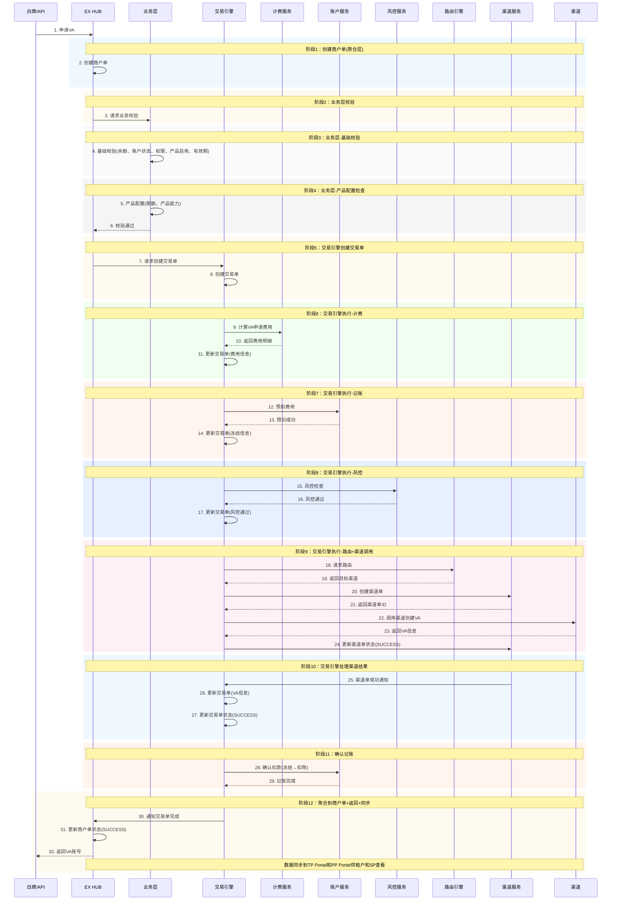
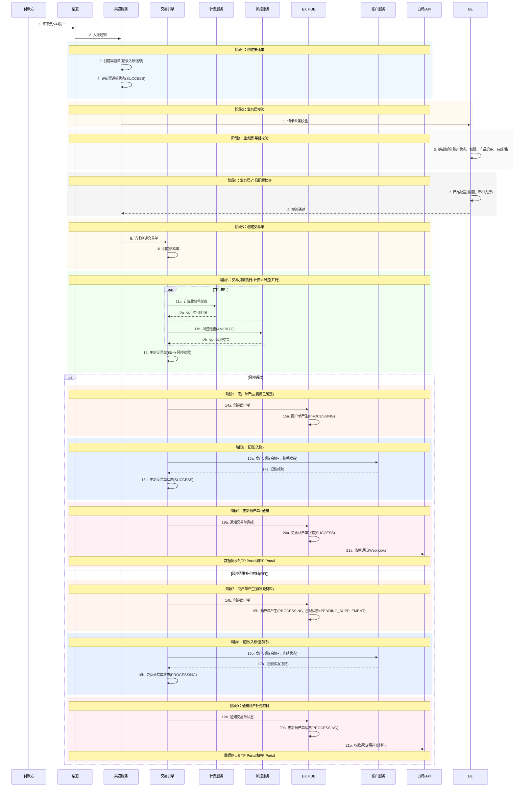
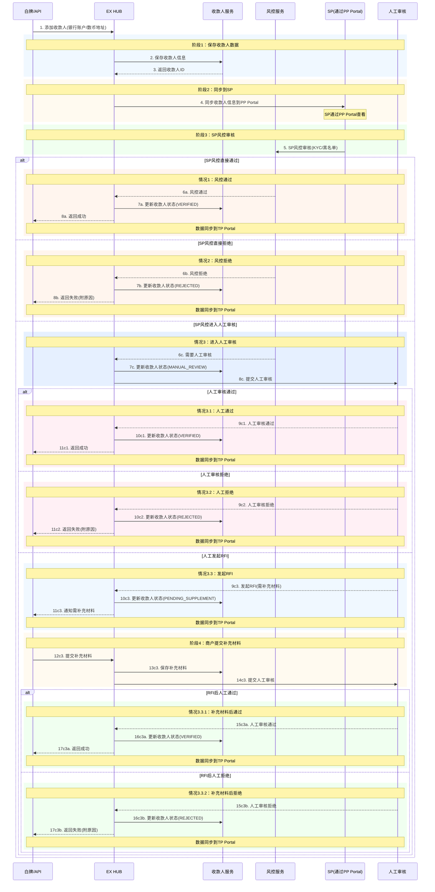
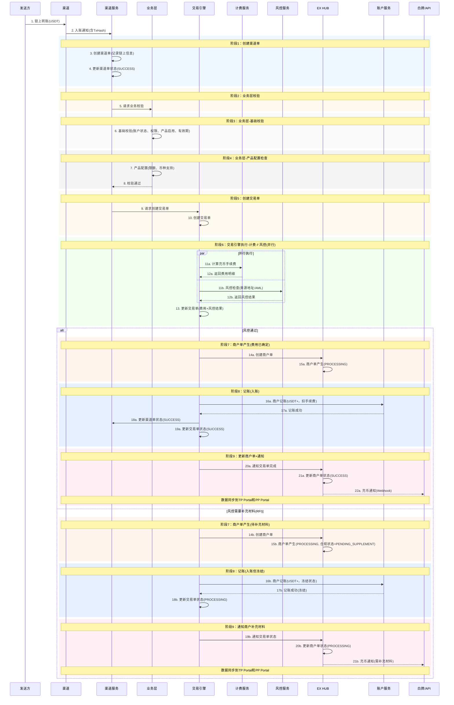
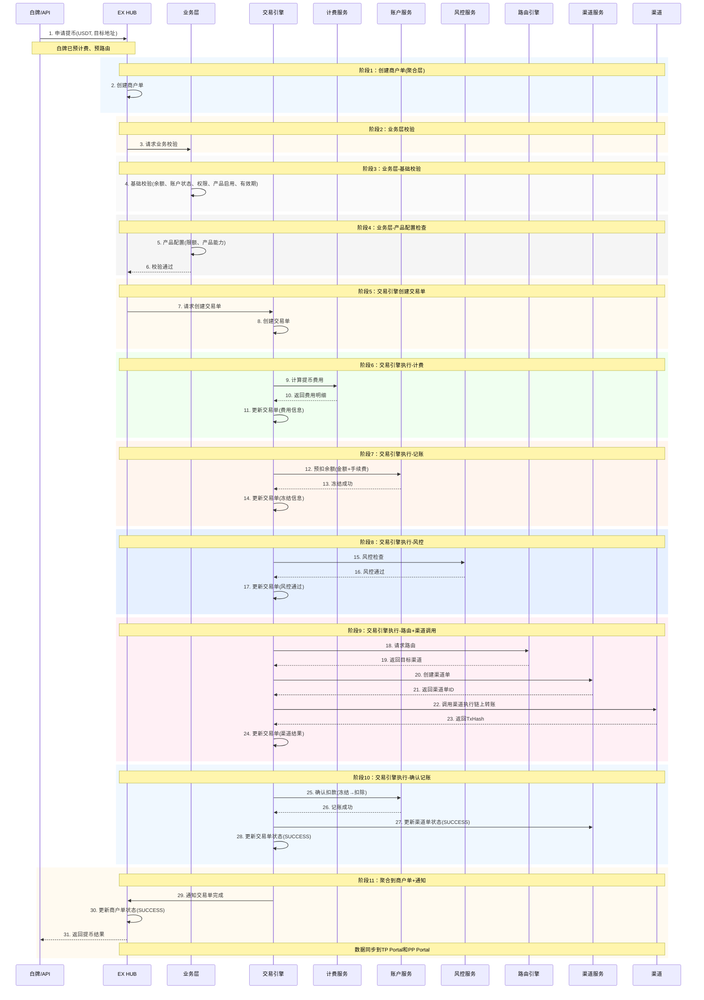
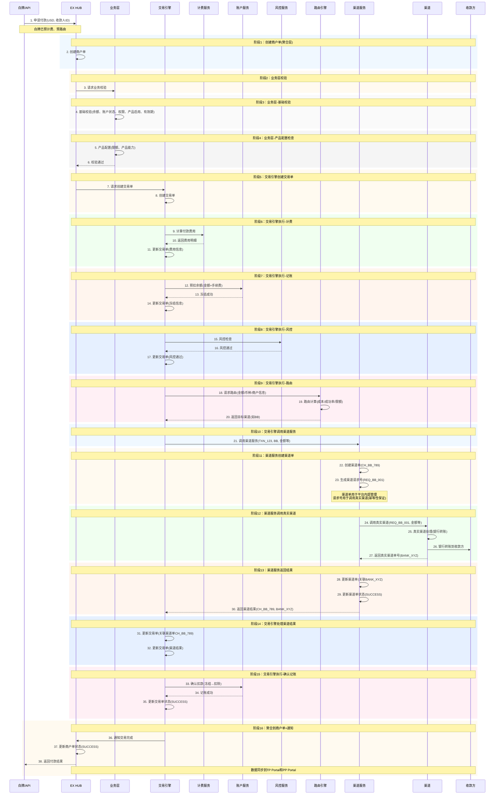
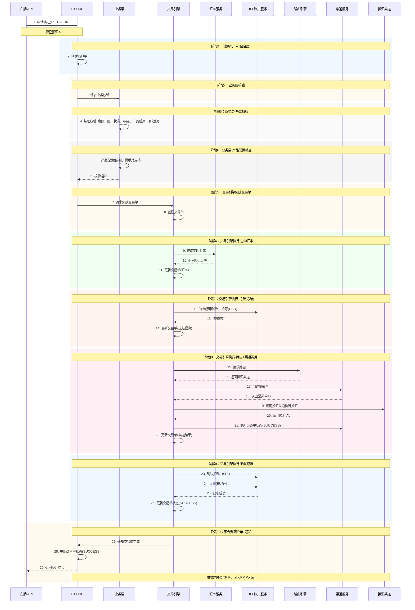
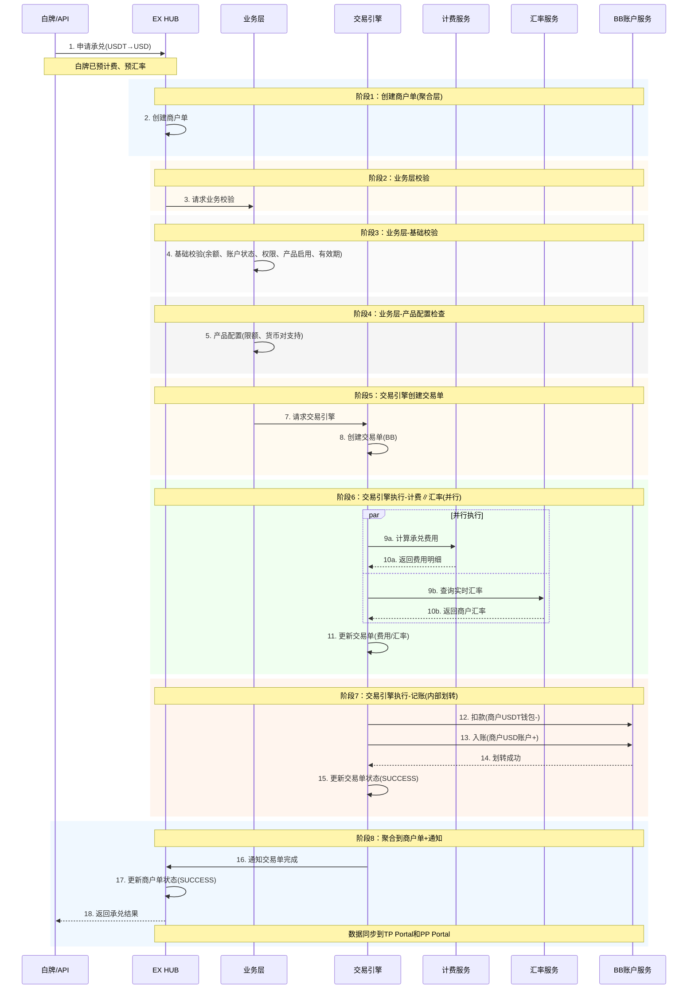
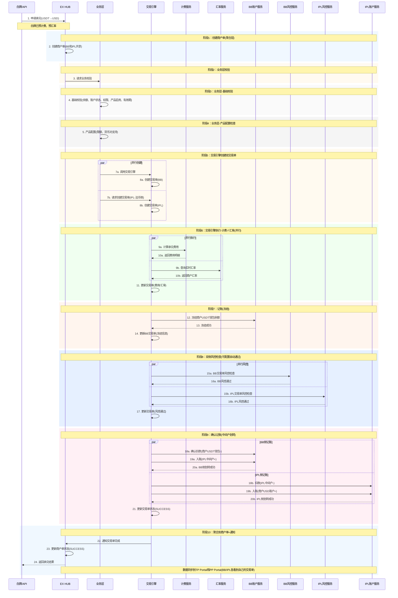

# 交易流程设计 v2

## 文档概述

本文档详细描述了EX平台的完整交易流程，基于**3单模型**（商户单→交易单→渠道单）设计。

**核心设计理念：**

- ✅ **3单模型**：商户单 → 交易单 → 渠道单，清晰的单据层级
- ✅ **业务侧定义**：每种交易类型定义需要调用的步骤，交易引擎按定义编排执行
- ✅ **双向流程**：支持商户主动发起和渠道被动通知两种模式
- ✅ **全链路风控**：收付款,va,收款人均需通过风控检查
- ✅ **白牌预处理**：白牌页面支持预计费、预路由

---

## 目录

1. [3单模型设计](#3单模型设计)
2. [交易类型分类](#交易类型分类)
3. [业务侧定义与交易引擎](#业务侧定义与交易引擎)
4. [各交易类型详细流程](#各交易类型详细流程)
5. [承兑的两种模式](#承兑的两种模式)
6. [数据表设计](#数据表设计)
7. [状态机设计](#状态机设计)

---

## 3单模型设计

### 1.1 单据层级

```
EX 构建所有单据：
┌─────────────────────────────────────────────────────────────────┐
│  商户单 (Merchant Order)                                        │
│  - 商户可见                                                      │
│  - EX创建，聚合交易单信息                                         │
│  - 1个商户单可能对应多个SP（如IPL-BB打通承兑，2个sp 都可以看到）                      │
│      │                                                          │
│      │ 1:N                                                      │
│      ▼                                                          │
│  交易单 (Transaction Order)                                      │
│  - 一定在同一个SP内                                               │
│  - 计费、预扣余额在交易单上                                        │
│  - 业务侧定义的步骤在交易单上执行                                   │
│      │                                                          │
│      │ 1:N (仅IPL/BB有渠道单)                                    │
│      ▼                                                          │
│  渠道单 (Channel Order)                                          │
│  - 仅IPL和BB有（EX帮他们对接下游渠道）                             │
│  - 其他SP自己对接渠道，无渠道单                                    │
└─────────────────────────────────────────────────────────────────┘
```

### 1.2 SP分类与单据可见性

| SP类型 | 商户单 | 交易单 | 渠道单 | 说明                      |
| ------ | ------ | ------ | ------ | ------------------------- |
| BB     | EX构建 | EX构建 | EX构建 | EX帮BB对接XPAY等下游渠道  |
| IPL    | EX构建 | EX构建 | EX构建 | EX帮IPL对接银行等下游渠道 |
| 其他SP | EX构建 | EX构建 | ❌ 无  | SP自己对接渠道            |

### 1.3 单据关系示意

**单SP场景（如提币）：**

```
商户单 M001
    └── 交易单 T001 (BB)
            └── 渠道单 C001 (BB→链上)
```

**双SP场景（如IPL-BB打通承兑）：**

```
商户单 M001 ← BB和IPL同时看到
    ├── 交易单 T001 (BB): 数币侧
    │       └── 渠道单 C001 (BB)
    └── 交易单 T002 (IPL): 法币侧
            └── 渠道单 C002 (IPL)

✅ 同时创建，并行处理
✅ 都成功 → 商户单成功
✅ BB和IPL之间有清算协议
```

---

## 交易类型分类

### 2.1 按单据流转方向分类

#### **类型A：商户主动发起（商户单 → 交易单 → 渠道单）**

| 交易类型  | 触发方式 | 单据流转                                                   |
| --------- | -------- | ---------------------------------------------------------- |
| VA申请    | 商户申请 | 商户单 → 交易单 → 计费 → 记账 → 风控 → 路由 → 渠道单 |
| 付款/提现 | 商户发起 | 商户单 → 交易单 → 计费 → 记账 → 风控 → 路由 → 渠道单 |
| 提币      | 商户发起 | 商户单 → 交易单 → 计费 → 记账 → 风控 → 路由 → 渠道单 |
| 数转法    | 商户发起 | 商户单 → 交易单 → 计费 → 记账 → 风控 → 路由 → 渠道单 |
| 法转数    | 商户发起 | 商户单 → 交易单 → 计费 → 记账 → 风控 → 路由 → 渠道单 |

#### **类型B：渠道被动通知（渠道单 → 交易单 → 商户单）**

| 交易类型 | 触发方式     | 单据流转                                           |
| -------- | ------------ | -------------------------------------------------- |
| 收款     | 渠道入账通知 | 渠道单 → 风控 → 交易单 → 商户单 → 计费 → 记账 |
| 充币     | 链上入账通知 | 渠道单 → 风控 → 交易单 → 商户单 → 计费 → 记账 |

## 业务侧定义与交易引擎

### 3.1 业务侧定义

每种交易类型在业务侧定义需要调用的步骤，交易引擎按定义编排执行。

```json
{
  "transaction_type": "WITHDRAWAL",
  "steps": [
    {"step": "CREATE_MERCHANT_ORDER", "required": true},
    {"step": "CREATE_TRANSACTION_ORDER", "required": true},
    {"step": "PRICING", "required": true},
    {"step": "ACCOUNTING_FREEZE", "required": true},
    {"step": "RISK_CHECK", "required": true},
    {"step": "ROUTING", "required": true},
    {"step": "CREATE_CHANNEL_ORDER", "required": true, "condition": "SP_TYPE in (BB, IPL)"},
    {"step": "CALL_CHANNEL", "required": true},
    {"step": "ACCOUNTING_CONFIRM", "required": true},
    {"step": "NOTIFY", "required": true}
  ]
}
```

### 3.2 交易引擎职责

交易引擎是**编排工具**，不决定走什么步骤，只负责按业务侧定义执行：

```
业务侧定义步骤 → 交易引擎读取 → 按顺序调用各服务 → 返回业务反馈
```

### 3.3 白牌预处理

白牌页面在商户确认前会进行预处理：

- **预计费**：展示预估费用
- **预路由**：展示可用SP和预估到账时间

---

## 各交易类型详细流程

### 4.1 VA申请（商户主动发起）

**单据流转：** 商户单 → 交易单 → 渠道单



**说明：**

- **商户单**：聚合层，汇总交易单结果
- **交易单**：核心执行层，交易引擎驱动执行计费、记账、风控、路由等所有业务逻辑
  - 先记账，冻结金额
- **渠道单**：渠道调用层
- 商户通过白牌或API接入EX系统
- 数据通过Portal展示：MP(商户)、TP(租户)、PP(SP)

---

### 4.2 VA收款（渠道被动通知）

**单据流转：** 渠道单 → 交易单 → (计费∥风控) → 商户单 → 记账



**说明：**

- **计费和风控并行执行**：提升性能，两者都只依赖交易单
- **商户单在计费风控完成后产生**：确保费用已确定
- **情况1：风控通过**

  - 风控状态：PASSED
  - 商户单最终状态：SUCCESS
  - 正常入账完成
- **情况2：风控需要补充材料(RFI)**

  - 风控状态：PENDING_SUPPLEMENT
  - 商户单合规状态：PENDING_SUPPLEMENT
  - 资金入账但冻结，待补充材料后解冻
- 数据展示在PP Portal（服务商）、TP Portal（租户）、MP Portal（商户）

---

### 4.3 收款人添加（商户主动发起）

**单据流转：** 收款人数据 → EX风控 → SP风控 → 人工审核（可选）→ RFI流程（可选）



**说明：**

- **阶段1：保存收款人数据** → EX HUB保存
- **阶段2：同步到SP** → 通过PP Portal展示给SP
- **阶段3：SP风控审核** → SP通过PP Portal进行风控审核

**审核结果：**

1. **风控直接通过** → 收款人状态：VERIFIED
2. **风控直接拒绝** → 收款人状态：REJECTED
3. **进入人工审核** → 收款人状态：MANUAL_REVIEW
   - 3.1 **人工通过** → 收款人状态：VERIFIED
   - 3.2 **人工拒绝** → 收款人状态：REJECTED
   - 3.3 **发起RFI** → 收款人状态：PENDING_SUPPLEMENT
     - 商户提交补充材料
     - 人工再次审核
     - 3.3.1 **补充材料后通过** → 收款人状态：VERIFIED
     - 3.3.2 **补充材料后拒绝** → 收款人状态：REJECTED

- 所有状态变更同步到TP Portal供租户查看
- SP通过PP Portal查看和审核收款人信息

---

### 4.4 充币（渠道被动通知）

**单据流转：** 渠道单 → 交易单 → (计费∥风控) → 商户单 → 记账



---

### 4.5 提币（商户主动发起）

**单据流转：** 商户单 → 交易单 → 渠道单



---

### 4.6 法币付款/提现（商户主动发起）

**单据流转：** 商户单 → 交易单 → 渠道单



---

### 4.7 IPL法币换汇

**场景：** 商户在IPL法币账户之间进行换汇（如USD→EUR）

**单据流转：** 商户单 → 交易单 → 渠道单（调用外部换汇渠道）

**特点：**

- 不需要过风控（法币换汇）
- 不需要计费（无手续费）
- 需要查询实时汇率
- 调用外部换汇渠道



**说明：**

- **IPL换汇调用外部渠道**：换汇渠道（如银行、换汇服务商）
- **不需要风控**：法币换汇不涉及风控检查
- **不需要计费**：换汇无手续费
- **需要查询汇率**：实时汇率查询

---

## 承兑的两种模式

### 5.1 模式A：纯BB承兑（单SP内部账户划转）

**场景：** 租户配置商户使用BB进行承兑，BB内部数币钱包→法币账户

**单据流转：** 商户单 → 交易单(BB)（无需渠道单、无需风控，内部账户划转）



**说明：**

- **纯BB承兑是内部账户划转**：BB数币钱包 → BB法币账户
- **无需渠道单**：不调用外部渠道，只是账户服务内部划转
- **无需风控**：内部账户划转，不涉及外部交易
- **计费和汇率并行**：提升性能，汇率实时性更好

---

### 5.2 模式B：IPL-BB打通承兑（双SP中间户划转）

**场景：** 租户配置商户使用IPL-BB打通进行承兑，通过中间户实现跨SP账户划转

**单据流转：**

- 商户单（BB和IPL共享看到同一个商户单）
- 交易单(BB)：数币侧，BB看到，**过风控（可配置自动通过）**
- 交易单(IPL)：法币侧，IPL看到，**过风控（可配置自动通过）**

**Off Ramp示例（USDT→USD）：**

```
BB侧：商户USDT钱包 - → IPL中间户(在BB) +
IPL侧：IPL中间户 - → 商户USD账户 +
```



**说明：**

- **IPL-BB打通是跨SP中间户划转**：通过中间户实现BB钱包↔IPL账户
- **无需渠道单**：不调用外部渠道，只是账户服务之间的划转
- **双交易单**：BB看到BB侧交易单，IPL看到IPL侧交易单，共享同一个商户单
- **双侧风控**：BB侧和IPL侧都过风控，可配置自动通过
- **计费和汇率并行**：提升性能，汇率实时性更好

---

### 5.3 出金（调用外部渠道）

**说明：**

- **出金需要调用外部渠道**：银行/PSP
- **有渠道单**：记录外部渠道调用信息
- **流程与法币付款类似**：计费→记账(冻结)→风控→路由→渠道→确认记账

---

## 状态设计

> **注意**：
>
> - 收款人不属于交易单，收款人有独立的状态管理
> - 风控/合规是独立的工单系统，不是单据上的字段

### 6.1 商户单状态

```
CREATED ──> PROCESSING ──> SUCCESS
                │
                └──────────> FAILED
                │
                └──────────> CANCELLED
```

| 状态       | 说明                     |
| ---------- | ------------------------ |
| CREATED    | 商户单已创建             |
| PROCESSING | 处理中（交易单执行中）   |
| SUCCESS    | 成功（所有交易单都成功） |
| FAILED     | 失败（任一交易单失败）   |
| CANCELLED  | 已取消（商户主动取消）   |

---

### 6.2 交易单状态

```
CREATED ──> PROCESSING ──> SUCCESS
                │
                └──────────> FAILED
```

| 状态       | 说明         |
| ---------- | ------------ |
| CREATED    | 交易单已创建 |
| PROCESSING | 处理中       |
| SUCCESS    | 成功         |
| FAILED     | 失败         |

---

### 6.3 渠道单状态

```
CREATED ──> SUBMITTED ──> PROCESSING ──> SUCCESS
                              │
                              └──────────> FAILED
```

| 状态       | 说明         |
| ---------- | ------------ |
| CREATED    | 渠道单已创建 |
| SUBMITTED  | 已提交给渠道 |
| PROCESSING | 渠道处理中   |
| SUCCESS    | 渠道处理成功 |
| FAILED     | 渠道处理失败 |

## 总结

### 核心设计要点

| 设计点               | 说明                                             |
| -------------------- | ------------------------------------------------ |
| **3单模型**    | 商户单 → 交易单 → 渠道单，清晰的单据层级       |
| **业务侧定义** | 每种交易类型定义需要的步骤，交易引擎按定义执行   |
| **双向流程**   | 商户主动发起(商户单先) vs 渠道被动通知(渠道单先) |
| **单SP/双SP**  | 大部分交易单SP，承兑可能双SP(IPL-BB打通)         |
| **渠道单范围** | 仅BB和IPL有渠道单(EX帮对接下游)                  |
| **白牌预处理** | 预计费、预路由，提升用户体验                     |

### 交易类型汇总

| 交易类型     | 流转方向                     | SP数量 | 渠道单 |
| ------------ | ---------------------------- | ------ | ------ |
| VA申请       | 商户单→交易单→渠道单       | 单SP   | ✅     |
| VA收款       | 渠道单→交易单→商户单       | 单SP   | ✅     |
| 充币         | 渠道单→交易单→商户单       | 单SP   | ✅     |
| 提币         | 商户单→交易单→渠道单       | 单SP   | ✅     |
| 法币付款     | 商户单→交易单→渠道单       | 单SP   | ✅     |
| 承兑(纯BB)   | 商户单→交易单→渠道单       | 单SP   | ✅     |
| 承兑(IPL-BB) | 商户单→交易单×2→渠道单×2 | 双SP   | ✅     |

---

*最后更新：2026-02-03*
*文档版本：v2.0*
