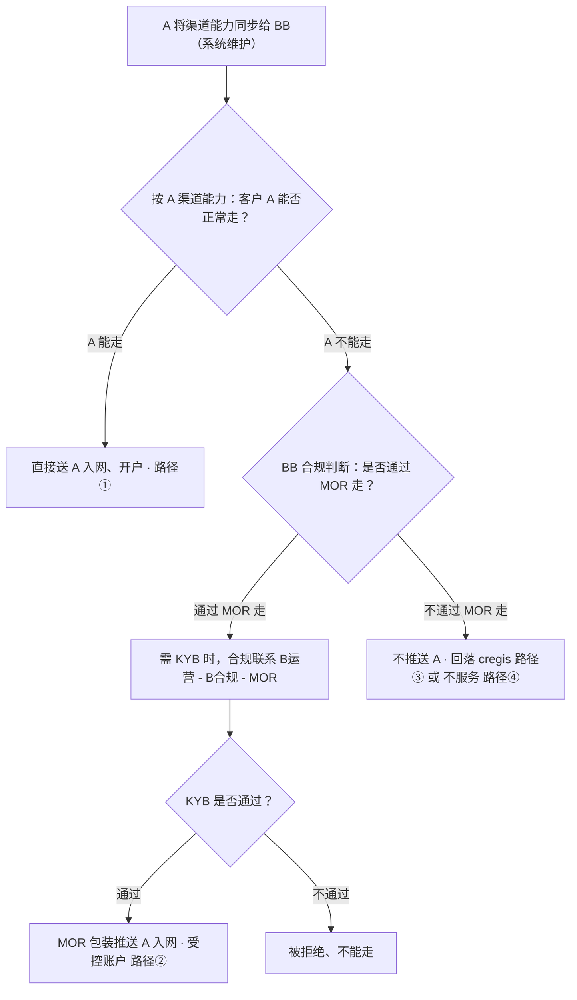

# MOR 落地方案-offramp

> **文档定位**：MOR（桥接收付主体）的可落地方案。MOR 原本主要设想用于 A-B 之间的展业，但在落地中遇到现实阻碍（见 `B-MOR-A question.md`）。
>
> **本文重点**：按客户在 A 的资质状态，拆解出 **几条可落地的 OffRamp 出款路径**（路径①②③④），并明确每条路径的流程与部门分工。
>
> **拓展主体**：这类客户 **B 和 EX（EXTP）都可以拓展，两者没有优先级**——谁有资源、谁能签到客户就由谁承接；下文的落地路径与部门分工对两者通用。

---

## 一、主体与术语

| 代号             | 主体                                                                    | 能力 / 定位                                                                                 |
| ---------------- | ----------------------------------------------------------------------- | ------------------------------------------------------------------------------------------- |
| **EX**     | EX 科技平台                                                             | 提供租户白牌系统，对接 / 集成各 SP 能力（承兑、渠道）；B、cregis 等都是其集成的 SP / 渠道   |
| **A**      | 法币持牌主体（法币 PSP，如 Airwallex / IPL 类）                         | VA、POBO、银行通道、跨境法币收付；客户准入严，不接数币背景 / 缺材料客户                     |
| **B**      | 数币持牌承兑主体（MSB / VASP，EX 集成的 SP 之一，作为 EX 租户拓展直客） | U 钱包、链上结算、OnRamp / OffRamp 承兑；法币能力弱                                         |
| **MOR**    | 桥接收付主体（Merchant of Record，前身文档中的 T）                      | 在 A、B 均入网；提供合规材料、做异名收 / 付、承担调单应答                                   |
| **EXTP**   | EX 平台上的自营白牌租户                                                 | 用 EX 白牌系统对外展业，自身已有代收付业务；签约后作为商户入驻本租户，在该商户下做 MOR 方案 |
| **cregis** | 外部承兑渠道                                                            | 千2 费率 + 1:1；将数币交给它由其承兑，速度较快；调单由 cregis 协助处理                      |

### MOR 的主要作用

1. **服务 BB 的 SRO 方案**：MOR 是 BB SRO 方案的承接主体，目前 **正常推进中**（Kevin 跟进）。
2. **B-A 之间的桥接**：在 B 与 A 之间做合规桥接。
3. **广告一代等场景的跨 PSP 承接**：这类客户多在其他 PSP（如 **Airwallex / AW**，一代客户较多）入网，可由 **MOR 在 AW 开户** 承接。
   - **痛点**：AW 同名充值收 **千1 手续费**，**B 的客户目前无法接受该费用**——是该场景能否落地的关键权衡点。

---

## 二、落地方案总览

1. **两套方案**：本质是 **B-A** 与 **B-cregis** 两套出款方案。
   - **B-A（路径①②）**：客户经 B 承兑后通过 **A** 出款。路径①是 **A 正常能服务** 的客户；路径②是 **A 正常不能服务、需 MOR 包装成 A 可服务** 的客户。
   - **B-cregis（路径③）**：不走 A，经 **cregis** 承兑出款，是标准的渠道对接流程。
   - **不服务（路径④）**：风控判定风险极高，直接拒绝。
2. **该客户做 MOR 方案，在 A、B 都开户入网。**
3. **准入分流机制**：**A 将渠道能力同步给 BB**（可系统维护），BB 据此分流——**A 能走** 直接送 A 入网开户；**A 不能走** 由 **BB 合规** 判断是否走 MOR：走 MOR 且需 KYB 时按 **B 运营 → B 合规 → MOR** 链路完成，**KYB 不过则拒绝**，**不走 MOR 则不推 A**（回落 cregis / 不服务）。详见第三节「准入分流决策流程」。
4. **业务节奏**：当前阶段聚焦 **OffRamp**；**OnRamp 暂只做 VA 收款**，不在本文展开。

---

## 三、方案与场景拆解（OffRamp 为主）

本质是 **B-A** 与 **B-cregis** 两套出款方案。共同前提：客户已由 **B 或 EX（EXTP）** 拓展，并在 **A、B** 开户入网；数币资金已到 **B** 的地址，客户在 B 发起 OffRamp。**按客户在 A 的资质状态分流**。

### 准入分流决策流程（如何决定走哪条路径）

**机制前提**：**A 将渠道能力同步给 BB**（可系统维护渠道能力），BB 据此判断客户在 A 是否能正常走。

1. **A 能正常走** → **直接送 A 入网、开户**（走 **路径①**）。
2. **A 不能走** → 由 **BB 合规判断「是否通过 MOR 来走」**：
   - **通过 MOR 走**：当 BB 需要 **KYB** 时，合规按链路联系 **B 运营 → B 合规 → MOR** 完成 KYB；
     - **KYB 通过** → 以 **MOR 包装推送 A 入网**（受控账户，走 **路径②**）；
     - **KYB 不通过** → **被拒绝、不能走**。
   - **不通过 MOR 走**：**不推送 A**，回落到 **cregis（路径③）** 或 **不服务（路径④）**。

**分流结果汇总**：

| 客户在 A 的状态                                                                         | 出款路径                                                                                                                      | 出款主体         |
| --------------------------------------------------------------------------------------- | ----------------------------------------------------------------------------------------------------------------------------- | ---------------- |
| 完全通过（KYC + 交易都符合）                                                            | **B-A** · 路径①：MOR 向 A 提供内容、A 的 KYC 通过（A 不暴露）                                                         | 客户自己         |
| KYC 通过，但交易类型不在 A 范围                                                         | **B-A** · 路径②：A 合规允许下开**受控账户**（功能受限只能提现），MOR `1→n` 转入，调单由 MOR 提供资金来源材料 | 客户（受控账户） |
| A 不能服务的客户&MOR 也没法满足的；比如客户说是大宗等无法满足 A 合规要求，故不在 A 入网 | **B-cregis** · 路径③：在外部渠道**cregis** 走交易（两种模式见下）                                               | cregis           |
| 风控判定风险极高                                                                        | 路径④：**不服务**（风险不可控，直接拒绝）                                                                              | —               |

### 参与部门与总体职责

| 部门                        | 总体职责                                                                                         |
| --------------------------- | ------------------------------------------------------------------------------------------------ |
| **商务 / 销售（BD）** | 拓客、签约 EXTP / 客户；客户真实业务摸底；渠道（cregis）商务对接                                 |
| **风控合规**          | 客户准入尽调与画像分级；KYC / KYT；与 A 谈受控账户并取得放行；调单材料体系与话术；不服务客群拦截 |
| **资金组**            | MOR 在 A / B 的账户与额度管理；数币归集与 OffRamp 资金调拨；敞口 / 冻结监控                      |
| **产研**              | 链路系统化：数币归集、`1→n` 转账、受控账户功能管控、调单材料调取、路由分流                    |

> 下文按 **两套方案** 拆解：**方案一 B-A**（路径①②）、**方案二 B-cregis**（路径③）；**路径④ 不服务** 单列。

### 方案一：B-A（路径①②）

客户经 B 承兑后通过 **A** 出款。

> **核心前提（重要）**：B-A 走通的目的是 **不暴露 A**——**默认把客户推到 A**，且 **A 的 KYC 能通过，是因为最终都由 MOR 向 A 提供内容 / 材料**（客户不直接对接 A）。在此前提下，按客户业务是否在 A 的正常服务范围分两条路径：路径①是 **业务在 A 正常服务范围**，路径②是 **业务不在 A 服务范围、需 MOR 包装成 A 可服务**。

#### 路径①：业务在 A 正常服务范围 —— MOR 提供内容、A 的 KYC 通过

- 客户业务本身 **在 A 的正常服务范围**（KYC + 交易都符合）。仍由 **MOR 向 A 提供内容 / 材料** 完成入网与 KYC，**A 不暴露给客户**；因业务合规，无需额外的账户管控改造，流程最轻。

#### 路径②：A 正常不能服务的客户 —— MOR 包装成 A 可服务（受控账户 + 客户仅提现）

> 调整说明：原"MOR → A2A → 客户自名 POBO"改为 **在 A 合规允许的前提下，为该客户开「受控账户」**：客户在 A 的账户 **功能受限，只能提现**（仅允许 MOR 以 `1→n` 转入 + 客户提现，不能做其他操作）；**调单时由 MOR 协助提供调单材料（说明客户的资金来源）**。

**路径②与路径①的区别：**

- 两条路径 **都不暴露 A、都默认推到 A、都由 MOR 向 A 提供内容**；区别只在 **客户业务是否在 A 的正常服务范围**。
- 路径②这类客户的业务 **不在 A 正常服务范围**（从 A 的合规政策 / 渠道调单场景看不服务其背景）；若按路径①的常规方式处理，调单时资金来源与贸易背景对不上、会被驳回。因此需要 **受控账户** 把业务 **包装为在 A 服务范围内** 的合规形态：A 仅放行 MOR `1→n` 转入、客户仅提现，调单时由 MOR 提供贸易背景与资金来源。
- **限制只能提现** 也是为了 **避免客户在 A 做 `1→n` 对外付款**：`1→n` 的调单成本更高——成本 **不是材料花费，而是向渠道解释、风险控制等沟通成本**。

1. 系统自动将 **客户数币 → MOR 数币**
2. **MOR OffRamp：从 B → A**
3. **A 内**：A 仅允许 **MOR `1→n` 转给客户**（受控账户，白名单只放行 MOR 入金）
4. **客户在受控账户内仅可提现**（账户功能受限，不可做其他操作）
5. **调单时：MOR 协助提供调单材料**，说明客户的 **资金来源**

**前置条件：** 需 **A 合规允许** 并对「受控账户（仅 MOR 入金 + 只能提现）」模式做评估与配置。

**必要性分析（这种受控模式是否值得做）：**

- **解决调单归属问题**：若直接让客户自名 POBO，审核员调单会调到客户，而客户系统不感知 MOR、资金来源说不清，容易被驳回（参 `B-MOR-A question.md`）。受控账户（功能受限、只能提现）把客户在 A 的资金来源 **收敛为单一的 MOR 转入**；调单时 **MOR 协助提供资金来源材料**，可明确指向 MOR。
- **出款人=客户本人，POBO 更顺**：客户以自己名义出款，符合收款行"核实付款人即客户本人"的逻辑，比 MOR 异名付款更不易被收款方质疑。
- **风险隔离**：账户受控（限制只收 MOR、限制其他操作），降低客户拿该 A 账户去做不可控交易的风险。
- **代价与适用面**：强依赖 **A 合规配合 + 账户管控定制开发**；只适用于"KYC 能过、但交易类型不在 A 范围"的窄客群。**建议先评估这类客户规模**——若量小，定制成本可能不划算，这类客户可直接退回路径③（cregis）。
- **结论**：成立与否取决于 A 是否愿意做受控账户；A 不配合则路径②不成立，回落到 cregis。由于依赖定制、适用面窄、调单沟通成本高，**路径②作为优先级最低的场景**：能用路径①/③ 解决的优先走，仅在必要且 A 配合时启用。

#### B-A 方案 · 部门职责

> B-A（含路径①②）能否落地，**关键在 A 是否给出明确的合规要求与风控策略**；路径①基本无需各部门动作，路径②是 B-A 的工作重心。

| 部门                                 | 职责                                                                                                                                                        |
| ------------------------------------ | ----------------------------------------------------------------------------------------------------------------------------------------------------------- |
| **BB 合规（准入分流）**        | 接收 **A 同步的渠道能力**；判断 **A 能否走**；A 不能走时判断 **是否通过 MOR 走**；不走 MOR 则不推 A（回落 cregis / 不服务）                                  |
| **B 运营 → B 合规 → MOR（KYB 链路）** | 走 MOR 且需 **KYB** 时的联系与执行链路：**B 运营** 发起 → **B 合规** 审核 → **MOR** 提供主体资料完成 KYB；**KYB 通过** 才包装推送 A，**不过则拒绝**          |
| **A 合规 / 法务（A 的 FIBD）** | 给出**具体合规要求**：要做的话怎么做——客户打什么 **标签**？客户 **账户功能如何管控**（如仅提现）？**一个 MOR 可以对应几个客户**？ |
| **A 合规（风控策略调整）**     | 风控策略如何调整：是否对**MOR–客户之间加白名单**；调单口径是否为 **「客户调单 + 银行调单时才调单」**                                           |
| **渠道 + 清算**                | 确认**可以走的渠道**，并做 **清算配合**                                                                                                         |
| **合规运营 + A 的 FIBD**       | **调单 / 风险场景的运营流程** 设计与执行                                                                                                              |
| **产研**                       | 对接渠道、产品开发                                                                                                                                          |
| **MOR**                        | 协助调单（提供客户贸易背景 + 资金来源材料）                                                                                                                 |
| **资金 / 清算**                | 对账、异常处理协助                                                                                                                                          |

### 方案二：B-cregis（路径③）

不走 A，客户经 **cregis** 承兑出款，本质是 **一个标准的渠道对接流程**。

#### 路径③：不在 A 入网（A 入网成本高 / 大宗无法满足 A 合规）—— 在 cregis 走交易

适用场景：**A 入网沟通成本太高**，或 **大宗等业务无法满足 A 的合规要求**，因此 **不在 A 入网，直接在 cregis 走交易**。这类客户画像与 cregis 的 **千2 费率 + 1:1** 相匹配，且 **调单由 cregis 协助处理**，MOR / EXTP 侧调单压力小。按集成方式分两种模式：

**模式 A：B 接 cregis 做渠道（cregis 作为 B 的下游承兑渠道）**

1. 客户数币到 **B** 的地址，在 B 发起 OffRamp
2. **B 将数币转给 cregis**，由 cregis 承兑得法币
3. cregis 下发法币给收款人
4. 客户体验上仍在 EXTP / B 体系内；cregis 是后端渠道

- 适用：希望 **统一入口在 B / EXTP**，客户不直接感知 cregis；B 侧需对接 cregis 渠道接口。

**模式 B：cregis 直接做 SP（收款地址由 cregis 生成，直接给 cregis 做 OffRamp）**

1. **收款地址直接由 cregis 生成**，客户数币 **直接打到 cregis**
2. **由 cregis 直接做 OffRamp** 承兑并下发
3. 不经 B 承兑，cregis 作为独立 SP 直连

- 适用：B 不便承接（如 B 入网 / KYT 不通过），由 cregis 作为 SP 直接承接；链路最短、到账快，但 EXTP 对资金的过程控制更弱。

#### B-cregis 方案 · 部门职责

> 本质是 **一个渠道对接的整体流程**，主导方是 **EX FIBD / 商务**。

| 部门                     | 职责                                                                                            |
| ------------------------ | ----------------------------------------------------------------------------------------------- |
| **EX FIBD / 商务** | 渠道对接整体流程：**渠道议价、渠道风险运营**、渠道能力评估与维护、费率（千2 + 1:1）与协议 |
| **法务**           | 渠道协议、法律风险评估                                                                          |
| **资金 / 清算**    | 对账、异常处理支持                                                                              |
| **产研**           | 产品开发、对接渠道（模式 A：B 接 cregis 渠道；模式 B：cregis 直连做 SP）                        |

### 路径④：风控判定风险极高 —— 不服务

- 对于 **风控判定风险极高** 的客户，**直接不服务**（风险不可控，主动拒绝）。
- 销售 / 合规需在 **准入阶段拦截**，避免被动接入。
- **分工**：风控合规制定风险极高判定标准；商务 / 销售准入拒绝；产研落地系统拦截规则。

---

## 四、风险

1. **客户尽调是最重要前提**：所有路径成立的根本前提，是 **销售必须充分了解客户的真实业务**，建议 **拉上合规一起做客户访谈与判断**。
2. **资金 / 冻结风险**：一旦合作机构发现风险，可能 **冻结 MOR 的资金**；即便是不垫资的模式，例如 cregis 也会 **冻结当前交易对应的数币**。需评估单笔与累计敞口。
3. **调单与材料风险**：路径②（受控账户）仍依赖 MOR 的材料准备（agent / 物流单据），材料不实或不齐将直接导致调单失败、账户受限；走 cregis 的路径③则由 cregis 协助处理调单。
4. **下发模式风险**：A 内 `1 → n`（MOR 转给多个客户）容易触发风控规则，需要在受控账户规则设计上提前规避。
5. **不服务客群边界**：风控判定风险极高的客户（路径④）已 **明确不服务**；销售 / 合规需在准入阶段拦截，避免被动接入。

---
