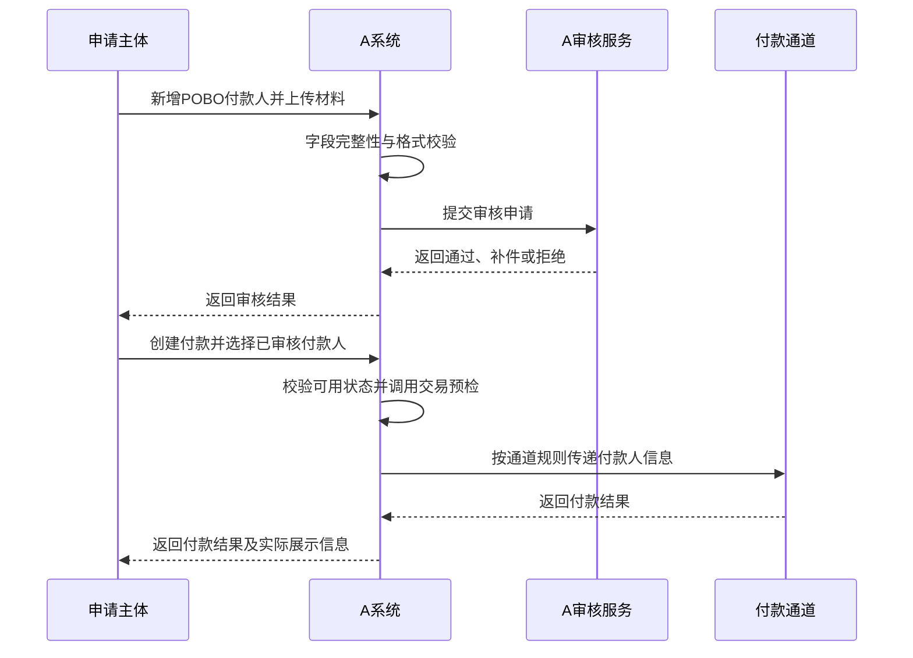

# A POBO 付款人管理 PRD

> 文档状态：待产品及技术评审；风控、合规结论由专项负责人补充
> 需求主体：A  
> 适用范围：本 task 统一承接 A 的 POBO 付款人主档、申请交互、审核状态衔接及付款引用能力
> 系统边界：本能力仅建设在 A，不涉及 EX 的页面、风控、数据存储、付款编排或接口  
> 核心原则：付款人须取得外部审核通过结果后方可用于付款；具体风控规则、模型、阈值及审核 SOP 不在本 PRD 展开。

---

## 一、术语和系统定位

| 术语 | 定义 |
| --- | --- |
| A | POBO 付款人建档、审核状态承接、付款和渠道对接的唯一能力主体 |
| POBO | Payment on Behalf Of，使用指定且已审核的实际付款人身份，代表该付款人向收款方发起付款 |
| POBO 付款人 | 与付款业务具有真实关系、希望在付款链路中作为实际付款人或最终债务人被识别的个人或企业 |
| 申请主体 | 已在 A 入网并获准使用 POBO 能力的商户或 MOR 运营主体 |
| 付款通道 | A 对接的银行或清算网络 |

### 1.1 当前现状

- 当前 A 没有 POBO 付款人管理、审核状态衔接和付款引用能力；
- 现有付款以账户户名或平台默认名义发起，实际贸易付款人与银行流水展示的付款人可能不一致；
- MOR、多商户、平台代付等场景已经提出“按真实付款人名义付款”的诉求，但目前缺少标准化准入和审核机制；
- 因此，POBO 付款人的产品需求、页面交互、状态、数据和接口统一收口在本 task；其他方案仅引用本能力及其结果，不再重复设计。EX 不参与本功能。

---

## 二、需求背景

### 2.1 国内外币账户收款和出口退税场景

亚马逊跨境电商、传统 B2B 出口等场景中，境外买家需要向境内出口企业的 USD、CNH 等外币账户支付货款。境内出口企业办理出口收汇、银行入账解释或出口退（免）税时，需要将合同、订单、发票、报关、收汇凭证等材料形成可解释的业务链路。

当前如果付款流水只展示 A、MOR 主体或其他资金账户主体，而不展示真实境外买家，容易产生以下问题：

- 银行流水中的付款人与合同约定买家不一致；
- 企业难以向银行、税务或外汇管理相关审核说明“谁在支付这笔货款”；
- 需要反复补充代付协议、订单、发票和资金关系说明；
- 收款行可能将交易识别为不明第三方付款，导致入账延迟、调单或退汇；
- 企业后续进行出口收汇核验、退税举证和财务审计时，单据匹配成本较高。

国家税务总局现行出口退（免）税管理规则将银行收汇凭证或结汇水单作为已收汇业务的重要举证材料；部分跨境服务场景还要求收款凭证中的付款单位与合同境外单位或约定的境外成员企业相匹配。因此，产品需要尽量保持付款人、合同对手方和收汇凭证之间的可解释性，但最终能否用于退税仍以收款企业主管税务机关、银行及适用政策判断为准。

### 2.2 为什么支付到其他国家或地区也需要 POBO

POBO 不只服务中国境内退税。支付到香港、新加坡、欧洲、英国、美国及其他地区时，同样存在“实际付款人识别”需求：

1. **跨境 B2B 供应商付款**  
   收款企业通常按合同买方、Invoice 抬头或客户编号核销应收账款。如果流水只显示平台或中间主体，收款方可能无法自动认领款项，需要人工解释或退汇。

2. **平台、Marketplace、MOR 代付**  
   平台统一持有资金并代多个商户付款时，资金账户持有人与实际贸易买方不同。POBO 可以在通道允许的范围内传递实际付款人，避免所有交易都显示同一平台主体。

3. **集团资金集中管理**  
   母公司、区域资金中心或共享服务中心代表子公司付款时，合同债务人可能是子公司。需要同时留存资金账户主体、实际付款人、合同主体及集团关系材料。

4. **广告、物流、仓储、SaaS 和专业服务费**  
   服务商需要按照客户主体和发票核销回款。付款人透明有助于应收账款匹配、税务及审计凭证留存，并减少不明第三方付款调查。

5. **佣金、分销和采购代理结算**  
   品牌方、代理商或分销商可能依据真实采购/代理关系代付。POBO 用于说明付款人与受益人的业务关系，但必须提供合同、订单、发票及代付授权。


6. **收款行 AML、制裁和付款透明要求**  
   多个司法辖区要求跨境汇款携带完整、准确且可追溯的付款人和收款人信息。信息缺失或付款人与业务材料无法对应，可能触发补件、暂停、拒绝或退汇。POBO 的目的不是隐藏资金账户主体，而是在 A 的付款报文和审计记录中准确传递通道支持的实际付款人/最终债务人信息。

### 2.3 产品价值

- 让付款流水与真实合同、订单、发票和付款授权关系更容易对应；
- 支持境内出口收汇及退税材料解释；
- 支持其他地区收款企业对账、入账和审计；
- 降低因付款人不明或第三方关系无法解释产生的 RFI、延迟和退汇；
- 在 A 内统一付款人申请和审核结果承接，避免通过线下方式传递付款人名称；
- 为 A 对接的银行和清算通道提供一致、可审计的 POBO 数据源。

### 2.4 监管和合规说明

- FATF Recommendation 16 强调跨境资金转移应携带所需且准确的付款人和收款人信息，并在支付链路中保持可追溯；
- 香港金管局关于电汇的 AML/CFT 指引同样要求付款机构根据其角色处理付款人信息；
- 欧盟 EBA 的资金转移指引要求支付服务商识别付款人/收款人信息缺失或不完整的交易，并采取风险控制措施；
- 上述资料支持“付款信息应完整、准确、可追溯”的产品方向，但不代表任意 POBO 模式在所有国家、牌照或付款通道均可使用；
- 上线国家、币种、付款通道、字段展示方式和法律责任必须由风控、合规、法务逐项批准。

---

## 三、产品目标与非目标

### 3.1 产品目标

1. 在 A 增加统一的“POBO 付款人管理”；
2. 支持个人、境内企业、非境内企业三类付款人申请；
3. 所有付款人先向 A 提交资料，再进入 A 指定的审核流程；
4. 仅审核成功、状态正常且在有效期内的付款人可被付款订单引用；
5. 付款时校验付款人可用状态、使用权限及通道能力，并调用风控专项提供的交易预检；
6. 将付款人申请、审核、付款引用、材料版本和状态变化全链路留痕；
7. 支持 A 按其银行和清算通道能力映射实际付款人/最终债务人字段。

### 3.2 非目标

- 不承诺所有通道的银行流水都能展示完全相同的 POBO 名称；
- 不允许客户任意输入一个名称后直接付款；
- 不以 POBO 隐藏 A、资金账户持有人或中间机构依法必须披露的信息；
- 不在 EX 建设 POBO 付款人页面、审核状态、主档或交易路由；
- 不允许通过 POBO 绕过客户入网、行业准入、制裁筛查、交易监控或外汇规则；
- 不替代出口企业、收款企业自行完成的税务、外汇和单据申报义务；
- 本期不支持未经审核的单笔临时 POBO 付款人。

---

## 四、用户与权限

| 角色 | 权限 |
| --- | --- |
| 商户操作员 | 查看本商户付款人、创建草稿、提交申请、按要求补件 |
| 商户管理员 | 包含操作员权限；可停用付款人、查看审核结果和付款引用记录 |
|  |
| A 审核角色 | 通过外部审核流程返回通过、补件、拒绝、冻结等标准结果；具体角色和审批机制由风控专项定义 |
| A 运营 | 联系客户/销售按照标准补件项补充或修改信息 |
| A 审计/合规 | 只读查询、导出审核及使用记录 |


---

## 五、核心业务流程

### 5.1 主流程



### 5.2 页面交互

页面交互见：[A-POBO付款人管理-交互文档.html](./A-POBO付款人管理-交互文档.html)

交互覆盖新增付款人、提交确认弹层、提交后返回列表、按状态编辑，以及删除二次确认。

---

## 六、功能需求

### 6.1 POBO 付款人列表

入口：`海外付款 → POBO 付款人`。

查询条件：

- 付款人名称；
- 付款人类型：个人、境内企业、非境内企业；
- 注册/居住国家或地区；
- 审核状态；
- 使用状态；
- 创建时间；
- 到期时间。

列表字段：

| 字段 | 说明 |
| --- | --- |
| 付款人编号 | A 内唯一编号 |
| 付款人类型 | 个人/境内企业/非境内企业 |
| 付款人名称 | 本地名称；敏感信息按权限脱敏 |
| 付款人英文名 | 用于国际付款报文 |
| 国家/地区 | 注册地或居住地 |
| 审核状态 | 草稿、审核中、待补件、通过、拒绝 |
| 使用状态 | 待启用、正常、冻结、失效、已停用 |
| 有效期 | 风控批准的有效期 |
| 最近使用时间 | 最近被付款订单引用的时间 |
| 创建时间 | 首次创建时间 |
| 操作 | 详情、补件、编辑、删除（仅草稿）、停用、查看使用记录 |

规则：

| 当前状态 | 是否可编辑 | 是否可删除 | 处理规则 |
| --- | --- | --- | --- |
| 草稿 | 可以 | 可以 | 删除前必须展示二次确认弹层；确认后物理删除草稿 |
| 审核中 | 不可以 | 不可以 | 如需修改，先撤回申请；撤回后生成新草稿版本 |
| 待补件 | 可以 | 不可以 | 仅允许按补件要求修改或追加资料，提交后重新审核 |
| 审核拒绝 | 可以 | 不可以 | 保留原审核记录；修改后生成新版本并重新提交 |
| 审核通过且正常 | 可以 | 不可以 | 关键字段修改后原版本停止新增付款引用，新版本重新审核；可执行停用 |
| 冻结、失效或已停用 | 条件允许 | 不可以 | 按重新审核或重新启用流程处理，保留历史记录 |

- 删除入口仅对“草稿”展示；已提交过审核或被历史订单引用的付款人均不可物理删除；
- 删除确认弹层必须展示付款人名称，并提示“删除后不可恢复”；
- 提交新增或编辑后的资料时，先展示确认弹层；用户确认后才进入审核流程；
- 提交成功后返回付款人列表，并展示最新审核状态；
- 列表中的“审核通过”和“正常”必须同时满足才可用于付款。

### 6.2 新增付款人——公共字段

| 字段 | 必填 | 规则 |
| --- | --- | --- |
| 付款人类型 | 是 | 个人、境内企业、非境内企业 |
| 国家/地区 | 是 | 取 A 国家地区字典；受限制地区不可选择或提交后直接拦截 |
| 本地名称 | 是 | 必须与证件或注册文件一致 |
| 英文名称 | 国际付款必填 | 必须与官方英文登记名称一致；无官方英文名时按合规规则转写 |
| 城市 | 是 | 境内使用省市联动，境外使用国家/州省/城市 |
| 详细地址 | 是 | 不允许仅填写邮箱、虚拟地址或明显不完整地址 |
| 手机号 | 条件必填 | 包含国家区号；企业可填写授权联系人号码 |
| 邮编 | 条件必填 | 按国家地址规则控制 |
| 申请主体与付款人关系 | 是 | 同一主体、关联公司、客户/买方、委托方、平台商户、其他 |
| 使用场景 | 是 | 出口货款、采购货款、服务费、物流仓储、广告费、集团代付等 |
| 预计国家/币种 | 是 | 多选；用于审核和通道能力校验 |
| 预计单笔/每月金额 | 是 | 供审核流程判断使用范围 |
| 合作材料 | 是 | 证明申请主体、付款人、收款人及交易之间关系的文件 |
| 备注 | 否 | 不得用于替代必填材料 |

### 6.3 非境内企业字段

- 企业注册证书类型及号码；
- 注册日期、注册有效期；
- 注册地址、主要经营地址；
- 董事姓名、证件号码及有效期；
- 最终受益人（直接或间接持股/控制超过 25%）信息，支持继续添加；
- 无超过 25% 受益人时，填写实际控制人或高级管理人员并说明；
- 企业官网、主要业务和 Industry Code；
- 税号或当地企业识别号（适用时）；
- 授权签字人及授权证明；
- 股权结构图（审核要求时补充）。

### 6.4 境内企业字段

- 公司名称/统一社会信用代码；
- 营业执照及有效期；
- 注册地址；
- 法人姓名、证件类型、号码及有效期；
- 最终受益人及实际控制人信息；
- 行业、经营范围；
- 企业联系人及手机号；
- 涉及跨境付款时的合同、发票、订单、代理/代付授权等材料。

### 6.5 个人字段

- 姓、名及完整姓名；
- 身份证、护照或当地有效身份证件；
- 证件号码及有效期；
- 出生日期、国籍、居住国家/地区；
- 证件地址和当前居住地址；
- 手机号；
- 职业、资金来源和付款目的；
- 与申请主体及收款人的关系证明。

个人 POBO 的开放范围及附加材料由风控、合规专项确定；产品侧不得仅凭姓名和证件号码启用。

### 6.6 合作和交易材料

至少上传以下材料之一组，具体由场景规则决定：

- 付款人与收款人之间的合同、订单和 Invoice；
- 出口贸易的订单、发票、物流/报关相关材料；
- 服务贸易的服务协议、交付证明和费用明细；

文件支持 PDF、JPG、JPEG、PNG；单文件默认不超过 20 MB，

### 6.7 详情和审核记录

详情页分区展示：

1. 基本资料；
2. 企业董事、法人、受益人或个人身份信息；
3. 业务关系、场景和预期交易；
4. 合作材料；
5. 审核状态及面向商户的标准结果；
6. 审核记录摘要；
7. 历史版本；
8. 付款引用记录；
9. 冻结、停用及失效记录。

商户侧仅展示标准化审核结果及可补充项，不展示内部审核细节。

---

## 七、审核与合规衔接边界

本 PRD 只定义产品与审核能力之间的衔接，不定义风控规则、模型、名单、阈值、复核层级或操作 SOP。相关内容由风控、合规专项负责人独立设计并评审。

产品侧仅需保证：

1. 提交时锁定付款人资料版本并生成唯一审核单号；
2. 接收“审核中、待补件、通过、拒绝、冻结/失效”等标准结果及可对客原因码；
3. 仅“审核通过 + 使用状态正常 + 未过期”的付款人可进入付款候选；
4. 付款前调用风控专项提供的交易预检，产品仅消费放行、拒绝或转人工结果；
5. 付款报文使用已审核版本快照，不允许临时修改付款人关键字段；
6. 内部审核细节与商户侧展示隔离，操作和结果全程留痕。


### 7.4 审核状态

```text
草稿 → 审核中 → 审核通过 → 正常
             ├→ 待补件 → 审核中
             └→ 拒绝

正常 → 冻结 / 已停用 / 已失效
冻结或失效 → 重新提交 → 审核中
```

状态规则：

- “待补件”不是通过，不能用于付款；
- “拒绝”后是否允许重新申请由原因码控制；
- “冻结”立即阻止新付款，但不改写历史订单；
- 证件、授权或合作材料到期前触发提醒，到期自动失效；
- 审核服务返回重新审核或冻结结果时，A 更新状态并立即阻止新付款。

---

## 八、付款交互与通道处理

### 8.1 创建付款

当商户选择支持 POBO 的付款产品时：

1. 系统展示可用 POBO 付款人列表；
2. 只展示该商户有权使用、审核通过、状态正常、未过期且符合国家/币种/场景的付款人；
3. 用户选择付款人后，页面展示名称、类型、国家和脱敏证件信息供确认；
4. 用户上传或关联本笔付款的合同、Invoice、订单及付款用途；
5. 提交后调用交易预检；
6. 获得放行结果后由 A 锁定付款人版本快照并生成付款指令；
7. A 根据实际银行/清算通道映射 Debtor、Ultimate Debtor、Ordering Customer 或等价字段；
8. 通道不支持或字段无法完整传递时必须阻断或改走明确支持的通道，不得静默退化为平台默认名义；
9. 付款完成后保存通道实际接收字段和可获得的流水展示结果。

### 8.2 订单快照

每笔 POBO 付款必须保存：

- POBO 付款人 ID 和版本；
- 付款人审核状态和审核单号；
- 付款人名称、国家、证件/注册号脱敏快照；
- 申请主体与付款人关系；
- 合同、Invoice、订单及材料哈希；
- 使用场景和付款用途；
- 交易预检结果、审核单号及外部规则版本标识；
- A 和实际付款通道；
- 发送给通道的付款人字段；
- 通道返回结果、RFI、退汇及最终状态。

### 8.3 失败和异常

- 付款人已冻结/过期：禁止提交，要求重新审核或更换付款人；
- 通道不支持 POBO：从候选通道剔除，无其他支持通道则失败；
- 通道返回付款人字段错误：不得自动删减关键字段重试；修正映射或转人工；
- 通道 RFI：关联原付款人审核材料和本笔交易材料，进入 A 统一工单处理；
- 收款行退汇：记录付款人不匹配、材料不足、收款限制或其他标准原因，并供相关专项分析；
- 付款状态未知：查询确认前不得重复付款或切换渠道。

---

## 九、数据和接口

### 9.1 核心数据对象

- `pobo_payer`：付款人主档；
- `pobo_payer_version`：资料版本；
- `pobo_payer_party`：董事、法人、受益人、实际控制人；
- `pobo_payer_relationship`：申请主体、付款人、收款人关系；
- `pobo_payer_document`：证件及合作材料；
- `pobo_review_case`：审核单及标准结果；
- `pobo_channel_capability`：渠道支持国家、币种、类型和字段；
- `pobo_payment_snapshot`：付款订单引用快照；
- `pobo_audit_log`：操作和状态记录。

### 9.2 主要接口

| 接口 | 用途 |
| --- | --- |
| 创建/保存付款人草稿 | 保存不同类型付款人资料 |
| 提交审核 | 锁定当前版本并创建风控审核单 |
| 补件/重新提交 | 追加材料并生成新审核版本 |
| 查询付款人列表/详情 | 按权限返回脱敏数据 |
| 冻结/停用/重新申请 | 管理使用状态 |
| 查询可用付款人 | 创建付款时按场景过滤 |
| 付款人交易预检 | 调用风控专项能力并结合通道能力返回是否可付款 |
| 创建 POBO 付款 | A 使用已锁定的付款人快照生成付款指令 |
| 审核结果回调 | 风控系统回传通过、补件、拒绝或冻结 |
| 通道能力查询 | 查询 POBO 支持范围及字段映射版本 |

所有创建和提交接口必须支持幂等；敏感字段传输和存储必须加密；回调必须验签、防重放并支持重复通知去重。

---

## 十、通知和运营

- 提交成功：通知进入风控审核，不承诺固定通过时间；
- 待补件：展示补件清单和截止时间，不展示风控模型细节；
- 审核通过：通知有效期、批准场景、国家、币种和额度；
- 审核拒绝：展示标准化原因类型及是否允许重新申请；
- 即将到期：建议提前 30/15/7 天通知；
- 冻结/失效：立即通知，并禁止新订单引用；
- 付款 RFI/退汇：关联付款人和原交易，进入统一工单。

---

## 十一、非功能要求

- 敏感信息按字段级加密和角色脱敏；
- 证件、受益人及审核数据仅授权角色可见；
- 审核和付款日志不可被普通运营修改；
- 历史订单引用快照不可因付款人后续编辑而变化；
- 列表和详情需要支持审计导出，导出需权限控制和水印；
- 国家、证件类型、行业、场景、关系和审核原因码均使用版本化字典；
- 付款人详情、付款订单和 RFI 工单之间可双向追溯；
- 数据保存期限由 A 适用牌照、司法辖区及数据政策确定。

---

## 十二、验收标准

1. A 中可以创建个人、境内企业和非境内企业三类 POBO 付款人；
2. 不同付款人类型展示对应字段和材料要求；
3. 未取得审核通过结果的付款人不能用于任何付款；
4. 审核通过但已冻结、过期或停用的付款人不能用于新付款；
5. 付款人关键资料修改后必须重新审核；
6. 付款时能按商户权限、国家、币种、场景和通道能力筛选可用付款人；
7. 每笔付款调用交易预检并保存付款人版本快照；
8. A 能使用已审核的 POBO 付款人创建付款指令，并按实际通道映射付款人字段；
9. 通道不支持 POBO 时不得静默使用平台默认付款人名称；
10. 系统可正确承接通过、待补件、拒绝、冻结及重新审核结果；
11. 付款人材料版本、审核结果和操作记录全链路可追溯；
12. 历史付款不受付款人后续修改、冻结或失效影响；
13. RFI、退汇和付款人不匹配原因可以关联至付款人及原订单；
14. 商户侧不可查看内部审核细节。

---

## 十三、分期建议

### 第一期：受控上线

- 非境内企业和境内企业付款人；
- 付款人列表、新增、详情、补件和停用；
- 对接 A 指定审核流程并承接标准结果；
- A 单一受控通道 POBO 字段映射；
- 出口货款和标准 B2B 采购/服务费场景；
- 单笔付款交易预检接口；
- 完整审计和订单快照。

### 第二期：扩展

- 个人付款人（须完成专项合规评审后开放）；
- 更多国家、币种、场景和付款通道；
- 自动企业信息核验和证件到期提醒（是否接入名单能力由风控专项确定）；
- 基于历史成功率和退汇原因的通道路由；
- 审核能力的进一步自动化由对应专项规划；
- 批量付款人和 API 接入。

---

## 十四、待确认事项

1. A 首期可用的银行/清算通道及其 POBO、Ultimate Debtor 字段能力；
2. 首期支持的国家、地区、币种、付款人类型和业务场景；
3. 银行流水最终显示 POBO 付款人、A、资金账户主体或组合信息的具体规则；
4. A、申请主体和 POBO 付款人的协议关系及付款授权文本；
5. 个人付款人是否首期关闭；本文建议第一期仅开放企业；
6. 超过 25% 受益人识别口径在各司法辖区的差异化规则；
7. 风控专项输出给产品的审核有效期、使用范围、预检接口和标准原因码；
8. 出口退税场景需要展示的付款字段和银行回单样式是否满足目标银行及主管机构要求；
9. 通道不支持 POBO 时是否允许用户主动改为普通付款；默认不得自动降级；
10. RFI、退汇和冻结的运营及客户沟通责任人。

---

## 十五、合规参考资料

> 以下资料用于说明产品设计背景，不替代 A 在具体牌照、司法辖区和通道下取得的正式法律/合规意见。

1. [国家税务总局《出口业务增值税和消费税退（免）税管理办法》](https://fgk.chinatax.gov.cn/zcfgk/c100012/c5247423/content.html)：已收汇业务的举证材料包括银行收汇凭证或结汇水单等。
2. [国家税务总局出口退（免）税收汇管理说明](https://www.chinatax.gov.cn/chinatax/n810356/n3010387/c5220124/content.html)：出口退（免）税与按规定收汇、收汇材料留存相关。
3. [FATF Recommendation 16 修订说明](https://www.fatf-gafi.org/content/dam/fatf-gafi/recommendations/Explanatory%20note%20for%20revised%20R.16.pdf.coredownload.pdf)：跨境资金转移中的付款人和收款人信息应准确并沿支付链路保留。
4. [香港金管局 AML/CFT Guideline（Wire Transfers）](https://www.hkma.gov.hk/media/eng/doc/key-information/guidelines-and-circular/guideline/Guideline_on_AML-CFT_%28for_SVFs%29_eng_May%202023.pdf)：规定电汇中付款机构、付款人及收款人信息处理要求。
5. [European Banking Authority：资金转移信息指引](https://www.eba.europa.eu/activities/single-rulebook/regulatory-activities/anti-money-laundering-and-countering-financing-terrorism/guidelines-information-requirements-relation-transfers-funds-and-certain-crypto-assets-transfers?version=2024)：要求识别和处理付款人或收款人信息缺失、不完整的资金转移。
