# B-A OffRamp 解决方案（渠道报备 + MOR 系统 + 交易）

> **文档定位**：本文按 **① 背景说明 ② 前置准备（角色定位、A 合规-B 合规流程、MOR 主体、A-B industries 映射）③ 具体 Case（A 报备与 KYB / 交易流程 / 调单 RFI）④ MOR 系统功能** 组织 **客户经 SP（B）走 A 渠道做 OffRamp（B-A 单渠道）** 的完整方案。
>
> **MOR 为单独部署的独立系统**（一个系统可有多家 MOR 公司）：对「**A 不能直接服务但在合规范围内**」的客户，报备 A 前 **先经 MOR 系统** 完成关系管理、双方合作资料包装；**调单（RFI）按是否 MOR 分流**。
>
> **本文只覆盖 A 这一条渠道（B-A），不含其他渠道**；已取消主子账户体系，客户始终只发起「一笔 OffRamp」。

---

## 一、背景说明

**目标：提升客户的 OffRamp 客户体验。**

终端商户在做 OffRamp 时，常遇到以下体验问题：

- **操作链路长**：商户需要自己在多个机构入网、自行开户收款，再手工发起出款，步骤繁琐、耗时长。
- **入网门槛不一**：部分商户能在法币渠道直接入网出款，部分商户因业务画像 / 渠道政策无法直接在法币渠道入账，体验割裂。
- **出款时效与确定性差**：跨账户的多步操作容易卡单，商户难以一站式完成。

**解决思路**：**统一为「客户直接 OffRamp」**——商户在租户端 **只发起一笔 OffRamp**，由 **SP（B）承兑、A 渠道出款**，承兑 + 出款一步到位。对 **A 不能直接服务但在合规范围内** 的客户，**报备 A 前先经 MOR 系统包装**（合同 / 材料），商户无需感知底层链路即可获得「一笔下单、直接到账」的体验。**不再使用主子账户 / 主账户中转 / A-A 划转。**

---

## 二、前置准备

### 2.1 角色与定位

分层模型：**租户（BB / 其他租户）→ SP（B）→ 渠道（A）**，旁挂 **MOR 系统（单独部署的独立子系统）**。**本文只覆盖 A 这一条渠道（B-A），不含其他渠道；不再有主账户 / 子账户层级。**

| 角色               | 说明                                                                                                                                                               |
| ------------------ | ------------------------------------------------------------------------------------------------------------------------------------------------------------------ |
| **租户**     | 展业主体（类似大代理）：BB 或其他租户，对终端商户展业的入口 / 品牌方；商户在租户端完成所有操作                                                                     |
| **SP（B）**  | KYC 审核主体 + 资金承接（承兑）主体：接收入网、按 A 要求推送 / 审核 KYC、判断能否走 A；负责 OffRamp 承兑（数币→法币）。报备 A 前对接 MOR 系统拿到包装好的合作资料 |
| **A**        | SP（B）背后的法币渠道（channel / PSP）：负责法币入账与出款；做渠道报备审核（通过 / 拒绝 / 需补充资料）、合规调单（RFI）；入网结果不同步给租户                      |
| **MOR 系统** | **单独部署的独立系统**：一个系统可有多家 MOR 公司；管理 MOR 公司与客户关联关系，提供双方合同、Agent 生成材料，并对接 API 回传调单（RFI）材料                 |
| **DBS**      | VA（虚拟账户）开户银行；VA 用于**客户验证**（开户不通知、打特殊标记，非真实交易 VA）                                                                         |

**关键原则：**

1. 租户 = 展业主体；**SP = B** = KYC 审核 + 承兑主体；**A = 渠道**。入网到 SP，由 SP 推送 / 审核 KYC 并判断能否走 A。
2. **统一客户直接 OffRamp**：取消主子账户 / 主账户中转 / A-A 划转；所有客户都用自有账户直接 OffRamp。
3. 对终端商户做 fully KYC&KYB
4. **MOR 包装**：对分类 2（A 不能直接服务但在合规范围内）的客户，报备 A 前先过 MOR 系统；调单（RFI）按是否 MOR 分流。
5. 商户端只发起一笔 OffRamp，承兑 + 出款一步到位。

**一期范围（灰度）：** 先开放给 **直客** 与 **一个其他租户**；**BB 侧需控制 MOR 数量与交易量范围**（具体阈值待定）。

### 2.2 A 合规 - B 合规的流程

- 提前完成 **A-B 之间的 KYC/KYB 对齐**（如 industries 映射），由 **B 合规** 整理b的industires 映射为A的合规分类（见 2.4）；
- **调单（RFI）路由前置约定**（交易发生前先按客户/交易归属配置好接收路由，避免临时判断）：

  - **B 租户自有的客户/交易**：A 合规调单 **直接发给 B 合规**，**不经过 B 运营**（与其他客户链路不同）；
  - 该路由在 RFI 受理时即生效，B 合规与 B 运营按归属各自接收对应调单。

### 2.3 MOR 主体

- **单独部署的独立系统**，一个系统中可有 **多家 MOR 公司**；
- 管理 **MOR 公司与客户** 的关联关系，生成 **双方合作资料（合同 / invoice）**，并对接 API 回传调单（RFI）材料；
- 仅对 **分类 2** 客户启用：报备 A 前先经 MOR 系统包装为 A 可服务（功能明细见第四节）。

### 2.4 A-B industries 映射关系（合规分类）

由 **B 合规** 把客户业务画像（industries 等）映射为三类：

| 分类   | 含义                          | 报备处理                                                                |
| ------ | ----------------------------- | ----------------------------------------------------------------------- |
| 分类 1 | A 合规完全可以                | industries A 完全支持；直接推送到 A                                     |
| 分类 2 | 在合规范围内、但 A 暂不允许   | industries A 不支持但场景合规；自动打 MOR 标签，经 MOR 系统包装后报备 A |
| 分类 3 | A 完全不允许（对 A 风险较大） | 对 A 风险较大；不推送 A、不服务                                         |

**A 能力的基本维护**：渠道能力配置 **industries**（A-B 映射好）、**同名 / 非同名** 配置。

---

## 三、具体 Case

> 三个核心 Case 均按 **前置条件 / 时序图 / 业务规则 / 验收标准 / 待办** 五个模块组织。

### Case 1：A 报备与 KYB

> 客户入网 BB 后，按 **渠道能力 + 合规分类** 决定是否报备 A、是否经 MOR，并最终 **开 DBS VA** 决定 A 渠道是否可用。

> **核心原则（报备时机：入网即报备，与交易解耦）**：商户 **入网 B 后立即触发报备**（异步进行：分类判断 → 报备 A → A 审核 → 开 DBS VA），把 A 渠道的可用性 **在交易之前** 就准备好。**绝不在 OffRamp 交易时才去报备**——报备 + KYB + 开 VA 链路较长，若放到交易中会导致 **交易处理超时、时效极差**。交易发生时该商户在 A 的报备应已完成、渠道处于「可用」状态，OffRamp 才能一笔到位。

**前置条件：**

- 已完成 2.2 的 A 合规-B 合规对齐与 2.4 的 A-B industries 映射；
- 客户已在租户端开通「买入数币 / OffRamp」并入网到 SP（B），完成 **fully KYC**；
- A 已把 **渠道能力（industries、同名 / 非同名）** 同步给 BB。

**时序图：**

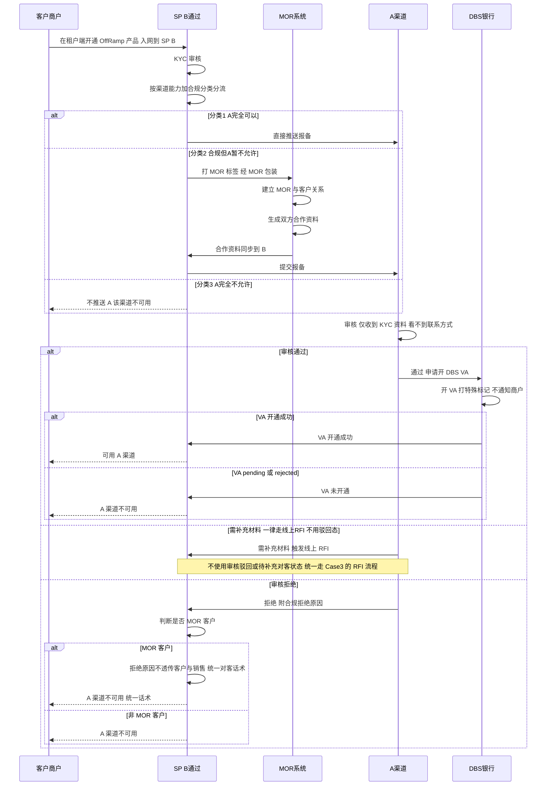
```mermaid
sequenceDiagram
    participant CU as 客户商户
    participant SPB as SP B通过
    participant MOR as MOR系统
    participant A as A渠道
    participant DBS as DBS银行

    CU->>SPB: 在租户端开通 OffRamp 产品 入网到 SP B
    SPB->>SPB: KYC 审核
    SPB->>SPB: 按渠道能力加合规分类分流

    alt 分类1 A完全可以
        SPB->>A: 直接推送报备
    else 分类2 合规但A暂不允许
        SPB->>MOR: 打 MOR 标签 经 MOR 包装
        MOR->>MOR: 建立 MOR 与客户关系
        MOR->>MOR: 生成双方合作资料
        MOR->>SPB: 合作资料同步到 B
        SPB->>A: 提交报备
    else 分类3 A完全不允许
        SPB-->>CU: 不推送 A 该渠道不可用
    end

    A->>A: 审核 仅收到 KYC 资料 看不到联系方式
    alt 审核通过
        A->>DBS: 通过 申请开 DBS VA
        DBS->>DBS: 开 VA 打特殊标记 不通知商户
        alt VA 开通成功
            DBS->>SPB: VA 开通成功
            SPB-->>CU: 可用 A 渠道
        else VA pending 或 rejected
            DBS->>SPB: VA 未开通
            SPB-->>CU: A 渠道不可用
        end
    else 需补充材料 一律走线上RFI 不用驳回态
        A->>SPB: 需补充材料 触发线上 RFI
        Note over SPB,A: 不使用审核驳回或待补充对客状态 统一走 Case3 的 RFI 流程
    else 审核拒绝
        A->>SPB: 拒绝 附合规拒绝原因
        SPB->>SPB: 判断是否 MOR 客户
        alt MOR 客户
            SPB->>SPB: 拒绝原因不透传客户与销售 统一对客话术
            SPB-->>CU: A 渠道不可用 统一话术
        else 非 MOR 客户
            SPB-->>CU: A 渠道不可用
        end
    end
```

**业务规则：**

0. **报备时机（入网即报备、与交易解耦）**：报备由 **入网 B** 通过后触发并 **异步执行**，与 OffRamp 交易完全解耦；**不允许在交易时才发起报备**。交易只校验该商户 A 渠道是否「可用」，可用才放行，避免报备链路拖长交易、造成超时；
1. **分流**：SP（B）按渠道能力 + 合规分类判断——分类 1 直推 A；分类 2 打 MOR 标签经 MOR 系统包装后推 A；分类 3 不推 A、不服务；
2. **MOR 包装（仅分类 2）**：MOR 系统先 **建立 MOR 与客户关系**，再 **生成双方合作资料**，同步到 B 后再提交 A；
3. **入网报备材料**：默认只提供 **合同 / PI**；若 A 要求 **额外资料**，不在常规链路自动补，**需走特批流程** ，根据特批流程确认是否补充，何时补充（比如特批拒绝，必须补充，则必须补充；特批通过，后面渠道调单时补充）
4. **A 审核结果（三种，统一口径）**：
   - **审核通过**：无问题 → 开 DBS VA（开通成功才算 A 可用，pending / rejected 则 A 不可用）；
   - **需补充材料**：**不使用「审核驳回 / 待补充」这类对客状态**，**一律走线上 RFI 流程**（见 Case 3），由 B 合规按是否 MOR 编排补料；
   - **审核拒绝**：该商户不可用 A 渠道；**拒绝原因处理见规则 4.1**；
     4.1. **拒绝原因不得原样透传（关键）**：A 的拒绝原因由合规书写、常针对 **MOR 提供的材料**，**对 MOR 客户不能原样透传**——否则：① 客户看到会 **蒙蔽**（材料并非其本人提供）；② 客户联系销售，销售同样 **蒙蔽**（客户没提供过、实为 MOR 提供）。因此对 **MOR 客户** 一律 **屏蔽合规原文原因、对客/对销售统一话术**（如「当前渠道暂不可用」），原始原因仅合规 / 受控租户内部可见；**非 MOR 客户** 可按常规告知；
5. **信息边界（A 看不到终端商户联系方式）**：
   - **注册信息（登录 / 联系方式）不向 A 同步**，避免 A 直接触达终端商户、绕过租户与 SP；
   - **仅 KYC 资料可同步给 A**（KYC 开户主体 ≠ 注册登录 user，不暴露注册用户身份与联系方式）；
6. **DBS VA**：入网完成后立即开 VA 做验证，**开户不通知商户、打特殊标记**（合规知晓为验证用途、非真实交易 VA）；OffRamp 过程中不再重复校验。

**验收标准：**

- 报备由入网触发、异步完成，**不阻塞 / 不嵌入** OffRamp 交易；交易时只读「A 渠道可用状态」；
- 分类 1/2/3 能正确分流；分类 2 经 MOR 包装链路打通（关系 → 合作资料 → 同步 B → 提交 A）；
- A 仅收到 KYC 资料，**收不到注册联系方式**；入网结果不回传租户；
- 审核通过后自动开 DBS VA，并据 VA 状态判定 A 可用性；
- **需补充材料** 不出现「审核驳回 / 待补充」对客状态，统一转 **线上 RFI**（Case 3）；额外资料须走特批；
- **审核拒绝** 时，MOR 客户 **屏蔽合规原文原因、对客与对销售统一话术**；非 MOR 客户可常规告知。

**待办：**

- A-B 合规分类字典与 industries 映射维护；
- DBS VA 标记规则与「不通知商户」实现，并与 A 合规确认是否批量开、成本 / 风险；
- 报备分流、A 审核结果回传、开 VA 状态落地；
- 入网触发异步报备的任务编排、状态机（报备中 / 可用 / 不可用 / 待补充）与重试机制。

---

### Case 2：交易流程（OffRamp）

**前置条件：**

- Case 1 已完成：A 渠道对该商户可用（KYC 通过 + DBS VA 开通，如配置要求）；
- 商户已在 B 持有数币，已添加并审核通过 **收款人**。

**时序图：**

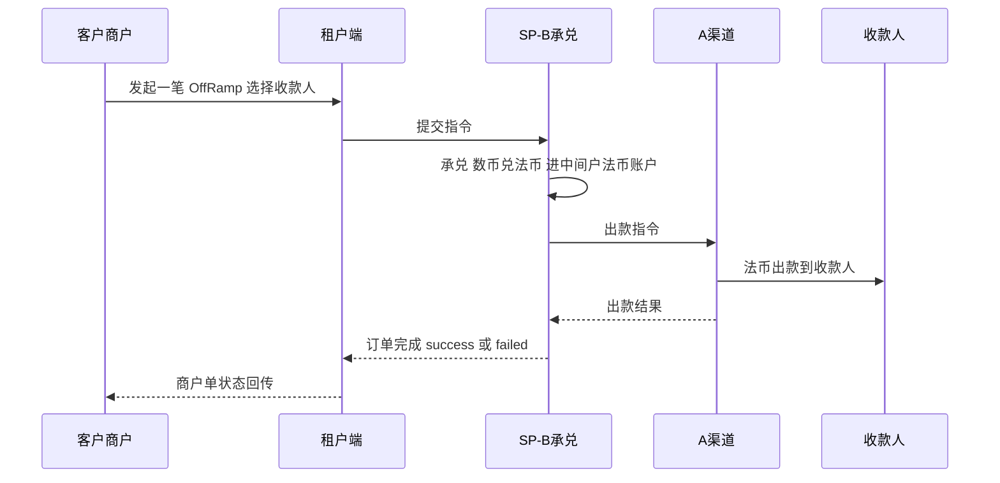
```mermaid
sequenceDiagram
    participant M as 客户商户
    participant T as 租户端
    participant SP as SP-B承兑
    participant A as A渠道
    participant P as 收款人
    M->>T: 发起一笔 OffRamp 选择收款人
    T->>SP: 提交指令
    SP->>SP: 承兑 数币兑法币 进中间户法币账户
    SP->>A: 出款指令
    A->>P: 法币出款到收款人
    A-->>SP: 出款结果
    SP-->>T: 订单完成 success 或 failed
    T-->>M: 商户单状态回传
```

**OffRamp 商户单状态机：**

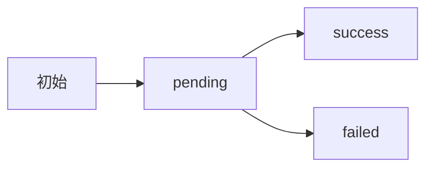
```mermaid
flowchart LR
    INIT["初始"] --> PEND["pending"]
    PEND --> SUC["success"]
    PEND --> FAIL["failed"]
```

**业务规则：**

1. **一笔到位**：B 承兑（数币 → 法币）后由 A 出款，承兑 + 出款一步到位（**中间户模式**，不经客户 VA 入账）；
2. **商户单状态机**：初始 → pending → success / failed；
3. **路由**：B 侧按 **渠道能力 + 是否 MOR** 路由；路由前先查 **渠道黑名单**——命中黑名单的商户 **不可路由到 A**（黑名单见 Case 4）；
4. **反向（退款 / 退票）**：按照现有流程（不做反向承兑，见 `refund.md`）；
5. **A 不可用**：本文仅 A 单渠道，A 开户未成功 / 不放行时该商户 **暂不可 OffRamp**，等待 A 恢复或经 MOR 重新报备（无跨渠道切换）。

**验收标准：**

- 正向承兑 + 出款一步完成、状态机正确流转；
- 路由按渠道能力 / 是否 MOR 生效，**命中渠道黑名单不路由到 A**；
- 反向流程与原来一致。

**待办：**

- OffRamp 状态机与现有中间户流程对齐；
- 针对 MOR / 非 MOR 的渠道能力维护与路由；
- **渠道黑名单配置与路由拦截**（见 Case 4）。

### Case 3：调单流程（RFI）

**前置条件：**

- 交易已发生或在途；A 合规对某笔交易或某客户发起调单；
- A-B 调单流程已设置且可行：**A 合规直接发 B 合规，由 B 合规直接发起 RFI**。

**时序图：**

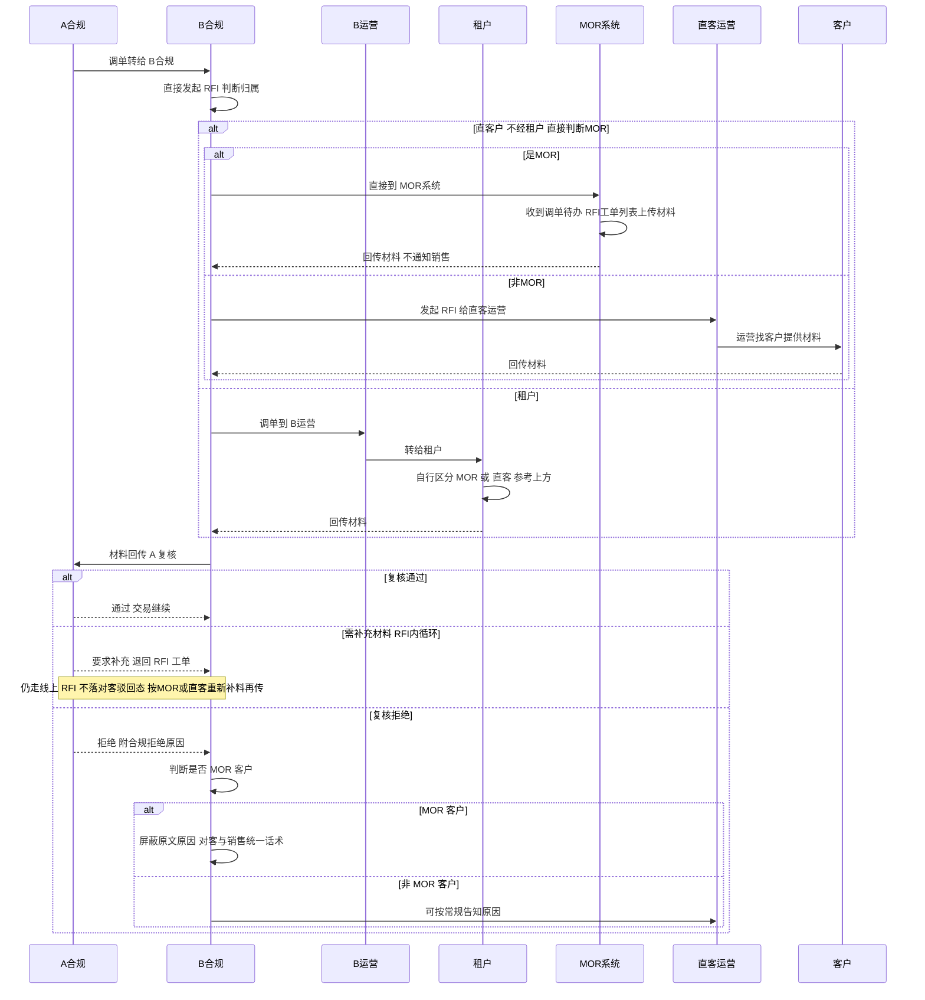
```mermaid
sequenceDiagram
    participant A as A合规
    participant BC as B合规
    participant BO as B运营
    participant TEN as 租户
    participant MOR as MOR系统
    participant DO as 直客运营
    participant C as 客户
    A->>BC: 调单转给 B合规
    BC->>BC: 直接发起 RFI 判断归属
    alt 直客户 不经租户 直接判断MOR
        alt 是MOR
            BC->>MOR: 直接到 MOR系统
            MOR->>MOR: 收到调单待办 RFI工单列表上传材料
            MOR-->>BC: 回传材料 不通知销售
        else 非MOR
            BC->>DO: 发起 RFI 给直客运营
            DO->>C: 运营找客户提供材料
            C-->>BC: 回传材料
        end
    else 租户
        BC->>BO: 调单到 B运营
        BO->>TEN: 转给租户
        TEN->>TEN: 自行区分 MOR 或 直客 参考上方
        TEN-->>BC: 回传材料
    end
    BC->>A: 材料回传 A 复核
    alt 复核通过
        A-->>BC: 通过 交易继续
    else 需补充材料 RFI内循环
        A-->>BC: 要求补充 退回 RFI 工单
        Note over BC,A: 仍走线上 RFI 不落对客驳回态 按MOR或直客重新补料再传
    else 复核拒绝
        A-->>BC: 拒绝 附合规拒绝原因
        BC->>BC: 判断是否 MOR 客户
        alt MOR 客户
            BC->>BC: 屏蔽原文原因 对客与销售统一话术
        else 非 MOR 客户
            BC->>DO: 可按常规告知原因
        end
    end
```

**业务规则：**

1. **入口**：A 合规调单统一发 **B 合规**，由 **B 合规直接发起 RFI**；RFI 是 **单独流程**，**不复用「待补充资料」**（否则让客户 pending、阻塞交易）；
2. **直客户（不经租户，直接判断是否 MOR）**：
   - **是 MOR**：直接到 MOR 系统。MOR 在 **MOR 系统的 RFI 工单列表** 收到一笔调单待办，可操作上传材料；
     - **MOR 不能给销售发通知**；
     - **已知问题（待解决）**：运营与销售相互隔绝、通知机制缺位、**后续不能像 A 那样把权限授权给销售**——这块需单独设计；
   - **不是 MOR**：与现有流程一致——合规发起 RFI 给 **直客运营**，运营找客户提供材料；
3. **租户**：合规发起调单到 **B 运营 → 租户**；**租户自行区分** 是 MOR 还是直客，按上面「直客户」规则处理；
4. **MOR 系统数量**：本期 **只有一个 MOR 系统**；后续 MOR 系统增多，**B 系统需要一套分配（路由到对应 MOR 系统）机制**。
5. **A 复核结果（三种，统一口径）**：
   - **复核通过**：无问题，交易继续；
   - **需补充材料**：**仍在线上 RFI 内循环**——退回 RFI 工单、按 MOR / 直客重新补料再传，**不落对客「驳回 / 待补充」状态**；
   - **复核拒绝**：**拒绝原因不得原样透传**——对 **MOR 客户** 屏蔽合规原文原因、对客与对销售 **统一话术**（因材料实为 MOR 提供，客户与销售均未提供、看到原因会蒙蔽），原文仅合规内部可见；**非 MOR 客户** 可常规告知。

**验收标准：**

- A 合规调单统一进 B 合规并由 B 合规发起 RFI；RFI 与「待补充资料」隔离、不阻塞交易；
- 直客 MOR：**不经租户、直接到 MOR 系统**；MOR 工单列表可接收并上传材料；**MOR 不触达销售**；
- 直客非 MOR：走「直客运营 → 客户」现有流程；
- 租户：到「B 运营 → 租户」，租户自行区分 MOR / 直客并回传；
- 多 MOR 系统下，B 侧分配机制能路由到正确的 MOR 系统；
- **复核通过/需补充/拒绝** 三态正确：需补充在 RFI 内循环、不落对客驳回态；拒绝时 MOR 客户屏蔽原文原因、统一话术。

**待办：**

- B 合规 RFI 发起入口与工单；
- MOR 系统 RFI 工单列表、材料上传与待办通知（且 **不通知销售**）；
- 运营 / 销售隔离与授权边界设计（明确 MOR 不可授权给销售）；
- 多 MOR 系统的 B 侧分配 / 路由机制（本期单 MOR，预留扩展）；
- 各场景 RFI 材料清单、SLA 与话术模板。

---

### Case 4：风险处置与渠道黑名单

**前置条件：** 交易中或交易后，A 发现风险线索（如多个商户使用同一汇款人信息）。

**业务流程：**

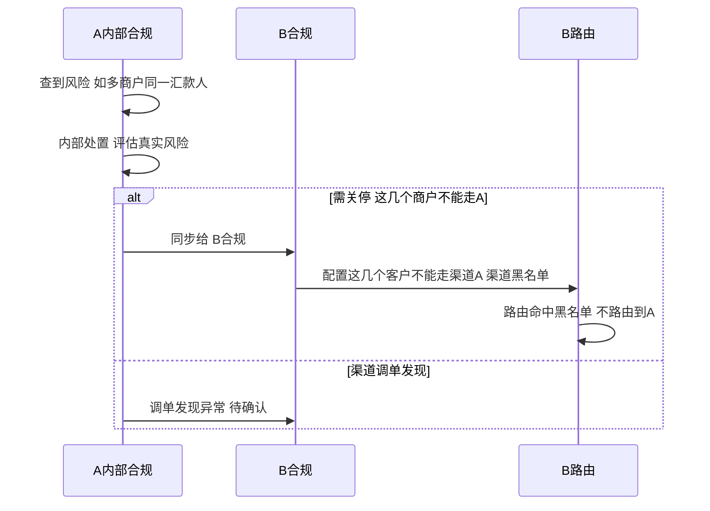
```mermaid
sequenceDiagram
    participant A as A内部合规
    participant BC as B合规
    participant BR as B路由
    A->>A: 查到风险 如多商户同一汇款人
    A->>A: 内部处置 评估真实风险
    alt 需关停 这几个商户不能走A
        A->>BC: 同步给 B合规
        BC->>BR: 配置这几个客户不能走渠道A 渠道黑名单
        BR->>BR: 路由命中黑名单 不路由到A
    else 渠道调单发现
        A->>BC: 调单发现异常 待确认
    end
```

**业务规则：**

1. **触发场景**：
   - **A 内部合规查到**：例如 **多个商户提供同一汇款人信息**，A 内部先做处置、评估真实风险；
   - **渠道调单（RFI）发现**：调单过程中发现异常 → **待确认**（处置口径待定）；
2. **处置（评估后要关停）**：A 评估真实风险后若决定 **这几个商户不能走 A**，则 **同步给 B 合规**；B 合规将这些客户 **配置为不能走渠道 A**（**渠道黑名单**）；
3. **路由拦截**：B 路由流程必须支持 **渠道黑名单**——命中黑名单的商户 **不路由到 A**（见 Case 2 路由规则）；
4. **待确认**：渠道调单发现异常后的具体处置口径待与 A / B 合规确认。

**验收标准：**

- A 内部处置 → 同步 B 合规 → B 配置渠道黑名单 → 路由不再走 A，链路打通；
- 黑名单可按商户维度配置、可解除；
- 渠道调单发现的处置口径明确后可落地。

**待办：**

- 渠道黑名单数据模型（商户维度 / 渠道维度）与配置入口；
- B 路由的黑名单拦截实现；
- A 与 B 合规风险同步的接口 / 流程；
- 渠道调单发现异常的处置口径（待确认）。

---

## 四、MOR 系统功能

> MOR 为 **单独部署的独立系统**，一个系统可有 **多家 MOR 公司**。第一期功能如下，各 Case 统一按 **前置条件 / 业务流程（正向 + 反向时序图）/ 业务规则 / 验收标准** 组织。

### Case 1：登录（邮箱 + 验证码）

**前置条件：** MOR 账号已由运营开通（邮箱 + 初始密码）；账号状态正常。

**业务流程：**

正向（登录成功）：

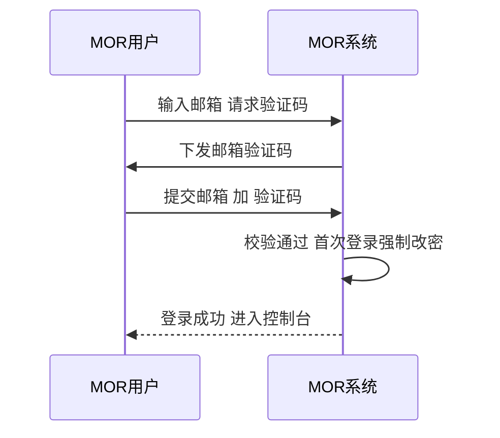
```mermaid
sequenceDiagram
    participant U as MOR用户
    participant S as MOR系统
    U->>S: 输入邮箱 请求验证码
    S->>U: 下发邮箱验证码
    U->>S: 提交邮箱 加 验证码
    S->>S: 校验通过 首次登录强制改密
    S-->>U: 登录成功 进入控制台
```

反向（登录失败）：

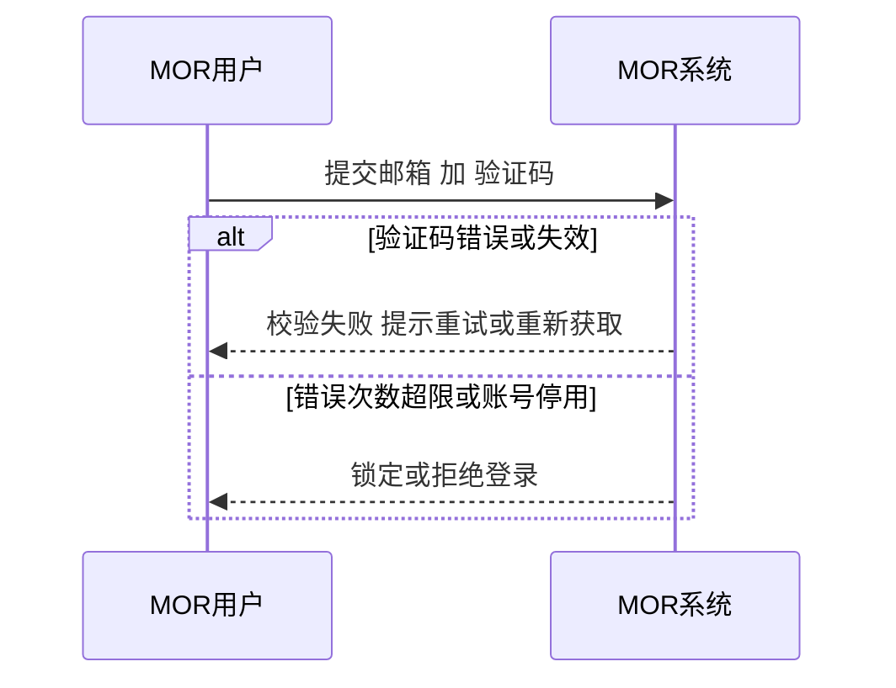
```mermaid
sequenceDiagram
    participant U as MOR用户
    participant S as MOR系统
    U->>S: 提交邮箱 加 验证码
    alt 验证码错误或失效
        S-->>U: 校验失败 提示重试或重新获取
    else 错误次数超限或账号停用
        S-->>U: 锁定或拒绝登录
    end
```

**业务规则：** 邮箱 + 验证码登录；首次登录用初始密码并 **强制改密**；验证码有效期 / 错误次数限制；登录态管理。

**验收标准：** 正向可登录并首次强制改密；验证码失效 / 错误 / 超限 / 停用按反向正确拦截。

### Case 2：MOR 录入管理

**前置条件：** 已登录且有录入权限。

**字段：** 企业英文名称、企业中文名称、所在国家、企业证件号码、联系人名称、**联系方式（掩码展示，鼠标悬停显示，可搜索）**、关联客户数量、创建时间、更新时间、状态（有效 / 无效）、操作（置为有效 / 无效；删除；列表页全局新增）。

**业务流程：**

正向（新增 / 编辑 / 置为有效）：

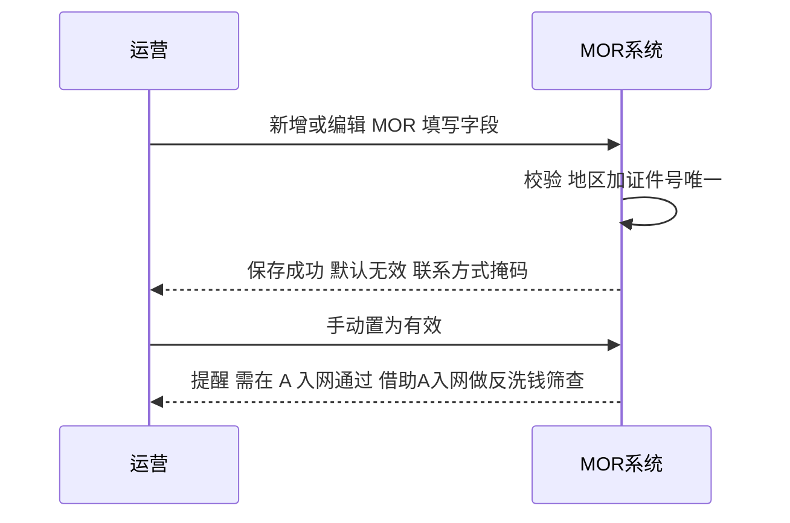
```mermaid
sequenceDiagram
    participant O as 运营
    participant S as MOR系统
    O->>S: 新增或编辑 MOR 填写字段
    S->>S: 校验 地区加证件号唯一
    S-->>O: 保存成功 默认无效 联系方式掩码
    O->>S: 手动置为有效
    S-->>O: 提醒 需在 A 入网通过 借助A入网做反洗钱筛查
```

反向（置为无效 / 删除）：

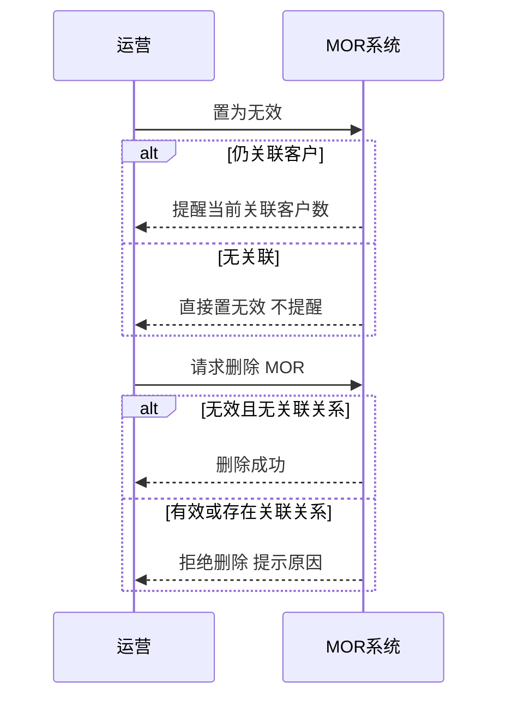
```mermaid
sequenceDiagram
    participant O as 运营
    participant S as MOR系统
    O->>S: 置为无效
    alt 仍关联客户
        S-->>O: 提醒当前关联客户数
    else 无关联
        S-->>O: 直接置无效 不提醒
    end
    O->>S: 请求删除 MOR
    alt 无效且无关联关系
        S-->>O: 删除成功
    else 有效或存在关联关系
        S-->>O: 拒绝删除 提示原因
    end
```

**业务规则：**

1. **状态手动维护（不自动同步 A 入网状态）**：新增后 **默认无效**；可手动 **置为有效**；
2. **置为有效时提醒**：「**需在 A 入网通过**」——借助 **A 入网做反洗钱（AML）筛查**；
3. **置为无效时提醒**：当前 **还关联多少客户**（**无关联则不提醒**）；
4. **删除**：仅 **无效且无关联关系** 的 MOR 可删除；
5. **唯一性**：**一个地区 + 一个企业证件编号** 唯一。

**验收标准：** 新增默认无效；置有效有 AML 提醒、置无效有关联客户数提醒（无关联不提醒）；删除仅对「无效且无关联」放行；唯一性、掩码与悬停 / 搜索正确。

**待办：** MOR 不可用后，将其关联客户 **转移到其他 MOR**（**本期先一个个手动换**，后续自动化）。

### Case 3：MOR - 客户关系维护

**前置条件：** 目标 MOR 为 **有效** 状态。

**业务流程：**

正向（建立关系）：

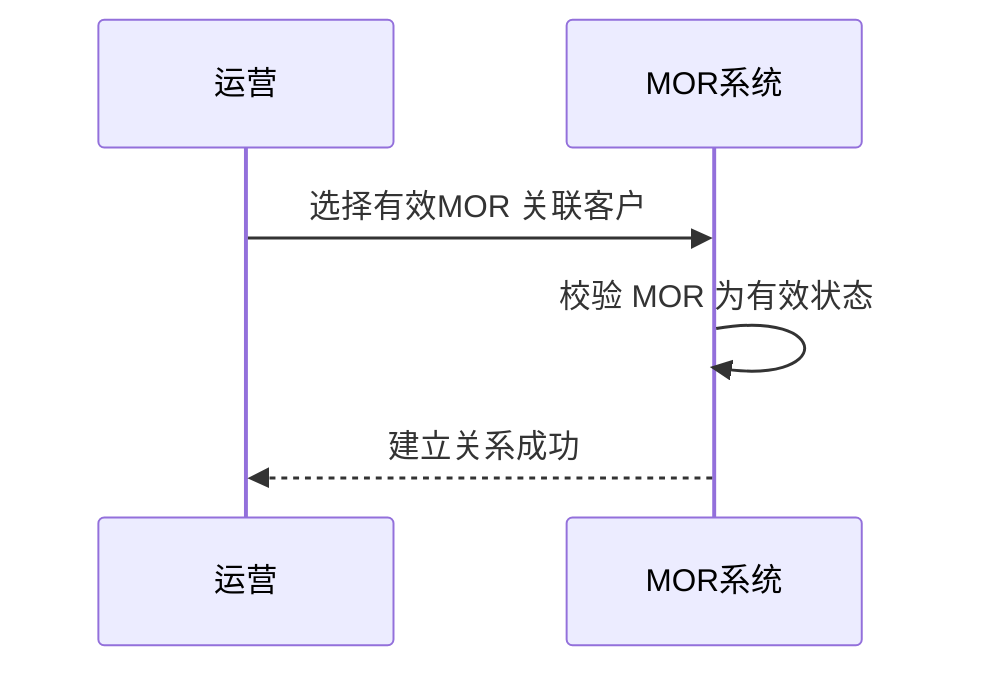
```mermaid
sequenceDiagram
    participant O as 运营
    participant S as MOR系统
    O->>S: 选择有效MOR 关联客户
    S->>S: 校验 MOR 为有效状态
    S-->>O: 建立关系成功
```

反向（解除关系）：

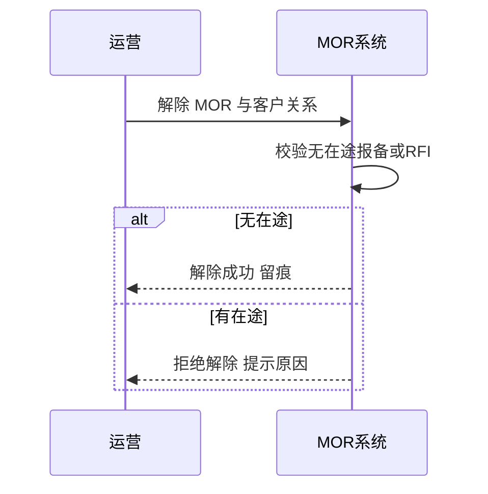
```mermaid
sequenceDiagram
    participant O as 运营
    participant S as MOR系统
    O->>S: 解除 MOR 与客户关系
    S->>S: 校验无在途报备或RFI
    alt 无在途
        S-->>O: 解除成功 留痕
    else 有在途
        S-->>O: 拒绝解除 提示原因
    end
```

**业务规则：** 关系增删改查；**仅「有效」状态的 MOR 才能维护关系**；关系用于报备包装与 RFI 路由；变更需留痕。

> **待分析**：MOR - 客户关系是否为 **1:n**（一个 MOR 关联多个客户）？需结合合规与 A 要求确认基数与约束。

**验收标准：** 无效 MOR 不能新增关系；建立 / 解除可用且可追溯；有在途报备或 RFI 时不可解除。

**待办：** 确认 MOR - 客户关系基数（1:n 还是其他）；MOR 不可用时客户关系转移（本期一个个换）。

### Case 4：Agent 生成材料

**前置条件：** 合同模板已配置；MOR 与客户关系已建立。

**业务流程：**

正向（生成 → 签名 → 同步 → 提交）：

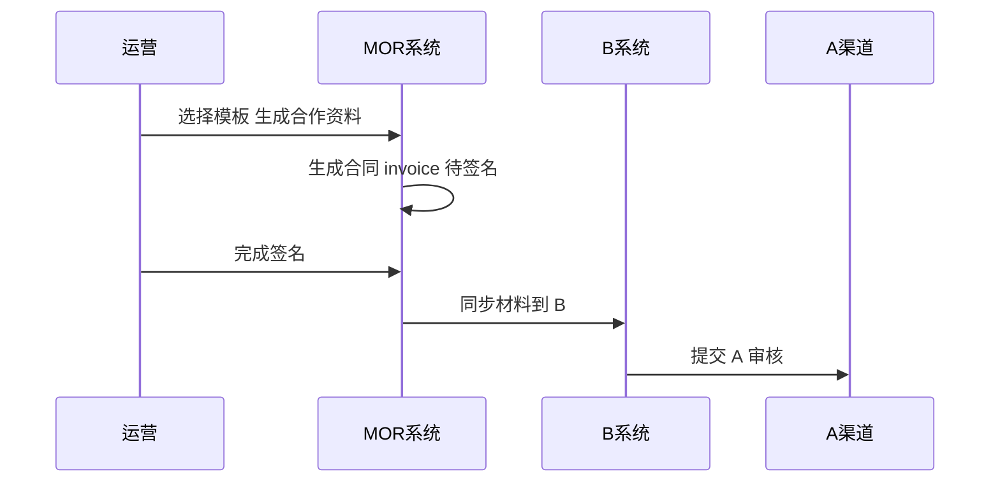
```mermaid
sequenceDiagram
    participant O as 运营
    participant S as MOR系统
    participant B as B系统
    participant A as A渠道
    O->>S: 选择模板 生成合作资料
    S->>S: 生成合同 invoice 待签名
    O->>S: 完成签名
    S->>B: 同步材料到 B
    B->>A: 提交 A 审核
```

反向（作废 / 重生成）：

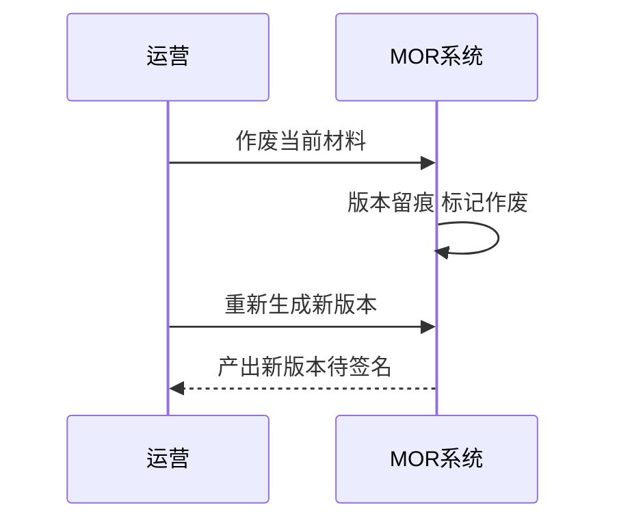
```mermaid
sequenceDiagram
    participant O as 运营
    participant S as MOR系统
    O->>S: 作废当前材料
    S->>S: 版本留痕 标记作废
    O->>S: 重新生成新版本
    S-->>O: 产出新版本待签名
```

**业务规则：** 需提供 **合同模板**；生成的合作资料（合同 / invoice）**需要签名**；产物同步到 B 再提交 A；材料按版本留痕。

**验收标准：** 模板可配置、可生成、可签名；产物可同步并提交 A；作废 / 重生成有版本记录。

### Case 5：开发者中心（对接 API 前置）

**前置条件：** 已登录；企业为有效状态。

**业务流程：**

正向（生成密钥 / 配置回调）：

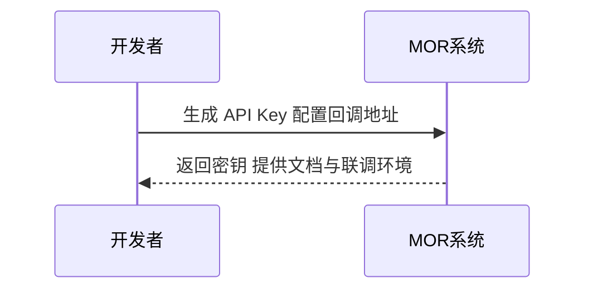
```mermaid
sequenceDiagram
    participant D as 开发者
    participant S as MOR系统
    D->>S: 生成 API Key 配置回调地址
    S-->>D: 返回密钥 提供文档与联调环境
```

反向（轮换 / 吊销密钥）：

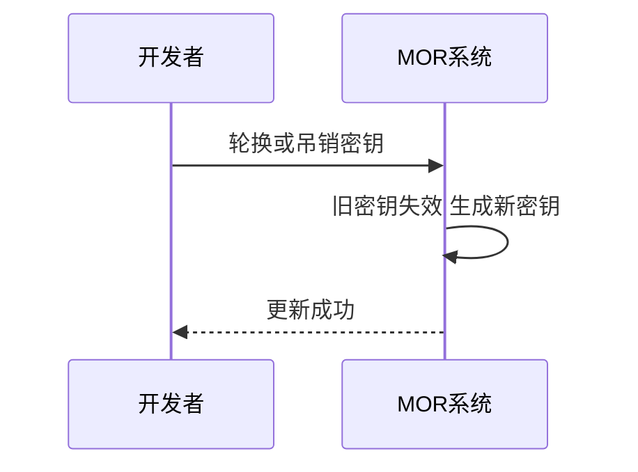
```mermaid
sequenceDiagram
    participant D as 开发者
    participant S as MOR系统
    D->>S: 轮换或吊销密钥
    S->>S: 旧密钥失效 生成新密钥
    S-->>D: 更新成功
```

**业务规则：** 提供 **简单的** 开发者中心——API Key / 密钥管理、回调地址配置、接口文档与联调环境。

**验收标准：** 可生成 / 配置回调 / 查看文档；可轮换 / 吊销密钥且旧密钥即时失效。

### Case 6：对接（RFI）提供调单材料

**前置条件：** 已完成开发者中心对接；MOR 客户产生 RFI 工单（见三、Case 3）。

**业务流程：**

正向（接收 → 上传 → 回传 → 通过）：

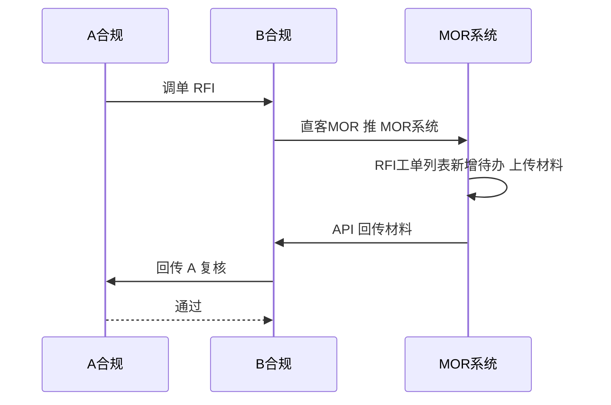
```mermaid
sequenceDiagram
    participant A as A合规
    participant B as B合规
    participant S as MOR系统
    A->>B: 调单 RFI
    B->>S: 直客MOR 推 MOR系统
    S->>S: RFI工单列表新增待办 上传材料
    S->>B: API 回传材料
    B->>A: 回传 A 复核
    A-->>B: 通过
```

反向（材料被拒 / 补充再传）：

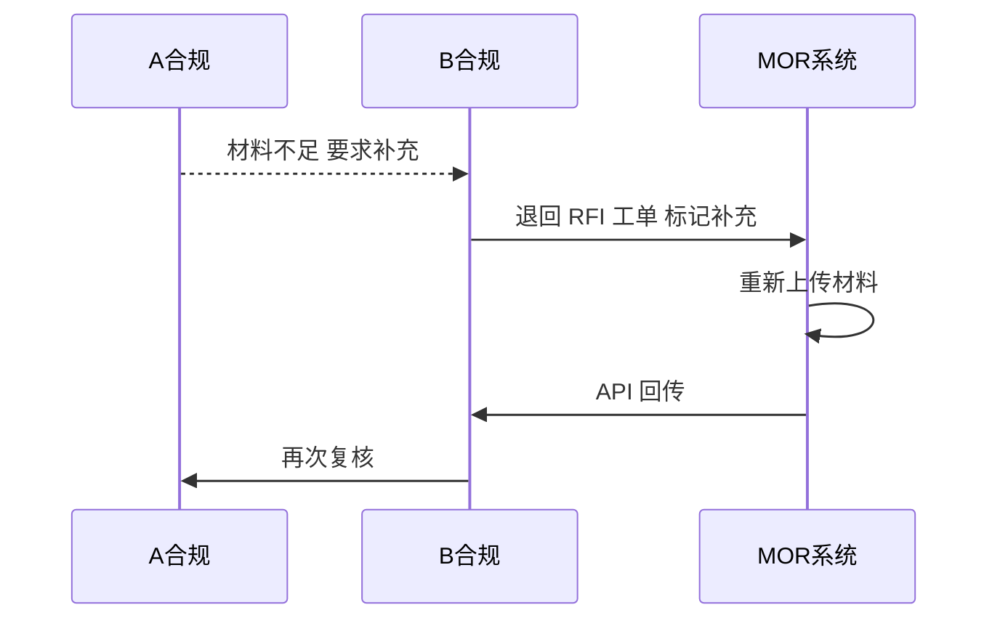
```mermaid
sequenceDiagram
    participant A as A合规
    participant B as B合规
    participant S as MOR系统
    A-->>B: 材料不足 要求补充
    B->>S: 退回 RFI 工单 标记补充
    S->>S: 重新上传材料
    S->>B: API 回传
    B->>A: 再次复核
```

**业务规则：** 对接 API **回传调单（RFI）材料**；MOR 客户的 RFI 经 MOR 系统工单列表上传后由 API 自动回传；与交易状态隔离、不通知销售。

**验收标准：** 正向可接收工单、上传并回传 A 复核通过；反向被拒可退回补充并重新回传；全程不阻塞交易、不触达销售。

---

## 五、未决问题与待确认

| 编号 | 问题                                                                                          | 关联            | 状态   |
| ---- | --------------------------------------------------------------------------------------------- | --------------- | ------ |
| 1    | DBS VA 是否**所有客户批量开**？其 **成本** 与 **风险**（需与 A 合规确认）   | 三 / Case 1     | 待确认 |
| 2    | **MOR - 客户关系基数**：是否为 **1:n**？基数与约束（结合合规与 A 要求）           | 四 / Case 3     | 待分析 |
| 3    | **渠道调单（RFI）发现异常** 后的具体 **处置口径**（与 A / B 合规确认）            | 三 / Case 4     | 待确认 |
| 4    | **一期范围阈值**：BB 侧 **MOR 数量** 与 **交易量** 控制范围的具体阈值       | 二 / 关键原则   | 待定   |
| 5    | RFI 中 MOR 的**运营/销售隔离与授权边界**（不能像 A 那样授权给销售；通知机制）需单独设计 | 三 / Case 3     | 待设计 |
| 6    | **多 MOR 系统** 时 B 侧的 **分配 / 路由机制**（本期单 MOR，后续扩展）             | 三 / Case 3、四 | 待设计 |
| 7    | MOR 不可用后**客户转移到其他 MOR** 的机制（本期手动一个个换，后续自动化）               | 四 / Case 2、3  | 待规划 |
| 8    | **资金 / 报备主体**：都是 **客户本身**（MOR 仅提供贸易材料）                      | 二 / 关键原则   | 已明确 |

---

> **说明**：本文按「背景说明 → 前置准备 → 具体 Case → MOR 系统功能」组织 **B-A 单渠道 OffRamp（方案一）**；已取消主子账户，分类 2 客户由 **单独部署的 MOR 系统** 包装（报备 A 前先过 MOR、调单推 MOR），商户始终只发起一笔 OffRamp。
>
> 展业模式选型（方案一 / 方案二 / 方案三 三者对比与建议）已抽出到 **`MOR方案决策建议.md`**。
