ds sf

# B-A OffRamp 解决方案（渠道报备 + MOR 系统 + 交易）

> **文档定位**：本文按 **① 背景说明 ② 前置准备（角色定位、A 合规-B 合规流程、MOR 主体、A-B industries 映射）③ 具体 Case（A 报备与 KYB / 交易流程 / 调单 RFI）④ MOR 系统功能** 组织 **客户经 SP（B）走 A 渠道做 OffRamp（B-A 单渠道）** 的完整方案。
>
> **MOR 为单独部署的独立系统**（一个系统可有多家 MOR 公司）：对「**A 不能直接服务但在合规范围内**」的客户，报备 A 前 **先经 MOR 系统** 完成关系管理、双方合作资料包装；**调单（RFI）按是否 MOR 分流**。
>
> **本文只覆盖 A 这一条渠道（B-A），不含其他渠道**；已取消主子账户体系，客户始终只发起「一笔 OffRamp」。

---

## 一、背景说明

**目标：提升客户的 OffRamp 客户体验。**

终端商户在做 OffRamp 时，常遇到以下体验问题：

- **操作链路长**：商户需要自己在多个机构入网、自行开户收款，再手工发起出款，步骤繁琐、耗时长。
- **入网门槛不一**：部分商户能在法币渠道直接入网出款，部分商户因业务画像 / 渠道政策无法直接在法币渠道入账，体验割裂。
- **出款时效与确定性差**：跨账户的多步操作容易卡单，商户难以一站式完成。

**解决思路**：**统一为「客户直接 OffRamp」**——商户在租户端 **只发起一笔 OffRamp**，由 **SP（B）承兑、A 渠道出款**，承兑 + 出款一步到位。对 **A 不能直接服务但在合规范围内** 的客户，**报备 A 前先经 MOR 系统包装**（合同 / 材料），商户无需感知底层链路即可获得「一笔下单、直接到账」的体验。**不再使用主子账户 / 主账户中转 / A-A 划转。**

---

## 二、前置准备

### 2.1 角色与定位

分层模型：**租户（BB / 其他租户）→ SP（B）→ 渠道（A）**，旁挂 **MOR 系统（单独部署的独立子系统）**。**本文只覆盖 A 这一条渠道（B-A），不含其他渠道；不再有主账户 / 子账户层级。**

| 角色               | 说明                                                                                                                                                               |
| ------------------ | ------------------------------------------------------------------------------------------------------------------------------------------------------------------ |
| **租户**     | 展业主体（类似大代理）：BB 或其他租户，对终端商户展业的入口 / 品牌方；商户在租户端完成所有操作                                                                     |
| **SP（B）**  | KYC 审核主体 + 资金承接（承兑）主体：接收入网、按 A 要求推送 / 审核 KYC、判断能否走 A；负责 OffRamp 承兑（数币→法币）。报备 A 前对接 MOR 系统拿到包装好的合作资料 |
| **A**        | SP（B）背后的法币渠道（channel / PSP）：负责法币入账与出款；做渠道报备审核（通过 / 拒绝 / 需补充资料）、合规调单（RFI）；入网结果不同步给租户                      |
| **MOR 系统** | **单独部署的独立系统**：一个系统可有多家 MOR 公司；管理 MOR 公司与客户关联关系，提供双方合同、Agent 生成材料，并对接 API 回传调单（RFI）材料                 |
| **DBS**      | VA（虚拟账户）开户银行；VA 用于**客户验证**（开户不通知、打特殊标记，非真实交易 VA）                                                                         |

**关键原则：**

1. 租户 = 展业主体；**SP = B** = KYC 审核 + 承兑主体；**A = 渠道**。入网到 SP，由 SP 推送 / 审核 KYC 并判断能否走 A。
2. **统一客户直接 OffRamp**：取消主子账户 / 主账户中转 / A-A 划转；所有客户都用自有账户直接 OffRamp。
3. 对终端商户做 fully KYC&KYB
4. **MOR 包装**：对分类 2（A 不能直接服务但在合规范围内）的客户，报备 A 前先过 MOR 系统；调单（RFI）按是否 MOR 分流。
5. 商户端只发起一笔 OffRamp，承兑 + 出款一步到位。

**一期范围（灰度）：** 先开放给 **直客** 与 **一个其他租户**；**BB 侧需控制 MOR 数量与交易量范围**（具体阈值待定）。

### 2.2 A 合规 - B 合规的流程

- 提前完成 **A-B 之间的 KYC/KYB 对齐**（如 industries 映射），由 **B 合规** 整理b的industires 映射为A的合规分类（见 2.4）；
- **调单（RFI）路由前置约定**（交易发生前先按客户/交易归属配置好接收路由，避免临时判断）：

  - **B 租户自有的客户/交易**：A 合规调单 **直接发给 B 合规**，**不经过 B 运营**（与其他客户链路不同）；
  - 该路由在 RFI 受理时即生效，B 合规与 B 运营按归属各自接收对应调单。

### 2.3 MOR 主体

- **单独部署的独立系统**，一个系统中可有 **多家 MOR 公司**；
- 管理 **MOR 公司与客户** 的关联关系，生成 **双方合作资料（合同 / invoice）**，并对接 API 回传调单（RFI）材料；
- 仅对 **分类 2** 客户启用：报备 A 前先经 MOR 系统包装为 A 可服务（功能明细见第四节）。

### 2.4 A-B industries 映射关系（合规分类）

由 **B 合规** 把客户业务画像（industries 等）映射为三类：

| 分类   | 含义                          | 报备处理                                                                |
| ------ | ----------------------------- | ----------------------------------------------------------------------- |
| 分类 1 | A 合规完全可以                | industries A 完全支持；直接推送到 A                                     |
| 分类 2 | 在合规范围内、但 A 暂不允许   | industries A 不支持但场景合规；自动打 MOR 标签，经 MOR 系统包装后报备 A |
| 分类 3 | A 完全不允许（对 A 风险较大） | 对 A 风险较大；不推送 A、不服务                                         |

**A 能力的基本维护**：渠道能力配置 **industries**（A-B 映射好）、**同名 / 非同名** 配置。

---

## 三、具体 Case

> 三个核心 Case 均按 **前置条件 / 时序图 / 业务规则 / 验收标准 / 待办** 五个模块组织。

### Case 1：A 报备与 KYB

> 客户入网 BB 后，按 **渠道能力 + 合规分类** 决定是否报备 A、是否经 MOR，并最终 **开 DBS VA** 决定 A 渠道是否可用。

> **核心原则（报备时机：入网即报备，与交易解耦）**：商户 **入网 B 后立即触发报备**（异步进行：分类判断 → 报备 A → A 审核 → 开 DBS VA），把 A 渠道的可用性 **在交易之前** 就准备好。**绝不在 OffRamp 交易时才去报备**——报备 + KYB + 开 VA 链路较长，若放到交易中会导致 **交易处理超时、时效极差**。交易发生时该商户在 A 的报备应已完成、渠道处于「可用」状态，OffRamp 才能一笔到位。

**前置条件：**

- 已完成 2.2 的 A 合规-B 合规对齐与 2.4 的 A-B industries 映射；
- 客户已在租户端开通「买入数币 / OffRamp」并入网到 SP（B），完成 **fully KYC**；
- A 已把 **渠道能力（industries、同名 / 非同名）** 同步给 BB。

**时序图：**

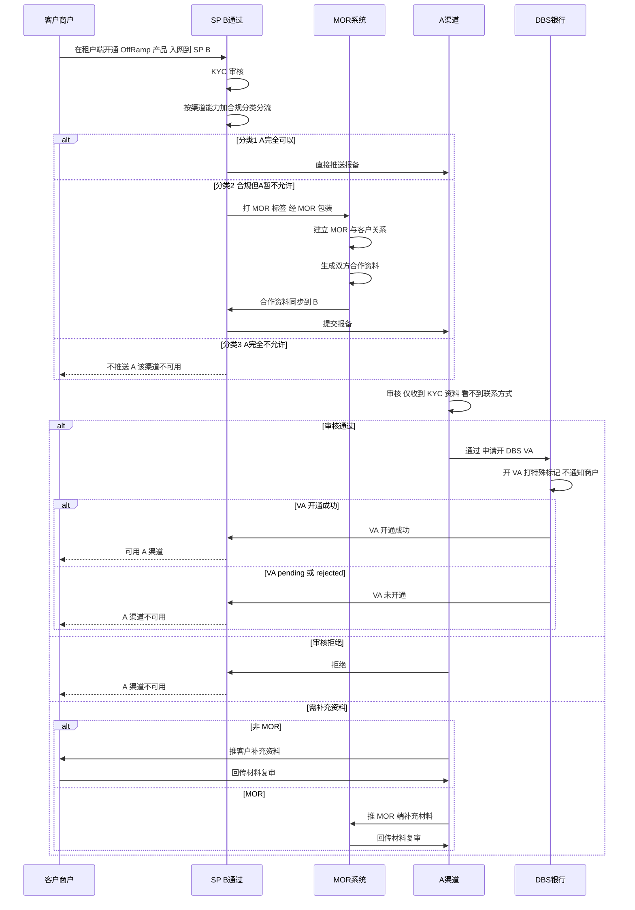
```mermaid
sequenceDiagram
    participant CU as 客户商户
    participant SPB as SP B通过
    participant MOR as MOR系统
    participant A as A渠道
    participant DBS as DBS银行

    CU->>SPB: 在租户端开通 OffRamp 产品 入网到 SP B
    SPB->>SPB: KYC 审核
    SPB->>SPB: 按渠道能力加合规分类分流

    alt 分类1 A完全可以
        SPB->>A: 直接推送报备
    else 分类2 合规但A暂不允许
        SPB->>MOR: 打 MOR 标签 经 MOR 包装
        MOR->>MOR: 建立 MOR 与客户关系
        MOR->>MOR: 生成双方合作资料
        MOR->>SPB: 合作资料同步到 B
        SPB->>A: 提交报备
    else 分类3 A完全不允许
        SPB-->>CU: 不推送 A 该渠道不可用
    end

    A->>A: 审核 仅收到 KYC 资料 看不到联系方式
    alt 审核通过
        A->>DBS: 通过 申请开 DBS VA
        DBS->>DBS: 开 VA 打特殊标记 不通知商户
        alt VA 开通成功
            DBS->>SPB: VA 开通成功
            SPB-->>CU: 可用 A 渠道
        else VA pending 或 rejected
            DBS->>SPB: VA 未开通
            SPB-->>CU: A 渠道不可用
        end
    else 审核拒绝
        A->>SPB: 拒绝
        SPB-->>CU: A 渠道不可用
    else 需补充资料
        alt 非 MOR
            A->>CU: 推客户补充资料
            CU->>A: 回传材料复审
        else MOR
            A->>MOR: 推 MOR 端补充材料
            MOR->>A: 回传材料复审
        end
    end
```

**业务规则：**

0. **报备时机（入网即报备、与交易解耦）**：报备由 **入网 B** 通过后触发并 **异步执行**，与 OffRamp 交易完全解耦；**不允许在交易时才发起报备**。交易只校验该商户 A 渠道是否「可用」，可用才放行，避免报备链路拖长交易、造成超时；
1. **分流**：SP（B）按渠道能力 + 合规分类判断——分类 1 直推 A；分类 2 打 MOR 标签经 MOR 系统包装后推 A；分类 3 不推 A、不服务；
2. **MOR 包装（仅分类 2）**：MOR 系统先 **建立 MOR 与客户关系**，再 **生成双方合作资料**，同步到 B 后再提交 A；
3. **入网报备材料**：默认只提供 **合同 / PI**；若 A 要求 **额外资料**，不在常规链路自动补，**需走特批流程** ，根据特批流程确认是否补充，何时补充（比如特批拒绝，必须补充，则必须补充；特批通过，后面渠道调单时补充）
4. **A 审核结果**：通过 → 开 DBS VA（开通成功才算 A 可用，pending / rejected 则 A 不可用）；拒绝 → 该商户不可用 A 渠道；需补充资料 → 按是否 MOR 分别推 MOR 端 / 客户补充再回 A 复审；
5. **信息边界（A 看不到终端商户联系方式）**：
   - **注册信息（登录 / 联系方式）不向 A 同步**，避免 A 直接触达终端商户、绕过租户与 SP；
   - **仅 KYC 资料可同步给 A**（KYC 开户主体 ≠ 注册登录 user，不暴露注册用户身份与联系方式）；
6. **DBS VA**：入网完成后立即开 VA 做验证，**开户不通知商户、打特殊标记**（合规知晓为验证用途、非真实交易 VA）；OffRamp 过程中不再重复校验。

**验收标准：**

- 报备由入网触发、异步完成，**不阻塞 / 不嵌入** OffRamp 交易；交易时只读「A 渠道可用状态」；
- 分类 1/2/3 能正确分流；分类 2 经 MOR 包装链路打通（关系 → 合作资料 → 同步 B → 提交 A）；
- A 仅收到 KYC 资料，**收不到注册联系方式**；入网结果不回传租户；
- 审核通过后自动开 DBS VA，并据 VA 状态判定 A 可用性；
- 「需补充资料」按是否 MOR 正确路由并可回 A 复审；额外资料须走特批。

**待办：**

- A-B 合规分类字典与 industries 映射维护；
- DBS VA 标记规则与「不通知商户」实现，并与 A 合规确认是否批量开、成本 / 风险；
- 报备分流、A 审核结果回传、开 VA 状态落地；
- 入网触发异步报备的任务编排、状态机（报备中 / 可用 / 不可用 / 待补充）与重试机制。

---

### Case 2：交易流程（OffRamp）

**前置条件：**

- Case 1 已完成：A 渠道对该商户可用（KYC 通过 + DBS VA 开通，如配置要求）；
- 商户已在 B 持有数币，已添加并审核通过 **收款人**。

**时序图：**

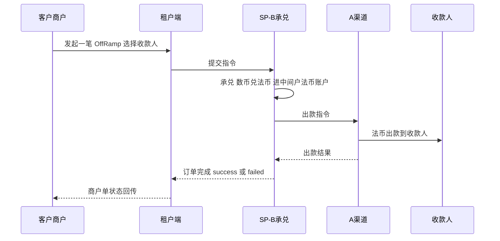
```mermaid
sequenceDiagram
    participant M as 客户商户
    participant T as 租户端
    participant SP as SP-B承兑
    participant A as A渠道
    participant P as 收款人
    M->>T: 发起一笔 OffRamp 选择收款人
    T->>SP: 提交指令
    SP->>SP: 承兑 数币兑法币 进中间户法币账户
    SP->>A: 出款指令
    A->>P: 法币出款到收款人
    A-->>SP: 出款结果
    SP-->>T: 订单完成 success 或 failed
    T-->>M: 商户单状态回传
```

**OffRamp 商户单状态机：**

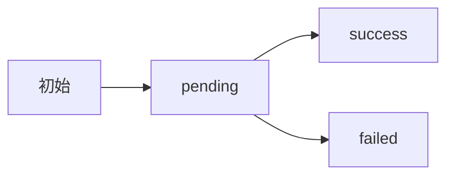
```mermaid
flowchart LR
    INIT["初始"] --> PEND["pending"]
    PEND --> SUC["success"]
    PEND --> FAIL["failed"]
```

**业务规则：**

1. **一笔到位**：B 承兑（数币 → 法币）后由 A 出款，承兑 + 出款一步到位（**中间户模式**，不经客户 VA 入账）；
2. **商户单状态机**：初始 → pending → success / failed；
3. **路由**：B 侧按 **渠道能力 + 是否 MOR** 路由；路由前先查 **渠道黑名单**——命中黑名单的商户 **不可路由到 A**（黑名单见 Case 4）；
4. **反向（退款 / 退票）**：按照现有流程（不做反向承兑，见 `refund.md`）；
5. **A 不可用**：本文仅 A 单渠道，A 开户未成功 / 不放行时该商户 **暂不可 OffRamp**，等待 A 恢复或经 MOR 重新报备（无跨渠道切换）。

**验收标准：**

- 正向承兑 + 出款一步完成、状态机正确流转；
- 路由按渠道能力 / 是否 MOR 生效，**命中渠道黑名单不路由到 A**；
- 反向流程与原来一致。

**待办：**

- OffRamp 状态机与现有中间户流程对齐；
- 针对 MOR / 非 MOR 的渠道能力维护与路由；
- **渠道黑名单配置与路由拦截**（见 Case 4）。

### Case 3：调单流程（RFI）

**前置条件：**

- 交易已发生或在途；A 合规对某笔交易或某客户发起调单；
- A-B 调单流程已设置且可行：**A 合规直接发 B 合规，由 B 合规直接发起 RFI**。

**时序图：**

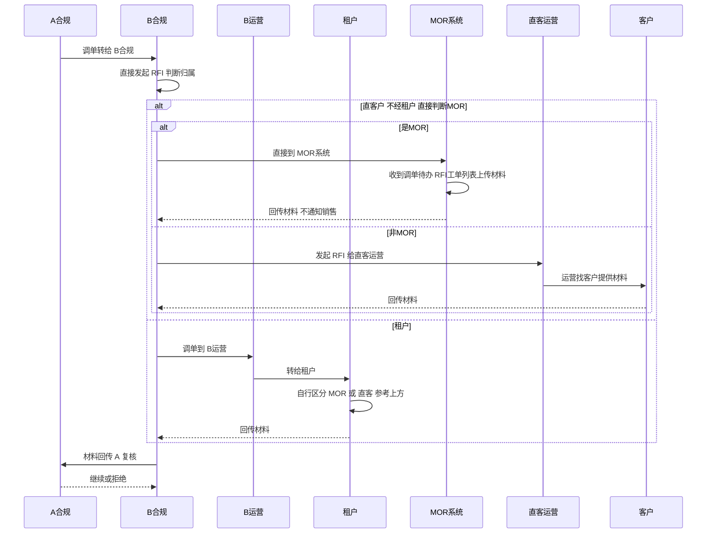
```mermaid
sequenceDiagram
    participant A as A合规
    participant BC as B合规
    participant BO as B运营
    participant TEN as 租户
    participant MOR as MOR系统
    participant DO as 直客运营
    participant C as 客户
    A->>BC: 调单转给 B合规
    BC->>BC: 直接发起 RFI 判断归属
    alt 直客户 不经租户 直接判断MOR
        alt 是MOR
            BC->>MOR: 直接到 MOR系统
            MOR->>MOR: 收到调单待办 RFI工单列表上传材料
            MOR-->>BC: 回传材料 不通知销售
        else 非MOR
            BC->>DO: 发起 RFI 给直客运营
            DO->>C: 运营找客户提供材料
            C-->>BC: 回传材料
        end
    else 租户
        BC->>BO: 调单到 B运营
        BO->>TEN: 转给租户
        TEN->>TEN: 自行区分 MOR 或 直客 参考上方
        TEN-->>BC: 回传材料
    end
    BC->>A: 材料回传 A 复核
    A-->>BC: 继续或拒绝
```

**业务规则：**

1. **入口**：A 合规调单统一发 **B 合规**，由 **B 合规直接发起 RFI**；RFI 是 **单独流程**，**不复用「待补充资料」**（否则让客户 pending、阻塞交易）；
2. **直客户（不经租户，直接判断是否 MOR）**：
   - **是 MOR**：直接到 MOR 系统。MOR 在 **MOR 系统的 RFI 工单列表** 收到一笔调单待办，可操作上传材料；
     - **MOR 不能给销售发通知**；
     - **已知问题（待解决）**：运营与销售相互隔绝、通知机制缺位、**后续不能像 A 那样把权限授权给销售**——这块需单独设计；
   - **不是 MOR**：与现有流程一致——合规发起 RFI 给 **直客运营**，运营找客户提供材料；
3. **租户**：合规发起调单到 **B 运营 → 租户**；**租户自行区分** 是 MOR 还是直客，按上面「直客户」规则处理；
4. **MOR 系统数量**：本期 **只有一个 MOR 系统**；后续 MOR 系统增多，**B 系统需要一套分配（路由到对应 MOR 系统）机制**。

**验收标准：**

- A 合规调单统一进 B 合规并由 B 合规发起 RFI；RFI 与「待补充资料」隔离、不阻塞交易；
- 直客 MOR：**不经租户、直接到 MOR 系统**；MOR 工单列表可接收并上传材料；**MOR 不触达销售**；
- 直客非 MOR：走「直客运营 → 客户」现有流程；
- 租户：到「B 运营 → 租户」，租户自行区分 MOR / 直客并回传；
- 多 MOR 系统下，B 侧分配机制能路由到正确的 MOR 系统。

**待办：**

- B 合规 RFI 发起入口与工单；
- MOR 系统 RFI 工单列表、材料上传与待办通知（且 **不通知销售**）；
- 运营 / 销售隔离与授权边界设计（明确 MOR 不可授权给销售）；
- 多 MOR 系统的 B 侧分配 / 路由机制（本期单 MOR，预留扩展）；
- 各场景 RFI 材料清单、SLA 与话术模板。

---

### Case 4：风险处置与渠道黑名单

**前置条件：** 交易中或交易后，A 发现风险线索（如多个商户使用同一汇款人信息）。

**业务流程：**

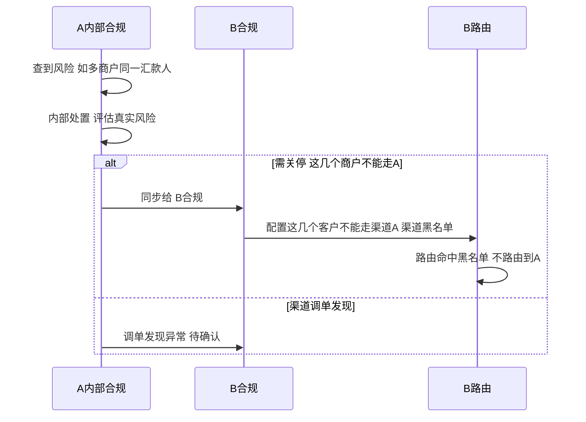
```mermaid
sequenceDiagram
    participant A as A内部合规
    participant BC as B合规
    participant BR as B路由
    A->>A: 查到风险 如多商户同一汇款人
    A->>A: 内部处置 评估真实风险
    alt 需关停 这几个商户不能走A
        A->>BC: 同步给 B合规
        BC->>BR: 配置这几个客户不能走渠道A 渠道黑名单
        BR->>BR: 路由命中黑名单 不路由到A
    else 渠道调单发现
        A->>BC: 调单发现异常 待确认
    end
```

**业务规则：**

1. **触发场景**：
   - **A 内部合规查到**：例如 **多个商户提供同一汇款人信息**，A 内部先做处置、评估真实风险；
   - **渠道调单（RFI）发现**：调单过程中发现异常 → **待确认**（处置口径待定）；
2. **处置（评估后要关停）**：A 评估真实风险后若决定 **这几个商户不能走 A**，则 **同步给 B 合规**；B 合规将这些客户 **配置为不能走渠道 A**（**渠道黑名单**）；
3. **路由拦截**：B 路由流程必须支持 **渠道黑名单**——命中黑名单的商户 **不路由到 A**（见 Case 2 路由规则）；
4. **待确认**：渠道调单发现异常后的具体处置口径待与 A / B 合规确认。

**验收标准：**

- A 内部处置 → 同步 B 合规 → B 配置渠道黑名单 → 路由不再走 A，链路打通；
- 黑名单可按商户维度配置、可解除；
- 渠道调单发现的处置口径明确后可落地。

**待办：**

- 渠道黑名单数据模型（商户维度 / 渠道维度）与配置入口；
- B 路由的黑名单拦截实现；
- A 与 B 合规风险同步的接口 / 流程；
- 渠道调单发现异常的处置口径（待确认）。

---

## 四、MOR 系统功能

> MOR 为 **单独部署的独立系统**，一个系统可有 **多家 MOR 公司**。第一期功能如下，各 Case 统一按 **前置条件 / 业务流程（正向 + 反向时序图）/ 业务规则 / 验收标准** 组织。

### Case 1：登录（邮箱 + 验证码）

**前置条件：** MOR 账号已由运营开通（邮箱 + 初始密码）；账号状态正常。

**业务流程：**

正向（登录成功）：

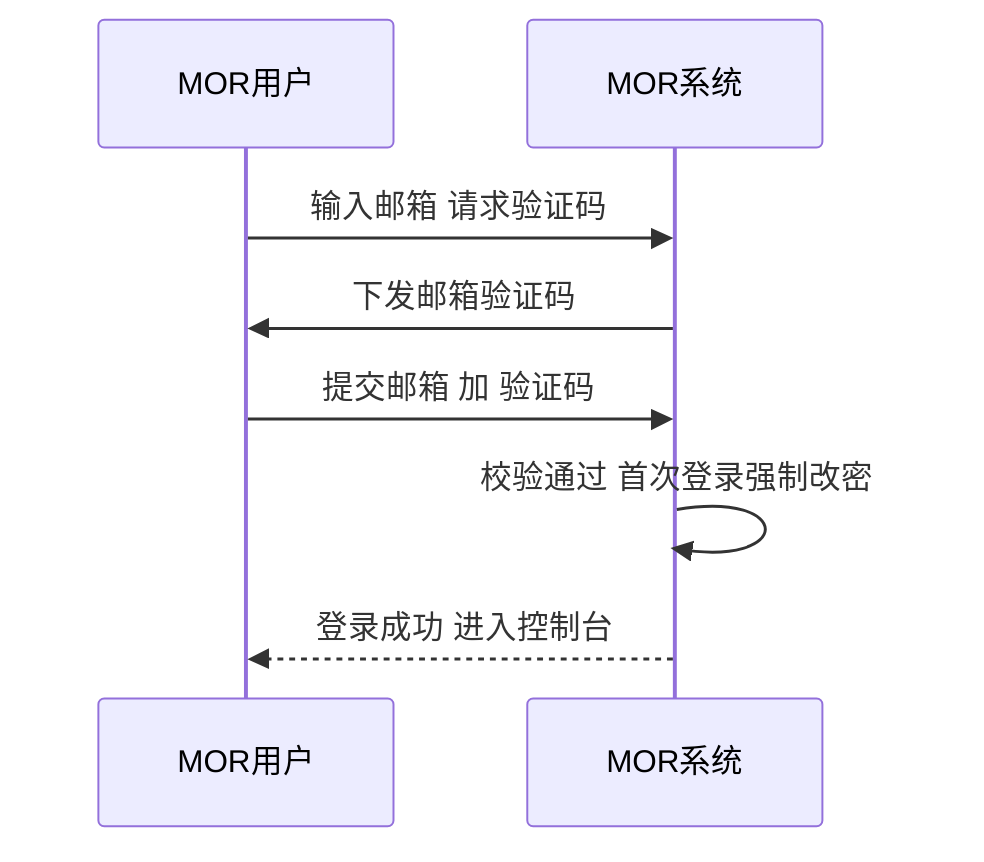
```mermaid
sequenceDiagram
    participant U as MOR用户
    participant S as MOR系统
    U->>S: 输入邮箱 请求验证码
    S->>U: 下发邮箱验证码
    U->>S: 提交邮箱 加 验证码
    S->>S: 校验通过 首次登录强制改密
    S-->>U: 登录成功 进入控制台
```

反向（登录失败）：

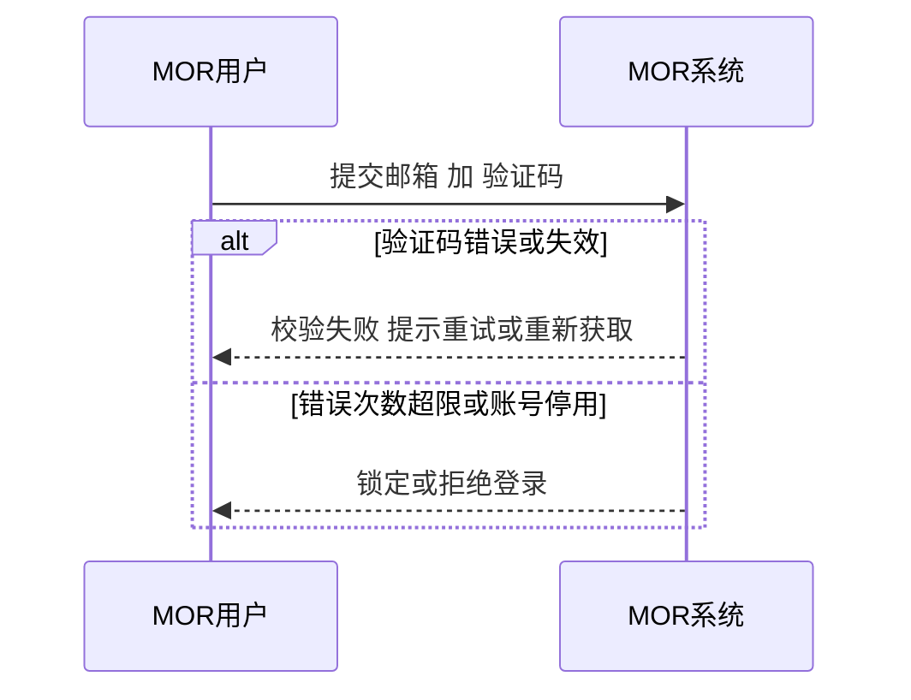
```mermaid
sequenceDiagram
    participant U as MOR用户
    participant S as MOR系统
    U->>S: 提交邮箱 加 验证码
    alt 验证码错误或失效
        S-->>U: 校验失败 提示重试或重新获取
    else 错误次数超限或账号停用
        S-->>U: 锁定或拒绝登录
    end
```

**业务规则：** 邮箱 + 验证码登录；首次登录用初始密码并 **强制改密**；验证码有效期 / 错误次数限制；登录态管理。

**验收标准：** 正向可登录并首次强制改密；验证码失效 / 错误 / 超限 / 停用按反向正确拦截。

### Case 2：MOR 录入管理

**前置条件：** 已登录且有录入权限。

**字段：** 企业英文名称、企业中文名称、所在国家、企业证件号码、联系人名称、**联系方式（掩码展示，鼠标悬停显示，可搜索）**、关联客户数量、创建时间、更新时间、状态（有效 / 无效）、操作（置为有效 / 无效；删除；列表页全局新增）。

**业务流程：**

正向（新增 / 编辑 / 置为有效）：

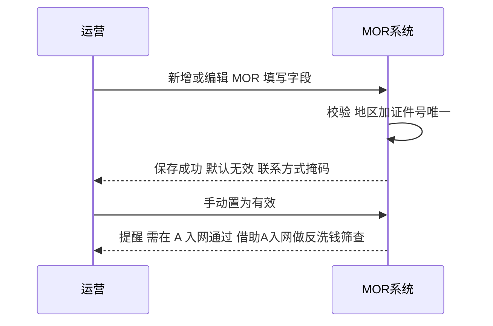
```mermaid
sequenceDiagram
    participant O as 运营
    participant S as MOR系统
    O->>S: 新增或编辑 MOR 填写字段
    S->>S: 校验 地区加证件号唯一
    S-->>O: 保存成功 默认无效 联系方式掩码
    O->>S: 手动置为有效
    S-->>O: 提醒 需在 A 入网通过 借助A入网做反洗钱筛查
```

反向（置为无效 / 删除）：

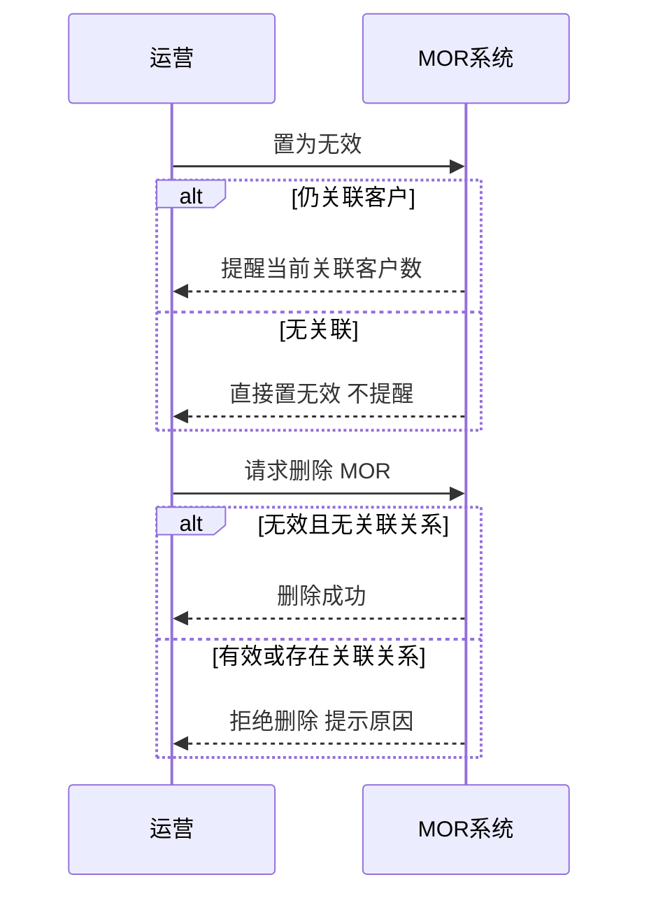
```mermaid
sequenceDiagram
    participant O as 运营
    participant S as MOR系统
    O->>S: 置为无效
    alt 仍关联客户
        S-->>O: 提醒当前关联客户数
    else 无关联
        S-->>O: 直接置无效 不提醒
    end
    O->>S: 请求删除 MOR
    alt 无效且无关联关系
        S-->>O: 删除成功
    else 有效或存在关联关系
        S-->>O: 拒绝删除 提示原因
    end
```

**业务规则：**

1. **状态手动维护（不自动同步 A 入网状态）**：新增后 **默认无效**；可手动 **置为有效**；
2. **置为有效时提醒**：「**需在 A 入网通过**」——借助 **A 入网做反洗钱（AML）筛查**；
3. **置为无效时提醒**：当前 **还关联多少客户**（**无关联则不提醒**）；
4. **删除**：仅 **无效且无关联关系** 的 MOR 可删除；
5. **唯一性**：**一个地区 + 一个企业证件编号** 唯一。

**验收标准：** 新增默认无效；置有效有 AML 提醒、置无效有关联客户数提醒（无关联不提醒）；删除仅对「无效且无关联」放行；唯一性、掩码与悬停 / 搜索正确。

**待办：** MOR 不可用后，将其关联客户 **转移到其他 MOR**（**本期先一个个手动换**，后续自动化）。

### Case 3：MOR - 客户关系维护

**前置条件：** 目标 MOR 为 **有效** 状态。

**业务流程：**

正向（建立关系）：

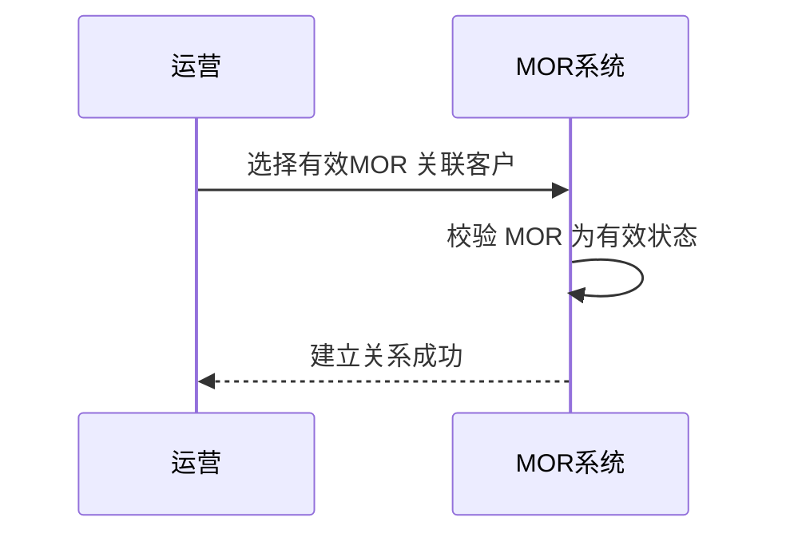
```mermaid
sequenceDiagram
    participant O as 运营
    participant S as MOR系统
    O->>S: 选择有效MOR 关联客户
    S->>S: 校验 MOR 为有效状态
    S-->>O: 建立关系成功
```

反向（解除关系）：

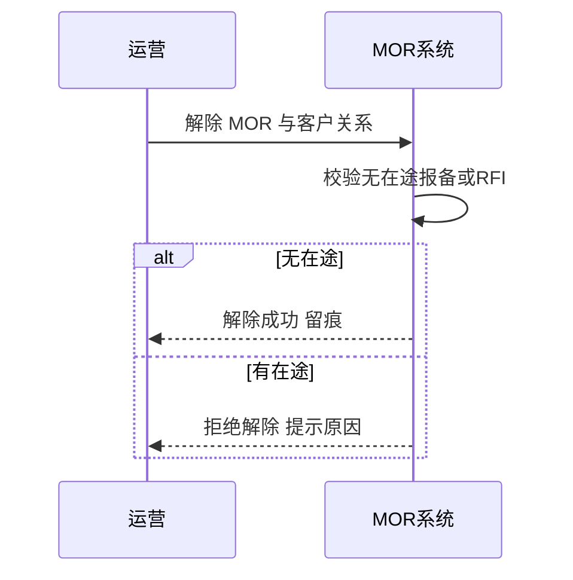
```mermaid
sequenceDiagram
    participant O as 运营
    participant S as MOR系统
    O->>S: 解除 MOR 与客户关系
    S->>S: 校验无在途报备或RFI
    alt 无在途
        S-->>O: 解除成功 留痕
    else 有在途
        S-->>O: 拒绝解除 提示原因
    end
```

**业务规则：** 关系增删改查；**仅「有效」状态的 MOR 才能维护关系**；关系用于报备包装与 RFI 路由；变更需留痕。

> **待分析**：MOR - 客户关系是否为 **1:n**（一个 MOR 关联多个客户）？需结合合规与 A 要求确认基数与约束。

**验收标准：** 无效 MOR 不能新增关系；建立 / 解除可用且可追溯；有在途报备或 RFI 时不可解除。

**待办：** 确认 MOR - 客户关系基数（1:n 还是其他）；MOR 不可用时客户关系转移（本期一个个换）。

### Case 4：Agent 生成材料

**前置条件：** 合同模板已配置；MOR 与客户关系已建立。

**业务流程：**

正向（生成 → 签名 → 同步 → 提交）：

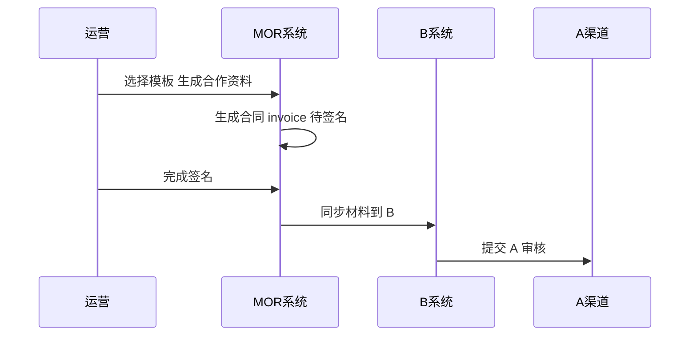
```mermaid
sequenceDiagram
    participant O as 运营
    participant S as MOR系统
    participant B as B系统
    participant A as A渠道
    O->>S: 选择模板 生成合作资料
    S->>S: 生成合同 invoice 待签名
    O->>S: 完成签名
    S->>B: 同步材料到 B
    B->>A: 提交 A 审核
```

反向（作废 / 重生成）：

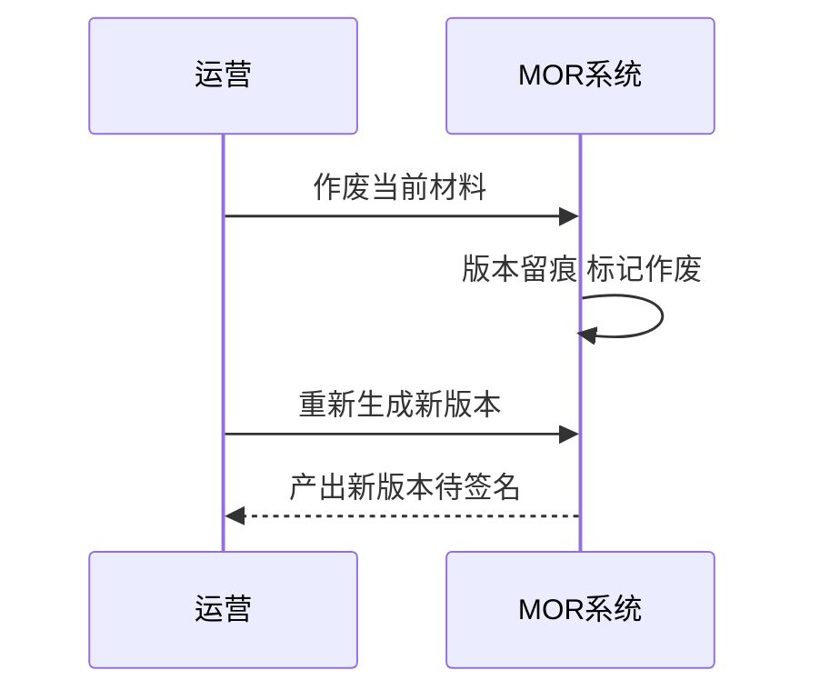
```mermaid
sequenceDiagram
    participant O as 运营
    participant S as MOR系统
    O->>S: 作废当前材料
    S->>S: 版本留痕 标记作废
    O->>S: 重新生成新版本
    S-->>O: 产出新版本待签名
```

**业务规则：** 需提供 **合同模板**；生成的合作资料（合同 / invoice）**需要签名**；产物同步到 B 再提交 A；材料按版本留痕。

**验收标准：** 模板可配置、可生成、可签名；产物可同步并提交 A；作废 / 重生成有版本记录。

### Case 5：开发者中心（对接 API 前置）

**前置条件：** 已登录；企业为有效状态。

**业务流程：**

正向（生成密钥 / 配置回调）：

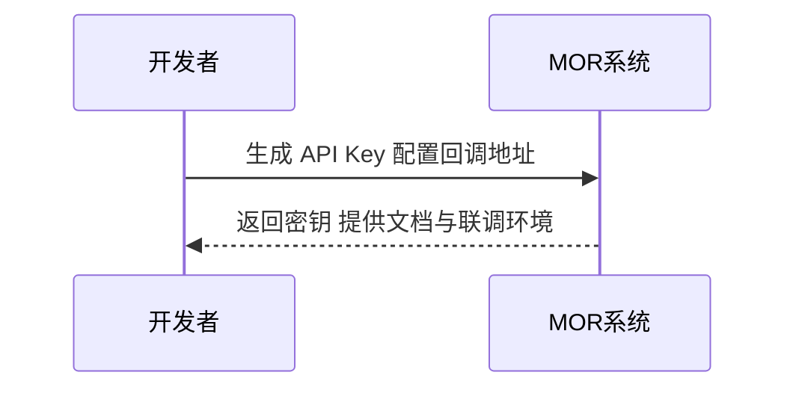
```mermaid
sequenceDiagram
    participant D as 开发者
    participant S as MOR系统
    D->>S: 生成 API Key 配置回调地址
    S-->>D: 返回密钥 提供文档与联调环境
```

反向（轮换 / 吊销密钥）：

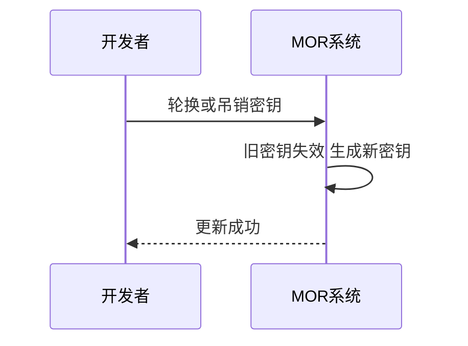
```mermaid
sequenceDiagram
    participant D as 开发者
    participant S as MOR系统
    D->>S: 轮换或吊销密钥
    S->>S: 旧密钥失效 生成新密钥
    S-->>D: 更新成功
```

**业务规则：** 提供 **简单的** 开发者中心——API Key / 密钥管理、回调地址配置、接口文档与联调环境。

**验收标准：** 可生成 / 配置回调 / 查看文档；可轮换 / 吊销密钥且旧密钥即时失效。

### Case 6：对接（RFI）提供调单材料

**前置条件：** 已完成开发者中心对接；MOR 客户产生 RFI 工单（见三、Case 3）。

**业务流程：**

正向（接收 → 上传 → 回传 → 通过）：

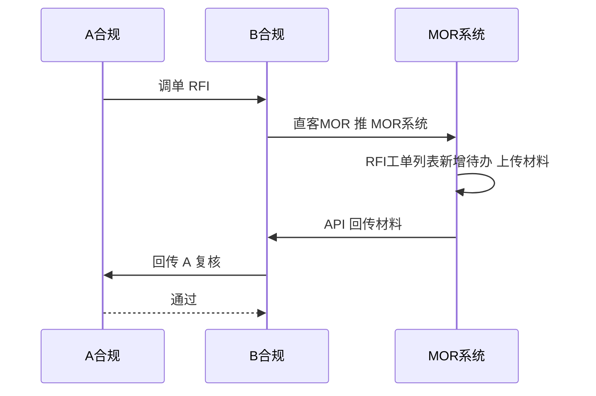
```mermaid
sequenceDiagram
    participant A as A合规
    participant B as B合规
    participant S as MOR系统
    A->>B: 调单 RFI
    B->>S: 直客MOR 推 MOR系统
    S->>S: RFI工单列表新增待办 上传材料
    S->>B: API 回传材料
    B->>A: 回传 A 复核
    A-->>B: 通过
```

反向（材料被拒 / 补充再传）：

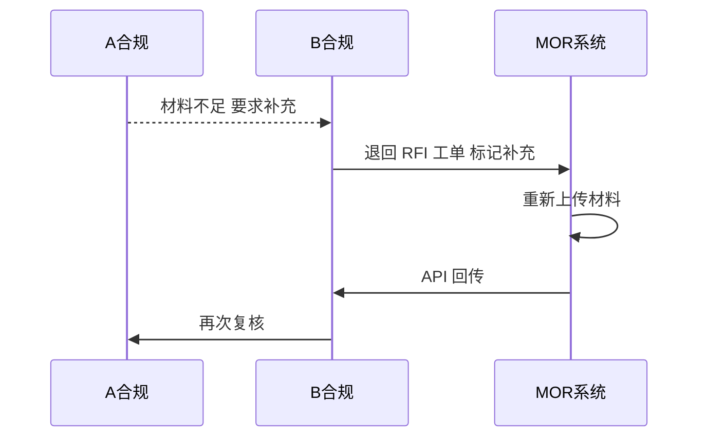
```mermaid
sequenceDiagram
    participant A as A合规
    participant B as B合规
    participant S as MOR系统
    A-->>B: 材料不足 要求补充
    B->>S: 退回 RFI 工单 标记补充
    S->>S: 重新上传材料
    S->>B: API 回传
    B->>A: 再次复核
```

**业务规则：** 对接 API **回传调单（RFI）材料**；MOR 客户的 RFI 经 MOR 系统工单列表上传后由 API 自动回传；与交易状态隔离、不通知销售。

**验收标准：** 正向可接收工单、上传并回传 A 复核通过；反向被拒可退回补充并重新回传；全程不阻塞交易、不触达销售。

---

## 五、未决问题与待确认

| 编号 | 问题                                                                                          | 关联            | 状态                                                 |
| ---- | --------------------------------------------------------------------------------------------- | --------------- | ---------------------------------------------------- |
| 1    | DBS VA 是否**所有客户批量开**？其 **成本** 与 **风险**（需与 A 合规确认）   | 三 / Case 1     | 待确认                                               |
| 2    | **MOR - 客户关系基数**：是否为 **1:n**？基数与约束（结合合规与 A 要求）           | 四 / Case 3     | 待分析（方案二：MOR 为客户角色，关系由受控租户维护） |
| 3    | **渠道调单（RFI）发现异常** 后的具体 **处置口径**（与 A / B 合规确认）            | 三 / Case 4     | 待确认                                               |
| 4    | **一期范围阈值**：BB 侧 **MOR 数量** 与 **交易量** 控制范围的具体阈值       | 二 / 关键原则   | 待定                                                 |
| 5    | RFI 中 MOR 的**运营/销售隔离与授权边界**（不能像 A 那样授权给销售；通知机制）需单独设计 | 三 / Case 3     | 方案一待设计；方案二复用租户权限/通知，已弱化        |
| 6    | **多 MOR 系统** 时 B 侧的 **分配 / 路由机制**（本期单 MOR，后续扩展）             | 三 / Case 3、四 | 方案一待设计；方案二由所属租户自管，已弱化           |
| 7    | MOR 不可用后**客户转移到其他 MOR** 的机制（本期手动一个个换，后续自动化）               | 四 / Case 2、3  | 方案一待规划；方案二归属在租户体系内，无需迁移       |
| 8    | **资金 / 报备主体**：方案二已明确**都是客户本身**（MOR 仅提供贸易材料）           | 六 / 方案二     | 方案二已明确                                         |

---

## 六、方案二：租户展业，内置 MOR 功能

> 本节为 **备选方案**，与上文「方案一（原方案）」并列，原方案内容保持不变。

**核心思想：** **BB 不直接对终端客户展业，改由受控租户展业**。这批客户归属到 **几个我们自己控制的租户**，由租户完成展业与运营；MOR 不再是独立主体 / 租户，而是 **某客户为别的客户「提供贸易材料」的角色**；**资金主体与报备主体都回归客户本身**。「MOR - 客户关系映射」作为一项功能 **只对这几个受控租户开放**。

**术语与边界（先定义清楚）：**

| 名词                   | 定义与边界                                                                                                                                        |
| ---------------------- | ------------------------------------------------------------------------------------------------------------------------------------------------- |
| **客户**         | 入网并做 OffRamp 的终端主体；**资金主体 + 报备主体都是客户本身**（MOR 不承接资金、不作报备主体）                                            |
| **MOR（角色）**  | **不是独立主体**，是为 **其他客户** 提供 **贸易材料**（贸易背景 / 合同 / invoice 等）的角色；**MOR 本身也可以是一个客户** |
| **公司主体**     | 一个经营方可持有**多个公司主体**；可拿其中某些公司主体 **充当 MOR**                                                                   |
| **租户**         | 展业主体；**内置原 MOR 系统功能（第四节）**；**MOR - 客户关系映射仅对少数受控租户开放**                                               |
| **MOR-客户关系** | 哪个 MOR（公司主体 / 客户）为哪些客户提供贸易材料的映射，由具备权限的租户维护                                                                     |

**为什么换（方案一里直客 MOR 那条线细节太多）：**

- 需要单独的 **合规-合规** 流程；
- 这类客户的 **通知不能通知所属销售**（运营 / 销售强隔离）；
- 还要额外解决授权、工单、多 MOR 分配等。

而把 MOR 功能内置到租户、客户归属在租户体系内后，**运营流程都一样、都到租户**，直接复用租户既有的账号 / 权限 / 通知 / 材料 / 调单链路。

**统一后的调单（RFI）流程：**

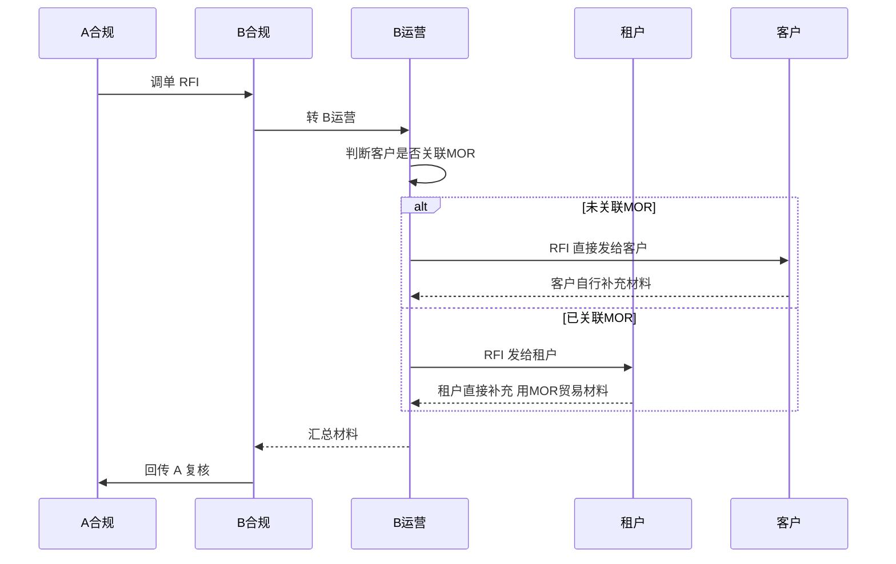
```mermaid
sequenceDiagram
    participant A as A合规
    participant BC as B合规
    participant BO as B运营
    participant TEN as 租户
    participant C as 客户
    A->>BC: 调单 RFI
    BC->>BO: 转 B运营
    BO->>BO: 判断客户是否关联MOR
    alt 未关联MOR
        BO->>C: RFI 直接发给客户
        C-->>BO: 客户自行补充材料
    else 已关联MOR
        BO->>TEN: RFI 发给租户
        TEN-->>BO: 租户直接补充 用MOR贸易材料
    end
    BO-->>BC: 汇总材料
    BC->>A: 回传 A 复核
```

**调单（RFI）处理细则：**

- **一律走 RFI 流程，不用订单状态驱动**：不设「订单状态 = 待补充材料」这类对客提示，否则会导致 **客户直接自行补充**，与 MOR 关联场景的处理相悖；
- **按是否关联 MOR 判断路由：**
  - **未关联 MOR**：RFI **直接发给客户**，由客户自行补充材料；
  - **已关联 MOR**：RFI **发给租户**，由 **租户直接补充**（使用关联 MOR 提供的贸易材料），不下发给客户；
- **补充材料的可见性：**
  - **MOR 关联的客户看不到** 这些补充材料；
  - **只有直客户（未关联 MOR）能看到** 自己补充的材料；
- **关系变更按时间点生效（不溯及既往）**：即便后续 **增加 / 删除** MOR - 客户关联关系，**也只能从增加 / 删除之后** 起对应可见，**变更前的历史不受影响**。

**MOR 管理功能（作为可单独开通的功能模块，内置在租户系统内）：**

> 该模块作为一个 **独立功能开关** 下发，**仅对少数受控租户开通**；功能内容参考第四节，**内置在租户后台**，由具备权限的租户运营操作。各功能要点如下（时序图与完整规则同第四节对应 Case，差异处已标注）。

- **登录与权限（区别于方案一）**：**复用租户系统登录**，不单独做 MOR 系统登录；通过 **「MOR 管理」功能开关 + 角色权限** 控制可见与可操作范围（替代第四节 Case 1）。
- **MOR 录入管理（同第四节 Case 2）**：字段 = 企业中 / 英文名称、所在国家、企业证件号码、联系人、**联系方式（掩码 / 悬停显示 / 可搜索）**、关联客户数量、创建 / 更新时间、状态（有效 / 无效）、操作（置有效 / 无效、删除、全局新增）。规则：**新增默认无效**；置有效提醒「**需在 A 入网通过**（借 A 入网做 AML 筛查）」；置无效提醒 **当前关联客户数**（无关联不提醒）；**仅「无效且无关联」可删除**；**一个地区 + 一个证件号唯一**。
- **MOR - 客户关系维护（同第四节 Case 3）**：**仅「有效」MOR 可维护关系**；关系用于报备包装与 RFI 路由；增删 **留痕**；**有在途报备 / RFI 不可解除**。关系基数（1:n）待确认。
- **贸易材料生成（同第四节 Case 4）**：基于 **合同模板** 生成合作资料（合同 / invoice），**需签名**，产物 **按版本留痕**，经租户回传 B → A。
- **开发者中心（同第四节 Case 5，可选）**：如租户需 API 对接，**复用租户既有开发者中心**（API Key / 回调 / 文档），不单独建。
- **RFI 调单材料对接（按本节调单规则）**：见上文「调单（RFI）处理细则」——**未关联 MOR 发客户、已关联 MOR 发租户**，租户用 MOR 材料直接补；**补充材料对关联客户不可见、对直客户可见，按关系变更时间点生效**（替代第四节 Case 6 的"直推独立 MOR 系统"）。

**方案二落地待办：**

- RFI **路由判断**：按客户是否关联 MOR 分流（未关联发客户 / 已关联发租户）；
- 补充材料 **可见性控制**：MOR 关联客户不可见、直客户可见，且 **按关联关系变更时间点生效**；
- 租户后台内置上述第四节能力，并加 **按租户的功能开关 / 权限**；
- 调单材料在 **租户 → B 合规 → A** 的回传链路对接。

**方案一 / 方案二对比：**

| 维度            | 方案一（含直客 + MOR 两条线）                                                                             | 方案二（统一到租户系统处理）                                                   |
| --------------- | --------------------------------------------------------------------------------------------------------- | ------------------------------------------------------------------------------ |
| 业务线          | **同时存在两条线**：① 直客线　② MOR 线；**按判断条件分流**（是直客还是 MOR）                | **不分线**：全部到租户系统，由 **租户统一处理**                    |
| MOR 承载        | **单独的 MOR 系统**（独立部署，可多家 MOR 公司）                                                    | **无单独系统**，MOR 为客户角色，能力内置租户后台                         |
| 资金 / 报备主体 | 都是客户本身；MOR 仅提供贸易材料                                                                          | **都是客户本身**；MOR 仅提供贸易材料                                     |
| 运营归属        | **MOR 线不走 BB 运营**：BB 虽是租户，但 MOR 系统 **不能同步 BB 运营**、不通知销售，需单独隔离 | 全部走**租户运营**，复用租户既有运营 / 权限 / 通知，无需额外隔离         |
| 调单（RFI）     | MOR 线**直推 MOR 系统**；直客走原流程                                                               | 全程走 RFI：未关联 MOR 发客户、已关联 MOR 发租户（租户直接补，关联客户不可见） |
| 多 MOR          | 需 B 侧分配机制                                                                                           | 客户归属在租户体系内，由所属租户自管，无需额外分配                             |

**边界已明确（本方案对第五节的回答）：**

- **资金 = 报备主体 = 客户**；MOR 不承接资金、不作报备主体；
- **客户归属**：归属在租户体系内，由租户维护 MOR - 客户关系映射，**无需「换 MOR 系统」式迁移**（弱化 #7）；
- **运营主体**：由 **具备权限的受控租户** 在自己后台运营，仅对少数租户开放该功能（弱化 #5 / #6）。

---

## 七、决策建议：服务分类 2 客户的展业模式

### 7.1 结论与建议

为服务 **"贸易实质合规、但不符合 A 当前贸易政策"** 的 **分类 2 客户**，我们需要确定其 **展业模式**。经评估，**建议采用「通过受控租户展业」（方案二）**，不建议由 BB 自己直接对这批客户展业（方案一）。

核心理由：直客展业会形成一个 **结构性矛盾——直客流程既依赖销售、也依赖运营，而 MOR 又必须同时对销售和运营保密**。维持这层「既依赖销售与运营、又要瞒着他们」的信息不对称，只能靠系统做大量特殊处理来兜，**一旦某处漏处理或口径不一致，就可能暴露、酿成合规事故**。这是 **结构决定的风险，系统建设只能打补丁、无法根除**；方案二从展业结构上消除了这层矛盾。

### 7.2 决策背景

- BB 以 SP 身份承兑（数币→法币），借渠道 A 完成客户 OffRamp 出款。
- 分类 2 客户需要一层 **贸易材料"包装"**（合同 / invoice 等）才能向 A 报备并通过其反洗钱审核。
- 问题是：**这批客户由谁来展业、由谁承接相应的运营与风险？** 这是一个 **业务模式选择**，而非单纯的技术实现问题。

### 7.3 两种模式

- **方案一 · BB 直客展业**：BB 直接对终端客户展业，自行承担获客、入网、运营、材料收集与调单应对，并为此 **新建一套支撑系统**。
- **方案二 · 受控租户展业**：将这批客户归属到 **少数我们自己掌控的租户**，由租户展业；BB 不直接触达终端客户。MOR 不再是独立主体，而是 **客户为他人提供贸易材料的角色**，资金与报备主体回归 **客户本身**。

### 7.4 为什么不建议方案一（直客展业的风险）

直客展业最大的问题不在"能不能做"，而在它 **内生一个靠系统补不掉的结构性矛盾**，进而推导出实际的合规与运营风险。

**结构性矛盾：销售与运营都是必需节点，却又都必须被隐瞒。**
直客流程 **既依赖销售、也依赖运营**——获客与日常关系维护靠销售，入网、材料收集、调单应对等具体事务靠运营，两者都是直接触点，几乎所有问题与通知最终都会回到销售或运营。但 MOR 相关信息 **内部对销售和运营都要保密**（仅限合规等特定角色知悉）。于是形成「**直客既依赖销售与运营、又要同时瞒着他们**」的信息不对称。

**由此推导出的风险：**

- **系统特殊处理的漏处理风险**：为对销售与运营屏蔽 MOR 信息，系统需做大量特殊处理（屏蔽相应通知、数据、状态）；**任一处漏处理，信息就会触达销售或运营**，造成泄露与事故；
- **口径不一致风险**：销售 / 运营掌握的信息与系统真实记录不一致（因对其隐瞒了 MOR 环节），**他们对接客户时所问与系统记录对不上**，易露馅或误导客户；
- **MOR 异常的暴露风险**：一旦 MOR 环节出问题（报备 / 调单异常），很可能 **暴露这层信息不对称**，引发客户质疑与合规事故；
- **责任高度集中于 BB**：资金、报备、材料责任均由 BB 承担，风险敞口大。

**并且，为支撑直客展业还须额外投入建设一套系统。** 结论是：**这套系统能跑流程，却补不掉上面的结构性矛盾——主要风险没解决，还多付一套系统与管理成本。**

### 7.5 为什么建议方案二（受控租户展业的价值）

- **从源头规避风险**：BB 不直接触达客户，**销售与运营的信息外流敞口大幅收敛**；
- **风险与责任有承接主体**：运营、隔离、授权由 **租户体系** 承载，资金与报备责任 **回归客户**，权责清晰；
- **投入更省**：复用租户既有的账号、权限、通知与材料能力，**无需新建独立系统**；
- **范围与节奏可控**：仅对 **少数受控租户** 开放，可灰度、可回收，且合规效果与直客展业一致。

### 7.6 模式权衡对照

| 维度                | 方案一 · BB 直客展业                                                              | 方案二 · 受控租户展业                                     |
| ------------------- | ---------------------------------------------------------------------------------- | ---------------------------------------------------------- |
| 信息不对称/暴露风险 | **高**：依赖销售与运营，却须对两者隐瞒 MOR，靠系统特殊处理维持，漏处理即暴露 | **低**：BB 不依赖销售/运营作节点，结构上不存在该矛盾 |
| 运营/销售隔离       | 难，存在内控漏洞                                                                   | 由租户体系天然隔离                                         |
| 合规链路            | 单独合规—合规，较重                                                               | 统一收敛，复用既有流程                                     |
| 责任主体            | 高度集中于 BB                                                                      | 客户（资金/报备）+ 租户（运营）                            |
| 系统投入            | **需新建一套系统**                                                           | 复用租户后台，投入小                                       |
| 主要风险            | **系统无法消除**                                                             | 从模式上规避                                               |

### 7.7 成本、边界与落地

- **一次性投入**：在租户后台增量实现 MOR-客户关系映射、贸易材料与调单材料能力（详见第四节）；属可复用建设，远低于直客展业的长期风险与运营成本。
- **开放边界**：通过 **按租户的功能开关**，仅向少数受控租户开放，范围小、可控。
- **落地节奏**：一期先上核心能力并 **小范围灰度**（控制客户数量与交易量），自动化能力后置。

### 7.8 需要您拍板/确认的事项

- 是否确认采用 **方案二（受控租户展业）** 作为分类 2 客户的展业模式；
- 一期 **灰度范围与规模上限**（开放给哪些受控租户、MOR 数量与交易量阈值）；
- 与 A 合规需确认的合规口径：**反洗钱验证账户的开立方式与成本**、**渠道调单发现异常时的处置标准**。

---

> **说明**：本文按「背景说明 → 前置准备 → 具体 Case → MOR 系统功能」组织 B-A 单渠道 OffRamp；已取消主子账户，分类 2 客户由单独部署的 MOR 系统包装（报备 A 前先过 MOR、调单推 MOR），商户始终只发起一笔 OffRamp。第七节从展业视角做选型：问题本质是 **BB 直客是否自己展业**，推荐 **方案二（通过受控租户展业）**——避免直客展业的销售泄露等管理风险，同时不必额外搭建系统，MOR 回归为客户的「提供贸易材料」角色。
