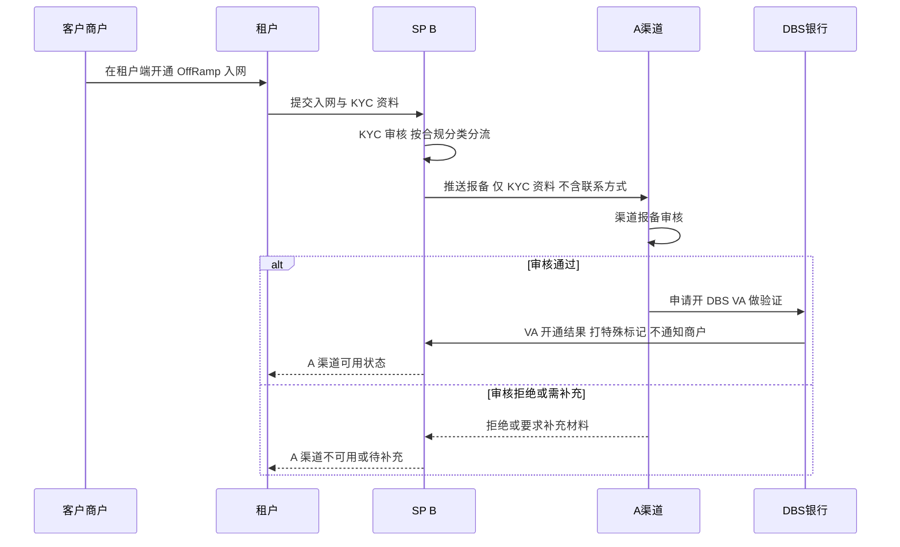
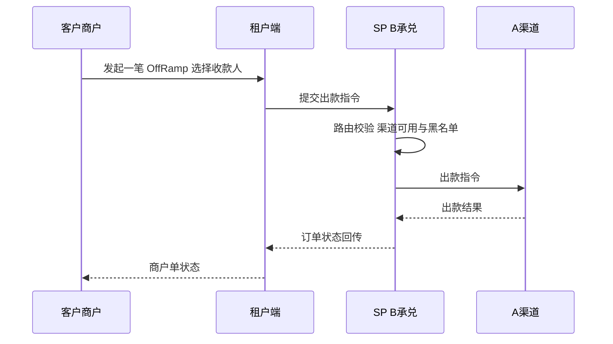
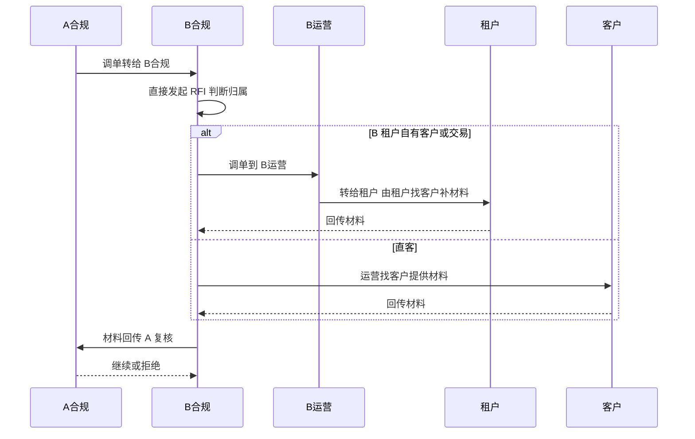
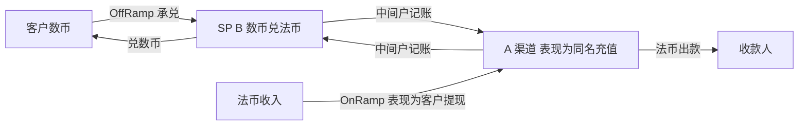
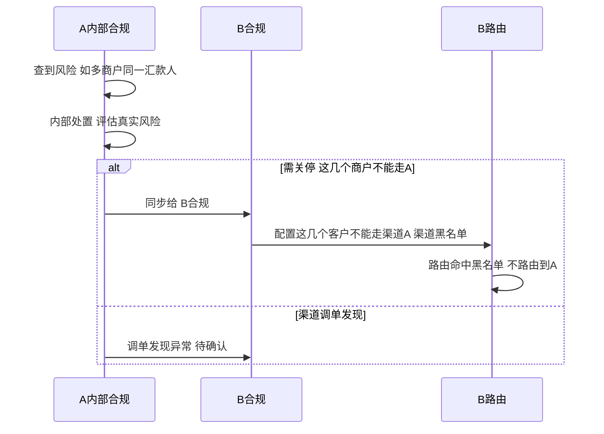

u- 

# B-A 中间户模式解决方案（A 作为 B 的法币收付款通道）

> **文档定位**：本文描述 **客户经 SP（B）走 A 渠道做 OffRamp / OnRamp** 的 **中间户模式**——把 **A 当作 B 的法币收付款通道**，资金 **通过中间户记账**（不展开具体账务实现）。本文只覆盖 **B-A 单渠道**，聚焦 **信息流、资金流与待办**；分类 2 客户的 MOR 贸易材料包装详见 `MOR模式-受控租户方案.md`。
>
> 已取消主子账户体系，客户始终只发起「一笔 OffRamp」，承兑 + 出款一步到位。

---

## 一、模式定位

**核心：A 是 B 的法币收付款通道，资金通过中间户记账。** B 承兑后的法币通过 **B 在 A 的中间户记账**完成入账与出款；终端商户只在租户端发起一笔单，不感知底层链路。

**BB 的牌照与角色：** BB 目前使用 **SRO 牌照**，具备 **支付服务** 能力；作为 SP（B）接入 A。**对 A 而言，B 把客户 KYC 推送给 A，与 A 的直客户没区别**；因此 **客户的信息流和资金流都没变**，只是在 A 侧以下形态呈现：

- **OffRamp**：客户在 A 看到的是 **同名充值**；
- **OnRamp**：客户在 A 看到的是 **客户提现**。

分层模型：**租户（BB / 其他租户）→ SP（B）→ 渠道（A）**。

| 角色                | 定位与职责                                                                                                   |
| ------------------- | ------------------------------------------------------------------------------------------------------------ |
| **租户**      | 展业主体（BB / 其他租户）：对终端商户展业的入口 / 品牌方；商户在租户端完成所有操作                           |
| **SP（B）**   | KYC 审核主体 + 承兑主体：接收入网、按 A 要求推送 / 审核 KYC；承兑（数币→法币）进入**B 在 A 的中间户** |
| **A（渠道）** | **B 的法币收付款通道**：负责法币入账与对外出款；做渠道报备审核与合规调单（RFI）；入网结果不同步给租户  |
| **DBS**       | VA 开户银行；VA 用于**客户验证**（开户不通知、打特殊标记，非真实交易 VA）                              |
| **收款人**    | 终端商户 OffRamp 的法币收款方                                                                                |

**关键原则：**

1. **中间户模式**：B 承兑后资金 **通过 B 在 A 的中间户记账**，再由 A 出款；不使用主子账户 / A-A 划转。
2. **对 A 无区别**：B 把 KYC 推送给 A，客户对 A 表现为 A 的直客户（OffRamp = 同名充值，OnRamp = 客户提现）；客户的信息流 / 资金流不变。
3. **一笔到位**：商户端只发起一笔 OffRamp，承兑 + 出款一步完成。
4. **报备与交易解耦**：入网即报备（异步），把 A 渠道可用性在交易前准备好；交易时只校验「A 渠道是否可用」。
5. **信息边界**：A 看不到终端商户的注册信息 / 联系方式，避免 A 绕过租户与 SP 直接触达商户。

---

## 二、信息流

信息流覆盖三段：**① 入网报备（KYB）② 交易指令 ③ 调单（RFI）**。

### 2.1 入网报备（KYB）信息流

**信息流要点：**

- **报备时机**：入网 B 通过后 **立即异步触发** 报备，与交易解耦；绝不在交易时才报备（链路长、会超时）。
- **信息边界（A 看不到联系方式）**：仅 **KYC 资料** 可同步给 A；**注册信息（登录 / 联系方式）不向 A 同步**（KYC 开户主体 ≠ 注册登录 user）。
- **入网结果不回传租户**：A 的审核结果只在 B 侧落地为「渠道可用状态」，不直接同步租户。
- **DBS VA**：审核通过后开 VA 做验证，**开户不通知商户、打特殊标记**（非真实交易 VA）。

### 2.2 交易指令信息流

- 交易前先做 **路由校验**：A 渠道是否可用、是否命中 **渠道黑名单**（命中则不可路由到 A）。
- 商户单状态机：初始 → pending → success / failed。

### 2.3 调单（RFI）信息流

> 本文只覆盖 **非 MOR（直客与租户普通客户）** 的调单；分类 2 / MOR 客户的调单详见 `MOR模式-受控租户方案.md`。

- **入口统一**：A 合规调单统一发 **B 合规**，由 B 合规发起 RFI；RFI 是 **单独流程**，不复用「待补充资料」，避免阻塞交易。
- **B 租户自有客户 / 交易**：A 合规调单 **直接发 B 合规**，经 B 运营到租户，不同于其他链路。

---

## 三、资金流

**A 作为 B 的法币收付款通道，资金通过 B 在 A 的中间户记账。客户的资金流不变；对 A 而言与直客户一致，只是形态表现为 OffRamp 同名充值、OnRamp 客户提现。**

**资金流要点：**

- **OffRamp**：客户数币经 B 承兑（数币 → 法币），通过 **B 在 A 的中间户记账** 完成，A 侧表现为 **同名充值**，再由 A 法币出款给收款人。
- **OnRamp**：反向路径，A 侧表现为 **客户提现**，经中间户记账后 B 兑回数币给客户。
- **对 A 无区别**：B 把 KYC 推送 A，客户对 A 就是直客户；**信息流 / 资金流都没变**，中间户仅用于记账（不展开具体账务实现）。
- **反向（退款 / 退票）**：按现有流程处理，**不做反向承兑**（形态见 `refund.md`）。
- **A 不可用**：本文仅 A 单渠道，A 未开通 / 不放行时该商户 **暂不可交易**，无跨渠道切换。

---

## 四、具体流程 Case

### Case 1：A 报备与 KYB

**前置条件：** A-B 合规对齐与 industries 映射完成；客户已入网 SP（B）并完成 fully KYC；A 已同步渠道能力（industries、同名 / 非同名）。

**业务规则：**

1. **报备时机（入网即报备、与交易解耦）**：报备由入网 B 通过后触发并异步执行；不允许交易时才报备。
2. **合规分类分流**：分类 1 直推 A；分类 2 经 MOR 包装后推 A（详见 MOR 文档）；分类 3 不推 A、不服务。
3. **入网报备材料**：默认只提供 **合同 / PI**；A 若要额外资料需走 **特批流程**（特批拒绝须补充；特批通过则渠道调单时再补）。
4. **A 审核结果**：通过 → 开 DBS VA（开通成功才算可用，pending / rejected 不可用）；拒绝 → 不可用；需补充 → 回补再复审。
5. **信息边界**：仅 KYC 资料同步 A，不同步注册联系方式；入网结果不回传租户。

**待办：**

- A-B 合规分类字典与 industries 映射维护；
- DBS VA 标记规则与「不通知商户」实现，并与 A 合规确认是否批量开、成本 / 风险；
- 报备分流、A 审核结果回传、开 VA 状态落地；
- 入网触发异步报备的任务编排、状态机（报备中 / 可用 / 不可用 / 待补充）与重试。

### Case 2：交易流程（OffRamp）

**前置条件：** A 渠道对该商户可用（KYC 通过 + DBS VA 开通）；商户已持有数币、已添加并审核通过收款人。

**业务规则：**

1. **一笔到位**：B 承兑（数币 → 法币进中间户）后由 A 出款；不经客户 VA 入账。
2. **状态机**：初始 → pending → success / failed。
3. **路由**：按渠道能力路由；路由前先查 **渠道黑名单**，命中则不可路由到 A（见 Case 4）。
4. **反向**：按现有流程，不做反向承兑。

**待办：**

- OffRamp 状态机与现有中间户流程对齐；
- 渠道能力维护与路由；
- 渠道黑名单配置与路由拦截（见 Case 4）。

### Case 3：调单流程（RFI，非 MOR）

**前置条件：** 交易已发生或在途；A 合规发起调单；A-B 调单流程已约定（A 合规直接发 B 合规）。

**业务规则：**

1. **入口**：A 合规调单统一发 B 合规，由 B 合规发起 RFI；RFI 单独流程，不复用「待补充资料」。
2. **B 租户自有客户 / 交易**：A 合规调单直接发 B 合规 → B 运营 → 租户，由租户找客户补材料。
3. **直客**：B 合规 → 运营 → 客户补材料回传。
4. 分类 2 / MOR 客户的调单见 `MOR模式-受控租户方案.md`。

**待办：**

- B 合规 RFI 发起入口与工单；
- 各场景 RFI 材料清单、SLA 与话术模板。

### Case 4：风险处置与渠道黑名单

**前置条件：** 交易中或交易后，A 发现风险线索（如多个商户使用同一汇款人信息）。

**业务规则：**

1. **触发场景**：A 内部合规查到（如多商户同一汇款人）；或渠道调单发现异常（处置口径待确认）。
2. **处置**：A 评估后若决定这几个商户不能走 A，同步 B 合规；B 合规将其配置为 **渠道黑名单**。
3. **路由拦截**：B 路由必须支持渠道黑名单，命中不路由到 A。

**待办：**

- 渠道黑名单数据模型（商户 / 渠道维度）与配置入口；
- B 路由的黑名单拦截实现；
- A 与 B 合规风险同步的接口 / 流程；
- 渠道调单发现异常的处置口径（待确认）。

---

## 五、待办汇总

| 编号 | 待办                                                         | 关联       |
| ---- | ------------------------------------------------------------ | ---------- |
| 1    | A-B 合规分类字典与 industries 映射维护                       | Case 1     |
| 2    | DBS VA 标记规则、「不通知商户」实现，批量开与成本 / 风险确认 | Case 1     |
| 3    | 入网触发异步报备的任务编排与状态机、重试                     | Case 1     |
| 4    | OffRamp 状态机与现有中间户流程对齐                           | Case 2     |
| 5    | 渠道能力维护与路由                                           | Case 2     |
| 6    | 渠道黑名单数据模型、配置入口与路由拦截                       | Case 2 / 4 |
| 7    | B 合规 RFI 发起入口与工单、材料清单 / SLA / 话术             | Case 3     |
| 8    | A 与 B 合规风险同步接口 / 流程；渠道调单异常处置口径         | Case 4     |

---

> **说明**：本文聚焦 **B-A 中间户模式**——A 作为 B 的法币收付款通道，明确 **信息流（入网报备 / 交易指令 / 调单）** 与 **资金流（客户数币 → B 承兑进中间户 → A 法币出款）**。分类 2 客户的贸易材料包装与展业模式（受控租户方案）见 `MOR模式-受控租户方案.md`。

