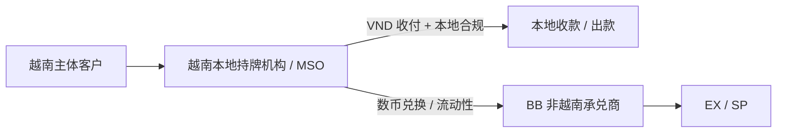

# BB 不能服务越南主体：问题分析与解决方案

> **文档定位**：BB 目前 **不能服务越南主体**。本文分析该限制对 **EX** 的影响、受影响的产品线，给出解决方案，并结合 **越南市场当前普遍做法** 补充参考。
>
> **范围说明**：数币相关能力上，**A 可以服务越南主体**，不在本次分析范围内；本文聚焦 EX / BB 侧。

---

## 一、问题

**BB 当前不能服务越南主体。** 需回答两个问题：① 这对 EX 有何影响；② 若要服务越南主体，由谁来服务、BB 的角色是什么。

---

## 二、影响分析

### 2.1 EX 服务的租户客户画像里是否有越南主体？

- **有（理论上）**：EX 目前在做越南市场，租户 / 客户画像中 **理论上会存在越南主体**。

### 2.2 若要服务，谁来服务？BB 的角色在哪里？

- **EX 提供 on/off ramp 等产品**；其中 **收付越南盾（VND）由越南当地支付机构 / MSO 机构完成**。
- **若 EX 的 SP 本身在越南有当地机构**：VND 可 **直接用当地机构 / A 收或付**。
- **BB 的作用**：BB 为这些支付机构做 **流动性供应商** 或 **承兑服务**；**前提是这些机构须为非越南主体**——这正是 BB 限制的落点。

> 结论：VND 的"最后一公里"本就要落到 **越南本地机构**；BB 的价值在 **非越南侧的流动性 / 承兑**。因此 BB 不能服务越南主体，**影响的不是 VND 收付本身，而是"客户 / 租户主体是越南实体"时 BB 无法作为其服务方** 的场景。

### 2.3 具体受影响的产品线

| 产品线             | 是否受影响 | 说明                                                                                         |
| ------------------ | ---------- | -------------------------------------------------------------------------------------------- |
| **On/Off Ramp**    | 间接       | VND 收付由越南本地机构 / A 承担；BB 只做 **非越南主体** 的流动性 / 承兑，越南主体侧需另找承接 |
| **发卡产品**       | **受影响** | 目前确有租户使用 B 的发卡能力（法币 / 数币均可能）；**即便是租户，也可能是越南当地机构**，会受限 |
| **数币收单产品**   | **待分析** | 暂不服务越南主体，直接收消费者的 U；但 **实际有一部分通过越南当地机构**——越南本地直接收 U 再 OffRamp 到越南 |

---

## 三、解决方案

### 方案一：确需用到 BB —— BB 分析 MSB 牌照可行性

- 对于 **一定要用到 BB** 的场景，**由 BB 启动分析：MSB（Money Services Business）牌照是否可以覆盖 / 支持** 服务越南主体的相关业务。
- 待评估：牌照适用边界、是否需补充资质、对现有发卡 / 收单业务的合规影响。

### 方案二：越南本土业务 —— 直接找越南本地机构合作，BB 做非越南地区承兑商

- **越南本土主体的业务**：评估是否 **直接找越南本地持牌机构合作** 完成 VND 收付与本地合规；
- **BB 定位收敛为"非越南地区的承兑商 / 流动性供应商"**，不直接承接越南主体，规避主体限制。

---

## 四、结合越南市场当前普遍做法（补充参考）

> 以下为公开资料整理与行业一般性判断，**监管细则仍在演进，需与合规及当地法律顾问最终确认**。

**监管背景（关键节点）：**

- 越南 **《数字技术产业法》（2025-06 通过，预计 2026-01-01 生效）** 首次将 **数字资产纳入法律框架**；
- **Resolution 05/2025/NQ-CP** 设立 **5 年试点**，门槛很高（机构注册资本约 **VND 10,000 billion（约 4 亿美元）**），并要求 **VND-only 结算**、**外资须开立专用 VND 账户**；
- 细则全面落地前的底线：**不得将加密货币作为支付手段**；越南央行（SBV）持续强调 **支付合规与 AML / 反洗钱**。

**市场普遍做法（对本方案的印证）：**

- **法币侧与加密侧分离**：VND 的收 / 付由 **越南本地持牌支付机构 / 中介（MSO 类）** 完成，**境外主体一般不直接触碰 VND 清算**；
- **境外主体做流动性 / 承兑**：加密兑换、跨境流动性由 **非越南主体（境外 SP / 交易所）** 提供，与本地机构对接完成"最后一公里"；
- **OffRamp 到越南** 的典型链路：**本地收 U → 本地机构结算 VND** 给收款人；
- **合规留痕**：保持银行流水、购汇 / KYC-AML 凭证，避免境内把加密资产直接用于支付。

**对本方案的含义：**

- 这与 **方案二** 的思路一致——**VND / 越南主体由本地机构承接，BB 退到非越南侧做承兑 / 流动性**，是当前市场更普遍、更稳妥的结构；
- **方案一（BB MSB 牌照）** 更重、周期更长，且未必能覆盖"越南主体"的本地合规要求，建议作为 **确需 BB 直接承接时** 的评估选项。

---

## 五、待决策 / 待确认

- **BB MSB 牌照** 能否 / 在多大范围支持服务越南主体（方案一，待 BB 评估）；
- **越南本地机构合作** 的对象、模式与协议（方案二）；
- **发卡产品**：越南当地机构 / 租户受限后的替代承接方案；
- **数币收单**：经越南当地机构收 U → OffRamp 的具体链路与合规口径（待分析）；
- 与合规 / 当地法律顾问确认 **越南 2026 试点新规** 对上述结构的具体约束。

---

## 参考

- 越南《数字技术产业法》与数字资产框架（2025-06 通过 / 2026-01-01 生效）
- Resolution 05/2025/NQ-CP：加密资产市场 5 年试点、VND 结算与专用账户要求
- 越南央行（SBV）支付合规与 AML 相关口径

> 注：以上监管信息为公开资料概述，具体条款与适用性 **以最新法规及合规意见为准**。
