# EX OffRamp 解决方案

> **文档类型**：产品方案（OffRamp 整体）
> **关联文档**：`主子账户OffRamp解决方案.md`（主子账户 / 中间户 / 渠道路由）、`OnOfframp/prd/offramp-v1.md`、`refund.md`、Cregis API：[https://pacstrust.readme.io/reference/获取商户账户资产](https://pacstrust.readme.io/reference/%E8%8E%B7%E5%8F%96%E5%95%86%E6%88%B7%E8%B4%A6%E6%88%B7%E8%B5%84%E4%BA%A7)
> **目的**：定义 EX 为商户提供 OffRamp（数币 → 法币出款）的 **产品包装、路由、计费 / 汇率 / 限额、各产品 Case（含正反向流程与验收标准）**。

---

## 一、背景

- EX 为商户提供 **OffRamp**：把商户持有的数币（U）兑换为法币并出款给收款人 / 提现。
- 渠道侧存在 **多类渠道**，能力、限额、价格、体验、汇率差异明显，需要 **统一产品包装 + 路由 + 计费**。
- **汇率差异（关键）**：EX 对商户报价通常是 **实时汇率**，而部分渠道（如 Cregis）按 **1 : 1** 承兑；当市场 1 U 可兑换 **多于** 1 USD 时，走 1:1 渠道存在 **价差损失**，需在计费 / 报价层处理（见第六节）。
- **主子账户能力**：本文不展开，**详见 `主子账户OffRamp解决方案.md`**。

---

## 二、整体架构与实施阶段（Roadmap）

分层模型：**终端商户 → 租户 → SP → 渠道**。

- **终端商户（Merchant）**：使用 OffRamp 的最终用户，自有资金。
- **租户 / TP（大代理）**：对商户展业的品牌 / 大代理，负责获客经营，**不碰资金**。
- **SP（服务提供方）**：提供承兑 / 资金 / 出款服务（KYC、法币账户、汇率、合规）。
- **渠道（Channel）**：SP 背后的底层支付通道，资金实际落地处。

**产品类 = SP 分类（重要）**：

- 租户端对客展示的 **「优享丝滑 / 标准实惠」本质是 SP 层的分类**（不同 SP 提供不同体验 / 价格）。
- 理论上 **一个产品类可对应多个 SP**，因此完整模型在 **租户层应有「SP 路由」**：先按产品类选 SP，SP 内再做「渠道路由」。例如：优享丝滑 → Cregis / 渠道 D；标准实惠 → B / 其他 SP。

### 2.1 实施阶段（Roadmap，重要）

分 **4 个阶段** 递进落地：

**阶段 1：SP 只有 BB 和 Cregis（两者直连 EX 作 SP）**

- 本阶段 **SP 只有两个：BB 和 Cregis**，均 **直连 EX 作 SP**（Cregis 不下沉到 BB 背后）；
- **两类 SP 角色**：**钱包托管服务**（提供客户充币地址、托管 U，可配 BB / Cregis）+ **承兑服务商**（U → 法币 + POBO 出款）；
- **统一前提**：现流程「**先 KYC/KYB，再做业务**」；
- 按「**托管在哪 + 终端客户是否进件**」分 **三种 case**（详见 2.2）：
  - **Case 1**：租户只签 Cregis（托管 + OffRamp 都用 Cregis，不用 BB）——租户须作为旗下商户入网 BB 完成 KYC/KYB，客户在 Cregis 登记 POBO 汇款人；**前端仅极速丝滑**；
  - **Case 2**：托管 = BB、OffRamp = Cregis——终端客户不进件、租户代收，OffRamp 时 BB → Cregis；**前端仅极速丝滑**；
  - **Case 3**：终端客户自入网——**必开 BB 托管、OffRamp 可不开**；不开仅极速丝滑（BB → Cregis），开则可选 **极速丝滑 / 标准实惠**（标准实惠走 BB）；
- **不增加渠道能力维护**（本阶段只有 BB、Cregis 两个 SP）；
- **详细方案见 2.2**。

**阶段 2：Cregis 接到 SP（BB）背后做渠道，维护基本渠道能力**

- Cregis **下沉为 BB 背后的渠道**，此时 **SP = BB**；以接 BB 背后为例，**沿用 BB 现有流程**，维护 **基本渠道能力**；
- **资金调拨**：**BB 按实际需求把 U 调拨到 Cregis（可实时调拨）**；
- 待确认：**BB 的资金运营**——Cregis 是 **1:1**、BB 是 **实时汇率**，两者的资金 / 头寸 / 价差处理。

**阶段 3：维护完整渠道能力 + 路由**

- 参考第七节 **Case 5「渠道能力」+ Case 6「路由」** 做完整的多渠道能力维护与路由。

**阶段 4：KYC 流程改造（按业务判断）**

- 根据业务情况，**再判断是否要改造现有 KYC 流程**。

**阶段 1 架构（Cregis / BB 各作 SP，直连 EX）**：

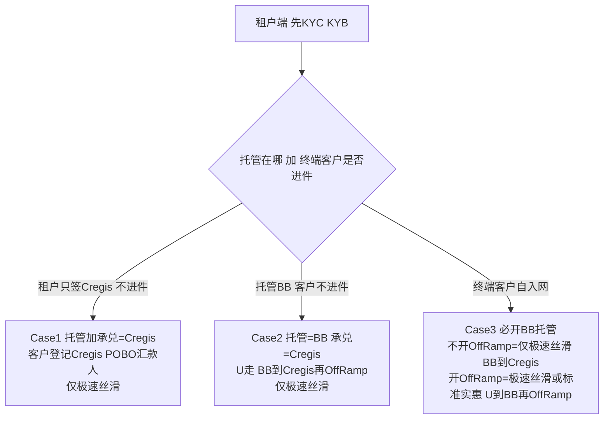

**阶段 2 架构（Cregis 下沉为 BB 渠道，SP = BB）**：

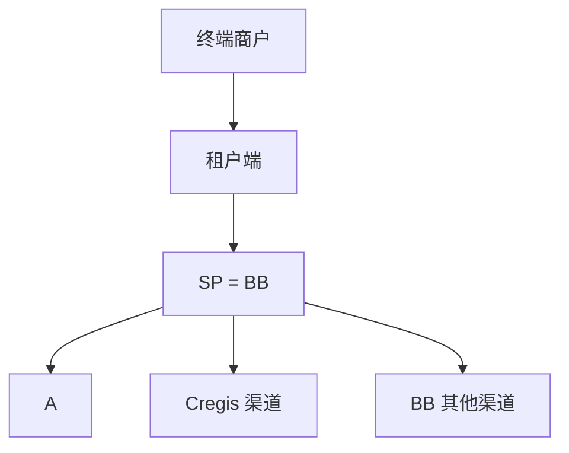

> 说明：本文 **第四 / 五节流程与路由、第七节 Case** 主要描述 **阶段 2 起（SP = BB）** 的稳态；下方 **2.2** 单独给出 **阶段 1（Cregis 作 SP）** 的 MVP 详细方案。

### 2.2 阶段一详细方案（Cregis 作 SP ）

**共同前提**：

- 本阶段 **SP 只有 BB 和 Cregis**；**两类 SP 角色** = **钱包托管服务**（提供客户充币地址、托管 U，可配 BB / Cregis）+ **承兑服务商**（U → 法币承兑 + POBO 出款）；
- **先 KYC/KYB、再做业务**：所有 case 都必须先完成合规，再发起 OffRamp；
- **不增加渠道能力维护**（本阶段只有 BB、Cregis）。

阶段 1 按「**托管在哪 + 终端客户是否进件**」分为 **三种 case**，**前端可选产品由 case 决定**：

| Case   | 终端客户是否进件 | 托管       | 承兑 / 出款 | 前端可选产品           |
| ------ | ---------------- | ---------- | ----------- | ---------------------- |
| Case 1 | 否（租户代收）   | Cregis     | Cregis      | 仅极速丝滑             |
| Case 2 | 否（租户代收）   | BB         | Cregis      | 仅极速丝滑             |
| Case 3 | 是（客户自入网） | BB（必开） | Cregis / BB | 极速丝滑（+ 标准实惠） |

#### Case 1：租户只签 Cregis（托管 + OffRamp 都用 Cregis，不用 BB）

**前置条件**：

- 租户 **只想用 OffRamp Cregis、不想用 BB**，**托管也只用 Cregis**；
- 但现流程「先 KYC/KYB 再业务」——所以租户须签 **BB 托管 + Cregis 托管 + Cregis OffRamp**；其中 **签 BB 只是为了走现有的 KYC/KYB 流程**：由 **「租户=客户」那一个主体** 在 BB 完成 KYC/KYB，**BB 仅作 KYC/KYB 服务方**。

> **风险（重要，必须管控）**：
>
> - **EX 与 BB 是两家公司，BB 不会把 Cregis 签成自己的渠道**；BB 的收益来自交易型业务，**不接受「只做 KYC、不做业务」**。
> - 若放开，**租户会把 BB 注册链接群发给终端客户 → 客户都在 BB 做 KYC → 业务量却全走 Cregis**，BB 白背合规成本与责任，且 **U 不经 BB 归集**，与「BB 作数币资金中心」原则冲突。
> - 因此 **Case 1 不可规模化、不可自助开通**。

**管控手段**：

- **① 受限 + 申请审批制**：Case 1 **默认关闭**，仅供 **个别销售场景**，按租户 **逐个申请、EX/BB 共同审批**（白名单）；
- **② 终端客户走 Cregis 登记、不碰 BB**：Case 1 下发给终端客户的链接 = **Cregis remitter（POBO 汇款人）登记链接**，**不是 BB 入网链接**；BB 的 KYC/KYB 入口 **只对租户主体账号开放**（一次性、内部受控），不进入对客注册漏斗——从源头杜绝客户跑去 BB 做 KYC；
- **③ BB-KYC 主体数 = 1**：系统 **硬限制** Case-1 租户在 BB 的 KYC/KYB 主体 **只能有 1 个**（即「租户=客户」主体），**不允许在该租户下新增任何 BB 入网主体**；
- **④ 监控告警**：监控「该租户 BB 主体数」与「Cregis-only 业务量」，出现 **BB 主体异常增多 / BB 零业务但 Cregis 高量** 时告警，可 **冻结 Case 1 资格**；
- **⑤ 商务兜底（解决 BB 没收益的根因）**：对这唯一的 BB-KYC 主体 **单独计费（一次性合规服务费）**，或 **Cregis OffRamp 收入按比例分润给 BB**；二选一须写进与 BB 的商务协议，否则 Case 1 仅作逐单审批的例外。

**业务规则**：

- 整体流程不改：**租户用「自己的那个客户身份」代收**，终端客户在 **Cregis 登记为 POBO 汇款人**（不在 BB 入网）；
- **前端只能展示「极速丝滑」**。

**正向流程时序图**：

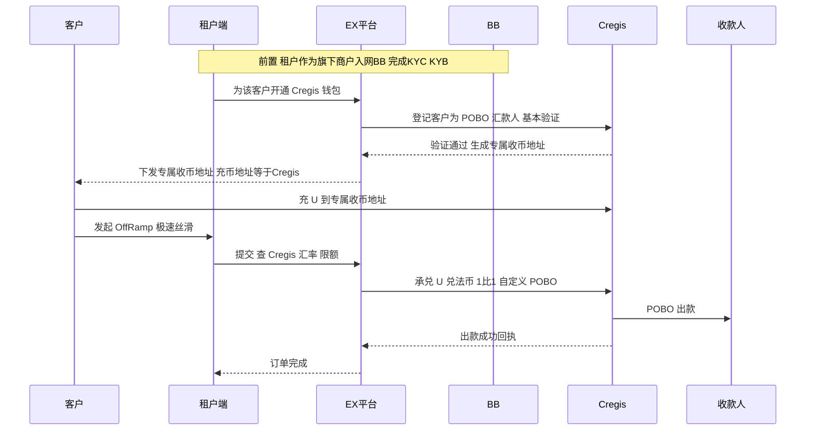

#### Case 2：托管用 BB，OffRamp 只用 Cregis

**前置条件**：

- **托管服务 = BB**，**承兑 + 出款 = Cregis**；
- **终端客户不进件**（不单独 KYC），由 **租户自己这个客户身份代收**。

**业务规则**：

- OffRamp 时从 **BB → Cregis → OffRamp**（BB 把 U 划转到 Cregis，再由 Cregis 承兑 + POBO 出款）；
- **前端只能展示「极速丝滑」**。

**正向流程时序图**：

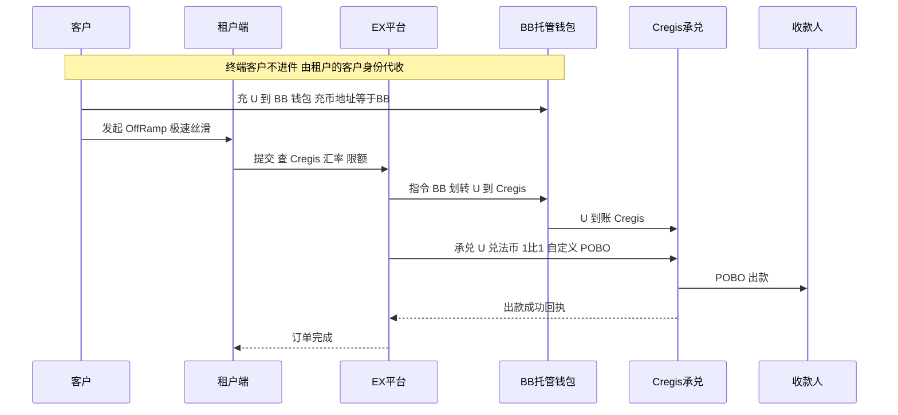

> **待办（Case 2）**：**BB 是否能提供「BB → Cregis 的 U 划转」能力**？该划转的 **费率 / 成本**？

#### Case 3：终端客户自己入网（进件）

**前置条件**：

- **终端客户自己入网（KYC）**；
- **只要商户入网，就一定开通 BB 的托管**，只是 **OffRamp 可以不开**。

**3.1 OffRamp 不开**：

- **前端只能「极速丝滑」**；
- 流程：**客户 U → BB → Cregis → OffRamp**（链路同 Case 2）。

**3.2 OffRamp 开**：

- **前端可选「极速丝滑 / 标准实惠」**；
- **极速丝滑**：同 Case 2 链路（U → BB → Cregis → OffRamp，不再重复时序图）；
- **标准实惠**：**U → BB → OffRamp**（BB 承兑 + 按出款路由出款）。

**正向流程时序图（标准实惠：U → BB → OffRamp）**：

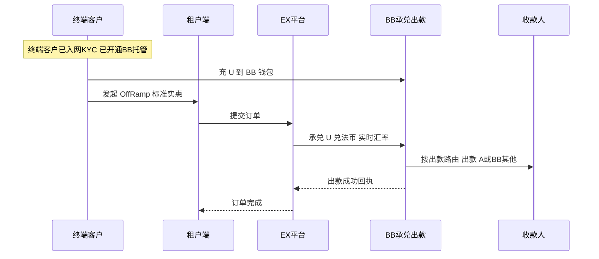

**反向流程（退票 / 退款，三 case 通用）**：

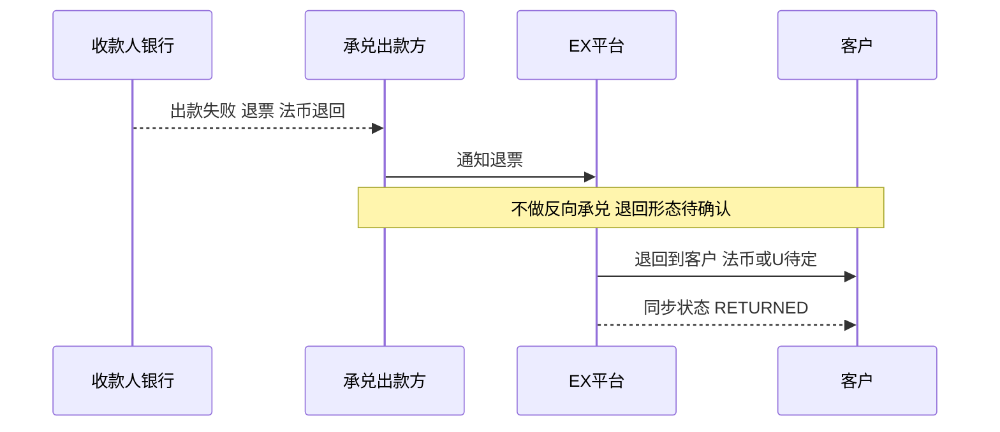

**验收标准**：

- 所有 case 都 **先 KYC/KYB 通过后** 才能开通钱包、发起 OffRamp；
- **Case 1**：租户已作为旗下商户入网 BB；客户在 Cregis 登记 POBO 汇款人、生成专属收币地址；前端仅极速丝滑；
- **Case 2**：终端客户不进件、租户代收；OffRamp 时 BB 成功把 U 划转到 Cregis 再承兑 + POBO；前端仅极速丝滑；
- **Case 3**：客户入网即开通 BB 托管；OffRamp 不开→仅极速丝滑（走 BB→Cregis）；OffRamp 开→可选极速丝滑 / 标准实惠（标准实惠走 BB 承兑 + 出款）；
- 正向出款成功状态一致；反向退票按约定退回形态处理，状态一致；
- 本阶段不涉及渠道能力维护与路由。

> **待确认（阶段 1）**：
>
> - **BB → Cregis 的 U 划转能力**（Case 2 / Case 3 用）及其 **费率 / 成本**；
> - **Cregis 充币地址**（Case 1 用）：地址数量、汇款人地址分配 / 更新、数量预警、不足处理；
> - **极速丝滑限额**；前端按 case 决定可选产品的 **配置粒度**（租户级 / 客户级）；
> - 反向退票的 **退回形态**（退法币 or 退 U）与责任方。

---

## 三、产品包装（对客两类产品）

对商户 **按「卖点」分两类产品**（不按底层渠道的具体参数分类）：

| 产品类型           | 一句话卖点（对客展示）                                   |
| ------------------ | -------------------------------------------------------- |
| **极速丝滑** | **体验丝滑、要求少，省心快出款——价格略高**       |
| **标准实惠** | **价格优惠、操作简单——可能需补充材料、体验一般** |

> 核心差异就两点：**「价格高 + 体验丝滑」** vs **「价格低 + 标准（可能要材料）、体验一般」**。客户两类都可走时，前端只展示这两句卖点供其选择。

**对内：产品类型 → 底层渠道与实现（不对客展示）**：

| 产品类型           | 底层渠道 / 资金模式                                         | 对应 Case       | 渠道实现要点                                                                       |
| ------------------ | ----------------------------------------------------------- | --------------- | ---------------------------------------------------------------------------------- |
| **优享丝滑** | Cregis（**数币实时调拨**）                            | Case 3          | 1:1 承兑、不要 KYC、单笔 ≥ 10,000 U、POBO 可指定商户名义、不可垫资（实时 U 调拨） |
| **标准实惠** | A（**中间户**）/ 其他渠道（**渠道合作·垫资**） | Case 1 / Case 2 | 实时汇率、标准准入（可能需资料 / 合规）、可能有调单                                |

> **三种资金落地模式**（产品 Case 即按此划分）：**① 中间户**（A，先进中间户再出，Case 1）；**② 渠道合作 / 提前垫资**（其他渠道，渠道方先垫付，Case 2）；**③ 数币实时调拨**（Cregis，实时调 U、不垫资、1:1，Case 3）。

> 说明：**1:1、≥10,000 U、不要 KYC 等是 Cregis 渠道的实现细节，不是对客的产品分类口径**；对客只讲「价格 / 体验」的卖点。

> **产品类与渠道是「主映射」而非死绑**：优享丝滑当前 **主要落 Cregis**，但 **允许在 Cregis 异常 / 不可用 / 容量受限等意外情况下，切换到其他满足同等「丝滑」体验的渠道**；同理标准实惠也可扩展更多渠道。具体可走渠道 **以 Case 5 渠道能力为准**（产品类只是对客卖点封装）。

> **MOR 主子账户**：底层归入「标准实惠」，但 **主子账户中转链路可能不稳定 / 走不通**，需作为可降级、可切换的路径。详见 `主子账户OffRamp解决方案.md`。

---

## 四、整体流程（流程图）

> **按阶段 1 口径**：一笔 OffRamp 实际包含 **三层路由**——**① 托管路由**（决定客户充币地址：BB / Cregis）、**② 承兑路由**（U → 法币在 BB 或 Cregis 承兑）、**③ 法币出款路由**（A / BB 其他渠道 / Cregis POBO）。
>
> **承兑非背靠背（类似换汇）**：目前承兑不强制与出款背靠背绑定——**承兑走 BB → 保持现有流程**（承兑得到法币后，再按出款路由出款）；**承兑走 Cregis → 承兑 + 出款可在 Cregis 一起做（POBO）**，不再单独走出款路由。

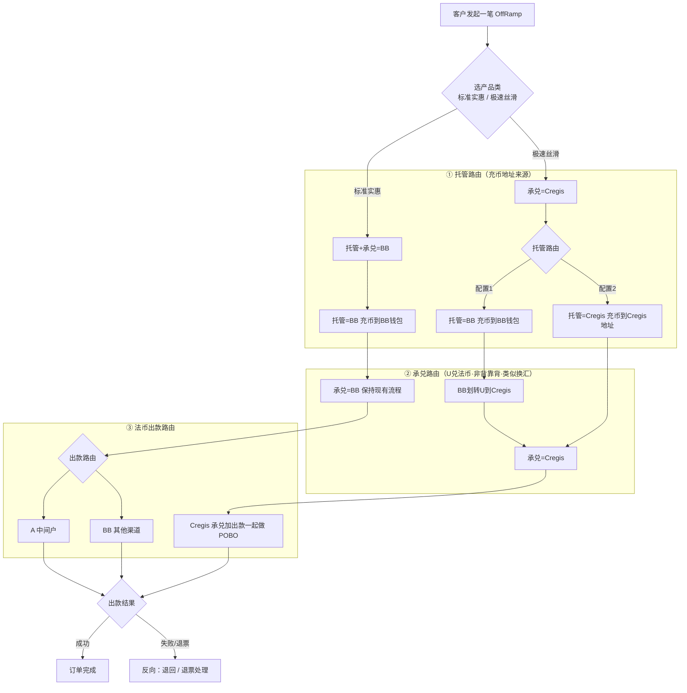

> 分层说明（阶段 1）：
>
> - **标准实惠**：托管 + 承兑都在 **BB**，承兑后按 **出款路由** 选 A / BB 其他渠道出款（保持现有流程）；
> - **极速丝滑**：承兑固定走 **Cregis**，托管可配 —— **配置 1（托管=BB）** 先把 U 从 BB 划转到 Cregis 再承兑+POBO；**配置 2（托管=Cregis）** 客户直接充到 Cregis、就地承兑+POBO；
> - **三层路由各自存在**：托管、承兑、出款都可路由；只是承兑与出款 **目前非背靠背**，BB 承兑沿用现流程、Cregis 则承兑+出款合一。
> - （阶段 2 起 SP = BB，Cregis 下沉为 BB 背后渠道，承兑/出款收敛到 BB 内的渠道路由，见第五节；多 SP + SP 路由属后续阶段）

---

## 五、路由

> **路由分层**：完整模型 = **SP 路由（产品类 → 选 SP）+ 渠道路由（SP 内 → 选渠道）**。**阶段 2 起 SP = BB，所以只有「渠道路由」（在 BB 背后选 A / Cregis / BB 其他）；多 SP + SP 路由属后续阶段（阶段 1 为 Cregis 直连作 SP 的单租户 MVP，见 2.2）**。
>
> **阶段 1 的三层路由**：除上面的 SP / 渠道路由外，阶段 1 实际还细分为 **① 托管路由**（充币地址：BB / Cregis）、**② 承兑路由**（U→法币：BB / Cregis）、**③ 法币出款路由**（A / BB 其他 / Cregis POBO）。**承兑与出款目前非背靠背（类似换汇）**：承兑走 BB 沿用现流程、再按出款路由出款；承兑走 Cregis 则承兑 + 出款合一（POBO）。详见第四节整体流程。
>
> **本期路由口径**：**路由的真实依据 = Case 5「渠道能力」**——按订单要素（金额、收款国家、收款方式、收款人类型、资金来源等）在已维护的渠道能力中 **筛选出满足条件的渠道**。**当前一种能力组合对应唯一渠道，无需在多个命中渠道间再按规则二次筛选 / 排序**（多渠道命中的排序与切换属 Case 6，本期不做）。
> 下面 5.1～5.2 只列 **本期会用到的判定子集**，完整维度以 **Case 5** 为准。

### 5.1 路由总原则

1. **先判定客户对两大类渠道的可走性（资格）**：金额门槛、渠道准入、收款人类型等（**依据 Case 5 渠道能力**）。
2. **两类都能走** → 前端展示两类卖点与报价，**客户自选**，按所选类别计费。
3. **只有一类能走** → 直接走该类，不展示选择。
4. **选定类别后**，按渠道能力筛选出对应渠道（**一能力对应一渠道，直接命中**）。

### 5.2 渠道路由（标准实惠，B 背后选渠道）

> **A 不再区分场景**：「直接 OffRamp」与「A 主子账户中转」**统一视为同一个渠道 A**（主子账户是 A 的内部机制，不单列为路由场景）。

- **本人同名提现**：可走 **A 或 BB 其他渠道**；
- **三方收款人**：**只能走 BB 其他渠道，走不了 A**。

### 5.3 路由时序图

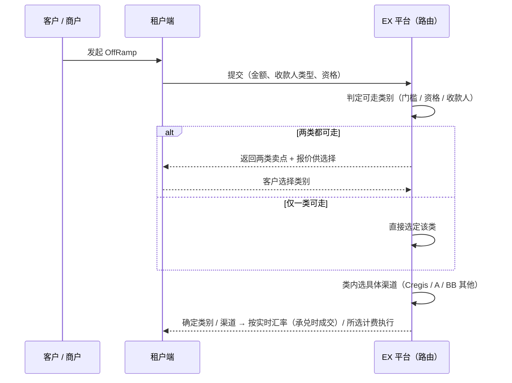

> **待确认（路由）**：与 Case 5 能力维度的字段映射（哪些要素参与筛选）；两类都可走时的默认排序 / 推荐；**第二期 SP 路由的触发与判定**（后续一能力对多渠道 / 多 SP 时的切换属 Case 6）。

---

## 六、计费、汇率与限额

### 6.1 汇率处理：实时汇率 vs Cregis 1:1（核心）

**问题**：EX 对商户报价通常是 **实时汇率**；Cregis 按 **1 : 1** 承兑。当市场 **1 U > 1 USD**（U 溢价）时，若按实时汇率对商户报价、却走 1:1 的 Cregis 结算，平台需多付法币，**形成价差损失**。

**处理原则**：

- **报价按渠道隔离**：
  - **标准实惠**：按 **实时汇率** 结算与报价；
  - **Cregis**：对商户报价 **以 1:1 为结算基准 + 平台点差 / 费率**，**不承诺优于 1:1 的市场汇率**。
- **两类报价不同、由客户选择**：两类都可走时，前端 **同时展示两类报价**——若实时汇率更优，客户可选标准实惠；若要丝滑省心，选优享丝滑（Cregis，汇率固定 1:1）。**选择即接受对应报价**。
- **平台点差兜底**：对商户的最终报价 **含点差**，确保平台 **不因 1:1 价差亏损**，**不为汇率差垫付**。
- **不锁价**：实时汇率 **不在下单时锁价**，以 **承兑 / 成交时点的实时汇率** 为准（没有锁价一说）；Cregis 为 **固定 1:1**，同样无锁价概念。
- **页面提示（不锁价的客户告知）**：前端展示报价时 **标注「汇率参考时间 / 有效期」**，并 **明确提醒**：实时汇率以 **承兑成交时点** 为准，**最终到账金额可能与当前看到的报价存在差异**；Cregis（1:1）则金额确定。避免因不锁价产生客诉 / 纠纷。

**示例**（市场 1 USDT = 1.002 USD，金额 10,000 U，忽略其他费）：

| 渠道             | 结算汇率   | 商户到手（示意）    | 说明                     |
| ---------------- | ---------- | ------------------- | ------------------------ |
| 标准实惠         | 实时 1.002 | ≈ 10,020 USD − 费 | 汇率更优、价格便宜       |
| 优享丝滑(Cregis) | 1.000      | ≈ 10,000 USD − 费 | 汇率固定 1:1，但体验丝滑 |

> **结论**：1:1 价差不由平台承担，而是通过 **「按渠道报价 + 客户自选 + 点差兜底」** 消化；客户用「汇率」换「体验 / 大额可行性」。

> **待确认（汇率）**：Cregis 报价的 **点差 / 费率规则**；当 **市场 < 1:1（U 折价）** 时是否把 Cregis 的相对优势体现在报价上；是否需要风控对极端汇率拦截。

### 6.2 计费

- **报价随类别不同**：优享丝滑（Cregis）报价高；标准实惠报价低。
- **费用项**：承兑费 / 出款费 / POBO 费（Cregis）/ 通道费等，按渠道配置。
- **计费时点**：实时汇率在 **承兑 / 成交时点** 按实时成交确定（不锁价），出款成功落账；失败按反向规则处理（见各 Case）。

> **待确认（计费）**：各渠道费率项与费率表；客户选择后的落单与计费口径；失败 / 退票的费用归属。

### 6.3 限额配置

- **Cregis（优享丝滑）**：**单笔 ≥ 10,000 U**（下限）；低于门槛不可走 Cregis，路由降级到标准实惠。
- **标准实惠**：无特殊下限，按渠道实际限额。
- **可配置项**：渠道 **单笔上下限、日 / 月累计限额**，支持 **按渠道、按商户、按产品类别** 配置。

> **待确认（限额）**：各渠道限额参数与默认值；超限处理（拒绝 / 拆单 / 转渠道）；限额配置的维护后台。

---

## 七、产品 Case

> 每个 Case 给出：**前置条件 / 业务规则 / 正向流程（时序图）/ 反向流程（时序图）/ 验收标准**。
> 反向统一遵循现有 **「不做反向承兑」** 原则（见 `refund.md`），各 Case 标注差异。

### Case 1：A 渠道 OffRamp（中间户模式）

> **资金落地模式 = 中间户**：承兑后法币在 **B 侧（客户 B 法币账户 → B 中间户）** 流转，再划转到 **客户在 A 的法币账户**，由 **A 出款给目标收款方**。

**前置条件**：

- 商户在 B 持有数币；A 渠道准入已完成；
- 商户已 **添加收款人**（提现 / 收款账户，经 EX 审核）。

**业务规则**：

- 对商户按 **实时汇率** 报价，**不锁价**（承兑时点实时成交）；
- A 渠道支持两种链路：**① 直接 OffRamp**（商户直接在 A 出款）；**② 经主账户中转**（子商户不可直接出款时，走主子账户中转，详见 Case 7 / `主子账户OffRamp解决方案.md`）；
- **直接 OffRamp 资金路径**：**客户 B 数币账户 → 客户 B 法币账户（承兑）→ B 中间户 → 客户 A 法币账户 → A 目标收款方**；
- 可能涉及 **合规调单**（见主子方案第五节）。

**正向流程（直接 OffRamp 出款）**：

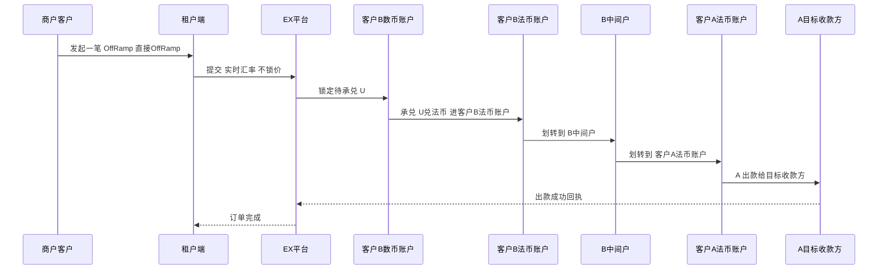

**反向流程（退票 / 退款）——两种场景**：

**场景 1：直接 OffRamp 退票** —— **跟现在一致**：不做反向承兑，法币原额退回法币账户，状态 RETURNED；如需换回 U 由商户自行 OnRamp（见 `refund.md`）。

**场景 2：经主账户中转退票** —— 子商户在 **受控 A 账户提现被拒** 时，按原路 **逐级退回**：

1. 收款人 / 银行拒付 → 退回 **子商户受控 A 账户**；
2. **A-A 划转回**：子商户受控 A 账户 → **主账户 A 法币账户**；
3. 主账户走 **现在的退票流程**（不做反向承兑，法币退回 **主账户在 B 的法币账户**）；
4. 主账户在 B 收到后，**B 内部转回** → 退回给 **子商户**。

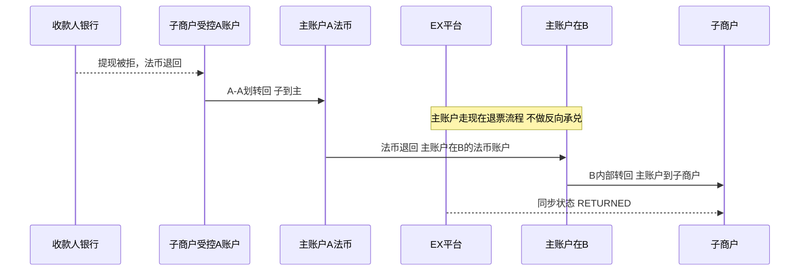

### Case 2：其他渠道 OffRamp（渠道合作 / 提前垫资模式）

> **资金落地模式 = 渠道合作垫资**：与渠道方为合作关系，**渠道方先用自有法币垫资出款** 给收款人，EX / SP 事后用承兑所得法币与渠道 **结算清分**（与中间户「先进户再出」不同）。

**前置条件**：

- 商户在 B 持有数币；该合作渠道准入与 **垫资 / 结算协议** 已完成；
- 商户已 **添加收款人**；渠道能力（收款国家 / 方式 / Rails 等）以 Case 5 为准。

**业务规则**：

- 对商户按 **实时汇率** 报价，**不锁价**；
- **渠道方提前垫资**：先垫付出款，**事后按结算周期与渠道清算**（涉及垫资额度 / 授信、结算时点）；
- 退票需 **冲减垫资 / 调整结算**。

**正向流程（出款）**：

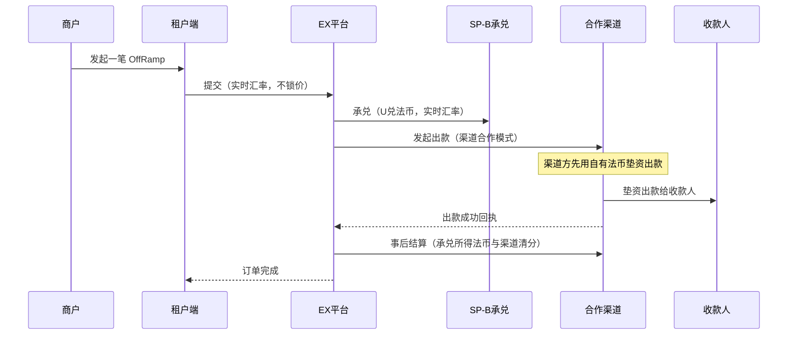

**反向流程（退票 / 退款）**：不做反向承兑，法币原额退回法币账户，状态 RETURNED；**退票需同步冲减该笔垫资 / 调整与渠道的结算**（见 `refund.md` + 第九节费用归属）。

**验收标准**：

- 承兑与垫资出款时点 / 顺序正确；
- 垫资额度 / 授信不足时拒绝或转其他渠道；
- 结算周期内与渠道清分一致、可勾兑；
- 退票冲减垫资 / 结算正确，状态一致。

> **待确认（Case 2）**：合作渠道清单与 **垫资额度 / 授信规则**；结算周期与对账口径；退票冲减垫资的处理流程与责任方。

### Case 3：Cregis 大额 OffRamp（数币实时调拨）

**前置条件**：

- **单笔 ≥ 10,000 U**；Cregis 渠道准入完成（**不要 KYC**）；
- 数币进入 Cregis 的两种方式（场景）：
  - **场景 1（BB 中转）**：客户在 BB 钱包收 U → **BB 实时调拨 U 给 Cregis**；
  - **场景 2（直收）**：客户 **直接转 U 到 Cregis 独立地址**。

**业务规则**：

- **1 : 1 承兑**；对商户报价以 **1:1 + 点差**（见 6.1）；
- **不可提前垫资**：按实际金额 **实时 U 调拨**，**U 到位确认后才出款**；
- **POBO 代付**，**可指定商户名义出款**；
- 反向：Cregis **不做 OnRamp**，退回形态待确认。

**正向流程 · 场景 1（BB 中转）**：

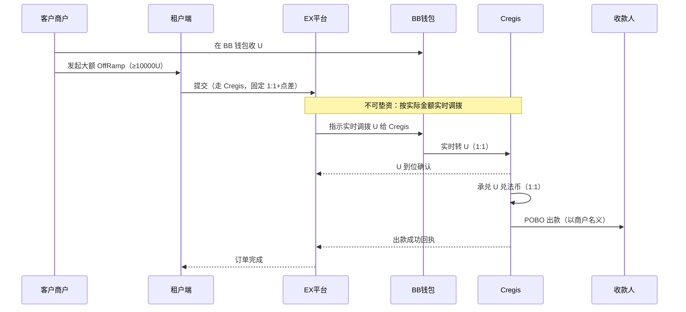

```mermaid

```

**反向流程（退款 / 退票）**：

```mermaid
sequenceDiagram
    participant OUT as 收款人银行
    participant CR as Cregis
    participant EX as EX平台
    participant C as 客户商户
    OUT-->>CR: 出款失败 / 退票，法币退回
    CR->>EX: 通知退票
    Note over CR,C: Cregis 不做 OnRamp，退回形态待确认（退法币 or 退 U）
    EX->>C: 退回到商户（法币 / U 待定）
    EX-->>C: 同步状态 RETURNED
```

**验收标准**：

- 金额 < 10,000 U 不可走 Cregis（自动降级标准实惠）；
- 报价按 1:1 + 点差，平台无价差亏损；
- **U 未到位不触发出款**（不可垫资），到位确认后出款；
- POBO 以商户名义出款正确；
- 退票按约定退回形态处理，状态一致。

> **待确认（Case 3）**：Cregis 是否支持 **主子账户体系 / 多收款地址**（资金隔离，单客户出问题不影响其他）；BB→Cregis **实时调拨** 接口与确认 / 超时；退票 **退回形态** 与责任方、对账口径。

### Case 4：对接 Cregis API

**前置条件**：

- 取得 Cregis API **凭证 / 密钥**与环境（沙箱 / 生产）；
- 对接文档：[https://pacstrust.readme.io/reference/获取商户账户资产](https://pacstrust.readme.io/reference/%E8%8E%B7%E5%8F%96%E5%95%86%E6%88%B7%E8%B4%A6%E6%88%B7%E8%B5%84%E4%BA%A7)（接口字段 **以官方文档为准**）。

**业务规则 / 接口范围（待对齐官方文档）**：

- **获取商户账户资产**（Get Merchant Account）——确认余额 / 头寸；
- **创建出款 / 代付订单**（含 POBO、指定商户名义）；
- **查询订单状态**、**回调 / Webhook 通知**；
- **汇率 / 报价**（若提供）、**对账 / 流水** 接口；
- 鉴权（签名 / Token）、幂等、重试、错误码规范。

**正向流程（系统集成调用）**：

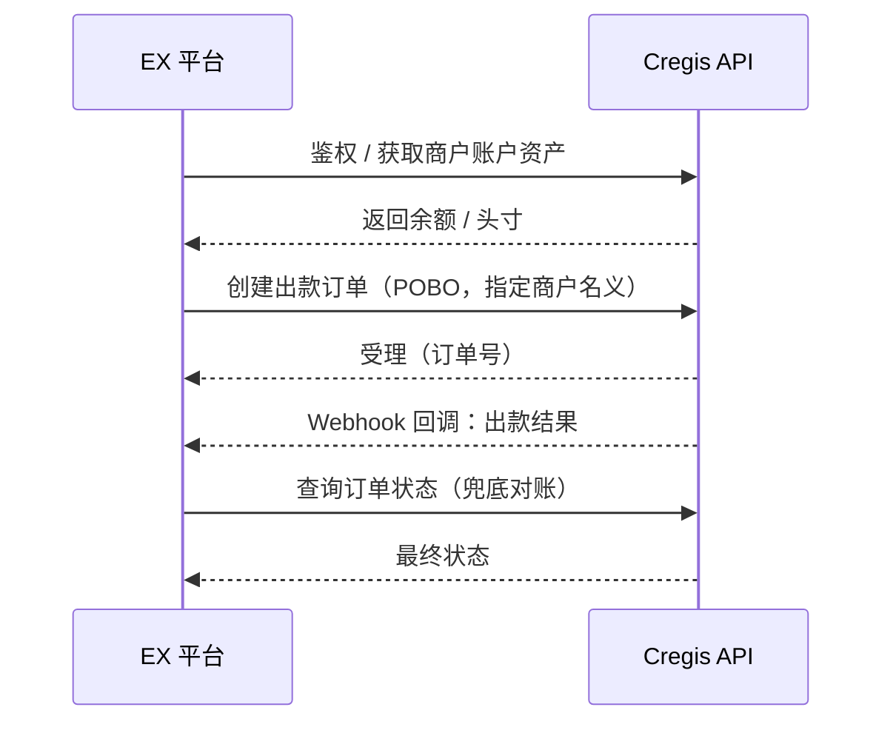

**反向 / 异常流程**：

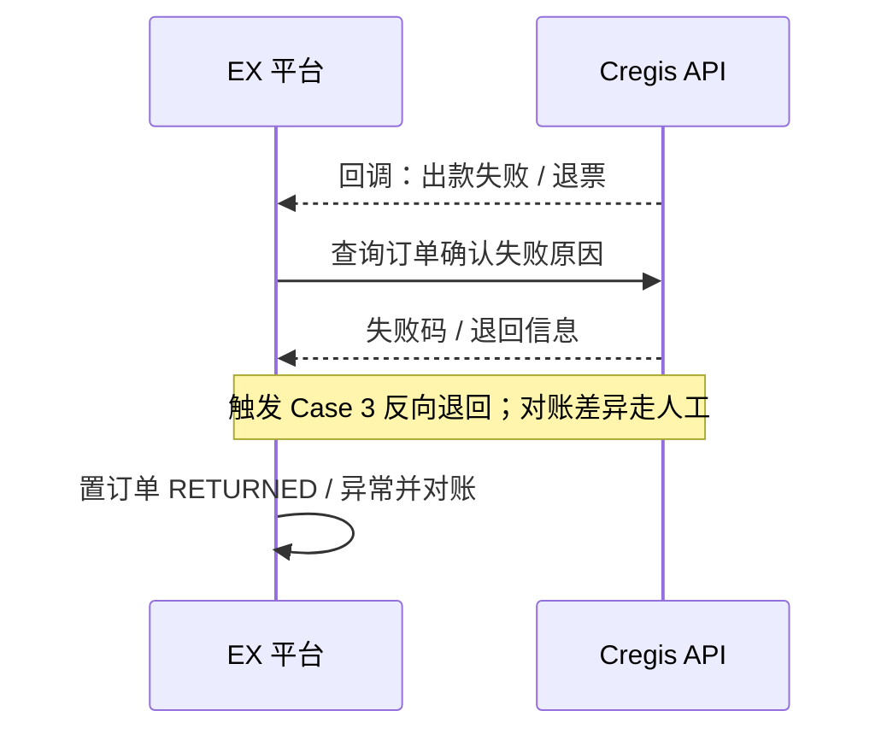

**验收标准**：

- 鉴权、幂等、重试、超时按规范实现；
- 出款 / 查询 / 回调三者状态一致，回调丢失可由查询兜底；
- 对账接口与平台账务可勾兑，差异有处理流程；
- 沙箱联调用例通过后再上生产。

> **待确认（Case 4）**：以官方文档核对 **完整接口清单与字段**（创建出款 / 查询 / 回调 / 对账 / 汇率）；鉴权与限频；POBO 指定商户名义所需字段与合规要求。

### Case 5：渠道能力维护（付款）

> **范围**：本期 **先做「付款」渠道能力维护**；**渠道路由见 Case 6**。
> 渠道能力采用 **两层结构**：第一层「渠道主档」，第二层「具体能力（付款 / 收款 / 换汇，按勾选维护）」。

**第一层：渠道主档**

| 字段                   | 说明                                                                         |
| ---------------------- | ---------------------------------------------------------------------------- |
| **渠道 Code**    | 渠道唯一编码                                                                 |
| **渠道名称**     | 渠道显示名                                                                   |
| **渠道能力概述** | 多选：**付款 / 收款 / 换汇**（勾哪个，第二层就维护哪个；多选都要维护） |
| **渠道类型**     | **PSP / 银行 / OTC / 其他**                                            |

**第二层：付款能力维度（勾选「付款」时维护）**

| 维度                     | 取值 / 规则                                                                                                                                                                       |
| ------------------------ | --------------------------------------------------------------------------------------------------------------------------------------------------------------------------------- |
| **收款国家**       | 国家；**标记是否外汇管制国家**（管制国家需补充申报项，见下）<br />- 勾选国家                                                                                                |
| **收款方式类型**   | **法币 / 数币**                                                                                                                                                             |
| **收款方式**       | 法币：**TT、LOCAL BANK TRANSFER、WALLET**；数币：**收款地址、数币钱包**                                                                                               |
| 支付/清算系统            | 仅当收款方式 =**LOCAL BANK TRANSFER** 时启用：**CHATS、FPS、SEPA、SEPA Instant、ACH** 等<br />- 每个国家的支付/清算系统做基础数据<br />- 暂时不支持                   |
| **支持的业务场景** | **货物贸易、服务贸易**- 暂不支持                                                                                                                                            |
| **收付款人类型**   | **B2B、B2C、C2B、C2C**                                                                                                                                                      |
| **支持的资金来源** | **平台结算款**（→ 选电商平台）；**线下贸易款**（无子选项）；**三方收单行结算款**（→ 选三方收单行，如 PayPal / Stripe / Airwallex 等）<br />- 资金来源暂不支持 |
| **收付款人关系**   | 按收付款人类型可选：**同名、股东、关联公司、供应商、广告服务商、物流服务商、员工、其他**- 同名和异名，异名的具体场景在推送渠道时映射                                        |
| **支付限额**       | 按**收款方式 + Rails + 收付款人类型 + 业务场景** 组合配置                                                                                                                   |
| **是否支持 POBO**  | **是 / 否**；POBO 要求：**只能用入网商户信息 / 自定义**                                                                                                               |

- 资金来源暂不支持
- 资金来源暂不支持

**外汇管制国家：在上述基础上「增加」以下项**

| 增项                       | 说明                                                              |
| -------------------------- | ----------------------------------------------------------------- |
| **申报人要求**       | 申报人国家（**默认 = 收款国家**）、**收款人证件类型** |
| **贸易背景申报要求** | 与「业务场景 + 资金来源」联动（见下表）                           |
| **备注**             | 自由备注                                                          |

**贸易背景申报（按资金来源联动）**

| 资金来源                            | 申报材料                                                                                                                    |
| ----------------------------------- | --------------------------------------------------------------------------------------------------------------------------- |
| **平台结算款 / 三方收单机构** | 平台 / 独立站**订单明细**                                                                                             |
| **线下贸易款**                | **PI、物流、提单、网站、报关单**；**可添加多行，一行可多选**；**行内多选 = OR 关系，多行之间 = AND 关系** |

**配置层级（树状）**：

- **第一层 渠道主档**：Code / 名称 / 能力概述（多选）/ 类型
  - **能力概述 = 付款** → 维护「付款能力维度」
    - **收款国家 = 非管制** → 收款方式 / Rails / 业务场景 / 收付款人类型 / 资金来源 / 关系 / 限额 / POBO
    - **收款国家 = 外汇管制** → 上述全部 + 申报人要求 + 贸易背景申报 + 备注
  - **能力概述 = 收款** → 维护「收款能力」（本期略）
  - **能力概述 = 换汇** → 维护「换汇能力」（本期略）

**验收标准**：

- 渠道主档可维护 Code / 名称 / 能力概述（多选）/ 类型；
- 勾选「付款」后可维护全部付款维度；**收款方式 = LOCAL BANK TRANSFER 才出现 清算系统**；
- 资金来源选「平台结算款 / 三方收单行结算款」时出现对应子选择（电商平台 / 收单行）；
- 收款国家标记为 **外汇管制** 时，**自动追加** 申报人要求与贸易背景申报；
- 贸易背景申报「线下贸易款」支持 **多行 + 行内多选**，行内 = OR、行间 = AND；
- 支付限额可按 **收款方式 + Rails + 收付款人类型 + 业务场景** 组合生效。

> **待确认（Case 5）**：各维度取值的完整字典（国家管制清单、清算系统 列表、收单行列表）；限额组合维度的优先级与冲突处理；POBO「自定义」允许的字段范围与合规边界。

### Case 6：渠道路由（本期=按能力筛选）

**说明**：本期路由 **= 按 Case 5 渠道能力筛选出满足条件的渠道**；由于 **当前一种能力组合对应唯一渠道**，筛选即命中，**不需要在多个命中渠道间再排序 / 切换**。

- **本期实现**：按订单要素（金额、收款国家、收款方式、收款人类型、资金来源等）匹配 Case 5 能力 → **直接命中唯一渠道**；
- **本期不做**：**多渠道命中时的优先级排序、智能推荐、失败自动切换 / 降级**——待出现「一能力对多渠道」时再做。

> **待确认（Case 6）**：能力维度 → 路由判定的字段映射；将来「一能力对多渠道」时的排序、降级与失败切换规则。

### Case 7：主子账户 OffRamp（参考，不展开）

**说明**：本 Case **直接参考 `主子账户OffRamp解决方案.md`**，此处仅摘要：

- 子商户发起一笔 OffRamp → B 内部归集到主账户 → 主账户 OffRamp → A-A 划转到子商户受控账户 → 子商户提现；
- **收款人**：子账户受「默认只能提现」限制，**仅限本人同名提现账户、不可付第三方**；**同步给 A 的也只有该同名提现账户**；
- **租户不知主子关系**：要信息 / 调单时由 EX 引导到 **主账户**，不找子账户；
- **正常 / 异常 / 切换 / 调单 / 退回** 流程与时序图 **见主子方案对应章节**。

**验收标准**：以 `主子账户OffRamp解决方案.md` 的验收为准（关系自动维护、A-A 划转、收款人仅同名、调单指向主账户等）。

---

## 八、与主方案 / 其他文档衔接

- **主子账户 / 中间户 / 渠道切换 / 调单**：见 `主子账户OffRamp解决方案.md`；
- **退款 / 退票（不做反向承兑）**：见 `refund.md`；
- **现有 OffRamp 单据 / 状态机**：见 `OnOfframp/prd/offramp-v1.md`；
- 本文新增：**两类产品包装、Cregis（1:1 / POBO / 不可垫资）、实时汇率 vs 1:1 的计费处理、Cregis API 对接**。

---

## 九、异常处理、资金清结算与时效（SLA）

> 本节统一补齐各 Case 散落的异常分支、资金时点与时效承诺；具体单据 / 状态机以 `OnOfframp/prd/offramp-v1.md` 为准，本节定义关键口径。

### 9.1 订单状态（关键流转）

`创建 → 待承兑 → 承兑中 → 待出款 → 出款中 → 成功 / 失败 / 退票 → 退回(RETURNED)`

- **部分成功**：一笔对多收款人或拆单出款时，允许 **部分成功 + 部分失败**，按子项分别走后续；
- 失败 / 退票统一遵循 **「不做反向承兑」**（见 `refund.md`）。

### 9.2 异常分支（标准实惠 & Cregis 通用）

| 异常                                         | 处理                                                                                                                                 |
| -------------------------------------------- | ------------------------------------------------------------------------------------------------------------------------------------ |
| **出款失败 / 拒付**                    | 渠道回执失败 → 置失败 → 触发反向（退回法币账户，状态 RETURNED）；可发起**重新出款**（换收款人 / 渠道，**不重新承兑**） |
| **出款超时（无终态）**                 | 进入**待核查**，由 **查询接口兜底** 拉取终态；超过 SLA 仍无终态 → 转 **人工核查**，不重复出款（**幂等**）   |
| **回调丢失**                           | 以**主动查询** 为准对齐状态；回调与查询冲突时以查询终态为准                                                                    |
| **退票（已出款后退回）**               | 不做反向承兑，**法币原额退回法币账户**；如需换回 U 由商户 **自行 OnRamp**；费用按 9.4                                    |
| **部分到账**                           | 按实际到账金额对账，差额部分按失败 / 退回处理                                                                                        |
| **Cregis 调拨超时 / 失败（不可垫资）** | **U 未到位绝不触发出款**；调拨超时 → **回滚 / 重试调拨**，订单挂起不扣费；多次失败转人工                                |
| **风控拦截**                           | 命中限额 / 制裁 / 极端汇率 → 拦截并记录，转人工或拒绝                                                                               |

### 9.3 资金 / 清结算时点

| 环节                      | 时点 / 规则（**待与财务、SP、Cregis 确认具体 T+n**）                      |
| ------------------------- | ------------------------------------------------------------------------------- |
| **扣 U**            | 下单后、承兑前**冻结**；承兑成交时 **实扣**（不锁价，承兑时点成交） |
| **承兑（U→法币）** | 标准实惠：承兑时点实时汇率；Cregis：固定 1:1，**U 到位确认后** 才承兑     |
| **出款到收款人**    | 承兑后发起出款；到账 T+n**按渠道 / Rails 不同**（见 9.5）                 |
| **是否预付头寸**    | 标准渠道是否需平台 / SP 预置法币头寸；**Cregis 明确不可垫资（实时调拨）** |
| **结算 / 对账周期** | 与各渠道的结算周期、对账文件频率、勾兑维度（订单号 / 金额 / 币种）              |

### 9.4 费用归属（含失败 / 退票）

- **费用项**：承兑费 / 出款费 / POBO 费 / 通道费 / 退票费；
- **成功**：按 6.2 计费；
- **失败（未出款）**：原则上 **不收出款费**，承兑是否已发生决定是否收承兑费；
- **退票（已出款后退回）**：**已产生的出款 / 退票费由谁承担需定义**（商户 / 平台 / 渠道），已收费用是否退还需明确。

### 9.5 时效（SLA，量化卖点）

| 产品                         | 目标时效（**待确认**）                 | 说明                       |
| ---------------------------- | -------------------------------------------- | -------------------------- |
| **优享丝滑（Cregis）** | 例：U 到位后**N 分钟 / 小时内** 出款   | 「丝滑快出款」需可量化承诺 |
| **标准实惠**           | 例：**T+0 / T+1**，按渠道 / Rails 差异 | 可能含调单 / 合规审核延时  |

> **待确认（第九节）**：完整状态机与本文对齐；各环节 **T+n** 具体值；预付头寸策略；失败 / 退票 **费用归属与退还规则**；两类产品的 **SLA 量化指标与超时处理**；对账文件格式与差异处理流程。

---

## 十、待办 / 待确认（汇总）

| 编号 | 事项                                                                                                                                   | 类型           |
| ---- | -------------------------------------------------------------------------------------------------------------------------------------- | -------------- |
| 1    | 实时汇率 vs 1:1 的**点差 / 报价规则**（实时汇率不锁价、承兑时点成交）                                                            | 待定义         |
| 2    | U 折价（市场 < 1:1）时 Cregis 报价是否体现优势；极端汇率风控拦截                                                                       | 待定义         |
| 3    | 各渠道**费率项与费率表**、计费时点、失败 / 退票费用归属                                                                          | 待定义         |
| 4    | 各渠道**限额参数 / 默认值**、超限处理（拒绝 / 拆单 / 转渠道）、配置后台                                                          | 待定义         |
| 5    | 路由**可走性判定规则 / 字段**、两类排序推荐、类内渠道优先级与切换                                                                | 待定义         |
| 6    | Cregis 是否支持**主子账户体系 / 多收款地址**（资金隔离）                                                                         | 待 Cregis 确认 |
| 7    | BB→Cregis**实时 U 调拨** 接口、确认机制、超时 / 回滚（不可垫资落地）                                                            | 待定义         |
| 8    | 退票 / 退回**资金形态**（退法币 or 退 U）、责任方与对账口径                                                                      | 待 Cregis 确认 |
| 9    | Cregis**API 完整接口清单与字段**（创建出款 / 查询 / 回调 / 对账 / 汇率）                                                         | 待对齐官方文档 |
| 10   | **POBO 指定商户名义** 出款的字段、资料、合规与限额                                                                               | 待 Cregis 确认 |
| 11   | Cregis**单笔 ≥ 10000U** 精确口径（币种、是否含费、上限）                                                                        | 待确认         |
| 12   | Cregis**对客协议是否需要提供**（对终端商户的服务 / 风险告知条款、签署方式、责任划分）                                            | 待确认         |
| 13   | **（后续阶段）多 SP + SP 路由**：各产品类的 SP 候选清单与优先级、SP 路由判定字段、跨 SP 对账 / 计费（避免双重计费）              | 后续阶段       |
| 14   | **（阶段 2）BB 资金运营**：Cregis 为 1:1、BB 为实时汇率，两者资金 / 头寸 / 价差处理；Cregis 作为 BB 渠道的对接与基础渠道能力维护 | 阶段 2         |
| 15   | **不锁价的客户告知**：页面汇率有效期 / 参考时间、到账金额可能与查看时有差异的提示与免责口径                                      | 待定义         |
| 16   | **订单状态机** 与本文对齐；各环节 **T+n**、预付头寸策略、对账文件格式与差异处理                                            | 待定义         |
| 17   | 两类产品**SLA 量化指标** 与超时处理；失败 / 退票的 **费用归属与退还规则**                                                  | 待定义         |
| 18   | **（阶段 1）Cregis 充币地址管理**：地址数量、汇款人地址分配 / 更新、地址数量预警、不足后处理方案                                 | 阶段 1         |
| 19   | **（阶段 1）极速丝滑限额**：Cregis 报价 / 限额口径、自定义 POBO 的限额边界                                                       | 阶段 1         |
