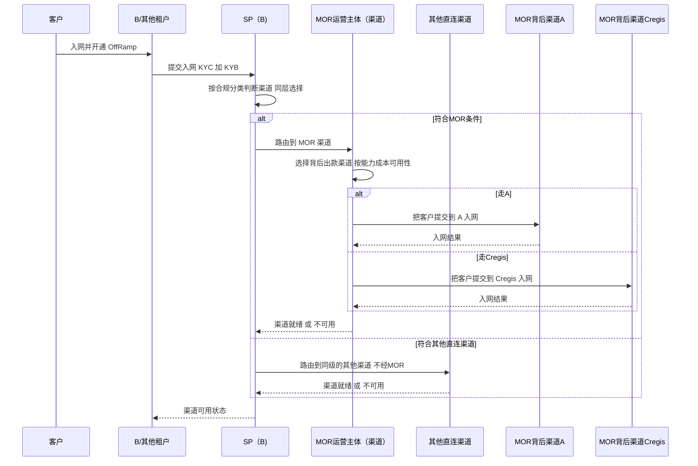
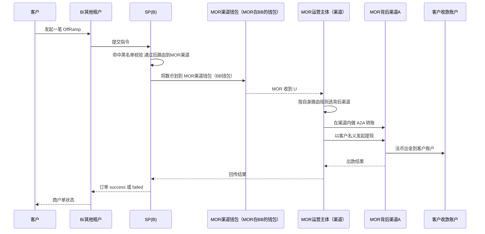
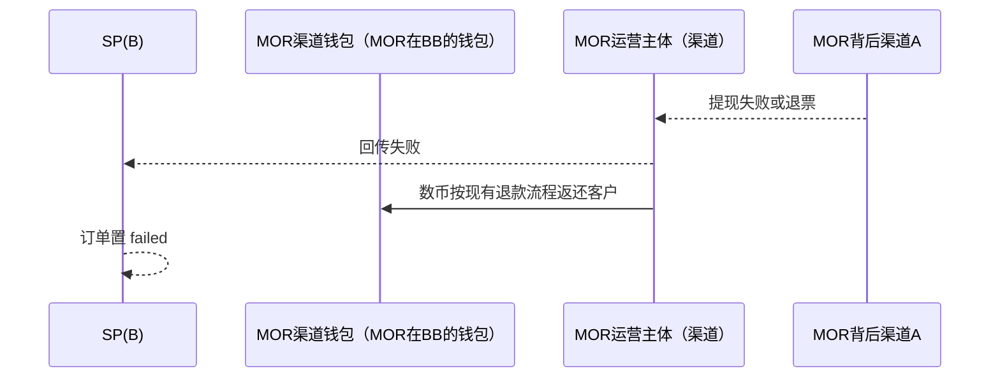
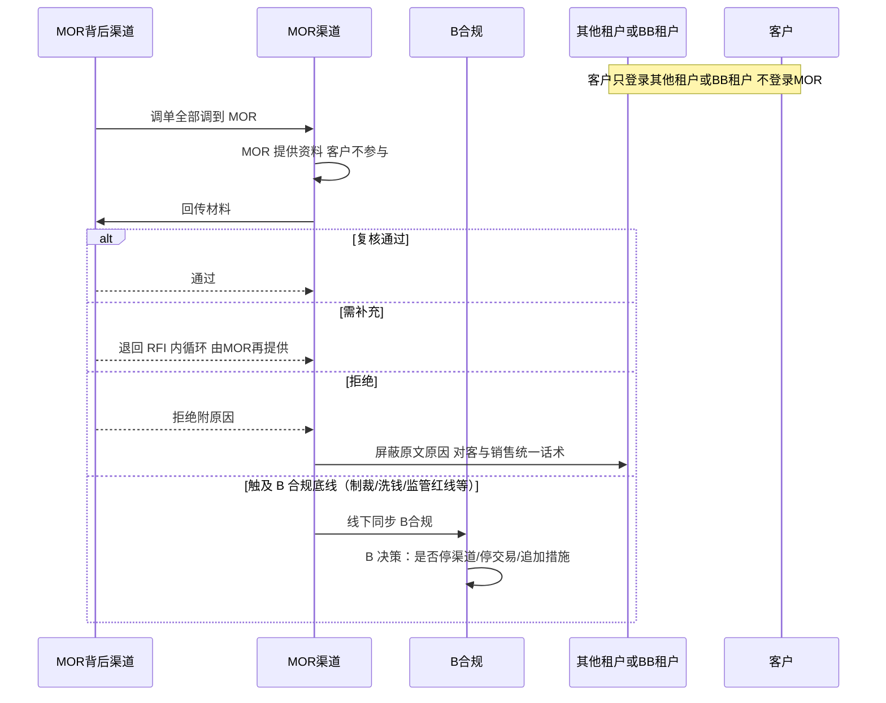

# MOR运营主体 作为 B 渠道方案（非持牌通道）

> **文档定位**：本文提出另一种承载方式——**把「MOR 运营主体」建成 B（SP）的一个「渠道」**。符合条件的这批客户 **路由到该 MOR 运营主体（渠道）**；该渠道 **类似一个非持牌通道**，其 **背后挂多个真实渠道（A、Cregis、宝付、其他）**。客户在租户侧正常发起 OffRamp，由该渠道在后台完成入网、承接数币并向背后渠道发起出款。
>
> 与 `B-A-OFFRAMP.md`（A 单渠道直连）、`MOR模式-受控租户方案.md`（受控租户展业）并列，属于 **渠道化承载** 的方案。

---

## 〇、术语（名词解释）

> 先厘清几个容易混淆的名词，本方案的所有描述都以此为准。

| 名词                       | 含义与边界                                                                                                                                |
| -------------------------- | ----------------------------------------------------------------------------------------------------------------------------------------- |
| **MOR（壳主体）**    | **一个壳公司主体**，帮 **真实客户** 提供资料（贸易背景 / 合同 / invoice 等）；一个体系内 **可以有多个 MOR 壳**          |
| **MOR 运营主体**     | **运营 / 管理多个 MOR 壳** 的主体；对外可表现为 **「租户」** 或 **「渠道」**（**一个运营主体下可有多个 MOR 壳**） |
| **租户**             | 展业主体（对客户展业、客户在其端登录操作）；**可能是 BB、可能是其他方，也可能是某个 MOR 运营主体**                                  |
| **渠道**             | B 路由层的出款 / 承载通道。**本方案中「渠道」= 一个 MOR 运营主体**（其内含多个 MOR 壳），背后再聚合 A/Cregis/宝付等真实出款渠道     |
| **背后（真实）渠道** | MOR 运营主体（渠道）背后真正做出款的持牌 / 合规渠道：**A、Cregis、宝付、其他** + **钱包服务商渠道（BB 钱包）**                |

> 下文出现的「**MOR 渠道**」均指 **「MOR 运营主体作为 B 的一个渠道」**，其内部由多个 MOR 壳承接不同真实客户的资料包装。

---

## 一、背景与定位

- 部分客户（分类 2：合规但 A 等渠道当前政策不直接接）需要一层贸易材料包装 + 主体代付才能出款。
- 本方案不再让 B 直接对接单一渠道，而是 **把「MOR 运营主体」抽象成 B 的一个渠道**：
  - **对 B 而言**：**MOR 运营主体 = B 路由层里的一个渠道**；**与其他直连渠道处于同一层级**（并列可选）；
  - **路由分叉**：**符合该 MOR 运营主体的→走它这个渠道；符合其他直连渠道的→走其他渠道**；两者同级，**不存在“跨过该渠道直接到背后渠道 A”的路径**；
  - **对下而言**：该渠道（MOR 运营主体）**背后聚合多类渠道**：出款渠道（A、Cregis、宝付、其他）+ **钱包服务商渠道（BB 数币钱包）**；
  - **性质**：该渠道 **类似非持牌通道**——不自持牌照，靠背后持牌 / 合规渠道完成实际出款；
  - **数币钱包 = 背后的钱包服务商渠道**：调拨数币用的 **BB 数币钱包**，本质上就是 **该渠道背后的一个钱包服务商渠道**（复用 BB 钱包体系，不新开）。

**关键定位（与方案二的分界）：**

- **本方案里 MOR 运营主体「只做渠道」，不做租户**——它不对终端客户展业、客户不登录它；
- **展业的租户可以是任意租户**（BB 或其他方），**唯一约束：该租户不能是 MOR 主体**（否则就落到方案二「MOR 运营主体做租户」了）；
- 对比：**方案二 = MOR 运营主体做租户（展业）；方案三 = MOR 运营主体做渠道（承兑聚合出款）**——是同一个运营主体的 **两种不同摆放位置，二者互斥**。

**MOR 运营主体渠道 = 一个「收数币 → 做 OffRamp」的渠道**，职责边界如下：

- **SP（B）实际只做一件事**：把 **数币划给 MOR 运营主体渠道（= MOR 在 BB 的钱包）**；B 不直接对接背后渠道；
- **MOR 运营主体收到 U 后自行完成出款**：
  1. 按 **自己的路由规则** 选背后渠道（A / Cregis / 宝付…）；
  2. 在该渠道内做 **A2A（账户到账户）转账**；
  3. 再 **以客户的名义发起提现**（法币出金到客户账户）。

**一句话模型**：符合条件的客户在 **某个非 MOR 租户** 发起一笔 OffRamp → 路由到 **MOR 运营主体（渠道）** → **SP(B) 把数币划到 MOR 运营主体渠道（BB 钱包）** → **MOR 运营主体收 U，按自身路由规则选背后渠道 → 渠道内 A2A 转账 → 以客户名义提现（法币到客户账户）**。

---

## 二、角色与边界

| 角色                           | 说明                                                                                                                                                                                                                                      |
| ------------------------------ | ----------------------------------------------------------------------------------------------------------------------------------------------------------------------------------------------------------------------------------------- |
| **客户（真实客户）**     | 在租户侧正常发起 OffRamp 的终端商户；**不感知 MOR 运营主体、MOR 壳及背后渠道**                                                                                                                                                      |
| **租户**                 | 展业与下单入口（**任意租户：BB / 其他方，但不能是 MOR 主体**）；客户在此登录操作；提供**数币钱包**（复用 BB 钱包）                                                                                                            |
| **B（SP）**              | 承兑与**路由主体**：符合条件的路由到 **MOR 运营主体（渠道）**；**实际只把数币划给 MOR 运营主体渠道（MOR 在 BB 的钱包），不直接对接背后渠道**                                                                            |
| **MOR 运营主体（渠道）** | B 路由层的**一个「收数币 → 做 OffRamp」的渠道（与其他直连渠道同级）**；**内含多个 MOR 壳**；收到 U 后：按**自身路由规则**选背后渠道 → 在渠道内做 **A2A 转账** → **以客户名义提现**（法币出金到客户账户） |
| **MOR（壳主体）**        | 该运营主体（渠道）**内部的壳公司**，帮真实客户提供贸易材料（合同/invoice）；一个运营主体下可有多个 MOR 壳                                                                                                                           |
| **其他直连渠道**         | 与 MOR 运营主体（渠道）**同层级**的 B 渠道；符合条件的客户直接走该渠道，**不经该运营主体**                                                                                                                                    |
| **背后（真实）渠道**     | 渠道背后聚合的真实渠道：**出款渠道（A、Cregis、宝付、其他）** + **钱包服务商渠道（BB 数币钱包）**；MOR 在其中做 **A2A 转账** 并 **以客户名义提现** 完成法币出金                                                   |
| **收款客户账户**         | 最终法币入账账户；由 MOR**以客户名义在背后渠道提现** 到账                                                                                                                                                                           |

**关键边界：**

- **同层级分流**：**符合 MOR → MOR 渠道；符合其他直连渠道 → 其他渠道**（两者同层）；**不允许跨过 MOR 渠道直接到背后渠道 A**；
- **数币钱包 = MOR 背后的钱包服务商渠道（BB 钱包）**：MOR 不新建钱包，调拨数币时走 **BB 数币钱包（MOR 背后的钱包服务商渠道）**；
- **客户零感知**：客户只在 BB 发起一笔 OffRamp，路由、入网、代付全部后台完成；
- **MOR 渠道可挂多个背后渠道**：出款渠道按能力/成本/可用性在 A、Cregis、其他之间选择，钱包服务商渠道为 BB 钱包。

---

## 三、Case 1：路由与背后渠道入网（报备）

> 符合 MOR 的客户 **全部路由到 MOR 渠道**；MOR 渠道再把客户提交到背后渠道入网（走 A 则提交 A 入网，走 Cregis 则提交 Cregis 入网）。

**前置条件：**

- 已有 A-B industries 映射与合规分类（见 `B-A-OFFRAMP.md` §2.4）；
- MOR 渠道已在 B 路由层登记为可选渠道，并配置背后渠道（A / Cregis / 其他）能力。

**时序图：**

**业务规则：**

- **同层分流**：**符合 MOR 的→走 MOR 渠道；符合其他直连渠道的→走同级的其他渠道**；MOR 渠道与其他渠道同层，**不允许跨过 MOR 直连其背后渠道 A**；
- **背后渠道入网由 MOR 代提交**：走 A 则 MOR 把客户提交到 A 入网；走 Cregis 则提交 Cregis 入网；可多渠道并行/备选；
- **入网材料**：MOR 渠道提供包装后的 KYB / 贸易材料给背后渠道（客户零感知）；
- **审核结果口径**（对齐 `B-A-OFFRAMP.md`）：
  - **通过** → 该渠道就绪；
  - **需补充材料** → **走线上 RFI**，不落对客驳回态；
  - **拒绝** → 对 MOR 客户 **屏蔽原文原因、统一话术**（材料实为 MOR/背后渠道口径，客户与销售均未提供）。

**验收标准：**

- 符合条件客户被正确路由到 MOR 渠道；
- MOR 能按背后渠道分别完成 A / Cregis 入网并回传就绪状态；
- 审核三态处理正确（通过 / 需补充走 RFI / 拒绝屏蔽原文原因）。

---

## 四、Case 2：交易（OffRamp，MOR 渠道收 U 后自行出款）

> 客户在租户侧发起 OffRamp → 到 SP（B）后路由到 **MOR 运营主体渠道**；**B 只把数币划到 MOR 运营主体渠道（MOR 在 BB 的钱包）** → **MOR 收到 U 后，按自身路由规则选背后渠道 → 在渠道内做 A2A 转账 → 以客户名义提现**（法币出金到客户账户）。

**前置条件：**

- Case 1 已完成：客户在背后渠道入网就绪；
- 客户在 BB 持有数币，收款人已审核通过。

**时序图（正向）：**

**时序图（反向：出款失败 / 退回）：**

**业务规则：**

1. **B 只把 U 划给 MOR 渠道钱包**：OffRamp 到 SP（B）后路由到 MOR 渠道；B 实际只做 **把数币划到 MOR 运营主体渠道（MOR 在 BB 的钱包）**——B 不直接对接背后渠道；
2. **MOR 收 U 后自行出款**：MOR 拿到 U 后，按 **自身路由规则** 选背后渠道（A/Cregis/宝付）→ 在渠道内做 **A2A（账户到账户）转账** → **以客户名义发起提现**，法币出金到客户账户；
3. **一笔到位、客户零感知**：客户只发起一笔 OffRamp，承兑 + 路由 + A2A + 以客户名义提现均后台完成；
4. **黑名单**：路由前先查渠道黑名单，命中则不走 MOR/对应背后渠道（对齐 `B-A-OFFRAMP.md` Case 4）；
5. **反向**：提现失败/退票按现有退款流程返还数币，不做反向承兑。

**验收标准：**

- 客户一笔 OffRamp：路由到 MOR 渠道 → B 把 U 划到 MOR 渠道钱包（BB 钱包）→ MOR 按自身路由选背后渠道 → 渠道内 A2A 转账 → 以客户名义提现到客户账户；
- 状态机（pending → success / failed）正确；失败按现有退款返还；
- 背后渠道可在 A / Cregis / 其他间按配置切换。

---

## 五、Case 3：调单（RFI）

> **MOR 背后渠道的调单全部调到 MOR，由 MOR 提供资料**——因为 **客户不会登录 MOR**，客户登录的是 **其他租户 / BB 租户**。沿用线上 RFI 统一口径：**需补充材料走线上 RFI（不落对客驳回态）**；**拒绝原因对 MOR 客户屏蔽、统一话术**。

**时序图：**

**业务规则：**

- **调单全部调到 MOR**：MOR 背后渠道的调单 **一律回到 MOR，由 MOR 提供资料**（用背后渠道口径的 KYB / 贸易材料）；
- **客户不登录 MOR**：客户登录的是 **其他租户 / BB 租户**，因此调单 **不下发客户**、也无需客户参与，全程 MOR 后台完成；
- **需补充** 走线上 RFI 内循环、由 MOR 再提供；**拒绝** 原因对 MOR 客户屏蔽、对客与销售统一话术；
- **触及 B 合规底线的例外升级**：若 RFI 内容涉及制裁、洗钱、监管红线或其他可能威胁 B 合规性的事项，MOR 须 **线下同步 B 合规**，由 B 决策是否停渠道、停交易或追加风控措施；该路径**不走常规 RFI 闭环**。

**验收标准：**

- 调单全部回到 MOR、由 MOR 提供资料；**不向客户下发**（客户仅登录其他租户/BB 租户）；
- RFI 与「待补充资料」隔离、不阻塞交易；
- MOR 后台补料、客户零感知；三态（通过/需补充/拒绝）处理正确；
- **触及 B 合规底线的 RFI** 必须留下「MOR 线下同步 B 合规 + B 决策记录」（停渠道/停交易/追加措施），且该例外路径不进入常规 RFI 闭环。

---

## 六、与其他方案对比

| 维度     | B-A 直连（A 单渠道） | 受控租户方案             | **MOR 作为 B 渠道（本文）**                                            |
| -------- | -------------------- | ------------------------ | ---------------------------------------------------------------------------- |
| MOR 承载 | MOR 系统包装后推 A   | MOR 为客户角色、内置租户 | **MOR 抽象为一个渠道，背后聚合多渠道**                                 |
| 背后渠道 | 仅 A                 | 仅 A                     | **A、Cregis、其他，可选可切换**                                        |
| 数币钱包 | B 钱包               | 客户/租户                | **BB 钱包（MOR 渠道复用）**                                            |
| 出款方式 | 客户自身报备         | 客户本身                 | **B 只划 U 给 MOR 渠道钱包；MOR 选背后渠道→A2A 转账→以客户名义提现** |
| 渠道性质 | 持牌直连             | 展业结构调整             | **非持牌通道（靠背后渠道出款）**                                       |

---

## 七、落地待办

- B 路由层新增 **MOR 渠道** 抽象与背后渠道（A / Cregis / 其他）能力配置、优先级与切换策略；
- MOR 渠道 **复用 BB 数币钱包** 的划转链路与对账；
- MOR 代提交背后渠道入网的接口对接（A、Cregis 各自入网协议）；
- MOR 在背后渠道的 **A2A 转账 + 以客户名义提现 + KYB 材料** 附带的接口/字段；
- 线上 RFI 与拒绝原因屏蔽（对 MOR 客户统一话术）；
- 渠道黑名单在 MOR 渠道/背后渠道维度的拦截。

---

## 八、需要拍板 / 确认

- **MOR 渠道的合规定性**：非持牌通道的合规边界与背后渠道责任划分；
- **数币钱包用 BB 的** 具体账户结构（是否 MOR 专用子钱包、如何对账/隔离资金）；
- **背后渠道选择策略**：A / Cregis / 其他的优先级、成本、可用性与故障切换；
- **以客户名义提现 / A2A 转账** 的合规材料清单（KYB / 贸易材料）与各背后渠道要求差异；
- **以客户名义提现的法务定性**：提现主体与客户的授权/委托关系、资金与报备责任主体；
- 与 `MOR模式-受控租户方案.md`、`B-A-OFFRAMP.md` 的取舍或并存关系。
