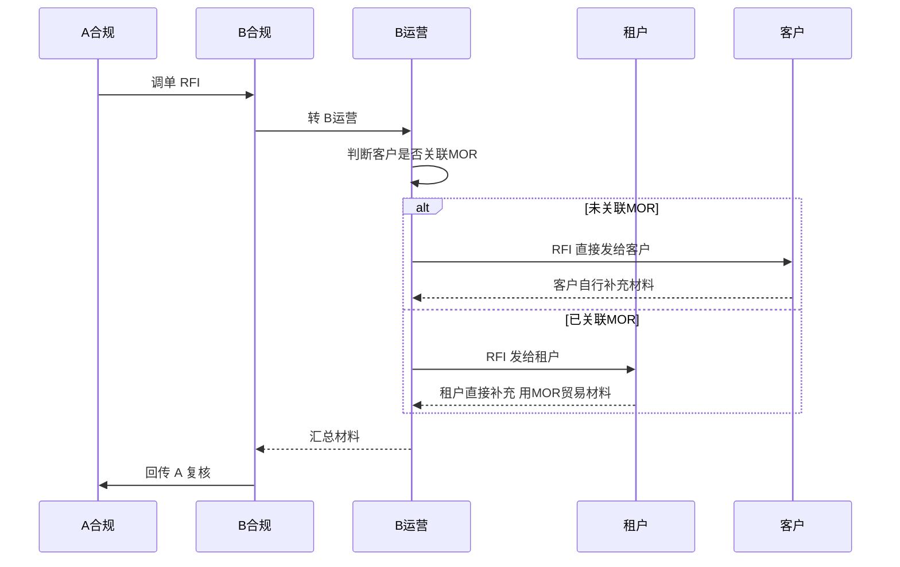
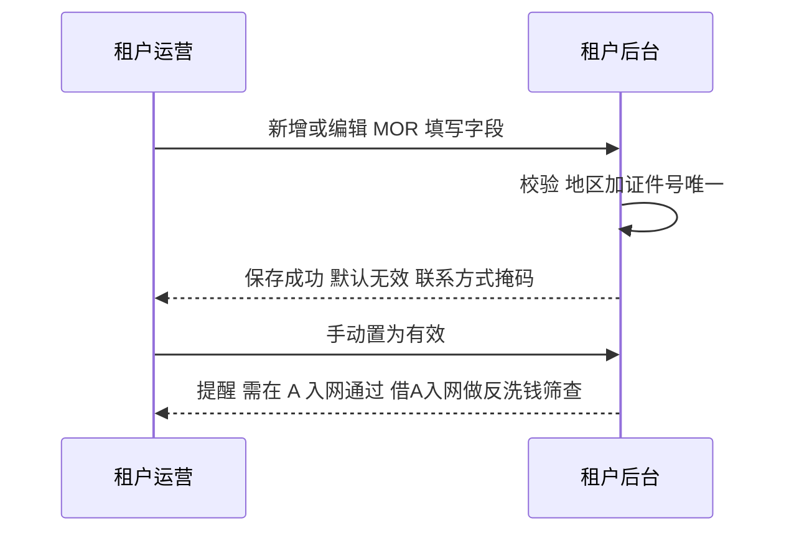
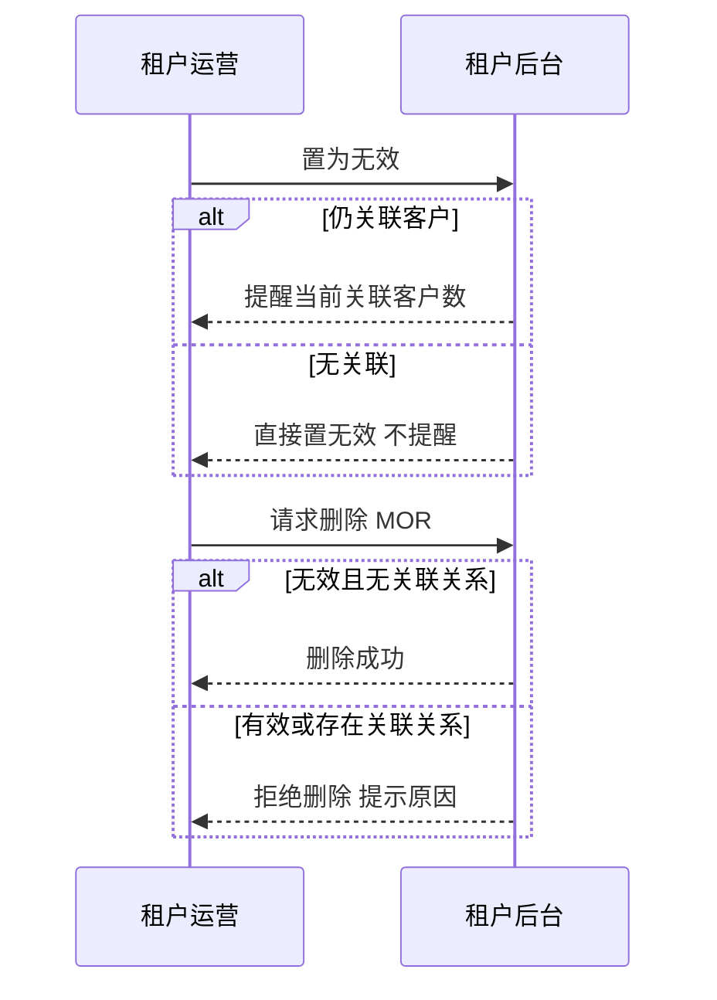

# MOR 模式解决方案（受控租户方案）

> **文档定位**：本文解决 **分类 2 客户**（贸易实质合规、但不符合 A 当前贸易政策）的 **展业模式与 MOR 贸易材料包装**。经评估采用 **受控租户方案**：**BB 直客不展业，改由受控租户展业**；MOR 不是独立主体 / 系统，而是 **某客户为别的客户「提供贸易材料」的角色**，能力内置租户后台。
>
> B-A 渠道的中间户模式（信息流 / 资金流）见 `B-A中间户模式.md`。

---

## 一、背景

- BB 以 SP 身份承兑（数币→法币），借渠道 A 完成客户 OffRamp 出款。
- 按 A-B industries 映射，客户分三类：

| 分类   | 含义                          | 处理                                             |
| ------ | ----------------------------- | ------------------------------------------------ |
| 分类 1 | A 合规完全可以                | 直接推送到 A                                     |
| 分类 2 | 在合规范围内、但 A 暂不允许   | 场景合规；需 **贸易材料包装** 后报备 A（本文范围） |
| 分类 3 | A 完全不允许                  | 不推送 A、不服务                                 |

- **分类 2 客户** 需要一层 **贸易材料"包装"**（合同 / invoice 等）才能向 A 报备并通过其反洗钱审核。
- 核心问题：**这批客户由谁展业、由谁承接运营与风险？** 这是业务模式选择，而非纯技术问题。

---

## 二、决策建议：服务分类 2 客户的展业模式

### 2.1 结论与建议

经评估，**建议采用「通过受控租户展业」（方案二）**，不建议由 BB 自己直接对这批客户展业（方案一）。

核心理由：直客展业会形成一个 **结构性矛盾——直客流程既依赖销售、也依赖运营，而 MOR 又必须同时对销售和运营保密**。维持这层「既依赖销售与运营、又要瞒着他们」的信息不对称，只能靠系统做大量特殊处理来兜，**一旦某处漏处理或口径不一致，就可能暴露、酿成合规事故**。这是 **结构决定的风险，系统建设只能打补丁、无法根除**；受控租户方案从展业结构上消除了这层矛盾。

### 2.2 两种模式

- **方案一 · BB 直客展业**：BB 直接对终端客户展业，自行承担获客、入网、运营、材料收集与调单应对，并为此 **新建一套支撑系统**。
- **方案二 · 受控租户展业（推荐）**：将这批客户归属到 **少数我们自己掌控的租户**，由租户展业；BB 不直接触达终端客户。MOR 回归为 **客户为他人提供贸易材料的角色**，资金与报备主体回归 **客户本身**。

### 2.3 为什么不建议方案一（直客展业的风险）

**结构性矛盾：销售与运营都是必需节点，却又都必须被隐瞒。**
直客流程 **既依赖销售、也依赖运营**——获客与日常关系维护靠销售，入网、材料收集、调单应对等靠运营，两者都是直接触点；但 MOR 相关信息 **内部对销售和运营都要保密**（仅限合规等特定角色知悉）。由此推导出的风险：

- **系统特殊处理的漏处理风险**：为对销售与运营屏蔽 MOR 信息，系统需大量特殊处理；任一处漏处理，信息就会触达销售或运营，造成泄露与事故；
- **口径不一致风险**：销售 / 运营掌握的信息与系统真实记录不一致，对接客户时对不上，易露馅或误导客户；
- **MOR 异常的暴露风险**：一旦 MOR 环节出问题，很可能暴露这层信息不对称，引发客户质疑与合规事故；
- **责任高度集中于 BB**：资金、报备、材料责任均由 BB 承担，风险敞口大。

并且，为支撑直客展业还须额外建设一套系统。结论是：**系统能跑流程，却补不掉结构性矛盾——主要风险没解决，还多付一套系统与管理成本。**

### 2.4 为什么建议方案二（受控租户展业的价值）

- **从源头规避风险**：BB 不直接触达客户，销售与运营的信息外流敞口大幅收敛；
- **风险与责任有承接主体**：运营、隔离、授权由租户体系承载，资金与报备责任回归客户，权责清晰；
- **投入更省**：复用租户既有账号、权限、通知与材料能力，无需新建独立系统；
- **范围与节奏可控**：仅对少数受控租户开放，可灰度、可回收，合规效果与直客展业一致。

### 2.5 模式权衡对照

| 维度                | 方案一 · BB 直客展业                                        | 方案二 · 受控租户展业                        |
| ------------------- | ----------------------------------------------------------- | -------------------------------------------- |
| 信息不对称/暴露风险 | **高**：依赖销售与运营却须对其隐瞒 MOR，靠系统特殊处理维持 | **低**：不依赖销售/运营作节点，结构上无此矛盾 |
| 运营/销售隔离       | 难，存在内控漏洞                                            | 由租户体系天然隔离                           |
| MOR 承载            | 单独的 MOR 系统（独立部署）                                 | 无单独系统，MOR 为客户角色，内置租户后台     |
| 责任主体            | 高度集中于 BB                                               | 客户（资金 / 报备）+ 租户（运营）            |
| 系统投入            | 需新建一套系统                                              | 复用租户后台，投入小                         |
| 主要风险            | 系统无法消除                                                | 从模式上规避                                 |

---

## 三、术语与边界

| 名词             | 定义与边界                                                                                             |
| ---------------- | ------------------------------------------------------------------------------------------------------ |
| **客户**   | 入网并做 OffRamp 的终端主体；**资金主体 + 报备主体都是客户本身**（MOR 不承接资金、不作报备主体）   |
| **MOR（角色）**  | **不是独立主体**，是为其他客户提供 **贸易材料**（合同 / invoice 等）的角色；**MOR 本身也可以是一个客户** |
| **公司主体**     | 一个经营方可持有多个公司主体；可拿其中某些公司主体 **充当 MOR**                                    |
| **租户**   | 展业主体；**内置 MOR 管理功能**；**MOR - 客户关系映射仅对少数受控租户开放**                        |
| **MOR-客户关系** | 哪个 MOR（公司主体 / 客户）为哪些客户提供贸易材料的映射，由具备权限的租户维护                          |

**举例（货代）：** 货代本身做交易（它是客户），同时持有多个公司主体，可把旗下其他公司主体作为 MOR，为别的客户提供贸易材料。

---

## 四、调单（RFI）处理

**统一到租户处理，按是否关联 MOR 判断路由；全程走 RFI，不用订单状态驱动。**

**处理细则：**

- **一律走 RFI 流程，不用订单状态驱动**：不设「订单状态 = 待补充材料」这类对客提示，否则会导致客户直接自行补充，与 MOR 关联场景相悖；
- **按是否关联 MOR 判断路由：**
  - **未关联 MOR**：RFI 直接发给客户，由客户自行补充；
  - **已关联 MOR**：RFI 发给租户，由 **租户直接补充**（用关联 MOR 提供的贸易材料），不下发给客户；
- **补充材料的可见性：** MOR 关联的客户 **看不到** 这些补充材料；**只有直客户（未关联 MOR）能看到** 自己补充的材料；
- **关系变更按时间点生效（不溯及既往）**：即便后续增加 / 删除 MOR - 客户关联关系，也只能从变更之后起对应可见，变更前的历史不受影响。

---

## 五、MOR 管理功能（可单独开通，内置在租户系统内）

> 该模块作为一个 **独立功能开关** 下发，**仅对少数受控租户开通**；**内置在租户后台**，由具备权限的租户运营操作。各功能要点如下（每个功能按 前置条件 / 业务流程 / 业务规则 / 验收标准 组织）。

### 5.1 登录与权限

- **复用租户系统登录**，不单独做 MOR 系统登录；通过 **「MOR 管理」功能开关 + 角色权限** 控制可见与可操作范围。

### 5.2 MOR 录入管理

- **字段**：企业中 / 英文名称、所在国家、企业证件号码、联系人、**联系方式（掩码 / 悬停显示 / 可搜索）**、关联客户数量、创建 / 更新时间、状态（有效 / 无效）、操作（置有效 / 无效、删除、全局新增）。
- **业务流程（正向：新增 / 编辑 / 置有效）：**

- **业务流程（反向：置无效 / 删除）：**

- **业务规则**：新增默认无效；置有效提醒「需在 A 入网通过（借 A 入网做 AML 筛查）」；置无效提醒当前关联客户数（无关联不提醒）；仅「无效且无关联」可删除；**一个地区 + 一个证件号唯一**。
- **验收标准**：新增默认无效；置有效有 AML 提醒、置无效有关联客户数提醒；删除仅对「无效且无关联」放行；唯一性、掩码与悬停 / 搜索正确。

### 5.3 MOR - 客户关系维护

- **前置条件**：目标 MOR 为 **有效** 状态。
- **业务规则**：仅「有效」MOR 可维护关系；关系用于报备包装与 RFI 路由；增删留痕；**有在途报备 / RFI 不可解除**。
- **验收标准**：无效 MOR 不能新增关系；建立 / 解除可用且可追溯；有在途时不可解除。
- **待确认**：MOR - 客户关系基数是否为 **1:n**。

### 5.4 贸易材料生成

- **前置条件**：合同模板已配置；MOR 与客户关系已建立。
- **业务规则**：基于合同模板生成合作资料（合同 / invoice），**需签名**，产物按版本留痕，经租户回传 B → A。
- **验收标准**：模板可配置、可生成、可签名；产物可同步提交 A；作废 / 重生成有版本记录。

### 5.5 开发者中心（可选）

- 如租户需 API 对接，**复用租户既有开发者中心**（API Key / 回调 / 文档），不单独建。

### 5.6 RFI 调单材料对接

- 按第四节调单规则：未关联 MOR 发客户、已关联 MOR 发租户，租户用 MOR 材料直接补；**补充材料对关联客户不可见、对直客户可见，按关系变更时间点生效**。

---

## 六、落地待办

- **RFI 路由判断**：按客户是否关联 MOR 分流（未关联发客户 / 已关联发租户）；
- **补充材料可见性控制**：MOR 关联客户不可见、直客户可见，且按关联关系变更时间点生效；
- **租户后台内置** MOR 管理能力（录入 / 关系映射 / 材料生成 / 调单回传），并加 **按租户的功能开关 / 权限**；
- **调单材料回传链路**：租户 → B 合规 → A 对接；
- MOR 录入的 **状态与关联提醒、唯一性校验**；
- MOR 不可用后客户关系转移（本期先手动一个个换，后续自动化）；
- 确认 **MOR - 客户关系基数（1:n）**。

---

## 七、需要拍板 / 确认的事项

- 是否确认采用 **受控租户方案（方案二）** 作为分类 2 客户的展业模式；
- 一期 **灰度范围与规模上限**（开放给哪些受控租户、MOR 数量与交易量阈值）；
- 与 A 合规确认：**反洗钱验证账户的开立方式与成本**、**渠道调单发现异常时的处置标准**；
- **MOR - 客户关系基数（1:n）** 的约束确认。

---

> **说明**：本文聚焦 **分类 2 客户的展业模式与 MOR 包装**，采用 **受控租户方案**——BB 直客不展业、改由受控租户展业，MOR 为客户的「提供贸易材料」角色、能力内置租户后台；调单全程走 RFI 并按是否关联 MOR 分流。B-A 渠道中间户模式的信息流 / 资金流见 `B-A中间户模式.md`。
