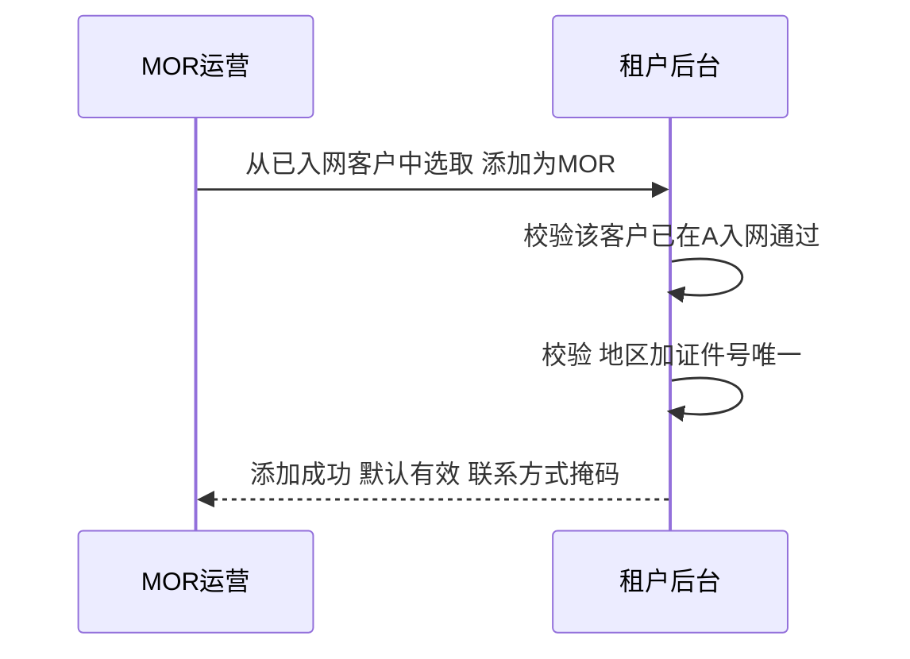
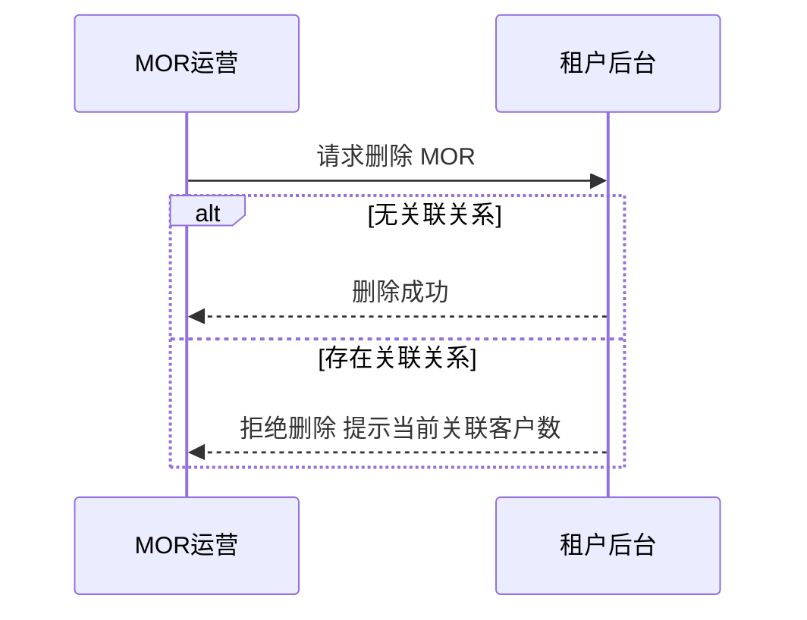
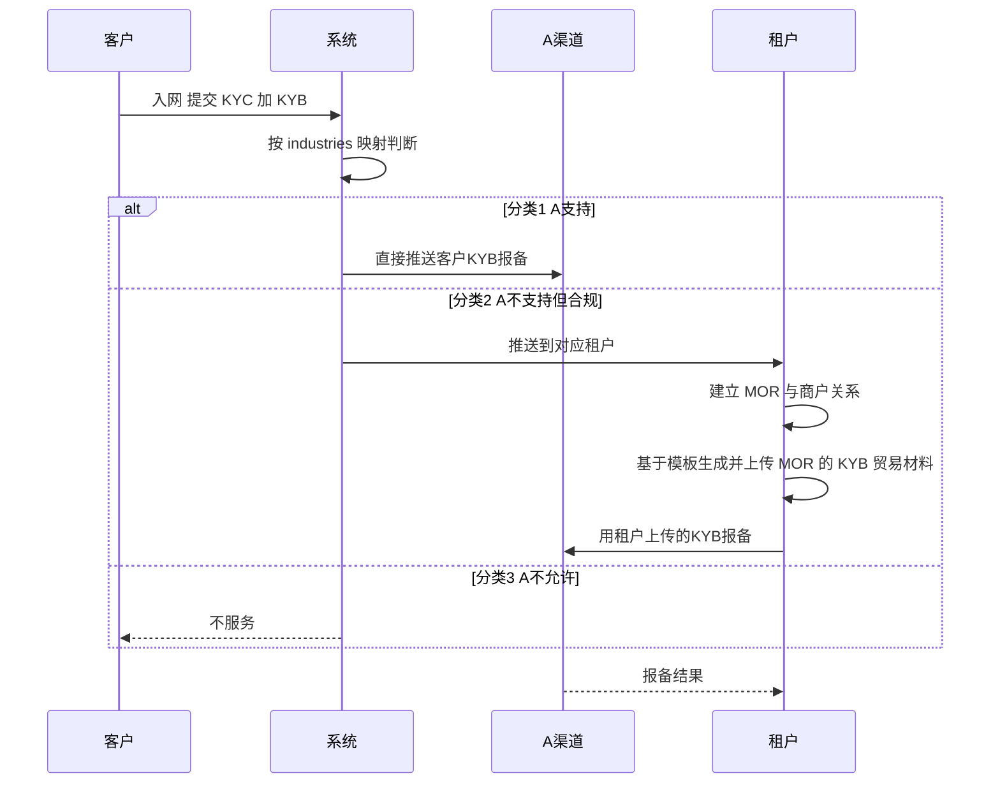
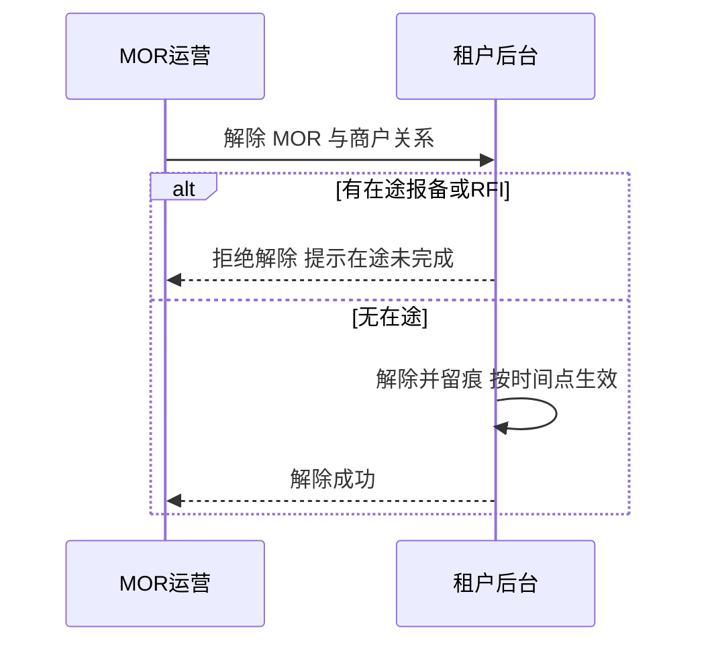
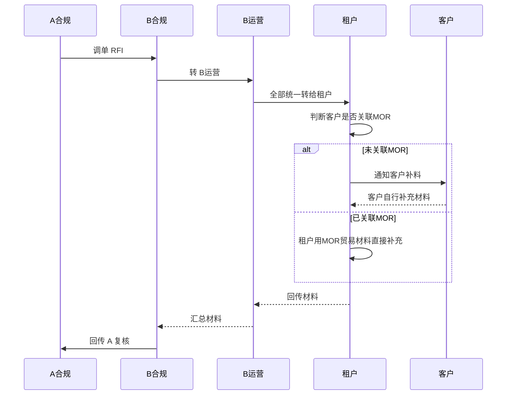
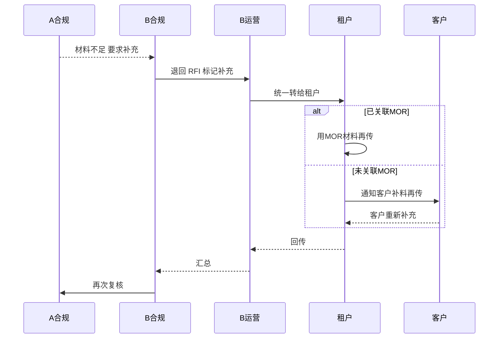

# MOR 模式解决方案（受控租户方案）

> **文档定位**：本文解决 **分类 2 客户**（贸易实质合规、但不符合 A 当前贸易政策）的 **展业模式与 MOR 贸易材料包装**。经评估采用 **受控租户方案**：**BB 直客不展业，改由受控租户展业**；MOR 不是独立主体 / 系统，而是 **某客户为别的客户「提供贸易材料」的角色**，能力内置租户后台。
>
> B-A 渠道的中间户模式（信息流 / 资金流）见 `B-A中间户模式.md`。

---

## 一、背景

- BB 以 SP 身份承兑（数币→法币），借渠道 A 完成客户 OffRamp 出款。---

## 二、Case 1：权限分配（所有 Case 的前提）

> 确定某个 **自营租户** 具备 MOR 能力后，通过内置角色「MOR 运营」把能力下放给指定用户。**本 Case 是 Case 2-4 的前提。**

**前置条件：**

- 该租户为 **自营租户**，且已被开通 **MOR 能力**（功能开关）；
- 存在具备角色管理权限的租户 Admin。

**业务规则：**

- 租户内有 **内置角色「MOR 运营」**，仅 **具备 MOR 能力的自营租户** 可见；
- 「MOR 运营」**只能额外分配给某个（其他）用户**，**Admin 不能给自己分配**（防止自赋权）；
- **EX 租户角色支持多选（已确认）**：一个用户可同时持有多个角色，「MOR 运营」作为附加角色叠加；
- 仅持有「MOR 运营」角色的用户可操作 Case 2-4 的 MOR 功能（录入、关系、材料、调单）。

**验收标准：**

- 仅具备 MOR 能力的自营租户可见「MOR 运营」角色；
- 可把「MOR 运营」附加给其他用户、支持多角色叠加；
- Admin 给自己分配被拒绝；回收后目标用户即失去 MOR 功能入口；
- 分配 / 回收均留痕可追溯。

---

## 三、Case 2：MOR 维护

> **从已入网客户中挑选** 添加为 MOR 商户。

**前置条件：**

- Case 1 已完成，操作者具备「MOR 运营」角色；
- **MOR 主体已在 A 入网通过**（关键前置）：A 能接受其业务与材料，且已借 A 入网对 MOR 做 **反洗钱（AML）筛查**；
- 该 MOR 主体已作为 **客户入网** 至系统。

**业务流程（正向：从入网客户添加为 MOR，默认有效）：**

**业务流程（反向：删除）：**

**字段：** 企业中 / 英文名称、所在国家、企业证件号码、联系人、联系方式（掩码 / 悬停显示 / 可搜索）、关联客户数量、创建 / 更新时间、状态（有效）、操作（删除）。

**业务规则：**

- **来源限定**：MOR 只能 **从已入网客户中挑选** 添加，不支持凭空新建；
- **A 入网为硬前置**：只能从 **已在 A 入网通过（承载 AML 筛查）** 的客户中添加；
- **添加后默认有效，无「置为无效」操作**；
- 仅 **无关联关系** 可删除，有关联则拒绝并提示当前关联客户数；**一个地区 + 一个证件号唯一**。

**验收标准：**

- 只能从已在 A 入网通过的客户添加 MOR；
- 添加后默认有效、无置为无效入口；唯一性、掩码与悬停 / 搜索均正确；
- 删除仅对「无关联」放行，有关联时拒绝并提示关联客户数。

---

## 四、Case 3：MOR 与商户关系

> 完整链路：客户入网提交 KYC+KYB → 系统按 industries 映射分流 → 不支持的 industries 推送对应租户 → 租户关联 MOR 并上传 KYB 材料 → 报备 A。**全程客户不感知 MOR。**

**前置条件：**

- Case 2 已完成，存在 **有效** 的 MOR 主体；
- A-B industries 映射已配置（见第四节）。

**业务流程（正向：入网分流 加 关联 MOR 加 报备）：**

**业务流程（反向：解除 MOR 与商户关系）：**

**可见性规则（核心）：**

| 视角         | 非 MOR 客户    | 已关联 MOR 客户                               |
| ------------ | -------------- | --------------------------------------------- |
| A            | 客户提交的资料 | **客户自己提交的 KYC + MOR 提交的 KYB** |
| B            | 同 A           | 同 A（客户 KYC + MOR KYB）                    |
| 租户         | 客户提交的     | **客户提交的 + MOR 自己提交的**         |
| MOR（MP 端） | —             | **看不到自己作为 MOR 给别人提供的资料** |
| 客户         | 仅自己提交的   | 仅自己提交的（不感知 MOR）                    |

**业务规则：**

- 客户入网即提交 KYC+KYB，系统按 industries 映射自动分流；
- 分类 2 推送到对应受控租户，由租户 **建立 MOR 与商户关系并上传 KYB 贸易材料** 后报备 A；
- **贸易材料生成**：基于合同模板生成 KYB 贸易材料（合同 / invoice），**需签名**，按版本留痕后由租户报备 A；
- **客户全程不感知 MOR**：客户只见自己上传的材料；
- 仅「有效」MOR 可建立关系；**有在途报备 / RFI 不可解除**；关系变更 **按时间点生效、不溯及既往**；
- **待确认**：MOR - 商户关系基数是否为 **1:n**。

**验收标准：**

- industries 分流正确；分类 2 走「租户关联 MOR 加 上传 KYB 加 报备」链路；
- 四个视角的可见范围与上表一致；
- 关系建立 / 解除可追溯，有在途时不可解除，变更按时间点生效。

---

## 五、Case 4：交易调单（RFI）

**前置条件：**

- 交易已发生或在途，A 合规对某笔交易或某客户发起调单；
- 客户与 MOR 的关联关系已在 Case 3 建立（如属分类 2）。

**业务流程（正向：B运营统一转租户，租户内部判断由谁提交）：**

**业务流程（反向：材料被拒 / 补充再传）：**

**业务规则：**

- **一律走 RFI 流程，不用kyc/b 审核状态驱动**：不设「状态 = 待补充材料」这类对客提示，否则会导致客户直接自行补充，与 MOR 关联场景相悖；
- **B 运营统一转租户，判断下沉到租户**：B 运营 **不做是否关联 MOR 的判断**，一律把 RFI 转给对应租户；由 **租户内部判断** 是「租户用 MOR 贸易材料提交」还是「通知客户自行提交」；
  - 未关联 MOR → 租户通知客户自补；
  - 已关联 MOR → 租户用 MOR 贸易材料直接补，不下发给客户；
- **补充材料可见性**：MOR 关联客户 **看不到** 补充材料；只有直客户（未关联 MOR）能看到自己补充的材料；
- **关系变更按时间点生效（不溯及既往）**。

**验收标准：**

- RFI 与「待补充资料」隔离、不阻塞交易；
- B 运营统一转租户、不做 MOR 判断；租户内部判断由谁提交，路由正确；
- 材料被拒可退回补充并再次回传 A 复核；
- 可见性与关系变更时间点规则正确。

---

## 六、落地待办

- **权限**：租户内置角色「MOR 运营」，仅具 MOR 能力的自营租户可见；支持多角色叠加；Admin 不能自赋；
- **调单材料回传链路**：租户 → B 合规 → A 对接；
- MOR 录入的 **状态与关联提醒、唯一性校验**；
- MOR 不可用后客户关系转移（本期先手动一个个换，后续自动化）；
- 确认 **MOR - 客户关系基数（1:n）**。

---
