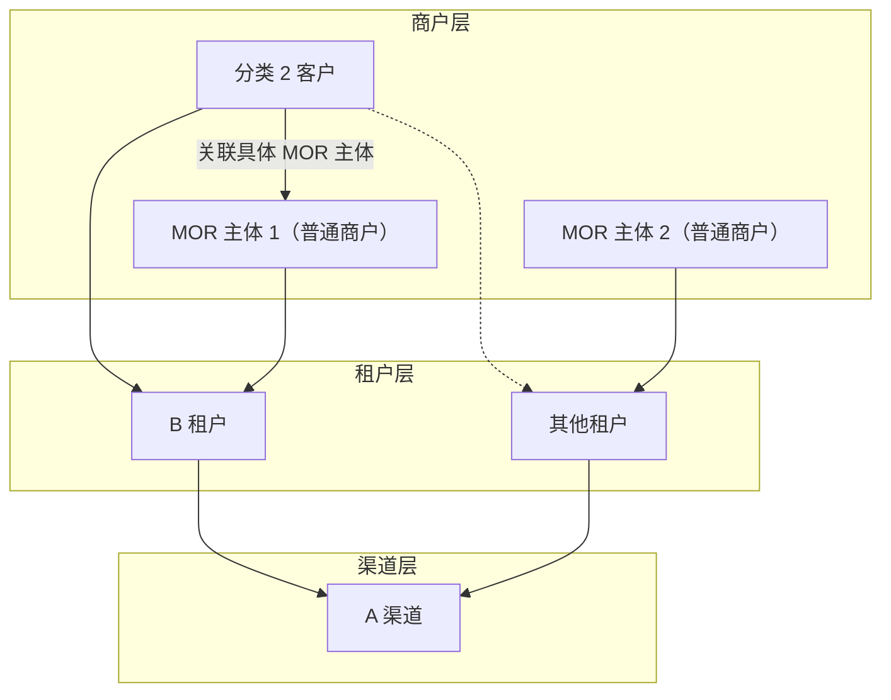
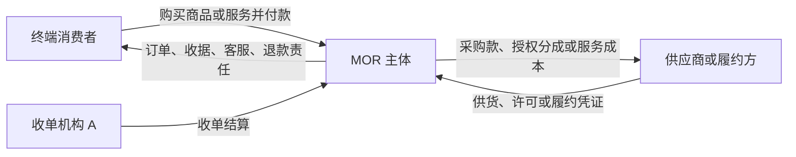
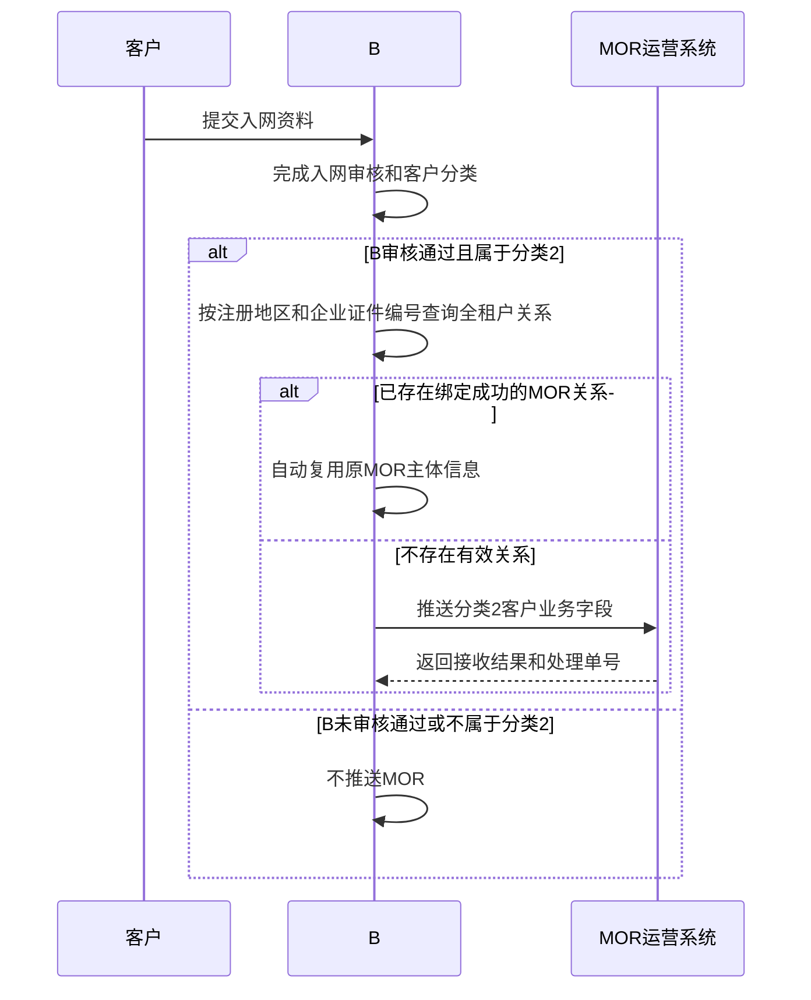
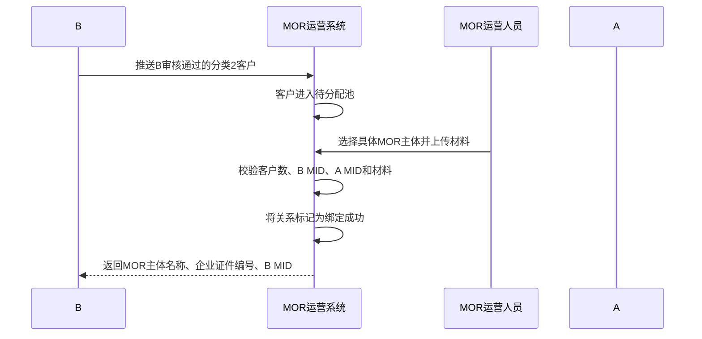
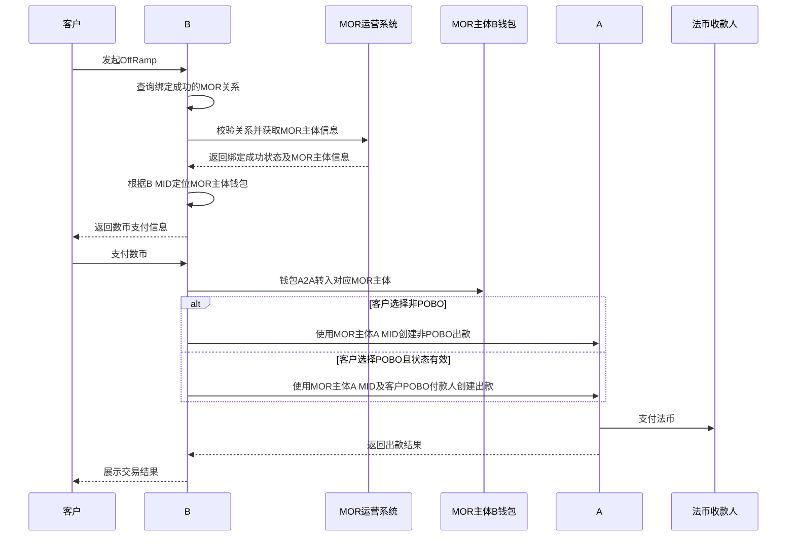

# MOR 最终方案（本期 B—A）

> **文档状态**：本期方案，待 B、MOR 运营方、A、风控及合规确认。
>
> **本期范围**：只考虑 B 与 A 之间的 OffRamp，不接入 Cregis，也不设计多渠道路由或渠道切换。
>
> **核心定位**：MOR 运营方不作为 SP，也不作为交易商户。具体 MOR 主体是普通商户，分别在 B 和 A 入网，并使用自身在 B 的钱包及自身在 A 的 MID 完成交易。
>
> **业务成立前提**：具体 MOR 主体必须是终端交易中的真实卖方、服务提供方、采购转售方或对客承担完整责任的平台；仅提供账户、归集资金或代客户收付款，不构成本方案认可的 MOR 业务。
>
> **能力解耦原则**：客户—MOR 主体关系绑定与 A POBO 付款人相互独立。关系满足主体、MID及合作材料条件即可绑定成功；POBO仅在客户选择POBO付款时单独申请和校验。

## 一、方案结论

本期链路固定为 B→A：

1. 客户在 B 完成入网审核；
2. B 判断客户属于分类 2；
3. 只有 B 入网状态为“审核通过”的分类 2 客户，才允许推送至 MOR 运营系统；
4. B 先按“注册地区＋企业证件编号”判断该企业是否已有有效 MOR 关系；
5. 已有有效关系时，B 自动复用原 MOR 主体；没有关系时，由 MOR 运营系统分配具体 MOR 主体；
6. MOR 运营人员建立关系并上传合同、发票等材料；
7. 主体、MID和合作材料审核通过后，关系即可标记为“绑定成功”；
8. MOR 运营系统向 B 返回 MOR 主体名称、企业证件编号及 MOR 主体在 B 的 MID；
9. 客户是否需要POBO付款独立选择：不需要POBO时直接走MOR非POBO付款；需要POBO时再完成A KYB、DBS VA验证及A POBO审核；
10. 客户在 B 发起 OffRamp，数币通过 B 钱包 A2A 转入该 MOR 主体在 B 的钱包；
11. B根据本笔订单的付款模式，使用同一MOR主体的A MID创建非POBO或POBO出款；
12. 两种模式均只能支付至该客户本人的已验证法币账户，不允许支付至客户指定的第三方收款人。

MOR 运营系统负责客户关系、材料、MOR 主体 B/A MID及 A POBO 付款人状态管理，不承担资金处理或渠道路由。

---

## 二、目标与边界

### 2.1 方案目标

1. 只接收 B 已审核通过的分类 2 客户；
2. 为分类 2 客户建立唯一、可审计的具体 MOR 主体关系；
3. 确保 MOR 主体在 B 和 A 均已入网，并在 MOR 运营系统维护两个 MID；
4. 将客户—MOR关系绑定与A POBO付款人能力解耦；
5. 确保数币进入当前绑定 MOR 主体在 B 的钱包；
6. 确保 A 出款使用同一个 MOR 主体在 A 的 MID；
7. 保留客户、关系、材料、B MID、A MID、付款模式、POBO 付款人和交易快照。

### 2.2 MOR 业务模式边界

行业通常将 Merchant of Record 理解为终端客户交易中承担法律和商业责任的商户：由其收取终端客户款项，在结账页、订单、收据或账单中被清晰识别，并承担退款、争议和所售商品或服务相关责任。是否能够作为 MOR，取决于真实交易结构，不由系统中的“MOR”标签、MID 归属或合同名称单独决定。

本方案按以下标准区分真实 MOR 与代收付：

| 判断维度 | 真实 MOR 应具备的特征 | 不应纳入的模式 |
| --- | --- | --- |
| 对客关系 | 终端客户明确与 MOR 购买商品或服务 | 客户实际与第三方交易，MOR 仅提供收款账户 |
| 商品或服务责任 | MOR 对商品、服务或组合产品承担明确的销售及履约责任 | MOR 不控制商品、定价和履约，也不对结果负责 |
| 交易展示 | 结账页、服务条款、订单、收据及账单描述符一致识别 MOR | 前台展示第三方卖家，资金链路临时切换为 MOR |
| 售后责任 | MOR 负责或最终承担退款、拒付、争议和消费者投诉 | 所有售后责任均由底层客户承担，MOR 仅转发信息 |
| 下游结算 | MOR 按采购、分销、授权或服务合同向供应商结算成本 | 按终端收款逐笔原额转付，MOR 仅收固定通道费 |
| 交易记录 | MOR 留存商品、价格、税费、交付、退款及供应商结算记录 | 仅留存资金流水，无法还原真实订单和履约链路 |

> 产品判断：若一项业务无法同时说明“卖给谁、卖什么、谁定价或确认价格、谁出具订单/收据、谁负责退款争议、为何向下游付款”，应按疑似代收付处理，不应仅通过绑定 MOR 主体上线。


---

## 三、参与方与系统关系

| 参与方 | 定位 | 核心职责 |
| --- | --- | --- |
| 客户 | B 的分类 2 客户 | 在 B 完成入网审核、发起 OffRamp、支付数币并提供所需材料 |
| B 平台 | 多租户客户平台和交易编排方 | 管理 B 租户及其他来源租户，完成客户入网、分类判断、跨租户去重、推送 MOR、钱包 A2A、调用 A 出款及对客展示 |
| 来源租户 | B 租户或 B 平台下的其他租户 | 作为客户来源和订单归属；各租户独立完成客户入网审核，但共享跨租户 MOR 关系判断 |
| MOR 运营系统 | 独立关系管理系统 | 管理 MOR 主体、B/A MID、客户关系、合同发票及 A POBO 添加状态 |
| MOR 主体 | 普通商户及实际交易主体 | 在 B、A 分别入网，以自身 B 钱包接收数币，并以自身 A MID完成 OffRamp |
| A | 本期唯一法币出款渠道 | MOR 主体入网、POBO 付款人审核及法币出款 |
| 法币收款人 | 客户本人或经审核的收款方 | 接收 A 支付的法币 |

### 3.1 三层关系



租户层不限于 B 租户，后续可以存在其他来源租户。客户和订单保留来源租户归属，但 B 平台在全租户范围统一判断客户是否已绑定 MOR 主体，并统一接入本期 A 渠道。

### 3.2 主体和账户规则

- MOR 主体是独立普通商户，不是 MOR 运营方的子账户；
- MOR 主体必须分别在 B 和 A 入网；
- MOR 运营系统需要记录每个 MOR 主体在 B 的 MID和在 A 的 MID；
- B MID用于 B 侧识别 MOR 主体及其钱包账户；
- A MID用于 A POBO 付款人添加和 A 出款；
- 同一笔交易使用的 B 钱包主体与 A MID所属主体必须一致；
- 不得使用 MOR 运营方或其他 MOR 主体的 MID、钱包或账户替代当前绑定主体。

### 3.3 可成立的非代收付 MOR 场景

以下为产品可优先评估的业务场景，不代表已完成牌照、税务、卡组或渠道审批。每个具体 MOR 主体仍需证明其对客交易和履约结构真实成立。

| 优先级 | 场景 | 业务结构 | 为什么不是单纯代收付 | 产品需留存的关键证据 |
| --- | --- | --- | --- | --- |
| 高 | 数字产品、软件许可及 SaaS 订阅 MOR | MOR 从开发者或供应商取得销售/分销授权，以自身名义向全球终端客户销售订阅、软件许可、插件、课程或数字内容 | 终端客户向 MOR 购买，MOR 管理结账、订阅、账单、退款和拒付；向开发者支付的是授权分成或采购结算 | 商品目录、销售/分销授权、价格和税费快照、订阅记录、交付凭证、退款及供应商结算单 |
| 高 | 平台统一售卖的收单型 MOR | 平台以统一品牌和交易条款向消费者销售平台内商品或服务，底层商家作为供应商或履约方；MOR 使用自己的收单 MID 完成收单 | 平台不是只替商家收款，而是作为终端交易商户承担订单、收据、客服、退款、拒付和履约协调责任 | 结账页及条款版本、终端订单、账单描述符、收据、供应商合同、履约状态、售后和分账/结算依据 |
| 高 | 跨境采购转售/分销 | MOR 向上游采购商品、软件、广告资源、云资源或专业服务，再以自身名义和价格销售给下游客户 | MOR 存在真实买入和卖出，收入为销售收入，向上游付款属于采购成本而非代客户付款 | 上下游独立合同和发票、采购单、销售单、定价/加价记录、交付或验收凭证、库存或许可记录 |
| 中 | 组合服务或打包产品运营 | MOR 将物流、仓储、广告、SaaS、咨询等多个供应商能力组合成一个对客产品，并对整体方案报价和交付 | 客户购买的是 MOR 的组合服务；MOR 自行采购分包服务并对最终交付负责 | 产品说明、统一报价单、客户合同、供应商分包合同、里程碑、验收、退款及赔付记录 |
| 中 | 活动、课程、会员或票务主办方 | MOR 作为活动主办、课程运营或会员服务提供方销售名额/权益，场地、讲师和技术平台作为供应商 | MOR 对活动或服务是否交付、取消和退款承担责任，下游收款是供应商成本结算 | 活动/课程条款、票券或权益记录、核销记录、取消退款规则、供应商合同和结算单 |
| 中 | 品牌授权零售或区域经销 | MOR 获得品牌或区域销售授权，统一经营线上店铺、定价、营销、订单和售后，品牌方或制造商负责供货 | MOR 是授权零售商/经销商，消费者交易相对方是 MOR；向品牌方付款属于货款或授权费 | 授权书、经销合同、商品目录、销售价格、订单、物流/交付、退换货和采购结算记录 |
| 条件成立 | 酒店、出行或本地服务的打包销售 | MOR 将住宿、交通、体验等资源形成套餐，以自身名义向旅客销售并负责套餐变更、取消和退款 | 只有 MOR 对组合产品和消费者承担总体责任时成立；若只是把消费者款项转给单一商家，则仍接近代收 | 资源采购合同、套餐规则、订单拆分、履约凭证、取消退款责任和供应商结算依据 |

#### 3.3.1 收单型 MOR 的推荐交易结构



该结构的核心不是“资金先进入 MOR 再转给客户”，而是存在两层可独立解释的商业关系：终端消费者向 MOR 购买；MOR 再向供应商采购商品、许可或履约服务。两层交易应有各自的合同、订单、定价、发票/收据和退款责任。

#### 3.3.2 明确不建议的伪 MOR 场景

- MOR 不出现在结账页、交易条款、订单、收据或账单描述符中，只在资金账户层出现；
- 底层客户自行获客、定价、签约和履约，MOR 仅提供 MID、VA、钱包或收付款通道；
- 终端收款与下游付款逐笔、同额或扣除固定费后机械对应，且不存在采购、分销或服务合同；
- MOR 不承担退款、拒付、消费者投诉或交付失败责任；
- 同一个 MOR 主体挂接大量无行业、品牌、商品或供应链关联的客户；
- 为规避客户无法入网、行业限制或通道限制而临时将交易记在 MOR 名下。

### 3.4 与本期 OffRamp 方案的关系

上述场景用于说明 MOR “大商户”模式可以成立的真实业务基础，其中收单型 MOR 是最典型的扩展方向，但不改变本期仅建设 B—A OffRamp 的范围。本期任何分类 2 客户要绑定 MOR 主体，仍需提供其与 MOR 之间真实的采购、分销、授权、组合服务或供应商关系；若只有资金兑换或代收付关系，则不得因为系统支持绑定而认定为 MOR 业务。

后续若建设收单型 MOR，应另立需求补充收单 MID、商品目录、终端订单、账单描述符、退款拒付、供应商结算及对账能力，不复用本期 OffRamp 流程直接上线。

---

## 四、分类 2 客户识别与推送

### 4.1 分类口径

| 分类 | 定义 | 处理方式 |
| --- | --- | --- |
| 分类 1 | B 支持，且 B 默认标准路径支持 | 走 B 标准流程 |
| 分类 2 | B 支持，但 B 默认标准路径不支持 | B 审核通过后进入 MOR 模式 |
| 分类 3 | B 不支持或命中禁止规则 | 拒绝入网，不推送 MOR |

### 4.2 推送前置条件

B 只有同时满足以下条件才允许推送 MOR：

1. B 入网审核状态为“审核通过”；
2. 客户被识别为分类 2；
3. 未命中禁止进入 MOR 模式的风险规则。

“审核中”“待补件”“审核拒绝”“已关闭”等状态不得推送 MOR。客户在 B 的入网状态发生撤销、冻结或失效时，B 应通知 MOR 运营系统暂停新绑定或新交易。

### 4.3 B 推送 MOR 的业务字段

| 字段 | 是否必填 | 说明 |
| --- | --- | --- |
| 客户名称 | 是 | B 审核通过的客户主体名称 |
| 客户所在国家 | 是 | 客户注册国家或地区 |
| 客户行业分类 | 是 | B 审核确认的行业分类 |
| 客户风险等级 | 是 | B 当前有效风险等级 |
| 董事 1 姓名 | 是 | 第一名董事姓名 |
| 董事 2 姓名 | 否 | 无第二名董事时留空，不传占位内容 |
| B 入网状态 | 是 | 本期只允许“审核通过” |
| 创建时间 | 是 | 客户在 B 创建或完成入网记录的时间，具体口径待接口确认 |

接口控制字段另行携带来源租户 ID、来源租户客户 ID、请求幂等号、请求时间、数据版本及签名，不作为主要业务展示字段。

### 4.4 入网及推送流程



### 4.5 跨租户同一客户

B 使用以下统一企业键在全租户范围判断同一客户：

```text
customer_identity_key = 标准化注册地区 + 标准化企业证件编号
```

规则：

1. 同一企业从 B 租户或其他来源租户再次进入分类 2 时，必须复用原绑定成功的 MOR 主体；
2. 不重新派单，不允许绑定到另一个 MOR 主体；
3. 新来源租户客户 ID作为来源别名关联至原关系；
4. 同一企业的多个来源租户记录只占用一个 MOR 客户名额；
5. 新来源租户仍须独立完成 B 入网审核；
6. 原关系未达到“绑定成功”或已经失效时，不得直接复用；
7. 并发首次进入时，B 通过统一企业键唯一约束保证只建立一个有效关系；
8. 地区或企业证件编号缺失、变更、冲突时转人工审核。

---

## 五、MOR 主体管理

MOR 运营系统至少维护：

| 字段 | 说明 |
| --- | --- |
| MOR 主体名称 | MOR 主体企业名称 |
| 企业所在国家/地区 | MOR 主体注册国家或地区 |
| 企业证件编号 | MOR 主体企业注册证件编号 |
| B MID | MOR 主体在 B 的商户 ID |
| A MID | MOR 主体在 A 的商户 ID |
| B 入网状态 | MOR 主体在 B 的入网及可用状态 |
| A 入网状态 | MOR 主体在 A 的入网及可用状态 |
| 当前有效客户数 | 按统一企业键去重后的绑定成功客户数 |
| 最大客户数 | 本期为 10 |
| MOR 主体状态 | 待入网、有效、暂停、不可用 |
| 创建及更新信息 | 创建人、复核人、时间和操作日志 |

规则：

- 国家/地区＋企业证件编号唯一；
- B MID和 A MID必须归属于同一 MOR 主体；
- B MID、A MID缺失或对应入网状态无效时，不得建立新绑定；
- MOR 主体达到 10 个绑定成功客户时，禁止新增分配；
- 存在有效关系、在途交易、退款或 A RFI 时，不允许删除 MOR 主体。

---

## 六、客户绑定流程

### 6.1 绑定成功条件

客户—MOR 主体关系只有同时满足以下条件，才可进入“绑定成功”：

1. 客户 B 入网状态为“审核通过”；
2. MOR 主体状态有效；
3. MOR 主体的 B MID和 A MID均已维护且有效；
4. MOR 主体绑定成功客户数小于 10；
5. MOR 主体与客户之间的合同、发票及必需材料已上传并审核通过。

A POBO付款人不是关系绑定成功的必要条件。未申请POBO、POBO审核中、待补件或审核拒绝，均不改变已经生效的客户—MOR关系；只影响该客户能否选择POBO付款模式。

### 6.2 正向绑定流程



### 6.3 关系状态

```text
待分配
→ 待材料
→ 绑定成功

异常状态：
材料审核失败 / 已失效
```

状态规则：

- “待分配”“待材料”和“材料审核失败”不得用于 OffRamp；
- 只有“绑定成功”关系才计入 MOR 主体 10 个有效客户名额；
- POBO状态独立维护，不回写或改变关系状态；
- 关系失效不修改历史交易快照。

### 6.4 MOR 运营系统返回 B

绑定成功后，MOR 运营系统向 B 返回以下业务字段：

| 字段 | 是否必填 | 说明 |
| --- | --- | --- |
| MOR 主体名称 | 是 | 本次绑定的具体 MOR 主体名称 |
| MOR 主体企业证件编号 | 是 | 用于 B 校验和跨租户识别 |
| MOR 主体 B MID | 是 | MOR 主体在 B 的商户 ID，供 B 定位钱包和交易主体 |

MOR 运营系统不向 B 返回 MOR 运营方账户。A MID由 MOR 运营系统维护并用于 A POBO 添加；B 在创建 A 交易时所需 A MID的同步或查询方式见待确认事项。

### 6.5 超限、失败和换绑

- MOR 主体已有 10 个绑定成功客户时，本次分配失败，运营人员重新选择 MOR 主体；
- A POBO 添加失败不影响已经绑定成功的关系，但客户不能使用POBO付款；
- 已绑定客户换绑时，新 MOR 主体必须重新完成主体和材料审核；如客户仍需POBO，应针对新MOR主体重新完成POBO审核；
- 新关系达到绑定成功后，旧关系才可失效；
- 在途交易继续使用交易创建时保存的原 MOR 主体、B MID、A MID、付款模式及可选POBO付款人快照。

---

## 七、A POBO 付款人管理

A POBO付款人是客户可选能力，与客户—MOR主体关系解耦：

- 客户不需要POBO：不创建A POBO付款人，使用MOR主体A MID发起非POBO付款；付款流水按A或底层支付机构规则展示付款方名称；
- 客户需要POBO：客户先完成A KYB和DBS VA账户验证，再申请A POBO付款人；只有POBO审核通过的订单可以选择POBO付款；
- 两种模式均只能付至客户本人的已验证银行账户，不允许付款至客户的供应商或其他第三方收款人；
- POBO申请、审核、失效或删除不改变客户—MOR关系状态。

### 7.1 添加规则

- MOR 运营系统以具体 MOR 主体的 A MID提交 POBO 付款人；
- POBO 付款人资料对应 B 推送的分类 2 客户；
- 客户已明确选择需要POBO付款；
- 客户已完成A KYB和DBS VA账户验证；
- 客户、MOR 主体、A MID、合同、发票和关系材料必须能够关联；
- A 对 POBO 付款人执行风控审核；
- A 添加成功结果不得被其他 MOR 主体或其他客户复用；
- 客户或 MOR 主体关键信息变化时，应按 A 规则重新审核。

### 7.2 MOR 系统保存的 A POBO 信息

- MOR 主体名称、企业证件编号及 A MID；
- 客户名称、国家、行业分类和风险等级；
- 客户—MOR 主体关系标识；
- A POBO 付款人 ID；
- 状态：提交中、审核中、待补件、审核拒绝、审核通过、已失效；
- RFI、失败原因及材料版本；
- 请求幂等号、请求时间和响应时间。

---

## 八、OffRamp 及资金流

### 8.1 主流程



### 8.2 资金流

```text
数币：客户 → B 钱包体系 → A2A → 当前绑定 MOR 主体在 B 的钱包
OffRamp（非POBO）：B → 使用同一 MOR 主体的 A MID → A
OffRamp（POBO）：B → 使用同一 MOR 主体的 A MID和已审核POBO付款人 → A
法币：A → 客户本人的已验证法币账户
```

### 8.3 交易快照

B 创建交易时至少保存：

- 客户 ID及来源租户；
- MOR 主体名称及企业证件编号；
- MOR 主体 B MID及钱包账户标识；
- MOR 主体 A MID；
- 付款模式：非POBO / POBO；
- A POBO 付款人 ID（仅POBO模式必填）；
- 数币 A2A 流水；
- 收款账户、金额、币种和费用；
- 合同、发票及材料版本；
- B 交易 ID、A 订单号和幂等号。

---

## 九、A 出款失败与退款

本期没有其他渠道，A 出款失败后不进行渠道切换。

处理规则：

- A 返回明确失败时，B 将交易进入失败或退款处理；
- A 返回结果未知时，B 必须查询最终状态，不得重复创建付款；
- A POBO 付款人失效时，停止新交易并通知 MOR 运营系统处理；
- 需要更换 MOR 主体时，终止当前交易并按换绑流程重新完成 A POBO 添加；
- A 退款应退回原交易使用的具体 MOR 主体账户，不经过 MOR 运营方账户；
- B 根据原交易快照完成后续客户退款和对账；
- 退款失败不得把原交易标记为“已退款”。

---

## 十、系统接口

### 10.1 B → MOR 运营系统

| 接口 | 用途 |
| --- | --- |
| 分类 2 客户推送 | 推送 B 审核通过客户的规定业务字段 |
| 客户资料更新 | 同步名称、国家、行业、风险等级、董事或 B 入网状态变化 |
| 绑定结果查询 | 查询是否绑定成功及 MOR 主体信息 |
| 跨租户来源同步 | 同一企业从其他租户进入时同步来源客户标识，不触发重新派单 |

### 10.2 MOR 运营系统 → B

| 接口 | 用途 |
| --- | --- |
| 客户接收结果 | 返回是否接收及处理单号 |
| 绑定成功通知 | 返回 MOR 主体名称、企业证件编号及 B MID |
| 绑定异常通知 | 返回材料待补、材料审核失败或关系失效状态；POBO异常通过独立接口返回 |

### 10.3 MOR 运营系统 → A

| 接口 | 用途 |
| --- | --- |
| POBO 付款人添加 | 使用具体 MOR 主体 A MID提交客户和关系材料 |
| POBO 状态查询 | 查询审核、RFI、失败或成功结果 |
| POBO 资料更新 | 客户或关系信息变化时重新提交 |

### 10.4 B → A

| 接口 | 用途 |
| --- | --- |
| 创建付款 | 非POBO模式仅使用具体MOR主体A MID；POBO模式额外使用已审核的POBO付款人 |
| 付款状态查询 | 处理回调丢失或结果未知 |
| 退款状态查询 | 查询失败后的资金退回结果 |

所有创建类接口必须支持幂等；所有回调必须验签和去重，并能关联客户、MOR 主体、B MID、A MID及原交易。

---

## 十一、核心数据对象

### 11.1 分类 2 客户推送记录

- 来源租户 ID及来源租户客户 ID；
- 客户名称；
- 客户所在国家；
- 客户行业分类；
- 客户风险等级；
- 董事 1 姓名；
- 董事 2 姓名；
- B 入网状态；
- 创建时间；
- 请求幂等号、版本和推送时间。

### 11.2 MOR 主体

- MOR 主体名称；
- 注册国家/地区；
- 企业证件编号；
- B MID及 B 入网状态；
- A MID及 A 入网状态；
- 主体状态；
- 当前绑定成功客户数；
- 操作和审核记录。

### 11.3 客户—MOR 关系

- 统一企业键；
- 来源租户及客户 ID列表；
- MOR 主体名称、企业证件编号和 B MID；
- MOR 主体 A MID；
- 合同、发票及材料版本；
- A POBO 付款人 ID和审核状态；
- 关系状态；
- 生效、失效及更新时间；
- 创建人、复核人和操作记录。

### 11.4 OffRamp 交易

- B 交易 ID；
- 客户和 MOR 关系快照；
- B MID、A MID和 POBO 付款人 ID；
- 数币 A2A 流水；
- A 订单号、状态和失败原因；
- 退款及对账信息。

---

## 十二、风险控制

1. **推送门槛**：B 入网审核未通过的客户不得推送 MOR。
2. **跨租户去重**：B 按注册地区＋企业证件编号全租户识别，同一企业复用同一 MOR 主体。
3. **普通商户定位**：MOR 主体是普通商户，不是 SP或支付机构；业务模式需经风控、合规和法务确认。
4. **双 MID一致性**：MOR 运营系统维护 B MID和 A MID，并确认属于同一 MOR 主体。
5. **能力解耦**：A POBO付款人状态不得改变客户—MOR关系状态；仅在订单选择POBO时校验POBO能力。
6. **客户上限**：一个 MOR 主体最多 10 个绑定成功客户，按统一企业键去重计数。
7. **材料真实性**：合同、发票及关系材料需审核、版本化并留存哈希。
8. **主体一致性**：客户绑定主体、B 钱包主体和 A MID所属主体必须一致。
9. **禁止运营方代替**：MOR 运营方不得代替具体 MOR 主体收币或出款。
10. **防重复付款**：A 结果未知时不得重复创建付款。
11. **关系快照**：交易创建后固定 B MID、A MID和 POBO 付款人，不受后续换绑影响。
12. **审计对账**：客户推送、关系、材料、POBO、数币 A2A、A 出款及退款全程留痕和对账。

---

## 十三、分期落地

### 第一期：B—A 最小闭环

- B 入网审核通过后推送分类 2 客户；
- 推送字段校验和幂等；
- 跨租户同一客户自动复用；
- MOR 主体 B MID、A MID管理；
- 客户派单、10 客户上限及材料上传；
- 主体、MID和材料审核通过后关系绑定生效；
- 客户按需单独申请A KYB、DBS VA验证和POBO付款人；
- MOR 系统向 B 返回主体名称、企业证件编号及 B MID；
- B 钱包 A2A；
- B 使用同一 MOR 主体 A MID在 A 出款；
- A 结果查询、失败、退款及对账。

### 后续阶段

Cregis、其他渠道以及多渠道路由不属于本期，后续如需接入应单独补充渠道准入、POBO 模型、路由、失败切换和退款方案。

---

## 十四、验收标准

1. 只有 B 入网状态为“审核通过”的分类 2 客户能够推送 MOR；
2. 推送业务字段包含客户名称、所在国家、行业分类、风险等级、董事 1、董事 2、B 入网状态和创建时间；董事 2 不存在时允许留空；
3. MOR 运营系统能够维护每个 MOR 主体在 B 的 MID和在 A 的 MID；
4. B MID和 A MID缺失或无效时，系统不得完成绑定；
5. MOR 运营人员能够分配具体 MOR 主体并上传合同、发票；
6. 主体、MID和合作材料审核通过后，关系可以标记为绑定成功，不依赖A POBO状态；
7. POBO审核中、待补件、拒绝、失效或删除均不改变已绑定关系；
8. 绑定成功后，MOR 运营系统向 B 返回 MOR 主体名称、企业证件编号及 B MID；
9. 同一注册地区和企业证件编号的客户从其他租户进入时，B 自动复用同一 MOR 主体，不重新派单且不重复占用名额；
10. 第 11 个绑定成功客户分配给同一 MOR 主体时必须被拒绝；
11. 客户 OffRamp 数币能够通过 B 钱包 A2A 转入返回 B MID对应的 MOR 主体钱包；
12. 非POBO订单不要求A POBO付款人，通过MOR主体A MID付款至客户本人账户；
13. POBO订单必须完成A KYB、DBS VA验证并使用审核通过的POBO付款人，且仍只付客户本人账户；
14. 系统必须阻止付款至客户指定的第三方收款人；
15. 系统必须阻止使用 MOR 运营方或其他 MOR 主体的 MID；
16. A 结果未知时不得重复付款；
17. 本期流程中不得出现 Cregis 路由或渠道切换；
18. 历史交易保留 B MID、A MID、付款模式、可选POBO付款人和材料快照；
19. 全链路可按客户、MOR 主体和交易完成查询、审计及对账；
20. 每个绑定关系能够说明 MOR 的具体业务场景，并关联对客交易责任及下游采购、授权、分销或服务关系证据；仅有资金关系时不得完成绑定。

---

## 十五、页面交互

页面交互见：[MOR运营系统-交互文档.html](./MOR运营系统-交互文档.html)

覆盖登录/退出、MOR 主体、客户列表、MOR—客户关系、A POBO 付款人、用户及角色管理。

---

## 十六、待确认事项

1. 推送字段“创建时间”是客户在 B 的首次创建时间，还是 B 入网审核通过时间；
2. 企业证件编号未列入本期主要推送字段，但 B 跨租户去重需要使用该字段，其内部取值和共享方式需确认；
3. MOR 系统向 A 添加 POBO 付款人时所需的完整客户、董事、合同和发票字段；
4. A POBO 添加成功后，A 返回的唯一付款人标识及状态有效期；
5. B 创建 A 出款时，A MID由 MOR 系统同步给 B、由 B 自身维护，还是通过关联接口查询；
6. MOR 主体 B MID与 B 钱包账户之间的映射由 B 哪个系统维护；
7. B 入网状态被撤销、冻结或失效后，已绑定关系和 A POBO 付款人的处理规则；
8. 一个 MOR 主体最多 10 个客户按“绑定成功且当前有效”计数是否最终确认；
9. A 出款失败后的退款账户路径、手续费和汇差承担方；
10. 首批 MOR 主体拟采用哪一种真实业务场景，以及对应的销售、采购/授权、履约、退款和供应商结算凭证；
11. 收单型 MOR 是否另立项目，以及收单机构允许的平台 MOR、Marketplace 或聚合商模式及商户数据要求。

---

## 十七、行业参考

> 以下资料用于解释 MOR 的行业定义和可行产品形态，不代表 A、B 或任何具体通道已经批准本文场景。

1. [Stripe：Understand the merchant of record in a Connect integration](https://docs.stripe.com/connect/merchant-of-record)：MOR 是交易责任主体，应在网站、结账、条款、订单/收据及账单描述中被清晰识别，并承担退款和争议责任。
2. [Stripe：SaaS platforms and marketplaces with Connect](https://docs.stripe.com/connect/saas-platforms-and-marketplaces)：区分 SaaS 平台与 Marketplace，并说明平台或底层商家作为 MOR 时的责任及资金结构差异。
3. [Visa：Payment Facilitator and Marketplace Risk Guide](https://usa.visa.com/content/dam/VCOM/regional/na/us/partner-with-us/documents/visa-payment-facilitator-and-marketplace-risk-guide.pdf)：说明 Marketplace 作为收单交易商户时，需要统一管理消费者体验、收款及交易凭证等责任。
4. [Paddle：What is Paddle?](https://developer.paddle.com/get-started/how-paddle-works/) 与 [Digital products](https://developer.paddle.com/get-started/how-paddle-works/digital-products/)：展示 SaaS、软件许可、数字内容和订阅等数字商品 MOR 的实际产品结构。
