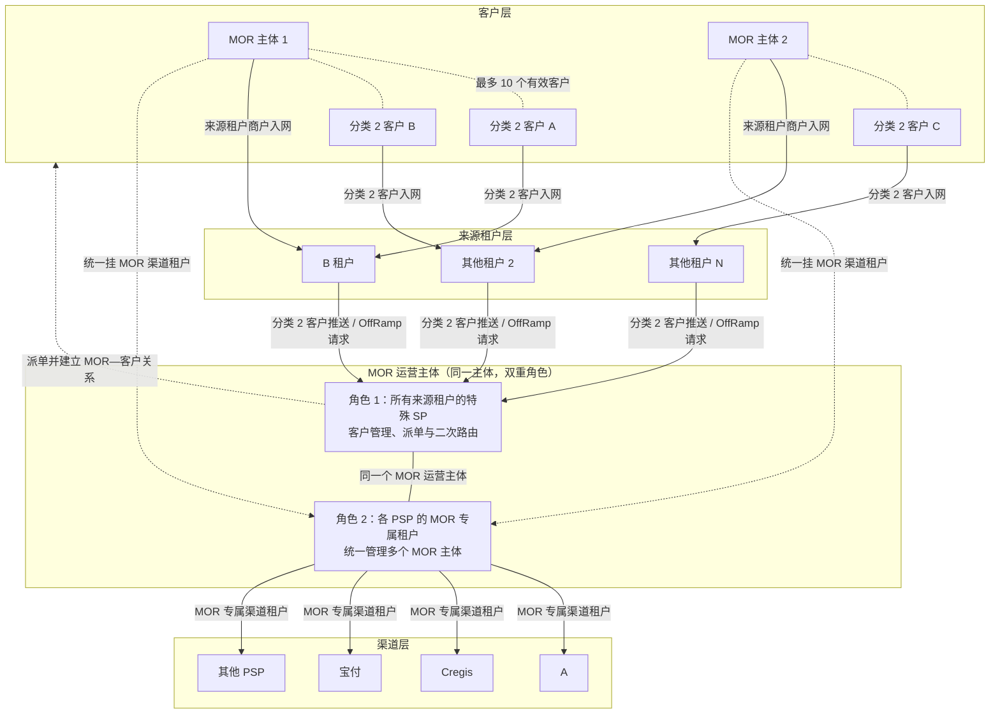
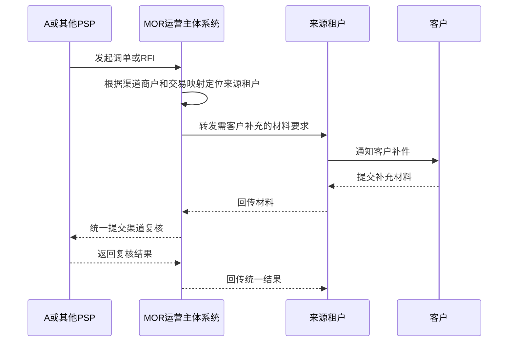
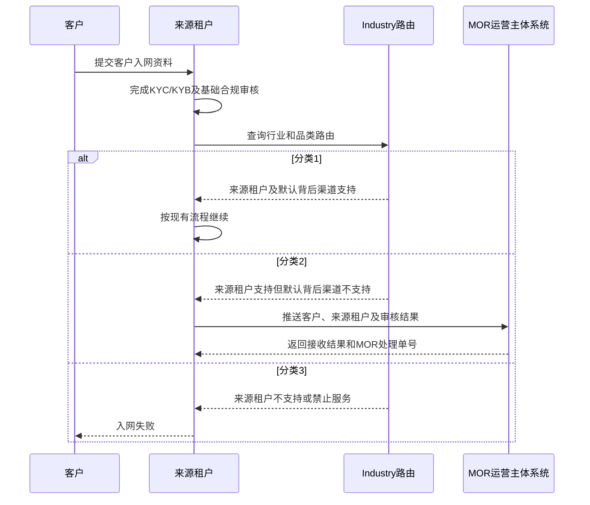
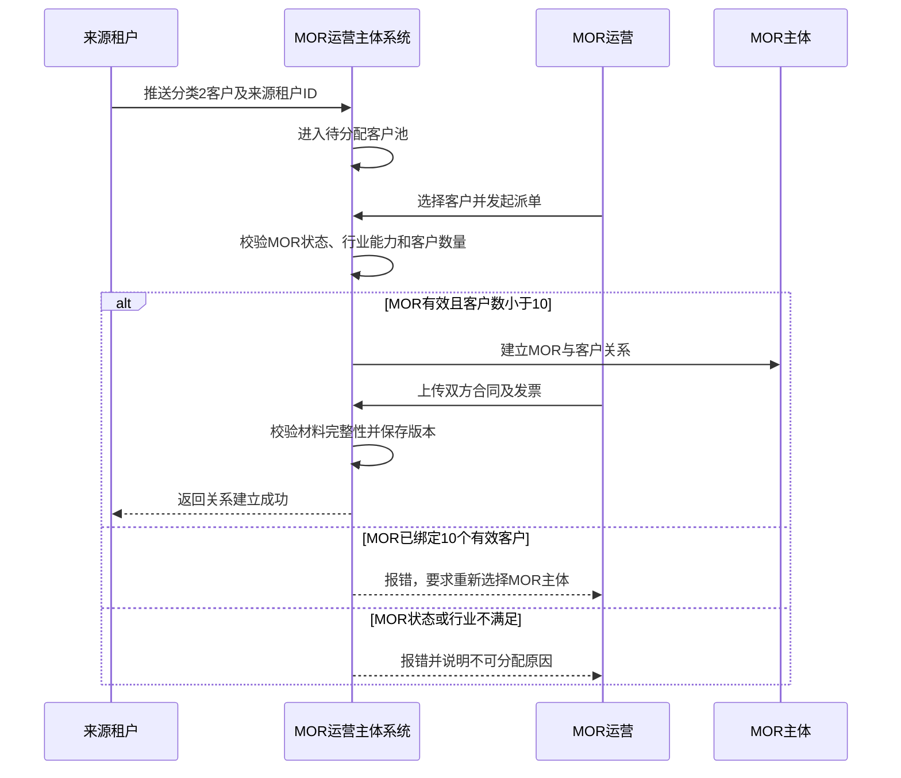
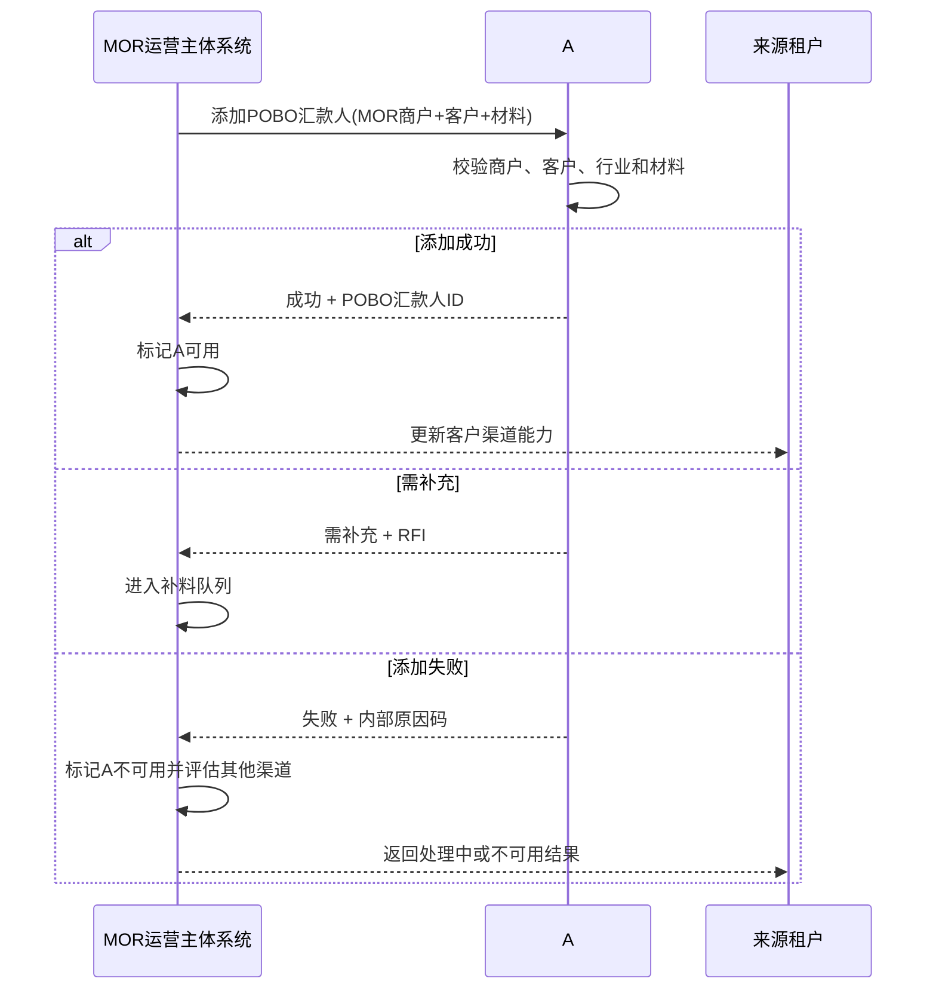
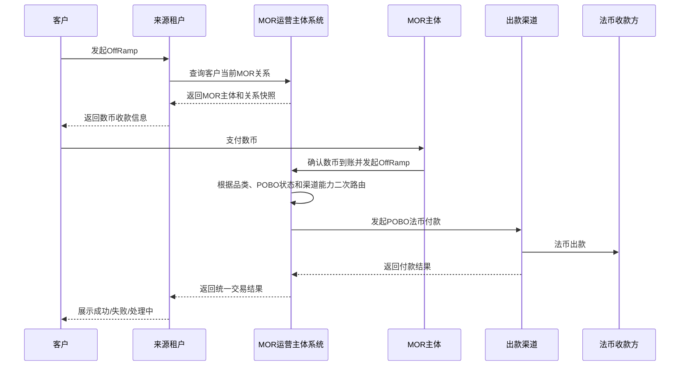
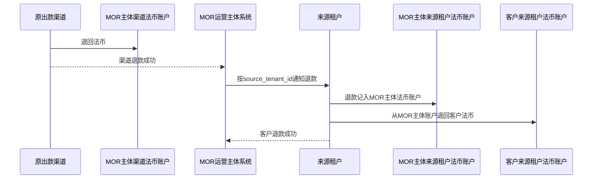

# MOR 方案（MOR 运营主体 SP）

> **文档定位**：MOR 运营主体 SP 方案，以及其客户管理、MOR 主体管理、客户入网、关系派单、渠道报备、二次路由、OffRamp 出款和异常退款闭环。
>
> **分类 2 客户口径**：来源租户支持，但该来源租户配置的默认背后渠道不支持，无法走标准渠道路径，需要进入 MOR 模式的客户。来源租户可以是 B，也可以是 EX 内其他租户；当前默认背后渠道通常为 A，后续可随租户配置变化。
>
> **POBO 能力依赖**：POBO 付款人能力仅建设在 A，当前 A 尚未具备该能力。本文涉及的 A POBO 付款人建档、审核和付款引用均须依赖《A POBO 付款人管理 PRD》建设完成，并经 A 风控、合规及实际付款通道批准后方可启用；EX 不参与 POBO 付款人的管理、审核或数据存储。

### 方案结论

MOR 运营主体以特殊 SP 身份承接来自 B 或其他来源租户的分类 2 客户，并在 A、Cregis、宝付及后续 PSP 分别建立 MOR 专属渠道租户。MOR 主体虽然由来源租户发起或推荐入网，但进入任一付款渠道后，渠道侧商户归属统一切换至 MOR 运营主体的渠道租户下。MOR 系统完成客户派单、合同/发票维护、渠道入网、POBO 付款人审核及二次路由；所有渠道调单、RFI 和回调先进入 MOR 系统，再由 MOR 系统关联原来源租户和客户处理。

---

## 一、方案目标

1. 引入 MOR 运营主体 SP，集中运营多个 MOR 主体和分类 2 客户；
2. 由 MOR 运营主体完成 MOR 主体与客户的关系分配、合同及发票、物流资料维护；
3. 统一对接 A、Cregis、宝付等渠道，完成 POBO 汇款人添加和交易出款；
4. 在 A 可承接时优先使用 A，在 A 不支持品类或 A 出款失败时切换其他渠道；
5. 对各来源租户只返回统一的入网和交易结果，屏蔽内部 MOR 主体选择及二次路由细节；
6. 确保客户、MOR 主体、材料、渠道报备、路由及退款全链路可追溯。

---

## 二、参与方与系统关系

| 参与方          | 定位                                  | 核心职责                                                                                                  |
| --------------- | ------------------------------------- | --------------------------------------------------------------------------------------------------------- |
| 来源租户        | B 或 EX 内其他客户来源租户             | 客户入网、行业分类、推送分类 2 客户、发起 OffRamp、接收最终结果                                           |
| MOR 运营主体    | 对来源租户是特殊 SP；对各 PSP 是专属渠道租户 | 统一运营多个 MOR 主体，完成派单、材料、渠道入网、二次路由、调单和异常处理                           |
| MOR 主体        | 实际承接分类 2 客户贸易关系的商户主体 | 与客户建立贸易关系，提供/签署合同和发票，接收数币并发起 OffRamp                                           |
| 客户            | 各来源租户的分类 2 客户               | 在来源租户入网并发起 OffRamp；不感知内部派单和渠道路由，但支付前应看到依法必须披露的实际收款信息          |
| A               | 优先法币付款主体/能力                  | 承接 MOR 主体入网和付款；POBO 付款人能力当前待在 A 建设                                                   |
| Cregis          | 可选出款渠道                          | 按自身行业、品类、国家、币种及风控能力承接可路由交易                                                      |
| 宝付            | 可选出款渠道                          | 按自身行业、品类、国家、币种及风控能力承接可路由交易                                                      |

### 2.1 法律和租户关系

- 来源租户可以是 B，也可以是 EX 内其他租户；MOR 运营主体对所有来源租户统一承担特殊 SP 角色；
- MOR 运营主体分别在 A、Cregis、宝付及后续接入的 PSP 建立 MOR 专属渠道租户；
- MOR 主体可能由任一来源租户发起或推荐入网，但在渠道侧不得挂在来源租户名下，必须统一挂在 MOR 运营主体对应的渠道租户下；
- “来源租户归属”与“渠道租户归属”是两个独立维度：前者用于客户来源、对客服务和订单归属，后者用于渠道商户管理、付款、调单和 RFI；
- 分类 2 客户完成来源租户入网后，由来源租户推送至 MOR 运营主体系统；
- MOR 主体与客户之间建立一对多关系，一个 MOR 主体最多绑定 10 个有效客户。



### 2.2 来源租户与渠道租户转换

MOR 模式必须建立显式的跨租户映射，不能直接沿用来源租户在渠道侧的商户归属。

```text
来源租户（B / 其他租户）
→ 将分类 2 客户或候选 MOR 主体推送给 MOR 系统
→ MOR 系统确认 MOR 主体及业务关系
→ 以 MOR 运营主体的渠道租户身份向 A / Cregis / 宝付 / 其他 PSP 入网
→ 渠道商户、付款、调单、RFI 统一归 MOR 运营主体
→ MOR 系统再根据 source_tenant_id 回传对应来源租户
```

核心规则：

- **不迁移来源数据**：客户和订单仍保留原来源租户 ID，不把客户从 B 或其他租户物理迁入 MOR 租户；
- **重建渠道归属**：渠道侧创建或关联的 MOR 商户必须使用 MOR 运营主体在该渠道的 tenant ID；
- **禁止错误继承**：即使 MOR 主体由 B 租户发起入网，也不能在 A 中挂到 B 的渠道租户下；
- **一套映射、多渠道归属**：同一个 MOR 主体可以分别挂在 MOR 运营主体的 A 租户、Cregis 租户、宝付租户及其他 PSP 租户下；
- **统一调单入口**：所有渠道回调、RFI、调单和拒绝原因先发送至 MOR 系统，不直接发给来源租户；
- **按来源回传**：MOR 系统通过原交易保存的 `source_tenant_id`、客户 ID 和交易 ID，将需要客户配合的事项转回正确来源租户；
- **租户隔离**：来源租户只能查看自己的客户、订单和对客材料，不能查看其他租户的数据或 MOR 运营主体的全量渠道信息。

### 2.3 渠道调单统一路由



---

## 三、行业分类和客户分流

### 3.1 Industry 对齐

各来源租户、MOR 运营主体、A 及其他渠道需要维护统一的行业和品类映射：

- EX 标准 Industry Code；
- 各来源租户是否支持该行业/品类；
- 当前默认背后渠道及其生效时间；
- A 支持/不支持状态；
- Cregis 支持/不支持状态；
- 宝付支持/不支持状态；
- 是否允许进入 MOR 模式；
- 合规等级和所需材料；
- 生效时间、版本和变更记录。

任何渠道的品类能力变更，必须通过版本化配置更新，不能直接修改历史交易所引用的行业路由快照。

“默认背后渠道”是每个来源租户标准路径优先使用的渠道，也是该租户客户分类的判断基准，当前通常为 A。分类 2 只表示对应来源租户的默认背后渠道不支持，不代表 Cregis、宝付等其他渠道也不支持；客户进入 MOR 模式后，由 MOR 系统根据各渠道实时能力完成二次路由。

### 3.2 客户分类

| 分类   | 定义                                                    | 处理方式                                  |
| ------ | ------------------------------------------------------- | ----------------------------------------- |
| 分类 1 | 来源租户支持，且该租户默认背后渠道支持                  | 按来源租户现有标准渠道路径处理            |
| 分类 2 | 来源租户支持，但该租户默认背后渠道不支持                | 推送至 MOR 运营主体系统，由 MOR 二次路由  |
| 分类 3 | 来源租户不支持，或命中平台/全部合作渠道禁止的行业、品类 | 拒绝入网，不进入 MOR 流程                 |

### 3.3 分类 2 客户入网流程



来源租户推送分类 2 客户时至少包含：

- 来源租户 ID、来源租户客户 ID；
- 企业中英文名称、注册国家和证件号码；
- Industry Code、业务品类和业务描述；
- KYC/KYB 审核结果；
- 实控人、法人、董事和股东摘要；
- 预计交易币种、国家、金额和频率；
- 客户提交的基础合同、订单或业务证明；
- 推送时间、版本和幂等号。

---

## 四、MOR 运营主体 SP 的能力

MOR 运营主体 SP 需要一套独立的 MOR 客户管理功能，至少包含：

1. MOR 运营权限；
2. MOR 主体管理；
3. 分类 2 客户接收池；
4. MOR 主体与客户关系派单；
5. 关系换绑任务及合同、发票、补充材料管理；
6. 渠道商户入网状态；
7. POBO 汇款人报备；
8. Industry 与渠道能力配置；
9. 交易二次路由；
10. 出款状态和渠道切换；
11. 退款/退币及来源租户法币账户退款；
12. 操作记录、审核记录和审计导出。

### 4.1 权限控制

- MOR 运营主体 SP 内置“**MOR 运营**”角色；
- 只有被授权用户可维护 MOR 主体、分配客户、上传材料和调整交易路由；
- 角色支持与其他运营角色叠加；
- 角色分配、回收和权限变更必须留痕；
- 关键操作需要复核或 2FA，包括关系换绑、合同替换、渠道切换和退款。

### 4.2 MOR 主体维护

MOR 主体不能在 MOR 系统内凭空创建，必须来源于已完成任一来源租户商户入网的真实主体，并在进入渠道时重新关联至 MOR 运营主体对应的渠道租户。

字段至少包括：

- MOR 主体 ID；
- 原来源租户 ID、来源租户商户 ID；
- MOR 运营主体在各渠道的 tenant ID；
- A 商户 ID；
- 企业中英文名称；
- 注册国家、证件类型和证件号码；
- 联系人及联系方式；
- 支持行业/品类；
- 支持币种和国家；
- A、Cregis、宝付的入网状态；
- 当前有效客户数/最大客户数；
- 状态：待入网、有效、暂停、不可用；
- 创建人、更新时间和操作记录。

规则：

- 地区 + 企业证件号码唯一；
- MOR 主体必须在 A 入网成功后才能承接需要走 A 的客户或交易；
- 有有效客户关系、在途交易、在途退款或渠道 RFI 时，不允许删除 MOR 主体；
- MOR 主体不可用时，停止新派单，已有客户进入迁移或人工处理队列。

---

## 五、MOR 主体与客户关系派单

### 5.1 正向派单流程

分类 2 客户进入 MOR 运营主体系统后，运营人员选择 MOR 主体并建立关系。



### 5.2 关系规则

- 一个客户同一时间只能绑定一个有效 MOR 主体；
- 一个 MOR 主体最多绑定 10 个有效客户；
- 计数只包含状态为“有效”的关系，已解除关系不占用名额；
- 达到 10 个客户时禁止新增关系，系统提示“该 MOR 主体已达到最大客户数，请重新选择其他 MOR 主体”；
- 建立关系时必须上传 MOR 主体与客户之间的合同和发票；
- 合同、发票必须保存文件哈希、版本、上传人和上传时间；
- 关系变更按时间点生效，不修改历史订单的 MOR 关系快照。

### 5.3 关系状态

```text
待分配
→ 待材料
→ 待渠道报备
→ 有效
→ 已解除
```

“暂停”和“待换绑”不作为 MOR—客户关系状态。关系是否有效与 MOR 主体、渠道或交易是否可用分别管理，避免因运营异常修改关系事实。

### 5.4 换绑与解除

- **首次派单超过上限**：如果候选 MOR 主体已有 10 个有效客户，本次关系不创建，客户退回待分配池，由运营重新选择其他 MOR 主体；该场景不属于换绑；
- **换绑触发条件**：仅用于客户已有有效 MOR 关系，但原 MOR 主体不可用、渠道能力变化、合规要求变化或业务决定停止承接的场景；
- **独立换绑任务**：系统创建换绑任务，不把原关系改为“暂停”或“待换绑”。任务状态为“待选择新 MOR → 待材料 → 待渠道报备 → 待生效 → 已完成/已关闭”；
- **切换前**：原关系继续保留为有效关系；是否允许发起新交易，由 MOR 主体状态、渠道能力和风控规则单独判断。原 MOR 主体不可用时，应禁止新交易并提示运营尽快完成换绑；
- **切换时**：新 MOR 的合同、发票及必要渠道报备全部完成后，系统按约定生效时间原子切换——旧关系转为“已解除”，新关系转为“有效”，确保客户同一时间只有一个有效 MOR 主体；
- **在途限制**：存在在途出款、退款、RFI 或未完成渠道报备时，不允许直接解除旧关系；相关交易继续使用创建交易时保存的原 MOR 关系快照；
- **历史不迁移**：历史交易继续引用原 MOR 主体，不随换绑变化；换绑只影响生效时间之后创建的新交易。

---

## 六、POBO 付款人目标能力及建设依赖

本节描述目标流程，不代表 A 当前已有接口。关系和材料完成后，MOR 运营主体系统直接向 A 的 POBO 付款人管理能力提交申请；所有付款人必须经过 A 风控审核。仅审核通过、状态正常且 A 实际付款通道支持的付款人，才可用于 A 的 POBO 付款。详细字段、状态、风控和交互见《A POBO 付款人管理 PRD》。EX 不参与该流程。

### 6.1 A 添加流程



### 6.2 请求字段

- MOR 运营主体租户 ID；
- MOR 主体的渠道商户 ID；
- 来源租户 ID、来源租户客户 ID；
- MOR—客户关系 ID；
- 客户主体资料；
- Industry Code 和品类；
- 合同、发票及文件哈希；
- 预期付款国家、币种和金额；
- 请求幂等号。

### 6.3 返回结果

统一为：

- 成功：返回渠道、渠道汇款人 ID、生效时间；
- 需补充：返回 RFI 单号和材料要求；
- 失败：返回内部原因码和是否允许重试；
- 超时：状态标记为“结果未知”，通过查询接口确认，不得直接重复创建。

每个渠道的 POBO 报备结果独立保存，不能用某一渠道成功覆盖其他渠道的失败状态。

---

## 七、MOR 二次路由

来源租户只完成第一次分类，将分类 2 客户和交易送至 MOR 运营主体系统；最终使用哪个出款渠道，以及使用 MOR 运营主体在该渠道的哪个租户和商户 ID，由 MOR 系统完成二次路由。

### 7.1 路由前置条件

候选渠道必须同时满足：

1. MOR 主体在该渠道有效入网；
2. 客户或 POBO 汇款人在该渠道添加成功；
3. 渠道支持当前 Industry/品类；
4. 渠道支持出款国家、币种和金额；
5. 渠道状态正常且额度、余额充足；
6. 未命中渠道或平台风控禁止规则。

### 7.2 路由优先级

```text
第一优先：A 已成功添加 POBO 汇款人（付款人）+ A 支持该品类 + A 当前可用
第二优先：宝付满足全部前置条件
第三优先：Cregis 满足全部前置条件
其他：按后续接入渠道的优先级、成本、成功率和时效排序
```

当 A 不支持某一品类时，不向 A 发起付款，直接在宝付、Cregis 等可支持渠道中选择。

### 7.3 路由决策记录

每笔交易必须保存：

- 客户和 MOR 关系快照；
- Industry/品类快照；
- 候选渠道及排除原因；
- 首选渠道和路由规则版本；
- 每次渠道切换的原因、操作人和时间；
- 最终成功渠道。

---

## 八、OffRamp 业务与资金流

### 8.1 主流程



### 8.2 资金流

```text
数币：客户 → 已绑定 MOR 主体
OffRamp：MOR 主体 → MOR 运营主体系统选择的渠道
法币：渠道 → 客户指定的法币收款账户
```

来源租户在客户发起 OffRamp 时，必须向 MOR 系统查询当前有效关系，获得具体 MOR 主体后再展示数币收款信息。不能由来源租户自行缓存并长期使用旧关系。

### 8.3 交易状态

```text
待查询MOR关系
→ 待客户支付数币
→ 数币确认中
→ 待路由
→ 渠道处理中
→ 出款成功

异常分支：
渠道失败 → 待切换渠道 → 渠道处理中
全部渠道失败 → 待退款 → 退款处理中 → 已退款 / 退款失败
```

---

## 九、出款失败与渠道切换

### 9.1 A 付款失败

```mermaid
sequenceDiagram
    participant A as A
    participant SP as MOR运营主体系统
    participant ALT as 备选渠道
    participant T as 来源租户

    A-->>SP: 付款失败
    SP->>SP: 判断失败是否允许换渠道
    SP->>ALT: 存在备选渠道时重新出款
    ALT-->>SP: 返回出款结果
    SP-->>T: 成功时返回交易成功和最终渠道
    SP->>SP: 失败时继续下一渠道
    SP->>SP: 全部渠道失败后进入退款流程
    SP-->>T: 返回交易失败和退款处理中
```

### 9.2 切换规则

- A 或其他 PSP 的失败结果必须先回到 MOR 系统，不能由来源租户直接重试其他渠道；
- 只有明确失败且确认未出款时才允许切换渠道；
- 渠道超时或结果未知时，必须先查询最终状态，避免重复付款；
- 切换渠道沿用原客户、MOR、金额、收款账户和材料快照；
- 若备选渠道需要独立 POBO 报备且尚未成功，不得直接出款；
- 任一渠道最终出款成功，MOR 系统向原来源租户返回整笔交易成功；
- 来源租户不需要感知中间失败次数，但 MOR 后台审计可查看完整尝试链路。

---

## 十、全部渠道失败后的退款

### 10.1 本期退款原则

本期优先采用**统一退法币**方案：

1. 出款渠道将法币退回 MOR 主体在该渠道的法币账户；
2. MOR 系统根据原交易的 `source_tenant_id` 通知正确的来源租户执行客户退款；
3. 退款资金记入 MOR 主体在该来源租户的法币账户；
4. 来源租户系统再从 MOR 主体账户退回客户在该来源租户的法币账户；
5. 来源租户完成退款后通知 MOR 系统，双方更新为“已退款”。



### 10.2 后续可扩展原则

后续可以按“渠道退什么货币，就向客户退什么货币”扩展：

- 渠道退法币 → MOR 主体渠道法币账户 → 原来源租户中的 MOR 主体法币账户 → 客户在原来源租户的法币账户；
- 渠道退数币 → MOR 数币退客户原付款地址或已验证退款地址；
- 具体退款币种必须在交易创建时向客户披露，并保存在订单快照中。

在该能力上线前，统一按法币退款处理。

### 10.3 退款异常

- 渠道已扣款但退款未到账：保持“渠道退款处理中”，禁止 MOR 提前重复退款；
- MOR 法币余额不足：进入人工补头寸队列，不改变客户应退金额；
- 客户法币账户不可用：暂停退款并由原来源租户联系客户更新已验证账户；
- 法币 A2A 失败：允许在确认未到账后重试或更换客户已验证法币账户；
- 退款金额与原交易金额不一致：进入差错处理，记录手续费、汇差和承担方；
- 任一退款失败不得把原交易标记为“已退款”。

---

## 十一、系统接口

### 11.1 来源租户 → MOR 运营主体系统

| 接口            | 用途                             |
| --------------- | -------------------------------- |
| 分类 2 客户推送 | 推送客户入网资料和 Industry 结果 |
| 客户资料更新    | 同步客户主体或行业信息变化       |
| 查询 MOR 关系   | OffRamp 前获取当前有效 MOR 主体  |
| 创建 OffRamp    | 将客户交易推送给 MOR 系统        |
| 查询交易状态    | 查询路由、出款或退款的统一状态   |
| 退款结果回传    | 返回客户退款流水、金额和完成时间 |

### 11.2 MOR 运营主体系统 → 来源租户

| 接口         | 用途                                          |
| ------------ | --------------------------------------------- |
| 客户接收结果 | 返回是否成功接收及处理单号                    |
| MOR 关系结果 | 返回关系状态和可用能力                        |
| 入网结果通知 | 返回成功、需补充或拒绝                        |
| 交易结果通知 | 返回处理中、成功、失败或退款中                |
| 退款发起通知 | 按原交易来源通知对应租户从指定 MOR 主体账户向客户退款 |

### 11.3 MOR 系统 → 渠道

| 接口             | 用途                      |
| ---------------- | ------------------------- |
| 商户入网/查询    | 使用 MOR 渠道租户维护 MOR 主体入网状态 |
| 添加 POBO 汇款人 | 报备 MOR 关系客户和材料   |
| POBO 状态查询    | 查询添加结果和 RFI        |
| 发起付款         | 使用指定 MOR 商户发起出款 |
| 付款状态查询     | 解决回调丢失或结果未知    |
| 退款/退回查询    | 查询失败后的渠道资金退回  |

所有创建类接口必须支持幂等号；所有回调必须验签并支持重复通知去重。

---

## 十二、核心数据对象

### 12.1 MOR 主体

- MOR 主体 ID；
- 原来源租户 ID、来源租户商户 ID；
- MOR 运营主体 ID；
- 各渠道的 MOR tenant ID 和渠道商户 ID；
- 主体资料；
- 支持 Industry/品类；
- 渠道状态；
- 当前有效客户数；
- 状态和操作记录。

### 12.2 MOR—客户关系

- 关系 ID；
- MOR 主体 ID；
- 来源租户 ID、来源租户客户 ID；
- Industry/品类；
- 合同和发票版本；
- 生效/失效时间；
- 状态；
- 创建人、复核人和操作记录。

### 12.3 渠道 POBO 报备

- 报备 ID；
- 渠道；
- MOR 运营主体在该渠道的 tenant ID；
- MOR 商户 ID；
- 客户 ID；
- 关系 ID；
- 渠道汇款人 ID；
- 状态：提交中、成功、需补充、失败、结果未知；
- RFI 和失败原因码；
- 请求/响应时间。

### 12.4 路由和渠道尝试

- 交易 ID；
- 关系快照；
- 路由规则版本；
- 候选渠道；
- 渠道尝试序号；
- 请求金额和币种；
- 渠道订单号；
- 状态和失败原因；
- 最终成功渠道。

### 12.5 退款记录

- 退款 ID；
- 原交易 ID；
- 来源租户 ID；
- 原渠道退款流水；
- MOR 主体渠道法币账户入账流水；
- MOR 主体在来源租户的法币账户入账流水；
- 来源租户向客户法币账户退款流水；
- 应退/实退金额；
- 币种；
- 差额和原因；
- 状态和完成时间。

### 12.6 跨租户渠道映射

- 来源租户 ID；
- 来源租户客户 ID、商户 ID；
- MOR 运营主体 ID；
- MOR 主体 ID；
- 渠道代码；
- MOR 运营主体在渠道的 tenant ID；
- MOR 主体在渠道的 merchant ID；
- 渠道调单/RFI 接收方：固定为 MOR 系统；
- 生效时间、失效时间和状态；
- 创建人、复核人及变更记录。

---

## 十三、风险与控制

1. **客户上限**：一个 MOR 主体最多 10 个有效客户，系统强校验；
2. **主体真实性**：MOR 主体必须完成原来源租户入网，并在每个实际使用的 PSP 下以 MOR 运营主体渠道租户完成入网；
3. **材料真实性**：合同和发票需版本化、留存哈希并支持审计；
4. **路由合规**：不能将 A 不支持的品类伪装后继续路由到 A；
5. **POBO 前置**：渠道 POBO 汇款人未添加成功，不得发起该渠道付款；
6. **防重复付款**：结果未知不得直接切换渠道；
7. **关系快照**：交易创建后固定 MOR 关系，不受后续换绑影响；
8. **资金一致性**：数币到账、渠道出款、MOR 主体渠道账户退款、来源租户账户入账和客户退款分别对账；
9. **客户信息隔离**：不同 MOR 主体只能访问自己关联的客户和材料；
10. **操作审计**：关系建立/解除、材料替换、渠道切换和退款均需留痕；
11. **渠道租户归属**：MOR 主体在任何 PSP 的渠道商户都必须挂在 MOR 运营主体 tenant ID 下，禁止继承来源租户的渠道 tenant ID；
12. **调单统一入口**：渠道回调、RFI 和调单只能先进入 MOR 系统，再依据来源租户映射转发，禁止渠道绕过 MOR 直接发送给来源租户；
13. **跨租户隔离**：MOR 系统按来源租户隔离客户和订单数据，跨租户查询、补件和结果回传必须校验租户权限。

---

## 十四、核心状态和对外口径

### 14.1 来源租户对客状态

来源租户对客户只展示：

- 入网处理中；
- 入网成功；
- 需要补充资料；
- 入网失败；
- 待支付数币；
- 处理中；
- 成功；
- 失败；
- 退款处理中；
- 已退款。

来源租户不对客户展示：

- 被分配到哪个 MOR 主体的内部运营过程；
- A、Cregis、宝付的路由顺序；
- 中间渠道失败次数；
- 渠道内部失败原文和敏感合规信息。

### 14.2 MOR 内部状态

MOR 系统保留完整细分状态，用于运营和审计，包括来源租户映射、渠道 tenant ID、关系、材料、POBO、路由、每次渠道尝试、调单，以及渠道退款、MOR 主体来源租户账户入账和客户退款状态。

---

## 十五、分期落地

### 第一期：最小闭环

- MOR 运营角色；
- MOR 主体管理；
- B 及其他来源租户的分类 2 客户推送；
- A、Cregis、宝付的 MOR 专属渠道租户配置；
- 来源租户到 MOR 渠道租户的跨租户映射；
- MOR—客户手工派单和 10 客户上限；
- 合同、发票上传；
- A POBO 汇款人添加；
- A 优先、宝付/Cregis 备选的规则路由；
- A 失败后的人工确认换渠道；
- 统一法币退款和原来源租户账户内退款；
- 全链路操作记录。

### 第二期：自动化增强

- MOR 主体自动推荐和负载均衡；
- 多渠道 POBO 并行预报备；
- 按成功率、成本、时效和额度自动路由；
- 自动渠道故障切换；
- 按渠道退款币种原币退回；
- 自动对账和差错预警。

---

## 十六、验收标准

1. 同一个 MOR 运营主体可以作为 B 及其他来源租户的特殊 SP，并分别作为 A、Cregis、宝付及后续 PSP 的 MOR 专属渠道租户；
2. MOR 主体无论从哪个来源租户发起入网，在各 PSP 中都必须挂在 MOR 运营主体对应的渠道 tenant ID 下；
3. 各来源租户支持但其默认背后渠道不支持的客户能被正确识别为分类 2，并携带来源租户 ID 幂等推送至 MOR 系统；
4. MOR 运营可建立 MOR—客户关系并上传合同、发票；
5. 一个 MOR 主体绑定第 11 个有效客户时必须被系统拒绝，并可重新选择其他 MOR；
6. MOR 系统可以调用 A 的添加 POBO 汇款人接口并保存成功、需补充、失败和结果未知状态；
7. A POBO 成功且支持品类时优先路由 A；A 不支持的品类不进入 A；
8. 任一 PSP 付款明确失败后，可以在 MOR 系统内切换至其他合格渠道；
9. 任一备选渠道成功后，原来源租户收到整笔交易成功结果；
10. 全部渠道失败后进入统一法币退款，完整记录“渠道→MOR 主体渠道账户→MOR 主体来源租户账户→客户来源租户账户”的资金链路；
11. 结果未知时不得重复付款或直接切换渠道；
12. 所有历史交易保留 MOR 关系、Industry、材料和路由快照；
13. 客户上限、材料、POBO、出款和退款均可审计和对账；
14. 来源租户对客状态不暴露内部 MOR 派单和渠道二次路由细节；
15. A、Cregis、宝付及其他 PSP 的所有调单、RFI 和渠道回调均先到 MOR 系统；
16. MOR 系统能根据原交易的来源租户映射，将补件要求和最终结果准确回传至对应来源租户，且不得跨租户泄露数据。

---

## 十七、待确认事项

1. B 及其他来源租户与 MOR 运营主体是否需要分别签署线下合作协议及协议主体；
2. 一个 MOR 最多 10 个客户的口径，是历史累计、有效关系还是自然年累计；本文暂按“同时有效关系”处理；
3. Cregis、宝付是否也要求预先添加 POBO 汇款人；
4. 渠道切换是否允许系统自动执行，第一期暂按人工确认后切换；
5. 统一退法币时汇差和手续费由来源租户、MOR 运营主体、MOR 主体还是客户承担；
6. 客户是否需要感知 MOR 主体的收币主体名称；
7. 合同和发票是否需要电子签章及签章服务商；
8. 渠道退款到账后，如何完成 MOR 主体渠道账户与其来源租户账户之间的清算、对账和到账确认。
