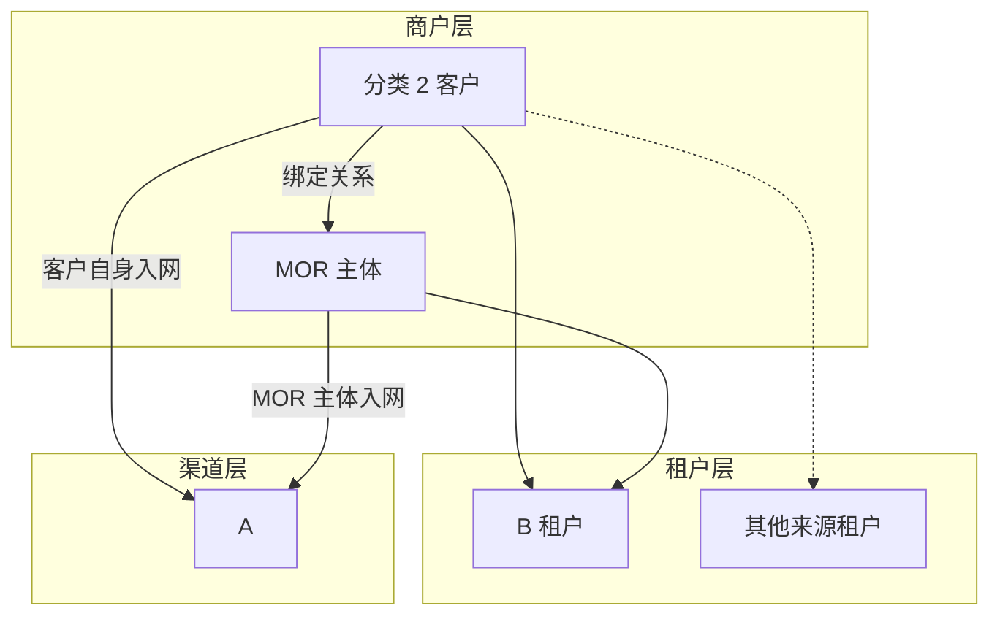
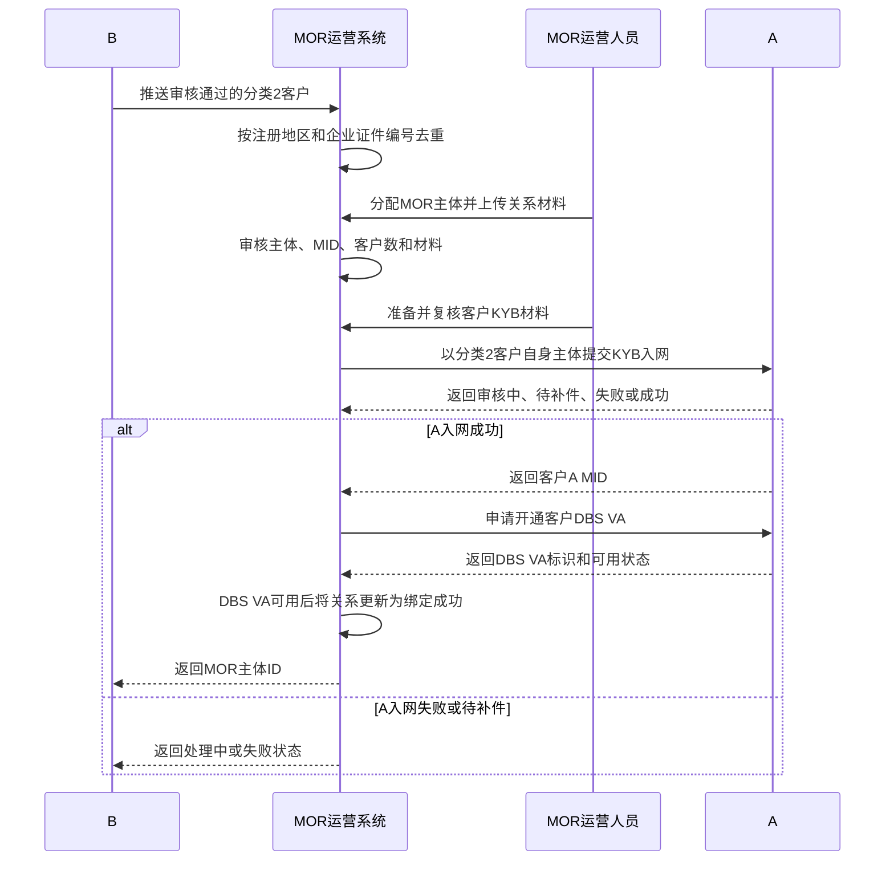
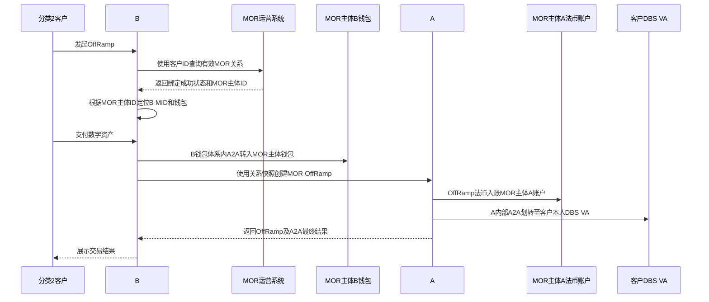

# MOR 运营系统 PRD（本期 B—A）

> **文档状态**：待评审  
> **需求主体**：MOR 运营系统  
> **本期范围**：分类 2 客户识别与推送、MOR 主体管理、客户—MOR 关系、分类 2 客户 A 入网、DBS VA开通及 B—A OffRamp 资金协同  
> **系统边界**：MOR 运营系统只管理主体、客户、关系、材料和状态，不持有资金、不执行钱包划转、不承担渠道路由  
> **核心原则**：分类 2 客户必须以自身主体在 A 完成入网；本期不使用 POBO，MOR 主体与分类 2 客户之间通过 A 内部 A2A 完成法币划转

## 一、需求背景

B 可以接受部分客户入网，但这些客户无法使用 B 的默认标准 OffRamp 路径。本期将此类客户定义为“分类 2 客户”，通过受控的 MOR 流程完成 OffRamp。

分类 2 客户不是 MOR 主体的 POBO 付款人，也不以 POBO 名义发起付款。所有客户必须先在 B 完成入网并审核通过；随后由 MOR 运营系统准备客户 KYB 材料并以客户自身主体提交 A 入网。A 入网审核通过并成功开通 DBS VA 后，客户才算完成 MOR 准入。交易时，B 侧先将客户数字资产 A2A 转入其绑定的 MOR 主体钱包；MOR 主体完成 OffRamp 后，法币进入 MOR 主体在 A 的账户；A 再通过内部 A2A 将法币划转至分类 2 客户的 DBS VA。

MOR 运营系统用于解决以下问题：

1. 统一管理具体 MOR 主体及其在 B、A 的入网状态和 MID；
2. 接收 B 审核通过的分类 2 客户；
3. 管理分类 2 客户与具体 MOR 主体的唯一关系及合作材料；
4. 准备分类 2 客户 KYB 材料，推动其在 A 入网并开通 DBS VA；
5. 向 B 返回具体 MOR 主体 ID，供 B 创建交易时定位关系；
6. 保证 B 侧数字资产 A2A、MOR OffRamp及 A 侧法币 A2A使用同一关系快照；
7. 对跨租户重复客户、主体客户数量上限和异常交易进行控制及审计。

## 二、产品目标与非目标

### 2.1 产品目标

1. 只有 B 入网审核通过的分类 2 客户可以进入 MOR 流程；
2. 同一分类 2 客户在不同来源租户进入时复用同一 MOR 主体；
3. 一个 MOR 主体最多绑定 10 个有效客户；
4. MOR 主体必须在 B、A 均已入网并维护 B MID、A MID；
5. 分类 2 客户必须在 A 完成入网并维护客户 A MID、DBS VA及账户状态；
6. MOR 关系、客户 A 入网及 DBS VA均有效后，MOR 系统才向 B 返回 MOR 主体 ID；
7. 交易全程留存客户、MOR 主体、B MID、MOR A MID、客户 A MID、DBS VA和资金流水快照。

### 2.2 非目标

- 不建设 POBO 付款人能力；
- 不以 MOR 主体名义直接付款至分类 2 客户的外部银行账户；
- 不允许付款至分类 2 客户指定的第三方收款人；
- 不接入 Cregis、宝付或其他渠道；
- 不建设二次路由、失败换渠道或渠道自动降级；
- MOR 运营系统不直接操作资金。

## 三、参与方与职责

| 参与方 | 定位 | 主要职责 |
| --- | --- | --- |
| 分类 2 客户 | B 已审核通过、默认标准路径不支持的客户 | 配合 MOR 准备 A KYB材料、完成 A 入网、开通 DBS VA、发起 OffRamp并接收 A 内部法币 A2A |
| 来源租户 | B 租户或 B 下其他租户 | 保留客户来源；完成本租户客户审核和订单归属 |
| B | 客户平台及交易编排方 | 客户入网、分类判断、跨租户去重、推送 MOR、数字资产 A2A、交易编排和结果展示 |
| MOR 运营系统 | 独立运营管理系统 | 管理 MOR 主体、客户、关系、KYB材料、A 入网状态和 DBS VA状态 |
| MOR 主体 | 普通商户 | 在 B、A 入网；在 B 接收数字资产；在 A 接收 OffRamp 法币并向绑定客户完成内部 A2A |
| A | 本期唯一法币渠道 | 完成 MOR 主体和分类 2 客户 KYB、维护各自账户、执行 OffRamp和内部法币 A2A |

## 四、系统与账户关系



账户规则：

- MOR 主体在 B 拥有 B MID和数字资产钱包；
- MOR 主体在 A 拥有 MOR A MID和法币账户；
- 分类 2 客户先在 B 审核通过，再由 MOR 运营系统准备 KYB材料并提交 A；
- 分类 2 客户在 A 以自身主体入网，取得客户 A MID并开通 DBS VA；
- MOR 运营系统保存客户—MOR关系、客户 A MID、DBS VA标识及状态；
- 不创建 A POBO 付款人；
- A 内部 A2A的收款账户必须是当前分类 2 客户本人已开通且有效的 DBS VA。

## 五、分类 2 客户识别与推送

### 5.1 分类口径

| 分类 | 定义 | 处理方式 |
| --- | --- | --- |
| 分类 1 | B 支持且默认标准路径支持 | 走标准 OffRamp |
| 分类 2 | B 支持但默认标准路径不支持 | B 审核通过后进入 MOR 流程 |
| 分类 3 | B 不支持或命中禁止规则 | 拒绝，不推送 MOR |

### 5.2 推送条件

B 仅在以下条件全部满足时推送 MOR：

1. 客户 B 入网状态为“审核通过”；
2. 客户被判断为分类 2；
3. 客户未命中禁止进入 MOR 的风险规则；
4. B 已按“注册地区＋企业证件编号”完成跨租户去重。

### 5.3 推送字段

| 字段 | 必填 | 说明 |
| --- | --- | --- |
| 客户名称 | 是 | B 审核通过的主体名称 |
| 客户所在国家/地区 | 是 | 客户注册地区 |
| 企业证件编号 | 是 | 与注册地区组成统一企业键 |
| 客户行业分类 | 是 | B 审核确认的行业 |
| 客户风险等级 | 是 | B 当前有效风险等级 |
| 董事 1 姓名 | 是 | 第一名董事姓名 |
| 董事 2 姓名 | 否 | 不存在时留空 |
| B 入网状态 | 是 | 本期仅接受“审核通过” |
| 创建时间 | 是 | 口径待接口确认 |
| 来源租户 ID | 是 | 用于多租户隔离和审计 |
| 来源客户 ID | 是 | 来源租户内客户标识 |
| 幂等号 | 是 | 防止重复创建 |

## 六、MOR 主体与客户关系

### 6.1 MOR 主体管理

MOR 运营系统需维护：

- MOR 主体名称、注册地区和企业证件编号；
- B 入网状态、B MID和钱包标识；
- A 入网状态、MOR A MID和法币账户状态；
- 主体状态：待入网、有效、暂停、不可用；
- 当前有效客户数；
- 创建、修改、审核及停用记录。

### 6.2 关系建立条件

客户—MOR关系进入“待 A 入网”前必须满足：

1. 客户 B 入网审核通过；
2. MOR 主体状态有效；
3. MOR 主体 B、A 入网均有效；
4. B MID、MOR A MID和账户状态有效；
5. MOR 主体当前有效客户数小于 10；
6. 客户与 MOR 主体的合同、发票和必需材料审核通过。

关系最终进入“绑定成功”还必须满足：

7. 分类 2 客户在 A 入网审核通过；
8. 客户 A MID已创建且有效；
9. 客户 DBS VA已成功开通且状态可用。

### 6.3 跨租户复用

- B 按“注册地区＋企业证件编号”生成统一企业键；
- 同一企业从其他租户再次进入时，不重新分配 MOR 主体；
- 新来源租户客户记录挂到既有统一客户和既有 MOR 关系；
- 只有一个有效 MOR 客户名额，不重复计数；
- 原关系失效时不得直接复用，需重新审核或换绑。

### 6.4 关系状态

| 状态 | 进入条件 | 可执行操作 | 退出条件 |
| --- | --- | --- | --- |
| 待分配 | B 首次推送且无历史关系 | 选择 MOR 主体 | 完成分配 |
| 待材料 | 已分配 MOR 主体 | 上传、补充、审核材料 | 材料审核通过或失败 |
| 待 A 入网 | 关系材料通过 | 准备KYB、提交客户 A 入网、补件、查询 | A 入网成功或失败 |
| 待 DBS VA | 客户 A 入网审核通过 | 获取客户 A MID并申请开通 DBS VA | DBS VA开通成功或失败 |
| 绑定成功 | 客户 A 入网通过且 DBS VA可用 | 发起交易、换绑申请、失效 | 主体、客户或DBS VA状态失效 |
| 材料审核失败 | 材料不满足要求 | 修改后重新提交 | 再次进入待材料 |
| A 入网失败 | A 拒绝或无法完成入网 | 补件、重新提交或终止 | A 重新受理或关系关闭 |
| 已失效 | 主体、客户或关系被终止 | 仅查看历史记录 | 不可恢复；新建关系 |

## 七、分类 2 客户 A 入网

### 7.1 入网流程



### 7.2 入网及账户数据

MOR 运营系统至少保存：

- 客户统一企业键；
- A 客户申请 ID；
- 客户 A MID；
- A 入网状态及状态原因；
- DBS VA标识、币种和可用状态；
- MOR A MID；
- RFI、补件记录和材料版本；
- 请求幂等号、响应时间和审核日志。

## 八、OffRamp 核心流程

### 8.1 业务流程



### 8.2 资金流

```text
数字资产：分类 2 客户 B 钱包
→ B 钱包体系内 A2A
→ 当前绑定 MOR 主体 B 钱包

OffRamp：MOR 主体 B 钱包对应资产
→ A 执行 OffRamp
→ MOR 主体 A 法币账户

法币：MOR 主体 A 法币账户
→ A 内部 A2A
→ 分类 2 客户本人 DBS VA
```

### 8.3 交易前置校验

B 创建交易前必须校验：

1. 客户 B 入网状态有效；
2. 客户—MOR关系为“绑定成功”；
3. MOR 主体 B、A 入网状态有效；
4. MOR 主体 B钱包、MOR A账户可用；
5. 客户 A 入网状态有效；
6. 客户 A MID有效；
7. 客户 DBS VA已开通且可用；
8. 交易币种、金额、限额和风险校验通过。

### 8.4 交易快照

每笔交易至少保存：

- 来源租户、客户 ID和统一企业键；
- MOR 关系 ID和MOR主体ID；
- MOR 主体 B MID、B钱包标识；
- MOR 主体 A MID、A法币账户标识；
- 客户 A MID及DBS VA标识；
- 数字资产金额、币种及 B A2A流水；
- OffRamp金额、币种、汇率、费用及 A 订单号；
- A 法币 A2A流水；
- 材料版本、幂等号和创建时间。

## 九、异常场景

| 异常 | 处理规则 |
| --- | --- |
| 客户 A 入网待补件 | 关系保持“待 A 入网”，不得创建交易 |
| 客户 A 入网失败 | 关系进入“A 入网失败”，不得绕过 A 入网或切换 POBO |
| DBS VA开通失败 | 关系保持“待 DBS VA”，不得标记绑定成功或创建交易 |
| 第 11 个客户绑定同一 MOR 主体 | 拒绝绑定，重新选择 MOR 主体 |
| B 数字资产 A2A失败 | 不创建 A OffRamp，交易失败或重试原步骤 |
| A OffRamp明确失败 | 不执行法币 A2A；按原路退回或人工处理 |
| A OffRamp结果未知 | 查询最终状态，不得重复创建 OffRamp |
| OffRamp成功但法币 A2A失败 | 资金保留在原 MOR 主体 A账户，进入人工处理；不得返回交易成功 |
| 法币 A2A结果未知 | 查询 A 最终状态，不得重复划转 |
| 客户 DBS VA冻结或不可用 | 停止新交易，通知 B 和 MOR 运营人员处理 |
| 在途交易期间换绑 | 使用创建交易时的原关系快照完成或退款 |

本期无其他渠道，任何失败均不得自动切换 Cregis、宝付或其他渠道。

## 十、系统接口

| 方向 | 接口 | 用途 |
| --- | --- | --- |
| B → MOR | 分类 2 客户推送 | 推送 B 审核通过的客户及来源租户信息 |
| B → MOR | 客户资料更新 | 同步名称、行业、风险等级、董事和 B 状态变化 |
| B → MOR | 关系查询 | 查询关系状态和 MOR 主体 ID |
| MOR → B | 接收结果 | 返回 MOR 处理单号和接收状态 |
| MOR → B | 绑定结果通知 | 绑定成功后返回 MOR 主体 ID |
| MOR → B | 状态通知 | 返回待材料、待 A 入网、待 DBS VA或失败状态 |
| MOR → A | 客户 A 入网 | 以分类 2 客户自身主体提交 KYB |
| MOR → A | A 入网查询/补件 | 查询状态并提交补充材料 |
| MOR → A | DBS VA开通 | A 入网通过后为客户申请并开通 DBS VA |
| B → A | 创建 MOR OffRamp及A2A | 执行 MOR OffRamp并划转至客户 DBS VA |
| B → A | 交易状态查询 | 查询 OffRamp及法币 A2A最终状态 |

接口要求：

- 创建类接口必须幂等；
- 回调必须验签、去重并支持乱序处理；
- 所有请求携带租户 ID、客户 ID、MOR关系ID、请求号和时间戳；
- OffRamp和法币 A2A需分别返回状态及流水号；
- 只有两个步骤均成功，B 才能向客户展示交易成功。

## 十一、风险、权限与审计

1. B 入网未通过的客户不得推送 MOR；
2. 客户必须以自身主体完成 A KYB，不得用 POBO或名义付款人替代；
3. MOR 主体、客户及双方关系材料均需风控和合规审核；
4. 同一企业跨租户复用同一 MOR 主体；
5. MOR 主体最多绑定 10 个有效客户；
6. B 钱包收币主体、MOR A账户主体必须为同一个 MOR 主体；
7. A 内部 A2A收款账户必须是当前分类 2 客户本人已开通的 DBS VA；
8. 禁止 MOR 运营方或其他 MOR 主体代替当前主体收币、OffRamp或划转；
9. 资料、状态、操作人、复核人、接口请求、回调和资金流水全程留痕；
10. 客户、主体、账户或关系状态变化时，停止新交易并触发复核。

权限角色：

| 角色 | 权限 |
| --- | --- |
| 系统管理员 | 用户、角色和系统配置管理 |
| MOR 运营 | 主体、客户、关系和材料维护；发起 A 入网 |
| 风控/合规审核 | 审核主体、关系材料、A 入网补件及异常处置 |
| 只读用户 | 查询主体、客户、关系、入网和交易状态 |

## 十二、页面交互

现有交互文档需按本 PRD 调整：删除“A POBO付款人”模块，替换为“客户 A 入网与 DBS VA”模块。

## 十三、验收标准

1. 只有 B 审核通过的分类 2 客户能够推送 MOR；
2. 系统能按注册地区＋企业证件编号完成跨租户去重；
3. MOR 系统能够维护 MOR 主体 B MID、MOR A MID及账户状态；
4. MOR 运营人员能够分配 MOR 主体、上传材料并提交审核；
5. 第 11 个有效客户绑定同一 MOR 主体时系统拒绝；
6. 分类 2 客户能够以自身主体提交 A KYB并记录审核状态；
7. A 入网失败或待补件时关系不能进入“绑定成功”；
8. 系统能够记录客户 A MID、DBS VA标识和账户状态；
9. DBS VA未成功开通或状态不可用时，关系不能进入“绑定成功”；
10. 绑定成功后 MOR 系统仅向 B 返回具体 MOR 主体 ID及关系状态；
11. 客户数字资产能够通过 B 内部 A2A进入绑定 MOR 主体钱包；
12. MOR OffRamp法币进入同一 MOR 主体的 A账户；
13. A 能够通过内部 A2A将法币划转至分类 2 客户本人 DBS VA；
14. OffRamp成功但法币 A2A失败时，交易不得返回成功；
15. 结果未知时不得重复 OffRamp或重复 A2A；
16. 系统中不存在 POBO 创建、审核或交易分支；
17. 本期不存在 Cregis、宝付、其他渠道和失败换渠道流程；
18. 历史交易能够还原客户、MOR主体、MOR A账户、客户DBS VA及两段A2A流水。

## 十四、待确认事项

1. A 客户入网由 MOR 运营系统直接调用，还是由 B 调用、MOR 系统只接收状态；
2. A 返回的客户 A MID、DBS VA标识和账户可用状态字段；
3. DBS VA由 A 入网成功后自动开通，还是 MOR 运营系统单独调用开户接口；
4. B 创建 A 交易时传 MOR 主体 ID、MOR关系ID或双方 A MID中的哪一组字段；
5. MOR OffRamp和 A 内部法币 A2A是一个原子接口，还是两个独立接口；
6. 若两个独立步骤部分成功，资金冻结、冲正、退款及人工处理责任；
7. DBS VA支持的币种、地区、限额及账户关闭规则；
8. MOR 主体最多 10 个客户的计数口径是否为“绑定成功且当前有效”；
9. 客户 B、A 入网状态或DBS VA状态被撤销后，既有关系和在途交易的处理规则；
10. 费用、汇差及退款损失由哪一方承担。
