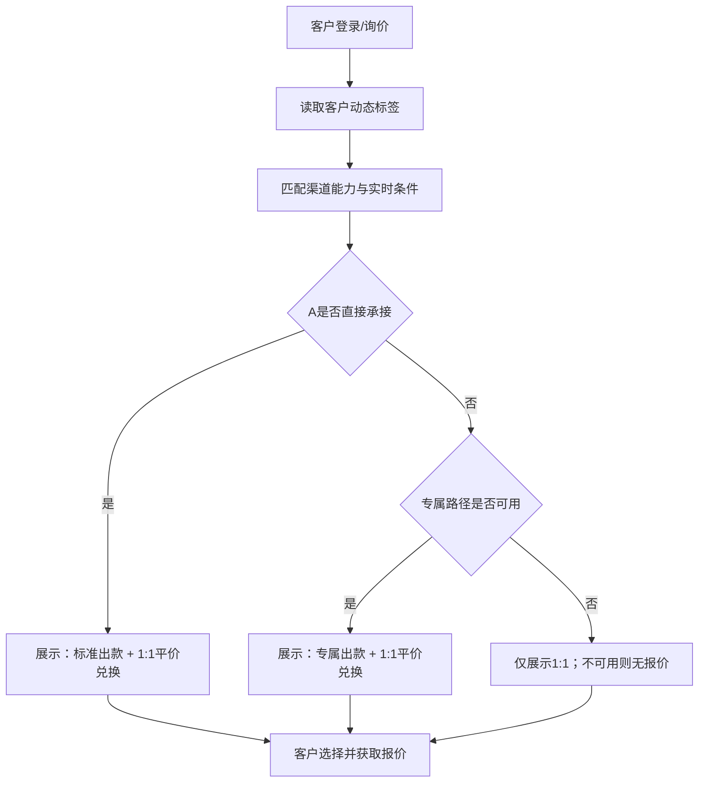
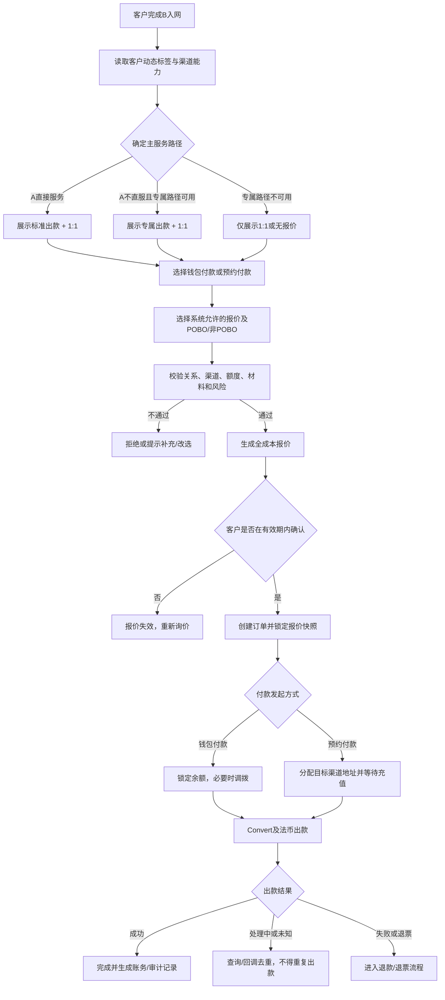
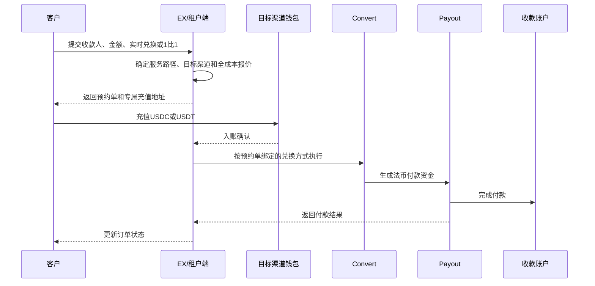

# Offramp 产品 PRD

> 文档状态：待产品、业务、风控合规、资金及技术评审
> 需求主体：EX Offramp 产品
> 适用范围：通过 EX/租户端使用数币兑换法币并向收款账户出款的企业客户
> 系统边界：本文定义 Offramp 产品分层、客户可见性、报价、付款发起方式、订单及成本路由；专属出款的 MOR 主体、关系、材料、POBO、资金与出款流程不在本文重复定义，统一引用《MOR 最终方案（本期 B—A）》
> 核心原则：使用本产品的客户均须先通过 B 的标准入网；产品差异来自服务路径和报价机制，不代表客户在 B 的风险等级；专属出款是否可用以 MOR 最终方案返回的路径就绪结果为准

---

## 一、术语和系统定位

| 术语     | 定义                                                                                           |
| -------- | ---------------------------------------------------------------------------------------------- |
| Offramp  | 将客户持有的数币兑换为法币，并支付至合规收款账户的产品能力                                     |
| EX       | 统一产品、租户接入、报价、订单及路由编排平台                                                   |
| 租户     | 使用 EX 能力向其客户提供 Offramp 服务的展业方                                                  |
| B        | 具备数币钱包、承兑或标准 Offramp 能力的 SP；本文沿用现有方案中的主体名称                       |
| A        | 具备法币账户、付款及 POBO 等能力的法币服务主体；是否服务特定客户以其政策为准                   |
| 专属出款 | A 不直接服务时使用的专属服务路径；其 MOR 业务与系统方案统一见《MOR 最终方案（本期 B—A）》 |
| Cregis   | 候选外部承兑/出款服务方；现有资料记录其可提供 1:1 兑换体验，但协议、责任及正式接入方式仍待批准 |
| POBO     | Payment on Behalf Of，以经审核的实际付款人名义发起付款                                         |
| 非 POBO  | 不指定第三方付款人名义，按实际出款账户主体或渠道支持的默认付款名义付款                         |
| 产品方案 | 对客展示的服务组合，包括适用客群、兑换机制、费率、时效、付款模式和服务承诺                     |
| 渠道路由 | 在客户与订单满足条件后，选择实际承兑及出款链路；渠道名称默认不对客暴露                         |

### 1.1 产品定位

Offramp 不应只是一条“数币换法币”的固定通道，而应是一套面向不同客户画像、风险等级和交易诉求的产品体系。EX 对外提供统一入口，对内以客户准入结果、产品方案、付款模式和订单条件进行路由。

产品方案与底层渠道不是一一绑定关系。同一产品未来可以配置多个合格渠道；同一渠道也可在不同商业配置下支持不同产品，但不得突破客户准入和渠道能力边界。

对客报价始终保持“两选一”结构：一份为系统确定的主路径报价（标准报价或专属报价），另一份为 1:1 平价报价。EX 负责产品与系统建设；BB 作为持牌机构负责后台资金运营。BB 自营资金、外部渠道兑换、头寸和净额处理均属于后台执行策略，不作为产品名称、不向客户暴露，也不改变客户看到的报价结构。

---

## 二、当前现状与问题

1. 本产品客户均为已经通过 B 标准入网的客户。问题不在于 B 是否接受客户，而在于 A 与 B 的风险偏好和服务范围不同：部分 B 标准客户不能由 A 直接承接。
2. 专属出款方案已经单独定义，本 PRD 需要回答整个 Offramp 产品如何分层、如何报价以及客户应看到什么产品。
3. Cregis/Gate 类场景体现了另一种客户诉求：接受更高费率，换取 1:1 兑换、较简单的价格预期或不同的服务体验。
4. 当前产品名、客户分类、收费、汇率和渠道路由容易混在一起，可能导致：
   - 前端把渠道能力直接包装成无条件承诺；
   - 将“A 不直接承接”错误表述为“客户在 B 属于高风险”；
   - 1:1 被误解为“免费兑换”或“无成本”；
   - 在 Offramp PRD 中重复维护专属方案细节，造成跨文档口径冲突；
   - 报价与渠道实际结算机制不一致，产生未计价的汇差或损失。

---

## 三、需求背景与产品价值

### 3.1 需求背景

Offramp 客户并非单一群体。即使都已通过 B 的基础入网，不同客户仍会在行业、交易背景、材料完整度、付款人展示、金额与频次等方面存在差异。与此同时，各渠道的准入、费率、兑换机制、时效、币种国家覆盖和调单责任也不同。

因此需要在“客户—产品—渠道”之间增加明确的产品层：先形成客户画像和准入结果，再决定可销售产品；客户选择产品和付款模式后，系统基于报价与渠道能力完成路由。

### 3.2 产品价值

- 对客户：在可服务边界内提供更清晰的价格、兑换机制、时效和付款方式选择。
- 对业务：既保留标准产品的规模化能力，也允许以更高价格服务经过审批的特殊客群。
- 对风控合规：避免用“高费率”替代准入，形成明确的不服务边界和增强审查流程。
- 对 BB 资金运营：把实时汇率、1:1 兑换、渠道成本和平台加价拆分记录，避免汇差不透明。
- 对技术运营：用产品配置和路由规则承接多渠道差异，降低前端与单一渠道耦合。

---

## 四、产品目标与非目标

### 4.1 产品目标

1. 建立三类 Offramp 产品方案，并支持按租户、客户、币种、国家及付款模式配置可见性。
2. 建立 A 侧服务路径判断：A 可直接承接的客户使用标准出款；A 不直接承接且专属路径可用的客户使用专属出款。
3. 对每笔订单展示可执行报价，明确兑换机制、费用、预计到账金额及报价有效期。
4. 三类产品均在渠道能力及合规批准范围内支持 POBO 与非 POBO。
5. 将专属出款纳入整体 Offramp 产品，并直接使用《MOR 最终方案（本期 B—A）》提供的路径就绪及交易能力。
6. 实现产品级、付款模式级和渠道级的订单、成本、收入、汇差与调单审计。
7. 建立客户动态标签与渠道能力中心，由系统先确定“标准出款或专属出款”，避免客户仅因价格选择不适用路径。
8. 同时支持“钱包付款”和“预约付款”：钱包付款使用已有数币余额；预约付款在充值前选择兑换方式并将收币、兑换、付款编排为一笔业务。

### 4.2 非目标

- 不承诺所有客户都能使用三类产品或任意付款模式。
- 不将“支付更高费率”视为获得准入或绕过风控的条件。
- 不承诺所有通道都能在银行流水中展示相同的付款人名称。
- 不把 1:1 描述为无汇率成本；其经济成本可体现在服务费或渠道综合成本中。
- 不在本 PRD 重复定义专属出款内部方案，也不确认各渠道的法律责任、牌照适用性及正式商业条款。
- 不在本期建设具体页面交互文档。

---

## 五、B 入网基线与 A 侧服务路径

### 5.1 基本前提

本 PRD 覆盖的客户均已通过 B 的标准入网要求，对 B 而言均属于可正常服务的标准客户。产品层不得使用“高风险客户”“中高风险客户”等词描述专属出款客群。

客户进入 Offramp 后，再根据 A 的风险偏好和服务范围判断出款路径。A 不直接承接某客户，只代表该客户与 A 当前政策不匹配，不等于该客户未通过 B 准入或在 B 属于高风险。

### 5.2 客户动态标签

系统不使用单一、永久的“客户类型”决定产品，而是根据下列条件生成带版本和有效期的动态标签：

| 标签维度          | 示例                                   | 更新来源/时机                      |
| ----------------- | -------------------------------------- | ---------------------------------- |
| 主体国家/经营国家 | HK、SG、VN                             | 入网、资料更新                     |
| 行业/业务品类     | 电商、广告、物流等                     | 入网、定期复审，合规审核结果为准   |
| 专属路径状态      | 不可用、准备中、可用、暂停             | 专属出款能力返回                   |
| 渠道关系状态      | 正常、限额、冻结、关户                 | 渠道回调与运营维护,比如被SGB官户了 |
| 交易动态条件      | 币种、金额、国家、付款模式、收款人类型 | 每次询价/下单实时计算              |
| 风险/运营事件     | 某渠道关户、近期退票、材料到期         | 事件触发                           |

动态标签必须区分“客户全局状态”和“客户在某一渠道的状态”。被某渠道关户只使该客户在该渠道不可用，不能在没有 B 侧决定的情况下直接把客户全局标记为不可服务。

### 5.3 渠道能力维护

每个渠道维护以下结构化能力：支持的客户国家、行业/品类、币种、金额、POBO/非 POBO、钱包是否必须配套、钱包/承兑/付款组合、汇率类型、费率、调拨网络及成本、限额、余额/头寸、SLA、客户准入结果、关户/黑名单、可用时间和规则版本。

渠道能力与客户动态标签在询价时实时匹配。渠道规则变化应重新计算客户路径，但不得追溯改变已确认订单。

### 5.4 A 侧服务路径分类

| 路径分类           | 判断结果                                                                                | 产品处理原则                                        |
| ------------------ | --------------------------------------------------------------------------------------- | --------------------------------------------------- |
| A 直接服务         | 客户已通过 B 入网，且符合 A 的直接服务政策                                              | 可使用标准出款；同时可自主选择 1:1 固定兑换         |
| 专属服务           | 客户已通过 B 入网，A 不直接承接且专属路径已返回可用                                 | 可使用专属出款；同时可自主选择 1:1 固定兑换         |
| 专属路径暂不可用   | 客户已通过 B 入网，A 不直接承接且专属路径尚未返回可用                               | 不展示标准出款或专属出款；仍可自主选择 1:1 固定兑换 |

若客户后续触发 B 的禁止或退出条件，应按 B 的客户生命周期管理停止全部产品；这属于统一客户准入管理，不是专属出款产品分层。

### 5.5 路径判断维度

路径判断至少包括：B 入网有效状态、A 的行业和地区政策、交易类型、金额与频次、收款人关系、A 直接服务结果及专属路径可用状态。专属路径内部判断统一由 MOR 最终方案负责。

### 5.6 两层筛选与产品展示

第一层由系统决定服务路径，客户不能自行在“标准出款”和“专属出款”之间切换：

- A 可直接服务：展示“标准出款 + 1:1 平价兑换”。
- A 不直接服务、专属路径可用：展示“专属出款 + 1:1 平价兑换”。
- A 不直接服务且专属路径不可用：仅展示“1:1 平价兑换”；若 1:1 渠道也不可用则不提供可成交报价。

第二层由客户在系统筛选后的选项中选择。该设计避免标准出款与专属出款同时出现时，客户必然选择更便宜的标准出款；也避免 A 可直接服务的客户因“丝滑”宣传被不必要地导向高成本路径。

### 5.7 产品路径决策

标准出款和专属出款的开通结果应记录到客户级产品权限；固定兑换版面向所有 B 入网有效的 Offramp 客户开放选择。

---

## 六、产品方案设计

### 6.1 产品总览

| 维度         | 标准出款                                    | 专属出款                                                                     | 固定兑换版（1:1）                                 |
| ------------ | ------------------------------------------- | ---------------------------------------------------------------------------- | ------------------------------------------------- |
| 核心定位     | B 入网客户中符合 A 直接服务政策的标准化出款 | B 已标准入网、A 不直接承接且专属路径可用时提供的出款                          | 提供 1 U = 1 计价法币单位的名义兑换机制或报价选择 |
| 主要客群     | A 可直接服务的 B 客户                       | A 不直接承接且专属路径可用的 B 客户                                           | 所有 B 入网有效的 Offramp 客户均可选择            |
| 典型链路     | B → A/标准渠道                             | 统一见《MOR 最终方案（本期 B—A）》                                            | Cregis/Gate 类 1:1 渠道，最终以正式接入结果为准   |
| 兑换机制     | 当前                                        | 当前                                                                         | 价差和渠道成本通过服务费等方式计价                |
| 收费         | 标准费率                                    | 高于标准出款，覆盖专属服务的综合成本                                           | 较高综合费率，覆盖 1:1 机制的汇差、渠道及服务成本 |
| 时效         | 标准 SLA                                    | 依赖预审、材料和渠道，报价页展示实际 SLA                                     | 依赖渠道可用性，报价页展示实际 SLA                |
| POBO/非 POBO | 均可，但取决于渠道                          | 统一见《MOR 最终方案（本期 B—A）》                                            | 均可，但取决于渠道能力                            |
| 自动化程度   | 高                                          | 白名单 + 审批 + 必要人工运营                                                 | 报价及渠道可用性校验，可配置自动/人工             |

这里的三种形态并非同时展示三个选项：标准出款与专属出款互斥，系统只返回其中一个，再与 1:1 平价兑换组成两份客户可比较的报价。

### 6.2 产品命名建议

“丝滑”更像体验宣传语，不能准确表达专属服务，产品正式名采用“专属出款”。该名称描述交付方式，不描述客户风险等级。对客及内部材料均不得将其表述为“高风险客户产品”，并禁止使用“无审查”“保证到账”等表述。

“1:1 的汇率”建议命名为“固定兑换版”或“平价兑换版”，页面必须同时展示服务费和预计到账金额，避免客户将 1:1 理解为零成本。

### 6.3 三类产品的可组合关系

- 标准出款与专属出款是系统根据客户标签和渠道能力确定的互斥主路径，不同时展示给同一客户选择。
- A 可直接服务的客户看到标准出款和固定兑换版。
- A 不直接承接但专属路径可用的客户看到专属出款和固定兑换版。
- A 不直接承接的客户不能因标准出款价格较低而切入 A 的直接服务链路。
- 固定兑换版面向所有 B 入网有效的 Offramp 客户；客户可在下单时主动选择，不需要额外申请“1:1 客群”资格。
- 同一订单只能选择一个产品方案和一种付款模式，不得在执行中无感切换为经济结果不同的产品。

### 6.4 付款发起方式（非新的报价产品）

Offramp 在报价产品之外提供两种资金进入方式。它们不增加第三类报价，也不改变“主路径报价 + 1:1 报价”的产品结构：

| 维度           | 钱包付款                                            | 预约付款（原“余额付款”）                                                    |
| -------------- | --------------------------------------------------- | ----------------------------------------------------------------------------- |
| 发起时资金位置 | 数币已在现有钱包服务商余额中                        | 尚未充值，客户先创建预约单                                                    |
| 主流程         | 选择余额 → 询价 → 必要时调拨 → Convert → Payout | 先选汇率方式并下单 → 分配对应收币地址 → USDC/USDT 充值 → Convert → Payout |
| 可选兑换方式   | 系统路径报价或 1:1 平价兑换                         | 实时兑换或 1:1 平价兑换                                                       |
| 钱包归属       | 现有独立钱包服务商                                  | 原则上使用所选承兑/Offramp 渠道配套钱包或专属地址                             |
| 调拨成本       | 走外部 1:1 渠道时通常存在，必须计入报价             | 通过充值前选路由，使资金直达目标渠道钱包，原则上不产生二次调拨                |
| 汇率确定       | 以报价/成交规则为准                                 | 客户在充值前选择；入账后绑定所选兑换规则，不允许无感切换                      |

“预约付款”比“余额付款”更准确：客户并非使用已有余额，而是先明确付款目标、收款人和报价，再向本次业务分配的地址充值。其核心目的不是增加一种兑换产品，而是在充值前完成路由，使资金尽量直接进入最终执行渠道的钱包，减少二次调拨成本。

### 6.5 预约付款的兑换方式命名

- **实时兑换**：按承兑成交时点的市场汇率执行；询价页展示参考汇率和计价时间，最终金额按成交规则确定。
- **1:1 平价兑换**：USDC/USDT 与目标 USD 按名义 1:1 兑换，另行展示服务费及其他费用。

不建议使用“浮动汇率”和“固定汇率”作为主名称：“实时兑换”更能说明成交机制；“1:1 平价兑换”可明确其特殊计价关系。若 1:1 仅支持 USD，则其他目标法币不展示该选项。

预约单一旦生成并分配收币地址，`兑换方式 + 目标渠道钱包 + 目标法币 + 收款账户` 即被绑定。数币入账后只能执行该订单已选择的兑换规则；若客户希望改选，必须在入账前取消并重建，或在入账后按明确的退款/重新调拨规则处理，不得后台静默切换。

---

## 七、POBO 与非 POBO 付款模式

### 7.1 通用规则

各产品在对应服务路径能力允许时可支持：

1. **POBO 付款**：订单引用已审核且有效的 POBO 付款人；需满足付款人与客户/交易/收款人的真实关系、材料、授权及渠道规则。
2. **非 POBO 付款**：不指定 POBO 付款人，按实际资金账户主体或渠道默认付款名义出款。

### 7.2 专属出款口径

专属出款支持的付款模式、付款人前置条件及处理流程不在本 PRD 重复描述，统一引用：[MOR模式-运营主体SP最终方案.md](./MOR模式-运营主体SP最终方案.md)。Offramp 产品仅消费该方案返回的“专属路径可用/不可用”结果和交易能力。

### 7.3 付款模式校验矩阵

| 校验项                     | POBO                                       | 非 POBO                                   |
| -------------------------- | ------------------------------------------ | ----------------------------------------- |
| 客户产品已开通             | 必须                                       | 必须                                      |
| 产品/渠道关系就绪（适用时） | 必须                                       | 必须                                      |
| POBO 付款人备案及审核通过  | 必须                                       | 不适用、不得强制                          |
| 付款人—客户/交易关系材料  | 必须                                       | 不以 POBO 关系要求；仍需订单贸易/资金材料 |
| 渠道支持对应付款模式       | 必须                                       | 必须                                      |
| 订单展示付款名义           | 展示预期 POBO 名义及“以通道实际结果为准” | 展示实际账户主体/默认名义说明             |

---

## 八、专属出款方案引用

本 PRD 不重复维护 MOR 的业务与系统流程。专属出款的适用条件、参与方、客户识别与推送、主体管理、绑定、POBO、资金流、交易、状态、接口、异常、验收及待确认事项，全部以以下文档为唯一依据：

[MOR模式-运营主体SP最终方案.md](./MOR模式-运营主体SP最终方案.md)

Offramp 产品侧只保留三个衔接点：

1. 获取客户“专属路径可用/不可用”结果，用于决定展示标准报价还是专属报价；
2. 客户选择专属报价后，将订单提交给 MOR 最终方案定义的交易链路；
3. 接收交易结果并完成对客状态、报价成本、账务和审计记录。

---

## 九、报价、汇率与收费

### 9.1 报价组成

每笔订单的报价至少包含：

| 项目             | 说明                                               |
| ---------------- | -------------------------------------------------- |
| 卖出数币及数量   | 如 USDT 100,000                                    |
| 目标法币及币种   | 如 USD                                             |
| 产品方案         | 标准出款/专属出款/固定兑换版                       |
| 付款发起方式     | 钱包付款/预约付款                                  |
| 付款模式         | POBO/非 POBO                                       |
| 兑换方式         | 实时兑换/1:1 平价兑换                              |
| 基准或名义兑换率 | 实时兑换展示参考/成交规则；1:1 展示名义兑换率      |
| 服务费           | 平台、专属出款或 1:1 服务费用，可按比例/固定值组合 |
| 调拨费           | 钱包付款且需将数币划转至承兑渠道时单独计入         |
| 其他明确费用     | 链上费、银行费、中转费等；无法预知时须说明承担方式 |
| 预计到账金额     | 在已知费用扣除后的客户预期法币金额                 |
| 报价有效期       | 到期后必须重新报价                                 |
| 预计时效         | 基于产品、币种、国家和渠道能力                     |
| 重要说明         | 1:1 不等于免费；收款行扣费、实际付款名义等说明     |

### 9.2 计价原则

- 标准出款：使用标准报价源及标准加价/费率。
- 专属出款：在实际兑换成本上增加专属服务综合费用；费用规则须获业务及合规审批。更高费用对应额外交付成本，不代表客户可以付费改变准入结论。
- 固定兑换版：名义兑换率固定为 1:1，渠道相对市场汇率产生的成本或收益不得隐藏，应纳入渠道成本与服务费核算。
- 钱包付款走 1:1 渠道时，报价必须加入从现有钱包服务商调拨至 1:1 渠道钱包的实际成本，包括链上网络费、钱包服务商费用及可能的归集成本；不得由平台隐性补贴。
- 预约付款优先将本次充值地址分配在最终承兑渠道的钱包体系，使 Deposit → Convert → Payout 在同一渠道完成；报价不得再虚构不存在的调拨费。
- 同一报价必须固化汇率、费用规则、渠道成本快照和有效期；订单成交后不可追溯修改。
- 向客户收费与向执行方结算分别记账，支持核算平台收入、渠道成本、汇差、专属服务成本及异常损失。

### 9.3 1:1 示例（仅说明机制）

客户卖出 100,000 USDT，名义兑换率为 1 USDT = 1 USD；若服务费为待配置比例，则预计到账金额为 100,000 USD 减去已披露费用。具体费率不得在产品未审批前写死，市场汇率高于或低于 1 时形成的经济差异由资金/财务规则记录。

### 9.4 成本优化策略

成本优化按以下优先级执行：

1. **充值前路由**：预约付款先选择实时兑换或 1:1 平价兑换，再分配对应渠道的钱包/地址，优先消除二次链上调拨。
2. **同渠道闭环**：优先选择同时支持钱包、Convert 和 Payout 的渠道完成全链路；是否选择不能只看承兑费率，要看客户预计到账金额和平台全链路成本。
3. **全成本报价**：路由成本模型统一纳入钱包费、链上费、调拨费、承兑价差、付款费、专属服务成本、失败/退票预期成本和资金占用成本。
4. **净额与批量调拨**：在客户资金隔离、可追溯和渠道允许的前提下，对已有钱包余额的跨渠道需求进行内部净额匹配或批量调拨，摊薄单笔网络费；不得延迟超过对客 SLA。
5. **阈值路由**：配置最小调拨金额和成本占比阈值。小额订单若调拨成本导致报价无竞争力，可不展示该 1:1 钱包付款报价，转而推荐预约付款。
6. **渠道资金预置**：仅在资金、财务、合规批准后，考虑在 1:1 渠道保留运营头寸以减少逐笔调拨；必须设置上限、预警、对账和退出机制，不作为 MVP 默认方案。

路由目标不应是“选择标称费率最低的渠道”，而应是在满足客户路径和风险约束后，优化：`客户预计到账金额、平台全链路毛利、成功率和时效`。

### 9.5 BB 自营资金与渠道兑换的内部定位

BB 自营资金运营和外部渠道兑换仅是生成主路径报价时的后台流动性来源：

- EX 系统可以比较 BB 自营资金成本与外部渠道全链路成本，按 BB 资金运营规则选择满足限额、头寸和时效要求的执行方案。
- 客户看到的仍是同一份标准报价或专属报价，不感知实际由 BB 自营资金还是渠道完成兑换。
- 1:1 报价仍按 1:1 渠道及其钱包/调拨成本独立计算，不因后台存在 BB 自营资金而改变其对客计价含义。
- 报价确认后应固化执行成本和责任方；后台执行方变化不得降低客户到账金额或改变付款模式，经济结果变化时必须重新报价。
- BB 自营资金的净额、头寸、敞口和收益单独记账，不进入对客产品分类。

---

## 十、核心业务流程

预约付款资金流程：

---

## 十一、功能需求

### 11.1 产品配置

支持配置产品名称、状态、适用 A 服务路径、租户、国家/地区、行业/品类、数币、法币、金额区间、付款发起方式、兑换方式、付款模式、报价规则、费率规则、调拨成本、SLA、渠道池、优先级、人工审批条件、规则版本和生效时间。

产品配置变更仅影响新报价，不得改变已确认订单；所有变更需审批并保留版本。

### 11.2 客户产品权限

每个客户维护 B 入网状态、动态标签、A 直接服务结果、专属路径可用状态、渠道关系、可用主路径、1:1 权限、POBO/非 POBO 权限、额度和有效期。

专属出款必须在客户通过 B 入网、A 不直接承接且专属路径返回可用后开通，不得通过运营手工绕过前置条件。

### 11.3 询价与产品选择

系统先根据客户标签与渠道能力返回“标准出款或专属出款”中的一个，再并列返回 1:1 平价兑换。不得同时向同一客户展示标准出款和专属出款。每个选项展示兑换机制、全部已知费用、预计到账金额、时效、付款模式及关键限制。当 1:1 服务临时不可用时，应显示“暂不可用”；钱包付款的 1:1 报价缺乏竞争力时，可提示“使用预约付款可减少调拨成本”。

### 11.4 预约付款

- 客户先填写目标法币、金额、收款账户和 POBO/非 POBO，再选择实时兑换或 1:1 平价兑换。
- 系统在创建预约单前完成客户路径、渠道能力、全成本和收款账户校验。
- 预约单生成后分配与所选渠道绑定的专属充值地址，并明确支持币种、网络、应充值金额、最小到账额和失效时间。
- 仅接受 USDC/USDT 及订单明确支持的网络；错币、错链、少充、超额、迟到必须进入异常流程。
- 入账后按预约单绑定的兑换方式自动执行 Convert → Payout，不允许客户或运营无确认改选。
- 预约单过期未充值自动关闭；过期后到账不得直接按原报价执行。

### 11.5 收款账户与付款模式

- 收款账户必须完成姓名/企业名、国家、币种、账户格式和渠道所需信息校验。
- POBO 订单必须选择有效付款人并固化付款人版本快照。
- 非 POBO 订单不展示/不要求 POBO 付款人字段。
- 从 POBO 改为非 POBO或反向修改均视为报价要素变化，必须重新报价。

### 11.6 路由

路由输入包括客户动态标签、A 服务结果、专属路径状态、付款发起方式、兑换方式、付款模式、币种国家、金额、渠道客户状态、是否要求配套钱包、渠道余额/额度、调拨成本、可用性、SLA、黑名单和规则版本。

路由结果需固化产品 ID、规则版本、主渠道、钱包渠道、调拨链路、备选渠道、选择原因及全成本快照。预约付款的备选渠道只能在分配充值地址前切换；地址分配或资金入账后，不得切换至另一钱包渠道，除非进入显式退款/迁移流程。

### 11.7 订单与对账

订单全程关联客户、租户、产品、报价、付款模式、付款人快照（适用时）、收款账户快照、专属路径交易引用（适用时）、渠道订单、资金流水、费用、汇差、回调和审计 ID。

---

## 十二、状态及状态流转

### 12.1 客户产品权限状态

| 状态   | 进入条件                 | 允许操作            | 退出条件           |
| ------ | ------------------------ | ------------------- | ------------------ |
| 未申请 | 尚未发起开通             | 申请                | 提交后进入审核中   |
| 审核中 | 已提交材料               | 补件/撤回（按权限） | 通过、拒绝或撤回   |
| 已开通 | 审批通过且关系/渠道就绪  | 询价、下单          | 暂停、关闭或到期   |
| 暂停   | 风险、渠道或运营临时限制 | 查询，按要求整改    | 恢复或关闭         |
| 已关闭 | 主动关闭或终止合作       | 查询历史            | 重新申请并重新审核 |
| 已到期 | 权限或材料超过有效期     | 查询、更新材料      | 复审通过后开通     |

### 12.2 Offramp 订单状态

| 状态          | 含义                                | 关键规则                                 |
| ------------- | ----------------------------------- | ---------------------------------------- |
| 待确认报价    | 已生成报价、客户未确认              | 超时自动失效                             |
| 待入金/待锁定 | 订单已创建，等待数币到账或锁定      | 不得发起法币出款                         |
| 处理中        | 数币已满足执行条件，承兑/出款处理中 | 禁止重复执行                             |
| 待补充        | 渠道要求补充交易材料                | 超时处理规则待配置，不向客户暴露敏感原因 |
| 成功          | 法币出款成功                        | 记录实际到账/付款信息                    |
| 失败          | 明确未完成且可退款/重新发起         | 不得标记成功                             |
| 结果未知      | 超时或回调不确定                    | 主动查询，禁止重复出款                   |
| 退票处理中    | 出款后被退回                        | 关联原订单和退票资金                     |
| 已退款/已退票 | 按批准方案完成资金返还              | 固化返还币种、金额、费用和汇率           |

产品权限、专属路径、付款人和交易订单状态分别由对应能力维护，不得相互替代。

---

## 十三、关键字段

| 字段                  | 必填         | 来源/类型  | 校验规则                             | 可见范围  | 备注                                 |
| --------------------- | ------------ | ---------- | ------------------------------------ | --------- | ------------------------------------ |
| customer_id           | 是           | 系统 ID    | 租户内唯一并关联主体                 | 租户/运营 | 不用名称做关联                       |
| customer_tag_snapshot | 是           | 结构化对象 | 含标签、来源、版本、有效期           | 受限      | 询价/下单时固化                      |
| a_service_path        | 是           | 枚举       | A_DIRECT/DEDICATED/A_UNAVAILABLE | 受限      | 表示 A 侧路径，不表示 B 客户风险等级 |
| product_code          | 是           | 枚举       | STANDARD/DEDICATED/PARITY            | 客户/内部 | 对客名称可配置                       |
| funding_mode          | 是           | 枚举       | WALLET_PAY/RESERVED_PAY              | 客户/内部 | 钱包付款/预约付款                    |
| conversion_mode       | 是           | 枚举       | REALTIME/PARITY_1_1                  | 客户/内部 | 入账后不可无感变更                   |
| payment_mode          | 是           | 枚举       | POBO/NON_POBO                        | 客户/内部 | 变更需重新报价                       |
| dedicated_path_ref    | 条件必填     | 系统 ID    | 专属出款时引用外部方案返回的有效标识 | 内部      | 内部结构由 MOR 最终方案定义          |
| pobo_payer_id         | POBO 必填    | 系统 ID    | 审核通过、正常、有效期内             | 受限      | 非 POBO 必须为空                     |
| quote_rate            | 是           | 数值       | 精度及来源可追溯                     | 客户/内部 | 固化快照                             |
| fee_items             | 是           | 结构化数组 | 费用项与承担方明确                   | 客户/内部 | 不允许仅存总额                       |
| expected_payout       | 是           | 金额       | 与报价公式一致                       | 客户/内部 | 标注可能的收款行扣费                 |
| quote_expire_at       | 是           | 时间       | 确认时不得过期                       | 客户/内部 | 过期重询价                           |
| wallet_provider_id    | 是           | 系统 ID    | 与路由和地址归属一致                 | 内部      | 区分现有钱包/渠道钱包                |
| deposit_address       | 预约付款必填 | 地址       | 币种、网络、渠道校验                 | 客户/内部 | 订单级或可追踪地址                   |
| transfer_fee          | 条件必填     | 金额       | 存在跨钱包调拨时必须计入             | 客户/内部 | 可为零但不可缺失                     |
| route_snapshot        | 是           | 结构化对象 | 含规则/渠道/成本版本                 | 内部      | 不对客暴露敏感渠道                   |
| dedicated_snapshot_ref | 条件必填    | 系统 ID    | 专属出款交易快照引用                 | 受限      | 快照内容由 MOR 最终方案定义          |
| idempotency_key       | 是           | 字符串     | 客户/租户维度唯一                    | 内部      | 防重复订单/出款                      |

---

## 十四、风控与合规要求

### 14.1 客户级

- 基础 KYC/KYB、受益所有人、制裁/PEP/负面信息和行业地区准入。
- 专属路径的客户、材料和审核要求统一由《MOR 最终方案（本期 B—A）》定义，本 PRD 仅使用其可用性结果。
- 画像、材料、额度或渠道政策发生重大变化时重新评估。

### 14.2 交易级

- 链上地址/KYT、金额频率、收款人、国家币种、付款人关系、历史行为和拆单检测。
- POBO 对付款人、申请主体、收款人及交易关系进行校验；非 POBO 不做 POBO 备案校验，但仍进行完整交易审查。
- 禁止通过拆单、切换产品、切换 POBO/非 POBO 或更换渠道规避规则。

### 14.3 专属出款专项

专属出款全部业务、合规和风险要求统一见：[MOR模式-运营主体SP最终方案.md](./MOR模式-运营主体SP最终方案.md)。本 PRD 不重复维护。

### 14.4 Cregis/Gate 类 1:1 渠道专项

- 上线前确认签约主体、服务协议、牌照/责任链、资金安全、出款失败责任、冻结/退款机制及渠道退出预案。
- 渠道没有正式批准前，固定兑换版只能作为产品设计，不得向客户开放真实交易。
- 渠道声称“1:1”不代表平台可以忽略实时市场价格、头寸和汇差风险。

---

## 十五、接口和数据对象

| 接口/对象         | 方向                    | 关键要求                                      |
| ----------------- | ----------------------- | --------------------------------------------- |
| 客户画像/准入结果 | KYC/风控 → EX          | 版本、有效期、分类、产品/模式权限、原因码分级 |
| 产品可用性查询    | 租户端 → EX            | 返回客户可用产品，不返回未授权产品            |
| 询价              | 租户端 → EX → SP/渠道 | 幂等；记录来源、费用、有效期和渠道成本        |
| 创建订单          | 租户端 → EX/B          | 幂等键；引用有效报价和快照                    |
| 专属路径能力      | 专属方案 → EX/B        | 仅返回可用性、交易引用及产品所需结果；内部字段见引用文档 |
| POBO 付款人       | A/渠道 ↔ 订单系统      | 仅适用产品引用；专属路径规则见引用文档         |
| 出款指令          | EX/B → 执行方          | 签名鉴权、金额精度、付款模式及追踪 ID          |
| 状态回调          | 执行方 → EX/B          | 验签、去重、乱序处理、结果未知查询             |
| 对账文件/流水     | 渠道/SP → 财务/资金    | 订单、承兑、费用、汇差、退款逐笔可勾稽        |

所有历史订单使用不可变快照。敏感数据按租户隔离、最小权限、传输/存储加密及保留期限管理。

---

## 十六、异常场景

| 场景                              | 处理要求                                                     |
| --------------------------------- | ------------------------------------------------------------ |
| 报价过期                          | 禁止按旧报价创建/执行，重新询价                              |
| 产品权限暂停                      | 新订单拦截；存量订单按风险决策继续、暂停或退款               |
| 无可用渠道                        | 不返回可成交报价，禁止先收币                                 |
| 重复创建/回调                     | 按幂等键与渠道订单号去重                                     |
| 渠道超时/结果未知                 | 进入结果未知并主动查询，确认前不得切渠道重复付款             |
| POBO 付款人失效                   | POBO 订单拦截；允许客户主动改为非 POBO并重新报价             |
| 专属路径返回不可用                | 拦截专属出款；内部原因和恢复流程见 MOR 最终方案             |
| 出款失败                          | 按失败节点判断原币退回、重新出款或人工处理，禁止无授权换产品 |
| 出款后退票                        | 关联原订单；记录退回法币、费用、是否反向兑换及最终退款       |
| 渠道成本突变                      | 未确认报价可作废重报；已确认订单按锁定规则和内部风险预案处理 |
| B 入网状态失效或客户被 B 终止服务 | 停止全部新订单，存量按风控决策处置并留痕                     |

---

## 十七、通知、审计与非功能要求

- 通知：产品开通/暂停、报价失效、订单状态、补件、失败、退票和退款通知；敏感拒绝原因使用统一话术。
- 审计：记录操作者、审批人、时间、前后值、规则版本、报价版本、路由原因、人工干预及调单材料版本。
- 可用性：订单、回调、查询具备重试和降级；不得因页面超时触发重复资金动作。
- 性能：询价目标响应时间及渠道超时阈值由技术评审确定；超时不得返回伪成功报价。
- 可观测性：按产品、客户分类、渠道、付款模式监控成功率、时效、毛利、汇差、退票、调单和冻结。
- 数据隔离：租户只能查看本租户客户及订单；专属方案、渠道与内部团队按职责获得最小权限。

---

## 十八、页面交互

页面交互见：[Offramp-付款交互文档.html](./Offramp-付款交互文档.html)

当前交互覆盖客户动态路径演示、标准/专属互斥展示、钱包付款/预约付款、实时兑换/1:1 平价兑换、调拨成本报价、POBO/非 POBO、报价确认及提交结果。

---

## 十九、验收标准

1. 系统依据客户国家、行业/品类、A 服务结果、专属路径状态、渠道关户及交易实时条件生成动态标签，并可追溯标签来源、版本和有效期。
2. 渠道能力中心可维护国家、品类、币种、金额、付款模式、钱包要求、费率、调拨成本、限额、可用性和客户渠道状态。
3. A 可直接服务的客户只看到“标准出款 + 1:1”；A 不直接服务且专属路径可用的客户只看到“专属出款 + 1:1”，同一客户不得同时看到标准出款和专属出款。
4. 所有 B 入网有效的 Offramp 客户均可选择 1:1；某个渠道关户只移除该渠道，不直接改变客户的 B 入网状态。
5. 钱包付款走 1:1 渠道时，链上及钱包调拨成本进入报价，并能在成本账中逐笔核对。
6. 预约付款支持先下单、选择“实时兑换/1:1 平价兑换”、分配目标渠道地址、USDC/USDT 入账、Convert、Payout 的完整闭环。
7. 预约付款入账后只能执行预约单绑定的兑换方式；更换方式必须走取消、退款或重新下单流程。
8. 固定兑换版明确展示 1:1、服务费、调拨费（如有）、其他费用和预计到账金额，不出现“1:1 即零费用”的误导。
9. POBO 订单必须引用有效付款人；非 POBO 订单不要求、不创建也不引用 POBO 付款人。
10. 专属路径返回不可用时不能创建专属出款；其内部验收以 MOR 最终方案为准。
11. 重复请求、重复回调和结果未知不会造成重复 Convert 或重复法币付款。
12. A 不直接承接的专属出款订单不可静默回落至 A 的标准直连路径；预约地址分配后不得无感切换钱包渠道。
13. 渠道出款失败或退票后，可追踪原订单、退回资金、费用、处理责任方及最终结果。
14. 未完成协议、合规及资金安全批准的 1:1 渠道不能被配置为生产可用。

---

## 二十、分期方案

### 阶段 1：产品与人工路由 MVP

- 建立客户动态标签、基础渠道能力、两层筛选、POBO/非 POBO 选择和统一全成本报价快照。
- 标准出款复用 B 现有能力及 A 直接服务路径。
- 专属出款直接接入《MOR 最终方案（本期 B—A）》提供的路径状态和交易能力。
- 钱包付款的 1:1 报价先纳入实际调拨成本；预约付款先支持 USDC/USDT、实时兑换/1:1 平价兑换及目标渠道直充。
- 路由可部分人工，但所有选择和审批必须系统留痕。

### 阶段 2：多渠道与自动路由

- 建立渠道能力中心、成本与余额/额度同步、自动路由和备选渠道。
- 支持在合规和资金隔离前提下进行净额匹配、批量调拨和成本阈值路由。
- 上线产品/渠道级对账、毛利与汇差监控。
- 建立自动化异常查询、退票和退款编排。

### 阶段 3：精细化运营

- 支持按客户和交易表现动态额度、费率分层及复审。
- 基于真实成功率、成本、时效和风险指标优化路由，但不得突破准入边界。

---

## 二十一、待确认事项

| 编号 | 待确认事项                                                                     | 决策方              |
| ---- | ------------------------------------------------------------------------------ | ------------------- |
| Q1   | “标准出款/专属出款/固定兑换版”的中英文对客名称                               | 产品/市场/法务/合规 |
| Q2   | A 直接服务、专属服务及路径暂不可用的产品判断与同步机制                         | A/B 风控合规        |
| Q3   | 标准出款、专属出款、固定兑换版的费率报价                                       | 商务/财务/资金      |
| Q4   | 1:1 的支持币对是否仅 USDT/USD；报价有效期、限额及市场极端波动处理              | 产品/资金/渠道      |
| Q5   | Cregis/Gate 的签约主体、协议、牌照/责任链、资金安全和生产接入可行性            | 法务/合规/FIBD      |
| Q8   | POBO 与非 POBO 分别支持的国家、币种、渠道及银行流水展示规则                    | A/渠道/合规         |
| Q9   | 退票后退法币还是反向兑换为 U；汇率、费用及损失承担方                           | 产品/资金/财务/法务 |
| Q11  | 客户产品权限配置粒度：租户级、客户级或客户+币种国家级                          | 产品/技术           |
| Q12  | 各产品 SLA、限额、人工审批时效及暂停/退出机制                                  | 运营/渠道/风控      |
| Q13  | 预约付款支持的 USDC/USDT 网络、地址模式、最小充值额、过期和错币错链处理        | 钱包/技术/运营      |
| Q14  | 实时兑换的成交时点、是否锁价、滑点边界，以及充值金额与预约金额不一致时如何执行 | 产品/资金/财务      |
| Q15  | 钱包付款跨渠道调拨费的计价来源、更新频率、批量调拨分摊及对客展示方式           | 钱包/资金/财务      |
| Q16  | 是否允许设置 1:1 渠道运营头寸；若允许，头寸上限、隔离、预警和退出机制          | 资金/财务/合规      |

---

## 二十二、参考资料

- [MOR模式-运营主体SP最终方案.md](./MOR模式-运营主体SP最终方案.md)
- [EX OffRamp解决方案.md](<./EX%20OffRamp解决方案.md>)
- [Cregis接入-问题分析-解决方案-风险.md](./Cregis接入-问题分析-解决方案-风险.md)
- [A-POBO付款人管理-PRD.md](./A-POBO付款人管理-PRD.md)
