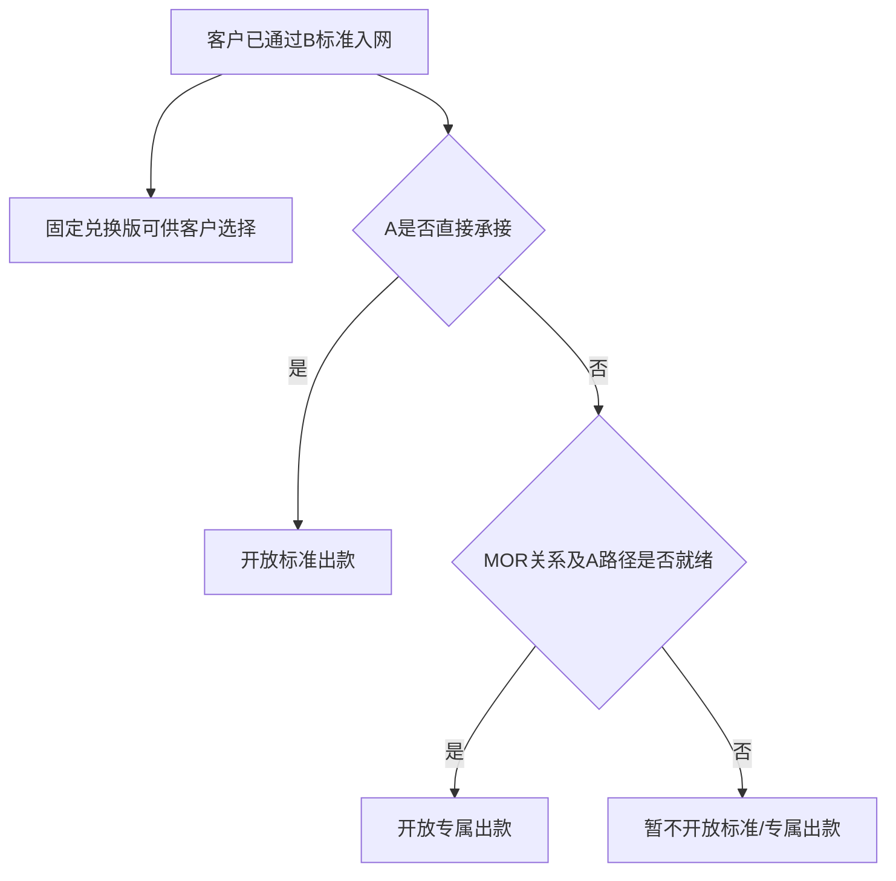
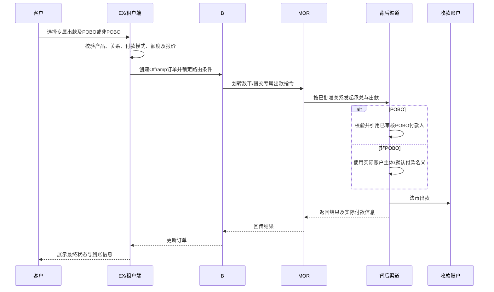
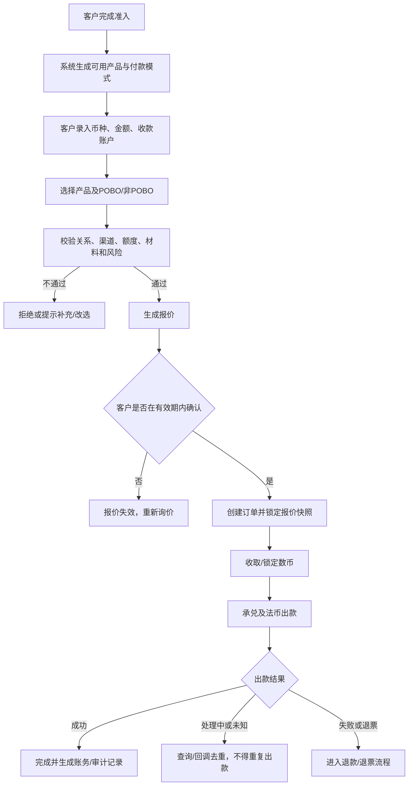

# Offramp 产品 PRD

> 文档状态：待产品、业务、风控合规、资金及技术评审  
> 需求主体：EX Offramp 产品  
> 适用范围：通过 EX/租户端使用数币兑换法币并向收款账户出款的企业客户  
> 系统边界：本文定义产品分层、客户准入、产品可见性、报价、订单、路由及 MOR 衔接；底层渠道内部实现、各司法辖区法律结论、具体费率数值及 POBO 付款人审核规则不在本文定论  
> 核心原则：使用本产品的客户均须先通过 B 的标准入网；产品差异来自 A/B 风险偏好及交付链路差异，不代表客户在 B 的风险等级；POBO 与非 POBO 是独立付款模式；非 POBO 不备案 POBO 付款人，客户与 MOR/渠道的关系建设不得依赖 POBO 备案

---

## 一、术语和系统定位

| 术语 | 定义 |
| --- | --- |
| Offramp | 将客户持有的数币兑换为法币，并支付至合规收款账户的产品能力 |
| EX | 统一产品、租户接入、报价、订单及路由编排平台 |
| 租户 | 使用 EX 能力向其客户提供 Offramp 服务的展业方 |
| B | 具备数币钱包、承兑或标准 Offramp 能力的 SP；本文沿用现有方案中的主体名称 |
| A | 具备法币账户、付款及 POBO 等能力的法币服务主体；是否服务特定客户以其政策为准 |
| MOR | 为特定客户提供桥接、关系承接、材料及调单支持的运营/桥接主体 |
| Cregis | 候选外部承兑/出款服务方；现有资料记录其可提供 1:1 兑换体验，但协议、责任及正式接入方式仍待批准 |
| POBO | Payment on Behalf Of，以经审核的实际付款人名义发起付款 |
| 非 POBO | 不指定第三方付款人名义，按实际出款账户主体或渠道支持的默认付款名义付款 |
| 产品方案 | 对客展示的服务组合，包括适用客群、兑换机制、费率、时效、付款模式和服务承诺 |
| 渠道路由 | 在客户与订单满足条件后，选择实际承兑及出款链路；渠道名称默认不对客暴露 |

### 1.1 产品定位

Offramp 不应只是一条“数币换法币”的固定通道，而应是一套面向不同客户画像、风险等级和交易诉求的产品体系。EX 对外提供统一入口，对内以客户准入结果、产品方案、付款模式和订单条件进行路由。

产品方案与底层渠道不是一一绑定关系。同一产品未来可以配置多个合格渠道；同一渠道也可在不同商业配置下支持不同产品，但不得突破客户准入和渠道能力边界。

---

## 二、当前现状与问题

1. 本产品客户均为已经通过 B 标准入网的客户。问题不在于 B 是否接受客户，而在于 A 与 B 的风险偏好和服务范围不同：部分 B 标准客户不能由 A 直接承接。
2. 现有 MOR 方案主要回答“B 已入网、但 A 不直接承接的客户如何通过 MOR 及 A 完成出款”，尚未回答整个 Offramp 产品如何分层、如何报价以及客户应看到什么产品。
3. Cregis/Gate 类场景体现了另一种客户诉求：接受更高费率，换取 1:1 兑换、较简单的价格预期或不同的服务体验。
4. 当前产品名、客户分类、收费、汇率和渠道路由容易混在一起，可能导致：
   - 前端把渠道能力直接包装成无条件承诺；
   - 将“A 不直接承接”错误表述为“客户在 B 属于高风险”；
   - 1:1 被误解为“免费兑换”或“无成本”；
   - POBO 备案被错误地当成所有 MOR 客户关系建设的前提；
   - 报价与渠道实际结算机制不一致，产生未计价的汇差或损失。

---

## 三、需求背景与产品价值

### 3.1 需求背景

Offramp 客户并非单一群体。即使都已通过 B 的基础入网，不同客户仍会在行业、交易背景、材料完整度、付款人展示、金额与频次等方面存在差异。与此同时，各渠道的准入、费率、兑换机制、时效、币种国家覆盖和调单责任也不同。

因此需要在“客户—产品—渠道”之间增加明确的产品层：先形成客户画像和准入结果，再决定可销售产品；客户选择产品和付款模式后，系统基于报价与渠道能力完成路由。

### 3.2 产品价值

- 对客户：在可服务边界内提供更清晰的价格、兑换机制、时效和付款方式选择。
- 对业务：既保留标准产品的规模化能力，也允许以更高价格服务经过审批的特殊客群。
- 对风控合规：避免用“高费率”替代准入，形成明确的不服务边界和增强审查流程。
- 对资金运营：把实时汇率、1:1 兑换、渠道成本和平台加价拆分记录，避免汇差不透明。
- 对技术运营：用产品配置和路由规则承接多渠道差异，降低前端与单一渠道耦合。

---

## 四、产品目标与非目标

### 4.1 产品目标

1. 建立三类 Offramp 产品方案，并支持按租户、客户、币种、国家及付款模式配置可见性。
2. 建立 A 侧服务路径判断：A 可直接承接的客户使用标准出款；A 不直接承接、但 MOR 路径获批的客户使用专属出款。
3. 对每笔订单展示可执行报价，明确兑换机制、费用、预计到账金额及报价有效期。
4. 三类产品均在渠道能力及合规批准范围内支持 POBO 与非 POBO。
5. 将 MOR 纳入整体 Offramp 的“增强服务路径”，并修正其与 POBO 备案的依赖关系。
6. 实现产品级、付款模式级和渠道级的订单、成本、收入、汇差与调单审计。

### 4.2 非目标

- 不承诺所有客户都能使用三类产品或任意付款模式。
- 不将“支付更高费率”视为获得准入或绕过风控的条件。
- 不承诺所有通道都能在银行流水中展示相同的付款人名称。
- 不把 1:1 描述为无汇率成本；其经济成本可体现在服务费或渠道综合成本中。
- 不在本 PRD 确认 Cregis、Gate、A 或 MOR 的法律责任、牌照适用性及正式商业条款。
- 不在本期建设具体页面交互文档。

---

## 五、B 入网基线与 A 侧服务路径

### 5.1 基本前提

本 PRD 覆盖的客户均已通过 B 的标准入网要求，对 B 而言均属于可正常服务的标准客户。产品层不得使用“高风险客户”“中高风险客户”等词描述专属出款客群。

客户进入 Offramp 后，再根据 A 的风险偏好和服务范围判断出款路径。A 不直接承接某客户，只代表该客户与 A 当前政策不匹配，不等于该客户未通过 B 准入或在 B 属于高风险。

### 5.2 A 侧服务路径分类

| 路径分类 | 判断结果 | 产品处理原则 |
| --- | --- | --- |
| A 直接服务 | 客户已通过 B 入网，且符合 A 的直接服务政策 | 可使用标准出款；同时可自主选择 1:1 固定兑换 |
| MOR 专属服务 | 客户已通过 B 入网，但因 A/B 风险偏好不同，A 不直接承接；MOR 关系及对应 A 路径已审批就绪 | 可使用专属出款；同时可自主选择 1:1 固定兑换 |
| A/MOR 路径暂不可用 | 客户已通过 B 入网，但 A 不直接承接，MOR 关系尚未建立、审批未通过或临时不可用 | 不展示标准出款或专属出款；仍可自主选择 1:1 固定兑换 |

若客户后续触发 B 的禁止或退出条件，应按 B 的客户生命周期管理停止全部产品；这属于统一客户准入管理，不是专属出款产品分层。

### 5.3 路径判断维度

路径判断至少包括：B 入网有效状态、A 的行业和地区政策、交易类型、材料要求、金额与频次、收款人关系、POBO 使用诉求、A 直接服务结果、MOR 关系状态及对应 A 路径就绪状态。

### 5.4 产品路径决策

标准出款和专属出款的开通结果应记录到客户级产品权限；固定兑换版面向所有 B 入网有效的 Offramp 客户开放选择。

---

## 六、产品方案设计

### 6.1 产品总览

| 维度 | 标准出款 | 专属出款 | 固定兑换版（1:1） |
| --- | --- | --- | --- |
| 核心定位 | B 入网客户中符合 A 直接服务政策的标准化出款 | B 已标准入网、但 A 因风险偏好差异不直接承接时，由 MOR 提供专属关系和出款承接 | 提供 1 U = 1 计价法币单位的名义兑换机制或报价选择 |
| 主要客群 | A 可直接服务的 B 客户 | A 不直接承接、MOR 路径已审批就绪的 B 客户 | 所有 B 入网有效的 Offramp 客户均可选择 |
| 典型链路 | B → A/标准渠道 | B → MOR → A/获批渠道 | Cregis/Gate 类 1:1 渠道，最终以正式接入结果为准 |
| 兑换机制 | 实时报价/市场汇率机制 | 以实际承兑渠道报价为基础 | 名义 1:1；价差和渠道成本通过服务费等方式计价 |
| 收费 | 标准费率 | 高于标准出款，覆盖 MOR 关系、材料、运营、渠道及专属服务成本 | 较高综合费率，覆盖 1:1 机制的汇差、渠道及服务成本 |
| 时效 | 标准 SLA | 依赖预审、材料和渠道，报价页展示实际 SLA | 依赖渠道可用性，报价页展示实际 SLA |
| POBO/非 POBO | 均可，但取决于渠道 | 均可，但取决于 MOR/渠道批准 | 均可，但取决于渠道能力 |
| 自动化程度 | 高 | 白名单 + 审批 + 必要人工运营 | 报价及渠道可用性校验，可配置自动/人工 |

### 6.2 产品命名建议

“丝滑”更像体验宣传语，不能准确表达 MOR 提供的关系承接、材料和运营服务，产品正式名采用“专属出款”。该名称描述交付方式，不描述客户风险等级。对客及内部材料均不得将其表述为“高风险客户产品”，并禁止使用“无审查”“保证到账”等表述。

“1:1 的汇率”建议命名为“固定兑换版”或“平价兑换版”，页面必须同时展示服务费和预计到账金额，避免客户将 1:1 理解为零成本。

### 6.3 三类产品的可组合关系

- 产品是客户可选方案，不是风险等级由低到高的自动升级阶梯。
- A 可直接服务的客户可选择标准出款或固定兑换版。
- A 不直接承接但 MOR 路径已就绪的客户可选择专属出款或固定兑换版。
- A 不直接承接的客户不能因标准出款价格较低而切入 A 的直接服务链路。
- 固定兑换版面向所有 B 入网有效的 Offramp 客户；客户可在下单时主动选择，不需要额外申请“1:1 客群”资格。
- 同一订单只能选择一个产品方案和一种付款模式，不得在执行中无感切换为经济结果不同的产品。

---

## 七、POBO 与非 POBO 付款模式

### 7.1 通用规则

三类产品在能力允许时均支持：

1. **POBO 付款**：订单引用已审核且有效的 POBO 付款人；需满足付款人与客户/交易/收款人的真实关系、材料、授权及渠道规则。
2. **非 POBO 付款**：不指定 POBO 付款人，按实际资金账户主体或渠道默认付款名义出款。

### 7.2 本次对 MOR 方案的关键修订

- 非 POBO 订单无需备案 POBO 付款人，也不得要求客户为建立 MOR 关系而创建虚假的 POBO 付款人。
- 客户与 MOR 的关系建设应基于独立的服务关系/委托关系、客户准入、业务材料、授权、客户—MOR 映射及渠道入网结果；不得依赖 POBO 备案记录作为唯一关系凭证。
- 只有客户选择 POBO 且底层渠道要求时，才进入 POBO 付款人备案、审核及订单引用流程。
- MOR 客户关系状态与 POBO 付款人状态必须拆分：MOR 关系有效不代表 POBO 可用；POBO 不可用也不应自动使非 POBO 能力失效，除非风险事件同时触发关系冻结。

### 7.3 付款模式校验矩阵

| 校验项 | POBO | 非 POBO |
| --- | --- | --- |
| 客户产品已开通 | 必须 | 必须 |
| MOR/渠道关系就绪（适用时） | 必须 | 必须 |
| POBO 付款人备案及审核通过 | 必须 | 不适用、不得强制 |
| 付款人—客户/交易关系材料 | 必须 | 不以 POBO 关系要求；仍需订单贸易/资金材料 |
| 渠道支持对应付款模式 | 必须 | 必须 |
| 订单展示付款名义 | 展示预期 POBO 名义及“以通道实际结果为准” | 展示实际账户主体/默认名义说明 |

---

## 八、MOR 专属出款方案衔接

### 8.1 定位

MOR 是专属出款的承接机制，不是面向全部客户的默认路径，也不是规避 B 或 A 准入的工具。其适用对象是已经通过 B 标准入网、但因 A/B 风险偏好不同而不能由 A 直接承接，且 MOR 与对应 A 路径均已批准的客户。

详细的 MOR 主体、A/B 分工、受控账户和调单设计可引用：[MOR-E-落地方案.md](../参考文档/MOR-E-落地方案.md)。若该文档与本 PRD 的 POBO 依赖关系冲突，以本 PRD 第七节修订原则为准。

### 8.2 MOR 关系建设

MOR 关系记录至少包括：客户 ID、租户 ID、MOR 主体/壳 ID、服务场景、授权/协议版本、客户业务材料版本、获准国家币种、产品权限、付款模式权限、背后渠道及入网 ID、额度、有效期、关系状态、审批记录。

关系建立流程：

1. 客户完成 B/适用 SP 的基础入网和增强画像。
2. B 确认客户入网状态正常；根据 A 的服务政策确认其不能由 A 直接承接，并同意提交 MOR。
3. MOR 审核真实业务、材料、服务场景及可承接性。
4. MOR 将客户提交至拟使用的背后渠道，或按获批结构建立受控关系。
5. 背后渠道就绪后，EX/B 创建客户—MOR—渠道关系并配置产品、付款模式、额度和有效期。
6. 若开通 POBO，再单独完成 POBO 付款人备案；若仅非 POBO，则关系在第 5 步即可就绪。

### 8.3 MOR 交易流程

### 8.4 MOR 失败与回落规则

- MOR 或目标渠道尚未就绪：不得接单，不得先收 U 后补关系。
- MOR 背后渠道拒绝：仅可路由至另一个已经完成客户准入、经济结果一致且报价允许的渠道；否则重新报价或拒绝。
- 不允许将 A 不直接承接的专属出款订单静默回落至 A 的标准直连路径。
- POBO 付款人不可用：可以提示客户改用非 POBO 重新获取报价，但必须由客户确认；不得直接更改付款名义。
- 调单由责任链中约定的主体处理；触及 B/EX 合规底线时必须升级，不得仅在 MOR 内闭环。

---

## 九、报价、汇率与收费

### 9.1 报价组成

每笔订单的报价至少包含：

| 项目 | 说明 |
| --- | --- |
| 卖出数币及数量 | 如 USDT 100,000 |
| 目标法币及币种 | 如 USD |
| 产品方案 | 标准出款/专属出款/固定兑换版 |
| 付款模式 | POBO/非 POBO |
| 基准或名义兑换率 | 标准/增强为实际报价；固定兑换版展示 1:1 |
| 服务费 | 平台、增强服务或固定兑换服务费用，可按比例/固定值组合 |
| 其他明确费用 | 链上费、银行费、中转费等；无法预知时须说明承担方式 |
| 预计到账金额 | 在已知费用扣除后的客户预期法币金额 |
| 报价有效期 | 到期后必须重新报价 |
| 预计时效 | 基于产品、币种、国家和渠道能力 |
| 重要说明 | 1:1 不等于免费；收款行扣费、实际付款名义等说明 |

### 9.2 计价原则

- 标准出款：使用标准报价源及标准加价/费率。
- 专属出款：在实际兑换成本上增加 MOR 关系承接、材料运营、渠道及专属服务费用；费用规则须获业务及合规审批。更高费用对应额外交付成本，不代表客户可以付费改变准入结论。
- 固定兑换版：名义兑换率固定为 1:1，渠道相对市场汇率产生的成本或收益不得隐藏，应纳入渠道成本与服务费核算。
- 同一报价必须固化汇率、费用规则、渠道成本快照和有效期；订单成交后不可追溯修改。
- 向客户收费与向渠道结算分别记账，支持核算平台收入、渠道成本、汇差、MOR 分润及异常损失。

### 9.3 1:1 示例（仅说明机制）

客户卖出 100,000 USDT，名义兑换率为 1 USDT = 1 USD；若服务费为待配置比例，则预计到账金额为 100,000 USD 减去已披露费用。具体费率不得在产品未审批前写死，市场汇率高于或低于 1 时形成的经济差异由资金/财务规则记录。

---

## 十、核心业务流程

---

## 十一、功能需求

### 11.1 产品配置

支持配置产品名称、状态、适用客户分类、租户、国家/地区、数币、法币、金额区间、付款模式、报价规则、费率规则、SLA、渠道池、优先级、人工审批条件、风险规则版本和生效时间。

产品配置变更仅影响新报价，不得改变已确认订单；所有变更需审批并保留版本。

### 11.2 客户产品权限

每个客户分别维护三类产品的未申请、审核中、已开通、暂停、已关闭、已到期状态，以及 POBO/非 POBO 权限、额度和有效期。

专属出款必须在客户通过 B 入网、A 不直接承接且 MOR/A 路径审批就绪后开通，不得通过运营手工绕过任一前置条件。

### 11.3 询价与产品选择

系统仅返回客户已开通的产品；对所有已获准使用 Offramp 的客户均返回固定兑换版供选择。每个选项展示兑换机制、全部已知费用、预计到账金额、时效、付款模式及关键限制，不展示未经确认的“保证到账”。当固定兑换服务临时不可用时，应明确显示“暂不可用”，而不是改变客户产品资格。

### 11.4 收款账户与付款模式

- 收款账户必须完成姓名/企业名、国家、币种、账户格式和渠道所需信息校验。
- POBO 订单必须选择有效付款人并固化付款人版本快照。
- 非 POBO 订单不展示/不要求 POBO 付款人字段。
- 从 POBO 改为非 POBO或反向修改均视为报价要素变化，必须重新报价。

### 11.5 路由

路由输入包括客户分类、产品、付款模式、币种国家、金额、渠道准入状态、渠道余额/额度、可用性、成本、SLA、黑名单和风险策略。

路由结果需固化产品 ID、规则版本、主渠道、备选渠道、选择原因及经济快照。备选渠道必须保证客户准入、付款模式和客户经济结果相容。

### 11.6 订单与对账

订单全程关联客户、租户、产品、报价、付款模式、付款人快照（POBO 时）、收款账户快照、MOR 关系（适用时）、渠道订单、资金流水、费用、汇差、回调和审计 ID。

---

## 十二、状态及状态流转

### 12.1 客户产品权限状态

| 状态 | 进入条件 | 允许操作 | 退出条件 |
| --- | --- | --- | --- |
| 未申请 | 尚未发起开通 | 申请 | 提交后进入审核中 |
| 审核中 | 已提交材料 | 补件/撤回（按权限） | 通过、拒绝或撤回 |
| 已开通 | 审批通过且关系/渠道就绪 | 询价、下单 | 暂停、关闭或到期 |
| 暂停 | 风险、渠道或运营临时限制 | 查询，按要求整改 | 恢复或关闭 |
| 已关闭 | 主动关闭或终止合作 | 查询历史 | 重新申请并重新审核 |
| 已到期 | 权限或材料超过有效期 | 查询、更新材料 | 复审通过后开通 |

### 12.2 Offramp 订单状态

| 状态 | 含义 | 关键规则 |
| --- | --- | --- |
| 待确认报价 | 已生成报价、客户未确认 | 超时自动失效 |
| 待入金/待锁定 | 订单已创建，等待数币到账或锁定 | 不得发起法币出款 |
| 处理中 | 数币已满足执行条件，承兑/出款处理中 | 禁止重复执行 |
| 待补充 | 渠道要求补充交易材料 | 超时处理规则待配置，不向客户暴露敏感原因 |
| 成功 | 法币出款成功 | 记录实际到账/付款信息 |
| 失败 | 明确未完成且可退款/重新发起 | 不得标记成功 |
| 结果未知 | 超时或回调不确定 | 主动查询，禁止重复出款 |
| 退票处理中 | 出款后被退回 | 关联原订单和退票资金 |
| 已退款/已退票 | 按批准方案完成资金返还 | 固化返还币种、金额、费用和汇率 |

产品权限、MOR 关系、POBO 付款人和交易订单是四套独立状态，不得相互替代。

---

## 十三、关键字段

| 字段 | 必填 | 来源/类型 | 校验规则 | 可见范围 | 备注 |
| --- | --- | --- | --- | --- | --- |
| customer_id | 是 | 系统 ID | 租户内唯一并关联主体 | 租户/运营 | 不用名称做关联 |
| a_service_path | 是 | 枚举 | A_DIRECT/MOR_DEDICATED/A_UNAVAILABLE | 受限 | 表示 A 侧路径，不表示 B 客户风险等级 |
| product_code | 是 | 枚举 | STANDARD/DEDICATED/PARITY | 客户/内部 | 对客名称可配置 |
| payment_mode | 是 | 枚举 | POBO/NON_POBO | 客户/内部 | 变更需重新报价 |
| mor_relation_id | 条件必填 | 系统 ID | 专属出款 MOR 路径必须有效 | 内部 | 与 POBO ID 分离 |
| pobo_payer_id | POBO 必填 | 系统 ID | 审核通过、正常、有效期内 | 受限 | 非 POBO 必须为空 |
| quote_rate | 是 | 数值 | 精度及来源可追溯 | 客户/内部 | 固化快照 |
| fee_items | 是 | 结构化数组 | 费用项与承担方明确 | 客户/内部 | 不允许仅存总额 |
| expected_payout | 是 | 金额 | 与报价公式一致 | 客户/内部 | 标注可能的收款行扣费 |
| quote_expire_at | 是 | 时间 | 确认时不得过期 | 客户/内部 | 过期重询价 |
| route_snapshot | 是 | 结构化对象 | 含规则/渠道/成本版本 | 内部 | 不对客暴露敏感渠道 |
| relationship_snapshot | 条件必填 | 结构化对象 | MOR 路径固化关系版本 | 受限 | 历史不可变 |
| idempotency_key | 是 | 字符串 | 客户/租户维度唯一 | 内部 | 防重复订单/出款 |

---

## 十四、风控与合规要求

### 14.1 客户级

- 基础 KYC/KYB、受益所有人、制裁/PEP/负面信息和行业地区准入。
- A 不直接承接并申请专属出款时，按 MOR 与 A 的要求补充真实业务、资金来源、交易目的、合同/订单/发票/物流等材料及路径预审；这是 A/MOR 路径要求，不改变其已通过 B 标准入网的事实。
- 画像、材料、额度或渠道政策发生重大变化时重新评估。

### 14.2 交易级

- 链上地址/KYT、金额频率、收款人、国家币种、付款人关系、历史行为和拆单检测。
- POBO 对付款人、申请主体、收款人及交易关系进行校验；非 POBO 不做 POBO 备案校验，但仍进行完整交易审查。
- 禁止通过拆单、切换产品、切换 POBO/非 POBO 或更换渠道规避规则。

### 14.3 MOR 专项

- MOR 仅承接已批准客户和场景；材料必须真实、可核验，不得伪造贸易背景。
- 明确客户、租户、B、MOR、A/渠道的协议、调单、冻结、赔付和退款责任。
- MOR 关系与资金应支持客户级隔离、额度和审计；一个 MOR 对应多个客户的规模上限需审批。
- 涉及制裁、洗钱或监管红线的事项必须升级至 B/EX 合规，不得对客披露敏感命中细节。

### 14.4 Cregis/Gate 类 1:1 渠道专项

- 上线前确认签约主体、服务协议、牌照/责任链、资金安全、出款失败责任、冻结/退款机制及渠道退出预案。
- 渠道没有正式批准前，固定兑换版只能作为产品设计，不得向客户开放真实交易。
- 渠道声称“1:1”不代表平台可以忽略实时市场价格、头寸和汇差风险。

---

## 十五、接口和数据对象

| 接口/对象 | 方向 | 关键要求 |
| --- | --- | --- |
| 客户画像/准入结果 | KYC/风控 → EX | 版本、有效期、分类、产品/模式权限、原因码分级 |
| 产品可用性查询 | 租户端 → EX | 返回客户可用产品，不返回未授权产品 |
| 询价 | 租户端 → EX → SP/渠道 | 幂等；记录来源、费用、有效期和渠道成本 |
| 创建订单 | 租户端 → EX/B | 幂等键；引用有效报价和快照 |
| MOR 关系 | MOR/运营 ↔ EX/B | 独立于 POBO；包含渠道就绪、额度和有效期 |
| POBO 付款人 | A/渠道 ↔ 订单系统 | 仅 POBO 时引用；状态变化实时或准实时同步 |
| 出款指令 | EX/B/MOR → 渠道 | 签名鉴权、金额精度、付款模式及追踪 ID |
| 状态回调 | 渠道 → EX/B/MOR | 验签、去重、乱序处理、结果未知查询 |
| 对账文件/流水 | 渠道/SP → 财务/资金 | 订单、承兑、费用、汇差、退款逐笔可勾稽 |

所有历史订单使用不可变快照。敏感数据按租户隔离、最小权限、传输/存储加密及保留期限管理。

---

## 十六、异常场景

| 场景 | 处理要求 |
| --- | --- |
| 报价过期 | 禁止按旧报价创建/执行，重新询价 |
| 产品权限暂停 | 新订单拦截；存量订单按风险决策继续、暂停或退款 |
| 无可用渠道 | 不返回可成交报价，禁止先收币 |
| 重复创建/回调 | 按幂等键与渠道订单号去重 |
| 数币到账不足/超额 | 不自动按错误金额出款；补足、部分处理或退款规则待配置 |
| 渠道超时/结果未知 | 进入结果未知并主动查询，确认前不得切渠道重复付款 |
| POBO 付款人失效 | POBO 订单拦截；允许客户主动改为非 POBO并重新报价 |
| MOR 关系过期/冻结 | 专属出款 MOR 路径拦截，不得依赖仍有效的 POBO 记录继续交易 |
| 出款失败 | 按失败节点判断原币退回、重新出款或人工处理，禁止无授权换产品 |
| 出款后退票 | 关联原订单；记录退回法币、费用、是否反向兑换及最终退款 |
| 渠道成本突变 | 未确认报价可作废重报；已确认订单按锁定规则和内部风险预案处理 |
| B 入网状态失效或客户被 B 终止服务 | 停止全部新订单，存量按风控决策处置并留痕 |

---

## 十七、通知、审计与非功能要求

- 通知：产品开通/暂停、报价失效、订单状态、补件、失败、退票和退款通知；敏感拒绝原因使用统一话术。
- 审计：记录操作者、审批人、时间、前后值、规则版本、报价版本、路由原因、人工干预及调单材料版本。
- 可用性：订单、回调、查询具备重试和降级；不得因页面超时触发重复资金动作。
- 性能：询价目标响应时间及渠道超时阈值由技术评审确定；超时不得返回伪成功报价。
- 可观测性：按产品、客户分类、渠道、付款模式监控成功率、时效、毛利、汇差、退票、调单和冻结。
- 数据隔离：租户只能查看本租户客户及订单；MOR、渠道与内部团队按职责获得最小权限。

---

## 十八、页面交互

本期先完成 PRD，页面交互文档暂不制作。后续交互范围建议覆盖：客户产品开通、Offramp 询价/产品比较、POBO 与非 POBO 切换、报价确认、订单详情及异常处理。

---

## 十九、验收标准

1. 所有 B 入网有效的 Offramp 客户均可看到并选择固定兑换版；A 可直接服务的客户可使用标准出款；A 不直接承接的客户仅在 MOR/A 路径审批就绪后使用专属出款。
2. 三类产品分别配置费率、兑换机制、渠道池、付款模式和适用范围，配置变更不影响已确认订单。
3. 固定兑换版明确展示 1:1、服务费、其他费用和预计到账金额，不出现“1:1 即零费用”的误导。
4. POBO 订单必须引用有效付款人；非 POBO 订单不要求、不创建也不引用 POBO 付款人。
5. MOR 客户可在无 POBO 备案的情况下，通过独立且有效的 MOR 关系使用已批准的非 POBO 能力。
6. MOR 关系失效时，即使 POBO 付款人仍有效，专属出款路径也必须拦截；反之 POBO 失效不得无理由关闭非 POBO 权限。
7. 客户从 POBO 切换到非 POBO或切换产品时必须重新报价并重新确认。
8. 每笔成交订单可追溯客户分类、产品权限、报价、费用、汇率、付款模式、MOR/POBO 快照、路由规则及渠道结果。
9. 重复请求、重复回调和结果未知不会造成重复承兑或重复法币付款。
10. A 不直接承接的专属出款订单不可静默回落至 A 的标准直连路径；备用渠道未完成对应客户关系时不得使用。
11. 渠道出款失败或退票后，可追踪原订单、退回资金、费用、处理责任方及最终结果。
12. 未完成协议、合规及资金安全批准的 1:1 渠道不能被配置为生产可用。

---

## 二十、分期方案

### 阶段 1：产品与人工路由 MVP

- 建立三类产品配置、客户产品白名单、POBO/非 POBO 选择和统一报价快照。
- 标准出款复用 B 现有能力及 A 直接服务路径。
- 专属出款以少量已完成 MOR/A 路径审批的客户先行接入，MOR 关系与 POBO 付款人解耦。
- 固定兑换版在渠道协议、责任及资金方案批准后上线；上线即面向所有已获准使用 Offramp 的客户提供选择。发布过程可采用技术灰度，但不得按客户画像设置额外的 1:1 产品资格。
- 路由可部分人工，但所有选择和审批必须系统留痕。

### 阶段 2：多渠道与自动路由

- 建立渠道能力中心、成本与余额/额度同步、自动路由和备选渠道。
- 上线产品/渠道级对账、毛利与汇差监控。
- 建立自动化异常查询、退票和退款编排。

### 阶段 3：精细化运营

- 支持按客户和交易表现动态额度、费率分层及复审。
- 基于真实成功率、成本、时效和风险指标优化路由，但不得突破准入边界。

---

## 二十一、待确认事项

| 编号 | 待确认事项 | 决策方 |
| --- | --- | --- |
| Q1 | “标准出款/专属出款/固定兑换版”的中英文对客名称 | 产品/市场/法务/合规 |
| Q2 | A 直接服务、MOR 专属服务及 A/MOR 路径暂不可用的具体判断规则与同步机制 | A/B 风控合规 |
| Q3 | 标准出款、专属出款、固定兑换版的费率公式、最低收费、分润及谁承担链上/银行费 | 商务/财务/资金 |
| Q4 | 1:1 的支持币对是否仅 USDT/USD；报价有效期、限额及市场极端波动处理 | 产品/资金/渠道 |
| Q5 | Cregis/Gate 的签约主体、协议、牌照/责任链、资金安全和生产接入可行性 | 法务/合规/FIBD |
| Q6 | 专属出款最终采用 MOR 作为 B 渠道、受控账户还是其他承接结构；各结构优先级 | 产品/架构/合规 |
| Q7 | MOR 与客户关系所需协议、授权、材料和有效期；非 POBO 的默认付款名义 | 法务/合规/MOR |
| Q8 | POBO 与非 POBO 分别支持的国家、币种、渠道及银行流水展示规则 | A/渠道/合规 |
| Q9 | 退票后退法币还是反向兑换为 U；汇率、费用及损失承担方 | 产品/资金/财务/法务 |
| Q10 | 专属出款的调单是否完全由 MOR 处理，以及触发客户补件/B 合规升级的边界 | MOR/B 合规/运营 |
| Q11 | 客户产品权限配置粒度：租户级、客户级或客户+币种国家级 | 产品/技术 |
| Q12 | 各产品 SLA、限额、人工审批时效及暂停/退出机制 | 运营/渠道/风控 |

---

## 二十二、参考资料

- [MOR-E-落地方案.md](../参考文档/MOR-E-落地方案.md)
- [EX OffRamp解决方案.md](./EX%20OffRamp解决方案.md)
- [MOR作为B渠道方案.md](./MOR作为B渠道方案.md)
- [Cregis接入-问题分析-解决方案-风险.md](./Cregis接入-问题分析-解决方案-风险.md)
- [A-POBO付款人管理-PRD.md](./A-POBO付款人管理-PRD.md)
