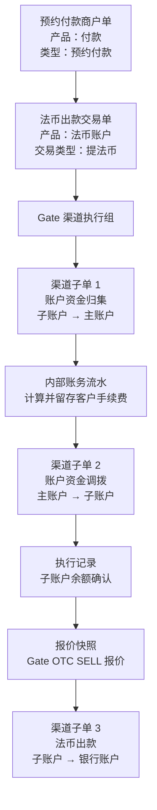
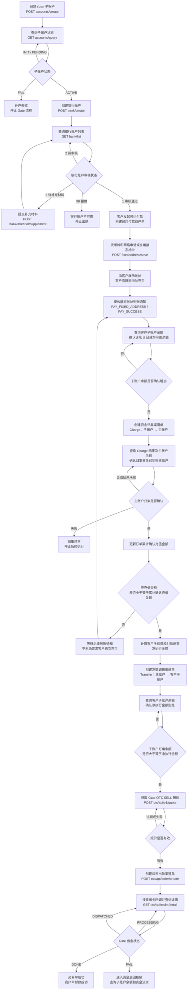

# Gate 三单模型与资金编排设计

> 文档状态：待评审
>
> 需求主体：交易产品、交易引擎、渠道接入、账务、运营
>
> 适用范围：Gate 子账户收币、子账户归集主账户、主账户净额调拨子账户、子账户法币出款
>
> 系统边界：包含商户单、交易单、渠道单、渠道执行组、内部账务流水及 Gate Adapter；不定义 Gate 商务合同、客户费率审批和银行最终清算规则
>
> 核心原则：商户单记录客户业务意图；交易单负责平台业务编排；渠道单记录每一次产生资金影响的 Gate 渠道动作；余额查询和报价属于执行记录，不单独生成资金渠道单

## 1. 背景

Gate 资金执行路径为：

1. 客户向 Gate 子账户绑定的静态数币地址充值；
2. 到账后，将子账户资金归集至 Gate 主账户；
3. BB/EX 在主账户侧扣除向客户收取的手续费（内部账务逻辑，不调用 Gate 接口）；
4. 将净执行金额从主账户调拨回客户 Gate 子账户；
5. 确认子账户余额可用；
6. 使用子账户余额获取 Gate OTC 报价并发起法币出款；
7. 根据 Gate 出金结果完成业务状态更新或资金退回核销。

按照现有三单模型：

- 商户单代表客户发起的业务；
- 交易单代表平台需要完成的交易；
- 渠道单代表渠道实际执行。

由于一次法币出款在 Gate 内部包含“子转主、主转子、子账户出款”三段资金动作，不能简单地把一张交易单对应为一张渠道单，也不应把三段渠道动作拆成三张独立交易单。

## 2. 设计结论

采用以下模型：

> 1 张商户单 → 1 张法币出款交易单 → 1 个 Gate 渠道执行组 → 3 张资金类渠道子单。

三张渠道子单分别为：

1. 账户资金归集渠道单：Gate 子账户 → Gate 主账户；
2. 账户资金调拨渠道单：Gate 主账户 → Gate 子账户；
3. 法币出款渠道单：Gate 子账户 → 收款银行账户。

不生成渠道单的步骤：

- BB/EX 对客手续费计算：内部账务逻辑，不调用 Gate 接口，仅生成内部账务流水；
- Gate 子账户余额查询：生成渠道执行记录；
- Gate OTC 报价：生成报价快照和渠道执行记录。

## 3. 模型关系



## 4. 三单职责

### 4.1 商户单

商户单记录客户原始业务意图和客户可见结果。

预约付款场景：

| 字段 | 规则 |
| --- | --- |
| 产品名称 | 付款 |
| 商户单类型 | 预约付款 |
| 商户单号 | 客户业务主标识 |
| 商户 | 商户名称 + 商户 MID |
| 机构代理商 | 机构代理商名称 + 机构代理商 ID |
| 收款人 | 收款人名称及掩码银行账号 |
| 客户到账金额 | 客户静态地址实际收到的数币金额 |
| 客户手续费 | BB/EX 向客户收取的手续费 |
| 净执行金额 | 实际交给 Gate 执行出款的数币金额 |
| 目标付款金额 | 预计或最终法币付款金额 |
| 汇率 | 客户适用汇率 |
| 状态 | 由关联交易单聚合 |

商户单不展示：

- Gate 渠道名称；
- Gate 主账户和子账户；
- Charge、Transfer；
- Gate 报价 Token；
- Gate 渠道流水号；
- Gate 原始错误信息。

### 4.2 交易单

交易单代表平台为完成商户单而发起的一次完整法币出款交易。

| 字段 | 规则 |
| --- | --- |
| 产品名称 | 法币账户 |
| 交易类型 | 提法币 |
| 交易单号 | 平台内部交易主标识 |
| 关联商户单号 | 必填 |
| 客户到账总额 | 静态地址实际到账金额 |
| 客户手续费 | BB/EX 收费 |
| 净执行数币金额 | 总额减客户手续费 |
| 卖出币种 | USDT/USDC 等 |
| 买入币种 | USD 等 |
| 目标法币金额 | 报价或业务目标金额 |
| 收款账户 | 收款账户名称 + 掩码账号 |
| 收款人类型 | 企业/个人，按产品能力 |
| 收款账户国家 | 法币出款必填 |
| 状态 | 由渠道执行组聚合 |

交易单不展示渠道字段，但内部必须关联一个或多个渠道执行组。

### 4.3 渠道单

渠道单记录对 Gate 发起的具体资金操作。

渠道单必须展示：

- 渠道单号；
- 交易单号；
- 商户单号；
- 商户；
- 机构代理商；
- 交易类型；
- Gate 主体账户；
- 资金方向；
- 请求金额；
- Gate 批次号或订单号；
- Gate 原始状态；
- 标准渠道状态；
- 创建/更新时间；
- 请求与响应摘要；
- 操作日志。

渠道单没有产品名称。

## 5. 渠道执行组

### 5.1 定义

渠道执行组用于把同一张交易单下的多张 Gate 渠道子单串成一个有顺序、有依赖关系的执行流程。

示例：

```text
交易单号：TX-PAYOUT-20260729-001
渠道执行组：CEG-GATE-20260729-001
渠道：Gate
Gate 子账户：SUB-001
执行版本：1
```

### 5.2 核心字段

| 字段 | 必填 | 说明 |
| --- | --- | --- |
| `channelExecutionGroupId` | 是 | 渠道执行组唯一标识 |
| `transactionOrderId` | 是 | 关联交易单号 |
| `channelCode` | 是 | 固定为 Gate |
| `gateSubAccountId` | 是 | 本次出款资金所属子账户 |
| `executionVersion` | 是 | 重新执行时递增 |
| `currentStep` | 是 | 当前执行步骤 |
| `executionStatus` | 是 | 执行组聚合状态 |
| `grossReceivedAmount` | 是 | 客户实际到账总额 |
| `customerFeeAmount` | 是 | BB/EX 对客手续费 |
| `netExecutionAmount` | 是 | 实际出款数币金额 |
| `quoteSnapshotId` | 报价后必填 | Gate 报价快照 |
| `createdAt/updatedAt` | 是 | 时间记录 |
| `correlationId` | 是 | 全链路追踪 ID |

### 5.3 执行步骤

| 顺序 | 步骤编码 | 类型 | 是否生成渠道单 |
| --- | --- | --- | --- |
| 1 | `SWEEP_TO_MASTER` | 子账户资金归集 | 是 |
| 2 | `CALCULATE_CUSTOMER_FEE` | 内部手续费计算，不调用 Gate 接口 | 否，生成账务流水 |
| 3 | `ALLOCATE_TO_SUBACCOUNT` | 主账户净额调拨 | 是 |
| 4 | `CONFIRM_AVAILABLE_BALANCE` | 子账户余额确认 | 否，生成执行记录 |
| 5 | `GET_OTC_QUOTE` | Gate OTC 报价 | 否，生成报价快照 |
| 6 | `CREATE_FIAT_PAYOUT` | Gate 法币出款 | 是 |
| 7 | `RECONCILE_RETURN` | 失败资金退回核销 | 否，生成退回核销记录 |

## 6. 渠道子单设计

### 6.1 渠道子单 1：账户资金归集

业务含义：

```text
Gate 子账户 → Gate 主账户
```

Gate 能力：

```text
Charge
```

建议渠道单类型：

```text
ACCOUNT_SWEEP
```

关键字段：

| 字段 | 说明 |
| --- | --- |
| `channelOrderId` | BB/EX 渠道单号 |
| `channelExecutionGroupId` | 所属执行组 |
| `transactionOrderId` | 关联交易单 |
| `channelOrderType` | `ACCOUNT_SWEEP` |
| `fromAccountId` | 客户 Gate 子账户 |
| `toAccountId` | Gate 主账户 |
| `currency` | 客户到账币种 |
| `amount` | 客户实际到账总额 |
| `merchantBatchNo` | Gate 幂等批次号 |
| `gateStatus` | Gate 原始状态 |
| `standardStatus` | 内部标准状态 |

执行规则：

- 只有静态地址到账事件验签和幂等完成后才能创建。
- 归集金额等于客户实际到账总额。
- 成功后才能计算客户手续费。
- 结果未知时禁止创建新的归集渠道单，必须先按原批次号查询。

### 6.2 内部手续费账务

手续费计算属于 BB/EX 内部账务动作，不生成 Gate 渠道单。

账务关系：

```text
客户到账总额
- BB/EX 对客手续费
= 净执行数币金额
```

保存字段：

- 费率版本；
- 手续费项目；
- 手续费金额；
- 计费币种；
- 客户到账总额；
- 净执行金额；
- 舍入差额；
- 关联交易单；
- 关联资金归集渠道单；
- 计算人与计算时间。

### 6.3 渠道子单 2：账户资金调拨

业务含义：

```text
Gate 主账户 → Gate 子账户
```

Gate 能力：

```text
Transfer
```

建议渠道单类型：

```text
ACCOUNT_ALLOCATION
```

关键字段：

| 字段 | 说明 |
| --- | --- |
| `channelOrderType` | `ACCOUNT_ALLOCATION` |
| `fromAccountId` | Gate 主账户 |
| `toAccountId` | 客户 Gate 子账户 |
| `currency` | 出金数币币种 |
| `amount` | 净执行数币金额 |
| `merchantBatchNo` | Gate 幂等批次号 |
| `feeLedgerId` | 关联内部手续费账务流水 |

执行规则：

- 只有资金归集成功且手续费账务完成后才能创建。
- 调拨金额必须等于净执行金额。
- 调拨成功后不能直接创建出金订单。
- 必须先查询目标子账户的可用余额。

### 6.4 余额确认执行记录

余额查询不产生资金变动，不创建渠道单。

建议生成：

```text
channel_execution_record
```

保存：

- Gate 子账户 ID；
- 查询币种；
- `available`；
- 预期净执行金额；
- 查询时间；
- 请求状态；
- 校验结果；
- 请求与响应摘要。

放行条件：

```text
available >= netExecutionAmount
```

余额不足时：

- 按退避策略重查；
- 超过等待阈值后执行组进入“余额异常”；
- 不允许获取报价或创建出金。

### 6.5 Gate 报价快照

报价不发生资金变动，不创建渠道单。

建议生成：

```text
channel_quote_snapshot
```

关键字段：

| 字段 | 说明 |
| --- | --- |
| `quoteSnapshotId` | 报价快照 ID |
| `channelExecutionGroupId` | 关联执行组 |
| `quoteToken` | Gate 报价 Token |
| `type` | `SELL` |
| `side` | `CRYPTO` 或 `FIAT` |
| `cryptoCurrency` | 卖出数币 |
| `fiatCurrency` | 买入法币 |
| `cryptoAmount` | 卖出数量 |
| `fiatAmount` | 买入数量 |
| `fiatRate/cryptoRate` | Gate 汇率 |
| `validPeriod` | 有效期 |
| `expireTime` | 失效时间 |

报价过期后：

- 原报价快照保留；
- 创建新的报价快照；
- 不重复执行资金归集和净额调拨。

### 6.6 渠道子单 3：法币出款

业务含义：

```text
Gate 子账户 → 收款银行账户
```

建议渠道单类型：

```text
FIAT_PAYOUT
```

关键字段：

| 字段 | 说明 |
| --- | --- |
| `channelOrderType` | `FIAT_PAYOUT` |
| `gateSubAccountId` | 出款子账户 |
| `gateBankAccountId` | Gate 银行账户 ID |
| `quoteSnapshotId` | 使用的报价快照 |
| `clientOrderId` | Gate 出金幂等键 |
| `gateOrderId` | Gate 出金订单号 |
| `cryptoAmount` | 实际卖出数币金额 |
| `fiatAmount` | 报价法币金额 |
| `tradeFee` | Gate 渠道费用 |
| `finalFiatAmount` | 最终法币金额 |
| `gateStatus` | Gate 原始状态 |

创建前校验：

- 资金归集渠道单成功；
- 手续费账务完成；
- 净额调拨渠道单成功；
- 子账户可用余额足够；
- Gate 银行账户审核通过；
- 报价未过期；
- 币种和金额与报价一致；
- 交易单没有被取消或关闭。

## 7. 请求接口流程

请求接口流程分成两个阶段：

1. 前置准备：创建 Gate 子账户、银行账户并完成银行账户补充材料审核；
2. 订单执行：客户发起预约付款、申请或复用静态地址、到账确认、归集主账户、充值金额判断、净额调拨子账户和法币出款。

### 7.1 完整接口流程图



### 7.2 前置准备接口

前置准备按商户和 Gate 子账户维度完成，不需要每笔付款重复执行。静态地址不属于该阶段，而是在客户发起预约付款时申请或复用。

| 顺序 | 前置节点 | 请求接口 | 请求结果处理 | 完成条件 |
| --- | --- | --- | --- | --- |
| 1 | 创建 Gate 子账户 | `POST /merchant/open/institution/v1/accounts/create` | 外层 `SUCCESS` 只表示请求成功；保存 `request_id` | 继续查询真实状态 |
| 2 | 查询 Gate 子账户 | `GET /merchant/open/institution/v1/accounts/query` | `INIT/PENDING` 继续查询，`FAIL` 停止 | `ACTIVE` |
| 3 | 创建银行账户 | `POST /withdraw/open/otc/api/bank/create` | 外层成功不代表审核通过 | 保存银行账户申请结果 |
| 4 | 查询银行账户 | `GET /withdraw/open/otc/api/bank/list` | 读取 `status` 和 `memo` | `status=1` |
| 5 | 补充银行账户材料 | `POST /withdraw/open/otc/api/bank/material/supplement` | 提交后重新查询银行账户列表 | 重新进入审核 |

银行账户审核状态：

| Gate 状态 | 含义 | 后续动作 |
| --- | --- | --- |
| `1` | 审核通过 | 允许进入出款 |
| `2` | 待审核 | 继续查询 |
| `3` | 待补充材料 | 根据 `memo` 提交补件 |
| `99` | 拒绝 | 停止 Gate 出款 |

### 7.3 客户发起预约付款、申请地址与到账确认

#### 步骤 1：客户发起预约付款

客户在 MP 确认收款人、付款金额、付款币种、充值币种及网络后，系统创建预约付款商户单。

创建商户单时必须完成：

- 校验“付款”产品处于已开通状态；
- 校验 Gate 子账户为 `ACTIVE`；
- 校验收款银行账户审核状态为 `1`；
- 固化收款人、付款金额、付款币种、充值币种和网络；
- 计算或固化应充值金额；
- 生成商户单号及接口幂等键。

#### 步骤 2：申请或复用静态地址

预约付款商户单创建后，根据本单充值币种和网络申请或复用 Gate 静态地址：

```http
POST /payment/open/institution/v1/pay/fixedaddress/save
X-GatePay-On-Behalf-Of: {gateSubAccountId}
```

复用规则：

- 按“机构代理商 ID + 商户 MID + Gate 子账户 + 币种 + 网络”查询有效静态地址；
- 已存在有效地址时直接复用，不重复调用 Gate 创建；
- 不存在有效地址时调用 Gate 创建；
- 将本次使用的地址、币种、网络和 Gate 子账户保存到预约付款商户单快照；
- 地址创建或查询失败时，商户单不能进入“待充值”。

地址准备完成后，MP 展示：

- 数币地址名称；
- 币种；
- 网络；
- 地址；
- 应充值金额；
- 充值说明。

#### 步骤 3：接收到账通知

客户向静态地址充币后，接收：

```text
bizType = PAY_FIXED_ADDRESS
bizStatus = PAY_SUCCESS
```

处理要求：

- 验证 Gate 回调签名；
- 使用 `transactionId` 或 `bizId` 防重；
- 校验 Gate 子账户、静态地址、币种和网络；
- 保存 `amount`、`txHash` 和 Gate 到账时间；
- 生成充币渠道单或入账事件；
- 触发子账户余额确认。

#### 步骤 4：查询子账户余额

机构子账户建议使用：

```http
GET /payment/open/institution/v1/pay/balance/query
X-GatePay-On-Behalf-Of: {gateSubAccountId}
```

确认内容：

- 查询结果属于目标 Gate 子账户；
- 回调币种对应的 `available` 已增加；
- 余额能够覆盖本次准备归集的到账金额；
- 保存查询前余额、查询后余额和余额变化。

到账通知是业务入账事件，余额查询用于确认该笔资金已经成为可操作余额。两者都完成后，才能触发子账户到主账户的归集。

### 7.4 子账户资金归集主账户

创建“账户资金归集渠道单”，调用：

```http
POST /transfer/open/institution/v1/pay/charge
```

资金方向：

```text
客户 Gate 子账户 → Gate 主账户
```

归集金额：

```text
本次已确认到账金额
```

接口成功后必须继续核对：

1. 使用原 `merchantBatchNo` 查询 Charge 执行记录；
2. 查询 Gate 主账户余额或资金流水；
3. 确认主账户目标币种余额增加；
4. 将本次归集金额计入该商户订单的“累计确认充值金额”。

结果未知时不得换新批次号重复归集。

### 7.5 判断充值金额是否满足订单

归集主账户并确认到账后，按订单维度累计：

```text
累计确认充值金额 = 已成功归集且已核对的该订单充值金额合计
```

放行条件：

```text
应充值金额 <= 累计确认充值金额
```

处理：

| 判断结果 | 系统处理 |
| --- | --- |
| 应充值金额大于累计确认充值金额 | 保持等待后续到账通知；不主动要求客户再次充币，也不回跳到客户充币节点 |
| 应充值金额等于累计确认充值金额 | 进入手续费计算和净额调拨 |
| 应充值金额小于累计确认充值金额 | 进入手续费计算和净额调拨；超出本单执行需要的部分单独记账并按超额规则处理 |

金额判断必须使用已成功归集、且主账户余额/资金流水已确认的金额，不能只使用未经核对的回调金额。

等待期间，每收到新的到账通知后，系统重新执行“子账户余额确认 → 归集主账户 → 主账户余额确认 → 累计金额判断”，不需要生成新的预约付款商户单。

### 7.6 根据付款金额调拨至子账户

充值金额满足订单后：

1. 根据客户付款金额、客户汇率和客户手续费计算本单净执行数币金额；
2. 在主账户留存 BB/EX 对客手续费；
3. 创建“账户资金调拨渠道单”；
4. 将净执行金额从主账户调拨至本次出款使用的 Gate 子账户。

调用：

```http
POST /transfer/open/institution/v1/pay/transfer
```

资金方向：

```text
Gate 主账户 → 客户 Gate 子账户
```

关键参数：

- `X-GatePay-On-Behalf-Of`：Gate 主账户；
- `accountId`：目标 Gate 子账户；
- `currency`：用于出款的数币；
- `amount`：净执行数币金额；
- `merchantBatchNo`：调拨幂等批次号。

### 7.7 确认子账户净执行金额到账

Transfer 返回成功后，再次查询客户 Gate 子账户余额：

```http
GET /payment/open/institution/v1/pay/balance/query
X-GatePay-On-Behalf-Of: {gateSubAccountId}
```

放行条件：

```text
目标币种 available >= 净执行数币金额
```

余额不足时：

- 按退避策略继续查询；
- 不获取 Gate 报价；
- 不创建 Gate 出金订单；
- 超过等待阈值后进入“净额调拨到账异常”。

### 7.8 报价和发起付款

子账户余额确认后获取出金报价：

```http
POST /withdraw/open/institution/otc/api/v1/quote
X-GatePay-On-Behalf-Of: {gateSubAccountId}
```

请求要求：

- `type=SELL`；
- 按业务模式选择 `side=CRYPTO` 或 `side=FIAT`；
- 保存 `quoteToken`、`validPeriod`、数币金额、法币金额和汇率；
- 报价过期后重新获取。

报价有效后创建法币出款渠道单：

```http
POST /withdraw/open/institution/otc/api/order/create
X-GatePay-On-Behalf-Of: {gateSubAccountId}
```

创建结果处理：

- 外层 `SUCCESS` 只表示接口请求成功；
- 保存 Gate `orderId`；
- 初始 `PROCESSING` 映射为交易单“付款处理中”；
- 通过回调和订单详情查询获取最终结果。

查询：

```http
GET /withdraw/open/otc/api/order/detail
```

状态处理：

| Gate 状态 | 交易单处理 |
| --- | --- |
| `PROCESSING` | 付款处理中，继续查询 |
| `DISPATCHED` | 已汇出但未最终成功，继续查询 |
| `DONE` | 交易单成功，商户单付款成功 |
| `FAIL` | 进入资金退回核销 |

### 7.9 请求接口顺序清单

#### 前置准备

1. `accounts/create`：创建 Gate 子账户；
2. `accounts/query`：查询至 `ACTIVE`；
3. `bank/create`：创建银行账户；
4. `bank/list`：查询银行账户审核状态；
5. `bank/material/supplement`：状态为待补件时提交材料；
6. `bank/list`：补件后继续查询至状态 `1`。

#### 每笔订单执行

1. 客户发起预约付款并创建预约付款商户单；
2. 根据本单充值币种和网络申请或复用静态数币地址；
3. 向客户展示静态地址和应充值金额；
4. 接收静态地址到账通知；
5. 查询客户 Gate 子账户余额，确认本次 U 已可用；
6. Charge：客户子账户资金归集 Gate 主账户；
7. 查询 Charge 记录和主账户余额，确认归集到账；
8. 累计订单已确认充值金额；
9. 判断应充值金额是否小于等于累计确认充值金额；不足时只等待后续到账通知，不主动要求客户再次充币；
10. 计算客户手续费和净执行金额；
11. Transfer：按付款所需净执行金额从主账户调拨到客户子账户；
12. 查询客户子账户余额，确认净执行金额可用；
13. 获取 Gate OTC `SELL` 报价；
14. 创建 Gate 法币出款订单；
15. 接收回调并查询订单详情至 `DONE/FAIL`；
16. `FAIL` 时查询子账户余额和资金流水，完成资金退回核销。

## 8. 状态设计

### 8.1 交易单状态

| 状态 | 进入条件 | 允许动作 | 退出条件 |
| --- | --- | --- | --- |
| `CREATED` | 交易单创建 | 创建渠道执行组 | 执行组开始 |
| `SWEEPING` | 归集渠道单已创建 | 查询归集结果 | 成功、失败或未知 |
| `FEE_CALCULATING` | 归集成功 | 计算手续费 | 账务完成或失败 |
| `ALLOCATING` | 净额调拨已创建 | 查询调拨结果 | 成功、失败或未知 |
| `BALANCE_CONFIRMING` | 调拨成功 | 查询余额 | 余额足够或异常 |
| `QUOTING` | 余额足够 | 获取或刷新报价 | 报价有效或失败 |
| `PAYOUT_PROCESSING` | 出金已创建 | 查询/接收回调 | DONE/FAIL |
| `DISPATCHED` | Gate 已汇出 | 继续查询 | DONE/FAIL |
| `SUCCESS` | Gate `DONE` | 查看、对账 | 终态 |
| `FAILED` | 前置步骤明确失败 | 人工处理、按规则重试 | 新执行版本 |
| `RESULT_UNKNOWN` | 渠道结果未知 | 仅查询和核对 | 明确成功/失败 |
| `RETURN_PENDING` | Gate 出金 `FAIL` | 查询退回 | 核销成功/异常 |
| `RETURNED` | 退回余额和流水已核销 | 查看、按规则重发 | 终态或新执行版本 |
| `RETURN_EXCEPTION` | 超时未核销 | 人工处理 | 核销完成 |

### 8.2 渠道单标准状态

所有三类资金渠道单使用统一标准状态：

| 状态 | 含义 |
| --- | --- |
| `CREATED` | 渠道单已创建，尚未请求 Gate |
| `SUBMITTED` | 请求已发送 |
| `PROCESSING` | Gate 处理中 |
| `SUCCESS` | 渠道动作明确成功 |
| `FAIL` | 渠道动作明确失败 |
| `UNKNOWN` | 请求超时或结果无法确认 |
| `CLOSED` | 人工关闭，不再执行 |

Gate 法币出款原始状态映射：

| Gate 状态 | 渠道单标准状态 | 交易单状态 |
| --- | --- | --- |
| `PROCESSING` | `PROCESSING` | `PAYOUT_PROCESSING` |
| `DISPATCHED` | `PROCESSING` | `DISPATCHED` |
| `DONE` | `SUCCESS` | `SUCCESS` |
| `FAIL` | `FAIL` | `RETURN_PENDING` |

`DISPATCHED` 不能映射为成功。

## 9. 状态聚合规则

1. 商户单状态由交易单聚合，不读取渠道单原始状态。
2. 交易单状态由渠道执行组聚合，不直接复制最后一张渠道单状态。
3. 渠道执行组严格按步骤推进，不允许跨步骤执行。
4. 前置渠道单未成功时，不创建后续资金渠道单。
5. 余额查询和报价失败不会修改已成功渠道单。
6. 报价过期只刷新报价快照。
7. Gate `DISPATCHED` 时商户单继续显示“付款处理中”或“已汇出”，不能显示成功。
8. Gate `DONE` 时交易单和商户单才更新为成功。
9. Gate `FAIL` 后交易单进入退回处理中，不能立即结束。
10. 退回余额和资金流水核销完成后，才能更新为资金已退回。

## 10. 幂等与重试

### 10.1 幂等键

| 对象 | 幂等键 |
| --- | --- |
| 交易单 | 商户单号 + 交易类型 + 执行版本 |
| 渠道执行组 | 交易单号 + 渠道 + 执行版本 |
| 资金归集渠道单 | `merchantBatchNo` |
| 净额调拨渠道单 | `merchantBatchNo` |
| Gate 报价 | 报价请求 ID；过期后生成新快照 |
| 法币出款渠道单 | `clientOrderId` |
| Gate 回调 | Gate 事件 ID；兜底订单号 + 状态 + 更新时间 |

### 10.2 重试规则

- 结果未知：
  - 不创建新渠道单；
  - 使用原 Gate 幂等键查询；
  - 明确结果后再继续。
- 明确失败且允许重试：
  - 创建新的渠道单；
  - 使用新的 Gate 幂等键；
  - 保存 `retryOfChannelOrderId`；
  - 原渠道单不可覆盖。
- 报价过期：
  - 创建新报价快照；
  - 不重复归集或调拨。
- 出金失败后重新出款：
  - 先确认数币已退回子账户；
  - 重新查询余额；
  - 重新报价；
  - 创建新的法币出款渠道单。

## 11. 资金账务

### 11.1 正向账务

| 步骤 | Gate 子账户 | Gate 主账户 | 账务说明 |
| --- | --- | --- | --- |
| 静态地址到账 | `+gross` | — | 客户数币到账 |
| 子转主归集 | `-gross` | `+gross` | 全额归集 |
| 对客手续费 | — | 保留 `customerFee` | BB/EX 收费 |
| 主转子调拨 | `+net` | `-net` | 净额回拨 |
| Gate 出款 | `-net` | — | 子账户发起 OTC 出金 |

其中：

```text
gross = customerFee + net
```

### 11.2 出款失败退回

| 步骤 | Gate 子账户 | 交易单 |
| --- | --- | --- |
| Gate 出款失败 | 等待退回 | `RETURN_PENDING` |
| Gate 数币退回 | `+returnedAmount` | 保持退回处理中 |
| 余额与流水核销完成 | 可用余额确认 | `RETURNED` |
| 金额不一致或超时 | 待人工处理 | `RETURN_EXCEPTION` |

Gate 退回金额、Gate 已收费用和平台后续处理规则需单独确认。

## 12. 异常处理

| 异常 | 资金位置 | 处理 |
| --- | --- | --- |
| 归集失败 | 客户 Gate 子账户 | 不扣费、不继续 |
| 归集结果未知 | 未确定 | 使用原批次号查询 |
| 手续费计算失败 | Gate 主账户 | 停止执行，人工处理 |
| 净额调拨失败 | Gate 主账户 | 不询价、不出款 |
| 调拨成功但余额不可用 | Gate 子账户 | 退避重查，超时告警 |
| 报价失败 | Gate 子账户 | 重新获取报价 |
| 报价过期 | Gate 子账户 | 新建报价快照 |
| 创建出金结果未知 | Gate 子账户状态不明 | 按原 `clientOrderId` 查询 |
| 出金 `DISPATCHED` 长时间未终态 | Gate/银行处理中 | 定时查询并告警 |
| 出金 `FAIL` | 等待 Gate 退回 | 进入退回核销 |
| 退回金额不一致 | Gate 子账户 | 对账异常，人工处理 |
| 重复回调 | 无新增影响 | 幂等处理，不重复记账 |

## 13. 查询和页面展示

### 13.1 交易单列表

交易单列表展示：

- 交易单号；
- 商户单号；
- 商户名称 + MID；
- 机构代理商名称 + ID；
- 产品名称；
- 交易类型；
- 收款账户；
- 客户到账总额；
- 客户手续费；
- 净执行金额；
- 目标法币金额；
- 状态；
- 创建/更新时间。

交易单列表不展示 Gate。

### 13.2 渠道单列表

渠道单列表展示：

- 渠道单号；
- 交易单号；
- 商户单号；
- 商户；
- 机构代理商；
- 交易类型；
- 资金方向；
- 渠道：Gate；
- Gate 批次号/订单号；
- 请求金额；
- Gate 费用；
- 状态；
- 创建/更新时间。

三类渠道单可以统一进入“法币出款渠道单”菜单，在详情中按渠道执行组展示；也可以在筛选条件中增加渠道单类型：

- 账户资金归集；
- 账户资金调拨；
- 法币出款。

不建议新增三个一级或二级菜单。

### 13.3 交易单详情

详情按以下区块展示：

1. 交易概要；
2. 客户金额和平台手续费；
3. 收款账户；
4. Gate 渠道执行组；
5. 三张资金渠道子单；
6. 余额查询执行记录；
7. Gate 报价快照；
8. 状态时间线；
9. 异常与退回核销；
10. 操作日志。

## 14. 权限与审计

- 商户端只看商户单，不看 Gate 渠道执行细节。
- PP 业务运营可查看交易单和脱敏渠道单。
- 账务角色可查看费用、资金方向和对账结果。
- 渠道技术可查看 Gate 请求/响应和原始状态。
- 完整账户 ID、银行账号、地址和原始报文按角色授权。
- 手工重试、关闭、重新出款和退回处理必须记录操作人、原因、时间和前后状态。
- 历史交易单、渠道单、报价和费率快照不可覆盖。

## 15. 验收标准

1. 一张预约付款商户单只生成一张对应的法币出款交易单。
2. 一张法币出款交易单可以关联一个 Gate 渠道执行组和三张资金渠道子单。
3. 子转主、主转子和法币出款不会被错误拆成三张独立交易单。
4. 对客手续费计算只生成内部账务流水，不生成 Gate 渠道单。
5. 余额查询和报价只生成执行记录或报价快照，不生成资金渠道单。
6. 资金归集未成功时不能计算手续费和调拨净额。
7. 手续费计算未完成时不能创建净额调拨渠道单。
8. 净额调拨未成功或子账户余额不足时不能获取报价和创建出金。
9. 报价过期只刷新报价，不重复执行归集和调拨。
10. 创建出金返回 `PROCESSING` 时交易单保持出款处理中。
11. Gate `DISPATCHED` 不会使交易单或商户单变为成功。
12. 只有 Gate `DONE` 才会使交易单和商户单变为成功。
13. Gate `FAIL` 后交易单进入退回处理中。
14. 只有余额和资金流水核销完成后才显示资金已退回。
15. 结果未知时系统不会使用新幂等键盲目重试。
16. 明确失败后的重试会生成新渠道单并保留原渠道单。
17. 商户单和交易单不展示 Gate 渠道字段。
18. 渠道单不展示产品名称，只展示交易类型和渠道执行信息。
19. 所有金额、手续费、报价和状态变化可审计、可对账。
20. 应充值金额大于累计确认充值金额时，系统只等待后续到账通知，不回跳客户充币节点、不主动要求客户再次充币，也不创建新的预约付款商户单。

## 16. 待确认事项

| 编号 | 待确认事项 | 决策方 |
| --- | --- | --- |
| Q1 | 一张交易单是否只允许一个有效 Gate 渠道执行组，还是支持失败后切换渠道 | 产品/交易引擎 |
| Q2 | 账户资金归集、账户资金调拨是否作为独立渠道单类型进入统一渠道单表 | 产品/技术/运营 |
| Q3 | 对客手续费确认失败后，已归集至主账户的资金如何处理 | 产品/账务/运营 |
| Q4 | 出金失败后是否允许自动重新报价和重新出款 | 产品/风控/运营 |
| Q5 | Gate 退回资金的金额、费用和到账时效 | Gate/财务 |
| Q6 | `DISPATCHED` 在 MP 和 PP 的展示文案 | 产品/运营 |
| Q7 | 渠道执行组是否需要独立页面，还是只在交易单详情中展示 | 产品/运营 |
| Q8 | 余额查询和报价执行记录的保存期限及原始报文脱敏规则 | 技术/安全/审计 |

## 17. 参考资料

- [Gate渠道对接方案与改造点.md](./Gate渠道对接方案与改造点.md)
- [预约付款产品PRD.md](./预约付款产品PRD.md)
- [预约付款-运营后台交互文档.html](./预约付款-运营后台交互文档.html)
