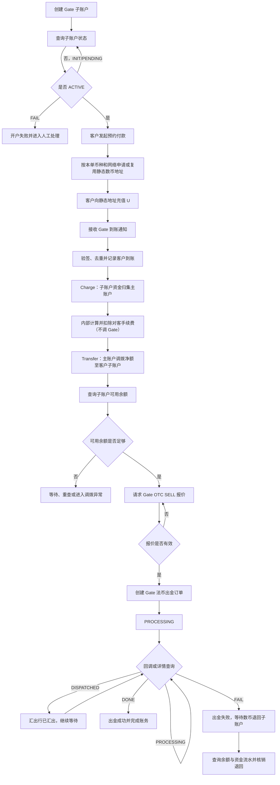
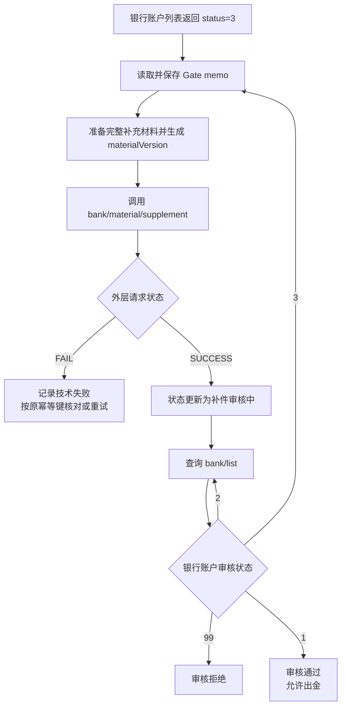

# Gate 渠道对接方案与改造点

> 文档状态：待评审
>
> 需求主体：支付产品、渠道接入、交易、账务、运营
>
> 适用范围：Gate 机构子账户、静态数币地址收款、主子账户资金归集与调拨、OTC 报价、法币出款及退回资金处理
>
> 系统边界：包含 BB/EX 核心、Gate Adapter、Gate 主账户、Gate 子账户、静态地址、收款银行账户、账务与对账；不替代 Gate 商务合同、合规结论及银行最终清算规则
>
> 核心原则：Gate 的接口受理状态与业务结果状态必须分离；静态地址到账通知是入账事件主依据，余额查询是资金可用性校验与补偿对账手段；只有子账户净执行金额确认可用后才允许询价和创建出金订单

## 1. 本次更新结论

本次按已确认的实际操作流程更新 Gate 对接顺序：

1. 为客户创建 Gate 子账户并等待状态变为 `ACTIVE`。
2. 客户发起预约付款时，根据本单充值币种和网络申请或复用静态数币地址。
3. 静态地址收到 U 后，以 Gate 到账通知作为明确到账事件。
4. 将客户子账户收到的 U 归集至 Gate 主账户。
5. BB/EX 在主账户侧计算并扣除面向客户收取的手续费（内部账务逻辑，不调用 Gate 接口）。
6. 将实际需要执行出款的净数币金额从主账户调拨回客户 Gate 子账户。
7. 主动查询客户 Gate 子账户余额，确认净执行金额已成为可用余额。
8. 以客户 Gate 子账户身份获取 OTC 出金报价。
9. 使用有效报价创建法币出金订单。
10. 通过出金回调和出金订单详情查询更新状态。
11. `DISPATCHED` 仅表示汇出行已发起汇款，不作为最终成功；只有 `DONE` 才作为 Gate 出金成功终态。
12. 若收款行拒收并导致订单 `FAIL`，Gate 确认数币资金退回子账户余额；系统还需通过余额及资金流水完成退回资金核销。

## 2. 术语和账户定位

| 术语        | 定义                                                                                            |
| ----------- | ----------------------------------------------------------------------------------------------- |
| Gate 主账户 | BB/EX 在 Gate 的机构主账户，用于资金归集、手续费留存和对子账户调拨                              |
| Gate 子账户 | 按商户/机构代理关系创建的 Gate 账户，是静态地址、银行账户和出金订单的业务归属账户               |
| 静态地址    | 为客户分配并长期绑定的数币收款地址                                                              |
| 到账通知    | Gate 对静态地址成功收款发送的异步通知，`bizType=PAY_FIXED_ADDRESS`、`bizStatus=PAY_SUCCESS` |
| 归集        | 定期归集                                                                                        |
| 净执行金额  | 客户实收数币扣除 BB/EX 对客手续费后，实际用于 Gate OTC 出金的数币金额                           |
| Charge      | Gate 机构代扣接口；由机构发起，从指定账户扣款，用于子账户向主账户归集                           |
| Transfer    | Gate 机构划转接口；由机构/子账户向指定账户转账，用于主账户向客户子账户调拨净执行金额            |
| 报价        | Gate 针对数币卖出、法币买入返回的短时有效报价，创建出金订单必须使用有效`quoteToken`           |
| 接口状态    | 外层`status=SUCCESS/FAIL`，仅说明接口请求是否成功受理或处理                                   |
| 业务状态    | `data.status` 或查询接口返回的对象状态，决定子账户、银行账户或出金订单是否真正成功            |

## 4. 整体业务流程



## 5. 接口调用总顺序

### 5.1 一览表

| 顺序 | 业务节点           | 必须调用的 Gate 接口/事件                                | 调用目的                                        | 放行条件                                                      |
| ---- | ------------------ | -------------------------------------------------------- | ----------------------------------------------- | ------------------------------------------------------------- |
| 1    | 商户 Gate 开户     | `POST /merchant/open/institution/v1/accounts/create`   | 创建 Gate 子账户                                | 外层`SUCCESS` 且保存 `request_id`；不可直接认为开户完成   |
| 2    | 查询开户结果       | `GET /merchant/open/institution/v1/accounts/query`     | 查询子账户真实状态                              | `data.status=ACTIVE`                                        |
| 3    | 创建或复用静态地址 | 机构静态地址创建接口                                     | 客户发起预约付款时，为本单取得充值地址          | 子账户`ACTIVE`，地址与本单币种、网络及子账户绑定            |
| 4    | 静态地址到账       | Gate 静态地址到账通知                                    | 获取明确到账事件                                | 验签成功、`PAY_FIXED_ADDRESS/PAY_SUCCESS`、通知未重复       |
| 5    | 主动核对到账       | 子账户余额查询、静态地址订单/资金流水查询                | 补偿查询和对账                                  | 不替代到账通知；异常时核对地址、币种、金额、交易哈希          |
| 6    | 子账户资金归集     | `POST /transfer/open/institution/v1/pay/charge`        | 从客户子账户扣划到账总额至主账户                | 同步返回成功，并保存唯一`merchantBatchNo`                   |
| 7    | 计算对客手续费     | BB/EX 内部费用与账务服务（非 Gate 接口）                 | 内部账务计算客户手续费和净执行额，不调用 Gate   | `gross = customerFee + netExecution`                        |
| 8    | 主账户调拨净额     | `POST /transfer/open/institution/v1/pay/transfer`      | 从主账户向客户子账户调拨净执行额                | 同步返回成功，并保存唯一`merchantBatchNo`                   |
| 9    | 校验子账户余额     | 子账户余额查询接口                                       | 确认出金数币余额已可用                          | 指定币种`available >= netExecutionCryptoAmount`             |
| 10   | OTC 报价           | `POST /withdraw/open/otc/api/v1/quote` 或机构版本      | 获取`quoteToken`、有效期、数币/法币金额和汇率 | `type=SELL`，报价未过期                                     |
| 11   | 创建银行账户       | `POST /withdraw/open/otc/api/bank/create`              | 创建法币收款银行账户                            | 外层`SUCCESS` 仅表示请求成功，继续查询审核状态              |
| 12   | 查询银行账户       | `GET /withdraw/open/otc/api/bank/list`                 | 获取实际审核结果                                | `status=1` 才允许出金                                       |
| 13   | 银行账户补件       | `POST /withdraw/open/otc/api/bank/material/supplement` | 提交 Gate 要求的补充材料                        | 外层成功后继续查询银行账户列表                                |
| 14   | 创建出金订单       | `POST /withdraw/open/otc/api/order/create` 或机构版本  | 使用有效报价发起法币出金                        | 外层`SUCCESS` 且保存 `orderId`，内层通常为 `PROCESSING` |
| 15   | 查询出金结果       | `GET /withdraw/open/otc/api/order/detail`              | 查询真实订单状态                                | 轮询至`DONE` 或 `FAIL`；`DISPATCHED` 继续等待           |
| 16   | 出金状态回调       | Gate OTC 订单状态通知                                    | 实时更新订单                                    | 验签、去重、合法状态迁移                                      |
| 17   | 失败退回核销       | 子账户余额查询 + 资金流水                                | 确认拒收后数币是否退回                          | 退回金额、币种和关联订单核对一致                              |

 |

## 6. 分节点详细设计

### 6.1 节点 A：创建 Gate 子账户

接口：

```http
POST /merchant/open/institution/v1/accounts/create
```

处理规则：

- 外层 `status=SUCCESS/FAIL` 是接口请求状态。
- 创建请求成功后，内层业务状态首先返回 `INIT`。
- 保存 `request_id`、`customer_id`、机构代理商 ID、商户 MID 和请求快照。
- 使用查询接口获取真实开户结果，不因创建接口返回 `SUCCESS` 直接开放后续业务。

查询接口：

```http
GET /merchant/open/institution/v1/accounts/query
```

状态：

| Gate 状态   | 含义     | 系统动作                                   |
| ----------- | -------- | ------------------------------------------ |
| `INIT`    | 已初始化 | 保持处理中并轮询                           |
| `PENDING` | 处理中   | 保持处理中并轮询                           |
| `ACTIVE`  | 已创建   | 保存`account_id`，允许创建地址和银行账户 |
| `FAIL`    | 创建失败 | 记录原因，禁止进入 Gate 业务               |

### 6.2 节点 B：客户发起预约付款时申请或复用静态数币地址

推荐机构接口：

```http
POST /payment/open/institution/v1/pay/fixedaddress/save
X-GatePay-On-Behalf-Of: {gateSubAccountId}
```

要求：

- 子账户必须为 `ACTIVE`。
- 触发节点为客户创建预约付款商户单之后、页面展示充值信息之前。
- 地址按“机构代理商 ID + 商户 MID + Gate 子账户 + 币种 + 网络”幂等创建或复用。
- 已存在有效地址时直接复用；不存在有效地址时才调用 Gate 创建。
- 保存地址、币种、网络、Gate 子账户 ID、回调地址和创建时间。
- 地址不因客户订单结束而删除；禁用或重新分配必须保留历史。

### 6.3 节点 C：静态地址到账确认

主事件：

```text
bizType = PAY_FIXED_ADDRESS
bizStatus = PAY_SUCCESS
```

关键字段：

- `bizId`
- `transactionId`
- `accountId`
- `address`
- `currency`
- `amount`
- `chain`
- `txHash`
- `transactionTime`

处理规则：

1. 验证 Gate 回调签名与时间戳。
2. 使用 `transactionId` 或 `bizId` 防重。
3. 校验 `accountId` 是否为预期 Gate 子账户。
4. 校验地址、币种和网络是否匹配。
5. 以 `transactionTime` 记录渠道到账时间，以系统接收时间记录通知时间。
6. 生成或更新充币渠道单和内部入账记录。
7. 只有成功通知完成验签和幂等处理后，才触发归集任务。

到账时间口径：

- 业务明确到账时间以 Gate 成功到账通知为准。
- 主动余额查询用于确认余额是否已可用、补偿回调延迟或对账差异。
- 余额增长本身不能唯一关联某一笔静态地址交易，不能替代 `transactionId/txHash` 级别的到账记录。

### 6.4 节点 D：子账户资金归集主账户

若资金已进入客户 Gate 子账户，归集至主账户应使用机构代扣接口：

```http
POST /transfer/open/institution/v1/pay/charge
```

建议语义：

- `X-GatePay-On-Behalf-Of`：发起归集的机构主账户。
- `accountId`：被扣款的客户 Gate 子账户。
- `currency`：到账币种。
- `amount`：客户实际到账总额。
- `merchantBatchNo`：BB/EX 生成的唯一归集批次号。

处理规则：

- Charge 当前为同步接口，成功响应表示本次扣款执行结果已确定。
- 相同业务重试必须复用相同 `merchantBatchNo`。
- 请求超时不得使用新批次号直接重试；先通过 Charge 历史记录/资金流水核对。
- 归集成功后在账务记录主账户增加、子账户减少，并关联原静态地址交易。

### 6.5 节点 E：扣除对客手续费

该节点为 BB/EX 内部处理，不调用 Gate 报价接口。

处理规则：

- 根据商户费率版本计算 `customerFeeAmount`。
- 费率取创建业务单或到账时已约定的快照，禁止执行时临时覆盖。
- 计算 `netExecutionCryptoAmount`。
- 费用结果经精度和最小金额校验后，才能发起主账户到子账户的净额调拨。
- 对客手续费与 Gate 后续返回的 `tradeFee` 分开核算。

### 6.6 节点 F：主账户调拨净额至子账户

接口：

```http
POST /transfer/open/institution/v1/pay/transfer
```

关键字段：

- `X-GatePay-On-Behalf-Of`：付款方 Gate 主账户 ID。
- `accountId`：收款方客户 Gate 子账户 ID。
- `currency`：用于出金的数币币种。
- `amount`：`netExecutionCryptoAmount`。
- `merchantBatchNo`：BB/EX 生成的唯一调拨批次号。

处理规则：

- Transfer 当前为同步接口，返回最终执行结果。
- 成功后仍需保存资金流水，并在出金前查询子账户可用余额。
- 失败时不得进入报价和出金。
- 超时或响应丢失时，先通过 Transfer Record Query 或资金流水按原 `merchantBatchNo` 核对。

### 6.7 节点 G：查询子账户余额

用户已与 Gate 确认可主动查询余额。机构场景推荐：

```http
GET /payment/open/institution/v1/pay/balance/query
X-GatePay-On-Behalf-Of: {gateSubAccountId}
```

Gate 通用文档路径：

```http
GET /v1/pay/balance/query
```

判断规则：

```text
目标币种 available >= netExecutionCryptoAmount
```

注意：

- `status=SUCCESS` 只表示查询成功。
- 实际可用金额读取 `data.balance_list[].available`。
- 查询结果必须确认币种、账户主体和查询时间。
- 余额不足时按退避策略重查；超过阈值进入调拨异常，不得创建报价或出金。

### 6.8 节点 H：获取 OTC 出金报价

标准接口：

```http
POST /withdraw/open/otc/api/v1/quote
```

机构接口：

```http
POST /withdraw/open/institution/otc/api/v1/quote
X-GatePay-On-Behalf-Of: {gateSubAccountId}
```

请求要求：

- `type=SELL`：数币卖出、法币出金。
- `cryptoCurrency`：如 USDT/USDC。
- `fiatCurrency`：当前 Gate 文档示例为 USD。
- `side=CRYPTO`：以净执行数币金额询价。
- `side=FIAT`：以目标法币金额反算数币金额。
- `cryptoAmount` 与 `fiatAmount` 按 `side` 传入，不得同时产生歧义。

保存字段：

- `quoteToken`
- `validPeriod`
- `cryptoAmount`
- `fiatAmount`
- `fiatRate`
- `cryptoRate`
- 请求时间、失效时间、Gate 子账户 ID

报价过期后必须重新询价，不得沿用旧 `quoteToken`。

### 6.9 节点 I：创建和审核银行账户

创建接口：

```http
POST /withdraw/open/otc/api/bank/create
```

创建接口外层 `status=SUCCESS/FAIL` 只代表请求状态。真实审核结果通过：

```http
GET /withdraw/open/otc/api/bank/list
```

银行账户状态：

| `status` | 含义       | 是否允许出金 |
| ---------- | ---------- | ------------ |
| `1`      | 审核通过   | 是           |
| `2`      | 待审核     | 否           |
| `3`      | 待补充材料 | 否           |
| `99`     | 拒绝       | 否           |

`status=3` 时进入下一节点“银行账户补件”；`status=99` 时终止当前审核流程，是否允许重新提交需按 Gate 审核意见处理。

### 6.10 节点 J：银行账户补件

触发条件：

- `GET /withdraw/open/otc/api/bank/list` 返回银行账户 `status=3`；
- Gate `memo` 明确返回待补充内容；
- 当前银行账户未删除、未失效且允许继续补件。

标准商户接口：

```http
POST /withdraw/open/otc/api/bank/material/supplement
```

机构子账户场景：

```http
POST /withdraw/open/institution/otc/api/bank/material/supplement
X-GatePay-On-Behalf-Of: {gateSubAccountId}
```

补件前校验：

- Gate 子账户为 `ACTIVE`；
- `bankAccountId` 与本次商户、机构代理商和 Gate 子账户匹配；
- 本地银行账户状态为“待补充材料”；
- 补充材料覆盖 Gate `memo` 中要求的内容；
- 材料已完成本地权限、格式和安全校验；
- 本次补件生成新的 `materialVersion`；
- 操作人具备银行账户补件权限。

补件请求至少关联：

| 字段                 | 说明                             |
| -------------------- | -------------------------------- |
| `bankAccountId`    | Gate 银行账户 ID                 |
| `gateSubAccountId` | 银行账户所属 Gate 子账户         |
| `materialVersion`  | 本次完整材料版本                 |
| `memoSnapshot`     | 触发本次补件的 Gate 原始要求快照 |
| `materialFiles`    | 本次提交的完整材料集合           |
| `operatorId`       | 补件操作人                       |
| `correlationId`    | 请求、查询和审计链路 ID          |

补件提交处理：

- 外层成功后不能直接把银行账户改为通过。
- 外层 `status=SUCCESS` 仅表示补件接口请求成功，内部状态更新为“补件已提交/审核中”。
- 外层 `status=FAIL` 时保存错误码和错误信息；结果明确失败后才允许按权限重新提交。
- 每次材料提交保存完整材料快照、材料版本、操作人、请求时间、响应时间和 Gate 原始响应。
- 同一 `bankAccountId + materialVersion` 作为补件幂等键，结果未知时不得创建新材料版本盲目重提。

补件提交后重新调用：

```http
GET /withdraw/open/otc/api/bank/list
```

补件结果：

| Gate 状态 | 内部状态   | 后续动作                       |
| --------- | ---------- | ------------------------------ |
| `1`     | 审核通过   | 允许进入法币出金               |
| `2`     | 补件审核中 | 继续查询                       |
| `3`     | 仍待补件   | 更新`memo`，生成新的补件任务 |
| `99`    | 审核拒绝   | 终止当前审核流程，保存拒绝原因 |

补件状态闭环：



### 6.11 节点 K：创建法币出金订单

接口：

```http
POST /withdraw/open/otc/api/order/create
```

机构场景使用机构路径并带目标子账户请求头。

创建前必须同时满足：

- Gate 子账户 `ACTIVE`；
- 银行账户审核状态为 `1`；
- 子账户目标数币可用余额充足；
- 报价未过期；
- `quoteToken`、币种、金额与保存的报价一致；
- BB/EX 业务单未被取消、关闭或重复执行；
- 幂等键 `clientOrderId` 未用于其他业务。

关键请求字段：

- `quoteToken`
- `bankAccountId`
- `cryptoCurrency`
- `fiatCurrency`
- `cryptoAmount`
- `fiatAmount`
- `type=SELL`
- `clientOrderId`

响应处理：

- 外层 `status=SUCCESS/FAIL` 是接口请求状态。
- 外层成功后保存 Gate `orderId`。
- 内层初始状态通常为 `PROCESSING`，不能在此时把商户单更新为付款成功。

### 6.12 节点 L：查询出金状态

接口：

```http
GET /withdraw/open/otc/api/order/detail
```

可按 `orderId` 或 `clientOrderId` 查询。

状态映射：

| Gate 状态      | Gate 含义 | 内部渠道单状态 | 商户业务状态    | 后续动作                   |
| -------------- | --------- | -------------- | --------------- | -------------------------- |
| `PROCESSING` | 处理中    | 处理中         | 付款处理中      | 继续等待回调或查询         |
| `DISPATCHED` | 已出款    | 已汇出         | 付款处理中      | 汇出行已发起，不判最终成功 |
| `DONE`       | 提现成功  | 成功           | 付款成功        | 完成账务和通知             |
| `FAIL`       | 提现失败  | 失败           | 失败/退款处理中 | 查询退回余额和资金流水     |

出款成功口径：

- `DISPATCHED` 仅代表汇出行已发起汇出，不代表收款行已最终接受或收款人已最终入账。
- 本系统以 Gate `DONE` 作为渠道出金成功终态。
- 若业务需要“收款人银行账户已入账”的强证明，需 Gate 另行确认 `DONE` 的清算语义及是否提供收款行确认字段。

### 6.13 节点 M：收款行拒收和资金退回

已确认口径：汇出行没汇出，退回本金，手续费不退，若要退，联系对方手动操作
需要在op 操作失败的时候先跟对方要求退回手续费；

若收款行拒收导致法币出款失败，Gate 会人工操作退款，需要跟对方联系哪里通知

系统处理：

1. 出金订单进入 `FAIL`。
2. 内部订单进入“退款处理中”，而不是立即记作退款完成。
3. 查询客户 Gate 子账户目标币种余额。
4. 查询 Gate 资金流水，定位与原出金订单关联的退回记录。
5. 核对退回币种、退回金额、Gate 费用及时间。
6. 核销成功后更新为“资金已退回”。
7. 根据 BB/EX 规则决定重新询价出款、退回客户或人工处理。

待 Gate 确认：

- `FAIL` 与退回余额入账是否同步；
- 退回资金流水的业务类型和原订单关联字段；
- 退回金额是否扣除 Gate 已产生费用；
- `DISPATCHED` 后拒收最终返回 `FAIL`，还是会出现独立退票/退回事件。

## 8. 幂等、签名与查询补偿

### 8.1 幂等键

| 场景          | 幂等键                                                |
| ------------- | ----------------------------------------------------- |
| 创建子账户    | Gate`request_id` + 内部商户/机构代理商唯一关系      |
| 静态地址到账  | `transactionId`，兜底 `bizId + txHash`            |
| Charge 归集   | `merchantBatchNo`                                   |
| Transfer 调拨 | `merchantBatchNo`                                   |
| OTC 报价      | 不复用过期`quoteToken`；保存业务报价请求 ID         |
| 创建出金      | `clientOrderId`                                     |
| Gate 回调     | 回调事件 ID；无事件 ID 时使用订单号 + 状态 + 更新时间 |
| 银行账户补件  | 银行账户 ID + 材料版本                                |

### 8.2 签名

- 统一由 Gate Adapter 生成：
  - `X-GatePay-Certificate-ClientId`
  - `X-GatePay-Timestamp`
  - `X-GatePay-Nonce`
  - `X-GatePay-Signature`
  - `X-GatePay-On-Behalf-Of`（机构代子账户场景）
- 前端和业务服务不得直接持有 Gate 密钥。
- 回调验签失败、时间戳超限或重复通知时不得更新资金和订单。

### 8.3 查询补偿

- 子账户创建：创建响应后轮询 `accounts/query`。
- 静态地址到账：以回调为主；通过地址订单、链上详情、余额和资金流水补偿。
- Charge/Transfer：同步返回最终执行结果；响应丢失时按原 `merchantBatchNo` 查询历史记录，禁止换新批次盲重试。
- OTC 出金：回调和 `order/detail` 双通道；定时扫描 `PROCESSING/DISPATCHED`。
- 资金退回：订单 `FAIL` 后轮询余额和资金流水，直到完成核销或进入人工超时。

## 9. 核心字段

| 字段                           | 必填           | 来源           | 规则                                |
| ------------------------------ | -------------- | -------------- | ----------------------------------- |
| `merchantId`                 | 是             | BB/EX          | 商户唯一标识                        |
| `institutionAgentId`         | 是             | BB/EX          | 与商户、Gate 子账户全链路关联       |
| `gateSubAccountRequestId`    | 是             | BB/EX          | 创建子账户幂等键                    |
| `gateSubAccountId`           | ACTIVE 后必填  | Gate           | 不可覆盖                            |
| `gateSubAccountStatus`       | 是             | Gate 查询      | `INIT/PENDING/ACTIVE/FAIL`        |
| `staticAddress`              | 地址创建后必填 | Gate           | 与子账户、币种、网络绑定            |
| `depositTransactionId`       | 到账后必填     | Gate 通知      | 到账幂等主键                        |
| `depositTxHash`              | 到账后必填     | Gate 通知      | 链上核对                            |
| `grossReceivedAmount`        | 到账后必填     | Gate 通知      | 客户实际到账总额                    |
| `customerFeeAmount`          | 是             | BB/EX 费用服务 | 对客手续费                          |
| `netExecutionCryptoAmount`   | 是             | BB/EX          | 总额减对客手续费                    |
| `chargeBatchNo`              | 归集时必填     | BB/EX          | 子账户到主账户归集幂等键            |
| `transferBatchNo`            | 调拨时必填     | BB/EX          | 主账户到子账户调拨幂等键            |
| `subAccountAvailableBalance` | 出金前必填     | Gate           | 查询时间点的可用余额                |
| `quoteToken`                 | 出金时必填     | Gate 报价      | 必须在有效期内                      |
| `quoteExpireTime`            | 是             | Gate 报价      | 过期必须重新报价                    |
| `gateBankAccountId`          | 出金时必填     | Gate           | 银行账户状态必须为`1`             |
| `clientOrderId`              | 是             | BB/EX          | Gate 出金幂等键                     |
| `gateOrderId`                | 创建成功后必填 | Gate           | 用于详情查询和对账                  |
| `gateOrderStatus`            | 是             | Gate           | `PROCESSING/DISPATCHED/DONE/FAIL` |
| `gateTradeFee`               | 返回后必填     | Gate           | 与对客手续费分开                    |
| `gateFinalFiatAmount`        | 终态后必填     | Gate           | 最终法币结算金额                    |
| `returnReconcileStatus`      | 失败后必填     | BB/EX          | `PENDING/CONFIRMED/EXCEPTION`     |
| `correlationId`              | 是             | BB/EX          | 串联请求、回调、账务和日志          |

## 10. 状态映射

### 10.1 子账户

| Gate 状态   | 内部状态   | 是否可用 |
| ----------- | ---------- | -------- |
| `INIT`    | 初始化中   | 否       |
| `PENDING` | 开户处理中 | 否       |
| `ACTIVE`  | 已开通     | 是       |
| `FAIL`    | 开户失败   | 否       |

### 10.2 银行账户

| Gate 状态 | 内部状态   | 是否可出金 |
| --------- | ---------- | ---------- |
| `1`     | 审核通过   | 是         |
| `2`     | 审核中     | 否         |
| `3`     | 待补充材料 | 否         |
| `99`    | 已拒绝     | 否         |

## 11. 异常场景

| 场景                                  | 处理要求                                                     |
| ------------------------------------- | ------------------------------------------------------------ |
| 创建子账户外层 SUCCESS、内层 INIT     | 保持处理中，查询至 ACTIVE/FAIL                               |
| 子账户查询超时                        | 状态置为未知，不创建地址或出金                               |
| 到账通知重复                          | 幂等返回成功，不重复入账或归集                               |
| 到账通知丢失但余额增加                | 使用静态地址订单/链上详情/资金流水核对，不只凭余额生成到账单 |
| Charge 超时                           | 使用原批次号查询，不以新批次号重试                           |
| 对客手续费计算失败                    | 不回拨净额，不发起报价                                       |
| Transfer 成功但余额暂未可用           | 退避重查余额，超时进入人工对账                               |
| 可用余额小于净执行额                  | 阻断报价和出金，检查调拨、冻结和并发占用                     |
| 报价过期                              | 重新报价，旧 token 作废                                      |
| 银行账户状态非 1                      | 阻断出金；状态 3 进入补件                                    |
| 创建出金外层 SUCCESS、内层 PROCESSING | 仅标记处理中，等待回调/详情                                  |
| 出金状态 DISPATCHED                   | 保持付款处理中，不向客户展示最终成功                         |
| 出金 FAIL                             | 进入退款处理中，核对余额和资金流水                           |
| FAIL 后未发现退回                     | 超时告警并升级 Gate，不虚构退款完成                          |
| 回调与查询状态冲突                    | 按 Gate 状态机和更新时间处理，终态不得倒退                   |
| 收款行拒收                            | 记录失败原因、退回金额、Gate 费用和核销结果                  |

## 13. 验收标准

1. 子账户创建接口返回 `SUCCESS/INIT` 时，系统不会错误标记为已开通。
2. 只有 `accounts/query` 返回 `ACTIVE` 才允许创建静态地址及进入资金流程。
3. 静态地址到账通知通过验签和幂等后，系统只生成一次入账和归集任务。
4. 系统以到账通知作为明确到账事件，同时支持余额和资金流水补偿核对。
5. 子账户到账总额通过 Charge 归集主账户，且归集批次可查询和审计。
6. 对客手续费和 Gate 渠道费用分别记账。
7. 主账户只向客户子账户回拨净执行数币金额。
8. Transfer 成功后，系统必须查询子账户余额，余额不足时不能获取报价或创建出金。
9. OTC 报价使用 `type=SELL`，保存 token、有效期、金额和汇率；过期后重新报价。
10. 银行账户创建或补件接口外层成功不会直接把账户标为审核通过。
11. 只有银行账户列表状态为 `1` 才允许创建出金订单。
12. 创建出金订单返回 `PROCESSING` 时，商户单保持付款处理中。
13. `DISPATCHED` 不作为最终成功；只有 `DONE` 更新为付款成功。
14. `FAIL` 后订单进入资金退回核销流程，未确认余额和流水前不展示“资金已退回”。
15. 所有写接口、回调和资金操作均具备幂等、签名、审计和查询补偿能力。
16. 机构调用能够证明请求实际作用于目标 Gate 子账户，不发生跨商户资金操作。

## 15. Gate 官方接口参考

- [查询商户支付账户余额](https://docs.gate.com/api-reference/version/100/cn/endpoint/common/balanceQuery)
- [机构子账户余额查询](https://docs.gate.com/api-reference/version/100/en/endpoint/institution/common/balanceQuery)
- [机构账户划转](https://docs.gate.com/api-reference/version/100/cn/endpoint/institutional/transfer)
- [机构账户代扣](https://docs.gate.com/api-reference/version/100/en/endpoint/institutional/charge)
- [机构子账户查询](https://docs.gate.com/api-reference/version/100/cn/endpoint/institutional/query)
- [创建静态收款地址](https://docs.gate.com/api-reference/version/100/cn/endpoint/fixedaddress/save)
- [静态地址到账通知](https://docs.gate.com/api-reference/version/100/en/endpoint/fixedaddress/fixedAddressPaymentNotify)
- [OTC 报价](https://docs.gate.com/api-reference/version/100/cn/endpoint/otc/quote)
- [创建银行账户](https://docs.gate.com/api-reference/version/100/en/endpoint/otc/bank-create)
- [查询银行账户列表](https://docs.gate.com/api-reference/version/100/en/endpoint/otc/bank-list)
- [银行账户补充材料](https://docs.gate.com/api-reference/version/100/en/endpoint/otc/bank-material-supplement)
- [创建 OTC 出金订单](https://docs.gate.com/api-reference/version/100/en/endpoint/otc/withdraw-create)
- [查询 OTC 出金订单详情](https://docs.gate.com/api-reference/version/100/en/endpoint/otc/withdraw-detail)
- [OTC 订单状态通知](https://docs.gate.com/api-reference/version/100/en/endpoint/otc/callback)
