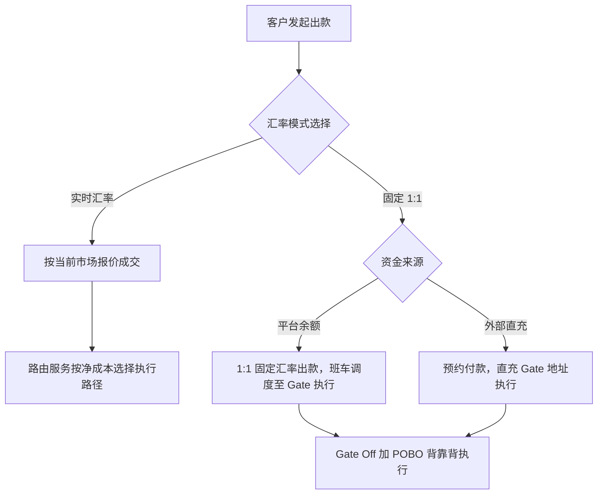

# 出款路由 V2 PRD（含产品矩阵）

> 文档状态：待评审
> 版本定位：V2，主题为**客户分层 + 路由**；V1（预约付款 V1.1）的主题是资金安全与跑通 Gate 全链路
> 适用范围：商户数币卖出、承兑与法币出款
> 关联文档：《预约付款-V1.1-BB单客户直通执行版PRD》《汇率选择出款PRD》《Gate渠道对接方案与改造点》
> 核心原则：对客报价与渠道执行分离，客户不感知渠道；1:1 为开通制产品、背靠背锁定 Gate，平台不承担汇率敞口；实时汇率产品自由路由、平台净成本最优；1:1 对客定价受市场约束（当前市场报价万15–17），分流由点差行情自然完成，不做人为价格挡量；客户静止余额不放交易所

## 1. 背景与版本目标

版本分工：

| 版本 | 主题 | 说明 |
| --- | --- | --- |
| V1（预约付款 V1.1） | **资金安全 + 跑通 Gate 全链路** | Gate 为新对接渠道，以单客户、直充预付、直通执行验证充币、数换法、POBO 全链路；以"到账不上账、资金不沉淀、限额硬顶"确立资金安全模型 |
| V2（本文档） | **客户分层 + 路由** | 链路验证完成后进入经营期：产品矩阵、客户分层、净成本路由，实现平台收益最优 |

V2 目标：

1. 建设**客户分层经营模型**：1:1 为开通制产品，仅向战略层客户开放；标准层客户仅见实时汇率报价，订单由平台按净成本路由（常态走 Gate），点差进项归平台。
2. 建设**出款产品矩阵**：实时汇率出款、1:1 固定汇率出款、预约付款（归位为 1:1 产品的直充模式）。
3. 建设**净成本路由能力**：将市场汇率（点差）作为实时路由因子，实时汇率订单在多渠道间按平台净成本最优自动选路。
4. 明确 **1:1 产品的风险边界**：背靠背锁定 Gate 执行、额度制、脱锚分级熔断，平台不裸扛汇率期权风险。
5. 继承 V1.1 托管分层原则：Cobo 收币、Cactus 金库、渠道仅执行；引入班车调度替代人工清扫；定义 Gate 稳定后的有限托管演进路径（见 3.4）。

## 2. 产品矩阵

### 2.1 三产品定位

| 产品 | 对客汇率 | 汇率风险承担方 | 路由 | 时效 | 定位 |
| --- | --- | --- | --- | --- | --- |
| 实时汇率出款 | 市场实时报价（客户吃点差） | 客户 | **自由路由**（净成本最优） | 即时发起 | 全量客户可见；卖时效；标准层客户的唯一产品 |
| 1:1 固定汇率出款 | 固定 1:1 | Gate（背靠背） | **锁定 Gate**，不参与净成本路由 | T+0.5 班车 | **开通制**（仅战略层客户）；对标市场价的获客产品 |
| 预约付款（直充模式） | 固定 1:1 | Gate（背靠背） | 锁定 Gate | 充值到账后执行 | 1:1 产品的直充预付形态，与固定汇率出款共享额度与熔断 |

### 2.2 产品间关系与选择逻辑



分流由市场点差状态自然完成，不做人为价格挡量（分流点差公式见 7.3）：

| 点差区间 | 客户理性选择 | 平台应对 |
| --- | --- | --- |
| s < 万3（USDT 强锚定期） | 实时汇率 | 量自然回承兑商链路，Gate 敞口自动回落 |
| 万3 ≤ s < 万20（常态） | 1:1（市场价占优） | 量向 Gate 集中是预期结果，敞口由结构与额度管理 |
| s ≥ 万20（脱锚） | 涌向 1:1 | L1–L3 分级收紧/停售，跟随市场调价 |

客户利益与平台路由同向摆动：点差收窄时客户选实时、平台路由也该走承兑商；点差常态/走阔时客户选 1:1、平台本就该走 Gate。

### 2.3 1:1 产品的期权本质与经营纪律（重要）

1:1 固定汇率产品对客户等价于一份"按平价卖出 USDT 的权利"——客户必然在脱锚大时集中行权（逆向选择），这是产品本质而非缺陷。经营纪律：

1. **100% 背靠背**：1:1 订单必须全部路由 Gate 执行，禁止合成（平台贴点差走其他渠道）；平台在该产品上的汇率敞口恒为零。
2. **额度制**：客户级 + 平台级 1:1 日额度，额度总量与 Gate 商务约定的 1:1 承接量挂钩；额度用尽后当日停售新单。
3. **可停售条款**：对客协议明确平台可随时暂停 1:1 新单（已创建订单照常履约）；Gate 撤价或限量时立即触发。
4. **定价纪律**：1:1 对客定价对标市场（见第 7 节），不得低于渠道成本；脱锚期跟随市场调价，不做固定承诺价。

### 2.4 客户分层（V2 核心）

分层的本质是**对客报价与渠道执行分离**（principal 模式）：1:1 产品的可见性即分层工具，不需要独立分层系统。

| 客户层 | 可见产品与报价 | 实际路由 | 单笔毛利示例（$100K，点差万15） | 定位 |
| --- | --- | --- | --- | --- |
| 战略层（有议价力/比价客户） | 实时 + 1:1（万16 基准） | 1:1 订单背靠背 Gate | ≈ 万1 + $15 ≈ $25 | 抢市场、防流失 |
| 标准层（价格不敏感/存量惯性） | 仅实时（万13–14） | 净成本路由，常态走 Gate 捕获点差 | ≈ 万14 + $15 ≈ $155 | **利润引擎** |

分层规则：

1. 分层实现 = 产品开通配置（1:1 为 OA 开通制）；未开通客户界面不展示 1:1 入口与报价。
2. 对客承诺完全兑现：标准层按实时报价成交，渠道选择为平台内部事项，价差按单记入 fx_pnl。
3. **升层机制**：客户提出比价或出现流失前兆时，销售可发起升层审批（审批线预定义）开通 1:1；升层损失点差毛利、保住客户。
4. **流失监控**：标准层客户流水环比异常下降告警（被竞品 1:1 撬走的信号）。
5. 经营认知：标准层点差利润是竞争渗透前的过渡性收益，随市场 1:1 普及会自然收敛；中期利润靠 Gate 采购价谈判（见 7.5）。

## 3. 开通条件

### 3.1 实时汇率出款

沿用现有产品开通，无新增条件；存量客户默认可用。

### 3.2 1:1 固定汇率出款 / 预约付款

| 条件 | 要求 | 说明 |
| --- | --- | --- |
| 产品开通 | OA 审批 + Gate 子商户报备成功 | 沿用 V1.1 开通流程 |
| Off 执行 | 必须走 Gate | 背靠背对冲的执行前提，硬性条件 |
| 收款账户 | 同名 + 账户证明信 + Gate 报备成功 | 沿用 V1.1（同名限制放开与否见待确认事项） |
| 钱包托管 | 见 3.3 | 取决于 Gate 商务条件 |
| 额度 | 客户级日额度必配 | 开通时配置 |

### 3.3 钱包托管的两种模式（待与 Gate 商务确认后二选一）

| 模式 | 前提 | 资金安全 | 说明 |
| --- | --- | --- | --- |
| 模式 A：Cactus 托管 + 班车调拨（推荐） | Gate 的 1:1 报价不以钱包沉淀为商务条件 | 客户静止余额不在交易所，Gate 敞口 = 班次在途 | 完全继承 V1.1 安全模型 |
| 模式 B：Gate 托管 | Gate 要求资金盘子/沉淀作为 1:1 对价 | 敞口回升，需以"1:1 客户余额上限 + 双向阈值外提 + 敞口硬顶"对冲 | 仅在商务谈判无法达成模式 A 时采用，限额规则另行补充 |

本文档默认按模式 A 编写。

### 3.4 托管演进路径：有限托管（V2 后期，可选）

Gate 运行稳定可以证明执行可靠性，但不改变托管风险的性质（冻结、破产等尾部风险与运行表现无关）。普通交易钱包配置到 Gate 不作为稳定性的自动升级，而是按以下约束逐客户开启的**有限托管**：

1. **适用对象**：1:1/预约付款出款占比 > 80% 的战略层客户，按客户级配置钱包供应商为 Gate（省 Cobo 万5 + 调拨万1，免班车即到即付）；混合使用或余额沉淀型客户保持 Cobo，否则实时出款需反向调拨，成本时效双输。
2. **工作余额上限**：客户 Gate 钱包余额上限 = 近 30 日日均出款量 × 2 天（可配），超限自动 sweep 至 Cactus；只放周转资金，不放沉淀。
3. **触发门槛**（全部满足并评审，不随时拍板）：Gate 运行 ≥ 6 个月、累计执行量达标、出款成功率 ≥ 99.5%、零资金差错事故；**Gate 给出费率折扣等商务对价**（托管敞口必须换到真金白银）；托管协议完成子账户资产隔离条款法务确认。
4. **退出预案先行**：一键将客户钱包配置切回 Cobo（入金地址轮换 T+0 生效）；存量 Gate 余额应急外提 SOP 与演练。

## 4. 净成本路由模型（实时汇率产品）

### 4.1 渠道执行汇率是路由输入，不是常量

每个渠道对外提供"执行汇率报价"：承兑商 = 市场实时价（波动）；Gate = 1:1（当前固定）。**Gate 的 1:1 建模为渠道报价而非硬编码**——Gate 调价或撤价时路由自动适应，产品层不改造。

### 4.2 净成本公式

```
路径净成本 = 固定费 + 比例费 × 金额 + (对客成交汇率 − 渠道执行汇率) × 金额
路由决策 = 满足约束（时效 SLA、渠道可用、敞口余量、额度）下净成本最小的路径
```

第三项为汇率因子：对客按市场价成交、渠道按 1:1 执行时，该项为负（平台赚取点差）；反之为正（平台贴差）。路由不改变对客成交价：实时订单无论路由至哪条路径，客户均按报价成交，价差按单记入 fx_pnl（见 7.4）。

### 4.3 V2 两条执行路径与成本基线

| 路径 | 链路 | 显性成本 | 汇率因子 | 时效 |
| --- | --- | --- | --- | --- |
| 路径 1 | Cobo → Cactus → 承兑商 → SGB 下发 | 万5 + 万1 + 万6 + $50/笔 = 万12 + $50 | 客户承担点差，平台因子 ≈ 0 | 即时发起 |
| 路径 2 | Cobo → Cactus → Gate（Off 加 POBO） | 万5 + 万1 + 万15 + $35/笔 = 万21 + $35 | 平台赚取点差（对客市场价 − 渠道 1:1） | T+0.5 班车 |

共同段（Cobo → Cactus，万6）两路径一致，路由的真实比较发生在末段：路径 1 = 万6 + $50 + 点差归客户；路径 2 = 万15 + $35 − 点差归平台。

### 4.4 平衡点示例（单笔 100,000 USD，实时订单）

| 市场汇率 | 点差 | 路径 1 平台净成本 | 路径 2 平台净成本 | 最优 |
| --- | --- | --- | --- | --- |
| 0.9995 | 万5 | $110 | $185 − $50 = $135 | 路径 1 |
| 0.9985 | 万15 | $110 | $185 − $150 = $35 | 路径 2 |
| 0.9970 | 万30 | $110 | $185 − $300 = −$115（盈利） | 路径 2 |

说明：路径 1 中点差由客户承担，平台净成本稳定；路径 2 中平台以 1:1 低买、按市场价与客户结算，点差越大路径 2 越优，甚至转为盈利。**点差越大，实时订单越应走 Gate——与 1:1 产品的行为方向一致，Gate 承接量在脱锚时集中上升，因此第 6 节的额度与熔断必须覆盖两个产品的合计量。**

### 4.5 时效约束

1. 路径 2 依赖班车调度（Cactus → Gate 半天内到账），仅"客户接受班车时效的订单"或"Gate 侧有可用预置资金"时可选。
2. 实时订单默认时效承诺按路径 1；路由选择路径 2 时不得突破对客时效承诺，无法满足则回退路径 1。
3. 是否为点差捕获设置小额 Gate 预置资金池（运营池），作为独立决策项，见待确认事项。

### 4.6 路由稳定性

1. **滞回带**：路径切换需满足净成本差 ≥ 万2 且持续 ≥ 15 分钟（参数可配），避免平衡点附近行情抖动导致路由横跳。
2. **报价时效**：市场汇率源设定刷新频率与失效时间；报价失效期间路由降级为静态优先级（路径 1 优先）。
3. **快照**：每单保存路由输入快照——市场汇率、各路径净成本、约束命中情况、最终选路及原因码。

## 5. 资金链路与班车调度

### 5.1 托管分层（继承 V1.1）

| 层 | 载体 | 职责 |
| --- | --- | --- |
| 收币入口 | Cobo | 客户日常收币地址（V2 不切换） |
| 余额金库 | Cactus | 客户综合余额资金实体 |
| 执行通道 | 承兑商 / SGB / Gate | 仅承载在途执行资金 |

### 5.2 班车调度（替代 V1.1 人工清扫，双向）

```
去程（Cactus → Gate）：
  每日两班：11:00 截单 → 合并调拨 → 当日 17:00 前执行；17:00 截单 → 次日 11:00 前执行
  班次调拨金额 = Σ 本班次订单净需求，携带订单归属明细
回程（Gate → Cactus）：
  日终清扫：手续费、超额、退回、未认领资金批量归集主账户并外提
  日终校验：Gate 余额 ≈ 执行中在途，偏差进差错
```

1. 班次级调拨单必须携带订单级明细，批量金额可拆回单笔对账。
2. 预约付款（直充模式）不走去程班车，仅共用回程清扫。
3. 敞口口径与硬顶沿用 V1.1 第 3.5 节，计入班车在途。

## 6. 脱锚分级与熔断

以市场点差 spread（1 − 市场汇率）分级，同时约束实时产品的 Gate 路由和 1:1 产品：

| 级别 | 触发 | 实时产品 | 1:1 产品（含预约付款） |
| --- | --- | --- | --- |
| L0 正常 | spread < 万20 | 净成本自由路由 | 正常，额度内销售 |
| L1 关注 | 万20 ≤ spread < 万40 | 自由路由，敞口看板告警 | 正常销售，日额度自动收紧至 50%（可配） |
| L2 警戒 | 万40 ≤ spread < 万80 | Gate 路由量纳入与 Gate 约定承接量统一管控 | 暂停新单（已创建订单照常履约），对客提示 |
| L3 熔断 | spread ≥ 万80 或 Gate 撤价/限量/出款异常 | 强制路径 1 | 停售 + 产品级熔断开关，存量单按渠道实际执行情况处理 |

分级阈值为初始建议值，由风控与业务确认后配置化；触发与恢复均留痕，恢复需人工确认。

## 7. 计费与定价

### 7.1 定价原则

对客价格受市场约束，不是自由变量：1:1 产品当前市场报价为**万15–17**。两产品各自贴市场定价，分流交给点差行情（见 2.2），不用价格人为挡量或引导。

### 7.2 价目基准（具体数值待商务确认）

| 产品 | 比例费 | 固定费 | 渠道成本 | 毛利结构 |
| --- | --- | --- | --- | --- |
| 实时汇率出款 | 万13–14（对标市场，不动） | $50/笔 | 承兑商路径 万12 + $50 | 万1–2；路由 Gate 时另计点差进项（常态≈万15） |
| 1:1 固定汇率（开通制） | **万16 基准**，量承诺大客户可谈至万15 | $50/笔 | 直充 万15 + $35；余额出款 万16 + $35 | ≈ 万0–1 + $15，获客型薄毛利 |

配套：1:1 余额出款最低金额 $10K（保护固定费经济性）；预约付款起点沿用 V1.1。

### 7.3 分流点差公式

```
分流点差 s* = 1:1 对客价 − 实时费率 ≈ 万2–3
点差 < s*：实时汇率对客总成本更低，量回承兑商链路
点差 > s*：1:1 占优，量向 Gate 集中（预期结果）
```

小额单受固定费影响分流点偏移：$10K 单需点差 < 万1.5 实时才占优，实时产品主力客群天然偏大额 + 时效敏感。

### 7.4 汇率损益科目

实时订单路由 Gate 产生的点差进项（或极端情况下的贴差）按单记入独立 fx_pnl 科目，月度可汇总标准层点差捕获的贡献；不与客户收费、渠道成本混记，三线分离。升层决策时以该科目量化升层损失的点差毛利。

### 7.5 利润杠杆（按优先级）

1. **Gate 采购价谈判**：对客价市场定、利润靠采购——每压万1 = 净增万1；以全量迁移的规模谈万15 → 万12。
2. **标准层点差捕获**：受时效约束（班车可达或运营池），运营池 ROI 另行测算。
3. **1:1 跟随市场调价机制**：脱锚期上调、锚定期下调，设复核频率与审批，不做固定承诺价。
4. 班车调拨成本（万1 + 链上费）按班次记渠道成本，分摊规则由计费明确。
5. 三个产品为独立计费产品维度，客户收费与渠道成本分开核算。

## 8. 订单与快照数据

在《汇率选择出款PRD》7.1 基础上扩展：

| 字段 | 说明 |
| --- | --- |
| product_type | REALTIME / FIXED_1_TO_1 / RESERVED_PAYMENT |
| customer_tier | 下单时点客户层（战略层/标准层，新增，内部） |
| rate_snapshot | 对客成交汇率快照 |
| market_rate_snapshot | 路由时点市场汇率（新增） |
| route_candidates | 各候选路径净成本与约束命中情况（新增，内部） |
| route_result | 最终选路、原因码（成本最优/时效回退/熔断强制等）（新增，内部） |
| fx_pnl | 本单汇率损益（新增，内部） |
| shuttle_batch_id | 关联班车批次（新增，内部） |
| depeg_level | 下单时点脱锚级别（新增，内部） |

商户端不展示钱包供应商、承兑商、出款渠道及以上内部字段；运营后台完整展示。

## 9. 对客规则与文案要点

1. 实时汇率订单：展示实时报价与失效时间，报价过期须重新获取；不展示执行渠道。
2. 1:1 固定汇率订单：展示 `1:1 汇率` 与费率；额度不足或 L2 以上时提示 `1:1 固定汇率暂时售罄，您可选择实时汇率出款或稍后再试。`；两模式并排展示**预计到账金额**，以到账金额而非费率表驱动客户选择。
3. 未开通 1:1 的标准层客户不展示 1:1 入口、报价及任何相关提示；对客不出现分层相关表述。
4. 1:1 产品对客协议须包含：平台可暂停 1:1 新单的条款、已创建订单照常履约的承诺、额度说明。
5. 时效展示：实时订单按现有承诺；1:1 余额出款展示班车截单时间与预计执行时间（如 `今日 11:00 前提交，预计当日执行完成`）。

## 10. 非目标

- 不改变 Cobo 收币和 Cactus 托管的默认结构；客户钱包配置至 Gate 仅限 3.4 有限托管的逐客户开启，不做全局切换。
- 不做合成 1:1（平台自行承担点差为客户提供 1:1）；1:1 一律背靠背 Gate。
- 不建设多承兑商之间的自动比价（本期承兑商侧仍为单一渠道，路由比较发生在承兑商链路与 Gate 链路之间）。
- 不建设客户自助的汇率锁定期权、远期等衍生形态。
- 退票不作为出款单状态，沿用独立退票交易。

## 11. 验收标准

1. 实时订单按净成本公式自动选路；市场汇率变化跨越平衡点（含滞回）后新订单路由切换正确。
2. 1:1 订单（含预约付款）100% 路由 Gate；不存在任何合成执行路径。
3. 客户级与平台级 1:1 日额度生效；额度用尽后新单被拒且提示正确。
4. 脱锚分级 L0–L3 按配置触发：L1 额度收紧、L2 停售 1:1 新单、L3 熔断并强制实时订单走路径 1；恢复需人工确认且留痕。
5. 班车按截单时间合并调拨，批次明细可拆单对账；日终 Gate 余额校验偏差进差错。
6. 每单保存市场汇率快照、候选路径净成本、选路原因码和汇率损益；运营后台可查询，商户端不可见。
7. 汇率损益科目按单记账，月度可汇总；与客户收费、渠道成本三线分离。
8. 路径 2 选择不突破实时订单对客时效承诺；无法满足时正确回退路径 1。
9. 报价源失效时路由降级为静态优先级，恢复后自动回到净成本路由。
10. 未开通 1:1 的标准层客户不可见 1:1 入口与报价；开通配置变更实时生效并留痕。
11. 标准层订单路由 Gate 时对客成交价与报价一致，点差进项按单记入 fx_pnl 并可月度汇总。
12. 有限托管（如启用）遵守工作余额上限与自动 sweep，超限资金当日归集 Cactus；钱包配置可一键切回 Cobo。

## 12. 待确认事项

1. **Gate 1:1 的商务条件**：是否要求钱包托管沉淀（决定 3.3 模式 A/B）；1:1 日承接量上限及调价/撤价通知机制（决定额度总盘和 L2/L3 触发条款）。
2. 市场汇率源选型：承兑商报价 / 第三方行情 / 组合，刷新频率与失效时间。
3. 滞回参数（净成本差阈值、持续时长）与脱锚分级阈值的初始值。
4. 是否为实时订单点差捕获设置 Gate 预置资金池（运营池）：池子上限、双向阈值、与"资金不沉淀交易所"原则的例外审批。
5. 1:1 对客定价确认：万16 基准与大客户万15 底线；跟随市场调价的复核频率与审批线。
6. Gate 采购费率的量级折扣谈判目标（万15 → 万12）与触发量。
7. 升层审批线与流失监控指标（标准层客户流水环比告警阈值）。
8. 市场上 1:1 产品固定费/单笔费惯例调研（决定 $50 固定费是否构成对比劣势）。
9. 有限托管（3.4）触发门槛数值、商务对价目标与法务尽调范围。
10. 1:1 固定汇率出款是否沿用"仅同名账户"限制，或放开至已报备的第三方收款人。
11. 班车班次时间、截单规则与 Cactus → Gate 实际到账时效的匹配验证。
12. 预约付款归位为直充模式后，V1.1 的单单互斥、余额基线等简化规则是否随 V2 认领引擎建设而放开。
