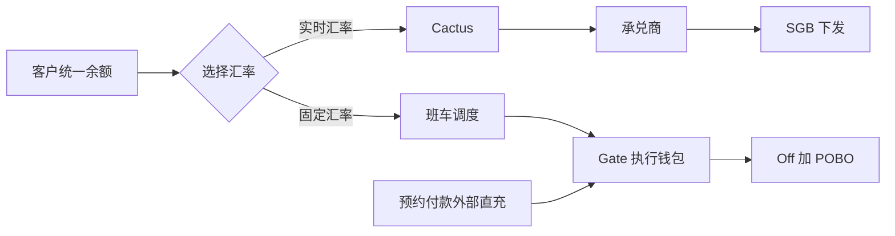

# 汇率选择出款 PRD

> 文档状态：待评审  
> 适用范围：商户端数币卖出、承兑与法币出款  
> 产品名称：**汇率选择出款**（Rate Choice Payout）  
> 交互文档：[汇率选择出款-商户端交互文档.html](./汇率选择出款-商户端交互文档.html)

## 1. 背景与目标

历史数币出款以 Cobo 作为客户收款入口，客户统一余额由 Cactus 归集管理，常规链路为“Cactus → 其他承兑商 → SGB 法币出款”。Gate 提供 Off-ramp + POBO 及 1:1 固定汇率能力，但不应承接客户日常收款或静止余额。

本需求不再将固定汇率设计为独立的“预约付款”菜单或独立下单模式。客户在原“卖出数币”页面，选择**实时汇率**或**固定汇率**即可完成同一出款流程。

目标：

1. 将“固定 1:1 汇率”沉淀为出款产品能力，客户在卖出数币时可见、可选。
2. 不迁移客户钱包归属：Cobo 保持收款入口，Cactus 保持余额金库；Gate 仅作为固定汇率的临时执行通道。
3. 保持既有产品开通、收款人、风控、订单和运营流程不变，仅增加产品名称、汇率选择和班车执行能力。
4. 订单、交易单与渠道单记录完整保存“汇率模式、报价快照、班次、资金来源和实际执行链路”。

## 2. 名称与范围

### 2.1 对客名称

对客产品名称为“汇率选择出款”。卖出数币页面的字段名称为“汇率模式”，选项为：

| 汇率模式 | 对客展示 | 说明 |
| --- | --- | --- |
| 实时汇率 | 实时汇率 | 按当前报价执行，报价以页面实际展示和订单快照为准 |
| 固定汇率 | 1:1 汇率 | 按产品配置提供固定 1:1 汇率；仅对已开通该能力的商户可选 |

“固定汇率”是汇率模式，不再新增“预约付款”菜单、预约单、充值有效期或先充值后付款的交互。

### 2.2 产品分层

| 产品形态 | 对客汇率 | 对客时效 | 资金动线 |
| --- | --- | --- | --- |
| 实时汇率出款 | 市场实时汇率 | 快速执行 | Cactus → 承兑商 → SGB 下发 |
| 固定汇率出款（余额） | 1:1 | T+0.5 班车执行 | Cactus → Gate → Off + POBO |
| 预约付款（直充） | 1:1 | 外部充值到账后执行 | 外部地址 → Gate → Off + POBO |

对客分层为：有时效诉求时选择实时汇率；可接受班车时效时选择固定汇率，以取得 1:1 汇率。预约付款仍是直充、到账即执行的独立产品形态。

### 2.3 不在本期范围

- 不改变商户产品开通审批、收款人管理、收款人渠道报备、风控及计费的既有职责。
- 不改变既有 Cobo 钱包客户的历史资产和地址记录。
- 不在对客页面暴露 Gate、SGB 或具体承兑商名称。
- 不承诺未配置的币种、网络或国家/地区可使用固定汇率。

## 3. 角色与职责

| 角色/系统 | 职责 |
| --- | --- |
| 商户 | 在卖出数币页面选择汇率模式并提交出款 |
| BB OP | 按现有产品开通能力为商户启用或关闭“汇率选择出款”；维护商户能力与操作日志 |
| 钱包/账户服务 | 保持 Cobo 收款入口和 Cactus 客户余额归集；按班次执行 Cactus → Gate 调拨 |
| 交易/路由服务 | 生成订单、选择承兑与出款路径，保存汇率模式、班次和路由快照 |
| Gate | 仅在固定汇率或预约付款链路中提供临时执行钱包与 Off-ramp + POBO 能力 |
| 其他承兑商 / SGB | 在非 Gate 承兑或法币出款路径中提供相应能力 |

## 4. 产品开通与钱包规则

### 4.1 开通方式

复用现有“产品开通”流程，不新增审批节点。OP 在商户产品能力中为“汇率选择出款”设置启用或关闭；开启后，商户端卖出数币页面显示“固定汇率（1:1）”选项。

| 商户能力 | 钱包规则 | 对客页面 |
| --- | --- | --- |
| 未开通汇率选择出款 | Cobo 收款入口、Cactus 余额金库不变 | 仅展示实时汇率 |
| 已开通汇率选择出款 | 钱包归属、客户地址及统一余额展示均不迁移 | 展示实时汇率与固定汇率（1:1） |

Gate 为执行专用临时钱包，仅允许接收两类资金：预约付款的外部直充，以及固定汇率余额出款的 Cactus 班车调拨。不得承接客户正常收款流或沉淀客户静止余额。

### 4.2 固定汇率选择校验

1. 商户已开通“汇率选择出款”。
2. 卖出币种、支付币种、收款国家/地区和金额满足固定汇率产品配置。
3. 当前班次可接单且剩余额度充足；非班次开放时展示下一执行班次，不暴露渠道信息。
4. 路由服务能生成可执行路径；不能生成时，固定汇率不可提交，并提示“当前条件暂不支持固定汇率，请选择实时汇率或联系客户经理。”
4. 每笔订单保存汇率模式和实际汇率；固定汇率订单保存 `1:1` 快照，实时汇率订单保存创建时返回的实时报价快照。

## 5. 资金与路由模型

### 5.1 三类执行链路

| 产品形态 | 客户资金归属 | 执行链路 | Gate 定位 |
| --- | --- | --- | --- |
| 实时汇率出款 | Cobo 收款、Cactus 余额 | Cactus → 承兑商 → SGB 下发 | 不参与 |
| 固定汇率出款（余额） | Cobo 收款、Cactus 余额 | Cactus → Gate 班车调拨 → Gate Off + POBO | 仅执行在途 |
| 预约付款（直充） | 按预约单外部直充 | 外部地址 → Gate → Gate Off + POBO | 仅直通执行 |

固定汇率不会将客户钱包迁移至 Gate，也不会把 Gate 用作常态余额池。Gate 不承接“Gate → 其他承兑商 → SGB”的资金路由。

### 5.2 固定汇率班车（Batch Shuttle）

固定汇率余额出款不承诺实时执行，采用固定班次调拨，将 Cactus → Gate 的半天时效转化为明确 SLA：

| 班次 | 截单时间 | 调拨与执行承诺 |
| --- | --- | --- |
| 上午班 | 11:00 | 合并调拨当日上午订单，17:00 前完成 Gate Off + POBO 执行 |
| 下午班 | 17:00 | 合并调拨下午订单，次日上午 11:00 前完成 Gate Off + POBO 执行 |

17:00 后提交的订单进入次日上午班，预计于次日 17:00 前执行。班次内可对 Gate 侧已退回资金、预约付款超额资金先做内部认领，再计算 Cactus 调拨缺口；不得以净额处理改变客户账务归属。

### 5.3 路由与敞口控制

1. 路由以汇率模式、币种/网络、收款账户、国家/地区、班次容量及渠道能力为输入。
2. 固定汇率余额订单仅可路由至 Cactus → Gate → Off + POBO；实时汇率订单沿用既有承兑商 + SGB 链路。
3. Gate 敞口仅包括当前班次调拨在途资金及执行中订单资金，目标为小时级、不过夜。
4. 日终核对 Gate 余额应约等于未终态订单占用金额；出现非预期余额或差异时，自动进入异常队列并暂停受影响批次。
5. 配置单班次调拨总额上限及熔断阈值。调度、对账或渠道异常触发熔断后，不再生成新的 Gate 调拨任务，待人工核验后恢复。
6. 商户端不展示钱包供应商、承兑商和出款渠道名称；运营后台完整展示。

## 6. 商户端交互

### 6.1 页面结构

沿用现有资金承兑架构：买入数币、卖出数币、承兑交易等一级页面。删除预约付款入口；本需求只改造“卖出数币”页面。

### 6.2 卖出数币字段

| 区域 | 字段/操作 | 规则 |
| --- | --- | --- |
| 卖出资产 | 金额、币种 | 沿用余额与限额校验 |
| 汇率模式 | 实时汇率 / 固定汇率（1:1） | 固定汇率仅在已开通且当前条件支持时可选 |
| 汇率展示 | 当前实时报价 / `1:1 汇率` | 固定汇率展示预计执行班次与承诺时间；切换模式即刷新试算与摘要 |
| 到账方式 | 银行账户 / USD 钱包 | 沿用现有能力 |
| 收款人、用途、附言、费用承担方 | 原字段 | 沿用既有校验和收款人可用性判断 |
| 订单摘要 | 卖出金额、汇率模式/快照、费用、预计到账、预计执行时间 | 固定汇率展示“今日 17:00 前”或“次日 11:00 前”；订单详情以实际执行结果为准 |

### 6.3 状态与异常

| 场景 | 客户端表现 | 后台处理 |
| --- | --- | --- |
| 固定汇率未开通 | 固定汇率置灰并提示开通后可用 | 复用产品开通能力 |
| 固定汇率路由不可用 | 不允许按固定汇率提交，建议选择实时汇率 | 记录路由失败原因与快照 |
| 待班次调拨 | 展示所属班次与预计执行时间 | 等待 Cactus → Gate 调拨，不重复创建 |
| 班次执行中 | 展示处理中 | Gate 已到账，等待 Off + POBO 执行结果 |
| 承兑或出款失败 | 展示失败及可见原因 | 按交易单、渠道单和资金异常流程处理 |
| 实时汇率报价过期 | 重新获取报价后再提交 | 保存新报价或要求客户确认 |

## 7. 订单、交易和运营数据

### 7.1 订单快照新增字段

| 字段 | 说明 |
| --- | --- |
| rate_mode | `REALTIME` 或 `FIXED_1_TO_1` |
| rate_snapshot | 实时报价数值或 `1:1` |
| custody_source | `COBO` / `CACTUS`；客户静止余额来源 |
| execution_wallet | `GATE`；仅固定汇率或预约付款执行阶段使用 |
| batch_id | 固定汇率所属班次编号 |
| batch_cutoff_at | 对应班次截单时间 |
| promised_execution_at | 对客承诺的最晚执行时间 |
| gate_exposure_bucket | Gate 在途敞口归属批次 |
| route_snapshot | 承兑/出款路径、渠道及费用快照，仅内部展示 |

### 7.2 运营查询

商户业务单、交易单、渠道单在既有字段基础上增加：产品名称、汇率模式、汇率快照、资金来源、班次、预计执行时间、实际承兑汇率和路由结果。交易单仍以交易类型为核心，可按充值/付款/数法承兑/实时换汇查询。

## 8. 计费

1. 客户收费由既有计费产品和费率配置决定；“汇率选择出款”作为可计费产品维度。
2. Gate Off + POBO 渠道收费与客户收费独立核算，不以渠道实际收费直接改写客户订单费用。
3. 钱包间调拨产生的成本、渠道成本和客户收费必须分别留痕，进入对账与异常处理。

按当前成本验证假设（Off + POBO 为万 15 + 35 USD），内部成本对比如下；对客收费以收费配置为准：

| 链路 | 比例成本 | 固定成本 | 10 万 USD 示例 |
| --- | ---: | ---: | ---: |
| 老链路：Cactus → 承兑商 → SGB | 万 14 + 点差万 15 = 万 29 | 50 USD | 340 USD |
| Gate 固定汇率余额：Cactus → Gate → Off + POBO | 万 3 + 万 15 = 万 18 | 35 USD | 215 USD |
| Gate 预约付款直充：外部 → Gate → Off + POBO | 万 15 | 35 USD | 185 USD |

在该假设下，固定汇率余额路径较老链路节约约万 11 及每笔 15 USD，同时不牺牲客户余额的托管隔离。

## 9. 验收标准

1. 未开通商户仅可选择实时汇率；已开通且满足配置时可选择固定汇率，并展示 `1:1 汇率`。
2. 切换汇率模式后，订单摘要、费率试算和订单快照同步更新。
3. 固定汇率订单按 11:00 / 17:00 班次进入调拨与执行，前台可查看承诺执行时间。
4. 三类资金链路均能保存正确的资金来源、班次和路由快照；调拨未确认时不得发起后续出款。
5. 日终 Gate 余额可与未终态订单在途金额核对；差异自动进入异常队列。
6. 客户端不展示 Gate、Cobo、其他承兑商或 SGB；运营后台可查询完整链路。
7. 现有产品开通流程、收款人流程和原有实时汇率出款不受影响。

## 10. 待确认事项

1. 固定 1:1 汇率支持的币种、网络、国家/地区、金额范围及可用时间。
2. Cactus → Gate 班车的实际到账 SLA、失败回滚及资金追回机制。
3. Gate 退款、预约付款超额资金的内部认领及对账规则。
4. 单班次调拨上限、熔断阈值及日终 Gate 余额差异的人工复核时限。
5. “汇率选择出款”是否在 OP 中作为独立计费产品，或作为既有卖出数币产品的费率维度。
