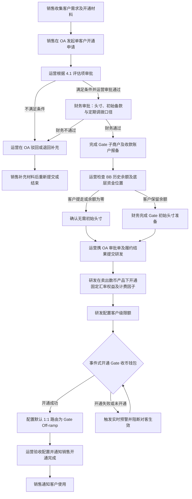
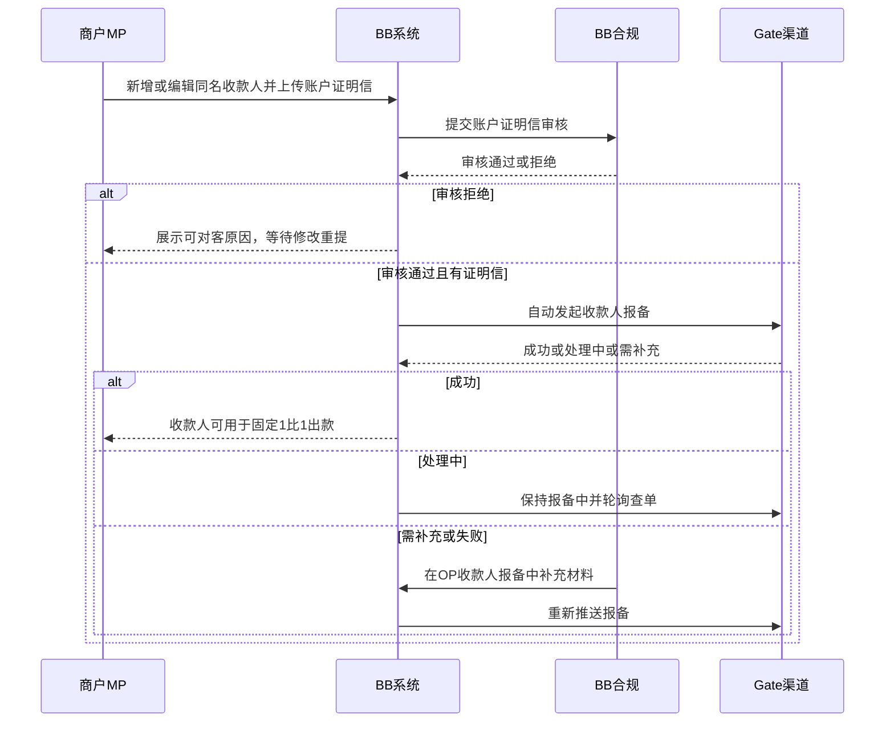
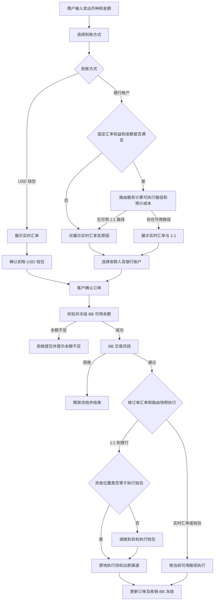

# 卖出数币固定汇率能力（汇率选择出款）PRD

> 文档状态：待评审
>
> 版本定位：V1，BB 单客户开通
>
> 对客页面：卖出数币
>
> 产品名称：卖出数币（沿用原产品及产品编码）
>
> 新增能力：固定汇率权益 + 固定汇率计费因子
>
> 系统边界：复用现有余额、卖出数币、银行账户、计费及订单能力；固定汇率能力开通审批走 OA，交易量由运营线下统计；业务系统不建设固定汇率开通审批、交易量统计、预约单、充值有效期、班车调拨或独立预约付款菜单
>
> 核心原则：不新增产品，1:1 是“卖出数币”产品下独立开通的固定汇率权益和计费因子，不与某一家钱包或出款渠道永久绑定；固定汇率与实时汇率分别计费。业务余额判断以 BB 账户为准。本期默认使用“Gate 钱包收币 + Gate Off-ramp 出款”，后续允许其他钱包收币并路由至 Gate、SGB 或其他可执行渠道
>
> 关键约定（本次更新）：① 固定汇率单笔门槛默认 **20,000 USD 等值**（原 50,000），且限额由“交易级”下沉到“**客户级**”，可按单个客户在固定汇率产品上单独配置，走“销售 OA 申请 → 运营审批 → 财务审批 → 研发配置”四步；② Gate 钱包按**事件式开通**（固定汇率能力开通即触发 Gate 子钱包开通），**未开通即触发实时预警**，阻断“已开固定汇率权益但无 Gate 收币钱包”的错配；③ BB 与 Gate 之间**不做笔笔转账**：BB 通过调用 Gate 接口完成兑换与出款，资金归集/回拨改为**定期批量调拨**（见财务需求）；④ 对账属财资项目，**本期不包含**
>
> 交互文档：[汇率选择出款-商户端交互文档.html](./汇率选择出款-商户端交互文档.html)

## 1. 方案结论

本方案不再采用“先创建预约单、再等待充值”的产品形态。原因是客户看到的是统一 BB 账户余额，卖出数币时可以直接判断并冻结 BB 可用余额，不需要用预约单证明某笔充值与某笔付款的关系。

V1 定型如下：

1. 产品继续沿用“卖出数币”，不新增“预约付款”或“固定汇率出款”产品；仅在原产品下增加固定汇率权益、汇率选择和固定汇率计费因子，商户仍从“卖出数币”发起。
2. 客户先输入卖出金额，再选择“银行账户 / USD 钱包”、适用汇率和收款人。
3. 卖出至银行账户时，可选择实时汇率或 1:1 汇率；1:1 默认仅对单笔卖出金额达到 20,000 USD 等值的已开通客户开放，阈值可由研发单客户配置。
4. 卖出至 USD 钱包不享受固定 1:1，仅按实时汇率执行。
5. 固定汇率能力仍采用单客户方式开通。OA 审批及研发配置只代表客户在原“卖出数币”产品下获得 1:1 权益并绑定固定汇率计费因子；本期配套完成 Gate 报备、历史余额处理，并由研发把该客户的默认充值钱包和默认 1:1 路由配置为 Gate。
6. 本期固定汇率能力开通后，新充值进入 Gate 钱包并记入统一 BB 账户余额；客户不感知钱包供应商。后续新增钱包时，可仅调整底层钱包和路由配置，不重新定义固定汇率能力或计费因子。
7. 历史及月度交易量由运营线下统计，仅作为评估客户规模效益的参考信息；固定汇率能力开通及权益调整通过 OA 审批。业务系统不统计、不校验交易量，也不因交易量变化自动暂停或关闭 1:1。

## 2. 背景与产品目标

### 2.1 当前问题

历史客户使用 Cobo 钱包收币。法币银行出款通常需要经过 Cobo、Cactus、LTP 和 SGB 等多段资金链路。Gate 同时提供钱包、Off-ramp 和 POBO 能力；当资金从 Gate 钱包直接经 Gate Off-ramp 出款时，链路更短，并可向符合条件的客户提供 1:1 汇率。

如果仍使用 Cobo 收币后再调拨到 Gate，Cobo → Cactus → Gate 的调拨成本与时间仍然存在，无法完整获得 Gate“钱包 + Off-ramp”端到端优势。因此，V1 对已开通固定汇率能力的“卖出数币”客户，将默认充值钱包和默认出款路由都配置为 Gate。

但这是**本期最优默认实现**，不是产品永久边界。1:1 是面向客户的报价产品；钱包负责收币与托管，出款渠道负责兑换和银行下发，三者必须解耦。后续若出现提现成本更低的钱包（例如万 1，或按月收取 100 USD 固定费），可以由该钱包收币，再根据订单路由至 Gate Off-ramp；Gate 钱包收到的资金也可以在报价和成本允许时路由至 SGB 或其他渠道出款。

### 2.2 产品目标

1. 在现有卖出数币页面提供实时汇率与 1:1 汇率选择，不增加预约付款菜单和预约流程。
2. 通过单客户开通验证本期“Gate 钱包 + Gate Off-ramp”默认组合的成本、成功率、KYT、对账和稳定性，同时验证固定汇率权益、计费因子、钱包和路由可独立配置。
3. 由运营线下统计历史和持续月交易量，辅助判断客户规模效益；交易量不是系统能力，也不是强制准入或退出条件。
4. 保持 BB 统一余额体验，同时在后台区分资金实际位于 Cobo 或 Gate，以便路由、头寸和对账。
5. 建立 Gate 不可用、集中度超限时的系统降级机制，以及低交易量客户的运营人工评估机制，并为新增低成本钱包和多出款渠道预留接入模型。

### 2.3 非目标

- 不建设预约单、48 小时充值有效期或充值与订单认领关系。
- 不建设独立“预约付款”商户菜单。
- 不向商户暴露 Gate、Cobo、Cactus、LTP 或 SGB 名称。
- V1 不自动批量开通客户，不自动在 Gate、Cobo 或其他钱包间迁移资金；V1 只实现 Gate 默认钱包和 Gate 默认出款路由，但配置及订单数据不得写死供应商。
- V1 不在 BB OP 或其他业务系统建设固定汇率能力开通审批页、交易量统计页或交易量自动复核任务；统一使用 OA 申请及审批，运营自行准备统计数据。
- V1 不实现“实时汇率最高不超过 1:1”；该能力列入 V2。

### 2.4 商户生命周期

固定汇率能力覆盖商户从准入到日常交易、再到暂停/退出的完整生命周期。各阶段的责任人、系统动作和产出如下：

| 阶段 | 触发 | 责任人 | 核心动作 | 产出/状态 |
| --- | --- | --- | --- | --- |
| 1. 准入评估 | 销售识别客户有 1:1 需求 | 销售、运营 | 收集需求、会员号、线下交易量参考；运营初评 | OA 申请 |
| 2. 开通审批 | OA 提交 | 运营 → 财务 → 研发 | 运营审批准入与限额、财务审批头寸与调拨口径、研发配置 | 固定汇率权益开通、限额生效 |
| 3. 钱包开通（事件式） | 权益开通事件 | 系统、研发 | 触发 Gate 子钱包开通；**未开通即实时预警** | Gate 收币钱包就绪 |
| 4. 收款人报备 | 商户在 MP 维护收款人 | 商户、合规、系统 | 上传账户证明信 → 合规审核 → 系统自动报备 Gate | 收款人可用（同名+审核通过+报备成功） |
| 5. 日常交易 | 商户发起卖出数币 | 商户、BB、Gate | 选汇率/收款人；BB 调 Gate 接口兑换出款；点差与计费内部处理 | 出款订单完成 |
| 6. 资金调拨 | 定期批量 | 财务、系统 | 定期归集/回拨（非笔笔转账，见财务需求） | 头寸平衡 |
| 7. 复核与调整 | 月度/事件 | 运营、财务 | 线下复核交易量、毛利、集中度；OA 调整限额或权益 | 权益/限额变更（仅影响新单） |
| 8. 暂停/退出 | 风险、渠道、客户意愿 | 运营、研发 | 暂停 1:1 或切回 Cobo；权益与钱包独立处置 | 仅实时汇率 / 钱包切换 |

生命周期的三条主线相互独立、分别留痕：**固定汇率权益**（准入、限额、计费因子）、**钱包配置**（Gate 收币、切换服务商）、**路由配置**（执行渠道）。任一主线的暂停或变更都不得自动改写另外两条，也不得关闭原“卖出数币”产品。

## 3. Gate 链路与成本评估

### 3.1 四类资金链路

| 钱包入口 | 银行出款链路 | 已知成本构成 | 产品判断 |
| --- | --- | --- | --- |
| Gate | Gate → Off-ramp → POBO | Gate Off + POBO：万 15 + 35 USD/笔 | 链路最短，是固定 1:1 的首选路径 |
| Gate | Gate 钱包 → Gate 的 BB 主账户换法币 → SGB 入账 | Gate 换法币：千分之 15 + 35 USD/笔；SGB 入账：50 USD/笔 | 不经过 Cactus 和 LTP；总成本为出款金额 × 1.5% + 85 USD，需单独判断是否仍能履行对客报价和毛利要求 |
| Cobo | Cobo → Cactus → Gate → Off-ramp → POBO | Cobo 万 5 + Cactus 万 0.5 + Gate 万 15 + 35 USD/笔 | 可提供 1:1，但未消除跨钱包调拨成本，不作为开通客户常态链路 |
| Cobo | Cobo → Cactus → LTP → SGB | Cobo 万 5 + Cactus 万 0.5 + LTP 浮动汇率 + SGB 50 USD/笔 | 现有实时汇率银行出款链路；LTP 不按固定万分比成本计算 |

说明：Cactus 当前成本口径为万 0.5。LTP 提供浮动汇率，不再使用“万 6”作为固定成本假设；涉及 LTP 的链路必须保存订单报价和实际结算汇率，并以真实成交结果核算。Gate → SGB 是 Gate 的 BB 主账户完成法币兑换后向 SGB 入账，不经过 Cactus/LTP；Gate 的千分之 15、35 USD 固定费及 SGB 50 USD 入账费应分别保存。其他链上固定费、失败及退款成本仍需用真实账单校准。

### 3.2 静态成本判断

按当前已知费率：

- Gate 钱包直出：`出款金额 × 0.15% + 35 USD`。
- Gate 钱包转 SGB：`出款金额 × 1.5% + 35 USD + 50 USD`，即 `出款金额 × 1.5% + 85 USD`；其中 Gate 的 BB 主账户负责换成法币，SGB 收取 50 USD 入账费。
- Cobo 钱包经 Gate 直出：已知比例成本为 `Cobo 万 5 + Cactus 万 0.5 + Gate 万 15`，即 `出款金额 × 0.205% + 35 USD`，另计尚未确认的链上固定费用。
- 经 LTP/SGB 的链路：已知调拨及固定成本可单列，但 LTP 部分必须按下单时浮动报价和实际结算汇率计算，不能换算成固定“万 6”。
“Gate 钱包 + Gate 直出 POBO”在操作链路、固定 1:1 能力及减少调拨方面仍有明显优势；“Gate → SGB”则必须按 Gate 千分之 15 换法币成本和 85 USD 固定费用单独核算，不能与 Gate 直出混用费率。与 LTP 路径比较时，必须使用同一订单时点的 LTP 可执行报价和实际结算结果。上线前财务应按 50,000、100,000、150,000、500,000 USD 等典型金额回放真实报价，分别核算调拨费、汇兑结果、固定出款费、失败及退款成本。

以 100,000 USD 等值订单为例，Gate → SGB 的当前已知成本为 `100,000 × 1.5% + 35 + 50 = 1,585 USD`。该路径明显高于同金额 Gate 直出 POBO 的 `185 USD`，因此只能在渠道可用性、客户报价和毛利均满足时作为候选路由，不能仅因资金位于 Gate 就默认选择 SGB。

### 3.3 为什么本期默认使用 Gate 钱包

#### 结论

固定 1:1 是独立的对客产品，但本期成本最确定、链路最短的实现是 **Gate 钱包收币 + Gate Off-ramp 出款**。因此，本期默认把开通客户的后续充值钱包切换到 Gate，并默认从 Gate 执行 1:1 出款。

如果客户的钱先进入 Cobo，再选择 Gate 的 1:1 出款，平台必须先把资金从 Cobo 调到 Gate。这样虽然客户仍可获得 1:1 汇率，但平台会额外承担 Cobo 和 Cactus 的调拨成本、到账等待时间以及跨钱包对账工作，无法发挥 Gate 端到端链路的成本优势。

#### 两种情况的区别

| 客户资金实际位置 | 选择固定 1:1 后的资金链路 | 平台结果 |
| --- | --- | --- |
| 资金已在 Gate 钱包 | Gate 钱包 → Gate Off-ramp → 银行账户 | 可以直接执行；链路最短，不需要跨钱包调拨 |
| 资金仍在 Cobo 钱包 | Cobo → Cactus → Gate → Gate Off-ramp → 银行账户 | 可以执行 1:1，但多出 Cobo 万 5、Cactus 万 0.5，以及调拨等待与对账 |

以 100,000 USD 等值出款为例，仅比较当前已知成本：

- 资金已在 Gate：Gate 万 15 + 35 USD，即约 `150 + 35 = 185 USD`。
- 资金在 Cobo 后再转 Gate：Cobo 万 5 + Cactus 万 0.5 + Gate 万 15 + 35 USD，即约 `50 + 5 + 150 + 35 = 240 USD`。
- 同一笔 100,000 USD 订单，资金先在 Cobo 会比直接使用 Gate 钱包至少多约 `55 USD` 的已知比例成本，尚未计算链上固定费用、调拨时间和异常处理成本。

因此，在当前只有 Cobo 和 Gate 两种钱包选择的情况下，如果开放 1:1、但仍让开通客户继续使用 Cobo 收币，平台会长期承担 Cobo → Cactus → Gate 的调拨成本，本期方案的主要成本优势无法成立。

#### 固定汇率能力处理方式

1. 本期仅对已开通“卖出数币固定汇率能力”的单客户，将**后续充值地址**切换为 Gate 地址；客户页面仍只看到统一 BB 余额，不展示钱包服务商。
2. 客户后续充值进入 Gate，选择固定 1:1 银行出款时，优先直接走 Gate Off-ramp。
3. 开通前已存在的 Cobo 历史余额不会因为页面余额统一而自动变成 Gate 资金，应按开通流程建议客户先提走；客户保留时，由财务准备相应 Gate 头寸。
4. 客户选择实时汇率或其他出款通道时，再根据实际资金位置、报价、通道成本和可用性进行路由。Gate 资金转 SGB 时，由 Gate 的 BB 主账户换成法币后入账 SGB，不经过 Cactus/LTP；该路径不代表固定 1:1 链路本身需要调拨。

### 3.4 固定汇率能力与钱包、出款渠道解耦

#### 设计原则

固定汇率能力属于“卖出数币”产品下的独立权益，只定义以下内容：客户是否已开通、适用的到账方式、最低金额、对客汇率、固定汇率计费因子和权益状态。它不新增产品，也不直接指定客户必须使用哪一家钱包或订单必须走哪一家出款渠道。

系统分为三层：

| 层级 | 负责内容 | 本期实现 | 后续扩展 |
| --- | --- | --- | --- |
| 卖出数币固定汇率能力层 | 客户准入、开通/暂停、金额门槛、对客 1:1 报价、固定汇率计费因子 | 单客户开通，银行出款达到门槛可选 1:1 | 原“卖出数币”产品编码保持不变，可接入更多钱包和出款渠道 |
| 钱包层 | 充值地址、数币托管、资金实际位置、钱包调拨 | 开通客户默认使用 Gate 钱包 | 可接入按笔万 1、按月 100 USD 或其他更低成本钱包 |
| 路由层 | 根据资金位置、报价、成本、时效、风险和容量选择执行链路 | 1:1 默认 Gate Off-ramp | 可选择 Gate、SGB 或其他满足 1:1 交付条件的渠道 |

#### 可支持的组合

| 收币钱包 | 出款渠道 | 是否可以承载固定 1:1 | 主要判断 |
| --- | --- | --- | --- |
| Gate | Gate Off-ramp | 本期默认支持 | 无跨钱包调拨，成本和时效最明确 |
| Gate | SGB | 可以作为后续路由 | Gate 的 BB 主账户换法币成本为千分之 15 + 35 USD，另加 SGB 入账 50 USD；总成本可覆盖且仍能履行客户 1:1 报价与毛利要求时才可使用 |
| 其他低成本钱包 | Gate Off-ramp | 可以作为后续路由 | 钱包 → Gate 的调拨成本、时效和失败风险低于该钱包带来的收币成本优势 |
| 其他低成本钱包 | SGB 或其他渠道 | 可以作为后续路由 | 执行总成本、汇率、时效、风控和渠道容量满足产品要求 |

例如，未来某钱包的收费是“提币万 1”或“每月固定 100 USD”，平台可以让客户使用该钱包收币，再把需要执行 1:1 的资金调拨到 Gate Off-ramp。是否采用该组合，不能只看钱包单项费率，必须计算完整链路：

`完整路由成本 = 钱包收币/托管成本 + 钱包调拨成本 + 链上固定费 + 兑换损益 + 出款渠道费用 + 失败及退款成本`

按月固定费的钱包还应根据实际月交易量摊销到订单。例如每月 100 USD、月出款 1,000,000 USD，单看钱包固定费约等于万 1；若月出款只有 100,000 USD，则约等于万 10。不能在未考虑交易量的情况下直接认定“月费钱包一定更便宜”。

#### 路由约束

1. 对客 1:1 报价与底层路由分开保存。客户看到 1:1，不代表后台一定走 Gate。
2. 报价前，路由服务必须至少找到一条可执行且满足内部毛利底线的候选路径，才能向客户展示 1:1。
3. 客户提交后锁定 1:1 订单快照。默认路由失败时，只能切换到仍能履行 1:1 和原费用快照的备用路由，不得静默改成实时汇率。
4. 钱包服务商、资金实际位置、调拨链路、兑换渠道和银行出款渠道必须分别记录，不得用一个“Gate 渠道”字段合并表达。
5. 本期虽然只启用“Gate 钱包 + Gate Off-ramp”，接口、配置和订单字段必须分别使用原“卖出数币”产品编码、固定汇率计费因子编码、钱包编码和路由编码，不得把 Gate 写死在固定汇率权益或计费规则中。

## 4. 固定汇率能力开通、续期与关闭

### 4.1 V1 单客户开通评估项

| 条件 | V1 规则 |
| --- | --- |
| 客户范围 | 企业商户，单客户人工评估和研发配置 |
| 历史交易量 | 运营线下统计的参考项：建议最近一个完整自然月“卖出数币至银行账户”的成功金额达到 500,000 USD 等值；统计结果随 OA 申请提交，业务系统不展示、不校验、不拦截 |
| 产品 | 卖出数币（沿用原产品及产品编码） |
| 开通能力 | 固定汇率 1:1 权益及对应计费因子 |
| 固定汇率门槛 | 到账方式为银行账户，且单笔卖出金额达到 20,000 USD 等值；研发可配置 |
| 收款账户 | 沿用现有银行账户可用性、同名及材料规则 |
| 本期渠道准入 | Gate 子商户及所需收款账户报备完成；后续增加其他默认钱包或路由时，按对应服务商完成准入 |
| 风控 | BB 风控评估通过；Gate 扫描结果仅作为风控输入，不代替 BB 决策 |
| 历史余额 | 默认建议客户先使用或提走 BB 历史余额；余额不强制清零，保留余额时需财务完成 Gate 初始头寸准备 |
| 开通方式 | 销售在 OA 发起单客户开通申请，运营根据本节评估项审批是否满足开通条件；审批通过后进入 Gate 报备、余额及头寸处理和研发配置，在原“卖出数币”产品下开通固定汇率权益并绑定固定汇率计费因子，同时配置本期默认钱包 Gate 和默认 1:1 路由 Gate Off-ramp |

历史交易量只用于运营判断试点客户是否具有规模效益，不构成系统准入门槛，也不构成对未来交易量的保证。即使低于建议值，运营仍可结合渠道稳定性、行业风险、充值来源质量、预期交易量和配合度决定继续申请；审批结论、原因和统计附件保留在 OA，业务系统只承接 OA 通过后的最终配置。

### 4.2 开通流程

| 阶段 | 责任人 | 核心动作 | 结果 |
| --- | --- | --- | --- |
| OA 发起 | 销售 | 收集客户需求、客户信息、预计交易量、申请限额及必要附件，发起单客户开通申请 | 待运营审批 |
| 运营审批 | 运营 | 根据 4.1 评估项判断准入与限额是否合理；可通过、驳回或退回补充 | 通过后进入财务审批 |
| 财务审批 | 财务 | 审批 Gate 头寸、初始备款和定期调拨口径，确认限额与资金可承接 | 通过后进入渠道及资金准备 |
| 渠道及资金准备 | 运营、财务 | 完成 Gate 报备，检查 BB 历史余额；客户保留余额时由财务准备初始头寸 | 待研发配置；任一步未完成均不得对客生效 |
| 系统配置 | 研发 | 配置固定汇率权益、计费因子、客户级限额、默认钱包并事件式开通 Gate 收币钱包、默认 1:1 路由 | 待运营验收 |
| 开通生效 | 运营、销售 | 运营验收页面、权益、限额、钱包和路由配置，确认生效后通知销售；销售再通知客户 | 客户可使用固定汇率能力 |

OA“审批通过”仅代表运营同意该客户进入开通实施，不代表固定汇率能力已经对客生效。只有渠道报备、余额及头寸处理、研发配置和运营验收全部完成后，状态才可更新为“已开通”。

余额检查属于固定汇率能力开通流程，不属于 Gate 报备流程。建议客户清理历史余额是为了让开通后的 BB 余额尽可能由 Gate 新充值形成，最大限度减少 Cobo 存量资金经 1:1 链路支出；客户不清理时不直接拒绝开通，但必须完成初始头寸及审计记录。

固定汇率权益及计费因子、默认钱包和默认路由是三项独立配置。本期三项在同一开通流程中一起完成，但后续更换钱包或出款渠道时，只调整钱包/路由配置，不应关闭并重新开通客户的固定汇率权益。

### 4.3 月度交易量线下复核

1. 每个自然月结束后，由运营线下统计该客户当月及最近 3 个自然月“卖出数币至银行账户”的成功 USD 等值金额；业务系统本期不提供该统计能力。
2. 500,000 USD 仅作为当前建议参考线，不是系统门槛。达到或低于该数值均不会自动改变 1:1 权益、汇率展示、收费方案或钱包配置。
3. 运营结合实际毛利、客户预期交易量、行业风险、渠道稳定性、资金集中度及合作价值，人工决定是否申请继续、暂停或关闭 1:1。
4. 需要调整权益时，由运营在 OA 发起变更申请并附线下统计结果；OA 审批通过后，再由研发修改产品配置。
5. 如决定暂停或关闭，仅影响配置生效后的新订单；已受理订单继续按原汇率、费用和路由快照执行。
6. 暂停或关闭 1:1 不等于关闭或切换当前钱包。是否切换 Gate、Cobo 或其他钱包需另行评估并单独审批。

业务系统职责仅包括接收 OA 通过后的最终产品配置并执行订单，不负责统计交易量、展示建议值或承接准入审批。不得将交易量建议值实现为硬编码校验、自动任务或订单拦截条件。

### 4.4 本期 Gate 钱包与历史余额

1. 客户看到的是统一 BB 账户余额，不按钱包供应商拆分。
2. 固定汇率能力开通后的新充值地址属于 Gate；充值确认并通过 BB 风控后，记入 BB 账户可用余额。
3. 旧 Cobo 地址不再对客展示，但迟到充值仍按现有规则处理并标记资金位置；不得因为客户看见统一余额而假设 Gate 已有等额实物头寸。
4. 卖出数币时以 BB 可用余额做业务判断并原子冻结；固定 1:1 执行前再校验 Gate 可执行头寸。
5. BB 余额足额但 Gate 头寸不足时属于内部资金异常，不得对客展示为“余额不足”，也不得重复扣减客户余额。

以上是本期默认钱包为 Gate 时的处理规则。后续接入其他钱包后，应把“Gate 可执行头寸”抽象为“目标路由可执行头寸”：系统先识别资金实际所在钱包，再判断是否可以原地执行，或是否需要调拨至目标执行渠道。

### 4.5 开通后的三类独立配置

| 配置对象 | 核心字段 | 本期配置 | 后续变更影响 |
| --- | --- | --- | --- |
| 固定汇率权益 | 原卖出数币产品编码、客户、权益状态、最低金额、固定汇率计费因子、收费方案、OA 审批单号 | 卖出数币下固定汇率能力已开通，单笔最低 20,000 USD 等值 | 不新建产品或子产品编码，不保存交易量门槛；交易量统计和审批材料保留在 OA，不直接改变钱包和路由 |
| 钱包配置 | 默认钱包、允许钱包、充值地址、资金位置、钱包状态 | 默认钱包 Gate | 可切换到新低成本钱包；不需要重新开通固定汇率能力 |
| 路由配置 | 钱包来源、调拨路径、兑换渠道、出款渠道、优先级、成本模型、毛利底线、容量、备用路由 | Gate 钱包 → Gate Off-ramp | 可增加 Gate → SGB、其他钱包 → Gate 等路径 |

三类配置必须分别生效和审计。本期不建设产品开通页；研发根据 OA 审批结果一次性完成三项配置，但后端不能新建“固定汇率出款”产品或只保存一个“开通 Gate 1:1”的组合状态。

### 4.6 限额配置

限额由“交易级”下沉到“**客户级**”：以前门槛只挂在单笔交易上，现在可以按单个客户在固定汇率产品上单独配置。

| 项 | 规则 |
| --- | --- |
| 默认单笔门槛 | **20,000 USD 等值**（原 50,000）；未单独配置的客户走默认值 |
| 配置维度 | 按“客户 + 固定汇率产品”配置；不同客户可不同门槛 |
| 门槛含义 | 单笔卖出金额的**最低享受金额**，非上限；以订单卖出 USD 名义等值判断，不以扣费后到账金额判断 |
| 生效范围 | 仅影响配置生效后的新订单；已受理订单按快照执行 |
| 拆单 | 每笔订单独立判断门槛，拆分不绕过规则 |

限额变更审批链为四步，与开通审批同源：

业务系统只承接四步审批通过后的最终客户级限额配置，不建设限额审批页；申请、审批意见和依据留存在 OA。

### 4.7 事件式 Gate 钱包开通与未开通预警

固定汇率能力开通会触发一个“**为该客户开通 Gate 收币钱包**”的事件，钱包开通与权益开通解耦但强关联：

1. 权益开通事件触发后，系统调用 Gate 开通该客户子钱包/收币地址，并回写钱包状态。
2. 钱包开通成功前，客户的固定汇率能力**不得对客生效**；页面不得展示 1:1，也不得生成 Gate 收币地址。
3. 出现“已开固定汇率权益但 Gate 收币钱包未开通/开通失败”的错配时，**实时触发预警**给运营与研发，并在开通看板标红，直至补齐。
4. 预警同时覆盖：钱包开通超时、回调缺失、地址生成失败、权益与钱包状态不一致。
5. 钱包开通属于配置动作，可重试；重试与最终结果均留痕。

## 5. 商户端产品与交互规则

### 5.1 产品名称与入口

- 产品：**卖出数币**（沿用原产品及产品编码）。
- 单客户开通项：**固定汇率 1:1 权益**，并绑定固定汇率计费因子。
- 对客入口：资金承兑 → 卖出数币。
- 对客不新增“预约付款”菜单，也不出现“预约”“充值有效期”等概念。
- 页面字段名称使用“汇率”，选项为“实时汇率”和“1:1 汇率”。

### 5.2 页面顺序

页面按以下顺序展示：

1. 输入卖出币种与金额。
2. 选择到账方式：银行账户 / USD 钱包。
3. 系统根据金额、到账方式、固定汇率权益及渠道状态展示可选汇率。
4. 选择与到账方式匹配的收款人及银行账户，或确认到账 USD 钱包。
5. 填写用途、附言等银行出款信息。
6. 查看费用和预计到账金额并提交。

该顺序先用金额判断是否达到 20,000 USD 门槛，再用到账方式判断是否属于银行出款场景，之后才生成可选汇率；汇率确认后再选择收款人，避免客户先填写大量收款信息后才发现当前订单不支持目标汇率。

### 5.3 汇率展示规则

| 到账方式 | 条件 | 页面展示 |
| --- | --- | --- |
| USD 钱包 | 任意金额 | 仅展示实时汇率，不展示或允许选择固定 1:1 |
| 银行账户 | 未开通、权益已被运营/风险人工暂停或渠道不可用 | 仅展示实时汇率，并按可对客原因说明 1:1 当前不可用 |
| 银行账户 | 已开通，但卖出金额低于 20,000 USD 等值 | 1:1 卡片排在第一位但整体置灰、不可点击，并在卡片内提示距离门槛的金额；实时汇率卡片可选 |
| 银行账户 | 已开通、金额达到门槛且渠道可用 | 1:1 卡片排在第一位并恢复可选，实时汇率卡片排在第二位；两张卡片内部直接展示各自汇率，不再在卡片下方重复展示“当前汇率” |
| 银行账户 | 实时报价恰好等于 1:1 | 仍分别展示“固定 1:1”和“实时汇率”两张卡片，因为两者命中不同计费因子；后台保存客户选择的汇率类型、报价来源和执行路由 |

银行账户选择仅展示与商户实名认证主体同名的 USD 账户。账户证明信审核通过后方可选择；待补充、审核中或审核拒绝的账户可以展示状态但不可选择，并提供“去补充账户证明信”入口。材料审核时效对客提示为 T+1；账户证明信已审核通过但仍无法选择时，提示客户联系客户经理。

20,000 USD 是**最低享受金额**而不是上限。V1 以订单卖出 USDT/USDC 的 USD 名义等值判断，不以扣除手续费后的预计到账金额判断。客户拆分订单不会绕过规则，因为每笔订单都必须独立达到门槛。

### 5.4 汇率与订单快照

1. 实时汇率必须保存报价值、报价 ID、有效期和实际执行汇率。
2. 固定 1:1 必须保存 `FIXED_1_TO_1`、门槛配置版本和客户权益状态快照。
3. 当实时报价等于 1:1 时仍保留两个汇率选项，后台根据客户实际选择保存 `REALTIME` 或 `FIXED_1_TO_1`，不得仅依据显示数值推断路由或计费因子。
4. 客户提交后不得因后续固定汇率权益人工变更或门槛配置变更改写订单汇率。

### 5.5 收款人维护、账户证明信与 Gate 报备

固定 1:1 出款仅允许打给**与商户实名认证主体同名、且已成功报备 Gate 的银行账户**。收款人能力从《预约付款-V1-BB单客户版PRD》迁移并对齐本方案。

#### 5.5.1 账户证明信字段

预约/固定汇率银行账户新增“账户证明信”，用于证明账户名称、银行名称、账号及账户归属。V1 仅允许提交与商户实名认证主体同名的银行账户；非同名账户不得用于固定 1:1。

| 字段 | 必填规则 | 校验 |
| --- | --- | --- |
| 账户证明信 | 进入渠道报备前必填 | PDF/JPG/PNG；大小与数量按现有文件规范 |
| 文件备注 | 选填 | 不超过 200 字 |

#### 5.5.2 新增与修改

1. 新增收款人：客户可上传账户证明信并提交合规审核。
2. 存量收款人：客户可编辑收款人，补充账户证明信后提交合规审核。
3. 修改银行名称、账号、SWIFT、收款人名称等关键字段后，原审核和渠道报备资格失效，需重新提交审核。
4. 合规仅给出“通过/拒绝”；拒绝必须给出可对客原因，客户修改后重新提交。
5. 审核通过且已有账户证明信的收款人，系统自动向 Gate 发起报备；没有账户证明信的不报备。
6. 渠道要求补充材料时，由合规在 OP 收款人报备记录中补充材料后重新推送，本期不设独立 RFI 流程。

#### 5.5.3 收款人查询与审核

- 支持按会员 ID、商户名称、收款人名称、银行账号尾号、审核状态查询；详情页展示收款人信息、银行信息、账户证明信、渠道报备记录和操作历史。
- 审核结果仅“通过/拒绝”；拒绝须填写内部原因和可对客原因。
- 审核通过不等于渠道报备成功。
- 收款人可用条件为“**同名 + 合规审核通过 + 账户证明信已报备 Gate 成功**”；渠道报备时效对客提示 T+1；MP 不展示渠道名称和未完成报备过程。

#### 5.5.4 报备时序图

## 6. 下单与执行流程

关键规则：

1. 不创建预约单，不等待新增充值；客户当前 BB 可用余额足额即可下单。
2. 余额冻结、风控和路由必须使用同一订单幂等键，避免重复扣账或重复出款。
3. 固定 1:1 订单必须校验目标路由的可执行头寸。本期目标路由为 Gate；后续可由其他钱包调拨到 Gate，或使用其他能够履行 1:1 的渠道。
4. 实时汇率报价过期时要求客户重新确认；1:1 订单提交后按订单快照执行。
5. 默认路由不可用时，只能切换至仍能履行 1:1 和原费用快照的备用路径；不能自动改成实时汇率，也不能让客户承担新增调拨费用。
6. 渠道结果未知时保持处理中并查询原请求，不重复发起出款。

本期路由服务只启用一条 1:1 路径：`Gate 钱包 → Gate Off-ramp → 银行账户`。但候选路由、钱包编码和执行渠道均通过配置返回，不在产品判断中写死 Gate。

### 6.1 路由决策顺序

1. 判断客户固定 1:1 权益、金额门槛、银行账户和风控条件。
2. 查询 BB 余额及底层资金所在钱包，不因统一余额隐藏真实资金位置。
3. 根据“资金钱包 + 可用调拨路径 + 兑换渠道 + 出款渠道”生成候选路由。
4. 对每条候选路由计算预计总成本、对客收费、预计毛利、执行时效、渠道容量和风险状态。
5. 排除无法履行 1:1、毛利低于内部底线、时效不满足或渠道不可用的路径。
6. 按路由优先级选择主路由并保存备用路由；本期主路由固定配置为 Gate 钱包 → Gate Off-ramp。
7. 订单完成后记录实际成本和实际毛利，供后续调整钱包选择和路由优先级。

## 7. 钱包 KYT 与 BB 风控（本期 Gate）

### 7.1 决策原则

本期 Gate KYT 仅提供扫描结果，不作为 BB 最终风控结论。所有进入 Gate 的数币充值仍需经过 BB 交易风控，避免因钱包供应商切换而降低现有风险标准。后续接入其他钱包时，须将其 KYT/AML 扫描结果映射为统一风控输入，钱包更换不能绕过 BB 风控。

### 7.2 风控输入与结果

BB 风控至少接收：充值交易哈希、币种/网络、来源地址、到账金额、Gate 扫描状态、风险标签/命中信息、扫描时间及原始结果引用。具体字段以 Gate 实际接口为准，不在未确认接口前写死枚举。

| BB 风控结果 | 余额处理 | 后续操作 |
| --- | --- | --- |
| 通过 | 计入 BB 可用余额 | 可用于卖出数币 |
| 人工复核 | 计入冻结/待审核，不进入可用余额 | 等待 BB 风控处理 |
| 拒绝 | 不进入可用余额 | 按现有高风险资金处置流程处理 |

当前钱包服务商的扫描结果缺失、超时、过期或无法追溯时，不得默认通过；进入人工复核或暂停相应币种充值入账。本期当前钱包服务商为 Gate。

## 8. 钱包与路由风险控制

### 8.1 主要风险

1. **托管集中风险**：满足 1:1 的客户全部切至 Gate 后，客户新增余额和执行能力集中在同一供应商。
2. **单点可用性风险**：Gate 充值、提币、Off-ramp、POBO 或回调任一环节异常都会同时影响余额入账和银行出款。
3. **合规依赖风险**：KYT 仅有扫描结果，BB 仍需独立决策、留存和复核能力。
4. **退出风险**：频繁在 Cobo/Gate 间迁移地址会产生迟到充值、余额位置错配、客户误充和对账复杂度。

### 8.2 V1 控制措施

- 仅单客户开通，不批量全量迁移。
- 运营线下统计最近完整自然月及最近 3 个月银行出款交易量，并将结果作为 OA 申请附件；建议月交易量为 500,000 USD，但不作为 OA 必须通过条件或系统拦截条件。
- 配置 Gate 客户数、Gate 托管余额、单日入金和单日出款的集中度阈值；具体数值由资管、风控和财务评审后确定。
- 每日核对 BB 账务余额、Gate 子账户余额、充值流水、冻结金额和出款流水。
- 保持 Cobo 接口、地址生成、充值入账和出款演练能力可用，不能因试点 Gate 而停止维护备用钱包能力。
- Gate 异常时可以暂停新充值地址展示、暂停 1:1 新单，并保留实时汇率或人工降级入口。

### 8.3 关闭 1:1 后是否切换钱包

**建议结论：单纯月交易量低于参考值，既不自动关闭 1:1，也不自动切换钱包。**运营应先结合毛利、客户预期和风险人工判断是否调整固定汇率权益；权益调整与钱包迁移是两项独立决策，频繁更换充值地址会增加误充和对账风险。

出现以下情况时，应评估切回 Cobo 或其他已准入钱包：

1. Gate 发生安全事件、资产冻结、提现/Off-ramp 长时间不可用或监管/合同条件发生重大变化。
2. Gate 对账持续出现无法解释的差异，或 KYT/回调数据无法满足 BB 风控留痕要求。
3. Gate 托管余额或客户数超过内部集中度阈值，需要主动分散供应商风险。
4. 客户持续交易量较低，运营判断未来交易预期有限，且成本测算显示其他钱包的收币、托管和调拨总成本更低；交易量数据仅为决策输入，不单独触发切换。
5. 为保持 Cobo 生产能力和运维熟练度，需要安排稳定的非 1:1 客户群作为 Cobo 常态流量；该迁移应按资管计划执行，而不是随机切换单个活跃客户。

计划切换钱包必须同时满足：无执行中订单、结果未知订单已清理、资金位置和余额可核对、新钱包地址已验证、客户完成地址变更通知。切换只影响后续充值入口，存量资金按资管方案处理，禁止在未核对时直接迁移账务余额。

#### 8.3.1 切回 Cobo 时的产品影响确认

BB OP 在“收付工具管理 → 商户收款地址 → 切换钱包”中选择从 Gate 切回 Cobo 时，必须提示运营分别确认以下事项：

| 决策项 | 可选处理 | 校验规则 |
| --- | --- | --- |
| 固定汇率权益 | 继续 / 暂停 / 关闭 | 钱包切换不得自动关闭原“卖出数币”产品；继续固定汇率权益时必须存在可执行且满足毛利底线的 1:1 路由 |
| 商户端汇率 | 保留“实时汇率 + 1:1” / 仅实时汇率 | 产品暂停或关闭时必须仅展示实时汇率；继续 1:1 时保留两个汇率选项 |
| 固定汇率收费方案 | 保持现有方案 / 调整固定汇率方案 | Cobo → Gate 会新增 Cobo 万 5、Cactus 万 0.5，以及调拨成本；固定汇率收费无法覆盖时必须完成费率评估，但不得修改实时汇率计费方案或已受理订单费用 |
| 1:1 执行路由 | Cobo → Cactus → Gate / Cobo → Cactus → LTP → SGB / 其他已审批路由 | 继续 1:1 时必选；需保存路由成本、预计毛利及财务确认记录 |
| 生效范围 | 指定生效时间 | 仅影响生效后的新充值地址和新订单；已有订单继续使用原汇率、费用和路由快照 |

交互默认不替运营作出固定汇率权益关闭决定。若运营选择“暂停”或“关闭”1:1 权益，系统自动把新订单汇率展示限制为“仅实时汇率”，但原“卖出数币”产品继续可用；若选择“继续”，则必须选择 1:1 执行路由并勾选财务已确认头寸和成本。

原 Gate 地址从商户端停止展示后仍需保留迟到充值监控。Gate 存量资金和 Cobo 新充值资金分别记录实际位置，不因商户看到统一 BB 余额而直接做账务迁移。

### 8.4 紧急降级

Gate 出现异常时，先区分钱包能力和出款能力：

1. Gate Off-ramp 不可用但 Gate 钱包正常：停止新的 Gate 出款请求；若存在能够履行原 1:1 快照的备用路由，可将 Gate 资金路由至 SGB 或其他渠道，否则暂停 1:1 新单。
2. Gate 钱包充值不可用但存量资金可出：暂停 Gate 新充值地址展示，存量资金仍按可用路由处理；可切换至其他已准入钱包收币。
3. Gate 钱包和出款均不可用：暂停相关充值和 1:1 路由，已冻结但未发渠道的订单释放余额或转人工确认；已发 Gate 的订单查询原请求，不得重复出款。
4. 实时汇率是否可继续，取决于当前实物资金位置和备用路由；不得仅因 BB 余额足额就承诺可执行。
5. 达到钱包切换条件后，按变更流程启用 Cobo 或其他钱包充值入口，并保留 Gate 旧地址迟到充值监控。

## 9. 数据、状态与审计

### 9.1 固定汇率权益状态

| 状态 | 进入条件 | 可用能力 | 退出条件 |
| --- | --- | --- | --- |
| 未开通 | 未完成单客户准入 | 仅实时汇率 | 研发完成开通 |
| 1:1 可用 | 开通完成，且渠道与风险正常 | 银行出款达到单笔金额门槛时可选 1:1 | 运营人工暂停、无可用路由或风险/渠道暂停 |
| 1:1 暂停 | 运营人工决定暂停、无可用路由或风险暂停 | 仅实时汇率；当前钱包配置可继续保留 | 运营确认恢复，且至少一条 1:1 路由可用并完成人工复核 |
| 已关闭 | 客户退出固定汇率能力 | 卖出数币仍可使用实时汇率，但不再创建固定汇率订单；钱包是否调整由钱包策略决定 | 重新走完整开通流程 |

钱包状态、固定汇率权益和路由状态必须分开。`1:1 暂停`不能自动写成`Gate 钱包关闭`，也不能关闭原“卖出数币”产品或阻止后续为客户配置其他钱包和备用出款路由。

## 10. 计费

### 10.1 计费定位

1. 产品继续使用原“卖出数币”产品及产品编码，不新增“固定汇率出款”计费产品。
2. 在原产品下新增固定汇率计费因子 `FIXED_RATE_1_TO_1`。客户选择固定 1:1 时，独立命中固定汇率收费方案；客户选择实时汇率时，继续命中原实时汇率收费方案。
3. 固定汇率计费与实时汇率计费相互独立，可配置不同的计费方式、费率、固定费用、阶梯或客户特例；具体收费参数由计费产品负责人另行配置，本 PRD 不预设数值。
4. 客户收费与钱包、调拨、兑换及出款渠道成本分开记录，不以任一底层服务商的实际收费直接改写客户订单费用。

### 10.2 因子命中规则

| 场景 | 产品编码 | 汇率类型 | 计费因子 | 收费方案 |
| --- | --- | --- | --- | --- |
| 卖出数币至银行账户，客户选择固定 1:1 | 原卖出数币产品编码 | `FIXED_1_TO_1` | `FIXED_RATE_1_TO_1` | 固定汇率独立收费方案 |
| 卖出数币至银行账户，客户选择实时汇率 | 原卖出数币产品编码 | `REALTIME` | 原实时汇率计费因子 | 原实时汇率收费方案 |
| 卖出数币至 USD 钱包 | 原卖出数币产品编码 | `REALTIME` | 原实时汇率计费因子 | 原实时汇率收费方案 |

计费因子以订单的 `rate_mode` 为准，不以页面最终显示的数值为准。若实时汇率报价恰好为 1:1，订单仍属于 `REALTIME`，必须使用原实时汇率计费因子；只有客户实际选择固定汇率且订单保存为 `FIXED_1_TO_1` 时，才使用固定汇率计费因子。

### 10.3 计费时点与快照

1. 订单提交前，计费服务根据客户、原卖出数币产品编码、汇率类型、固定汇率计费因子、卖出金额/币种及到账方式返回费用试算。
2. 客户确认提交时，订单必须保存计费因子、收费方案 ID/版本、费用金额、费用币种和计费明细快照；后续钱包或路由变化不得重新选择收费方案。
3. 固定 1:1 的默认路由失败并切换备用路由时，仍执行原固定汇率费用快照，不得改成实时汇率收费或把新增渠道成本临时转嫁给客户。
4. 订单失败、撤销或退款时，费用退还规则沿用卖出数币订单框架，但应按命中的固定汇率/实时汇率收费方案分别执行并留存结果。
5. 1:1 最低金额阈值只控制固定汇率权益，不替代手续费、客户日累计限额、风险限额或渠道容量控制。

### 10.4 对账与毛利

1. 计费收入按“卖出数币产品 + 汇率类型 + 计费因子”拆分统计，使固定汇率收费与实时汇率收费可以独立对账。
2. 财务按月按“收币钱包 + 调拨链路 + 兑换渠道 + 出款渠道”输出真实单位成本、失败成本、退款成本和实际毛利，用于调整固定汇率收费方案、默认钱包、路由优先级及客户 1:1 权益。
3. 渠道成本变化只影响后续固定汇率收费方案或路由策略；已受理订单始终使用创建时的客户费用快照。

## 11. 页面交互

商户端交互见：[汇率选择出款-商户端交互文档.html](./汇率选择出款-商户端交互文档.html)

EX 商户端交互见：[汇率选择出款-EX商户端交互文档.html](./汇率选择出款-EX商户端交互文档.html)

BB OP 钱包切换及产品影响确认见：[预约付款-BB-OP交互文档.html](./预约付款-BB-OP交互文档.html)

交互覆盖：先输入卖出金额，再选择到账方式、汇率和收款人；选择银行账户时，1:1 卡片固定在实时汇率前，卡片内直接展示汇率，金额低于门槛时1:1置灰，达到门槛后恢复可选；选择 USD 钱包时不展示1:1卡片，仅展示占满整行的实时汇率；同时覆盖提交后的订单摘要。

## 12. V2 规划

V2 将“实时汇率”调整为“实时汇率但对客不优于 1:1”：

`对客实时汇率 = min（市场实时报价，1.0000）`

若按该规则计算出的实时报价为 1:1，页面仍保留“固定 1:1”和“实时汇率”两个选项，因为两者收费方案不同；每张卡片显示汇率类型和汇率数值，订单根据客户选择命中对应计费因子。V2 上线前需由财务确认定价损益和计费口径。

V2 同时建设多钱包、多路由能力：固定汇率能力开通不再触发固定的钱包切换代码，而是关联默认钱包配置和允许路由集合。新增低成本钱包或 SGB 等备用出款渠道时，只需完成渠道准入、成本模型、风控字段映射、调拨能力及路由配置，不修改原卖出数币产品、固定汇率权益/计费因子或商户端交互。

## 13. 验收标准

1. 商户端不存在预约付款菜单、预约单或充值有效期；客户从卖出数币直接使用 BB 可用余额下单。
2. 页面顺序为“卖出金额 → 到账方式 → 汇率 → 收款人/到账钱包”；选择 USD 钱包时完全不展示固定 1:1 卡片，仅展示占满整行的实时汇率，不采用置灰状态。
3. 未开通、权益已由运营/风险人工暂停、银行出款低于单笔金额门槛或不存在满足条件的 1:1 候选路由时，不能按固定 1:1 提交；历史或月度交易量低于建议值不得直接拦截订单。
4. 已开通客户选择银行账户且单笔卖出金额达到 20,000 USD 等值时，可选择实时汇率或 1:1；门槛调整后仅影响新订单。
5. 汇率选择区的1:1卡片排在实时汇率前，两张卡片内直接显示报价且不存在下方重复“当前汇率”展示；金额低于 20,000 USD 等值时1:1卡片置灰不可选，达到门槛后恢复可选。
6. 本期固定汇率能力开通后新充值进入 Gate，充值通过 BB 风控后正确记入 BB 统一账户余额；固定汇率权益及计费因子、默认钱包和默认路由分别保存。
7. Gate KYT 结果进入 BB 风控输入；缺失、超时或不可追溯时不能默认通过。
8. 固定 1:1 下单以 BB 可用余额判断并冻结，执行前校验目标路由的可执行头寸；底层钱包或渠道头寸不足不得对客显示为余额不足。
9. 业务系统不提供历史/月度交易量统计、建议值展示或准入校验能力；运营在线下完成统计并通过 OA 申请。低于 500,000 USD 建议参考线时，系统不自动拒绝开通、不自动暂停 1:1、不拦截订单，也不自动关闭或迁移钱包。
10. 本期 Gate 不可用且没有可履行 1:1 的备用路由时，可以暂停 1:1、新充值和未发渠道订单；已发渠道订单不重复提交。
11. 固定汇率权益状态和钱包状态独立记录，所有开通、暂停、恢复、迁移及阈值变更均可审计。
12. 运营可查询订单的到账方式、汇率模式、金额门槛快照、KYT、BB 风控、收币钱包、调拨链路、兑换渠道、出款渠道及真实成本；交易量统计和产品准入审批在 OA/线下处理，不属于订单查询字段。
13. 固定汇率权益和计费规则中不存在写死的 Gate 钱包或 Gate 出款判断；本期通过配置启用 Gate 默认组合，替换钱包或增加备用路由不需要新建或重新开通“卖出数币”产品。
14. BB OP 从 Gate 切回 Cobo 时，必须确认固定汇率权益、汇率展示、客户收费、执行路由和生效时间；继续 1:1 但未选择有效路由、暂停/关闭后仍保留 1:1 展示、或未完成财务确认时均不能提交。
15. 固定汇率和实时汇率订单使用相同的“卖出数币”产品编码，但分别命中固定汇率计费因子和原实时汇率计费因子，并保存不同的收费方案快照。
16. 实时报价恰好等于 1:1 时，若订单 `rate_mode=REALTIME`，必须按原实时汇率方案收费；不得因页面显示 1:1 而误用固定汇率计费因子。
17. BB 与 EX 商户端的银行出款页面均明确提示仅支持同名提现、账户证明信审核时效为 T+1；未审核通过的账户不可选择，并提供补充材料及联系客户经理的处理入口。

## 14. 待确认事项

1. Gate 的 BB 主账户换法币并入账 SGB 的千分之 15 计费基数、35 USD 固定费币种、SGB 50 USD 入账费扣费方式及到账 SLA。
3. LTP 浮动汇率的报价基准、报价有效期、结算汇率、滑点及异常回退规则；财务需按订单保存报价与结算快照，不再使用固定万分比估算。
4. 20,000 USD 最低金额是否全客户统一，还是允许按客户研发配置；本稿按“默认 20,000 USD、研发可配置”设计。
5. 500,000 USD 交易量建议参考线是否需要按客户类型或试点阶段调整；无论建议值如何调整，均由运营在线下统计并在 OA 中使用，不进入业务系统规则。
6. Gate 托管余额、客户数、日入金、日出款及单客户敞口的集中度阈值。
7. Cobo 常态流量的最低客户数/交易量，以及计划迁回客户的选择规则。
8. 固定汇率计费因子的具体计费方式、费率/固定费用、阶梯规则、收费币种以及失败或退款时的退费规则。
9. 新钱包接入的成本准入线：按笔费率、月固定费如何按客户/全平台交易量摊销，以及相对现有钱包至少降低多少成本才允许作为默认收币钱包。
10. “其他钱包 → Gate”调拨的最迟到账 SLA、最小批量、链上费用、失败重试和头寸准备规则。
11. Gate 钱包资金经 Gate 的 BB 主账户换法币后路由至 SGB 时，在“金额 × 1.5% + 85 USD”成本下，需要达到什么毛利底线才允许承载对客 1:1。
