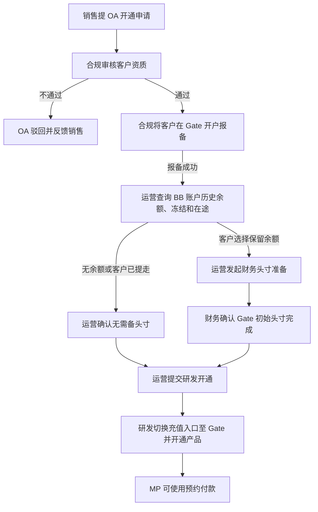
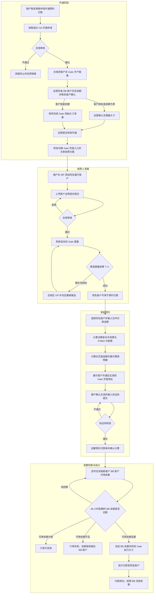
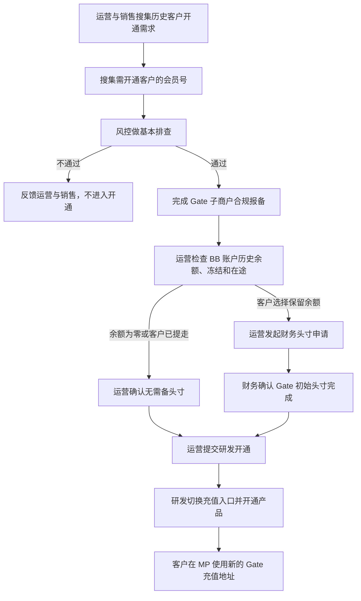
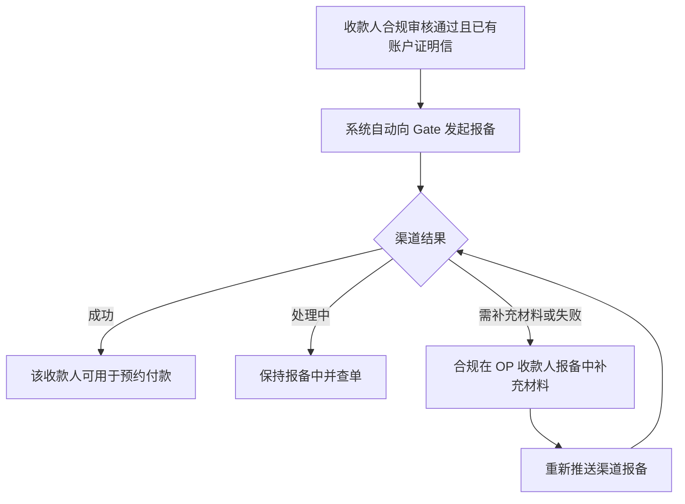

# 预约付款 V1—BB 单客户版 PRD

> 文档状态：待评审
> 版本定位：V1，先在 BB 系统以单个客户配置方式实现
> 适用端：BB OP、MP
> 适用范围：经业务、合规确认后定向开通的企业商户
> 系统边界：覆盖产品开通、收款人维护与审核、人工渠道报备、预约付款、计费、渠道查询及资管；不建设 EX 通用产品配置、EX Hub 三单、通用渠道能力和自动路由
> 核心原则：Gate 合规报备完成后进入产品开通流程；运营检查客户 BB 账户历史余额并默认建议客户提走，但余额不强制清零；客户保留历史余额时，由于该余额开通前主要对应 Cobo 存量资金，财务先完成一次性 Gate 头寸准备，再由研发开通产品并切换后续充值入口

## 1. 版本目标

V1 用于验证预约付款产品的业务可行性和 Gate 全链路资金方案。BB OP 通过单客户配置为指定商户开通产品，MP 提供产品使用和收款人材料维护，运营人员完成人工审核、人工报备、异常处理和渠道查询。

本版本目标：

1. 研发可为单个商户开通或关闭预约付款，本期不提供 OP 开通页面。
2. MP 收款人银行账户支持上传账户证明信：新增可上传，存量收款人可编辑补充。
3. 合规审核账户证明信；审核通过且有证明信的收款人由系统自动向 Gate 报备，需补充材料时由合规在 OP 收款人报备中补充后重新推送。
4. Gate 报备完成后，由运营在产品开通流程中检查客户 BB 账户历史余额；默认建议客户提走，客户不提走时允许通过财务准备 Gate 初始头寸后开通。
5. 预约付款使用独立计费产品，客户费用与 Gate 渠道成本分开记录。
6. BB OP 可查询预约付款单和渠道执行结果。
7. 预约付款是否足额以客户 BB 账户可用余额为准；Gate 子账户余额只作为渠道执行头寸校验。无历史余额客户不需财务备款，保留历史余额客户仅在开通前完成一次性初始头寸准备。

### 1.1 本期主要价值：一个新的产品形态

本期最核心的产品价值是推出一个区别于现有实时汇率 On Ramp / Off Ramp 的**新产品形态（固定 1:1 报价的预约付款）**。之所以把“新产品形态”作为本期主要价值，原因有三：

1. **1:1 报价稀缺，新形态本身就是获客点**：平台现有产品对客均为实时汇率；市场上存在 1:1 报价的产品但供给不多。固定 1:1 的预约付款作为一个新的产品形态，对客户有直接吸引力。
2. **契合当前成本形态，是最快的落地路径**：当前 1:1 产品的成本最优解是端到端全部走 Gate 渠道（包括充币钱包、数法兑换和 POBO 法币付款）。以独立的新产品形态承接，不改造现有实时换汇产品，是实现“全链路走 Gate”这件事最快的路径。
3. **同名提现**：本期仅支持将资金提现至与商户实名认证主体名称一致的银行账户，降低第三方付款及账户归属不一致风险。

### 1.2 V1 资金形态定型

V1 采用“Gate 钱包 + 预约付款”：

1. Gate 子商户合规报备先完成；余额检查不属于报备条件，也不得阻塞合规报备。
2. 报备完成后进入产品开通流程，由运营查询客户 BB 账户的支持币种可用余额、冻结余额和在途交易；底层 Cobo/Gate 资金位置仅作为资管辅助信息。
3. 客户存在历史余额时，运营默认建议客户先通过既有实时汇率出款或提币能力自行提走，但不将余额清零作为强制开通条件。
4. 客户选择提走的，运营待余额处理完成后提交研发开通；客户选择保留的，运营发起财务头寸准备，财务确认完成后再提交研发开通。
5. 研发开通后，将该客户后续充值入口切换为 Gate 子账户地址；旧 Cobo 地址不再作为新的 1:1 充值入口。
6. 开通后的新充值直接进入 Gate 子账户，并正常记入客户 BB 账户余额。客户发起预约付款后，业务判断只读取 BB 账户可用余额。
7. BB 账户余额足额时，系统先在 BB 账户原子冻结本单金额，再从 Gate 执行 Off + POBO；Gate 余额仅用于内部头寸校验。后续新充值持续进入 Gate，原则上不再需要财务为日常预约付款备款。
8. 保留历史余额场景下，财务初始头寸仅用于完成钱包切换时的存量覆盖；客户账务余额仍只扣减一次，禁止同时将同一历史余额用于原链路和 Gate 链路。

## 2. 非目标

- 不建设 EX 产品中心的通用产品配置和自动开通流程。
- 不在 EX Hub 生成充币、数换法、法币付款三张交易单。
- 不建设多渠道能力模型、自动预路由或渠道自动切换。
- 不支持批量商户开通；每个商户由研发单独配置。
- 不支持实时汇率；固定使用 1:1。
- 仅支持 USD，最低付款金额默认 1,000 USD。
- 退票不作为预约付款单状态；发生退票时生成独立退票交易。

## 3. 角色与权限

| 角色         | 主要职责                                            | 权限限制                     |
| ------------ | --------------------------------------------------- | ---------------------------- |
| 商户（MP）   | 维护收款人、提交账户证明信、创建及查询预约付款      | 仅操作本商户数据，不感知渠道 |
| 研发         | 依据 OA 结果为单个商户开通/关闭产品、维护客户级配置 | 每次配置必须留痕             |
| BB 风控/合规 | 审核收款人账户证明信                                | 审核结果仅通过/拒绝          |
| BB 渠道运营  | 查询渠道执行结果、跟踪报备状态                      | 报备由系统自动触发           |
| BB 运营      | Gate 报备完成后检查 BB 账户历史余额、联系客户确认处理方式、发起财务头寸申请并提交研发开通 | 余额不强制清零；处理决定需留痕 |
| BB 财务/资管 | 客户保留历史余额时准备初始 Gate 头寸；负责余额监控、对账和异常处理 | 头寸确认后方可交研发开通     |
| 独立计费产品 | 费用试算、计费确认、生成计费单                      | 客户收费与渠道成本分离       |

## 4. V1 功能范围

### 4.1 研发给单个客户开产品

#### 4.1.1 配置入口

本期不提供 BB OP 开通页面。销售发起 OA，合规审核并完成 Gate 开户报备；报备完成后由运营检查客户 BB 账户历史余额并与客户沟通。运营确认“历史余额已提走”或财务确认“初始头寸已完成”后，研发依据开通记录为指定商户配置并开通产品。

#### 4.1.2 客户级配置

| 配置项        | V1 规则                |
| ------------- | ---------------------- |
| 产品          | 预约付款               |
| 会员 ID       | 单个会员，必填         |
| 商户名称      | 根据会员 ID 查询后回显 |
| 商户国家/地区 | 必须命中当前支持范围   |
| 历史余额快照  | Gate 报备完成后由运营查询并保存 BB 账户可用、冻结及在途金额；附底层 Cobo/Gate 资金位置供资管核对 |
| 客户处理选择  | 提走历史余额、保留历史余额 |
| 财务头寸状态  | 无需备头寸、待准备、已完成 |
| 财务头寸金额  | 客户保留历史余额时记录；以财务确认金额为准 |
| 运营开通结论  | 待确认、可提交研发、暂缓开通 |
| 钱包切换状态  | 待运营确认、待财务备头寸、待研发开通、Gate 已生效 |
| 钱包切换时间  | Gate 充值地址正式对客生效时间 |
| 产品状态      | 未开通、已开通、已关闭 |
| 备注          |                        |

#### 4.1.3 开通流程



产品开通页必须明确告知：`预约付款仅支持同名提现。提现银行账户名称必须与商户实名认证主体名称一致，不支持向供应商或其他第三方账户付款。`

钱包切换前必须告知：

`开通预约付款后，新的数字货币充值将进入预约付款专用钱包。我们建议您在开通前先提走或使用当前历史余额；如您选择保留历史余额，平台需完成相应资金准备后才能开通。产品开通后，请使用页面展示的新充值地址。`

余额检查是产品开通环节的运营动作，不属于 Gate 报备流程，也不是强制清零校验。默认方案是引导客户提走历史余额；客户不提走时，运营记录客户选择并取得财务头寸完成确认后，仍可交由研发开通。

MP 菜单中，“预约付款”入口位于“法币提现”下方；产品开通后，页面仅展示审核通过的同名 USD 银行账户。BB 平台本期不设置“发起/记录”Tab，进入预约付款后直接展示发起页面。

发起页顶部提醒：

`提醒：预约付款仅支持同名提现。收款账户名称必须与商户实名认证主体名称一致，且收款账户需要补充账户证明信。`

提醒区提供“去补充账户证明信”入口，跳转至对应银行账户的材料补充页面。

#### 4.1.4 新客户端到端流程

新客户从联系销售开通到完成首笔预约付款的完整流程如下：



说明：

1. 开通顺序为：合规审核及 Gate 开户报备 → 运营检查历史余额并确认客户选择 → 必要时财务完成初始头寸 → 运营提交研发 → 研发开通。余额检查不进入报备流程。
2. 收款人可用条件为“同名 + 合规审核通过 + 账户证明信已报备 Gate 成功”，渠道报备时效为 T+1；报备由系统自动发起。
3. 商户提交预约前必须完成验证码二次确认；提交后系统通过定时任务刷新客户 BB 账户可用余额，到期按订单创建顺序串行判断。
4. BB 账户余额不足继续等待，到期统一判断：余额为零失效、余额不足失败、余额足额时先冻结 BB 余额，再校验 Gate 头寸并执行。Gate 头寸不足属于内部资金异常，不得向客户展示为余额不足。

#### 4.1.5 历史客户开通

存量历史客户分两步走：先小范围试点，跑通后再批量放开。

阶段一：试点（3-5 个客户）



阶段二：批量放开

试点客户跑通数轮真实交易后，如存在批量开通需求，可按同一准入口径批量执行：批量搜集会员号 → 风控批量排查 → 批量 Gate 子商户报备 → 批量开产品；报备失败的客户单独记录、修复后重新报备，不阻塞其他客户。

规则说明：

1. 试点范围：第一批选择 3-5 个历史客户，由运营与销售搜集需求并提供会员号。
2. 风控排查：风控对名单客户做基本排查，通过后才进入 Gate 子商户报备。
3. 报备与余额检查：先完成 Gate 子商户合规报备，再由运营在产品开通阶段查询历史余额；不得把余额检查嵌入报备条件。
4. 客户选择：运营默认建议客户提走历史余额；客户可以选择不提走，运营需记录确认结果。
5. 财务头寸：客户保留历史余额时，财务先完成 Gate 初始头寸准备并回传金额、时间和操作人；这是一项开通前存量准备，不是后续逐单备款。
6. 开通动作：运营取得“无需备头寸”或“财务头寸已完成”结论后提交研发，由研发切换充值入口并开通产品；报备成功不等于产品已开通。
7. 批量前提：试点客户完成数轮真实交易、验证渠道链路稳定后，才允许批量报备和批量开产品。
8. 开通后的客户操作流程与新客户一致，见 4.1.4。

### 4.2 MP 收款人账户证明信及修改流程

#### 4.2.1 新增字段

预约付款银行账户新增“账户证明信”，用于证明账户名称、银行名称、账号及账户归属信息。V1 仅允许提交与商户实名认证主体同名的银行账户；非同名账户不得用于预约付款。对已开通预约付款的商户展示该字段和材料状态。

| 字段       | 必填规则           | 校验                                  |
| ---------- | ------------------ | ------------------------------------- |
| 账户证明信 | 进入渠道报备前必填 | PDF/JPG/PNG；大小与数量按现有文件规范 |
|            |                    |                                       |
| 文件备注   | 选填               | 不超过 200 字                         |

#### 4.2.2 新增与修改

1. 新增收款人：客户可上传账户证明信并提交合规审核。
2. 存量收款人：客户可编辑收款人，补充账户证明信后提交合规审核。
3. 修改银行名称、账号、SWIFT、收款人名称等关键字段后，原审核和渠道报备资格失效，需重新提交审核。
4. 合规仅给出通过或拒绝；拒绝必须给出可对客原因，客户修改后重新提交。
5. 审核通过且已有账户证明信的收款人，系统自动向 Gate 发起报备；没有账户证明信的不报备。
6. 渠道要求补充材料时，由合规在 OP 收款人报备记录中补充材料后重新推送，不设独立 RFI 流程。

### 4.3 收款人审核与 Gate 自动报备

#### 4.3.1 收款人查询

支持按会员 ID、商户名称、收款人名称、银行账号尾号、审核状态查询。详情页展示收款人信息、银行信息、账户证明信、渠道报备记录和操作历史。

#### 4.3.2 审核

- 审核结果仅“通过/拒绝”。
- 本期不设 RFI 流程；渠道要求补充材料时，由合规在 OP 收款人报备中补充后重新推送。
- 拒绝必须填写内部原因和可对客原因。
- 审核通过不等于渠道报备成功。

#### 4.3.3 自动报备与补充重推



没有账户证明信的收款人不触发报备；报备由系统自动发起，本期不提供 OP 手工报备入口。

V1 创建预约付款时，仅允许选择与商户实名认证主体同名、且至少有一个适用渠道报备成功的银行账户；MP 不展示渠道名称和未完成报备过程。

### 4.4 预约付款及充值金额异常流程

本期复用现有“卖出数币”执行能力，但资金来源固定为客户 Gate 子账户，不新建充值认领、跨钱包调拨或财务备款流程：

1. 创建预约付款单时增加预约标记，关联收款账户、预约金额、充值币种/网络和充值有效期。
2. 产品开通后的新充值直接进入客户 Gate 子账户，并记入客户 BB 账户余额；充值不绑定具体预约单。
3. 系统按预约单创建时间升序、预约单号升序处理到期订单；每处理一张订单都实时查询客户 BB 账户可用余额。
4. BB 账户可用余额达到本单应充值金额时，原子冻结本单金额，再校验 Gate 执行头寸并发起兑换和付款。
5. 预约付款发起后、执行前不预占余额；客户通过实时汇率或其他产品使用余额后，以到期时实际 BB 可用余额为准。

#### 4.4.1 BB 账户余额判断口径

- 同一客户可以在有效期内多次向 Gate 地址充值，已确认充值按现有入账规则增加客户 BB 账户余额。
- 不建设“充值流水—预约单”认领关系，不计算每张订单的充值累计。
- 未确认、错币、错链、冻结、执行中和结果未知金额不得计入 BB 账户可用余额。
- 每笔充值仍保存独立链上流水，用于余额核对和客户查询，但 V1 不生成 EX 三单。
- BB 账户余额是唯一对客及业务判断口径，不按 Cobo/Gate 拆分。开通时建议客户先清理历史余额，是为了让开通后的 BB 余额尽可能由 Gate 新充值形成，最大限度减少 Cobo 资金通过 1:1 链路支出。
- 客户保留历史余额时，财务按运营申请准备 Gate 初始头寸；该动作改变渠道资金准备，不改变客户 BB 账面余额。

`预约付款可用余额 = 客户 BB 账户该币种可用余额`

Gate 侧执行前另做内部防御性校验：

`Gate 可执行头寸 = Gate 已确认可用资金 - Gate 执行中及结果未知占用金额`

Gate 可执行头寸不足时，订单进入内部资金异常，不得将原因表述为“客户余额不足”，也不得重复扣减客户 BB 余额。

#### 4.4.2 有效期内余额不足

BB 账户可用余额不足时，订单继续保持“待充值”，MP 展示：

`当前可用于预约付款的余额为 X USDT，仍需充值 Y USDT。请在 YYYY-MM-DD HH:mm 前向新的充值地址完成充值。`

订单阶段不得再要求财务逐单备款，也不得因单笔充值金额不足提前置为失败；Gate 头寸异常按内部资金异常处理。

#### 4.4.3 到期统一判断与执行

1. 系统可在充值确认后刷新余额展示，但统一在 48 小时到期时按顺序处理预约单。
2. 同客户、币种和网络下，到期订单按创建时间升序、预约单号升序串行处理；前一张完成 BB 余额冻结或终态处理后，再判断下一张。
3. 串行处理期间以“客户 + 币种”为互斥键，原子查询并冻结 BB 可用余额；Gate 出款请求使用预约单号作为幂等键。
4. 到期时 BB 可用余额达到（含超过）本单应充值金额：先冻结 BB 余额，再校验 Gate 执行头寸，随后按预约法币金额执行兑换和付款。
5. 付款成功后核销 BB 冻结余额；付款明确失败且确认未发生资金损失时释放冻结；结果未知时保持冻结并查询原请求。
6. 示例：客户 BB 可用余额 1,003 U，预约单应使用 1,000 U；冻结并成功执行 1,000 U 后，BB 可用余额剩余 3 U。

#### 4.4.4 到期未达到预约金额

1. 有效期内允许多次充值，系统持续刷新 BB 账户可用余额。
2. 到达充值截止时间时重新查询 BB 可用余额；若仍小于本单应充值金额，预约付款单进入“失败”。
3. 不执行兑换，也不享受本单 1:1 汇率；现有余额继续保留在客户 BB 账户，可用于重新创建预约付款单或其他产品。
4. 若到期时 BB 可用余额为 0，预约付款单进入“已失效”。
5. 到期后的新充值不恢复原预约付款单，但会增加 BB 账户余额；客户需重新创建预约付款单后才能享受 1:1。

#### 4.4.5 MP 重要提示

发起页右侧展示以下关键规则；同名账户和账户证明信相关提醒放在收款账户选择区上方，并提供“去补充账户证明信”入口：

1. `需先预约：仅预约付款可享受 1:1 固定汇率；不预约直接付款，不享受该汇率。`
2. `预约单有效期：48 小时。到期时将判断您的账户可用余额是否达到本单所需金额。`
3. `金额不足：到期时账户可用余额不足，不执行本单；余额继续保留在您的账户中，可重新预约使用。`
4. `余额使用：预约付款按订单创建顺序处理；付款完成后的剩余余额可用于后续预约付款。`
5. `充值地址：产品开通后请使用页面展示的新充值地址；充值到账后将计入您的账户余额。`
6. `不可取消：本期预约付款发起后暂不支持取消。`
7. `同名账户：仅支持商户实名认证主体同名银行账户；该账户需补充账户证明信，审核时效为 T+1。`
8. `账户仍不可选：账户证明信审核通过后仍无法选择时，请联系客户经理。`

“汇款人名称”不提供选择卡片，固定展示为商户实名认证主体名称。

#### 4.4.6 V1 预约付款状态

| 状态     | 说明                                   |
| -------- | -------------------------------------- |
| 待充值   | 等待 BB 账户可用余额达到本单所需金额   |
| 处理中   | 已达到执行条件，正在兑换或付款         |
| 付款成功 | 预约付款已成功完成                     |
| 失败     | 实际充值金额不够预约金额或执行明确失败 |
| 已失效   | 有效期内无有效充值                     |

结果未知时保持“处理中”并查询原请求结果，不新增额外状态。退票由独立退票交易处理。

### 4.5 计费

1. 对客手续费计算与收取为 BB 内部逻辑，使用独立计费产品，不调用 Gate 接口；收费因子为“产品=预约付款”。
2. 研发开通客户时必须关联收费方案。
3. MP 创建订单前调用计费试算，展示客户费用和应充值金额。
4. 创建预约付款单时确认计费并生成独立计费单。
5. Gate 渠道费用仅作为渠道成本记录，不直接作为客户收费。
6. 多次充值不重复收取订单级费用；如存在按笔链上费用，应由计费规则明确。
7. 失败、失效、超额余额的收费及退费规则须形成配置快照。

### 4.6 渠道查询页面

预约付款不新增独立一级菜单，统一归入 BB OP 现有“出金交易管理”。菜单结构为：

- 出金交易管理- 增加以下菜单 （出金交易查询下）

  - 预约付款交易查询—— 运营查询
  - 预约付款风控审核—— 风控处理

“出金交易查询”“法币提现渠道单查询”“渠道单处理”仅复用或预留 BB OP 现有页面，本交互不补充页面内容。预约付款相关查询、审核和财务处理的交易类型固定为“预约付款”。

- 渠道失败人工置为失败时，必须提示：

`请先与渠道确认退款金额以及手续费是否退回。`

### 4.7 资管

#### 4.7.1 资金链路

Gate 侧采用“客户子账户收币、Gate 执行出款”，BB 侧采用“统一账户余额判断和扣账”的模式：

1. 产品开通前，运营检查客户 BB 账户历史余额。客户提走历史余额时无需财务准备头寸；客户保留历史余额时，由于开通前该余额主要对应 Cobo 存量资金，财务按运营申请完成一次性 Gate 初始头寸准备。
2. 初始头寸必须关联会员 ID、余额快照时间、币种、BB 历史余额、底层资金位置、财务确认金额、资金流水和操作人；客户统一账务余额只能扣减一次。
3. 产品开通后，客户通过新的 Gate 地址向 Gate 客户子账户充值；充值确认后同步增加客户 BB 账户可用余额。客户看到的仍是统一 BB 余额，不感知底层钱包服务商。
4. 预约单执行时，以客户 BB 账户可用余额作为唯一业务判断口径；足额时先原子冻结本单应使用金额，避免同一余额被其他订单重复使用。
5. BB 冻结成功后，系统再校验 Gate 可执行头寸，并从 Gate 发起兑换和 POBO 出款。Gate 头寸不足属于平台内部资管异常，不得对客展示为“账户余额不足”。
6. 钱包切换完成后，新充值原则上均进入 Gate，因此财务不再为日常预约付款逐单备款，也不做常规 Cobo → Gate 调拨。
7. 客户开通时若未清理历史 BB 余额，财务按运营申请一次性准备 Gate 初始头寸；该动作是底层资金匹配，不增加客户 BB 余额，也不得造成重复入账。
8. 订单到期时 BB 账户余额不足则不执行；已有余额继续留在客户 BB 账户，可用于重新预约或其他产品。
9. Gate 主账户仅用于初始头寸准备、渠道要求的运营资金或异常处理，不作为日常逐单备款来源。

#### 4.7.2 资管功能

| 功能           | V1 要求                                            |
| -------------- | -------------------------------------------------- |
| BB 账户余额查询 | 按会员和币种查询 BB 可用、冻结、执行中及结果未知金额 |
| Gate 头寸查询  | 按会员查询 Gate 客户子账户资产、可用余额和执行占用   |
| 开通余额检查   | 报备完成后由运营查询 BB 账户余额快照、客户处理选择和确认记录 |
| 初始头寸准备   | 客户保留历史余额时，由财务登记申请金额、确认金额、流水及完成状态 |
| 充值入口切换   | 查询 Gate 地址生效状态、切换时间和研发操作记录     |
| 预约余额查询   | 对客及业务展示 BB 可用余额；Gate 头寸仅供内部资管查询 |
| 顺序执行       | 同客户、币种和网络的到期预约单按创建顺序串行判断并冻结 BB 余额 |
| 财务备款监控   | 区分“开通前初始头寸”和“开通后日常备款”；后者默认不需要 |
| 对账           | 核对 BB 账务余额及冻结、Gate 充值流水、Gate 实物头寸和出款流水；开通时保留历史余额的，还需核对 Cobo 存量与初始头寸 |
| 异常跟踪       | 记录资金位置、金额、责任步骤及处理结果             |

### 4.8 对客邮件通知

- 通知渠道：仅客户注册邮箱，本期不发短信、不推送其他渠道。
- 触发时点：预约付款单创建成功、到期前 2 小时仍未足额、到期失效。
- 每封邮件保存发送记录：收件邮箱、模板编码、模板版本、关联订单号、发送时间和发送结果；发送失败按通知服务规则重试，不得重复触发业务动作。
- 邮件仅展示对客信息，不出现渠道名称、渠道流水号及内部失败原因。

模板变量：

| 变量                | 含义                   |
| ------------------- | ---------------------- |
| {orderNo}           | 预约付款单号           |
| {beneficiaryName}   | 收款人名称             |
| {paymentAmount}     | 付款金额（USD）        |
| {depositAmount}     | 应充值金额             |
| {asset} / {network} | 充值币种 / 网络        |
| {address}           | 开通后生效的 Gate 充值地址 |
| {deadline}          | 充值截止时间           |
| {receivedAmount}    | 当前 BB 账户可用余额   |
| {shortfall}         | 距本单所需金额的余额差额 |

#### T1 预约付款创建成功

- 触发：预约付款单及充值指令创建成功。
- 主题：`【预约付款】订单创建成功，请在 48 小时内完成充值`
- 正文：

```text
尊敬的商户：

您的预约付款订单已创建成功。请在充值有效期内确保账户可用余额充足；
如需充值，请向开通后页面展示的新充值地址转账，
方可按 1:1 固定汇率完成付款。

订单号：{orderNo}
收款人：{beneficiaryName}
付款金额：{paymentAmount} USD
应充值金额：{depositAmount} {asset}
充值币种 / 网络：{asset} / {network}
充值地址：{address}
充值有效期：48 小时（截止 {deadline}）

温馨提示：
1. 产品开通后请使用上述新充值地址；系统以您的账户实际显示的可用余额
   判断订单是否足额。
2. 有效期内可分多笔充值，到期时系统按预约单创建顺序判断账户可用余额。
3. 到期时余额不足：订单失败，不执行兑换，现有余额继续保留在您的账户，
   可重新预约使用；到期时余额为零：订单失效。
4. 付款完成后的剩余余额继续留在您的账户，可用于后续预约付款。
```

#### T2 到期前 2 小时未足额提醒

- 触发：距充值截止时间剩余 2 小时，且 BB 账户可用余额仍小于本单所需金额（含余额为零）。
- 主题：`【预约付款】充值提醒：订单将于 2 小时后到期`
- 正文：

```text
尊敬的商户：

您的预约付款订单 {orderNo} 将于 {deadline} 到达充值截止时间（剩余约 2 小时）。

当前可用余额：{receivedAmount} {asset}
应充值金额：{depositAmount} {asset}
待充值差额：{shortfall} {asset}
充值地址：{address}（{asset} / {network}）

请尽快完成充值。到期仍未达到预约金额的，订单将失效，原预约付款不再执行，
且无法享受 1:1 固定汇率；已充值资金将留在您的数币钱包，不做兑换。
```

- 同一订单仅发送一次；提醒发送后 BB 账户可用余额已足额的，不再重复提醒。

#### T3 到期失效通知

- 触发：到达充值截止时间，订单进入“失败”（有到账但不足）或“已失效”（无有效到账）。
- 主题：`【预约付款】订单已到期失效`
- 正文：

```text
尊敬的商户：

您的预约付款订单 {orderNo} 已于 {deadline} 到达充值截止时间。

付款金额：{paymentAmount} USD
当前可用余额：{receivedAmount} {asset}

因到期时账户可用余额未达到本单所需金额，订单已失效，原预约付款不再执行，
无法享受本单 1:1 固定汇率。现有余额（如有）将继续保留在您的账户。

到期后的新充值不会恢复原订单。如需继续付款，请重新创建预约付款订单，
届时可使用账户中的可用余额。
```

- 无有效到账的失效订单，正文省略“已充值资金（如有）将留在您的数币钱包”一句，替换为“本订单无有效充值到账”。

## 5. 页面交互

- BB MP 页面交互见：[预约付款-BB-MP交互文档.html](./预约付款-BB-MP交互文档.html)
- BB OP 页面交互见：[预约付款-BB-OP交互文档.html](./预约付款-BB-OP交互文档.html)

## 6. 验收标准

1. 研发可对一个指定商户开通预约付款，其他商户不受影响。
2. 新增收款人可上传账户证明信并进入合规审核；存量收款人可编辑补充账户证明信。
3. 审核通过且有账户证明信的收款人自动报备 Gate；没有账户证明信的不报备。
4. 渠道要求补充材料时，合规在 OP 收款人报备中补充后可重新推送报备。
5. Gate 合规报备成功后，运营可在产品开通流程查询并保存 BB 账户可用、冻结和在途金额，并查看底层资金位置供资管参考；余额检查不影响前序报备结果。
6. 历史余额不强制清零：客户提走时可直接进入研发开通；客户保留时，必须先有财务初始头寸完成记录，再允许运营提交研发。
7. 研发只能基于运营“可提交研发”结论开通；开通记录可回溯客户选择、余额快照、财务头寸状态和操作人。
8. 产品开通后新的充值地址属于 Gate 子账户；Gate 充值确认后正确增加 BB 账户余额，预约付款业务仅以 BB 账户可用余额判断是否足额。
9. 同客户、币种和网络的到期预约单按创建时间及预约单号串行处理；每单必须原子查询并冻结 BB 余额，不能重复使用同一余额。
10. BB 余额足额并冻结成功后，系统校验 Gate 可执行头寸并从 Gate 客户子账户执行兑换和付款；Gate 头寸不足进入内部资管异常，不重复扣减 BB 账户。
11. 到期 BB 账户余额不足时订单失败，余额为零时订单失效；现有 BB 余额继续保留，可用于重新创建预约付款或其他产品。
12. 付款后的剩余 BB 账户余额可继续使用；底层 Gate 实物资金不因单笔订单自动归集至 Cactus。
13. 计费单、客户费用和 Gate 渠道成本可分别查询。
14. Gate 充值流水、子账户余额、初始头寸、Off 和 POBO 均可追踪和对账。
