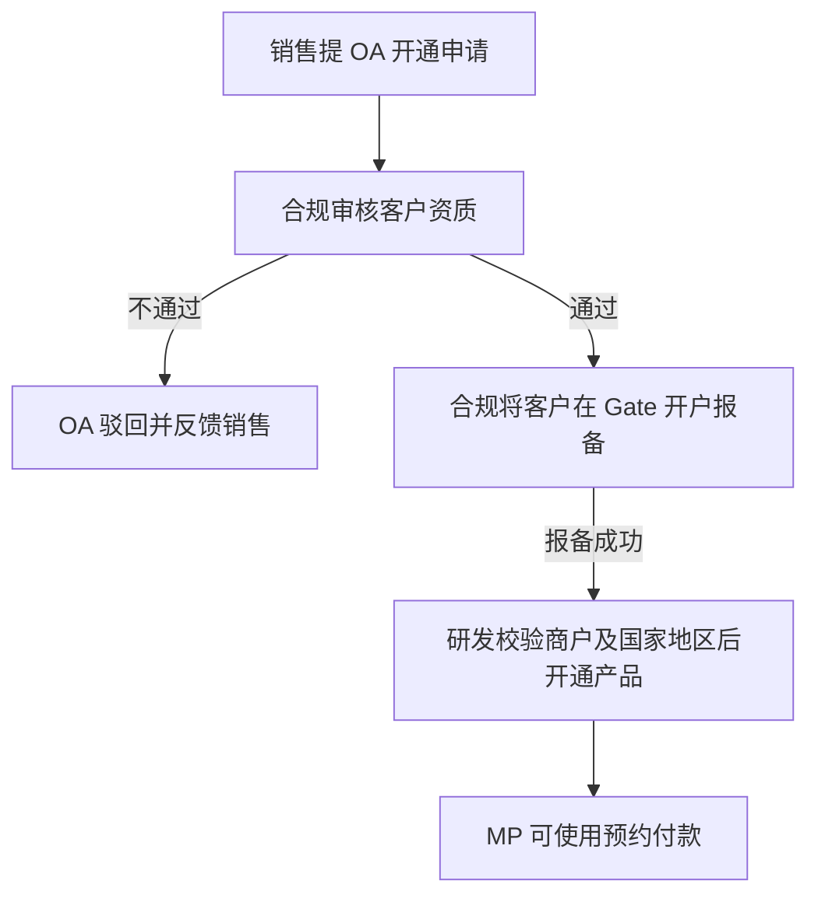
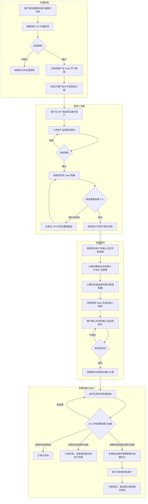
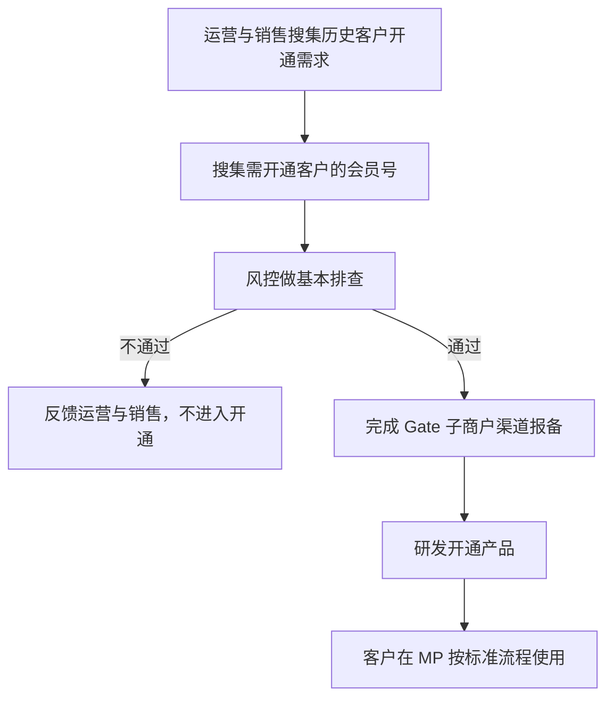
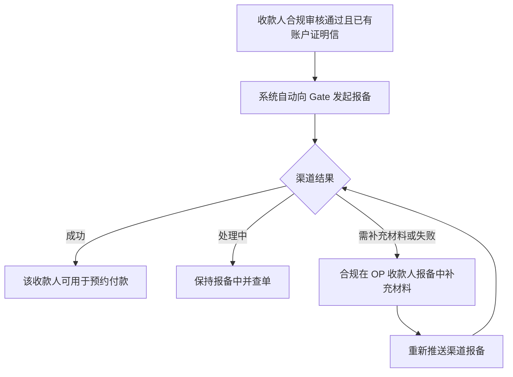

# 预约付款 V1—BB 单客户版 PRD

> 文档状态：待评审
> 版本定位：V1，先在 BB 系统以单个客户配置方式实现
> 适用端：BB OP、MP
> 适用范围：经业务、合规确认后定向开通的企业商户
> 系统边界：覆盖产品开通、收款人维护与审核、人工渠道报备、预约付款、计费、渠道查询及资管；不建设 EX 通用产品配置、EX Hub 三单、通用渠道能力和自动路由
> 核心原则：先实现可运营闭环；客户侧不感知渠道；有效期内多次充值按累计确认金关联

## 1. 版本目标

V1 用于验证预约付款产品的业务可行性和 Gate 全链路资金方案。BB OP 通过单客户配置为指定商户开通产品，MP 提供产品使用和收款人材料维护，运营人员完成人工审核、人工报备、异常处理和渠道查询。

本版本目标：

1. 研发可为单个商户开通或关闭预约付款，本期不提供 OP 开通页面。
2. MP 收款人银行账户支持上传账户证明信：新增可上传，存量收款人可编辑补充。
3. 合规审核账户证明信；审核通过且有证明信的收款人由系统自动向 Gate 报备，需补充材料时由合规在 OP 收款人报备中补充后重新推送。
4. 支持有效期内多次充值累计，以及少充、足额、超额三种金额分支。
5. 预约付款使用独立计费产品，客户费用与 Gate 渠道成本分开记录。
6. BB OP 可查询预约付款单和渠道执行结果。
7. 资管可完成 Gate 子账户、主账户及 Cactus 之间的资金管理和对账。

### 本期主要价值：一个新的产品形态

本期最核心的产品价值是推出一个区别于现有实时汇率 On Ramp / Off Ramp 的**新产品形态（固定 1:1 报价的预约付款）**。之所以把“新产品形态”作为本期主要价值，原因有三：

1. **1:1 报价稀缺，新形态本身就是获客点**：平台现有产品对客均为实时汇率；市场上存在 1:1 报价的产品但供给不多。固定 1:1 的预约付款作为一个新的产品形态，对客户有直接吸引力。
2. **契合当前成本形态，是最快的落地路径**：当前 1:1 产品的成本最优解是端到端全部走 Gate 渠道（包括充币钱包、数法兑换和 POBO 法币付款）。以独立的新产品形态承接，不改造现有实时换汇产品，是实现“全链路走 Gate”这件事最快的路径。
3. **同名提现**：本期仅支持将资金提现至与商户实名认证主体名称一致的银行账户，降低第三方付款及账户归属不一致风险。

## 2. 非目标

- 不建设 EX 产品中心的通用产品配置和自动开通流程。
- 不在 EX Hub 生成充币、数换法、法币付款三张交易单。
- 不建设多渠道能力模型、自动预路由或渠道自动切换。
- 不支持批量商户开通；每个商户由研发单独配置。
- 不支持实时汇率；固定使用 1:1。
- 仅支持 USD，最低付款金额默认 1,000 USD。
- 退票不作为预约付款单状态；发生退票时生成独立退票交易。

## 3. 角色与权限

| 角色         | 主要职责                                            | 权限限制                     |
| ------------ | --------------------------------------------------- | ---------------------------- |
| 商户（MP）   | 维护收款人、提交账户证明信、创建及查询预约付款      | 仅操作本商户数据，不感知渠道 |
| 研发         | 依据 OA 结果为单个商户开通/关闭产品、维护客户级配置 | 每次配置必须留痕             |
| BB 风控/合规 | 审核收款人账户证明信                                | 审核结果仅通过/拒绝          |
| BB 渠道运营  | 查询渠道执行结果、跟踪报备状态                      | 报备由系统自动触发           |
| BB 财务/资管 | 资金划转、余额查询、渠道对账、差错跟踪              | 资金操作需权限隔离和审计     |
| 独立计费产品 | 费用试算、计费确认、生成计费单                      | 客户收费与渠道成本分离       |

## 4. V1 功能范围

### 4.1 研发给单个客户开产品

#### 4.1.1 配置入口

本期不提供 BB OP 开通页面。销售发起 OA、合规审核并完成 Gate 开户报备后，研发依据 OA 结果在后台为指定商户维护客户级配置并开通产品。

#### 4.1.2 客户级配置

| 配置项        | V1 规则                |
| ------------- | ---------------------- |
| 产品          | 预约付款               |
| 会员 ID       | 单个会员，必填         |
| 商户名称      | 根据会员 ID 查询后回显 |
| 商户国家/地区 | 必须命中当前支持范围   |
| 产品状态      | 未开通、已开通、已关闭 |
| 备注          |                        |

#### 4.1.3 开通流程



产品开通页必须明确告知：`预约付款仅支持同名提现。提现银行账户名称必须与商户实名认证主体名称一致，不支持向供应商或其他第三方账户付款。`

MP 菜单中，“预约付款”入口位于“法币提现”下方；产品开通后，页面仅展示审核通过的同名 USD 银行账户。BB 平台本期不设置“发起/记录”Tab，进入预约付款后直接展示发起页面。

发起页顶部提醒：

`提醒：预约付款仅支持同名提现。收款账户名称必须与商户实名认证主体名称一致，且收款账户需要补充账户证明信。`

提醒区提供“去补充账户证明信”入口，跳转至对应银行账户的材料补充页面。

#### 4.1.4 新客户端到端流程

新客户从联系销售开通到完成首笔预约付款的完整流程如下：



说明：

1. 开通必须先完成合规审核及 Gate 开户报备，再由研发开通产品；动作顺序不可颠倒。
2. 收款人可用条件为“同名 + 合规审核通过 + 账户证明信已报备 Gate 成功”，渠道报备时效为 T+1；报备由系统自动发起。
3. 商户提交预约前必须完成验证码二次确认；提交后系统通过定时任务识别充值并按金额分支执行。
4. 充值不足继续等待，到期统一判断：无到账失效、不足失败且资金留在数币钱包不兑换、达到或超过按预约金额复用卖出数币逻辑付款，超出部分留在数币钱包；金额分支规则见 4.4。

#### 4.1.5 历史客户开通

存量历史客户分两步走：先小范围试点，跑通后再批量放开。

阶段一：试点（3-5 个客户）



阶段二：批量放开

试点客户跑通数轮真实交易后，如存在批量开通需求，可按同一准入口径批量执行：批量搜集会员号 → 风控批量排查 → 批量 Gate 子商户报备 → 批量开产品；报备失败的客户单独记录、修复后重新报备，不阻塞其他客户。

规则说明：

1. 试点范围：第一批选择 3-5 个历史客户，由运营与销售搜集需求并提供会员号。
2. 风控排查：风控对名单客户做基本排查，通过后才进入 Gate 子商户报备。
3. 开通动作：报备成功后由研发开通产品；报备成功不等于产品已开通。
4. 批量前提：试点客户完成数轮真实交易、验证渠道链路稳定后，才允许批量报备和批量开产品。
5. 开通后的客户操作流程与新客户一致，见 4.1.4。

### 4.2 MP 收款人账户证明信及修改流程

#### 4.2.1 新增字段

预约付款银行账户新增“账户证明信”，用于证明账户名称、银行名称、账号及账户归属信息。V1 仅允许提交与商户实名认证主体同名的银行账户；非同名账户不得用于预约付款。对已开通预约付款的商户展示该字段和材料状态。

| 字段       | 必填规则           | 校验                                  |
| ---------- | ------------------ | ------------------------------------- |
| 账户证明信 | 进入渠道报备前必填 | PDF/JPG/PNG；大小与数量按现有文件规范 |
|            |                    |                                       |
| 文件备注   | 选填               | 不超过 200 字                         |

#### 4.2.2 新增与修改

1. 新增收款人：客户可上传账户证明信并提交合规审核。
2. 存量收款人：客户可编辑收款人，补充账户证明信后提交合规审核。
3. 修改银行名称、账号、SWIFT、收款人名称等关键字段后，原审核和渠道报备资格失效，需重新提交审核。
4. 合规仅给出通过或拒绝；拒绝必须给出可对客原因，客户修改后重新提交。
5. 审核通过且已有账户证明信的收款人，系统自动向 Gate 发起报备；没有账户证明信的不报备。
6. 渠道要求补充材料时，由合规在 OP 收款人报备记录中补充材料后重新推送，不设独立 RFI 流程。

### 4.3 收款人审核与 Gate 自动报备

#### 4.3.1 收款人查询

支持按会员 ID、商户名称、收款人名称、银行账号尾号、审核状态查询。详情页展示收款人信息、银行信息、账户证明信、渠道报备记录和操作历史。

#### 4.3.2 审核

- 审核结果仅“通过/拒绝”。
- 本期不设 RFI 流程；渠道要求补充材料时，由合规在 OP 收款人报备中补充后重新推送。
- 拒绝必须填写内部原因和可对客原因。
- 审核通过不等于渠道报备成功。

#### 4.3.3 自动报备与补充重推



没有账户证明信的收款人不触发报备；报备由系统自动发起，本期不提供 OP 手工报备入口。

V1 创建预约付款时，仅允许选择与商户实名认证主体同名、且至少有一个适用渠道报备成功的银行账户；MP 不展示渠道名称和未完成报备过程。

### 4.4 预约付款及充值金额异常流程

本期实现复用现有“卖出数币”链路，不新建独立兑换通道：

1. 创建预约付款单时增加预约标记，关联收款账户、预约金额、充值币种/网络和充值有效期。
2. Gate 充币到账后，仅本订单专属地址的到账资金按预约标记计入累计。
3. 有效期内达到预约金额的，到期统一复用卖出数币逻辑完成兑换和付款。

#### 4.4.1 金额累计口径

- 同一预约付款单可在充值有效期内接收多笔同币种、同网络充值。
- 系统以已确认到账金额的累计值作为判断依据。
- 未确认、错币、错链、重复回调金额不得计入累计值。
- 每笔充值保存独立链上流水，但 V1 不生成 EX 三单。

#### 4.4.2 有效期内累计金额不足

第一笔或前几笔累计金额不足时，订单继续保持“待充值”，MP 展示：

`已到账 X USDT，仍需充值 Y USDT。请在 YYYY-MM-DD HH:mm 前完成充值。`

系统不得因单笔金额不足提前执行兑换或付款，也不得提前置为失败。

#### 4.4.3 到期统一判断与执行

1. 每笔充值确认后重新计算累计金额，但系统不因中途达到预约金额提前执行，统一在 48 小时到期时判断。
2. 到期时累计确认金额达到（含超过）预约金额：按预约的法币金额复用卖出数币逻辑执行兑换和付款，只执行一次。
3. 超出预约金额的部分不兑换，留在商户数币钱包，不享受 1:1；以此引导客户按需充值，避免预约 1,000 充值 2,000 的场景。
4. 示例：预约 1,000 USD，累计到账 1,003 U，到期执行 1,000 USD 的兑换和付款，剩余 3 U 留在数币钱包。

#### 4.4.4 到期未达到预约金额

1. 有效期内仍允许多次充值并累计，系统不得因单笔金额不足提前失败。
2. 到达充值截止时间时重新计算实际累计确认金额；若仍小于预约金额，预约付款单进入“失败”。
3. 不执行兑换，也不享受 1:1 汇率；已充值资金留在商户数币钱包。示例：预约 1,000 USD，累计到账 996 U，到期不做任何兑换。
4. 若到期前没有任何有效到账，预约付款单进入“已失效”。
5. 到期后的迟到到账不恢复原预约付款单，资金直接进入商户数币钱包，不能享受原预约单的 1:1 汇率。

#### 4.4.5 MP 重要提示

发起页右侧展示以下关键规则；同名账户和账户证明信相关提醒放在收款账户选择区上方，并提供“去补充账户证明信”入口：

1. `需先预约：仅预约付款可享受 1:1 固定汇率；不预约直接付款，不享受该汇率。`
2. `预约单有效期：48 小时。到期统一判断累计充值是否达到预约金额；超过有效期后充币，资金将入账至数币钱包，无法享受 1:1 汇率。`
3. `金额不足：到期时实际充值金额仍不够预约金额，不执行兑换，已充值资金留在数币钱包，不享受 1:1 汇率。`
4. `超额充值：到期仅按预约金额兑换并付款；超出部分不兑换，留在数币钱包。请按需充值，避免多充。`
5. `不可取消：本期预约付款发起后暂不支持取消。`
6. `同名账户：仅支持商户实名认证主体同名银行账户；该账户需补充账户证明信，审核时效为 T+1。`
7. `账户仍不可选：账户证明信审核通过后仍无法选择时，请联系客户经理。`

“汇款人名称”不提供选择卡片，固定展示为商户实名认证主体名称。

#### 4.4.6 V1 预约付款状态

| 状态     | 说明                                   |
| -------- | -------------------------------------- |
| 待充值   | 等待一笔或多笔充值累计达到目标         |
| 处理中   | 已达到执行条件，正在兑换或付款         |
| 付款成功 | 预约付款已成功完成                     |
| 失败     | 实际充值金额不够预约金额或执行明确失败 |
| 已失效   | 有效期内无有效充值                     |

结果未知时保持“处理中”并查询原请求结果，不新增额外状态。退票由独立退票交易处理。

### 4.5 计费

1. 对客手续费计算与收取为 BB 内部逻辑，使用独立计费产品，不调用 Gate 接口；收费因子为“产品=预约付款”。
2. 研发开通客户时必须关联收费方案。
3. MP 创建订单前调用计费试算，展示客户费用和应充值金额。
4. 创建预约付款单时确认计费并生成独立计费单。
5. Gate 渠道费用仅作为渠道成本记录，不直接作为客户收费。
6. 多次充值不重复收取订单级费用；如存在按笔链上费用，应由计费规则明确。
7. 失败、失效、超额余额的收费及退费规则须形成配置快照。

### 4.6 渠道查询页面

预约付款不新增独立一级菜单，统一归入 BB OP 现有“出金交易管理”。菜单结构为：

- 出金交易管理- 增加以下菜单 （出金交易查询下）

  - 预约付款交易查询—— 运营查询
  - 预约付款风控审核—— 风控处理

“出金交易查询”“法币提现渠道单查询”“渠道单处理”仅复用或预留 BB OP 现有页面，本交互不补充页面内容。预约付款相关查询、审核和财务处理的交易类型固定为“预约付款”。

- 渠道失败人工置为失败时，必须提示：

`请先与渠道确认退款金额以及手续费是否退回。`

### 4.7 资管

#### 4.7.1 资金链路

Gate 侧采用“子账户充币、主账户集中、按单调拨回子账户出款”的调拨模式：

1. 客户向 Gate 客户子账户充币。
2. 子账户到账后统一调拨（归集）至 Gate 主账户集中管理。
3. 到期判断达到预约金额后，按预约付款单从主账户调拨对应资金回该客户子账户。
4. 客户子账户复用卖出数币逻辑执行兑换并 POBO 出款。
5. 到期未达到预约金额的订单不执行兑换，资金从主账户调回客户数币钱包。
6. Gate 主账户中的留存资金由资管按周期或余额阈值提至 Cactus。

#### 4.7.2 资管功能

| 功能           | V1 要求                                            |
| -------------- | -------------------------------------------------- |
| 子账户余额查询 | 按商户查询 Gate 客户子账户资产和余额               |
| 主账户余额查询 | 查询 Gate 主账户可用、冻结和在途余额               |
| 子转主归集     | 支持自动触发结果查询和人工补查                     |
| 主转子回拨     | 按预约付款单发起，必须关联业务单号                 |
| 提至 Cactus    | 支持审批、执行、结果查询和流水留存                 |
| 对账           | 核对 MP/BB 订单、Gate 流水、账户余额和 Cactus 到账 |
| 异常跟踪       | 记录资金位置、金额、责任步骤及处理结果             |

### 4.7 对客邮件通知

- 通知渠道：仅客户注册邮箱，本期不发短信、不推送其他渠道。
- 触发时点：预约付款单创建成功、到期前 2 小时仍未足额、到期失效。
- 每封邮件保存发送记录：收件邮箱、模板编码、模板版本、关联订单号、发送时间和发送结果；发送失败按通知服务规则重试，不得重复触发业务动作。
- 邮件仅展示对客信息，不出现渠道名称、渠道流水号及内部失败原因。

模板变量：

| 变量                | 含义                   |
| ------------------- | ---------------------- |
| {orderNo}           | 预约付款单号           |
| {beneficiaryName}   | 收款人名称             |
| {paymentAmount}     | 付款金额（USD）        |
| {depositAmount}     | 应充值金额             |
| {asset} / {network} | 充值币种 / 网络        |
| {address}           | 本订单专属充值地址     |
| {deadline}          | 充值截止时间           |
| {receivedAmount}    | 已到账累计金额         |
| {shortfall}         | 距预约金额的待充值差额 |

#### T1 预约付款创建成功

- 触发：预约付款单及充值指令创建成功。
- 主题：`【预约付款】订单创建成功，请在 48 小时内完成充值`
- 正文：

```text
尊敬的商户：

您的预约付款订单已创建成功。请在充值有效期内向本订单专属充值地址完成充值，
方可按 1:1 固定汇率完成付款。

订单号：{orderNo}
收款人：{beneficiaryName}
付款金额：{paymentAmount} USD
应充值金额：{depositAmount} {asset}
充值币种 / 网络：{asset} / {network}
充值地址：{address}
充值有效期：48 小时（截止 {deadline}）

温馨提示：
1. 请务必使用本订单指定的币种和网络，并仅向上述地址充值；向其他地址或通过
   其他渠道充值的资金不会计入本订单，也无法享受 1:1 固定汇率。
2. 有效期内可分多笔充值，按累计确认到账金额计算，到期统一判断是否达到
   预约金额。
3. 到期时累计仍未达到预约金额：订单失败，不执行兑换，已充值资金留在您的
   数币钱包，不享受 1:1 汇率；到期时无任何有效到账：订单失效。
4. 到期时累计超过预约金额：仅按预约金额兑换并付款，超出部分不兑换，
   留在您的数币钱包。请按需充值，避免多充。
```

#### T2 到期前 2 小时未足额提醒

- 触发：距充值截止时间剩余 2 小时，且累计确认金额仍小于预约金额（含无任何到账）。
- 主题：`【预约付款】充值提醒：订单将于 2 小时后到期`
- 正文：

```text
尊敬的商户：

您的预约付款订单 {orderNo} 将于 {deadline} 到达充值截止时间（剩余约 2 小时）。

已到账金额：{receivedAmount} {asset}
应充值金额：{depositAmount} {asset}
待充值差额：{shortfall} {asset}
充值地址：{address}（{asset} / {network}）

请尽快完成充值。到期仍未达到预约金额的，订单将失效，原预约付款不再执行，
且无法享受 1:1 固定汇率；已充值资金将留在您的数币钱包，不做兑换。
```

- 同一订单仅发送一次；提醒发送后新到账使累计足额的，不再重复提醒。

#### T3 到期失效通知

- 触发：到达充值截止时间，订单进入“失败”（有到账但不足）或“已失效”（无有效到账）。
- 主题：`【预约付款】订单已到期失效`
- 正文：

```text
尊敬的商户：

您的预约付款订单 {orderNo} 已于 {deadline} 到达充值截止时间。

付款金额：{paymentAmount} USD
累计到账：{receivedAmount} {asset}

因到期时累计充值未达到预约金额，订单已失效，原预约付款不再执行，
无法享受 1:1 固定汇率。已充值资金（如有）将留在您的数币钱包，不做兑换。

到期后的迟到到账不会恢复原订单，资金将直接入账至您的数币钱包，
同样不享受 1:1 汇率。如需继续付款，请重新创建预约付款订单。
```

- 无有效到账的失效订单，正文省略“已充值资金（如有）将留在您的数币钱包”一句，替换为“本订单无有效充值到账”。

## 5. 页面交互

- BB MP 页面交互见：[预约付款-BB-MP交互文档.html](./预约付款-BB-MP交互文档.html)
- BB OP 页面交互见：[预约付款-BB-OP交互文档.html](./预约付款-BB-OP交互文档.html)

## 6. 验收标准

1. 研发可对一个指定商户开通预约付款，其他商户不受影响。
2. 新增收款人可上传账户证明信并进入合规审核；存量收款人可编辑补充账户证明信。
3. 审核通过且有账户证明信的收款人自动报备 Gate；没有账户证明信的不报备。
4. 渠道要求补充材料时，合规在 OP 收款人报备中补充后可重新推送报备。
5. 有效期内多次充值可正确累计，中途不提前执行，统一在 48 小时到期时判断。
6. 到期累计达到（含超过）预约金额时，复用卖出数币逻辑按预约金额只执行一次兑换和付款。
7. 超出预约金额的部分不兑换，留在数币钱包；到期未达到时订单失败，不执行兑换，已充值资金留在数币钱包且不享受 1:1。
8. 超过 48 小时的迟到充值进入数币钱包，不恢复原预约付款单，也不享受 1:1 汇率。
9. 计费单、客户费用和 Gate 渠道成本可分别查询。
10. Gate 子转主、主转子、Off、POBO、提至 Cactus 均可追踪和对账。
