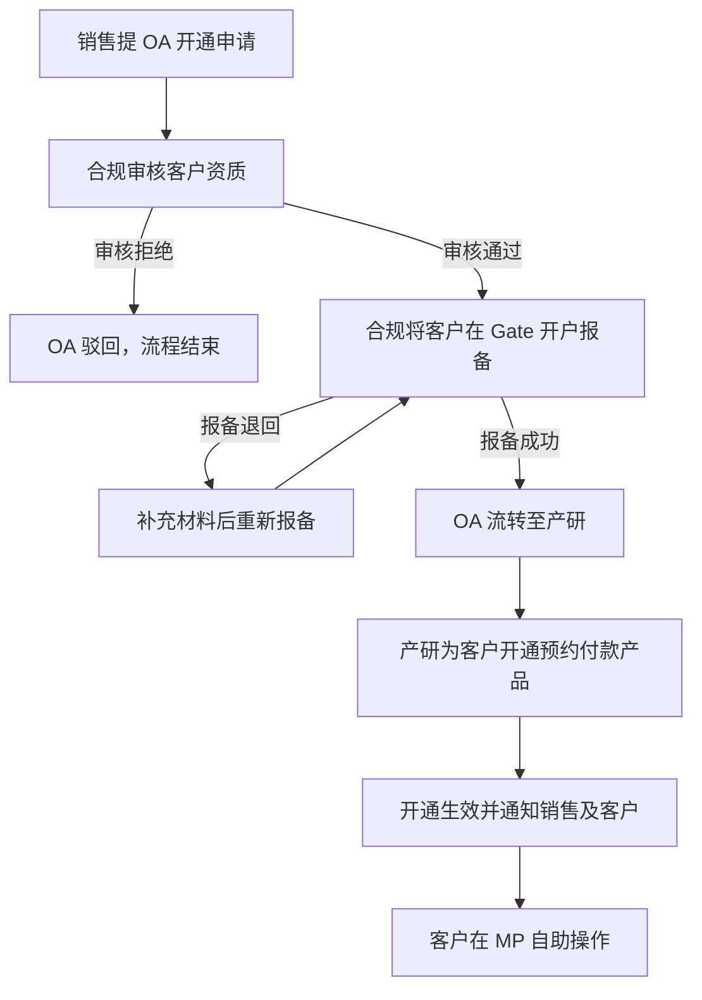
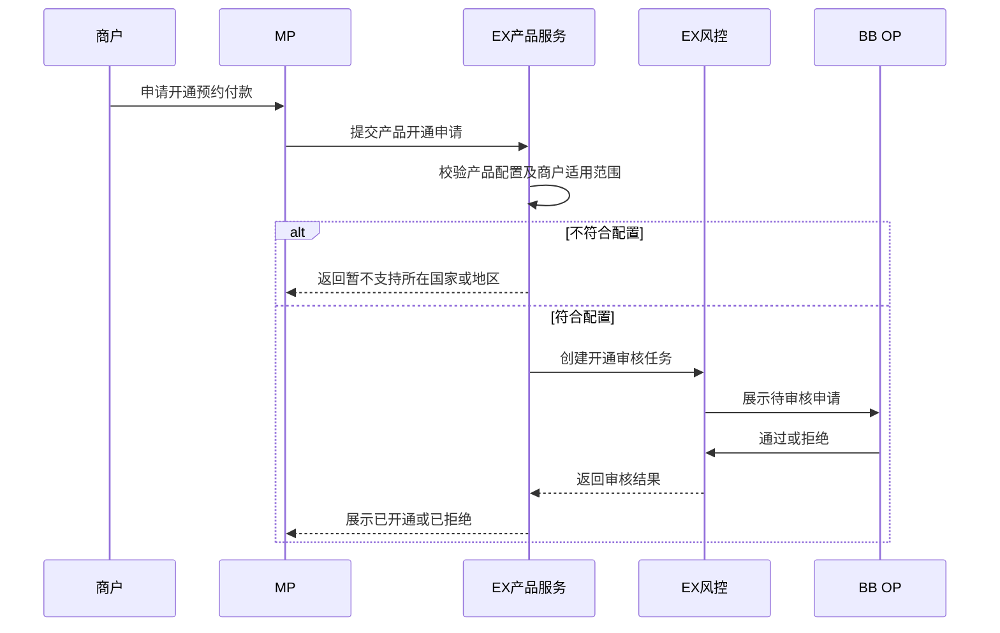
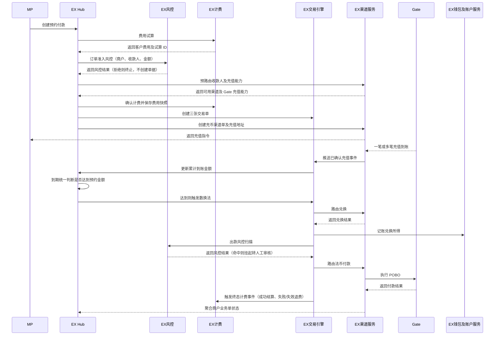
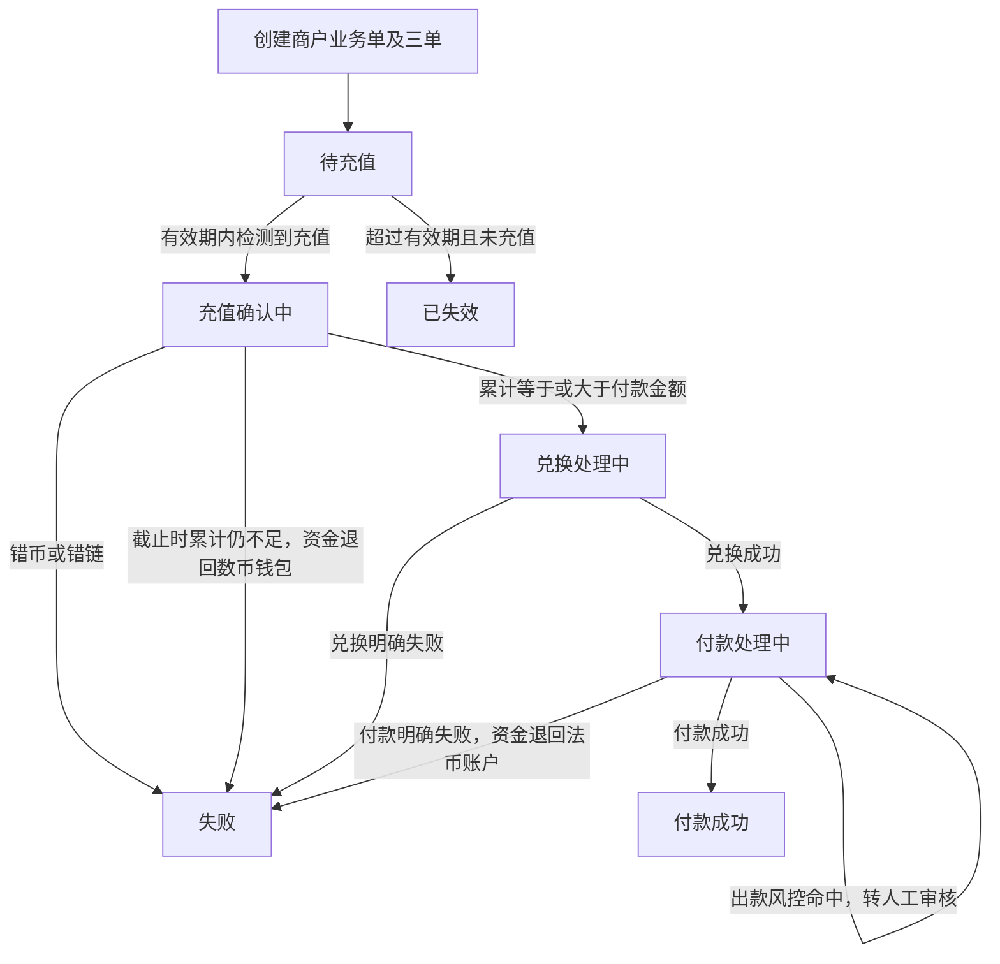
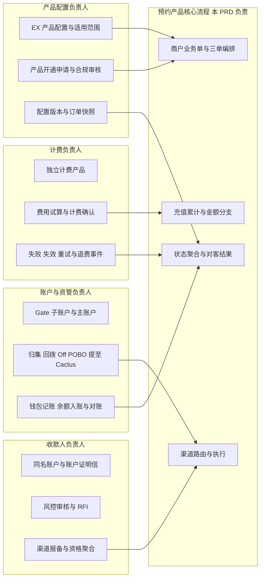

# 预约付款 V2—EX 平台化与自动化 PRD

> 文档状态：规划中
> 版本定位：V2，将 V1 业务闭环迁移至 EX 并实现平台化、自动化
> 适用端：MP、BB OP/PP、EX
> 适用范围：满足产品配置和合规准入条件的企业商户
> 系统边界：覆盖 EX 产品配置与开通、EX Hub 三单、渠道能力与路由、自动执行、统一状态和 V1 遗留能力迁移
> 核心原则：产品规则配置化、订单执行自动化、渠道能力标准化、历史快照不可变

## 1. 版本目标

V2 不再依赖 BB OP 为每个商户做孤立配置，而是在 EX 建设可复用的预约付款产品能力。EX 负责产品准入、产品开通、订单编排、三单关联、渠道能力判断、路由和自动执行；BB OP/PP 保留审核、异常处置和运营查询职责。

## 2. V2 范围

1. EX 产品配置和产品开通。
2. EX Hub 创建商户业务单，并预创建充币、数换法、法币付款三张交易单。
3. 建设渠道能力模型、收款人渠道资格判断、预路由和正式路由。
4. 迁移 V1 的客户配置、收款人材料、渠道报备、计费、查询、资管和异常处理。
5. 自动化充值认领、累计金额判断、兑换、付款、状态聚合、通知和对账。

## 3. 产品配置与产品开通

### 3.1 产品配置

| 配置项         | V2 要求                                                        |
| -------------- | -------------------------------------------------------------- |
| 产品编码/名称  | 预约付款                                                       |
| 支持商户范围   | 按国家/地区、机构代理、商户标签配置                            |
| 支持法币       | 本期继承 USD；后续可配置扩展                                   |
| 充值资产与网络 | 按渠道能力配置，不设页面默认值                                 |
| 最低付款金额   | 默认 1,000 USD，可按产品版本配置                               |
| 充值有效期     | 产品配置并在订单创建时保存快照                                 |
| 汇率模式       | 当前固定 1:1，保留未来扩展能力                                 |
| 提现账户规则   | 当前仅支持同名提现；银行账户名称必须与商户实名认证主体名称一致 |
| 收费方案       | 关联独立计费产品                                               |
| 可用渠道       | 按渠道能力、商户、收款人账户和币种网络配置                     |

### 3.2 产品开通

#### 3.2.1 本期开通流程（OA 申请 + 产研开通）

本期不提供商户自助申请入口，开通由销售发起 OA、合规审核并完成 Gate 开户报备后，由产研在后台为客户开通产品：



流程说明：

1. 销售在 OA 系统发起预约付款开通申请，提交客户主体资料、业务场景和预计交易量。
2. 合规完成客户准入审核；审核不通过在 OA 驳回，不进入后续环节。
3. 审核通过后，合规将客户在 Gate 完成开户报备；报备被退回时补充材料重新报备，直至报备成功。
4. 合规在 OA 标记审核及报备完成，OA 流转至产研。
5. 产研依据 OA 结果在后台为该客户开通预约付款产品；本期无产品化开通页面，由技术配置生效。
6. 开通生效后通知销售及客户，后续收款人维护、创建预约付款、充值和订单查询均由客户在 MP 自助完成。

本期开通必须留档：OA 单号、合规审核结论、Gate 开户报备 ID、开通时间和操作人，用于审计和后续向产品化开通迁移。

#### 3.2.2 后续目标流程（自助申请 + 线上审核）

后续阶段将开通迁移为 MP 自助申请、线上审核、系统自动生效：



后续产品开通审核仍只有“通过/拒绝”。配置校验在提交申请前完成，不满足条件的申请不得进入审核。

产品开通页必须明确告知：预约付款仅支持同名提现，提现银行账户名称必须与商户实名认证主体名称一致；非同名账户不得作为预约付款目标账户。

## 4. EX Hub 三单

### 4.1 单据模型

| 单据           | 所有者      | 作用                             | 关键关联                 |
| -------------- | ----------- | -------------------------------- | ------------------------ |
| 商户业务单     | EX Hub      | 记录预约付款产品意图和对客结果   | 商户单号为主单号         |
| 充币交易单     | EX 交易引擎 | 记录充值认领、累计到账和完成结果 | 关联商户单               |
| 数换法交易单   | EX 交易引擎 | 记录 U→USD 的兑换结果           | 关联商户单和充币交易单   |
| 法币付款交易单 | EX 交易引擎 | 记录 POBO 付款结果               | 关联商户单和兑换交易单   |
| 渠道单         | EX 渠道服务 | 记录每次渠道请求和结果           | 关联交易单号、交易子单号 |

交易单只关注交易类型，不保存产品名称；通过关联商户业务单识别业务来源。

### 4.2 创建时点

商户提交预约付款时，EX Hub 完成预路由并一次性创建：

1. 预约付款商户业务单；
2. 充币交易单；
3. 数换法交易单；
4. 法币付款交易单；
5. Gate 充值地址对应的充币渠道单。

未完成预路由不得生成充值地址。三张交易单创建后按前置条件依次执行，不得重复创建。

### 4.3 自动编排



编排说明：

1. 费用试算在创建订单前完成，MP 按试算结果展示客户费用；确认计费与三单创建保持同一幂等键，费用快照随商户业务单保存。
2. 订单准入风控在预路由和三单创建之前执行，风控拒绝时不生成交易单、渠道单和充值指令。
3. 出款风控在法币付款路由前执行；命中拦截的订单挂起并转 BB 风控人工审核，审核通过后续跑原路由，审核拒绝进入失败与资金退回分支。
4. 订单到达终态（付款成功、失败、已失效）时按标准计费事件结算或退费，多渠道重试不得重复收取订单级费用。

## 5. 渠道能力与路由

### 5.1 渠道能力模型

渠道能力至少包含：

- 支持的产品场景和交易类型；
- 商户国家/地区；
- 法币、数币和网络；
- 收款人类型、银行国家和银行字段要求；
- 是否要求收款人账户级报备；
- 是否支持充值地址、Off、POBO；
- 金额上下限、服务时间、渠道状态；
- 渠道商户、渠道账户和资金账户可用性。

### 5.2 收款人资格聚合

- 收款人通过 EX 风控且账户有效后，才进入渠道资格判断。
- 银行账户名称必须与商户实名认证主体名称一致，且至少一个适用渠道报备成功，才可用于预约付款。
- 没有成功渠道且仍有渠道处理中时，收款人主状态为“处理中”。
- 所有适用渠道均失败时，收款人主状态为“不可用”。
- RFI 是独立流程，不作为收款人主状态。
- MP 只展示可用或不可选择结果，不暴露具体渠道和备案过程。

### 5.3 预路由

预路由发生在商户提交预约付款之前，用于确定：

1. 商户和产品是否可用；
2. 收款人是否具备至少一个可用渠道资格；
3. USD、充值币种和网络是否受支持；
4. 渠道资金账户和充值地址能力是否可用；
5. 是否能够生成本单充值指令。

无可用渠道时提示：

`当前收款账户暂无法用于预约付款。请更换已验证的收款账户，或联系客户经理协助处理。`

### 5.4 正式路由

交易执行时基于预路由快照重新校验渠道状态。V2 支持：

- 按交易类型分别路由充币、数换法和法币付款；
- 同一交易的路由幂等；
- 渠道失败后的授权重试；
- 每次尝试生成独立渠道单；
- 路由结果和命中规则可审计。

是否允许三个交易使用不同渠道、是否允许自动切换，需在渠道与资金方案评审后确认；未确认前默认沿用 V1 的 Gate 全链路。

## 6. V1 功能迁移与自动化

| V1 能力          | V2 目标                                                |
| ---------------- | ------------------------------------------------------ |
| BB 单客户配置    | 迁移为 EX 产品配置、适用范围和商户产品开通记录         |
| OP 手工开通      | 商户申请、配置校验、OP 审核、自动生效                  |
| MP 账户证明信    | 进入 EX 收款人材料模型和版本管理                       |
| OP 手工审核      | 保留 BB 审核人，任务和结果统一保存在 EX                |
| OP 手工渠道报备  | EX 自动判断适用渠道并创建报备任务，OP 保留手工补报能力 |
| 充值多笔人工判断 | EX Hub 自动累计已确认金额并触发金额分支                |
| 单一预约付款记录 | EX Hub 商户业务单 + 三张交易单 + 渠道单                |
| 本地渠道查询     | EX 统一渠道单查询并提供 BB OP 视图                     |
| 手工查单         | 超时后自动查询原请求，保持当前处理中状态               |
| BB 资管流水      | 进入 EX 资金事件、账户流水和统一对账                   |
| 独立计费         | 保留计费产品，增加 EX 标准试算和确认接口               |

## 7. 金额处理自动化

### 7.1 金额比较口径

- 比较基准为预约付款金额 payment_amount，不是包含费用的应充值金额 required_deposit_amount。
- 实际充值金额按订单创建时固化的 1:1 汇率折算为 USD 后与 payment_amount 比较，统一在充值到期时判断，结果保存为 REACHED（含超过）或 NOT_REACHED。
- 客户费用按计费快照单独处理，不改变到期统一判断口径。

### 7.2 到期统一判断（沿用 BB 现行规则）

统一在充值到期时判断累计确认金额是否达到预约金额，中途不提前执行：

| 分支                           | 处理                                               | 资金去向                                     |
| ------------------------------ | -------------------------------------------------- | -------------------------------------------- |
| 到期累计达到（含超过）预约金额 | 按预约的法币金额执行数换法和 POBO 付款，只执行一次 | 超出部分不兑换，留在商户数币钱包，不享受 1:1 |
| 到期仍小于预约金额             | 订单失败，不执行兑换，也不享受 1:1                 | 已充值资金留在商户数币钱包                   |
| 到期无有效到账                 | 订单已过期                                         | 无资金处理                                   |

以此引导客户按需充币，避免预约 1,000 充值 2,000。示例：预约 1,000 充 996，到期不做任何兑换；充 1,003，到期执行 1,000 的兑换和付款，剩余 3 留在数币钱包。

### 7.3 累计与边界规则

1. 有效期内允许多笔充值，按同一订单已确认金额累计；同一链上交易只认领一次，重复到账通知不重复入账。
2. 截止时间前累计不足时保持充值确认中，继续等待后续有效充值，不执行兑换或付款。
3. 有效期从充值指令生成时间起算，订单保存有效时长和充值截止时间快照；产品配置变更只影响新订单。
4. 到期时无有效到账，订单已失效；迟到到账不恢复原订单，迟到资金单独进入资金异常处理。
5. 错币、错链不自动兑换或付款，订单失败并进入人工核查。
6. 金额不足失败的对客失败原因统一展示「实际充值金额不够预约金额」。

## 8. 状态

### 8.0 状态机



- 终止态（付款成功、失败、已失效）不得被迟到回调回退或覆盖；需要重新付款时重新创建预约付款单。
- 出款风控命中时订单挂起并保持付款处理中，审核通过后续跑原路由，审核拒绝进入失败及资金退回分支。

### 8.1 商户业务单

| 状态       | 说明                                   |
| ---------- | -------------------------------------- |
| 待充值     | 等待一笔或多笔充值                     |
| 充值确认中 | 已检测到充值，等待链上或渠道确认       |
| 兑换处理中 | 正在执行数换法                         |
| 付款处理中 | 正在执行 POBO                          |
| 付款成功   | 成功终态                               |
| 失败       | 金额不足、充值错误、兑换或付款明确失败 |
| 已失效     | 有效期内无有效到账                     |

结果未知时保持对应处理中状态并查询原请求，不增加额外状态。退票生成独立退票交易，不改变预约付款商户业务单状态。

### 8.2 状态聚合

- 商户业务单由三张交易单聚合。
- 交易单由自身交易结果决定，不因渠道重试覆盖历史。
- 渠道单记录单次渠道请求状态。
- 所有状态迁移必须幂等，并记录事件来源和版本。
- 每次状态迁移记录迁移前后状态、业务事件、事件来源、关联交易单号、渠道单号、操作主体、时间和链路追踪 ID。
- 回调乱序时以交易步骤、状态版本和事件时间共同判断；已处理事件幂等返回，不重复推进状态。
- 不在迁移规则内的状态迁移一律拒绝。

## 9. 计费

- 收费因子继续使用“产品=预约付款”。
- EX 产品开通记录关联计费方案。
- EX Hub 创建订单前调用费用试算，创建订单时确认计费。
- 商户业务单保存客户费用快照；渠道单保存渠道成本。
- 多渠道或重试不得导致客户订单级费用重复收取。
- 失败、失效、重试和退费通过标准计费事件处理。
- 计费产品不可用、试算失效或确认金额与试算不一致时，阻断创建，不生成可充值订单。
- 重复计费确认按商户单和幂等键返回原计费结果，不重复生成计费单。
- 客户费用与渠道费用分别保存、分别对账，任一方调整不得覆盖另一方历史记录。

## 10. 资管与对账

V2 将 V1 的 Gate 子账户、主账户和 Cactus 流程纳入 EX 资金事件：

- 子账户充值到账；
- 子转主归集；
- 主转子按单回拨；
- Off；
- POBO；
- 到期不足及超出部分资金留在商户数币钱包；
- Gate 主账户定期提 U 至 Cactus。

每个事件必须关联商户 MID、商户业务单号、交易单号、渠道单号、资产、金额、费用和资金账户。自动对账发现差异后生成资金异常任务。

## 11. 风控、异常与资金退回

### 11.1 风控

- 产品开通校验与交易级风控相互独立；产品已开通不代表每笔预约付款自动放行。
- V2 在创建订单前执行订单准入风控（商户、收款人、金额），替代 V1「下单是否单独调用交易风控」的待确认项。
- 充币交易单沿用现有充币交易风控；法币付款交易单在付款发起前必须执行出款风控，未通过不得继续执行。
- 执行兑换和付款前重新校验产品配置和收款人资格仍有效，避免等待充值期间配置失效。
- 高风险或敏感原因仅向授权运营角色展示；MP 使用可行动的通用提示。
- 完整数币地址、银行账号及渠道原始报文按角色脱敏，查看记录审计日志。

### 11.2 异常场景

| 场景                         | 系统处理要求                                                                   |
| ---------------------------- | ------------------------------------------------------------------------------ |
| 计费试算失败或计费产品不可用 | 不展示可确认费用，阻断创建，支持安全重试                                       |
| 计费确认金额与试算不一致     | 阻断创建并重新试算，不自动接受变更金额                                         |
| Gate 充值地址申请失败        | 商户单不得进入可充值状态，按幂等规则安全重试，不得改由钱包服务生成地址         |
| 子账户归集失败               | 不计为可执行资金，不发起回拨或 Off + POBO，进入资金异常队列                    |
| 主账户余额不足以完成本单回拨 | 停止在待资金调拨，禁止挪用其他客户资金，通知资金运营补足                       |
| 回拨失败或结果未知           | 不发起 Off + POBO，按幂等键查询原调拨结果，明确失败后方可重试                  |
| 渠道超时或结果未知           | 保持当前处理中状态并主动查询，明确终态前禁止重复发起                           |
| 渠道单人工置为失败           | 仅授权运营可操作；必须先与渠道确认退款金额及手续费退回，生成退款跟踪和完整审计 |
| 回调乱序                     | 按状态版本或事件时间处理，不允许终态回退                                       |
| 付款后发生退票               | 不改变商户业务单状态，生成独立退票交易并关联原付款交易                         |

### 11.3 付款失败与资金退回

- 对客口径：付款失败后，资金按下单锁定的原汇率退回到商户法币账户，商户可从法币账户重新发起出款，无需重新充值。
- 对内口径：Gate 渠道侧退回的数币不逐笔返还客户综合钱包，随 Gate 主账户定期归集后外提至 Cactus；该路径的合规性列入待确认事项。
- 兑换失败不得发起付款，保留失败时资金位置和失败快照；付款失败不得重复付款，按明确规则重试、退款或重建。

### 11.4 通知与审计

- 产品开通、关闭或失败，以及商户单创建、充值确认、付款成功、失败和失效时通知商户。
- 异常队列对充值失败、兑换失败及结果未知生成待处理提醒。
- 保存协议、开通、订单、计费、充值指令、交易执行、渠道请求回调和人工操作的不可变快照与审计日志。
- 所有写接口幂等；查询与导出按租户、机构代理商及角色隔离；金额、汇率和费用使用明确精度及舍入规则，不使用浮点数直接计算。

### 11.5 对客邮件通知

- 通知渠道：仅客户（Merchant/MP）注册邮箱，本期不发短信、不推送其他渠道。
- 通知术语遵循《EX 平台专业术语表》：预约单（Reservation Order）、充币（Crypto Deposit）、数币钱包（Crypto Wallet）、法币账户（Fiat Account）、汇率（FX Rate）、收款人（Beneficiary）；订单标识使用 `transactionId`（对客主单号）和 `bizOrderNo`，禁止对客暴露渠道单号（Channel Ref ID）。
- 触发时点：预约单创建成功、到期前 2 小时仍未足额、到期失效。
- 每封邮件保存发送记录：收件邮箱、模板编码、模板版本、`merchantNo`、`transactionId`、发送时间和发送结果；发送失败按通知服务规则重试，不得重复触发业务动作。

模板变量：

| 变量                | 含义                                         | 来源字段          |
| ------------------- | -------------------------------------------- | ----------------- |
| {transactionId}     | 交易 ID（对客单号）                          | `transactionId` |
| {bizOrderNo}        | 商户业务订单号                               | `bizOrderNo`    |
| {beneficiaryName}   | 收款人名称                                   | 收款人快照        |
| {paymentAmount}     | 付款金额（USD）                              | 预约单快照        |
| {depositAmount}     | 应充币金额                                   | 预约单快照        |
| {asset} / {network} | 充币币种 / 网络                              | 充币指令快照      |
| {address}           | 本预约单专属充币地址                         | 充币指令快照      |
| {validityHours}     | 充值有效期（产品配置快照，本期默认 48 小时） | 产品配置快照      |
| {deadline}          | 充币截止时间                                 | 预约单快照        |
| {receivedAmount}    | 已确认充币累计金额                           | 充币交易单        |
| {shortfall}         | 距预约金额的待充币差额                       | EX Hub 计算       |

#### T1 预约单创建成功

- 触发：预约单及充币指令创建成功。
- 主题：`【预约付款】预约单创建成功，请在 {validityHours} 小时内完成充币`
- 正文：

```text
尊敬的商户：

您的预约单已创建成功。请在充币有效期内向本预约单专属充币地址完成充币，
方可按 1:1 固定汇率（FX Rate）完成付款。

交易 ID：{transactionId}
商户业务订单号：{bizOrderNo}
收款人（Beneficiary）：{beneficiaryName}
付款金额：{paymentAmount} USD
应充币金额：{depositAmount} {asset}
充币币种 / 网络：{asset} / {network}
充币地址：{address}
充币有效期：{validityHours} 小时（截止 {deadline}）

温馨提示：
1. 请务必使用本预约单指定的币种和网络，并仅向上述地址充币；向其他地址或
   通过其他渠道充币的资金不会计入本预约单，也无法享受 1:1 固定汇率。
2. 有效期内可分多笔充币，按累计确认到账金额计算，到期统一判断是否达到
   预约金额。
3. 到期时累计仍未达到预约金额：预约单失败，不执行兑换，已充币资金留在您的
   数币钱包（Crypto Wallet），不享受 1:1 汇率；到期时无任何有效到账：预约单
   已过期（Expired）。
4. 到期时累计超过预约金额：仅按预约金额兑换并付款，超出部分不兑换，
   留在您的数币钱包。请按需充币，避免多充。
```

#### T2 到期前 2 小时未足额提醒

- 触发：距充币截止时间剩余 2 小时，且累计确认金额仍小于预约金额（含无任何到账）。
- 主题：`【预约付款】充币提醒：预约单将于 2 小时后到期`
- 正文：

```text
尊敬的商户：

您的预约单 {transactionId} 将于 {deadline} 到达充币截止时间（剩余约 2 小时）。

已到账金额：{receivedAmount} {asset}
应充币金额：{depositAmount} {asset}
待充币差额：{shortfall} {asset}
充币地址：{address}（{asset} / {network}）

请尽快完成充币。到期仍未达到预约金额的，预约单将失效，原预约付款不再执行，
且无法享受 1:1 固定汇率；已充币资金将留在您的数币钱包（Crypto Wallet），不做兑换。
```

- 同一预约单仅发送一次；提醒发送后新到账使累计足额的，不再重复提醒。

#### T3 到期失效通知

- 触发：到达充币截止时间，预约单进入「失败」（有到账但不足）或「已过期」（无有效到账）。
- 主题：`【预约付款】预约单已到期失效`
- 正文：

```text
尊敬的商户：

您的预约单 {transactionId} 已于 {deadline} 到达充币截止时间。

付款金额：{paymentAmount} USD
累计到账：{receivedAmount} {asset}

因到期时累计充币未达到预约金额，预约单已失效，原预约付款不再执行，
无法享受 1:1 固定汇率。已充币资金（如有）将留在您的数币钱包
（Crypto Wallet），不做兑换。

到期后的迟到到账不会恢复原预约单，资金将直接入账至您的数币钱包，
同样不享受 1:1 汇率。如需继续付款，请重新创建预约单。
```

- 无有效到账的失效预约单，正文省略“已充币资金（如有）将留在您的数币钱包”一句，替换为“本预约单无有效充币到账”。

## 12. 页面交互

V2 延续并改造现有页面：

- MP：[fiat-crypto-platform-interactive.html](./fiat-crypto-platform-interactive.html)
- BB OP：[预约付款-BB-OP交互文档.html](./预约付款-BB-OP交互文档.html)
- PP/EX 运营后台：[预约付款-运营后台交互文档.html](./预约付款-运营后台交互文档.html)

页面需将 V1 的单客户配置入口替换为 EX 产品配置与产品开通视图，并按 EX 三单数据模型展示订单关系。

BB OP 保留审核、异常处置和运营查询职责，功能点包括：

- 产品开通：开通记录查询、启停、操作日志；本期由产研依据 OA 结果开通，审核通过/拒绝在后续自助申请阶段提供。
- 预约付款交易查询：预约信息、实际充值/兑换/付出、余额入账、失败原因和处理进度。
- 风控审核：出款风控命中的订单人工审核，通过后续跑、拒绝进入失败分支。
- 财务处理：更新出款账户、失败待确认订单处置、渠道单置为失败。
- 渠道单查询与处理：渠道请求、流水、费用、回调及退款跟踪。
- 收付工具管理：商户地址新增、重新分配（原地址立即失效）及变更历史。
- 渠道商户管理：渠道商户报备、渠道 VA 开户、收款人渠道报备与 RFI 补件。

## 13. 接口与数据要求

| 接口           | 调用方向                    | 关键要求                            |
| -------------- | --------------------------- | ----------------------------------- |
| 产品适用性校验 | MP → EX 产品服务           | 返回是否支持及对客文案              |
| 产品开通申请   | MP → EX 产品服务/风控      | 幂等、记录配置版本                  |
| 收款人审核     | MP/OP → EX 风控            | 文件版本、审核记录、RFI 关联        |
| 渠道资格查询   | EX Hub → 渠道服务          | 返回适用渠道资格，不对 MP 暴露渠道  |
| 预路由         | EX Hub → 渠道服务          | 在创建充值地址前完成                |
| 计费试算/确认  | EX Hub → 计费产品          | 试算 ID、规则版本、幂等键           |
| 订单准入风控   | EX Hub → EX 风控           | 同步返回结果，拒绝则不创建单据      |
| 出款风控       | 交易引擎 → EX 风控         | 命中挂起转人工审核，审核记录可审计  |
| 终态计费事件   | 交易引擎 → 计费产品        | 成功结算、失败/失效退费，不重复收取 |
| 三单创建       | EX Hub → 交易引擎          | 同一商户业务单只创建一次            |
| 渠道执行       | 交易引擎 → 渠道服务        | 交易单与渠道单强关联                |
| 状态回调       | 渠道服务 → 交易引擎/EX Hub | 验签、去重、乱序保护                |
| 资金记账       | 交易引擎 → 钱包及账户服务  | 借贷平衡、唯一资金事件              |

## 14. 验收标准

1. 产品配置可控制商户国家/地区、币种、金额、有效期和渠道范围。
2. 本期由销售 OA 申请、合规审核并完成 Gate 开户报备后，产研在后台开通产品；后续 MP 自助申请在开通前完成适用性校验，审核通过后自动生效。
3. 创建预约付款时一次性、幂等地创建商户业务单和三张交易单。
4. 充值地址在 Gate 预路由成功后生成。
5. 收款人只有至少一个适用渠道成功时才可选择。
6. 多笔充值自动累计且只触发一次后续兑换和付款。
7. 商户业务单、交易单、渠道单可双向追溯。
8. 下游结果未知时不重复发起交易。
9. 客户费用、渠道成本和资金流水可独立核对。
10. V1 历史订单和配置可查询，迁移不覆盖原始快照。
11. 订单准入风控拒绝时不生成交易单、渠道单和充值指令；出款风控命中时订单挂起，审核通过后续跑原路由。
12. 创建订单前完成费用试算、创建时确认计费并保存快照；终态触发对应计费事件且重试不重复收费。
13. 到期统一判断按 BB 现行口径执行：到期达到（含超过）按预约金额只执行一次付款，超出部分不兑换留在数币钱包；到期不足不执行兑换，资金留在数币钱包且不享受 1:1。
14. 付款失败后资金按原汇率退回商户法币账户，可重新发起出款；渠道退回数币不逐笔返还客户综合钱包。
15. 预约付款仅可使用按订单指定的 Gate 充值地址到账的资金；通过其他渠道充值进入商户综合钱包的资金不得用于预约付款，系统不得将其认领或累计到任何预约付款订单。

## 15. 待确认事项

1. V2 是否支持充币、兑换和付款使用不同渠道。
2. 渠道失败后自动切换的范围、优先级和资金安全约束。
3. V1 历史单据映射为 EX 三单时的迁移方式。
4. 多渠道收款人报备的自动触发时点和并发策略。
5. 计费产品对渠道重试、失败和退费的标准事件定义。
6. Gate 主账户提至 Cactus 的阈值、频率及审批规则。
7. 付款失败退回的数币随 Gate 主账户归集并外提至 Cactus 的合规性（法务）。

## 16. 协作分工与配合点

本 PRD 只负责预约付款的核心流程：商户业务单编排、EX Hub 三单、充值累计与金额分支、渠道路由与执行、状态聚合。计费、产品配置、账户/资管、收款人分别由对应负责人建设，核心流程通过标准接口与其协作。



各配合方需要配合的点：

| 配合方    | 需配合事项                                                                                                                          | 核心流程的依赖点                                                                                                           |
| --------- | ----------------------------------------------------------------------------------------------------------------------------------- | -------------------------------------------------------------------------------------------------------------------------- |
| 计费      | 提供标准费用试算/确认接口；定义失败、失效、超额、渠道重试的计费与退费事件；保证多渠道重试不重复收取订单级费用                       | 创建订单前试算展示客户费用；创建订单时确认计费并保存费用快照；终态订单触发对应计费事件                                     |
| 产品配置  | 建设 EX 产品配置模型（国家/地区、币种、金额、有效期、渠道范围）；提供商户自助开通申请与合规审核流；输出配置版本                     | 开通前适用性校验；订单创建时保存配置快照；配置变更不影响存量订单                                                           |
| 账户/资管 | 提供 Gate 子账户/主账户资金事件（充值认领、归集、回拨、Off、POBO、提至 Cactus）；提供记账与余额入账接口；输出对账数据与资金异常任务 | 充值到账事件驱动累计判断；回拨与执行金额按单关联；到期不足及超出部分留存数币的入账；每笔资金事件关联商户单/交易单/渠道单号 |
| 收款人    | 建设收款人材料模型与账户证明信版本管理；提供风控审核与 RFI 流程；提供渠道报备任务与资格聚合结果查询                                 | 发起页可选账户过滤（同名 + 审核通过 + 至少一个渠道报备成功）；预路由的收款人资格输入；材料修改后资格失效与重新报备         |

协作约定：

1. 核心流程不直接读写配合方内部数据，全部通过上述接口交互，配合方内部实现可独立演进。
2. 所有跨方调用必须幂等，并携带商户业务单号、交易单号、渠道单号作为关联键。
3. 配合方状态变化（如收款人资格失效、计费方案调整）只影响新订单，不回溯修改存量订单快照。
4. V2 上线前各配合方需完成接口联调，联调清单以第 13 章接口表为准。
