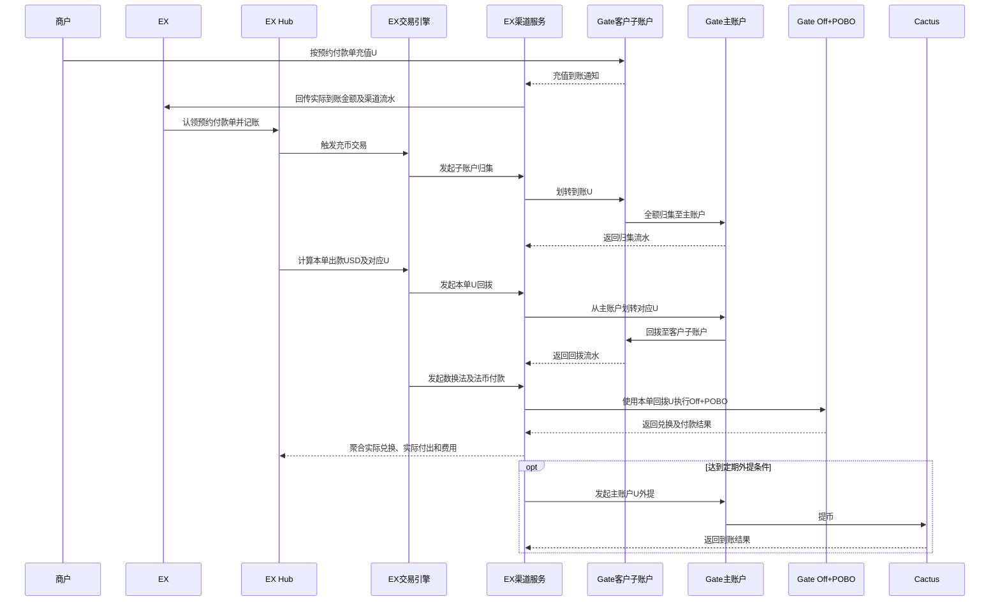
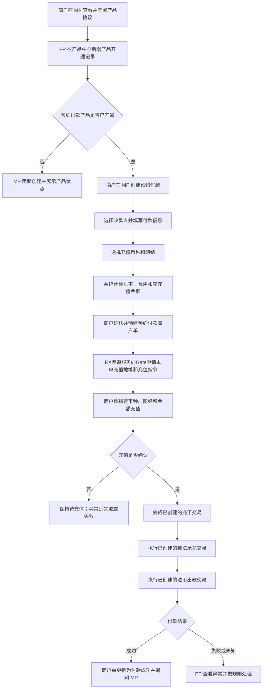
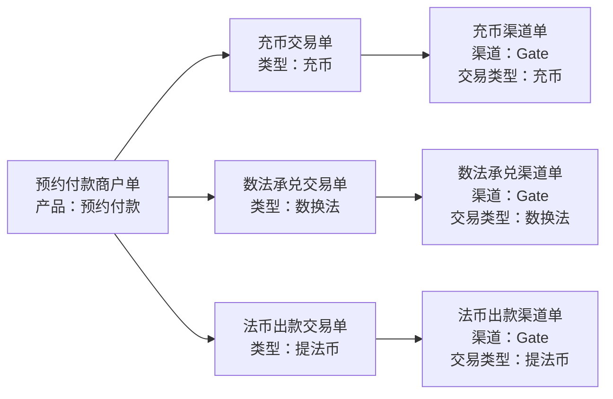
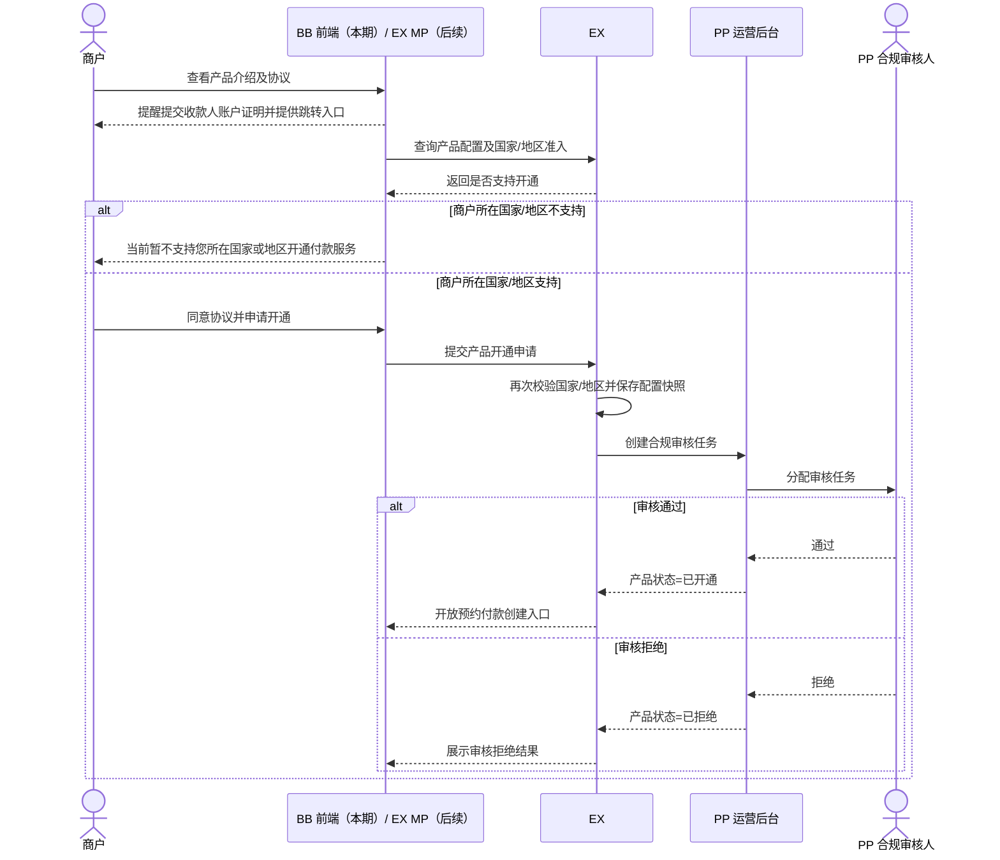
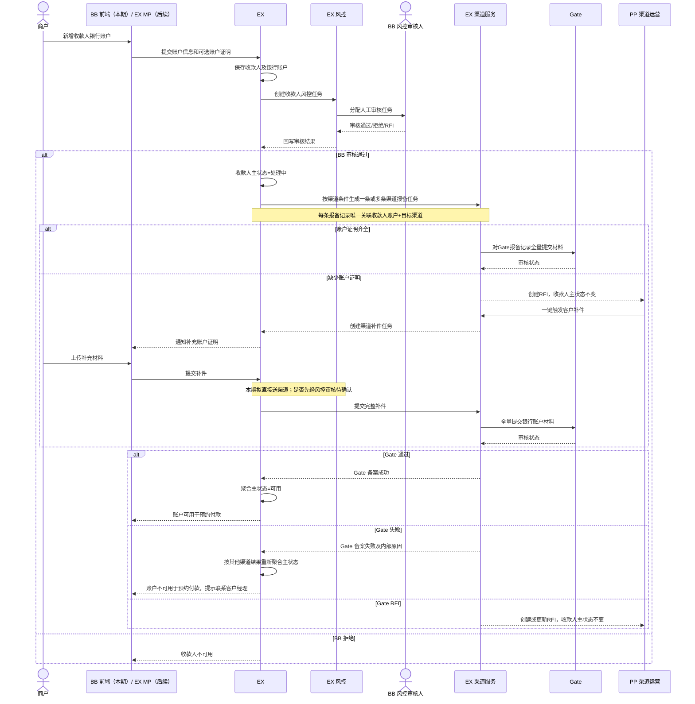
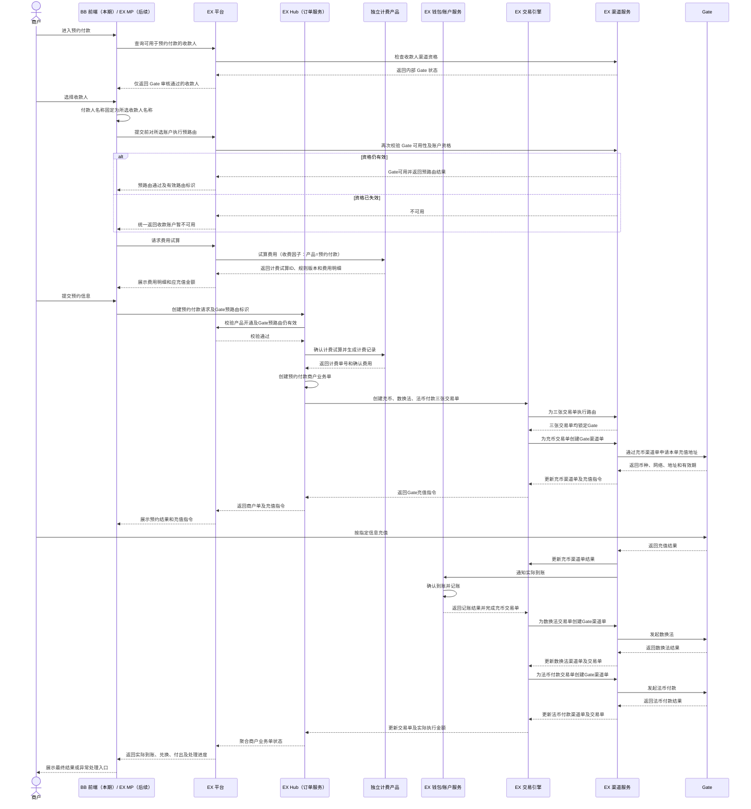
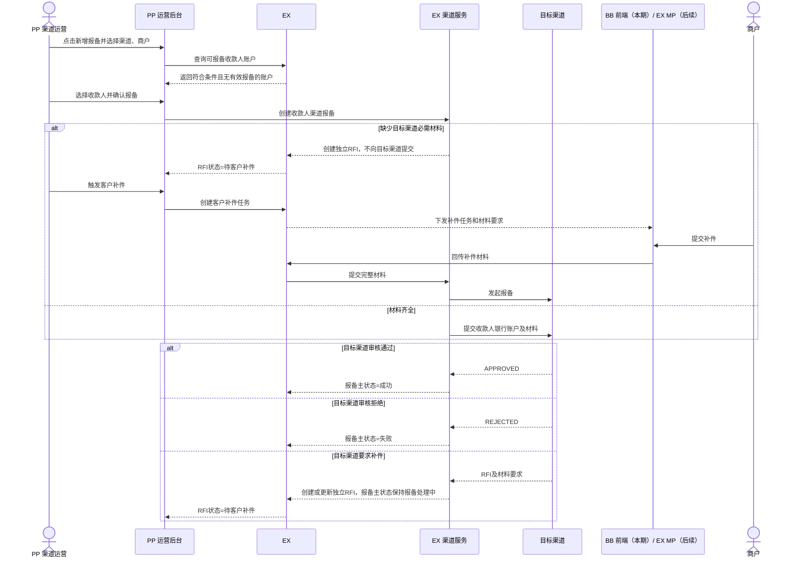
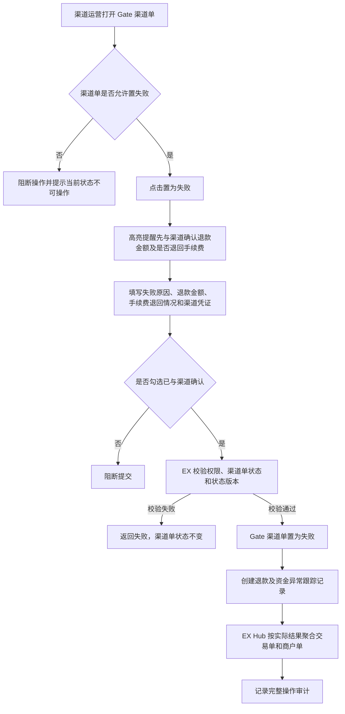
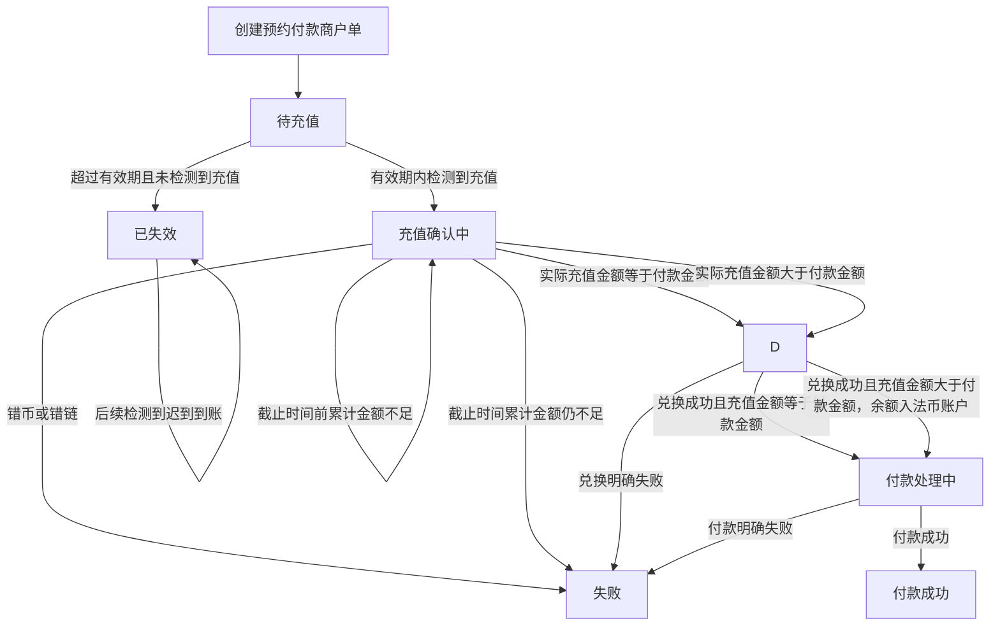

# 预约付款产品 PRD

> 文档状态：待评审
> 需求主体：预约付款产品
> 适用端：MP 商户端、PP 运营后台
> 适用范围：已签约并开通“预约付款”产品的企业商户
> 系统边界：包含产品签约与开通、预约付款商户单创建、数币充值、数法兑换、法币付款、三单追踪、异常处理及 PP 运营管理；不包含收款人渠道报备、渠道商户开户、渠道 VA 开户的具体渠道规则
> 核心原则：MP 承载商户发起与结果查询；PP 承载产品开通、订单查询和运营处理；商户单不展示渠道信息，交易单不展示渠道信息，渠道信息仅存在于渠道单

## 1. 术语和系统定位

| 术语           | 定义                                                                                           |
| -------------- | ---------------------------------------------------------------------------------------------- |
| 预约付款       | 商户在资金充值前先确定收款人、付款金额和充值方式；充值到账后，系统按订单编排完成后续兑换及付款 |
| MP             | Merchant Portal，商户端；用于商户签约、创建预约付款及查询业务结果                              |
| PP             | 运营后台；用于产品开通、商户单/交易单/渠道单查询及运营处理                                     |
| 产品名称       | 订单所属产品。预约付款商户单的对客产品名称统一为“预约付款”                                   |
| 商户单         | 商户发起的业务意图单。预约付款商户单记录商户提交的完整业务信息                                 |
| 交易单         | 平台为完成商户单而拆分或编排的内部交易记录，不包含渠道字段                                     |
| 渠道单         | 平台向外部渠道发起执行后形成的渠道执行记录；包含渠道及渠道流水信息，不包含产品名称             |
| 收款工具       | 充值或入账所使用的数币地址、VA 或 RF Reference Account                                         |
| 收款人银行账户 | 提币或法币出款时使用的数币地址或银行账户                                                       |
| 机构代理商     | 商户所属的EX 租户                                                                              |

## 2. 需求背景

企业商户在发起跨币种付款前，需要先知道收款人预计收到的法币金额、需要充值的数币金额、汇率和费用。传统“先充值、后决定用途”的路径会增加资金识别、内部调度和后续人工匹配成本。

平台现有 On Ramp / Off Ramp 面向客户提供的是市场实时汇率；本期“预约付款”产品接入 Gate，Gate 当前提供固定 1:1 汇率。因此，“预约付款”与现有 On Ramp / Off Ramp 在报价机制、客户操作路径和订单执行方式上属于两种不同的产品形态，不能直接复用实时换汇产品的报价与交互逻辑。

从综合成本考虑，本期选择由 Gate 承接从数币钱包收款、兑换到 POBO 法币付款的端到端链路。相较平台拆分使用多个服务方，该方案在当前业务条件下具有更优的整体成本，因此本期不再单独组合钱包、承兑和 POBO 渠道。

预约付款将付款意图前置：商户先创建预约付款商户单，再按订单指定的币种、网络和数币地址充值；系统识别到账后，自动关联商户单并执行数法兑换和法币付款。

本需求同时覆盖：

- MP：商户签约、创建预约付款、充值和查询进度；
- PP：产品开通、订单查询、订单关联、渠道执行查询和异常处理；
- 订单模型：商户单、交易单、渠道单三层数据边界和关联关系。

## 3. 产品价值

### 3.1 本期主要价值：一个新的产品形态

本期最核心的产品价值是推出一个区别于现有实时汇率 On Ramp / Off Ramp 的**新产品形态（固定 1:1 报价的预约付款）**。之所以把“新产品形态”作为本期主要价值，原因有三：

1. **1:1 报价稀缺，新形态本身就是获客点**：平台现有产品对客均为实时汇率；市场上存在 1:1 报价的产品但供给不多。固定 1:1 的预约付款作为一个新的产品形态，对客户有直接吸引力。
2. **契合当前成本形态，是最快的落地路径**：当前 1:1 产品的成本最优解是端到端全部走 Gate 渠道（包括充币钱包、数法兑换和 POBO 法币付款）。以独立的新产品形态承接，不改造现有实时换汇产品，是实现“全链路走 Gate”这件事最快的路径。
3. **同名提现**：本期仅支持将资金提现至与商户实名认证主体名称一致的银行账户，降低第三方付款及账户归属不一致风险。

### 3.2 产品其他价值

- 商户在充值前即可确认付款对象、金额、汇率和费用。
- 充值资金能够直接关联业务目的，降低错配和人工认领成本。
- 平台通过三单模型分离商户意图、平台交易和渠道执行，便于追踪、对账和审计。
- MP 与 PP 使用一致的订单编号、状态及金额快照，减少运营沟通成本。

## 4. 产品目标与非目标

### 4.1 产品目标

1. 建立“签约开通—创建预约单—数币充值—兑换—付款—结果通知”的完整闭环。
2. MP 可完成预约付款创建、查看充值指令及跟踪业务结果。
3. PP 可按商户、机构代理商、订单号和状态查询全链路订单。
4. 商户单、交易单、渠道单职责清晰且可相互追溯。
5. 重复请求、重复回调和渠道结果未知不得造成重复入账、重复兑换或重复付款。

### 4.2 非目标

- 本 PRD 定义 Gate 收款人备案、账户证明补件及预约付款准入流程，但不定义 Gate 签约条款或账户证明的最终材料清单。
- 本 PRD 不定义渠道自动切换策略。
- 本 PRD 不定义实时换汇产品本身的业务规则。
- 本期不支持向供应商或其他第三方账户付款；仅支持商户实名认证主体同名银行账户。
- 本 PRD 不在商户单或交易单中展示渠道信息。
- 本 PRD 不实现多渠道择优或自动切换；本期预路由候选渠道固定为 Gate。

## 5. 参与方、用户与权限

| 参与方/角色        | 主要职责                                                 | 关键权限限制                                                        |
| ------------------ | -------------------------------------------------------- | ------------------------------------------------------------------- |
| 商户（MP）         | 查看及同意协议、提交产品开通申请、查看产品状态、创建预约付款、获取充值指令、查看订单 | 仅可操作所属商户范围内的数据；不可代替 PP 完成产品审核与开通 |
| PP 产品运营        | 新增产品开通记录、配置产品、启停产品                     | 产品操作必须留痕，不得覆盖历史开通记录                              |
| PP 业务运营        | 查询商户单、交易单和渠道单，处理异常                     | 不得修改商户原始提交快照                                            |
| BB 风控审核人      | 在 EX 风控系统中审核新增收款人及相关材料                 | 审核人归属 BB；风控任务、状态和审计记录均保存在 EX                  |
| EX Hub（订单服务） | 创建商户单、触发交易编排并聚合状态                       | EX 内部服务；保证幂等和状态一致性                                   |
| EX 钱包/账户服务   | 接收渠道确认的充值到账结果并完成记账，维护数币及法币账户 | EX 内部服务；不负责本产品充值地址生成                               |
| EX 交易引擎        | 执行充币、数法兑换、法币出款等交易                       | EX 内部服务；同一业务步骤不可重复执行                               |
| EX 渠道服务        | 创建渠道单、调用 Gate、处理回调                          | EX 内部服务；渠道结果与渠道流水号必须可审计                         |
| 独立计费产品       | 维护收费规则、提供费用试算、确认计费并生成计费记录       | 预约付款不得自行维护或计算收费规则；本期收费因子为“产品=预约付款” |
| Gate 主账户        | 归集各客户子账户充值的 U，并承担资金池统一调度           | 渠道侧资金账户；每笔归集、回拨和外提必须可关联、可对账               |
| Gate 客户子账户    | 接收客户充值，并承接按预约付款单回拨后的 Off + POBO 执行 | 渠道侧客户隔离账户；仅使用本单已核定、已回拨的 U 发起后续执行        |
| Cactus             | 承接 Gate 主账户定期外提的 U                              | 资金归集目的地；外提频率、阈值及审批规则由资金侧另行配置             |

## 6. 整体业务流程

### 6.1 前置准备

预约付款上线及商户使用前，必须先完成“产品配置”和“产品收费配置”。两类配置分别由产品中心和独立计费产品负责，互不替代。

#### 6.1.1 产品配置

| 配置项 | 本期规则 | 配置所有者 | 生效及快照要求 |
| --- | --- | --- | --- |
| 产品编码 | 预约付款 | 产品中心 | 作为产品开通、订单准入和计费调用的统一业务标识 |
| 对客产品名称 | 预约付款 | 产品中心 | MP、通知及对客单据统一使用该名称 |
| 支持商户国家/地区 | 白名单配置 | 产品中心 | 申请开通和创建订单时均需服务端校验；保存命中规则版本 |
| 法币币种 | 仅 USD | 产品中心 | 本期拒绝其他法币；后续版本再扩展 |
| 最低起付金额 | 默认 10,000 USD | 产品中心 | 创建预约付款时前后端校验；商户单保存创建时快照 |
| 充值有效期 | 默认 48 小时 | 产品中心 | 使用正整数小时配置；从充值指令生成时间起算，商户单保存时长及截止时间快照 |
| 汇率模式 | 固定 1:1 | 产品中心 | 本期不提供实时汇率选择；商户单保存汇率快照 |
| 提现账户规则 | 仅支持同名提现 | 产品中心 | 银行账户名称必须与商户实名认证主体名称一致，不支持第三方账户 |
| 充值金额处理策略 | 到充值截止时间仍小于付款金额则失败并退回数币钱包；等于付款金额则直接付款；大于付款金额则完成付款并将余额存入法币账户 | 产品中心 | 本期固定且不可编辑；比较口径为实际充值金额按 1:1 折算后的 USD 金额与预约付款金额 |

#### 6.1.2 产品收费配置

| 配置项 | 本期规则 | 配置所有者 | 生效及快照要求 |
| --- | --- | --- | --- |
| 收费因子 | 产品=预约付款 | 独立计费产品 | EX 仅传入收费因子，不在订单或渠道服务中维护收费规则 |
| 客户收费规则 | 按商户适用的预约付款收费方案 | 独立计费产品 | 支持规则版本、生效时间及商户维度；具体费项待计费/财务确认 |
| 费用试算 | 商户确认前完成 | 独立计费产品 | 返回试算 ID、规则版本、有效期和费用分项 |
| 计费确认 | 商户单创建时确认 | 独立计费产品 | 以商户单号和幂等键防重，生成独立计费单 |
| 历史费用 | 使用订单创建时费用快照 | EX Hub/独立计费产品 | 后续规则调整不得覆盖历史订单 |

- Gate 向平台收取的渠道费用与平台向商户收取的产品费用是两套独立口径，必须分别记录、分别对账。
- 对客费用以独立计费产品返回结果为准；Gate 渠道费用进入渠道成本及渠道单，不得直接作为客户收费结果。
- 到期统一判断的比较基准是预约付款金额`payment_amount`，不是包含费用的应充值金额`required_deposit_amount`；客户费用仍按独立计费产品的计费快照单独处理，不改变到期判断口径。
- 任一必需产品配置缺失、未生效，或计费试算/确认失败时，不得生成可充值的预约付款单。

### 6.2 Gate 资金链路

#### 6.2.1 资金处理原则

1. 商户按照预约付款单生成的 Gate 充值地址，将 U 充值至对应 Gate 客户子账户。
2. Gate 确认充值到账后，渠道服务回传实际到账资产、网络、金额和渠道流水；平台完成订单认领与到账记账。
3. 到账的 U 先由 Gate 客户子账户全额划转至 Gate 主账户归集，形成可统一调度的资金池。
4. EX Hub 根据预约付款单、固定 1:1 汇率、实际到账金额和对客收费结果，计算本单可用于出款的 USD 金额及对应需执行的 U 金额。
5. 平台从 Gate 主账户将本单对应的 U 划转回该商户的 Gate 客户子账户。回拨金额必须绑定商户单号、充币交易单号、数换法交易单号及唯一资金调拨流水。
6. Gate 客户子账户仅使用本单回拨的 U 执行 Off，并将法币提现至商户实名认证主体的同名银行账户。
7. Gate 主账户中未用于当前订单回拨的 U，由资金运营按配置的周期、余额阈值和审批规则定期提至 Cactus。

#### 6.2.2 采用主账户归集再按单回拨的原因

- Gate 渠道收费与平台向客户收取的预约付款产品费用不同，不能仅凭客户子账户余额变动完成收费核对。
- 若长期由客户子账户直接连续执行 Off + POBO，充值、渠道成本、客户收费、兑换和付款之间难以形成清晰的一单一资金批次关系。
- 先归集主账户、完成订单金额和费用核算、再按单回拨，可将每笔回拨金额与预约付款单及三张交易单绑定，降低对账复杂度。
- 异常时可明确资金停留在子账户、主账户、兑换后法币账户或渠道处理中，便于冻结后续步骤、人工核查和差错处理。

#### 6.2.3 资金链路记账与对账要求

- 子账户到账、子转主归集、主转子回拨、Off、POBO、主账户外提至 Cactus 均生成独立资金事件和唯一流水号，不得互相覆盖。
- 每个资金事件至少保存商户 MID、商户单号、关联交易单号、关联渠道单号、资产、网络、金额、费用、发生前后账户及状态。
- 归集成功是本单金额核算和回拨的前置条件；回拨成功是发起 Off + POBO 的前置条件。
- 客户收费、Gate 渠道收费和主账户外提网络费分别记账。渠道成本不得回写覆盖客户费用快照。
- 每日按 Gate 主账户、客户子账户、EX 账务记录、Gate 渠道流水和 Cactus 到账记录进行余额及流水核对；差异进入资金异常队列。
- 主账户定期提至 Cactus 属于资金运营动作，不改变已创建商户单的客户费用、订单金额或执行状态。

### 6.3 业务总览

### 6.4 三单生成与关联

- 一张预约付款商户单创建后，EX Hub 触发交易引擎生成三张交易单：充币交易单、数法承兑交易单、法币出款交易单。
- 三张交易单创建时均由 EX 交易引擎调用 EX 渠道服务完成路由，本期全部固定路由至 Gate，并分别保存 Gate 路由快照。
- 每张交易单开始执行时均创建自身对应的 Gate 渠道单，形成“一张交易单对应一张 Gate 渠道单”的基础关系；若发生重试，可按平台规则新增渠道尝试记录，但不得覆盖原渠道单。
- 三张交易单按“充币 → 数换法 → 法币付款”顺序执行。前一张交易单未成功时，后一张交易单保持待执行，不得向 Gate 发起对应渠道请求。

三层订单展示规则：

| 订单层级 | 展示产品名称 | 展示交易类型 | 展示渠道 | 主要用途             |
| -------- | ------------ | ------------ | -------- | -------------------- |
| 商户单   | 是           | 是           | 否       | 记录商户业务意图     |
| 交易单   | 否           | 是           | 否       | 记录平台内部交易编排 |
| 渠道单   | 否           | 是           | 是       | 记录外部渠道执行     |

## 7. Case 1：MP 商户端

### 7.1 Case 目标

商户在 MP 完成产品签约后，创建预约付款商户单，获取数币充值指令，并查看从充值到付款完成的全链路进度。

### 7.2 前置条件

- 商户已完成平台入网且状态可用。
- 商户与机构代理商关系有效。
- 商户操作人拥有产品申请、收款人维护或预约付款创建的相应权限。

### 7.2.1 Case 1A：MP 开通预约付款产品

#### 业务流程

1. 商户在 MP 进入预约付款产品介绍页。
2. MP 查询预约付款产品配置，并根据商户主体所在国家/地区判断是否支持开通。
3. 若当前国家/地区不在产品支持范围内，页面直接阻断申请，不展示可提交状态，提示：“当前暂不支持您所在国家或地区开通付款服务。如有疑问，请联系客户经理。”
4. 产品介绍页的“收款人账户证明”卡片提醒商户：预约付款使用的收款人银行账户需要提交账户证明信并审核通过；商户可点击“去提交账户证明”进入收款人银行账户维护页。
5. 账户证明提醒不作为产品开通申请的前置阻断条件；其审核结果在收款人准入和预约付款预路由阶段校验。
6. 若当前国家/地区支持，商户阅读并同意《预约付款服务协议》。
7. 商户提交产品开通申请；EX 在服务端再次校验商户国家/地区和产品配置，防止绕过前端。
8. EX 保存开通申请及校验快照，并将审核任务推送至 PP。
9. PP 合规审核仅可选择“审核通过”或“审核拒绝”。
10. EX 保存审核结果并同步至 MP；只有状态为“已开通”时，商户才能创建预约付款单。

#### MP 产品开通时序图

本期产品开通审核不提供补件或 RFI 分支。RFI 仅用于收款人资料补充流程，与产品开通审核相互独立。

### 7.3 Case 1B：MP 添加收款人银行账户

#### 7.3.1 Case 目标

新增收款人必须经过风控审核。风控能力和审核任务均在 EX，人工审核人归属 BB。同一收款人银行账户可能需要向多个渠道分别报备，各渠道的准入条件、材料要求、报备状态和结果独立保存。Gate 要求每个新增银行账户提交账户补充信息，账户证明属于 Gate 报备所需材料；但当前 MP 添加收款人时“账户证明”仍为非必填附件。因此，基础账户可以先保存并进入 EX 风控审核；风控通过后还需等待渠道报备，至少一个适用渠道报备成功时收款人主状态才为“可用”。本期预约付款固定路由 Gate，因此即使其他渠道已成功，仍要求 Gate 报备成功后才能用于预约付款。

#### 7.3.2 正向流程

1. 客户在 MP 新增企业收款人银行账户，填写基础账户信息。
2. MP 提供“账户证明（非必填）”上传入口，支持 Welcome Letter、账户流水、月结单等材料。
3. EX 保存收款人银行账户并创建 EX 风控任务。
4. BB 风控审核人在 EX 中完成审核；审核通过但尚无渠道报备成功时，收款人主状态更新为“处理中”。
5. EX 根据已启用渠道及各渠道准入条件进行匹配；一个账户可同时生成多条渠道报备任务，每条任务唯一关联一个目标渠道。
6. 对任一目标渠道，材料齐全时提交该渠道；材料缺失时在该渠道报备记录下创建独立 RFI，RFI 状态置为“待客户补件”，不得向渠道提交空材料。RFI 本身不是收款人主状态；此时对应渠道仍未成功，主状态按渠道结果聚合规则计算。
7. 客户完成补件后，将完整材料送对应目标渠道；是否必须先经过风控审核，仍待风控确认。
8. 各渠道分别形成报备结果。任一适用渠道成功时，收款人主状态聚合为“可用”；尚无成功但仍有渠道待发起、处理中或待补件时，主状态为“处理中”；无成功且全部适用渠道均形成失败终态时，主状态聚合为“不可用”。
9. 本期预约付款固定路由 Gate，只有 Gate 渠道报备成功的账户才能进入预约付款收款人选择结果。

#### 7.3.3 MP 添加收款人时序图

#### 7.3.4 收款人状态逻辑

收款人主状态、渠道报备状态与 RFI 补件状态是三个独立维度，必须分别保存、分别流转。一个收款人银行账户可存在多条渠道报备记录，每条记录对应一个目标渠道。渠道记录相互独立，收款人主状态则根据 EX 风控、账户有效性及全部适用渠道报备结果进行聚合；任何单一渠道结果不得覆盖其他渠道记录。MP 不展示“未报备、待运营发起、报备处理中、渠道审核”等内部渠道过程。

收款人主状态：

| 主状态 | 进入条件 | MP 展示 | 预约付款选择规则 |
| ------ | -------- | ------- | ---------------- |
| 审核中 | 已提交，EX 风控尚未形成终态 | 审核中 | 不进入选择结果 |
| 处理中 | EX 风控通过且账户有效，但尚无渠道报备成功，并且至少一个适用渠道处于待发起、报备处理中或关联 RFI 未完成 | 处理中 | 不进入预约付款选择结果 |
| 可用 | EX 风控通过、账户有效，且至少一个适用渠道报备成功 | 可用/已验证 | 仍需产品预路由校验；本期仅 Gate 报备成功时进入预约付款选择结果 |
| 不可用 | EX 风控拒绝、账户失效、人工停用，或 EX 风控已通过但无渠道成功且全部适用渠道均报备失败 | 暂不可用；敏感原因不直接展示 | 不进入选择结果 |

主状态聚合优先级：

1. EX 风控拒绝、账户失效或人工停用时，主状态直接为“不可用”。
2. EX 风控未形成终态时，主状态为“审核中”。
3. EX 风控通过且账户有效时，只要至少一个适用渠道报备成功，主状态即为“可用”；其他渠道处于处理中或失败不影响“可用”。
4. EX 风控通过且没有任何渠道成功时，只要仍存在待发起、报备处理中或关联 RFI 未完成的适用渠道，主状态为“处理中”。
5. EX 风控通过且没有任何渠道成功，同时全部适用渠道均已失败时，主状态为“不可用”。

渠道报备状态：

| 报备状态 | 进入条件 | 对收款人主状态的聚合影响 | 对产品使用的影响 |
| -------- | -------- | ------------------------ | ---------------- |
| 待发起 | 已生成目标渠道报备任务，尚未提交渠道 | 若尚无成功渠道，主状态保持“处理中” | 该渠道暂不可用 |
| 报备处理中 | 已提交目标渠道，尚未形成明确终态 | 若尚无成功渠道，主状态保持“处理中” | 该渠道暂不可用 |
| 成功 | 目标渠道明确审核通过 | 至少一个渠道成功，主状态为“可用” | 该渠道可参与预路由 |
| 失败 | 目标渠道明确审核拒绝或报备终止 | 有其他成功渠道则仍“可用”；无成功但有其他处理中渠道则“处理中”；无成功且全部失败则“不可用” | 仅该渠道不可用 |

RFI 是独立流程，不是收款人主状态：

| RFI 状态   | 说明                         | 对主状态的影响                   |
| ---------- | ---------------------------- | -------------------------------- |
| 无 RFI     | 当前没有待处理补件任务       | 无                               |
| 待客户补件 | 已创建 RFI，等待客户提交材料 | 主状态保持原值                   |
| 已提交     | 客户已提交补件，等待处理     | 主状态保持原值                   |
| 审核中     | 补件进入审核或渠道处理       | 主状态保持原值                   |
| 已完成     | 本次 RFI 已处理完成          | 主状态按原审核/渠道流程继续流转  |
| 已关闭     | RFI 被取消、拒绝或终止       | 主状态仅在对应审核形成终态时变化 |

- 需要补件时创建独立 RFI 任务，通知客户、展示材料清单、接收补件并保留版本及审计记录；不得把收款人主状态直接改成“待补件”。
- MP 不提供“去报备”“送渠道”“重新报备”等渠道操作，也不提示客户“尚未完成报备”。
- EX 风控状态与各渠道报备状态分别保存；主状态由聚合规则计算，不允许某一条渠道回调直接覆盖其他渠道结果或 EX 风控结论。
- 同一收款人账户与同一渠道同一时点只能存在一条有效报备记录；不同渠道可以并行报备、补件或形成不同终态。

### 7.4 Case 1C：MP 创建预约付款

1. 商户进入“预约付款”。
2. 系统校验“预约付款”产品是否已开通。
3. 商户选择收款人银行账户；本期只允许选择 Gate 备案成功的账户。
4. 系统将付款人名称固定为所选收款人名称，不提供付款人名称选择。
5. 商户填写付款金额、币种、付款用途及附言；付款金额必须达到产品配置的最低起付金额，本期默认 10,000 USD。
6. 商户选择充值币种和网络。
7. EX 调用独立计费产品，以“产品=预约付款”作为收费因子完成费用试算。
8. 系统展示汇率、费用明细、应充值金额及收款人预计到账金额。
9. 商户确认订单。
10. MP 将预约付款请求和有效 Gate 预路由结果提交至 EX Hub；EX Hub 复核预路由仍有效、确认计费结果并幂等创建预约付款商户单。
11. EX Hub 调用 EX 渠道服务，由渠道服务按已锁定的 Gate 路由向 Gate 申请本单充值地址和充值指令。
12. MP 展示 Gate 返回的数币地址、网络、币种、应充值金额及有效期。
13. 商户完成充值。
14. 系统识别到账并依次执行充币、数法兑换和法币付款。
15. MP 展示处理进度和最终结果。

#### 7.4.1 Case 1C 时序图

#### 7.4.2 独立计费规则

- 预约付款业务不在 EX Hub、交易引擎或渠道服务内配置收费规则，也不自行计算手续费。
- 对客手续费的试算、确认与收取为平台内部逻辑，不调用 Gate 接口；Gate 仅承担渠道执行，其费用仅作为渠道成本记录。
- 独立计费产品负责收费规则配置、费用试算、计费确认、计费记录、规则版本和后续费用调整能力。
- 本期传给计费产品的收费因子为“产品=预约付款”。产品编码使用平台统一枚举；对客产品名称和收费因子名称本期均为“预约付款”，但接口仍必须传内部产品编码，不得以展示文案代替。
- 商户确认前必须取得有效计费试算，展示计费产品返回的费用分项；EX Hub 根据确认费用计算应充值金额。
- 创建商户单时，EX Hub 使用试算 ID 向计费产品确认计费。相同商户单和幂等键不得重复生成计费记录或重复收费。
- 商户单保存计费单号、收费因子、计费规则版本和费用明细快照。后续调整收费规则不得覆盖历史订单。
- 计费产品不可用、试算失效、确认金额与试算金额不一致时，不得创建可充值的预约付款商户单。

### 7.5 MP 页面及功能要求

#### 7.5.1 产品签约与状态

- 未签约或未开通时，预约付款页面仅展示产品说明、协议和当前状态。
- 商户签署协议后形成签约记录，至少保存协议版本、签署人、签署时间、商户 MID 和机构代理商 ID。
- PP 完成产品开通后，MP 才允许创建预约付款。
- 产品已停用、已关闭或失效时，MP 禁止创建新单，但允许查询历史订单。

#### 7.5.2 创建预约付款

- 选择收款人后必须执行预路由。本期候选渠道只有 Gate，预路由必须同时校验商户 Gate 备案状态和收款人银行账户 Gate 备案状态。只有成功才可以。
- Gate 预路由必须发生在商户点击提交预约付款之前。预路由通过后返回可校验的路由标识；创建商户单时 EX Hub 必须复核该路由标识仍有效。
- 本期下拉列表只返回 Gate 审核通过的收款人银行账户；未完成备案、待补件、处理中或失败的账户不进入预约付款选择列表。
- 待补件统一在收款人管理及任务中心走 RFI 流程，不在预约付款选择框内处理。
- 已进入选择列表的账户若在选择后资格发生变化，预路由统一提示“该收款账户暂不可用，请更换收款账户或联系客户经理。”
- 预路由没有可用渠道时：提示“当前收款账户暂不可用于预约付款，请更换已验证的收款账户或联系客户经理。”，不得生成预约单或充值地址。
- 本期付款币种固定为 USD，页面不提供其他法币选项；服务端收到非 USD 请求必须拒绝。
- 本期付款人名称固定为所选收款人名称，MP 不提供付款人名称选择；确认页及详情页展示该名称。
- 本期不支持以商户名称或其他付款人名称付款，相关选项不得出现在客户端或创建接口中；下一期再支持。
- 最低起付金额由“预约付款”产品配置统一控制，本期默认值为 10,000 USD。MP 展示当前生效值，低于该值时前后端均阻断创建。
- 充值币种和网络使用本期可用配置。
- 汇率字段只展示“汇率”，不使用“1:1 汇率”作为字段名称。
- 充值有效期由“预约付款”产品配置统一控制，本期默认值为 48 小时，临界点超过，可以正常入账。
- 有效期从充值指令成功生成时间起算；EX Hub 使用订单创建时生效的配置计算充值截止时间，并在商户单中固化“有效时长快照”和“充值截止时间”。
- 产品配置变更只影响变更后生成充值指令的新订单，不得延长、缩短或覆盖历史订单的充值截止时间。
- 到达充值截止时间且未检测到充值时，商户单进入“已失效”；截止时间后检测到的充值作为迟到资金单独处理，原预约付款单保持“已失效”且不恢复。
- 确认页必须展示：
  - 商户单类型：预约付款；
  - 产品名称：预约付款；
  - 收款人及掩码银行账号；
  - 付款人名称，值为所选收款人名称；
  - 付款金额及币种；
  - 充值币种、网络；
  - 汇率；
  - 分项费用；
  - 应充值金额；
  - 收款人预计到账金额；
  - 充值有效期及明确的充值截止时间；

#### 7.5.3 充值指令

- 每张预约付款商户单生成与该单关联的数币地址或明确的收款工具。
- 本期充值地址由 EX 渠道服务按照已锁定的 Gate 路由向 Gate 申请并返回，EX 钱包/账户服务不生成充值地址。
- 地址、网络、币种、有效期和应充值金额在创建后形成不可变快照。

#### 7.5.4 订单列表与详情

- 列表至少展示商户单号、产品名称、收款人、付款金额、充值金额、汇率、费用、状态、创建/更新时间。
- 详情不能只展示预约时的商户提交内容，还必须展示实际执行结果和处理进度。
- 实际执行结果至少包含：应充值金额、实际到账金额、充值差额、实际卖出数币金额、实际兑换所得法币金额、实际付出金额、资金去向、失败原因和后续处理。
- MP 不展示内部交易单、渠道单、渠道名称、渠道流水号及渠道错误原文。

### 7.6 MP 异常分支

| 场景                   | MP 处理                                                                                            |
| ---------------------- | -------------------------------------------------------------------------------------------------- |
| 产品未开通或已停用     | 阻断创建，展示产品状态及联系入口                                                                   |
| 收款人不可用           | 阻断提交，提示更换或维护收款人                                                                     |
| Gate 渠道资格尚未完成  | 不进入预约付款选择结果；MP 不展示具体报备状态或渠道名称                                            |
| Gate 渠道资格终态失败  | 不进入预约付款选择结果；其他渠道记录不受影响，收款人主状态按全部渠道结果重新聚合，创建时统一提示联系客户经理 |
| 预路由无可用渠道       | 不创建预约单或充值地址；提示更换已验证账户或联系客户经理                                           |
| 重复点击提交           | 返回同一幂等结果，不生成重复商户单                                                                 |
| 未充值且订单到期       | 商户单更新为已失效                                                                                 |
| 到期累计达到（含超过）付款金额 | 按预约的法币金额执行兑换和 POBO 付款，只执行一次；超出部分不兑换，留在商户数币钱包，不享受 1:1 |
| 到期未达到付款金额 | 到达 48 小时充值截止时间后不执行兑换和原预约付款，商户单展示“失败”；已充值资金留在商户数币钱包，无法享受 1:1 汇率 |
| 错币或错链             | 不自动兑换或付款，预约付款单进入“失败”                                                           |
| 迟到到账               | 原预约付款单保持“已失效”，迟到资金单独进入资金异常处理                                           |
| 兑换失败               | 展示“付款失败”，不得虚假展示付款成功                                                      |
| 付款结果未知           | 展示“处理中”，由系统查询及 PP 跟进                                                           |

## 8. Case 2：PP 运营后台

### 8.1 Case 目标

运营通过 PP 完成产品开通，统一查询预约付款相关商户单、交易单和渠道单，并处理充值、兑换、付款及渠道异常。

### 8.1.1 PP 功能点

查询类功能仅定义查询入口、筛选条件、展示字段、数据权限和导出规则，不提供时序图。

| 功能模块 | 使用角色 | 具体功能点 |
| -------- | -------- | ---------- |
| 产品开通 | 客户运营/产品运营 | 查询商户预约付款开通记录；按商户 MID、商户名称、机构代理商、状态和时间筛选；查看配置及操作日志；执行审核通过或拒绝 |
| 预约付款商户单 | 客户运营 | 查询客户发起信息、实际充值、兑换、付款、余额入账、失败原因和处理进度；关联查看三张交易单 |
| 交易单 | 清算 | 按交易类型查询充币、数换法和法币付款交易；查看金额、资金方向、状态及关联商户单；关联查看渠道单 |
| 渠道单 | 渠道运营 | 查询渠道请求、渠道流水、渠道费用、回调、退款和手续费退回情况；对符合条件的 Gate 渠道单执行“置为失败” |
| 收款人渠道报备 | 渠道运营 | 按收款人账户和目标渠道查询报备；新增报备；查看材料、渠道状态和 RFI；触发客户补件 |
| 导出 | 授权运营角色 | 按当前筛选条件导出；执行租户隔离、字段脱敏、权限校验和操作审计 |

操作类功能需要提供操作流程图。本期操作类至少包括：产品开通审核、代客户发起收款人渠道报备、触发 RFI 补件、Gate 渠道单置为失败。

### 8.2 PP 信息架构

PP 顶层一级菜单：

1. 承兑业务
2. 渠道商户管理
3. 产品中心

菜单层级：

| 一级菜单     | 二级菜单       | 三级菜单                                                                               |
| ------------ | -------------- | -------------------------------------------------------------------------------------- |
| 承兑业务     | 商户收款工具   | 商户数币地址、商户 VA 账户                                                             |
| 承兑业务     | 商户业务单     | 充值订单、提现订单、数法兑换、实时换汇、付款订单、预约付款订单                         |
| 承兑业务     | 交易单         | 充币交易单、法币入账交易单、提币交易单、法币出款交易单、数法承兑交易单、实时换汇交易单 |
| 承兑业务     | 渠道单         | 充币渠道单、法币入账渠道单、提币渠道单、法币出款渠道单、数法承兑渠道单、实时换汇渠道单 |
| 渠道商户管理 | 渠道商户报备   | —                                                                                     |
| 渠道商户管理 | 渠道 VA 开户   | —                                                                                     |
| 渠道商户管理 | 收款人渠道报备 | —                                                                                     |
| 产品中心     | 产品开通       | —                                                                                     |

### 8.2.1 PP 收款人渠道备案与补件

- “渠道商户管理—收款人渠道报备”列表按“收款人银行账户 + 渠道”展示报备记录，并展示账户证明状态、目标渠道、报备状态、渠道原始状态和独立 RFI 状态。
- 页面提供“新增报备”操作。渠道运营依次选择渠道、商户和收款人银行账户；系统按所选渠道的准入条件、材料要求及现有有效报备进行校验。
- 同一收款人银行账户可向多个渠道报备；每个渠道分别创建独立报备记录、保存提交快照、接收回调并形成终态。
- 同一收款人银行账户与同一渠道同一时点只允许一条有效报备；已有待发起、报备处理中或成功记录时，不得重复新增该渠道报备。
- 报备状态至少包括：待发起、报备处理中、成功、失败；“待补件”不属于报备主状态。
- RFI 状态为“待客户补件”时，渠道运营可点击“一键触发客户补件”；系统向对应 MP 客户发送补件任务和通知，操作必须记录操作人、时间、材料要求和关联报备 ID。
- 一键触发只创建客户补件任务，不得伪造材料或直接将状态改为审核通过。
- RFI 创建、提交、审核或关闭均不作为收款人主状态；RFI 所属渠道在形成终态前仍属于未成功渠道，主状态按全部渠道结果聚合。
- 客户提交材料后，将完整材料送回该 RFI 所属目标渠道；是否在送渠道前增加风控审核节点，列为待风控确认项。
- 某渠道报备失败时，保留该渠道状态和内部失败信息；不影响其他渠道的有效资格。MP 仅展示产品当前不可使用及“请联系客户经理”，不得暴露渠道名称或渠道敏感原文。

### 8.2.2 Case：PP 代客户发起收款人渠道报备

#### 正向流程

1. PP 渠道运营进入“渠道商户管理—收款人渠道报备”，点击“新增报备”。
2. 选择目标渠道。系统加载该渠道的账户准入条件和材料要求。
3. 选择商户。系统仅返回渠道运营有权限管理、且可使用所选渠道的商户。
4. 选择收款人银行账户。系统仅返回该商户名下已通过 EX 风控、满足所选渠道基础条件且不存在该渠道有效报备的账户。
5. PP 展示收款人、银行账户、账户证明、目标渠道及已有其他渠道报备摘要，运营确认后提交。
6. EX 渠道服务创建报备记录，记录操作人、商户 MID、收款人账户 ID、目标渠道和提交快照。
7. 材料齐全时向所选渠道发起报备；缺少该渠道必需材料时，创建独立 RFI 并等待运营触发客户补件，不向渠道提交空材料。
8. 渠道审核通过时，该渠道报备状态更新为“成功”；只有当产品预路由需要该渠道时，该成功资格才影响该产品可选结果。
9. 渠道审核失败时，该渠道报备状态更新为“失败”并记录内部原因，不影响其他渠道资格；系统重新聚合收款人主状态。

#### 补件流程

1. 任一渠道返回 RFI 时，EX 在对应渠道报备记录下创建或更新独立 RFI，该渠道报备状态保持“报备处理中”。
2. PP 列表展示 RFI 状态“待客户补件”，渠道运营点击“触发客户补件”。
3. EX 向对应商户 MP 下发补件任务和材料要求，记录触发人、触发时间及通知结果。
4. 客户在 MP 提交材料后，RFI 状态更新为“已提交”；系统将完整材料送回该 RFI 所属渠道。
5. 目标渠道形成终态后，该渠道报备状态更新为“成功”或“失败”，RFI 状态更新为“已完成”或“已关闭”。

### 8.3 产品开通

- “预约付款开通”合并至“产品中心—产品开通”。
- 产品开通页面提供“新增开通”操作。
- 每次开通、关闭、重新开通或重新提交均生成一条独立记录，不覆盖历史。
- 同一商户可对同一产品存在多次开通记录，但同一时点只能有一个有效版本。
- 产品配置增加“最低起付金额”，币种固定为 USD，本期默认 10,000 USD；配置变更只影响变更后创建的新单，历史订单保留创建时快照。
- 产品配置增加“充值有效期”，单位为小时，本期默认 48 小时，仅允许配置大于 0 的整数。有效期从充值指令生成时间起算，配置变更仅影响新订单。
- 产品配置增加“支持开通的商户国家/地区”白名单。本期产品开通申请以商户主体所在国家/地区匹配该配置；不在白名单内时不得提交申请。
- 国家/地区使用平台统一国家地区码匹配，不使用页面展示名称直接比较。提交申请时保存商户国家/地区、配置版本和校验结果快照。
- 列表字段：

| 字段           | 展示规则                                     |
| -------------- | -------------------------------------------- |
| 商户 MID       | 商户唯一标识                                 |
| 商户名称       | 与 MID 同时展示                              |
| 机构代理商 ID  | 展示开通时快照                               |
| 机构代理商名称 | 与机构代理商 ID 同列展示                     |
| 开通产品       | 本 case 为“预约付款”                       |
| 开通时间       | 展示该次记录生效或提交时间                   |
| 状态           | 待处理、配置中、已开通、已关闭、失败         |
| 操作           | 产品配置、操作日志；按状态提供审核或启停动作 |

- “产品配置”展示充值金额处理策略。本期策略固定且不可编辑：
  - 实际充值金额按固定 1:1 汇率折算为 USD 后与预约付款金额比较，统一在 48 小时充值到期时判断；
  - 到期达到（含超过）付款金额：按预约的法币金额执行兑换和 POBO 付款，只执行一次；超出部分不兑换，留在商户数币钱包，不享受 1:1；
  - 到期仍小于付款金额：原预约付款失败，不执行兑换；已充值资金留在商户数币钱包，不享受 1:1；
  - 以此引导客户按需充值，避免预约 1,000 充值 2,000。

### 8.4 预约付款商户单

- 商户单只展示商户业务信息，不展示任何渠道字段。
- 产品名称为“预约付款”。
- 商户单详情同时展示预约信息与实际执行结果；实际执行结果包括实际到账、实际兑换、实际付出、资金去向和异常原因。
- 商户信息合并为一列：商户名称 + 商户 MID。
- 机构代理商信息合并为一列：机构代理商名称 + 机构代理商 ID。
- 创建时间和更新时间合并为一列。
- 列表建议顺序：

| 顺序 | 字段                         |
| ---- | ---------------------------- |
| 1    | 商户单号                     |
| 2    | 商户                         |
| 3    | 机构代理商                   |
| 4    | 产品名称                     |
| 5    | 收款人                       |
| 6    | 付款金额                     |
| 7    | 充值币种 / 网络 / 应充值金额 |
| 8    | 汇率                         |
| 9    | 手续费                       |
| 10   | 状态                         |
| 11   | 创建 / 更新时间              |
| 12   | 操作                         |

### 8.5 交易单

- 交易单不关心产品，不展示或保存产品名称；以交易类型作为核心业务识别字段。
- 交易单必须关联商户单号。
- 每张预约付款商户单固定生成三张交易单：充币、数换法、法币付款；三张交易单均固定路由至 Gate。
- 交易单保留商户名称和商户 MID 用于归属识别，但列表及详情优先突出交易类型。
- 商户、机构代理商、创建/更新时间采用与商户单一致的合并样式。
- 预约付款固定关联的三张交易单：

| 交易单菜单     | 交易类型 | 关键业务字段                                       |
| -------------- | -------- | -------------------------------------------------- |
| 充币交易单     | 充币     | 数币地址名称、网络—掩码地址、金额                 |
| 数法承兑交易单 | 数换法   | 货币对、卖出金额、买入金额、汇率、费用             |
| 法币出款交易单 | 提法币   | 收款账户名称、掩码账号、收款人类型、账户国家、金额 |

交易单列表通用顺序：

1. 交易单号；
2. 交易类型；
3. 商户单号；
4. 商户名称 + 商户 MID；
5. 机构代理商；
6. 业务特有字段；
7. 交易金额；
8. 状态；
9. 创建/更新时间；
10. 操作。

### 8.6 渠道单

- 渠道单没有产品名称，只有交易类型。
- 渠道单必须关联交易单号和商户单号。
- 预约付款的充币、数换法、法币付款三张交易单各自生成 Gate 渠道单；渠道单分别保存对应交易单号、商户单号、Gate 渠道流水及请求结果。
- 渠道信息只在渠道单展示。
- 充币渠道单可展示数币地址名称及“网络—掩码地址”。
- 法币入账渠道单可展示收款工具：
  - VA：使用蓝色 `VA` 小标签，展示 VA 名称和完整 VA 号码；
  - RF：使用紫色 `RF` 小标签，展示大账户名称和完整 RF Reference Account 号码。
- 提币渠道单展示地址昵称及“网络—掩码地址”，不展示账户国家。
- 法币出款渠道单展示收款账户名称、掩码账号、收款人类型及账户所在国家。

渠道单列表通用顺序：

1. 渠道单号；
2. 交易单号；
3. 商户单号；
4. 商户；
5. 机构代理商；
6. 交易类型；
7. 业务特有字段；
8. 渠道及渠道流水号；
9. 请求金额及渠道费用；
10. 状态；
11. 创建/更新时间；
12. 操作。

### 8.7 PP 查询与操作

- 所有订单列表支持按订单号、商户 MID、商户名称、机构代理商 ID、机构代理商名称、状态及时间筛选。
- PP 可从商户单进入关联交易单，从交易单进入关联渠道单。
- PP 可查看完整状态时间线、请求/响应摘要、失败原因和人工操作日志。
- 敏感地址、银行账号默认掩码；完整值仅对授权角色按需展示并记录审计日志。
- 导出遵循当前筛选条件、数据权限和脱敏规则。

#### 8.7.1 Gate 渠道单置为失败

适用场景：Gate 渠道出款已明确失败，或渠道侧已确认无法继续执行，但平台尚未收到可自动落失败的终态。只有具备渠道异常处理权限的渠道运营可以操作。

功能要求：

1. 仅 Gate 渠道单处于“处理中或异常待处理”时展示“置为失败”；成功、失败、已关闭等终态不允许操作。
2. 操作弹窗必须高亮提醒：**“请先与渠道确认退款金额以及是否退回手续费。”**
3. 操作人需要填写或确认：
   - 失败原因；
   - 与 Gate 确认的退款金额及币种；
   - Gate 是否退回手续费；
   - 退回手续费金额及币种；若不退回则记录为 0；
   - 渠道确认凭证或沟通记录编号；
   - 操作备注。
4. 操作人必须勾选“已与渠道确认退款金额及手续费退回情况”后才能提交。
5. 提交时 EX 重新校验权限、渠道、渠道单当前状态和状态版本；校验失败时不得落状态。
6. 操作成功后仅将该 Gate 渠道单置为失败，并生成资金异常/退款跟踪记录；交易单和商户单由 EX Hub 根据实际资金结果及聚合规则更新，不得由前端直接强制改为失败。
7. 全量记录操作前后状态、操作人、时间、失败原因、退款金额、手续费退回情况、凭证和链路追踪 ID。

## 9. 核心字段及校验规则

| 字段                            | 必填         | 来源/类型            | 校验规则                                          | 可见范围     | 备注                                         |
| ------------------------------- | ------------ | -------------------- | ------------------------------------------------- | ------------ | -------------------------------------------- |
| merchant_order_id               | 是           | EX Hub               | 商户与租户范围内唯一                              | MP/PP        | 商户单号                                     |
| merchant_id                     | 是           | 商户系统             | 必须有效并与当前租户匹配                          | MP/PP/内部   | 商户 MID                                     |
| merchant_name_snapshot          | 是           | 商户系统             | 创建时固化                                        | PP/内部      | 不被后续改名覆盖                             |
| institution_agent_id            | 是           | 机构代理系统         | 全链路透传                                        | PP/内部      | 机构代理商 ID                                |
| institution_agent_name_snapshot | 是           | 机构代理系统         | 创建时固化                                        | PP/内部      | 与 ID 同列展示                               |
| merchant_country_code_snapshot  | 产品申请必填 | 商户主体资料         | 使用平台统一国家地区码，提交申请时固化            | MP/PP/内部   | 用于产品开通国家准入校验                     |
| product_country_rule_version    | 产品申请必填 | 产品配置             | 保存本次国家白名单配置版本                        | PP/内部      | 支持审计和问题追溯                           |
| product_name                    | 是           | 产品中心             | 预约付款商户单为“预约付款”                      | MP/PP/内部   | 渠道单不保存展示字段                         |
| merchant_order_type             | 是           | EX Hub               | 预约付款                                          | MP/PP/内部   | 区分普通付款                                 |
| beneficiary_account_id          | 是           | 收款人服务           | 必须属于当前商户且状态可用                        | MP/PP/内部   | 下单时保存快照                               |
| beneficiary_snapshot            | 是           | 收款人服务           | 名称、账号、银行、国家不可缺失                    | MP/PP/内部   | 历史不可覆盖                                 |
| beneficiary_channel_report_id   | 报备后必填   | EX 渠道服务          | 一个报备 ID 仅对应一个收款人账户和一个目标渠道    | PP/内部      | 多渠道报备不得共用或覆盖记录                 |
| report_target_channel           | 报备后必填   | EX 渠道服务          | 使用平台渠道编码；创建后不可改为其他渠道          | PP/内部      | PP 支持按目标渠道筛选                        |
| channel_report_status           | 报备后必填   | EX 渠道服务          | 待发起、报备处理中、成功、失败                    | PP/内部      | 更新后触发收款人主状态聚合，不覆盖其他渠道记录 |
| channel_report_rfi_id           | 有补件时必填 | EX/RFI 服务          | 唯一关联对应渠道报备记录                          | MP/PP/内部   | RFI 独立流转                                 |
| payment_currency                | 是           | 系统固定             | 本期必须为`USD`；非 USD 请求服务端拒绝          | MP/PP/内部   | 其他法币后续支持                             |
| payment_amount                  | 是           | 商户输入             | 大于零并符合限额配置                              | MP/PP/内部   | 目标付款金额                                 |
| minimum_payment_amount_snapshot | 是           | 产品配置             | 本期默认`10,000 USD`，创建时固化                | MP/PP/内部   | 服务端校验付款金额不得低于该值               |
| deposit_validity_hours_snapshot | 是           | 产品配置             | 大于 0 的整数；本期默认`48`，充值指令生成时固化  | MP/PP/内部   | 后续配置变更不得覆盖                         |
| deposit_expires_at              | 是           | EX Hub               | 充值指令生成时间 + 有效时长快照                  | MP/PP/内部   | MP 展示明确截止时间；用于订单失效判断         |
| payout_account_name             | 是           | EX 根据商户实名信息校验 | 必须等于商户实名认证主体名称                      | MP/PP/内部   | 客户不可选择或修改；非同名账户不得创建预约付款 |
| deposit_asset                   | 是           | 商户选择             | 必须在产品支持范围内                              | MP/PP/内部   | 数币                                         |
| deposit_network                 | 是           | 商户选择             | 必须与 deposit_asset 匹配                         | MP/PP/内部   | 网络                                         |
| preroute_id                     | 是           | EX 渠道服务          | 提交前生成，创建商户单时必须仍有效且固定指向 Gate | 内部         | 防止绕过预路由或换渠道                       |
| deposit_address_snapshot        | 创建后必填   | Gate → EX 渠道服务  | 地址、网络、资产一致                              | MP/PP/内部   | Gate 地址；PP 默认掩码                       |
| exchange_rate                   | 是           | 报价/规则服务        | 创建时固化精度和方向                              | MP/PP/内部   | 表头名称为“汇率”                           |
| currency_pair                   | 是           | 报价/规则服务        | 明确卖出币种和买入币种                            | MP/PP/内部   | 如卖出 USDT、买入 USD                        |
| billing_factor_product          | 是           | EX Hub 固定传入      | 本期固定为“预约付款”                            | 内部/计费    | 独立计费产品的产品收费因子                   |
| fee_quote_id                    | 是           | 独立计费产品         | 有效期内使用；创建时只能确认一次                  | 内部         | 关联本次费用试算                             |
| billing_order_id                | 创建后必填   | 独立计费产品         | 与商户单及幂等键唯一关联                          | PP/财务/内部 | 独立计费记录编号                             |
| billing_rule_version            | 是           | 独立计费产品         | 创建时固化，不被后续配置覆盖                      | PP/财务/内部 | 支持审计和对账                               |
| fee_items                       | 是           | 独立计费产品         | 分项保存币种、金额、承担方                        | MP/PP/财务   | 预约付款只消费并保存快照                     |
| gate_deposit_amount             | 到账后必填   | Gate → EX 渠道服务  | 保存实际到账 U 金额、资产、网络及渠道流水          | PP/财务/内部 | 子账户入金原始凭证                           |
| deposit_payment_equivalent      | 到账后必填   | EX 交易引擎          | 实际充值金额按本期 1:1 汇率折算为 USD             | MP/PP/内部   | 用于与 payment_amount 比较                   |
| deposit_amount_comparison       | 到账后必填   | EX 交易引擎          | `LESS_THAN`、`EQUAL`、`GREATER_THAN`               | PP/内部      | 决定失败、直接付款或余额入法币账户           |
| fiat_surplus_amount             | 条件必填     | EX 钱包/账户服务     | 仅大于付款金额时大于 0；进入商户法币账户          | MP/PP/财务   | 不得留存在数币账户                           |
| gate_sweep_transfer_id          | 归集后必填   | Gate                 | 子账户至主账户划转唯一且可查询                    | PP/财务/内部 | 关联商户单及充币交易单                       |
| gate_reallocation_transfer_id   | 回拨后必填   | Gate                 | 主账户至原客户子账户划转唯一且可查询              | PP/财务/内部 | 关联商户单、数换法及付款交易                 |
| gate_channel_fee                | 渠道执行后   | Gate                 | 与客户收费分开保存；不得覆盖 fee_items            | PP/财务/内部 | 用于渠道成本核算                             |
| cactus_withdrawal_id            | 外提后必填   | Gate/Cactus          | 与主账户外提批次、链上交易及到账结果关联          | 资金/财务    | 不改变客户订单金额及状态                     |
| required_deposit_amount         | 是           | EX Hub               | 与付款金额、汇率和费用一致                        | MP/PP/内部   | 应充值金额                                   |
| transaction_order_id            | 条件必填     | EX 交易引擎          | 平台范围内唯一                                    | PP/内部      | 关联商户单                                   |
| transaction_type                | 条件必填     | EX 交易引擎          | 使用标准交易类型枚举                              | PP/内部      | 交易单、渠道单均展示                         |
| channel_order_id                | 条件必填     | EX 渠道服务          | 渠道请求范围内唯一                                | PP/内部      | 关联交易单                                   |
| channel_code                    | 条件必填     | EX 渠道路由/渠道服务 | 渠道单创建后不可为空                              | PP/内部      | 不进入商户单/交易单展示                      |
| channel_reference               | 条件必填     | 渠道返回             | 同渠道内可追溯                                    | PP/内部      | 渠道流水号                                   |
| manual_channel_failure_record   | 人工置失败必填 | PP/EX 渠道服务      | 保存原因、退款金额、手续费退回情况、渠道凭证和操作人 | PP/财务/审计 | 仅人工置失败场景；与渠道单唯一关联           |
| idempotency_key                 | 是           | MP/服务端            | 商户、接口、业务场景维度唯一                      | 内部         | 防止重复创建和执行                           |

## 10. 状态及状态流转

### 10.1 产品开通状态

| 状态   | 进入条件           | 允许操作                 | 退出条件           |
| ------ | ------------------ | ------------------------ | ------------------ |
| 待审核 | 商户提交开通申请   | 查看、审核通过、审核拒绝 | 审核形成结果       |
| 已开通 | PP 审核通过并生效  | 查看、调整、关闭         | 产品关闭           |
| 已拒绝 | PP 审核拒绝        | 查看拒绝结果、重新申请   | 新申请形成独立记录 |
| 已关闭 | 人工关闭或产品失效 | 查看、重新申请           | 新申请形成独立记录 |

### 10.2 预约付款商户单状态

#### 10.2.1 状态机

状态机说明：

- 状态机描述的是预约付款**商户单聚合状态**。三张交易单和对应渠道单仍分别维护自身状态，EX Hub 根据合法事件聚合商户单状态。
- 正常主链路为：`待充值 → 充值确认中 → 兑换处理中 → 付款处理中 → 付款成功`。
- 下游超时或结果未知时，商户单保持当前“处理中”状态，由系统持续查询原请求结果；不新增额外状态，也不得重复认领充值、重复兑换或重复付款。
- 实际充值金额按固定 1:1 汇率折算为 USD 后与预约付款金额比较，统一在 48 小时充值到期时判断：到期仍小于时不执行兑换和付款，商户单进入`失败`，已充值资金留在商户数币钱包，不享受 1:1；到期达到（含超过）时按预约的法币金额执行兑换和付款，超出部分不兑换，留在商户数币钱包。
- 错币或错链时不自动兑换，预约付款单进入`失败`；超过充值有效期仍未完成充值时进入`已失效`。迟到到账不恢复原单，资金另行进入异常处理。
- 退票不属于预约付款商户单状态，后续如发生退票，由独立的退票交易承接。
- `已失效`和`失败`不允许恢复原预约付款主链路。需要重新付款时，应重新创建预约付款单或按业务规则发起新的出款。

#### 10.2.2 状态定义

| 状态       | 进入条件                                                   | 允许操作                   | 退出条件               | MP 文案        |
| ---------- | ---------------------------------------------------------- | -------------------------- | ---------------------- | -------------- |
| 待充值     | 商户单和充值指令创建成功                                   | 查看、充值                 | 检测到充值或到期       | 等待充值       |
| 充值确认中 | 检测到对应充值                                             | 查看                       | 确认成功或异常         | 充值确认中     |
| 兑换处理中 | 充值确认并发起数法兑换                                     | 查看                       | 获得明确成功或失败结果 | 处理中         |
| 付款处理中 | 兑换成功并发起付款                                         | 查看                       | 获得明确成功或失败结果 | 付款处理中     |
| 付款成功   | 获得明确付款成功结果                                       | 查看、导出                 | 保持成功终态           | 付款成功       |
| 失败       | 业务明确失败                                               | 查看结果                   | 终态或按规则重建       | 处理失败       |
| 已失效     | 有效期内未完成充值                                         | 查看                       | 保持终态               | 已失效         |

状态属性：

| 状态       | 状态类型       | 是否允许系统自动推进 | 是否进入 PP 异常队列 | 备注 |
| ---------- | -------------- | -------------------- | -------------------- | ---- |
| 待充值     | 等待态         | 是                   | 否                   | 仅等待充值事件或订单到期 |
| 充值确认中 | 处理中         | 是                   | 超时后进入           | 不代表资金已经可用 |
| 兑换处理中 | 处理中         | 是                   | 失败或超时后进入     | 不得并发创建重复兑换 |
| 付款处理中 | 处理中         | 是                   | 失败或超时后进入     | 不得并发创建重复 POBO |
| 付款成功   | 成功态         | 否                   | 否                   | 预约付款成功终态 |
| 失败       | 失败终止态     | 否                   | 是                   | 原商户单不得直接重跑 |
| 已失效     | 失效终止态     | 否                   | 迟到到账时进入       | 迟到资金单独处理，不恢复原付款主链路 |

#### 10.2.3 状态迁移规则

| 当前状态 | 业务事件 | 目标状态 | 迁移要求 |
| -------- | -------- | -------- | -------- |
| 初始（创建请求） | 商户单、三张交易单和充值指令均创建成功 | 待充值 | 创建接口幂等；状态、金额、汇率、费用及预路由快照完整 |
| 待充值 | 有效期内检测到与订单地址匹配的充值 | 充值确认中 | 同一链上交易只认领一次 |
| 待充值 | 到达产品配置快照计算的充值截止时间且未检测到充值 | 已失效 | 记录失效时间；不得再使用原充值指令自动付款 |
| 已失效 | 后续检测到迟到到账 | 已失效 | 原单状态不变；仅处理迟到资金，不恢复原预约付款主链路 |
| 充值确认中 | 充值资产和网络符合订单，累计实际充值金额小于付款金额且未到截止时间 | 充值确认中 | 标记`充值金额不足`，继续等待后续有效充值，不执行兑换或原 POBO 付款 |
| 充值确认中 | 到达充值截止时间且累计实际充值金额达到（含超过）付款金额 | 兑换处理中 | 按预约付款金额以固定 1:1 汇率执行兑换；超出部分不兑换，留在商户数币钱包 |
| 充值确认中 | 错币或错链 | 失败 | 不自动兑换；生成 PP 异常任务 |
| 充值确认中 | 充值确认超时或结果未知 | 充值确认中 | 保持当前状态并查询原充值结果，禁止重复认领 |
| 兑换处理中 | 兑换成功 | 付款处理中 | 保存实际卖出、实际买入、汇率和 Gate 渠道费用；按预约付款金额执行 POBO |
| 充值确认中 | 到达充值截止时间且累计实际充值金额小于付款金额 | 失败 | 不执行兑换或原 POBO 付款；已充值资金留在商户数币钱包，不享受 1:1 |
| 兑换处理中 | 兑换明确失败 | 失败 | 不得发起付款，保留失败时资金位置和失败快照 |
| 兑换处理中 | 兑换超时或结果未知 | 兑换处理中 | 保持当前状态并查询原兑换结果，明确终态前不得重复兑换 |
| 付款处理中 | POBO 付款明确成功 | 付款成功 | 保存实际付出金额、付款完成时间和渠道结果 |
| 付款处理中 | POBO 付款明确失败 | 失败 | 不得重复付款；失败资金处理按付款失败规则执行 |
| 付款处理中 | POBO 付款超时或结果未知 | 付款处理中 | 保持当前状态并查询原付款结果，明确终态前不得重新发起 |

### 10.3 状态聚合原则

- 商户单状态由关联交易单结果聚合，不直接复制某一渠道单状态。
- 交易单状态由自身业务结果决定，不因渠道切换或重试覆盖历史渠道单。
- 渠道单每次请求独立留存；重试生成新的渠道单或新尝试记录。
- 未得到明确终态前不得将商户单展示为成功或失败。
- 每次状态迁移必须记录迁移前状态、迁移后状态、业务事件、事件来源、关联交易单号、关联渠道单号、操作人或系统主体、发生时间和链路追踪 ID。
- 不在状态迁移表中的迁移一律拒绝；终止态不得被渠道迟到回调直接回退或覆盖。
- 回调乱序时以交易步骤、状态版本和事件时间共同判断；已处理事件必须幂等返回，不重复推进状态。

## 11. 风控与合规要求

- 产品开通校验与交易级风控相互独立；产品已开通不代表每笔预约付款自动放行。
- **待风控确认：**本期创建预约付款商户单时，拟不单独增加一次 EX 交易风控调用，避免与后续交易环节重复；但创建时仍需完成产品、商户、操作权限、收款人、金额及配置等业务准入校验。
- 充币交易单继续执行现有充币交易风控；POBO 法币付款交易单在付款发起前必须执行 EX 付款交易风控。任一交易风控未通过时，不得继续执行对应交易及后续步骤。
- 若风控评审认为付款用途、收款关系或其他风险信息必须在资金充值前判断，则需另行确认是否将预约付款下单风控前置，并补充调用时点、入参、拒绝状态和对客文案。
- 下单时校验商户状态、产品状态、操作权限、收款人状态、金额限额和币种网络配置。
- 执行兑换和付款前重新校验必要的交易条件，避免长时间等待充值后配置已失效。
- 收款人、付款用途、国家地区、制裁名单、金额频率和拆单风险沿用平台现有规则。
- 高风险或敏感原因仅向授权 PP 角色展示；MP 使用可行动的通用提示。
- 完整数币地址、银行账号及渠道原始报文属于敏感数据，按角色脱敏并记录查看日志。

## 12. 接口和数据对象

| 接口/对象      | 方向                                           | 所有者           | 关键要求                                                                 |
| -------------- | ---------------------------------------------- | ---------------- | ------------------------------------------------------------------------ |
| 查询产品权限   | MP → 产品中心                                 | 产品中心         | 返回有效开通记录及版本                                                   |
| 费用试算       | EX → 独立计费产品                             | 独立计费产品     | 收费因子固定传“产品=预约付款”；返回试算 ID、规则版本、有效期和费用分项 |
| 计费确认       | EX Hub → 独立计费产品                         | 独立计费产品     | 以商户单和幂等键防重；返回计费单号及确认费用                             |
| 创建预约付款   | BB/EX MP → EX → EX Hub                       | EX Hub           | 幂等；服务端重验产品、商户、收款人和金额                                 |
| 预约付款预路由 | MP → EX → EX 渠道服务                        | EX 渠道服务      | 商户提交前完成；本期固定校验并锁定 Gate，返回可复核的预路由标识          |
| 获取充值指令   | EX Hub → EX 渠道服务 → Gate                  | EX 渠道服务      | 使用有效 Gate 预路由标识申请并返回资产、网络和 Gate 数币地址；EX Hub 按产品配置快照生成对客充值截止时间 |
| 充值到账通知   | EX 渠道服务 → EX 钱包/账户服务 → EX 交易引擎 | EX 钱包/账户服务 | 验签、去重、确认数、错链识别                                             |
| 创建交易单     | EX Hub → EX 交易引擎                          | EX 交易引擎      | 预约付款商户单幂等创建充币、数换法、法币付款三张交易单                   |
| 交易单路由     | EX 交易引擎 → EX 渠道服务                     | EX 渠道服务      | 三张交易单均固定路由 Gate，并保存路由快照                                |
| 创建渠道单     | EX 交易引擎 → EX 渠道服务                     | EX 渠道服务      | 三张交易单分别创建 Gate 渠道单并关联商户单；保存请求快照                 |
| 渠道回调       | Gate → EX 渠道服务                            | EX 渠道服务      | 验签、幂等、乱序兼容、原文留档                                           |
| 状态聚合       | EX 交易引擎/渠道服务 → EX Hub                 | EX Hub           | 只接受合法状态迁移                                                       |
| MP 状态查询    | BB/EX MP → EX → EX Hub                       | EX Hub           | 不返回渠道敏感信息                                                       |
| PP 查询与导出  | PP → 查询/报表服务                            | 数据平台         | 租户隔离、权限校验、脱敏、审计                                           |

## 13. 异常场景

| 场景                            | 系统处理要求                                                                                                  |
| ------------------------------- | ------------------------------------------------------------------------------------------------------------- |
| 产品状态在确认前变化            | 服务端拒绝创建，不生成商户单和充值指令                                                                        |
| 商户所在国家/地区不支持产品开通 | 不创建开通申请或 PP 审核任务；MP 提示“当前暂不支持您所在国家或地区开通付款服务。如有疑问，请联系客户经理。” |
| 客户端绕过国家限制提交申请      | EX 按最新生效产品配置重新校验并拒绝，不落有效申请记录                                                         |
| 付款金额低于最低起付金额        | 前端提示当前最低起付金额，服务端拒绝创建，不生成商户单或充值指令                                              |
| 客户端传入其他付款人名称        | 服务端拒绝创建，防止客户端绕过本期固定付款人名称规则                                                          |
| 计费试算失败或计费产品不可用    | 不展示可确认费用，不允许创建可充值订单；支持安全重试                                                          |
| 计费试算失效                    | 重新请求计费，不沿用失效费用                                                                                  |
| 计费确认金额与试算不一致        | 阻断创建并重新试算，不自动接受变更金额                                                                        |
| 重复计费确认                    | 按商户单和幂等键返回原计费结果，不生成重复计费单或重复收费                                                    |
| 子账户到账后归集失败            | 不计算为可执行资金，不发起主转子回拨或 Off + POBO；按原划转流水查询终态并进入资金异常队列                    |
| 主账户余额不足以完成本单回拨    | 本单停止在待资金调拨，不发起 Off + POBO；禁止挪用其他客户子账户资金，通知资金运营补足并核对主账户            |
| 主转子回拨失败或结果未知        | 不发起 Off + POBO；按幂等键查询原调拨结果，明确失败后方可重试，禁止生成重复回拨                              |
| 客户收费与 Gate 渠道费用不一致  | 分别按客户计费单和渠道单入账，差异进入渠道成本对账，不直接修改客户订单费用                                  |
| 主账户外提至 Cactus 失败或未知  | 不影响已完成客户订单；外提批次保持处理中并主动查询，明确终态前不得对同一批次重复提币                        |
| 重复创建请求                    | 返回原幂等结果，不生成重复订单                                                                                |
| Gate 充值地址申请失败           | 商户单不得进入可充值状态；由 EX 渠道服务按幂等规则安全重试，不得改由钱包/账户服务生成地址                     |
| 重复到账通知                    | 只认领一次，不重复入账或执行                                                                                  |
| 到期累计达到（含超过）付款金额  | 按预约的法币金额执行兑换和原 POBO 付款，只执行一次；超出部分不兑换，留在商户数币钱包，不享受 1:1                  |
| 到期未达到付款金额              | 到达充值截止时间后不执行兑换和原 POBO 付款，商户单进入“失败”；已充值资金留在商户数币钱包，不享受 1:1               |
| Gate 渠道单人工置为失败         | 仅授权渠道运营可操作；必须提醒并确认退款金额及是否退回手续费，生成退款跟踪和完整审计                         |
| 错币/错链                       | 不自动执行预约付款，进入人工核查                                                                              |
| 迟到到账                        | 不复用失效订单自动付款，进入异常处理                                                                          |
| 兑换失败                        | 不发起付款；保留资金及失败快照                                                                                |
| 付款失败                        | 不重复付款；按明确规则重试、退款或重建                                                                        |
| 渠道超时/结果未知               | 主动查询，明确终态前禁止重复发起                                                                              |
| 回调乱序                        | 按状态版本或事件时间处理，不允许终态回退                                                                      |
| 付款后发生退票                  | 不改变预约付款单状态；生成独立退票交易并关联原付款交易                                                        |
| PP 人工操作失败                 | 返回明确错误且写入操作日志，不产生半完成状态                                                                  |

## 14. 通知、审计与非功能要求

### 14.1 通知

- 产品开通、关闭或失败时通知商户。
- 商户单创建、充值确认、付款成功、失败和失效时通知商户。
- PP 异常队列对充值失败、兑换失败及结果未知生成待处理提醒；退票由独立退票交易流程通知和处理。

### 14.2 审计

- 保存协议版本、产品开通、订单创建、报价、计费试算、计费确认、收费因子、计费规则版本、费用快照、充值指令、交易执行、渠道请求/回调和人工操作日志。
- 历史记录使用不可变快照，不因商户、机构代理商、收款人或配置变化而覆盖。
- 所有跨单关联均保存商户单号、交易单号、渠道单号及链路追踪 ID。

### 14.3 非功能要求

- 所有写接口支持幂等。
- 查询与导出按商户、租户、机构代理商及角色隔离。
- 状态更新具备可重放、可对账和可追踪能力。
- 页面或接口超时不得触发重复充值认领、兑换或付款。
- 金额、汇率和费用使用明确精度及舍入规则，不使用浮点数直接计算。
- Gate 客户子账户、Gate 主账户与 Cactus 的资金事件必须支持端到端链路追踪及日终余额核对。

## 15. 页面交互

MP 商户端页面交互见：[fiat-crypto-platform-interactive.html](./fiat-crypto-platform-interactive.html)

PP 运营后台页面交互见：[预约付款-运营后台交互文档.html](./预约付款-运营后台交互文档.html)

BB OP 运营后台页面交互见：[预约付款-BB-OP交互文档.html](./预约付款-BB-OP交互文档.html)

BB OP 的“渠道商户管理”包含“渠道商户报备”“渠道 VA 开户申请”“收款人渠道报备”。收款人渠道报备详情采用独立页面，依次展示“报备详情”“收款人文件”“操作历史”三个页签；收款人文件及银行补充信息字段参考 Gate 补充银行信息接口。

BB OP 在“预约付款管理”下提供：预约付款单查询、风控审核、财务处理、渠道单。查询类页面仅展示筛选、列表、详情、导出和权限功能；风控审核、更新出款账户、渠道单置为失败等操作类功能提供可执行交互和操作流程。

## 16. 验收标准

### 16.1 整体流程

1. 只有存在有效“预约付款”产品开通记录的商户能够创建预约付款。
2. 一次预约付款只生成一张商户单，并固定关联充币、数换法、法币付款三张交易单。
3. 三张交易单均固定路由至 Gate，并分别生成对应的 Gate 渠道单；系统按充币、数换法、法币付款顺序执行。
4. 任一步骤失败或结果未知时，不得重复兑换或重复付款。
5. 商户单、交易单和渠道单之间可通过订单号双向追溯。
6. 本期预约付款只接受 USD 作为收款及法币出款币种，客户端无其他法币选项，服务端拒绝非 USD 请求。
7. Gate 客户子账户到账 U 必须先归集至 Gate 主账户；订单核算完成后，仅将本单对应 U 回拨至原客户子账户，回拨成功后才允许执行 Off + POBO。
8. 客户收费和 Gate 渠道费用分别保存、分别对账，任一方费用变更不得覆盖另一方的历史记录。
9. Gate 主账户定期提至 Cactus 时形成独立外提批次、链上流水和到账结果，且不得改变客户订单金额、费用或状态。
10. 预约付款仅可使用按订单指定的 Gate 充值地址到账的资金；通过其他渠道充值进入商户综合钱包的资金不得用于预约付款，系统不得将其认领或累计到任何预约付款订单。

### 16.2 MP Case

6. MP 确认页完整展示收款人、付款金额、充值资产与网络、汇率、费用、应充值金额及预计到账金额。
7. 创建成功后展示与订单绑定的数币地址、网络、币种、金额和有效期。
8. 产品未开通、收款人不可用或币种网络不匹配时，客户端和服务端均阻断创建。
9. 重复提交返回相同商户单，不生成重复订单。
10. MP 详情不展示交易单、渠道单、渠道名称和渠道错误原文，但必须展示应充值金额、实际到账金额、实际兑换金额、实际付出金额及处理进度。
11. 到达充值截止时间后，实际充值金额按 1:1 折算仍小于付款金额时，系统停止原 POBO 付款，将已充值资金退回数币钱包并展示“失败”；失败原因为“实际充值金额不够预约金额”，且不享受 1:1 汇率。
12. 实际充值金额等于付款金额时直接继续付款；大于付款金额时继续完成目标付款，超出余额进入商户法币账户；错币、错链及迟到到账不得自动兑换或付款。

### 16.3 PP Case

13. 产品中心支持新增产品开通，同一商户同一产品的多次记录可完整保留。
14. 产品配置展示固定充值金额策略：到充值截止时间仍小于付款金额则失败并将已充值资金退回数币钱包；等于则直接付款；大于则继续付款并将余额存入法币账户。
15. 产品配置支持设置充值有效期，单位为小时，本期默认 48 小时且仅接受大于 0 的整数；新订单保存有效时长和充值截止时间快照，历史订单不随配置变更。
16. 预约付款商户单展示产品名称“预约付款”，不展示渠道。
17. PP 商户单详情同时展示预约信息、实际到账、实际兑换、实际付出、资金去向、失败原因和处理进度。
18. 交易单只突出交易类型，不展示产品名称和渠道。
19. 渠道单展示交易类型和渠道信息，不展示产品名称。
20. 商户和机构代理商均以“名称 + ID”合并展示，创建/更新时间合并展示。
21. PP 可从商户单查询关联交易单，并从交易单查询关联渠道单。
22. 数币地址默认掩码；VA 和 RF 分别使用蓝色、紫色小标签并按权限展示账户号码。
23. 未授权角色不能查看完整敏感信息、执行产品配置或导出超出权限的数据。
24. 所有产品操作、订单操作、敏感信息查看和导出均有审计记录。
25. MP 新增收款人时账户证明保持非必填，但缺少 Gate 所需证明的账户不能用于预约付款。
26. 同一收款人银行账户支持向多个渠道分别报备，各渠道记录、状态、材料、RFI 和结果相互独立；主状态按全部适用渠道结果聚合：至少一个成功为“可用”，无成功但仍有处理中为“处理中”，无成功且全部失败为“不可用”。
27. 满足已启用渠道条件的收款人银行账户可分别生成对应渠道报备任务；本期预约付款只有 Gate 报备成功的账户可被预路由选中。
28. 选择收款人后必须执行预路由；Gate 报备未成功、对应 RFI 未完成或 Gate 不可用时，服务端不得创建预约单或充值地址。
29. MP 不展示渠道报备过程；当前产品无可用渠道资格时统一提示联系客户经理。
30. PP 收款人渠道报备列表按“收款人账户 + 渠道”展示账户证明、报备及渠道状态；新增报备必须选择目标渠道，待补件记录支持一键触发客户补件并完整留痕。
31. Gate 渠道单符合操作状态时，授权渠道运营可执行“置为失败”；提交前必须展示“请先与渠道确认退款金额以及是否退回手续费”，并保存退款金额、手续费退回情况、渠道凭证和完整审计记录。

## 17. 分期方案

### 17.1 本期

- 产品首先在 BB 上线，由 BB 商户完成产品签约、预约付款创建、充值指令和订单查询。
- PP 按角色提供查询入口：客户运营查询商户业务单并参考产品开通情况；渠道运营查询渠道单；清算查询交易单。
- 数币充值、数法兑换、法币付款的基础编排。
- 三单关联、状态聚合、幂等和基础异常队列。

### 17.2 后续

- 将“预约付款”产品开放至 EX MP，并按机构代理商与商户维度复用产品开通、订单查询和权限隔离能力。
- 多渠道路由、自动切换及渠道成本优化。
- 更丰富的充值资产、网络和付款币种。
- 增加 EUR、GBP、HKD 等其他法币的预约付款能力，具体币种按后续版本评审结果开放。
- 迟到到账和退款的进一步自动化处理。
- 自动对账、差错处理和运营 SLA 看板。

## 18. 常见 QA

**Q1：客户把资金充到了原来的（综合）数币钱包，怎么享受 1:1？**

本期从产品功能上无法享受。1:1 汇率仅对“先创建预约付款商户单、再按订单指定的币种、网络和数币地址充值”的资金生效；已充入原综合钱包的资金无法追溯关联到预约单，只能在下一笔付款时按预约付款流程操作后享受 1:1。

**Q2：付款失败了怎么处理？**

对客口径：付款失败后，资金按下单锁定的原汇率退回到商户法币账户，商户继续发起出款即可，无需重新充值。

对内说明：Gate 渠道侧目前是把失败资金退回到数币钱包；但我们给客户的数币钱包是综合钱包（多渠道共用），不能把 Gate 的退回直接映射给客户。因此发生付款失败时按以下方式处理：

1. 对客按原汇率将法币入账客户法币账户；客户后续从法币账户重新发起出款，按出款路由正常路由渠道（不限于 Gate）；
2. 退回到 Gate 侧的数币不逐笔返还客户钱包，随 Gate 主账户定期归集后外提至 Cactus——该归集路径需法务确认（见待确认事项 Q15）。

## 19. 待确认事项

| 编号 | 待确认事项                                                                | 决策方              |
| ---- | ------------------------------------------------------------------------- | ------------------- |
| Q1   | 产品签约与 PP 产品开通的准确状态、审批角色及生效规则                      | 产品/运营/合规      |
| Q2   | 预约付款后续支持的其他法币、数币和网络清单                                | 产品/资金/钱包      |
| Q3   | 汇率来源、报价有效期、精度和舍入规则                                      | 产品/资金/财务      |
| Q4   | 独立计费产品中的手续费项目、计费币种、承担方及退款规则                    | 计费产品/财务       |
| Q5   | Gate 充值地址的渠道有效期是否能够覆盖产品配置的 48 小时，以及渠道有效期不足时的阻断和告警规则 | 渠道/产品/技术 |
| Q6   | 错币、错链和迟到到账的处理阈值与费用                                      | 产品/运营/资金      |
| Q7   | 兑换或付款失败后的重试、退款币种和损失承担方                              | 产品/资金/财务/法务 |
| Q8   | 收款人可用状态及交易级风控的具体准入条件                                  | 风控/合规/产品      |
| Q9   | 渠道路由是否人工选择、系统选择或按产品配置固定                            | 产品/运营/技术      |
| Q10  | MP 与 PP 的通知渠道、模板和 SLA                                           | 产品/运营           |
| Q11  | 客户完成 Gate 渠道补件后，本期是否允许直接送 Gate，还是必须先经过风控审核 | 风控/合规/产品      |
| Q12  | Gate 子账户归集主账户、主账户按单回拨的接口能力、终态查询及幂等字段       | 渠道/技术/Gate      |
| Q13  | Gate 主账户 U 定期提至 Cactus 的频率、余额阈值、审批人及网络费承担口径    | 资金/财务/渠道      |
| Q14  | 主账户资金池的备付余额、回拨优先级及余额不足时的运营 SLA                  | 资金/运营/财务      |
| Q15  | 付款失败退回的数币沉淀在 Gate、随主账户定期归集并外提至 Cactus 的合规性   | 法务/资金           |
| Q16  | 本期创建预约付款商户单时是否无需额外调用 EX 交易风控，仅保留充币交易单风控和 POBO 付款前风控；如需前置风控，确认调用时点、规则及拒绝处理 | 风控/合规/产品/技术 |

## 20. 参考资料

- [Offramp产品PRD.md](./Offramp产品PRD.md)
- [Gate渠道对接方案与改造点.md](../prd/Gate渠道对接方案与改造点.md)
- [商户单-交易单-渠道单模型与交易引擎设计.md](../prd/商户单-交易单-渠道单模型与交易引擎设计.md)
- [预约付款-运营后台交互文档.html](./预约付款-运营后台交互文档.html)
- [预约付款-BB-OP交互文档.html](./预约付款-BB-OP交互文档.html)
- [fiat-crypto-platform-interactive.html](./fiat-crypto-platform-interactive.html)
