# EX Platform - 注册登录与用户系统 PRD

> 版本：v2.0 | 更新日期：2026-02-13 | 关联页面：mp-login.html / mp-register.html

## 文档概述

本文档定义 EX 平台用户系统的产品需求，涵盖注册、登录、登录安全验证策略、用户中心（Profile & Security）以及用户与商户（MID）的关系模型。

**核心设计理念：**

- ✅ **验证码登录即注册**：无需单独注册流程，首次验证码登录自动创建账户
- ✅ **三种注册方式**：验证码注册、密码注册、OTP 动态令牌注册
- ✅ **多凭证支持**：一个 User 可绑定多个登录凭证（邮箱/手机号）
- ✅ **多商户关联**：一个 User 可在多个 MID 下，且角色可不同
- ✅ **安全优先**：支持密码 + 2FA 双因素认证，风险分级动态验证

---

## 1. 系统架构概览

### 1.1 用户系统整体架构

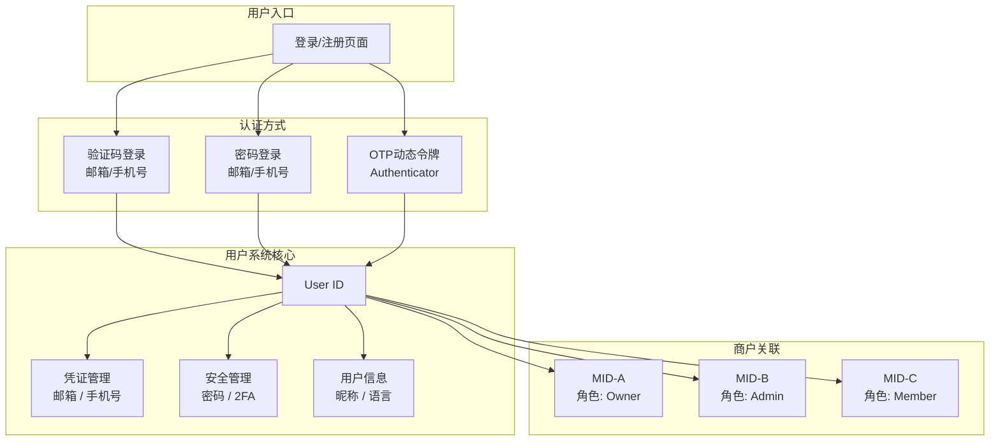

### 1.2 User-MID 关系模型

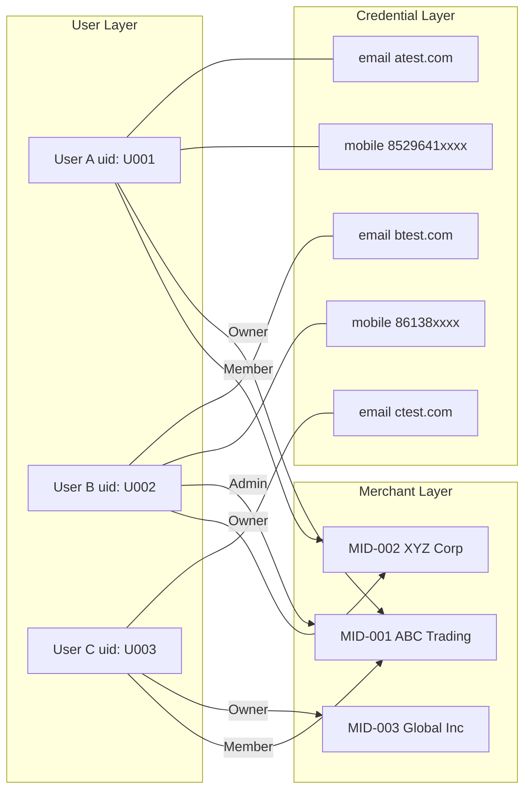

**关键关系：**

- **User ↔ Credential**：一对多，一个 User 可绑定多个邮箱/手机号
- **User ↔ MID**：多对多，一个自然人可属于多个 MID，一个 MID 可有多个自然人
- **User-MID 角色**：每个 User 在不同 MID 下可拥有不同角色（Owner / Admin / Member）

---

## 2. 注册模块

### 2.1 三种注册方式

EX 平台提供三种注册方式，用户在注册页选择邮箱或手机号后，再选择注册方式：

- **方式 A — 验证码注册**：输入邮箱/手机号 → 接收6位验证码 → 验证通过即完成注册
- **方式 B — 密码注册**：输入邮箱/手机号 → 设置密码（含强度校验）→ 通过邮件/短信验证身份 → 完成注册
- **方式 C — OTP 动态令牌注册**：输入邮箱/手机号 → 先验证邮箱/手机 → 绑定 Authenticator App（扫码 + 输入动态码确认）→ 完成注册

### 2.2 注册主流程

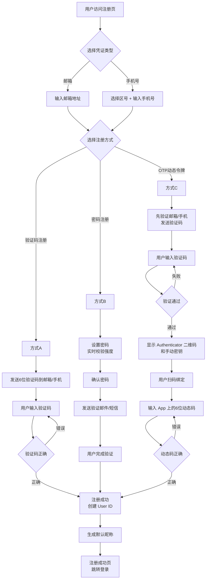

### 2.3 注册业务规则

**凭证唯一性：** 同一邮箱或手机号只能注册一个 User。如果凭证已被注册，提示"该邮箱/手机号已注册，请直接登录"。

**协议确认：** 注册前用户须勾选同意《会员服务协议》、《支付服务协议》、《授权协议》。

**IP 自动识别区号：** 手机号注册时，系统根据用户 IP 自动填充国家区号，IP 无法识别时默认 +1（美国），用户可手动修改。

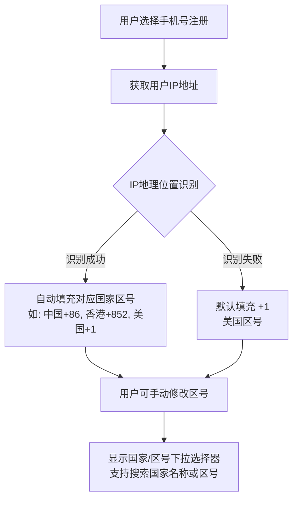

**密码强度规则（方式 B）：** 密码必须同时满足：≥8位、至少1个大写字母（A-Z）、至少1个小写字母（a-z）、至少1个数字（0-9）或特殊符号。输入时实时逐条校验。

**验证码规则：**
- 6位数字，有效期5分钟（可根据场景调整）
- 同一凭证60秒内只能发送1次，每天最多10次
- 连续5次输入错误，冻结账户24小时
- 邮箱通过邮件发送，手机号通过 SMS 发送

**OTP 绑定规则（方式 C）：**
- 绑定前必须先验证邮箱/手机号（防止恶意绑定）
- 支持 Google Authenticator、Authy 等标准 TOTP 应用
- 提供二维码扫描和手动输入密钥两种方式
- 绑定确认需输入 App 上显示的6位动态码

**默认昵称规则：**
- 邮箱注册：取 `@` 前部分（如 `john@test.com` → `john`）
- 手机号注册：`User_` + 后4位（如 `+852 96412374` → `User_2374`）

**注册成功后行为：** 注册成功后跳转登录页，用户使用注册时选择的方式登录。

---

## 3. 登录模块

### 3.1 登录方式与注册方式对应

- **验证码注册** → **验证码登录**：邮箱/手机 + 6位验证码
- **密码注册** → **密码登录**：邮箱/手机 + 密码
- **OTP 注册** → **OTP 登录**：邮箱/手机 + Authenticator 动态码

若账户同时绑定了多种凭证（如既设了密码又绑了 OTP），可自行选择任一方式登录。

### 3.2 验证码登录/注册流程（登录即注册）

除了独立注册入口外，验证码登录本身也支持"登录即注册"——首次使用的凭证自动创建账户。

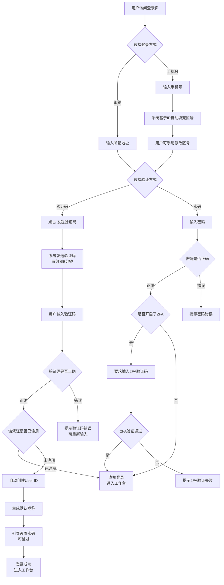

### 3.3 首次登录后行为

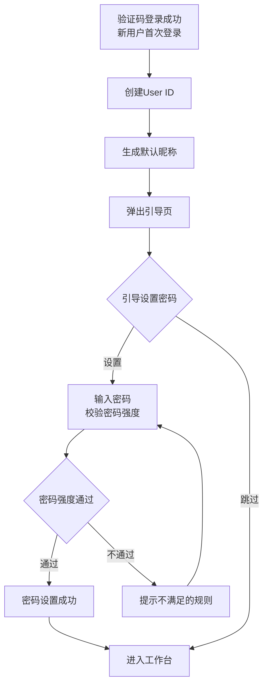

### 3.4 登录成功后行为

- **单一身份**：直接进入 MP 首页
- **多端身份（TP+MP）**：进入上次使用的端，可通过顶部切换
- **多 MID**：进入上次使用的 MID，可通过顶部切换
- **首次登录（新注册）**：进入引导页（开通产品/完善 KYB）
- **强制修改密码**：跳转修改密码页（如管理员重置了密码）

---

## 4. 登录安全验证策略

### 4.1 三级风险模型

系统根据登录行为实时评估风险等级，动态叠加验证要求：

- **L0 无风险**：常用设备 + 常用 IP + 常用地区 + 无异常行为 → 仅凭证验证，直接登录
- **L1 低风险**：新设备 / 新浏览器 / 长时间未登录（>7天）/ 清除 Cookie / 连续错误3次 → 凭证 + **图形验证码（CAPTCHA）**
- **L2 高风险**：连续错误≥5次 / 异地+新设备组合 / 暴力破解特征 / 账户被标记可疑 → **冻结账户24小时** + 邮件/短信安全通知

### 4.2 风险评分维度

后端风险引擎综合以下维度计算风险分值（0-100）：

- **设备指纹（25%）**：浏览器 UA、屏幕分辨率、时区、语言、Canvas/WebGL 指纹
- **IP 信誉（25%）**：地理位置、VPN/代理/Tor 检测、IP 黑名单、ASN 信誉
- **行为模式（20%）**：登录频率、输入速度、鼠标轨迹、页面停留时间
- **历史记录（20%）**：上次登录时间/地点、错误累计次数、账户年龄
- **账户状态（10%）**：未处理安全事件、近期密码修改、举报记录

分值映射：0-30 → L0 | 31-70 → L1 | 71-100 → L2

### 4.3 凭证错误累计规则

- **1-2次**：提示"密码/验证码错误，请重试"，维持当前风险等级
- **3次**：强制触发**图形验证码**（升级至 L1），提示"多次输入错误，请完成安全验证"
- **≥5次**：**冻结账户24小时**（升级至 L2），发送安全告警邮件/短信，建议用户重置密码

> 错误计数在成功登录后重置。冻结期间的登录尝试不计入错误次数。

### 4.4 图形验证码（CAPTCHA）

- 类型：滑动拼图验证（推荐）或点选文字验证
- 触发时机：风险等级 ≥ L1 时，在凭证输入前展示
- 有效期：单次有效，120秒超时需重新验证
- 连续失败3次 → 刷新验证码类型
- 提供音频验证码备选方案（无障碍）

### 4.5 登录主流程（含安全验证）

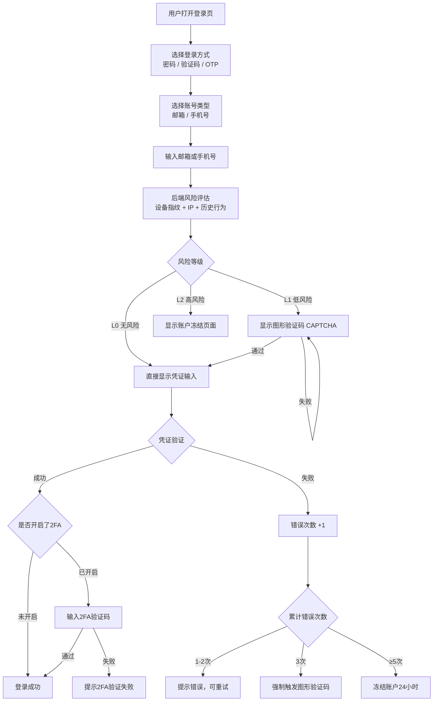

---

## 5. 登录异常处理

### 5.1 账户冻结（L2）

**触发条件：** 连续凭证错误≥5次 / 风险评分≥71

- 冻结时长：**24小时**
- 页面显示倒计时剩余冻结时间
- 操作入口："通过邮件解冻" / "联系客服"
- 系统发送安全告警到注册邮箱/手机，含冻结时间、触发原因（模糊描述）、非本人操作建议
- 邮件中包含一键解冻链接（有效期30分钟）

### 5.2 忘记密码

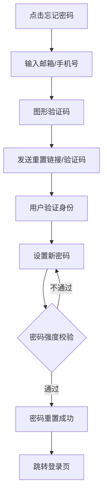

- 新密码不能与最近3次使用的密码相同
- 密码强度实时提示

### 5.3 其他异常场景

- **账户不存在**：不明确提示"该邮箱未注册"（防枚举攻击），密码场景统一提示"邮箱或密码错误"，验证码场景正常走发送流程但后端不实际发送
- **新设备首次登录成功**：发送通知邮件/短信，含时间、设备信息、IP 地址、地理位置，提供"不是我？立即冻结账户"链接

---

## 6. User Center - Profile

### 6.1 修改邮箱

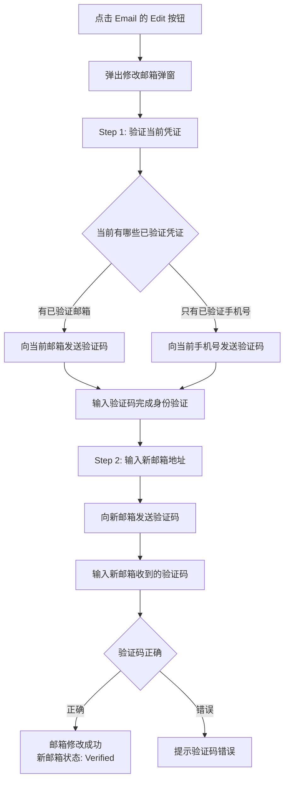

### 6.2 修改手机号

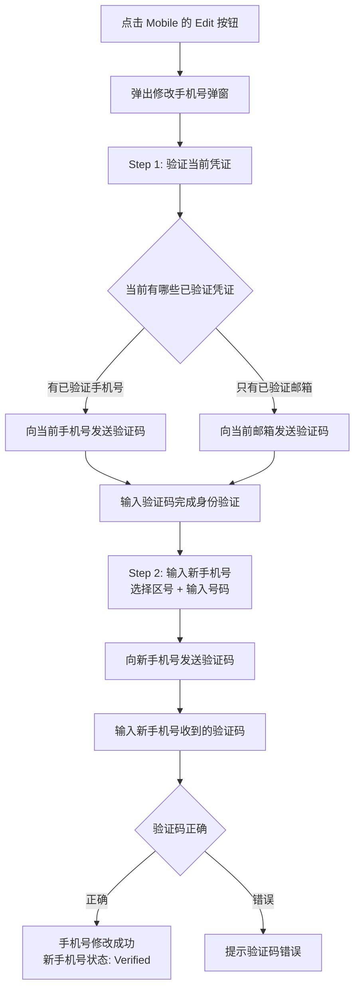

### 6.3 Login Method 设置

用户可选择默认登录方式（Email 或 Mobile）。只有已验证凭证才能设为 Login Method。仅绑定一个凭证时自动成为 Login Method。修改无需额外验证。

### 6.4 添加第二个凭证

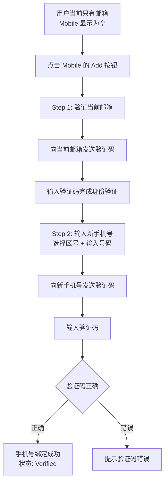

### 6.5 Basic Info

- **昵称**：2-30个字符，支持中文/英文/数字/下划线，不支持特殊符号和 emoji，修改无需验证
- **语言偏好**：English / 简体中文 / 繁體中文（可扩展），修改后立即生效，默认根据 IP 地区自动设置

---

## 7. User Center - Security

### 7.1 密码修改

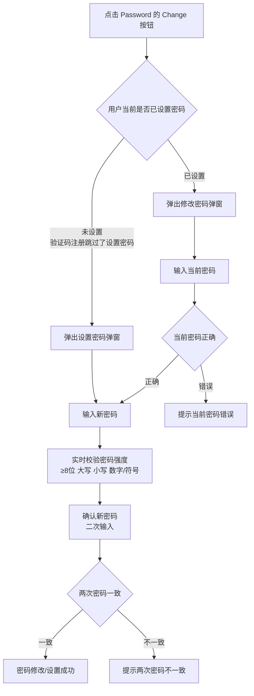

- 新密码不能与当前密码相同
- 修改成功后，其他设备的登录状态不受影响（本期）

### 7.2 Authenticator App (2FA)

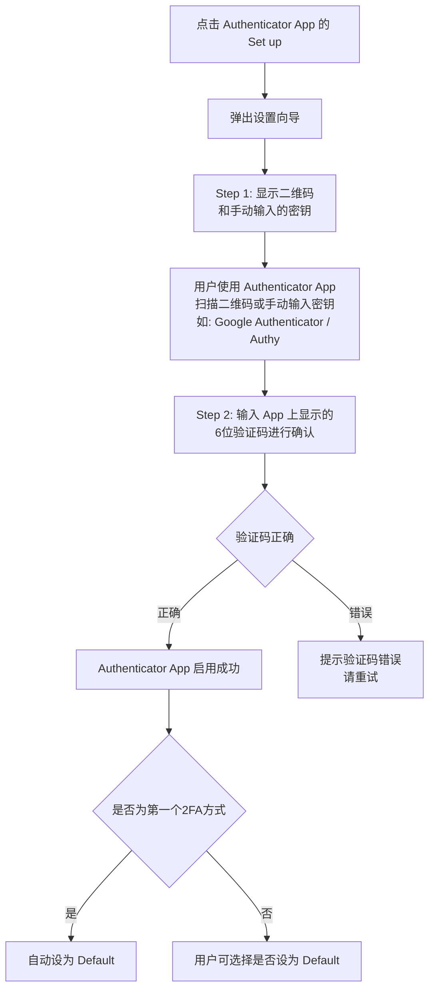

已启用后管理：Set as Default / Regenerate（需验证身份）/ Disable

### 7.3 SMS 2FA

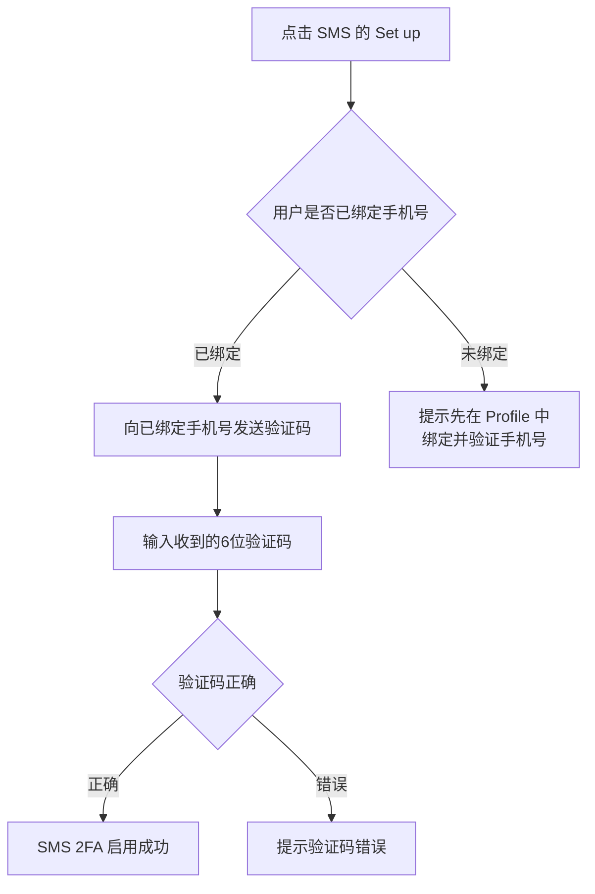

- 前提：必须已绑定并验证手机号
- 修改手机号后，SMS 2FA 自动绑定到新手机号

### 7.4 2FA 登录流程

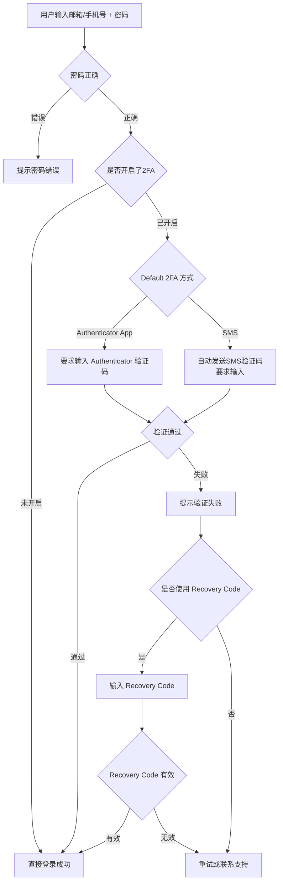

### 7.5 Recovery Codes

用于丢失 2FA 设备时恢复账户访问。

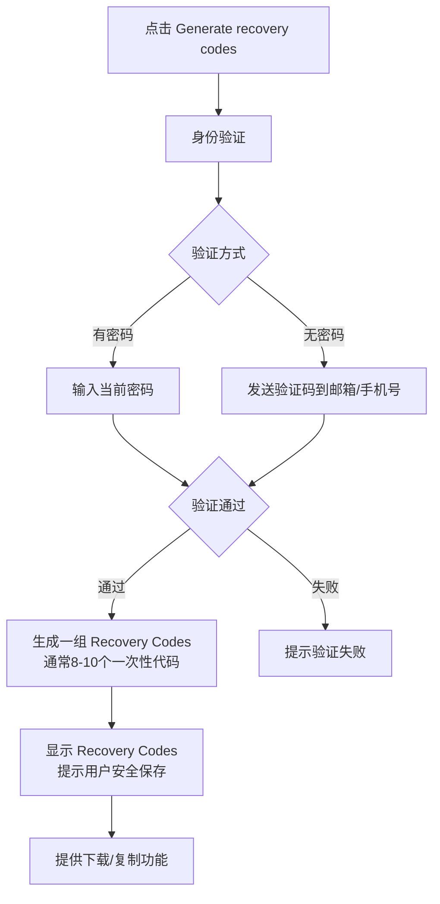

- 每次生成10个，格式为8位字母数字组合（如 `a1b2-c3d4`）
- 每个 Code 只能使用一次
- 重新生成后旧 Codes 全部失效

---

## 8. User 与 MID 关系模型

### 8.1 关系概览

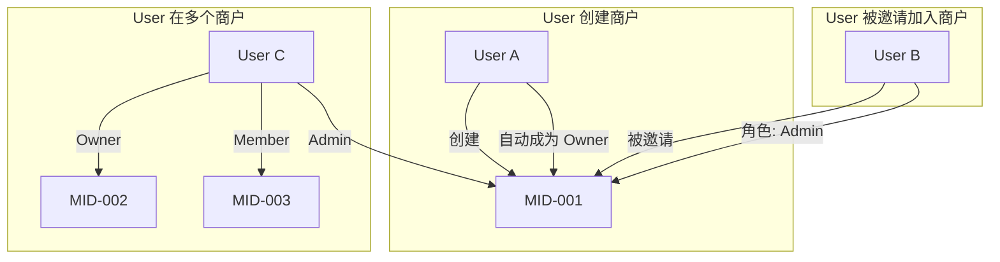

### 8.2 角色定义

- **Owner**：商户创建者/所有者，全部权限，包括删除商户、管理成员角色
- **Admin**：管理员，大部分管理权限，不能删除商户、不能修改 Owner
- **Member**：普通成员，查看权限为主，有限的操作权限

### 8.3 创建商户流程

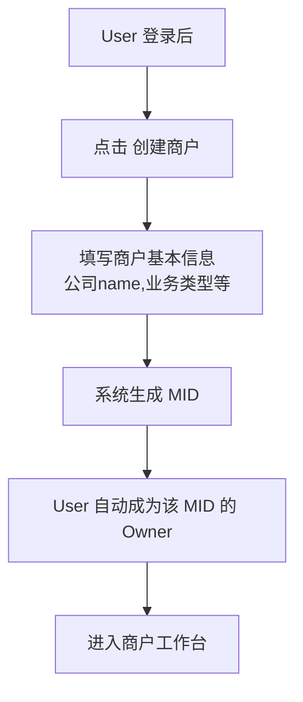

### 8.4 邀请成员加入商户

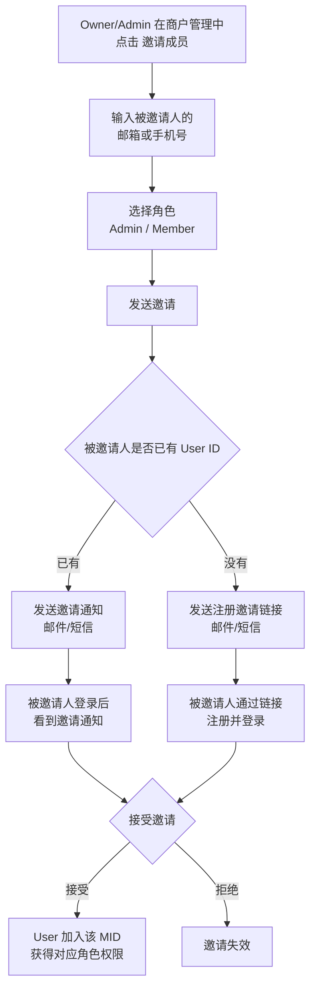

### 8.5 商户切换

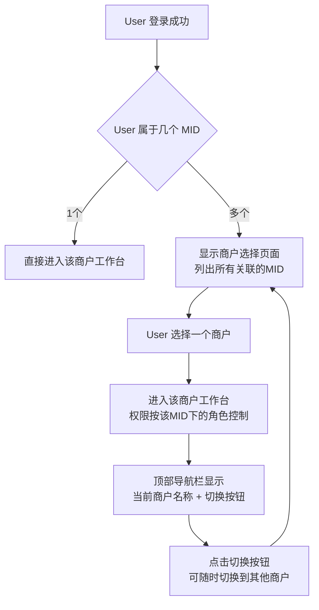

### 8.6 Owner 定义与认证

Owner 必须满足以下条件之一：

- **开户人**：创建 MID 并提交 KYC/产品开通申请的人，系统自动认定
- **法人（Legal Representative）**：公司法定代表人，需身份认证（人脸识别/手机号验证/线下材料）
- **董事（Director）**：公司董事会成员，需身份认证

```mermaid
flowchart TD
    A[MID创建] --> B[开户人自动成为 Owner]

    B --> C{是否需要变更Owner}
    C -->|不需要| D[开户人继续作为Owner]
    C -->|需要| E[发起Owner变更申请]

    E --> F{新Owner身份类型}
    F -->|法人| G1[提交法人身份信息]
    F -->|董事| G2[提交董事身份信息]

    G1 --> H[身份认证]
    G2 --> H

    H --> H1{认证方式}
    H1 -->|线上| H2[人脸识别 + 手机号验证]
    H1 -->|线下| H3[提交身份材料<br/>由平台/SP人工审核]

    H2 --> I{认证通过}
    H3 --> I

    I -->|通过| J[Owner变更成功<br/>原Owner降级为Admin]
    I -->|失败| K[认证失败<br/>保持原Owner不变]
```

Owner 专属权限（不可转让给 Admin/Member）：变更 Owner、删除/注销 MID、设置安全联系人、管理 Admin 角色。

### 8.7 MID 级操作权限授权

**核心规则：** Owner 可以为每个 User 配置 MID 级操作的验证方式——User 自己验证，还是需要 Owner 验证。

```mermaid
flowchart TD
    subgraph "User级操作（固定，不可更改）"
        A1[登录] -->|验证码发到| A1a[User自己]
        A2[修改个人密码] -->|验证码发到| A2a[User自己]
        A3[修改邮箱/手机号] -->|验证码发到| A3a[User自己]
        A4[2FA设置] -->|验证码发到| A4a[User自己]
    end

    subgraph "MID级操作（Owner可配置）"
        B1[发起交易] -->|Owner授权?| B1a{已授权: User自己<br/>未授权: Owner}
        B2[资金操作] -->|Owner授权?| B2a{已授权: User自己<br/>未授权: Owner}
        B3[修改商户配置] -->|Owner授权?| B3a{已授权: User自己<br/>未授权: Owner}
        B4[新增/删除成员] -->|Owner授权?| B4a{已授权: User自己<br/>未授权: Owner}
    end
```

**默认规则：** 新加入的 User 默认所有 MID 级操作都需要 Owner 验证，Owner 逐项授权。

### 8.8 操作验证流程

```mermaid
flowchart TD
    A[User发起MID级操作<br/>如: 发起交易] --> B{该User是否被Owner<br/>授权该操作}

    B -->|已授权| C[验证码发到 User 自己的凭证]
    B -->|未授权| D[验证码发到 Owner 的凭证]

    C --> E[User 输入验证码]
    E --> F{验证通过}
    F -->|通过| G[操作执行成功]
    F -->|失败| E

    D --> H[Owner 收到验证码 + 操作通知<br/>通知内容: 谁在做什么操作]
    H --> I{Owner 配合输入验证码}
    I -->|输入| J{验证通过}
    I -->|忽略/拒绝| K[操作超时失败<br/>通知User]
    J -->|通过| G
    J -->|失败| H
```

---

## 9. 状态机

### 9.1 User 状态

```
ACTIVE ←→ SUSPENDED
  ↓
DELETED（Out of Scope，本期不做）
```

- **ACTIVE**：正常使用状态
- **SUSPENDED**：账户被暂停（如安全风险）

### 9.2 凭证（Credential）状态

```
UNVERIFIED → VERIFIED
     ↑          ↓
     └── CHANGED（修改后重新验证）
```

- **UNVERIFIED**：已绑定但未验证
- **VERIFIED**：已通过验证码验证

### 9.3 2FA 状态

```
NOT_SET → ENABLED ←→ DISABLED
              ↓
          DEFAULT（被设为默认2FA方式）
```

### 9.4 邀请状态

```
PENDING → ACCEPTED
    ↓
REJECTED
    ↓
EXPIRED（超过7天未处理）
```

---

## 10. 安全策略

- **密码传输**：HTTPS + 前端加密（RSA 公钥加密后传输）
- **密码存储**：bcrypt/argon2 哈希 + 随机盐值，禁止明文存储
- **验证码传输**：通过 HTTPS 加密传输
- **2FA 密钥存储**：加密存储 TOTP Secret
- **Recovery Codes**：哈希存储，使用后标记为已用
- **会话管理**：JWT Token + HttpOnly Cookie，支持单点登录/踢出
- **登录日志**：记录所有登录尝试（成功/失败），保留180天
- **CAPTCHA**：接入第三方服务（如 reCAPTCHA / hCaptcha / 极验）
- **频率限制**：同一 IP 每分钟最多10次登录请求
- **PCI DSS**：符合 PCI DSS v4.0 第8章身份验证要求

---

## 附录：错误码与提示信息

- 验证码过期："Verification code has expired. Please request a new one."
- 验证码错误："Invalid verification code. Please try again."
- 验证码发送频率限制："Please wait 60 seconds before requesting a new code."
- 验证码每日上限："You've reached the daily limit. Please try again tomorrow."
- 密码强度不足：实时显示未满足的具体规则
- 两次密码不一致："Passwords do not match."
- 当前密码错误："Current password is incorrect."
- 邮箱已被绑定："This email is already associated with another account."
- 手机号已被绑定："This phone number is already associated with another account."
- Recovery Code 无效："Invalid recovery code. Please try another one."
- 2FA 验证失败："Invalid authentication code. Please try again."

---

*最后更新：2026-02-13*
*文档版本：v2.0*
*作者：EX Product Team*
