# EX Platform - 注册登录与用户系统 PRD

> 版本：v2.1 | 更新日期：2026-02-13 | 关联页面：mp-login.html / mp-register.html

## 文档概述

本文档定义 EX 平台用户系统的产品需求，涵盖注册、登录、登录安全验证策略、用户中心（Profile & Security）以及用户与商户（MID）的关系模型。

**核心设计理念：**

- ✅ **验证码登录即注册**：无需单独注册流程，首次验证码登录自动创建账户
- ✅ **三种注册方式**：验证码注册、密码注册、OTP 动态令牌注册
- ✅ **双层身份模型**：Identity ID（全局身份）+ User ID（MID 内身份）
- ✅ **多凭证支持**：一个 Identity 可绑定多个登录凭证（邮箱/手机号）
- ✅ **多商户关联**：一个 Identity 可在多个 MID 下，每个 MID 分配独立 User ID
- ✅ **安全优先**：支持密码 + 2FA 双因素认证，风险分级动态验证

---

## 1. 系统架构概览

### 1.1 用户系统整体架构

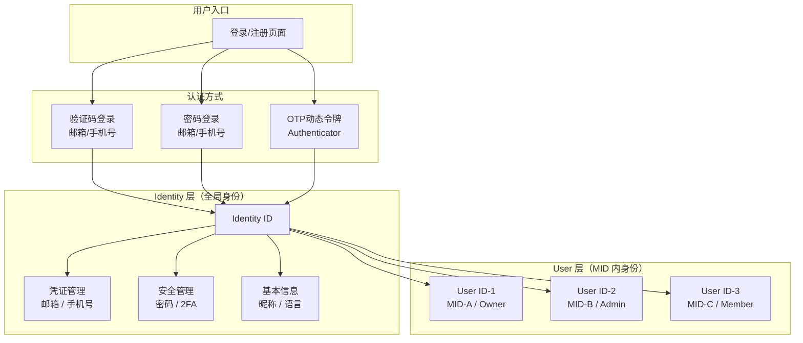

**双层身份说明：**

- **Identity ID**：代表一个自然人的全局身份，拥有登录凭证（邮箱/手机号）、安全设置（密码/2FA）、基本信息（昵称/语言）。注册时创建，全局唯一。
- **User ID**：代表该自然人在某个 MID 下的成员身份。一个 Identity 加入一个 MID 时，系统自动生成一个 User ID。User ID 承载该成员在该 MID 下的角色、权限、数据归属等信息。
- **关系**：Identity ID : User ID = 1 : N（一个自然人可在多个 MID 下拥有不同 User ID）

### 1.2 Identity-User-MID 关系模型

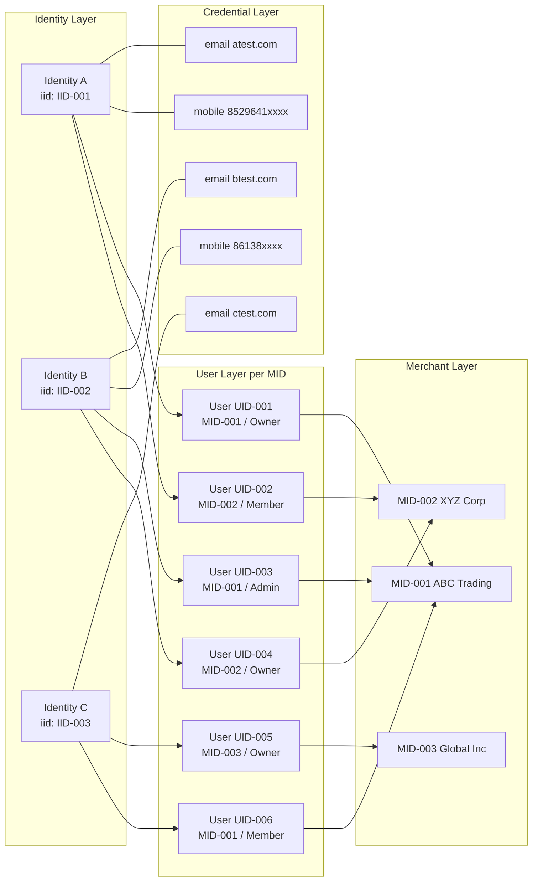

**关键关系：**

- **Identity ↔ Credential**：一对多，一个 Identity 可绑定多个邮箱/手机号
- **Identity ↔ User**：一对多，一个 Identity 加入每个 MID 时生成一个独立 User ID
- **User ↔ MID**：一对一，每个 User ID 只属于一个 MID
- **User 角色**：每个 User ID 在其 MID 下拥有多个角色（Owner / Admin / Member）
- **一个 MID 可有多个 User**：不同 Identity 加入同一 MID，各自拥有独立 User ID

---

## 2. 注册模块

### 2.1 注册方式与区域自动选择

EX 平台支持三种注册方式，**系统根据用户 IP 地区自动选择默认凭证类型和注册方式**，用户无需手动选择：

| 地区          | 默认凭证类型   | 默认注册方式 | 说明                           |
| ------------- | -------------- | ------------ | ------------------------------ |
| 中国大陆      | 手机号（+86）  | 密码注册     | 国内用户习惯手机+密码          |
| 香港          | 手机号（+852） | 密码注册     | 同上                           |
| 其他国家/地区 | 邮箱           | OTP 动态令牌 | 海外用户习惯邮箱+Authenticator |

用户可手动切换凭证类型（邮箱 ↔ 手机号），切换后注册方式自动联动：手机号 → 密码注册，邮箱 → OTP 注册。

**三种注册方式详情：**

- **密码注册**（手机号默认）：输入手机号 → 设置密码（含强度校验）→ 发送验证码验证身份 → 完成注册
- **OTP 动态令牌注册**（邮箱默认）：输入邮箱 → 先验证邮箱 → 绑定 Authenticator App（扫码 + 输入动态码确认）→ 完成注册
- **验证码注册**（备用，未来可扩展）：输入邮箱/手机号 → 接收6位验证码 → 验证通过即完成注册

### 2.2 注册主流程

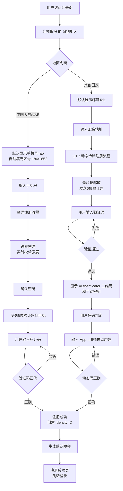

> 用户可手动切换凭证类型（邮箱 ↔ 手机号），切换后注册方式自动联动：手机号 → 密码注册，邮箱 → OTP 注册。

### 2.3 注册业务规则

**凭证唯一性：** 同一邮箱或手机号只能注册一个 User。如果凭证已被注册，提示"该邮箱/手机号已注册，请直接登录"。

**协议确认：** 注册前用户须勾选同意《会员服务协议》、《支付服务协议》、《授权协议》。

**IP 自动识别规则：** 系统根据用户 IP 地址自动决定默认凭证类型、注册方式和区号：

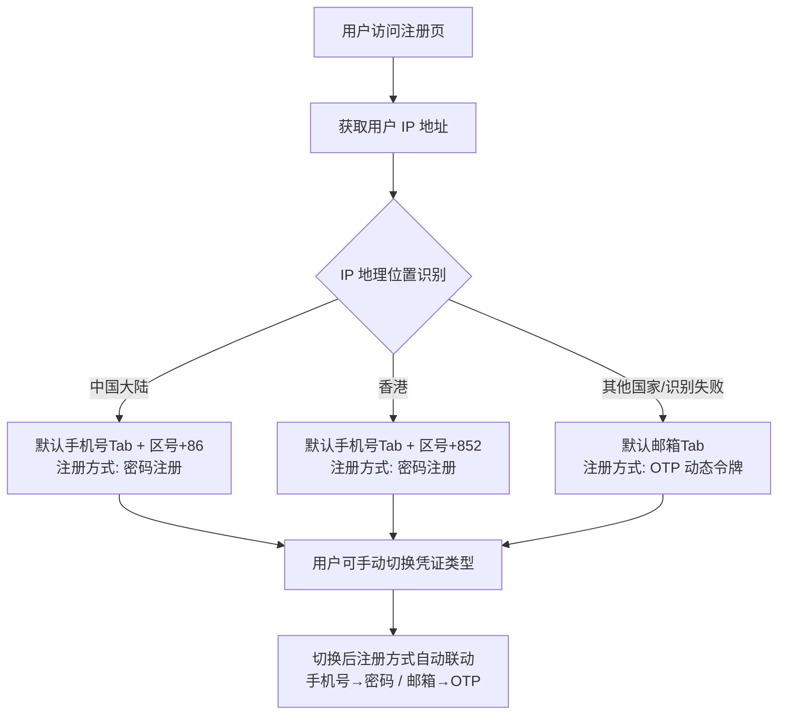

**密码强度规则（方式 B）：** 密码必须同时满足：≥8位、至少1个大写字母（A-Z）、至少1个小写字母（a-z）、至少1个数字（0-9）或特殊符号。输入时实时逐条校验。

**验证码规则：**

- 6位数字，有效期5分钟（可根据场景调整）
- 同一凭证60秒内只能发送1次，每天最多10次
- 连续5次输入错误，冻结账户24小时
- 邮箱通过邮件发送，手机号通过 SMS 发送

**OTP 绑定规则（方式 C）：**

- 绑定前必须先验证邮箱/手机号（防止恶意绑定）
- 支持 Google Authenticator、Authy 等标准 TOTP 应用
- 提供二维码扫描和手动输入密钥两种方式
- 绑定确认需输入 App 上显示的6位动态码

**默认昵称规则：**

- 邮箱注册：取 `@` 前部分（如 `john@test.com` → `john`）
- 手机号注册：`User_` + 后4位（如 `+852 96412374` → `User_2374`）

**注册成功后行为：** 注册成功后跳转登录页，用户使用注册时选择的方式登录。

---

## 3. 登录模块

### 3.1 登录方式与注册方式对应

- **验证码注册** → **验证码登录**：邮箱/手机 + 6位验证码
- **密码注册** → **密码登录**：邮箱/手机 + 密码
- **OTP 注册** → **OTP 登录**：邮箱/手机 + Authenticator 动态码

若账户同时绑定了多种凭证（如既设了密码又绑了 OTP），可自行选择任一方式登录。

### 3.2 验证码登录/注册流程（登录即注册）

除了独立注册入口外，验证码登录本身也支持"登录即注册"——首次使用的凭证自动创建账户。

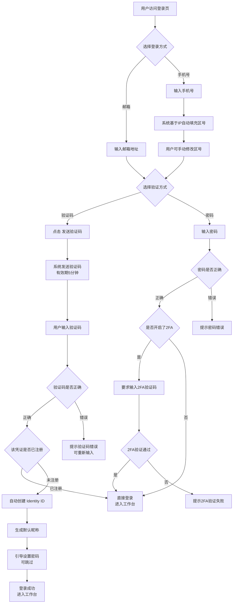

### 3.3 首次登录后行为

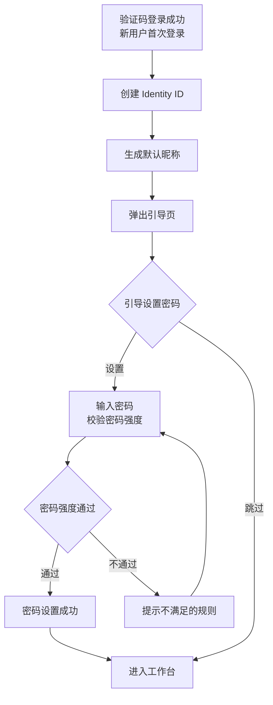

### 3.4 登录成功后行为

- **单一身份**：直接进入 MP 首页
- **多端身份（TP+MP）**：进入上次使用的端，可通过顶部切换
- **多 MID**：进入上次使用的 MID，可通过顶部切换
- **首次登录（新注册）**：进入引导页（开通产品/完善 KYB）
- **强制修改密码**：跳转修改密码页（如管理员重置了密码）

---

## 4. 登录安全验证策略

### 4.1 风险等级模型

系统根据设备、IP 和密码错误次数三个维度判断风险等级：

| 风险等级            | 触发条件                            | 验证要求                                       |
| ------------------- | ----------------------------------- | ---------------------------------------------- |
| **L0 无风险** | 同设备 + 同 IP                      | 直接输入凭证登录，无额外验证                   |
| **L1 低风险** | 新设备（同 IP）或 同设备（不同 IP） | 先完成**图形验证码**，再输入凭证         |
| **L2 中风险** | 同设备 + 同 IP + 密码错误 3 次      | 强制触发**图形验证码**，验证后可继续尝试 |
| **冻结**      | 密码连续错误 5 次                   | **冻结账户 24 小时** + 发送安全通知      |

**判断维度：**

- **设备识别**：通过设备指纹（浏览器 UA、屏幕分辨率、时区、Canvas/WebGL 指纹等）判断是否为已知设备
- **IP 识别**：对比当前 IP 与历史登录 IP 是否一致
- **密码错误计数**：当前会话内累计，成功登录后重置

### 4.3 密码错误累计规则

- **第 1-2 次错误**：提示“密码错误，请重试（连续错误 5 次将冻结账户）”
- **第 3 次错误**：强制弹出**图形验证码**浮层，提示“密码错误，请完成图形验证后重试”
- **第 4 次错误**：同上，继续要求图形验证码
- **第 5 次错误**：**直接冻结账户 24 小时**，发送安全告警邮件/短信，建议用户重置密码

> 错误计数在成功登录后重置。冻结期间的登录尝试不计入错误次数。

### 4.4 图形验证码（CAPTCHA）

- 类型：滑动拼图验证（推荐）或点选文字验证
- 展示方式：**弹层浮窗**（覆盖在当前页面上），不跳转新页面
- 触发时机：L1（设备/IP 变化）点击“继续”时，或 L2（密码错误 3 次）时自动弹出
- 验证通过后自动关闭浮窗，继续登录流程
- 有效期：单次有效，120秒超时需重新验证
- 提供音频验证码备选方案（无障碍）

### 4.5 登录主流程（含安全验证）

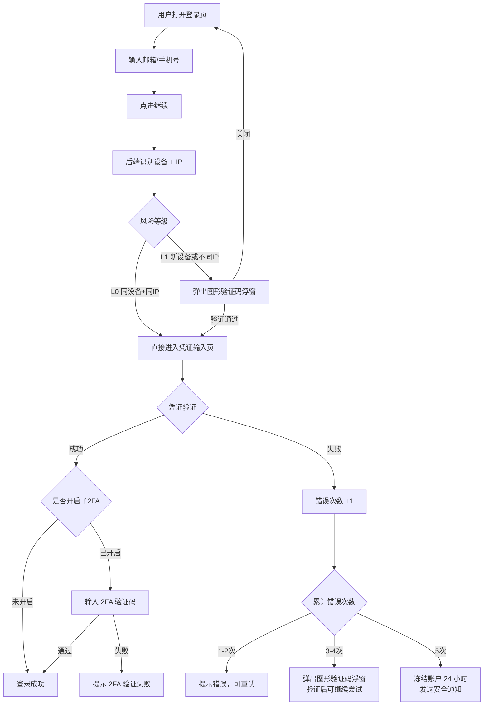

---

## 5. 登录异常处理

### 5.1 账户冻结

**触发条件：** 密码连续错误 ≥ 5 次

- 冻结时长：**24小时**
- 页面显示倒计时剩余冻结时间
- 操作入口："通过邮件解冻" / "联系客服"
- 系统发送安全告警到注册邮箱/手机，含冻结时间、触发原因（模糊描述）、非本人操作建议
- 邮件中包含一键解冻链接（有效期30分钟）

### 5.2 忘记密码

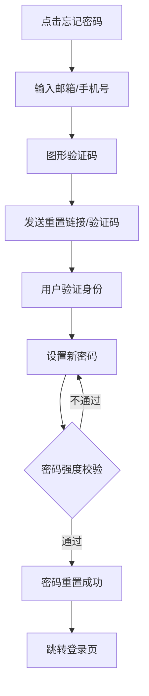

- 新密码不能与最近3次使用的密码相同
- 密码强度实时提示

### 5.3 其他异常场景

- **账户不存在**：不明确提示"该邮箱未注册"（防枚举攻击），密码场景统一提示"邮箱或密码错误"，验证码场景正常走发送流程但后端不实际发送
- **新设备首次登录成功**：发送通知邮件/短信，含时间、设备信息、IP 地址、地理位置，提供"不是我？立即冻结账户"链接

---

## 6. User Center - Profile

### 6.1 修改邮箱

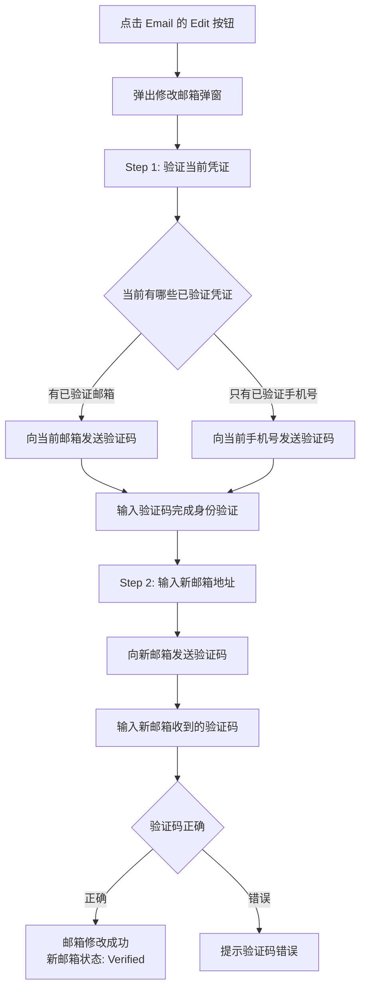

### 6.2 修改手机号

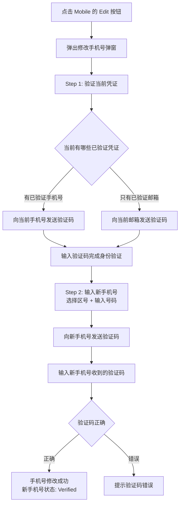

### 6.3 Login Method 设置

用户可选择默认登录方式（Email 或 Mobile）。只有已验证凭证才能设为 Login Method。仅绑定一个凭证时自动成为 Login Method。修改无需额外验证。

### 6.4 添加第二个凭证

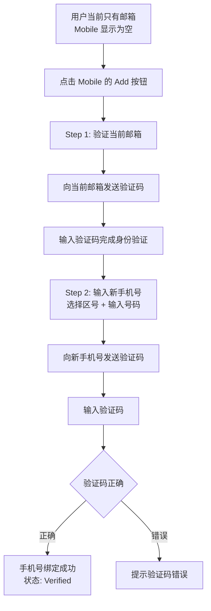

### 6.5 Basic Info

- **昵称**：2-30个字符，支持中文/英文/数字/下划线，不支持特殊符号和 emoji，修改无需验证
- **语言偏好**：English / 简体中文 / 繁體中文（可扩展），修改后立即生效，默认根据 IP 地区自动设置

---

## 7. User Center - Security

### 7.1 密码修改

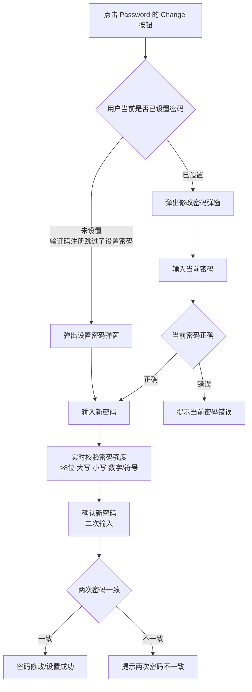

- 新密码不能与当前密码相同
- 修改成功后，其他设备的登录状态不受影响（本期）

### 7.2 Authenticator App (2FA)

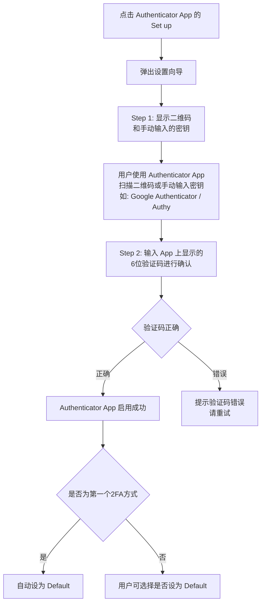

已启用后管理：Set as Default / Regenerate（需验证身份）/ Disable

### 7.3 SMS 2FA

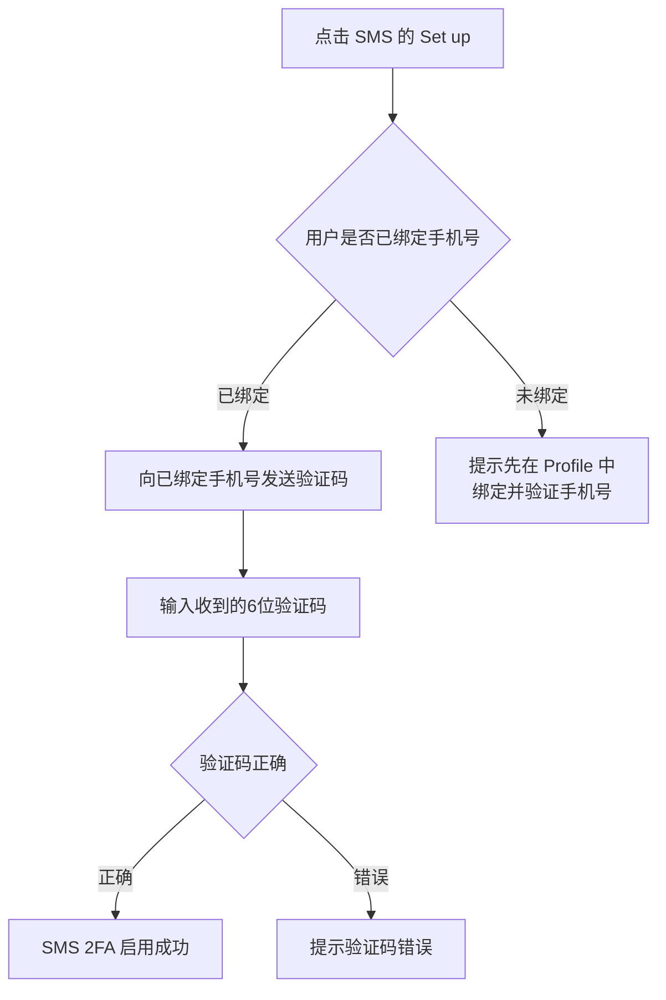

- 前提：必须已绑定并验证手机号
- 修改手机号后，SMS 2FA 自动绑定到新手机号

### 7.4 Email 2FA

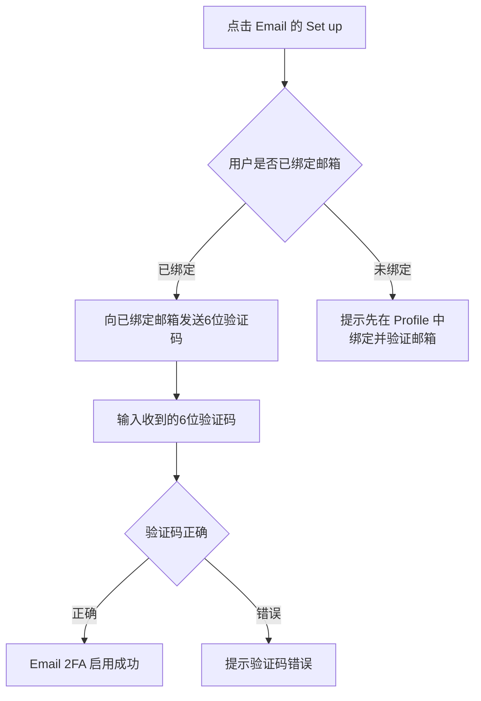

- 前提：必须已绑定并验证邮箱
- 修改邮箱后，Email 2FA 自动绑定到新邮箱
- 每次登录触发 2FA 时，系统向绑定邮箱发送6位验证码，有效期5分钟

### 7.5 2FA 登录流程

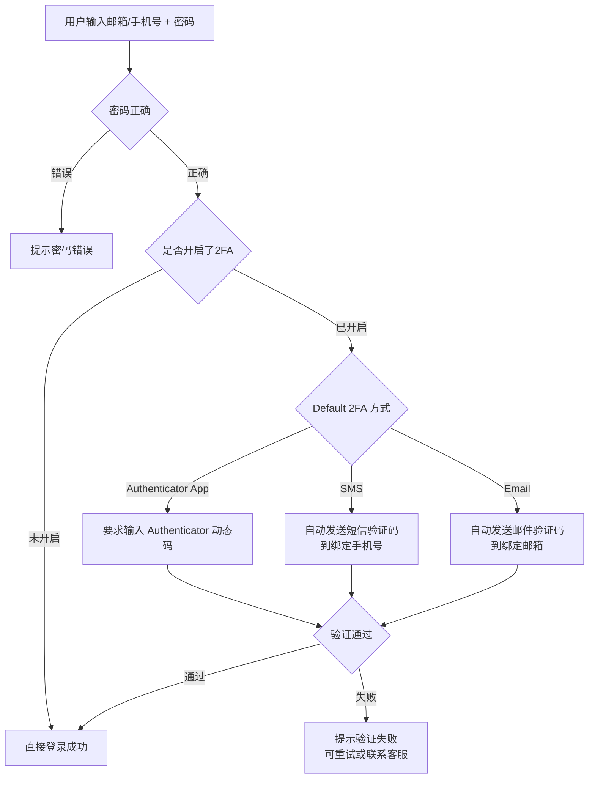

**2FA 方式说明：**

| 2FA 方式          | 验证码来源                                           | 适用场景     |
| ----------------- | ---------------------------------------------------- | ------------ |
| Authenticator App | Google Authenticator / Authy 等 App 生成 TOTP 动态码 | 推荐，最安全 |
| SMS               | 短信发送到**绑定手机号**                       | 手机号用户   |
| Email             | 邮件发送到**绑定邮箱**                         | 邮箱用户     |

### 7.6 Payment PIN（交易密码）

交易密码是 **Identity 级** 的安全设置，用于在执行资金操作时快速验证身份，替代短信/邮件验证码。

**核心规则：**

- **层级**：Identity 级（全局一个 PIN，所有 MID 通用）
- **格式**：6 位数字
- **可选性**：非强制，用户可选择设置
- **适用场景**：仅在角色验证方式为 **Self** 时生效；Designated 模式下不适用（验证对象是指定手机号，不是操作人）
- **未设置时**：回退到手机号/邮箱验证码

**设置流程：**

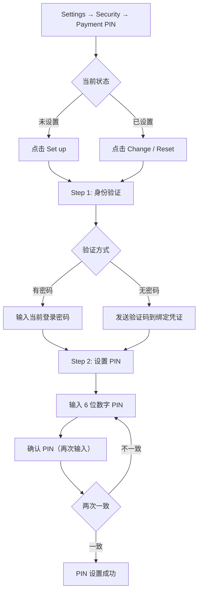

**PIN 安全规则：**

- 不能是连续数字（如 123456）或重复数字（如 111111）
- 连续输入错误 5 次，PIN 锁定 30 分钟
- 锁定期间可通过验证码方式继续操作（回退机制）
- PIN 存储使用与登录密码相同的加密标准（bcrypt/argon2）

### 7.7 Designated Phone（安全验证手机号）

安全验证手机号是 **MID 级** 的设置，仅 **Account Holder** 可配置。当角色验证方式为 Designated 时，资金操作的验证码将发送到此手机号。

**核心规则：**

- **层级**：MID 级（每个 MID 独立配置）
- **可见性**：仅 Account Holder 可见和编辑
- **用途**：角色验证方式为 Designated 时，验证码发到此号码
- **默认值**：Account Holder 自己的手机号（如已绑定）

**设置流程：**

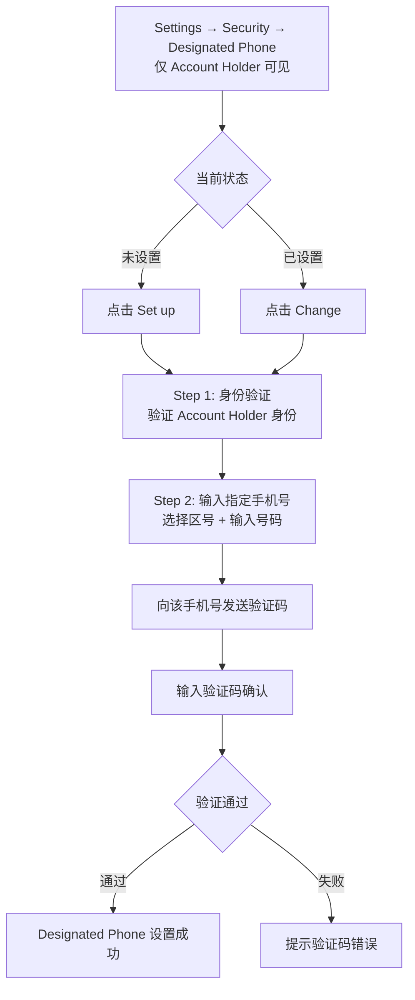

> **注意：** Designated Phone 可以是 Account Holder 自己的手机号，也可以是其他人的手机号（如财务总监）。关键是 Account Holder 必须能获取该手机号的验证码来完成设置。

### 7.8 资金操作验证流程（完整）

当用户执行资金操作（如发起交易、兑换、卡充值等）时，系统根据角色验证方式和用户安全设置决定验证方式：

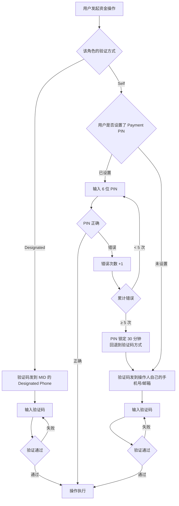

**Security 页面展示逻辑：**

| 设置项 | 层级 | 可见条件 | 说明 |
|--------|------|----------|------|
| Login Password | Identity | 所有用户 | 登录密码 |
| Authenticator App (2FA) | Identity | 所有用户 | TOTP 动态令牌 |
| SMS 2FA | Identity | 已绑定手机号 | 短信二次验证 |
| Email 2FA | Identity | 已绑定邮箱 | 邮件二次验证 |
| **Payment PIN** | **Identity** | **用户在任一 MID 有交易模块操作权限** | **交易密码，6位数字** |
| **Designated Phone** | **MID** | **仅 Account Holder** | **安全验证手机号** |

---

## 8. Identity-User-MID 关系模型

### 8.1 关系概览

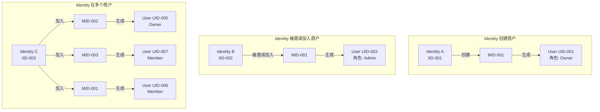

### 8.2 角色定义

- **Owner**：商户创建者/所有者，全部权限，包括删除商户、管理成员角色
- **Admin**：管理员，大部分管理权限，不能删除商户、不能修改 Owner
- **Member**：普通成员，查看权限为主，有限的操作权限

### 8.3 创建商户流程

```mermaid
flowchart TD
    A[Identity 登录后] --> B[点击 创建商户]
    B --> C[填写商户基本信息<br/>公司name,业务类型等]
    C --> D[系统生成 MID]
    D --> E[系统为该 Identity 在新 MID 下<br/>生成 User ID]
    E --> F[User 自动成为该 MID 的 Owner]
    F --> G[进入商户工作台]
```

### 8.4 邀请成员加入商户

```mermaid
flowchart TD
    A[Owner/Admin 在商户管理中<br/>点击 邀请成员] --> B[输入被邀请人的<br/>邮箱或手机号]
    B --> C[选择角色<br/>Admin / Member]
    C --> D[发送邀请]

    D --> E{被邀请人是否已有 Identity ID}
    E -->|已有| F[发送邀请通知<br/>邮件/短信]
    E -->|没有| G[发送注册邀请链接<br/>邮件/短信]

    F --> H[被邀请人登录后<br/>看到邀请通知]
    G --> I[被邀请人通过链接<br/>注册并登录]

    H --> J{接受邀请}
    I --> J

    J -->|接受| K[系统为该 Identity 在该 MID 下<br/>生成 User ID，获得对应角色权限]
    J -->|拒绝| L[邀请失效]
```

### 8.5 商户切换

```mermaid
flowchart TD
    A[Identity 登录成功] --> B{该 Identity 有几个 User ID}

    B -->|1个| C[直接进入该商户工作台<br/>使用对应 User ID]
    B -->|多个| D[显示商户选择页面<br/>列出所有关联的 MID]

    D --> E[选择一个商户]
    E --> F[切换到该 MID 对应的 User ID<br/>权限按该 User 的角色控制]

    F --> G[顶部导航栏显示<br/>当前商户名称 + 切换按钮]
    G --> H[点击切换按钮<br/>可随时切换到其他商户]
    H --> D
```

### 8.6 Owner 定义与认证

Owner 必须满足以下条件之一：

- **开户人**：创建 MID 并提交 KYC/产品开通申请的人，系统自动认定
- **法人（Legal Representative）**：公司法定代表人，需身份认证（人脸识别/手机号验证/线下材料）
- **董事（Director）**：公司董事会成员，需身份认证

```mermaid
flowchart TD
    A[MID创建] --> B[开户人自动成为 Owner]

    B --> C{是否需要变更Owner}
    C -->|不需要| D[开户人继续作为Owner]
    C -->|需要| E[发起Owner变更申请]

    E --> F{新Owner身份类型}
    F -->|法人| G1[提交法人身份信息]
    F -->|董事| G2[提交董事身份信息]

    G1 --> H[身份认证]
    G2 --> H

    H --> H1{认证方式}
    H1 -->|线上| H2[人脸识别 + 手机号验证]
    H1 -->|线下| H3[提交身份材料<br/>由平台/SP人工审核]

    H2 --> I{认证通过}
    H3 --> I

    I -->|通过| J[Owner变更成功<br/>原Owner降级为Admin]
    I -->|失败| K[认证失败<br/>保持原Owner不变]
```

Owner 专属权限（不可转让给 Admin/Member）：变更 Owner、删除/注销 MID、设置安全联系人、管理 Admin 角色。

### 8.7 MID 级操作权限授权

**核心规则：** Owner 可以为 MID 下的每个 User 配置操作验证方式——该成员自己验证，还是需要 Owner 验证。

```mermaid
flowchart TD
    subgraph "Identity 级操作（固定，不可更改）"
        A1[登录] -->|验证码发到| A1a[Identity 自己的凭证]
        A2[修改密码] -->|验证码发到| A2a[Identity 自己的凭证]
        A3[修改邮箱/手机号] -->|验证码发到| A3a[Identity 自己的凭证]
        A4[2FA设置] -->|验证码发到| A4a[Identity 自己的凭证]
    end

    subgraph "MID 级操作（Owner 可配置）"
        B1[发起交易] -->|Owner授权?| B1a{已授权: 成员自己验证<br/>未授权: Owner验证}
        B2[资金操作] -->|Owner授权?| B2a{已授权: 成员自己验证<br/>未授权: Owner验证}
        B3[修改商户配置] -->|Owner授权?| B3a{已授权: 成员自己验证<br/>未授权: Owner验证}
        B4[新增/删除成员] -->|Owner授权?| B4a{已授权: 成员自己验证<br/>未授权: Owner验证}
    end
```

**默认规则：** 新加入的 User 默认所有 MID 级操作都需要 Owner 验证，Owner 逐项授权。

### 8.8 操作验证流程

```mermaid
flowchart TD
    A[成员发起 MID 级操作<br/>如: 发起交易] --> B{该 User 是否被 Owner<br/>授权该操作}

    B -->|已授权| C[验证码发到该成员的 Identity 凭证]
    B -->|未授权| D[验证码发到 Owner 的 Identity 凭证]

    C --> E[成员输入验证码]
    E --> F{验证通过}
    F -->|通过| G[操作执行成功]
    F -->|失败| E

    D --> H[Owner 收到验证码 + 操作通知<br/>通知内容: 谁在做什么操作]
    H --> I{Owner 配合输入验证码}
    I -->|输入| J{验证通过}
    I -->|忽略/拒绝| K[操作超时失败<br/>通知成员]
    J -->|通过| G
    J -->|失败| H
```

---

## 9. 状态机

### 9.1 Identity 状态

```
ACTIVE ←→ SUSPENDED
  ↓
DELETED（Out of Scope，本期不做）
```

- **ACTIVE**：正常使用状态
- **SUSPENDED**：账户被暂停（如安全风险）

### 9.1.1 User 状态（MID 内）

```
ACTIVE ←→ DISABLED
```

- **ACTIVE**：该成员在该 MID 下正常使用
- **DISABLED**：Owner 禁用该成员在该 MID 下的权限（不影响 Identity 全局状态）

### 9.2 凭证（Credential）状态

```
UNVERIFIED → VERIFIED
     ↑          ↓
     └── CHANGED（修改后重新验证）
```

- **UNVERIFIED**：已绑定但未验证
- **VERIFIED**：已通过验证码验证

### 9.3 2FA 状态

```
NOT_SET → ENABLED ←→ DISABLED
              ↓
          DEFAULT（被设为默认2FA方式）
```

### 9.4 邀请状态

```
PENDING → ACCEPTED
    ↓
REJECTED
    ↓
EXPIRED（超过7天未处理）
```

---

## 10. 安全策略

- **密码传输**：HTTPS + 前端加密（RSA 公钥加密后传输）
- **密码存储**：bcrypt/argon2 哈希 + 随机盐值，禁止明文存储
- **验证码传输**：通过 HTTPS 加密传输
- **2FA 密钥存储**：加密存储 TOTP Secret
- **会话管理**：JWT Token + HttpOnly Cookie，支持单点登录/踢出
- **登录日志**：记录所有登录尝试（成功/失败），保留180天
- **CAPTCHA**：接入第三方服务（如 reCAPTCHA / hCaptcha / 极验）
- **频率限制**：同一 IP 每分钟最多10次登录请求
- **PCI DSS**：符合 PCI DSS v4.0 第8章身份验证要求

---

## 附录：错误码与提示信息

- 验证码过期："Verification code has expired. Please request a new one."
- 验证码错误："Invalid verification code. Please try again."
- 验证码发送频率限制："Please wait 60 seconds before requesting a new code."
- 验证码每日上限："You've reached the daily limit. Please try again tomorrow."
- 密码强度不足：实时显示未满足的具体规则
- 两次密码不一致："Passwords do not match."
- 当前密码错误："Current password is incorrect."
- 邮箱已被绑定："This email is already associated with another account."
- 手机号已被绑定："This phone number is already associated with another account."
- 2FA 验证失败："Invalid authentication code. Please try again."

---

## 11. 通知模块

系统在用户操作的关键节点发送通知，支持 **邮件** 和 **短信** 两种渠道。通知语言跟随用户 Identity 的语言设置。

### 11.1 通知渠道规则

| 渠道 | 触发条件 | 说明 |
|------|---------|------|
| 邮件 | 用户绑定了邮箱 | 所有通知都发邮件 |
| 短信 | 用户绑定了手机号 | 验证码类通知发短信，安全告警同时发邮件+短信 |

### 11.2 通知场景清单

| 编号 | 场景 | 渠道 | 触发时机 |
|------|------|------|----------|
| N01 | 注册验证码 | 邮件/短信 | 用户注册时发送验证码 |
| N02 | 注册成功 | 邮件 | 注册完成后欢迎邮件 |
| N03 | 登录验证码 | 邮件/短信 | 验证码登录时发送 |
| N04 | 2FA 验证码（SMS） | 短信 | 登录触发 SMS 2FA |
| N05 | 2FA 验证码（Email） | 邮件 | 登录触发 Email 2FA |
| N06 | 账户冻结通知 | 邮件+短信 | 密码错误5次触发冻结 |
| N07 | 账户解冻通知 | 邮件 | 冻结到期或手动解冻 |
| N08 | 密码重置验证码 | 邮件/短信 | 用户点击“忘记密码” |
| N09 | 密码修改成功 | 邮件 | 密码修改完成后确认 |
| N10 | 邮箱/手机号绑定验证码 | 邮件/短信 | 绑定新凭证时发送验证码 |
| N11 | 邮箱/手机号变更通知 | 邮件/短信 | 发送到**旧**凭证，提醒凭证已变更 |
| N12 | 2FA 启用/关闭通知 | 邮件 | 2FA 设置变更后确认 |
| N13 | 新设备登录通知 | 邮件 | 检测到新设备登录成功 |
| N14 | 邀请加入商户 | 邮件 | Owner 邀请新成员加入 MID |
| N15 | 成员加入成功 | 邮件 | 成员接受邀请后通知 Owner |
| N16 | 成员移除通知 | 邮件 | 成员被移除时通知该成员 |
| N17 | MID 级操作审批请求 | 邮件/短信 | 成员发起需 Owner 验证的操作 |

### 11.3 通知模板（三语）

#### N01 注册验证码

| 语言 | 短信内容 | 邮件标题 |
|------|---------|----------|
| EN | Your verification code is {code}. Valid for 5 minutes. Do not share this code. | Verify your email to complete registration |
| 简体中文 | 您的验证码是 {code}，5分钟内有效。请勿泄露。 | 验证您的邮箱以完成注册 |
| 繁體中文 | 您的驗證碼係 {code}，5分鐘內有效。請勿向任何人透露。 | 驗證您的郵箱以完成註冊 |

#### N02 注册成功

| 语言 | 邮件标题 | 邮件正文摘要 |
|------|---------|----------|
| EN | Welcome to {platform}! | Your account has been created successfully. You can now log in and start using our services. |
| 简体中文 | 欢迎加入 {platform}！ | 您的账户已创建成功，现在可以登录并开始使用我们的服务。 |
| 繁體中文 | 歡迎加入 {platform}！ | 您的帳戶已成功建立，而家可以登入並開始使用我們的服務。 |

#### N03 登录验证码

| 语言 | 短信内容 | 邮件标题 |
|------|---------|----------|
| EN | Your login code is {code}. Valid for 10 minutes. If you didn't request this, ignore this message. | Your login verification code |
| 简体中文 | 您的登录验证码是 {code}，10分钟内有效。如非本人操作请忽略。 | 您的登录验证码 |
| 繁體中文 | 您的登入驗證碼係 {code}，10分鐘內有效。如非本人操作請忽略。 | 您的登入驗證碼 |

#### N04 2FA 验证码（SMS）

| 语言 | 短信内容 |
|------|----------|
| EN | {code} is your 2FA code for {platform}. Valid for 5 minutes. |
| 简体中文 | {code} 是您的 {platform} 二次验证码，5分钟内有效。 |
| 繁體中文 | {code} 係您的 {platform} 二次驗證碼，5分鐘內有效。 |

#### N05 2FA 验证码（Email）

| 语言 | 邮件标题 | 邮件正文摘要 |
|------|---------|----------|
| EN | Your two-factor authentication code | Your 2FA code is {code}. Valid for 5 minutes. If you didn't try to log in, please change your password immediately. |
| 简体中文 | 您的二次验证码 | 您的二次验证码是 {code}，5分钟内有效。如非本人登录，请立即修改密码。 |
| 繁體中文 | 您的二次驗證碼 | 您的二次驗證碼係 {code}，5分鐘內有效。如非本人登入，請即刻更改密碼。 |

#### N06 账户冻结通知

| 语言 | 短信内容 | 邮件标题 | 邮件正文摘要 |
|------|---------|---------|----------|
| EN | Your {platform} account has been frozen for 24 hours due to multiple failed login attempts. If this wasn't you, reset your password immediately. | Account security alert — account frozen | Your account has been temporarily frozen for 24 hours due to 5 consecutive failed login attempts. If this was not you, please reset your password immediately using the link below. |
| 简体中文 | 您的 {platform} 账户因多次登录失败已冻结 24 小时。如非本人操作，请立即重置密码。 | 账户安全提醒 — 账户已冻结 | 您的账户因连续 5 次登录失败已被临时冻结 24 小时。如非本人操作，请立即通过以下链接重置密码。 |
| 繁體中文 | 您的 {platform} 帳戶因多次登入失敗已凍結 24 小時。如非本人操作，請即刻重設密碼。 | 帳戶安全提醒 — 帳戶已凍結 | 您的帳戶因連續 5 次登入失敗已被臨時凍結 24 小時。如非本人操作，請即刻透過以下連結重設密碼。 |

#### N07 账户解冻通知

| 语言 | 邮件标题 | 邮件正文摘要 |
|------|---------|----------|
| EN | Your account has been unfrozen | Your account freeze period has ended. You can now log in normally. We recommend changing your password for security. |
| 简体中文 | 您的账户已解冻 | 您的账户冻结已解除，现在可以正常登录。建议您修改密码以确保安全。 |
| 繁體中文 | 您的帳戶已解凍 | 您的帳戶凍結已解除，而家可以正常登入。建議您更改密碼以確保安全。 |

#### N08 密码重置验证码

| 语言 | 短信内容 | 邮件标题 |
|------|---------|----------|
| EN | Your password reset code is {code}. Valid for 5 minutes. If you didn't request this, ignore this message. | Reset your password |
| 简体中文 | 您的密码重置验证码是 {code}，5分钟内有效。如非本人操作请忽略。 | 重置您的密码 |
| 繁體中文 | 您的密碼重設驗證碼係 {code}，5分鐘內有效。如非本人操作請忽略。 | 重設您的密碼 |

#### N09 密码修改成功

| 语言 | 邮件标题 | 邮件正文摘要 |
|------|---------|----------|
| EN | Your password has been changed | Your account password was successfully changed on {datetime}. If this wasn't you, please reset your password immediately and contact support. |
| 简体中文 | 您的密码已修改 | 您的账户密码已于 {datetime} 成功修改。如非本人操作，请立即重置密码并联系客服。 |
| 繁體中文 | 您的密碼已更改 | 您的帳戶密碼已於 {datetime} 成功更改。如非本人操作，請即刻重設密碼並聯絡客服。 |

#### N10 邮箱/手机号绑定验证码

| 语言 | 短信内容 | 邮件标题 |
|------|---------|----------|
| EN | Your verification code is {code}. Valid for 5 minutes. Use this to verify your new email/phone. | Verify your new email address |
| 简体中文 | 您的验证码是 {code}，5分钟内有效。用于验证您的新邮箱/手机号。 | 验证您的新邮箱地址 |
| 繁體中文 | 您的驗證碼係 {code}，5分鐘內有效。用於驗證您的新郵箱/手機號。 | 驗證您的新郵箱地址 |

#### N11 邮箱/手机号变更通知（发到旧凭证）

| 语言 | 短信内容 | 邮件标题 |
|------|---------|----------|
| EN | Your {platform} account email/phone has been changed. If this wasn't you, contact support immediately. | Your account contact info was changed |
| 简体中文 | 您的 {platform} 账户邮箱/手机号已变更。如非本人操作，请立即联系客服。 | 您的账户联系方式已变更 |
| 繁體中文 | 您的 {platform} 帳戶郵箱/手機號已變更。如非本人操作，請即刻聯絡客服。 | 您的帳戶聯絡方式已變更 |

#### N12 2FA 启用/关闭通知

| 语言 | 邮件标题 | 邮件正文摘要 |
|------|---------|----------|
| EN | Two-factor authentication {enabled/disabled} | Two-factor authentication ({method}) has been {enabled/disabled} on your account on {datetime}. If this wasn't you, please secure your account immediately. |
| 简体中文 | 二次验证已{enabled/disabled} | 您的账户二次验证（{method}）已于 {datetime} {enabled/disabled}。如非本人操作，请立即保护您的账户。 |
| 繁體中文 | 二次驗證已{enabled/disabled} | 您的帳戶二次驗證（{method}）已於 {datetime} {enabled/disabled}。如非本人操作，請即刻保護您的帳戶。 |

#### N13 新设备登录通知

| 语言 | 邮件标题 | 邮件正文摘要 |
|------|---------|----------|
| EN | New device login detected | A new login to your account was detected on {datetime} from {device} ({ip}, {location}). If this wasn't you, please change your password immediately. |
| 简体中文 | 检测到新设备登录 | 您的账户于 {datetime} 在新设备上登录：{device}（{ip}，{location}）。如非本人操作，请立即修改密码。 |
| 繁體中文 | 偵測到新裝置登入 | 您的帳戶於 {datetime} 在新裝置上登入：{device}（{ip}，{location}）。如非本人操作，請即刻更改密碼。 |

#### N14 邀请加入商户

| 语言 | 邮件标题 | 邮件正文摘要 |
|------|---------|----------|
| EN | You've been invited to join {merchant_name} | {inviter_name} has invited you to join {merchant_name} as {role}. Click the link below to accept the invitation. This invitation expires in 7 days. |
| 简体中文 | 您被邀请加入 {merchant_name} | {inviter_name} 邀请您以 {role} 身份加入 {merchant_name}。请点击下方链接接受邀请。邀请有效期 7 天。 |
| 繁體中文 | 您已被邀請加入 {merchant_name} | {inviter_name} 邀請您以 {role} 身份加入 {merchant_name}。請點擊下方連結接受邀請。邀請有效期 7 天。 |

#### N15 成员加入成功（通知 Owner）

| 语言 | 邮件标题 | 邮件正文摘要 |
|------|---------|----------|
| EN | New member joined {merchant_name} | {member_name} has accepted the invitation and joined {merchant_name} as {role}. |
| 简体中文 | 新成员加入 {merchant_name} | {member_name} 已接受邀请，以 {role} 身份加入了 {merchant_name}。 |
| 繁體中文 | 新成員加入 {merchant_name} | {member_name} 已接受邀請，以 {role} 身份加入了 {merchant_name}。 |

#### N16 成员移除通知（通知被移除成员）

| 语言 | 邮件标题 | 邮件正文摘要 |
|------|---------|----------|
| EN | You've been removed from {merchant_name} | You have been removed from {merchant_name} by the account owner. You will no longer have access to this merchant's data. If you believe this is an error, please contact the merchant owner. |
| 简体中文 | 您已被移出 {merchant_name} | 您已被账户所有者从 {merchant_name} 移除。您将无法再访问该商户的数据。如有疑问，请联系商户所有者。 |
| 繁體中文 | 您已被移出 {merchant_name} | 您已被帳戶擁有者從 {merchant_name} 移除。您將無法再存取該商戶的資料。如有疑問，請聯絡商戶擁有者。 |

#### N17 MID 级操作审批请求（通知 Owner）

| 语言 | 短信内容 | 邮件标题 |
|------|---------|----------|
| EN | {member_name} is requesting approval for {operation} on {merchant_name}. Verification code: {code} | Operation approval required — {merchant_name} |
| 简体中文 | {member_name} 正在请求审批 {merchant_name} 的 {operation}。验证码：{code} | 操作审批请求 — {merchant_name} |
| 繁體中文 | {member_name} 正在請求審批 {merchant_name} 的 {operation}。驗證碼：{code} | 操作審批請求 — {merchant_name} |

### 11.4 通知模板变量说明

| 变量 | 说明 | 示例 |
|------|------|------|
| `{code}` | 6位验证码 | 382916 |
| `{platform}` | 平台名称 | EX Platform |
| `{datetime}` | 操作时间 | 2026-02-13 20:04 (UTC+8) |
| `{device}` | 设备信息 | Chrome 120 on macOS |
| `{ip}` | IP 地址 | 203.0.113.42 |
| `{location}` | 地理位置 | Hong Kong |
| `{merchant_name}` | 商户名称 | ABC Trading Ltd |
| `{inviter_name}` | 邀请人名称 | John Smith |
| `{member_name}` | 成员名称 | Jane Doe |
| `{role}` | 角色 | Admin / Member |
| `{operation}` | 操作类型 | 发起交易 / 资金操作 |
| `{method}` | 2FA 方式 | Authenticator App / SMS / Email |
| `{enabled/disabled}` | 启用/关闭 | 已启用 / 已关闭 |

---

*最后更新：2026-02-13*
*文档版本：v2.3*
*作者：EX Product Team*
