# OffRamp（卖出数币）1.0 产品方案（租户智朗模式）

> **文档类型**：产品需求文档 + 交易流程（合并版）
> **产品名称**：OffRamp（卖出数币）— 数币兑换为法币
> **版本**：v2.0
> **最后更新**：2026-04-13
> **基准文档**：`offramp-complete.md`（旧版完整方案）、`tenant-onofframp-api-solution.md`（租户承兑 API 方案）
> **配套文档**：`onramp-v1.md`（OnRamp 买入数币 1.0 方案）、`productionopening-v2.md`（产品开通 v2）、`refund.md`（退款流程）

---

## 目录

1. [产品概述](#1-产品概述)
2. [角色与系统架构](#2-角色与系统架构)
3. [账户模型与资金流规则](#3-账户模型与资金流规则)
4. [三单模型](#4-三单模型)
5. [业务流程与时序图](#5-业务流程与时序图)（含各场景异常处理）
6. [场景对比总览](#6-场景对比总览)
7. [风控规则](#7-风控规则)
8. [退款原则与退款汇率规则](#8-退款原则与退款汇率规则)
9. [收款人管理](#9-收款人管理)
10. [状态机](#10-状态机)
11. [与旧版差异总结](#11-与旧版差异总结)
12. [术语表](#12-术语表)
13. [附录](#13-附录)

---

## 1. 产品概述

### 1.1 定义

**OffRamp（卖出数币）= 数币 → 法币承兑 → 租户付款给商户**。商户将数币（USDT/USDC）通过 EX 承兑为法币（USD 等），BB 将法币转给租户智朗银行账户，租户从智朗账户付款给商户。

### 1.2 核心价值

| 用户类型           | 痛点                                      | 卖出数币解决方案                                  |
| ------------------ | ----------------------------------------- | ------------------------------------------------- |
| WEB2 外贸/服贸客户 | 持有数币需转为法币用于供应商付款/工资发放 | 数币→法币承兑→租户智朗账户→付款给商户           |
| WEB3 行业客户      | 需要将数币收入转为法币出金到银行账户      | 一站式数币出金+承兑→租户付款到商户银行账户       |

### 1.3 产品边界

| 范围        | 说明                                                 |
| ----------- | ---------------------------------------------------- |
| ✅ 本期包含 | OffRamp（卖出数币：数币→法币→租户智朗→付款给商户）  |
| ✅ 本期包含 | 租户通过智朗银行收到 BB 法币后付款给商户             |
| ❌ 本期不含 | OnRamp（买入数币：法币→数币）— 见 `onramp-v1.md` |
| ❌ 本期不含 | 纯 FX 兑换（法币↔法币）                             |
| ❌ 本期不含 | 纯提币（数币→外部钱包，无承兑）                     |
| ❌ 本期不含 | 纯提现（法币→外部银行，无承兑）                     |
| ❌ 本期不含 | EX/BB 直接付款给商户收款人（改由租户从智朗付款）     |

### 1.4 业务模式

| 模式                 | 名称                                   | 特点                                                                   |
| -------------------- | -------------------------------------- | ---------------------------------------------------------------------- |
| **标准模式（推荐）** | 数币→EX承兑→BB转法币至租户智朗→租户付款给商户 | 租户等OffRamp完成确认法币金额后再付款，零风险                          |
| **垫付模式**         | 租户先垫付商户，再等EX结算              | 商户到账快，但租户承担汇率波动和资金占用风险                            |

> **核心原则**：
> - **OffRamp 头寸自管**：租户自行管理智朗银行头寸
> - **双方不互垫头寸**：EX 不为租户垫资，租户不为 EX 垫资
> - BB 承兑完成后法币转给租户智朗银行账户，租户负责最后一步付款给商户

### 1.5 与旧版核心变更

> ⚠️ 本版基于**单 SP（BB）承兑策略**重写，核心变更：

| 变更点                   | 旧版（offramp-complete.md）                       | 本版（offramp-v1.md）                                                 |
| ------------------------ | ------------------------------------------------- | --------------------------------------------------------------------- |
| **跨 SP 资金划转** | 通过中间户内部划转，无独立风控                    | **Phase 2**：改为独立交易单，走完整风控/三单/计费               |
| **A2 场景**        | BB 承兑→中间户→IPL 同名收款（2 笔交易单）       | **Phase 2**：承兑后跨SP划转违反账户封闭原则，本期不做           |
| **B2 场景**        | BB 承兑→中间户→IPL 收款→IPL 付款（3 笔交易单） | **Phase 2**：跨SP划转+IPL付款，本期不做                         |
| **中间户**         | 存在，用于跨 SP 资金中转                          | **取消**，改为显式跨 SP 划转交易单（Phase 2 实现）              |
| **划转风控**       | 无独立风控                                        | Phase 2：BB 出款风控 + IPL 入款风控（双重）                           |
| **划转计费**       | 无独立计费                                        | Phase 2：有划转手续费                                                 |

---

## 2. 角色与系统架构

### 2.1 参与方

| 角色                   | 说明                                                                 |
| ---------------------- | -------------------------------------------------------------------- |
| **商户（终端用户）**   | 持有数币，发起 OffRamp 提现请求                                      |
| **租户（Tenant/TP）**  | EX 的客户，为其终端商户提供 OffRamp 服务，在智朗银行开户用于收付款   |
| **EX**                 | 平台层，接收租户 API 请求，协调承兑流程，计算汇率/计费               |
| **BB（服务商/SP）**    | 执行数币→法币承兑，承兑完成后将法币转给租户智朗银行账户              |
| **智朗银行（ZL Bank）**| 租户的法币银行账户所在银行，作为法币资金的收付通道                    |

### 2.2 与 OnRamp 的关键差异

- **BB 承兑方向相反**：OnRamp 是 USD→USDT，OffRamp 是 USDT→USD
- **法币出口不同**：OnRamp 商户法币→租户智朗→BB；OffRamp BB→租户智朗→商户
- **租户付款**：OffRamp 最后一步由租户从智朗银行付款给商户，EX 不参与
- **收款人管理**：商户需在租户前端添加提现银行账户，通过 EX 审核后可用

---

## 3. 账户模型与资金流规则

> 与 OnRamp 相同的账户模型，详见 `onramp-v1.md` 第 3 章。

### 3.1 卖出数币（OffRamp）资金流方向

```
OffRamp（加密货币 → 法币）:
  商户加密货币 → EX 处理 OffRamp 计算法币金额 → BB 转给租户智朗账户 → 租户从智朗账户付款给商户

完整资金流：
  商户 BB 数币钱包 → BB 承兑（数币→法币）→ BB 承兑法币账户 → BB 转账至租户智朗银行 → 租户付款给商户提现账户
```

### 3.2 卖出数币（OffRamp）账户角色

| 账户                         | SP  | 角色                                        | 卖出数币中的使用场景                 |
| ---------------------------- | --- | ------------------------------------------- | ------------------------------------ |
| **BB 数币钱包**        | BB  | 数币持有+承兑扣款源                         | 所有卖出数币场景的数币扣款源         |
| **BB 承兑法币账户**    | BB      | 承兑后法币中转                              | 承兑后 USD 临时存放，随后转给租户智朗 |
| **租户智朗银行账户**   | 租户    | 法币收付通道                                | 接收 BB 转来的法币，租户从此账户付款给商户 |
| **商户提现银行账户**   | 商户    | 商户法币收款账户                            | 租户付款目标，商户最终收到法币的银行账户 |

### 3.3 卖出数币（OffRamp）资金流规则

```
规则1（单 SP 承兑）：所有卖出数币承兑由 BB 执行，商户 BB 数币钱包 → BB 承兑法币账户
规则2（法币出口）：BB 承兑完成后，法币转给租户智朗银行账户（不再留在 BB 承兑账户）
规则3（租户付款）：租户从智朗银行账户付款给商户提现银行账户（EX 不参与此步）
规则4（头寸自管）：租户自行管理智朗银行头寸，EX/BB 不为租户垫资
规则5（不互垫头寸）：EX 不为租户垫资，租户不为 EX 垫资，各管各的资金池
```

---

## 4. 单据模型

### 4.1 OffRamp 单据结构

```
商户单 M001 (OffRamp: USDT→USD)
    └── 交易单 T001 (BB): 承兑 — BB USDT→USD（内部账户划转）+ BB 法币转给租户智朗

单据数：1 商户单 + 1 交易单 + 0 渠道单
资金流：商户 BB USDT 钱包 → BB 承兑法币账户（USD）→ BB 转给租户智朗银行
后续：租户从智朗银行付款给商户（EX 不参与此步，无单据）
```

### 4.2 关键说明

- **EX 视角**：OffRamp 在 EX 内只产生 1 个商户单 + 1 笔交易单，承兑完成+BB 转账后即 SUCCESS
- **租户付款**：租户从智朗银行付款给商户是**租户自己的操作**，不在 EX 单据体系内
- **与旧版差异**：旧版 B1/B2 场景的"付款给收款人"环节由 BB/IPL 渠道执行并产生渠道单。新架构下此步改为租户自行从智朗付款，EX 不产生渠道单

---

## 5. 业务流程与时序图

### 5.1 流程总览

```
OffRamp（租户智朗模式）完整流程：

┌──────────┐     ┌──────────┐     ┌──────────┐     ┌──────────┐     ┌──────────┐
│  商户     │     │  租户     │     │   EX     │     │   BB     │     │ 智朗银行  │
│(终端用户) │     │(Tenant)  │     │          │     │(服务商)   │     │(ZL Bank) │
└────┬─────┘     └────┬─────┘     └────┬─────┘     └────┬─────┘     └────┬─────┘
     │                │                │                │                │
     │ 1.发起OffRamp  │                │                │                │
     │───────────────>│                │                │                │
     │                │ 2.调EX API     │                │                │
     │                │───────────────>│                │                │
     │                │                │ 3.计费+汇率    │                │
     │                │                │───────────────>│                │
     │                │                │                │ 4.BB承兑       │
     │                │                │                │ (USDT→USD)    │
     │                │                │<───────────────│                │
     │                │                │ 5.Webhook通知   │ 6.法币转账     │
     │                │<───────────────│                │───────────────>│
     │                │                │                │                │
     │                │ 7.从智朗付款给商户                                │
     │<───────────────│────────────────────────────────────────────────>│
     │                │                │                │                │
     │ 8.法币到账     │                │                │                │
     │<───────────────│                │                │                │

EX 范围：步骤 2-5（接收请求、计费汇率、BB承兑、通知）
租户范围：步骤 7（收到BB法币后付款给商户）— EX 不参与
```

---

### 5.2 前置流程：添加商户提现账户

```
├── 1. 商户在租户前端添加提现账户
│     └── 商户填写法币收款银行账户信息
│
├── 2. 租户在 EX 添加商户提现账户
│     └── 租户调用 EX API 添加收款人（beneficiary）
│     └── EX 返回：添加状态（审核中 / 已通过 / 需补充材料）
│     └── Webhook: 收款人审核结果
│
└── 3. 审核通过后可用于 OffRamp 提现
```

---

### 5.3 OffRamp 交易流程

**步骤详解：**

```
├── 1. 商户发起 OffRamp 请求
│     └── 商户在租户前端发起加密货币→法币提现
│
├── 2. 租户发起 OffRamp 交易
│     └── 租户调用 EX API 发起 OffRamp 请求
│     └── 请求参数：商户 MID、加密货币金额、加密币种、目标法币
│     └── EX 返回：OffRamp 订单信息（含应转法币金额、汇率、订单号）
│
├── 3. EX/BB 处理 OffRamp
│     └── EX 业务校验（USDT余额、账户状态、产品启用、限额）
│     └── 创建商户单+交易单 → 计费+汇率 → 冻结数币余额
│     └── BB 承兑风控 → 执行承兑（加密货币→法币）
│     └── 计算出商户应收法币金额
│
├── 4. BB 法币转给租户智朗银行
│     └── BB 承兑完成后，将法币转入租户智朗银行账户
│
├── 5. EX 通知租户
│     └── Webhook: OffRamp 交易完成（含最终汇率、应付法币金额）
│
├── 6. 租户付款给商户
│     └── 租户根据应付法币金额，从智朗银行账户付款给商户提现账户
│     └── 租户财务执行客户付款（EX 不参与此步）
│
└── 7. 交易完成
      └── 租户通知商户提现完成
```

**时序图：**

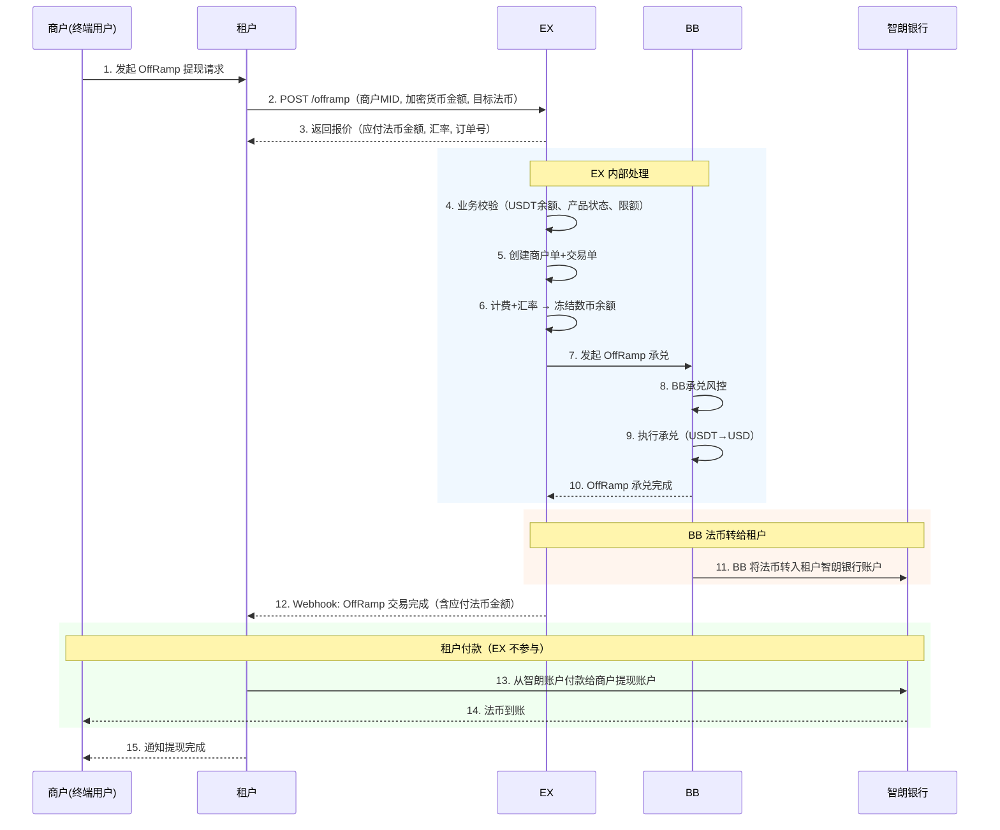

**说明：**

- **EX 范围**：步骤 2-12（接收请求、业务校验、计费汇率、BB承兑、Webhook通知）
- **租户范围**：步骤 13（收到 BB 法币后从智朗付款给商户）— EX 不参与
- **先校验再建单**：业务校验通过后才创建商户单和交易单
- **先计费后冻结**：计费+汇率确定后才冻结余额，确保冻结金额准确
- **手续费内扣**：冻结=输入 USDT，手续费从承兑金额中扣
- **1 个商户单，1 笔交易单，0 渠道单**

### 5.4 异常处理

> OffRamp 承兑阶段所有异常均为**解冻退回**，不产生退款单，不收费。

| 异常环节           | 触发条件                                | 处理方式                                 | 商户感知               |
| ------------------ | --------------------------------------- | ---------------------------------------- | ---------------------- |
| 业务校验失败       | 余额不足/产品未启用/超限额/货币对不支持 | 直接拒绝，不创建商户单                   | 下单失败，返回错误原因 |
| 冻结失败           | 并发冻结导致余额不足                    | 直接拒绝，不创建商户单                   | 下单失败               |
| BB 承兑风控拒绝    | BB 风控检测到异常                       | 解冻数币余额，T001=FAILED，商户单=FAILED | 订单失败，余额恢复     |
| 承兑执行失败       | BB 承兑引擎异常（重试 3 次耗尽）        | 解冻数币余额，T001=FAILED，商户单=FAILED | 订单失败，余额恢复     |
| BB 转账智朗失败    | BB 法币转入智朗银行失败                 | 法币留在 BB 承兑法币账户，人工介入处理   | 订单处理中，客服跟进   |

**异常总览流程图：**

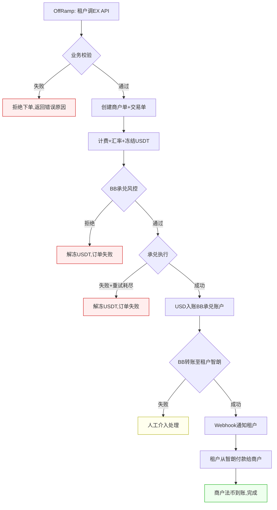

### 5.5 租户头寸策略

租户在 OffRamp 场景下有两种付款策略：

| 策略                       | 做法                                                     | 风险                   | 商户体验           |
| -------------------------- | -------------------------------------------------------- | ---------------------- | ------------------ |
| **保守策略（推荐）** | 等 EX OffRamp 完成，确认法币金额后再付款给商户           | 零风险                 | 商户等待时间较长   |
| **激进策略**         | 租户预先在智朗银行备足法币头寸，先垫付商户，再等 EX 结算 | 汇率波动风险、资金占用 | 商户体验好，到账快 |

> **建议**：初期采用保守策略，业务稳定后根据资金情况考虑激进策略。激进策略下，租户需自行管理汇率敞口和流动性风险。

---

## 6. Webhook 事件

| 事件             | 触发时机             | 说明                      |
| ---------------- | -------------------- | ------------------------- |
| KYC/KYB 审核结果 | 商户审核完成         | APPROVED / REJECTED / RFI |
| 产品审核结果     | 产品申请审核完成     | approved / rejected       |
| 收款人审核结果   | 商户提现账户审核完成 | APPROVED / REJECTED / RFI |
| OffRamp 交易结果 | OffRamp 处理完成     | 含最终汇率、应付法币金额  |
    participant IPL_Account as IPL账户服务

    WP->>HUB: 1. 申请卖出数币(USDT→IPL USD)

    rect rgb(255, 250, 240)
        Note over HUB,IPL_Account: 阶段1：业务校验
        HUB->>BL: 2. 请求业务校验
        BL->>BL: 3. 基础校验(BB USDT余额≥承兑金额+手续费、IPL账户状态、产品配置)
        BL->>BL: 4. 产品配置(限额、货币对)
        BL-->>HUB: 5. 校验通过
        Note over HUB: 校验失败→直接拒绝，不创建任何单据
    end

    rect rgb(240, 248, 255)
        Note over HUB,IPL_Account: 阶段2：创建商户单+交易单
        HUB->>HUB: 6. 创建商户单(BB和IPL共享)
        HUB->>TE: 7a. 创建交易单T001(BB承兑)
        HUB->>TE: 7b. 创建交易单T002(BB→IPL划转)
    end

    rect rgb(240, 255, 240)
        Note over HUB,IPL_Account: 阶段3：T001 计费+汇率+冻结
        par 并行
            TE->>Pricing: 8a. 计算承兑费用
            Pricing-->>TE: 9a. 返回费用
        and
            TE->>FX: 8b. 查询实时汇率(USDT/USD)
            FX-->>TE: 9b. 返回汇率
        end
        TE->>BB_Account: 10. 冻结商户BB USDT余额
        BB_Account-->>TE: 11. 冻结成功
    end

    rect rgb(230, 240, 255)
        Note over HUB,IPL_Account: 阶段4：T001 BB承兑(USDT→USD)
        TE->>BB_Risk: 12. BB承兑风控(承兑金额、商户风险等级)
        BB_Risk-->>TE: 13. 风控通过
        TE->>BB_Account: 14. 确认扣款(商户BB USDT钱包-)
        TE->>BB_Account: 15. 入账(商户BB承兑法币账户 USD+)
        TE->>TE: 16. T001状态=SUCCESS
    end

    rect rgb(255, 240, 245)
        Note over HUB,IPL_Account: 阶段5：T002 BB→IPL 跨SP划转
        TE->>Pricing: 17. 计算划转手续费
        Pricing-->>TE: 18. 返回费用
        TE->>BB_Risk: 19. BB出款风控(商户AML、交易频率、金额合规)
        BB_Risk-->>TE: 20. 风控通过
        TE->>IPL_Risk: 21. IPL入款风控(来源合规性、商户风险等级)
        IPL_Risk-->>TE: 22. 风控通过
        TE->>BB_Account: 23. 扣款(商户BB承兑法币账户 USD-)
        TE->>IPL_Account: 24. 入账(商户IPL收付款法币账户 USD+)
        TE->>TE: 25. T002状态=SUCCESS
    end

    rect rgb(240, 248, 255)
        Note over HUB,IPL_Account: 阶段6：聚合+通知
        TE->>HUB: 26. 通知2笔交易单完成
        HUB->>HUB: 27. 更新商户单(SUCCESS)
        HUB-->>WP: 28. 返回卖出数币结果
    end
```

**说明：**

- **1 个商户单，2 笔交易单**：BB 承兑 1 笔 + BB→IPL 跨 SP 划转 1 笔
- **T001（BB 承兑）**：BB USDT→USD，内部账户划转，走 BB 承兑风控
- **T002（BB→IPL 划转）**：BB 承兑法币账户→IPL 收付款法币账户。**独立交易单**，走 BB 出款风控 + IPL 入款风控，有划转手续费
- **T001→T002 串行**：承兑完成后才能划转
- **两次独立风控**：T001（BB 承兑）+ T002（BB 出款+IPL 入款）
- **两笔独立计费**：承兑手续费 + 划转手续费

**异常处理：**

> 场景 A2 关键异常：T001 承兑成功后 T002 划转失败，**资金已在 BB 承兑法币账户**。需决定是否逆向回滚 T001（反向承兑退回 USDT）。

| 异常环节                                 | 触发条件                        | 处理方式                                             | 退款                         | 商户感知                       |
| ---------------------------------------- | ------------------------------- | ---------------------------------------------------- | ---------------------------- | ------------------------------ |
| 业务校验失败                             | USDT 余额不足/产品未启用/超限额 | 直接拒绝，不创建任何单据                             | 无                           | 下单失败                       |
| 冻结 USDT 余额失败                       | 并发占用余额                    | 商户单=FAILED                                        | 无（未冻结）                 | 余额不足，请重试               |
| BB 承兑风控拒绝（T001 阶段）             | BB 承兑风控拦截                 | 解冻 USDT 余额，T001=FAILED                          | 无（解冻即恢复）             | 订单失败                       |
| T001 承兑执行失败                        | BB 承兑引擎异常                 | 解冻 USDT 余额，T001=FAILED                          | 无（解冻即恢复）             | 订单失败，请重试               |
| **BB 出款风控拒绝（T001 成功）**   | T002 划转的 BB 出款风控被拒绝   | T002=FAILED，资金留在 BB 承兑法币账户，商户单=FAILED | 无需退款（USD 留在 BB 账户） | 订单失败，USD 在 BB 账户可重试 |
| **IPL 入款风控拒绝（T001 成功）**  | T002 划转的 IPL 入款风控被拒绝  | 同上，T002=FAILED，资金留在 BB 承兑法币账户          | 无需退款                     | 订单失败，USD 在 BB 账户可重试 |
| **T002 划转执行失败（T001 成功）** | 账户服务异常                    | 回滚，T002=FAILED，资金留在 BB 承兑法币账户          | 无需退款                     | 订单失败，USD 在 BB 账户可重试 |

> **卖出数币 A2 vs 买入数币 A2 异常处理差异**：买入数币（OnRamp）A2 中 T001 划转成功后 T002 承兑失败需逆向回滚（因为资金从 IPL 跑到了 BB，需退回 IPL）。但卖出数币（OffRamp）A2 中 T001 承兑成功后 T002 划转失败，资金仍在商户自己的 BB 承兑法币账户，**无需逆向回滚**，商户可用该余额重新发起（走场景 A1 即时单或重试 A2）。

**异常总览流程图：**

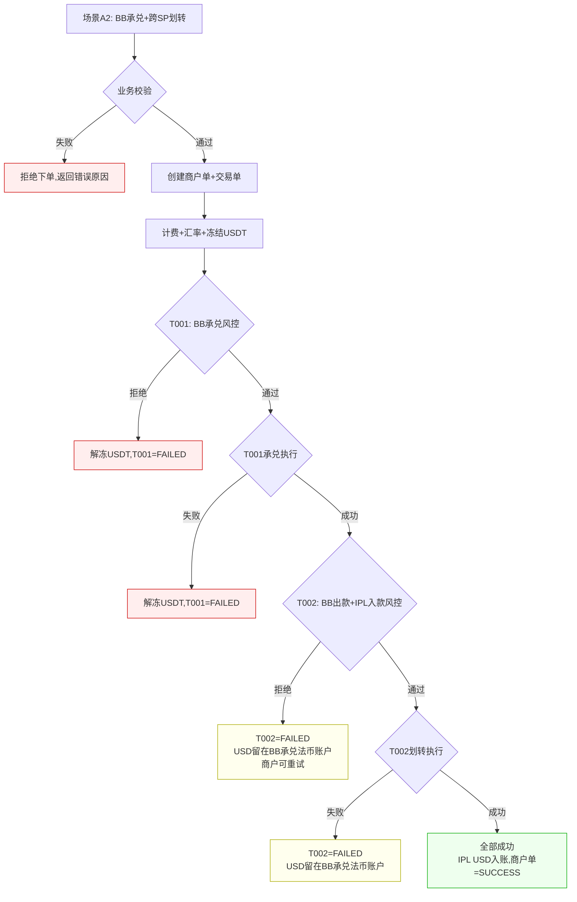

---

### 5.4 场景 B1：带付款 — BB 数币钱包→承兑→BB/XPAY 付款（仅 BB）

**场景：** 商户持有 BB USDT，卖出数币承兑为 USD 后，直接通过 BB 的法币通道（XPAY 等）付款给外部收款人。全程在 BB 内部完成。**与旧版完全一致。**

**特点：** 承兑 + 付款（调用外部渠道），2 笔交易单串行。

**单据结构（2 笔交易单）：**

```
商户单 M001 (OffRamp: USDT→USD→付款)  ← 仅 BB
    ├── 交易单 T001 (BB): 承兑 — BB USDT→USD
    └── 交易单 T002 (BB): 付款 — BB USD 付款给收款人（调用 XPAY 等外部渠道）
            └── 渠道单 C001 (BB PP): XPAY 等渠道执行记录

单据数：1 商户单 + 2 交易单 + 1 渠道单（仅 BB PP 可见）
资金流：商户 BB USDT 钱包 → 商户 BB 承兑法币账户（USD） → 外部收款人
```

**业务流程：**

```
商户下单(含收款人信息) → 业务校验(含收款人校验) → 校验通过 →
创建商户单+交易单 → 计费+汇率 → 冻结数币余额 →
风控(承兑+付款+收款人AML) → T001承兑(USDT→USD) → T002付款(调用渠道) →
交易完成 → 通知商户
```

**时序图：**

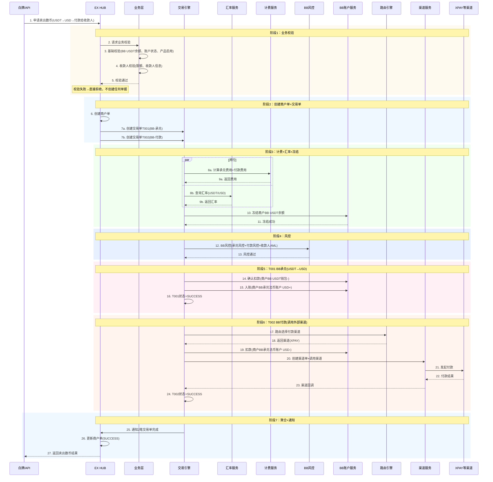

**说明：**

- **1 个商户单，2 笔交易单**：BB 承兑 1 笔 + BB 付款 1 笔，全程 BB 内部
- **T001（BB 承兑）**：BB USDT→USD，内部账户划转
- **T002（BB 付款）**：BB USD→外部收款人，调用 XPAY 等外部渠道，有渠道单
- **风控**：BB 统一风控（承兑风控+付款风控+收款人 AML）
- **计费**：承兑费用 + 付款费用分别计算
- **T001→T002 串行**：承兑完成后才能付款

**异常处理：**

> 场景 B1 的核心复杂度：T001 承兑已成功但 T002 付款失败时，需要根据**退款汇率规则**决定退回数币还是法币。详见第 8 章。

| 异常环节                                   | 触发条件                                  | 处理方式                                                | 退款                   | 商户感知 |
| ------------------------------------------ | ----------------------------------------- | ------------------------------------------------------- | ---------------------- | -------- |
| 业务校验失败                               | 余额不足/产品未启用/超限额/收款人信息无效 | 直接拒绝，不创建任何单据                                | 无                     | 下单失败 |
| 风控拒绝（未承兑）                         | BB 风控拒绝                               | 解冻 USDT 余额，T001=FAILED                             | 无（解冻即恢复）       | 订单失败 |
| T001 承兑执行失败                          | BB 承兑引擎异常                           | 解冻 USDT 余额，T001=FAILED                             | 无（解冻即恢复）       | 订单失败 |
| **T002 付款风控拦截（T001 已成功）** | T002 付款时风控拦截（未送渠道）           | 根据退款汇率规则退回（详见第 8 章，参考 refund.md 5.1） | ✅(RT)，不收承兑费     | 订单退款 |
| **T002 付款渠道退票（T001 已成功）** | 渠道退票（银行拒绝/退汇等）               | 清算确认→根据退款汇率规则退回（参考 refund.md 5.1）    | ✅(RT)，付款费清算确认 | 订单退款 |

**承兑后付款失败退款时序图（参考 refund.md 5.1）：**

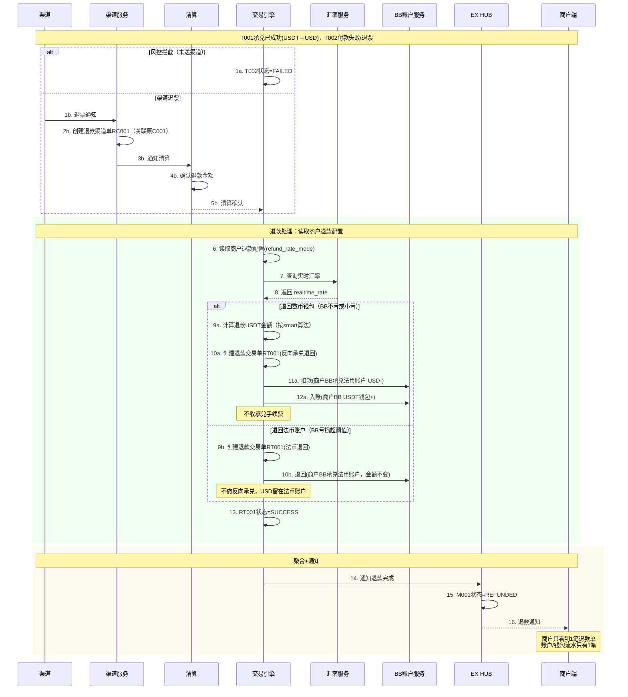

**异常总览流程图：**

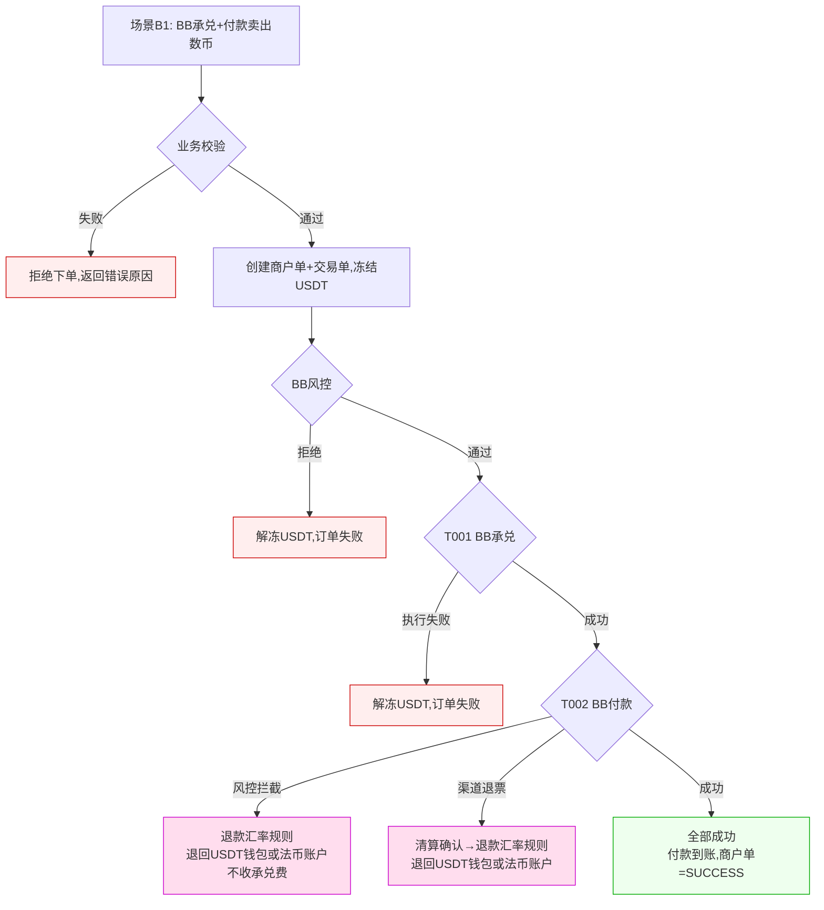

---

### 5.5 场景 B2：带付款 — BB 承兑→跨 SP 划转到 IPL→IPL 付款（BB+IPL）【Phase 2 — 本期不做】

> 🚧 **Phase 2 场景**：本场景涉及既跨货币又跨 SP 又付款，复杂度最高，放入下一期。本期仅做 A1 + B1（纯 BB 内部）。
>
> ⚠️ **核心变更**：旧版中 BB 承兑后通过中间户到 IPL 同名收款再付款。本版改为：BB 承兑→BB→IPL 跨 SP 划转（独立交易单，走完整风控/三单/计费）→IPL 付款。

**场景：** 商户持有 BB USDT，卖出数币承兑为 USD，通过跨 SP 划转到 IPL 收付款法币账户，再通过 IPL 法币通道付款给外部收款人。

**特点：** 承兑 + 跨 SP 划转（风控/计费）+ 付款（调用外部渠道），3 笔交易单串行。**这是最复杂的卖出数币场景。**

**单据结构（3 笔交易单）：**

```
商户单 M001 (OffRamp: BB USDT→BB USD→IPL USD→付款)  ← BB 和 IPL 共享
    ├── 交易单 T001 (BB): 承兑 — BB USDT→USD（内部账户划转）
    │       · 风控 ✅ · 计费 ✅（承兑手续费）
    ├── 交易单 T002 (BB→IPL): 跨SP划转 — BB 承兑法币账户→IPL 收付款法币账户
    │       · 业务校验 ✅ · 风控 ✅ · 计费 ✅（划转手续费）
    └── 交易单 T003 (IPL): 付款 — IPL USD 付款给收款人（调用外部渠道）
            └── 渠道单 C001 (IPL PP): IPL 法币通道执行记录

单据数：1 商户单 + 3 交易单 + 1 渠道单（仅 IPL PP 可见）
资金流：商户 BB USDT 钱包 → 商户 BB 承兑法币账户 → 商户 IPL 收付款法币账户 → 外部收款人

> ⚠️ 本场景为 Phase 2，本期不实现。保留文档以便下一期开发参考。
```

**业务流程：**

```
商户下单(含收款人信息) → 业务校验(含收款人校验) → 校验通过 →
创建商户单+交易单 → 计费+汇率 → 冻结数币余额 →
T001: BB承兑风控 → 承兑(USDT→USD) →
T002: 划转风控(BB出款+IPL入款) → 计费(划转手续费) → 执行划转(BB USD→IPL USD) →
T003: IPL付款风控(收款人AML) → 付款(调用渠道) →
商户单=SUCCESS → 通知商户
```

**时序图：**

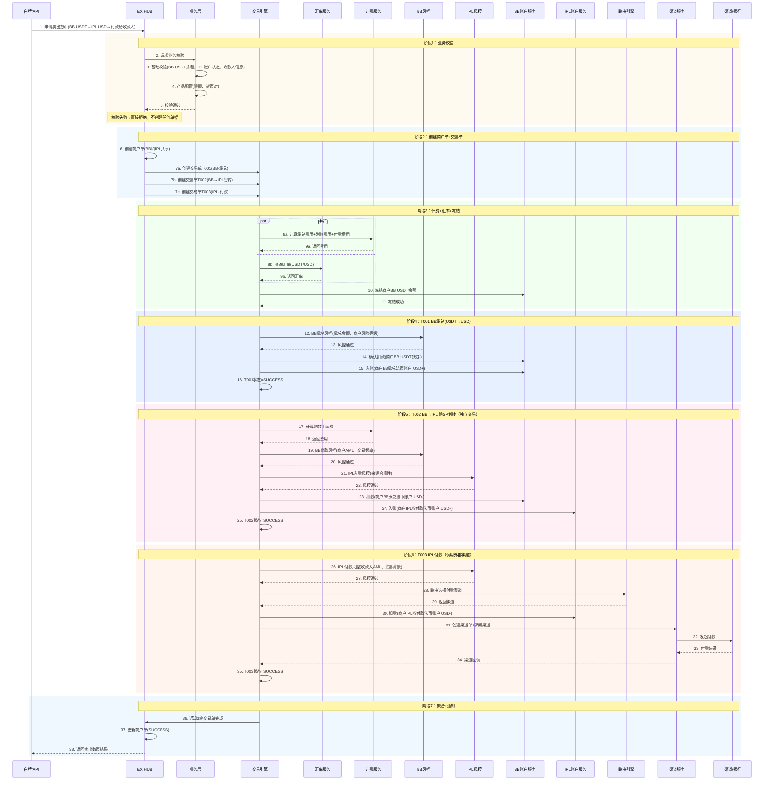

**说明：**

- **1 个商户单，3 笔交易单**：BB 承兑 1 笔 + BB→IPL 跨 SP 划转 1 笔 + IPL 付款 1 笔
- **T001（BB 承兑）**：BB USDT→USD，内部账户划转，走 BB 承兑风控
- **T002（BB→IPL 划转）**：BB 承兑法币账户→IPL 收付款法币账户。**独立交易单**，走 BB 出款风控 + IPL 入款风控，有划转手续费
- **T003（IPL 付款）**：IPL USD→外部收款人，调用外部渠道，有渠道单，走 IPL 付款风控（收款人 AML）
- **T001→T002→T003 串行**：承兑完才能划转，划转完才能付款
- **三次独立风控**：T001（BB 承兑）+ T002（BB 出款+IPL 入款）+ T003（IPL 付款+收款人 AML）
- **三笔独立计费**：承兑手续费 + 划转手续费 + 付款手续费

**异常处理：**

> 场景 B2 是最复杂的异常场景，涉及 3 笔交易单、跨 SP 划转、三层风控，以及承兑后付款失败的退款汇率规则。

| 异常环节                                         | 触发条件                                     | 处理方式                                                                          | 退款                             | 商户感知         |
| ------------------------------------------------ | -------------------------------------------- | --------------------------------------------------------------------------------- | -------------------------------- | ---------------- |
| 业务校验失败                                     | 余额不足/产品未启用/超限额/收款人无效        | 直接拒绝，不创建任何单据                                                          | 无                               | 下单失败         |
| BB 承兑风控拒绝（T001 阶段）                     | BB 承兑风控拦截                              | 解冻 USDT 余额，T001=FAILED                                                       | 无（解冻即恢复）                 | 订单失败         |
| T001 承兑执行失败                                | BB 承兑引擎异常                              | 解冻 USDT 余额，T001=FAILED                                                       | 无（解冻即恢复）                 | 订单失败         |
| BB 出款/IPL 入款风控拒绝（T001 成功，T002 阶段） | 划转风控拦截                                 | T002=FAILED，资金留在 BB 承兑法币账户，商户单=FAILED                              | 无需退款（USD 在 BB 账户）       | 订单失败，可重试 |
| T002 划转执行失败（T001 成功）                   | 账户服务异常                                 | 回滚，T002=FAILED，资金留在 BB 承兑法币账户                                       | 无需退款                         | 订单失败，可重试 |
| **IPL 付款风控拦截（T001+T002 成功）**     | T003 付款风控拦截（资金已在 IPL 收付款账户） | T003=FAILED，**逆向回滚 T002**：IPL 收付款→BB 承兑法币 → 退款汇率规则退回 | ✅ 逆向 RT + 退款 RT             | 订单退款         |
| **IPL 付款渠道退票（T001+T002 成功）**     | 渠道退票（银行拒绝/退汇等）                  | 清算确认→**逆向回滚 T002**→退款汇率规则退回                               | ✅ 逆向 RT + 退款 RT，付款费清算 | 订单退款         |

> **跨 SP 关键异常**：T002 已成功但 T003 失败时，资金在 IPL 收付款法币账户，需先逆向回滚 T002（IPL→BB），再根据退款汇率规则决定退回 USDT 钱包还是留在 BB 法币账户。

**异常时序图（T002 成功后 T003 失败，逆向回滚+退款汇率规则）：**

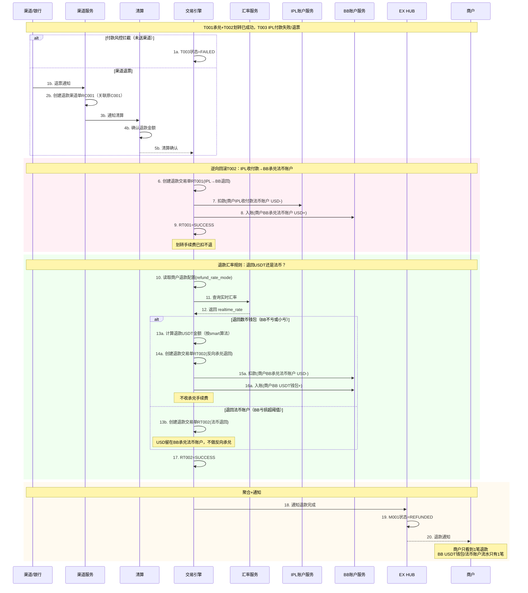

**异常总览流程图：**

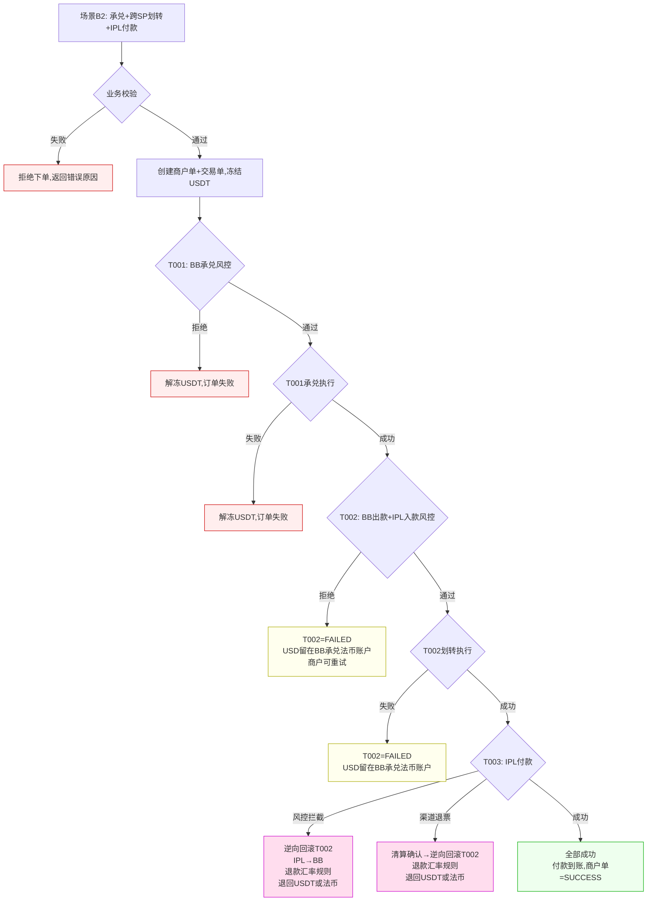

**场景 B2 异常结论：**

| 失败环节               | 资金位置           | 处理方式                                         | 是否需要退款单 |
| ---------------------- | ------------------ | ------------------------------------------------ | -------------- |
| 业务校验/冻结          | 未扣款             | 拒绝下单                                         | ❌             |
| BB 承兑风控/执行失败   | 已冻结 USDT        | 解冻 USDT                                        | ❌             |
| T002 划转风控/执行失败 | BB 承兑法币账户    | 资金留在 BB 账户，商户可重试                     | ❌             |
| T003 IPL 付款风控拦截  | IPL 收付款法币账户 | **逆向回滚 T002**（IPL→BB）→退款汇率规则 | ✅（RT×2）    |
| T003 IPL 付款渠道退票  | IPL 收付款法币账户 | 清算确认→**逆向回滚 T002**→退款汇率规则  | ✅（RT×2）    |

---

## 6. 场景对比总览

| 维度               | A1：BB 纯承兑      | A2：BB 承兑→IPL 划转 ⚠️ Phase 2 | B1：BB 承兑→BB 付款              | B2：BB 承兑→IPL 划转→IPL 付款 ⚠️ Phase 2 |
| ------------------ | ------------------ | ------------------------------- | --------------------------------- | ---------------------------------------- |
| **本期范围** | ✅ Phase 1          | ❌ **Phase 2（本期不做）**     | ✅ Phase 1                         | ❌ **Phase 2（本期不做）**             |
| **触发方式** | 即时单（商户主动） | 即时单（商户主动）              | 即时单（商户主动）                | 即时单（商户主动）                       |
| **数币来源** | BB USDT 钱包       | BB USDT 钱包                    | BB USDT 钱包                      | BB USDT 钱包                             |
| **法币目标** | BB 承兑法币账户    | IPL 收付款法币账户              | 外部收款人（BB 渠道）             | 外部收款人（IPL 渠道）                   |
| **交易单数** | 1（承兑）          | 2（承兑+划转）                  | 2（承兑+付款）                    | 3（承兑+划转+付款）                      |
| **渠道单**   | 0                  | 0                               | 1（BB PP）                        | 1（IPL PP）                              |
| **风控次数** | 1（BB 承兑）       | 2（BB 承兑, BB 出+IPL 入）      | 1（BB 承兑+付款+AML）             | 3（BB 承兑, BB 出+IPL 入, IPL 付款+AML） |
| **计费**     | 承兑费             | 承兑费+划转费                   | 承兑费+付款费                     | 承兑费+划转费+付款费                     |
| **跨 SP**    | ❌                 | ✅（BB→IPL）                   | ❌                                | ✅（BB→IPL）                            |
| **关键异常** | 承兑失败→解冻     | T001 成功+T002 失败→留 BB 余额 | T001 成功+T002 失败→退款汇率规则 | T002 成功+T003 失败→逆向回滚+退款汇率   |
| **收款人**   | ❌                 | ❌                              | ✅                                | ✅                                       |

---

## 7. 风控规则

### 7.1 分层风控

| 风控层级 | 触发场景               | 风控维度                         | 拦截后处理          |
| -------- | ---------------------- | -------------------------------- | ------------------- |
| 承兑风控 | BB 数币→法币承兑      | 承兑金额、商户风险等级、累计限额 | 解冻 USDT，拒绝承兑 |
| 出款风控 | BB 承兑法币账户出款（Phase 2） | 商户 AML、交易频率、金额合规     | 拒绝划转            |
| 入款风控 | IPL 收付款法币账户入款（Phase 2） | 来源合规性、商户风险等级         | 拒绝入账            |
| 付款风控 | BB/IPL 渠道付款        | 付款金额、收款人 AML、贸易背景   | 拒绝付款            |

### 7.2 风控规则清单

| 规则编号 | 规则名称          | 适用场景       | 校验内容                      | 拦截处理 |
| -------- | ----------------- | -------------- | ----------------------------- | -------- |
| R001     | 商户 KYC/KYB 状态 | 全场景         | 商户 KYC/KYB 审核通过         | 拒绝下单 |
| R002     | 产品状态          | 全场景         | 卖出数币（OffRamp）产品已启用 | 拒绝下单 |
| R003     | 单笔限额          | 全场景         | 单笔金额≤配置上限            | 拒绝下单 |
| R004     | 日累计限额        | 全场景         | 当日累计≤配置上限            | 拒绝下单 |
| R005     | 月累计限额        | 全场景         | 当月累计≤配置上限            | 拒绝下单 |
| R006     | 收款人 AML        | B1/~~B2~~      | 收款人不在制裁名单中          | 拒绝付款 |
| R007     | 收款人预审核      | B1/~~B2~~      | 收款人已通过风控审核          | 拒绝下单 |
| R008     | 交易频率          | ~~A2 划转~~ Phase 2 | 划转频率≤配置上限（防洗钱）  | 拒绝划转 |
| R009     | 承兑金额合规      | 全场景承兑     | 承兑金额在合规范围内          | 拒绝承兑 |
| R010     | 贸易背景          | ~~B2（IPL 付款）~~ Phase 2 | 有贸易背景支持（如有配置）    | 拒绝付款 |

---

## 8. 退款原则与退款汇率规则

> 详细退款流程参见 `refund.md`，此处列卖出数币（OffRamp）特有规则。

### 8.1 退款触发条件

| 触发条件                                        | 适用场景 | 退款类型                     | 退回目标                        |
| ----------------------------------------------- | -------- | ---------------------------- | ------------------------------- |
| 承兑风控拒绝 / 承兑执行失败                     | 全场景   | 解冻退回                     | 原 BB USDT 钱包（解冻）         |
| T002 划转风控拒绝 / 执行失败（A2）               | A2 ⚠️ Phase 2 | 无需退款                     | USD 留在 BB 承兑法币账户        |
| T003 付款风控拦截 / 渠道退票（B2，T002 已成功） | B2 ⚠️ Phase 2 | 逆向回滚 T002 + 退款汇率规则 | BB USDT 钱包 或 BB 承兑法币账户 |
| T002 付款风控拦截 / 渠道退票（B1）              | B1       | 退款汇率规则                 | BB USDT 钱包 或 BB 承兑法币账户 |

### 8.2 退款手续费规则

| 费用类型   | 成功时收取 | 承兑后划转/付款失败时  | 逆向回滚时         |
| ---------- | ---------- | ---------------------- | ------------------ |
| 承兑手续费 | ✅         | ❌（退回 USDT 时不收） | 不适用             |
| 划转手续费 | ✅         | ✅（已扣不退）         | 已扣不退           |
| 付款手续费 | ✅         | 渠道退票需清算确认     | 不适用             |
| 退回手续费 | 不适用     | ❌（内部退不收费）     | ❌（内部退不收费） |

### 8.3 退款汇率规则（承兑后付款失败）

> 适用于场景 B1（B2 Phase 2）。完整规则详见 `refund.md` 第 5 章。

**核心问题：** 承兑已完成（USDT→USD），付款失败，退回数币还是法币？用什么汇率？

**商户退款配置：**

| 配置项                    | 默认值        | 说明                                                                         |
| ------------------------- | ------------- | ---------------------------------------------------------------------------- |
| `refund_rate_mode`      | `smart`     | `smart`=智能判断 / `original`=始终按原汇率 / `realtime`=始终按实时汇率 |
| `refund_rate_threshold` | `1%`        | smart 模式下的容忍阈值                                                       |
| `refund_fee_policy`     | `no_refund` | 付款手续费：`no_refund`=不退 / `refund`=退回                             |

**Smart 模式算法（默认）：**

```
卖出数币退款（原交易 USDT→USD，付款失败退回）：
  original_rate = 原交易时 1 USDT = X USD
  realtime_rate = 退款时 1 USDT = Y USD

  如果 Y ≤ X（USDT贬值，BB不亏）：
    → 按实时汇率退回 refund_usd / Y 个USDT 到数币钱包 ✅
  如果 Y > X 且 (Y-X)/X ≤ 1%（BB小亏≤1%）：
    → 按原汇率退回 refund_usd / X 个USDT 到数币钱包 ✅
  如果 Y > X 且 (Y-X)/X > 1%（BB亏损超阈值）：
    → 退回 refund_usd 到法币账户（不做反向承兑）⚠️
```

**通用规则：**

- 退回数币钱包时，**不再收承兑手续费**
- **默认付款手续费不退**（特殊情况需走清算特殊流程）

### 8.4 卖出数币（OffRamp）退款汇总表

| #  | 场景 | 失败环节                            | 资金位置           | 退回目标                     | 退款单    | 收费       |
| -- | ---- | ----------------------------------- | ------------------ | ---------------------------- | --------- | ---------- |
| 1  | A1   | 业务校验失败                        | 未扣款             | 直接拒绝，不建单             | ❌        | 不收       |
| 2  | A1   | 冻结/风控/承兑失败                  | 已冻结             | 解冻退回 BB USDT 钱包        | ❌        | 不收       |
| 3  | A2 ⚠️ Phase 2 | 业务校验失败                        | 未扣款             | 直接拒绝，不建单             | ❌        | 不收       |
| 4  | A2 ⚠️ Phase 2 | 冻结/风控/承兑失败                  | 已冻结             | 解冻退回 BB USDT 钱包        | ❌        | 不收       |
| 5  | A2 ⚠️ Phase 2 | T002 划转风控/执行失败（T001 成功） | BB 承兑法币账户    | USD 留在 BB 账户，商户可重试 | ❌        | 承兑费已扣 |
| 6  | B1   | 业务校验失败                        | 未扣款             | 直接拒绝，不建单             | ❌        | 不收       |
| 7  | B1   | 冻结/风控/承兑失败                  | 已冻结             | 解冻退回 BB USDT 钱包        | ❌        | 不收       |
| 8  | B1   | 付款风控拦截/渠道退票               | 商户 BB 法币       | 退款汇率规则→USDT 或法币    | ✅(RT)    | 不收承兑费 |
| 9  | B2 ⚠️ Phase 2 | 业务校验失败                        | 未扣款             | 直接拒绝，不建单             | ❌        | 不收       |
| 10 | B2 ⚠️ Phase 2 | 冻结/风控/承兑失败                  | 已冻结             | 解冻退回 BB USDT 钱包        | ❌        | 不收       |
| 11 | B2 ⚠️ Phase 2 | T002 划转风控/执行失败（T001 成功） | BB 承兑法币账户    | USD 留在 BB 账户，商户可重试 | ❌        | 承兑费已扣 |
| 12 | B2 ⚠️ Phase 2 | T003 付款失败（T001+T002 成功）     | IPL 收付款法币账户 | 逆向回滚 T002→退款汇率规则  | ✅(RT×2) | 不收承兑费 |

**核心原则总结：**

1. **先校验再建单** → 业务校验通过后才创建商户单
2. **资金未离开商户钱包** → 解冻即可，不产生退款单
3. **资金在 BB 承兑法币账户**（A2/B2 划转失败，Phase 2） → 无需退款，商户可重试
4. **资金已到 IPL**（B2 付款失败，Phase 2） → 逆向回滚 T002（IPL→BB），再按退款汇率规则处理
5. **承兑后付款失败**（B1，B2 Phase 2） → 根据退款汇率规则决定退回 USDT 钱包还是法币账户
6. **商户端一致性** → 商户只看到 1 笔退款或失败

---

## 9. 收款人管理

> 收款人管理的详细规则见独立文档 `vaandpayees.md` 第 4.3 章。

**卖出数币收款人要点：**

- 仅**带付款场景**（B1； B2 Phase 2）需要收款人
- 商户需预先在 MP 端添加收款人，通过风控审核后方可使用
- 下单时从已审核的收款人列表中选择
- 收款人信息包括：收款人名称、银行账号、SWIFT Code、银行名称、银行地址等
- 收款人审核模式（SP 级配置）：预审核 / 付款时扫描

---

## 10. 状态机

### 10.1 商户单状态机

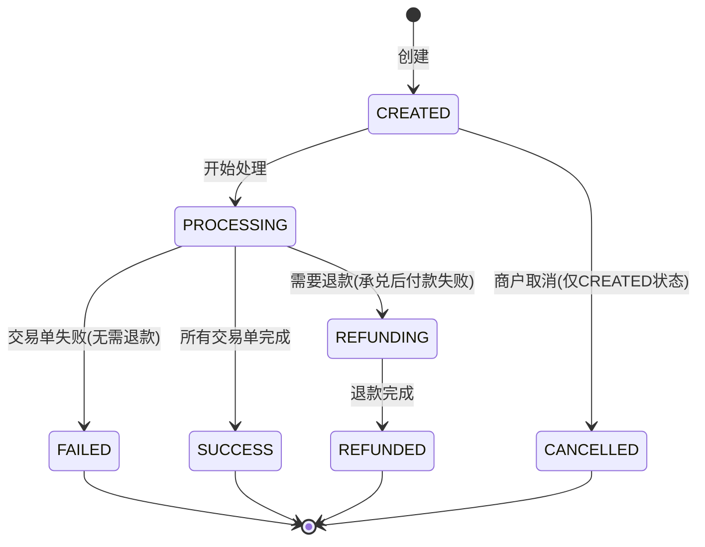

**与买入数币（OnRamp）状态机的差异：**

- 卖出数币 **无** `AWAITING_FUNDS` 和 `EXPIRED` 状态（无预约单模式）
- 卖出数币的 `REFUNDING`/`REFUNDED` 主要用于承兑后付款失败的退款场景（B1；B2 Phase 2）
- 卖出数币多了 `CANCELLED` 状态（仅 CREATED 状态，未开始执行时可取消）

### 10.2 交易单状态机

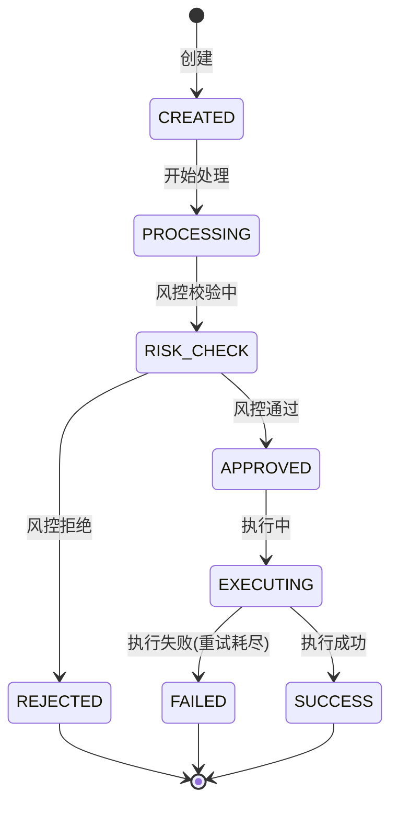

### 10.3 渠道单状态机（仅 B1；B2 Phase 2）

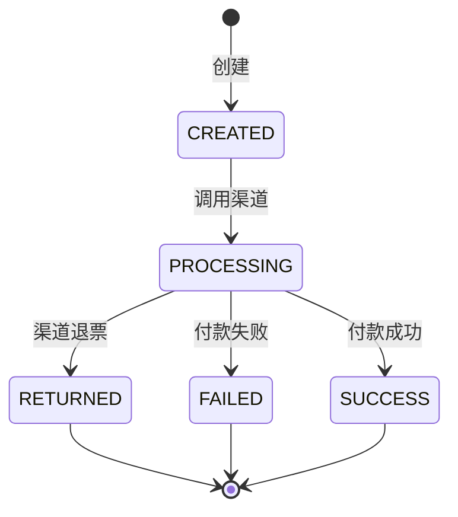

### 10.4 商户端统一视图（MP 展示逻辑）

> 卖出数币所有场景均为即时单，无预约单。

| 商户单状态 | 商户端展示状态 | 商户可执行操作     | 说明                                   |
| ---------- | -------------- | ------------------ | -------------------------------------- |
| CREATED    | Created        | 查看详情、取消     | 订单已创建，等待系统处理               |
| PROCESSING | Processing     | 查看详情           | 交易单链执行中                         |
| SUCCESS    | Completed      | 查看详情           | 承兑完成（纯承兑）/ 付款到账（带付款） |
| FAILED     | Failed         | 查看详情、重新下单 | 风控拒绝或执行异常                     |
| CANCELLED  | Cancelled      | 重新下单           | 商户主动取消（仅 CREATED 状态可取消）  |
| REFUNDING  | Refunding      | 查看详情           | 承兑成功但付款失败，退款处理中         |
| REFUNDED   | Refunded       | 查看详情、查看退款 | 退款完成，资金已退回                   |

---

## 11. 与旧版差异总结

| 维度                     | 旧版（offramp-complete.md）                       | 新版（offramp-v1.md）                                                 |
| ------------------------ | ------------------------------------------------- | --------------------------------------------------------------------- |
| **跨 SP 资金划转** | 中间户内部划转，无独立风控                        | Phase 2：改为独立交易单，走风控/三单/计费                             |
| **A2 场景**        | BB 承兑→中间户→IPL 同名收款（2 笔交易单）       | Phase 2：承兑后跨SP划转违反账户封闭原则，本期不做                     |
| **B2 场景**        | BB 承兑→中间户→IPL 收款→IPL 付款（3 笔交易单） | Phase 2：跨SP划转+IPL付款，本期不做                                   |
| **中间户**         | 存在（IPL 中间户在 BB / BB 中间户在 IPL）         | **取消**，Phase 2 改为显式跨 SP 划转交易单                      |
| **划转风控**       | 无独立风控                                        | Phase 2：BB 出款风控 + IPL 入款风控                                   |
| **划转计费**       | 无独立计费                                        | Phase 2：有划转手续费                                                 |
| **A2 异常处理**    | T001 成功+T002 失败→逆向回滚中间户               | Phase 2（同 A2 场景）                                                 |
| **B2 异常处理**    | 逆向回滚中间户×3                                 | Phase 2：逆向回滚 T002（IPL→BB）+ 退款汇率规则                       |
| **承兑引擎**       | BB 为主，IPL 可参与                               | **仅 BB**，IPL 仅做收付款                                       |
| **商户感知**       | IPL 和 BB 边界模糊                                | IPL=收付款账户，BB=承兑交易账户，边界清晰                             |

---

## 12. 术语表

| 中文             | 英文                           | 粤语（广东话） |
| ---------------- | ------------------------------ | -------------- |
| 卖出数币         | OffRamp / Sell Crypto          | 賣出數幣       |
| 法币             | Fiat Currency                  | 法币           |
| 数币             | Cryptocurrency / Digital Asset | 数字货币       |
| 承兑交易账户     | Exchange Trading Account       | 承兑交易户口   |
| 收付款账户       | Payment Account                | 收付款户口     |
| 商户单           | Merchant Order                 | 商户单         |
| 交易单           | Transaction                    | 交易单         |
| 渠道单           | Channel Order                  | 渠道单         |
| 三单模型         | Three-Order Model              | 三单模型       |
| 跨 SP 划转       | Cross-SP Transfer              | 跨 SP 划转     |
| 逆向回滚         | Reverse Rollback               | 逆向回滚       |
| 退款汇率规则     | Refund Rate Rule               | 退款汇率规则   |
| 收款人           | Beneficiary / Payee            | 收款人         |
| 风控             | Risk Control                   | 风控           |
| 计费             | Billing / Pricing              | 计费           |
| 汇率             | Exchange Rate                  | 汇率           |
| 白牌             | White Label                    | 白牌           |
| 服务提供商（SP） | Service Provider               | 服务提供商     |

---

## 13. 附录

### 13.1 相关文档

| 文档                        | 说明                                               |
| --------------------------- | -------------------------------------------------- |
| `offramp-complete.md`     | 卖出数币旧版完整文档（本文档基于此重写）           |
| `onramp-v1.md`            | 买入数币（OnRamp）1.0 文档（对应本文档的反向流程） |
| `productionopening-v2.md` | 产品开通 v2（单 SP 策略下的开通流程）              |
| `refund.md`               | 退款流程文档（详细退款规则和退款汇率规则）         |
| `vaandpayees.md`          | VA 与收款人管理（收款人审核、AML 等）              |
| `sa-product-listing.md`   | 产品目录（账户类/收付类/业务类三层结构）           |

### 13.2 买入数币（OnRamp）vs 卖出数币（OffRamp）对称关系

```
买入数币 OnRamp 1.0（法币→数币）          卖出数币 OffRamp 1.0（数币→法币）
┌──────────────────────────┐              ┌──────────────────────────┐
│ A1: BB法币→数币            │  ◄─对称─►  │ A1: BB数币→法币            │
│ 纯承兑，1笔交易单          │              │ 纯承兑，1笔交易单          │
└──────────────────────────┘              └──────────────────────────┘
┌─────────────────────────────────┐   ┌─────────────────────────────────┐
│ A2: IPL法币→BB→数币           │   │ A2: 数币→BB法币→IPL法币       │
│ 跨SP划转+承兑 ⚠️ Phase 2      │   │ 承兑+跨SP划转 ⚠️ Phase 2      │
└─────────────────────────────────┘   └─────────────────────────────────┘
┌──────────────────────────┐              ┌──────────────────────────┐
│ B1: BB VA收款→承兑          │  ◄─对称─►  │ B1: 承兑→BB付款            │
│ 预约单，2笔交易单           │              │ 即时单，2笔交易单          │
└──────────────────────────┘              └──────────────────────────┘
┌──────────────────────────┐              ┌─────────────────────────────────┐
│ B2: IPL VA收款→BB→承兑     │  ◄─对称─►  │ B2: 承兑→BB→IPL→付款           │
│ 预约单，3笔交易单（含划转） │              │ 即时单，3笔交易单 ⚠️ Phase 2    │
└──────────────────────────┘              └─────────────────────────────────┘

核心差异：
- 买入数币有预约单模式（B1/B2），卖出数币全部即时单
- 买入数币不涉及收款人，卖出数币带付款场景需要收款人
- 卖出数币退款更复杂（退款汇率规则：退USDT还是法币？）
- 跨SP划转方向相反：买入数币 = IPL→BB，卖出数币 = BB→IPL
```

### 13.3 版本记录

| 版本 | 日期       | 变更内容                                                     |
| ---- | ---------- | ------------------------------------------------------------ |
| 1.0  | 2025-07-15 | 基于 offramp-complete.md 重写：单 SP 承兑 + BB→IPL 风控三单 |
| 1.1  | 2026-02-27 | A2/B2 均推迟到 Phase 2；本期范围 = A1 + B1（纯BB内部）；承兑后法币留在承兑交易账户，不跨SP |

---

*最后更新：2026-02-27*
*文档版本：v1.1 — 卖出数币（OffRamp）1.0 产品方案，单 SP 承兑策略，Phase 1 = A1+B1（A2/B2 推迟到 Phase 2），含异常处理和退款汇率规则*
