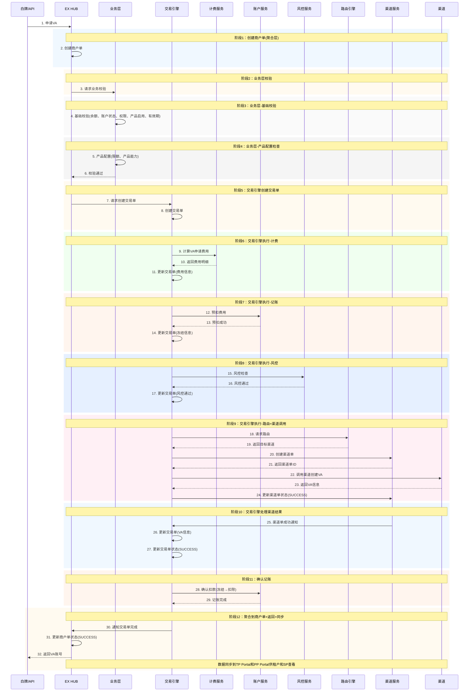
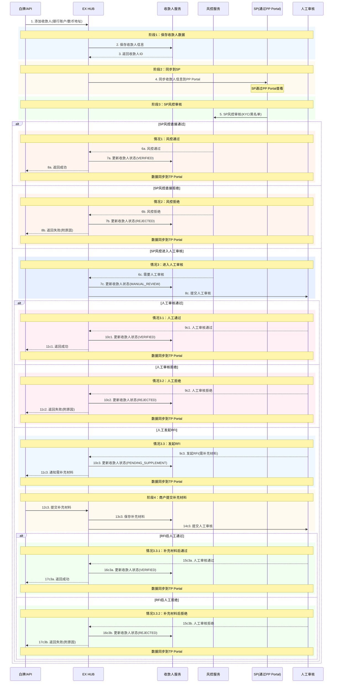
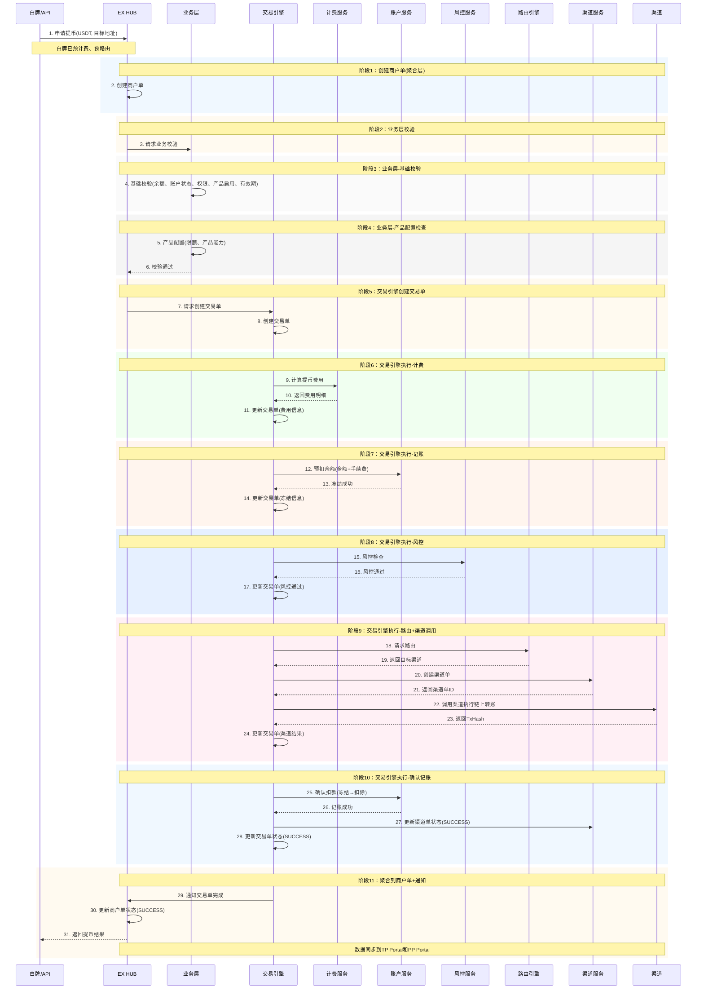
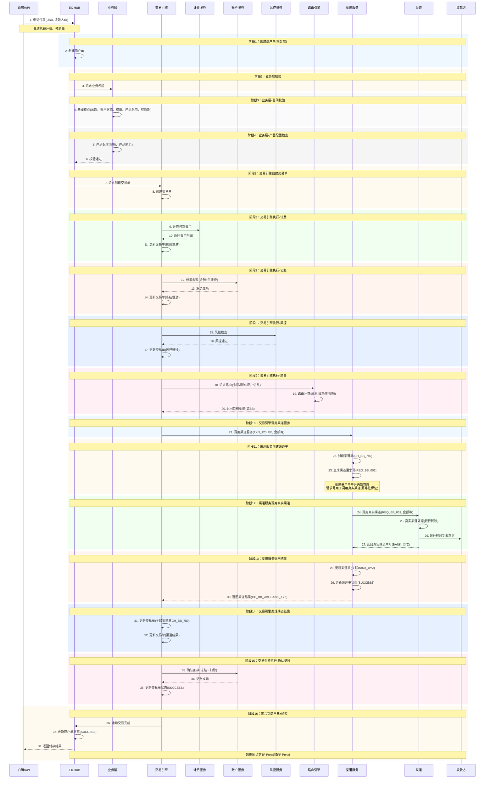
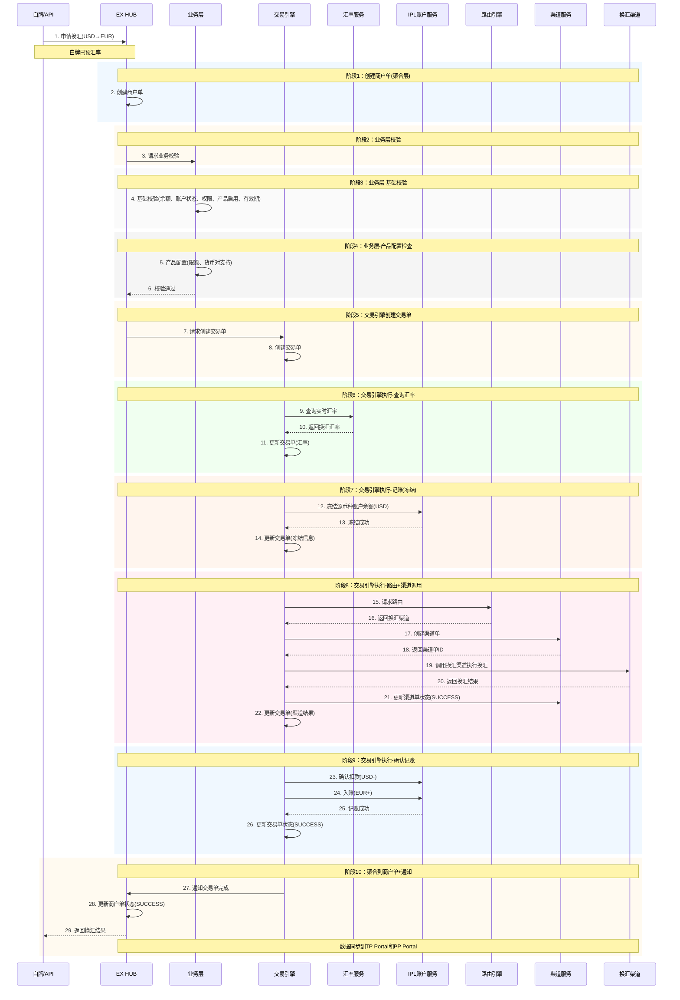

```mermaid
sequenceDiagram
    participant Payer as 付款方
    participant Channel as 渠道
    participant CO as 渠道服务
    participant BL as 业务层
    participant TE as 交易引擎
    participant Pricing as 计费服务
    participant Risk as 风控服务
    participant HUB as EX HUB
    participant Account as 账户服务
    participant WP as 白牌/API
    participant Compliance as 合规团队
  
    Payer->>Channel: 1. 汇款到VA账户
    Channel->>CO: 2. 入账通知
  
    rect rgb(240, 248, 255)
        Note over Channel,WP: 阶段1：创建渠道单
        CO->>CO: 3. 创建渠道单(记录入账信息)
        CO->>CO: 4. 更新渠道单状态(SUCCESS)
    end
  
    rect rgb(255, 250, 240)
        Note over Channel,WP: 阶段2：业务层校验
        CO->>BL: 5. 请求业务校验
    end
  
    rect rgb(250, 250, 250)
        Note over Channel,WP: 阶段3：业务层-基础校验
        BL->>BL: 6. 基础校验(账户状态、权限、产品启用、有效期)
    end
  
    rect rgb(245, 245, 245)
        Note over Channel,WP: 阶段4：业务层-产品配置检查
        BL->>BL: 7. 产品配置(限额、币种支持)
        BL-->>CO: 8. 校验通过
    end
  
    rect rgb(255, 250, 240)
        Note over Channel,WP: 阶段5：创建交易单
        CO->>TE: 9. 请求创建交易单
        TE->>TE: 10. 创建交易单
    end
  
    rect rgb(255, 245, 238)
        Note over Channel,WP: 阶段6：创建商户单(统一PROCESSING)
        TE->>HUB: 11. 创建商户单
        HUB->>HUB: 12. 商户单状态=PROCESSING
        HUB-->>WP: 13. 收款通知(处理中)
        Note over Channel,WP: 商户此时可在订单列表看到该笔入账(PROCESSING)
    end
  
    rect rgb(240, 255, 240)
        Note over Channel,WP: 阶段7：交易引擎执行-计费∥风控(并行)
        par 并行执行
            TE->>Pricing: 14a. 计算收款手续费
            Pricing-->>TE: 15a. 返回费用明细
        and
            TE->>Risk: 14b. 风控检查(AML/KYC)
            Risk-->>TE: 15b. 返回风控结果
        end
        TE->>TE: 16. 更新交易单(费用+风控结果)
    end
  
    alt 风控通过
        rect rgb(230, 240, 255)
            Note over Channel,WP: 阶段8a：记账(入账)
            TE->>Account: 17a. 商户记账(余额+，扣手续费)
            Account-->>TE: 18a. 记账成功
            TE->>TE: 19a. 更新交易单状态(SUCCESS)
        end
  
        rect rgb(255, 240, 245)
            Note over Channel,WP: 阶段9a：更新商户单+通知
            TE->>HUB: 20a. 通知交易单完成
            HUB->>HUB: 21a. 更新商户单状态(SUCCESS)
            HUB-->>WP: 22a. 收款成功通知(Webhook)
            Note over Channel,WP: 数据同步到TP Portal和PP Portal
        end
  
    else 风控需要补充材料(RFI)
        rect rgb(230, 240, 255)
            Note over Channel,WP: 阶段8b：记账(入账但冻结)
            TE->>Account: 17b. 商户记账(余额+，冻结状态)
            Account-->>TE: 18b. 记账成功(冻结)
            TE->>TE: 19b. 更新交易单状态(PROCESSING)
        end
  
        rect rgb(255, 240, 245)
            Note over Channel,WP: 阶段9b：更新商户单-需补充材料
            TE->>HUB: 20b. 通知交易单状态
            HUB->>HUB: 21b. 更新商户单(合规子状态=ACTION_REQUIRED)
            HUB-->>WP: 22b. 通知商户需补充材料(Webhook+站内通知+邮件)
            Note over Channel,WP: 商户在订单详情页看到"需补充材料"提示
        end
  
        rect rgb(255, 250, 240)
            Note over Channel,WP: 阶段10b：商户提交补充材料
            WP->>HUB: 23b. 在订单详情页提交补充材料
            HUB->>HUB: 24b. 保存材料，更新合规子状态=UNDER_REVIEW
            HUB->>Compliance: 25b. 提交合规团队审核
        end
  
        alt 补充材料审核通过
            Compliance->>HUB: 26b1. 审核通过
            HUB->>TE: 27b1. 通知风控通过
            TE->>Account: 28b1. 解冻余额
            TE->>TE: 29b1. 更新交易单状态(SUCCESS)
            HUB->>HUB: 30b1. 更新商户单状态(SUCCESS)
            HUB-->>WP: 31b1. 收款成功通知
        else 补充材料审核拒绝
            Compliance->>HUB: 26b2. 审核拒绝
            HUB->>TE: 27b2. 通知风控拒绝
            TE->>Account: 28b2. 冻结余额转退款
            TE->>TE: 29b2. 更新交易单状态(REJECTED)
            HUB->>HUB: 30b2. 更新商户单状态(REJECTED→REFUNDING)
            TE->>CO: 31b2. 发起原路退款
            CO->>Channel: 32b2. 渠道退款
            Channel-->>CO: 33b2. 退款成功
            HUB->>HUB: 34b2. 更新商户单状态(REFUNDED)
            HUB-->>WP: 35b2. 退款通知
        end
  
    else 风控拒绝
        rect rgb(230, 240, 255)
            Note over Channel,WP: 阶段8c：记账(入账但冻结，不通知商户拒绝原因)
            TE->>Account: 17c. 商户记账(余额+，冻结状态)
            Account-->>TE: 18c. 记账成功(冻结)
            TE->>TE: 19c. 更新交易单状态(RISK_REJECTED)
            Note over Channel,WP: 商户单保持PROCESSING，不暴露风控拒绝
        end
  
        rect rgb(255, 240, 245)
            Note over Channel,WP: 阶段9c：进入人工复核队列
            TE->>Compliance: 20c. 提交人工复核(风控自动拒绝)
        end
  
        alt 人工复核确认拒绝→退款
            Compliance->>HUB: 21c1. 确认拒绝
            HUB->>HUB: 22c1. 更新商户单状态(REJECTED→REFUNDING)
            TE->>Account: 23c1. 冻结余额转退款
            TE->>CO: 24c1. 发起原路退款
            CO->>Channel: 25c1. 渠道退款
            Channel-->>CO: 26c1. 退款成功
            HUB->>HUB: 27c1. 更新商户单状态(REFUNDED)
            HUB-->>WP: 28c1. 退款通知
        else 人工复核改判通过
            Compliance->>HUB: 21c2. 改判通过
            HUB->>TE: 22c2. 通知风控通过
            TE->>Account: 23c2. 解冻余额
            TE->>TE: 24c2. 更新交易单状态(SUCCESS)
            HUB->>HUB: 25c2. 更新商户单状态(SUCCESS)
            HUB-->>WP: 26c2. 收款成功通知
        else 人工发起RFI(要求商户补充材料)
            Compliance->>HUB: 21c3. 发起RFI
            HUB->>HUB: 22c3. 更新商户单(合规子状态=ACTION_REQUIRED)
            HUB-->>WP: 23c3. 通知商户需补充材料
            Note over Channel,WP: 后续同RFI流程(阶段10b起)
        end
    end
```

# 交易流程设计 v2

## 文档概述

本文档详细描述了EX平台的完整交易流程，基于**3单模型**（商户单→交易单→渠道单）设计。

**核心设计理念：**

- ✅ **3单模型**：商户单 → 交易单 → 渠道单，清晰的单据层级
- ✅ **业务侧定义**：每种交易类型定义需要调用的步骤，交易引擎按定义编排执行
- ✅ **双向流程**：支持商户主动发起和渠道被动通知两种模式
- ✅ **全链路风控**：收付款,va,收款人均需通过风控检查
- ✅ **白牌预处理**：白牌页面支持预计费、预路由

---

## 目录

1. [3单模型设计](#3单模型设计)
2. [交易类型分类](#交易类型分类)
3. [业务侧定义与交易引擎](#业务侧定义与交易引擎)
4. [各交易类型详细流程](#各交易类型详细流程)
5. On-Ramp / Off-Ramp 承兑流程 → 见独立文档 [on-offramp.md](./on-offramp.md)
   - 模式A：BB自己完成（1.1~1.4）
   - 模式B：IPL-BB打通（2.1~2.4）
6. 退款流程 → 见独立文档 [refund.md](./refund.md)
7. [状态设计](#状态设计)

---

## 3单模型设计

### 1.1 单据层级

```
EX 构建所有单据：
┌─────────────────────────────────────────────────────────────────┐
│  商户单 (Merchant Order)                                        │
│  - 商户可见                                                      │
│  - EX创建，聚合交易单信息                                         │
│  - 1个商户单可能对应多个SP（如IPL-BB打通承兑，2个sp 都可以看到）                      │
│      │                                                          │
│      │ 1:N                                                      │
│      ▼                                                          │
│  交易单 (Transaction Order)                                      │
│  - 一定在同一个SP内                                               │
│  - 计费、预扣余额在交易单上                                        │
│  - 业务侧定义的步骤在交易单上执行                                   │
│      │                                                          │
│      │ 1:N (仅IPL/BB有渠道单)                                    │
│      ▼                                                          │
│  渠道单 (Channel Order)                                          │
│  - 仅IPL和BB有（EX帮他们对接下游渠道）                             │
│  - 其他SP自己对接渠道，无渠道单                                    │
└─────────────────────────────────────────────────────────────────┘
```

### 1.2 SP分类与单据可见性

| SP类型 | 商户单 | 交易单 | 渠道单 | 说明                      |
| ------ | ------ | ------ | ------ | ------------------------- |
| BB     | EX构建 | EX构建 | EX构建 | EX帮BB对接XPAY等下游渠道  |
| IPL    | EX构建 | EX构建 | EX构建 | EX帮IPL对接银行等下游渠道 |
| 其他SP | EX构建 | EX构建 | ❌ 无  | SP自己对接渠道            |

### 1.3 单据关系示意

**单SP场景（如提币）：**

```
商户单 M001
    └── 交易单 T001 (BB)
            └── 渠道单 C001 (BB→链上)
```

**双SP场景（如IPL-BB打通承兑）：**

```
商户单 M001 ← BB和IPL同时看到
    ├── 交易单 T001 (BB): 数币侧
    │       └── 渠道单 C001 (BB)
    └── 交易单 T002 (IPL): 法币侧
            └── 渠道单 C002 (IPL)

✅ 同时创建，并行处理
✅ 都成功 → 商户单成功
✅ BB和IPL之间有清算协议
```

---

## 交易类型分类

### 2.1 按单据流转方向分类

#### **类型A：商户主动发起（商户单 → 交易单 → 渠道单）**

| 交易类型     | 触发方式 | 单据流转                                                   |
| ------------ | -------- | ---------------------------------------------------------- |
| VA申请       | 商户申请 | 商户单 → 交易单 → 计费 → 记账 → 风控 → 路由 → 渠道单 |
| 付款/提现    | 商户发起 | 商户单 → 交易单 → 计费 → 记账 → 风控 → 路由 → 渠道单 |
| 数币钱包付款 | 商户发起 | 商户单 → 交易主单 → 子单1(承兑) + 子单2(出款) → 渠道单  |
| 提币         | 商户发起 | 商户单 → 交易单 → 计费 → 记账 → 风控 → 路由 → 渠道单 |
| 数转法       | 商户发起 | 商户单 → 交易单 → 计费 → 记账 → 风控 → 路由 → 渠道单 |
| 法转数       | 商户发起 | 商户单 → 交易单 → 计费 → 记账 → 风控 → 路由 → 渠道单 |

#### **类型B：渠道被动通知（渠道单 → 交易单 → 商户单 → 计费∥风控）**

| 交易类型 | 触发方式     | 单据流转                                           |
| -------- | ------------ | -------------------------------------------------- |
| 收款     | 渠道入账通知 | 渠道单 → 交易单 → 商户单(PROCESSING) → 计费∥风控 → 记账/冻结/退款 |
| 充币     | 链上入账通知 | 渠道单 → 交易单 → 商户单(PROCESSING) → 计费∥风控 → 记账/冻结/退款 |

> **v2.1 变化：** 商户单在风控之前创建，所有入账统一 PROCESSING。风控拒绝经人工复核后退款，不直接暴露给商户。

## 业务侧定义与交易引擎

### 3.1 业务侧定义

每种交易类型在业务侧定义需要调用的步骤，交易引擎按定义编排执行。

**类型A示例：提现（商户主动发起）**

```json
{
  "transaction_type": "WITHDRAWAL",
  "steps": [
    {"step": "CREATE_MERCHANT_ORDER", "required": true},
    {"step": "CREATE_TRANSACTION_ORDER", "required": true},
    {"step": "PRICING", "required": true},
    {"step": "ACCOUNTING_FREEZE", "required": true},
    {"step": "RISK_CHECK", "required": true},
    {"step": "ROUTING", "required": true},
    {"step": "CREATE_CHANNEL_ORDER", "required": true, "condition": "SP_TYPE in (BB, IPL)"},
    {"step": "CALL_CHANNEL", "required": true},
    {"step": "ACCOUNTING_CONFIRM", "required": true},
    {"step": "NOTIFY", "required": true}
  ]
}
```

**类型B示例：VA收款/充币（渠道被动通知，v2.1）**

```json
{
  "transaction_type": "VA_COLLECTION",
  "note": "商户单在风控之前创建，所有入账统一PROCESSING",
  "steps": [
    {"step": "CREATE_CHANNEL_ORDER", "required": true},
    {"step": "BUSINESS_VALIDATION", "required": true},
    {"step": "CREATE_TRANSACTION_ORDER", "required": true},
    {"step": "CREATE_MERCHANT_ORDER", "required": true, "note": "此时商户单=PROCESSING，商户可见"},
    {"step": "PRICING", "required": true, "parallel": true},
    {"step": "RISK_CHECK", "required": true, "parallel": true,
      "on_pass": "ACCOUNTING_CREDIT",
      "on_rfi": "ACCOUNTING_FREEZE → NOTIFY_RFI → AWAIT_SUPPLEMENT → COMPLIANCE_REVIEW",
      "on_reject": "ACCOUNTING_FREEZE → COMPLIANCE_MANUAL_REVIEW"
    },
    {"step": "ACCOUNTING_CREDIT", "required": true, "note": "风控通过时正常入账"},
    {"step": "UPDATE_MERCHANT_ORDER", "required": true},
    {"step": "NOTIFY", "required": true}
  ]
}
```

> **类型B关键变化：** `CREATE_MERCHANT_ORDER` 在 `RISK_CHECK` 之前执行；风控结果分三路处理（通过/RFI/拒绝），拒绝必须经人工复核。

### 3.2 交易引擎职责

交易引擎是**编排工具**，不决定走什么步骤，只负责按业务侧定义执行：

```
业务侧定义步骤 → 交易引擎读取 → 按顺序调用各服务 → 返回业务反馈
```

### 3.3 白牌预处理

白牌页面在商户确认前会进行预处理：

- **预计费**：展示预估费用
- **预路由**：展示可用SP和预估到账时间

---

## 各交易类型详细流程

### 4.1 VA申请（商户主动发起）

**单据流转：** 商户单 → 交易单 → 渠道单



**说明：**

- **商户单**：聚合层，汇总交易单结果
- **交易单**：核心执行层，交易引擎驱动执行计费、记账、风控、路由等所有业务逻辑
  - 先记账冻结费用，失败后返回
- **渠道单**：渠道调用层
- 商户通过白牌或API接入EX系统
- 数据通过Portal展示：MP(商户)、TP(租户)、PP(SP)

---

### 4.2 VA收款（渠道被动通知）

**单据流转：** 渠道单 → 交易单 → 商户单(PROCESSING) → 计费∥风控 → 记账/冻结/退款

> **核心变化（v2.1）：** 商户单在风控之前创建，所有入账统一显示 PROCESSING，商户无法从状态判断是否命中风控。
> 风控拒绝不直接暴露给商户，经人工复核后退款。



**说明：**

- **商户单在风控之前创建**：钱到就创建商户单(PROCESSING)，商户始终能在订单列表追踪所有入账资金
- **计费和风控并行执行**：提升性能，两者都只依赖交易单
- **所有入账统一 PROCESSING**：商户无法从状态区分「正常处理」和「命中风控」，防止试探风控规则
- **RFI提交入口**：商户在**订单详情页**内直接提交补充材料（上下文关联），同时通过站内通知+邮件+Webhook 多渠道触达

**三种风控结果处理：**

| 风控结果 | 商户单状态流转 | 资金处理 | 商户可见性 |
|---------|--------------|---------|-----------|
| ✅ 通过 | PROCESSING → SUCCESS | 正常入账 | 看到入账成功 |
| ⏳ RFI（补充材料） | PROCESSING → ACTION_REQUIRED → SUCCESS 或 REJECTED→REFUNDING→REFUNDED | 冻结入账，等审核结果 | 看到「需补充材料」，在订单详情页提交 |
| ❌ 拒绝 | PROCESSING →（人工复核）→ REJECTED→REFUNDING→REFUNDED 或 SUCCESS | 冻结入账，人工复核后退款或放行 | 只看到 PROCESSING，直到人工复核有结果 |

- **风控拒绝不直接暴露**：自动拒绝后进入人工复核队列，人工可确认拒绝(退款)、改判通过、或发起RFI
- **退款流程**：REJECTED → REFUNDING → REFUNDED，原路退回
- 数据展示在PP Portal（服务商）、TP Portal（租户）、MP Portal（商户）

---

### 4.3 收款人添加（商户主动发起）

**单据流转：** 收款人数据 → EX风控 → SP风控 → 人工审核（可选）→ RFI流程（可选）



**说明：**

- **阶段1：保存收款人数据** → EX HUB保存
- **阶段2：同步到SP** → 通过PP Portal展示给SP
- **阶段3：SP风控审核** → SP通过PP Portal进行风控审核

**审核结果：**

1. **风控直接通过** → 收款人状态：VERIFIED
2. **风控直接拒绝** → 收款人状态：REJECTED
3. **进入人工审核** → 收款人状态：MANUAL_REVIEW
   - 3.1 **人工通过** → 收款人状态：VERIFIED
   - 3.2 **人工拒绝** → 收款人状态：REJECTED
   - 3.3 **发起RFI** → 收款人状态：PENDING_SUPPLEMENT
     - 商户提交补充材料
     - 人工再次审核
     - 3.3.1 **补充材料后通过** → 收款人状态：VERIFIED
     - 3.3.2 **补充材料后拒绝** → 收款人状态：REJECTED

- 所有状态变更同步到TP Portal供租户查看
- SP通过PP Portal查看和审核收款人信息

---

### 4.4 充币（渠道被动通知）

**单据流转：** 渠道单 → 交易单 → 商户单(PROCESSING) → 计费∥风控 → 记账/冻结/退款

> **核心变化（v2.1）：** 与 4.2 VA收款一致，商户单在风控之前创建，所有入账统一 PROCESSING。
> 风控拒绝不直接暴露给商户，经人工复核后退款。



```mermaid
sequenceDiagram
    participant Sender as 发送方
    participant Channel as 渠道
    participant CO as 渠道服务
    participant BL as 业务层
    participant TE as 交易引擎
    participant Pricing as 计费服务
    participant Risk as 风控服务
    participant HUB as EX HUB
    participant Account as 账户服务
    participant WP as 白牌/API
    participant Compliance as 合规团队
  
    Sender->>Channel: 1. 链上转账(USDT)
    Channel->>CO: 2. 入账通知(含TxHash)
  
    rect rgb(240, 248, 255)
        Note over Channel,WP: 阶段1：创建渠道单
        CO->>CO: 3. 创建渠道单(记录链上信息)
        CO->>CO: 4. 更新渠道单状态(SUCCESS)
    end
  
    rect rgb(255, 250, 240)
        Note over Channel,WP: 阶段2：业务层校验
        CO->>BL: 5. 请求业务校验
    end
  
    rect rgb(250, 250, 250)
        Note over Channel,WP: 阶段3：业务层-基础校验
        BL->>BL: 6. 基础校验(账户状态、权限、产品启用、有效期)
    end
  
    rect rgb(245, 245, 245)
        Note over Channel,WP: 阶段4：业务层-产品配置检查
        BL->>BL: 7. 产品配置(限额、币种支持)
        BL-->>CO: 8. 校验通过
    end
  
    rect rgb(255, 250, 240)
        Note over Channel,WP: 阶段5：创建交易单
        CO->>TE: 9. 请求创建交易单
        TE->>TE: 10. 创建交易单
    end
  
    rect rgb(255, 245, 238)
        Note over Channel,WP: 阶段6：创建商户单(统一PROCESSING)
        TE->>HUB: 11. 创建商户单
        HUB->>HUB: 12. 商户单状态=PROCESSING
        HUB-->>WP: 13. 充币通知(处理中)
        Note over Channel,WP: 商户此时可在订单列表看到该笔充币(PROCESSING)
    end
  
    rect rgb(240, 255, 240)
        Note over Channel,WP: 阶段7：交易引擎执行-计费∥风控(并行)
        par 并行执行
            TE->>Pricing: 14a. 计算充币手续费
            Pricing-->>TE: 15a. 返回费用明细
        and
            TE->>Risk: 14b. 风控检查(来源地址/AML)
            Risk-->>TE: 15b. 返回风控结果
        end
        TE->>TE: 16. 更新交易单(费用+风控结果)
    end
  
    alt 风控通过
        rect rgb(230, 240, 255)
            Note over Channel,WP: 阶段8a：记账(入账)
            TE->>Account: 17a. 商户记账(USDT+，扣手续费)
            Account-->>TE: 18a. 记账成功
            TE->>CO: 19a. 更新渠道单状态(SUCCESS)
            TE->>TE: 20a. 更新交易单状态(SUCCESS)
        end
  
        rect rgb(255, 240, 245)
            Note over Channel,WP: 阶段9a：更新商户单+通知
            TE->>HUB: 21a. 通知交易单完成
            HUB->>HUB: 22a. 更新商户单状态(SUCCESS)
            HUB-->>WP: 23a. 充币成功通知(Webhook)
            Note over Channel,WP: 数据同步到TP Portal和PP Portal
        end
  
    else 风控需要补充材料(RFI)
        rect rgb(230, 240, 255)
            Note over Channel,WP: 阶段8b：记账(入账但冻结)
            TE->>Account: 17b. 商户记账(USDT+，冻结状态)
            Account-->>TE: 18b. 记账成功(冻结)
            TE->>TE: 19b. 更新交易单状态(PROCESSING)
        end
  
        rect rgb(255, 240, 245)
            Note over Channel,WP: 阶段9b：更新商户单-需补充材料
            TE->>HUB: 20b. 通知交易单状态
            HUB->>HUB: 21b. 更新商户单(合规子状态=ACTION_REQUIRED)
            HUB-->>WP: 22b. 通知商户需补充材料(Webhook+站内通知+邮件)
            Note over Channel,WP: 商户在订单详情页看到"需补充材料"提示
        end
  
        rect rgb(255, 250, 240)
            Note over Channel,WP: 阶段10b：商户提交补充材料
            WP->>HUB: 23b. 在订单详情页提交补充材料
            HUB->>HUB: 24b. 保存材料，更新合规子状态=UNDER_REVIEW
            HUB->>Compliance: 25b. 提交合规团队审核
        end
  
        alt 补充材料审核通过
            Compliance->>HUB: 26b1. 审核通过
            HUB->>TE: 27b1. 通知风控通过
            TE->>Account: 28b1. 解冻余额
            TE->>TE: 29b1. 更新交易单状态(SUCCESS)
            HUB->>HUB: 30b1. 更新商户单状态(SUCCESS)
            HUB-->>WP: 31b1. 充币成功通知
        else 补充材料审核拒绝
            Compliance->>HUB: 26b2. 审核拒绝
            HUB->>TE: 27b2. 通知风控拒绝
            TE->>Account: 28b2. 冻结余额转退款
            TE->>TE: 29b2. 更新交易单状态(REJECTED)
            HUB->>HUB: 30b2. 更新商户单状态(REJECTED→REFUNDING)
            TE->>CO: 31b2. 发起链上退币
            CO->>Channel: 32b2. 链上退币
            Channel-->>CO: 33b2. 退币成功
            HUB->>HUB: 34b2. 更新商户单状态(REFUNDED)
            HUB-->>WP: 35b2. 退款通知
        end
  
    else 风控拒绝
        rect rgb(230, 240, 255)
            Note over Channel,WP: 阶段8c：记账(入账但冻结，不通知商户拒绝原因)
            TE->>Account: 17c. 商户记账(USDT+，冻结状态)
            Account-->>TE: 18c. 记账成功(冻结)
            TE->>TE: 19c. 更新交易单状态(RISK_REJECTED)
            Note over Channel,WP: 商户单保持PROCESSING，不暴露风控拒绝
        end
  
        rect rgb(255, 240, 245)
            Note over Channel,WP: 阶段9c：进入人工复核队列
            TE->>Compliance: 20c. 提交人工复核(风控自动拒绝)
        end
  
        alt 人工复核确认拒绝→退款
            Compliance->>HUB: 21c1. 确认拒绝
            HUB->>HUB: 22c1. 更新商户单状态(REJECTED→REFUNDING)
            TE->>Account: 23c1. 冻结余额转退款
            TE->>CO: 24c1. 发起链上退币
            CO->>Channel: 25c1. 链上退币
            Channel-->>CO: 26c1. 退币成功
            HUB->>HUB: 27c1. 更新商户单状态(REFUNDED)
            HUB-->>WP: 28c1. 退款通知
        else 人工复核改判通过
            Compliance->>HUB: 21c2. 改判通过
            HUB->>TE: 22c2. 通知风控通过
            TE->>Account: 23c2. 解冻余额
            TE->>TE: 24c2. 更新交易单状态(SUCCESS)
            HUB->>HUB: 25c2. 更新商户单状态(SUCCESS)
            HUB-->>WP: 26c2. 充币成功通知
        else 人工发起RFI(要求商户补充材料)
            Compliance->>HUB: 21c3. 发起RFI
            HUB->>HUB: 22c3. 更新商户单(合规子状态=ACTION_REQUIRED)
            HUB-->>WP: 23c3. 通知商户需补充材料
            Note over Channel,WP: 后续同RFI流程(阶段10b起)
        end
    end
```

**说明：** 与 4.2 VA收款完全一致的风控处理模式，详见 4.2 说明。唯一区别：退款方式为链上退币（而非法币原路退回）。

---

### 4.5 提币（商户主动发起）

**单据流转：** 商户单 → 交易单 → 渠道单



---

### 4.6 法币付款/提现（商户主动发起）

**单据流转：** 商户单 → 交易单 → 渠道单



---

### 4.7 IPL法币换汇

**场景：** 商户在IPL法币账户之间进行换汇（如USD→EUR）

**单据流转：** 商户单 → 交易单 → 渠道单（调用外部换汇渠道）

**特点：**

- 不需要过风控（法币换汇）
- 不需要计费（无手续费）
- 需要查询实时汇率
- 调用外部换汇渠道



**说明：**

- **IPL换汇调用外部渠道**：换汇渠道（如银行、换汇服务商）
- **不需要风控**：法币换汇不涉及风控检查
- **不需要计费**：换汇无手续费
- **需要查询汇率**：实时汇率查询

---

## 状态设计

### 5.1 商户单状态（Merchant Order Status）

商户单状态是**商户可见**的主状态，决定商户在 MP Portal / API 中看到的订单状态。

| 状态 | 说明 | 商户可见 |
|------|------|---------|
| PROCESSING | 处理中（统一缓冲状态） | ✅ |
| SUCCESS | 交易成功 | ✅ |
| REJECTED | 交易被拒绝 | ✅ |
| REFUNDING | 退款处理中 | ✅ |
| REFUNDED | 已退款 | ✅ |
| FAILED | 交易失败（渠道失败等） | ✅ |

### 5.2 合规子状态（Compliance Sub-status）

合规子状态挂在商户单上，仅在入账类交易（类型B）中使用，控制 RFI 流程。

| 合规子状态 | 说明 | 商户可见 | 商户可操作 |
|-----------|------|---------|-----------|
| — (无) | 正常流转，无合规问题 | — | — |
| ACTION_REQUIRED | 需商户补充材料 | ✅ 订单详情页显示提示 | ✅ 上传补充材料 |
| UNDER_REVIEW | 补充材料已提交，审核中 | ✅ 显示"审核中" | ❌ |
| — (内部) RISK_REJECTED | 风控自动拒绝，等待人工复核 | ❌ 商户只看到PROCESSING | ❌ |

### 5.3 交易单状态（Transaction Order Status）

交易单状态是**内部状态**，商户不可见，TP/SP Portal 可见。

| 状态 | 说明 |
|------|------|
| CREATED | 交易单已创建 |
| PROCESSING | 执行中（计费/风控/路由等） |
| RISK_REJECTED | 风控自动拒绝（等待人工复核） |
| SUCCESS | 交易成功 |
| REJECTED | 交易被拒绝（人工确认） |
| FAILED | 交易失败 |

### 5.4 商户单状态流转图

**类型A（商户主动发起）：**

```
PROCESSING → SUCCESS        （正常完成）
PROCESSING → FAILED         （渠道失败/余额不足等）
```

**类型B（渠道被动通知，v2.1）：**

```
                                    ┌→ SUCCESS                    （风控通过，正常入账）
                                    │
PROCESSING ─── 计费∥风控 ──────────┼→ ACTION_REQUIRED             （风控RFI，需补充材料）
                                    │    ├→ UNDER_REVIEW → SUCCESS      （补充材料通过）
                                    │    └→ UNDER_REVIEW → REJECTED → REFUNDING → REFUNDED （补充材料拒绝）
                                    │
                                    └→ PROCESSING（内部RISK_REJECTED）   （风控拒绝，人工复核中）
                                         ├→ SUCCESS                      （人工改判通过）
                                         ├→ REJECTED → REFUNDING → REFUNDED （人工确认拒绝）
                                         └→ ACTION_REQUIRED → ...        （人工发起RFI）
```

### 5.5 设计要点

1. **PROCESSING 是统一缓冲状态**：所有入账（不论是否命中风控）都先显示 PROCESSING，商户无法从状态判断是否被风控
2. **风控拒绝不直接暴露**：自动拒绝后必须经人工复核，避免风控规则被商户试探
3. **最终态只有三种**：SUCCESS / REFUNDED / FAILED — 商户单不会卡在中间状态
4. **RFI 提交入口**：商户在**订单详情页**内提交补充材料，通过站内通知 + 邮件 + Webhook 多渠道触达
5. **退款流转**：REJECTED → REFUNDING → REFUNDED，退款方式根据交易类型决定（法币原路退回 / 链上退币）

---
