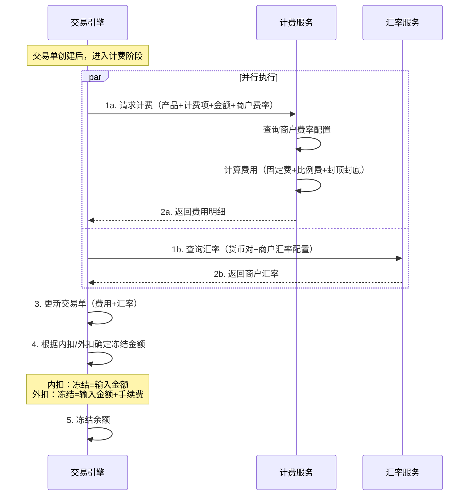

# 产品计费方案设计

## 文档概述

本文档详细描述了EX平台的产品计费体系，包括：

- 产品分类和计费项
- 计费模型（固定费/比例费/混合/阶梯）
- 费率配置层级（SP→TE→商户）
- 跨SP场景的内部结算
- 完整交易计费示例

**核心设计原则：**

- ✅ **一次操作=一笔费用**：商户每发起一次业务操作，只看到该产品的1笔手续费，不按内部技术环节拆分
- ✅ **按产品计费**：每个产品独立定义计费项，租户(TE)按产品为商户配费率
- ✅ **跨SP内部消化**：跨SP场景的中间户划拨成本由SP间内部结算，不对商户暴露
- ✅ **灵活计费**：支持固定费+比例费+混合+阶梯，支持封顶封底
- ✅ **最低报价保护**：SP可设定商户最低报价（Floor Price），租户(TE)不可突破
- ✅ **商户友好**：不暴露SP，统一费率展示

> **业界参考**：Wise、MoonPay、Stripe Connect 等主流平台均采用"一次业务操作=一笔费用"模式，内部多环节成本由平台消化，不拆分给终端用户。

---

## 目录

1. [产品分类与计费项](#1-产品分类与计费项)
2. [计费模型](#2-计费模型)
3. [费率配置层级](#3-费率配置层级)
4. [跨SP场景的计费与内部结算](#4-跨sp场景的计费与内部结算)
5. [完整交易计费示例](#5-完整交易计费示例)
6. [计费流程时序图](#6-计费流程时序图)
7. [内扣与外扣](#7-内扣与外扣)

---

## 1. 产品分类与计费项

### 1.1 产品与计费项总览

| # | 产品               | 计费项                    | 计费基准     | 费用归属SP   | 说明                    |
| - | ------------------ | ------------------------- | ------------ | ------------ | ----------------------- |
| 1 | **数币钱包** | 充币费（Deposit Fee）     | 充币金额     | BB           | 链上充币到BB钱包        |
| 1 | **数币钱包** | 提币费（Withdrawal Fee）  | 提币金额     | BB           | 从BB钱包链上提币        |
| 2 | **法币账户** | 同名转入费（Deposit Fee） | 转入金额     | 账户所属SP   | VA/银行同名转入         |
| 2 | **法币账户** | 提现费（Withdrawal Fee）  | 提现金额     | 账户所属SP   | 同名提现到外部银行      |
| 3 | **OnRamp**   | 承兑费（Exchange Fee）    | 输入法币金额 | BB（承兑方） | 法币→数币，1笔统一费用 |
| 4 | **OffRamp**  | 承兑费（Exchange Fee）    | 输入数币金额 | BB（承兑方） | 数币→法币，1笔统一费用 |
| 5 | **收款**     | 收款费（Collection Fee）  | 收款金额     | IPL          | 非同名VA收款            |
| 6 | **付款**     | 付款费（Payout Fee）      | 付款金额     | IPL          | 非同名法币付款          |

### 1.2 各产品详解

#### **产品1：数币钱包（Crypto Wallet）**

- **功能**：链上充币、链上提币、余额管理
- **开通规则**：开通任何数币相关产品时自动开通
- **SP**：BB
- **计费项**：
  - **充币费**：外部地址 → 商户BB USDT/USDC钱包
  - **提币费**：商户BB USDT/USDC钱包 → 外部地址

#### **产品2：法币账户（Fiat Account）**

- **功能**：同名转入（VA收款/银行入账）、同名提现
- **开通规则**：开通任何法币相关产品时自动开通
- **SP**：按账户归属——BB法币账户归BB，IPL法币账户归IPL
- **计费项**：
  - **同名转入费**：外部同名账户 → 商户法币账户（VA同名收款）
  - **提现费**：商户法币账户 → 外部同名银行账户

> **注意**：BB法币账户和IPL法币账户各自独立计费。租户(TE)需要分别为商户配置BB法币账户费率和IPL法币账户费率。

#### **产品3：OnRamp（法币→数币承兑）**

- **功能**：法币账户余额 → 承兑 → 数币钱包
- **SP**：BB（承兑方）
- **计费项**：
  - **承兑费**：1笔统一费用，无论单SP（A1）还是跨SP（A2）
- **跨SP说明**：A2场景涉及IPL→BB中间户划拨，该成本由BB与IPL内部结算，不对商户收费

#### **产品4：OffRamp（数币→法币承兑）**

- **功能**：数币钱包余额 → 承兑 → 法币账户
- **SP**：BB（承兑方）
- **计费项**：
  - **承兑费**：1笔统一费用，无论单SP（A1）还是跨SP（A2）
- **跨SP说明**：A2场景涉及BB→IPL中间户划拨，该成本由BB与IPL内部结算，不对商户收费

#### **产品5：收款（Collection）**

- **功能**：非同名收款（第三方付款人 → 商户账户）
- **SP**：IPL
- **计费项**：
  - **收款费**：按收款的因子计费（币种，转账方式（银行转账，三方机构账户），来款国家，银行，等，）

#### **产品6：付款（Payout）**

- **功能**：非同名付款（商户账户 → 外部收款人）
- **SP**：IPL
- **计费项**：
  - **付款费**：按付款的因子计费（供应商类型，付款国家，支付方式类型（tt/local/地址/本地钱包），费用承担方等）

---

## 2. 计费模型

### 2.1 支持的计费方式

| 方式                                     | 说明                                                                          | 示例                                        |
| ---------------------------------------- | ----------------------------------------------------------------------------- | ------------------------------------------- |
| **固定费（Fixed Fee）**            | 每笔固定金额                                                                  | 5 USD/笔                                    |
| **比例费（Percentage Fee）**       | 按交易金额百分比，支持封顶（Cap）和封底（Floor）                              | 0.5%，封底1 USD，封顶50 USD                 |
| **混合模式（Fixed + Percentage）** | 固定费 + 比例费相加                                                           | 2 USD + 0.3%                                |
| **阶梯定价（Tiered Pricing）**     | 计费周期：单笔/月累计/累计<br />计费对象：超额，全额<br />计费纬度：金额/数量 | 0~10万: 1.0%，10万~50万: 0.8%，50万+: 0.5% |

### 2.2 计费币种

- **比例费**：按交易币种计算（如OnRamp输入USD，则费用为USD）
- **固定费**：本期支持USD（后续扩展多币种）

---

## 3. 费率配置层级

### 3.1 四层费率结构

```
① SP成本价 (SP Cost Price)
   SP(Service Provider)提供给TE(Tenant/租户)的结算价格
        │
        ▼
② SP商户最低报价 (SP Merchant Floor Price) ⭐
   SP设定的商户最终费率下限，租户(TE)不可突破
        │
        ▼
③ 租户默认费率 (TE Default Price)
   租户(TE)为旗下商户设定的默认费率，不得低于②
        │
        ▼
④ 商户费率 (Merchant Price)
   租户(TE)为单个商户配置的费率，不得低于③，系统校验 ≥ ②
```

### 3.2 SP商户最低报价（Floor Price）

**定义**：SP针对每个产品/计费项设定的商户最终费率下限。租户(TE)给商户配置费率时，系统自动校验不得低于此值。

**为什么需要Floor Price？**

- SP与租户(TE)之间可能采用返点模式（SP按交易量给租户返佣金）
- 返点模式下SP给租户的"成本价"可能很低甚至为0
- 如果没有Floor Price，租户可能给商户配置极低费率来抢客户
- Floor Price确保商户最终费率不会低于SP的定价底线

**系统校验规则：**

```
租户(TE)配置商户费率时：
  if 商户费率 < SP商户最低报价:
      ❌ 拒绝保存，提示"费率不得低于最低报价 X%"
  else:
      ✅ 保存成功
```

### 3.3 SP与租户(TE)的合作模式

| 合作模式           | SP成本价       | SP商户最低报价    | 租户利润来源                 | 说明                                |
| ------------------ | -------------- | ----------------- | ---------------------------- | ----------------------------------- |
| **加价模式** | SP给租户底价   | SP设定Floor Price | 租户在底价上加价，差价即利润 | 租户报价 ≥ Floor Price             |
| **返点模式** | SP给租户标准价 | SP设定Floor Price | SP按交易量返点/佣金给租户    | 租户报价 ≥ Floor Price，SP额外返点 |

> **关键约束**：无论哪种合作模式，租户(TE)给商户配置的费率都必须 ≥ SP商户最低报价。

#### 3.3.1 租户返点计算公式

上述加价模式和返点模式可以用统一的返点公式体系来表达。公式由三个要素组成：

```
租户返点 = f(返点对象, 返点因子, 返点规则)

其中：
  返点对象：谁获得返点 → 租户(TE)
  返点因子：基于什么计算返点 → 交易金额 / 手续费金额 / 费率差 / 笔数
  返点规则：用什么公式计算 → 固定模板，见下方
```

**返点三要素定义：**

| 要素               | 说明               | 取值                                                                        |
| ------------------ | ------------------ | --------------------------------------------------------------------------- |
| **返点对象** | 获得返点的主体     | 租户(TE)                                                                    |
| **返点因子** | 计算返点的基准数据 | 交易金额(Volume)、商户手续费(Fee)、比例费率差(Rate Spread)、交易笔数(Count) |
| **返点规则** | 计算公式模板       | 见下方规则模板                                                              |

---

**规则模板1：费率差返点（Markup Rebate）**

```
返点因子：比例费率差（商户报价 - SP底价）
返点规则：租户返点 = 交易金额 × (商户比例费率 - SP底价比例费率)

公式：
  租户返点 = Volume × (MerchantRate - SPCostRate)
  SP收益   = Volume × SPCostRate

示例：
  交易金额 = 10,000 USD
  SP底价比例费率 = 0.5%，商户比例费率 = 1.2%
  租户返点 = 10,000 × (1.2% - 0.5%) = 70 USD
  SP收益   = 10,000 × 0.5% = 50 USD
```

- **本质**：就是加价模式——租户在SP底价上加价，差价全归租户
- **业界参考**：Stripe Connect（平台在Stripe底层费率上加收application fee）、Adyen for Platforms
- **特点**：租户定价自由度最高，激励租户做大交易量和优化定价

---

**规则模板2：交易金额固定比例返点（Volume-Based Rebate）**

```
返点因子：交易金额
返点规则：租户返点 = 交易金额 × 固定返点比例

公式：
  租户返点 = Volume × RebateRate
  SP收益   = MerchantFee - 租户返点

示例：
  交易金额 = 10,000 USD，商户费率 = 1.0%，返点比例 = 0.3%
  商户手续费 = 10,000 × 1.0% = 100 USD
  租户返点 = 10,000 × 0.3% = 30 USD
  SP收益   = 100 - 30 = 70 USD
```

- **本质**：租户收益与交易规模直接挂钩，不受商户费率高低影响
- **业界参考**：支付机构代理商模式（按交易流水的万分之N返佣）
- **特点**：租户收益稳定可预期

---

**规则模板3：手续费固定比例返点（Fee-Based Rebate）**

```
返点因子：商户手续费
返点规则：租户返点 = 商户手续费 × 固定返点百分比

公式：
  租户返点 = MerchantFee × RebatePercent
  SP收益   = MerchantFee × (1 - RebatePercent)

示例：
  交易金额 = 10,000 USD，商户费率 = 1.0%，返点百分比 = 30%
  商户手续费 = 10,000 × 1.0% = 100 USD
  租户返点 = 100 × 30% = 30 USD
  SP收益   = 100 × 70% = 70 USD
```

- **本质**：SP与租户按手续费收入固定比例分成
- **业界参考**：Apple App Store（30/70分成）、Google Play、各类SaaS分销
- **特点**：SP和租户利益绑定，费率越高双方收益越高

---

**规则模板4：阶梯返点（Tiered Rebate）**

```
返点因子：商户手续费（或交易金额）
返点规则：根据租户月累计交易量，返点比例逐级递增

公式：
  租户返点 = MerchantFee × TieredRate(MonthlyVolume)

阶梯示例：
  月交易量 0 ~ 100万 USD：   返点 = 手续费 × 20%
  月交易量 100万 ~ 500万：   返点 = 手续费 × 30%
  月交易量 500万+：          返点 = 手续费 × 40%

计算示例：
  租户本月交易量 = 300万，商户手续费合计 = 30,000 USD
  租户返点 = 30,000 × 30% = 9,000 USD
```

- **本质**：量越大返点越多，激励租户持续增长
- **业界参考**：Visa/Mastercard对收单机构的阶梯返点、MoonPay合作伙伴计划
- **特点**：强激励效果，适合长期合作

---

**规则模板5：固定金额返点（Fixed Rebate per Transaction）**

```
返点因子：交易笔数
返点规则：租户返点 = 每笔固定金额

公式：
  租户返点 = FixedAmount × TransactionCount（按笔）
  SP收益   = MerchantFee - FixedAmount（按笔）

示例：
  商户手续费 = 100 USD，固定返点 = 2 USD/笔
  租户返点 = 2 USD
  SP收益   = 98 USD
```

- **本质**：按笔返佣，适合小额高频场景
- **业界参考**：POS收单代理商按笔返佣
- **特点**：简单透明，租户收益与笔数挂钩

---

**返点规则对比总览：**

| 规则模板         | 返点因子        | 租户返点公式                  | 适合场景          | 复杂度 |
| ---------------- | --------------- | ----------------------------- | ----------------- | ------ |
| 费率差返点       | 比例费率差      | Volume × (商户费率 - SP底价) | 租户有定价能力    | 低     |
| 交易金额固定比例 | 交易金额        | Volume × 固定%               | 代理商/渠道商     | 低     |
| 手续费固定比例   | 手续费          | Fee × 固定%                  | SaaS分销/平台分成 | 低     |
| 阶梯返点         | 手续费+月交易量 | Fee × 阶梯%(MonthlyVolume)   | 激励增长          | 中     |
| 固定金额返点     | 交易笔数        | N USD/笔                      | 小额高频          | 低     |

> **说明**：规则模板1（费率差返点）本质上就是加价模式的公式化表达；规则模板2~5覆盖了各种返点模式。SP在配置与租户的合作协议时，选择其中一种规则模板并填入参数即可。
>
> **MVP建议**：优先支持**模板1（费率差返点）**和**模板3（手续费固定比例返点）**，覆盖最常见的合作场景。其余模板按需扩展。

### 3.4 费率配置示例

| 产品          | 计费项     | SP成本价(给租户) | SP返点(给租户) | SP商户最低报价 | 租户可给商户报价范围 |
| ------------- | ---------- | ---------------- | -------------- | -------------- | -------------------- |
| 数币钱包      | 充币费     | 0.1%             | 0.05%          | 0.3%           | ≥ 0.3%              |
| 数币钱包      | 提币费     | 5 USDT/笔        | 1 USDT/笔      | 8 USDT/笔      | ≥ 8 USDT/笔         |
| OnRamp        | 承兑费     | 0.5%             | 0.2%           | 1.0%           | ≥ 1.0%              |
| OffRamp       | 承兑费     | 0.5%             | 0.2%           | 1.0%           | ≥ 1.0%              |
| 法币账户(IPL) | 同名转入费 | 0.2%             | -              | 0.4%           | ≥ 0.4%              |
| 法币账户(IPL) | 提现费     | 0.3%             | -              | 0.5%           | ≥ 0.5%              |
| 法币账户(BB)  | 同名转入费 | 0.1%             | -              | 0.3%           | ≥ 0.3%              |
| 法币账户(BB)  | 提现费     | 0.2%             | -              | 0.4%           | ≥ 0.4%              |
| 收款(IPL)     | 收款费     | 0.3%             | -              | 0.5%           | ≥ 0.5%              |
| 付款(IPL)     | 付款费     | 3 USD/笔         | -              | 5 USD/笔       | ≥ 5 USD/笔          |

---

## 4. 跨SP场景的计费与内部结算

### 4.1 核心原则

```
商户视角：1次业务操作 = 该产品的1笔手续费
内部视角：跨SP中间户划拨成本 = BB与IPL之间内部结算，不对商户收费
```

### 4.2 各场景商户费用明细

#### **OnRamp（法币→数币）**

| 场景                              | 交易单                                                | 商户付费                                       | 跨SP内部结算                                 |
| --------------------------------- | ----------------------------------------------------- | ---------------------------------------------- | -------------------------------------------- |
| **A1（纯BB）**              | T001: BB承兑                                          | OnRamp承兑费 ×1                               | 无                                           |
| **A2（IPL+BB）**            | T001: IPL同名提现 → T002: BB承兑                     | OnRamp承兑费 ×1                               | T001的IPL→BB中间户划拨成本，BB与IPL内部结算 |
| **B1（BB VA收款+承兑）**    | T001: BB VA收款 → T002: BB承兑                       | 法币账户(BB)同名转入费 ×1 + OnRamp承兑费 ×1  | 无                                           |
| **B2（IPL VA收款+BB承兑）** | T001: IPL VA收款 → T002: IPL同名提现 → T003: BB承兑 | 法币账户(IPL)同名转入费 ×1 + OnRamp承兑费 ×1 | T002的IPL→BB中间户划拨成本，BB与IPL内部结算 |

#### **OffRamp（数币→法币）**

| 场景                           | 交易单                                             | 商户付费                       | 跨SP内部结算                                 |
| ------------------------------ | -------------------------------------------------- | ------------------------------ | -------------------------------------------- |
| **A1（纯BB）**           | T001: BB承兑                                       | OffRamp承兑费 ×1              | 无                                           |
| **A2（BB+IPL）**         | T001: BB承兑 → T002: IPL同名收款                  | OffRamp承兑费 ×1              | T002的BB→IPL中间户划拨成本，BB与IPL内部结算 |
| **B1（BB承兑+BB付款）**  | T001: BB承兑 → T002: BB付款                       | OffRamp承兑费 ×1 + 付款费 ×1 | 无                                           |
| **B2（BB承兑+IPL付款）** | T001: BB承兑 → T002: IPL同名收款 → T003: IPL付款 | OffRamp承兑费 ×1 + 付款费 ×1 | T002的BB→IPL中间户划拨成本，BB与IPL内部结算 |

> **关键**：B1/B2场景涉及2个产品（承兑+付款），所以商户看到2笔费用，但每笔费用都对应一个独立产品，不是同一产品拆分收费。

### 4.3 跨SP内部结算机制

跨SP场景（A2、B2）中，中间户划拨是承兑链路的内部步骤，不是商户主动发起的操作。该成本由BB与IPL通过内部协议结算：

```
BB与IPL内部结算协议：
  ├── 结算周期：按月/按周
  ├── 结算内容：中间户划拨笔数 × 单笔成本
  └── 结算方式：从BB-IPL中间户余额中扣除，或定期对账清算

商户完全不感知此结算过程。
```

**为什么不对商户收取中间户划拨费？**

1. **商户体验**：商户发起的是"承兑"操作，不关心底层走了几个SP
2. **业界惯例**：Wise、MoonPay等平台均将内部路由成本包含在统一费用中
3. **定价简洁**：租户(TE)只需为商户配1个承兑费率，无需理解跨SP架构
4. **竞争力**：避免跨SP场景比单SP场景贵，导致商户感知到SP差异

---

## 5. 完整交易计费示例

### 5.1 OnRamp A1（纯BB，商户输入1000 USD）

```
商户费率：OnRamp承兑费 = 1.0%
汇率：1 USDT = 1.001 USD

计费：
  承兑费 = 1000 × 1.0% = 10 USD

内扣模式：
  冻结 = 1000 USD
  扣除承兑费 = 10 USD
  实际承兑金额 = 990 USD
  到账 = 990 / 1.001 = 989.01 USDT

外扣模式：
  冻结 = 1000 + 10 = 1010 USD
  实际承兑金额 = 1000 USD
  到账 = 1000 / 1.001 = 999.00 USDT
  另扣手续费 = 10 USD
```

### 5.2 OnRamp A2（跨SP，商户输入1000 USD）

```
商户费率：OnRamp承兑费 = 1.0%
汇率：1 USDT = 1.001 USD

商户付费：
  承兑费 = 1000 × 1.0% = 10 USD（与A1完全一致）

内部结算（商户不可见）：
  T001 IPL→BB中间户划拨：BB与IPL按协议结算（如0.05%/笔）
  T002 BB承兑：BB收取承兑费

商户到账：与A1一致（内扣/外扣逻辑相同）
```

### 5.3 OnRamp B2（IPL VA收款+BB承兑，收到1000 USD）

```
商户费率：
  法币账户(IPL)同名转入费 = 0.5%
  OnRamp承兑费 = 1.0%
汇率：1 USDT = 1.001 USD

计费（2笔，分属2个产品）：
  ① 同名转入费 = 1000 × 0.5% = 5 USD（法币账户产品）
  ② 承兑费 = (1000 - 5) × 1.0% = 9.95 USD（OnRamp产品，内扣模式下基于扣除转入费后的金额）

VA收款固定内扣：
  T001 IPL VA收款：到账 = 1000 - 5 = 995 USD
  T002 IPL→BB中间户划拨（内部结算，不收费）
  T003 BB承兑：995 - 9.95 = 985.05 USD → 984.07 USDT

内部结算（商户不可见）：
  T002中间户划拨成本：BB与IPL按协议结算
```

### 5.4 OffRamp B2（BB承兑+IPL付款，商户输入500 USDT）

```
商户费率：
  OffRamp承兑费 = 1.0%
  付款费 = 5 USD/笔
汇率：1 USDT = 0.999 USD

计费（2笔，分属2个产品）：
  ① 承兑费 = 500 × 1.0% = 5 USDT（OffRamp产品）
  ② 付款费 = 5 USD/笔（付款产品）

内扣模式：
  冻结 = 500 USDT
  T001 BB承兑：(500 - 5) × 0.999 = 494.505 USD
  T002 BB→IPL中间户划拨（内部结算，不收费）
  T003 IPL付款：494.505 - 5 = 489.505 USD → 收款人到账

外扣模式：
  冻结 = 500 + 5 = 505 USDT
  T001 BB承兑：500 × 0.999 = 499.50 USD
  T002 BB→IPL中间户划拨（内部结算，不收费）
  T003 IPL付款：499.50 - 5 = 494.50 USD → 收款人到账
```

---

## 6. 计费流程时序图



**计费服务计算逻辑：**

```
输入：产品ID、计费项、交易金额、商户ID
处理：
  1. 查询商户费率（商户级 > 租户默认级）
  2. 确定计费方式（固定/比例/混合/阶梯）
  3. 计算费用：
     - 固定费部分
     - 比例费部分 = 交易金额 × 费率
     - 封底检查：if 比例费 < Floor then 比例费 = Floor
     - 封顶检查：if 比例费 > Cap then 比例费 = Cap
     - 总费用 = 固定费 + 比例费
  4. 返回费用明细
输出：总费用、固定费部分、比例费部分、适用费率
```

---

## 7. 内扣与外扣

### 7.1 定义

| 模式           | 冻结金额                 | 商户实际到账                      | 适用场景     |
| -------------- | ------------------------ | --------------------------------- | ------------ |
| **内扣** | 冻结 = 输入金额          | 到账 = (输入金额 - 手续费) / 汇率 | 所有产品可配 |
| **外扣** | 冻结 = 输入金额 + 手续费 | 到账 = 输入金额 / 汇率            | 所有产品可配 |

### 7.2 产品级配置

| 产品                   | 内扣/外扣          | 说明                                           |
| ---------------------- | ------------------ | ---------------------------------------------- |
| OnRamp A1/A2           | 产品级可配置       | 租户(TE)为商户选择内扣或外扣                   |
| OffRamp A1/A2/B1/B2    | 产品级可配置       | 租户(TE)为商户选择内扣或外扣                   |
| OnRamp B1/B2（VA收款） | **固定内扣** | VA收款金额由外部汇款人决定，只能从到账金额中扣 |
| 法币账户同名转入       | **固定内扣** | 同VA收款，金额由外部决定                       |
| 数币钱包充币           | **固定内扣** | 链上充币金额由外部决定                         |
| 付款                   | 产品级可配置       | 从付款金额中扣或额外扣                         |

### 7.3 先计费后冻结

无论内扣还是外扣，系统都遵循"先计费后冻结"原则：

```
1. 创建交易单
2. 计费+汇率（并行）→ 确定手续费金额
3. 根据内扣/外扣模式确定冻结金额
4. 冻结余额
5. 风控检查
6. 确认扣款+入账
```

> 详见 `onramp-complete.md` 和 `offramp-complete.md` 中各场景的时序图。

---

*最后更新：2026-02-22*
*文档版本：v2.1 — 术语修正TP→TE(租户)；新增租户返点计算公式（返点对象/返点因子/返点规则三要素，5种规则模板）*
